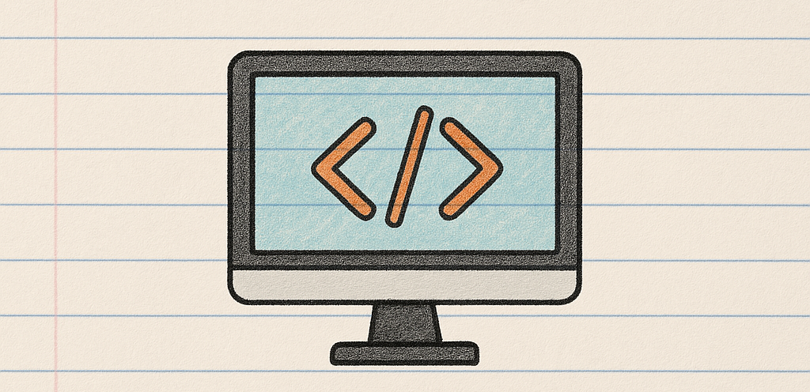
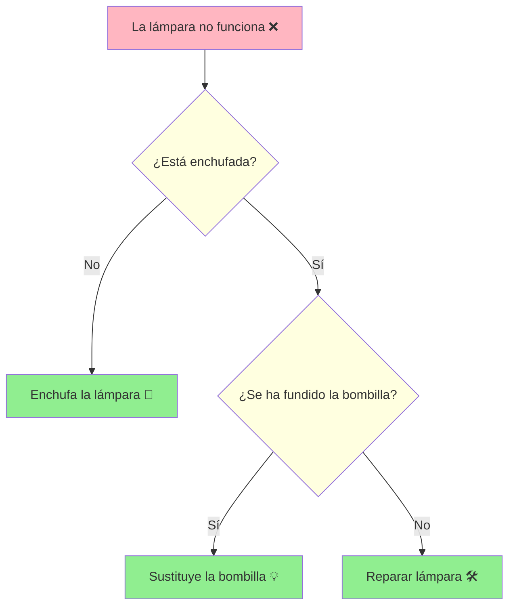

# UT1.1 Estructura básica de un programa informático



## 📋 Índice de contenidos

1. [Introducción a la programación](#1-introducción-a-la-programación)
2. [Algoritmos y programas](#2-algoritmos-y-programas)
3. [Ejemplo: robot de cocina](#3-ejemplo-robot-de-cocina)
4. [El trabajo del programador](#4-el-trabajo-del-programador)
5. [Órdenes que acepta un ordenador](#5-órdenes-que-acepta-un-ordenador)
6. [Símil: ordenador vs pizzería](#6-símil-ordenador-vs-pizzería)
7. [Ejemplo en lenguaje natural](#7-ejemplo-en-lenguaje-natural)
8. [Diseño de algoritmos](#8-diseño-de-algoritmos)
9. [Lenguajes de programación](#9-lenguajes-de-programación)
   1. [Compilados vs interpretados](#91-compilados-vs-interpretados)
   2. [Bajo nivel vs alto nivel](#92-bajo-nivel-vs-alto-nivel)
10. [Ejemplos de programas](#10-ejemplos-de-programas)
11. [Errores de compilación](#11-errores-de-compilación)
12. [Lenguaje natural vs lenguaje de programación](#12-lenguaje-natural-vs-lenguaje-de-programación)
13. [Entornos integrados de desarrollo (IDE)](#13-entornos-integrados-de-desarrollo-ide)
14. [Primer programa en Java](#14-primer-programa-en-java)
15. [Compilación y ejecución](#15-compilación-y-ejecución)
16. [Prácticas propuestas](#16-prácticas-propuestas)

---

## 1. Introducción a la programación

La programación consiste en **especificar, de forma precisa y sin ambigüedades, la secuencia de pasos que lleva a la solución de un problema**. En otras palabras, traducimos ideas o soluciones a instrucciones que el ordenador puede ejecutar. Hoy en día casi todas las actividades cotidianas están mediadas por *software*: redes sociales, banca en línea, domótica, automoción, etc. :computer:

> \[!NOTE] 
> Programar no siempre significa *escribir código*. Diseñar una receta de cocina o planificar una ruta también implica elaborar un algoritmo.

---

## 2. Algoritmos y programas

Un **algoritmo** es una secuencia **finita**, **ordenada** y **bien definida** (sin ambigüedades) de pasos que transforman unas **entradas** en unas **salidas**.

Cuando esos pasos se expresan en un **lenguaje de programación** obtenemos un **programa**, capaz de ser ejecutado por un ordenador. :arrow_forward:


La siguiente tabla resume los conceptos básicos de Entrada-Proceso-Salida (E/S) en un algoritmo:

| Concepto                | Definición breve              |
| ----------------------- | ----------------------------- |
| **Entrada** (*Input*)   | Datos que recibe el algoritmo |
| **Proceso** (*Process*) | Conjunto de instrucciones     |
| **Salida** (*Output*)   | Resultado producido           |


La siguiente imagen ilustra este flujo: la entrada que recibe el algoritmo, el proceso que aplica y la salida que produce.


---

## 3. Ejemplo: robot de cocina

Una receta de cocina puede expresarse como un algoritmo. A continuación se muestra en pseudocódigo la elaboración de una crema de maíz:

```text
Receta: Crema de maíz
1. Verificar que hay harina de maíz y mantequilla
2. Remover 1 min ↗ velocidad 1 → 5
3. Verificar que hay leche y sal
4. Remover 30 s a velocidad 7
5. Remover 10 min a 90 °C, velocidad 3
6. Detener robot. ¡Listo!
```

Este algoritmo, expresado en pseudocódigo, puede convertirse en instrucciones para un robot de cocina. :shallow_pan_of_food:

---

## 4. El trabajo del programador

La programación requiere tomar decisiones importantes. El programador debe decidir:

* **Qué órdenes** ejecutar.
* **En qué orden** ejecutarlas.
* **Sobre qué datos** operan.

El éxito depende tanto de la **eficacia** (*que funcione*) como de la **eficiencia** (*que aproveche bien los recursos*).

> [!WARNING]
> Un ordenador *no* lo hace todo por sí solo; necesitamos comprender el problema y traducirlo adecuadamente.

---

## 5. Órdenes que acepta un ordenador

El conjunto de operaciones que un ordenador puede ejecutar está limitado por su arquitectura de hardware. En general, las instrucciones se agrupan en tres bloques principales:

| Componente  | Función principal                 |
| ----------- | --------------------------------- |
| **CPU**     | Procesa y transforma datos        |
| **Memoria** | Almacena datos y programas        |
| **E/S**     | Intercambia datos con el exterior |

La **CPU** se encarga de procesar y transformar los datos. La **Memoria** almacena tanto los datos como los programas en ejecución. Los dispositivos de **E/S** (entrada/salida) permiten la interacción con el usuario u otros dispositivos externos.

---

## 6. Símil: ordenador vs pizzería

Un símil clásico compara el funcionamiento de un ordenador con el de una pizzería: cada componente tiene su equivalente. La tabla a continuación resume la comparación:

| Pizzería                                                        | Ordenador                                                  |
| --------------------------------------------------------------- | ---------------------------------------------------------- |
| 👩‍🍳 **Cocinero** manipula ingredientes                        | 🖥️ **CPU** procesa datos                                  |
| 🧊 **Frigorífico** guarda ingredientes                          | 💾 **Memoria** guarda datos                                |
| 📞/🛵 **Teléfono o repartidor** recibe pedidos o entrega pizzas | ⌨️/🖥️ **Dispositivos E/S** reciben y muestran información |


---

## 7. Ejemplo en lenguaje natural

A continuación se describe, paso a paso, un algoritmo para **multiplicar dos números** leídos por teclado:

| # | Orden                         | Componente que lo realiza |
| - | ----------------------------- | ------------------------- |
| 1 | Leer primer número            | E/S (Teclado)             |
| 2 | Guardar el número             | Memoria                   |
| 3 | Leer segundo número           | E/S (Teclado)             |
| 4 | Guardar el número             | Memoria                   |
| 5 | Recuperar ambos y multiplicar | CPU                       |
| 6 | Guardar resultado             | Memoria                   |
| 7 | Mostrar resultado             | E/S (Pantalla)            |

---

## 8. Diseño de algoritmos

La fase de **diseño de algoritmos** implica planificar la lógica paso a paso. Podemos usar distintas herramientas para expresarlos: pseudocódigo (instrucciones en texto estructurado) o diagramas de flujo (representación gráfica de la lógica). A continuación, veremos un ejemplo en pseudocódigo y su diagrama de flujo equivalente.

### 8.1 Pseudocódigo

```pseudocode
INICIO
  escribir "Introduce el primer entero: "
  leer a
  escribir "Introduce el segundo entero: "
  leer b
  c ← a + b
  escribir "La suma es ", c
FIN
```

### 8.2 Diagrama de flujo



> [!TIP] 
> Los diagramas de flujo ayudan a *visualizar* la lógica antes de escribir código.

---

## 9. Lenguajes de programación

Un **lenguaje de programación** permite traducir algoritmos a instrucciones que entiende una máquina.  Existen cientos, cada uno con su sintaxis y filosofía.

### 9.1 Compilados vs interpretados

La siguiente tabla compara las características clave entre lenguajes compilados e interpretados:


| Característica           | **Compilado**                                         | **Interpretado**                              |
| ------------------------ | ----------------------------------------------------- | --------------------------------------------- |
| **Proceso**              | Todo el código fuente se traduce a binario de una vez | Se traduce línea a línea durante la ejecución |
| **Velocidad**            | Muy alta ⏩                                            | Media/Baja ⏳                                  |
| **Portabilidad**         | Baja (un ejecutable por plataforma)                   | Alta (solo necesitas el intérprete)           |
| **Detección de errores** | En tiempo de compilación                              | En tiempo de ejecución                        |
| **Ejemplos**             | C, C++, Rust, Go                                      | Python, Ruby, JavaScript                      |

> [!NOTE]
> *Java* y *C#* siguen un **enfoque mixto**: primero compilan a *bytecode* intermedio y luego lo interpretan la JVM o CLR.

#### Java — un caso particular

```text
> javac -version   # comprueba versión del compilador
> java  -version   # comprueba versión del intérprete (JRE)
```

* El **JDK** incluye herramientas de desarrollo y `javac`.
* El **JRE** contiene la JVM y librerías para ejecutar aplicaciones.

### 9.2 Bajo nivel vs alto nivel

Los lenguajes de **bajo nivel** están cercanos al hardware; cada instrucción equivale directamente a una operación de la CPU (o varias según subimos de nivel). Los de **alto nivel** tienen sintaxis más parecidas al lenguaje humano y son más portables. La siguiente tabla ilustra las diferencias:

| Nivel | Descripción | Ejemplo |
| ----- | ----------- | ------- |
| **Bajo nivel** | Cercano al hardware; instrucción ≈ operación de CPU | Ensamblador (ASM) |
| **Alto nivel** | Sintaxis próxima al lenguaje humano; portables | Python, Java, Kotlin |

```asm
; Ejemplo en ASM x86 (bajo nivel)
MOV AX, 5
ADD AX, 3
```

```java
// Ejemplo en alto nivel
int resultado = 5 + 3;
```

---

## 10. Ejemplos de programas

A continuación se muestran ejemplos sencillos de programas que suman dos números:


### 10.1 Python – Suma de dos enteros

Este sencillo programa solicita dos números al usuario, los convierte a enteros y muestra la suma.

```python
# suma.py
enter1 = input("Escribe el primer entero: ")
enter2 = input("Escribe el segundo entero: ")
resultado = int(enter1) + int(enter2)
print("La suma es:", resultado)
```

### 10.2 Java – Suma de dos enteros

El siguiente programa en Java realiza la misma tarea:

```java
import java.util.Scanner;

public class Suma {
    public static void main(String[] args) {
        Scanner lector = new Scanner(System.in);
        int enter1, enter2, resultado;

        System.out.print("Introduce el primer valor: ");
        enter1 = lector.nextInt();
        System.out.print("Introduce el segundo valor: ");
        enter2 = lector.nextInt();

        resultado = enter1 + enter2;
        System.out.println("La suma es: " + resultado);
        lector.close();
    }
}
```

---

## 11. Errores de compilación

Un **error de sintaxis** impide que el compilador genere el ejecutable. Por ejemplo, si faltan letras en un identificador estándar:

```java
System.ou.println("Hola"); // ⛔ faltan letras en "out"
```

> [!WARNING]
> Un programa que **compila** no garantiza que funcione correctamente; podría fallar en tiempo de ejecución si la lógica es incorrecta.

---

## 12. Lenguaje natural vs lenguaje de programación

* **Sintaxis**: gramática y reglas formales del lenguaje.
* **Semántica**: *significado* de lo que escribimos.

En un lenguaje natural, podemos tener oraciones sintácticamente correctas pero con significado extraño, o viceversa. Por ejemplo:

> «*Quiero ich helado un*» — Incomprensible porque viola la sintaxis.  
> «*El helado conduce un folio*» — Sintaxis correcta pero sin sentido lógico.

Los lenguajes de programación reaccionan igual: pueden rechazar sintaxis inválida o ejecutar código cuyo resultado sea absurdo si la lógica está mal planteada.

---

## 13. Entornos integrados de desarrollo (IDE)

Un **IDE** reúne editor, compilador/intérprete y depurador en una sola aplicación. Algunos IDE populares son:

| IDE | Plataforma |
| --- | ---------- |
| Eclipse | Multiplataforma |
| IntelliJ IDEA | Multiplataforma |
| NetBeans | Multiplataforma |


> [!TIP] 
> Visual Studio Code, aun siendo un editor, puede ampliarse con extensiones para actuar como IDE completo.

---

## 14. Primer programa en Java

El siguiente programa de Java imprime por pantalla “Hola, món!”:

```java
// HolaMon.java
public class HolaMon {
    public static void main(String[] args) {
        System.out.println("Hola, món!");
    }
}
```

| Paso     | Comando                                       |
| -------- | --------------------------------------------- |
| Compilar | `javac HolaMon.java` → genera `HolaMon.class` |
| Ejecutar | `java HolaMon`                                |

### 14.1 Estructura básica

```java
// Comentario de una línea
public class NombreClase {
    public static void main(String[] args) {
        // punto de entrada del programa
    }
}
```

---

## 15. Compilación y ejecución

* `javac` → traduce el código fuente a **bytecode** `.class`.
* `java`  → interpreta el bytecode en la **JVM**.

La compilación a bytecode permite que un mismo `.class` funcione en diferentes sistemas operativos si tienen la JVM adecuada. Por ejemplo, con un archivo `Suma.class` podemos copiarlo a otro ordenador (Windows, Linux, macOS) y ejecutarlo sin recompilar.

```bash
# Comprobar versiones
java  -version
javac -version
```

### 15.1 Ejemplo multiplataforma

```bash
$ ls Suma.class
Suma.class
$ java Suma
Introduce el primer valor: 3
Introduce el segundo valor: 9
La suma es: 12
```

> [!NOTE] 
> **Conclusión**: puedes copiar `Suma.class` a otro ordenador (Windows, Linux, macOS) y funcionará si hay JRE instalado.

---

## 16. Prácticas propuestas

### Práctica 0: Instalación JDK y NetBeans


#### Objetivo
En esta práctica guiada, aprenderás a instalar el JDK (Java Development Kit) y el entorno de desarrollo NetBeans en tu ordenador. Estos son los elementos esenciales para comenzar a programar en Java.

<details>
<summary>Pasos a seguir</summary>

#### 1. Descarga e instalación del JDK

1. **Accede al sitio oficial de Oracle**:
   - Ve a [Oracle JDK Download](https://www.oracle.com/java/technologies/javase-downloads.html)
   - Asegúrate de descargar la versión más reciente compatible con tu sistema operativo (Windows, macOS o Linux).

2. **Ejecuta el instalador**:
   - Haz doble clic en el archivo descargado.
   - Sigue las instrucciones del asistente de instalación.
   - Acepta los términos de licencia y selecciona la ubicación de instalación (puedes dejar la predeterminada).

3. **Configura las variables de entorno** (Windows):
   - Abre el Panel de Control > Sistema > Configuración avanzada del sistema > Variables de entorno.
   - En "Variables del sistema", busca `Path` y haz clic en "Editar".
   - Agrega la ruta a la carpeta `bin` del JDK (ejemplo: `C:\Program Files\Java\jdk-14.0.2\bin`).
   - Crea una nueva variable llamada `JAVA_HOME` con la ruta principal del JDK (ejemplo: `C:\Program Files\Java\jdk-14.0.2`).

4. **Verifica la instalación**:
   - Abre una terminal o consola.
   - Ejecuta los siguientes comandos para comprobar que todo está correcto:

     ```bash
     java -version
     javac -version
     ```

   - Deberías ver la versión de Java y del compilador instalados.

#### 2. Instalación de NetBeans

1. **Descarga NetBeans**:
   - Ve a [NetBeans Download](https://netbeans.apache.org/download/index.html)
   - Descarga la versión "Java SE".

2. **Ejecuta el instalador**:
   - Haz doble clic en el archivo descargado.
   - Sigue las instrucciones del asistente.
   - Asegúrate de que el instalador detecta automáticamente el JDK previamente instalado.

3. **Configuración inicial**:
   - Al abrir NetBeans por primera vez, selecciona tu diseño preferido (puedes dejar el predeterminado).
   - Verifica que el JDK esté correctamente configurado en `Herramientas > Opciones > Java`.

#### 3. Configuración de UTF-8 (Opcional para Windows)

Si necesitas trabajar con caracteres especiales (como acentos o ñ):

1. **Método 1** (recomendado):
   - Sigue las instrucciones del mensaje: [Alternativa para activar UTF8 en Windows](https://stackoverflow.com/questions/56419639/what-does-beta-use-unicode-utf-8-for-worldwide-language-support-actually-do#answer-68066008)

2. **Método 2** (alternativo):
   - En NetBeans, ve a `Herramientas > Opciones > Misceláneo > Terminal`
   - Marca la opción "Usar codificación UTF-8 para salida de la consola"
   

#### 4. Verificación final

1. **Crea un proyecto de prueba**:
   - Abre NetBeans.
   - Selecciona `Archivo > Nuevo Proyecto > Java con Ant > Aplicación Java`.
   - Dale un nombre como "PruebaInstalacion" y finaliza.

2. **Ejecuta el proyecto**:
   - NetBeans creará automáticamente una clase Main con un "Hello World".
   - Haz clic en el botón verde de "Ejecutar" para comprobar que todo funciona.

#### Recursos adicionales

- [Vídeo guía: Instalación JDK y NetBeans](https://www.youtube.com/watch?v=Fx10QavqEqA)
- [Documentación oficial de Java](https://docs.oracle.com/en/java/)
- [Foro de NetBeans](https://netbeans.apache.org/community/index.html)

#### Solución de problemas

Si encuentras algún error:
1. **JDK no reconocido**: Verifica las variables de entorno.
2. **Problemas con NetBeans**: Reinstala asegurándote de tener el JDK instalado primero.
3. **Errores de caracteres**: Activa UTF-8 como se indica arriba.

</details>

### Práctica 1

Copia y ejecuta **HolaMon.java** desde consola para mostrar «Hola Món!» 

<details>
<summary>💡 Solución práctica 1</summary>

```java
public class HolaMon {
    public static void main(String[] args) {
        System.out.println("Hola Món!");
    }
}
```

</details>

### Práctica 2

Modifica el programa para que muestre «Adeu Món!» 

<details>
<summary>💡 Solución práctica 2</summary>

```java
public class AdeuMon {
    public static void main(String[] args) {
        System.out.println("Adeu Món!");
    }
}
```

</details>

---

<p align="center">📚 <em>Fin del apartado UT1.1 - Estructura básica de un programa informático</em></p>
