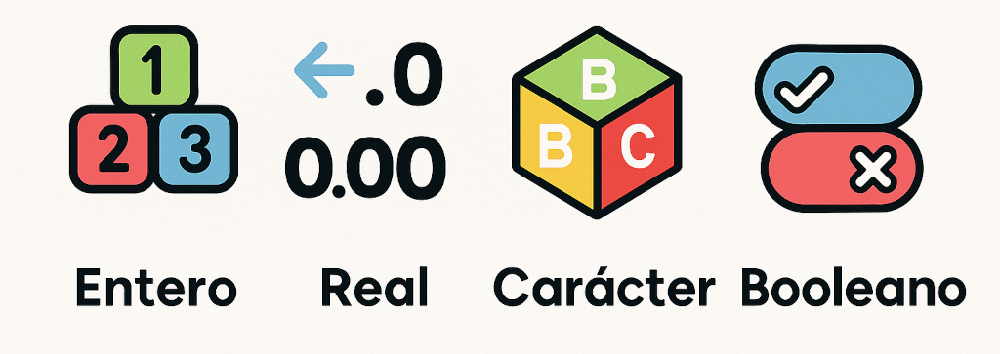
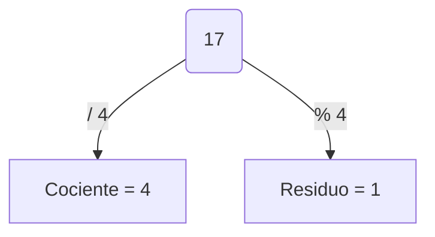

# UT1.2 Tipos de datos simples o primitivos



## 📋 Índice de contenidos

1. [Manipulación de datos](#1-manipulación-de-datos)
2. [Tipos de dato](#2-tipos-de-dato)
3. [Literal](#3-literal-)
4. [Tipos estándar](#4-tipos-estándar)
   1. [Tipo entero](#41-tipo-entero)
   2. [Tipo real](#42-tipo-real)
   3. [Tipo booleano](#43-tipo-booleano)
   4. [Tipo carácter](#44-tipo-carácter)
5. [Tabla de tipos en Java](#5-tabla-de-tipos-en-java)
6. [Operaciones con literales](#6-operaciones-con-literales)
   1. [Operadores enteros](#61-operadores-enteros)
   2. [División entera y módulo](#62-división-entera-y-módulo)
   3. [Operadores relacionales](#63-operadores-relacionales)
   4. [Operaciones con reales](#64-operaciones-con-reales)
   5. [Operaciones con caracteres](#65-operaciones-con-caracteres)
   6. [Operaciones booleanas](#66-operaciones-booleanas)
7. [Construcción de expresiones](#7-construcción-de-expresiones)
8. [Desbordamiento y precisión](#8-desbordamiento-y-precisión)
9. [Prácticas propuestas](#9-prácticas-propuestas)

---

## 1. Manipulación de datos

Un dato es toda aquella información que el ordenador utiliza en la ejecución de un programa.

La manipulación de datos consiste en **almacenar** y **recuperar** información durante la ejecución de un programa. Incluso en los ejemplos más simples —como sumar dos números— el ordenador trata cada *dato* por separado.

> [!NOTE]
> Un programa que suma `2 + 3` trabaja con **tres** datos distintos: 2️⃣, 3️⃣ y 5️⃣.

> [!TIP]
> Imagina el flujo de datos como una tubería: entrada ➡️ proceso ➡️ salida.


---

## 2. Tipos de dato

Un **tipo de dato** se define por:

1. El conjunto de *valores válidos* que puede tomar.
2. El conjunto de *operaciones* que pueden aplicarse sobre él.

Ejemplos rápidos:

- 30 (años) 👉 entero
- 8.25 (km) 👉 real
- 'A' 👉 carácter
- true 👉 booleano

---

## 3. Literal 💡

Un **literal** es la representación de un valor fijo escrita directamente en el código fuente. Estos valores constantes están presentes en el programa sin necesidad de variables. Por ejemplo, `42`, `3.14`, `'x'` o `"Hola"` son literales de distintos tipos. Dependiendo del tipo de dato, los literales tienen distintas sintaxis: enteros (`42`), reales (`3.14`), caracteres (`'c'`), booleanos (`true`/`false`), cadenas (`"texto"`), etc.

Ejemplos de literales en Java:

| Tipo | Ejemplos |
|------|----------|
| Entero | `3`, `0`, `-345`, `138764` |
| Real   | `2.25`, `4.0`, `-9653.3333`, `3.`, `.5` |
| Carácter | `'a'`, `'4'`, `'Γ'` |
| Booleano | `true`, `false` |

---

## 4. Tipos estándar

Todos los lenguajes de programación ofrecen cuatro grandes familias de tipos simples, estándar o primitivos:

| Tipo | Descripción | Ejemplo literal |
|------|-------------|-----------------|
| Entero | Números sin parte decimal | `123`, `-7` |
| Real | Números con decimales | `3.1416`, `-0.5` |
| Booleano | Valor lógico | `true`, `false` |
| Carácter | Símbolo Unicode individual | `'X'`, `'Γ'` |

### 4.1 Tipo entero

Representa números **sin decimales**. *Ejemplos: edad, dia del mes, año, cantidad de hijos...*

```java
IO.println(3);
IO.println(-345);
IO.println(138764);
```

> [!NOTE]
> Rango típico de `int` en Java ↔️ **-2 147 483 648** … **2 147 483 647**.

#### Subtipos en Java

| Subtipo | Bits | Rango |
|---------|------|-------|
| `byte`  | 8 bits | -128 → 127 |
| `short` | 16 bits| -32 768 → 32 767 |
| `int`   | 32 bits| -2 147 483 648 → 2 147 483 647 |
| `long`  | 64 bits| ≈ ±9 × 10¹⁸  *(añade `L` al literal)* |

```java
IO.println(7800000000L); // literal long
```

---

### 4.2 Tipo real

Representa números **con decimales**. *Ejemplos: precio en euros, record mundial de 100 metros lisos en segundos, distancia entre ciudades de la comarca en km...*

```java
IO.println(3.1415926535);
IO.println(-0.75);
IO.println(.05);
IO.println(4.);
IO.println(4.0);
IO.println(4f);
IO.println(4.f);
IO.println(4d);
```

Subtipos más comunes:

| Subtipo | Bits | Precisión |
|---------|------|-----------|
| `float`  | 32 bits | ~7 dígitos (`1.23f`) |
| `double` | 64 bits | ~16 dígitos (`1.23`) |

> [!CAUTION]
> Los literales `float` terminan en `f` ó `F`: `0.21f`
> Los literales `double` no llevan sufijo, o pueden llevar `d` ó `D`: `0.21d`

> [!CAUTION]
> Debido a la representación binaria en coma flotante, operaciones como `0.1 + 0.2` no dan exactamente `0.3` sino `0.30000000000000004`, lo que refleja la precisión limitada de `double`.

---

### 4.3 Tipo booleano

Representa un valor de tipo lógico para establecer la veracidad o falsedad de un estado o afirmación.
Solo admite los literales `true` y `false`. *Ejemplos: interruptur(on/off), casado(sí/no), derecho a voto (sí/no), contraseña correcta(sí/no)...*

```java
IO.println(true);
IO.println(false);
```

---

### 4.4 Tipo carácter

Representa una unidad fundamental de texto utilizada en cualquier alfabeto, un número o signo de puntuación. Almacena un carácter Unicode de 16 bits (rangos `'\u0000'`=0 a `'\uffff'`=65535).

```java
IO.println('A');
IO.println('Σ');
IO.println('3');
IO.println('\u2764'); // ❤
IO.println('🙂‍↕️');
```

Internamente `char` es un entero sin signo, por lo que al compararlo con números se convierte a `int`. Por ejemplo, `'4'` tiene valor numérico 52, por lo que `52 == '4'` es **true**, mientras que `5 == '4'` es false (5 ≠ 52). Estas comparaciones son válidas porque Java promueve el `char` a `int`.

> [!TIP]
> Para caracteres especiales usa secuencias de escape (`'\n'`, `'\t'`, `'\\'` …).

---

## 5. Tabla de tipos en Java

| Tipo de datos | Información representada | Rango | Descripción |
|--------------|-------------------------|-------|-------------|
| byte | Datos enteros | -128 ←→ +127 | Se utilizan 8 bits (1 byte) para almacenar el dato. |
| short | Datos enteros | -32768 ←→ +32767 | Dato de 16 bits de longitud (independientemente de la plataforma). |
| int | Datos enteros | -2147483648 ←→ +2147483647 | Dato de 32 bits de longitud (independientemente de la plataforma). |
| long | Datos enteros | -9223372036854775808 ←→ +9223372036854775807 | Dato de 64 bits de longitud (independientemente de la plataforma). |
| char | Datos enteros y caracteres | 0 ←→ 65535 | Este rango es para representar números en unicode, los ASCII se representan con los valores del 0 al 127. ASCII es un subconjunto del juego de caracteres Unicode. |
| float | Datos en coma flotante de 32 bits | Precisión aproximada de 7 dígitos | Dato en coma flotante de 32 bits en formato IEEE 754 (1 bit de signo, 8 para el exponente y 24 para la mantisa). |
| double | Datos en coma flotante de 64 bits | Precisión aproximada de 16 dígitos | Dato en coma flotante de 64 bits en formato IEEE 754 (1 bit de signo, 11 para el exponente y 52 para la mantisa). |
| boolean | Valores booleanos | true/false | Utilizado para evaluar si el resultado de una expresión booleanas es verdadero (true) o falso(false). |

---

## 6. Operaciones con literales

- Una **operación** es una acción por la cual un tipo de datos se transforma.
- Aplicar operaciones permite crear nuevos datos.
- Cada tipo de datos solo se puede operar de formas muy concretas.
- Por ejemplo, no se puede sumar un dato de tipo entero con uno de tipo booleano. O no se puede aplicar la operación "NOT" a un número real.
- Tipos de operaciones según el número de operandos que necesitan:
  - **Unarias**: Sólo necesitan un operando (negación lógica, cambio de signo en enteros...)
  - **Binarias**: Necesitan dos operandos (suma con reales, disyunción lógica...)
  - Ternarias...

### 6.1 Operadores enteros

| Operador | Descripción       | Ejemplo | Salida |
|----------|-------------------|---------|--------|
| `+`      | Suma              | `4 + 3` | `7` |
| `-`      | Resta             | `4 - 3` | `1` |
| `*`      | Multiplicación    | `4 * 3` | `12` |
| `/`      | División entera   | `17 / 4`| `4` |
| `%`      | Módulo (resto)    | `17 % 4`| `1` |
| `-`      | Cambio de signo    | `-(17 % 4)`| `-1` |

  ```java
  IO.println(4 + 3);   // 7
  IO.println(17 / 4);  // 4  (división entera, trunca decimales)
  IO.println(17 % 4);  // 1  (resto de la división)
  IO.println(-8);      // -8 (signo negativo)
  ```

> [!CAUTION]
> Es importante recordar que al operar con dos enteros, el resultado es siempre un ENTERO.

---

### 6.2 División entera y módulo




---

### 6.3 Operadores relacionales

Generan un literal booleano:

| Operador | Significado | Ejemplo | Resultado |
|----------|-------------|---------|-----------|
| `==` | Igual | `5 == 5` | `true` |
| `!=` | Distinto | `5 != 3` | `true` |
| `>` | Mayor que | `5 > 3` | `true` |
| `<` | Menor que | `3 < 5` | `true` |
| `>=` | Mayor o igual| `5 >= 5` | `true` |
| `<=` | Menor o igual| `3 <= 5` | `true` |

```java
IO.println(5 == 5);   // true
IO.println(5 != 3);   // true
IO.println(3 > 10);   // false
```

| A    | B    | A == B | A > B | A < B | A >= B | A <= B |
|------|------|--------|-------|-------|--------|-------|
| 4    | 3    | false  | true  | false | true   | false |
| 14   | -2   | false  | true  | false | true   | false |
| -78  | 34   | false  | false | true  | false  | true  |
| 12   | 12   | true   | false | false | true   | true  |

>[!NOTE]
> Comparar `char` usa su código numérico (p.ej. `'A' < 'a'` es `true` porque 65 < 97).

---

### 6.4 Operaciones con reales

Iguales que en enteros, salvo `%` y operadores a nivel de bit.

```java
  IO.println(5.5 + 2.0); // 7.5
  IO.println(5.5 * 2.0); // 11.0
  IO.println(5.5 / 2.0); // 2.75
```


---

### 6.5 Operaciones con caracteres

se pueden comparar (`==`, `!=`, `<`, etc.) basándose en Unicode. También, al sumar un `char` con un entero, se convierte a código numérico. Ejemplo:

  ```java
  IO.println('A' != 'a'); // true (65 ≠ 97)
  IO.println('b' < 'x');  // true (98 < 120)
  IO.println('+' + 1);    // 44  (código de '+' es 43 + 1)
  ```

---

### 6.6 Operaciones booleanas

> [!TIP]
> Las operaciones Booleanas funcionan del mismo modo que las puertas lógicas AND, OR, NOT, y XOR. A continuación puedes ver el esquema de funcionamiento de cada una con las variable de entrada y salida (resultado) correspondiente:
> 

En Java tenemos:

| Operador | Significado | Ejemplo | Resultado |
|----------|------------|---------|-----------|
| `&&` | Conjunción (AND) | `true && false` | `false` |
| `\|\|` | Disyunción (OR) | `true \|\| false` | `true` |
| `!` | Negación (NOT) | `!true` | `false` |
| `^` | XOR (exclusiva) | `true ^ false` | `true` |

| A     | B     | A && B | A \|\| B | !A     |
|-------|-------|--------|----------|--------|
| false | false | false  | false    | true   |
| true  | false | false  | true     | false  |
| false | true  | false  | true     | true   |
| true  | true  | true   | true     | false  |

```java
IO.println(!true);
IO.println(true && false);
IO.println(true || false);
IO.println(!(false));
```

**Relacionales o de comparación**

| A     | B     | A == B | A != B |
|-------|-------|--------|--------|
| false | false | true   | false  |
| true  | false | false  | true   |
| false | true  | false  | true   |
| true  | true  | true   | false  |

> [!CAUTION]
> Recuerda que para **comparar** si dos valores primitivos son iguales usaremos el operador `==`.


**Ejemplo de operaciones con booleanos:**

```java
public class Booleans {
    public static void main(String[] args) {
        IO.println("Literales: ");
        IO.println(true);
        IO.println(false);

        IO.println("Operaciones lógicas o booleanas: ");
        IO.println(true && false);
        IO.println(true || false);
        IO.println(!true);

        IO.println("Operaciones relacionales o de comparación: ");
        IO.println(true == false);
        IO.println(true != false);

        IO.println("Operaciones con booleanos y enteros: ");
        IO.println((5 < 10) && (20 > 15)); 
        IO.println((5 < 1) && (20 > 15)); 
        IO.println((100 >= 50) || (2 * 3 == 6)); 
        IO.println((100 >= 50) || (2 * 9 == 6)); 
        IO.println(!(7 > 9) && (4 * 5 <= 20));
        IO.println((12 % 3 == 2) || (15 / 4 >= 4)); 
        IO.println((2 + 2 == 4) && !(10 > 20));

        IO.println("Operaciones combinadas: ");
        IO.println(true && false || true);
        IO.println(false || true && true);
        IO.println(!true || false && true);
        IO.println((true || false) && !false);
        IO.println(!(true && false) || true && false);

    }
}
```

---

## 7. Construcción de expresiones

- Una **expresión** es cualquier combinación válida de operandos (literales, variables, constantes u otras expresiones) y operadores.
- Debe ser correcta **sintáctica y semánticamente**.
- Sintácticamente:
  - Un `literal` por sí mismo es una expresión.
  - Dada una expresión `E`, también es correcta entre paréntesis: `(E)`. 
  - Dada una expresión `E` y un operador unario `op`, `op E` es una expresión correcta.
  - Dadas dos expresiones `E1` y `E2` y un operador binario `op`, `E1 op E2` es una expresión correcta.
- Semánticamente:
  - Cualquier operación debe realizarse entre datos del mismo tipo (o tipos compatibles).
  - La operación debe existir para el tipo de dato operado.

### Ejemplos 

```
6
(6)
-4
6+5
(6 + 5) * -4
```

```java
IO.println( (3 + 4) * -2 );
IO.println( (3 + 4 == 7) && !(12.3 > 2.11) );
```


### Ejemplos erróneos en Java

#### Operaciones inválidas:
- `true + false`  
- `'g'`  
- `5 == false`  
- `5 || 4.0`  

#### Comparaciones cuestionables:
- `5 == '4'`  
- `52 == '4'`  

**Observación**: En estos casos el programa funciona y no da ningún error.  
**Preguntas**:  
1. ¿Por qué crees que puede ser?  
2. ¿Qué está haciendo realmente esa operación?

### Orden de precedencia (de mayor a menor):

Siempre hay que tener en cuenta el orden de precedencia. En caso de empate, se resuelve siempre operando de izquierda a derecha (y de nivel más interno a más externo en caso de paréntesis).

| Precedencia | Operación                  | Operador         |
|-------------|----------------------------|------------------|
| 1           | Cambio de signo            | `-` (unario)     |
| 2           | Negación lógica            | `!`              |
| 3           | Producto, división y módulo | `*` `/` `%`      |
| 4           | Suma y resta               | `+` `-`          |
| 5           | Relacionales de comparación | `>` `<` `<=` `>=`|
| 6           | Relacionales de igualdad    | `==` `!=`        |
| 7           | Conjunción lógica          | `&&`             |
| 8           | Disyunción lógica          | `\|\|`           |

#### Ejemplo de resolución paso a paso

**Expresión:**

```

((3 + 4) == 7) && !(12.3 > 2.11) || ('a' == 'B')

```

---

**Paso 1: Agrupaciones**

```
((3+4)==7) && !(12.3>2.11) || ('a'=='b')

```

---

**Paso 2: Operaciones básicas**

```
((7)==7) && !(12.3>2.11) || ('a'=='b')

```

---

**Paso 3: Evaluación de comparaciones**

```
(true) && !(true) || (false)
```

---

**Paso 4: Negación**

```
(true) && false || (false)
```

---

**Paso 5: Evaluación del AND**

```
false || (false)
```

---

**Paso 6: Evaluación del OR**

```
false
```

---

## 8. Desbordamiento y precisión

```java
// ¡Desbordamiento! 3000000000 no cabe en un literal int
// IO.println(3000000000);  // Error de compilación

IO.println(3000000000L);   // Correcto como literal long
```

> [!CAUTION]
> Elegir el tipo de literal adecuado evita errores de desbordamiento.

```java
IO.println(0.1 + 0.2);       // 0.30000000000000004
```
---

## 9. Prácticas propuestas

| # | Enunciado |
|---|------------|
| 3 | **Operaciones relacionales**: replica la tabla comparativa de la diapositiva usando sólo literales y `IO.println()`. |
| 4 | **Reales**: imprime ejemplos con *todos* los operadores válidos sobre literales reales. |
| 5 | **Caracteres**: demuestra cada comparación permitida y prueba `+` para observar el resultado. |
| 6 | **Expresión mixta**: muestra por consola una expresión que combine al menos 10 literales de los cuatro tipos vistos. |

<details>
<summary>Soluciones posibles</summary>

```java
// Práctica 3 (fragmento)
IO.println(4 == 4);   // true
IO.println(4 > 3);    // true
IO.println(4 < 3);    // false
```

```java
// Práctica 4 (fragmento)
IO.println(5.5 + 2.2);
IO.println(5.5 - 2.2);
IO.println(5.5 * 2.2);
IO.println(5.5 / 2.2);
```

```java
// Práctica 5 (fragmento)
IO.println('A' < 'B');
IO.println('+' + 1); // concatena y promociona a int → 44
```

```java
// Práctica 6 (fragmento)
IO.println(((3 + 5) * 2) > 10 && ('Z' != 'z') || false);
```

</details>

---

> [!TIP]
> Ejecuta cada fragmento en tu entorno para **verificar** los resultados y comprender el funcionamiento real de los literales.

<p align="center">📚 <em>Fin del apartado UT1.2 - Tipos de datos simples</em></p>

