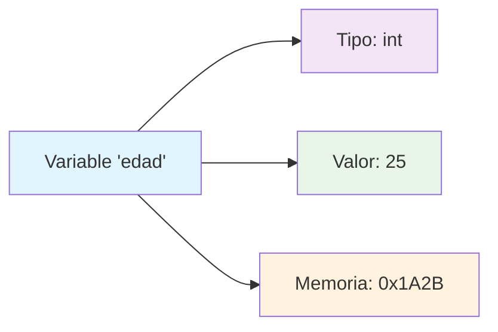
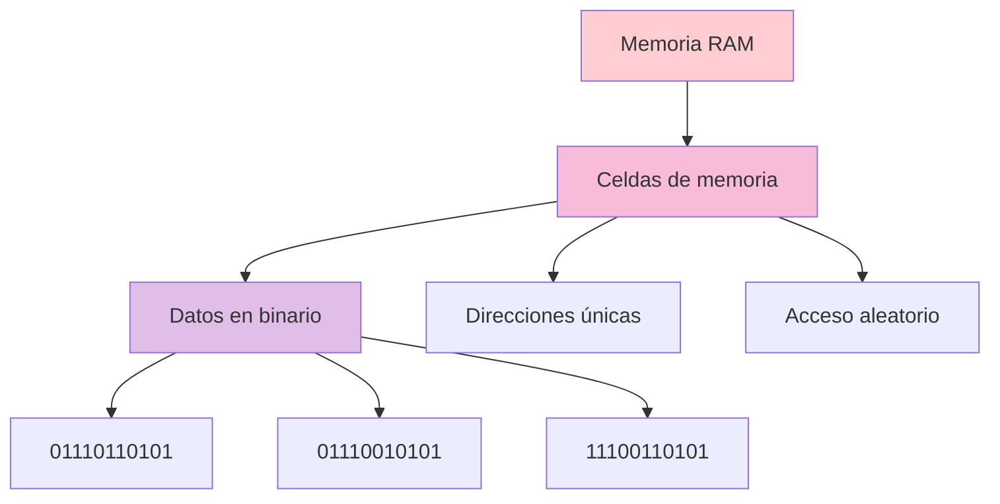
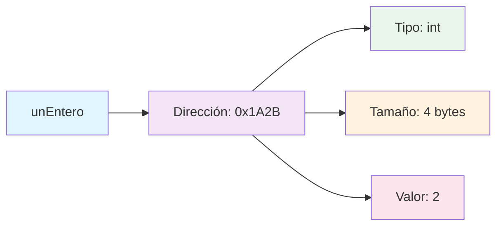
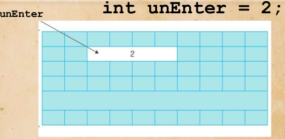
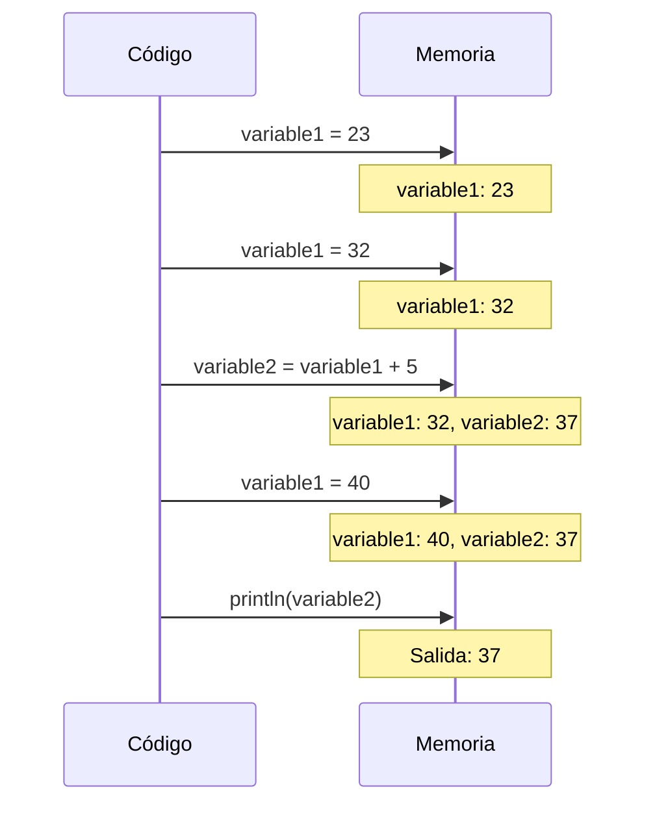
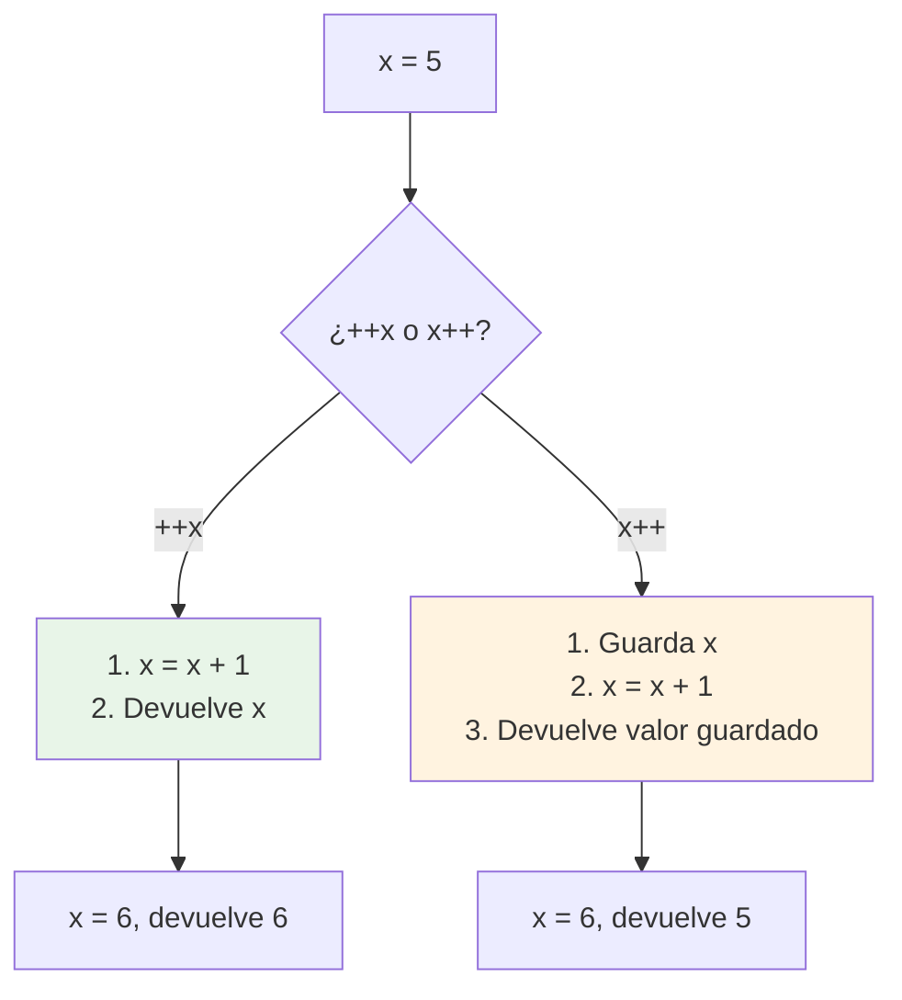
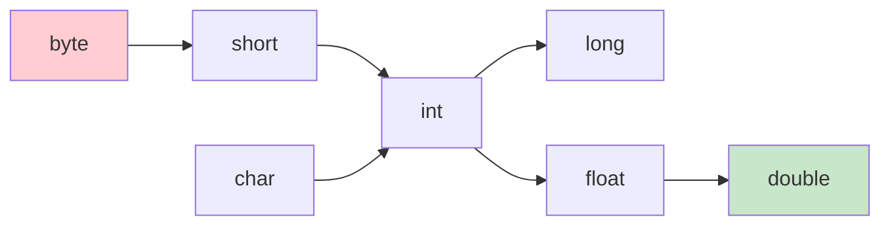

# UT1.3 Variables y entrada/salida de datos


## 📋 Índice de contenidos

1. [¿Solo usamos literales?](#1-solo-usamos-literales)
2. [Concepto de variable](#2-concepto-de-variable)
3. [Funcionamiento de la memoria](#3-funcionamiento-de-la-memoria)
4. [Declaración de variables](#4-declaraci%C3%B3n-de-variables)
5. [Identificadores (nombres de variables)](#5-identificadores-nombres-de-variables)
6. [Palabras reservadas](#6-palabras-reservadas)
7. [Uso de variables](#7-uso-de-variables)
8. [Operaciones con variables](#8-operaciones-con-variables)
9. [Operadores de asignación](#9-operadores-de-asignaci%C3%B3n)
10. [Constantes](#10-constantes)
11. [Conversiones de tipo](#11-conversiones-de-tipo)
12. [Salida de datos por pantalla](#12-salida-de-datos-por-pantalla)
13. [Cadenas de texto (String)](#13-cadenas-de-texto-string)
14. [Caracteres de escape](#14-caracteres-de-escape)
15. [Entrada de datos por teclado](#15-entrada-de-datos-por-teclado)
16. [De texto a número](#16-de-texto-a-n%C3%BAmero)
17. [Comentarios](#17-comentarios)
18. [Prácticas propuestas](#18-pr%C3%A1cticas-propuestas)
19. [Otros ejercicios](#19-otros-ejercicios)
20. [ANEXO. Scanner](#20-anexo-scanner)

## 1. ¿Solo usamos literales?

La respuesta es **no**. Necesitamos que la información sea **cambiante** (variable) durante la ejecución del programa. En los apartados anteriores hemos trabajado únicamente con literales (valores fijos escritos directamente en el código), pero esto es muy limitante para crear programas útiles.

Imagina un programa que siempre sume los mismos números:

```java
public class SumaFija {
    public static void main(String[] args) {
        IO.println("La suma de 5 + 3 es: " + (5 + 3));
    }
}
```

Este programa siempre producirá el mismo resultado. Para que sea útil, necesitamos poder trabajar con datos que cambien durante la ejecución.

> [!IMPORTANT]
> Las variables nos permiten almacenar y manipular datos que pueden cambiar durante la ejecución del programa, lo que hace posible crear aplicaciones interactivas y dinámicas.

## 2. Concepto de variable

Una **variable** es una **posición de memoria identificada por un nombre** que puede almacenar un valor de un tipo específico y cuyo contenido puede modificarse durante la ejecución del programa.

Las características fundamentales de una variable son:

- **Nombre (identificador)**: permite referenciar la posición de memoria
- **Tipo**: determina qué clase de datos puede almacenar
- **Valor**: el contenido actual almacenado
- **Ámbito (scope)**: dónde es visible y utilizable la variable



> [!NOTE]
> La memoria RAM es **volátil** y **limitada**, por tanto no debe utilizarse sin control. Cada variable ocupa espacio en memoria que debe gestionarse adecuadamente.

## 3. Funcionamiento de la memoria

Para entender el funcionamiento de la memoria, podemos usar el símil de **resolver una multiplicación en papel**:

### 3.1 Analogía con operaciones en papel

Cuando resolvemos manualmente una multiplicación como `9654 × 48`:

```text
    9654
  ×   48
  ------
   77232  ← (9654 × 8)
+ 386160  ← (9654 × 40)
  ------
  463392
```

Durante este proceso:

- Tenemos **espacio limitado** para operaciones
- Necesitamos **recordar resultados parciales**
- Los datos **no son persistentes** (se borran al limpiar)
- Cada dato se está guardando en **binario** en celdas de memoria
- Organizamos la información en **posiciones específicas**

### 3.2 Memoria del ordenador



La memoria del ordenador funciona de manera similar:

- **Espacio compartido** entre todos los programas
- **Datos no persistentes** (se pierden al apagar)
- **Datos en formato binario** (0s y 1s)
- **Organización en celdas** con direcciones únicas

> [!TIP]
> Aunque nosotros usamos nombres como `edad` o `precio`, el ordenador internamente trabaja con direcciones de memoria como `0x1A2B3C4D`.

## 4. Declaración de variables

### 4.1 Sintaxis básica

Toda variable **debe ser declarada** antes de poder ser usada. La sintaxis en Java es:

```java
TIPO IDENTIFICADOR;                    // Declaración
TIPO IDENTIFICADOR = VALOR_INICIAL;    // Declaración con inicialización
```

### 4.2 Ejemplos de declaración

```java
// Declaración simple
int edad;
double precio;
boolean activo;
char inicial;

// Declaración con inicialización
int edad = 25;
double precio = 19.99;
boolean activo = true;
char inicial = 'A';

// Declaración múltiple del mismo tipo
int a, b, c;
double x = 1.5, y = 2.8, z;

// Declaración múltiple con el mismo valor
int a, b, c;
a = b = c = 0;
```

### 4.3 Asignación vs Comparación

> [!IMPORTANT]
> **Diferencia crítica:**
>
> - `=` se usa para **ASIGNAR** un valor a una variable
> - `==` se usa para **COMPARAR** si dos valores son iguales

```java
int numero = 10;        
IO.println(numero == 10); // Imprimirá true
```

### 4.4 Reserva de memoria

Cuando declaramos una variable de tipo `int`:

```java
int unEntero = 2;
```





Se reservan **4 bytes** de memoria donde se almacenará un valor entero que puede cambiar durante la ejecución del programa.

## 5. Identificadores (nombres de variables)

### 5.1 Reglas obligatorias

Los identificadores en Java deben cumplir estas reglas:

| ✅ Permitido | ❌ Prohibido |
| :-- | :-- |
| Comenzar con letra o `_` | Comenzar con número |
| Contener letras, números, `_` | Contener espacios |
| Usar caracteres ASCII | Usar caracteres especiales (ñ, á, etc.) *no recomendable* |
| Cualquier longitud | Usar palabras reservadas |

```java
// ✅ Identificadores válidos
int edad;
double precio_producto;
boolean _esValido;
String nombreCompleto;
int contador2;

// ❌ Identificadores inválidos
int 2contador;      // Comienza con número
double precio final; // Contiene espacio
boolean es-válido;   // Contiene guión
int class;          // Palabra reservada
```

### 5.2 Convenciones recomendadas

> [!TIP]
> **Usa siempre lowerCamelCase para variables:**
>
> - Primera palabra en minúsculas
> - Siguientes palabras con primera letra en mayúscula
> - Sin espacios ni guiones

```java
// ✅ Convención correcta (lowerCamelCase)
int edadEstudiante;
double precioFinal;
boolean estaActivado;
String nombreCompletoUsuario;

// ❌ Otras convenciones (válidas pero no recomendadas)
int edad_estudiante;    // snake_case
int EDAD_ESTUDIANTE;    // SCREAMING_SNAKE_CASE
int EdadEstudiante;     // PascalCase
```

### 5.3 Nombres descriptivos

```java
// ❌ Nombres poco descriptivos
int a, b, c;
double x;
boolean flag;

// ✅ Nombres descriptivos
int edadUsuario, numeroIntentos, puntuacionMaxima;
double precioConIva;
boolean esMayorDeEdad;
```

## 6. Palabras reservadas

Las **palabras reservadas** son términos que tienen un significado especial en Java y **no pueden usarse como identificadores**.

### 6.1 Lista completa de palabras reservadas

```text
abstract    assert      boolean     break       byte
case        catch       char        class       const
continue    default     do          double      else
enum        extends     final       finally     float
for         goto        if          implements  import
instanceof  int         interface   long        native
new         package     private     protected   public
return      short       static      strictfp    super
switch      synchronized this       throw       throws
transient   try         void        volatile    while
```

> [!WARNING]
> Si intentas usar una palabra reservada como identificador, obtendrás un **error de compilación**:
>
> ```java
> int class = 5;  // ❌ Error: 'class' es palabra reservada 
> ```

### 6.2 Identificadores sensibles a mayúsculas

Java es **case-sensitive**, por lo que estos son identificadores diferentes:

```java
int edad;
int Edad;
int EDAD;
int edaD;
// Todos son identificadores válidos pero diferentes
```

## 7. Uso de variables

### 7.1 Referencia por identificador

Una vez declarada, la variable se referencia por su **identificador**, que representa el valor almacenado en cada momento:

```java
public class EjemploVariables {
    public static void main(String[] args) {
        int variable1, variable2;
        
        variable1 = 23;                    // Primer valor
        variable1 = 32;                    // Cambia el valor
        variable2 = variable1 + 5;         // variable2 = 32 + 5 = 37
        variable1 = 40;                    // variable1 cambia, pero variable2 mantiene 37
        
        IO.println(variable2);     // Imprime: 37
    }
}
```

### 7.2 Flujo de ejecución paso a paso



> [!NOTE]
> Cada variable tiene su propio **contexto (ámbito o scope)**. Las variables declaradas dentro de un método solo son visibles dentro de ese método.

### 7.3 Ejemplo práctico: División y suma

```java
public class DivideYSuma {
    public static void main(String[] args) {
        double dividendo = 20.0;
        double divisor = 6.0;
        double sumarAlFinal = 3.0;
        
        // Las variables se usan como literales en expresiones
        // Equivale a: (20.0 / 6.0) + 3.0
        double resultado = (dividendo / divisor) + sumarAlFinal;
        
        IO.println("El resultado es: " + resultado);
        // Salida: El resultado es: 6.333333333333333
    }
}
```

## 8. Operaciones con variables

### 8.1 Operaciones básicas

Las variables admiten las **mismas operaciones que los literales** según su tipo:

```java
public class OperacionesVariables {
    public static void main(String[] args) {
        int a = 10, b = 3;
        double x = 5.5, y = 2.0;
        boolean p = true, q = false;
        char c1 = 'A', c2 = 'B';
        
        // Operaciones aritméticas
        int suma = a + b;           // 13
        int resta = a - b;          // 7
        int producto = a * b;       // 30
        int cociente = a / b;       // 3 (división entera)
        int resto = a % b;          // 1
        
        // Operaciones con reales
        double division = x / y;    // 2.75
        
        // Operaciones lógicas
        boolean and = p && q;       // false
        boolean or = p || q;        // true
        boolean not = !p;           // false
        
        // Operaciones relacionales
        boolean mayor = a > b;      // true
        boolean diferente = c1 != c2; // true
    }
}
```

### 8.2 Precedencia de operadores

La **precedencia** determina el orden de evaluación en expresiones complejas:

| Precedencia (mayor a menor) | Operadores | Ejemplo |
| :-- | :-- | :-- |
| 1 | `()` | `(a + b) * c` |
| 2 | `!`, `-` (unario), `++`, `--` | `!flag`, `-x` |
| 3 | `*`, `/`, `%` | `a * b / c` |
| 4 | `+`, `-` | `x + y - z` |
| 5 | `<`, `<=`, `>`, `>=` | `a < b` |
| 6 | `==`, `!=` | `x == y` |
| 7 | `&&` | `p && q` |
| 8 | `\|\|` | `p \|\| q` |
| 9 | `=`, `+=`, `-=`, etc. | `x = y + z` |

```java
int resultado = 2 + 3 * 4;  // = 2 + 12 = 14 (no 20)
int resultado2 = (2 + 3) * 4; // = 5 * 4 = 20
```

## 9. Operadores de asignación

### 9.1 Operadores compuestos

Java proporciona **operadores de asignación compuestos** que combinan una operación con la asignación:

| Operador | Significado | Ejemplo | Equivalente |
| :-- | :-- | :-- | :-- |
| `+=` | Suma y asigna | `a += 5` | `a = a + 5` |
| `-=` | Resta y asigna | `a -= 3` | `a = a - 3` |
| `*=` | Multiplica y asigna | `a *= 2` | `a = a * 2` |
| `/=` | Divide y asigna | `a /= 4` | `a = a / 4` |
| `%=` | Módulo y asigna | `a %= 7` | `a = a % 7` |

```java
public class OperadoresAsignacion {
    public static void main(String[] args) {
        int numero = 10;
        
        numero += 5;    // numero = 15
        numero -= 3;    // numero = 12  
        numero *= 2;    // numero = 24
        numero /= 4;    // numero = 6
        numero %= 4;    // numero = 2
        
        IO.println("Resultado final: " + numero); // 2
    }
}
```

### 9.2 Operadores de incremento y decremento

Los operadores `++` y `--` son casos especiales que **suman o restan 1**:

```java
public class IncrementoDecremento {
    public static void main(String[] args) {
        int a = 5, b = 3, c;
        
        // Preincremento: primero incrementa, luego usa el valor
        c = ++a;    // a = 6, c = 6
        
        // Postincremento: primero usa el valor, luego incrementa  
        c = b++;    // c = 3, b = 4
        
        // Predecremento
        c = --a;    // a = 5, c = 5
        
        // Postdecremento
        c = b--;    // c = 4, b = 3
        
        IO.println("a=" + a + ", b=" + b + ", c=" + c);
        // Salida: a=5, b=3, c=4
    }
}
```

```java
int a = 5;
int b = 3;
int c = a * b++;
// Después de ejecutar: a=5, b=4, c=15

// Equivale a:
c = a * b;
b = b + 1;
```

```java
int a = 5;
int b = 3;
int c = a * ++b;
// Después de ejecutar: a=5, b=4, c=20

// Equivale a:
b = b + 1;
c = a * b;
```

```java
int a = 5;
int b = 3;
int c = --a * b++;
// Después de ejecutar: a=4, b=4, c=12

// Equivale a:
a = a - 1;
c = a * b;
b = b + 1;
```

```java
int a = 5;
int b = 3;
int c = a-- * ++b;
// Después de ejecutar: a=4, b=4, c=20

// Equivale a:
b = b + 1;
c = a * b;
a = a - 1;
```

### 9.3 Diferencia entre pre y post incremento



## 10. Constantes

### 10.1 Definición y declaración

Una **constante** es un dato en memoria del programa cuyo **valor no puede modificarse** una vez asignado (podrá ser leído pero no reasignado). Se declara con la palabra reservada `final`:

```java
final double NUMERO_PI = 3.1415926535;
final int VELOCIDAD_LUZ = 299792458;    // m/s
final String NOMBRE_CURSO = "Programación";
```

### 10.2 Convención de nomenclatura

> [!TIP]
> **Convención UPPER_SNAKE_CASE para constantes:**
>
> - Todas las letras en **MAYÚSCULAS**
> - Palabras separadas por **guión bajo** (_)
> - Nombres **descriptivos**

```java
// ✅ Convención correcta
final double DESCUENTO_ESTUDIANTE = 0.15;
final int EDAD_MINIMA_VOTO = 18;
final String MENSAJE_BIENVENIDA = "¡Hola!";

// ❌ Convención incorrecta  
final double descuentoEstudiante = 0.15;   // lowerCamelCase
final int EdadMinimaVoto = 18;             // PascalCase
```

### 10.3 Características importantes

```java
public class EjemploConstantes {
    public static void main(String[] args) {
        final double PRECIO_BASE = 100.0;
        final double IVA = 0.21;
        
        // ✅ Podemos leer el valor
        double precioFinal = PRECIO_BASE * (1 + IVA);
        
        // ❌ Error de compilación: no se puede reasignar
        // PRECIO_BASE = 150.0;  // Error!
        
        IO.println("Precio final: " + precioFinal);
    }
}
```

> [!IMPORTANT]
> Una constante **solo puede asignarse UNA vez**. Si intentamos modificarla después, obtendremos un error de compilación.

### 10.4 Ventajas de usar constantes

```java
// ❌ Sin constantes (valores mágicos)
double area = radio * radio * 3.14159;
double perimetro = 2 * 3.14159 * radio;

// ✅ Con constantes (código más legible y mantenible)
final double PI = 3.14159;
double area = radio * radio * PI;
double perimetro = 2 * PI * radio;
```

## 11. Conversiones de tipo

### 11.1 Conversiones implícitas (type coercion)

Java realiza **conversiones automáticas o implícitas** cuando no hay pérdida de información:

```java
public class ConversionesImplicitas {
    public static void main(String[] args) {
        // De int a float (no hay pérdida)
        int entero = 100;
        float real = entero;        // ✅ Automática: 100.0f
        
        // De float a double (mayor precision)
        double doble = real;        // ✅ Automática: 100.0d
        
        // Operaciones mixtas
        int a = 5;
        double b = 2.5;
        double resultado = a + b;   // ✅ a se convierte a 5.0
        
        IO.println("Resultado: " + resultado); // 7.5
    }
}
```

### 11.2 Jerarquía de conversiones automáticas



> [!WARNING]
> **No se puede asignar un tipo "mayor" a uno "menor" automáticamente:**
>
> ```java
>    double x = 5.7; 
>    int y = x;      
>    // ❌ Error de compilación 
> ```

### 11.3 Conversiones explícitas (type casting)

Para forzar una conversión que puede perder información, usamos **casting**:

```java
public class ConversionesExplicitas {
    public static void main(String[] args) {
        // Casting de double a int (pierde decimales)
        double valor = 5.7;
        int entero = (int) valor;   // entero = 5
        
        // Casting entre char e int (códigos ASCII/Unicode)
        int codigo = 97;
        char letra = (char) codigo; // letra = 'a'
        
        // Casting puede causar overflow
        int grande = 300;
        byte pequeno = (byte) grande; // pequeno = 44 (300 - 256)
        
        IO.println("valor: " + valor + ", entero: " + entero);
        IO.println("codigo: " + codigo + ", letra: " + letra);
        IO.println("caracter: " + caracter + ", ascii: " + ascii);
        IO.println("grande: " + grande + ", pequeno: " + pequeno);
    }
}
```

### 11.4 Conversiones en operaciones

```java
public class ConversionesOperaciones {
    public static void main(String[] args) {
        byte a = 10;
        byte b = 20;
        
        // ❌ Error: el resultado de operaciones con byte/short se promociona a int
        // byte suma = a + b;
        
        // ✅ Soluciones:
        int suma1 = a + b;              // Usar int
        byte suma2 = (byte)(a + b);     // Casting explícito
        
        // Operaciones con literales
        byte c = 10 + 20;               // ✅ OK: literales en tiempo de compilación
        
        IO.println("suma1: " + suma1 + ", suma2: " + suma2 + ", c: " + c);
    }
}
```

## 12. Salida de datos por pantalla

### 12.1 Métodos básicos de System.out

Java proporciona varios métodos para mostrar información en la consola:

| Método | Descripción | Salto de línea |
| :-- | :-- | :-- |
| `print()` | Muestra texto | ❌ No |
| `println()` | Muestra texto | ✅ Sí |
| `printf()` | Muestra texto con formato | ❌ No |

```java
public class SalidaDatos {
    public static void main(String[] args) {
        // print: sin salto de línea
        IO.print("Hola ");
        IO.print("mundo");
        // Salida: Hola mundo
        
        // println: con salto de línea
        IO.println("Primera línea");
        IO.println("Segunda línea");
        // Salida:
        // Primera línea
        // Segunda línea
        
        // Concatenación con variables
        String nombre = "Ana";
        int edad = 25;
        IO.println("Me llamo " + nombre + " y tengo " + edad + " años");
    }
}
```

### 12.2 printf: salida con formato

El método `printf()` permite **formatear la salida** usando especificadores:

| Especificador | Tipo | Ejemplo |
| :-- | :-- | :-- |
| `%d` | Entero | `printf("%d", 42)` |
| `%f` | Real | `printf("%.2f", 3.14159)` |
| `%s` | String | `printf("%s", "Hola")` |
| `%c` | Carácter | `printf("%c", 'A')` |
| `%b` | Boolean | `printf("%b", true)` |

```java
public class SalidaFormateada {
    public static void main(String[] args) {
        String nombre = "Carlos";
        int edad = 28;
        double altura = 1.75;
        boolean casado = false;
        
        // Formato básico
        System.out.printf("Nombre: %s%n", nombre);
        System.out.printf("Edad: %d años%n", edad);
        System.out.printf("Altura: %.2f metros%n", altura);
        System.out.printf("Casado: %b%n", casado);
        
        // Formato complejo en una línea
        System.out.printf("%s tiene %d años, mide %.2f metros y %s está casado%n",
                         nombre, edad, altura, casado ? "sí" : "no");
        
        // Alineación y relleno
        System.out.printf("%-10s | %5d | %8.2f%n", "Juan", 25, 1.80);
        System.out.printf("%-10s | %5d | %8.2f%n", "María", 30, 1.65);
    }
}
```

> [!TIP]
> **Especificadores útiles para printf:**
>
> - `%n`: salto de línea (mejor que `\n`)
> - `%.2f`: 2 decimales para números reales
> - `%5d`: entero con ancho mínimo 5
> - `%-10s`: string alineado a la izquierda con ancho 10

## 13. Cadenas de texto (String)

### 13.1 Concepto y declaración

`String` es una **clase** (no un tipo primitivo) que representa una secuencia de caracteres:

```java
public class EjemploString {
    public static void main(String[] args) {
        // Declaración e inicialización
        String texto = "Prueba de texto";
        String vacio = "";
        String nulo = null;
        
        // Concatenación
        String nombre = "Ana";
        String apellido = "García";
        String nombreCompleto = nombre + " " + apellido;
        
        IO.println(texto);
        IO.println("Nombre completo: " + nombreCompleto);
    }
}
```

> [!IMPORTANT]
> **String NO es un tipo primitivo**. Cuando el nombre del tipo comienza con mayúscula indica que es una **clase** (tipo de referencia).

### 13.2 Concatenación de cadenas

```java
public class ConcatenacionStrings {
    public static void main(String[] args) {
        String saludo = "Hola";
        String nombre = "Pedro";
        int edad = 30;
        
        // Concatenación con +
        String mensaje1 = saludo + " " + nombre;
        String mensaje2 = nombre + " tiene " + edad + " años";
        
        // Concatenación en println
        IO.println("El resultado de 5 + 3 es: " + (5 + 3));
        IO.println("5 + 3 = " + 5 + 3);        // "5 + 3 = 53"
        IO.println("5 + 3 = " + (5 + 3));      // "5 + 3 = 8"
        
        // Ejemplo práctico
        double dividendo = 18954.74;
        double divisor = 549.12;
        double resultado = dividendo / divisor;
        String mensajeFinal = "El resultado obtenido es " + resultado + ".";
        
        IO.println(mensajeFinal);
    }
}
```

### 13.3 Comparación de Strings

> [!WARNING]
> **NUNCA uses `==` para comparar Strings**. Usa el método `equals()`:

```java
public class ComparacionStrings {
    public static void main(String[] args) {
        String s1 = "HOLA";
        String s2 = "HOLA";
        String s3 = new String("HOLA");
        
        // ❌ Comparación incorrecta (compara referencias)
        IO.println(s1 == s2);      // puede ser true o false
        IO.println(s1 == s3);      // false
        
        // ✅ Comparación correcta (compara contenido)
        IO.println(s1.equals(s2)); // true
        IO.println(s1.equals(s3)); // true
        IO.println(s1.equals("Hola")); // false (sensible a mayúsculas)
        
        // Ignorar mayúsculas/minúsculas
        IO.println(s1.equalsIgnoreCase("hola")); // true
    }
}
```

## 14. Caracteres de escape

### 14.1 Caracteres especiales

Los **caracteres de escape** permiten incluir caracteres especiales en las cadenas:

| Secuencia | Carácter | Descripción |
| :-- | :-- | :-- |
| `\t` | Tabulador | Espacio de tabulación |
| `\n` | Nueva línea | Salto de línea |
| `\'` | Comilla simple | Carácter ' literal |
| `\"` | Comilla doble | Carácter " literal |
| `\\` | Contrabarra | Carácter \ literal |
| `\r` | Retorno carro | Retorno de carro |

```java
public class CaracteresEscape {
    public static void main(String[] args) {
        // Tabulaciones y saltos de línea
        IO.println("Línea 1\n\tLínea 2\nLínea 3");
        // Salida:
        // Línea 1
        //     Línea 2  
        // Línea 3
        
        // Comillas en texto
        IO.println("Él dijo: \"¡Hola mundo!\"");
        // Salida: Él dijo: "¡Hola mundo!"
        
        // Rutas de archivos (Windows)
        IO.println("Ruta: C:\\Users\\Usuario\\Documents\\archivo.txt");
        // Salida: Ruta: C:\Users\Usuario\Documents\archivo.txt
        
        // Caracteres combinados
        IO.println("Nombre:\tJuan\nEdad:\t25\nCiudad:\tMadrid");
        // Salida:
        // Nombre:    Juan
        // Edad:      25
        // Ciudad:    Madrid
    }
}
```

### 14.2 Ejemplo práctico: tabla formateada

```java
public class TablaFormateada {
    public static void main(String[] args) {
        IO.println("PRODUCTO\tPRECIO\tSTOCK");
        IO.println("--------\t------\t-----");
        IO.println("Laptop\t\t899.99\t5");
        IO.println("Mouse\t\t25.50\t20");
        IO.println("Teclado\t\t45.00\t12");
        
        // También con println separado
        IO.println();
        IO.println("\"El conocimiento es poder\" - Francis Bacon");
        IO.println("Carpeta: C:\\Programas\\Java\\bin\\javac.exe");
    }
}
```

## 15. Entrada de datos por teclado

Para leer datos introducidos por el usuario, desde JDK 25 usamos la clase `java.lang.IO` y su método `readln`, que detiene la ejecución, espera a que el usuario escriba algo y pulse *Enter*, y devuelve siempre el texto como `String`.

```java
public class EntradaDatos {
    public static void main(String[] args) {
        String nombre = IO.readln("Introduce tu nombre: ");
        String edadTexto = IO.readln("Introduce tu edad: ");
        String alturaTexto = IO.readln("Introduce tu altura (metros): ");

        IO.println("--- DATOS INTRODUCIDOS ---");
        IO.println("Nombre: " + nombre);
        IO.println("Edad (texto): " + edadTexto);
        IO.println("Altura (texto): " + alturaTexto);
    }
}
```

> [!NOTE]
> Fíjate en que `edadTexto` y `alturaTexto` siguen siendo `String`, no números. Para operar con ellos aritméticamente hace falta convertirlos primero, tal y como veremos en el siguiente apartado.

> [!TIP]
> A diferencia de la antigua clase `Scanner`, `readln` siempre lee una línea completa de una sola vez: no existe el problema de mezclar lecturas de números y de texto que veremos más adelante como caso legacy (Anexo, sección 20).

## 16. De texto a número

Para convertir el texto leído en un número usamos los métodos estáticos `Integer.parseInt` (para enteros) y `Double.parseDouble` (para decimales):

```java
public class CalculoSalario {
    public static void main(String[] args) {
        String nombre = IO.readln("¿Cómo te llamas? ");
        String textoHoras = IO.readln("¿Cuántas horas trabajas esta semana? ");
        String textoPago = IO.readln("¿Cuánto te pagan por hora? ");

        int horas = Integer.parseInt(textoHoras);
        double pagoPorHora = Double.parseDouble(textoPago);
        double pagoTotal = horas * pagoPorHora;

        IO.println("--- CÁLCULO DE SALARIO ---");
        IO.println("Hola, " + nombre);
        System.out.printf("Tu salario semanal es de %.2f €%n", pagoTotal);
    }
}
```

> [!WARNING]
> `Integer.parseInt` y `Double.parseDouble` **fallan y detienen el programa** (lanzan una excepción) si el texto introducido no representa realmente un número válido — por ejemplo, si el usuario escribe "veinte" en letras o deja el campo vacío. De momento asumiremos que el usuario siempre introduce datos correctos; más adelante aprenderemos a comprobar la entrada antes de convertirla, y en la unidad de Control de Excepciones veremos cómo gestionar este fallo de forma robusta.

> [!NOTE]
> Este ejemplo combina `IO.println` para la interacción con `System.out.printf` para el formato numérico, ya que `IO` no dispone de una versión con formato equivalente a `printf`.

## 17. Comentarios

### 17.1 Importancia de los comentarios

Los **comentarios** son texto que se incluye en el código fuente para **explicar su funcionamiento** sin afectar la ejecución del programa.

### 17.2 Tipos de comentarios en Java

#### 17.2.1 Comentarios de una línea

```java
// Este es un comentario de una línea
public class Ejemplo {
    public static void main(String[] args) {
        int edad = 25;  // Comentario al final de línea
        IO.println("Edad: " + edad);
    }
}
```

#### 17.2.2 Comentarios multilínea (tradicionales)

```java
/* 
 * Este es un comentario tradicional
 * que puede ocupar múltiples líneas.
 * Útil para explicaciones largas.
 */
public class EjemploComentarios {
    public static void main(String[] args) {
        /*
         * El siguiente bloque calcula el área
         * de un círculo dado su radio
         */
        double radio = 5.0;
        double area = Math.PI * radio * radio;
        IO.println("Área: " + area);
    }
}
```

#### 17.2.3 Comentarios de documentación (Javadoc)

```java
/**
 * Clase para demostrar el uso de comentarios Javadoc.
 * Esta documentación puede generar HTML automáticamente.
 * 
 * @author Departamento de Informática
 * @version 1.0
 * @since 2025
 */
public class EjemploJavadoc {
    
    /**
     * Método principal que ejecuta el programa.
     * 
     * @param args Argumentos de línea de comandos pasados al programa
     */
    public static void main(String[] args) {
        calcularAreaCirculo(5.0);
    }
    
    /**
     * Calcula el área de un círculo dado su radio.
     * 
     * @param radio El radio del círculo (debe ser > 0)
     * @return El área del círculo
     * @throws IllegalArgumentException si radio <= 0
     */
    public static double calcularAreaCirculo(double radio) {
        if (radio <= 0) {
            throw new IllegalArgumentException("El radio debe ser positivo");
        }
        return Math.PI * radio * radio;
    }
}
```

### 17.3 Comentarios Markdown (JDK 23+)

> [!NOTE]
> A partir del **JDK 23** se pueden usar comentarios de documentación en formato **Markdown** con `///`:

```java
/// # Calculadora Básica
/// 
/// Esta clase proporciona métodos para operaciones matemáticas básicas.
/// 
/// ## Características
/// - Suma de enteros
/// - Resta de enteros  
/// - **Validación** de parámetros
/// 
/// ### Ejemplo de uso:
/// ```
/// int resultado = Calculadora.sumar(5, 3);
/// ```
/// 
/// @since JDK 23
public class Calculadora {
    
    /// Suma dos números enteros.
    ///
    /// Este método realiza una suma básica y retorna el resultado.
    /// **No** realiza validación de overflow.
    ///
    /// @param a Primer sumando
    /// @param b Segundo sumando  
    /// @return La suma de `a` + `b`
    public static int sumar(int a, int b) {
        return a + b;
    }
}
```

### 17.4 Buenas prácticas para comentarios

> [!TIP]
> **Consejos para comentarios efectivos:**
>
> - **Explica el "por qué", no el "qué"**
> - Mantén los comentarios **actualizados** con el código
> - Usa **comentarios descriptivos** para variables complejas
> - **No comentes código obvio**
> - Usa comentarios para **explicar algoritmos complejos**

```java
// ❌ Comentario obvio (innecesario)
int edad = 25; // Asigna 25 a la variable edad

// ✅ Comentario útil
int edadMinima = 18; // Edad mínima legal para votar en España

// ✅ Comentario explicativo para lógica compleja  
double descuento = 0.0;
if (cliente.esVip() && pedido.superaImporte(100)) {
    // Aplicar descuento del 15% para clientes VIP con pedidos > 100€
    descuento = 0.15;
}
```

## 18. Prácticas propuestas

### Práctica 7: Variable adicional para división y suma

Modifica el programa de división y suma para que use una variable adicional que almacene primero el resultado de la división y posteriormente el de la suma total.

<details>
<summary>💡 <strong>Solución Práctica 7</strong></summary>

```java
public class DivisionYSumaModificado {
    public static void main(String[] args) {
        double dividendo = 20.0;
        double divisor = 6.0;
        double sumarAlFinal = 3.0;
        
        // Variable adicional para almacenar resultado intermedio
        double resultadoDivision = dividendo / divisor;
        double resultadoFinal = resultadoDivision + sumarAlFinal;
        
        IO.println("Dividendo: " + dividendo);
        IO.println("Divisor: " + divisor);
        IO.println("Resultado división: " + resultadoDivision);
        IO.println("Suma al final: " + sumarAlFinal);
        IO.println("Resultado final: " + resultadoFinal);
    }
}
```

</details>

### Práctica 8: Tabla de multiplicar del 4

Realiza un programa con dos variables que, sin usar literales excepto en inicializaciones, calcule e imprima los 5 primeros valores de la tabla de multiplicar del 4.

<details>
<summary>💡 <strong>Solución Práctica 8</strong></summary>

```java
public class TablaMultiplicar4 {
    public static void main(String[] args) {
        int base = 4;
        int contador = 1;
        
        // Primera multiplicación: 4 × 1
        int resultado = base * contador;
        IO.println(base + " × " + contador + " = " + resultado);
        contador++;
        
        // Segunda multiplicación: 4 × 2  
        resultado = base * contador;
        IO.println(base + " × " + contador + " = " + resultado);
        contador++;
        
        // Tercera multiplicación: 4 × 3
        resultado = base * contador;
        IO.println(base + " × " + contador + " = " + resultado);
        contador++;
        
        // Cuarta multiplicación: 4 × 4
        resultado = base * contador;
        IO.println(base + " × " + contador + " = " + resultado);
        contador++;
        
        // Quinta multiplicación: 4 × 5
        resultado = base * contador;
        IO.println(base + " × " + contador + " = " + resultado);
    }
}
```

</details>

### Práctica 9: Caracteres de escape

Copia el programa de caracteres de control y modifica para usar todos los caracteres especiales.

<details>
<summary>💡 <strong>Solución Práctica 9</strong></summary>

```java
public class CaracteresControl {
    public static void main(String[] args) {
        // Programa original
        IO.println("Línea 1\n\tLínea 2\nLínea 3");
        
        IO.println("\n--- DEMOSTRACIÓN DE CARACTERES ESPECIALES ---");
        
        // Tabulador y nueva línea
        IO.println("Nombre:\tJuan\nEdad:\t25");
        
        // Comillas simples y dobles
        IO.println("Ella dijo: \"¡Qué día tan hermoso!\"");
        IO.println("El símbolo \' se llama comilla simple");
        
        // Contrabarra
        IO.println("Ruta en Windows: C:\\Users\\Usuario\\Desktop");
        IO.println("Expresión regular: \\d+ busca dígitos");
        
        // Retorno de carro (menos común)
        IO.print("Texto que se sobrescribe\rNuevo texto");
        IO.println(); // Salto final
        
        // Combinando varios caracteres
        IO.println("\"Hola\\mundo\"\n\tcon tabulación y\n\tsaltos de línea");
    }
}
```

</details>

### Práctica 10: Tabla de verdad tabulada

Crea un programa que muestre de manera tabulada la tabla de verdad de una disyunción (OR) entre dos variables booleanas.

<details>
<summary>💡 <strong>Solución Práctica 10</strong></summary>

```java
public class TablaVerdadOR {
    public static void main(String[] args) {
        boolean a, b;
        
        // Encabezado de la tabla
        IO.println("A\tB\tA || B");
        IO.println("-----\t-----\t-------");
        
        // Fila 1: false || false = false
        a = false;
        b = false;
        IO.println(a + "\t" + b + "\t" + (a || b));
        
        // Fila 2: false || true = true
        a = false;
        b = true;
        IO.println(a + "\t" + b + "\t" + (a || b));
        
        // Fila 3: true || false = true
        a = true;
        b = false;
        IO.println(a + "\t" + b + "\t" + (a || b));
        
        // Fila 4: true || true = true
        a = true;
        b = true;
        IO.println(a + "\t" + b + "\t" + (a || b));
    }
}
```

</details>

### Práctica 11: Multiplicación de tres reales

Programa que muestre la multiplicación de 3 números reales introducidos por teclado.

<details>
<summary>💡 <strong>Solución Práctica 11</strong></summary>

```java
public class MultiplicacionTresReales {
    public static void main(String[] args) {
        String texto1 = IO.readln("Introduce el primer número real: ");
        String texto2 = IO.readln("Introduce el segundo número real: ");
        String texto3 = IO.readln("Introduce el tercer número real: ");

        double numero1 = Double.parseDouble(texto1);
        double numero2 = Double.parseDouble(texto2);
        double numero3 = Double.parseDouble(texto3);

        double producto = numero1 * numero2 * numero3;

        IO.println("--- RESULTADO ---");
        System.out.printf("%.2f x %.2f x %.2f = %.2f%n", numero1, numero2, numero3, producto);
    }
}
```

</details>

> [!NOTE]
> **Recuerda:** Es importante realizar estas prácticas, hacer pruebas y anotar cualquier problema para preguntar al profesor. La práctica constante es fundamental para dominar la programación.

## 19. Otros ejercicios

<details>
<summary>Listado ejercicios</summary>

### Ejercicio 1: Variables y tipos de datos

Dado el siguiente programa, modifícalo para utilizar las variables que se indican. El tipo de dato elegido debe ser el de menos bits posible que puedan representar el valor. Justifica tu elección.

```java
public class EjercicioVariables {
    public static void main(String[] args) {

    } 
}
```

- **a)** Si un empleado está casado o no.
- **b)** Valor máximo no modificable: 999999.
- **c)** Día de la semana.
- **d)** Día del año.
- **e)** Sexo: con dos valores posibles 'H' o 'D'.
- **f)** Almacenar el total de una factura.
- **g)** Población mundial del planeta Tierra.

<details>
<summary>Solución propuesta</summary>

Podemos declarar las variables en Java de la siguiente forma, eligiendo tipos de datos adecuados:

```java
public class EjercicioVariables {
    public static void main(String[] args) {
        boolean casado;                // a) booleano: almacena true/false
        final int MAXIMO = 999999;     // b) entero final (constante): valor hasta ~2 mil millones
        byte diaSemana;                // c) byte: valores 1-7 para día de la semana
        short diaAnual;                // d) short: valores 1-365 para día del año
        char sexo;                     // e) char: carácter 'H' o 'D'
        double totalFactura;           // f) double: para total de factura con decimales
        long poblacion;                // g) long: números grandes (~7 mil millones)
        
        // (Opcional) Asignar valores de ejemplo:
        casado = true;
        diaSemana = 3;
        diaAnual = 150;
        sexo = 'H';
        totalFactura = 12345.67;
        poblacion = 7800000000L;
        
        // Justificación: Usamos el tipo más pequeño que cubra el rango:
        //  boolean para true/false, byte para días de la semana (rango -128 a 127),
        //  short para el día del año (rango -32768 a 32767), char para un carácter,
        //  double para números con decimales, y long para población muy grande.
    }
}
```

</details>

### Ejercicio 2: Comentarios e impresión de variables

Realiza las siguientes modificaciones en el programa anterior:

- **a)** Añade comentarios, entre ellos:
  - Nombre del programa, descripción y autor.
  - Alguna de las variables creadas.
- **b)** Utiliza el operador de asignación para inicializar las variables con los valores indicados en los enunciados.
- **c)** Utiliza la secuencia de escape correspondiente para generar una tabulación (`\t`) al principio de cada línea, excepto la primera.
- **d)** Muestra el siguiente resultado:

  - **Usando solo `println`:**

    ```text
    ----- EJERCICIO DE VARIABLES Y TIPOS DE DATOS -----
    	El valor de la variable casado es true
    	El valor de la variable MAXIMO es 999999
    	El valor de la variable diaSemana es 1
    	El valor de la variable diaAnual es 300
    	El valor de la variable miliseg es 1298332800000
    	El valor de la variable totalFactura es 10350.678
    	El valor de la variable poblacion es 6775235741
    	El valor de la variable sexo es H 
    ```

  - **Usando solo `print`:**

    ```text
    ----- EJERCICIO DE VARIABLES Y TIPOS DE DATOS -----
    	El valor de la variable casado es true
    	El valor de la variable MAXIMO es 999999
    	El valor de la variable diaSemana es 1
    	El valor de la variable diaAnual es 300
    	El valor de la variable miliseg es 1298332800000
    	El valor de la variable totalFactura es 10350.678
    	El valor de la variable poblacion es 6775235741
    	El valor de la variable sexo es H
    ```

  - **Usando solo `printf`:**

    ```text
    ----- EJERCICIO DE VARIABLES Y TIPOS DE DATOS -----
    	El valor de la variable casado es true
    	El valor de la variable MAXIMO es 999999
    	El valor de la variable diaSemana es 1
    	El valor de la variable diaAnual es 300
    	El valor de la variable miliseg es 1298332800000
    	El valor de la variable totalFactura es 10350.677734
    	El valor de la variable totalFactura en notación científica es 1.035068e+04
    	El valor de la variable poblacion es 6775235741
    	El valor de la variable sexo es H
    ```

<details>
<summary>Solución propuesta</summary>

A continuación se muestra un ejemplo de programa en Java con los cambios solicitados. Incluye comentarios y muestra la salida usando `println`, `print` y `printf` (de forma separada).

```java
// Nombre: EjercicioVariables
// Descripción: Ejemplo de uso de variables y tipos de datos
// Autor: Tu Nombre

public class EjercicioVariables {
    public static void main(String[] args) {
        // Declaración e inicialización de variables
        boolean casado = true;                    // ¿Está casado?
        final int MAXIMO = 999999;                // Valor máximo inmutable
        byte diaSemana = 1;                       // Día de la semana (1-7)
        short diaAnual = 300;                     // Día del año (1-365)
        long miliseg = 1298332800000L;            // Cantidad en milisegundos
        double totalFactura = 10350.678;          // Total de una factura con decimales
        long poblacion = 6775235741L;             // Población mundial (número grande)
        char sexo = 'H';                          // Sexo ('H' o 'D')

        // Usando println
        IO.println("----- EJERCICIO DE VARIABLES Y TIPOS DE DATOS -----");
        IO.println("\tEl valor de la variable casado es " + casado);
        IO.println("\tEl valor de la variable MAXIMO es " + MAXIMO);
        IO.println("\tEl valor de la variable diaSemana es " + diaSemana);
        IO.println("\tEl valor de la variable diaAnual es " + diaAnual);
        IO.println("\tEl valor de la variable miliseg es " + miliseg);
        IO.println("\tEl valor de la variable totalFactura es " + totalFactura);
        IO.println("\tEl valor de la variable poblacion es " + poblacion);
        IO.println("\tEl valor de la variable sexo es " + sexo);

        // Usando print (con saltos de línea manuales '\n')
        IO.print("----- EJERCICIO DE VARIABLES Y TIPOS DE DATOS -----\n");
        IO.print("\tEl valor de la variable casado es " + casado + "\n");
        // ... (similarly for other variables) ...

        // Usando printf
        System.out.printf("----- EJERCICIO DE VARIABLES Y TIPOS DE DATOS -----%n");
        System.out.printf("\tEl valor de la variable casado es %b%n", casado);
        System.out.printf("\tEl valor de la variable MAXIMO es %d%n", MAXIMO);
        System.out.printf("\tEl valor de la variable diaSemana es %d%n", diaSemana);
        System.out.printf("\tEl valor de la variable diaAnual es %d%n", diaAnual);
        System.out.printf("\tEl valor de la variable miliseg es %d%n", miliseg);
        System.out.printf("\tEl valor de la variable totalFactura es %.6f%n", totalFactura);
        System.out.printf("\tEl valor de la variable totalFactura en notación científica es %.6e%n", totalFactura);
        System.out.printf("\tEl valor de la variable poblacion es %d%n", poblacion);
        System.out.printf("\tEl valor de la variable sexo es %c%n", sexo);
    }
}
```

</details>

## Ejercicio 3: Múltiplo de dos números

Diseña un programa Java que pida dos números por teclado, determine si el primero es múltiplo del segundo y muestre el resultado (mostrará `true` o `false`).

<details>
<summary>Solución propuesta</summary>

```java
public class Multiplo {
    public static void main(String[] args) {
        String textoA = IO.readln("Introduce el primer número: ");
        String textoB = IO.readln("Introduce el segundo número: ");

        int a = Integer.parseInt(textoA);
        int b = Integer.parseInt(textoB);

        boolean esMultiplo = a % b == 0;
        IO.println(a + " es múltiplo de " + b + ": " + esMultiplo);
    }
}
```

</details>

## Ejercicio 4: Ecuación de primer grado

Diseña un programa Java para resolver una ecuación de primer grado con una incógnita (x), suponiendo que los coeficientes de la ecuación (C1 y C2) se introducen por teclado:

$C1x + C2 = 0$

<details>
<summary>Solución propuesta</summary>

```java
public class EcuacionPrimerGrado {
    public static void main(String[] args) {
        String textoC1 = IO.readln("Introduce el coeficiente C1: ");
        String textoC2 = IO.readln("Introduce el coeficiente C2: ");

        double c1 = Double.parseDouble(textoC1);
        double c2 = Double.parseDouble(textoC2);

        double x = -c2 / c1;
        IO.println("Solución: x = " + x);
    }
}
```

</details>

## Ejercicio 5: Algoritmo paso a paso con A, B y C

La siguiente tabla muestra un algoritmo paso a paso (lista de instrucciones). Utiliza tres variables `A`, `B` y `C` que inicialmente valen 4, 2 y 3 respectivamente. Calcula el valor de las variables después de ejecutar cada instrucción. Las tres primeras están hechas como ejemplo.

| Instrucción                | A  | B | C  |
| -------------------------- | -- | - | -- |
| Inicial                    | 4  | 2 | 3  |
| **1.** A = B               | 2  | 2 | 3  |
| **2.** C = A               | 2  | 2 | 2  |
| **3.** B = (A + B + C) / 2 |   |  |   |
| **4.** A = A + C           |   |  |   |
| **5.** C = B - A           |   |  |  |
| **6.** C = C - A           |   |  |  |
| **7.** A = A \* B          |  |  |  |
| **8.** A = A + 3           |  |  |  |
| **9.** A = A % B           |   |  |  |
| **10.** C = C + A          |   |  |  |

<details>
<summary>Solución propuesta</summary>

| Instrucción                | A  | B | C  |
| -------------------------- | -- | - | -- |
| Inicial                    | 4  | 2 | 3  |
| **1.** A = B               | 2  | 2 | 3  |
| **2.** C = A               | 2  | 2 | 2  |
| **3.** B = (A + B + C) / 2 | 2  | 3 | 2  |
| **4.** A = A + C           | 4  | 3 | 2  |
| **5.** C = B - A           | 4  | 3 | -1 |
| **6.** C = C - A           | 4  | 3 | -5 |
| **7.** A = A \* B          | 12 | 3 | -5 |
| **8.** A = A + 3           | 15 | 3 | -5 |
| **9.** A = A % B           | 0  | 3 | -5 |
| **10.** C = C + A          | 0  | 3 | -5 |

</details>

## Ejercicio 6: Evaluación de expresiones

Evalúa las siguientes expresiones:

- `((3 + 2) * 2 - 15) / 2 * 5`
- `5 - 2 > 4 AND NOT 0.5 == 1/2`
- Dado `x = 1, y = 4, z = 10, pi = 3.14, e = 2.71`:
  `2 * x + 0.5 + y - 1/5 * z`

<details>
<summary>Solución propuesta</summary>

**1.** `((3 + 2) * 2 - 15) / 2 * 5`

- Paso 1: `3 + 2 = 5`
- Paso 2: `5 * 2 = 10`
- Paso 3: `10 - 15 = -5`
- Paso 4: `-5 / 2 = -2.5` (división real)
- Paso 5: `-2.5 * 5 = -12.5`

✅ **Resultado final:** `-12.5`

---

**2.** `5 - 2 > 4 AND NOT 0.5 == 1/2`

- Paso 1: `5 - 2 = 3`
- Paso 2: `3 > 4` → `false`
- Paso 3: `1/2 = 0.5` (división real), por tanto `0.5 == 0.5` → `true`
- Paso 4: `NOT true` → `false`
- Paso 5: `false AND false` → `false`

✅ **Resultado final:** `false`

---

**3.** Dado `x = 1`, `y = 4`, `z = 10`, `pi = 3.14`, `e = 2.71`:

Expresión: `2 * x + 0.5 + y - 1/5 * z`

- Paso 1: `2 * x = 2 * 1 = 2`
- Paso 2: `1 / 5 = 0.2` (división real)
- Paso 3: `0.2 * z = 0.2 * 10 = 2`
- Paso 4: `2 + 0.5 + 4 = 6.5`
- Paso 5: `6.5 - 2 = 4.5`

✅ **Resultado final:** `4.5`

</details>

## Ejercicio 7: Operaciones aritméticas básicas

Escribe un programa que sume, reste, multiplique y divida dos números introducidos por teclado.

<details>
<summary>Solución propuesta</summary>

```java
public class OperacionesBasicas {
    public static void main(String[] args) {
        String textoNum1 = IO.readln("Introduce el primer número: ");
        String textoNum2 = IO.readln("Introduce el segundo número: ");

        double num1 = Double.parseDouble(textoNum1);
        double num2 = Double.parseDouble(textoNum2);

        IO.println("Suma: " + (num1 + num2));
        IO.println("Resta: " + (num1 - num2));
        IO.println("Multiplicación: " + (num1 * num2));
        IO.println("División: " + (num1 / num2));
    }
}
```

</details>

## Ejercicio 8: Nota necesaria para el promedio

Realiza un programa que calcule la nota que necesitas sacar en el tercer trimestre de la asignatura de Programación para obtener la media deseada.

(Suponiendo que las notas del primer y segundo trimestre ya se conocen.)

<details>
<summary>Solución propuesta</summary>

```java
public class NotaNecesaria {
    public static void main(String[] args) {
        String textoNota1 = IO.readln("Nota primer trimestre: ");
        String textoNota2 = IO.readln("Nota segundo trimestre: ");
        String textoMedia = IO.readln("Nota media deseada: ");

        double nota1 = Double.parseDouble(textoNota1);
        double nota2 = Double.parseDouble(textoNota2);
        double media = Double.parseDouble(textoMedia);

        double nota3 = 3 * media - nota1 - nota2;
        IO.println("Necesitas sacar: " + nota3);
    }
}
```

</details>

## Ejercicio 9: Expresión booleana compuesta

Dentro de una clase "joven" tenemos las variables enteras `edad`, `nivelEstudios` e `ingresos`. Necesitamos almacenar en la variable booleana `jasp` el valor:

- **Verdadero** si la edad es menor o igual a 28 y el nivelEstudios es mayor que 3, **o bien** si la edad es menor de 30 y los ingresos superan los 28000 euros.
- **Falso** en caso contrario.

Escribe el código para crear la variable `jasp` e iniciarla con la expresión necesaria.

<details>
<summary>Solución propuesta</summary>

```java
// Suponiendo que edad, nivelEstudios e ingresos ya están definidos e inicializados:
boolean jasp = ( (edad <= 28 && nivelEstudios > 3) || (edad < 30 && ingresos > 28000) );
```

</details>

## Ejercicio 10: Conversión de tiempo

Realiza un programa con una variable `t` que contiene un tiempo en segundos y queremos conocer ese tiempo pero expresado en horas, minutos y segundos.

<details>
<summary>Solución propuesta</summary>

```java
final int SEGUNDOS_POR_HORA = 3600;
final int SEGUNDOS_POR_MINUTO = 60;
int t = 3671; // ejemplo de tiempo en segundos
        
int horas = t / SEGUNDOS_POR_HORA;
int minutos = (t % SEGUNDOS_POR_HORA) / SEGUNDOS_POR_MINUTO;
int segundos = t % SEGUNDOS_POR_MINUTO;
        
System.out.printf("%d segundos = %d h, %d min, %d seg%n", t, horas, minutos, segundos);
```

</details>

</details>

## 20. Anexo. Scanner

> [!WARNING]
> Este anexo se explica de forma independiente al hilo principal de la asignatura. La clase `Scanner` fue durante muchos años la forma estándar de leer datos por teclado en Java, y todavía la encontraréis en código existente, documentación antigua y proyectos heredados. Debéis conocerla para poder leer y entender ese código, pero **no** es la forma de trabajar que seguiremos este curso: nuestra herramienta principal es `IO.readln`.

### 20.1 Funcionamiento básico de Scanner

Para usar `Scanner`, primero hay que importarla del paquete `java.util` y crear un objeto que lea desde la entrada estándar:

```java
import java.util.Scanner; // Importación obligatoria

public class EntradaDatosLegacy {
    public static void main(String[] args) {
        // Crear objeto Scanner
        Scanner teclado = new Scanner(System.in);

        // Leer diferentes tipos de datos
        System.out.print("Introduce tu nombre: ");
        String nombre = teclado.nextLine();

        System.out.print("Introduce tu edad: ");
        int edad = teclado.nextInt();
        teclado.nextLine(); // Consume el salto de línea pendiente

        System.out.print("Introduce tu altura (metros): ");
        double altura = teclado.nextDouble();
        teclado.nextLine();

        // Mostrar resultados
        System.out.println("--- DATOS INTRODUCIDOS ---");
        System.out.println("Nombre: " + nombre);
        System.out.println("Edad: " + edad + " años");
        System.out.printf("Altura: %.2f metros%n", altura);

        // Cerrar Scanner (buena práctica, obligatoria en este enfoque)
        teclado.close();
    }
}
```


### 20.2 Métodos principales de Scanner

| Método | Tipo de retorno | Descripción |
| :-- | :-- | :-- |
| `nextByte` | byte | Lee un entero de 8 bits |
| `nextShort` | short | Lee un entero de 16 bits |
| `nextInt` | int | Lee un entero de 32 bits |
| `nextLong` | long | Lee un entero de 64 bits |
| `nextFloat` | float | Lee un real de precisión simple |
| `nextDouble` | double | Lee un real de precisión doble |
| `nextBoolean` | boolean | Lee `true` o `false` |
| `next` | String | Lee una palabra hasta el primer espacio |
| `nextLine` | String | Lee una línea completa |

### 20.3 Diferencia entre `next` y `nextLine`

```java
import java.util.Scanner;

public class DiferenciaNext {
    public static void main(String[] args) {
        Scanner scanner = new Scanner(System.in);

        System.out.print("Escribe tu nombre completo: ");
        String nombre1 = scanner.next();      // Solo lee hasta el primer espacio
        String apellido = scanner.next();     // Lee la siguiente palabra

        System.out.println("Nombre: " + nombre1);
        System.out.println("Apellido: " + apellido);

        scanner.nextLine(); // Consume el salto de línea pendiente

        System.out.print("Escribe tu dirección completa: ");
        String direccion = scanner.nextLine(); // Lee toda la línea

        System.out.println("Dirección: " + direccion);
        scanner.close();
    }
}
```


### 20.4 El "problema del buffer": mezclar `nextInt` y `nextLine`

El mayor inconveniente de `Scanner`, y uno de los motivos de su sustitución, era la gestión de su memoria temporal (el *buffer*). Cuando un usuario teclea `25` y pulsa *Enter*, en el buffer quedan los caracteres `25` seguidos del salto de línea `\n`. Métodos como `nextInt()` leen el número, pero **dejan el salto de línea abandonado en el buffer**:

```java
import java.util.Scanner;

public class ProblemaScanner {
    public static void main(String[] args) {
        Scanner input = new Scanner(System.in);

        System.out.print("Introduce un número: ");
        int numero = input.nextInt(); // Lee el número, pero deja "\n" en el buffer

        System.out.print("Texto 1: ");
        String texto1 = input.nextLine(); // Lee el "\n" pendiente ⇒ cadena vacía

        System.out.print("Texto 2: ");
        String texto2 = input.nextLine(); // Ahora sí lee el texto correctamente

        System.out.println("Número: " + numero);
        System.out.println("Texto 1: " + texto1); // Vacío
        System.out.println("Texto 2: " + texto2);

        input.close();
    }
}
```

> [!TIP]
> **Solución tradicional al problema anterior:** añadir un `input.nextLine()` extra justo después de `nextInt()`/`nextDouble()`, únicamente para consumir el salto de línea pendiente antes de leer el siguiente texto.
>
> ```java > int numero = input.nextInt(); > input.nextLine(); // Consume el salto de línea pendiente > String texto1 = input.nextLine(); // Ahora funciona correctamente > ```

> [!IMPORTANT]
> Este problema es **exclusivo de `Scanner`** y desaparece por diseño al trabajar con `IO.readln`, ya que cada llamada consume siempre una línea completa, sin dejar residuos en el buffer. Es la razón pedagógica principal por la que este curso adopta `readln` como estándar.

### 20.5 Práctica 12 (legacy): Problema con Scanner

*Crea y analiza el programa problemático con `Scanner`. Encuentra y explica la solución.*

<details>
<summary>💡 Solución Práctica 12 (legacy)</summary>

```java
import java.util.Scanner;

public class ScannerCorregido {
    public static void main(String[] args) {
        Scanner input = new Scanner(System.in);

        System.out.print("Introduce un número: ");
        int numero = input.nextInt();

        input.nextLine(); // SOLUCIÓN: consumir el salto de línea pendiente

        System.out.print("Texto 1: ");
        String texto1 = input.nextLine(); // Ahora funciona correctamente

        System.out.print("Texto 2: ");
        String texto2 = input.nextLine();

        System.out.println("--- DATOS INTRODUCIDOS ---");
        System.out.println("Número: " + numero);
        System.out.println("Texto 1: " + texto1);
        System.out.println("Texto 2: " + texto2);

        input.close();
    }
}
```

**Explicación del problema:**
- `nextInt()` lee el número pero deja el salto de línea en el buffer.
- `nextLine()` inmediatamente después "se come" ese `\n` pendiente, devolviendo una cadena vacía.
- **Solución:** añadir un `input.nextLine()` extra después de `nextInt()` para consumir el salto de línea pendiente.

</details>

---

<p align="center">📚 <em>Fin del apartado UT1.3 - Variables y entrada/salida de datos</em></p>

---
<small>© 2026 José Ramón Mas Davó. Todo el material docente original se distribuye bajo licencia [CC BY-NC-SA 4.0](https://creativecommons.org/licenses/by-nc-sa/4.0/). Para más detalles, consulta el archivo [`LICENSE`](../LICENSE) del repositorio.</small>
