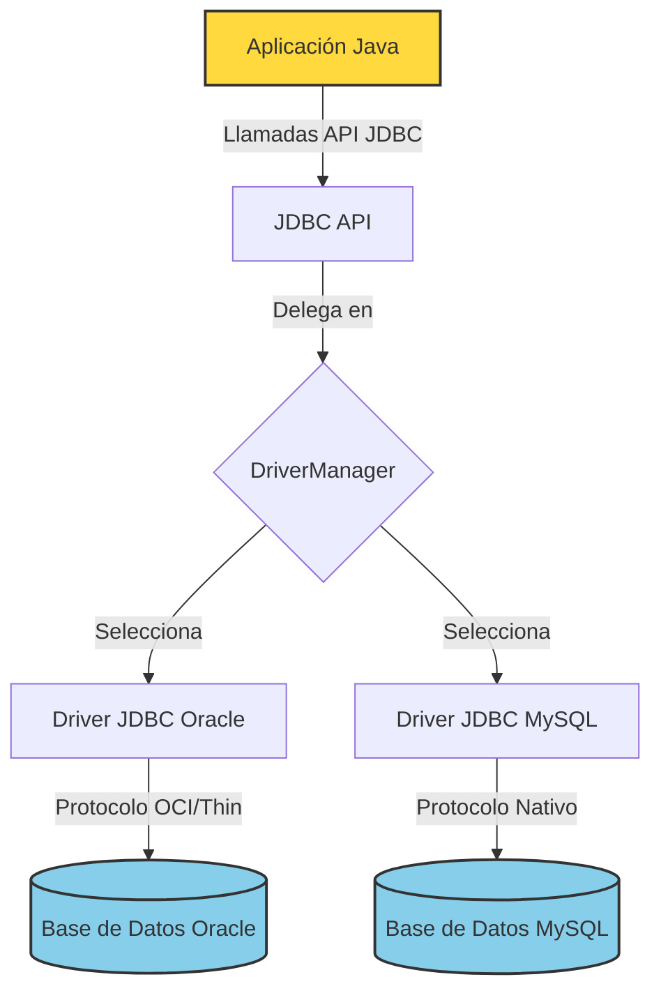
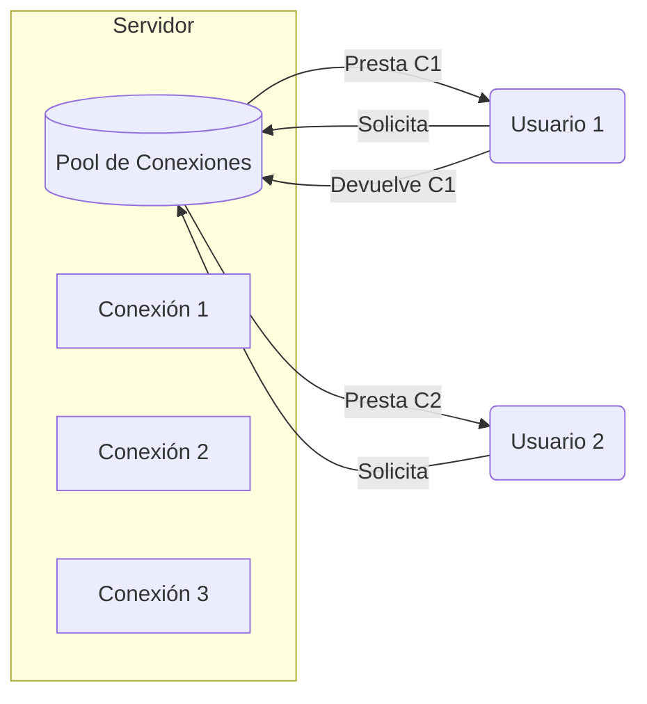
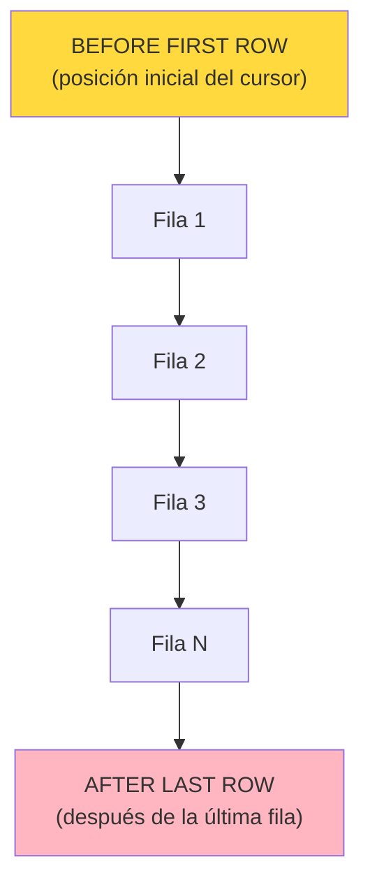
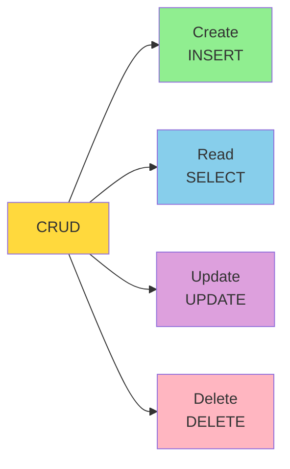
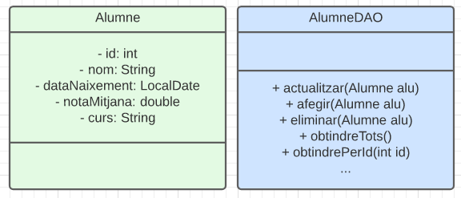
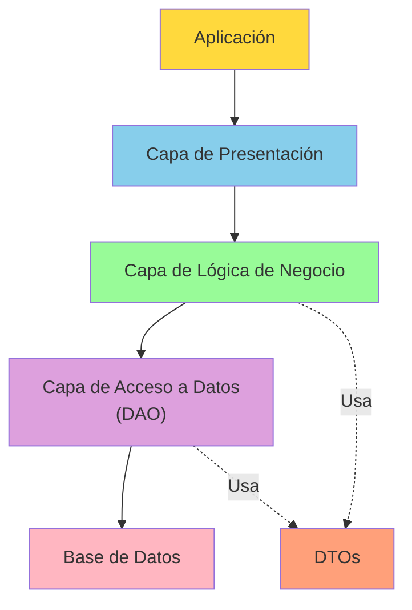

# UT10.1 Conexión con una Base de Datos Relacional

## 📋 Índice de contenidos

1. [Introducción a la programación con bases de datos](#1-introducción-a-la-programación-con-bases-de-datos)
2. [JDBC: Java Database Connectivity](#2-jdbc-java-database-connectivity)
    1. [¿Qué es JDBC?](#21-qué-es-jdbc)
    2. [Arquitectura de JDBC](#22-arquitectura-de-jdbc)
    3. [Configuración de proyecto NetBeans con Maven](#23-configuración-de-proyecto-netbeans-con-maven)
3. [Establecer conexión con una base de datos](#3-establecer-conexión-con-una-base-de-datos)
    1. [Paso 1: Registrar el driver JDBC](#31-paso-1-registrar-el-driver-jdbc)
    2. [Paso 2: Establecer la conexión](#32-paso-2-establecer-la-conexión)
    3. [Ejemplo completo de conexión con Oracle](#33-ejemplo-completo-de-conexión-con-oracle)
4. [Pool de conexiones](#4-pool-de-conexiones)
    1. [¿Por qué usar un pool de conexiones?](#41-por-qué-usar-un-pool-de-conexiones)
    2. [Ventajas del pool de conexiones](#42-ventajas-del-pool-de-conexiones)
    3. [Implementación del pool de conexiones en NetBeans](#43-implementación-del-pool-de-conexiones-en-netbeans)
    4. [Configuración de parámetros del pool](#44-configuración-de-parámetros-del-pool)
5. [Gestión del objeto Connection](#5-gestión-del-objeto-connection)
    1. [Cierre de conexiones](#51-cierre-de-conexiones)
    2. [Try-with-resources](#52-try-with-resources)
6. [Recuperación de información](#6-recuperación-de-información)
    1. [Uso de Statement](#61-uso-de-statement)
    2. [Ejecución de consultas SQL](#62-ejecución-de-consultas-sql)
    3. [Trabajar con ResultSet](#63-trabajar-con-resultset)
    4. [Métodos de navegación en ResultSet](#64-métodos-de-navegación-en-resultset)
    5. [Métodos de obtención de datos](#65-métodos-de-obtención-de-datos)
    6. [Tipos de ResultSet](#66-tipos-de-resultset)
7. [Inserción y modificación de información](#7-inserción-y-modificación-de-información)
    1. [Uso de executeUpdate](#71-uso-de-executeupdate)
    2. [Operaciones de inserción](#72-operaciones-de-inserción)
    3. [Operaciones de actualización y borrado](#73-operaciones-de-actualización-y-borrado)
8. [SQL Injection](#8-sql-injection)
    1. [¿Qué es SQL Injection?](#81-qué-es-sql-injection)
    2. [Ejemplos de ataques](#82-ejemplos-de-ataques)
    3. [Consecuencias de los ataques](#83-consecuencias-de-los-ataques)
9. [Sentencias preparadas o parametrizadas](#9-sentencias-preparadas-o-parametrizadas)
    1. [Concepto de PreparedStatement](#91-concepto-de-preparedstatement)
    2. [Ventajas de las sentencias preparadas](#92-ventajas-de-las-sentencias-preparadas)
    3. [Uso de parámetros](#93-uso-de-parámetros)
    4. [Métodos setXXX](#94-métodos-setxxx)
    5. [Ejemplo práctico completo](#95-ejemplo-práctico-completo)
10. [Operaciones CRUD](#10-operaciones-crud)
    1. [Definición de CRUD](#101-definición-de-crud)
    2. [Implementación de cada operación](#102-implementación-de-cada-operación)
11. [Objetos de acceso a datos (DAO y DTO)](#11-objetos-de-acceso-a-datos-dao-y-dto)
    1. [Concepto de DTO](#111-concepto-de-dto)
    2. [Concepto de DAO](#112-concepto-de-dao)
    3. [Separación de responsabilidades](#113-separación-de-responsabilidades)
    4. [Ejemplo de implementación](#114-ejemplo-de-implementación)
12. [Alternativas modernas a JDBC](#12-alternativas-modernas-a-jdbc)
    1. [jOOQ](#121-jooq)
    2. [JDBI](#122-jdbi)
    3. [R2DBC](#123-r2dbc)

## 1. Introducción a la programación con bases de datos

La programación de aplicaciones que interactúan con bases de datos es una habilidad fundamental en el desarrollo de software moderno. La mayoría de aplicaciones empresariales, aplicaciones web y sistemas de gestión necesitan almacenar, recuperar y manipular datos de forma persistente.

En esta unidad exploraremos cómo conectar aplicaciones Java con bases de datos relacionales, específicamente con Oracle Database, que es el sistema de gestión de bases de datos (SGBD) que habéis estado utilizando durante el curso en el módulo de Bases de Datos.

**Conceptos clave:**

- **Persistencia de datos**: Capacidad de almacenar información más allá de la ejecución del programa
- **Base de datos relacional**: Sistema que organiza los datos en tablas relacionadas entre sí
- **Conectividad**: Mecanismo que permite a las aplicaciones comunicarse con las bases de datos
- **API de acceso a datos**: Conjunto de clases e interfaces que facilitan la interacción con bases de datos

> [!NOTE]
> Este tema es fundamental para desarrollar aplicaciones robustas que requieran almacenamiento persistente de información. El conocimiento adquirido será aplicable a prácticamente cualquier proyecto profesional.

## 2. JDBC: Java Database Connectivity

### 2.1 ¿Qué es JDBC?

**JDBC** (Java Database Connectivity) es una API estándar de Java que proporciona un conjunto de clases e interfaces para ejecutar operaciones sobre bases de datos desde el lenguaje de programación Java. Su principal característica es la **independencia del sistema operativo** donde se ejecute la aplicación.

**Características principales:**

- **📚 API estándar**: Forma parte de la plataforma Java SE
- **🔄 Multiplataforma**: Funciona en cualquier sistema operativo que soporte Java
- **🔌 Independiente del SGBD**: Con el driver adecuado, se puede conectar a diferentes bases de datos
- **🏗️ Basada en interfaces**: Permite cambiar de base de datos con mínimas modificaciones en el código

JDBC actúa como una capa de abstracción entre la aplicación Java y la base de datos, permitiendo que el código sea portable entre diferentes sistemas gestores de bases de datos.

### 2.2 Arquitectura de JDBC

El funcionamiento de JDBC se basa en el uso de **Drivers** (controladores). Un driver es una librería específica proporcionada por el fabricante de la base de datos que "traduce" las llamadas estándar de JDBC al protocolo propietario de la base de datos.



**Componentes:**

1. **Aplicación Java**: Nuestro programa que necesita acceder a la base de datos
2. **API JDBC**: Conjunto de interfaces y clases en el paquete `java.sql`
3. **Driver Manager**: Gestor que mantiene un registro de los drivers disponibles
4. **Driver JDBC**: Implementación específica para cada SGBD (Oracle, MySQL, PostgreSQL...)
5. **Base de Datos**: El sistema gestor de base de datos con el que nos conectamos

> [!IMPORTANT]
> Cada SGBD (Oracle, MySQL, PostgreSQL, etc.) requiere su propio driver JDBC. El driver es la implementación específica que traduce las llamadas JDBC estándar a las llamadas propietarias del SGBD.

### 2.3 Configuración de proyecto NetBeans con Maven

Para trabajar con JDBC en un proyecto NetBeans utilizando Maven, seguiremos estos pasos:

**Paso 1**: Crear un nuevo proyecto de tipo **Java with Maven** → **Java Application**

**Paso 2**: En la estructura del proyecto, localizar **"Project Files"** y abrir el archivo `pom.xml`

**Paso 3**: Añadir la dependencia del driver JDBC de Oracle antes de la etiqueta de cierre `</project>`:

```xml
<dependencies>
    <dependency>
        <groupId>com.oracle.database.jdbc</groupId>
        <artifactId>ojdbc11</artifactId>
        <version>23.4.0.24.05</version>
    </dependency>    
</dependencies>
```

> [!TIP]
> Maven descargará automáticamente el driver JDBC de Oracle desde el repositorio central. Asegúrate de tener conexión a Internet la primera vez que compiles el proyecto.

**Versiones del driver:**

Existen diferentes versiones del driver JDBC de Oracle, cada una compatible con distintas versiones de JDK:

- **ojdbc8**: Compatible con JDK 8
- **ojdbc10**: Compatible con JDK 10 y 11
- **ojdbc11**: Compatible con JDK 11 y superiores (recomendado)

La API de JDBC incluye muchas clases que permiten:

- ✅ Establecer una conexión con una base de datos
- ✅ Ejecutar sentencias SQL (SELECT, INSERT, UPDATE, DELETE)
- ✅ Recuperar y manipular la información almacenada
- ✅ Gestionar transacciones
- ✅ Trabajar con procedimientos almacenados

## 3. Establecer conexión con una base de datos

Para establecer una conexión con una base de datos utilizando JDBC, debemos seguir una serie de pasos bien definidos. La clase principal responsable de esta tarea es **`DriverManager`**, proporcionada por la API de JDBC.

### 3.1 Paso 1: Registrar el driver JDBC

El primer paso consiste en registrar el driver adecuado para la base de datos que vamos a gestionar. Este proceso implica **cargar la clase correspondiente al driver en la JVM** (Java Virtual Machine).

**¿Qué es un driver JDBC?**

Un driver JDBC es una implementación específica de la API JDBC para un SGBD concreto. Cada fabricante de bases de datos proporciona su propio driver que "traduce" las llamadas JDBC estándar a las llamadas específicas de su sistema.

**Registro del driver:**

```java
try {
    // Carga dinámica de la clase del driver
    Class.forName("oracle.jdbc.driver.OracleDriver");
} catch (ClassNotFoundException ex) {
    System.out.println("Error: No se ha encontrado el driver de Oracle.");
    ex.printStackTrace();
}
```

**¿Qué hace `Class.forName()`?**

- Carga la clase indicada en memoria
- Al hacer esto, todos los elementos **static** de esa clase se inicializan automáticamente
- En uno de estos inicializadores static, se realiza la invocación al método `registerDriver` de la clase `DriverManager`

> [!IMPORTANT]
> El nombre de la clase del driver variará en función del SGBD que estés utilizando:
>
> - **Oracle**: `oracle.jdbc.driver.OracleDriver`
> - **MySQL**: `com.mysql.jdbc.Driver` o `com.mysql.cj.jdbc.Driver` (versiones modernas)
> - **PostgreSQL**: `org.postgresql.Driver`
> - **SQL Server**: `com.microsoft.sqlserver.jdbc.SQLServerDriver`

**Gestión de excepciones:**

El método `Class.forName()` puede lanzar la excepción `ClassNotFoundException` si no encuentra el driver especificado. Esto puede ocurrir si:

- No se ha añadido correctamente la dependencia Maven
- El nombre de la clase del driver es incorrecto
- El archivo JAR del driver no está en el classpath

> [!WARNING]
> En versiones modernas de JDBC (JDBC 4.0 y posteriores), el registro manual del driver con `Class.forName()` ya no es estrictamente necesario, ya que se realiza automáticamente mediante el mecanismo de **Service Provider**. Sin embargo, es una buena práctica incluirlo para garantizar compatibilidad con versiones antiguas.

### 3.2 Paso 2: Establecer la conexión

Una vez registrado el driver en el `DriverManager`, podemos establecer la conexión utilizando el método **`getConnection`**. Este método es estático y pertenece a la clase `DriverManager`.

**Versiones sobrecargadas del método `getConnection`:**

El método `getConnection` tiene tres implementaciones diferentes:

1. **Con URL únicamente:**

    ```java
    public static Connection getConnection(String url) throws SQLException
    ```

2. **Con URL y propiedades:**

    ```java
    public static Connection getConnection(String url, Properties info) throws SQLException
    ```

3. **Con URL, usuario y contraseña** (la más común):

    ```java
    public static Connection getConnection(String url, String user, String password) throws SQLException
    ```

**Formato de la URL de conexión:**

La URL de conexión tiene un formato específico que varía según el SGBD:

**Para Oracle:**

```plaintext
jdbc:oracle:thin:@host:puerto:SID
```

Donde:

- **jdbc:oracle:thin**: Protocolo y tipo de driver (thin client)
- **@host**: Dirección del servidor (localhost, IP o nombre de dominio)
- **puerto**: Puerto de escucha de Oracle (por defecto 1521)
- **SID**: Identificador del sistema (nombre de la base de datos)

**Ejemplos de URLs para diferentes SGBD:**

```java

// Oracle
String url = "jdbc:oracle:thin:@localhost:1521:ORCLCDB";

// MySQL
String url = "jdbc:mysql://localhost:3306/nombre_bd";

// PostgreSQL
String url = "jdbc:postgresql://localhost:5432/nombre_bd";

// SQL Server
String url = "jdbc:sqlserver://localhost:1433;databaseName=nombre_bd";

```

### 3.3 Ejemplo completo de conexión con Oracle

A continuación se presenta un ejemplo completo de cómo establecer una conexión con una base de datos Oracle, ejecutar una consulta y procesar los resultados:

```java
import java.sql.Connection;
import java.sql.DriverManager;
import java.sql.Statement;
import java.sql.ResultSet;
import java.sql.SQLException;

public class ConexionOracle {
    public static void main(String[] args) {
        // Parámetros de conexión
        final String URL = "jdbc:oracle:thin:javauser/javauser@localhost:1521:ORCLCDB";
        final String sentenciaSQL = "SELECT * FROM categoria ORDER BY codigo";

        try {
            // Paso 1: Registrar el driver
            Class.forName("oracle.jdbc.driver.OracleDriver");

            // Paso 2: Obtener la conexión
            Connection conn = DriverManager.getConnection(URL);

            // Paso 3: Crear un Statement para ejecutar sentencias SQL
            Statement statement = conn.createStatement();

            // Paso 4: Ejecutar la consulta y obtener ResultSet
            ResultSet resultSet = statement.executeQuery(sentenciaSQL);

            // Paso 5: Procesar los resultados
            while (resultSet.next()) {
                int codigo = resultSet.getInt("codigo");
                String nombre = resultSet.getString("nombre");
                System.out.println("Código: " + codigo + " - Nombre: " + nombre);
            }

            // Paso 6: Cerrar la conexión
            conn.close();

        } catch (ClassNotFoundException ex) {
            System.out.println("No se ha encontrado ese driver");
        } catch (SQLException ex) {
            System.out.println("Se ha producido un error al ejecutar la sentencia SQL");
            ex.printStackTrace();
        }
    }
}
```

o bien:

```java
import java.sql.*;

public class EjemploConexionOracle {
    public static void main(String[] args) {
        // Datos de conexión
        final String URL = "jdbc:oracle:thin:@localhost:1521:ORCLCDB";
        final String USER = "javauser";
        final String PASS = "javauser";
        
        final String SQL = "SELECT * FROM categoria ORDER BY codigo";

        Connection conn = null;
        Statement statement = null;
        ResultSet resultSet = null;

        try {
            // 1. Registrar Driver
            Class.forName("oracle.jdbc.driver.OracleDriver");
            
            // 2. Obtener conexión
            System.out.println("Conectando a la base de datos...");
            conn = DriverManager.getConnection(URL, USER, PASS);
            
            // 3. Crear enunciado (Statement)
            statement = conn.createStatement();
            
            // 4. Ejecutar consulta y obtener resultados
            resultSet = statement.executeQuery(SQL);
            
            // 5. Recorrer resultados
            while (resultSet.next()) {
                int codi = resultSet.getInt("codigo");
                String nom = resultSet.getString("nombre");
                System.out.println("Codi: " + codi + " - Nom: " + nom);
            }
            
        } catch (ClassNotFoundException ex) {
            System.out.println("Error: Driver no encontrado.");
        } catch (SQLException ex) {
            System.out.println("Error SQL: " + ex.getMessage());
        } finally {
            // 6. Cierre manual de recursos (importante en versiones antiguas)
            try {
                if (resultSet != null) resultSet.close();
                if (statement != null) statement.close();
                if (conn != null) conn.close();
            } catch (SQLException ex) {
                ex.printStackTrace();
            }
        }
    }
}

```

**Salida del programa:**

```plaintext
Código: 1 - Nombre: Sobremesa
Código: 2 - Nombre: Portátiles
Código: 3 - Nombre: Móviles
Código: 4 - Nombre: Tecnología
```

**Desglose del código:**

1. **Registro del driver**: `Class.forName("oracle.jdbc.driver.OracleDriver")` carga el driver en memoria
2. **Obtención de conexión**: `DriverManager.getConnection(URL)` establece la conexión con la base de datos
3. **Creación de Statement**: `conn.createStatement()` crea un objeto para ejecutar sentencias SQL
4. **Ejecución de consulta**: `statement.executeQuery(sentenciaSQL)` ejecuta la consulta y devuelve un `ResultSet`
5. **Procesamiento de resultados**: El bucle `while (resultSet.next())` recorre cada fila del resultado
6. **Obtención de datos**: `resultSet.getInt()` y `resultSet.getString()` extraen los valores de las columnas
7. **Cierre de conexión**: `conn.close()` libera los recursos

> [!CAUTION]
> Es fundamental cerrar siempre las conexiones con `conn.close()` para evitar fugas de memoria y agotamiento de recursos del servidor de base de datos.

## 4. Pool de conexiones

### 4.1 ¿Por qué usar un pool de conexiones?

En el ejemplo anterior, cada vez que necesitábamos consultar información de la base de datos, seguíamos este proceso:

1. Abrir una conexión con la base de datos
2. Ejecutar la consulta
3. Procesar los resultados
4. Cerrar la conexión

Este enfoque funciona correctamente para aplicaciones simples con pocos usuarios, pero presenta **serios problemas de rendimiento** en aplicaciones web con múltiples usuarios concurrentes.

**Problemas del enfoque tradicional:**

- ⚠️ **Alto consumo de recursos**: Abrir y cerrar conexiones consume muchos recursos del servidor
- ⚠️ **Lentitud**: El proceso de establecer una conexión es relativamente lento
- ⚠️ **Sobrecarga del servidor**: Con muchos usuarios simultáneos, el servidor puede colapsar
- ⚠️ **Ineficiencia**: Se pierden recursos creando y destruyendo conexiones constantemente

**Ejemplo del problema:**

Imagina una aplicación web con 100 usuarios simultáneos. Si cada usuario realiza 10 peticiones por minuto:

- Se crearían **1000 conexiones por minuto**
- Se cerrarían **1000 conexiones por minuto**
- El servidor de base de datos tendría que gestionar esta carga constantemente
- El rendimiento se degradaría drásticamente

> [!CAUTION]
> Sin un pool de conexiones, el servidor web acabará cayendo cuando tenga que gestionar muchos usuarios simultáneos.

### 4.2 Ventajas del pool de conexiones

Un **pool de conexiones** es un conjunto de conexiones a la base de datos que se mantienen **abiertas y disponibles** para ser reutilizadas por diferentes usuarios.

**Funcionamiento del pool:**

1. Al iniciar la aplicación, se crea un número predefinido de conexiones abiertas
2. Cuando un usuario necesita acceder a la base de datos, se le **asigna** una conexión del pool
3. El usuario utiliza la conexión para sus operaciones
4. Al terminar, la conexión se **devuelve** al pool (no se cierra)
5. La conexión queda disponible para otro usuario



**Beneficios del pool de conexiones:**

- ✅ **Mejor rendimiento**: Las conexiones ya están abiertas y listas para usar
- ✅ **Reduce la carga del servidor**: No se abren/cierran conexiones constantemente
- ✅ **Gestión eficiente de recursos**: El número de conexiones está controlado
- ✅ **Escalabilidad**: Soporta muchos más usuarios simultáneos
- ✅ **Control de acceso**: Si no hay conexiones disponibles, el usuario espera en cola

> [!TIP]
> El pool de conexiones es un patrón de diseño estándar en aplicaciones empresariales y aplicaciones web. Todas las aplicaciones web modernas lo utilizan.

### 4.3 Implementación del pool de conexiones en NetBeans

Para implementar un pool de conexiones en nuestro proyecto NetBeans con Maven, utilizaremos la librería **Apache Tomcat JDBC Pool**.

**Paso 1**: Añadir la dependencia al archivo `pom.xml`:

```xml
<dependency>
    <groupId>org.apache.tomcat</groupId>
    <artifactId>tomcat-jdbc</artifactId>
    <version>10.1.0-M12</version> </dependency>

```

**Paso 2**: Crear y configurar el pool de conexiones:

```java
import org.apache.tomcat.jdbc.pool.DataSource;
import org.apache.tomcat.jdbc.pool.PoolProperties;
import java.sql.Connection;
import java.sql.Statement;
import java.sql.ResultSet;
import java.sql.SQLException;

public class ConexionConPool {
    public static void main(String[] args) {
        final String sentenciaSQL = "SELECT * FROM categoria ORDER BY codigo";
        final String URL = "jdbc:oracle:thin:@localhost:1521:ORCLCDB";

        try {
            // Crear propiedades del pool
            PoolProperties pool = new PoolProperties();
            pool.setUrl(URL);
            pool.setDriverClassName("oracle.jdbc.driver.OracleDriver");
            pool.setUsername("javauser");
            pool.setPassword("javauser");

            // Configurar parámetros del pool
            pool.setMaxActive(15); // Máximo de conexiones activas
            pool.setMaxIdle(10); // Máximo de conexiones inactivas
            pool.setMaxWait(5000); // Tiempo máximo de espera (ms)
            pool.setInitialSize(5); // Conexiones iniciales
            pool.setMinIdle(5); // Mínimo de conexiones inactivas

            // Configurar validación de conexiones
            pool.setTestOnBorrow(true);
            pool.setValidationQuery("SELECT 1 FROM DUAL");
            pool.setValidationInterval(30000);

            // Configurar tiempos
            pool.setTimeBetweenEvictionRunsMillis(30000);
            pool.setMinEvictableIdleTimeMillis(30000);
            pool.setRemoveAbandonedTimeout(60);
            pool.setRemoveAbandoned(true);
            pool.setLogAbandoned(true);

            // Crear DataSource con las propiedades
            DataSource datasource = new DataSource();
            datasource.setPoolProperties(pool);

            // Obtener conexión del pool
            Connection conn = datasource.getConnection();
            Statement statement = conn.createStatement();
            ResultSet resultSet = statement.executeQuery(sentenciaSQL);

            while (resultSet.next()) {
                int codigo = resultSet.getInt("codigo");
                String nombre = resultSet.getString("nombre");
                System.out.println("Código: " + codigo + " - Nombre: " + nombre);
            }

            // Cerrar la conexión (la devuelve al pool, no la cierra realmente)
            conn.close();

        } catch (SQLException ex) {
            System.out.println("Se ha producido un error al ejecutar la sentencia SQL");
            ex.printStackTrace();
        }
    }
}
```

### 4.4 Configuración de parámetros del pool

Los parámetros del pool de conexiones permiten ajustar su comportamiento según las necesidades de la aplicación:

| Parámetro | Descripción | Valor recomendado |
|-----------|-------------|-------------------|
| **maxActive** | Número máximo de conexiones que pueden estar abiertas simultáneamente | 100-200 para apps web |
| **initialSize** | Número de conexiones creadas al iniciar el pool | 10-20 |
| **maxIdle** | Máximo de conexiones inactivas que permanecerán abiertas | 10-50 |
| **minIdle** | Mínimo de conexiones inactivas que se mantendrán | 5-10 |
| **maxWait** | Tiempo máximo (ms) que se esperará a que haya una conexión disponible | 5000-10000 |
| **testOnBorrow** | Valida la conexión antes de entregarla | true |
| **validationQuery** | Consulta SQL para validar conexiones | "SELECT 1 FROM DUAL" (Oracle) |
| **validationInterval** | Intervalo (ms) entre validaciones | 30000 |
| **timeBetweenEvictionRunsMillis** | Intervalo (ms) para limpiar conexiones abandonadas | 30000 |
| **minEvictableIdleTimeMillis** | Tiempo (ms) que una conexión puede estar inactiva antes de ser eliminada | 30000 |
| **removeAbandoned** | Elimina conexiones que no se han cerrado correctamente | true |
| **removeAbandonedTimeout** | Tiempo (s) antes de considerar una conexión como abandonada | 60 |
| **logAbandoned** | Registra en log las conexiones abandonadas | true (desarrollo) |

> [!IMPORTANT]
> **maxActive vs maxIdle**: Si el número de conexiones inactivas es muy bajo, puede darse el caso de que las conexiones se cierren porque se llega al máximo de conexiones inactivas y se vuelvan a abrir inmediatamente, reduciendo la eficiencia del pool.

**Estrategias de configuración según el tipo de aplicación:**

**Para aplicaciones con tráfico bajo:**

```java
pool.setInitialSize(5);
pool.setMaxActive(20);
pool.setMaxIdle(10);
pool.setMinIdle(5);
```

**Para aplicaciones con tráfico medio:**

```java
pool.setInitialSize(10);
pool.setMaxActive(100);
pool.setMaxIdle(50);
pool.setMinIdle(10);
```

**Para aplicaciones con tráfico alto:**

```java
pool.setInitialSize(20);
pool.setMaxActive(200);
pool.setMaxIdle(100);
pool.setMinIdle(20);
```

> [!WARNING]
> Configurar un `maxActive` demasiado alto puede sobrecargar la base de datos. Configurarlo demasiado bajo puede hacer que los usuarios esperen mucho tiempo. Es importante encontrar el equilibrio adecuado mediante pruebas de rendimiento.

## 5. Gestión del objeto Connection

### 5.1 Cierre de conexiones

Cada vez que se concede una conexión a un cliente, se obtiene un **objeto de la clase `Connection`**. Es fundamental comprender que cuando utilizamos un pool de conexiones:

- Al llamar a `conn.close()`, **NO se cierra realmente la conexión física** con la base de datos
- En su lugar, la conexión se **devuelve al pool** para que pueda ser reutilizada
- El pool mantiene las conexiones abiertas y las gestiona automáticamente

**Sin pool de conexiones:**

```java
Connection conn = DriverManager.getConnection(url, user, pass);
// Usar la conexión...
conn.close(); // ← Cierra REALMENTE la conexión física
```

**Con pool de conexiones:**

```java
Connection conn = datasource.getConnection();
// Usar la conexión...
conn.close(); // ← Devuelve la conexión al pool (NO la cierra físicamente)
```

> [!CAUTION]
> No cerrar las conexiones (no llamar a `close()`) puede provocar:
>
> - **Fugas de memoria**: Las conexiones quedan reservadas indefinidamente
> - **Agotamiento del pool**: No hay conexiones disponibles para otros usuarios
> - **Degradación del rendimiento**: El sistema se vuelve cada vez más lento
> - **Caída de la aplicación**: Eventualmente, la aplicación dejará de funcionar

### 5.2 Try-with-resources

Desde **Java 7**, disponemos de una estructura muy útil llamada **try-with-resources** que simplifica enormemente la gestión de recursos que necesitan ser cerrados.

**Sintaxis:**

```java
try (TipoRecurso recurso = new TipoRecurso()) {
// Usar el recurso
} catch (Exception e) {
// Manejar excepciones
}
// El recurso se cierra AUTOMÁTICAMENTE al salir del bloque try
```

**Aplicado a conexiones de base de datos:**

```java
try (Connection conn = datasource.getConnection()) {
    Statement stmt = conn.createStatement();
    ResultSet rs = stmt.executeQuery("SELECT * FROM tabla");
    // ...
} catch (SQLException e) {
    e.printStackTrace();
}
// La conexión se cierra automáticamente aquí
```

**Try-with-resources anidado:**

Podemos anidar múltiples recursos en el mismo try o usar varios try-with-resources:

```java
// Opción 1: Múltiples recursos en un mismo try
try (Connection conn = datasource.getConnection();
    Statement stmt = conn.createStatement();
    ResultSet rs = stmt.executeQuery("SELECT * FROM categoria")) {
    while (rs.next()) {
        System.out.println(rs.getString("nombre"));
    }
} catch (SQLException e) {
    e.printStackTrace();
}
// Todos los recursos se cierran automáticamente en orden inverso
```

```java
// Opción 2: Try-with-resources anidados
try (Connection conn = datasource.getConnection()) {
    try (Statement stmt = conn.createStatement()) {
        try (ResultSet rs = stmt.executeQuery("SELECT * FROM categoria")) {
            while (rs.next()) {
                System.out.println(rs.getString("nombre"));
            }
        }
    }
}
```

**Ventajas del try-with-resources:**

- ✅ **Cierre automático**: No es necesario llamar explícitamente a `close()`
- ✅ **Más seguro**: Garantiza el cierre incluso si hay excepciones
- ✅ **Código más limpio**: Elimina bloques `finally` extensos
- ✅ **Orden correcto**: Los recursos se cierran en orden inverso a su creación

**Comparación con el enfoque tradicional:**

```java
// ❌ Enfoque tradicional (verboso y propenso a errores)
        Connection conn = null;
        Statement stmt = null;
        ResultSet rs = null;
        try {
            conn = datasource.getConnection();
            stmt = conn.createStatement();
            rs = stmt.executeQuery("SELECT * FROM categoria");
            while (rs.next()) {
                System.out.println(rs.getString("nombre"));
            }
        } catch (SQLException e) {
            e.printStackTrace();
        } finally {
            try {
                if (rs != null)
                    rs.close();
            } catch (SQLException e) {
            }
            try {
                if (stmt != null)
                    stmt.close();
            } catch (SQLException e) {
                e.printStackTrace();
            }
            try {
                if (conn != null)
                    conn.close();
            } catch (SQLException e) {
            }
        }

        // ✅ Con try-with-resources (limpio y seguro)
        try (Connection conn = datasource.getConnection();
                Statement stmt = conn.createStatement();
                ResultSet rs = stmt.executeQuery("SELECT * FROM categoria")) {

            while (rs.next()) {
                System.out.println(rs.getString("nombre"));
            }
        } catch (SQLException e) {
            e.printStackTrace();
        }
```

> [!TIP]
> A partir de ahora, **siempre** utilizaremos try-with-resources para gestionar conexiones, statements y resultsets. Es la forma recomendada y estándar en Java moderno.

## 6. Recuperación de información

### 6.1 Uso de Statement

Una vez establecida la conexión con la base de datos, necesitamos un mecanismo para ejecutar sentencias SQL. Para ello, utilizamos la interfaz **`Statement`**.

El objeto `Statement` se obtiene a través del método `createStatement()` de la conexión:

```java
try (Connection conn = datasource.getConnection();
    Statement stmt = conn.createStatement()) {
    // Ahora podemos ejecutar sentencias SQL
}
```

**Tipos de Statement:**

Java JDBC proporciona tres tipos de Statement:

1. **Statement**: Para sentencias SQL simples sin parámetros
2. **PreparedStatement**: Para sentencias SQL parametrizadas (veremos más adelante)
3. **CallableStatement**: Para llamar a procedimientos almacenados

### 6.2 Ejecución de consultas SQL

El objeto `Statement` proporciona varios métodos para ejecutar sentencias SQL:

**`executeQuery(String sql)`**

- Se utiliza para sentencias **SELECT**
- Devuelve un objeto `ResultSet` con los resultados
- Ejemplo:

```java
String sql = "SELECT * FROM categoria ORDER BY codigo";
try (Connection conn = datasource.getConnection();
    Statement stmt = conn.createStatement();
    ResultSet rs = stmt.executeQuery(sql)) {
    while (rs.next()) {
        System.out.println(rs.getString("nombre"));
    }
}
```

**`executeUpdate(String sql)`**

- Se utiliza para sentencias **INSERT**, **UPDATE**, **DELETE**
- Devuelve un `int` con el número de filas afectadas
- Ejemplo:

```java
String sql = "DELETE FROM categoria WHERE codigo = 5";
try (Connection conn = datasource.getConnection();
    Statement stmt = conn.createStatement()) {
    int filasAfectadas = stmt.executeUpdate(sql);
    System.out.println("Filas eliminadas: " + filasAfectadas);
}
```

**`execute(String sql)`**

- Se utiliza cuando no sabemos si es una consulta o una actualización
- Devuelve `true` si el resultado es un `ResultSet`, `false` si es un contador
- Menos común en la práctica

### 6.3 Trabajar con ResultSet

El objeto **`ResultSet`** contiene los resultados de una consulta SELECT. Funciona como una tabla en memoria con las siguientes características:

- Contiene un conjunto de **filas** (registros)
- Cada fila tiene varias **columnas** (campos)
- Utiliza un **cursor** para navegar entre las filas
- Inicialmente, el cursor está posicionado **antes de la primera fila**



**Ejemplo visual de un ResultSet:**

```plaintext

ResultSet
┌─────────────┬────────────┬───────────┬─────┐
│ StudentId   │ First_Name │ Last_Name │ GPA │
├─────────────┼────────────┼───────────┼─────┤
│ BEFORE FIRST ROW (cursor inicial)          │
├─────────────┼────────────┼───────────┼─────┤
│ 1           │ Jim        │ Tackett   │ 2.3 │  ← cursor
├─────────────┼────────────┼───────────┼─────┤
│ 2           │ JD         │ Poe       │ 2.29│
├─────────────┼────────────┼───────────┼─────┤
│ 3           │ Angela     │ Kincaid   │ 2.5 │
├─────────────┼────────────┼───────────┼─────┤
│ 4           │ Aaron      │ Shoopman  │ 3.4 │
├─────────────┼────────────┼───────────┼─────┤
│ 5           │ Donna      │ Brown     │ 3.53│
├─────────────┼────────────┼───────────┼─────┤
│ AFTER LAST ROW                             │
└─────────────┴────────────┴───────────┴─────┘
```

### 6.4 Métodos de navegación en ResultSet

El `ResultSet` proporciona varios métodos para mover el cursor entre las filas:

| Método | Descripción | Lanza SQLException si... |
|--------|-------------|--------------------------|
| `boolean next()` | Mueve el cursor a la siguiente fila | El cursor no apunta a ninguna fila |
| `boolean previous()` | Mueve el cursor a la fila anterior | El cursor no apunta a ninguna fila |
| `boolean first()` | Mueve el cursor a la primera fila | El ResultSet está vacío |
| `boolean last()` | Mueve el cursor a la última fila | El ResultSet está vacío |
| `void beforeFirst()` | Posiciona el cursor antes de la primera fila | - |
| `void afterLast()` | Posiciona el cursor después de la última fila | - |
| `boolean absolute(int fila)` | Posiciona el cursor en la fila especificada | El número de fila no es válido |
| `boolean relative(int filas)` | Desplaza el cursor un número relativo de filas | - |

**Ejemplo de navegación:**

```java

try (Connection conn = datasource.getConnection();
    Statement stmt = conn.createStatement(
    ResultSet.TYPE_SCROLL_INSENSITIVE,
    ResultSet.CONCUR_READ_ONLY);
    ResultSet rs = stmt.executeQuery("SELECT * FROM estudiantes")) {
    // Ir a la primera fila
    if (rs.first()) {
        System.out.println("Primera fila: " + rs.getString("nombre"));
    }
    
    // Ir a la última fila
    if (rs.last()) {
        System.out.println("Última fila: " + rs.getString("nombre"));
    }
    
    // Ir a la fila 3
    if (rs.absolute(3)) {
        System.out.println("Fila 3: " + rs.getString("nombre"));
    }
    
    // Retroceder 2 filas desde la posición actual
    if (rs.relative(-2)) {
        System.out.println("Dos filas atrás: " + rs.getString("nombre"));
    }
}

```

> [!IMPORTANT]
> El método `next()` es el más utilizado, ya que permite recorrer todas las filas de manera secuencial. El patrón típico es:
>
> ```java
> while (rs.next()) {
>     // Procesar cada fila
> }
> ```

### 6.5 Métodos de obtención de datos

Una vez que el cursor está posicionado en una fila, podemos obtener los valores de las columnas utilizando los métodos `getXXX()`, donde `XXX` es el tipo de dato.

**Acceso por nombre de columna (recomendado):**

```java

int codigo = rs.getInt("codigo");
String nombre = rs.getString("nombre");
double precio = rs.getDouble("precio");
Date fecha = rs.getDate("fecha");
// mejor:  
// LocalDate fechaLocalDate = rs.getObject("fecha", LocalDate.class);
```

**Acceso por índice de columna (menos recomendado):**

```java

int codigo = rs.getInt(1);      // Primera columna
String nombre = rs.getString(2); // Segunda columna
double precio = rs.getDouble(3); // Tercera columna

```

> [!WARNING]
> En Oracle, el orden de las columnas no está garantizado, por lo que es **más seguro** acceder por nombre de columna en lugar de por índice.

**Métodos getXXX() disponibles:**

| Método | Tipo devuelto | Uso típico |
|--------|---------------|------------|
| `getInt(String/int)` | int | Números enteros, IDs |
| `getLong(String/int)` | long | Números enteros grandes |
| `getDouble(String/int)` | double | Números decimales |
| `getFloat(String/int)` | float | Números decimales de menor precisión |
| `getString(String/int)` | String | Textos, VARCHAR, CHAR |
| `getBoolean(String/int)` | boolean | Valores booleanos |
| `getDate(String/int)` | java.sql.Date | Fechas (sin hora) |
| `getTime(String/int)` | java.sql.Time | Horas (sin fecha) |
| `getTimestamp(String/int)` | java.sql.Timestamp | Fecha y hora completas |
| `getBigDecimal(String/int)` | BigDecimal | Números decimales de alta precisión |
| `getBytes(String/int)` | byte[] | Datos binarios |
| `getObject(String/int)` | Object | Cualquier tipo de dato |

**Ejemplo completo de procesamiento de ResultSet:**

```java

String sql = "SELECT codigo, nombre, telefono, tipo, numRevisiones FROM cliente";

try (Connection conn = datasource.getConnection();
    Statement stmt = conn.createStatement();
    ResultSet rs = stmt.executeQuery(sql)) {

    System.out.println("=== LISTADO DE CLIENTES ===");
    
    while (rs.next()) {
        int codigo = rs.getInt("codigo");
        String nombre = rs.getString("nombre");
        int telefono = rs.getInt("telefono");
        String tipo = rs.getString("tipo");
        int numRevisiones = rs.getInt("numRevisiones");
        
        System.out.printf("Código: %d | Nombre: %s | Tel: %d | Tipo: %s | Revisiones: %d%n",
                         codigo, nombre, telefono, tipo, numRevisiones);
    }
} catch (SQLException e) {
    e.printStackTrace();
}

```

**Manejo de valores NULL:**

Cuando una columna contiene un valor NULL, el comportamiento de los métodos `getXXX()` es:

```java

// Para tipos primitivos, devuelve el valor por defecto (0, 0.0, false)
int valor = rs.getInt("columna"); // Si es NULL, devuelve 0

// Para objetos, devuelve null
String texto = rs.getString("columna"); // Si es NULL, devuelve null

// Podemos verificar si un valor era NULL
int valor = rs.getInt("columna");
if (rs.wasNull()) {
    System.out.println("El valor era NULL");
}

```

### 6.6 Tipos de ResultSet

Al crear un `Statement`, podemos especificar el **tipo** y la **concurrencia** del `ResultSet` que se generará:

```java
Statement stmt = conn.createStatement(int resultSetType, int resultSetConcurrency);
```

**Tipos de ResultSet (`resultSetType`):**

| Tipo | Descripción |
|------|-------------|
| **TYPE_FORWARD_ONLY** | Solo permite movimiento hacia adelante con `next()`. Es el tipo por defecto. Más eficiente. |
| **TYPE_SCROLL_INSENSITIVE** | Permite movimiento en cualquier dirección. No muestra cambios realizados por otros en la BD mientras está abierto. |
| **TYPE_SCROLL_SENSITIVE** | Permite movimiento en cualquier dirección. Refleja cambios realizados por otros en la BD. |

**Modos de concurrencia (`resultSetConcurrency`):**

| Modo | Descripción |
|------|-------------|
| **CONCUR_READ_ONLY** | El ResultSet es de solo lectura. Es el valor por defecto. |
| **CONCUR_UPDATABLE** | Permite modificar los datos a través del ResultSet. |

> [!NOTE]
> En este curso trabajaremos principalmente con ResultSet de tipo **TYPE_FORWARD_ONLY** y **CONCUR_READ_ONLY**, que son los más eficientes y cubren la mayoría de casos de uso.

## 7. Inserción y modificación de información

### 7.1 Uso de executeUpdate

Para insertar, modificar o eliminar información en la base de datos, utilizamos el método **`executeUpdate()`** de la clase `Statement`:

```java
int executeUpdate(String sql) throws SQLException
```

Este método:

- Ejecuta sentencias SQL de tipo **INSERT**, **UPDATE**, **DELETE** o **DDL** (CREATE, ALTER, DROP)
- Devuelve un `int` con el número de filas afectadas
- Para sentencias DDL, devuelve 0

### 7.2 Operaciones de inserción

**Ejemplo de INSERT:**

```java
public void insertarCategoria(int codigo, String nombre) {
    String sql = "INSERT INTO categoria (codigo, nombre) VALUES ("
    + codigo + ", '" + nombre + "')";

    try (Connection conn = datasource.getConnection();
         Statement stmt = conn.createStatement()) {
        int filasAfectadas = stmt.executeUpdate(sql);
        System.out.println("Filas insertadas: " + filasAfectadas);
    } catch (SQLException e) {
        System.err.println("Error al insertar: " + e.getMessage());
        e.printStackTrace();
    }
}

```

**Ejemplo con más campos:**

```java
public void insertarCliente(int codigo, String nombre, int telefono, String tipo, int numRevisiones) {
        String sql = "INSERT INTO cliente VALUES ("
                + codigo + ", '"
                + nombre + "', "
                + telefono + ", '"
                + tipo + "', "
                + numRevisiones + ")";

        try (Connection conn = datasource.getConnection();
                Statement stmt = conn.createStatement()) {

            int filasAfectadas = stmt.executeUpdate(sql);

            if (filasAfectadas > 0) {
                System.out.println("Cliente insertado correctamente");
            }

        } catch (SQLException e) {
            System.err.println("Error al insertar cliente: " + e.getMessage());
        }
    }
```

### 7.3 Operaciones de actualización y borrado

**Ejemplo de UPDATE:**

```java

public void actualizarCategoria(int codigo, String nuevoNombre) {
    String sql = "UPDATE categoria SET nombre = '" + nuevoNombre + "' "
    + "WHERE codigo = " + codigo;
    try (Connection conn = datasource.getConnection();
         Statement stmt = conn.createStatement()) {
        
        int filasAfectadas = stmt.executeUpdate(sql);
        
        if (filasAfectadas > 0) {
            System.out.println("Categoría actualizada correctamente");
        } else {
            System.out.println("No se encontró ninguna categoría con ese código");
        }
        
    } catch (SQLException e) {
        System.err.println("Error al actualizar: " + e.getMessage());
    }
}
```

**Ejemplo de DELETE:**

```java
public void eliminarCategoria(int codigo) {
String sql = "DELETE FROM categoria WHERE codigo = " + codigo;

    try (Connection conn = datasource.getConnection();
         Statement stmt = conn.createStatement()) {
        
        int filasAfectadas = stmt.executeUpdate(sql);
        
        if (filasAfectadas > 0) {
            System.out.println("Categoría eliminada correctamente");
        } else {
            System.out.println("No se encontró ninguna categoría con ese código");
        }
        
    } catch (SQLException e) {
        System.err.println("Error al eliminar: " + e.getMessage());
    }
}
```

> [!DANGER]
> Los ejemplos anteriores construyen SQL concatenando cadenas. **NUNCA** hagas esto en producción. Esta práctica es **extremadamente peligrosa** y vulnerable a **SQL Injection**. Más adelante veremos cómo hacerlo de forma segura con `PreparedStatement`.

## 8. SQL Injection

### 8.1 ¿Qué es SQL Injection?

**SQL Injection** es una técnica de hacking muy conocida que consiste en insertar código SQL malicioso en una consulta mediante la entrada de datos del usuario.

Es una de las vulnerabilidades más peligrosas y comunes en aplicaciones web, clasificada en el **OWASP Top 10** (las 10 vulnerabilidades más críticas).

### 8.2 Ejemplos de ataques

**Ejemplo 1: Bypass de autenticación.**

Imagina un sistema de login con este código vulnerable:

```java

String usuario = request.getParameter("usuario");
String password = request.getParameter("password");

String sql = "SELECT * FROM usuarios WHERE usuario = '" + usuario
+ "' AND password = '" + password + "'";

try (Connection conn = datasource.getConnection();
    Statement stmt = conn.createStatement();
    ResultSet rs = stmt.executeQuery(sql)) {

    if (rs.next()) {
        System.out.println("Login correcto");
    } else {
        System.out.println("Login incorrecto");
    }
}
```

Un atacante puede introducir:

- **Usuario**: `admin' --`
- **Password**: `cualquier cosa`

La consulta resultante sería:

```sql
SELECT * FROM usuarios WHERE usuario = 'admin' --' AND password = 'cualquier cosa'

```

El `--` comenta el resto de la consulta, permitiendo el acceso sin conocer la contraseña.

**Ejemplo 2: Eliminación de datos.**

```java
String nombre;
System.out.println("Introduce el nombre del usuario a eliminar: ");
nombre = new Scanner(System.in).nextLine();

String sql = "DELETE FROM usuarios WHERE nombre = '" + nombre + "'";

try (Connection conn = datasource.getConnection();
    Statement stmt = conn.createStatement()) {
    stmt.executeUpdate(sql);
}
```

Si el atacante introduce: `xxx' OR '1'='1`

La consulta resultante sería:

```sql
DELETE FROM usuarios WHERE nombre = 'xxx' OR '1'='1'
```

Esto **eliminaría TODOS los usuarios** de la base de datos, ya que `'1'='1'` siempre es verdadero.

**Ejemplo 3: Acceso no autorizado a datos.**

```java
String categoria = request.getParameter("categoria");
String sql = "SELECT * FROM productos WHERE categoria = '" + categoria + "'";
```

Si el atacante introduce: `' OR 1=1 UNION SELECT * FROM tarjetas_credito --`

Podría obtener acceso a información sensible de otras tablas.

### 8.3 Consecuencias de los ataques

Los ataques de SQL Injection pueden tener consecuencias devastadoras:

- 💥 **Pérdida de datos**: Eliminación completa de tablas o bases de datos
- 🔓 **Acceso no autorizado**: Bypass de sistemas de autenticación
- 📊 **Robo de información**: Acceso a datos sensibles (contraseñas, tarjetas de crédito, datos personales)
- 🔧 **Modificación de datos**: Alteración de registros, precios, permisos, etc.
- 🏢 **Compromiso total del sistema**: En algunos casos, ejecución de comandos del sistema operativo

> [!DANGER]
> **NUNCA, JAMÁS** construyas consultas SQL concatenando cadenas con datos del usuario. Esta es la causa principal de vulnerabilidades de SQL Injection.

## 9. Sentencias preparadas o parametrizadas

### 9.1 Concepto de PreparedStatement

Para evitar SQL Injection y mejorar el rendimiento, Java JDBC proporciona la interfaz **`PreparedStatement`**, que representa una sentencia SQL **parametrizada**.

Una sentencia parametrizada es aquella que incluye **marcadores de posición** (representados por `?`) que se sustituyen por valores de forma segura.

**Ventajas:**

- ✅ **Seguridad**: Previene SQL Injection automáticamente
- ✅ **Rendimiento**: La consulta se pre-compila y puede reutilizarse
- ✅ **Legibilidad**: El código es más claro y mantenible
- ✅ **Tipado**: Asigna valores según el tipo de dato correcto

### 9.2 Ventajas de las sentencias preparadas

**Prevención de SQL Injection:**

Cuando usamos `PreparedStatement`, los valores se **escapan automáticamente**. El driver JDBC se encarga de tratar los valores de forma segura, evitando que se interpreten como código SQL.

**Ejemplo:**

```java
// ❌ Vulnerable a SQL Injection
String nombre = "admin' OR '1'='1";
String sql = "SELECT * FROM usuarios WHERE nombre = '" + nombre + "'";
// Resultado: SELECT * FROM usuarios WHERE nombre = 'admin' OR '1'='1'

// ✅ Seguro con PreparedStatement
String sql = "SELECT * FROM usuarios WHERE nombre = ?";
PreparedStatement pstmt = conn.prepareStatement(sql);
pstmt.setString(1, "admin' OR '1'='1");
// El valor se trata como texto literal, no como código SQL
// Resultado: SELECT * FROM usuarios WHERE nombre = 'admin'' OR ''1''=''1''
```

**Mejor rendimiento:**

- La sentencia SQL se **pre-compila** en el servidor de base de datos
- Puede **reutilizarse** múltiples veces cambiando solo los parámetros
- La base de datos puede **optimizar** mejor la consulta

```java
String sql = "INSERT INTO productos (nombre, precio) VALUES (?, ?)";
try (Connection conn = datasource.getConnection();
    PreparedStatement pstmt = conn.prepareStatement(sql)) {

    // Insertar múltiples productos reutilizando la misma sentencia
    pstmt.setString(1, "Producto 1");
    pstmt.setDouble(2, 19.99);
    pstmt.executeUpdate();
    
    pstmt.setString(1, "Producto 2");
    pstmt.setDouble(2, 29.99);
    pstmt.executeUpdate();
    
    pstmt.setString(1, "Producto 3");
    pstmt.setDouble(2, 39.99);
    pstmt.executeUpdate();
}
```

### 9.3 Uso de parámetros

Los parámetros en `PreparedStatement` se representan con el símbolo `?` y se numeran comenzando desde **1** (no desde 0).

**Sintaxis básica:**

```java

String sql = "INSERT INTO usuarios (nombre, email) VALUES (?, ?)";
PreparedStatement pstmt = conn.prepareStatement(sql);
pstmt.setString(1, "Juan");     // Primer parámetro
pstmt.setString(2, "juan@example.com"); // Segundo parámetro
pstmt.executeUpdate();
```

> [!IMPORTANT]
> Los parámetros en `PreparedStatement` se numeran desde **1**, no desde 0. Este es un error muy común.

**Ejemplo con SELECT:**

```java

String sql = "SELECT * FROM productos WHERE categoria = ? AND precio > ?";

try (Connection conn = datasource.getConnection();
    PreparedStatement pstmt = conn.prepareStatement(sql)) {
    pstmt.setString(1, "Electrónica");
    pstmt.setDouble(2, 100.0);
    
    try (ResultSet rs = pstmt.executeQuery()) {
        while (rs.next()) {
            System.out.println(rs.getString("nombre") + " - " + rs.getDouble("precio"));
        }
    }
}
```

**Ejemplo con UPDATE:**

```java
String sql = "UPDATE categoria SET nombre = ? WHERE codigo = ?";

try (Connection conn = datasource.getConnection();
    PreparedStatement pstmt = conn.prepareStatement(sql)) {

    pstmt.setString(1, "Nueva categoría");
    pstmt.setInt(2, 5);
    
    int filasAfectadas = pstmt.executeUpdate();
    System.out.println("Filas actualizadas: " + filasAfectadas);
}

```

### 9.4 Métodos setXXX

Para asignar valores a los parámetros, `PreparedStatement` proporciona métodos `setXXX()` para cada tipo de dato:

| Método | Parámetro Java | Tipo SQL |
|--------|----------------|----------|
| `setInt(int index, int value)` | int | INTEGER |
| `setLong(int index, long value)` | long | BIGINT |
| `setDouble(int index, double value)` | double | DOUBLE |
| `setFloat(int index, float value)` | float | FLOAT |
| `setString(int index, String value)` | String | VARCHAR, CHAR |
| `setBoolean(int index, boolean value)` | boolean | BOOLEAN |
| `setDate(int index, Date value)` | java.sql.Date | DATE |
| `setTime(int index, Time value)` | java.sql.Time | TIME |
| `setTimestamp(int index, Timestamp value)` | java.sql.Timestamp | TIMESTAMP |
| `setBigDecimal(int index, BigDecimal value)` | BigDecimal | DECIMAL, NUMERIC |
| `setBytes(int index, byte[] value)` | byte[] | BINARY, VARBINARY |
| `setNull(int index, int sqlType)` | null | Cualquiera |

**Ejemplo de uso de diferentes tipos:**

```java
String sql = "INSERT INTO empleado (id, nombre, salario, activo, fecha_alta) VALUES (?, ?, ?, ?, ?)";

try (Connection conn = datasource.getConnection();
    PreparedStatement pstmt = conn.prepareStatement(sql)) {

    pstmt.setInt(1, 101);
    pstmt.setString(2, "María García");
    pstmt.setDouble(3, 45000.50);
    pstmt.setBoolean(4, true);
    pstmt.setDate(5, java.sql.Date.valueOf("2024-01-15"));
    
    pstmt.executeUpdate();
}

```

**Manejo de valores NULL:**

Para insertar un valor NULL, utilizamos el método `setNull()`:

```java

String sql = "INSERT INTO cliente (codigo, nombre, telefono) VALUES (?, ?, ?)";

try (Connection conn = datasource.getConnection();
    PreparedStatement pstmt = conn.prepareStatement(sql)) {

    pstmt.setInt(1, 1);
    pstmt.setString(2, "Cliente sin teléfono");
    pstmt.setNull(3, java.sql.Types.INTEGER); // Insertar NULL en telefono
    
    pstmt.executeUpdate();
}
```

### 9.5 Ejemplo práctico completo

A continuación, un ejemplo completo de una clase DAO que utiliza `PreparedStatement` para realizar operaciones CRUD sobre la tabla Categoría:

```java
import java.sql.*;
import org.apache.tomcat.jdbc.pool.DataSource;

public class CategoriaDAO {
private DataSource datasource;

    public CategoriaDAO(DataSource datasource) {
        this.datasource = datasource;
    }
    
    // CREATE - Insertar una categoría
    public void insertar(int codigo, String nombre) throws SQLException {
        String sql = "INSERT INTO categoria (codigo, nombre) VALUES (?, ?)";
        
        try (Connection conn = datasource.getConnection();
             PreparedStatement pstmt = conn.prepareStatement(sql)) {
            
            pstmt.setInt(1, codigo);
            pstmt.setString(2, nombre);
            
            int filasAfectadas = pstmt.executeUpdate();
            System.out.println("Categoría insertada. Filas afectadas: " + filasAfectadas);
        }
    }
    
    // READ - Obtener una categoría por código
    public void obtenerPorCodigo(int codigo) throws SQLException {
        String sql = "SELECT * FROM categoria WHERE codigo = ?";
        
        try (Connection conn = datasource.getConnection();
             PreparedStatement pstmt = conn.prepareStatement(sql)) {
            
            pstmt.setInt(1, codigo);
            
            try (ResultSet rs = pstmt.executeQuery()) {
                if (rs.next()) {
                    System.out.println("Código: " + rs.getInt("codigo"));
                    System.out.println("Nombre: " + rs.getString("nombre"));
                } else {
                    System.out.println("No se encontró la categoría");
                }
            }
        }
    }
    
    // READ - Obtener todas las categorías
    public void obtenerTodas() throws SQLException {
        String sql = "SELECT * FROM categoria ORDER BY codigo";
        
        try (Connection conn = datasource.getConnection();
             PreparedStatement pstmt = conn.prepareStatement(sql);
             ResultSet rs = pstmt.executeQuery()) {
            
            System.out.println("=== LISTADO DE CATEGORÍAS ===");
            while (rs.next()) {
                System.out.printf("Código: %d - Nombre: %s%n", 
                                 rs.getInt("codigo"), 
                                 rs.getString("nombre"));
            }
        }
    }
    
    // UPDATE - Actualizar una categoría
    public void actualizar(int codigo, String nuevoNombre) throws SQLException {
        String sql = "UPDATE categoria SET nombre = ? WHERE codigo = ?";
        
        try (Connection conn = datasource.getConnection();
             PreparedStatement pstmt = conn.prepareStatement(sql)) {
            
            pstmt.setString(1, nuevoNombre);
            pstmt.setInt(2, codigo);
            
            int filasAfectadas = pstmt.executeUpdate();
            
            if (filasAfectadas > 0) {
                System.out.println("Categoría actualizada correctamente");
            } else {
                System.out.println("No se encontró la categoría con código " + codigo);
            }
        }
    }
    
    // DELETE - Eliminar una categoría
    public void eliminar(int codigo) throws SQLException {
        String sql = "DELETE FROM categoria WHERE codigo = ?";
        
        try (Connection conn = datasource.getConnection();
             PreparedStatement pstmt = conn.prepareStatement(sql)) {
            
            pstmt.setInt(1, codigo);
            
            int filasAfectadas = pstmt.executeUpdate();
            
            if (filasAfectadas > 0) {
                System.out.println("Categoría eliminada correctamente");
            } else {
                System.out.println("No se encontró la categoría con código " + codigo);
            }
        }
    }
    
    // Búsqueda por nombre (parcial)
    public void buscarPorNombre(String nombreBusqueda) throws SQLException {
        String sql = "SELECT * FROM categoria WHERE UPPER(nombre) LIKE UPPER(?) ORDER BY codigo";
        
        try (Connection conn = datasource.getConnection();
             PreparedStatement pstmt = conn.prepareStatement(sql)) {
            
            pstmt.setString(1, "%" + nombreBusqueda + "%");
            
            try (ResultSet rs = pstmt.executeQuery()) {
                System.out.println("=== RESULTADOS DE BÚSQUEDA ===");
                boolean encontrado = false;
                
                while (rs.next()) {
                    System.out.printf("Código: %d - Nombre: %s%n",
                                     rs.getInt("codigo"),
                                     rs.getString("nombre"));
                    encontrado = true;
                }
                
                if (!encontrado) {
                    System.out.println("No se encontraron categorías que coincidan con: " + nombreBusqueda);
                }
            }
        }
    }
}
```

> [!TIP]
> **Revisa siempre la API de PreparedStatement** para conocer todos los métodos disponibles: [https://docs.oracle.com/en/java/javase/25/docs/api/java.sql/java/sql/PreparedStatement.html](https://docs.oracle.com/en/java/javase/25/docs/api/java.sql/java/sql/PreparedStatement.html)

## 10. Operaciones CRUD


### 10.1 Definición de CRUD

**CRUD** es un acrónimo que representa las cuatro operaciones básicas que se pueden realizar sobre los datos en una base de datos:

- **C**reate (Crear): Insertar nuevos registros → `INSERT`
- **R**ead (Leer): Consultar registros existentes → `SELECT`
- **U**pdate (Actualizar): Modificar registros existentes → `UPDATE`
- **D**elete (Eliminar): Borrar registros existentes → `DELETE`



Estas operaciones constituyen la base de cualquier sistema de gestión de datos y son fundamentales para el desarrollo de aplicaciones.

### 10.2 Implementación de cada operación

A continuación, se presenta un ejemplo completo de implementación de las operaciones CRUD para una tabla de usuarios:

```java
import java.sql.*;
import org.apache.tomcat.jdbc.pool.DataSource;

public class UsuarioDAO {
private DataSource datasource;

    public UsuarioDAO(DataSource datasource) {
        this.datasource = datasource;
    }
    
    // ========== CREATE ==========
    public void crear(int id, String username, String email) throws SQLException {
        String sql = "INSERT INTO usuarios (id, username, email) VALUES (?, ?, ?)";
        
        try (Connection conn = datasource.getConnection();
             PreparedStatement pstmt = conn.prepareStatement(sql)) {
            
            pstmt.setInt(1, id);
            pstmt.setString(2, username);
            pstmt.setString(3, email);
            
            int filasAfectadas = pstmt.executeUpdate();
            System.out.println("Usuario creado. Filas afectadas: " + filasAfectadas);
        }
    }
    
    // ========== READ (por ID) ==========
    public void leerPorId(int id) throws SQLException {
        String sql = "SELECT * FROM usuarios WHERE id = ?";
        
        try (Connection conn = datasource.getConnection();
             PreparedStatement pstmt = conn.prepareStatement(sql)) {
            
            pstmt.setInt(1, id);
            
            try (ResultSet rs = pstmt.executeQuery()) {
                if (rs.next()) {
                    System.out.println("ID: " + rs.getInt("id"));
                    System.out.println("Username: " + rs.getString("username"));
                    System.out.println("Email: " + rs.getString("email"));
                } else {
                    System.out.println("Usuario no encontrado");
                }
            }
        }
    }
    
    // ========== READ (todos) ==========
    public void leerTodos() throws SQLException {
        String sql = "SELECT * FROM usuarios ORDER BY id";
        
        try (Connection conn = datasource.getConnection();
             PreparedStatement pstmt = conn.prepareStatement(sql);
             ResultSet rs = pstmt.executeQuery()) {
            
            System.out.println("=== LISTADO DE USUARIOS ===");
            while (rs.next()) {
                System.out.printf("ID: %d | Username: %s | Email: %s%n",
                                 rs.getInt("id"),
                                 rs.getString("username"),
                                 rs.getString("email"));
            }
        }
    }
    
    // ========== UPDATE ==========
    public void actualizar(int id, String nuevoUsername, String nuevoEmail) throws SQLException {
        String sql = "UPDATE usuarios SET username = ?, email = ? WHERE id = ?";
        
        try (Connection conn = datasource.getConnection();
             PreparedStatement pstmt = conn.prepareStatement(sql)) {
            
            pstmt.setString(1, nuevoUsername);
            pstmt.setString(2, nuevoEmail);
            pstmt.setInt(3, id);
            
            int filasAfectadas = pstmt.executeUpdate();
            
            if (filasAfectadas > 0) {
                System.out.println("Usuario actualizado correctamente");
            } else {
                System.out.println("No se encontró el usuario con ID " + id);
            }
        }
    }
    
    // ========== DELETE ==========
    public void eliminar(int id) throws SQLException {
        String sql = "DELETE FROM usuarios WHERE id = ?";
        
        try (Connection conn = datasource.getConnection();
             PreparedStatement pstmt = conn.prepareStatement(sql)) {
            
            pstmt.setInt(1, id);
            
            int filasAfectadas = pstmt.executeUpdate();
            
            if (filasAfectadas > 0) {
                System.out.println("Usuario eliminado correctamente");
            } else {
                System.out.println("No se encontró el usuario con ID " + id);
            }
        }
    }
}
```

**Ejemplo de uso:**

```java
public class Main {
    public static void main(String[] args) {
        // Configurar pool de conexiones
        PoolProperties pool = new PoolProperties();
        pool.setUrl("jdbc:oracle:thin:@localhost:1521:ORCLCDB");
        pool.setDriverClassName("oracle.jdbc.driver.OracleDriver");
        pool.setUsername("javauser");
        pool.setPassword("javauser");
        pool.setMaxActive(15);
        pool.setMaxIdle(10);

        DataSource datasource = new DataSource();
        datasource.setPoolProperties(pool);

        UsuarioDAO dao = new UsuarioDAO(datasource);

        try {
            // CREATE
            dao.crear(1, "juan123", "juan@example.com");
            dao.crear(2, "maria456", "maria@example.com");

            // READ
            System.out.println("\n--- Leer usuario por ID ---");
            dao.leerPorId(1);

            System.out.println("\n--- Leer todos los usuarios ---");
            dao.leerTodos();

            // UPDATE
            System.out.println("\n--- Actualizar usuario ---");
            dao.actualizar(1, "juan_actualizado", "juan_nuevo@example.com");
            dao.leerPorId(1);

            // DELETE
            System.out.println("\n--- Eliminar usuario ---");
            dao.eliminar(2);
            dao.leerTodos();

        } catch (SQLException e) {
            e.printStackTrace();
        }
    }
}
```

> [!NOTE]
> Este patrón CRUD es la base de la mayoría de aplicaciones que trabajan con bases de datos. Dominar estas operaciones es fundamental para el desarrollo de software.

## 11. Objetos de acceso a datos (DAO y DTO)

### 11.1 Concepto de DTO

**DTO** (Data Transfer Object) es un objeto que se utiliza para **transportar datos** entre diferentes capas de una aplicación. Un DTO:

- Representa una entidad de la base de datos (normalmente una tabla)
- Contiene atributos que corresponden a las columnas de la tabla
- Proporciona getters y setters para acceder a los datos
- **NO contiene lógica de negocio ni lógica de acceso a datos**
- Se usa para **encapsular** información

**Ejemplo de DTO para la tabla Cliente:**

```java
public class Cliente {
    private int codigo;
    private String nombre;
    private int telefono;
    private String tipo;
    private int numRevisiones;

    // Constructor vacío
    public Cliente() {
    }

    // Constructor con parámetros
    public Cliente(int codigo, String nombre, int telefono, String tipo, int numRevisiones) {
        this.codigo = codigo;
        this.nombre = nombre;
        this.telefono = telefono;
        this.tipo = tipo;
        this.numRevisiones = numRevisiones;
    }

    // Getters y Setters
    public int getCodigo() {
        return codigo;
    }

    public void setCodigo(int codigo) {
        this.codigo = codigo;
    }

    public String getNombre() {
        return nombre;
    }

    public void setNombre(String nombre) {
        this.nombre = nombre;
    }

    public int getTelefono() {
        return telefono;
    }

    public void setTelefono(int telefono) {
        this.telefono = telefono;
    }

    public String getTipo() {
        return tipo;
    }

    public void setTipo(String tipo) {
        this.tipo = tipo;
    }

    public int getNumRevisiones() {
        return numRevisiones;
    }

    public void setNumRevisiones(int numRevisiones) {
        this.numRevisiones = numRevisiones;
    }

    // toString para mostrar información
    @Override
    public String toString() {
        return "Cliente{" +
                "codigo=" + codigo +
                ", nombre='" + nombre + '\'' +
                ", telefono=" + telefono +
                ", tipo='" + tipo + '\'' +
                ", numRevisiones=" + numRevisiones +
                '}';
    }
}
```

### 11.2 Concepto de DAO

**DAO** (Data Access Object) es un objeto que proporciona una interfaz abstracta para acceder a la base de datos. Un DAO:

- **Encapsula** toda la lógica de acceso a datos
- Proporciona métodos para las operaciones CRUD
- **Aísla** la lógica de negocio de los detalles de implementación de la base de datos
- Trabaja con DTOs para transferir información
- Permite cambiar la implementación de acceso a datos sin afectar al resto de la aplicación

**Ejemplo de DAO para Cliente:**

```java
import java.sql.*;
import java.util.ArrayList;
import java.util.List;
import org.apache.tomcat.jdbc.pool.DataSource;

public class ClienteDAO {
    private DataSource datasource;
    private static final String TABLA = "cliente";

    public ClienteDAO(DataSource datasource) {
        this.datasource = datasource;
    }

    // CREATE
    public void insertar(Cliente cliente) throws SQLException {
        String sql = "INSERT INTO " + TABLA + " (codigo, nombre, telefono, tipo, numRevisiones) "
                + "VALUES (?, ?, ?, ?, ?)";

        try (Connection conn = datasource.getConnection();
                PreparedStatement pstmt = conn.prepareStatement(sql)) {

            pstmt.setInt(1, cliente.getCodigo());
            pstmt.setString(2, cliente.getNombre());
            pstmt.setInt(3, cliente.getTelefono());
            pstmt.setString(4, cliente.getTipo());
            pstmt.setInt(5, cliente.getNumRevisiones());

            pstmt.executeUpdate();
        }
    }

    // READ - Por código
    public Cliente obtenerPorCodigo(int codigo) throws SQLException {
        String sql = "SELECT * FROM " + TABLA + " WHERE codigo = ?";

        try (Connection conn = datasource.getConnection();
                PreparedStatement pstmt = conn.prepareStatement(sql)) {

            pstmt.setInt(1, codigo);

            try (ResultSet rs = pstmt.executeQuery()) {
                if (rs.next()) {
                    return mapearCliente(rs);
                }
            }
        }
        return null;
    }

    // READ - Todos
    public List<Cliente> obtenerTodos() throws SQLException {
        List<Cliente> clientes = new ArrayList<>();
        String sql = "SELECT * FROM " + TABLA + " ORDER BY codigo";

        try (Connection conn = datasource.getConnection();
                PreparedStatement pstmt = conn.prepareStatement(sql);
                ResultSet rs = pstmt.executeQuery()) {

            while (rs.next()) {
                clientes.add(mapearCliente(rs));
            }
        }
        return clientes;
    }

    // UPDATE
    public int actualizar(Cliente cliente) throws SQLException {
        String sql = "UPDATE " + TABLA + " SET nombre = ?, telefono = ?, tipo = ?, "
                + "numRevisiones = ? WHERE codigo = ?";

        try (Connection conn = datasource.getConnection();
                PreparedStatement pstmt = conn.prepareStatement(sql)) {

            pstmt.setString(1, cliente.getNombre());
            pstmt.setInt(2, cliente.getTelefono());
            pstmt.setString(3, cliente.getTipo());
            pstmt.setInt(4, cliente.getNumRevisiones());
            pstmt.setInt(5, cliente.getCodigo());

            return pstmt.executeUpdate();
        }
    }

    // DELETE
    public int eliminar(int codigo) throws SQLException {
        String sql = "DELETE FROM " + TABLA + " WHERE codigo = ?";

        try (Connection conn = datasource.getConnection();
                PreparedStatement pstmt = conn.prepareStatement(sql)) {

            pstmt.setInt(1, codigo);
            return pstmt.executeUpdate();
        }
    }

    // Método auxiliar para mapear ResultSet a Cliente
    private Cliente mapearCliente(ResultSet rs) throws SQLException {
        int codigo = rs.getInt("codigo");
        String nombre = rs.getString("nombre");
        int telefono = rs.getInt("telefono");
        String tipo = rs.getString("tipo");
        int numRevisiones = rs.getInt("numRevisiones");

        return new Cliente(codigo, nombre, telefono, tipo, numRevisiones);
    }
}
```

### 11.3 Separación de responsabilidades



La separación entre DTO y DAO sigue el **principio de responsabilidad única** (Single Responsibility Principle):



**Responsabilidades:**

- **DTO**: Transportar datos entre capas
- **DAO**: Gestionar el acceso a la base de datos
- **Lógica de negocio**: Procesar y validar datos (NO en DTO ni DAO)

> [!IMPORTANT]
> El hecho de tener que añadir métodos relacionados con operaciones de la BD a una clase como `Alumno` sería una **distorsión de la abstracción** que se hace de la realidad. Una operación CRUD no pertenece al mundo de un alumno, sino a la gestión de datos.

### 11.4 Ejemplo de implementación

**Estructura de carpetas recomendada:**

```plaintext
src/
├── modelo/
│   └── Cliente.java (DTO)
├── dao/
│   └── ClienteDAO.java
└── Main.java
```

**Ejemplo de uso completo:**

```java

public class Main {
    public static void main(String[] args) {
        // Configurar pool de conexiones
        PoolProperties pool = new PoolProperties();
        pool.setUrl("jdbc:oracle:thin:@localhost:1521:ORCLCDB");
        pool.setDriverClassName("oracle.jdbc.driver.OracleDriver");
        pool.setUsername("javauser");
        pool.setPassword("javauser");
        pool.setMaxActive(15);

        DataSource datasource = new DataSource();
        datasource.setPoolProperties(pool);

        ClienteDAO clienteDAO = new ClienteDAO(datasource);

        try {
            // Crear un nuevo cliente (DTO)
            Cliente nuevoCliente = new Cliente(1, "Juan Pérez", 666123456, "VIP", 5);

            // INSERT
            System.out.println("=== INSERTAR CLIENTE ===");
            clienteDAO.insertar(nuevoCliente);
            System.out.println("Cliente insertado: " + nuevoCliente);

            // SELECT por código
            System.out.println("\n=== OBTENER CLIENTE POR CÓDIGO ===");
            Cliente clienteObtenido = clienteDAO.obtenerPorCodigo(1);
            System.out.println(clienteObtenido);

            // SELECT todos
            System.out.println("\n=== OBTENER TODOS LOS CLIENTES ===");
            List<Cliente> clientes = clienteDAO.obtenerTodos();
            for (Cliente c : clientes) {
                System.out.println(c);
            }

            // UPDATE
            System.out.println("\n=== ACTUALIZAR CLIENTE ===");
            clienteObtenido.setNombre("Juan Pérez Modificado");
            clienteObtenido.setNumRevisiones(10);
            int filasActualizadas = clienteDAO.actualizar(clienteObtenido);
            System.out.println("Filas actualizadas: " + filasActualizadas);
            System.out.println(clienteDAO.obtenerPorCodigo(1));

            // DELETE
            System.out.println("\n=== ELIMINAR CLIENTE ===");
            int filasEliminadas = clienteDAO.eliminar(1);
            System.out.println("Filas eliminadas: " + filasEliminadas);

        } catch (SQLException e) {
            System.err.println("Error de base de datos:");
            e.printStackTrace();
        }
    }
}
```

**Ventajas de este enfoque:**

- ✅ **Código más limpio y organizado**
- ✅ **Facilita el mantenimiento** (cambios en BD solo afectan al DAO)
- ✅ **Reutilización** (el DAO puede usarse desde diferentes partes de la aplicación)
- ✅ **Testeable** (se pueden hacer pruebas unitarias fácilmente)
- ✅ **Escalable** (fácil añadir nuevas operaciones)

> [!TIP]
> Este patrón DAO/DTO es ampliamente utilizado en la industria y es considerado una **buena práctica** en el desarrollo de aplicaciones empresariales.

## 12. Alternativas modernas a JDBC

<details>
<summary>Contenido de ampliación</summary>
Aunque JDBC es la API estándar para acceso a bases de datos en Java, existen alternativas modernas que simplifican y mejoran ciertos aspectos del desarrollo:

### 12.1 jOOQ

**jOOQ** (Java Object Oriented Querying) es una librería que permite construir y ejecutar consultas SQL de manera **type-safe** (con seguridad de tipos) y programática en Java.

**Características:**

- ✅ Genera código Java a partir del esquema de la base de datos
- ✅ Ofrece un DSL (Domain Specific Language) para construir consultas
- ✅ Detecta errores en tiempo de compilación, no en ejecución
- ✅ No es un ORM, trabaja directamente con SQL

**Ejemplo de uso:**

```java
        // Configurar jOOQ
        DSLContext dsl = DSL.using(
                "jdbc:postgresql://localhost:5432/mi_db",
                "usuario",
                "contrasenya");

        // INSERT
        dsl.insertInto(USUARIS)
                .columns(USUARIS.NOM)
                .values("Joan")
                .execute();

        // SELECT
        Result<Record> result = dsl.select()
                .from(USUARIS)
                .where(USUARIS.NOM.eq("Joan"))
                .fetch();

        for (Record r : result) {
            Long id = r.get(USUARIS.ID);
            String nom = r.get(USUARIS.NOM);
            System.out.println("Usuari: " + id + " - " + nom);
        }

        // UPDATE
        dsl.update(USUARIS)
                .set(USUARIS.NOM, "Joan Actualitzat")
                .where(USUARIS.ID.eq(1L))
                .execute();

        // DELETE
        dsl.deleteFrom(USUARIS)
                .where(USUARIS.ID.eq(1L))
                .execute();

        // Consulta avanzada con JOIN y agregación
        Result<Record> result = dsl.select(USUARIS.NOM, DSL.count(COMANDES.ID).as("total_comandes"))
                .from(USUARIS)
                .leftJoin(COMANDES)
                .on(USUARIS.ID.eq(COMANDES.USUARI_ID))
                .groupBy(USUARIS.NOM)
                .having(DSL.count(COMANDES.ID).greaterThan(2))
                .orderBy(DSL.count(COMANDES.ID).desc())
                .fetch();

        for (Record r : result) {
            String nom = r.get(USUARIS.NOM);
            int totalComandes = r.get("total_comandes", int.class);
            System.out.println(nom + " té " + totalComandes + " comandes.");
        }
```

**Ventajas de jOOQ:**

- 🎯 **Type-safe**: Los errores se detectan en tiempo de compilación
- 🚀 **Rendimiento**: Genera SQL optimizado
- 📚 **Expresividad**: El código es muy similar a SQL
- 🔄 **Soporte completo**: Funciona con todas las características de SQL

**Cuándo usar jOOQ:**

- Cuando necesitas escribir consultas SQL complejas
- Cuando quieres seguridad de tipos en tus consultas
- Cuando necesitas máximo rendimiento
- Cuando prefieres SQL sobre abstracciones ORM

### 12.2 JDBI

**JDBI** (Java Database Interface) es una librería ligera que facilita la interacción con bases de datos. Es una alternativa más simple que JDBC puro, pero sin la complejidad de un ORM completo.

**Características:**

- ✅ API simple y fluida
- ✅ Mapeo automático de resultados a objetos Java
- ✅ Soporte para anotaciones
- ✅ Menos verboso que JDBC puro

**Ejemplo de uso:**

```java
// 1. Definir una entidad
public class Usuari {
    private Long id;
    private String nom;

    public Usuari(Long id, String nom) {
        this.id = id;
        this.nom = nom;
    }
    
    // Getters y setters
    public Long getId() { return id; }
    public void setId(Long id) { this.id = id; }
    public String getNom() { return nom; }
    public void setNom(String nom) { this.nom = nom; }
}

// 2. Crear un DAO (Data Access Object) con anotaciones
public interface UsuariDAO {
    @SqlUpdate("INSERT INTO usuaris (nom) VALUES (:nom)")
    @GetGeneratedKeys
    Long guardarUsuari(@Bind("nom") String nom);

    @SqlQuery("SELECT * FROM usuaris WHERE id = :id")
    Usuari trobarPerId(@Bind("id") Long id);

    @SqlQuery("SELECT * FROM usuaris WHERE nom = :nom")
    List<Usuari> trobarPerNom(@Bind("nom") String nom);
    
    @SqlUpdate("UPDATE usuaris SET nom = :nom WHERE id = :id")
    int actualitzarUsuari(@Bind("id") Long id, @Bind("nom") String nom);
    
    @SqlUpdate("DELETE FROM usuaris WHERE id = :id")
    int eliminarUsuari(@Bind("id") Long id);
}

// 3. Configurar JDBI y ejecutar consultas
public class UsuariService {
    private final Jdbi jdbi;

    public UsuariService() {
        this.jdbi = Jdbi.create("jdbc:postgresql://localhost:5432/mi_db", 
                               "usuario", 
                               "contrasenya");
    }

    public Long guardarUsuari(String nom) {
        return jdbi.withExtension(UsuariDAO.class, dao -> dao.guardarUsuari(nom));
    }

    public List<Usuari> trobarPerNom(String nom) {
        return jdbi.withExtension(UsuariDAO.class, dao -> dao.trobarPerNom(nom));
    }
    
    public Usuari trobarPerId(Long id) {
        return jdbi.withExtension(UsuariDAO.class, dao -> dao.trobarPerId(id));
    }
}

// 4. Ejemplo con consulta avanzada (sin anotaciones)
public List<Usuari> consultarUsuarisAmbComandes() {
    String sql = "SELECT usuaris.id, usuaris.nom, COUNT(comandes.id) AS total_comandes "
            + "FROM usuaris "
            + "LEFT JOIN comandes ON usuaris.id = comandes.usuari_id "
            + "GROUP BY usuaris.id "
            + "HAVING COUNT(comandes.id) > :minComandes";
            
    return jdbi.withHandle(handle ->
        handle.createQuery(sql)
            .bind("minComandes", 2)
            .mapToBean(Usuari.class)
            .list()
    );
}

// 5. Uso del servicio
public static void main(String[] args) {
    UsuariService service = new UsuariService();
    
    // Insertar
    Long id = service.guardarUsuari("Joan");
    System.out.println("Usuario insertado con ID: " + id);
    
    // Buscar por nombre
    List<Usuari> usuaris = service.trobarPerNom("Joan");
    for (Usuari u : usuaris) {
        System.out.println("ID: " + u.getId() + " - Nom: " + u.getNom());
    }
}
```

**Ventajas de JDBI:**

- 🎯 **Simplicidad**: Menos verboso que JDBC puro
- 🔄 **Mapeo automático**: Convierte ResultSet a objetos automáticamente
- 📝 **Anotaciones**: Código más declarativo y limpio
- 🚀 **Rendimiento**: Similar a JDBC, muy eficiente

**Cuándo usar JDBI:**

- Cuando quieres simplificar JDBC sin usar un ORM completo
- Cuando necesitas control total sobre SQL
- Cuando prefieres una API más moderna y fluida
- Para aplicaciones que no requieren características avanzadas de ORM

### 12.3 R2DBC

**R2DBC** (Reactive Relational Database Connectivity) es una API reactiva para la conexión con bases de datos relacionales en Java. Está diseñada para trabajar con un modelo **no bloqueante** basado en programación reactiva (Project Reactor).

**Características:**

- ✅ **Asíncrono**: No bloquea threads mientras espera respuestas de la BD
- ✅ **Reactivo**: Usa paradigma de programación reactiva (Mono, Flux)
- ✅ **Alto rendimiento**: Ideal para aplicaciones con alta concurrencia
- ✅ **Escalable**: Aprovecha mejor los recursos del sistema

> [!IMPORTANT]
> R2DBC es la **única opción realmente asíncrona** para acceso a bases de datos relacionales en Java. JDBC es inherentemente bloqueante.

**Ejemplo de uso:**

```java
import io.r2dbc.spi.ConnectionFactory;
import io.r2dbc.pool.ConnectionPool;
import io.r2dbc.pool.ConnectionPoolConfiguration;
import oracle.r2dbc.OracleConnectionConfiguration;
import oracle.r2dbc.OracleConnectionFactory;
import reactor.core.publisher.Flux;
import reactor.core.publisher.Mono;

// 1. Configurar conexión con R2DBC
OracleConnectionFactory connectionFactory = new OracleConnectionFactory(
    OracleConnectionConfiguration.builder()
        .host("localhost")
        .port(1521)
        .database("mi_db")
        .username("usuario")
        .password("contrasenya")
        .build()
);

// Opcional: Configurar pool de conexiones
ConnectionPoolConfiguration poolConfig = ConnectionPoolConfiguration.builder(connectionFactory)
    .maxSize(20)
    .initialSize(5)
    .maxIdleTime(Duration.ofMinutes(30))
    .build();

ConnectionPool pool = new ConnectionPool(poolConfig);

// 2. Ejecutar una consulta simple (SELECT)
Mono<Connection> connectionMono = Mono.from(connectionFactory.create());

connectionMono.flatMapMany(conn ->
    Flux.from(conn.createStatement("SELECT * FROM usuaris").execute())
        .flatMap(result -> result.map((row, meta) -> row.get("nom", String.class)))
        .doFinally(signalType -> conn.close())
).subscribe(System.out::println);

// 3. Insertar usuario en la BD
Mono<Void> insert = Mono.from(connectionFactory.create())
    .flatMap(conn ->
        Mono.from(conn.createStatement("INSERT INTO usuaris (nom) VALUES (:nom)")
            .bind("nom", "Joan")
            .execute())
            .doFinally(signalType -> conn.close())
    ).then();

insert.subscribe();

// 4. Consulta con parámetros
Mono<Connection> connectionMono = Mono.from(connectionFactory.create());

connectionMono.flatMapMany(conn ->
    Flux.from(conn.createStatement("SELECT * FROM usuaris WHERE nom = :nom")
        .bind("nom", "Joan")
        .execute())
        .flatMap(result -> result.map((row, meta) -> {
            Long id = row.get("id", Long.class);
            String nom = row.get("nom", String.class);
            return new Usuari(id, nom);
        }))
        .doFinally(signalType -> conn.close())
).subscribe(usuari -> System.out.println("Usuario: " + usuari.getNom()));

// 5. Consulta avanzada: Usuarios con comandas
Mono<Connection> connectionMono = Mono.from(connectionFactory.create());

connectionMono.flatMapMany(conn ->
    Flux.from(conn.createStatement(
        "SELECT usuaris.nom, COUNT(comandes.id) AS total_comandes "
        + "FROM usuaris "
        + "LEFT JOIN comandes ON usuaris.id = comandes.usuari_id "
        + "GROUP BY usuaris.nom "
        + "HAVING COUNT(comandes.id) > :minComandes"
    )
    .bind("minComandes", 2)
    .execute())
        .flatMap(result -> result.map((row, meta) ->
            row.get("nom", String.class) + " té " 
            + row.get("total_comandes", Integer.class) + " comandes"
        ))
        .doFinally(signalType -> conn.close())
).subscribe(System.out::println);

// 6. Operaciones CRUD completas
public class UsuariReactiveDAO {
    private final ConnectionFactory connectionFactory;
    
    public UsuariReactiveDAO(ConnectionFactory connectionFactory) {
        this.connectionFactory = connectionFactory;
    }
    
    // CREATE
    public Mono<Void> crear(String nom) {
        return Mono.from(connectionFactory.create())
            .flatMap(conn ->
                Mono.from(conn.createStatement("INSERT INTO usuaris (nom) VALUES (:nom)")
                    .bind("nom", nom)
                    .execute())
                    .doFinally(signalType -> conn.close())
            ).then();
    }
    
    // READ
    public Flux<Usuari> obtenirTots() {
        return Mono.from(connectionFactory.create())
            .flatMapMany(conn ->
                Flux.from(conn.createStatement("SELECT * FROM usuaris").execute())
                    .flatMap(result -> result.map((row, meta) -> 
                        new Usuari(
                            row.get("id", Long.class),
                            row.get("nom", String.class)
                        )
                    ))
                    .doFinally(signalType -> conn.close())
            );
    }
    
    // UPDATE
    public Mono<Integer> actualitzar(Long id, String nouNom) {
        return Mono.from(connectionFactory.create())
            .flatMap(conn ->
                Mono.from(conn.createStatement("UPDATE usuaris SET nom = :nom WHERE id = :id")
                    .bind("nom", nouNom)
                    .bind("id", id)
                    .execute())
                    .flatMap(result -> Mono.from(result.getRowsUpdated()))
                    .doFinally(signalType -> conn.close())
            );
    }
    
    // DELETE
    public Mono<Integer> eliminar(Long id) {
        return Mono.from(connectionFactory.create())
            .flatMap(conn ->
                Mono.from(conn.createStatement("DELETE FROM usuaris WHERE id = :id")
                    .bind("id", id)
                    .execute())
                    .flatMap(result -> Mono.from(result.getRowsUpdated()))
                    .doFinally(signalType -> conn.close())
            );
    }
}

// 7. Uso del DAO reactivo
public static void main(String[] args) {
    UsuariReactiveDAO dao = new UsuariReactiveDAO(connectionFactory);
    
    // Insertar y luego obtener todos
    dao.crear("Maria")
        .then(dao.crear("Pere"))
        .thenMany(dao.obtenirTots())
        .subscribe(usuari -> System.out.println("Usuario: " + usuari.getNom()));
    
    // Mantener la aplicación activa para que se completen las operaciones asíncronas
    Thread.sleep(2000);
}
```

**Ventajas de R2DBC:**

- 🚀 **No bloqueante**: Los threads no se bloquean esperando respuestas de BD
- ⚡ **Alto rendimiento**: Ideal para alta concurrencia
- 📈 **Escalabilidad**: Mejor uso de recursos del sistema
- 🔄 **Backpressure**: Control del flujo de datos

**Cuándo usar R2DBC:**

- Aplicaciones reactivas (Spring WebFlux, Vert.x, etc.)
- Sistemas con alta concurrencia
- Microservicios con arquitectura reactiva
- Cuando necesitas máxima escalabilidad

**Comparación JDBC vs R2DBC:**

| Característica | JDBC | R2DBC |
| :-- | :-- | :-- |
| Modelo | Bloqueante (síncrono) | No bloqueante (asíncrono) |
| Threads | Un thread por petición | Pocos threads para muchas peticiones |
| Complejidad | Simple y directo | Más complejo (programación reactiva) |
| Rendimiento | Bueno | Excelente en alta concurrencia |
| Madurez | Muy maduro (desde 1997) | Relativamente nuevo (desde 2018) |
| Curva de aprendizaje | Baja | Alta (requiere entender programación reactiva) |

> [!NOTE]
> Para la mayoría de aplicaciones, **JDBC con PreparedStatement es suficiente**. R2DBC solo tiene sentido en aplicaciones que ya están diseñadas con arquitectura reactiva.

</details>

***

## 📚 Resumen de la unidad

En esta unidad has aprendido:

- ✅ **JDBC**: API estándar para conectar aplicaciones Java con bases de datos
- ✅ **Drivers**: Cómo registrar y configurar drivers JDBC (Oracle)
- ✅ **Pool de conexiones**: Optimización de recursos mediante pools
- ✅ **Statement y PreparedStatement**: Ejecución de consultas SQL
- ✅ **ResultSet**: Procesamiento de resultados de consultas
- ✅ **SQL Injection**: Vulnerabilidad crítica y cómo prevenirla
- ✅ **CRUD**: Operaciones básicas sobre bases de datos
- ✅ **DAO y DTO**: Patrones de diseño para organizar el acceso a datos
- ✅ **Alternativas**: jOOQ, JDBI y R2DBC como opciones modernas


> [!TIP]
> **Buenas prácticas a recordar:**
>
> - Siempre usa **PreparedStatement** (nunca concatenes SQL)
> - Utiliza **try-with-resources** para cerrar conexiones automáticamente
> - Implementa el patrón **DAO/DTO** para separar responsabilidades
> - Configura correctamente el **pool de conexiones** según tu aplicación
> - Valida y sanitiza **todas las entradas del usuario**

***

<p align="center">📚 <em>Fin de UT10.1 - Conexión con una Base de Datos Relacional</em></p>