# UT10.2 Patrón MVC (Modelo-Vista-Controlador)

## 📋 Índice de contenidos

1. [Introducción al desarrollo de aplicaciones](#1-introducción-al-desarrollo-de-aplicaciones)
2. [Fundamentos de la arquitectura de aplicaciones](#2-fundamentos-de-la-arquitectura-de-aplicaciones)
    1. [Componentes básicos de una aplicación](#21-componentes-básicos-de-una-aplicación)
    2. [Interfaz gráfica de usuario (GUI)](#22-interfaz-gráfica-de-usuario-gui)
    3. [Procesamiento de datos](#23-procesamiento-de-datos)
    4. [Estructura de los datos](#24-estructura-de-los-datos)
3. [Arquitectura Modelo-Vista-Controlador (MVC)](#3-arquitectura-modelo-vista-controlador-mvc)
    1. [¿Qué es el patrón MVC?](#31-qué-es-el-patrón-mvc)
    2. [Ventajas del patrón MVC](#32-ventajas-del-patrón-mvc)
    3. [Esquema del patrón MVC](#33-esquema-del-patrón-mvc)
    4. [Flujo de ejecución en MVC](#34-flujo-de-ejecución-en-mvc)
4. [Desarrollo de aplicaciones MVC](#4-desarrollo-de-aplicaciones-mvc)
    1. [Fases del ciclo de vida](#41-fases-del-ciclo-de-vida)
    2. [Fase de diseño](#42-fase-de-diseño)
5. [Modelo de la aplicación](#5-modelo-de-la-aplicación)
    1. [La base de datos como pilar fundamental](#51-la-base-de-datos-como-pilar-fundamental)
    2. [Beans o DTOs](#52-beans-o-dtos)
    3. [Objetos de acceso a datos (DAO)](#53-objetos-de-acceso-a-datos-dao)
    4. [Ejemplo completo de modelo](#54-ejemplo-completo-de-modelo)
6. [Controlador de la aplicación](#6-controlador-de-la-aplicación)
    1. [Servlets como controladores](#61-servlets-como-controladores)
    2. [Responsabilidades del controlador](#62-responsabilidades-del-controlador)
    3. [Ejemplo de Servlet controlador](#63-ejemplo-de-servlet-controlador)
    4. [Clases auxiliares del controlador](#64-clases-auxiliares-del-controlador)
7. [Vista de la aplicación](#7-vista-de-la-aplicación)
    1. [Páginas HTML y JSP](#71-páginas-html-y-jsp)
    2. [Generación dinámica de vistas](#72-generación-dinámica-de-vistas)
    3. [Ejemplo de vista JSP](#73-ejemplo-de-vista-jsp)
    4. [Separación de presentación y lógica](#74-separación-de-presentación-y-lógica)
8. [Reorganización de clases](#8-reorganización-de-clases)
    1. [Estructura de paquetes](#81-estructura-de-paquetes)
    2. [Convenciones de nomenclatura](#82-convenciones-de-nomenclatura)
    3. [Ejemplo de organización completa](#83-ejemplo-de-organización-completa)
9. [Esquema de interacción de una aplicación web](#9-esquema-de-interacción-de-una-aplicación-web)
    1. [Componentes del sistema](#91-componentes-del-sistema)
    2. [Flujo de datos](#92-flujo-de-datos)
    3. [Diagrama de interacción completo](#93-diagrama-de-interacción-completo)
10. [Arquitecturas alternativas (avanzado)](#10-arquitecturas-alternativas-avanzado)
    1. [Arquitectura hexagonal (Ports and Adapters)](#101-arquitectura-hexagonal-ports-and-adapters)
    2. [Arquitectura limpia (Clean Architecture)](#102-arquitectura-limpia-clean-architecture)
    3. [Microservicios](#103-microservicios)
    4. [Arquitectura basada en eventos (EDA)](#104-arquitectura-basada-en-eventos-eda)
    5. [Serverless](#105-serverless)
    6. [Arquitectura reactiva](#106-arquitectura-reactiva)

## 1. Introducción al desarrollo de aplicaciones

Hasta ahora en el módulo de Programación has aprendido a crear programas que se ejecutan en la consola, donde el usuario interactúa mediante entrada y salida de texto. Sin embargo, las aplicaciones del mundo real son mucho más complejas y requieren:

- **Interfaz de usuario** atractiva y fácil de usar
- **Gestión de datos** persistente en bases de datos
- **Lógica de negocio** robusta y mantenible
- **Escalabilidad** para soportar múltiples usuarios
- **Mantenibilidad** para facilitar futuras modificaciones

En esta unidad aprenderás cómo **organizar tu código** siguiendo un patrón arquitectónico clásico usado en el desarrollo web: **MVC (Modelo-Vista-Controlador)**.

> [!NOTE]
> El patrón MVC no es exclusivo de aplicaciones web. También se utiliza en aplicaciones de escritorio, aplicaciones móviles y prácticamente cualquier tipo de software que tenga interfaz de usuario.

## 2. Fundamentos de la arquitectura de aplicaciones

### 2.1 Componentes básicos de una aplicación

Cualquier programa informático, independientemente de su complejidad, sigue un flujo básico:

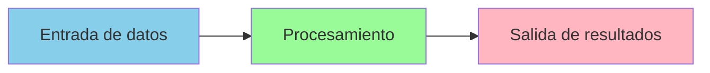

**1. Entrada de datos**: El usuario proporciona información mediante:

- Formularios web
- Interfaz gráfica (botones, campos de texto, etc.)
- Archivos
- Sensores o dispositivos externos
- Bases de datos

**2. Procesamiento**: El programa manipula los datos:

- Realiza cálculos
- Aplica lógica de negocio
- Valida información
- Toma decisiones

**3. Salida de resultados**: Se presenta la información procesada:

- Pantalla (web, escritorio, móvil)
- Archivo
- Base de datos
- Impresora
- Otro sistema

Sin embargo, en aplicaciones modernas necesitamos distinguir **tres aspectos fundamentales** que deben estar **separados** para facilitar el desarrollo y mantenimiento:

| Aspecto | Descripción | Ejemplo |
|---------|-------------|---------|
| **Interfaz de Usuario (GUI)** | Cómo el usuario interactúa con la aplicación | Páginas HTML, formularios, botones |
| **Procesamiento de datos** | La lógica que manipula la información | Cálculos, validaciones, reglas de negocio |
| **Almacenamiento de datos** | Dónde y cómo se guardan los datos | Base de datos, archivos, caché |

> [!IMPORTANT]
> La **separación de responsabilidades** es un principio fundamental en arquitectura de software. Cada componente debe tener una responsabilidad clara y única.

### 2.2 Interfaz gráfica de usuario (GUI)

La **interfaz gráfica de usuario** (GUI - Graphical User Interface) es la capa de presentación con la que interactúa el usuario. Un diseño efectivo de la GUI es **vital** para el éxito de la aplicación.

**Características de una buena GUI:**

- 🎯 **Intuitiva**: El usuario debe entender cómo usarla sin necesidad de un manual
- 🚀 **Rápida**: Responde de forma ágil a las acciones del usuario
- 🎨 **Atractiva**: Diseño visual agradable y profesional
- ♿ **Accesible**: Utilizable por personas con diferentes capacidades
- 📱 **Responsive**: Se adapta a diferentes tamaños de pantalla

**En el contexto de aplicaciones web con Java:**

La vista se compone principalmente de:

- **Páginas HTML**: Estructura del contenido
- **CSS**: Estilos y presentación visual
- **JavaScript**: Interactividad del lado del cliente
- **JSP** (JavaServer Pages): Generación dinámica de HTML

```html
<!-- Ejemplo de formulario HTML para una aplicación web -->
<!DOCTYPE html>
<html lang="es">
<head>
    <meta charset="UTF-8">
    <meta name="viewport" content="width=device-width, initial-scale=1.0">
    <title>Gestión de Clientes</title>
</head>
<body>

    <header>
        <h1>Alta de nuevo cliente</h1>
        <p>Complete el siguiente formulario para registrar un cliente en el sistema.</p>
    </header>

    <main>
        <form action="clientes" method="post" aria-labelledby="titulo-formulario">
            
            <fieldset>
                <legend id="titulo-formulario">Datos del cliente</legend>

                <div>
                    <label for="nombre">Nombre completo</label><br>
                    <input 
                        type="text" 
                        id="nombre" 
                        name="nombre" 
                        required 
                        aria-required="true"
                        autocomplete="name">
                </div>

                <div>
                    <label for="email">Correo electrónico</label><br>
                    <input 
                        type="email" 
                        id="email" 
                        name="email" 
                        required 
                        aria-required="true"
                        autocomplete="email">
                </div>

                <div>
                    <label for="telefono">Teléfono de contacto</label><br>
                    <input 
                        type="tel" 
                        id="telefono" 
                        name="telefono" 
                        required 
                        aria-required="true"
                        autocomplete="tel"
                        inputmode="tel">
                </div>

            </fieldset>

            <div>
                <button type="submit">Guardar cliente</button>
            </div>

        </form>
    </main>

    <footer>
        <p>Gestión de Clientes – Aplicación web</p>
    </footer>

</body>
</html>

```

> [!TIP]
> La **usabilidad** es un factor clave en el diseño de la GUI. Un programa con un procesamiento de datos óptimo pero incómodo de usar será rechazado por los usuarios.

### 2.3 Procesamiento de datos

El **procesamiento de datos** es donde reside la **lógica de negocio** de la aplicación. Debe cumplir las siguientes características:

**Principios del procesamiento:**

- ✅ **Eficaz**: Produce los resultados correctos
- ✅ **Eficiente**: Utiliza los recursos de forma óptima
- ✅ **Independiente de la GUI**: No debe depender de cómo se muestran los datos
- ✅ **Reutilizable**: Puede ser usado desde diferentes interfaces
- ✅ **Testeable**: Fácil de probar de forma aislada

**En el contexto de aplicaciones web con Java:**

El controlador de la aplicación serán principalmente los **Servlets**, que:

- Reciben las peticiones HTTP del usuario
- Invocan la lógica de negocio
- Interactúan con el modelo (base de datos)
- Deciden qué vista mostrar

```java
// Ejemplo de lógica de negocio separada de la presentación
public class ClienteService {
    private ClienteDAO clienteDAO;

    public ClienteService() {
        this.clienteDAO = new ClienteDAO(DataSourceUtil.getDataSource());
    }
    
    public boolean validarCliente(Cliente cliente) {
        // Lógica de validación
        if (cliente.getNombre() == null || cliente.getNombre().trim().isEmpty()) {
            return false;
        }
        if (cliente.getEmail() == null || !cliente.getEmail().contains("@")) {
            return false;
        }
        return true;
    }
    
    public void guardarCliente(Cliente cliente) throws SQLException {
        if (!validarCliente(cliente)) {
            throw new IllegalArgumentException("Datos del cliente no válidos");
        }
        clienteDAO.insertar(cliente);
    }
}
```

> [!IMPORTANT]
> Es fundamental **independizar el procesamiento de la GUI**. Un programa con una buena interfaz pero que procesa mal los datos también será rechazado.

### 2.4 Estructura de los datos

El programa debe ser capaz de **almacenar información** de forma persistente. Existen diferentes soportes de almacenamiento:

**Opciones de almacenamiento:**

- 💾 **Archivos**: Texto plano, CSV, XML, JSON
- 🗄️ **Bases de datos relacionales**: MySQL, Oracle, PostgreSQL, SQL Server
- 📊 **Bases de datos NoSQL**: MongoDB, Redis, Cassandra
- ☁️ **Almacenamiento en la nube**: AWS S3, Google Cloud Storage, Azure Blob Storage

**Ventajas del almacenamiento en bases de datos:**

| Ventaja | Descripción |
|---------|-------------|
| **Organización** | Los datos están estructurados en tablas relacionadas |
| **Integridad** | Garantías de consistencia mediante restricciones |
| **Concurrencia** | Múltiples usuarios pueden acceder simultáneamente |
| **Seguridad** | Control de acceso mediante usuarios y permisos |
| **Rendimiento** | Optimización mediante índices y consultas SQL |
| **Escalabilidad** | Capacidad de crecer con la aplicación |
| **Respaldo** | Facilidad para hacer copias de seguridad |

En esta unidad trabajamos con **bases de datos relacionales**, específicamente **Oracle**, que ya conocéis del módulo de Bases de Datos.

## 3. Arquitectura Modelo-Vista-Controlador (MVC)

### 3.1 ¿Qué es el patrón MVC?

**MVC** (Model-View-Controller) es un **patrón de diseño** arquitectónico ampliamente utilizado en el desarrollo de aplicaciones dinámicas, especialmente aplicaciones web. Aunque han aparecido nuevos patrones arquitectónicos estudiaremos este por su sencillez.

El patrón MVC se basa en la **separación de responsabilidades** en tres componentes principales:

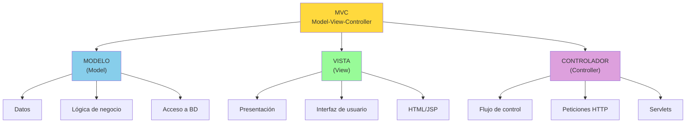

**Componentes del patrón MVC:**

1. **Modelo (Model)**
   Encapsula el **dominio y la lógica de negocio** de la aplicación. Se subdivide internamente en capas:

   - **Entidades / DTOs (Entity / DTO)**
     - Representan los datos del dominio
     - Contienen el estado de la aplicación
     - No implementan lógica de negocio compleja

   - **Repositorios / DAOs (Repository / DAO)**
     - Gestionan el acceso a la base de datos
     - Implementan operaciones CRUD
     - Aíslan la lógica de persistencia

   - **Servicios (Service)**
     - Implementan la lógica de negocio
     - Aplican reglas, validaciones y procesos
     - Orquestan el uso de repositorios

2. **Vista (View)**

   - Define cómo se presenta la información al usuario
   - Es la interfaz de usuario (GUI)
   - En aplicaciones web: HTML, JSP, plantillas
   - No contiene lógica de negocio (solo lógica de presentación)

3. **Controlador (Controller)**

   - Gestiona las peticiones del usuario
   - Actúa como intermediario entre Vista y Modelo
   - Invoca los servicios del modelo
   - Selecciona la vista adecuada como respuesta
   - En aplicaciones web: Servlets, Controllers MVC

---

>[!NOTE]
>
> Aunque el modelo esté dividido internamente en entidades, repositorios y servicios, **desde el punto de vista de MVC sigue siendo una única capa: el Modelo**.

>[!NOTE]
>
> El controlador no debería contener lógica de negocio, pero en aplicaciones simples asumimos parte de esa responsabilidad por simplicidad (por ejemplo validaciones simples). **Parte de la lógica de negocio queda en el controlador por ausencia de una capa de servicios.**

### 3.2 Ventajas del patrón MVC

El uso del patrón MVC proporciona múltiples beneficios:

**Ventajas técnicas:**

- ✅ **Separación de responsabilidades**: Cada componente tiene una función clara
- ✅ **Facilita el mantenimiento**: Los cambios se localizan en un único lugar
- ✅ **Permite el desarrollo paralelo**: Diferentes equipos pueden trabajar en cada capa
- ✅ **Reutilización de código**: El modelo puede usarse desde diferentes vistas
- ✅ **Testabilidad**: Cada componente puede probarse de forma independiente
- ✅ **Escalabilidad**: Fácil añadir nuevas funcionalidades

**Ventajas organizativas:**

- 👥 Un diseñador web puede trabajar en las vistas (HTML/CSS)
- 💻 Un programador backend trabaja en el modelo (lógica y BD)
- 🔧 Otro programador trabaja en los controladores
- 📊 Facilita la documentación y comprensión del código

**Ejemplo comparativo:**

```java
// ❌ SIN MVC: Todo mezclado en un único archivo (MALO)
public class ClienteServlet extends HttpServlet {
    protected void doPost(HttpServletRequest request, HttpServletResponse response) {
        // Mezcla de lógica de BD, validación y presentación HTML
        String nombre = request.getParameter("nombre");
        Connection conn = DriverManager.getConnection("jdbc:oracle:...");
        Statement stmt = conn.createStatement();
        stmt.executeUpdate("INSERT INTO clientes VALUES ('" + nombre + "')"); // SQL Injection!
        response.getWriter().println("<html><body>Cliente guardado</body></html>");
        conn.close();
    }
}

// ✅ CON MVC: Separado y organizado (BUENO)
// Modelo
public class Cliente { ... }
public class ClienteDAO { ... }

// Controlador
public class ClienteServlet extends HttpServlet {
    private ClienteDAO dao = new ClienteDAO(...);
    protected void doPost(HttpServletRequest request, HttpServletResponse response) {
        Cliente cliente = new Cliente(...);
        dao.insertar(cliente);
        request.getRequestDispatcher("exito.jsp").forward(request, response);
    }
}

// Vista (exito.jsp)
<html><body>Cliente guardado correctamente</body></html>
```

### 3.3 Esquema del patrón MVC

El siguiente esquema muestra la relación entre los componentes del patrón MVC en una aplicación web:

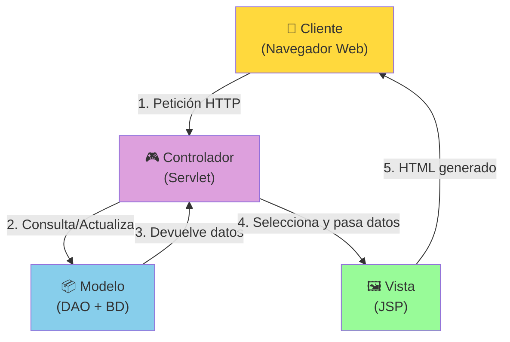

**Descripción del flujo:**

| Paso | Componente | Acción |
|------|------------|--------|
| **1** | Cliente | Realiza una petición HTTP (clic en botón, envío de formulario) |
| **2** | Controlador | Recibe la petición y solicita datos al Modelo |
| **3** | Modelo | Accede a la base de datos y devuelve la información |
| **4** | Controlador | Procesa los datos y los pasa a la Vista |
| **5** | Vista | Genera el HTML dinámico y lo envía al cliente |


### 3.4 Flujo de ejecución en MVC

Veamos un ejemplo concreto del flujo de ejecución cuando un usuario quiere **listar todos los clientes**:

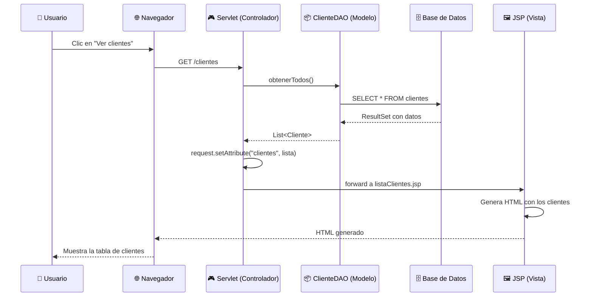

**Código correspondiente a cada paso:**

<details>
<summary>Ejemplo del proceso completo. No es necesario entender la sintaxis hasta el tema siguiente</summary>

**1. Usuario realiza la petición** (URL en el navegador):

```plaintext
http://localhost:8080/miapp/clientes
```

**2. Servlet recibe la petición** (Controlador):

```java
@WebServlet("/clientes")
public class ClienteServlet extends HttpServlet {
    private ClienteDAO clienteDAO;

    protected void doGet(HttpServletRequest request, HttpServletResponse response) 
            throws ServletException, IOException {
        try {
            // Paso 3: Solicitar datos al modelo
            List<Cliente> clientes = clienteDAO.obtenerTodos();
            
            // Paso 4: Pasar datos a la vista
            request.setAttribute("clientes", clientes);
            
            // Paso 5: Delegar en la vista
            request.getRequestDispatcher("/vistas/listaClientes.jsp")
                   .forward(request, response);
                   
        } catch (SQLException e) {
            e.printStackTrace();
            response.sendError(HttpServletResponse.SC_INTERNAL_SERVER_ERROR);
        }
    }
}
```

**3. DAO consulta la base de datos** (Modelo):

```java
public class ClienteDAO {
    public List<Cliente> obtenerTodos() throws SQLException {
        List<Cliente> clientes = new ArrayList<>();
        String sql = "SELECT * FROM clientes ORDER BY codigo";

        try (Connection conn = datasource.getConnection();
             PreparedStatement pstmt = conn.prepareStatement(sql);
             ResultSet rs = pstmt.executeQuery()) {
            
            while (rs.next()) {
                Cliente cliente = new Cliente(
                    rs.getInt("codigo"),
                    rs.getString("nombre"),
                    rs.getInt("telefono"),
                    rs.getString("tipo"),
                    rs.getInt("numRevisiones")
                );
                clientes.add(cliente);
            }
        }
        return clientes;
    }
}
```

**4. Vista genera el HTML** (Vista JSP):

```jsp
<%@ page contentType="text/html;charset=UTF-8" language="java" %>
<%@ taglib prefix="c" uri="http://java.sun.com/jsp/jstl/core" %>

<!DOCTYPE html>
<html>
<head>
    <title>Lista de Clientes</title>
    <link rel="stylesheet" href="css/estilos.css">
</head>
<body>
    <h1>Listado de Clientes</h1>
    <table>
        <thead>
            <tr>
                <th>Código</th>
                <th>Nombre</th>
                <th>Teléfono</th>
                <th>Tipo</th>
                <th>Revisiones</th>
            </tr>
        </thead>
        <tbody>
            <c:forEach var="cliente" items="${clientes}">
                <tr>
                    <td>${cliente.codigo}</td>
                    <td>${cliente.nombre}</td>
                    <td>${cliente.telefono}</td>
                    <td>${cliente.tipo}</td>
                    <td>${cliente.numRevisiones}</td>
                </tr>
            </c:forEach>
        </tbody>
    </table>
</body>
</html>
```

</details>

## 4. Desarrollo de aplicaciones MVC

### 4.1 Fases del ciclo de vida

En el desarrollo de cualquier aplicación, es fundamental seguir un **proceso estructurado**. Las fases del ciclo de vida del software son:

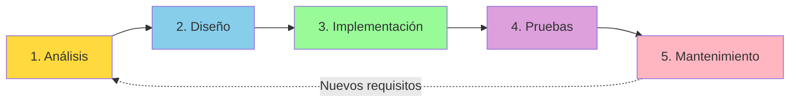

**Descripción de cada fase:**

| Fase | Objetivo | Entregables |
|------|----------|-------------|
| **1. Análisis** | Comprender qué necesita el cliente | Documento de requisitos, casos de uso |
| **2. Diseño** | Definir cómo se implementará | Diagramas de clases, modelo de BD, mockups |
| **3. Implementación** | Escribir el código | Código fuente, clases, JSPs, etc. |
| **4. Pruebas** | Verificar que funciona correctamente | Casos de prueba, informes de bugs |
| **5. Mantenimiento** | Corregir errores y añadir mejoras | Actualizaciones, parches, nuevas versiones |

> [!IMPORTANT]
> En la fase de **Diseño**, es crucial tener claro el **Modelo** (base de datos) y la **Vista** (interfaz de usuario), normalmente basándose en un documento de especificación que nace del Análisis.

### 4.2 Fase de diseño

En la fase de diseño de una aplicación MVC, debemos definir claramente los tres componentes:

**Tareas en la fase de diseño:**

**1. Diseño del Modelo:**

- Diseño de la base de datos (tablas, relaciones, restricciones)
- Identificación de entidades y sus atributos
- Definición de las clases DTO/Bean
- Diseño de las clases DAO

**2. Diseño de la Vista:**

- Creación de mockups o wireframes
- Definición de las páginas necesarias
- Diseño de la navegación entre páginas
- Especificación de formularios y validaciones

**3. Diseño del Controlador:**

- Identificación de las acciones del usuario
- Mapeo de URLs a Servlets
- Definición del flujo de control entre páginas
- Gestión de sesiones y estados

**Ejemplo de documentación de diseño:**

```plaintext
APLICACIÓN: Sistema de Gestión de Clientes ITV

MODELO:
- Tabla: CLIENTES (codigo, nombre, telefono, tipo, numRevisiones)
- Clase: Cliente.java (DTO)
- Clase: ClienteDAO.java (Acceso a datos)

VISTA:
- index.jsp: Página principal
- listaClientes.jsp: Listado de todos los clientes
- formularioCliente.jsp: Alta/edición de cliente
- detalleCliente.jsp: Ver información completa de un cliente

CONTROLADOR:
- ClienteServlet.java:
  GET /clientes -> listar todos -> listaClientes.jsp
  GET /clientes?id=X -> ver detalle -> detalleCliente.jsp
  GET /clientes/nuevo -> mostrar formulario -> formularioCliente.jsp
  POST /clientes -> guardar cliente -> redirect a lista
  POST /clientes/eliminar -> eliminar cliente -> redirect a lista
```

## 5. Modelo de la aplicación

### 5.1 La base de datos como pilar fundamental

El modelo de una aplicación MVC se fundamenta en la **base de datos**, que es donde se almacena toda la información persistente de la aplicación.

Sin embargo, el modelo no es solo la base de datos. En una aplicación Java basada en **Programación Orientada a Objetos** (POO), el modelo incluye:

1. **La base de datos**: Tablas, relaciones, restricciones
2. **Clases DTO/Bean**: Representación en Java de las entidades de la BD
3. **Clases DAO**: Acceso y manipulación de los datos

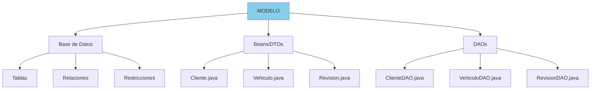

**Ejemplo de sistema de gestión ITV:**

Si tenemos las tablas:

- `ITV_CLIENTES`
- `ITV_VEHICULOS`
- `ITV_REVISIONES`

Crearemos las clases:

- `Cliente.java` (Bean)
- `Vehiculo.java` (Bean)
- `Revision.java` (Bean)
- `ClienteDAO.java` (Acceso a datos)
- `VehiculoDAO.java` (Acceso a datos)
- `RevisionDAO.java` (Acceso a datos)

### 5.2 Beans o DTOs

Los **Beans** (o **DTOs** - Data Transfer Objects) son clases Java que representan las entidades de la base de datos. Normalmente contienen un atributo por cada columna de la tabla.

**Características de un Bean:**

- ✅ Representa una tabla de la base de datos
- ✅ Atributos privados que corresponden a columnas
- ✅ Constructor vacío (sin parámetros)
- ✅ Constructor con parámetros
- ✅ Getters y setters para todos los atributos
- ✅ Método `toString()` para depuración
- ✅ **NO contiene lógica de negocio**
- ✅ **NO contiene acceso a base de datos**

**Ejemplo de tabla en Oracle:**

```sql
CREATE TABLE ITV_CLIENTES (
    CODIGO        NUMBER(11) PRIMARY KEY,
    NOMBRE        VARCHAR2(45) NOT NULL,
    TELEFONO      NUMBER(9) NOT NULL,
    TIPO          VARCHAR2(1) NOT NULL,
    NUMREVISIONES NUMBER(11) DEFAULT 0
);
```


**Clase Bean correspondiente:**

```java
package modelo;

public class Cliente {
    // Atributos (uno por cada columna)
    private int codigo;
    private String nombre;
    private int telefono;
    private String tipo;  // Nota: se podría usar un enum TipoCliente
    private int numRevisiones;

    // Constructor vacío (obligatorio)
    public Cliente() {
    }
    
    // Constructor con todos los parámetros
    public Cliente(int codigo, String nombre, int telefono, String tipo, int numRevisiones) {
        this.codigo = codigo;
        this.nombre = nombre;
        this.telefono = telefono;
        this.tipo = tipo;
        this.numRevisiones = numRevisiones;
    }
    
    // Getters y Setters
    public int getCodigo() {
        return codigo;
    }
    
    public void setCodigo(int codigo) {
        this.codigo = codigo;
    }
    
    public String getNombre() {
        return nombre;
    }
    
    public void setNombre(String nombre) {
        this.nombre = nombre;
    }
    
    public int getTelefono() {
        return telefono;
    }
    
    public void setTelefono(int telefono) {
        this.telefono = telefono;
    }
    
    public String getTipo() {
        return tipo;
    }
    
    public void setTipo(String tipo) {
        this.tipo = tipo;
    }
    
    public int getNumRevisiones() {
        return numRevisiones;
    }
    
    public void setNumRevisiones(int numRevisiones) {
        this.numRevisiones = numRevisiones;
    }
    
    // toString para depuración
    @Override
    public String toString() {
        return "Cliente{" +
                "codigo=" + codigo +
                ", nombre='" + nombre + '\'' +
                ", telefono=" + telefono +
                ", tipo='" + tipo + '\'' +
                ", numRevisiones=" + numRevisiones +
                '}';
    }
}
```

> [!TIP]
> En ciertos campos puede ser necesario adaptar el tipo de datos de la base de datos al tipo de datos de Java. Por ejemplo, podrías usar un `enum TipoCliente` en lugar de un `String` para el campo `tipo`.


### 5.3 Objetos de acceso a datos (DAO)

Las **clases DAO** (Data Access Object) son responsables de establecer contacto con la base de datos mediante consultas SQL y utilizan los Beans para gestionar la información.

**Características de un DAO:**

- 📊 Encapsula toda la lógica de acceso a datos
- 📊 Una clase DAO por cada tabla principal
- 📊 Implementa operaciones CRUD
- 📊 Utiliza PreparedStatement para prevenir SQL Injection
- 📊 Maneja excepciones SQLException
- 📊 Trabaja con objetos Bean/DTO

**Ejemplo de ClienteDAO:**

```java
package dao;

import modelo.Cliente;
import org.apache.tomcat.jdbc.pool.DataSource;
import java.sql.*;
import java.util.ArrayList;
import java.util.List;

public class ClienteDAO {
    private DataSource datasource;
    private static final String TABLA = "ITV_CLIENTES";

    public ClienteDAO(DataSource datasource) {
        this.datasource = datasource;
    }
    
    // CREATE - Insertar un cliente
    public void insertar(Cliente cliente) throws SQLException {
        String sql = "INSERT INTO " + TABLA + 
                    " (codigo, nombre, telefono, tipo, numRevisiones) " +
                    "VALUES (?, ?, ?, ?, ?)";
        
        try (Connection conn = datasource.getConnection();
             PreparedStatement pstmt = conn.prepareStatement(sql)) {
            
            pstmt.setInt(1, cliente.getCodigo());
            pstmt.setString(2, cliente.getNombre());
            pstmt.setInt(3, cliente.getTelefono());
            pstmt.setString(4, cliente.getTipo());
            pstmt.setInt(5, cliente.getNumRevisiones());
            
            pstmt.executeUpdate();
        }
    }
    
    // READ - Obtener un cliente por código
    public Cliente obtenerPorCodigo(int codigo) throws SQLException {
        String sql = "SELECT * FROM " + TABLA + " WHERE codigo = ?";
        
        try (Connection conn = datasource.getConnection();
             PreparedStatement pstmt = conn.prepareStatement(sql)) {
            
            pstmt.setInt(1, codigo);
            
            try (ResultSet rs = pstmt.executeQuery()) {
                if (rs.next()) {
                    return mapearCliente(rs);
                }
            }
        }
        return null;
    }
    
    // READ - Obtener todos los clientes
    public List<Cliente> obtenerTodos() throws SQLException {
        List<Cliente> clientes = new ArrayList<>();
        String sql = "SELECT * FROM " + TABLA + " ORDER BY codigo";
        
        try (Connection conn = datasource.getConnection();
             PreparedStatement pstmt = conn.prepareStatement(sql);
             ResultSet rs = pstmt.executeQuery()) {
            
            while (rs.next()) {
                clientes.add(mapearCliente(rs));
            }
        }
        return clientes;
    }
    
    // UPDATE - Actualizar un cliente
    public int actualizar(Cliente cliente) throws SQLException {
        String sql = "UPDATE " + TABLA + 
                    " SET nombre = ?, telefono = ?, tipo = ?, numRevisiones = ? " +
                    "WHERE codigo = ?";
        
        try (Connection conn = datasource.getConnection();
             PreparedStatement pstmt = conn.prepareStatement(sql)) {
            
            pstmt.setString(1, cliente.getNombre());
            pstmt.setInt(2, cliente.getTelefono());
            pstmt.setString(3, cliente.getTipo());
            pstmt.setInt(4, cliente.getNumRevisiones());
            pstmt.setInt(5, cliente.getCodigo());
            
            return pstmt.executeUpdate();
        }
    }
    
    // DELETE - Eliminar un cliente
    public int eliminar(int codigo) throws SQLException {
        String sql = "DELETE FROM " + TABLA + " WHERE codigo = ?";
        
        try (Connection conn = datasource.getConnection();
             PreparedStatement pstmt = conn.prepareStatement(sql)) {
            
            pstmt.setInt(1, codigo);
            return pstmt.executeUpdate();
        }
    }
    
    // Método auxiliar para mapear ResultSet a Cliente
    private Cliente mapearCliente(ResultSet rs) throws SQLException {
        return new Cliente(
            rs.getInt("codigo"),
            rs.getString("nombre"),
            rs.getInt("telefono"),
            rs.getString("tipo"),
            rs.getInt("numRevisiones")
        );
    }
    
    // Métodos adicionales útiles
    public List<Cliente> buscarPorNombre(String nombre) throws SQLException {
        List<Cliente> clientes = new ArrayList<>();
        String sql = "SELECT * FROM " + TABLA + 
                    " WHERE UPPER(nombre) LIKE UPPER(?) ORDER BY codigo";
        
        try (Connection conn = datasource.getConnection();
             PreparedStatement pstmt = conn.prepareStatement(sql)) {
            
            pstmt.setString(1, "%" + nombre + "%");
            
            try (ResultSet rs = pstmt.executeQuery()) {
                while (rs.next()) {
                    clientes.add(mapearCliente(rs));
                }
            }
        }
        return clientes;
    }
    
    public List<Cliente> obtenerPorTipo(String tipo) throws SQLException {
        List<Cliente> clientes = new ArrayList<>();
        String sql = "SELECT * FROM " + TABLA + 
                    " WHERE tipo = ? ORDER BY codigo";
        
        try (Connection conn = datasource.getConnection();
             PreparedStatement pstmt = conn.prepareStatement(sql)) {
            
            pstmt.setString(1, tipo);
            
            try (ResultSet rs = pstmt.executeQuery()) {
                while (rs.next()) {
                    clientes.add(mapearCliente(rs));
                }
            }
        }
        return clientes;
    }
}
```

> [!NOTE]
> Las clases DAO consultarán continuamente la base de datos con cualquier petición de información. Son el **único punto de acceso** a los datos.

### 5.4 Ejemplo completo de modelo

Para un sistema de gestión ITV completo, el modelo incluiría:

**Estructura de paquetes:**

```plaintext
src/
└── main/
    └── java/
        └── com/
            └── itv/
                └── modelo/
                    ├── beans/
                    │   ├── Cliente.java
                    │   ├── Vehiculo.java
                    │   ├── Revision.java
                    │   └── TipoCliente.java (enum)
                    └── dao/
                        ├── ClienteDAO.java
                        ├── VehiculoDAO.java
                        ├── RevisionDAO.java
                        └── DataSourceUtil.java
```

**Clase Vehiculo (Bean):**

```java
package modelo.beans;

import java.time.LocalDate;

public class Vehiculo {
    private String matricula;
    private String marca;
    private String modelo;
    private LocalDate fechaMatriculacion;
    private Cliente propietario; // composión OO

    // Constructores, getters, setters, toString...
}
```

**Clase Revision (Bean):**

```java
package modelo.beans;

import java.time.LocalDateTime;

public class Revision {
    private int codigo;
    private Vehiculo vehiculo; // composición OO
    private LocalDateTime fechaRevision;
    private boolean aprobada;
    private String observaciones;

    // Constructores, getters, setters, toString...
}
```

**Clase DataSourceUtil (utilidad para el pool de conexiones):**

```java
package modelo.dao;

import org.apache.tomcat.jdbc.pool.DataSource;
import org.apache.tomcat.jdbc.pool.PoolProperties;

public class DataSourceUtil {
    private static DataSource datasource = null;

    public static DataSource getDataSource() {
        if (datasource == null) {
            PoolProperties pool = new PoolProperties();
            pool.setUrl("jdbc:oracle:thin:@localhost:1521:ORCLCDB");
            pool.setDriverClassName("oracle.jdbc.driver.OracleDriver");
            pool.setUsername("itv_user");
            pool.setPassword("itv_pass");
            pool.setMaxActive(20);
            pool.setMaxIdle(10);
            pool.setMinIdle(5);
            pool.setMaxWait(10000);
            pool.setTestOnBorrow(true);
            pool.setValidationQuery("SELECT 1 FROM DUAL");
            
            datasource = new DataSource();
            datasource.setPoolProperties(pool);
        }
        return datasource;
    }
}
```

## 6. Controlador de la aplicación

### 6.1 Servlets como controladores

En aplicaciones web Java, los **Servlets** actúan como controladores principales del patrón MVC. Un Servlet es una clase Java que:

- Hereda de `HttpServlet`
- Puede gestionar peticiones HTTP (GET, POST, PUT, DELETE...)
- En versiones modernas se mapea a una URL mediante anotaciones `@WebServlet`
- Coordina el modelo y la vista

<details>
<summary>Código de ejemplo. Ne es necesario comprenderlo hasta el tema siguiente.</summary>

**Anatomía de un Servlet:**

```java
package controlador;

import javax.servlet.*;
import javax.servlet.http.*;
import javax.servlet.annotation.*;
import java.io.IOException;

@WebServlet(name = "ClienteServlet", urlPatterns = {"/clientes"})
public class ClienteServlet extends HttpServlet {

    // Inicialización (se ejecuta una sola vez)
    @Override
    public void init() throws ServletException {
        super.init();
        // Inicializar recursos (DAO, servicios, etc.)
    }
    
    // Gestiona peticiones GET
    @Override
    protected void doGet(HttpServletRequest request, HttpServletResponse response) 
            throws ServletException, IOException {
        // Lógica para GET
    }
    
    // Gestiona peticiones POST
    @Override
    protected void doPost(HttpServletRequest request, HttpServletResponse response) 
            throws ServletException, IOException {
        // Lógica para POST
    }
    
    // Limpieza (se ejecuta al destruir el servlet)
    @Override
    public void destroy() {
        super.destroy();
        // Liberar recursos
    }
}
```

</details>

### 6.2 Responsabilidades del controlador

El controlador tiene las siguientes responsabilidades:

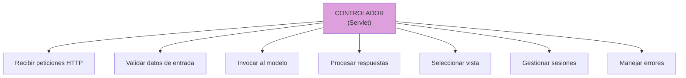

**Detalle de responsabilidades:**

1. **Recibir peticiones HTTP**:
   - Analizar los parámetros de la petición
   - Determinar qué acción se solicita

2. **Validar datos de entrada**:
   - Verificar que los datos son correctos
   - Comprobar permisos y autenticación

3. **Invocar al modelo**:
   - Llamar a los DAOs necesarios
   - Ejecutar la lógica de negocio

4. **Procesar respuestas**:
   - Preparar los datos para la vista
   - Gestionar mensajes de éxito o error

5. **Seleccionar vista**:
   - Decidir qué JSP mostrar
   - Realizar forward o redirect

6. **Gestionar sesiones**:
   - Mantener información del usuario
   - Controlar el estado de la aplicación

7. **Manejar errores**:
   - Capturar excepciones
   - Mostrar mensajes de error amigables

### 6.3 Ejemplo de Servlet controlador

<details>
<summary>Código de ejemplo. Ne es necesario comprenderlo hasta el tema siguiente</summary>

A continuación, un ejemplo completo de un Servlet que gestiona las operaciones CRUD de clientes:

```java
package controlador;

import modelo.beans.Cliente;
import modelo.dao.ClienteDAO;
import modelo.dao.DataSourceUtil;

import javax.servlet.*;
import javax.servlet.http.*;
import javax.servlet.annotation.*;
import java.io.IOException;
import java.sql.SQLException;
import java.util.List;

@WebServlet(name = "ClienteServlet", urlPatterns = {"/clientes"})
public class ClienteServlet extends HttpServlet {
    private ClienteDAO clienteDAO;

    @Override
    public void init() throws ServletException {
        super.init();
        // Inicializar el DAO con el pool de conexiones
        clienteDAO = new ClienteDAO(DataSourceUtil.getDataSource());
    }
    
    @Override
    protected void doGet(HttpServletRequest request, HttpServletResponse response) 
            throws ServletException, IOException {
        
        String accion = request.getParameter("accion");
        
        try {
            if (accion == null || accion.equals("listar")) {
                listarClientes(request, response);
                
            } else if (accion.equals("nuevo")) {
                mostrarFormularioNuevo(request, response);
                
            } else if (accion.equals("editar")) {
                mostrarFormularioEditar(request, response);
                
            } else if (accion.equals("ver")) {
                verDetalle(request, response);
                
            } else {
                response.sendError(HttpServletResponse.SC_BAD_REQUEST, "Acción no válida");
            }
            
        } catch (SQLException e) {
            manejarError(request, response, e);
        }
    }
    
    @Override
    protected void doPost(HttpServletRequest request, HttpServletResponse response) 
            throws ServletException, IOException {
        
        String accion = request.getParameter("accion");
        
        try {
            if (accion.equals("guardar")) {
                guardarCliente(request, response);
                
            } else if (accion.equals("actualizar")) {
                actualizarCliente(request, response);
                
            } else if (accion.equals("eliminar")) {
                eliminarCliente(request, response);
                
            } else {
                response.sendError(HttpServletResponse.SC_BAD_REQUEST, "Acción no válida");
            }
            
        } catch (SQLException e) {
            manejarError(request, response, e);
        }
    }
    
    // ========== Métodos auxiliares ==========
    
    private void listarClientes(HttpServletRequest request, HttpServletResponse response) 
            throws ServletException, IOException, SQLException {
        
        // Obtener lista de clientes del modelo
        List<Cliente> clientes = clienteDAO.obtenerTodos();
        
        // Pasar datos a la vista
        request.setAttribute("clientes", clientes);
        
        // Delegar en la vista
        RequestDispatcher dispatcher = request.getRequestDispatcher("/vistas/listaClientes.jsp");
        dispatcher.forward(request, response);
    }
    
    private void mostrarFormularioNuevo(HttpServletRequest request, HttpServletResponse response) 
            throws ServletException, IOException {
        
        // Simplemente mostrar el formulario vacío
        RequestDispatcher dispatcher = request.getRequestDispatcher("/vistas/formularioCliente.jsp");
        dispatcher.forward(request, response);
    }
    
    private void mostrarFormularioEditar(HttpServletRequest request, HttpServletResponse response) 
            throws ServletException, IOException, SQLException {
        
        int codigo = Integer.parseInt(request.getParameter("codigo"));
        
        // Obtener el cliente del modelo
        Cliente cliente = clienteDAO.obtenerPorCodigo(codigo);
        
        if (cliente != null) {
            // Pasar el cliente a la vista
            request.setAttribute("cliente", cliente);
            RequestDispatcher dispatcher = request.getRequestDispatcher("/vistas/formularioCliente.jsp");
            dispatcher.forward(request, response);
        } else {
            response.sendError(HttpServletResponse.SC_NOT_FOUND, "Cliente no encontrado");
        }
    }
    
    private void verDetalle(HttpServletRequest request, HttpServletResponse response) 
            throws ServletException, IOException, SQLException {
        
        int codigo = Integer.parseInt(request.getParameter("codigo"));
        
        // Obtener el cliente del modelo
        Cliente cliente = clienteDAO.obtenerPorCodigo(codigo);
        
        if (cliente != null) {
            // Pasar el cliente a la vista
            request.setAttribute("cliente", cliente);
            RequestDispatcher dispatcher = request.getRequestDispatcher("/vistas/detalleCliente.jsp");
            dispatcher.forward(request, response);
        } else {
            response.sendError(HttpServletResponse.SC_NOT_FOUND, "Cliente no encontrado");
        }
    }
    
    private void guardarCliente(HttpServletRequest request, HttpServletResponse response) 
            throws ServletException, IOException, SQLException {
        
        // Obtener datos del formulario
        int codigo = Integer.parseInt(request.getParameter("codigo"));
        String nombre = request.getParameter("nombre");
        int telefono = Integer.parseInt(request.getParameter("telefono"));
        String tipo = request.getParameter("tipo");
        
        // Crear objeto Cliente
        Cliente cliente = new Cliente(codigo, nombre, telefono, tipo, 0);
        
        // Guardar en la base de datos
        clienteDAO.insertar(cliente);
        
        // Redirigir a la lista (patrón POST-Redirect-GET)
        response.sendRedirect("clientes?accion=listar");
    }
    
    private void actualizarCliente(HttpServletRequest request, HttpServletResponse response) 
            throws ServletException, IOException, SQLException {
        
        // Obtener datos del formulario
        int codigo = Integer.parseInt(request.getParameter("codigo"));
        String nombre = request.getParameter("nombre");
        int telefono = Integer.parseInt(request.getParameter("telefono"));
        String tipo = request.getParameter("tipo");
        int numRevisiones = Integer.parseInt(request.getParameter("numRevisiones"));
        
        // Crear objeto Cliente
        Cliente cliente = new Cliente(codigo, nombre, telefono, tipo, numRevisiones);
        
        // Actualizar en la base de datos
        int filasAfectadas = clienteDAO.actualizar(cliente);
        
        if (filasAfectadas > 0) {
            // Redirigir a la lista
            response.sendRedirect("clientes?accion=listar");
        } else {
            response.sendError(HttpServletResponse.SC_NOT_FOUND, "Cliente no encontrado");
        }
    }
    
    private void eliminarCliente(HttpServletRequest request, HttpServletResponse response) 
            throws ServletException, IOException, SQLException {
        
        int codigo = Integer.parseInt(request.getParameter("codigo"));
        
        // Eliminar de la base de datos
        int filasAfectadas = clienteDAO.eliminar(codigo);
        
        if (filasAfectadas > 0) {
            // Redirigir a la lista
            response.sendRedirect("clientes?accion=listar");
        } else {
            response.sendError(HttpServletResponse.SC_NOT_FOUND, "Cliente no encontrado");
        }
    }
    
    private void manejarError(HttpServletRequest request, HttpServletResponse response, Exception e) 
            throws ServletException, IOException {
        
        e.printStackTrace();
        request.setAttribute("error", e.getMessage());
        RequestDispatcher dispatcher = request.getRequestDispatcher("/vistas/error.jsp");
        dispatcher.forward(request, response);
    }
}
```

> [!TIP]
> El patrón **POST-Redirect-GET** (PRG) evita que el usuario pueda enviar el mismo formulario múltiples veces al recargar la página. Después de un POST, siempre redirigimos con `sendRedirect()`.

</details>

### 6.4 Clases auxiliares del controlador

Si el código del Servlet se vuelve muy extenso o necesitamos reutilizar código, podemos crear **clases auxiliares** que también formarán parte del controlador.

<details>
<summary>Código de ejemplo. Ne es necesario comprenderlo hasta el tema siguiente</summary>

**Clase ValidadorCliente:**

```java
package controlador.util;

import modelo.beans.Cliente;
import java.util.ArrayList;
import java.util.List;

public class ValidadorCliente {

    public static List<String> validar(Cliente cliente) {
        List<String> errores = new ArrayList<>();
        
        if (cliente.getCodigo() <= 0) {
            errores.add("El código debe ser un número positivo");
        }
        
        if (cliente.getNombre() == null || cliente.getNombre().trim().isEmpty()) {
            errores.add("El nombre es obligatorio");
        } else if (cliente.getNombre().length() > 45) {
            errores.add("El nombre no puede superar 45 caracteres");
        }
        
        if (cliente.getTelefono() < 100000000 || cliente.getTelefono() > 999999999) {
            errores.add("El teléfono debe tener 9 dígitos");
        }
        
        if (!cliente.getTipo().matches("[NVE]")) {
            errores.add("El tipo debe ser N, V o E");
        }
        
        return errores;
    }
}
```

**Uso en el Servlet:**

```java
private void guardarCliente(HttpServletRequest request, HttpServletResponse response)
        throws ServletException, IOException, SQLException {

    // Crear objeto Cliente
    Cliente cliente = new Cliente(...);
    
    // Validar
    List<String> errores = ValidadorCliente.validar(cliente);
    
    if (!errores.isEmpty()) {
        request.setAttribute("errores", errores);
        request.setAttribute("cliente", cliente);
        RequestDispatcher dispatcher = request.getRequestDispatcher("/vistas/formularioCliente.jsp");
        dispatcher.forward(request, response);
        return;
    }
    
    // Si no hay errores, guardar
    clienteDAO.insertar(cliente);
    response.sendRedirect("clientes?accion=listar");
}
```

</details>

## 7. Vista de la aplicación

### 7.1 Páginas HTML y JSP

En una aplicación web, la **vista** es la capa de presentación que genera el HTML que verá el usuario en su navegador. La vista se compone de:

- **Páginas HTML estáticas**: Contenido que no cambia
- **Páginas JSP** (JavaServer Pages): Generan HTML dinámicamente
- **CSS**: Estilos visuales
- **JavaScript**: Interactividad del lado del cliente

**JSP vs HTML:**

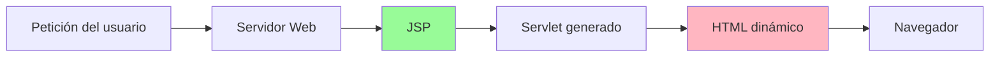

**Proceso de transformación:**

1. El usuario solicita una página `.jsp`
2. El servidor web compila el JSP en un Servlet
3. El Servlet se ejecuta y genera HTML
4. El HTML se envía al navegador del usuario

### 7.2 Generación dinámica de vistas

Las páginas JSP permiten **embeber código Java** dentro del HTML para generar contenido dinámico. Sin embargo, es una **mala práctica** incluir lógica compleja en JSP.

**Elementos básicos de JSP:**

| Elemento | Sintaxis | Uso |
|----------|----------|-----|
| **Scriptlet** | `<% código %>` | Ejecutar código Java (evitar) |
| **Expresión** | `<%= expresión %>` | Mostrar un valor |
| **Directiva** | `<%@ directiva %>` | Configuración (imports, etc.) |
| **JSTL** | `<c:forEach>`, `<c:if>` | Alternativa a scriptlets |
| **EL** | `${variable}` | Expression Language (recomendado) |


### 7.3 Ejemplo de vista JSP

<details>
<summary>Código de ejemplo. Ne es necesario comprenderlo hasta el tema siguiente</summary>

**Lista de clientes (listaClientes.jsp):**

```jsp
<%@ page contentType="text/html;charset=UTF-8" language="java" %>
<%@ taglib prefix="c" uri="http://java.sun.com/jsp/jstl/core" %>

<!DOCTYPE html>
<html lang="es">
<head>
    <meta charset="UTF-8">
    <meta name="viewport" content="width=device-width, initial-scale=1.0">
    <title>Lista de Clientes - Sistema ITV</title>
    <link rel="stylesheet" href="${pageContext.request.contextPath}/css/estilos.css">
</head>
<body>
    <header>
        <h1>📋 Gestión de Clientes ITV</h1>
        <nav>
            <a href="clientes?accion=listar">Listar</a>
            <a href="clientes?accion=nuevo">Nuevo Cliente</a>
        </nav>
    </header>
    
    <main>
        <h2>Listado de Clientes</h2>
        
        <c:if test="${not empty clientes}">
            <table>
                <thead>
                    <tr>
                        <th>Código</th>
                        <th>Nombre</th>
                        <th>Teléfono</th>
                        <th>Tipo</th>
                        <th>Revisiones</th>
                        <th>Acciones</th>
                    </tr>
                </thead>
                <tbody>
                    <c:forEach var="cliente" items="${clientes}">
                        <tr>
                            <td>${cliente.codigo}</td>
                            <td>${cliente.nombre}</td>
                            <td>${cliente.telefono}</td>
                            <td>
                                <c:choose>
                                    <c:when test="${cliente.tipo == 'N'}">Normal</c:when>
                                    <c:when test="${cliente.tipo == 'V'}">VIP ⭐</c:when>
                                    <c:when test="${cliente.tipo == 'E'}">Empresa 🏢</c:when>
                                </c:choose>
                            </td>
                            <td>${cliente.numRevisiones}</td>
                            <td>
                                <a href="clientes?accion=ver&codigo=${cliente.codigo}">👁️ Ver</a>
                                <a href="clientes?accion=editar&codigo=${cliente.codigo}">✏️ Editar</a>
                                <form action="clientes" method="post" style="display:inline;" 
                                      onsubmit="return confirm('¿Eliminar este cliente?');">
                                    <input type="hidden" name="accion" value="eliminar">
                                    <input type="hidden" name="codigo" value="${cliente.codigo}">
                                    <button type="submit">🗑️ Eliminar</button>
                                </form>
                            </td>
                        </tr>
                    </c:forEach>
                </tbody>
            </table>
        </c:if>
        
        <c:if test="${empty clientes}">
            <p class="info">No hay clientes registrados. 
               <a href="clientes?accion=nuevo">Crear el primero</a>
            </p>
        </c:if>
    </main>
    
    <footer>
        <p>© 2025 Sistema de Gestión ITV</p>
    </footer>
</body>
</html>
```

**Formulario de cliente (formularioCliente.jsp):**

```jsp
<%@ page contentType="text/html;charset=UTF-8" language="java" %>
<%@ taglib prefix="c" uri="http://java.sun.com/jsp/jstl/core" %>

<!DOCTYPE html>
<html lang="es">
<head>
    <meta charset="UTF-8">
    <meta name="viewport" content="width=device-width, initial-scale=1.0">
    <title>${empty cliente ? 'Nuevo' : 'Editar'} Cliente - Sistema ITV</title>
    <link rel="stylesheet" href="${pageContext.request.contextPath}/css/estilos.css">
</head>
<body>
    <header>
        <h1>📝 ${empty cliente ? 'Nuevo' : 'Editar'} Cliente</h1>
    </header>
    
    <main>
        <!-- Mostrar errores de validación -->
        <c:if test="${not empty errores}">
            <div class="alert alert-error">
                <h3>⚠️ Errores de validación:</h3>
                <ul>
                    <c:forEach var="error" items="${errores}">
                        <li>${error}</li>
                    </c:forEach>
                </ul>
            </div>
        </c:if>
        
        <form action="clientes" method="post">
            <input type="hidden" name="accion" value="${empty cliente ? 'guardar' : 'actualizar'}">
            
            <div class="form-group">
                <label for="codigo">Código:</label>
                <input type="number" id="codigo" name="codigo" 
                       value="${cliente.codigo}" 
                       ${empty cliente ? '' : 'readonly'}
                       required>
            </div>
            
            <div class="form-group">
                <label for="nombre">Nombre:</label>
                <input type="text" id="nombre" name="nombre" 
                       value="${cliente.nombre}" 
                       maxlength="45" required>
            </div>
            
            <div class="form-group">
                <label for="telefono">Teléfono:</label>
                <input type="tel" id="telefono" name="telefono" 
                       value="${cliente.telefono}" 
                       pattern="[0-9]{9}" required>
                <small>Formato: 9 dígitos</small>
            </div>
            
            <div class="form-group">
                <label for="tipo">Tipo de Cliente:</label>
                <select id="tipo" name="tipo" required>
                    <option value="N" ${cliente.tipo == 'N' ? 'selected' : ''}>Normal</option>
                    <option value="V" ${cliente.tipo == 'V' ? 'selected' : ''}>VIP</option>
                    <option value="E" ${cliente.tipo == 'E' ? 'selected' : ''}>Empresa</option>
                </select>
            </div>
            
            <c:if test="${not empty cliente}">
                <div class="form-group">
                    <label for="numRevisiones">Número de Revisiones:</label>
                    <input type="number" id="numRevisiones" name="numRevisiones" 
                           value="${cliente.numRevisiones}" readonly>
                </div>
            </c:if>
            
            <div class="form-actions">
                <button type="submit" class="btn-primary">💾 Guardar</button>
                <a href="clientes?accion=listar" class="btn-secondary">❌ Cancelar</a>
            </div>
        </form>
    </main>
</body>
</html>
```

</details>

### 7.4 Separación de presentación y lógica

Es fundamental mantener la **separación entre la presentación (vista) y la lógica (controlador/modelo)**:

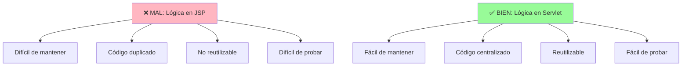

**Ejemplo de lo que NO hacer:**

```jsp
<%-- ❌ MAL: Lógica de negocio en JSP --%>
<%
    Connection conn = DriverManager.getConnection("jdbc:oracle:...");
    Statement stmt = conn.createStatement();
    ResultSet rs = stmt.executeQuery("SELECT * FROM clientes");

    while (rs.next()) {
        out.println("<tr>");
        out.println("<td>" + rs.getInt("codigo") + "</td>");
        out.println("<td>" + rs.getString("nombre") + "</td>");
        out.println("</tr>");
    }
    
    rs.close();
    stmt.close();
    conn.close();
%>
```

**Ejemplo de lo que SÍ hacer:**

```jsp
<%-- ✅ BIEN: Solo presentación en JSP --%>
<c:forEach var="cliente" items="${clientes}">
    <tr>
        <td>${cliente.codigo}</td>
        <td>${cliente.nombre}</td>
    </tr>
</c:forEach>
```

> [!IMPORTANT]
> **La vista NO debe contener**:
>
> - Acceso directo a base de datos
> - Lógica de negocio compleja
> - Cálculos complejos
> - Validaciones de negocio
>
> **La vista SÍ puede contener**:
>
> - Formateo de fechas y números
> - Condicionales simples de presentación
> - Bucles para mostrar listas
> - Validaciones de formato HTML5

## 8. Reorganización de clases

### 8.1 Estructura de paquetes

Para tener el código **mucho más organizado**, cuando una aplicación se basa en el patrón MVC, es fundamental reorganizar las clases en **tres paquetes principales**:

```plaintext
proyecto-itv/
├── src/
│   └── main/
│       ├── java/
│       │   └── com/
│       │       └── itv/
│       │           ├── modelo/
│       │           │   ├── beans/
│       │           │   │   ├── Cliente.java
│       │           │   │   ├── Vehiculo.java
│       │           │   │   ├── Revision.java
│       │           │   │   └── TipoCliente.java
│       │           │   └── dao/
│       │           │       ├── ClienteDAO.java
│       │           │       ├── VehiculoDAO.java
│       │           │       ├── RevisionDAO.java
│       │           │       └── DataSourceUtil.java
│       │           ├── controlador/
│       │           │   ├── ClienteServlet.java
│       │           │   ├── VehiculoServlet.java
│       │           │   ├── RevisionServlet.java
│       │           │   └── util/
│       │           │       ├── ValidadorCliente.java
│       │           │       └── ValidadorVehiculo.java
│       │           └── config/
│       │               └── ConfiguracionDB.java
│       └── webapp/
│           ├── WEB-INF/
│           │   ├── web.xml
│           │   └── lib/
│           ├── vistas/
│           │   ├── clientes/
│           │   │   ├── lista.jsp
│           │   │   ├── formulario.jsp
│           │   │   └── detalle.jsp
│           │   ├── vehiculos/
│           │   │   ├── lista.jsp
│           │   │   ├── formulario.jsp
│           │   │   └── detalle.jsp
│           │   ├── comunes/
│           │   │   ├── cabecera.jsp
│           │   │   ├── pie.jsp
│           │   │   └── menu.jsp
│           │   └── error.jsp
│           ├── css/
│           │   ├── estilos.css
│           │   └── responsive.css
│           ├── js/
│           │   ├── validaciones.js
│           │   └── utilidades.js
│           ├── imagenes/
│           │   └── logo.png
│           └── index.jsp
└── pom.xml
```

**Organización por capas:**

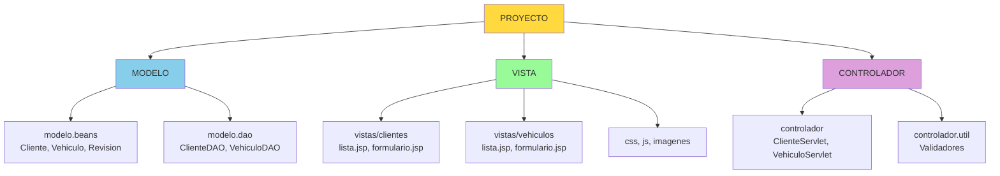

### 8.2 Convenciones de nomenclatura

Seguir convenciones de nomenclatura hace que el código sea más legible y profesional:

| Tipo | Convención | Ejemplo |
|------|------------|---------|
| **Paquetes** | minúsculas, separado por puntos | `com.itv.modelo.dao` |
| **Clases** | PascalCase (primera letra mayúscula) | `ClienteServlet` |
| **Interfaces** | PascalCase| `IClienteDAO` (en C#) o `ClienteDAO` (en Java) |
| **Métodos** | camelCase (primera letra minúscula) | `obtenerTodos()` |
| **Variables** | camelCase | `clienteDAO` |
| **Constantes** | MAYÚSCULAS_CON_GUIÓN | `MAX_INTENTOS` |
| **Beans/DTOs** | Nombre de la entidad | `Cliente`, `Vehiculo` |
| **DAOs** | NombreEntidad + DAO | `ClienteDAO`, `VehiculoDAO` |
| **Servlets** | NombreEntidad + Servlet | `ClienteServlet` |
| **JSPs** | minúsculas con guiones | `lista-clientes.jsp` |

### 8.3 Ejemplo de organización completa

**Declaración de paquetes en cada archivo:**

```java
// Cliente.java
package com.itv.modelo.beans;

public class Cliente {
    // ...
}
```

```java
// ClienteDAO.java
package com.itv.modelo.dao;

import com.itv.modelo.beans.Cliente;
import org.apache.tomcat.jdbc.pool.DataSource;
// ...

public class ClienteDAO {
    // ...
}
```

```java
// ClienteServlet.java
package com.itv.controlador;

import com.itv.modelo.beans.Cliente;
import com.itv.modelo.dao.ClienteDAO;
import com.itv.modelo.dao.DataSourceUtil;
// ...

@WebServlet("/clientes")
public class ClienteServlet extends HttpServlet {
    // ...
}
```

> [!TIP]
> Esta organización facilita enormemente el mantenimiento y la comprensión del código, especialmente en proyectos grandes con múltiples desarrolladores.

## 9. Esquema de interacción de una aplicación web

### 9.1 Componentes del sistema

Una aplicación web completa con arquitectura MVC se compone de los siguientes elementos:

| Componente | Descripción | Tecnología |
|------------|-------------|------------|
| **Cliente** | Navegador web del usuario | Chrome, Firefox, Safari, Edge |
| **Servidor Web** | Gestiona las peticiones HTTP | Apache Tomcat, Jetty, WildFly |
| **Controlador** | Procesa peticiones y coordina | Servlets |
| **Modelo** | Lógica de negocio y datos | Beans, DAOs, Servicios |
| **Vista** | Presentación | JSP, HTML, CSS, JavaScript |
| **Base de Datos** | Almacenamiento persistente | Oracle, MySQL, PostgreSQL |

### 9.2 Flujo de datos

El flujo de datos en una aplicación web MVC sigue este esquema:

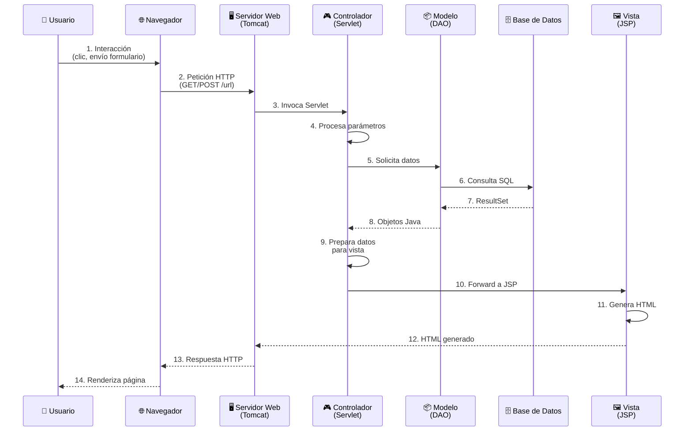

### 9.3 Diagrama de interacción completo

A continuación se muestra un diagrama más detallado que incluye todos los componentes y sus interacciones:

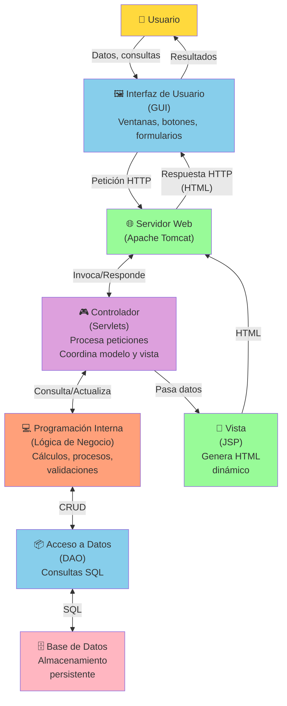

**Descripción de cada interacción:**

1. **Usuario → GUI**: El usuario interactúa con la interfaz (clic en botón, rellena formulario)
2. **GUI → Servidor Web**: El navegador envía una petición HTTP
3. **Servidor Web → Controlador**: Tomcat invoca el Servlet correspondiente
4. **Controlador → Lógica de Negocio**: El Servlet ejecuta validaciones y procesos
5. **Lógica → DAO**: Se solicitan o actualizan datos
6. **DAO → Base de Datos**: Se ejecutan consultas SQL
7. **Base de Datos → DAO**: Se devuelven los resultados (ResultSet)
8. **DAO → Lógica**: Los datos se convierten en objetos Java (Beans)
9. **Lógica → Controlador**: Se devuelven los datos procesados
10. **Controlador → Vista**: Se pasan los datos al JSP
11. **Vista → Servidor Web**: El JSP genera HTML dinámico
12. **Servidor Web → GUI**: Se envía la respuesta HTTP con el HTML
13. **GUI → Usuario**: El navegador renderiza y muestra la página

> [!NOTE]
> Este flujo se repite en cada petición del usuario. El servidor web (Tomcat) gestiona múltiples peticiones simultáneas de diferentes usuarios gracias al uso de threads y el pool de conexiones.

## 10. Arquitecturas alternativas (avanzado)

Aunque el patrón MVC es el más utilizado, existen otras arquitecturas modernas que han ganado popularidad en los últimos años. Esta sección es **opcional y avanzada**, pero es importante conocer estas alternativas para el futuro.

### 10.1 Arquitectura hexagonal (Ports and Adapters)

La **Arquitectura Hexagonal**, también conocida como **"Ports and Adapters"**, fue propuesta por Alistair Cockburn. Divide las clases de un sistema en dos grupos principales:

- **Clases de dominio**: Directamente relacionadas con la lógica de negocio
- **Clases externas**: Relacionadas con la interfaz de usuario e integración con sistemas externos

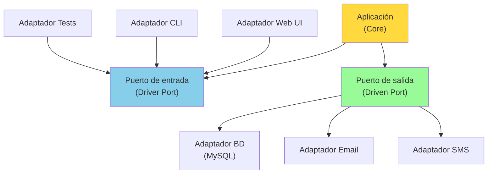

**Ventajas:**

- ✅ **Independencia tecnológica**: Fácil cambiar de BD o framework
- ✅ **Testabilidad**: Se pueden crear adaptadores mock para pruebas
- ✅ **Flexibilidad**: Múltiples interfaces para la misma aplicación

**Ejemplo conceptual:**

```java
// Puerto de salida (interfaz)
public interface ClienteRepository {
    void guardar(Cliente cliente);
    Cliente obtenerPorId(int id);
    List<Cliente> obtenerTodos();
}

// Adaptador para Oracle
public class ClienteRepositoryOracle implements ClienteRepository {
    // Implementación específica para Oracle
}

// Adaptador para MongoDB
public class ClienteRepositoryMongo implements ClienteRepository {
    // Implementación específica para MongoDB
}

// La aplicación trabaja con el puerto, no con el adaptador específico
public class ClienteService {
    private ClienteRepository repository;

    public ClienteService(ClienteRepository repository) {
        this.repository = repository; // Inyección de dependencias
    }
    
    public void registrarCliente(Cliente cliente) {
        // Lógica de negocio
        repository.guardar(cliente);
    }
}
```

### 10.2 Arquitectura limpia (Clean Architecture)

La **Clean Architecture**, propuesta por Robert C. Martin (Uncle Bob), combina principios de la arquitectura hexagonal, la arquitectura de cebolla y otras variantes.

**Capas de la Clean Architecture:**

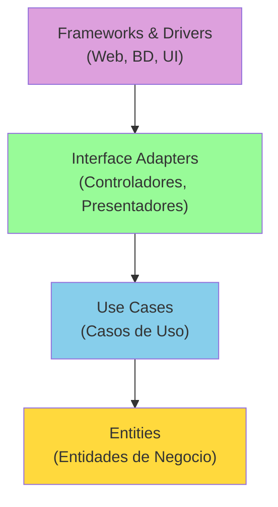

**Regla de dependencias:**

> Las dependencias solo pueden apuntar **hacia adentro**, nunca hacia afuera. Las capas internas no conocen las externas.

**Ventajas:**

- ✅ **Independencia de frameworks**: La lógica de negocio no depende de Spring, JSF, etc.
- ✅ **Independencia de la BD**: Puedes cambiar de Oracle a PostgreSQL sin afectar la lógica
- ✅ **Independencia de la UI**: La misma lógica sirve para web, móvil, escritorio
- ✅ **Testeable**: Puedes probar la lógica sin frameworks pesados

**Ejemplo de estructura:**

```plaintext
com.itv/
├── domain/
│   ├── entities/
│   │   └── Cliente.java
│   └── usecases/
│       ├── CrearClienteUseCase.java
│       ├── ObtenerClienteUseCase.java
│       └── ActualizarClienteUseCase.java
├── application/
│   ├── ports/
│   │   ├── input/
│   │   │   └── ClienteInputPort.java
│   │   └── output/
│   │       └── ClienteOutputPort.java
│   └── services/
│       └── ClienteService.java
├── infrastructure/
│   ├── persistence/
│   │   └── ClienteRepositoryImpl.java
│   └── web/
│       └── ClienteController.java
```

**Ejemplo de código:**

```java
// Capa de Dominio - Entidad
package domain.entities;

public class Cliente {
    private final int codigo;
    private String nombre;
    private int telefono;

    public Cliente(int codigo, String nombre, int telefono) {
        if (nombre == null || nombre.trim().isEmpty()) {
            throw new IllegalArgumentException("El nombre no puede estar vacío");
        }
        this.codigo = codigo;
        this.nombre = nombre;
        this.telefono = telefono;
    }
    
    // La entidad contiene lógica de negocio
    public void cambiarNombre(String nuevoNombre) {
        if (nuevoNombre == null || nuevoNombre.trim().isEmpty()) {
            throw new IllegalArgumentException("El nombre no puede estar vacío");
        }
        this.nombre = nuevoNombre;
    }
    
    // Getters...
}

// Capa de Aplicación - Puerto de salida
package application.ports.output;

public interface ClienteRepository {
    void guardar(Cliente cliente);
    Optional<Cliente> buscarPorCodigo(int codigo);
    List<Cliente> buscarTodos();
}

// Capa de Aplicación - Caso de uso
package application.usecases;

public class CrearClienteUseCase {
    private final ClienteRepository repository;

    public CrearClienteUseCase(ClienteRepository repository) {
        this.repository = repository;
    }
    
    public void execute(int codigo, String nombre, int telefono) {
        // Validaciones de negocio
        Cliente cliente = new Cliente(codigo, nombre, telefono);
        repository.guardar(cliente);
    }
}

// Capa de Infraestructura - Implementación del repositorio
package infrastructure.persistence;

public class ClienteRepositoryImpl implements ClienteRepository {
    private DataSource dataSource;

    @Override
    public void guardar(Cliente cliente) {
        // Código JDBC para guardar en BD
    }
    
    @Override
    public Optional<Cliente> buscarPorCodigo(int codigo) {
        // Código JDBC para buscar
        return Optional.empty();
    }
    
    @Override
    public List<Cliente> buscarTodos() {
        // Código JDBC para listar
        return new ArrayList<>();
    }
}

// Capa de Infraestructura - Controlador Web
package infrastructure.web;

@WebServlet("/clientes")
public class ClienteController extends HttpServlet {
    private CrearClienteUseCase crearClienteUseCase;

    @Override
    public void init() {
        ClienteRepository repository = new ClienteRepositoryImpl();
        this.crearClienteUseCase = new CrearClienteUseCase(repository);
    }
    
    @Override
    protected void doPost(HttpServletRequest request, HttpServletResponse response) {
        int codigo = Integer.parseInt(request.getParameter("codigo"));
        String nombre = request.getParameter("nombre");
        int telefono = Integer.parseInt(request.getParameter("telefono"));
        
        crearClienteUseCase.execute(codigo, nombre, telefono);
        
        response.sendRedirect("clientes?accion=listar");
    }
}
```

### 10.3 Microservicios

Los **microservicios** son un conjunto de aplicaciones de software pequeñas e independientes que trabajan juntas para formar una solución más grande. Cada microservicio tiene capacidades mínimas para crear una arquitectura muy modularizada.

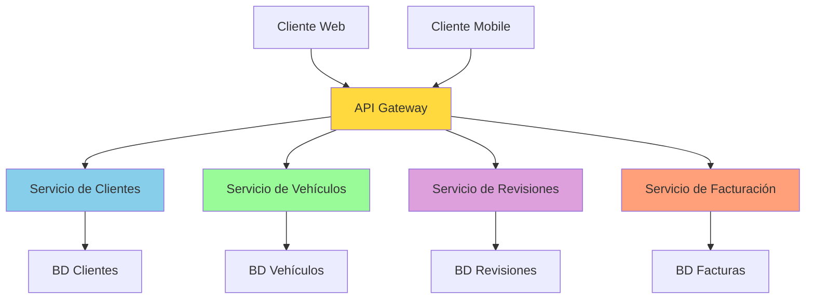

**Características principales:**

- 🔹 **Pequeños e independientes**: Cada servicio hace una cosa bien
- 🔹 **Desplegables independientemente**: No necesitas redesplegar toda la aplicación
- 🔹 **Escalables independientemente**: Escala solo el servicio que lo necesita
- 🔹 **Comunicación mediante APIs**: REST, gRPC, mensajería
- 🔹 **Programación políglota**: Cada servicio puede usar tecnologías diferentes

**Componentes típicos:**

| Componente | Función |
|------------|---------|
| **API Gateway** | Punto de entrada único para los clientes |
| **Service Discovery** | Registro y descubrimiento de servicios |
| **Load Balancer** | Distribución de carga entre instancias |
| **Message Broker** | Comunicación asíncrona (RabbitMQ, Kafka) |
| **Config Server** | Gestión centralizada de configuración |

**Ejemplo de arquitectura:**

```plaintext
Sistema ITV con Microservicios:

┌─────────────────┐
│  Cliente Web    │
└────────┬────────┘
         │
    ┌────▼─────┐
    │ API GW   │
    └────┬─────┘
         │
    ┌────┴────────────────────┐
    │                          │
┌───▼──────┐          ┌────────▼───┐
│ Servicio │          │ Servicio   │
│ Clientes │          │ Vehículos  │
│ (Spring) │          │ (Node.js)  │
└───┬──────┘          └────────┬───┘
    │                          │
┌───▼────┐              ┌──────▼───┐
│ Oracle │              │ MongoDB  │
└────────┘              └──────────┘
```

**Ventajas:**

- ✅ **Escalabilidad**: Cada servicio escala de forma independiente
- ✅ **Resiliencia**: Si un servicio cae, los demás siguen funcionando
- ✅ **Flexibilidad tecnológica**: Usa la mejor tecnología para cada problema
- ✅ **Desarrollo paralelo**: Equipos diferentes trabajan en servicios diferentes
- ✅ **Despliegues frecuentes**: Actualiza solo lo que has cambiado

**Desventajas:**

- ⚠️ **Complejidad**: Más difícil de desarrollar y mantener
- ⚠️ **Latencia de red**: Las llamadas entre servicios son más lentas
- ⚠️ **Transacciones distribuidas**: Más difícil mantener la consistencia
- ⚠️ **Monitorización**: Necesitas herramientas especializadas (ELK, Prometheus)
- ⚠️ **DevOps**: Requiere conocimientos avanzados de infraestructura

> [!NOTE]
> Los microserviciosson apropiados para **sistemas grandes** con múltiples equipos. Para aplicaciones pequeñas o medianas, un **monolito bien estructurado** (MVC) es más adecuado.

### 10.4 Arquitectura basada en eventos (EDA)

La **Arquitectura Dirigida por Eventos** (Event-Driven Architecture) está diseñada para orquestar el comportamiento en torno a la producción, detección, consumo y reacción a eventos.

**Componentes clave:**

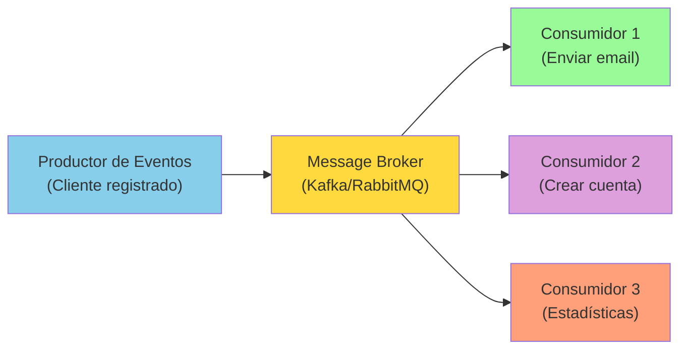

**Características:**

- **Productores de eventos**: Generan eventos cuando algo sucede
- **Encaminadores de eventos**: Filtran y envían eventos (Kafka, RabbitMQ)
- **Consumidores de eventos**: Responden a los eventos de forma asíncrona
- **Desacoplamiento**: Los productores no conocen a los consumidores

**Ejemplo práctico:**

```java
// Evento
public class ClienteRegistradoEvent {
    private int codigoCliente;
    private String nombre;
    private String email;
    private LocalDateTime timestamp;

    // Constructor, getters, setters...
}

// Productor de eventos (cuando se crea un cliente)
public class ClienteService {
    private ClienteDAO clienteDAO;
    private EventPublisher eventPublisher;

    public void registrarCliente(Cliente cliente) {
        // Guardar en BD
        clienteDAO.insertar(cliente);
        
        // Publicar evento
        ClienteRegistradoEvent evento = new ClienteRegistradoEvent(
            cliente.getCodigo(),
            cliente.getNombre(),
            cliente.getEmail(),
            LocalDateTime.now()
        );
        eventPublisher.publish("cliente.registrado", evento);
    }
}

// Consumidor 1: Enviar email de bienvenida
public class EmailConsumer {
    @Subscribe("cliente.registrado")
    public void onClienteRegistrado(ClienteRegistradoEvent evento) {
        String email = evento.getEmail();
        emailService.enviar(email, "Bienvenido", "Gracias por registrarte...");
    }
}

// Consumidor 2: Crear cuenta en sistema de facturación
public class FacturacionConsumer {
    @Subscribe("cliente.registrado")
    public void onClienteRegistrado(ClienteRegistradoEvent evento) {
        facturacionService.crearCuenta(evento.getCodigoCliente());
    }
}

// Consumidor 3: Actualizar estadísticas
public class EstadisticasConsumer {
    @Subscribe("cliente.registrado")
    public void onClienteRegistrado(ClienteRegistradoEvent evento) {
        estadisticasService.incrementarContadorClientes();
    }
}
```

**Ventajas:**

- ✅ **Desacoplamiento**: Los servicios no se conocen entre sí
- ✅ **Escalabilidad**: Fácil añadir nuevos consumidores
- ✅ **Resiliencia**: Si un consumidor falla, los demás siguen funcionando
- ✅ **Asíncrono**: Mejor rendimiento al no bloquear operaciones

**Message Brokers populares:**

- **Apache Kafka**: Para streaming de eventos en tiempo real
- **RabbitMQ**: Para mensajería asíncrona tradicional
- **Apache Pulsar**: Alternativa moderna a Kafka
- **AWS SQS/SNS**: Servicios cloud de mensajería

### 10.5 Serverless

**Serverless** permite a los desarrolladores crear y ejecutar aplicaciones sin gestionar la infraestructura subyacente. El proveedor del cloud maneja toda la configuración, mantenimiento y escalado.

**Características principales:**

- ⚡ **Basado en eventos**: Las funciones se activan por eventos
- 💰 **Modelo de pago por uso**: Solo pagas cuando se ejecuta la función
- 📈 **Escalado automático**: Desde 0 hasta miles de instancias
- 🚫 **Sin gestión de servidores**: El proveedor se encarga de todo

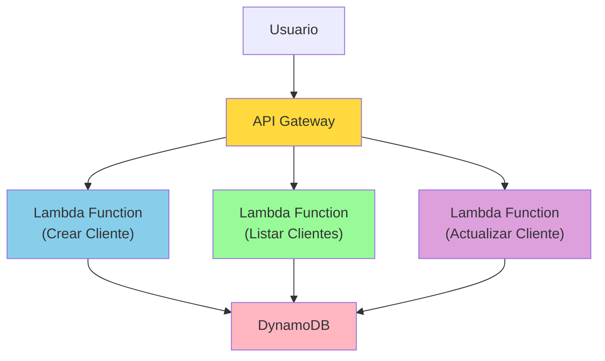

**Plataformas populares:**

| Plataforma | Proveedor | Lenguajes soportados |
|------------|-----------|----------------------|
| **AWS Lambda** | Amazon | Java, Python, Node.js, Go, .NET, Ruby |
| **Google Cloud Functions** | Google | Java, Python, Node.js, Go, .NET |
| **Azure Functions** | Microsoft | Java, Python, Node.js, C#, PowerShell |
| **Cloudflare Workers** | Cloudflare | JavaScript, Rust, C, C++ |

**Ejemplo con AWS Lambda:**

```java
package com.itv.lambda;

import com.amazonaws.services.lambda.runtime.Context;
import com.amazonaws.services.lambda.runtime.RequestHandler;
import com.amazonaws.services.lambda.runtime.events.APIGatewayProxyRequestEvent;
import com.amazonaws.services.lambda.runtime.events.APIGatewayProxyResponseEvent;
import com.google.gson.Gson;
import software.amazon.awssdk.services.dynamodb.DynamoDbClient;
import software.amazon.awssdk.services.dynamodb.model.*;

public class CrearClienteHandler implements RequestHandler<APIGatewayProxyRequestEvent, APIGatewayProxyResponseEvent> {

    private final DynamoDbClient dynamoDB = DynamoDbClient.create();
    private final Gson gson = new Gson();
    
    @Override
    public APIGatewayProxyResponseEvent handleRequest(APIGatewayProxyRequestEvent request, Context context) {
        try {
            // Parsear el cuerpo de la petición
            Cliente cliente = gson.fromJson(request.getBody(), Cliente.class);
            
            // Guardar en DynamoDB
            PutItemRequest putRequest = PutItemRequest.builder()
                .tableName("Clientes")
                .item(Map.of(
                    "codigo", AttributeValue.builder().n(String.valueOf(cliente.getCodigo())).build(),
                    "nombre", AttributeValue.builder().s(cliente.getNombre()).build(),
                    "telefono", AttributeValue.builder().n(String.valueOf(cliente.getTelefono())).build()
                ))
                .build();
                
            dynamoDB.putItem(putRequest);
            
            // Respuesta exitosa
            return new APIGatewayProxyResponseEvent()
                .withStatusCode(201)
                .withBody(gson.toJson(Map.of("message", "Cliente creado exitosamente")));
                
        } catch (Exception e) {
            context.getLogger().log("Error: " + e.getMessage());
            return new APIGatewayProxyResponseEvent()
                .withStatusCode(500)
                .withBody(gson.toJson(Map.of("error", e.getMessage())));
        }
    }
}
```

**Ventajas:**

- ✅ **Cero administración**: No gestionas servidores
- ✅ **Escalado automático**: Se adapta a la demanda
- ✅ **Económico**: Solo pagas por el tiempo de ejecución
- ✅ **Rápido de desarrollar**: Te centras en la lógica de negocio

**Desventajas:**

- ⚠️ **Cold starts**: La primera invocación es lenta
- ⚠️ **Vendor lock-in**: Dependes del proveedor cloud
- ⚠️ **Limitaciones**: Tiempo de ejecución máximo, memoria limitada
- ⚠️ **Debugging complejo**: Más difícil depurar en producción

### 10.6 Arquitectura reactiva

La **Arquitectura Reactiva** propone un diseño para construir sistemas sensibles, resistentes y escalables que puedan hacer frente a retos modernos como alta concurrencia, procesamiento de datos en tiempo real y entornos informáticos distribuidos.

**El Manifiesto Reactivo define 4 principios:**

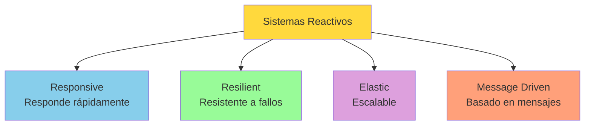

**Principios:**

1. **Responsive (Capacidad de respuesta)**:
   - El sistema responde rápidamente siempre que sea posible
   - Proporciona tiempos de respuesta consistentes

2. **Resilient (Resiliencia)**:
   - El sistema permanece responsive incluso ante fallos
   - Aislamiento de componentes para evitar fallos en cascada

3. **Elastic (Elasticidad)**:
   - El sistema se mantiene responsive bajo cargas de trabajo variables
   - Escala hacia arriba y hacia abajo según la demanda

4. **Message Driven (Basado en mensajes)**:
   - Los componentes se comunican mediante mensajes asíncronos
   - Desacoplamiento en tiempo y espacio

**Tecnologías reactivas en Java:**

| Tecnología | Descripción |
|------------|-------------|
| **Project Reactor** | Implementación de Reactive Streams para Spring |
| **RxJava** | Extensiones reactivas para Java |
| **Vert.x** | Toolkit reactivo para JVM |
| **Akka** | Toolkit para construir aplicaciones concurrentes |
| **Spring WebFlux** | Framework web reactivo de Spring |

**Ejemplo con Project Reactor:**

```java
import reactor.core.publisher.Flux;
import reactor.core.publisher.Mono;
import org.springframework.web.bind.annotation.*;

@RestController
@RequestMapping("/clientes")
public class ClienteReactiveController {

    private final ClienteReactiveRepository repository;
    
    public ClienteReactiveController(ClienteReactiveRepository repository) {
        this.repository = repository;
    }
    
    // Obtener todos los clientes (flujo reactivo)
    @GetMapping
    public Flux<Cliente> obtenerTodos() {
        return repository.findAll()
            .doOnNext(cliente -> System.out.println("Emitiendo: " + cliente.getNombre()))
            .filter(cliente -> cliente.getNumRevisiones() > 0);
    }
    
    // Obtener un cliente por ID
    @GetMapping("/{id}")
    public Mono<Cliente> obtenerPorId(@PathVariable int id) {
        return repository.findById(id)
            .switchIfEmpty(Mono.error(new NotFoundException("Cliente no encontrado")));
    }
    
    // Crear un cliente
    @PostMapping
    public Mono<Cliente> crear(@RequestBody Cliente cliente) {
        return Mono.just(cliente)
            .flatMap(c -> validarCliente(c))
            .flatMap(c -> repository.save(c))
            .doOnSuccess(c -> System.out.println("Cliente creado: " + c.getCodigo()));
    }
    
    // Búsqueda reactiva con operaciones asíncronas
    @GetMapping("/buscar")
    public Flux<Cliente> buscarPorNombre(@RequestParam String nombre) {
        return repository.findByNombreContaining(nombre)
            .take(10) // Limitar a 10 resultados
            .timeout(Duration.ofSeconds(5)) // Timeout de 5 segundos
            .onErrorResume(e -> Flux.empty()); // Si hay error, devuelve flujo vacío
    }
    
    // Operación compleja: obtener clientes con revisiones pendientes
    @GetMapping("/pendientes")
    public Flux<ClienteConRevisiones> obtenerClientesConRevisionesPendientes() {
        return repository.findAll()
            .flatMap(cliente -> 
                revisionRepository.findByClienteId(cliente.getCodigo())
                    .filter(revision -> !revision.isCompletada())
                    .collectList()
                    .map(revisiones -> new ClienteConRevisiones(cliente, revisiones))
            )
            .filter(cc -> !cc.getRevisiones().isEmpty());
    }
    
    private Mono<Cliente> validarCliente(Cliente cliente) {
        if (cliente.getNombre() == null || cliente.getNombre().trim().isEmpty()) {
            return Mono.error(new ValidationException("El nombre es obligatorio"));
        }
        return Mono.just(cliente);
    }
}
```

**Comparación: Enfoque bloqueante vs Reactivo**

```java
// ❌ BLOQUEANTE (tradicional)
@GetMapping("/clientes/{id}/revisiones")
public List<Revision> obtenerRevisiones(@PathVariable int id) {
    Cliente cliente = clienteDAO.obtenerPorId(id); // Bloquea el thread
    List<Revision> revisiones = revisionDAO.obtenerPorCliente(id); // Bloquea el thread
    return revisiones; // Total: tiempo1 + tiempo2
}

// ✅ REACTIVO (no bloqueante)
@GetMapping("/clientes/{id}/revisiones")
public Mono<List<Revision>> obtenerRevisiones(@PathVariable int id) {
    return clienteRepository.findById(id) // No bloquea
        .flatMap(cliente -> 
            revisionRepository.findByClienteId(id).collectList() // No bloquea
        ); // Total: max(tiempo1, tiempo2) - se ejecutan en paralelo
}
```

**Ventajas:**

- ✅ **Alto rendimiento**: Mejor uso de recursos del sistema
- ✅ **Escalabilidad**: Soporta muchos más usuarios concurrentes
- ✅ **Backpressure**: Control del flujo de datos para evitar saturación
- ✅ **Composabilidad**: Fácil combinar operaciones asíncronas

**Desventajas:**

- ⚠️ **Curva de aprendizaje**: Requiere cambio de mentalidad
- ⚠️ **Debugging complejo**: Más difícil depurar flujos asíncronos
- ⚠️ **Overhead**: Para operaciones simples puede ser excesivo

> [!NOTE]
> La programación reactiva tiene sentido para **aplicaciones con alta concurrencia** o que necesitan **procesamiento de streams** en tiempo real. Para aplicaciones tradicionales CRUD, el enfoque bloqueante (MVC + JDBC) es más sencillo y suficiente.

**Frameworks reactivos completos:**

- **Spring WebFlux**: Framework web reactivo (alternativa a Spring MVC)
- **Vert.x**: Toolkit reactivo multi-lenguaje
- **Quarkus**: Framework Java nativo en cloud con soporte reactivo
- **Micronaut**: Framework moderno con soporte reactivo integrado

---

## 📚 Resumen de la unidad

En esta unidad has aprendido:

✅ **Fundamentos de arquitectura de aplicaciones**:

- Separación entre interfaz, procesamiento y datos
- Importancia de la usabilidad y eficiencia

✅ **Patrón MVC (Modelo-Vista-Controlador)**:

- Separación de responsabilidades en tres capas
- Modelo: Beans/DTOs y DAOs para acceso a datos
- Vista: JSP y HTML para presentación
- Controlador: Servlets que coordinan el flujo

✅ **Organización de código**:

- Estructura de paquetes por capas
- Convenciones de nomenclatura
- Buenas prácticas de separación

✅ **Desarrollo de aplicaciones web**:

- Ciclo de vida del desarrollo
- Interacción entre componentes
- Flujo de datos en una petición HTTP

✅ **Arquitecturas alternativas** (avanzado):

- Arquitectura hexagonal (Ports and Adapters)
- Clean Architecture
- Microservicios
- Event-Driven Architecture (EDA)
- Serverless
- Arquitectura reactiva

> [!TIP]
> **Recomendaciones finales:**
>
> 1. **Empieza con MVC**: Es el patrón más adecuado para aprender y para la mayoría de aplicaciones
> 2. **Mantén la separación**: No mezcles lógica de negocio en JSP ni presentación en DAOs
> 3. **Usa PreparedStatement**: Siempre, sin excepciones, para prevenir SQL Injection
> 4. **Organiza tu código**: Usa paquetes separados para modelo, vista y controlador
> 5. **Prueba tu código**: Cada capa debe ser testeable de forma independiente
> 6. **Sigue convenciones**: Nomenclatura consistente facilita el trabajo en equipo

**Próximos pasos:**

Una vez domines el patrón MVC con Servlets y JSP, estarás preparado para:

- **Spring Framework**: Framework empresarial más utilizado en Java
- **Spring Boot**: Simplifica la configuración de aplicaciones Spring
- **JPA/Hibernate**: Mapeo objeto-relacional para simplificar acceso a datos
- **REST APIs**: Crear servicios web RESTful
- **Spring Security**: Gestión de autenticación y autorización
- **Testing**: JUnit, Mockito para pruebas automatizadas

**Recursos adicionales:**

- 📖 [Documentación oficial de Servlets](https://jakarta.ee/specifications/servlet/)
- 📖 [Documentación de JSP](https://jakarta.ee/specifications/pages/)
- 📖 [Guía de Spring MVC](https://spring.io/guides/gs/serving-web-content/)
- 📖 [The Reactive Manifesto](https://www.reactivemanifesto.org/)
- 📖 [Clean Architecture (Robert C. Martin)](https://blog.cleancoder.com/uncle-bob/2012/08/13/the-clean-architecture.html)
- 📖 [Microservices Patterns (Chris Richardson)](https://microservices.io/)


<p align="center">📚 <em>Fin de UT10.2 - Patrón MVC (Modelo-Vista-Controlador)</em></p>