# UT11.1 Servlets

## 📋 Índice de contenidos

1. [Introducción](#1-introducción)
2. [¿Qué es un Servlet?](#2-qué-es-un-servlet)
   1. [Concepto general](#21-concepto-general)
   2. [Cómo funciona un Servlet](#22-cómo-funciona-un-servlet)
   3. [De qué está compuesto](#23-de-qué-está-compuesto)
3. [Creación de una aplicación web en NetBeans](#3-creación-de-una-aplicación-web-en-netbeans)
   1. [Instalación y alta del servidor](#31-instalación-y-alta-del-servidor)
   2. [Creación del proyecto web](#32-creación-del-proyecto-web)
   3. [Selección del servidor](#33-selección-del-servidor)
   4. [Dependencias Maven opcionales](#34-dependencias-maven-opcionales)
   5. [Estructura de una aplicación web](#35-estructura-de-una-aplicación-web)
4. [Creación de un nuevo Servlet](#4-creación-de-un-nuevo-servlet)
5. [Código básico de un Servlet](#5-código-básico-de-un-servlet)
   1. [Herencia y métodos principales](#51-herencia-y-métodos-principales)
   2. [Servlet de ejemplo comentado](#52-servlet-de-ejemplo-comentado)
6. [Petición del cliente y respuesta del Servlet](#6-petición-del-cliente-y-respuesta-del-servlet)
7. [Ejecución de una aplicación web](#7-ejecución-de-una-aplicación-web)
8. [Cómo realizar una petición a un Servlet](#8-cómo-realizar-una-petición-a-un-servlet)
   1. [Mediante formulario HTML](#81-mediante-formulario-html)
   2. [Mediante enlace HTML](#82-mediante-enlace-html)
9. [Ejemplo de petición a un Servlet desde el cliente](#9-ejemplo-de-petición-a-un-servlet-desde-el-cliente)
10. [Captura de información enviada en la petición](#10-captura-de-información-enviada-en-la-petición)
    1. [Uso de getParameter()](#101-uso-de-getparameter)
    2. [Ejemplo práctico con formulario](#102-ejemplo-práctico-con-formulario)
    3. [Buenas prácticas de validación](#103-buenas-prácticas-de-validación)
11. [Resumen visual del flujo petición-respuesta](#11-resumen-visual-del-flujo-petición-respuesta)

---

## 1. Introducción

Hasta ahora, muchos programas Java se han ejecutado utilizando la entrada y la salida estándar de consola. En esta unidad vamos a dar un paso más: aprenderemos a interactuar con código Java desde una aplicación web.

Para conseguirlo, el ecosistema Java proporciona dos elementos fundamentales:

- **Servlets**
- **Páginas JSP**, muy relacionadas con los Servlets y que estudiaremos a continuación o en apartados posteriores

> [!NOTE]
> En una aplicación web Java, el navegador del usuario no ejecuta directamente nuestro código Java. Ese código se ejecuta en el servidor, y el resultado se devuelve al cliente normalmente en forma de HTML.

---

## 2. ¿Qué es un Servlet?

### 2.1 Concepto general

Un **Servlet** es una clase Java que se ejecuta en un servidor web o servidor de aplicaciones, como por ejemplo Apache Tomcat o GlassFish.

Su función principal es **recibir peticiones HTTP**, procesarlas con código Java y **devolver una respuesta** al cliente. Gracias a ello, podemos crear aplicaciones web dinámicas e interactivas.

> [!IMPORTANT]
> Actualmente es habitual hablar de **Jakarta Servlet**, aunque en muchos materiales docentes todavía se utiliza simplemente el término *Servlet*.

### 2.2 Cómo funciona un Servlet


El funcionamiento básico de un Servlet puede resumirse así:

1. El cliente, normalmente un navegador, envía una petición al servidor.
2. El servidor localiza qué Servlet debe atender esa petición.
3. El Servlet ejecuta su código Java.
4. El Servlet genera una respuesta.
5. El servidor envía esa respuesta al cliente.

Un Servlet puede realizar tareas muy diversas:

- Generar una página HTML dinámicamente.
- Devolver datos en texto, XML, JSON o incluso PDF.
- Llamar a otras clases del proyecto.
- Gestionar cookies o sesiones.
- Actuar como intermediario entre la interfaz web y la lógica de negocio o la base de datos.

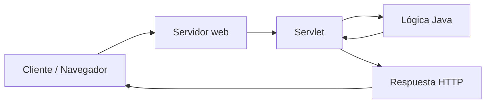


### 2.3 De qué está compuesto

Un Servlet contiene **código Java**, por lo que se trata de un archivo con extensión `.java`.

Esto significa que:

- Se organiza dentro de paquetes.
- Puede usar clases, métodos, objetos y librerías Java.
- Forma parte del proyecto como cualquier otra clase Java.
- Necesita ser desplegado dentro de una aplicación web para poder ejecutarse.

> [!TIP]
> Una forma sencilla de entender un Servlet es verlo como un “puente” entre el navegador y el código Java del servidor.

---

## 3. Creación de una aplicación web en NetBeans

### 3.1 Instalación y alta del servidor

Antes de crear una aplicación web, debemos disponer de un servidor compatible.

Pasos básicos:

1. Descargar **Apache Tomcat**.
2. Descomprimirlo en una carpeta local.
3. Dar de alta el servidor en NetBeans.

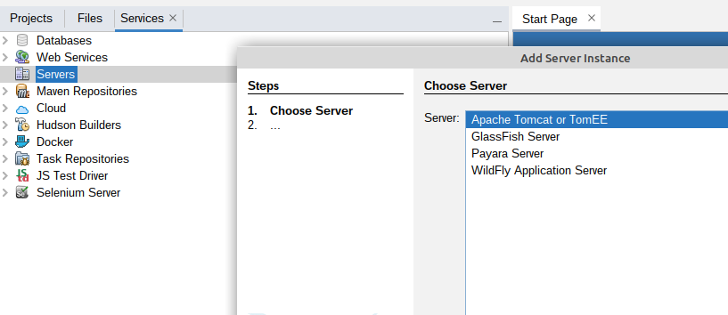

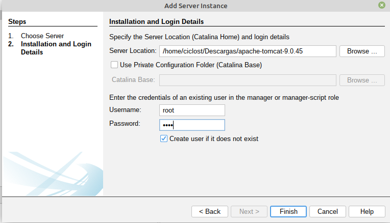

En la configuración del servidor:

- **Server Location**: carpeta raíz de Apache Tomcat.
- **Usuario**: `root`
- **Contraseña**: `root`

> [!WARNING]
> Esas credenciales pueden ser válidas para una práctica local de aula, pero no son adecuadas para un entorno real de producción.

### 3.2 Creación del proyecto web

Una vez configurado el servidor, creamos el proyecto desde:

`File -> New Project -> Java with Maven -> Web Application`

Después:

1. Indicamos el nombre del proyecto.
2. Elegimos la ubicación.
3. Continuamos con **Next**.


### 3.3 Selección del servidor

En uno de los pasos del asistente se debe indicar qué servidor utilizará la aplicación web.

Seleccionaremos el servidor que hemos configurado previamente en NetBeans.

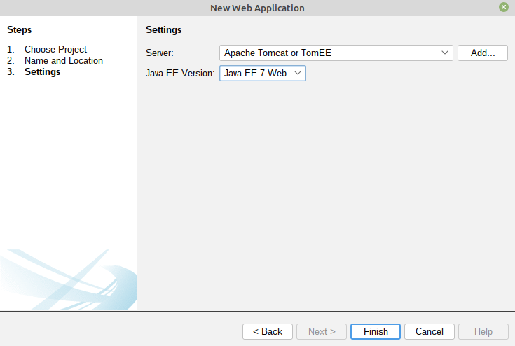

### 3.4 Dependencias Maven opcionales

Si vamos a trabajar con base de datos u otras librerías, podemos añadir dependencias al archivo `pom.xml`.

Ejemplo:

```xml
<dependencies>
    <dependency>
        <groupId>com.oracle.database.jdbc</groupId>
        <artifactId>ojdbc11</artifactId>
        <version>23.4.0.24.05</version>
    </dependency>

    <dependency>
        <groupId>org.apache.tomcat</groupId>
        ```
        <artifactId>tomcat-jdbc</artifactId>
        ```
        ```
        <version>10.1.0-M12</version>
        ```
    </dependency>

    <dependency>
        <groupId>javax</groupId>
        ```
        <artifactId>javaee-web-api</artifactId>
        ```
        <version>7.0</version>
        <scope>provided</scope>
    </dependency>
</dependencies>
```

> [!NOTE]
> En proyectos modernos puede variar el nombre de algunas dependencias según la versión de Java, Jakarta EE o el servidor utilizado.

### 3.5 Estructura de una aplicación web

La estructura básica de una aplicación web Java suele organizarse así:

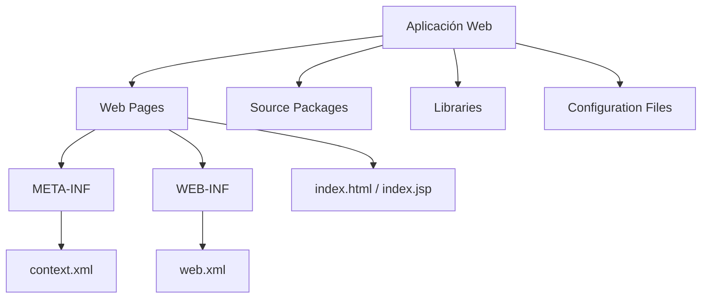


#### Elementos principales

- **Web Pages**: contiene archivos HTML, CSS, JavaScript, imágenes y páginas JSP.
- **Source Packages**: contiene las clases Java del proyecto, como Servlets, clases de modelo o utilidades.
- **Libraries**: agrupa librerías externas necesarias.
- **Configuration Files**: incluye archivos de configuración del despliegue.


#### Carpetas relevantes

- **META-INF**: suele contener `context.xml`, con configuraciones del contexto de la aplicación.
- **WEB-INF**: suele contener `web.xml`, el descriptor de despliegue.
- **index.html** o **index.jsp**: página inicial por defecto.

> [!IMPORTANT]
> El contenido de `WEB-INF` no es accesible directamente desde el navegador. Esto permite proteger ciertos recursos internos de la aplicación.

---

## 4. Creación de un nuevo Servlet

Para crear un Servlet nuevo en NetBeans:

1. Haz clic derecho sobre un paquete dentro de **Source Packages**.
2. Selecciona la opción **Servlet**.

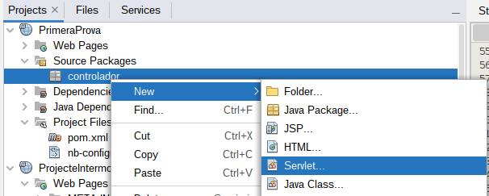


> [!IMPORTANT]
> Activa la opción **Add information to deployment descriptor** para que el Servlet quede correctamente registrado en `web.xml`, especialmente si estás trabajando con el enfoque clásico basado en descriptor.

Durante el asistente pueden aparecer pantallas como estas:


Finalmente, el Servlet aparecerá dentro del paquete seleccionado:

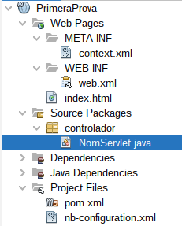

---

## 5. Código básico de un Servlet

### 5.1 Herencia y métodos principales

Cuando NetBeans genera un Servlet, normalmente observamos varios elementos importantes:

1. La clase **hereda de `HttpServlet`**.
2. Se sobrescriben los métodos **`doGet()`** y **`doPost()`**.
3. A menudo ambos delegan en un método común llamado **`processRequest()`**.
4. La respuesta se construye usando un objeto `PrintWriter`.

#### Ideas clave

- `HttpServletRequest request` representa la petición recibida.
- `HttpServletResponse response` representa la respuesta que vamos a enviar.
- `response.getWriter()` devuelve un `PrintWriter` que permite escribir texto en la salida.
- `response.setContentType(...)` define el tipo de contenido devuelto al cliente.

> [!NOTE]
> Si `doGet()` y `doPost()` llaman al mismo método, tanto las peticiones GET como POST se tratarán con la misma lógica, salvo que lo cambiemos manualmente.

### 5.2 Servlet de ejemplo comentado

A continuación se muestra una versión didáctica del esqueleto típico de un Servlet:

```java
package com.daw.ejemplo;

import java.io.IOException;
import java.io.PrintWriter;
import jakarta.servlet.ServletException;
import jakarta.servlet.http.HttpServlet;
import jakarta.servlet.http.HttpServletRequest;
import jakarta.servlet.http.HttpServletResponse;

public class PrimerServlet extends HttpServlet {

    protected void processRequest(HttpServletRequest request,
                                  HttpServletResponse response)
            throws ServletException, IOException {

        response.setContentType("text/html;charset=UTF-8");

        try (PrintWriter out = response.getWriter()) {
            out.println("<!DOCTYPE html>");
            out.println("<html>");
            out.println("<head>");
            ```
            out.println("<title>Servlet PrimerServlet</title>");
            ```
            out.println("</head>");
            out.println("<body>");
            ```
            out.println("<h1>Servlet PrimerServlet en " + request.getContextPath() + "</h1>");
            ```
            out.println("</body>");
            out.println("</html>");
        }
    }

    @Override
    protected void doGet(HttpServletRequest request,
                         HttpServletResponse response)
            throws ServletException, IOException {
        processRequest(request, response);
    }

    @Override
    protected void doPost(HttpServletRequest request,
                          HttpServletResponse response)
            throws ServletException, IOException {
        processRequest(request, response);
    }

    @Override
    public String getServletInfo() {
        return "Descripción corta del servlet";
    }
}
```


#### Qué conviene observar en este código

- El Servlet responde tanto a GET como a POST.
- Genera HTML desde Java, escribiéndolo con `PrintWriter`.
- Usa `request.getContextPath()` para mostrar la ruta base de la aplicación.
- El método `processRequest()` centraliza la lógica común.

> [!CAUTION]
> Aunque generar HTML directamente desde un Servlet ayuda a entender el mecanismo, en proyectos reales se suele separar mejor la presentación y la lógica.

---

## 6. Petición del cliente y respuesta del Servlet


El intercambio entre cliente y servidor puede resumirse en cuatro pasos:

1. El cliente realiza una petición HTTP.
2. El servidor la recibe y la dirige al Servlet adecuado.
3. El Servlet procesa la petición.
4. El servidor devuelve la respuesta generada.

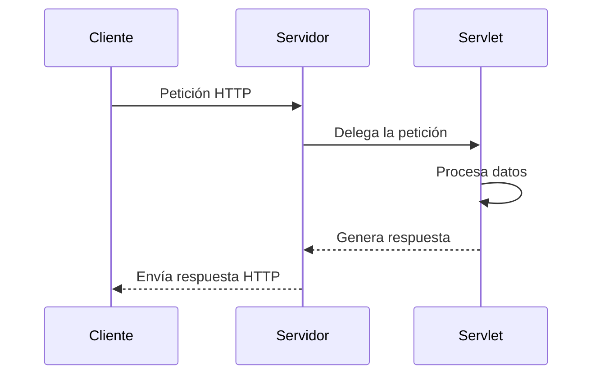

> [!TIP]
> Entender este ciclo es esencial para comprender casi toda la programación web del lado del servidor.

---

## 7. Ejecución de una aplicación web

Antes de ejecutar el proyecto, conviene revisar algunos ajustes.

### Navegador de ejecución

Podemos decidir qué navegador se abrirá al lanzar la aplicación:

- Clic derecho sobre el proyecto
- **Run > Set Project Browser**


### Despliegue automático

También podemos indicar si queremos que la aplicación se redepliegue automáticamente al guardar:

- Propiedades del proyecto
- Apartado **Run**
- Opción **Deploy on Save**


### Ejecución del proyecto

Para lanzar la aplicación:

1. Haz clic derecho sobre el proyecto.
2. Selecciona **Run**.
3. Si es necesario, introduce las credenciales del servidor.
4. NetBeans arrancará Tomcat y abrirá la página inicial, normalmente `index.html`.

> [!NOTE]
> Para acceder manualmente al servidor puedes usar una dirección como `http://localhost:8080`, y después añadir el nombre de tu aplicación.

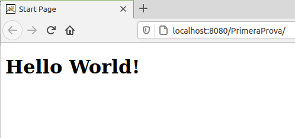

Si abres el `index.html` generado por defecto, observarás que el navegador simplemente interpreta su HTML. Eso **no implica todavía** que se esté invocando un Servlet.


---

## 8. Cómo realizar una petición a un Servlet

Para que el cliente invoque un Servlet, debe realizar una petición hacia la ruta asociada a ese Servlet.

### 8.1 Mediante formulario HTML

Una forma habitual es hacerlo con el atributo `action` de un formulario:

```html
<form action="NomDelServlet" method="post">
    <!-- Contenido del formulario -->
</form>
```

Cuando el usuario envíe el formulario:

- El navegador construirá una petición HTTP.
- La enviará a la ruta indicada en `action`.
- Si el método es `post`, el Servlet atenderá normalmente esa petición desde `doPost()`.


### 8.2 Mediante enlace HTML

También se puede acceder a un Servlet con un enlace:

```html
<a href="NomDelServlet">Enlace al Servlet</a>
```

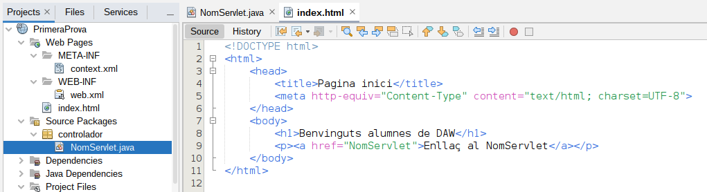

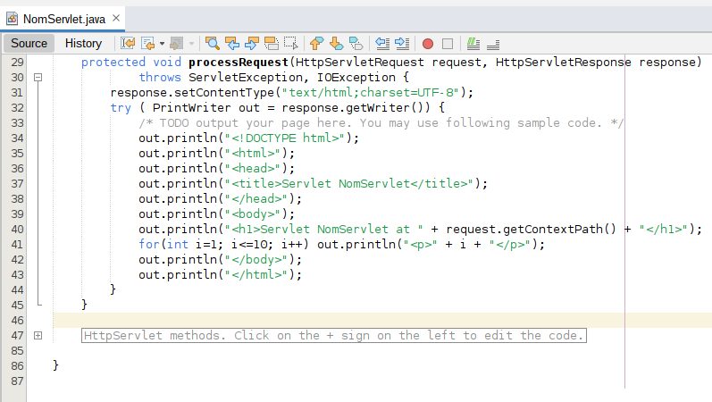

> [!IMPORTANT]
> La ruta usada en el cliente debe coincidir con la configuración del Servlet (`web.xml`).

---

## 9. Ejemplo de petición a un Servlet desde el cliente

En el ejemplo base del tema se propone sustituir el `index.html` por uno con un formulario y crear un nuevo Servlet llamado `PrimerServlet`.

El flujo de trabajo sería este:

1. Crear o sustituir el archivo `index.html`.
2. Crear un Servlet llamado `PrimerServlet`.
3. Escribir en la propiedad `action` del formulario el nombre del Servlet.
4. Ejecutar el proyecto.
5. Comprobar que al pulsar el botón del formulario se invoca el Servlet.


Un ejemplo sencillo de `index.html` podría ser:

```html
<!DOCTYPE html>
<html lang="es">
<head>
    <meta charset="UTF-8">
    <title>Primer ejemplo con Servlet</title>
</head>
<body>
    <h1>Formulario de prueba</h1>

    <form action="PrimerServlet" method="post">
        <label for="nombre">Nombre:</label>
        <input type="text" id="nombre" name="nombre">

        <br><br>

        <input type="submit" value="Guardar cambios">
    </form>
</body>
</html>
```

Cuando se ejecuta el proyecto, el navegador muestra primero el formulario. Después, al pulsar **Guardar cambios**, se envía la petición al Servlet.

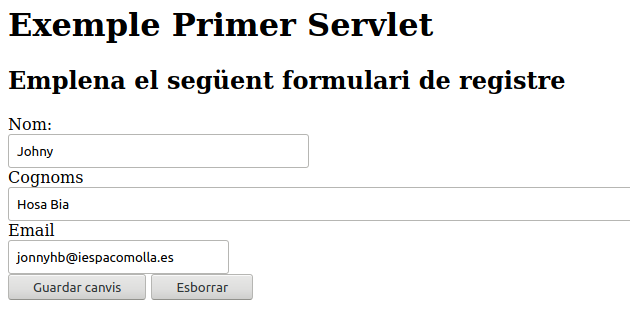

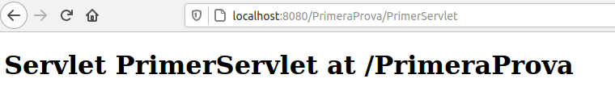

Si observamos el código del Servlet, comprobaremos que lo que aparece en pantalla corresponde al HTML generado en `processRequest()`.

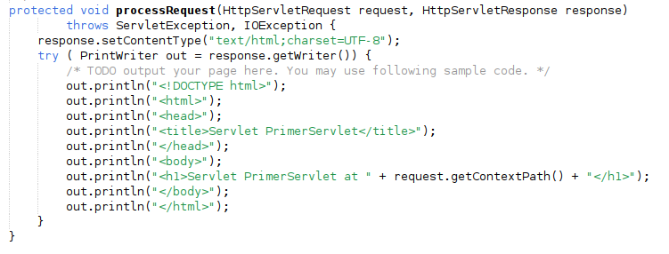

> [!TIP]
> Este ejemplo es muy útil para entender que el navegador no “entra” en la clase Java, sino que recibe una respuesta HTTP producida por esa clase en el servidor.

---

## 10. Captura de información enviada en la petición

En una aplicación real, el Servlet no solo recibe la petición: normalmente también necesita **leer los datos** que el cliente ha enviado.

La variable que contiene la petición es:

```java
HttpServletRequest request
```

A través de ese objeto podemos recuperar parámetros con métodos como `getParameter()`.

### 10.1 Uso de getParameter()

La forma más habitual de recuperar un dato enviado desde un formulario es:

```java
String valor = request.getParameter("nombreDelCampo");
```

Por ejemplo, si en un formulario tenemos este control:

```html
<input type="text" name="nombre">
```

podemos recuperar el valor así:

```java
String nombre = request.getParameter("nombre");
```

> [!IMPORTANT]
> El texto que pasamos a `getParameter()` debe coincidir exactamente con el valor del atributo `name` del campo del formulario.

### 10.2 Ejemplo práctico con formulario

#### Formulario HTML

```html
<!DOCTYPE html>
<html lang="es">
<head>
    <meta charset="UTF-8">
    <title>Recogida de datos</title>
</head>
<body>
    <h1>Datos del alumno</h1>

    <form action="PrimerServlet" method="post">
        <label for="nombre">Nombre:</label>
        <input type="text" id="nombre" name="nombre">

        <br><br>

        <label for="edad">Edad:</label>
        <input type="number" id="edad" name="edad">

        <br><br>

        <input type="submit" value="Enviar">
    </form>
</body>
</html>
```

#### Servlet que captura los datos

```java
package com.daw.ejemplo;

import java.io.IOException;
import java.io.PrintWriter;
import jakarta.servlet.ServletException;
import jakarta.servlet.http.HttpServlet;
import jakarta.servlet.http.HttpServletRequest;
import jakarta.servlet.http.HttpServletResponse;

public class PrimerServlet extends HttpServlet {

    @Override
    protected void doPost(HttpServletRequest request,
                          HttpServletResponse response)
            throws ServletException, IOException {

        response.setContentType("text/html;charset=UTF-8");

        String nombre = request.getParameter("nombre");
        String edad = request.getParameter("edad");

        try (PrintWriter out = response.getWriter()) {
            out.println("<!DOCTYPE html>");
            out.println("<html>");
            out.println("<head>");
            ```
            out.println("<title>Respuesta del Servlet</title>");
            ```
            out.println("</head>");
            out.println("<body>");
            ```
            out.println("<h1>Datos recibidos</h1>");
            ```
            ```
            out.println("<p>Nombre: " + nombre + "</p>");
            ```
            ```
            out.println("<p>Edad: " + edad + "</p>");
            ```
            out.println("</body>");
            out.println("</html>");
        }
    }
}
```

#### Qué está ocurriendo

- El formulario envía dos parámetros: `nombre` y `edad`.
- El Servlet recupera ambos con `request.getParameter(...)`.
- Después genera una respuesta HTML mostrando esos valores.

### 10.3 Buenas prácticas de validación

Aunque `getParameter()` devuelve los datos como texto, eso no significa que siempre sean válidos.

Por eso es recomendable:

- Comprobar si el parámetro existe.
- Verificar si está vacío.
- Convertirlo al tipo adecuado solo cuando proceda.
- Controlar posibles errores de conversión.

Ejemplo:

```java
String edadTexto = request.getParameter("edad");

if (edadTexto == null || edadTexto.isBlank()) {
    // Tratar error: no se ha recibido la edad
} else {
    try {
        int edad = Integer.parseInt(edadTexto);
        // Trabajar con edad
    } catch (NumberFormatException e) {
        // Tratar error: no era un entero válido
    }
}
```

> [!WARNING]
> Todos los datos que llegan desde el cliente deben considerarse potencialmente incorrectos o incompletos hasta haber sido validados.

### Práctica guiada

**Enunciado:**

Modifica el ejemplo anterior para que:

1. Pida el nombre del alumno.
2. Pida su ciudad.
3. Pida su edad.
4. Muestre en la respuesta un mensaje personalizado.

<details>
<summary>💻 Solución propuesta</summary>

#### `index.html`

```html
<!DOCTYPE html>
<html lang="es">
<head>
    <meta charset="UTF-8">
    <title>Formulario de alumno</title>
</head>
<body>
    <h1>Ficha del alumno</h1>

    <form action="PrimerServlet" method="post">
        <label for="nombre">Nombre:</label>
        <input type="text" id="nombre" name="nombre">

        <br><br>

        <label for="ciudad">Ciudad:</label>
        <input type="text" id="ciudad" name="ciudad">

        <br><br>

        <label for="edad">Edad:</label>
        <input type="number" id="edad" name="edad">

        <br><br>

        <input type="submit" value="Enviar">
    </form>
</body>
</html>
```

#### `PrimerServlet.java`

```java
package com.daw.ejemplo;

import java.io.IOException;
import java.io.PrintWriter;
import jakarta.servlet.ServletException;
import jakarta.servlet.http.HttpServlet;
import jakarta.servlet.http.HttpServletRequest;
import jakarta.servlet.http.HttpServletResponse;

public class PrimerServlet extends HttpServlet {

    @Override
    protected void doPost(HttpServletRequest request,
                          HttpServletResponse response)
            throws ServletException, IOException {

        response.setContentType("text/html;charset=UTF-8");

        String nombre = request.getParameter("nombre");
        String ciudad = request.getParameter("ciudad");
        String edadTexto = request.getParameter("edad");

        String mensajeEdad;

        try {
            int edad = Integer.parseInt(edadTexto);
            mensajeEdad = "Tiene " + edad + " años.";
        } catch (Exception e) {
            mensajeEdad = "La edad recibida no es válida.";
        }

        try (PrintWriter out = response.getWriter()) {
            out.println("<!DOCTYPE html>");
            out.println("<html>");
            out.println("<head>");
            out.println("<meta charset='UTF-8'>");
            ```
            out.println("<title>Resultado</title>");
            ```
            out.println("</head>");
            out.println("<body>");
            ```
            out.println("<h1>Datos del alumno</h1>");
            ```
            ```
            out.println("<p>Nombre: " + nombre + "</p>");
            ```
            ```
            out.println("<p>Ciudad: " + ciudad + "</p>");
            ```
            ```
            out.println("<p>" + mensajeEdad + "</p>");
            ```
            out.println("</body>");
            out.println("</html>");
        }
    }
}
```

</details>

---

## 11. Resumen visual del flujo petición-respuesta

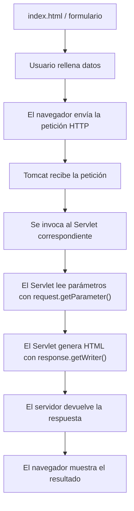

> [!TIP]
> Si entiendes este flujo, ya tienes la base conceptual necesaria para avanzar después hacia JSP, sesiones, acceso a bases de datos y arquitectura MVC.

---

<p align="center">📚 <em>Fin del apartado UT11.1 - Servlets</em></p>