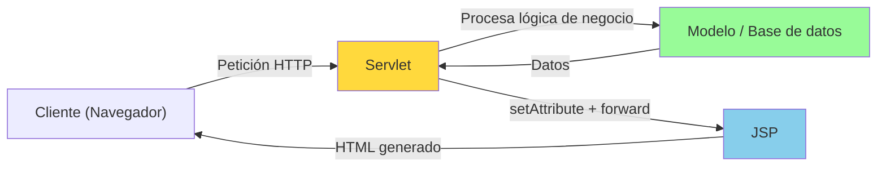
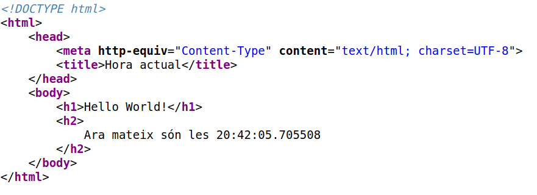
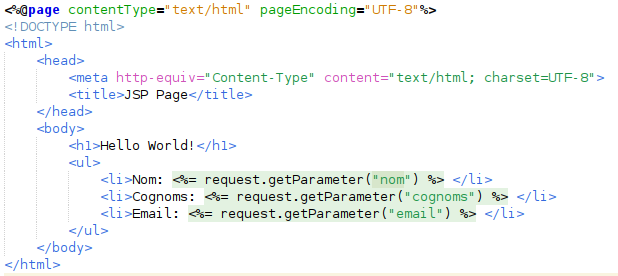
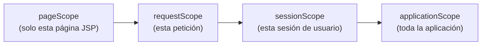
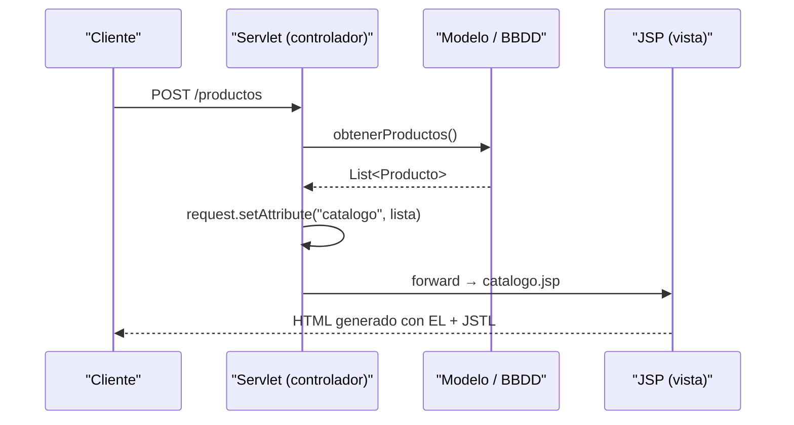

# UT11.2 JSP — Jakarta Server Pages

## 📋 Índice de contenidos

1. [Introducción](#1-introducción)
2. [Qué es JSP](#2-qué-es-jsp)
3. [Ficheros JSP](#3-ficheros-jsp)
4. [Ejemplo básico de fichero JSP](#4-ejemplo-básico-de-fichero-jsp)
   1. [Ejecución del ejemplo](#41-ejecución-del-ejemplo)
5. [Tipos de sintaxis en un JSP](#5-tipos-de-sintaxis-en-un-jsp)
   1. [Directivas](#51-directivas)
   2. [Expresiones](#52-expresiones)
   3. [Scriptlets](#53-scriptlets)
   4. [Declaraciones](#54-declaraciones)
6. [Objetos predefinidos en JSP](#6-objetos-predefinidos-en-jsp)
7. [Recibir parámetros en un JSP](#7-recibir-parámetros-en-un-jsp)
8. [Expression Language (EL)](#8-expression-language-el)
   1. [Qué es y por qué usarlo](#81-qué-es-y-por-qué-usarlo)
   2. [Sintaxis básica](#82-sintaxis-básica)
   3. [Acceso a parámetros de petición](#83-acceso-a-parámetros-de-petición)
   4. [Acceso a atributos de scopes](#84-acceso-a-atributos-de-scopes)
   5. [Acceso a propiedades de objetos Java](#85-acceso-a-propiedades-de-objetos-java)
   6. [Operadores en EL](#86-operadores-en-el)
   7. [Objetos implícitos de EL](#87-objetos-implícitos-de-el)
9. [Introducción a JSTL](#9-introducción-a-jstl)
   1. [Qué es y cómo se configura](#91-qué-es-y-cómo-se-configura)
   2. [Etiquetas más usadas de la librería core](#92-etiquetas-más-usadas-de-la-librería-core)
10. [Redirigir a un Servlet, HTML o JSP desde código Java](#10-redirigir-a-un-servlet-html-o-jsp-desde-código-java)
11. [Pasar información entre Servlets y JSPs](#11-pasar-información-entre-servlets-y-jsps)

---

## 1. Introducción

Ya sabemos qué son los servlets y cómo recibir información desde una página web para que el servidor nos responda con HTML generado dinámicamente. Sin embargo, en la práctica puede interesarnos que la **respuesta del servidor no sea una página HTML completa**, sino solo un fragmento de ella, o que la respuesta incluya datos calculados que se incrusten en una plantilla HTML existente.

Para cubrir esta necesidad (entre otras), Java nos ofrece la tecnología **JSP (Jakarta Server Pages)**.

JSP trabaja de manera complementaria a los servlets: mientras que un servlet suele encargarse de la **lógica de negocio** (recibir peticiones, acceder a la base de datos, calcular resultados), la página JSP se encarga de la **presentación** (construir el HTML que verá el usuario a partir de los datos que le proporciona el servlet).



> [!NOTE]
> Este patrón —donde el servlet actúa como **controlador** y el JSP como **vista**— es la base del conocido patrón de diseño **MVC (Modelo–Vista–Controlador)**, que estudiarás en mayor profundidad en cursos posteriores.

---

## 2. Qué es JSP

**JSP** son las siglas de **Jakarta Server Pages** (anteriormente llamado _Java Server Pages_). Se trata de una tecnología que permite crear páginas web con **contenido dinámico** mezclando:

- Código **HTML**, **CSS** y **JavaScript** (parte estática, visible directamente en el navegador).
- Código **Java** que se ejecuta en el servidor antes de enviar la respuesta al cliente.

El código Java dentro del JSP puede recibir información desde:

- Un **formulario HTML** (parámetros `POST` o `GET`).
- **Parámetros de URL** del navegador.
- **Atributos del objeto `request`** enviados desde un servlet.

El servidor procesa el fichero JSP, ejecuta el código Java, construye el HTML resultante y lo envía al cliente. El cliente (navegador) **nunca ve código Java**, solo ve el HTML final.

> [!TIP]
> JSP permite una separación más clara entre la **lógica de negocio** (Java) y la **presentación** (HTML/CSS/JS), facilitando el mantenimiento y la colaboración entre desarrolladores y diseñadores.

---

## 3. Ficheros JSP

Los ficheros JSP tienen las siguientes características:

- Contienen código web (HTML, CSS o JS) con código Java incrustado mediante etiquetas especiales.
- Deben tener extensión **`.jsp`**.
- Se almacenan en la carpeta de contenidos web del servidor (**Web Pages**), en la misma ubicación que los ficheros HTML (o en subcarpetas dentro de ella).

> [!IMPORTANT]
> Mantén una estructura organizada dentro de la carpeta `Web Pages`. Por ejemplo, puedes tener subcarpetas como `vistas/`, `templates/`, etc. para agrupar tus JSPs según su función.

---

## 4. Ejemplo básico de fichero JSP

A continuación, un fichero JSP sencillo que muestra la fecha y hora actual del servidor:

```jsp
<%@ page language="java" contentType="text/html; charset=UTF-8" pageEncoding="UTF-8"%>
<!DOCTYPE html>
<html>
<head>
    <meta charset="UTF-8">
    <title>Ejemplo JSP</title>
</head>
<body>
    <h1>¡Bienvenido a JSP!</h1>
    <p>La fecha y hora actuales en el servidor son: <%= new java.util.Date() %></p>
</body>
</html>
```

En este ejemplo observamos dos cosas:

- La mayor parte del fichero es **HTML puro**.
- La línea `<%= new java.util.Date() %>` es una **expresión JSP**: el servidor la evalúa y sustituye por su resultado (la fecha y hora) antes de enviar el HTML al cliente.


### 4.1 Ejecución del ejemplo

Para probar este ejemplo con tu proyecto de NetBeans:

1. Crea un fichero llamado `hora.jsp` con el código anterior y guárdalo en la carpeta **Web Pages** del proyecto (al mismo nivel que `index.html`).
2. Modifica `index.html` para que el atributo `action` del formulario llame a `hora.jsp` en lugar de a un servlet.
3. Ejecuta la aplicación web.
4. Al hacer clic en el botón de envío, obtendrás algo similar a:


> [!CAUTION]
> Fíjate en que, aunque en la barra de direcciones del navegador aparezca `hora.jsp`, la información que recibes **no es el código fuente del JSP** sino el **HTML generado por el servidor** al procesar ese JSP.

Si consultas el código fuente de la página que devuelve el servidor, verás únicamente el HTML resultante, sin rastro del código Java:





---

## 5. Tipos de sintaxis en un JSP

En un fichero JSP podemos encontrar varios tipos de construcciones especiales. Las más importantes son: **directivas**, **expresiones**, **scriptlets** y **declaraciones**.

### 5.1 Directivas

Las directivas son instrucciones que se le dan al **contenedor JSP** (el servidor) sobre cómo compilar o configurar la página. Se escriben con la sintaxis:

```jsp
<%@ directiva atributo="valor" %>
```

La más habitual es la directiva `page`:

```jsp
<%@ page language="java" contentType="text/html; charset=UTF-8" pageEncoding="UTF-8" %>
```

Atributos más usados de la directiva `page`:


| Atributo | Descripción | Ejemplo |
| :-- | :-- | :-- |
| `language` | Lenguaje de scripting usado | `language="java"` |
| `contentType` | Tipo MIME de la respuesta y codificación | `contentType="text/html; charset=UTF-8"` |
| `pageEncoding` | Codificación del fichero fuente | `pageEncoding="UTF-8"` |
| `import` | Importa clases Java (como `import` en Java) | `import="java.util.List, java.util.ArrayList"` |
| `errorPage` | Indica a qué página redirigir si ocurre un error | `errorPage="error.jsp"` |
| `isErrorPage` | Indica que esta página es una página de error | `isErrorPage="true"` |

Ejemplo de importación de clases con la directiva `page`:

```jsp
<%@ page import="java.util.List" %>
<%@ page import="java.util.ArrayList" %>
<%@ page import="com.miempresa.modelo.Producto" %>
```

También existe la directiva `include`, para incluir el contenido de otro fichero en la página:

```jsp
<%@ include file="cabecera.html" %>
```


### 5.2 Expresiones

Las **expresiones JSP** permiten mostrar directamente el resultado de una expresión Java en el HTML generado. Se evalúan, se convierten a `String` y se insertan en el HTML.

```jsp
<%= expresión_java %>
```

Ejemplos:

```jsp
<!-- Muestra la fecha actual del servidor -->
<p>Fecha: <%= new java.util.Date() %></p>

<!-- Muestra el valor de una variable previamente declarada -->
<p>Nombre: <%= nombre %></p>

<!-- Opera directamente con valores -->
<p>El doble de 5 es: <%= 5 * 2%></p>
```

> [!NOTE]
> La expresión **no lleva punto y coma al final** (`;`), al contrario que en Java. El servidor lo trata internamente como un argumento del método `out.print(...)`.

### 5.3 Scriptlets

Los **scriptlets** permiten escribir bloques completos de código Java dentro de la página JSP.

```jsp
<% código_java_varias_líneas %>
```

Dentro de un scriptlet puedes declarar variables locales, escribir bucles, condicionales, llamar a métodos, etc.:

```jsp
<%
    String nombre = request.getParameter("nombre");
    int edad = 0;
    
    try {
        edad = Integer.parseInt(request.getParameter("edad"));
    } catch (NumberFormatException e) {
        edad = 0;
    }
%>

```

<p>Hola, <%= nombre %>. Tienes <%= edad %> años.</p>

```

<%
    if (edad >= 18) {
%>
    <p>Eres mayor de edad. ✅</p>
<%
    } else {
%>
    <p>Eres menor de edad. ❌</p>
<%
    }
%>
```

> [!WARNING]
> Como puedes observar, mezclar Java y HTML en scriptlets genera un código muy difícil de leer y mantener. Esta sintaxis es **antigua y desaconsejada** en proyectos reales modernos. En su lugar, se recomienda usar **Expression Language (EL)** y **JSTL**, que veremos a continuación.

### 5.4 Declaraciones

Las **declaraciones** permiten declarar variables o métodos a **nivel de clase** del servlet generado internamente por el JSP (fuera de los métodos `doGet`/`doPost`).

```jsp
<%! declaración_de_variable_o_método %>
```

Ejemplos:

```jsp
<%! int contador = 0; %>

<%!
    public String saludar(String nombre) {
        return "¡Hola, " + nombre + "!";
    }
%>

<p><%= saludar("María") %></p>
```

> [!CAUTION]
> Las variables declaradas con `<%! %>` son **variables de instancia del servlet**, lo que significa que son **compartidas entre todas las peticiones** (potencialmente de diferentes usuarios). Esto puede causar problemas graves de concurrencia. Úsalas solo para métodos auxiliares y evita variables de estado con este mecanismo.

---

## 6. Objetos predefinidos en JSP

Del mismo modo que en un servlet tenemos acceso a `request` y `response`, en el código Java de una página JSP (scriptlets y expresiones) tenemos disponibles de forma automática los siguientes objetos:


| Objeto | Clase | Descripción |
| :-- | :-- | :-- |
| `request` | `HttpServletRequest` | La petición HTTP recibida del cliente |
| `response` | `HttpServletResponse` | La respuesta HTTP que se enviará al cliente |
| `session` | `HttpSession` | Sesión única por usuario |
| `out` | `PrintWriter` / `JspWriter` | Escribe contenido a la página web actual |
| `application` | `ServletContext` | Contexto de la aplicación web (compartido por todos los usuarios) |
| `config` | `ServletConfig` | Configuración del servlet |
| `pageContext` | `PageContext` | Acceso a todos los scopes y objetos del JSP |
| `page` | `Object` | Referencia al propio servlet JSP generado |
| `exception` | `Throwable` | Solo disponible en páginas de error (`isErrorPage="true"`) |

> [!NOTE]
> Estos objetos están **implícitamente disponibles** en todas las páginas JSP y pueden usarse directamente en los scriptlets y expresiones, sin necesidad de declararlos ni instanciarlos.

---

## 7. Recibir parámetros en un JSP

De la misma forma que en un servlet, dentro de un JSP podemos leer los parámetros enviados desde un formulario o desde la URL usando `request.getParameter(...)`.

Ejemplo con scriptlets:

```jsp
<%@ page language="java" contentType="text/html; charset=UTF-8" pageEncoding="UTF-8"%>
<%
    String nombre = request.getParameter("nombre");
    String edadStr = request.getParameter("edad");
    int edad = 0;
    if (edadStr != null && !edadStr.isBlank()) {
        try {
            edad = Integer.parseInt(edadStr);
        } catch (NumberFormatException e) {
            edad = -1;
        }
    }
%>
<!DOCTYPE html>
<html>
```

<head><meta charset="UTF-8"><title>Datos recibidos</title></head>

```
<body>
    <h1>Datos del formulario</h1>
    <p>Nombre: <%= nombre %></p>
    <p>Edad: <%= edad > 0 ? edad + " años" : "No válida" %></p>
</body>
</html>
```




> [!TIP]
> Siempre comprueba si el parámetro es `null` antes de utilizarlo para evitar excepciones de tipo `NullPointerException`. Próximamente veremos que con **Expression Language** este tipo de comprobaciones es más limpio y elegante.

---

## 8. Expression Language (EL)

### 8.1 Qué es y por qué usarlo

**Expression Language** (EL) es una sintaxis simplificada para **acceder a datos dentro de un JSP** sin necesidad de escribir código Java. Fue introducida en JSP 2.0 y actualmente es la forma **recomendada** de mostrar información en las vistas JSP.

Comparación rápida:

```jsp
<!-- ❌ Con scriptlet (Java incrustado, difícil de leer) -->
<p>Nombre: <%= request.getAttribute("usuario") %></p>

<!-- ✅ Con Expression Language (limpio, sin Java) -->
<p>Nombre: ${usuario}</p>
```

Las ventajas principales de EL son:

- **Sintaxis concisa y legible**: mucho más limpia que los scriptlets.
- **Tolerante a `null`**: si un valor no existe, EL devuelve una cadena vacía en lugar de lanzar una excepción.
- **Acceso simplificado**: a parámetros, atributos de sesión, propiedades de objetos Java (JavaBeans), etc.
- **Compatible con JSTL**: trabaja de forma natural junto con las etiquetas JSTL.

> [!NOTE]
> EL **no reemplaza** la lógica de negocio (que debe ir en el servlet), sino que simplifica cómo se **muestra** la información ya calculada en la vista JSP.

### 8.2 Sintaxis básica

La sintaxis de EL usa llaves dobles precedidas del símbolo `$`:

```
${expresión}
```

Ejemplos básicos:

```jsp
<!-- Mostrar texto literal (poco útil, pero válido) -->
<p>${"Hola mundo"}</p>

<!-- Operaciones aritméticas -->
<p>Suma: ${3 + 5}</p>
<p>Módulo: ${10 % 3}</p>

<!-- Concatenación (desde EL 3.0 / EL en Jakarta EE) -->
```

<p>\${"Hola, " += nombre}</p>

```
```


### 8.3 Acceso a parámetros de petición

Con EL puedes acceder directamente a los **parámetros de una petición HTTP** (los que envía un formulario o la URL) usando el objeto implícito `param`:

```jsp
<!-- Equivale a request.getParameter("nombre") -->
<p>Nombre: ${param.nombre}</p>
<p>Edad: ${param.edad}</p>
```

Si el nombre del parámetro contiene guiones o caracteres especiales, usa la notación de corchetes:

```jsp
```

<p>\${param["nombre-completo"]}</p>

```
```

> [!TIP]
> Si el parámetro no existe o está vacío, EL simplemente muestra una cadena vacía, **sin lanzar excepción**. Esto es una gran ventaja sobre los scriptlets.

### 8.4 Acceso a atributos de scopes

El patrón más habitual es que un **servlet calcule los datos** (los guarde como atributos del `request`, `session` o `application`) y los **pase al JSP mediante `forward`**. El JSP los muestra con EL.

Los cuatro **scopes** (ámbitos) disponibles son:



| Scope | Descripción | Duración |
| :-- | :-- | :-- |
| `pageScope` | Atributos locales a la página JSP actual | Hasta que termina de procesar la página |
| `requestScope` | Atributos de la petición HTTP actual | Hasta que se envía la respuesta |
| `sessionScope` | Atributos de la sesión del usuario | Mientras dure la sesión (o se invalide) |
| `applicationScope` | Atributos globales de toda la aplicación | Mientras esté desplegada la aplicación |

**Ejemplo completo servlet → JSP con EL:**

En el servlet, guardamos los datos con `setAttribute`:

```java
// En el servlet
String mensaje = "¡Datos procesados correctamente!";
int total = 42;
List<String> nombres = List.of("Ana", "Luis", "Carlos");

request.setAttribute("mensaje", mensaje);
request.setAttribute("total", total);
request.setAttribute("nombres", nombres);

RequestDispatcher rd = request.getRequestDispatcher("resultado.jsp");
rd.forward(request, response);
```

En el JSP (`resultado.jsp`), accedemos con EL:

```jsp
<%@ page contentType="text/html; charset=UTF-8" pageEncoding="UTF-8"%>
<!DOCTYPE html>
<html>
```

<head><meta charset="UTF-8"><title>Resultado</title></head>

```
<body>
    <!-- EL busca "mensaje" en todos los scopes (primero page, luego request, session, application) -->
    <p>${mensaje}</p>

    <!-- También puedes ser explícito con el scope -->
    <p>Total: ${requestScope.total}</p>

    <!-- Acceso a un elemento de una lista por índice -->
    <p>Primer nombre: ${nombres}</p>
</body>
</html>
```

> [!IMPORTANT]
> Cuando usas `${nombreVariable}` sin especificar el scope, EL **busca automáticamente** en `pageScope` → `requestScope` → `sessionScope` → `applicationScope`, en ese orden. Si quieres ser explícito (recomendado cuando hay posibles conflictos de nombres), usa `${requestScope.variable}`, `${sessionScope.variable}`, etc.

### 8.5 Acceso a propiedades de objetos Java

EL soporta el acceso a propiedades de **JavaBeans** (objetos Java con getters/setters) directamente con la notación de punto.

Supón que tienes la siguiente clase:

```java
// Clase Producto (JavaBean)
public class Producto {
    private String nombre;
    private double precio;
    private int stock;

    // Getters y setters
    public String getNombre() { return nombre; }
    public void setNombre(String nombre) { this.nombre = nombre; }
    public double getPrecio() { return precio; }
    public void setPrecio(double precio) { this.precio = precio; }
    public int getStock() { return stock; }
    public void setStock(int stock) { this.stock = stock; }
}
```

Desde el servlet:

```java
Producto p = new Producto();
p.setNombre("Teclado mecánico");
p.setPrecio(79.99);
p.setStock(15);

request.setAttribute("producto", p);
request.getRequestDispatcher("detalle.jsp").forward(request, response);
```

En el JSP, con EL se accede a los campos llamando directamente al nombre de la propiedad (EL internamente llama al getter):

```jsp
<h2>${producto.nombre}</h2>
<p>Precio: ${producto.precio} €</p>
<p>Stock disponible: ${producto.stock} unidades</p>
```

Y si tienes una **lista de objetos**:

```java
// Servlet
List<Producto> catalogo = obtenerCatalogo(); // método que devuelve una lista
request.setAttribute("catalogo", catalogo);
```

```jsp
<!-- Acceso al primer elemento de la lista -->
<p>Primer producto: ${catalogo.nombre}</p>

<!-- El recorrido completo con bucle lo veremos en el apartado JSTL -->
```


### 8.6 Operadores en EL

EL soporta los operadores más comunes:

**Operadores aritméticos:**


| Operador | Descripción | Ejemplo |
| :-- | :-- | :-- |
| `+` | Suma | `${5 + 3}` → 8 |
| `-` | Resta | `${10 - 4}` → 6 |
| `*` | Multiplicación | `${3 * 4}` → 12 |
| `/` o `div` | División | `${10 / 3}` → 3.333... |
| `%` o `mod` | Módulo | `${10 % 3}` → 1 |

**Operadores relacionales:**


| Operador | Descripción | Ejemplo |
| :-- | :-- | :-- |
| `==` o `eq` | Igual | `${edad == 18}` |
| `!=` o `ne` | Distinto | `${stock != 0}` |
| `<` o `lt` | Menor que | `${precio lt 100}` |
| `>` o `gt` | Mayor que | `${precio gt 50}` |
| `<=` o `le` | Menor o igual | `${edad le 17}` |
| `>=` o `ge` | Mayor o igual | `${stock ge 1}` |

**Operadores lógicos:**


| Operador | Descripción | Ejemplo |
| :-- | :-- | :-- |
| `&&` o `and` | Y lógico | `${activo and stock > 0}` |
| `\|\|` o `or` | O lógico | `${admin or moderador}` |
| `!` o `not` | Negación | `${not activo}` |

**Operador ternario (condicional):**

```jsp
<p>${edad >= 18 ? "Mayor de edad" : "Menor de edad"}</p>
```

**Operador `empty`** (muy útil para comprobar valores nulos o vacíos):

```jsp
<!-- True si el valor es null, cadena vacía, colección vacía o array vacío -->
<p>${empty nombre ? "No indicado" : nombre}</p>
<p>${empty catalogo ? "No hay productos" : "Hay productos disponibles"}</p>
```


### 8.7 Objetos implícitos de EL

EL dispone de sus propios objetos implícitos (distintos de los de JSP/scriptlets):


| Objeto implícito | Descripción |
| :-- | :-- |
| `param` | Parámetros de la petición (uno solo por nombre) |
| `paramValues` | Parámetros de la petición (array, para campos múltiples) |
| `header` | Cabeceras HTTP de la petición |
| `headerValues` | Cabeceras HTTP (array) |
| `cookie` | Cookies de la petición |
| `initParam` | Parámetros de inicialización del contexto |
| `pageScope` | Atributos del ámbito de la página |
| `requestScope` | Atributos del ámbito de la petición |
| `sessionScope` | Atributos del ámbito de la sesión |
| `applicationScope` | Atributos del ámbito de la aplicación |


---

## 9. Introducción a JSTL

### 9.1 Qué es y cómo se configura

**JSTL** (Jakarta Standard Tag Library) es una librería de **etiquetas HTML personalizadas** que permite realizar tareas típicas de programación (bucles, condicionales, formateo, etc.) directamente en el HTML de la página JSP, **sin necesidad de escribir código Java**.

Trabaja siempre junto con **Expression Language (EL)**.

Para poder usar JSTL en tu proyecto Maven, añade la dependencia en `pom.xml`:

```xml
<dependency>
    <groupId>jakarta.servlet.jsp.jstl</groupId>
    ```
    <artifactId>jakarta.servlet.jsp.jstl-api</artifactId>
    ```
    <version>3.0.0</version>
</dependency>
<dependency>
    <groupId>org.glassfish.web</groupId>
    <artifactId>jakarta.servlet.jsp.jstl</artifactId>
    <version>3.0.1</version>
</dependency>
```

En cada JSP donde quieras usarla, añade esta directiva `taglib` al principio:

```jsp
<%@ taglib prefix="c" uri="jakarta.tags.core" %>
```

> [!NOTE]
> JSTL está organizada en varias librerías (core, format, sql, xml). La más importante y usada es la librería **core** (`prefix="c"`), que cubre bucles, condicionales y gestión de variables.

### 9.2 Etiquetas más usadas de la librería core

**`<c:out>` — Mostrar un valor**

Equivalente a `${...}` pero con protección adicional contra inyección HTML:

```jsp
<c:out value="${usuario.nombre}" default="Anónimo" />
```

**`<c:if>` — Condicional simple**

```jsp
<c:if test="${stock > 0}">
    <p>✅ Producto disponible</p>
</c:if>

<c:if test="${empty catalogo}">
    <p>⚠️ No hay productos en el catálogo.</p>
</c:if>
```

**`<c:choose>`, `<c:when>`, `<c:otherwise>` — Condicional múltiple (equivale a if-else if-else)**

```jsp
<c:choose>
    <c:when test="${edad < 18}">
        <p>Menor de edad</p>
    </c:when>
    <c:when test="${edad < 65}">
        <p>Adulto</p>
    </c:when>
    <c:otherwise>
        <p>Tercera edad</p>
    </c:otherwise>
</c:choose>
```

**`<c:forEach>` — Bucle (recorrer colecciones)**

Esta es la etiqueta más usada de JSTL. Permite iterar sobre listas, arrays, mapas, etc.:

```jsp
<!-- Recorrer una lista de productos -->
<table>
    <tr><th>Nombre</th><th>Precio</th><th>Stock</th></tr>
    <c:forEach var="prod" items="${catalogo}">
        <tr>
            <td>${prod.nombre}</td>
            <td>${prod.precio} €</td>
            <td>${prod.stock}</td>
        </tr>
    </c:forEach>
</table>
```

También puede usarse con un rango de números (como un `for` numérico):

```jsp
<!-- Equivale a: for (int i = 1; i <= 10; i++) -->
<c:forEach var="i" begin="1" end="10">
    <p>Iteración número ${i}</p>
</c:forEach>
```

El atributo `varStatus` permite acceder a información sobre la iteración:

```jsp
<c:forEach var="prod" items="${catalogo}" varStatus="estado">
    <tr class="${estado.index % 2 == 0 ? 'par' : 'impar'}">
        ```
        <td>${estado.count}</td>   <!-- Posición (1, 2, 3...) -->
        ```
        <td>${prod.nombre}</td>
        <td>${estado.first ? '← Primero' : ''}</td>
        <td>${estado.last  ? '← Último'  : ''}</td>
    </tr>
</c:forEach>
```

**`<c:set>` y `<c:remove>` — Gestionar atributos**

```jsp
<!-- Crear/modificar un atributo en el scope indicado -->
<c:set var="saludo" value="¡Hola!" scope="request" />
<p>${saludo}</p>

<!-- Eliminar un atributo -->
<c:remove var="saludo" />
```

**`<c:url>` — Construir URLs correctamente**

```jsp
<a href="<c:url value='/productos/detalle'>
    <c:param name='id' value='${prod.id}'/>
</c:url>">Ver detalle</a>
```

> [!TIP]
> Combinando **JSTL** con **EL**, puedes construir páginas JSP completamente limpias de código Java. El flujo recomendado es:
> 1. El **servlet** procesa la lógica y guarda los resultados con `request.setAttribute(...)`.
> 2. El **JSP** únicamente muestra esos resultados usando `${...}` y etiquetas JSTL.

---

## 10. Redirigir a un Servlet, HTML o JSP desde código Java

En muchos casos, desde un servlet (o desde el scriptlet de un JSP) necesitamos redirigir el flujo a otro recurso (otro JSP, otro servlet, una página HTML, etc.). Para ello usamos `RequestDispatcher`:

```java
RequestDispatcher rd = request.getRequestDispatcher("ruta/al/fichero.jsp");
rd.forward(request, response);
```

`"ruta/al/fichero.jsp"` es la ruta relativa al contexto de la aplicación web (no a la ubicación del fichero en disco).

**Diferencia entre `forward` y `redirect`:**


| Método | Descripción | URL en el navegador |
| :-- | :-- | :-- |
| `rd.forward(request, response)` | El servidor redirige internamente. El `request` y sus atributos se mantienen. | No cambia (el navegador no se entera) |
| `response.sendRedirect("url")` | El servidor ordena al navegador que haga una nueva petición. El `request` se pierde. | Cambia a la nueva URL |

```java
// Forward (recomendado para pasar datos entre servlet y JSP)
RequestDispatcher rd = request.getRequestDispatcher("resultado.jsp");
rd.forward(request, response);

// Redirect (cuando queremos que el navegador navegue a otra URL)
response.sendRedirect("https://www.ejemplo.com");
response.sendRedirect("index.html");
```

> [!IMPORTANT]
> Usa **`forward`** cuando quieras pasar datos del servlet al JSP (los atributos del `request` se conservan). Usa **`sendRedirect`** cuando quieras que el navegador navegue a una URL diferente (por ejemplo, tras completar un formulario para evitar el reenvío accidental al recargar la página).

---

## 11. Pasar información entre Servlets y JSPs

El patrón más común en aplicaciones JSP/Servlet es:

1. El **servlet** recibe la petición, accede a la lógica de negocio y obtiene los datos.
2. El **servlet** guarda esos datos como atributos del `request` con `setAttribute`.
3. El **servlet** hace un `forward` al JSP.
4. El **JSP** usa EL (y JSTL) para mostrar los datos.


**Ejemplo completo:**

Servlet (`ProductosServlet.java`):

```java
@Override
protected void doGet(HttpServletRequest request, HttpServletResponse response)
        throws ServletException, IOException {

    // Simulación de datos (en un caso real vendrían de BBDD)
    List<Producto> catalogo = new ArrayList<>();
    catalogo.add(new Producto("Teclado mecánico", 79.99, 10));
    catalogo.add(new Producto("Ratón inalámbrico", 34.95, 25));
    catalogo.add(new Producto("Monitor 27\"", 299.00, 5));

    // Guardar los datos en el request
    request.setAttribute("catalogo", catalogo);
    request.setAttribute("total", catalogo.size());

    // Redirigir al JSP
    RequestDispatcher rd = request.getRequestDispatcher("catalogo.jsp");
    rd.forward(request, response);
}
```

JSP (`catalogo.jsp`) con EL + JSTL:

```jsp
<%@ page contentType="text/html; charset=UTF-8" pageEncoding="UTF-8" %>
<%@ taglib prefix="c" uri="jakarta.tags.core" %>
<!DOCTYPE html>
<html>
<head>
    <meta charset="UTF-8">
    <title>Catálogo de productos</title>
</head>
<body>
    <h1>Catálogo de productos</h1>
    <p>Total de productos: <strong>${total}</strong></p>

    <c:choose>
        <c:when test="${empty catalogo}">
            <p>⚠️ No hay productos disponibles.</p>
        </c:when>
        <c:otherwise>
            <table border="1">
                <tr>
                    <th>#</th>
                    <th>Nombre</th>
                    <th>Precio</th>
                    <th>Stock</th>
                </tr>
                <c:forEach var="prod" items="${catalogo}" varStatus="estado">
                    <tr>
                        <td>${estado.count}</td>
                        <td>${prod.nombre}</td>
                        <td>${prod.precio} €</td>
                        <td>
                            <c:choose>
                                <c:when test="${prod.stock == 0}">
                                    ❌ Sin stock
                                </c:when>
                                <c:when test="${prod.stock lt 5}">
                                    ⚠️ Últimas ${prod.stock} unidades
                                </c:when>
                                <c:otherwise>
                                    ✅ ${prod.stock} unidades
                                </c:otherwise>
                            </c:choose>
                        </td>
                    </tr>
                </c:forEach>
            </table>
        </c:otherwise>
    </c:choose>
</body>
</html>
```


> [!TIP]
> Usar `setAttribute` y `getAttribute` junto con `forward` es la forma estándar de **pasar datos entre componentes** en una aplicación web Java. Elige nombres descriptivos para los atributos para facilitar el mantenimiento del código.

---

<p align="center">📚 <em>Fin del apartado UT11.2 – JSP (Jakarta Server Pages)</em></p>