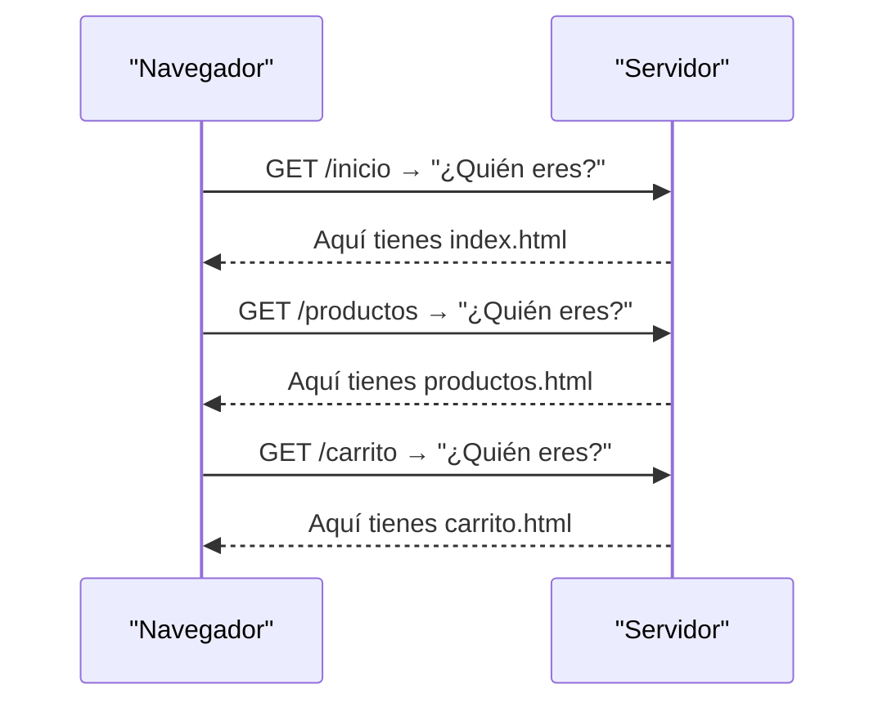
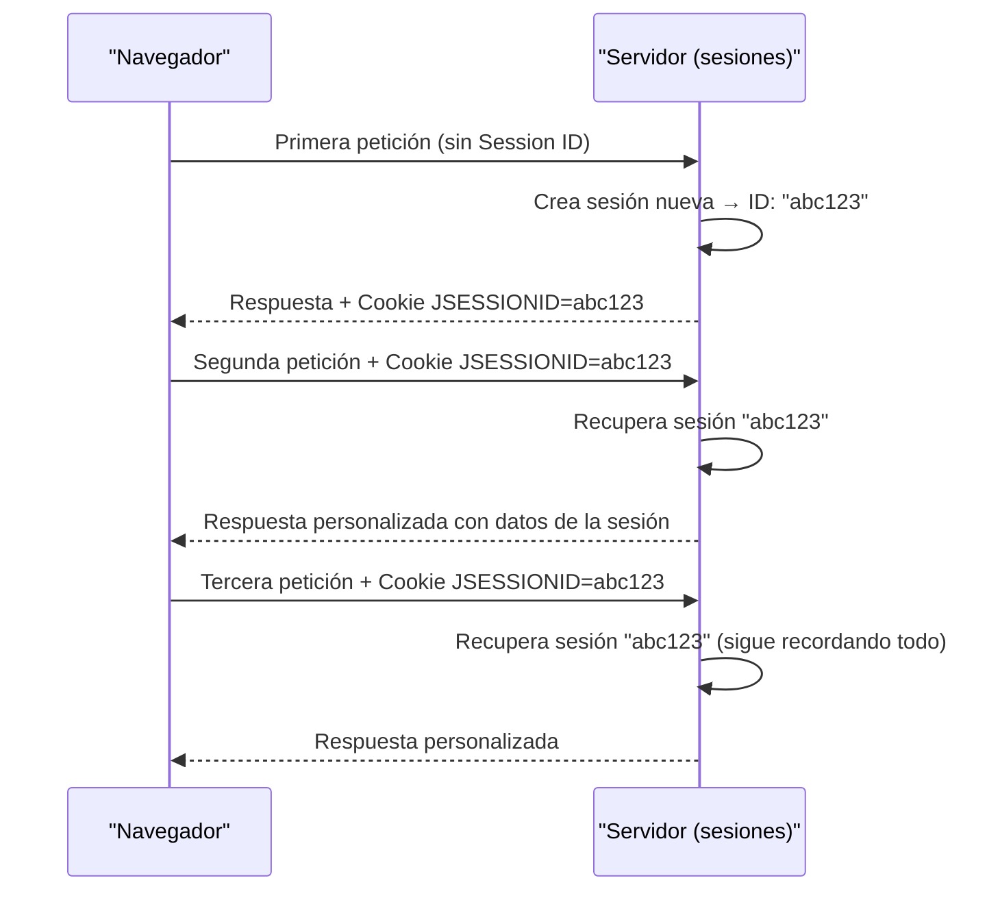
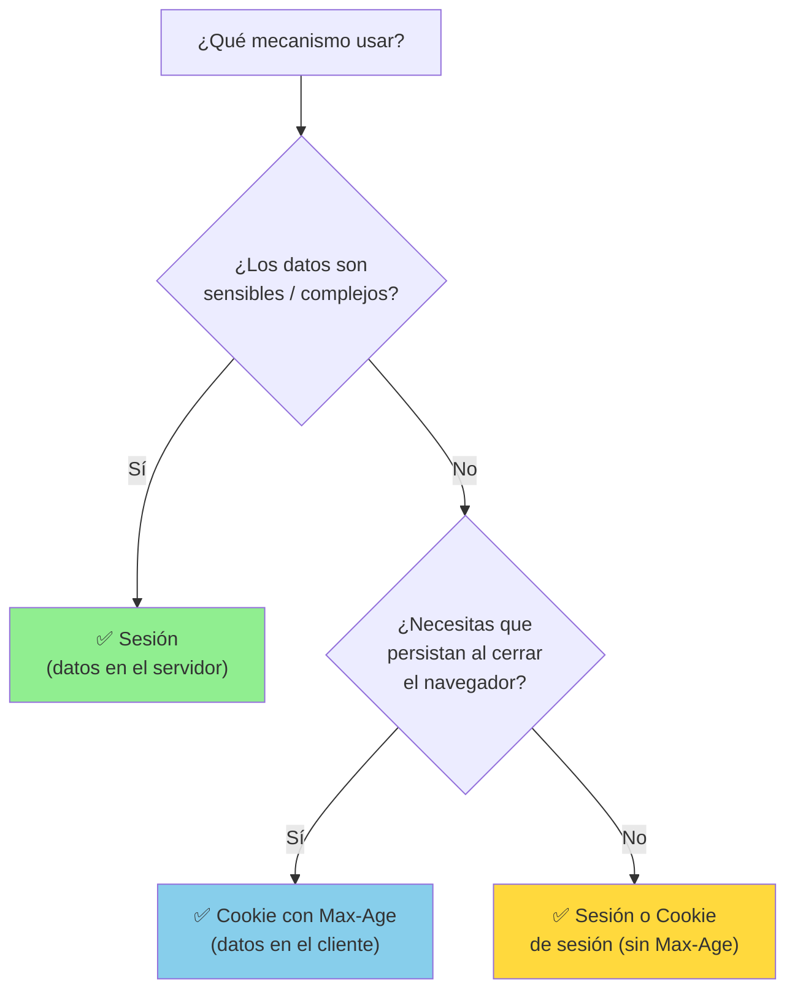

# UT11.3 Sesiones y Cookies

## 📋 Índice de contenidos

1. [El problema del estado en HTTP](#1-el-problema-del-estado-en-http)
2. [¿Qué es una sesión?](#2-qué-es-una-sesión)
   1. [Sesiones en la vida cotidiana de la web](#21-sesiones-en-la-vida-cotidiana-de-la-web)
3. [Sesiones en Servlets y JSP](#3-sesiones-en-servlets-y-jsp)
   1. [Obtener la sesión en un Servlet](#31-obtener-la-sesión-en-un-servlet)
   2. [Usar la sesión en un JSP](#32-usar-la-sesión-en-un-jsp)
4. [API HttpSession](#4-api-httpsession)
   1. [Métodos principales](#41-métodos-principales)
   2. [Uso de variables de sesión](#42-uso-de-variables-de-sesión)
   3. [Invalidar la sesión (cerrar sesión)](#43-invalidar-la-sesión-cerrar-sesión)
   4. [Tiempo de expiración](#44-tiempo-de-expiración)
5. [Ejemplo práctico: login con sesión](#5-ejemplo-práctico-login-con-sesión)
6. [¿Qué es una cookie?](#6-qué-es-una-cookie)
   1. [Cuándo se genera una cookie](#61-cuándo-se-genera-una-cookie)
   2. [Cómo funcionan las cookies](#62-cómo-funcionan-las-cookies)
   3. [Qué contienen las cookies](#63-qué-contienen-las-cookies)
7. [Cookies en Java: creación y lectura](#7-cookies-en-java-creación-y-lectura)
   1. [Crear y enviar una cookie](#71-crear-y-enviar-una-cookie)
   2. [Leer cookies recibidas](#72-leer-cookies-recibidas)
   3. [Eliminar una cookie](#73-eliminar-una-cookie)
8. [Sesiones vs. Cookies](#8-sesiones-vs-cookies)
9. [Práctica: recordar preferencias con cookies](#9-práctica-recordar-preferencias-con-cookies)

---

## 1. El problema del estado en HTTP

Para entender por qué necesitamos sesiones y cookies, primero hay que comprender un concepto clave de HTTP: es un protocolo **sin estado** (_stateless_).

Esto significa que cada petición HTTP que hace el navegador es **completamente independiente** de las anteriores. El servidor no recuerda quién hizo la petición anterior: cada vez que el navegador solicita una página, el servidor la trata como si fuera la primera vez que ve a ese cliente.



Este comportamiento es un problema para casi cualquier aplicación web real, donde necesitamos recordar cosas como:

- Que el usuario **inició sesión** y no hay que pedirle de nuevo las credenciales.
- Que el usuario añadió **artículos a un carrito de la compra**.
- Que el usuario tiene configuradas unas **preferencias** de idioma o tema.

Para resolver esto disponemos de dos mecanismos complementarios: las **sesiones** y las **cookies**.

> [!NOTE]
> Las sesiones y las cookies no son exclusivas de Java. Todos los lenguajes de programación web (PHP, Python, Node.js...) implementan estos mismos mecanismos, porque el problema del estado en HTTP es universal.

---

## 2. ¿Qué es una sesión?

Una **sesión** es un mecanismo del servidor para **mantener el estado de un usuario concreto** durante su interacción con la aplicación web. Se puede entender como un espacio de memoria en el servidor que está asociado exclusivamente a un usuario.

Cuando un usuario accede por primera vez a la aplicación, el servidor:

1. Crea un objeto de sesión único para ese usuario.
2. Genera un **identificador de sesión** (Session ID) aleatorio y único.
3. Envía ese ID al navegador del usuario (habitualmente mediante una cookie especial llamada `JSESSIONID`).

En cada petición posterior, el navegador envía ese Session ID al servidor, que lo usa para recuperar el objeto de sesión del usuario y así "recordar" su estado.




### 2.1 Sesiones en la vida cotidiana de la web

Probablemente ya has usado sesiones como usuario sin darte cuenta:

- **Autenticación**: cuando inicias sesión en una web y puedes navegar por varias páginas sin volver a introducir tu contraseña.
- **Carrito de la compra**: cuando añades productos y sigues comprando sin que desaparezcan.
- **Preferencias de usuario**: cuando la web recuerda tu idioma preferido o tu configuración de interfaz durante la visita.

---

## 3. Sesiones en Servlets y JSP

### 3.1 Obtener la sesión en un Servlet

En un servlet, obtenemos el objeto de sesión a partir del objeto `request`:

```java
HttpSession session = request.getSession();
```

Este método tiene dos comportamientos según el parámetro que se le pase:


| Llamada | Comportamiento |
| :-- | :-- |
| `request.getSession()` | Si existe sesión la devuelve; si no, **crea una nueva**. |
| `request.getSession(true)` | Igual que el anterior (comportamiento explícito). |
| `request.getSession(false)` | Si existe sesión la devuelve; si **no existe**, devuelve `null` (no la crea). |

> [!TIP]
> Usa `request.getSession(false)` cuando quieras comprobar si ya hay una sesión activa sin crear una nueva. Esto es útil, por ejemplo, en páginas protegidas donde debes redirigir al usuario si no ha iniciado sesión.

### 3.2 Usar la sesión en un JSP

En un JSP, el objeto `session` está disponible de forma implícita (sin necesidad de obtenerlo), igual que `request` o `response`:

```jsp
<!-- Guardar un valor en la sesión desde JSP -->
<% session.setAttribute("idioma", "es"); %>

<!-- Leer un valor de la sesión desde JSP con scriptlet -->
<% String idioma = (String) session.getAttribute("idioma"); %>

<!-- Leer un valor de la sesión con Expression Language (recomendado) -->
<p>Idioma: ${sessionScope.idioma}</p>
```


---

## 4. API HttpSession

### 4.1 Métodos principales

La interfaz `HttpSession` proporciona los siguientes métodos para trabajar con la sesión:


| Método | Descripción |
| :-- | :-- |
| `setAttribute(String name, Object value)` | Guarda un objeto en la sesión con el nombre indicado |
| `getAttribute(String name)` | Recupera un objeto de la sesión por su nombre. Devuelve `null` si no existe |
| `removeAttribute(String name)` | Elimina un atributo de la sesión |
| `invalidate()` | Destruye la sesión y libera todos sus atributos |
| `getId()` | Devuelve el identificador único de la sesión (Session ID) |
| `isNew()` | `true` si la sesión acaba de crearse en esta petición |
| `setMaxInactiveInterval(int seconds)` | Tiempo máximo de inactividad (en segundos) antes de que expire la sesión |
| `getMaxInactiveInterval()` | Devuelve el tiempo máximo de inactividad actual |
| `getCreationTime()` | Fecha/hora de creación de la sesión (en milisegundos desde epoch) |
| `getLastAccessedTime()` | Fecha/hora del último acceso a la sesión |

> [!IMPORTANT]
> Puedes consultar la documentación oficial completa de `HttpSession` en:
> [https://jakarta.ee/specifications/servlet/6.0/apidocs/jakarta.servlet/jakarta/servlet/http/HttpSession.html](https://jakarta.ee/specifications/servlet/6.0/apidocs/jakarta.servlet/jakarta/servlet/http/HttpSession.html)

### 4.2 Uso de variables de sesión

El siguiente ejemplo muestra el ciclo completo: guardar un objeto en sesión, comprobar si existe y recuperarlo:

```java
// 1. Obtener (o crear) la sesión
HttpSession session = request.getSession();

// 2. Guardar objetos en la sesión (pueden ser de cualquier tipo)
Persona p = new Persona("Pepe García", 23);
session.setAttribute("usuario", p);

// También podemos guardar tipos simples
session.setAttribute("idioma", "es");
session.setAttribute("intentosFallidos", 0);

// 3. Comprobar si existe un atributo antes de usarlo
if (session.getAttribute("usuario") == null) {
    // El usuario no ha iniciado sesión → redirigir al login
    response.sendRedirect("login.jsp");
    return; // Importante: detener la ejecución del servlet
}

// 4. Recuperar el atributo (es necesario hacer cast al tipo correspondiente)
Persona usuarioActual = (Persona) session.getAttribute("usuario");
String nombre = usuarioActual.getNombre();
```

> [!CAUTION]
> `getAttribute` devuelve siempre un `Object`. Recuerda hacer el **cast** al tipo correcto al recuperar el objeto. Si no compruebas si el atributo es `null` antes de usarlo, puedes obtener una `NullPointerException`.

### 4.3 Invalidar la sesión (cerrar sesión)

Cuando el usuario cierra sesión (logout), debemos destruir la sesión con `invalidate()`. Esto elimina todos los atributos guardados y libera la memoria en el servidor:

```java
// Servlet de logout
@Override
protected void doPost(HttpServletRequest request, HttpServletResponse response)
        throws ServletException, IOException {

    // Obtener la sesión existente (sin crear una nueva)
    HttpSession session = request.getSession(false);

    if (session != null) {
        session.invalidate(); // Destruye la sesión
    }

    // Redirigir al login o a la página de inicio
    response.sendRedirect("index.html");
}
```

> [!WARNING]
> No olvides llamar a `invalidate()` al hacer logout. Si no lo haces, la sesión y todos sus datos permanecen en memoria del servidor hasta que expire por inactividad, lo que puede ser un problema de seguridad.

### 4.4 Tiempo de expiración

Las sesiones tienen un tiempo de vida limitado. Si el usuario no realiza ninguna petición durante un cierto periodo, el servidor destruye la sesión automáticamente.

**Configuración global en `web.xml`** (tiempo en minutos):

```xml
<session-config>
    <session-timeout>30</session-timeout>
</session-config>
```

**Configuración programática por sesión** (tiempo en segundos):

```java
// La sesión expirará si el usuario no hace ninguna petición en 15 minutos
session.setMaxInactiveInterval(15 * 60);

// -1 significa que la sesión nunca expira (no recomendado en producción)
session.setMaxInactiveInterval(-1);
```


---

## 5. Ejemplo práctico: login con sesión

Un caso muy típico en el que se usan las sesiones es el **sistema de autenticación** (login). Veamos un ejemplo completo:

**`LoginServlet.java`** (procesa el formulario de login):

```java
@Override
protected void doPost(HttpServletRequest request, HttpServletResponse response)
        throws ServletException, IOException {

    String usuario = request.getParameter("usuario");
    String password = request.getParameter("password");

    // Simulación de validación (en una app real consultarías la BBDD)
    if ("admin".equals(usuario) && "1234".equals(password)) {
        // Credenciales correctas → crear sesión
        HttpSession session = request.getSession();
        session.setAttribute("usuarioLogueado", usuario);
        session.setAttribute("rol", "ADMIN");

        // Redirigir al área privada
        response.sendRedirect("inicio.jsp");

    } else {
        // Credenciales incorrectas → volver al login con mensaje de error
        request.setAttribute("error", "Usuario o contraseña incorrectos");
        request.getRequestDispatcher("login.jsp").forward(request, response);
    }
}
```

**`inicio.jsp`** (página privada — comprueba que haya sesión activa):

```jsp
<%@ page contentType="text/html; charset=UTF-8" pageEncoding="UTF-8" %>
<%@ taglib prefix="c" uri="jakarta.tags.core" %>
<%
    // Comprobar si el usuario ha iniciado sesión
    if (session.getAttribute("usuarioLogueado") == null) {
        response.sendRedirect("login.jsp");
        return;
    }
%>
<!DOCTYPE html>
<html>
<head><meta charset="UTF-8"><title>Área privada</title></head>
<body>
    
    <h1>Bienvenido, ${sessionScope.usuarioLogueado} 👋</h1>
    
    <p>Tu rol es: <strong>${sessionScope.rol}</strong></p>
    <p>Session ID: ${pageContext.session.id}</p>

    <form action="LogoutServlet" method="post">
        <button type="submit">Cerrar sesión</button>
    </form>
</body>
</html>
```

**`LogoutServlet.java`** (cierra la sesión):

```java
@Override
protected void doPost(HttpServletRequest request, HttpServletResponse response)
        throws ServletException, IOException {

    HttpSession session = request.getSession(false);
    if (session != null) {
        session.invalidate();
    }
    response.sendRedirect("login.jsp");
}
```

> [!NOTE]
> Comprobar si el usuario tiene sesión activa al principio de cada página privada (como hacemos con el `if` al inicio del JSP) es una práctica esencial de seguridad. En aplicaciones más grandes, esto se centraliza mediante un **filtro** (`Filter`) de Jakarta EE, que verifica la sesión automáticamente antes de dar acceso a cualquier recurso protegido.

---

## 6. ¿Qué es una cookie?

Una **cookie** es un pequeño fichero de texto que el servidor envía al navegador del cliente para que lo almacene en su dispositivo. En visitas posteriores a la misma web, el navegador envía de vuelta esa cookie al servidor, que puede así recordar información del usuario.

A diferencia de las sesiones (cuya información se almacena en el **servidor**), las cookies almacenan información en el **cliente** (el navegador del usuario).

### 6.1 Cuándo se genera una cookie

Una cookie se genera cuando:

1. El cliente realiza una petición a la aplicación web.
2. El **servidor decide crearla** y la incluye en la respuesta HTTP con la cabecera `Set-Cookie`.
3. El navegador la recibe y la almacena en disco.

Las cookies no se crean de forma automática; es el código del servidor (nuestro servlet) quien decide explícitamente crearlas.

### 6.2 Cómo funcionan las cookies

```mermaid
sequenceDiagram
    participant C as "Navegador (Cliente)"
    participant S as "Servidor"

    C->>S: Primera petición (sin cookies)
    S->>S: Decide crear una cookie
    S-->>C: Respuesta + cabecera Set-Cookie: idioma=es; Max-Age=86400

    C->>C: Almacena la cookie en disco

    C->>S: Segunda petición + cabecera Cookie: idioma=es
    S->>S: Lee la cookie y personaliza la respuesta
    S-->>C: Respuesta personalizada (en español)
```

El proceso es el siguiente:

1. En una primera visita, el servidor crea la cookie y la envía al navegador mediante la cabecera HTTP `Set-Cookie`.
2. El navegador almacena la cookie (en disco si tiene fecha de expiración, o en memoria si no la tiene).
3. En cada petición posterior al mismo dominio, el navegador envía automáticamente la cookie en la cabecera `Cookie`.
4. El servidor puede leer ese valor y personalizar la respuesta.

### 6.3 Qué contienen las cookies

Las cookies almacenan información en formato **clave/valor** y pueden incluir metadatos adicionales:


| Campo | Descripción | Ejemplo |
| :-- | :-- | :-- |
| **Nombre** | Identificador de la cookie | `idioma` |
| **Valor** | Dato almacenado | `es` |
| **Max-Age / Expires** | Cuánto tiempo vive (en segundos). Sin este campo, expira al cerrar el navegador | `86400` (1 día) |
| **Domain** | Dominio al que se envía | `miapp.com` |
| **Path** | Ruta del servidor para la que es válida | `/` |
| **Secure** | Solo se envía por HTTPS | `true` |
| **HttpOnly** | No accesible desde JavaScript (más seguro) | `true` |

> [!IMPORTANT]
> Las cookies son **accesibles desde el cliente** (el navegador), y en el caso de las que no tienen el flag `HttpOnly`, pueden ser leídas por JavaScript. Por esta razón, **nunca almacenes información sensible** (contraseñas, tokens de seguridad importantes, datos personales) directamente en una cookie sin cifrar.

---

## 7. Cookies en Java: creación y lectura

### 7.1 Crear y enviar una cookie

Para crear una cookie en Java usamos la clase `Cookie` del paquete `jakarta.servlet.http`:

```java
// 1. Crear la cookie con nombre y valor
Cookie cookie = new Cookie("idioma", "es");

// 2. Configurar opciones
cookie.setMaxAge(60 * 60 * 24 * 7); // Expira en 7 días (en segundos)
cookie.setPath("/");                 // Válida para toda la aplicación
// cookie.setSecure(true);          // Solo enviar por HTTPS (recomendado en producción)
// cookie.setHttpOnly(true);        // No accesible desde JavaScript

// 3. Añadir la cookie a la respuesta HTTP
response.addCookie(cookie);
```

Podemos añadir **varias cookies** en la misma respuesta:

```java
response.addCookie(new Cookie("idioma", "es"));
response.addCookie(new Cookie("tema", "oscuro"));
response.addCookie(new Cookie("ultimaVisita", LocalDate.now().toString()));
```

> [!TIP]
> El valor de `setMaxAge` funciona así:
> - **Valor positivo** (ej. `86400`): la cookie expira pasados esos segundos.
> - **Cero** (`0`): la cookie se elimina inmediatamente (útil para borrarla).
> - **Valor negativo** (ej. `-1`): la cookie es de **sesión** (se elimina al cerrar el navegador, no se guarda en disco).

### 7.2 Leer cookies recibidas

Para leer las cookies que el navegador ha enviado en la petición, usamos `request.getCookies()`, que devuelve un array de objetos `Cookie`:

```java
Cookie[] cookies = request.getCookies();

if (cookies != null) {
    for (Cookie cookie : cookies) {
        System.out.println(cookie.getName() + " = " + cookie.getValue());
    }
}
```

En la práctica, suele interesarnos buscar una cookie concreta por su nombre:

```java
// Método auxiliar para buscar una cookie por nombre
private String obtenerCookie(HttpServletRequest request, String nombre) {
    Cookie[] cookies = request.getCookies();
    if (cookies != null) {
        for (Cookie cookie : cookies) {
            if (cookie.getName().equals(nombre)) {
                return cookie.getValue();
            }
        }
    }
    return null; // La cookie no existe
}
```

```java
// Uso del método auxiliar
String idioma = obtenerCookie(request, "idioma");
if (idioma == null) {
    idioma = "es"; // Valor por defecto si no existe la cookie
}
```

> [!CAUTION]
> `request.getCookies()` puede devolver `null` (no un array vacío) si el navegador no ha enviado ninguna cookie. Comprueba siempre si es `null` antes de iterar.

### 7.3 Eliminar una cookie

Las cookies no se "borran" directamente: para eliminarlas hay que enviar al navegador una cookie con el **mismo nombre** pero con `MaxAge = 0`:

```java
// Para eliminar una cookie, enviamos otra con el mismo nombre y MaxAge = 0
Cookie cookieEliminar = new Cookie("idioma", "");
cookieEliminar.setMaxAge(0);       // Expira inmediatamente
cookieEliminar.setPath("/");       // Debe coincidir con el path de la cookie original
response.addCookie(cookieEliminar);
```

---

## 8. Sesiones vs. Cookies

Aunque a veces se usan conjuntamente, sesiones y cookies son mecanismos distintos con características complementarias:


| Característica | Sesión (`HttpSession`) | Cookie |
| :-- | :-- | :-- |
| **Dónde se almacena** | En el **servidor** | En el **cliente** (navegador) |
| **Tipo de datos** | Cualquier objeto Java | Solo `String` (texto) |
| **Duración** | Hasta que se invalida o expira por inactividad | Configurable (o hasta cerrar el navegador) |
| **Seguridad** | Más segura (datos en el servidor) | Menos segura (accesible desde el cliente) |
| **Capacidad** | Sin límite práctico (limitada por RAM del servidor) | ~4 KB por cookie |
| **Acceso desde JSP** | Objeto implícito `session` o `${sessionScope.x}` | Solo desde código Java (servlet/scriptlet) |
| **Compartida entre pestañas** | Sí (mismo navegador) | Sí (mismo dominio) |
| **Persiste al cerrar navegador** | No (salvo configuración especial) | Sí (si tiene `Max-Age`) |



> [!NOTE]
> En la práctica, **sesiones y cookies se usan conjuntamente**: la sesión almacena datos sensibles (quién es el usuario, su rol, su carrito de compra) en el servidor, y el propio mecanismo de sesión de Java usa internamente una cookie (`JSESSIONID`) para identificar al usuario.

---

## 9. Práctica: recordar preferencias con cookies

**Enunciado:**

Crea una pequeña aplicación web con las siguientes funcionalidades:

1. Un formulario (`index.html`) donde el usuario pueda seleccionar su **idioma preferido** (Español, Inglés, Francés) y su **tema visual** (claro u oscuro), y enviarlo.
2. Un servlet (`PreferenciasServlet`) que recoja esos datos del formulario y los guarde como cookies con una duración de **30 días**.
3. Una página JSP (`bienvenida.jsp`) que lea las cookies y muestre un mensaje de bienvenida personalizado con las preferencias guardadas.
4. Un servlet (`BorrarPreferenciasServlet`) que elimine las cookies y redirija al formulario.

> [!NOTE]
> Recuerda que las cookies solo pueden guardar cadenas de texto. Asegúrate de que los valores del formulario sean representables como `String`.

<details>
<summary>💻 Solución</summary>

**`index.html`**:

```html
<!DOCTYPE html>
<html lang="es">
<head>
    <meta charset="UTF-8">
    <title>Configurar preferencias</title>
</head>
<body>
    <h1>Configurar preferencias</h1>
    <form action="PreferenciasServlet" method="post">
        <label for="idioma">Idioma:</label>
        <select name="idioma" id="idioma">
            <option value="es">Español</option>
            <option value="en">Inglés</option>
            <option value="fr">Francés</option>
        </select>
        <br><br>
        <label for="tema">Tema visual:</label>
        <select name="tema" id="tema">
            <option value="claro">Claro</option>
            <option value="oscuro">Oscuro</option>
        </select>
        <br><br>
        <button type="submit">Guardar preferencias</button>
    </form>
</body>
</html>
```

**`PreferenciasServlet.java`**:

```java
import jakarta.servlet.*;
import jakarta.servlet.http.*;
import jakarta.servlet.annotation.WebServlet;
import java.io.IOException;

@WebServlet("/PreferenciasServlet")
public class PreferenciasServlet extends HttpServlet {

    @Override
    protected void doPost(HttpServletRequest request, HttpServletResponse response)
            throws ServletException, IOException {

        String idioma = request.getParameter("idioma");
        String tema = request.getParameter("tema");

        // Validar que los parámetros no sean nulos
        if (idioma == null || tema == null) {
            response.sendRedirect("index.html");
            return;
        }

        // Crear las cookies con 30 días de duración
        int treintaDias = 60 * 60 * 24 * 30;

        Cookie cookieIdioma = new Cookie("idioma", idioma);
        cookieIdioma.setMaxAge(treintaDias);
        cookieIdioma.setPath("/");

        Cookie cookieTema = new Cookie("tema", tema);
        cookieTema.setMaxAge(treintaDias);
        cookieTema.setPath("/");

        response.addCookie(cookieIdioma);
        response.addCookie(cookieTema);

        // Redirigir a la página de bienvenida
        response.sendRedirect("bienvenida.jsp");
    }
}
```

**`bienvenida.jsp`**:

```jsp
<%@ page contentType="text/html; charset=UTF-8" pageEncoding="UTF-8" %>
<%
    // Leer las cookies
    String idioma = "es";   // Valores por defecto
    String tema = "claro";

    Cookie[] cookies = request.getCookies();
    if (cookies != null) {
        for (Cookie cookie : cookies) {
            if ("idioma".equals(cookie.getName())) {
                idioma = cookie.getValue();
            } else if ("tema".equals(cookie.getName())) {
                tema = cookie.getValue();
            }
        }
    }

    // Mensajes según idioma
    String saludo;
    switch (idioma) {
        case "en": saludo = "Welcome! Your preferences have been saved."; break;
        case "fr": saludo = "Bienvenue! Vos préférences ont été sauvegardées."; break;
        default:   saludo = "¡Bienvenido! Tus preferencias han sido guardadas."; break;
    }

    // Color de fondo según tema
    String colorFondo = "oscuro".equals(tema) ? "#1a1a2e" : "#f0f0f0";
    String colorTexto = "oscuro".equals(tema) ? "#eaeaea" : "#111111";
%>
<!DOCTYPE html>
<html lang="<%= idioma %>">
<head>
    <meta charset="UTF-8">
    <title>Bienvenida</title>
    <style>
        body {
            background-color: <%= colorFondo %>;
            color: <%= colorTexto %>;
            font-family: sans-serif;
            padding: 2rem;
        }
    </style>
</head>
<body>
    <h1><%= saludo %></h1>
    <p>Idioma guardado: <strong><%= idioma %></strong></p>
    <p>Tema guardado: <strong><%= tema %></strong></p>
    <hr>
    <form action="BorrarPreferenciasServlet" method="post">
        <button type="submit">🗑️ Borrar preferencias</button>
    </form>
    <br>
    <a href="index.html">⚙️ Cambiar preferencias</a>
</body>
</html>
```

**`BorrarPreferenciasServlet.java`**:

```java
import jakarta.servlet.*;
import jakarta.servlet.http.*;
import jakarta.servlet.annotation.WebServlet;
import java.io.IOException;

@WebServlet("/BorrarPreferenciasServlet")
public class BorrarPreferenciasServlet extends HttpServlet {

    @Override
    protected void doPost(HttpServletRequest request, HttpServletResponse response)
            throws ServletException, IOException {

        // Eliminar las cookies poniendo MaxAge = 0
        String[] nombresCookies = {"idioma", "tema"};

        for (String nombre : nombresCookies) {
            Cookie c = new Cookie(nombre, "");
            c.setMaxAge(0);
            c.setPath("/");
            response.addCookie(c);
        }

        response.sendRedirect("index.html");
    }
}
```

</details>

---

<p align="center">📚 <em>Fin del apartado UT11.3 – Sesiones y Cookies</em></p>
