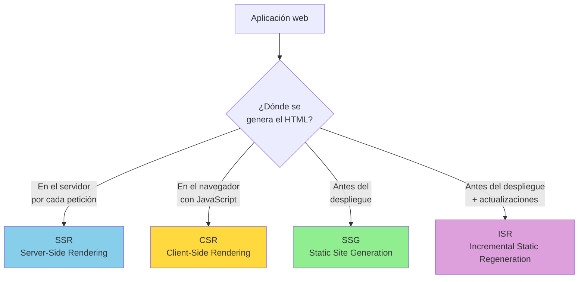
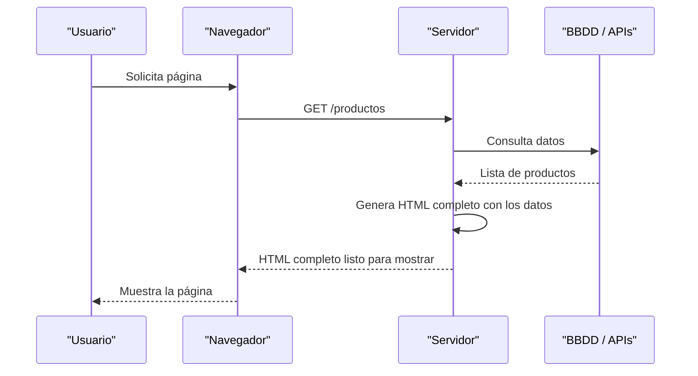
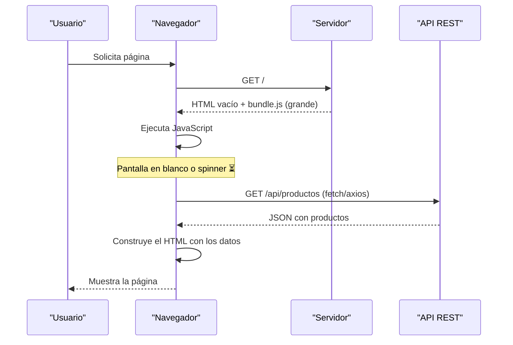
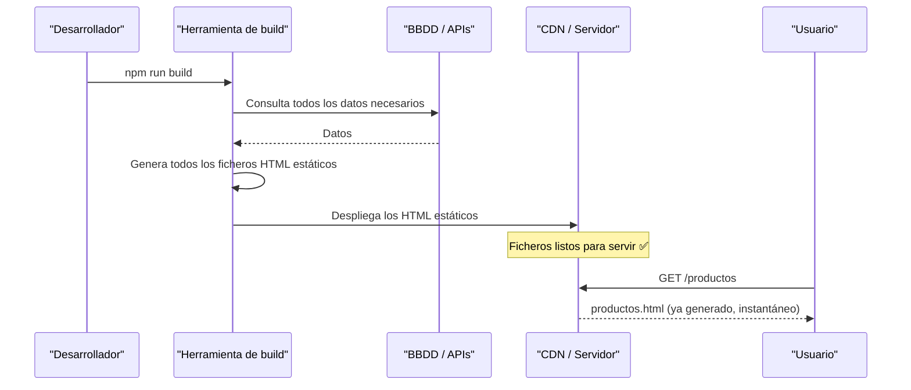
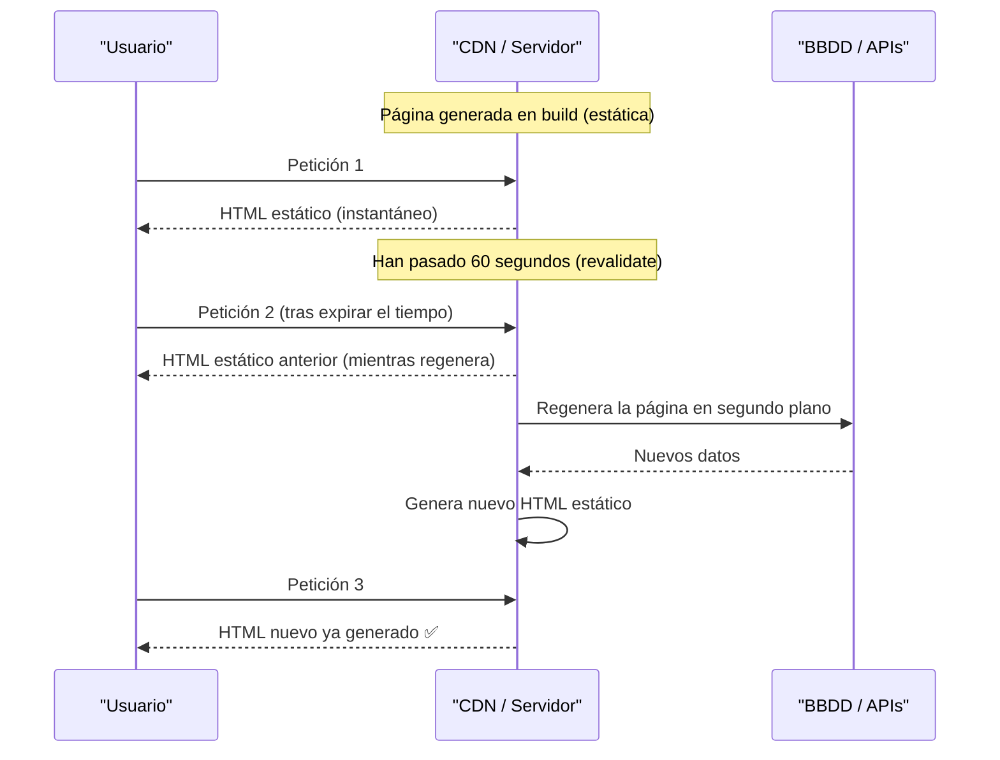
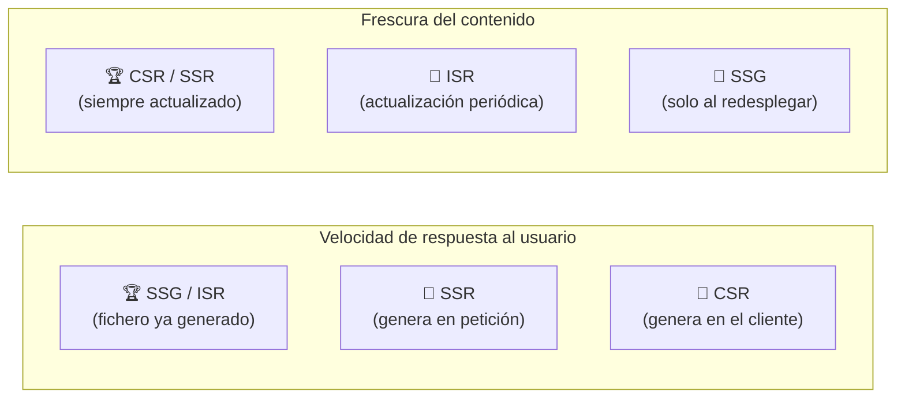
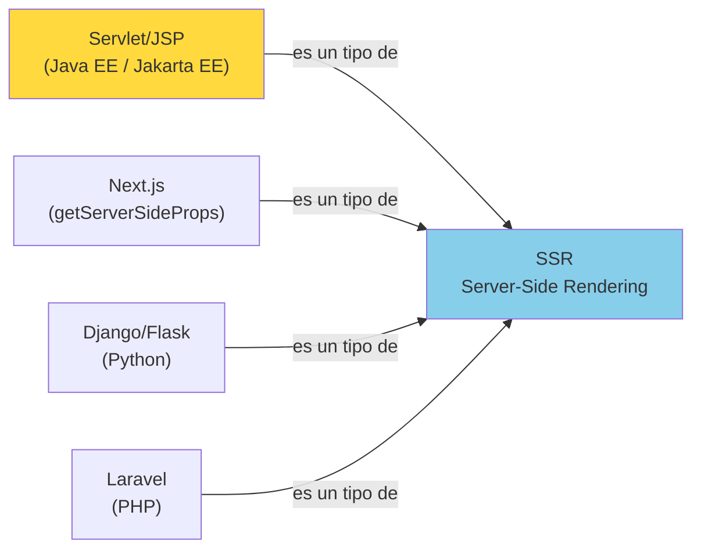

# Anexo 1 — Estrategias de Renderizado Web

## 📋 Índice de contenidos

1. [¿Qué es el renderizado?](#1-qué-es-el-renderizado)
2. [Por qué importa la estrategia de renderizado](#2-por-qué-importa-la-estrategia-de-renderizado)
3. [Server-Side Rendering (SSR)](#3-server-side-rendering-ssr)
   1. [Cómo funciona](#31-cómo-funciona)
   2. [Ventajas e inconvenientes](#32-ventajas-e-inconvenientes)
   3. [Tecnologías y ejemplos](#33-tecnologías-y-ejemplos)
4. [Client-Side Rendering (CSR)](#4-client-side-rendering-csr)
   1. [Cómo funciona](#41-cómo-funciona)
   2. [Ventajas e inconvenientes](#42-ventajas-e-inconvenientes)
   3. [Tecnologías y ejemplos](#43-tecnologías-y-ejemplos)
5. [Static Site Generation (SSG)](#5-static-site-generation-ssg)
   1. [Cómo funciona](#51-cómo-funciona)
   2. [Ventajas e inconvenientes](#52-ventajas-e-inconvenientes)
   3. [Tecnologías y ejemplos](#53-tecnologías-y-ejemplos)
6. [Incremental Static Regeneration (ISR)](#6-incremental-static-regeneration-isr)
   1. [Cómo funciona](#61-cómo-funciona)
   2. [Ventajas e inconvenientes](#62-ventajas-e-inconvenientes)
   3. [Tecnologías y ejemplos](#63-tecnologías-y-ejemplos)
7. [Comparativa de estrategias](#7-comparativa-de-estrategias)
8. [¿Qué estrategia elegir?](#8-qué-estrategia-elegir)
9. [Relación con Servlets y JSP](#9-relación-con-servlets-y-jsp)

---

## 1. ¿Qué es el renderizado?

En el contexto del desarrollo web, **renderizar** significa generar el código HTML que el navegador del usuario finalmente muestra en pantalla. La pregunta clave es: **¿dónde y cuándo se genera ese HTML?**

Las respuestas posibles son varias:
- Lo genera el **servidor** en el momento de cada petición (SSR).
- Lo genera el **navegador del cliente** mediante JavaScript tras recibir una página vacía (CSR).
- Lo genera una herramienta de construcción **antes del despliegue** y se sirve como fichero estático (SSG).
- Se genera de forma estática pero con capacidad de **actualizarse periódicamente** en el servidor (ISR).

Cada una de estas estrategias tiene implicaciones importantes en el **rendimiento**, la **experiencia de usuario** y la **optimización para motores de búsqueda (SEO)**.

> [!NOTE]
> Cuando en la UT11 creamos páginas JSP que generan HTML dinámico en el servidor ante cada petición, estamos usando precisamente la estrategia **SSR**. Es importante conocer el resto de estrategias para entender qué papel ocupa lo que hemos aprendido en el panorama del desarrollo web moderno.

---

## 2. Por qué importa la estrategia de renderizado

La estrategia de renderizado influye directamente en tres aspectos fundamentales de cualquier aplicación web:

**⚡ Rendimiento percibido por el usuario:**
El tiempo que tarda el usuario en ver contenido en pantalla (llamado _Time to First Contentful Paint_ o FCP) depende en gran medida de dónde y cuándo se genera el HTML. Un HTML ya generado en el servidor llega listo para mostrar; un HTML generado en el cliente requiere que el navegador descargue y ejecute JavaScript antes de mostrar nada.

**🔍 SEO (Search Engine Optimization):**
Los buscadores como Google rastrean las páginas web para indexarlas. Si la página llega al buscador como un HTML vacío que necesita JavaScript para rellenarse, el buscador puede tener dificultades para indexar el contenido. Las estrategias que generan HTML completo en el servidor (SSR, SSG, ISR) son mucho más favorables al SEO.

**🔄 Actualización del contenido:**
Dependiendo de con qué frecuencia cambia el contenido (un blog que se actualiza una vez al día vs. una aplicación de bolsa en tiempo real), unas estrategias son más adecuadas que otras.

---

## 3. Server-Side Rendering (SSR)

### 3.1 Cómo funciona

En el **renderizado en el servidor** (SSR), cada vez que un usuario solicita una página, el servidor ejecuta el código necesario para construir el HTML completo y se lo envía al navegador. El navegador recibe una página HTML ya lista para mostrar.

El proceso es el siguiente en cada petición:

1. El navegador hace una petición al servidor.
2. El servidor consulta los datos necesarios (base de datos, APIs externas...).
3. El servidor genera el HTML completo incrustando los datos.
4. El servidor envía ese HTML al navegador.
5. El navegador lo muestra directamente, sin necesidad de ejecutar JavaScript para construir el contenido.

### 3.2 Ventajas e inconvenientes

**✅ Ventajas:**

- **SEO-friendly**: el buscador recibe un HTML completo con todo el contenido indexable.
- **Primera carga rápida**: el navegador puede mostrar contenido en cuanto recibe el HTML.
- **Siempre contenido actualizado**: los datos se consultan en cada petición, por lo que el usuario siempre ve la información más reciente.
- **No depende de JavaScript en el cliente**: funciona aunque el usuario tenga JavaScript desactivado.

**⚠️ Inconvenientes:**

- **Mayor carga en el servidor**: cada petición implica trabajo de computación en el servidor.
- **Mayor latencia en redes lentas**: si el servidor está geográficamente lejos del usuario, la petición tarda más.
- **Recarga completa de página**: cada navegación implica una nueva petición y recarga completa del HTML, lo que puede hacer la experiencia menos fluida que una SPA.

### 3.3 Tecnologías y ejemplos

| Tecnología | Descripción |
| :-- | :-- |
| **Servlets + JSP (Java)** | La tecnología que hemos estudiado en esta UT. SSR clásico. |
| **Next.js** (Node.js) | Con `getServerSideProps` genera el HTML en el servidor en cada petición. |
| **Django / Flask** (Python) | Frameworks de servidor que generan HTML con plantillas (similar a JSP). |
| **Laravel** (PHP) | Framework PHP con sistema de plantillas Blade. Muy usado en la industria. |
| **Ruby on Rails** (Ruby) | Framework MVC que genera HTML en el servidor. |

---

## 4. Client-Side Rendering (CSR)

### 4.1 Cómo funciona

En el **renderizado en el cliente** (CSR), el servidor envía al navegador una página HTML prácticamente vacía junto con un fichero JavaScript de gran tamaño. Es ese JavaScript quien, ejecutándose en el navegador del usuario, solicita los datos (normalmente a través de una API REST) y construye el HTML dinámicamente.

Este es el modelo de las **SPA (Single Page Application)**: la aplicación se carga una única vez y, a partir de entonces, la navegación entre secciones no requiere nuevas peticiones al servidor de páginas HTML completas, sino solo peticiones de datos (JSON).

### 4.2 Ventajas e inconvenientes

**✅ Ventajas:**

- **Experiencia de usuario muy fluida e interactiva**: la navegación entre páginas no recarga, parece una aplicación de escritorio.
- **Ideal para aplicaciones muy interactivas**: paneles de administración, herramientas de edición, dashboards en tiempo real.
- **Menor carga en el servidor**: el servidor solo sirve datos (JSON), no genera HTML.
- **Separación clara** entre frontend y backend.

**⚠️ Inconvenientes:**

- **Primera carga lenta**: el navegador debe descargar y ejecutar el bundle de JavaScript antes de mostrar cualquier contenido.
- **SEO problemático**: los buscadores pueden no ejecutar el JavaScript correctamente y no indexar el contenido.
- **Requiere JavaScript activo**: si el usuario tiene JavaScript desactivado, no ve nada.
- **Mayor complejidad del frontend**: se necesita gestionar el estado de la aplicación en el cliente.

### 4.3 Tecnologías y ejemplos

| Tecnología | Descripción |
| :-- | :-- |
| **React** | Librería de Meta para construir interfaces de usuario (la más popular). |
| **Vue.js** | Framework progresivo, muy usado en proyectos de tamaño medio. |
| **Angular** | Framework completo de Google, muy usado en entornos empresariales. |
| **Svelte** | Compilador que genera JavaScript puro, sin framework en el cliente. |

---

## 5. Static Site Generation (SSG)

### 5.1 Cómo funciona

En la **generación de sitios estáticos** (SSG), el HTML se genera **una sola vez** en el momento de construir y desplegar la aplicación (_build time_), no en el momento de cada petición. El resultado es un conjunto de ficheros HTML, CSS y JS estáticos que se suben a un servidor (o CDN) y se sirven directamente.

### 5.2 Ventajas e inconvenientes

**✅ Ventajas:**

- **Extremadamente rápido**: el servidor entrega un fichero ya generado, sin computación en tiempo real.
- **Muy escalable**: un CDN puede servir millones de peticiones simultáneas sin coste adicional.
- **Excelente para SEO**: el HTML está completo desde el primer momento.
- **Alta seguridad**: no hay servidor ejecutando código en tiempo real que pueda ser atacado.

**⚠️ Inconvenientes:**

- **No apto para contenido que cambia frecuentemente**: si los datos cambian, hay que volver a ejecutar el build completo y redesplegar.
- **Tiempo de build elevado** en sitios muy grandes (miles de páginas): el proceso puede tardar minutos.
- **No personalizable por usuario**: todos los usuarios ven el mismo HTML generado (no hay sesión ni datos de usuario en la generación).

### 5.3 Tecnologías y ejemplos

| Tecnología | Descripción |
| :-- | :-- |
| **Next.js** (Node.js) | Con `getStaticProps` genera HTML en tiempo de build. |
| **Gatsby** | Muy popular para blogs y documentación. Usa GraphQL para obtener datos en build. |
| **Eleventy (11ty)** | Generador estático muy flexible y ligero. |
| **Hugo** | Generador en Go, extremadamente rápido incluso con miles de páginas. |
| **Jekyll** | Muy usado con GitHub Pages. |

---

## 6. Incremental Static Regeneration (ISR)

### 6.1 Cómo funciona

La **regeneración estática incremental** (ISR) es una estrategia híbrida que combina lo mejor de SSG y SSR. Las páginas se generan de forma estática (como en SSG), pero el servidor puede **regenerarlas automáticamente** en segundo plano cuando los datos cambian o cuando pasa un intervalo de tiempo definido, sin necesidad de redesplegar toda la aplicación.

El usuario siempre recibe una respuesta rápida (el contenido estático ya generado). Si los datos han cambiado desde la última generación, el servidor regenera la página en segundo plano para que la siguiente petición ya obtenga el contenido actualizado.

### 6.2 Ventajas e inconvenientes

**✅ Ventajas:**

- **Velocidad de SSG** con **flexibilidad de SSR**: lo mejor de ambos mundos.
- **Escalable**: el CDN absorbe la mayor parte de la carga.
- **SEO-friendly**: HTML completo disponible desde el primer momento.
- **Actualización automática** sin necesidad de redesplegar.

**⚠️ Inconvenientes:**

- **El contenido puede estar momentáneamente desactualizado**: hay una ventana de tiempo entre que los datos cambian y la página se regenera.
- **Mayor complejidad de configuración** respecto a SSG puro.
- **Dependencia de la infraestructura**: ISR es una característica muy ligada a plataformas concretas como Vercel (los creadores de Next.js). En otras infraestructuras puede ser más difícil de implementar.

### 6.3 Tecnologías y ejemplos

| Tecnología | Descripción |
| :-- | :-- |
| **Next.js** | Pionero de ISR. Se configura con `revalidate` en `getStaticProps`. |
| **Nuxt.js** | Equivalente de Next.js para Vue. Implementa ISR desde la versión 3. |

---

## 7. Comparativa de estrategias

| 🧩 Estrategia | 🖥️ Generación del HTML | ⚡ Rendimiento inicial | 🔄 Actualización de datos | 🔍 SEO |
| :-- | :-- | :-- | :-- | :-- |
| **SSR** | En el servidor, en cada petición | Rápido | En cada petición (siempre fresco) | ✅ Sí |
| **CSR** | En el navegador (JavaScript) | Lento (primera carga) | Dinámica y fluida | ❌ Requiere trabajo extra |
| **SSG** | En build time (ficheros estáticos) | Muy rápido | Solo al redesplegar | ✅ Sí |
| **ISR** | En build + regeneración periódica | Muy rápido | Actualización automática | ✅ Sí |

---

## 8. ¿Qué estrategia elegir?

La elección de estrategia depende principalmente de **tres factores**: con qué frecuencia cambia el contenido, qué nivel de interactividad necesita la aplicación y cuán importante es el SEO.

| Caso de uso | Estrategia recomendada | Razonamiento |
| :-- | :-- | :-- |
| Blog personal o documentación técnica | **SSG** | El contenido cambia poco; la velocidad y el SEO son prioritarios. |
| E-commerce con catálogo de productos | **SSR** o **ISR** | Los precios y el stock cambian; el SEO es crucial para vender. |
| Panel de administración / dashboard | **CSR** | Muy interactivo, no necesita SEO, los datos cambian en tiempo real. |
| Noticias o contenido que se actualiza varias veces al día | **ISR** o **SSR** | Necesita frescura de datos pero también velocidad y SEO. |
| Red social o aplicación colaborativa | **CSR** + **SSR** mixto | Partes públicas con SSR (SEO), partes privadas con CSR (interactividad). |
| Página de presentación de empresa | **SSG** | Contenido muy estático; prioridad máxima en velocidad y SEO. |

> [!TIP]
> En aplicaciones modernas grandes es habitual **combinar varias estrategias** según la sección. Por ejemplo, la página de inicio y las fichas de producto con SSR (SEO importante), el panel de usuario con CSR (alta interactividad), y páginas de blog con SSG (contenido estático).

---

## 9. Relación con Servlets y JSP

Lo que hemos aprendido en esta unidad —Servlets y JSP— es precisamente la implementación clásica de **SSR** en la plataforma Java. Cuando un servlet recibe una petición, consulta la base de datos, almacena los resultados en el `request` y hace un `forward` al JSP, que genera el HTML completo y lo envía al navegador, estamos siguiendo exactamente el modelo SSR.

Esta tecnología, aunque considerada clásica en comparación con frameworks modernos como React o Next.js, sigue siendo **ampliamente utilizada en el mundo empresarial**, especialmente en aplicaciones corporativas de gran escala que se construyeron hace años con Java EE y que continúan en producción.

> [!NOTE]
> Conocer SSR con Servlets y JSP te da una **base sólida** para entender cómo funciona la web en el servidor, independientemente del lenguaje o framework que uses en el futuro. Los conceptos de petición/respuesta HTTP, sesiones, cookies y separación entre lógica y vista son universales y se aplican igualmente en Node.js, Python, PHP o cualquier otra tecnología web.

---

📚 <em>Fin del Anexo 1 — Estrategias de Renderizado Web</em>
