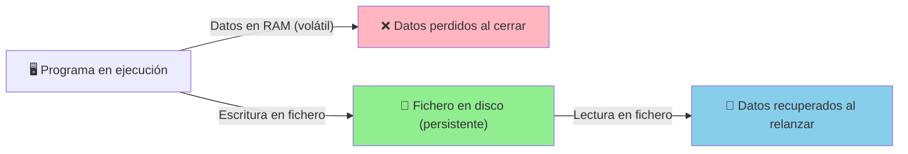
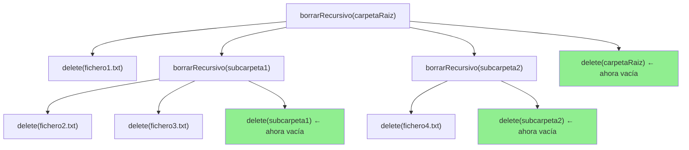
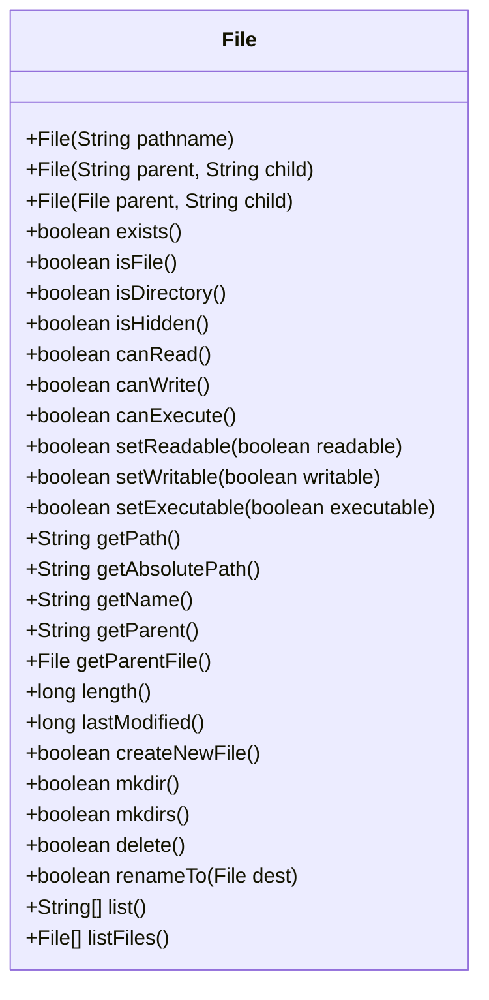

# UT12.1 La clase File

## 📋 Índice de contenidos

1. [Introducción: la necesidad de persistencia](#1-introducción-la-necesidad-de-persistencia)
2. [Gestión de ficheros en Java](#2-gestión-de-ficheros-en-java)
3. [La clase File](#3-la-clase-file)
    1. [Inicialización](#31-inicialización)
    2. [Definición de rutas](#32-definición-de-rutas)
        1. [Ruta absoluta](#321-ruta-absoluta)
        2. [Rutas relativas](#322-rutas-relativas)
4. [Operaciones (métodos) de la clase File](#4-operaciones-métodos-de-la-clase-file)
    1. [Operaciones básicas de consulta de ruta](#41-operaciones-básicas-de-consulta-de-ruta)
    2. [Práctica 1: Inicialización de objetos File](#42-práctica-1-inicialización-de-objetos-file)
    3. [Métodos de comprobación de estado](#43-métodos-de-comprobación-de-estado)
    4. [Práctica 2: Mostrar estado de un File](#44-práctica-2-mostrar-estado-de-un-file)
    5. [Métodos de lectura y modificación de propiedades](#45-métodos-de-lectura-y-modificación-de-propiedades)
    6. [Práctica 3: Propiedades de un fichero](#46-práctica-3-propiedades-de-un-fichero)
    7. [Gestión de ficheros y directorios](#47-gestión-de-ficheros-y-directorios)
    8. [Práctica 4: Crear y eliminar directorios](#48-práctica-4-crear-y-eliminar-directorios)
    9. [Listado de contenidos de un directorio](#49-listado-de-contenidos-de-un-directorio)
    10. [Práctica 5: Renombrar ficheros](#410-práctica-5-renombrar-ficheros)
    11. [Práctica 6: Comportamiento de listFiles()](#411-práctica-6-comportamiento-de-listfiles)
    12. [Práctica 7: Borrado recursivo de una carpeta](#412-práctica-7-borrado-recursivo-de-una-carpeta)
5. [API completa de la clase File](#5-api-completa-de-la-clase-file)

---

## 1. Introducción: la necesidad de persistencia

Cuando desarrollamos un programa, este **manipula y transforma datos mientras está en ejecución**: lee valores del usuario, realiza cálculos y muestra resultados. Sin embargo, toda esa información reside en la **memoria RAM**, que es **volátil**: en el momento en que el programa termina (o el equipo se apaga), todos los datos desaparecen.

Esto plantea un problema fundamental: si cada vez que arrancamos el programa debemos volver a introducir todos los datos, la utilidad del software queda enormemente reducida. Pensemos, por ejemplo, en una agenda de contactos, un historial de ventas o la puntuación de un videojuego: sin persistencia, toda esa información se perdería al cerrar la aplicación.

> [!IMPORTANT]
> Los **ficheros** permiten almacenar información de forma **permanente** en el disco, evitando la pérdida de datos que requieren persistencia entre ejecuciones del programa.

La escritura y lectura de ficheros es, por tanto, una funcionalidad esencial en cualquier aplicación real. Java proporciona herramientas muy completas para trabajar con el sistema de ficheros, y en esta unidad aprenderemos a utilizarlas.



---

## 2. Gestión de ficheros en Java


Entre las funciones de un sistema operativo se encuentra la de **gestionar el sistema de ficheros**: crear carpetas, mover ficheros, cambiar nombres, listar contenidos, etc. Esta gestión no es exclusiva del propio sistema operativo; de hecho, el explorador de archivos que usamos habitualmente no es más que un programa que accede a esa misma interfaz de gestión.

De la misma forma, cualquier aplicación puede acceder al sistema de ficheros siempre que el lenguaje de programación le proporcione las herramientas necesarias. **Java no es una excepción**: ofrece toda una biblioteca de clases para interactuar con el sistema de ficheros a través del paquete `java.io`.

> [!NOTE]
> Java proporciona clases para trabajar con ficheros principalmente a través del paquete `java.io`, y en versiones modernas también mediante `java.nio.file`.

Antes de aprender a leer o escribir contenido dentro de un fichero, conviene dominar primero la representación de una ruta y las operaciones básicas sobre ella. Ahí es donde entra en juego la clase `File`.

---

## 3. La clase File

La clase **`File`** es la pieza fundamental para operar con el sistema de ficheros en Java (especialmente hasta JavaSE 6, aunque sigue siendo ampliamente utilizada). Pertenece al paquete `java.io` y es necesario importarla:

```java
import java.io.File;
```

Aunque se llame `File`, no representa estrictamente “un fichero con contenido”. En realidad, un objeto `File` representa **una ruta del sistema de ficheros**, que puede apuntar a:

- Un fichero.
- Un directorio.
- Una ruta que todavía no existe.

> [!TIP]
> Un objeto `File` **no abre** el fichero ni **lee** su contenido por sí mismo. Sirve para representar la ruta y consultar o realizar determinadas operaciones sobre ella.

Esto explica una idea clave que suele generar confusión al principio: **crear un objeto `File` no significa crear físicamente un fichero o una carpeta**. Solo estamos construyendo un objeto Java que hace referencia a una ubicación del sistema.

### 3.1 Inicialización

La forma general de inicializar un objeto de la clase `File` es la siguiente:

```java
File f = new File("ruta");
```

Donde `"ruta"` es una cadena de texto que identifica de forma única la localización de un fichero o carpeta en el sistema de ficheros. Esta ruta puede referirse a:

- Un **fichero** existente (por ejemplo, `datos.txt`)
- Un **directorio** existente (por ejemplo, `C:\Usuarios\alumno\`)
- Un fichero o directorio **que aún no existe** (la clase `File` se inicializa igualmente)

> [!CAUTION]
> Crear un objeto `File` con una ruta que no existe en el disco **no lanza ningún error**. El objeto se crea sin problemas. El error aparecerá más tarde, cuando intentemos realizar operaciones sobre él (como leer o escribir). Por eso es importante comprobar si la ruta existe con `exists()` antes de operar sobre ella.

**Ejemplo básico:**

```java
import java.io.File;

public class EjemploFile {
    public static void main(String[] args) {
        // Apunta a un fichero (puede existir o no)
        File fichero = new File("datos.txt");

        // Apunta a un directorio
        File directorio = new File("C:\\Users\\alumno\\Documents");

        System.out.println("Ruta del fichero: " + fichero.getPath());
        System.out.println("Ruta del directorio: " + directorio.getPath());
    }
}
```

### 3.2 Definición de rutas

Una **ruta** (_path_ en inglés) es la dirección que identifica la ubicación de un fichero o carpeta dentro del sistema de ficheros. Uno de los aspectos más importantes a tener en cuenta es que el **separador de rutas varía según el sistema operativo**:

| Sistema Operativo | Separador | Ejemplo |
|:---|:---:|:---|
| Windows | `\` | `C:\Users\alumno\fichero.txt` |
| Linux / macOS | `/` | `/home/alumno/fichero.txt` |

Este detalle puede ser una fuente de errores si escribimos las rutas de forma _hardcoded_ (con el separador fijo en el código), ya que el programa dejaría de funcionar al ejecutarse en otro sistema operativo.

> [!TIP]
> Java proporciona la constante **`File.separator`** que contiene el carácter separador de rutas correspondiente al sistema operativo donde se está ejecutando la aplicación. Usar esta constante hace que el código sea **portable** sin necesidad de modificarlo.

```java
// ❌ Malo: dependiente del sistema operativo
File f1 = new File("carpeta\\subcarpeta\\fichero.txt"); // Solo funciona en Windows

// ✅ Bueno: portable entre sistemas operativos
File f2 = new File("carpeta" + File.separator + "subcarpeta" + File.separator + "fichero.txt");
```

> [!NOTE]
> En Java, dentro de una cadena de texto (`String`), la barra invertida `\` es un carácter de escape. Por eso, en Windows hay que escribirla doble: `"\\"`. La barra normal `/` funciona también en Windows dentro de Java, por lo que muchos programadores la usan directamente: `new File("carpeta/subcarpeta/fichero.txt")`.

#### 3.2.1 Ruta absoluta

Una **ruta absoluta** es aquella que especifica la ubicación completa de un elemento **desde la raíz del sistema de ficheros**, enumerando una a una todas las carpetas intermedias hasta llegar al destino.

**Ejemplos:**
- Windows: `C:\Users\nomUsuario\Documents\fichero.txt`
- Linux: `/home/nomUsuario/Documents/fichero.txt`

> [!WARNING]
> **Problema de las rutas absolutas**: son completamente dependientes de la máquina y del usuario concreto. Un programa que use `C:\Users\juan\proyecto` solo funcionará en un equipo donde exista ese usuario y esa estructura de carpetas. Si lo ejecutamos en otro ordenador (o si el usuario cambia de nombre), fallará. En general, **deben evitarse las rutas absolutas** en el código fuente de aplicaciones.

```java
// Rutas absolutas - dependientes de la máquina:
File carpetaUsuario = new File("C:\\Users\\juan\\Documents"); // Windows
File carpetaUsuarioLinux = new File("/home/juan/Documents");   // Linux
```

#### 3.2.2 Rutas relativas

Una **ruta relativa** es aquella que especifica la ubicación de un elemento **a partir de la carpeta de trabajo actual** de la aplicación, en lugar de desde la raíz del sistema de ficheros.

> [!NOTE]
> La **carpeta de trabajo** (_working directory_) de una aplicación Java es, por defecto, la carpeta raíz del proyecto (donde se encuentra el fichero `pom.xml` o la carpeta `src` si usamos IntelliJ IDEA o Eclipse). Podemos obtenerla en tiempo de ejecución con:
>
> ```java
> System.out.println(System.getProperty("user.dir"));
> ```

Esto significa que si nuestra carpeta de trabajo es `/home/alumno/MiProyecto/`, una ruta relativa como `"datos/fichero.txt"` apuntará a `/home/alumno/MiProyecto/datos/fichero.txt`.

```java
// Rutas relativas - portables y recomendadas:
File ficheroRelativo = new File("datos.txt");               // En la carpeta del proyecto
File carpetaTemp = new File("temp");                        // Subcarpeta "temp" del proyecto
File ficheroEnTemp = new File("temp" + File.separator + "resultado.txt");

// Obtener la carpeta de trabajo actual:
System.out.println("Carpeta de trabajo: " + System.getProperty("user.dir"));
```

---

## 4. Operaciones (métodos) de la clase File

Una vez inicializado un objeto `File`, disponemos de numerosos métodos para interactuar con el sistema de ficheros. Los agrupamos por categorías para facilitar su comprensión.

### 4.1 Operaciones básicas de consulta de ruta

Estos métodos permiten obtener información sobre la **ruta** representada por el objeto `File`, independientemente de si el fichero o directorio existe físicamente.

| Método | Retorno | Descripción |
|:---|:---:|:---|
| `getPath()` | `String` | Devuelve la ruta tal como se especificó al crear el objeto (relativa o absoluta) |
| `getAbsolutePath()` | `String` | Devuelve la ruta absoluta completa del elemento |
| `getName()` | `String` | Devuelve únicamente el nombre del fichero o carpeta (sin la ruta) |
| `getParent()` | `String` | Devuelve la ruta del directorio padre del elemento |

**Ejemplo:**

```java
import java.io.File;

public class ConsultaRuta {
    public static void main(String[] args) {
        File f = new File("datos" + File.separator + "fichero.txt");

        System.out.println("getPath():         " + f.getPath());
        System.out.println("getAbsolutePath(): " + f.getAbsolutePath());
        System.out.println("getName():         " + f.getName());
        System.out.println("getParent():       " + f.getParent());
    }
}
```

**Salida (ejecutado en Linux con carpeta de trabajo `/home/alumno/Proyecto`):**

```
getPath():         datos/fichero.txt
getAbsolutePath(): /home/alumno/Proyecto/datos/fichero.txt
getName():         fichero.txt
getParent():       datos
```

---

### 4.2 Práctica 1: Inicialización de objetos File

**Enunciado:**

Crea un proyecto que contenga un método `main` que inicialice **cuatro variables** de la clase `File`, usando en cada una las siguientes rutas:

1. Ruta absoluta a la carpeta de tu usuario (por ejemplo `C:\Users\tunombre` o `/home/tunombre`).
2. Ruta absoluta a un fichero dentro de la carpeta de tu usuario llamado `prueba.txt`.
3. Ruta relativa a una carpeta llamada `temp` dentro del directorio de trabajo del proyecto.
4. Ruta relativa a un fichero llamado `prueba.txt` dentro de la carpeta `temp`.

Para cada uno de los cuatro objetos `File`, muestra por pantalla el resultado de `getPath()`, `getAbsolutePath()`, `getName()` y `getParent()`.

> [!NOTE]
> Recuerda que la clase `File` se inicializa correctamente aunque la ruta no exista en disco. En esta práctica solo estamos declarando rutas, no creando ficheros.

<details>
<summary>💻 Solución</summary>

```java
import java.io.File;

public class Practica1 {
    public static void main(String[] args) {
        Practica1 p = new Practica1();
        p.inicio();
    }

    public void inicio() {
        // 1. Ruta absoluta a la carpeta del usuario
        // En Windows sería: "C:\\Users\\tunombre"
        // En Linux/macOS sería: "/home/tunombre"
        File carpetaUsuario = new File(System.getProperty("user.home"));

        // 2. Ruta absoluta a un fichero dentro de la carpeta del usuario
        File ficheroUsuario = new File(System.getProperty("user.home") + File.separator + "prueba.txt");

        // 3. Ruta relativa a una carpeta "temp" en el directorio de trabajo
        File carpetaTemp = new File("temp");

        // 4. Ruta relativa a "prueba.txt" dentro de "temp"
        File ficheroTemp = new File("temp" + File.separator + "prueba.txt");

        // Mostrar información de cada uno
        System.out.println("=== 1. Carpeta del usuario (absoluta) ===");
        mostrarInfo(carpetaUsuario);

        System.out.println("\n=== 2. Fichero en carpeta de usuario (absoluta) ===");
        mostrarInfo(ficheroUsuario);

        System.out.println("\n=== 3. Carpeta temp (relativa) ===");
        mostrarInfo(carpetaTemp);

        System.out.println("\n=== 4. Fichero en temp (relativa) ===");
        mostrarInfo(ficheroTemp);
    }

    public void mostrarInfo(File f) {
        System.out.println("  getPath():         " + f.getPath());
        System.out.println("  getAbsolutePath(): " + f.getAbsolutePath());
        System.out.println("  getName():         " + f.getName());
        System.out.println("  getParent():       " + f.getParent());
    }
}
```

> [!TIP]
> Observa que `System.getProperty("user.home")` devuelve la carpeta del usuario actual de forma portable, sin necesidad de escribir la ruta en el código. Esto hace el programa compatible con cualquier sistema operativo y cualquier nombre de usuario.

</details>

---

### 4.3 Métodos de comprobación de estado

Estos métodos permiten comprobar si el elemento referenciado por el objeto `File` **existe realmente en el disco** y de qué tipo es.

| Método | Retorno | Descripción |
|:---|:---:|:---|
| `exists()` | `boolean` | `true` si la ruta existe en el sistema de ficheros |
| `isFile()` | `boolean` | `true` si la ruta apunta a un fichero regular |
| `isDirectory()` | `boolean` | `true` si la ruta apunta a un directorio |
| `isHidden()` | `boolean` | `true` si el fichero o carpeta está oculto |
| `canRead()` | `boolean` | `true` si el programa tiene permiso de lectura |
| `canWrite()` | `boolean` | `true` si el programa tiene permiso de escritura |
| `canExecute()` | `boolean` | `true` si el programa tiene permiso de ejecución |

> [!IMPORTANT]
> Siempre que vayas a realizar operaciones sobre un fichero (leer, escribir, listar...), **comprueba primero con `exists()`** que el elemento existe. De lo contrario, podrías obtener valores incorrectos o excepciones inesperadas.

**Ejemplo práctico:**

```java
import java.io.File;

public class ComprobarEstado {
    public static void main(String[] args) {
        File f = new File("datos.txt");

        if (f.exists()) {
            System.out.println("El fichero existe.");
            System.out.println("¿Es fichero?    " + f.isFile());
            System.out.println("¿Es directorio? " + f.isDirectory());
            System.out.println("¿Está oculto?   " + f.isHidden());
            System.out.println("¿Se puede leer?    " + f.canRead());
            System.out.println("¿Se puede escribir? " + f.canWrite());
        } else {
            System.out.println("La ruta no existe en el disco.");
        }
    }
}
```

---

### 4.4 Práctica 2: Mostrar estado de un File

**Enunciado:**

Crea un método llamado `mostrarEstado` que reciba como parámetro una variable de tipo `File`. Este método debe mostrar por pantalla la información que proporciona cada uno de los métodos de comprobación de estado descritos anteriormente (`exists()`, `isFile()`, `isDirectory()`, `isHidden()`, `canRead()`, `canWrite()`, `canExecute()`).

Invoca el método usando cada una de las cuatro variables de tipo `File` creadas en la práctica anterior.

> [!NOTE]
> Observa que algunas variables apuntaban a rutas que no existen en el disco. Comprueba qué valores devuelven los métodos en ese caso.

<details>
<summary>💻 Solución</summary>

```java
import java.io.File;

public class Practica2 {
    public static void main(String[] args) {
        Practica2 p = new Practica2();
        p.inicio();
    }

    public void inicio() {
        File carpetaUsuario  = new File(System.getProperty("user.home"));
        File ficheroUsuario  = new File(System.getProperty("user.home") + File.separator + "prueba.txt");
        File carpetaTemp     = new File("temp");
        File ficheroTemp     = new File("temp" + File.separator + "prueba.txt");

        System.out.println("=== Carpeta del usuario ===");
        mostrarEstado(carpetaUsuario);

        System.out.println("\n=== Fichero en carpeta de usuario ===");
        mostrarEstado(ficheroUsuario);

        System.out.println("\n=== Carpeta temp (relativa) ===");
        mostrarEstado(carpetaTemp);

        System.out.println("\n=== Fichero en temp (relativa) ===");
        mostrarEstado(ficheroTemp);
    }

    public void mostrarEstado(File f) {
        System.out.println("  Ruta:           " + f.getAbsolutePath());
        System.out.println("  exists():       " + f.exists());
        System.out.println("  isFile():       " + f.isFile());
        System.out.println("  isDirectory():  " + f.isDirectory());
        System.out.println("  isHidden():     " + f.isHidden());
        System.out.println("  canRead():      " + f.canRead());
        System.out.println("  canWrite():     " + f.canWrite());
        System.out.println("  canExecute():   " + f.canExecute());
    }
}
```

</details>

---

### 4.5 Métodos de lectura y modificación de propiedades

Estos métodos permiten obtener o cambiar **propiedades** del fichero o directorio referenciado.

| Método | Retorno | Descripción |
|:---|:---:|:---|
| `length()` | `long` | Tamaño del fichero en bytes (solo tiene sentido para ficheros, no directorios) |
| `lastModified()` | `long` | Fecha de la última modificación en **milisegundos** desde el 1 de enero de 1970 |
| `setReadable(boolean)` | `boolean` | Establece el permiso de lectura |
| `setWritable(boolean)` | `boolean` | Establece el permiso de escritura |
| `setExecutable(boolean)` | `boolean` | Establece el permiso de ejecución |

> [!NOTE]
> El valor de `lastModified()` se expresa en milisegundos desde la **época Unix** (1 de enero de 1970, 00:00:00 UTC). Este formato, aunque poco legible directamente, es el estándar en informática para representar fechas. Para convertirlo a una fecha comprensible utilizamos las clases de fechas de Java.

#### Conversión de `lastModified()` a fecha legible

La forma moderna y recomendada (Java 8+) para convertir ese valor a una fecha comprensible es usando `LocalDateTime`:

```java
import java.io.File;
import java.time.Instant;
import java.time.LocalDateTime;
import java.time.ZoneId;
import java.time.format.DateTimeFormatter;

public class FechaModificacion {
    public static void main(String[] args) {
        File f = new File("datos.txt");

        if (f.exists()) {
            long milisegundos = f.lastModified();

            // Conversión a LocalDateTime
            LocalDateTime fecha = LocalDateTime.ofInstant(
                Instant.ofEpochMilli(milisegundos),
                ZoneId.systemDefault()
            );

            // Formatear la fecha para mostrarla
            DateTimeFormatter formato = DateTimeFormatter.ofPattern("dd/MM/yyyy HH:mm:ss");
            System.out.println("Última modificación: " + fecha.format(formato));

            // Tamaño del fichero
            System.out.println("Tamaño: " + f.length() + " bytes");
            System.out.printf("Tamaño: %.2f KB%n", f.length() / 1024.0);
        }
    }
}
```

> [!TIP]
> Fíjate en el flujo de conversión:
> `long` (milisegundos) → `Instant.ofEpochMilli()` → `.atZone()` / `LocalDateTime.ofInstant()` → `LocalDateTime`
> Este patrón lo utilizarás también cuando trabajes con bases de datos o APIs web que devuelven fechas como timestamps en milisegundos.

---

### 4.6 Práctica 3: Propiedades de un fichero

**Enunciado:**

Crea un método llamado `propiedadesFichero` que reciba un parámetro de tipo `File`. El método debe mostrar la información que devuelven `length()` y `lastModified()`. Para la fecha, muéstrala usando la clase `LocalDateTime` con un formato legible (`dd/MM/yyyy HH:mm:ss`).

Prueba el método con un fichero existente en tu ordenador.

> [!NOTE]
> Recuerda añadir las importaciones necesarias: `java.time.LocalDateTime`, `java.time.Instant`, `java.time.ZoneId` y `java.time.format.DateTimeFormatter`.

<details>
<summary>💻 Solución</summary>

```java
import java.io.File;
import java.time.Instant;
import java.time.LocalDateTime;
import java.time.ZoneId;
import java.time.format.DateTimeFormatter;

public class Practica3 {
    public static void main(String[] args) {
        Practica3 p = new Practica3();
        p.inicio();
    }

    public void inicio() {
        // Usar un fichero existente para probar
        File f = new File(System.getProperty("user.home") + File.separator + "prueba.txt");

        if (f.exists() && f.isFile()) {
            propiedadesFichero(f);
        } else {
            System.out.println("El fichero no existe: " + f.getAbsolutePath());
        }
    }

    public void propiedadesFichero(File f) {
        System.out.println("=== Propiedades de: " + f.getName() + " ===");

        // Tamaño
        long bytes = f.length();
        System.out.println("Tamaño: " + bytes + " bytes");
        System.out.printf("Tamaño: %.2f KB%n", bytes / 1024.0);
        System.out.printf("Tamaño: %.4f MB%n", bytes / (1024.0 * 1024.0));

        // Fecha de última modificación
        long milisegundos = f.lastModified();
        LocalDateTime fecha = LocalDateTime.ofInstant(
            Instant.ofEpochMilli(milisegundos),
            ZoneId.systemDefault()
        );
        DateTimeFormatter formato = DateTimeFormatter.ofPattern("dd/MM/yyyy HH:mm:ss");
        System.out.println("Última modificación: " + fecha.format(formato));
    }
}
```

</details>

---

### 4.7 Gestión de ficheros y directorios

Además de consultar información, la clase `File` permite **crear, renombrar y eliminar** ficheros y directorios.

#### Creación de un fichero vacío

```java
boolean exito = f.createNewFile(); // Crea el fichero si no existe. Lanza IOException.
```

> [!CAUTION]
> El método `createNewFile()` lanza una excepción comprobada (`IOException`), por lo que debe ir dentro de un bloque `try-catch`. Lo veremos con más detalle en el tema de gestión de excepciones y streams.

#### Creación de directorios

| Método | Descripción |
|:---|:---|
| `boolean mkdir()` | Crea el directorio indicado por la ruta. **Solo funciona si el directorio padre ya existe**. Devuelve `true` si se creó correctamente, `false` en caso contrario. |
| `boolean mkdirs()` | Crea el directorio indicado y **todos los directorios intermedios necesarios** si no existen. Más flexible que `mkdir()`. |

```java
File dir = new File("resultados" + File.separator + "2024" + File.separator + "enero");

// mkdir() fallaría si "resultados/2024" no existe previamente
boolean ok1 = dir.mkdir();   // ❌ puede fallar si las carpetas padre no existen

// mkdirs() crea toda la estructura de carpetas necesaria
boolean ok2 = dir.mkdirs();  // ✅ crea "resultados", "2024" y "enero" si son necesarios

System.out.println("Directorio creado: " + ok2);
```

> [!WARNING]
> `mkdir()` devuelve `false` (sin lanzar excepción) en los siguientes casos:
> - El directorio ya existe
> - El directorio padre no existe
> - No hay permisos de escritura
> - La ruta ya existe como fichero (no como directorio)
>
> Siempre verifica el valor de retorno antes de continuar.

#### Eliminación de ficheros y directorios

| Método | Descripción |
|:---|:---|
| `boolean delete()` | Elimina el fichero o directorio. Devuelve `true` si se eliminó correctamente. |

> [!IMPORTANT]
> `delete()` **no puede eliminar un directorio que contenga elementos** (ficheros u otros directorios). El directorio debe estar vacío. Si intentas eliminar un directorio con contenido, `delete()` devolverá `false`. Para borrar una carpeta con contenido, necesitarás primero eliminar recursivamente todos sus elementos (lo haremos en la Práctica 7).

#### Renombrado / movido de ficheros

| Método | Descripción |
|:---|:---|
| `boolean renameTo(File dest)` | Cambia el nombre del fichero o lo mueve a otra ubicación. Devuelve `true` si la operación fue exitosa. |

```java
File original = new File("documento.txt");
File renombrado = new File("informe_final.txt");
boolean ok = original.renameTo(renombrado);

if (ok) {
    System.out.println("Fichero renombrado correctamente.");
} else {
    System.out.println("No se pudo renombrar el fichero.");
}
```

> [!NOTE]
> `renameTo()` puede usarse tanto para **renombrar** como para **mover** un fichero a otra carpeta (si el destino tiene una ruta diferente). Sin embargo, su comportamiento puede variar entre sistemas operativos. En Java moderno (NIO), se recomienda usar `Files.move()` del paquete `java.nio.file` para mayor fiabilidad.

---

### 4.8 Práctica 4: Crear y eliminar directorios

**Enunciado:**

1. **Investiga** bajo qué condiciones `mkdir()` devuelve `false` (en qué situaciones no puede crear el directorio). Haz lo mismo para `delete()`.

2. **Amplía el programa** creado hasta ahora para crear alguna carpeta y posteriormente borrarla.

3. **Intenta eliminar** alguna carpeta que no sea posible eliminar (por ejemplo, una que tenga contenido), verificando que, efectivamente, la carpeta no ha sido eliminada.

> [!TIP]
> Para comprobar si `delete()` falla con un directorio no vacío, crea manualmente (con el explorador de archivos) una carpeta con algún fichero dentro, e intenta eliminarla con `delete()`. Verifica con `exists()` que sigue existiendo.

<details>
<summary>💻 Solución</summary>

```java
import java.io.File;

public class Practica4 {
    public static void main(String[] args) {
        Practica4 p = new Practica4();
        p.inicio();
    }

    public void inicio() {
        // === CREAR UN DIRECTORIO ===
        File nuevaCarpeta = new File("carpetaPrueba");
        System.out.println("=== CREACIÓN DE DIRECTORIO ===");

        if (!nuevaCarpeta.exists()) {
            boolean creado = nuevaCarpeta.mkdir();
            System.out.println("¿Carpeta creada? " + creado);
        } else {
            System.out.println("La carpeta ya existía.");
        }

        // === INTENTAR CREAR SUBCARPETA SIN PADRE (mkdir falla) ===
        File subCarpetaSinPadre = new File("otraCarpeta" + File.separator + "subcarpeta");
        boolean creadoSinPadre = subCarpetaSinPadre.mkdir();
        System.out.println("\nCrear subcarpeta sin padre con mkdir(): " + creadoSinPadre); // false

        // mkdirs() sí crea toda la estructura
        boolean creadoConMkdirs = subCarpetaSinPadre.mkdirs();
        System.out.println("Crear subcarpeta con mkdirs(): " + creadoConMkdirs); // true

        // === ELIMINAR UN DIRECTORIO VACÍO ===
        System.out.println("\n=== ELIMINACIÓN DE DIRECTORIO VACÍO ===");
        boolean eliminado = nuevaCarpeta.delete();
        System.out.println("¿Carpeta eliminada? " + eliminado);
        System.out.println("¿Existe después? " + nuevaCarpeta.exists());

        // === INTENTAR ELIMINAR UN DIRECTORIO CON CONTENIDO ===
        System.out.println("\n=== ELIMINAR DIRECTORIO CON CONTENIDO ===");
        // "otraCarpeta" contiene "subcarpeta" dentro
        File carpetaConContenido = new File("otraCarpeta");
        boolean eliminadaConContenido = carpetaConContenido.delete();
        System.out.println("¿Se pudo eliminar carpeta con contenido? " + eliminadaConContenido); // false
        System.out.println("¿Sigue existiendo? " + carpetaConContenido.exists()); // true

        // === LIMPIAR: eliminar primero subcarpeta, luego la padre ===
        subCarpetaSinPadre.delete();
        carpetaConContenido.delete();
        System.out.println("\nLimpieza completada.");
    }
}
```

**Condiciones en que `mkdir()` devuelve `false`:**
- El directorio ya existe
- El directorio **padre no existe**
- No hay permisos de escritura
- La ruta ya está ocupada por un fichero

**Condiciones en que `delete()` devuelve `false`:**
- El fichero o directorio no existe
- El directorio **no está vacío**
- No hay permisos de borrado
- El fichero está bloqueado (abierto por otro proceso)

</details>

---

### 4.9 Listado de contenidos de un directorio

| Método | Descripción |
|:---|:---|
| `String[] list()` | Devuelve un array con los **nombres** (como `String`) de todos los elementos dentro del directorio |
| `File[] listFiles()` | Devuelve un array de objetos **`File`** para cada elemento dentro del directorio |

> [!TIP]
> Se prefiere usar **`listFiles()`** sobre `list()` porque devuelve objetos `File`, lo que nos permite encadenar operaciones sobre cada elemento (comprobar si es fichero o directorio, obtener su tamaño, etc.) sin necesidad de crear nuevos objetos `File` manualmente.

**Comportamiento en casos especiales:**

| Situación | Valor devuelto |
|:---|:---|
| La ruta es un directorio con elementos | Array con todos los elementos |
| La ruta es un directorio **vacío** | Array **vacío** (longitud 0), no `null` |
| La ruta es un **fichero** (no directorio) | `null` |
| La ruta no existe | `null` |

> [!CAUTION]
> Antes de iterar sobre el resultado de `listFiles()`, comprueba siempre que no sea `null`. De lo contrario obtendrás una `NullPointerException` si la ruta era un fichero o no existía.

**Ejemplo de listado de una carpeta:**

```java
import java.io.File;

public class ListarCarpeta {
    public static void main(String[] args) {
        File directorio = new File(System.getProperty("user.home"));

        File[] elementos = directorio.listFiles();

        if (elementos == null) {
            System.out.println("La ruta no es un directorio o no existe.");
        } else if (elementos.length == 0) {
            System.out.println("El directorio está vacío.");
        } else {
            System.out.println("Contenido de: " + directorio.getAbsolutePath());
            System.out.println("Total de elementos: " + elementos.length);
            System.out.println("---");
            for (File elem : elementos) {
                String tipo = elem.isDirectory() ? "📁 [DIR]  " : "📄 [FILE] ";
                System.out.printf("%s %-40s %10d bytes%n",
                    tipo, elem.getName(),
                    elem.isFile() ? elem.length() : 0L);
            }
        }
    }
}
```

---

### 4.10 Práctica 5: Renombrar ficheros

**Enunciado:**

Crea un programa que:

1. Lea por teclado el texto que corresponda a la ruta de un **fichero existente** en tu ordenador (muestra un mensaje de error si no existe o si es un directorio).
2. **Cambie el nombre** de ese fichero eliminando su extensión. Por ejemplo, si el fichero es `documento.txt`, pasará a llamarse `documento`. El fichero con extensión deberá ser eliminado (o renombrado al nuevo nombre).

> [!TIP]
> Para obtener el nombre sin extensión, puedes buscar la última aparición del carácter `.` en el nombre con `lastIndexOf('.')` y usar `substring()` para quedarte con la parte anterior.

<details>
<summary>💻 Solución</summary>

```java
import java.io.File;
import java.util.Scanner;

public class Practica5 {
    public static void main(String[] args) {
        Practica5 p = new Practica5();
        p.inicio();
    }

    public void inicio() {
        Scanner sc = new Scanner(System.in);

        System.out.print("Introduce la ruta de un fichero: ");
        String ruta = sc.nextLine();

        File fichero = new File(ruta);

        // Comprobar que existe y que es un fichero
        if (!fichero.exists()) {
            System.out.println("Error: la ruta no existe.");
            sc.close();
            return;
        }
        if (!fichero.isFile()) {
            System.out.println("Error: la ruta no corresponde a un fichero.");
            sc.close();
            return;
        }

        String nombre = fichero.getName();

        // Buscar la última aparición del punto
        int posPunto = nombre.lastIndexOf('.');

        if (posPunto == -1) {
            System.out.println("El fichero no tiene extensión. No se realiza ningún cambio.");
            sc.close();
            return;
        }

        // Construir el nuevo nombre sin extensión
        String nombreSinExtension = nombre.substring(0, posPunto);

        // Construir la nueva ruta (misma carpeta, nuevo nombre)
        File ficheroRenombrado = new File(fichero.getParent(), nombreSinExtension);

        // Renombrar
        boolean ok = fichero.renameTo(ficheroRenombrado);

        if (ok) {
            System.out.println("Fichero renombrado correctamente:");
            System.out.println("  Antes: " + fichero.getAbsolutePath());
            System.out.println("  Ahora: " + ficheroRenombrado.getAbsolutePath());
        } else {
            System.out.println("No se pudo renombrar el fichero.");
        }

        sc.close();
    }
}
```

</details>

---

### 4.11 Práctica 6: Comportamiento de listFiles()

**Enunciado:**

1. Comprueba qué valor devuelve `listFiles()` cuando la ruta hace referencia a un **fichero** (no a un directorio). ¿Es `null` o un array vacío?

2. Comprueba también qué valor devuelve cuando la ruta hace referencia a un directorio **vacío** (sin elementos).

> [!NOTE]
> Esta práctica es importante para aprender a manejar correctamente los casos límite antes de iterar sobre el resultado de `listFiles()`.

<details>
<summary>💻 Solución</summary>

```java
import java.io.File;
import java.io.IOException;

public class Practica6 {
    public static void main(String[] args) throws IOException {
        Practica6 p = new Practica6();
        p.inicio();
    }

    public void inicio() throws IOException {
        // --- CASO 1: listFiles() sobre un FICHERO ---
        File fichero = new File("ficheroTest.txt");
        fichero.createNewFile(); // Crea el fichero vacío

        File[] resultadoFichero = fichero.listFiles();
        System.out.println("=== listFiles() sobre un FICHERO ===");
        System.out.println("Resultado: " + resultadoFichero);
        // Resultado: null  (no es un directorio)

        // --- CASO 2: listFiles() sobre un DIRECTORIO VACÍO ---
        File dirVacio = new File("directorioVacio");
        dirVacio.mkdir();

        File[] resultadoDirVacio = dirVacio.listFiles();
        System.out.println("\n=== listFiles() sobre un DIRECTORIO VACÍO ===");
        System.out.println("Resultado: " + resultadoDirVacio);
        if (resultadoDirVacio != null) {
            System.out.println("Longitud del array: " + resultadoDirVacio.length);
            // Resultado: array vacío, longitud 0
        }

        // Conclusión
        System.out.println("\n=== CONCLUSIÓN ===");
        System.out.println("listFiles() sobre fichero    → null");
        System.out.println("listFiles() sobre dir vacío  → array vacío (length = 0)");
        System.out.println("⚠️  Siempre comprobar != null antes de iterar.");

        // Limpieza
        fichero.delete();
        dirVacio.delete();
    }
}
```

**Conclusiones clave:**
- `listFiles()` sobre un **fichero** devuelve `null`
- `listFiles()` sobre un **directorio vacío** devuelve un **array vacío** (no `null`)
- Siempre hay que comprobar que el resultado no es `null` antes de usarlo

</details>

---

### 4.12 Práctica 7: Borrado recursivo de una carpeta

**Enunciado:**

1. Usando el explorador de archivos, crea manualmente una carpeta que contenga en su interior subcarpetas y ficheros. Cada subcarpeta creada debe contener, a su vez, más ficheros.

2. Realiza un programa que lea por teclado la ruta de la carpeta creada en el punto 1 y **borre todos los elementos** que hay dentro de esa carpeta (incluyendo subcarpetas y su contenido).

> [!IMPORTANT]
> Recuerda que para borrar una carpeta, **primero debes borrar todo su contenido**. Dado que puede haber subcarpetas con más elementos, necesitarás usar **recursividad**: el método deberá llamarse a sí mismo para procesar cada subcarpeta.

> [!TIP]
> **Esquema de la solución recursiva:**
> 1. Obtener el listado de elementos con `listFiles()`
> 2. Para cada elemento:
>    - Si es un **directorio**: llamar recursivamente al método para borrarlo todo
>    - Si es un **fichero**: borrarlo con `delete()`
> 3. Una vez vacío, borrar el propio directorio con `delete()`

<details>
<summary>💻 Solución</summary>

```java
import java.io.File;
import java.util.Scanner;

public class Practica7 {
    public static void main(String[] args) {
        Practica7 p = new Practica7();
        p.inicio();
    }

    public void inicio() {
        Scanner sc = new Scanner(System.in);

        System.out.print("Introduce la ruta de la carpeta a borrar: ");
        String ruta = sc.nextLine();

        File carpeta = new File(ruta);

        if (!carpeta.exists()) {
            System.out.println("Error: la ruta no existe.");
            sc.close();
            return;
        }

        if (!carpeta.isDirectory()) {
            System.out.println("Error: la ruta no es un directorio.");
            sc.close();
            return;
        }

        System.out.println("Borrando: " + carpeta.getAbsolutePath());
        borrarRecursivo(carpeta);

        if (!carpeta.exists()) {
            System.out.println("✅ Carpeta borrada correctamente.");
        } else {
            System.out.println("❌ No se pudo borrar completamente.");
        }

        sc.close();
    }

    /**
     * Borra recursivamente un directorio y todo su contenido.
     * @param directorio el directorio a borrar
     */
    public void borrarRecursivo(File directorio) {
        File[] elementos = directorio.listFiles();

        if (elementos != null) { // Comprobación de seguridad
            for (File elem : elementos) {
                if (elem.isDirectory()) {
                    // Recursión: borrar primero el contenido de la subcarpeta
                    borrarRecursivo(elem);
                } else {
                    // Es un fichero: borrarlo directamente
                    boolean borrado = elem.delete();
                    System.out.println("  Fichero borrado: " + elem.getName() + " → " + borrado);
                }
            }
        }

        // Una vez vacío, borrar el propio directorio
        boolean borrado = directorio.delete();
        System.out.println("  Directorio borrado: " + directorio.getName() + " → " + borrado);
    }
}
```

**Traza del proceso recursivo** para una carpeta con la siguiente estructura:
```
carpetaRaiz/
├── fichero1.txt
├── subcarpeta1/
│   ├── fichero2.txt
│   └── fichero3.txt
└── subcarpeta2/
    └── fichero4.txt
```



</details>

---

## 5. API completa de la clase File

A continuación se muestra un resumen de los métodos más relevantes de la clase `File`. Puedes consultar la documentación oficial completa en:

🌐 **URL oficial:** <https://docs.oracle.com/en/java/javase/21/docs/api/java.base/java/io/File.html>



### Resumen de métodos por categoría

| Categoría | Métodos principales |
|:---|:---|
| 🔍 **Consulta de ruta** | `getPath()`, `getAbsolutePath()`, `getName()`, `getParent()` |
| ✅ **Comprobación de estado** | `exists()`, `isFile()`, `isDirectory()`, `isHidden()` |
| 🔒 **Permisos** | `canRead()`, `canWrite()`, `canExecute()` |
| 📏 **Propiedades** | `length()`, `lastModified()` |
| 🛠️ **Gestión** | `createNewFile()`, `mkdir()`, `mkdirs()`, `delete()`, `renameTo()` |
| 📋 **Listado** | `list()`, `listFiles()` |

> [!NOTE]
> A partir de **Java 7**, el paquete `java.nio.file` ofrece la clase `Files` y la interfaz `Path` con funcionalidades equivalentes pero más potentes y robustas. En el próximo tema las estudiaremos junto con los flujos de datos (streams) para lectura y escritura de contenido.

---

<p align="center">📚 <em>Fin del apartado UT12.1 – La clase File</em></p>
