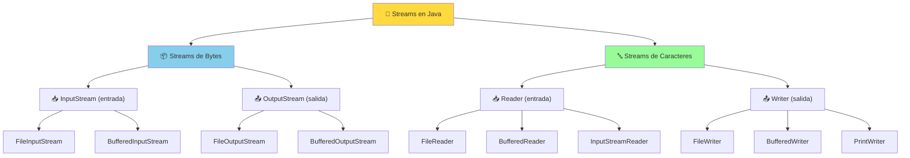
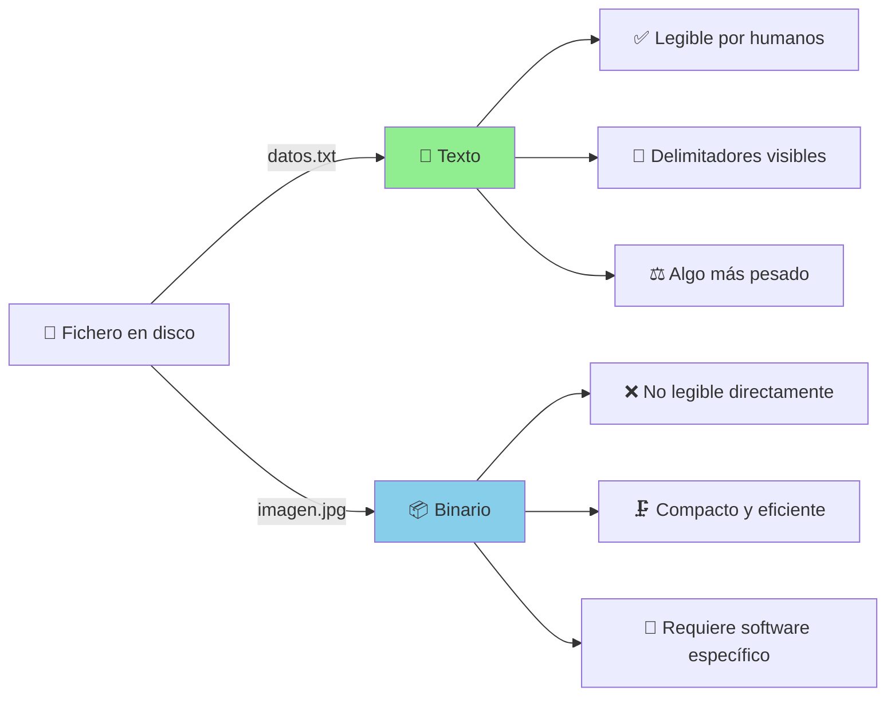
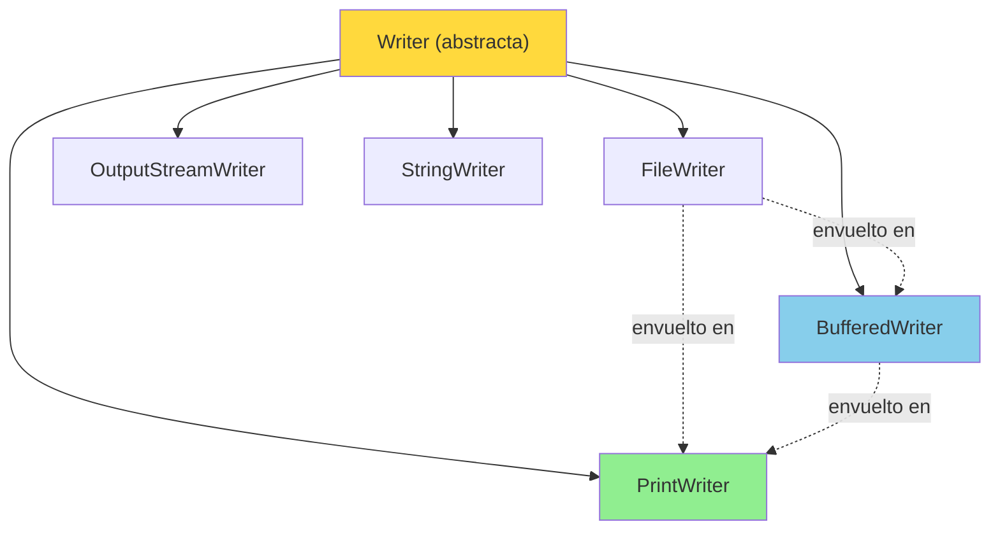
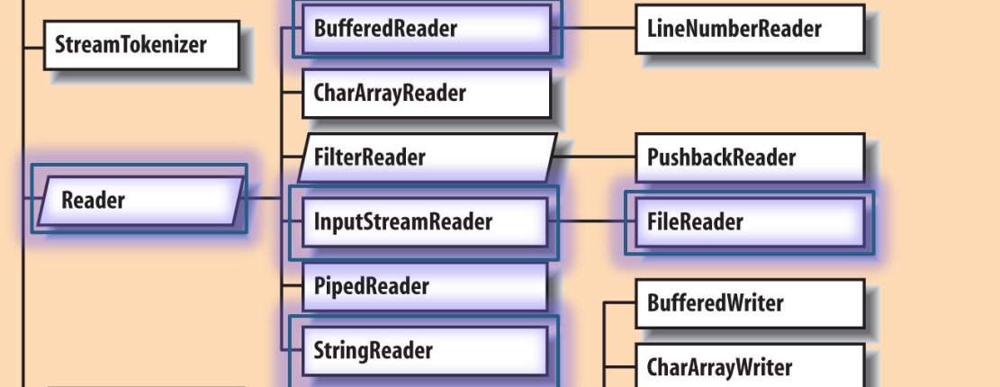
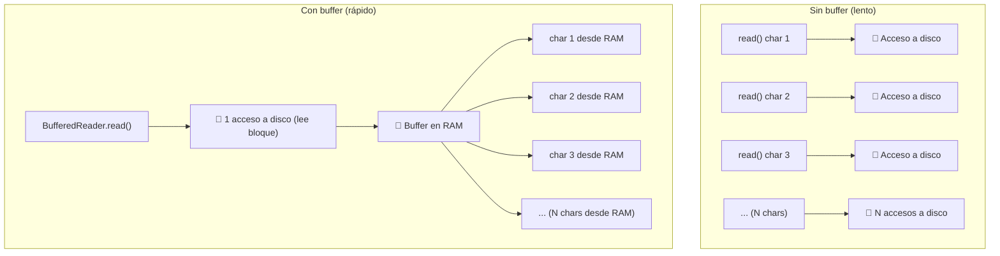
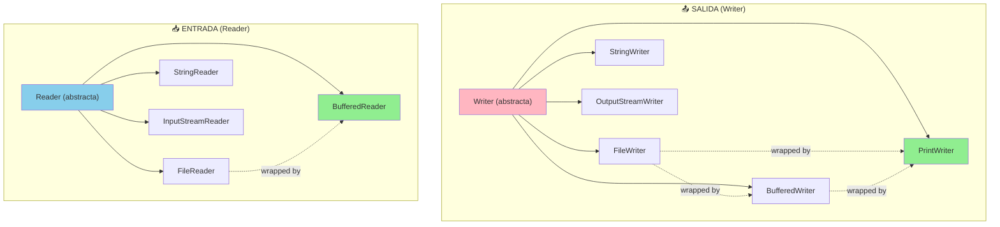
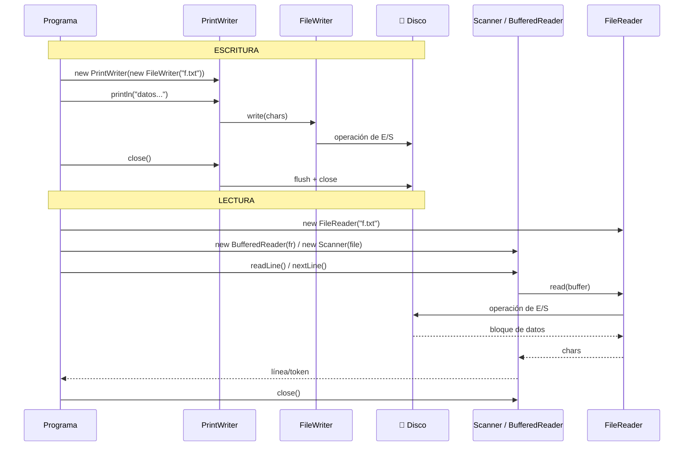

# UT12.2 Entrada/Salida de ficheros de texto

## 📋 Índice de contenidos

1. [Introducción: flujos de datos (streams)](#1-introducción-flujos-de-datos-streams)
    1. [Concepto de flujo de datos](#11-concepto-de-flujo-de-datos)
    2. [Clasificación de los flujos](#12-clasificación-de-los-flujos)
2. [Lectura y escritura de ficheros](#2-lectura-y-escritura-de-ficheros)
    1. [Limitación de la clase File](#21-limitación-de-la-clase-file)
    2. [Tipos de ficheros: texto vs binario](#22-tipos-de-ficheros-texto-vs-binario)
3. [Flujos de salida de caracteres](#3-flujos-de-salida-de-caracteres)
    1. [La clase PrintWriter](#31-la-clase-printwriter)
    2. [API de PrintWriter](#32-api-de-printwriter)
    3. [El problema de cerrar el flujo: try-with-resources](#33-el-problema-de-cerrar-el-flujo-try-with-resources)
    4. [Añadir información a un fichero existente (modo append)](#34-añadir-información-a-un-fichero-existente-modo-append)
    5. [Otras clases de salida de caracteres](#35-otras-clases-de-salida-de-caracteres)
    6. [Escritura con BufferedWriter](#36-escritura-con-bufferedwriter)
4. [Flujos de entrada de caracteres](#4-flujos-de-entrada-de-caracteres)
    1. [Lectura con Scanner](#41-lectura-con-scanner)
    2. [Modificar el delimitador de Scanner](#42-modificar-el-delimitador-de-scanner)
    3. [Interacción entre nextInt() y nextLine()](#43-interacción-entre-nextint-y-nextline)
    4. [Lectura con FileReader](#44-lectura-con-filereader)
    5. [Lectura con BufferedReader](#45-lectura-con-bufferedreader)
    6. [Optimizar la lectura/escritura con buffers](#46-optimizar-la-lecturaescritura-con-buffers)
    7. [Otras clases de entrada de caracteres](#47-otras-clases-de-entrada-de-caracteres)
5. [Jerarquía de clases de E/S de caracteres en Java](#5-jerarquía-de-clases-de-es-de-caracteres-en-java)

---

## 1. Introducción: flujos de datos (streams)

### 1.1 Concepto de flujo de datos

Cuando un programa necesita comunicarse con el exterior —ya sea para leer datos del teclado, mostrar resultados en pantalla, leer un fichero o enviar información por red— lo hace a través de **flujos de datos**, conocidos en inglés como **streams**.

Un flujo de datos es un **canal de comunicación unidireccional** que conecta el programa con una fuente o destino de datos. De forma muy visual, podemos imaginarlo como una tubería por la que los datos fluyen en un sentido: de la fuente al programa (lectura/entrada) o del programa al destino (escritura/salida).


**Características principales de los flujos de datos:**

- Actúan como canales de producción/consumo de información
- Proporcionan **independencia** del origen o destino de los datos: el código para leer de un fichero es estructuralmente muy similar al de leer del teclado
- Permiten gestionar diferentes tipos de operaciones de E/S de forma uniforme:
  - 🎹 Entrada desde el teclado (`System.in`)
  - 🖥️ Salida hacia el monitor (`System.out`)
  - 📄 Lectura/escritura de un fichero
  - 🌐 Envío y recepción de datos por red
  - 🧠 Lectura/escritura en memoria (strings, buffers...)

> [!NOTE]
> Ya hemos usado flujos de datos sin saberlo: `System.out` (el objeto que usamos con `println()`) **es un stream de salida** hacia la consola, del tipo `PrintStream`. `System.in` (el que usa `Scanner` internamente) es un stream de entrada desde el teclado.

### 1.2 Clasificación de los flujos

Los flujos de datos en Java se clasifican según **dos criterios independientes**:

- **Por dirección**: de entrada (_input_) o de salida (_output_)
- **Por tipo de dato**: de bytes (datos binarios, 8 bits por unidad) o de caracteres (datos de texto, 16 bits por unidad en Java, codificación Unicode)

Esto da lugar a **cuatro categorías** principales:

| | **Entrada** (lectura) | **Salida** (escritura) |
|:---|:---:|:---:|
| **Bytes** | `InputStream` | `OutputStream` |
| **Caracteres** | `Reader` | `Writer` |



> [!TIP]
> En este tema nos centraremos en los **streams de caracteres** (texto), que son los más habituales para ficheros `.txt`, `.csv`, `.log`, etc. Los streams de bytes se usan para imágenes, audio, datos serializados... y los estudiaremos en el siguiente apartado.

---

## 2. Lectura y escritura de ficheros

### 2.1 Limitación de la clase File

En el apartado anterior aprendimos a usar la clase `File` para representar rutas y realizar operaciones sobre el sistema de ficheros (crear carpetas, eliminar, renombrar, listar...). Sin embargo, **la clase `File` no permite leer ni escribir el contenido de un fichero**.

> [!NOTE]
> La clase `File` contiene información sobre las **propiedades** de un fichero/directorio o su ruta, pero no proporciona métodos para crear, escribir o leer datos directamente.
>
> Para realizar operaciones de entrada/salida sobre el **contenido** de un fichero, necesitamos crear objetos específicos de las clases de streams que veremos a continuación.

Este diseño es intencional: separa la responsabilidad de "¿dónde está el fichero?" (`File`) de la de "¿cómo leo o escribo su contenido?" (streams). Así es como se combina habitualmente:

```java
File ruta = new File("datos.txt");            // ① Localización del fichero
PrintWriter escritor = new PrintWriter(ruta); // ② Stream para escribir en él
escritor.println("Hola mundo");               // ③ Escritura del contenido
escritor.close();                             // ④ Cierre del stream
```

### 2.2 Tipos de ficheros: texto vs binario

Antes de ver cómo leer y escribir, conviene distinguir entre los dos grandes tipos de ficheros que existen:

#### 📄 Ficheros de texto

- Los datos se representan como una **secuencia de caracteres** (letras, números, símbolos...)
- Cada valor o campo se diferencia mediante un **delimitador** (coma, punto y coma, salto de línea, tabulador...)
- Son **directamente legibles** por humanos con cualquier editor de texto
- Ejemplos: `.txt`, `.csv`, `.json`, `.xml`, `.html`, `.java`

#### 📦 Ficheros binarios

- Los datos se representan en su **formato binario nativo** (como están en memoria)
- No hay separación explícita entre valores
- **No son legibles directamente** por humanos sin un programa específico
- Son más **compactos y eficientes** para ciertos tipos de datos (imágenes, audio, objetos Java serializados...)
- Ejemplos: `.jpg`, `.mp3`, `.exe`, `.class`, `.dat`



**Ejemplo comparativo** — el número entero `12345` almacenado de ambas formas:

| Tipo | Representación en disco | Tamaño |
|:---|:---|:---:|
| Texto | `1`, `2`, `3`, `4`, `5` (5 caracteres ASCII) | 5 bytes |
| Binario | `00000000 00110000 00111001` (int de 4 bytes) | 4 bytes |

> [!NOTE]
> Para ficheros con muchos datos numéricos, el formato binario puede ser más eficiente. Sin embargo, para la mayoría de aplicaciones de gestión (datos de usuarios, registros, configuraciones...), los ficheros de texto son la opción más sencilla e interoperable.

---

## 3. Flujos de salida de caracteres

Los flujos de salida de caracteres nos permiten **escribir datos en formato de texto** en un destino (normalmente un fichero, aunque también podría ser la consola, un socket de red, etc.).


### 3.1 La clase PrintWriter

La clase más cómoda para escribir en ficheros de texto es **`PrintWriter`**, del paquete `java.io`. Sus ventajas principales son:

- 🖨️ Proporciona métodos familiares: `print()`, `println()`, `printf()` — los mismos que ya usamos con `System.out`
- 📄 Puede escribir **cualquier tipo de dato** (int, double, boolean, String...) convirtiéndolo automáticamente a texto
- 🏗️ Si el fichero **no existe**, lo crea automáticamente
- ⚠️ Si el fichero **ya existe**, **elimina su contenido previo** (a menos que usemos modo append, que veremos después)

**Formas de crear un `PrintWriter`:**

```java
// Opción 1: pasando directamente el nombre del fichero (String)
PrintWriter pw = new PrintWriter("datos.txt");

// Opción 2: pasando un objeto File
File f = new File("datos.txt");
PrintWriter pw = new PrintWriter(f);

// Opción 3: especificando codificación de caracteres (recomendado)
PrintWriter pw = new PrintWriter("datos.txt", "UTF-8");
```

> [!IMPORTANT]
> El constructor de `PrintWriter` lanza una **excepción comprobada** (`FileNotFoundException` / `IOException`). Esto significa que el compilador **obliga** a tratarla, ya sea con `try-catch` o declarando `throws` en la cabecera del método. No es opcional.

### 3.2 API de PrintWriter

Los métodos de escritura de `PrintWriter` son muy similares a los de `System.out`:

| Método | Descripción |
|:---|:---|
| `print(valor)` | Escribe el valor sin salto de línea al final |
| `println(valor)` | Escribe el valor **con salto de línea** al final |
| `printf(formato, args)` | Escribe con formato (igual que `System.out.printf`) |
| `flush()` | Vacía el buffer interno, forzando la escritura en disco |
| `close()` | Cierra el stream (también hace `flush()` antes de cerrar) |
| `checkError()` | Devuelve `true` si se ha producido algún error de escritura |

> [!CAUTION]
> A diferencia de `System.out.println()`, `PrintWriter` **no lanza excepción** si falla la escritura: simplemente establece internamente un indicador de error. Por eso es importante llamar a `checkError()` si necesitas confirmar que la escritura fue exitosa, o bien usar `flush()` con frecuencia.

**Ejemplo básico de escritura:**

```java
import java.io.File;
import java.io.PrintWriter;
import java.io.IOException;

public class EscribirFichero {
    public static void main(String[] args) {
        try {
            PrintWriter output = new PrintWriter("notas.txt");

            // Escribir distintos tipos de datos
            output.println("=== Lista de notas ===");
            output.println("Ana García: " + 8.5);
            output.println("Carlos López: " + 7);
            output.printf("Media: %.2f%n", (8.5 + 7) / 2);

            output.close(); // ⚠️ IMPORTANTE: cerrar el stream

            System.out.println("Fichero escrito correctamente.");
        } catch (IOException e) {
            System.err.println("Error al escribir el fichero: " + e.getMessage());
        }
    }
}
```

**Contenido del fichero `notas.txt` resultante:**

```
=== Lista de notas ===
Ana García: 8.5
Carlos López: 7
Media: 7,75
```

### 3.3 El problema de cerrar el flujo: try-with-resources

Llamar a `close()` es **imprescindible**: si no se cierra el stream, puede ocurrir que:
- Los datos que están en el buffer interno **no se escriban en disco** (se pierden)
- El fichero quede **bloqueado** y no pueda ser usado por otros programas
- Se produzcan **fugas de recursos** del sistema operativo

El problema es que si se lanza una excepción antes de llegar a `close()`, este nunca se ejecuta. La solución **antes de Java 7** era usar `finally`:

```java
PrintWriter output = null;
try {
    output = new PrintWriter("datos.txt");
    output.println("datos...");
} catch (IOException e) {
    System.err.println("Error: " + e.getMessage());
} finally {
    if (output != null) output.close(); // Se ejecuta siempre
}
```

Desde **Java 7**, existe la estructura **`try-with-resources`** que simplifica enormemente este patrón: el recurso declarado entre paréntesis se **cierra automáticamente** al salir del bloque `try`, tanto si termina bien como si ocurre una excepción:

```java
try (PrintWriter output = new PrintWriter("datos.txt")) {
    output.println("=== Estudiantes ===");
    output.println("Ana García: 8.5");
    output.println("Carlos López: 7.0");
    // No hace falta llamar a close(): se hace automáticamente
} catch (IOException e) {
    System.err.println("Error al escribir el fichero: " + e.getMessage());
}
```

> [!TIP]
> **Usa siempre `try-with-resources`** cuando trabajes con streams. Es más seguro, más limpio y sigue las buenas prácticas actuales de Java. La clase debe implementar la interfaz `AutoCloseable` (lo hacen todas las clases de streams de Java).

Se pueden declarar **múltiples recursos** separados por `;` en el mismo `try-with-resources`:

```java
try (
    Scanner entrada = new Scanner(new File("origen.txt"));
    PrintWriter salida = new PrintWriter("destino.txt")
) {
    while (entrada.hasNextLine()) {
        salida.println(entrada.nextLine().toUpperCase());
    }
} catch (IOException e) {
    System.err.println("Error: " + e.getMessage());
}
```

### 3.4 Añadir información a un fichero existente (modo append)

Por defecto, `PrintWriter` **sobrescribe** el contenido del fichero si ya existe. Si necesitamos **añadir datos al final** sin borrar el contenido previo, debemos usar un `FileWriter` con el parámetro `append = true`:

```java
// new FileWriter("fichero.txt", true)  ← el "true" activa el modo append
try (PrintWriter output = new PrintWriter(new FileWriter("registro.log", true))) {
    output.println("Nueva línea añadida al final.");
} catch (IOException e) {
    System.err.println("Error al añadir al fichero: " + e.getMessage());
}
```

> [!IMPORTANT]
> El segundo parámetro `true` en el constructor de `FileWriter` indica que queremos **añadir al final** (_append_) en lugar de sobrescribir. Si no se especifica o es `false`, el fichero se sobreescribe.

**Ejemplo práctico — fichero de registro (log):**

```java
import java.io.FileWriter;
import java.io.PrintWriter;
import java.io.IOException;
import java.time.LocalDateTime;
import java.time.format.DateTimeFormatter;

public class RegistroLog {
    private static final String FICHERO_LOG = "aplicacion.log";

    public static void main(String[] args) {
        registrarEvento("Inicio de la aplicación");
        // ... lógica de la aplicación ...
        registrarEvento("Operación completada con éxito");
        registrarEvento("Cierre de la aplicación");
    }

    public static void registrarEvento(String mensaje) {
        DateTimeFormatter fmt = DateTimeFormatter.ofPattern("yyyy-MM-dd HH:mm:ss");
        String timestamp = LocalDateTime.now().format(fmt);

        try (PrintWriter log = new PrintWriter(new FileWriter(FICHERO_LOG, true))) {
            log.println("[" + timestamp + "] " + mensaje);
        } catch (IOException e) {
            System.err.println("Error al escribir en el log: " + e.getMessage());
        }
    }
}
```

**Resultado en `aplicacion.log` tras varias ejecuciones:**

```
[2024-09-15 10:23:01] Inicio de la aplicación
[2024-09-15 10:23:01] Operación completada con éxito
[2024-09-15 10:23:01] Cierre de la aplicación
[2024-09-15 10:25:44] Inicio de la aplicación
[2024-09-15 10:25:44] Operación completada con éxito
...
```

### 3.5 Otras clases de salida de caracteres

Además de `PrintWriter`, Java proporciona otras clases de salida de caracteres con diferentes niveles de abstracción:

| Clase | Descripción | Uso típico |
|:---|:---|:---|
| `Writer` | Clase abstracta, base de todos los flujos de caracteres de salida | No se usa directamente |
| `FileWriter` | Escribe caracteres en un fichero | Escritura simple o modo append |
| `BufferedWriter` | Añade un buffer a otro `Writer` para mejorar el rendimiento | Escritura eficiente de muchas líneas |
| `PrintWriter` | Ofrece métodos `print/println/printf` sobre cualquier `Writer` | Escritura con formato, lo más cómodo |
| `StringWriter` | Escribe en un `String` en memoria (no en disco) | Construir texto en memoria |
| `OutputStreamWriter` | Convierte un `OutputStream` de bytes en un `Writer` de caracteres | Conversión de tipos de stream |



> [!NOTE]
> Observa el patrón de **composición (decorador)**: las clases de mayor nivel se construyen envolviendo (_wrapping_) a las de menor nivel. Por ejemplo, `new PrintWriter(new BufferedWriter(new FileWriter("f.txt")))` combina tres clases: `FileWriter` accede al fichero, `BufferedWriter` añade buffer y `PrintWriter` proporciona los métodos cómodos de escritura.

### 3.6 Escritura con BufferedWriter

`BufferedWriter` es útil cuando necesitamos escribir muchas líneas de texto y queremos un **rendimiento óptimo**. Su característica clave es que acumula datos en memoria (buffer) y solo escribe en disco cuando el buffer está lleno o cuando se hace `flush()`/`close()`, reduciendo así el número de operaciones de disco.

Método especial de `BufferedWriter`:

| Método | Descripción |
|:---|:---|
| `write(String)` | Escribe una cadena de texto |
| `newLine()` | Escribe un salto de línea compatible con el sistema operativo |
| `flush()` | Vuelca el buffer a disco |
| `close()` | Cierra el stream (hace flush antes) |

```java
import java.io.BufferedWriter;
import java.io.FileWriter;
import java.io.IOException;

public class EscribirConBuffer {
    public static void main(String[] args) {
        try (BufferedWriter bw = new BufferedWriter(new FileWriter("salida.txt"))) {
            bw.write("Primera línea de texto");
            bw.newLine(); // Salto de línea multiplataforma (\r\n en Windows, \n en Linux)
            bw.write("Segunda línea de texto");
            bw.newLine();
            bw.write("Tercera línea de texto");
            // close() al salir del try-with-resources hace el flush automáticamente
        } catch (IOException e) {
            System.err.println("Error: " + e.getMessage());
        }
    }
}
```

> [!TIP]
> Usa `bw.newLine()` en lugar de `"\n"` o `"\r\n"` hardcodeados. El método `newLine()` utiliza el separador de línea del sistema operativo actual, haciendo el código portable.

---

## 4. Flujos de entrada de caracteres

Los flujos de entrada de caracteres permiten **leer datos en formato de texto** desde un origen (normalmente un fichero). Java proporciona varias clases para ello, con distintos niveles de comodidad y rendimiento.



### 4.1 Lectura con Scanner

Ya conocemos `Scanner` del trabajo con el teclado. La misma clase puede usarse para **leer de un fichero** simplemente pasándole un objeto `File` en lugar de `System.in`:

```java
import java.io.File;
import java.io.FileNotFoundException;
import java.util.Scanner;

public class LeerConScanner {
    public static void main(String[] args) {
        try (Scanner scanner = new Scanner(new File("notas.txt"))) {
            while (scanner.hasNextLine()) {
                String linea = scanner.nextLine();
                System.out.println(linea);
            }
        } catch (FileNotFoundException e) {
            System.err.println("Fichero no encontrado: " + e.getMessage());
        }
    }
}
```

> [!NOTE]
> Cuando `Scanner` trabaja con un fichero, **el stream del fichero también debe cerrarse** al terminar. Por eso usamos `try-with-resources`: al salir del bloque, `Scanner` llama a `close()` que cierra tanto el scanner como el fichero subyacente.

`Scanner` es especialmente útil cuando el fichero tiene datos **estructurados por tokens** (separados por algún delimitador) y queremos leerlos con tipos concretos:

```java
// Si el fichero "datos.txt" contiene: "Ana 8.5\nCarlos 7.0\nEva 9.2"
try (Scanner sc = new Scanner(new File("datos.txt"))) {
    while (sc.hasNext()) {
        String nombre = sc.next();       // Lee la siguiente "palabra"
        double nota   = sc.nextDouble(); // Lee el siguiente número real
        System.out.printf("%s obtuvo un %.1f%n", nombre, nota);
    }
} catch (FileNotFoundException e) {
    System.err.println("Error: " + e.getMessage());
}
```

**Métodos de lectura de Scanner:**

| Método | Tipo devuelto | Descripción |
|:---|:---:|:---|
| `nextLine()` | `String` | Lee la línea completa hasta el salto de línea |
| `next()` | `String` | Lee el siguiente token (separado por delimitador) |
| `nextInt()` | `int` | Lee el siguiente token como entero |
| `nextDouble()` | `double` | Lee el siguiente token como real |
| `hasNextLine()` | `boolean` | `true` si queda otra línea por leer |
| `hasNext()` | `boolean` | `true` si queda otro token por leer |

### 4.2 Modificar el delimitador de Scanner

Por defecto, `Scanner` usa el **espacio en blanco** (espacio, tabulador, salto de línea) como delimitador entre tokens. Pero si trabajamos con ficheros CSV u otros formatos, podemos cambiarlo con `useDelimiter()`:

```java
// Fichero "alumnos.csv": "Ana García,8.5\nCarlos López,7.0"
try (Scanner sc = new Scanner(new File("alumnos.csv"))) {
    sc.useDelimiter("[,\n\r]+"); // Delimitador: coma o salto de línea

    while (sc.hasNext()) {
        String nombre = sc.next();
        double nota   = sc.nextDouble();
        System.out.printf("%-20s → %.1f%n", nombre, nota);
    }
} catch (FileNotFoundException e) {
    System.err.println("Error: " + e.getMessage());
}
```

> [!TIP]
> El parámetro de `useDelimiter()` es una **expresión regular** (_regex_). El patrón `[,\n\r]+` significa "uno o más caracteres que sean coma, `\n` o `\r`". Esto cubre tanto la coma CSV como los distintos finales de línea de Windows (`\r\n`) y Linux (`\n`).

### 4.3 Interacción entre nextInt() y nextLine()

Este es uno de los **errores más comunes** al usar `Scanner`, tanto con teclado como con ficheros. Es importante entenderlo bien.

Supongamos que el fichero `test.txt` contiene la cadena: `345 678 9`

**Escenario A** — dos Scanner independientes sobre el mismo fichero:

```java
Scanner sc1 = new Scanner(new File("test.txt"));
Scanner sc2 = new Scanner(new File("test.txt"));

int intValue = sc1.nextInt();    // Lee el token "345" → intValue = 345
String line  = sc2.nextLine();   // Lee la línea completa → line = "345 678 9"

sc1.close();
sc2.close();
```

Resultado: `intValue = 345`, `line = "345 678 9"`

**Escenario B** — un solo Scanner que primero lee un entero, luego una línea:

```java
Scanner sc = new Scanner(new File("test.txt"));

int intValue = sc.nextInt();    // Lee el token "345" → intValue = 345
// El cursor queda justo después de "345", antes del espacio
String line = sc.nextLine();    // Lee el RESTO de la línea → line = " 678 9"

sc.close();
```

Resultado: `intValue = 345`, `line = " 678 9"` ← ⚠️ ¡incluye el espacio inicial!

> [!WARNING]
> **El problema de `nextInt()` + `nextLine()`:** `nextInt()` (y `nextDouble()`, `nextLong()`, etc.) lee el token numérico pero **no consume el salto de línea** `\n` que hay al final. Cuando después se llama a `nextLine()`, este lee solo lo que queda en la línea actual (que puede ser solo `"\n"` o el resto de la línea), no la línea siguiente.
>
> **Solución habitual:** añadir una llamada extra a `sc.nextLine()` después de `nextInt()` para "consumir" el salto de línea residual antes de leer la siguiente línea:
>
> ```java
> int numero = sc.nextInt();
> sc.nextLine(); // ← consume el '\n' residual
> String siguiente = sc.nextLine(); // ahora sí lee la línea siguiente
> ```

### 4.4 Lectura con FileReader

`FileReader` es la clase más básica para leer caracteres de un fichero. Lee **carácter a carácter** (o en bloques), lo que lo hace más flexible pero también más verboso.

**Constructores:**

```java
FileReader fr1 = new FileReader("datos.txt");           // Por nombre de fichero
FileReader fr2 = new FileReader(new File("datos.txt")); // Por objeto File
```

**Método principal:**

| Método | Descripción |
|:---|:---|
| `int read()` | Lee el siguiente carácter y lo devuelve como `int`. Devuelve `-1` al llegar al final del fichero (EOF). |
| `int read(char[] buf)` | Lee un bloque de caracteres en el array `buf`. Devuelve el número de caracteres leídos, o `-1` si es EOF. |
| `void close()` | Cierra el stream |

> [!IMPORTANT]
> El método `read()` devuelve un `int`, no un `char`. El valor `-1` indica el final del fichero (EOF — _End Of File_). Para trabajar con el carácter leído, debemos hacer un **cast** explícito a `char`: `(char) caracter`.

**Ejemplo — leer un fichero carácter a carácter:**

```java
import java.io.FileReader;
import java.io.IOException;

public class LeerConFileReader {
    public static void main(String[] args) {
        try (FileReader fr = new FileReader("texto.txt")) {
            int codigoCaracter;

            while ((codigoCaracter = fr.read()) != -1) {
                // Convertir el código int al carácter correspondiente
                char c = (char) codigoCaracter;
                System.out.print(c);
            }

            System.out.println(); // Salto de línea final
        } catch (IOException e) {
            System.err.println("Error al leer el fichero: " + e.getMessage());
        }
    }
}
```

> [!NOTE]
> `FileReader` es correcto pero raramente se usa solo: leer carácter a carácter es ineficiente para ficheros grandes. En la práctica, casi siempre se **envuelve** en un `BufferedReader` para mejorar el rendimiento, como veremos a continuación.

**Lectura en bloques (más eficiente con `FileReader`):**

```java
try (FileReader fr = new FileReader("texto.txt")) {
    char[] buffer = new char[1024]; // Buffer de 1 KB
    int leidos;

    while ((leidos = fr.read(buffer)) != -1) {
        // Convertir el fragmento leído a String y procesarlo
        String fragmento = new String(buffer, 0, leidos);
        System.out.print(fragmento);
    }
} catch (IOException e) {
    System.err.println("Error: " + e.getMessage());
}
```

### 4.5 Lectura con BufferedReader

`BufferedReader` añade un **buffer de memoria** alrededor de un `Reader` (habitualmente un `FileReader`), lo que mejora enormemente el rendimiento. Además, proporciona el cómodo método `readLine()` que no tiene `FileReader`.

**Creación:**

```java
BufferedReader br = new BufferedReader(new FileReader("datos.txt"));
```

**Método clave:**

| Método | Descripción |
|:---|:---|
| `String readLine()` | Lee una línea completa (sin incluir el `\n`). Devuelve `null` al llegar al final del fichero. |
| `int read()` | Lee un carácter (heredado de `Reader`) |
| `void close()` | Cierra el stream (también cierra el `FileReader` interno) |

> [!CAUTION]
> `readLine()` devuelve `null` (no `-1`) cuando se llega al final del fichero. El patrón estándar es:
> ```java
> String linea;
> while ((linea = br.readLine()) != null) {
>     // procesar línea
> }
> ```

**Ejemplo — leer un fichero línea a línea:**

```java
import java.io.BufferedReader;
import java.io.FileReader;
import java.io.IOException;

public class LeerConBufferedReader {
    public static void main(String[] args) {
        try (BufferedReader br = new BufferedReader(new FileReader("notas.txt"))) {
            String linea;
            int numeroLinea = 1;

            while ((linea = br.readLine()) != null) {
                System.out.printf("Línea %d: %s%n", numeroLinea, linea);
                numeroLinea++;
            }
        } catch (IOException e) {
            System.err.println("Error al leer el fichero: " + e.getMessage());
        }
    }
}
```

**Ejemplo completo — leer un CSV y procesar los datos:**

```java
import java.io.BufferedReader;
import java.io.FileReader;
import java.io.IOException;

public class LeerCSV {
    public static void main(String[] args) {
        // Fichero "alumnos.csv" con formato: nombre,apellido,nota
        try (BufferedReader br = new BufferedReader(new FileReader("alumnos.csv"))) {
            String linea;
            double suma = 0;
            int contador = 0;

            while ((linea = br.readLine()) != null) {
                // Saltar líneas vacías
                if (linea.trim().isEmpty()) continue;

                String[] campos = linea.split(","); // Separar por coma
                String nombre  = campos[0].trim();
                String apellido = campos[1].trim();
                double nota    = Double.parseDouble(campos[2].trim());

                System.out.printf("%-10s %-15s → %.1f%n", nombre, apellido, nota);
                suma += nota;
                contador++;
            }

            if (contador > 0) {
                System.out.printf("%nMedia de la clase: %.2f%n", suma / contador);
            }
        } catch (IOException e) {
            System.err.println("Error: " + e.getMessage());
        } catch (NumberFormatException e) {
            System.err.println("Error de formato en el fichero: " + e.getMessage());
        }
    }
}
```

### 4.6 Optimizar la lectura/escritura con buffers

La diferencia de rendimiento entre usar o no un buffer puede ser muy significativa en ficheros grandes. Comprender por qué es importante para tomar las decisiones correctas.

**¿Por qué los buffers mejoran el rendimiento?**

Cada acceso a disco (operación de E/S) es **miles de veces más lento** que un acceso a memoria RAM. Sin buffer, cada llamada a `read()` o `write()` genera una operación de E/S. Con buffer, múltiples operaciones lógicas se agrupan en un solo acceso a disco:



> [!IMPORTANT]
> Para mejorar el rendimiento en operaciones de E/S, **usa siempre clases con buffer** (`BufferedReader`, `BufferedWriter`) cuando trabajes con ficheros. Para ficheros pequeños la diferencia es imperceptible, pero para ficheros grandes (miles de líneas) puede suponer una diferencia de rendimiento de órdenes de magnitud.

**Comparativa de clases y cuándo usar cada una:**

| Clase | Buffer | Ventaja principal | Cuándo usarla |
|:---|:---:|:---|:---|
| `FileReader` | ❌ | Simple, directa | Raramente sola; mejor como base de `BufferedReader` |
| `BufferedReader` | ✅ | Método `readLine()`, eficiente | Leer ficheros línea a línea |
| `Scanner` | ✅ (interno) | Métodos tipados (`nextInt`, etc.), fácil de usar | Leer ficheros con tokens de distintos tipos |
| `FileWriter` | ❌ | Simple, soporta append | Raramente sola; mejor como base de `BufferedWriter` |
| `BufferedWriter` | ✅ | `newLine()`, eficiente | Escribir muchas líneas con rendimiento |
| `PrintWriter` | ✅ (si se envuelve) | `println/printf`, muy cómoda | Escritura formateada general |

### 4.7 Otras clases de entrada de caracteres

Java dispone de toda una jerarquía de clases para la lectura de caracteres:

| Clase | Descripción |
|:---|:---|
| `Reader` | Clase abstracta base de todos los flujos de caracteres de entrada |
| `FileReader` | Lee caracteres de un fichero |
| `BufferedReader` | Añade buffer a otro `Reader`; proporciona `readLine()` |
| `InputStreamReader` | Convierte un `InputStream` de bytes en un `Reader` de caracteres (con codificación configurable) |
| `StringReader` | Lee desde un `String` en memoria |
| `CharArrayReader` | Lee desde un array `char[]` en memoria |


---

## 5. Jerarquía de clases de E/S de caracteres en Java

Para cerrar el tema, presentamos una visión global de las clases de E/S de caracteres que hemos visto, organizadas en su jerarquía:



**Resumen del flujo típico de trabajo:**



> [!TIP]
> 🚀 Con estas clases y técnicas ya estás preparado para gestionar eficientemente la entrada y salida de datos en ficheros de texto en tus aplicaciones Java. En los siguientes apartados pondremos en práctica todo esto con ejercicios prácticos y aprenderemos a trabajar con ficheros binarios (serialización de objetos).

---

<p align="center">📚 <em>Fin del apartado UT12.2 – Entrada/Salida de ficheros de texto</em></p>
