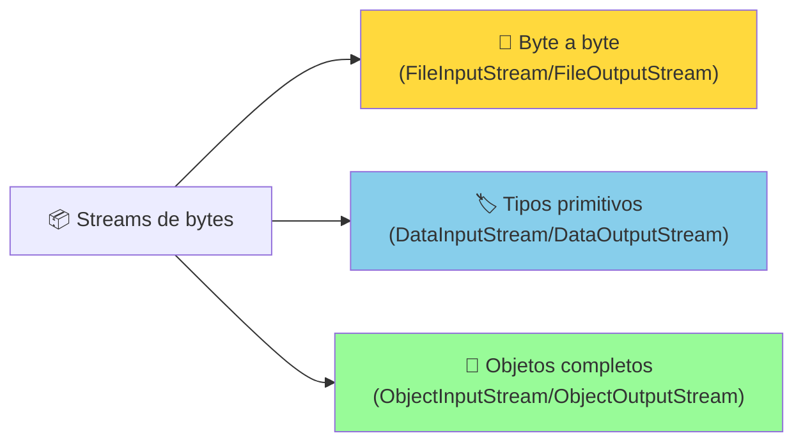
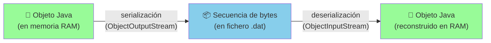
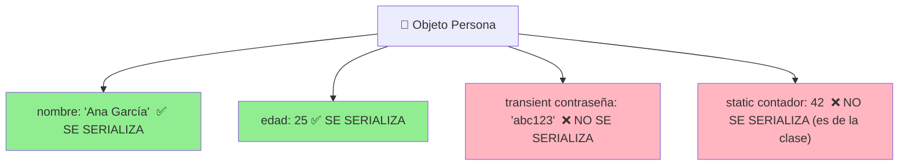
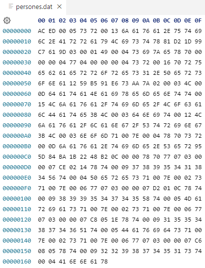
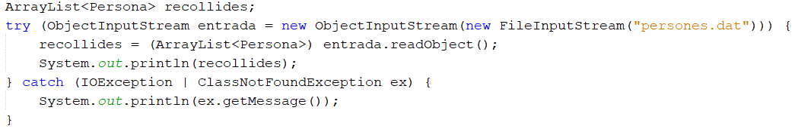

# UT12.3 Entrada/Salida de ficheros binarios

## 📋 Índice de contenidos

1. [Introducción: los ficheros binarios](#1-introducción-los-ficheros-binarios)
2. [Estructura de clases en Java para bytes](#2-estructura-de-clases-en-java-para-bytes)
    1. [Clases para la salida de bytes](#21-clases-para-la-salida-de-bytes)
    2. [Clases para la entrada de bytes](#22-clases-para-la-entrada-de-bytes)
3. [InputStream y OutputStream: las clases base](#3-inputstream-y-outputstream-las-clases-base)
    1. [Métodos principales de OutputStream](#31-métodos-principales-de-outputstream)
    2. [Métodos principales de InputStream](#32-métodos-principales-de-inputstream)
4. [FileInputStream y FileOutputStream](#4-fileinputstream-y-fileoutputstream)
    1. [Escritura byte a byte con FileOutputStream](#41-escritura-byte-a-byte-con-fileoutputstream)
    2. [Lectura byte a byte con FileInputStream](#42-lectura-byte-a-byte-con-fileinputstream)
    3. [Ejemplo completo: copiar un fichero binario](#43-ejemplo-completo-copiar-un-fichero-binario)
5. [DataInputStream y DataOutputStream](#5-datainputstream-y-dataoutputstream)
    1. [API de DataOutputStream](#51-api-de-dataoutputstream)
    2. [API de DataInputStream](#52-api-de-datainputstream)
    3. [Ejemplo de uso de las clases Data](#53-ejemplo-de-uso-de-las-clases-data)
    4. [Detección del final de fichero con EOFException](#54-detección-del-final-de-fichero-con-eofexception)
6. [Lectura/escritura de objetos: serialización](#6-lecturaescritura-de-objetos-serialización)
    1. [Concepto de serialización](#61-concepto-de-serialización)
    2. [ObjectOutputStream y ObjectInputStream](#62-objectoutputstream-y-objectinputstream)
    3. [Ejemplo: escribir y leer un objeto Date](#63-ejemplo-escribir-y-leer-un-objeto-date)
7. [La interfaz Serializable](#7-la-interfaz-serializable)
    1. [Clases de la API que son Serializable](#71-clases-de-la-api-que-son-serializable)
    2. [Hacer serializable una clase propia](#72-hacer-serializable-una-clase-propia)
    3. [serialVersionUID](#73-serialversionuid)
    4. [El modificador transient](#74-el-modificador-transient)
    5. [Ejemplo completo: serializar un ArrayList de objetos propios](#75-ejemplo-completo-serializar-un-arraylist-de-objetos-propios)
8. [Jerarquía completa de streams en Java](#8-jerarquía-completa-de-streams-en-java)

---

## 1. Introducción: los ficheros binarios

En el apartado anterior estudiamos cómo trabajar con **ficheros de texto**: aquellos que se pueden abrir, crear y modificar directamente con cualquier editor de texto (`.txt`, `.csv`, `.java`, etc.). Sus datos se almacenan como secuencias de caracteres legibles por humanos.

Sin embargo, existe una categoría más amplia: los **ficheros binarios**. Cualquier fichero que no sea de texto puro es considerado binario. Sus datos se almacenan en el formato binario nativo de los tipos de datos, no como texto.

> [!NOTE]
> Los ficheros binarios no son directamente legibles por humanos sin el uso de un programa específico que sepa interpretar su formato. Ejemplos: `.class` (bytecode Java compilado), `.exe`, `.jpg`, `.mp3`, `.dat`, archivos de base de datos, etc.

**¿Cuándo usar ficheros binarios?**

| Situación | Formato recomendado |
|:---|:---:|
| Configuraciones, logs, datos intercambiables entre sistemas | 📄 Texto |
| Guardar objetos Java completos (persistencia de estado) | 📦 Binario (serialización) |
| Copiar/mover ficheros imagen, audio, vídeo | 📦 Binario (byte a byte) |
| Datos numéricos con alta precisión y eficiencia | 📦 Binario (`DataStream`) |
| Interoperabilidad entre distintos lenguajes | 📄 Texto (JSON, XML, CSV) |

La elección del formato depende del caso de uso. En este apartado aprenderemos a trabajar con los tres niveles de abstracción que ofrece Java para ficheros binarios:



---

## 2. Estructura de clases en Java para bytes

Java organiza las clases de E/S de bytes en dos jerarquías paralelas: una para entrada y otra para salida. Ambas parten de clases abstractas que definen la interfaz común.

### 2.1 Clases para la salida de bytes

| Clase | Descripción |
|:---|:---|
| **`OutputStream`** | Clase abstracta base de todos los flujos de bytes de salida |
| **`FileOutputStream`** | Escribe bytes en un fichero, byte a byte |
| **`BufferedOutputStream`** | Añade buffer a otro `OutputStream` para mejorar el rendimiento |
| **`DataOutputStream`** | Permite escribir tipos primitivos Java (`int`, `double`, `boolean`...) y `String` |
| **`ObjectOutputStream`** | Permite escribir objetos Java completos (serialización) |
| **`ByteArrayOutputStream`** | Escribe en memoria, obteniendo el resultado como array de bytes |

### 2.2 Clases para la entrada de bytes

| Clase | Descripción |
|:---|:---|
| **`InputStream`** | Clase abstracta base de todos los flujos de bytes de entrada |
| **`FileInputStream`** | Lee bytes de un fichero, byte a byte |
| **`BufferedInputStream`** | Añade buffer a otro `InputStream` para mejorar el rendimiento |
| **`DataInputStream`** | Permite leer tipos primitivos Java y `String` escritos con `DataOutputStream` |
| **`ObjectInputStream`** | Permite leer objetos Java serializados escritos con `ObjectOutputStream` |
| **`ByteArrayInputStream`** | Lee desde un array de bytes en memoria |

---

## 3. InputStream y OutputStream: las clases base

`InputStream` y `OutputStream` son las **clases abstractas** que constituyen la raíz de toda la jerarquía de streams de bytes. No se pueden instanciar directamente, pero definen los métodos fundamentales que heredan todas las clases concretas.

> [!TIP]
> Declarar las variables con el tipo de la clase abstracta (`InputStream`, `OutputStream`) en lugar del tipo concreto permite una mayor **flexibilidad**: puedes cambiar la implementación concreta sin modificar el código que la usa. Esto es un ejemplo del principio de programación orientada a interfaces.

```java
// Más flexible: el método puede recibir cualquier tipo de InputStream
public void procesarEntrada(InputStream entrada) { ... }

// Más restrictivo: solo acepta FileInputStream
public void procesarEntrada(FileInputStream entrada) { ... }
```

### 3.1 Métodos principales de OutputStream

| Método | Descripción |
|:---|:---|
| `write(int b)` | Escribe el byte indicado (solo se usan los 8 bits menos significativos del `int`) |
| `write(byte[] b)` | Escribe todos los bytes del array |
| `write(byte[] b, int off, int len)` | Escribe `len` bytes del array a partir de la posición `off` |
| `flush()` | Vuelca el buffer a disco (fuerza la escritura pendiente) |
| `close()` | Cierra el stream (hace `flush()` antes) |

### 3.2 Métodos principales de InputStream

| Método | Descripción |
|:---|:---|
| `int read()` | Lee el siguiente byte y lo devuelve como `int` (0-255). Devuelve `-1` en EOF |
| `int read(byte[] b)` | Lee bytes en el array `b`. Devuelve el número de bytes leídos, o `-1` en EOF |
| `int read(byte[] b, int off, int len)` | Lee hasta `len` bytes en `b` a partir de `off` |
| `int available()` | Devuelve una estimación del número de bytes disponibles para leer |
| `long skip(long n)` | Salta `n` bytes del stream |
| `void close()` | Cierra el stream |

---

## 4. FileInputStream y FileOutputStream

`FileInputStream` y `FileOutputStream` son las implementaciones concretas de `InputStream` y `OutputStream` diseñadas para trabajar con ficheros en disco.

### 4.1 Escritura byte a byte con FileOutputStream

```java
// Forma 1: por nombre de fichero (sobreescribe si existe)
FileOutputStream fos = new FileOutputStream("datos.dat");

// Forma 2: por objeto File
FileOutputStream fos = new FileOutputStream(new File("datos.dat"));

// Forma 3: modo append (añade al final si existe)
FileOutputStream fos = new FileOutputStream("datos.dat", true);
```

> [!IMPORTANT]
> Al igual que `PrintWriter`, si el fichero no existe se crea, y si ya existe **se sobreescribe** (a menos que uses el constructor con `append = true`).

### 4.2 Lectura byte a byte con FileInputStream

```java
try (FileInputStream fis = new FileInputStream("datos.dat")) {
    int byteLeido;
    while ((byteLeido = fis.read()) != -1) {
        // byteLeido contiene un valor entre 0 y 255
        System.out.println(byteLeido);
    }
} catch (IOException e) {
    System.err.println("Error al leer: " + e.getMessage());
}
```

> [!NOTE]
> Al igual que con `FileReader`, el método `read()` de `FileInputStream` devuelve un `int` (no un `byte`), y retorna `-1` para indicar el final del fichero (EOF). El rango de valores devueltos es 0-255 (un byte sin signo).

**Ejemplo básico — escribir y leer los números del 0 al 9:**

```java
import java.io.*;

public class EjemploFicheroBinario {
    public static void main(String[] args) {
        // === ESCRITURA ===
        try (FileOutputStream fos = new FileOutputStream("temp.dat")) {
            for (int i = 0; i < 10; i++) {
                fos.write(i); // Escribe un byte con el valor i
            }
            System.out.println("Escritura completada: 10 bytes escritos.");
        } catch (IOException e) {
            e.printStackTrace();
        }

        // === LECTURA ===
        try (FileInputStream fis = new FileInputStream("temp.dat")) {
            int byteLeido;
            System.out.print("Bytes leídos: ");
            while ((byteLeido = fis.read()) != -1) {
                System.out.print(byteLeido + " ");
            }
            System.out.println();
        } catch (IOException e) {
            e.printStackTrace();
        }
    }
}
```

**Salida:**
```
Escritura completada: 10 bytes escritos.
Bytes leídos: 0 1 2 3 4 5 6 7 8 9
```

### 4.3 Ejemplo completo: copiar un fichero binario

Un caso de uso muy práctico de `FileInputStream` y `FileOutputStream` es copiar cualquier tipo de fichero (funciona tanto para texto como para binario):

```java
import java.io.*;

public class CopiarFichero {
    public static void main(String[] args) {
        String origen  = "imagen.jpg";
        String destino = "imagen_copia.jpg";

        try (
            FileInputStream  entrada = new FileInputStream(origen);
            FileOutputStream salida  = new FileOutputStream(destino)
        ) {
            byte[] buffer = new byte[8192]; // Buffer de 8 KB
            int bytesLeidos;

            while ((bytesLeidos = entrada.read(buffer)) != -1) {
                salida.write(buffer, 0, bytesLeidos);
            }

            System.out.println("Fichero copiado correctamente.");
        } catch (IOException e) {
            System.err.println("Error al copiar: " + e.getMessage());
        }
    }
}
```

> [!TIP]
> Usar un **buffer** (`byte[] buffer = new byte[8192]`) en lugar de leer byte a byte mejora enormemente el rendimiento: en lugar de hacer una operación de disco por cada byte, se hacen operaciones por bloques de 8 KB. Para ficheros grandes esto puede suponer una diferencia de segundos a milisegundos.

---

## 5. DataInputStream y DataOutputStream

Leer y escribir byte a byte es útil para copiar ficheros, pero muy incómodo cuando queremos guardar datos estructurados (un `int`, un `double`, un `String`...). Para ello, Java proporciona las clases **`DataOutputStream`** y **`DataInputStream`**, que permiten escribir y leer **tipos primitivos y `String`** de forma directa.

Estas clases se usan como **envolturas** (_wrappers_) alrededor de un `FileOutputStream` o `FileInputStream`:

```java
DataOutputStream dos = new DataOutputStream(new FileOutputStream("datos.dat"));
DataInputStream  dis = new DataInputStream(new FileInputStream("datos.dat"));
```

> [!IMPORTANT]
> `DataOutputStream` y `DataInputStream` son **complementarias**: los datos escritos con `DataOutputStream` **deben** leerse con `DataInputStream` en el **mismo orden** en que fueron escritos y con el **mismo tipo**. Si escribes un `int` y luego intentas leerlo como `double`, obtendrás datos incorrectos.

### 5.1 API de DataOutputStream

| Método | Descripción |
|:---|:---|
| `writeBoolean(boolean v)` | Escribe un booleano (1 byte) |
| `writeByte(int v)` | Escribe un byte |
| `writeShort(int v)` | Escribe un short (2 bytes) |
| `writeInt(int v)` | Escribe un entero (4 bytes) |
| `writeLong(long v)` | Escribe un long (8 bytes) |
| `writeFloat(float v)` | Escribe un float (4 bytes) |
| `writeDouble(double v)` | Escribe un double (8 bytes) |
| `writeChar(int v)` | Escribe un carácter (2 bytes, Unicode) |
| `writeUTF(String s)` | Escribe un String en formato UTF-8 modificado (con longitud) |
| `size()` | Devuelve el número total de bytes escritos hasta el momento |

### 5.2 API de DataInputStream

| Método | Tipo devuelto | Descripción |
|:---|:---:|:---|
| `readBoolean()` | `boolean` | Lee un booleano |
| `readByte()` | `byte` | Lee un byte |
| `readShort()` | `short` | Lee un short |
| `readInt()` | `int` | Lee un entero |
| `readLong()` | `long` | Lee un long |
| `readFloat()` | `float` | Lee un float |
| `readDouble()` | `double` | Lee un double |
| `readChar()` | `char` | Lee un carácter |
| `readUTF()` | `String` | Lee un String escrito con `writeUTF()` |

> [!CAUTION]
> Los métodos `readXXX()` de `DataInputStream` lanzan `EOFException` (subclase de `IOException`) cuando se llega al final del fichero de forma inesperada. Debes capturarla explícitamente o como parte de una captura general de `IOException`.

### 5.3 Ejemplo de uso de las clases Data

```java
import java.io.*;

public class EjemploClasesData {
    public static void main(String[] args) {
        // === ESCRITURA ===
        try (DataOutputStream dos = new DataOutputStream(
                new FileOutputStream("datos.dat"))) {

            dos.writeInt(123);
            dos.writeDouble(3.14159);
            dos.writeBoolean(true);
            dos.writeUTF("Hola, mundo!");

            System.out.println("Bytes escritos: " + dos.size());
        } catch (IOException e) {
            e.printStackTrace();
        }

        // === LECTURA (mismo orden que la escritura) ===
        try (DataInputStream dis = new DataInputStream(
                new FileInputStream("datos.dat"))) {

            int    entero  = dis.readInt();
            double real    = dis.readDouble();
            boolean bool   = dis.readBoolean();
            String texto   = dis.readUTF();

            System.out.println("Entero:  " + entero);
            System.out.println("Double:  " + real);
            System.out.println("Boolean: " + bool);
            System.out.println("String:  " + texto);
        } catch (IOException e) {
            e.printStackTrace();
        }
    }
}
```

**Salida:**
```
Bytes escritos: 29
Entero:  123
Double:  3.14159
Boolean: true
String:  Hola, mundo!
```

**Ejemplo práctico — guardar y recuperar registros de alumnos:**

```java
import java.io.*;

public class RegistroAlumnos {
    public static void main(String[] args) {
        // Datos a guardar: nombre (String), nota (double), aprobado (boolean)
        String[] nombres = {"Ana García", "Carlos López", "Eva Martínez"};
        double[] notas   = {8.5, 4.75, 9.0};

        // === ESCRITURA ===
        try (DataOutputStream dos = new DataOutputStream(
                new FileOutputStream("alumnos.dat"))) {

            for (int i = 0; i < nombres.length; i++) {
                dos.writeUTF(nombres[i]);
                dos.writeDouble(notas[i]);
                dos.writeBoolean(notas[i] >= 5.0);
            }
            System.out.println("Registros guardados correctamente.");
        } catch (IOException e) {
            e.printStackTrace();
        }

        // === LECTURA ===
        try (DataInputStream dis = new DataInputStream(
                new FileInputStream("alumnos.dat"))) {

            System.out.println("\n--- Listado de alumnos ---");
            while (dis.available() > 0) {
                String  nombre   = dis.readUTF();
                double  nota     = dis.readDouble();
                boolean aprobado = dis.readBoolean();

                System.out.printf("%-15s → %.2f  [%s]%n",
                    nombre, nota, aprobado ? "APROBADO" : "SUSPENSO");
            }
        } catch (IOException e) {
            e.printStackTrace();
        }
    }
}
```

### 5.4 Detección del final de fichero con EOFException

Cuando leemos con `DataInputStream` y no sabemos cuántos registros hay en el fichero, hay dos formas de detectar el final:

**Opción 1 — usando `available()`:**

```java
try (DataInputStream dis = new DataInputStream(new FileInputStream("datos.dat"))) {
    while (dis.available() > 0) {
        System.out.println(dis.readInt());
    }
} catch (IOException e) {
    e.printStackTrace();
}
```

> [!WARNING]
> `available()` devuelve una **estimación** (no garantizada) de los bytes que se pueden leer sin bloqueo. Para ficheros locales suele funcionar bien, pero no es totalmente fiable en todos los contextos (por ejemplo, con streams de red). La opción de capturar `EOFException` es más robusta.

**Opción 2 — capturando `EOFException`:**

```java
import java.io.*;

public class LecturaConEOF {
    public static void main(String[] args) {
        try (DataInputStream dis = new DataInputStream(
                new FileInputStream("datos.dat"))) {

            try {
                while (true) { // Bucle "infinito" que se rompe con EOFException
                    System.out.println(dis.readInt());
                }
            } catch (EOFException e) {
                System.out.println("Fin del fichero alcanzado.");
            }

        } catch (IOException e) {
            e.printStackTrace();
        }
    }
}
```

> [!NOTE]
> `EOFException` es una subclase de `IOException`. Por eso el bloque `catch (IOException e)` externo la capturaría también si no la tratamos antes. Al tener el `catch (EOFException e)` en el bloque interno, podemos distinguir entre "fin de fichero normal" y "error de E/S inesperado".

---

## 6. Lectura/escritura de objetos: serialización

### 6.1 Concepto de serialización

En muchas aplicaciones, la información no se organiza como valores primitivos sueltos, sino como **objetos**: un `Alumno` tiene nombre, nota y estado; un `Producto` tiene código, descripción y precio. Escribir y leer todos los campos uno a uno con `DataStream` es tedioso y propenso a errores.

Java ofrece un mecanismo mucho más cómodo: la **serialización**. Serializar un objeto significa **convertirlo en una secuencia de bytes** que puede guardarse en un fichero (u otro stream) para ser recuperado más tarde. Deserializar es el proceso inverso: reconstruir el objeto desde esa secuencia de bytes.



> [!IMPORTANT]
> Al serializar un objeto se guarda únicamente la información que **pertenece al propio objeto** (sus atributos de instancia). Los atributos declarados como `static` pertenecen a la clase, no al objeto, y **NO se serializan**.

### 6.2 ObjectOutputStream y ObjectInputStream

| Clase | Descripción |
|:---|:---|
| `ObjectOutputStream` | Escribe objetos serializados en un `OutputStream` |
| `ObjectInputStream` | Lee objetos serializados desde un `InputStream` |

**Constructores:**

```java
ObjectOutputStream oos = new ObjectOutputStream(new FileOutputStream("objetos.dat"));
ObjectInputStream  ois = new ObjectInputStream(new FileInputStream("objetos.dat"));
```

**Métodos principales:**

| Método | Clase | Descripción |
|:---|:---:|:---|
| `writeObject(Object obj)` | `ObjectOutputStream` | Serializa y escribe el objeto en el stream |
| `Object readObject()` | `ObjectInputStream` | Lee y deserializa el siguiente objeto del stream |

> [!CAUTION]
> `readObject()` devuelve un `Object` genérico. Debes hacer un **cast** al tipo concreto esperado: `Alumno a = (Alumno) ois.readObject()`. Si el cast es incorrecto obtendrás `ClassCastException`.
>
> Además, `readObject()` puede lanzar `ClassNotFoundException` si la clase del objeto serializado no está disponible en el classpath. **Siempre debes capturarla explícitamente**.

### 6.3 Ejemplo: escribir y leer un objeto Date

```java
import java.io.*;
import java.util.Date;

public class EscrituraLecturaObjeto {
    public static void main(String[] args) {
        // === ESCRITURA ===
        try (ObjectOutputStream oos = new ObjectOutputStream(
                new FileOutputStream("fecha.obj"))) {

            Date hoy = new Date();
            oos.writeObject(hoy);
            System.out.println("Objeto Date escrito: " + hoy);

        } catch (IOException e) {
            e.printStackTrace();
        }

        // === LECTURA ===
        try (ObjectInputStream ois = new ObjectInputStream(
                new FileInputStream("fecha.obj"))) {

            Date fechaLeida = (Date) ois.readObject(); // Cast necesario
            System.out.println("Objeto Date leído:   " + fechaLeida);

        } catch (ClassNotFoundException e) {
            System.out.println("No se encontró la clase del objeto leído.");
        } catch (IOException e) {
            e.printStackTrace();
        }
    }
}
```

**Salida:**
```
Objeto Date escrito: Thu Apr 09 14:30:00 CET 2026
Objeto Date leído:   Thu Apr 09 14:30:00 CET 2026
```

> [!TIP]
> `Date` implementa `Serializable`, por lo que puede serializarse directamente. En cambio, `LocalDateTime` (la clase moderna de fechas de Java 8+) también es `Serializable`. Sin embargo, para persistencia de fechas modernas se suelen preferir formatos de texto (`DateTimeFormatter`) por su mejor interoperabilidad.

---

## 7. La interfaz Serializable

### 7.1 Clases de la API que son Serializable

No todos los objetos pueden serializarse. Solo aquellos cuya clase implementa la interfaz **`java.io.Serializable`** pueden escribirse con `ObjectOutputStream`.

> [!WARNING]
> Si intentamos serializar un objeto cuya clase **no implementa `Serializable`**, obtendremos en tiempo de ejecución la excepción `NotSerializableException`. No es un error de compilación, por lo que debemos ser conscientes de qué clases son serializables.

Muchas clases de la API de Java ya implementan `Serializable`:

- ✅ `String`, `StringBuilder`, `StringBuffer`
- ✅ `Integer`, `Double`, `Boolean` (y todas las wrapper classes)
- ✅ `Date`, `LocalDate`, `LocalDateTime`
- ✅ `ArrayList`, `LinkedList`, `HashMap`, `HashSet`
- ✅ Arrays de objetos serializables
- ❌ `Thread`, `Socket`, `OutputStream` — no son serializables

### 7.2 Hacer serializable una clase propia

Para que una clase propia sea serializable, únicamente debe **implementar la interfaz `Serializable`**. Esta interfaz es una _marker interface_ (interfaz marcador): no tiene métodos que implementar, solo indica al sistema de serialización de Java que los objetos de esta clase pueden ser convertidos a bytes.

```java
import java.io.Serializable;

public class Persona implements Serializable {
    private String nombre;
    private int    edad;

    public Persona(String nombre, int edad) {
        this.nombre = nombre;
        this.edad   = edad;
    }

    public String getNombre() { return nombre; }
    public int    getEdad()   { return edad; }

    @Override
    public String toString() {
        return "Persona{nombre='" + nombre + "', edad=" + edad + "}";
    }
}
```

> [!CAUTION]
> Si una clase tiene un **atributo que es a su vez un objeto** de otra clase, esa clase también debe ser `Serializable` para que la serialización del objeto completo funcione. Si uno de los atributos referencia un objeto no serializable, se lanzará `NotSerializableException` al intentar serializar.

**Ejemplo:**
```java
public class Expediente implements Serializable {
    private Persona alumno;    // ✅ Persona implementa Serializable → OK
    private String  asignatura;
    // ...
}
```

### 7.3 serialVersionUID

Cuando Java serializa un objeto, incluye en el stream un número llamado **`serialVersionUID`** que identifica la versión de la clase. Al deserializar, Java comprueba que el `serialVersionUID` del stream coincide con el de la clase actual. Si no coincide (porque la clase ha cambiado), lanza `InvalidClassException`.

Es buena práctica **declarar explícitamente** el `serialVersionUID` en cada clase serializable:

```java
import java.io.Serializable;

public class Persona implements Serializable {
    private static final long serialVersionUID = 1L; // ← Declaración explícita

    private String nombre;
    private int    edad;
    // ...
}
```

> [!TIP]
> Si no declaras `serialVersionUID`, Java lo calcula automáticamente a partir de la estructura de la clase. Esto significa que cualquier cambio en la clase (añadir un campo, cambiar el nombre de un método...) **cambiará el UID** y los ficheros creados con la versión anterior no podrán leerse. Declararlo explícitamente te da control sobre la compatibilidad entre versiones.

### 7.4 El modificador transient

A veces hay atributos que **no queremos serializar**: datos sensibles (contraseñas), campos que pueden recalcularse, referencias a recursos del sistema (conexiones, streams abiertos...). El modificador **`transient`** excluye un atributo de la serialización:

```java
public class UsuarioSistema implements Serializable {
    private static final long serialVersionUID = 1L;

    private String nombreUsuario;
    private transient String contraseña; // ← NO se serializa
    private transient Connection conexionBD; // ← No serializable + no queremos guardarlo

    // Cuando se deserialice, contraseña valdrá null y conexionBD valdrá null
}
```

> [!NOTE]
> Los campos `transient` tendrán su **valor por defecto** al deserializar: `null` para objetos, `0` para numéricos, `false` para booleanos. Es responsabilidad del programador reinicializar esos campos después de la deserialización si es necesario.



### 7.5 Ejemplo completo: serializar un ArrayList de objetos propios

Un patrón muy habitual en aplicaciones reales es guardar y recuperar **colecciones de objetos**. Como `ArrayList` es `Serializable`, podemos serializar la lista entera de una sola vez:

```java
import java.io.*;
import java.util.ArrayList;

public class GestionPersonas {
    private static final String FICHERO = "personas.dat";

    public static void main(String[] args) {
        // Crear y guardar una lista de personas
        ArrayList<Persona> personas = new ArrayList<>();
        personas.add(new Persona("Ana García",    25));
        personas.add(new Persona("Carlos López",  32));
        personas.add(new Persona("Eva Martínez",  28));

        guardarPersonas(personas);

        // Cargar y mostrar
        ArrayList<Persona> cargadas = cargarPersonas();
        if (cargadas != null) {
            System.out.println("\n--- Personas cargadas desde fichero ---");
            for (Persona p : cargadas) {
                System.out.println("  " + p);
            }
        }
    }

    public static void guardarPersonas(ArrayList<Persona> lista) {
        try (ObjectOutputStream oos = new ObjectOutputStream(
                new FileOutputStream(FICHERO))) {

            oos.writeObject(lista);
            System.out.println("Lista guardada: " + lista.size() + " personas.");

        } catch (IOException e) {
            System.err.println("Error al guardar: " + e.getMessage());
        }
    }

    @SuppressWarnings("unchecked")
    public static ArrayList<Persona> cargarPersonas() {
        try (ObjectInputStream ois = new ObjectInputStream(
                new FileInputStream(FICHERO))) {

            return (ArrayList<Persona>) ois.readObject();

        } catch (ClassNotFoundException e) {
            System.err.println("Error: clase no encontrada — " + e.getMessage());
        } catch (IOException e) {
            System.err.println("Error al cargar: " + e.getMessage());
        }
        return null;
    }
}
```

**Salida:**
```
Lista guardada: 3 personas.

--- Personas cargadas desde fichero ---
  Persona{nombre='Ana García', edad=25}
  Persona{nombre='Carlos López', edad=32}
  Persona{nombre='Eva Martínez', edad=28}
```

> [!NOTE]
> La anotación `@SuppressWarnings("unchecked")` suprime el aviso del compilador por el cast sin verificar `(ArrayList<Persona>)`. El compilador no puede verificar en tiempo de compilación que el objeto deserializado sea realmente un `ArrayList<Persona>` (por el _type erasure_ de los genéricos en Java), pero si somos nosotros quienes escribimos y leemos el fichero, sabemos que el tipo es correcto.

**¿Qué ocurre si la clase `Persona` cambia después de haber guardado el fichero?**

Si añadimos un nuevo campo a `Persona` y el `serialVersionUID` es el mismo (`1L`), el campo nuevo tendrá su valor por defecto al leer ficheros antiguos. Si cambiamos el `serialVersionUID`, los ficheros antiguos serán incompatibles y se lanzará `InvalidClassException`.






---

## 8. Jerarquía completa de streams en Java

Para cerrar el tema, aquí tienes una visión global de **todas las clases de streams** que hemos visto a lo largo de UT12.2 y UT12.3, organizadas por tipo:

```mermaid
graph TD
    subgraph "📤 SALIDA"
        direction TB
        OS["OutputStream (abstracta)"]
        OS --> FOS["FileOutputStream"]
        OS --> BOS["BufferedOutputStream"]
        OS --> DOS["DataOutputStream"]
        OS --> OOS["ObjectOutputStream"]
        OS --> BAOS["ByteArrayOutputStream"]

        W["Writer (abstracta)"]
        W --> FW["FileWriter"]
        W --> BW["BufferedWriter"]
        W --> PW["PrintWriter ⭐"]
        W --> SW["StringWriter"]
        W --> OSW["OutputStreamWriter"]

        FOS -.->|"wraps"| BOS
        FOS -.->|"wraps"| DOS
        FOS -.->|"wraps"| OOS
        FW  -.->|"wraps"| BW
        FW  -.->|"wraps"| PW
    end

    subgraph "📥 ENTRADA"
        direction TB
        IS["InputStream (abstracta)"]
        IS --> FIS["FileInputStream"]
        IS --> BIS["BufferedInputStream"]
        IS --> DIS["DataInputStream"]
        IS --> OIS["ObjectInputStream"]
        IS --> BAIS["ByteArrayInputStream"]

        R["Reader (abstracta)"]
        R --> FR["FileReader"]
        R --> BR["BufferedReader ⭐"]
        R --> SR["StringReader"]
        R --> ISR["InputStreamReader"]

        FIS -.->|"wraps"| BIS
        FIS -.->|"wraps"| DIS
        FIS -.->|"wraps"| OIS
        FR  -.->|"wraps"| BR
    end

    style OS fill:#FFB6C1
    style W  fill:#FFB6C1
    style IS fill:#87CEEB
    style R  fill:#87CEEB
    style PW fill:#90EE90
    style BR fill:#90EE90
    style OOS fill:#FFD93D
    style OIS fill:#FFD93D
```



**Resumen de cuándo usar cada nivel:**

| Nivel | Escribir | Leer | Uso típico |
|:---|:---|:---|:---|
| **Carácter a carácter / línea a línea** | `PrintWriter`, `BufferedWriter` | `Scanner`, `BufferedReader` | Ficheros `.txt`, `.csv`, `.json` |
| **Byte a byte / bloque** | `FileOutputStream` | `FileInputStream` | Copiar ficheros binarios |
| **Tipos primitivos** | `DataOutputStream` | `DataInputStream` | Ficheros `.dat` con datos estructurados |
| **Objetos completos** | `ObjectOutputStream` | `ObjectInputStream` | Persistencia de objetos Java (serialización) |

---

<p align="center">📚 <em>Fin del apartado UT12.3 – Entrada/Salida de ficheros binarios</em></p>
