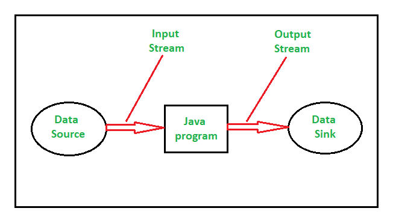
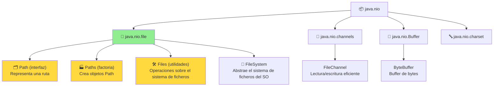
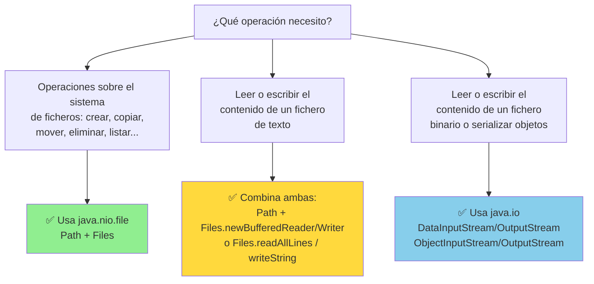

# UT12.4 Java NIO

## 📋 Índice de contenidos

1. [Introducción: Java IO vs Java NIO](#1-introducción-java-io-vs-java-nio)
    1. [¿Qué es Java NIO?](#11-qué-es-java-nio)
    2. [Ventajas de Java NIO](#12-ventajas-de-java-nio)
    3. [Paquetes principales de NIO](#13-paquetes-principales-de-nio)
2. [La interfaz Path](#2-la-interfaz-path)
    1. [Concepto de Path](#21-concepto-de-path)
    2. [Crear un Path](#22-crear-un-path)
    3. [Rutas absolutas y relativas](#23-rutas-absolutas-y-relativas)
    4. [Obtener información de un Path](#24-obtener-información-de-un-path)
    5. [Eliminar redundancias con normalize()](#25-eliminar-redundancias-con-normalize)
    6. [Unir dos rutas con resolve()](#26-unir-dos-rutas-con-resolve)
    7. [Comparar dos rutas](#27-comparar-dos-rutas)
3. [La clase Files](#3-la-clase-files)
    1. [Comprobaciones sobre ficheros y directorios](#31-comprobaciones-sobre-ficheros-y-directorios)
    2. [Crear ficheros y directorios](#32-crear-ficheros-y-directorios)
    3. [Eliminar ficheros y directorios](#33-eliminar-ficheros-y-directorios)
    4. [Copiar ficheros y directorios](#34-copiar-ficheros-y-directorios)
    5. [Mover y renombrar ficheros](#35-mover-y-renombrar-ficheros)
    6. [Leer el contenido de un fichero](#36-leer-el-contenido-de-un-fichero)
    7. [Escribir contenido en un fichero](#37-escribir-contenido-en-un-fichero)
    8. [Modificar metadatos](#38-modificar-metadatos)
    9. [Listar el contenido de un directorio](#39-listar-el-contenido-de-un-directorio)
    10. [Recorrido recursivo de directorios](#310-recorrido-recursivo-de-directorios)
4. [Integración NIO con streams de texto](#4-integración-nio-con-streams-de-texto)
5. [Conversión File ↔ Path](#5-conversión-file--path)
6. [Resumen: ¿java.io o java.nio.file?](#6-resumen-javaio-o-javaniofile)

---

## 1. Introducción: Java IO vs Java NIO

### 1.1 ¿Qué es Java NIO?

**Java NIO** (_New Input/Output_) es una API introducida en **Java 1.4** (2002) y ampliada significativamente en **Java 7** con **NIO.2** (`java.nio.file`). Fue diseñada para superar las limitaciones del paquete `java.io` tradicional en escenarios de alto rendimiento.

Para el trabajo habitual con ficheros del sistema (que es lo que cubrimos en este curso), lo más relevante es **NIO.2**: la interfaz `Path` y la clase `Files`, que ofrecen una API más moderna, completa y robusta que la antigua clase `File` de `java.io`.

> [!NOTE]
> En la práctica, para operaciones del sistema de ficheros (crear, copiar, mover, listar...) se recomienda usar siempre la API de **`java.nio.file`** (`Path` + `Files`) en lugar de la antigua `java.io.File`. Para la lectura/escritura de contenido de ficheros, ambas APIs son complementarias y pueden combinarse.

### 1.2 Ventajas de Java NIO




**1. Operaciones de E/S sin bloqueo (_non-blocking I/O_):**
- Permite que un hilo solicite la lectura de datos de un canal a un buffer y **continúe realizando otras tareas** mientras espera.
- Mejora la eficiencia global al permitir la ejecución concurrente de otras operaciones.
- Especialmente útil en servidores que gestionan miles de conexiones simultáneas.

**2. Enfoque orientado al buffer:**
- Los datos se leen y almacenan en un **buffer** (memoria intermedia).
- Permite avanzar y retroceder en el buffer según sea necesario (acceso no secuencial).
- Mejora el rendimiento al proporcionar un acceso más rápido a los datos en memoria.

> [!NOTE]
> Java NIO es especialmente útil en aplicaciones que requieren alta concurrencia y un manejo eficiente de múltiples conexiones de E/S. Para la gestión de ficheros del sistema de ficheros (nuestro caso de uso), la ventaja principal es la **API más rica y segura** de `java.nio.file`.

**Comparativa Java IO vs Java NIO (para ficheros):**

| Característica | `java.io` (antigua) | `java.nio.file` (moderna) |
|:---|:---|:---|
| Clase principal para rutas | `File` | `Path` (interfaz) + `Paths` (factoria) |
| Operaciones sobre ficheros | Métodos de `File` (limitados) | Métodos estáticos de `Files` (completos) |
| Copiar ficheros | Manual (con streams) | `Files.copy()` directo |
| Mover/renombrar | `File.renameTo()` (poco fiable) | `Files.move()` (robusto) |
| Listar directorio | `File.list()` → `String[]` | `Files.newDirectoryStream()` → `Path` |
| Recorrido recursivo | Manual (recursividad propia) | `Files.walk()`, `Files.find()` |
| Manejo de excepciones | Devuelve `true`/`false` en errores | Lanza `IOException` específica |
| Detección de tipo MIME | No disponible | `Files.probeContentType()` |
| Permisos POSIX | Limitado | `Files.getPosixFilePermissions()` |
| Codificación UTF-8 | Requiere configuración explícita | Parámetro en `readAllLines()`, `write()` |

### 1.3 Paquetes principales de NIO



> [!TIP]
> Para este curso, nos centramos en `java.nio.file`: concretamente en las clases **`Path`**, **`Paths`** y **`Files`**. Los canales (`java.nio.channels`) y buffers (`java.nio`) son conceptos más avanzados orientados a programación de red y servidores de alta concurrencia.

---

## 2. La interfaz Path

### 2.1 Concepto de Path

La interfaz `Path` (paquete `java.nio.file`) representa una **ruta en el sistema de ficheros**. Contiene el nombre del fichero y la lista de directorios que componen la ruta, y proporciona una abstracción independiente de la plataforma (Windows, Linux, macOS...).

Un `Path` puede referirse a:
- 📄 Un fichero (exista o no)
- 📁 Un directorio
- 🔗 Un enlace simbólico (_symlink_)

> [!TIP]
> Un `Path` es simplemente una **representación de una ruta**: no garantiza que el fichero o directorio referenciado exista realmente en el sistema de ficheros. Para comprobar la existencia real, usa `Files.exists(path)`.

La diferencia clave respecto a `java.io.File` es que `Path` es una **interfaz**, lo que permite diferentes implementaciones para distintos sistemas de ficheros. En la práctica, usamos la clase auxiliar **`Paths`** para crear instancias de `Path`.

### 2.2 Crear un Path

La forma estándar de crear un `Path` es mediante los métodos estáticos de la clase `Paths`:

```java
import java.nio.file.Path;
import java.nio.file.Paths;

// Opción 1: ruta completa como un solo String
Path path1 = Paths.get("C:\\temp\\foo.txt");          // Windows
Path path2 = Paths.get("/home/usuario/docs/foo.txt"); // Linux/macOS

// Opción 2: componentes de la ruta por separado (más portable)
Path path3 = Paths.get("C:", "temp", "foo.txt");

// Opción 3: usando una propiedad del sistema (portable)
Path path4 = Paths.get(System.getProperty("user.home"), "documentos", "notas.txt");

// Opción 4: Java 11+ (equivalente a Paths.get, más moderno)
Path path5 = Path.of("C:\\temp\\foo.txt");
Path path6 = Path.of("C:", "temp", "foo.txt");
```

> [!TIP]
> Usar `Paths.get("C:", "temp", "foo.txt")` (con componentes separados) es más **portable** que `Paths.get("C:\\temp\\foo.txt")` (con el separador de directorio hardcodeado), porque Java ajustará automáticamente el separador según el sistema operativo.

> [!NOTE]
> Desde **Java 11**, la interfaz `Path` incluye el método estático `Path.of()`, que es equivalente a `Paths.get()` pero más moderno y conciso. Ambas formas son correctas.

### 2.3 Rutas absolutas y relativas

Un `Path` puede ser **absoluto** o **relativo**:

```java
Path absoluta = Paths.get("C:\\Users\\usuario\\documentos\\fichero.txt");
// → Identifica el fichero de forma inequívoca desde la raíz del sistema

Path relativa = Paths.get("documentos\\fichero.txt");
// → Es relativa al directorio de trabajo actual de la JVM

// Convertir relativa a absoluta
Path absolutaConvertida = relativa.toAbsolutePath();
System.out.println(absolutaConvertida);
// → C:\Users\usuario\proyectoJava\documentos\fichero.txt (dependiendo del cwd)
```

| Tipo | Descripción | Ejemplo Linux | Ejemplo Windows |
|:---|:---|:---|:---|
| **Absoluta** | Empieza desde la raíz del sistema | `/home/user/docs/f.txt` | `C:\Users\user\docs\f.txt` |
| **Relativa** | Relativa al directorio de trabajo actual | `docs/f.txt` | `docs\f.txt` |

### 2.4 Obtener información de un Path

La interfaz `Path` proporciona varios métodos para inspeccionar los componentes de una ruta:

```java
Path path = Paths.get("C:\\temp\\datos\\foo.txt");

System.out.println("toString:     " + path.toString());
// → C:\temp\datos\foo.txt

System.out.println("getFileName:  " + path.getFileName());
// → foo.txt

System.out.println("getParent:    " + path.getParent());
// → C:\temp\datos

System.out.println("getRoot:      " + path.getRoot());
// → C:\

System.out.println("getNameCount: " + path.getNameCount());
// → 3  (temp, datos, foo.txt → no cuenta la raíz)

System.out.println("getName(0):   " + path.getName(0));
// → temp

System.out.println("getName(1):   " + path.getName(1));
// → datos

System.out.println("subpath(0,2): " + path.subpath(0, 2));
// → temp\datos
```

**Resumen de métodos de información de `Path`:**

| Método | Descripción | Ejemplo |
|:---|:---|:---|
| `toString()` | Ruta completa como String | `"C:\temp\foo.txt"` |
| `getFileName()` | Último elemento de la ruta (nombre del fichero/dir) | `"foo.txt"` |
| `getParent()` | Ruta sin el último elemento | `"C:\temp"` |
| `getRoot()` | Elemento raíz (si la ruta es absoluta) | `"C:\"` |
| `getNameCount()` | Número de elementos de la ruta (sin la raíz) | `2` |
| `getName(i)` | Elemento i-ésimo de la ruta (0 = primer dir) | `"temp"` |
| `subpath(i, j)` | Subruta desde el índice i hasta j (excluido) | `"temp\foo.txt"` |
| `toAbsolutePath()` | Convierte la ruta a absoluta | `"/home/user/docs/f.txt"` |
| `isAbsolute()` | `true` si la ruta es absoluta | `true` / `false` |
| `toRealPath()` | Ruta absoluta real (resuelve symlinks, lanza IOException si no existe) | — |

> [!NOTE]
> `getName(0)` devuelve el **primer componente de la ruta excluyendo la raíz**. Para `C:\temp\foo.txt`, el índice 0 es `temp`, el índice 1 es `foo.txt`. La raíz `C:\` no se cuenta en el índice.

### 2.5 Eliminar redundancias con normalize()

Las rutas pueden contener elementos redundantes: `.` (directorio actual) o `..` (directorio padre). El método `normalize()` los elimina:

```java
Path path1 = Paths.get("C:\\temp\\..\\datos\\foo.txt");
// → C:\temp\..\datos\foo.txt  (con redundancia)

Path path2 = path1.normalize();
// → C:\datos\foo.txt  (limpio)

System.out.println("Con redundancia:  " + path1);
System.out.println("Normalizado:      " + path2);
```

```java
// Ejemplo en Linux
Path p1 = Paths.get("/home/usuario/./documentos/../proyectos/app.java");
Path p2 = p1.normalize();
System.out.println(p2); // → /home/usuario/proyectos/app.java
```

> [!TIP]
> Llama siempre a `normalize()` cuando construyas rutas dinámicamente (por ejemplo, concatenando input del usuario) para evitar errores por rutas con `..` que podrían "escapar" de un directorio base.

### 2.6 Unir dos rutas con resolve()

El método `resolve()` sirve para **combinar dos rutas**: añade la segunda al final de la primera:

```java
Path base    = Paths.get("C:\\proyectos\\miApp");
Path relativa = Paths.get("src\\Main.java");
Path completa = base.resolve(relativa);

System.out.println(completa);
// → C:\proyectos\miApp\src\Main.java
```

> [!IMPORTANT]
> Si el argumento de `resolve()` es una **ruta absoluta**, el resultado es directamente esa ruta absoluta (ignora la base). Esto es un comportamiento importante a tener en cuenta:
>
> ```java
> Path base = Paths.get("C:\\temp");
> Path abs  = Paths.get("D:\\otro\\fichero.txt"); // ruta absoluta
> System.out.println(base.resolve(abs));
> // → D:\otro\fichero.txt  (ignora C:\temp)
> ```

**Método complementario: `relativize()`**

El inverso de `resolve()`: calcula la **ruta relativa** desde un path hasta otro:

```java
Path desde  = Paths.get("C:\\proyectos\\miApp");
Path hasta  = Paths.get("C:\\proyectos\\miApp\\src\\Main.java");
Path relat  = desde.relativize(hasta);

System.out.println(relat); // → src\Main.java
```

### 2.7 Comparar dos rutas

```java
Path path1 = Paths.get("C:\\temp\\foo.txt");
Path path2 = Paths.get("C:\\temp\\bar.txt");
Path path3 = Paths.get("C:\\temp\\foo.txt");

System.out.println(path1.equals(path2));              // false
System.out.println(path1.equals(path3));              // true

// Comparación de orden lexicográfico (útil para ordenar)
System.out.println(path1.compareTo(path2));           // > 0 (f > b)

// Comprueba si ambos paths apuntan al MISMO fichero físico en disco
// (útil para detectar symlinks que apuntan al mismo destino)
System.out.println(Files.isSameFile(path1, path3));   // true
```

> [!WARNING]
> `Files.isSameFile()` puede lanzar `IOException` si los ficheros referenciados no existen o no son accesibles. Rodéalo siempre con un bloque `try-catch`.

> [!NOTE]
> `path1.equals(path3)` compara las rutas **como strings** (con las normalizaciones del sistema operativo). En sistemas de ficheros sensibles a mayúsculas (Linux), `Paths.get("Foo.txt")` y `Paths.get("foo.txt")` son paths distintos. En Windows (insensible a mayúsculas), depende de la implementación.

---

## 3. La clase Files

La clase `Files` (paquete `java.nio.file`) proporciona **métodos estáticos** para realizar todo tipo de operaciones sobre el sistema de ficheros: comprobar existencia, crear, copiar, mover, eliminar, leer y escribir contenido, listar directorios...

> [!TIP]
> Para ver todos los métodos disponibles, consulta la [documentación oficial de la clase Files](https://docs.oracle.com/en/java/javase/21/docs/api/java.base/java/nio/file/Files.html).

Todos los métodos de `Files` trabajan con objetos `Path`, no con `String` ni con `File`. El patrón general es:

```java
import java.nio.file.*;
import java.io.IOException;

Path ruta = Paths.get("C:\\temp\\fichero.txt");

try {
    // Operación con Files
    Files.createFile(ruta);
} catch (IOException e) {
    System.err.println("Error: " + e.getMessage());
}
```

### 3.1 Comprobaciones sobre ficheros y directorios

Los métodos de comprobación de `Files` **no lanzan excepción** cuando el fichero no existe: devuelven `false`. Solo lanzan excepción si hay un error de E/S real (permisos, disco inaccesible...).

```java
Path path = Paths.get("C:\\temp\\foo.txt");

// Existencia
System.out.println(Files.exists(path));           // true si existe
System.out.println(Files.notExists(path));        // true si NO existe

// Tipo
System.out.println(Files.isRegularFile(path));    // true si es un fichero normal
System.out.println(Files.isDirectory(path));      // true si es un directorio
System.out.println(Files.isSymbolicLink(path));   // true si es un symlink

// Permisos
System.out.println(Files.isReadable(path));       // true si se puede leer
System.out.println(Files.isWritable(path));       // true si se puede escribir
System.out.println(Files.isExecutable(path));     // true si se puede ejecutar

// Metadatos (estos sí pueden lanzar IOException)
try {
    System.out.println(Files.getLastModifiedTime(path));  // fecha última modificación
    System.out.println(Files.size(path));                 // tamaño en bytes
    System.out.println(Files.getOwner(path));             // propietario
    System.out.println(Files.isHidden(path));             // true si está oculto
    System.out.println(Files.probeContentType(path));     // tipo MIME ("text/plain", etc.)
} catch (IOException e) {
    System.err.println("Error al obtener metadatos: " + e.getMessage());
}

// Permisos POSIX (solo Linux/macOS)
try {
    Set<PosixFilePermission> permisos = Files.getPosixFilePermissions(path);
    System.out.println(permisos); // [OWNER_READ, OWNER_WRITE, GROUP_READ, ...]
} catch (IOException e) {
    e.printStackTrace();
}
```

**Resumen de métodos de comprobación:**

| Método | Devuelve | Lanza IOException |
|:---|:---:|:---:|
| `Files.exists(path)` | `boolean` | No |
| `Files.notExists(path)` | `boolean` | No |
| `Files.isRegularFile(path)` | `boolean` | No |
| `Files.isDirectory(path)` | `boolean` | No |
| `Files.isSymbolicLink(path)` | `boolean` | No |
| `Files.isReadable(path)` | `boolean` | No |
| `Files.isWritable(path)` | `boolean` | No |
| `Files.isExecutable(path)` | `boolean` | No |
| `Files.size(path)` | `long` | ✅ Sí |
| `Files.getLastModifiedTime(path)` | `FileTime` | ✅ Sí |
| `Files.getOwner(path)` | `UserPrincipal` | ✅ Sí |
| `Files.isHidden(path)` | `boolean` | ✅ Sí |
| `Files.probeContentType(path)` | `String` (MIME) | ✅ Sí |

### 3.2 Crear ficheros y directorios

```java
// Crear un fichero vacío (lanza FileAlreadyExistsException si ya existe)
Path fichero = Paths.get("C:\\temp\\nuevo.txt");
Files.createFile(fichero);

// Crear un directorio (lanza exception si ya existe o si el padre no existe)
Path dir = Paths.get("C:\\temp\\nuevaCarpta");
Files.createDirectory(dir);

// Crear directorios anidados (crea toda la ruta si no existe, como mkdir -p)
Path dirs = Paths.get("C:\\temp\\nivel1\\nivel2\\nivel3");
Files.createDirectories(dirs);  // ✅ Seguro aunque ya existan algunos niveles

// Crear fichero temporal (en el directorio temporal del sistema)
Path temporal = Files.createTempFile("prefijo_", ".tmp");
System.out.println("Temporal creado en: " + temporal);
```

> [!CAUTION]
> `Files.createFile()` lanza `FileAlreadyExistsException` si el fichero ya existe. Si el directorio padre no existe, lanza `NoSuchFileException`. Usa `Files.createDirectories()` previamente para asegurar que existe toda la ruta.
>
> `Files.createDirectories()` es **idempotente**: si los directorios ya existen, no hace nada (no lanza error). Es la opción más segura para crear rutas de forma programática.

**Patrón típico: crear fichero asegurando que existe su directorio:**

```java
Path ruta = Paths.get("C:\\proyectos\\miApp\\datos\\config.txt");

// Aseguramos que existe el directorio padre
Files.createDirectories(ruta.getParent());

// Creamos el fichero (solo si no existe)
if (!Files.exists(ruta)) {
    Files.createFile(ruta);
}
```

### 3.3 Eliminar ficheros y directorios

```java
Path fichero = Paths.get("C:\\temp\\foo.txt");

// Eliminar fichero (lanza NoSuchFileException si no existe)
Files.delete(fichero);

// Eliminar solo si existe (no lanza excepción si no existe)
Files.deleteIfExists(fichero);  // ← opción más segura

// Eliminar directorio (lanza DirectoryNotEmptyException si no está vacío)
Path dir = Paths.get("C:\\temp\\carpetaVacia");
Files.delete(dir);
```

> [!WARNING]
> `Files.delete(dir)` sobre un **directorio no vacío** lanza `DirectoryNotEmptyException`. Para eliminar un directorio con contenido, debes **eliminar primero todos sus ficheros y subdirectorios** recursivamente. Veremos cómo hacerlo con `Files.walk()` en el apartado 3.10.

**Eliminar un directorio con todo su contenido (borrado recursivo):**

```java
Path dirAEliminar = Paths.get("C:\\temp\\carpetaConContenido");

// Recorremos el árbol en orden "más profundo primero" (reversed)
Files.walk(dirAEliminar)
     .sorted(Comparator.reverseOrder())  // los hijos antes que los padres
     .forEach(p -> {
         try {
             Files.delete(p);
         } catch (IOException e) {
             System.err.println("No se pudo eliminar: " + p);
         }
     });
```

### 3.4 Copiar ficheros y directorios

```java
Path origen  = Paths.get("C:\\temp\\foo.txt");
Path destino = Paths.get("C:\\temp\\foo_copia.txt");

// Copia básica (lanza FileAlreadyExistsException si el destino existe)
Files.copy(origen, destino);

// Copia sobreescribiendo si el destino ya existe
Files.copy(origen, destino, StandardCopyOption.REPLACE_EXISTING);

// Copia preservando los atributos (fecha de modificación, permisos...)
Files.copy(origen, destino,
    StandardCopyOption.REPLACE_EXISTING,
    StandardCopyOption.COPY_ATTRIBUTES);
```

**Opciones de copia (`StandardCopyOption`):**

| Opción | Descripción |
|:---|:---|
| `REPLACE_EXISTING` | Sobreescribe el destino si ya existe |
| `COPY_ATTRIBUTES` | Copia también los metadatos del fichero (fecha, permisos...) |
| `ATOMIC_MOVE` | (Solo para `move`) Mueve el fichero de forma atómica |

> [!NOTE]
> Cuando se **copia un directorio**, únicamente se crea el directorio de destino vacío: los ficheros y subdirectorios que contiene **no se copian automáticamente**. Para hacer una copia completa (recursiva), es necesario recorrer el árbol con `Files.walk()`.

**Copia recursiva de un directorio:**

```java
Path origen  = Paths.get("C:\\temp\\carpetaOrigen");
Path destino = Paths.get("C:\\temp\\carpetaDestino");

Files.walk(origen).forEach(src -> {
    try {
        Path dst = destino.resolve(origen.relativize(src));
        Files.copy(src, dst, StandardCopyOption.REPLACE_EXISTING);
    } catch (IOException e) {
        System.err.println("Error copiando " + src + ": " + e.getMessage());
    }
});
```

### 3.5 Mover y renombrar ficheros

`Files.move()` sirve tanto para **mover** (cambiar de directorio) como para **renombrar** (cambiar el nombre dentro del mismo directorio):

```java
// Mover a otro directorio
Path origen  = Paths.get("C:\\temp\\foo.txt");
Path destino = Paths.get("C:\\documentos\\foo.txt");
Files.move(origen, destino, StandardCopyOption.REPLACE_EXISTING);

// Renombrar (mismo directorio, nombre distinto)
Path original   = Paths.get("C:\\temp\\foo.txt");
Path renombrado = Paths.get("C:\\temp\\bar.txt");
Files.move(original, renombrado, StandardCopyOption.REPLACE_EXISTING);
```

> [!TIP]
> `Files.move()` es mucho más **fiable** que el antiguo `File.renameTo()`, que en muchos sistemas operativos fallaba silenciosamente (devolvía `false` sin lanzar excepción). `Files.move()` lanza una `IOException` descriptiva si la operación falla, lo que facilita el diagnóstico de errores.

### 3.6 Leer el contenido de un fichero

`Files` ofrece métodos de alto nivel para leer el contenido completo de un fichero en una sola línea:

```java
Path path = Paths.get("C:\\temp\\datos.txt");

// Leer todo el contenido como array de bytes
byte[] bytes = Files.readAllBytes(path);

// Leer todas las líneas como List<String> (con codificación)
List<String> lineas = Files.readAllLines(path, StandardCharsets.UTF_8);

// Java 11+: leer todo el contenido como un único String
String contenido = Files.readString(path, StandardCharsets.UTF_8);
```

**Ejemplo de uso:**

```java
import java.nio.file.*;
import java.nio.charset.StandardCharsets;
import java.io.IOException;
import java.util.List;

public class LeerConNIO {
    public static void main(String[] args) {
        Path path = Paths.get("alumnos.txt");

        try {
            List<String> lineas = Files.readAllLines(path, StandardCharsets.UTF_8);
            System.out.println("Total de líneas: " + lineas.size());

            for (String linea : lineas) {
                System.out.println("  → " + linea);
            }
        } catch (IOException e) {
            System.err.println("Error al leer: " + e.getMessage());
        }
    }
}
```

> [!CAUTION]
> `Files.readAllBytes()` y `Files.readAllLines()` cargan **todo el fichero en memoria de una vez**. Son perfectos para ficheros pequeños y medianos, pero para ficheros muy grandes (cientos de MB o más) es mejor usar un `BufferedReader` que lee línea a línea sin cargar todo en memoria:
>
> ```java
> try (BufferedReader br = Files.newBufferedReader(path, StandardCharsets.UTF_8)) {
>     String linea;
>     while ((linea = br.readLine()) != null) {
>         // procesar línea por línea
>     }
> }
> ```

### 3.7 Escribir contenido en un fichero

```java
Path path = Paths.get("C:\\temp\\salida.txt");

// Escribir un array de bytes
String texto = "Hola desde NIO";
Files.write(path, texto.getBytes(StandardCharsets.UTF_8));

// Escribir una lista de líneas
List<String> lineas = Arrays.asList("Línea 1", "Línea 2", "Línea 3");
Files.write(path, lineas, StandardCharsets.UTF_8);

// Escribir añadiendo al final (modo append)
List<String> masLineas = Arrays.asList("Línea 4", "Línea 5");
Files.write(path, masLineas, StandardCharsets.UTF_8, StandardOpenOption.APPEND);

// Java 11+: escribir un String directamente
Files.writeString(path, "Contenido del fichero\n", StandardCharsets.UTF_8);
Files.writeString(path, "Segunda línea\n", StandardCharsets.UTF_8,
    StandardOpenOption.APPEND);
```

**Opciones de apertura (`StandardOpenOption`):**

| Opción | Descripción |
|:---|:---|
| `CREATE` | Crea el fichero si no existe (por defecto con `write`) |
| `CREATE_NEW` | Crea el fichero; falla si ya existe |
| `APPEND` | Añade datos al final del fichero existente |
| `TRUNCATE_EXISTING` | Trunca el fichero a cero bytes al abrirlo (sobreescribe) |
| `WRITE` | Abre para escritura |
| `READ` | Abre para lectura |

> [!NOTE]
> Por defecto (sin especificar `StandardOpenOption`), `Files.write()` **crea el fichero si no existe** y **sobreescribe** si ya existe (equivalente a `CREATE` + `TRUNCATE_EXISTING`). Usa `StandardOpenOption.APPEND` explícitamente cuando quieras añadir al final.

### 3.8 Modificar metadatos

```java
Path path = Paths.get("C:\\temp\\foo.txt");

// Modificar la fecha de última modificación
Files.setLastModifiedTime(path, FileTime.fromMillis(System.currentTimeMillis()));

// Modificar el propietario del fichero
UserPrincipal nuevoOwner = path.getFileSystem()
    .getUserPrincipalLookupService()
    .lookupPrincipalByName("nuevoUsuario");
Files.setOwner(path, nuevoOwner);

// Modificar permisos POSIX (solo Linux/macOS)
// rw-r--r-- = propietario: lectura+escritura; grupo y otros: solo lectura
Set<PosixFilePermission> permisos = PosixFilePermissions.fromString("rw-r--r--");
Files.setPosixFilePermissions(path, permisos);
```

> [!NOTE]
> Los permisos POSIX (`getPosixFilePermissions`, `setPosixFilePermissions`) solo están disponibles en sistemas de ficheros compatibles con POSIX: **Linux y macOS**. En Windows no están disponibles; para gestionar permisos en Windows se usan `DosFileAttributes` o la API de seguridad de Windows.

### 3.9 Listar el contenido de un directorio

Para listar los ficheros y subdirectorios de un directorio, usa `Files.newDirectoryStream()`:

```java
Path dir = Paths.get("C:\\temp");

try (DirectoryStream<Path> stream = Files.newDirectoryStream(dir)) {
    for (Path elemento : stream) {
        System.out.println(elemento.getFileName());
    }
} catch (IOException | DirectoryIteratorException e) {
    System.err.println("Error al listar el directorio: " + e);
}
```

`DirectoryStream` implementa `Iterable<Path>` y `Closeable`, por lo que funciona perfectamente con `try-with-resources` y un `for-each`.

**Listar solo ficheros con un patrón (glob):**

```java
// Listar solo ficheros .txt del directorio
try (DirectoryStream<Path> stream = Files.newDirectoryStream(dir, "*.txt")) {
    for (Path fichero : stream) {
        System.out.printf("%-30s %,10d bytes%n",
            fichero.getFileName(),
            Files.size(fichero));
    }
} catch (IOException e) {
    System.err.println("Error: " + e.getMessage());
}
```

**Listar con más información (usando `Files`):**

```java
try (DirectoryStream<Path> stream = Files.newDirectoryStream(dir)) {
    System.out.printf("%-5s %-30s %,12s %s%n", "Tipo", "Nombre", "Tamaño", "Modificado");
    System.out.println("-".repeat(70));

    for (Path p : stream) {
        String tipo    = Files.isDirectory(p) ? "[DIR]" : "[FIC]";
        String nombre  = p.getFileName().toString();
        long   tamanyo = Files.isDirectory(p) ? 0L : Files.size(p);
        FileTime fecha = Files.getLastModifiedTime(p);

        System.out.printf("%-5s %-30s %,12d %s%n", tipo, nombre, tamanyo, fecha);
    }
} catch (IOException e) {
    e.printStackTrace();
}
```

### 3.10 Recorrido recursivo de directorios

Para explorar **árbolescentemente** un directorio (incluyendo subdirectorios), NIO proporciona dos métodos potentes:

#### Files.walk() — recorrido completo

```java
Path raiz = Paths.get("C:\\proyectos");

// Listar todos los ficheros .java del árbol
try (Stream<Path> stream = Files.walk(raiz)) {
    stream
        .filter(p -> p.toString().endsWith(".java"))
        .filter(Files::isRegularFile)
        .forEach(p -> System.out.println(p));
} catch (IOException e) {
    e.printStackTrace();
}
```

```java
// Contar el espacio total ocupado por un directorio
try (Stream<Path> stream = Files.walk(raiz)) {
    long totalBytes = stream
        .filter(Files::isRegularFile)
        .mapToLong(p -> {
            try { return Files.size(p); }
            catch (IOException e) { return 0L; }
        })
        .sum();

    System.out.printf("Espacio total: %,.2f MB%n", totalBytes / (1024.0 * 1024.0));
} catch (IOException e) {
    e.printStackTrace();
}
```

#### Files.find() — recorrido con filtro

`Files.find()` permite filtrar directamente durante el recorrido con un `BiPredicate<Path, BasicFileAttributes>`:

```java
// Buscar todos los ficheros modificados en los últimos 7 días
long hace7Dias = System.currentTimeMillis() - (7L * 24 * 60 * 60 * 1000);

try (Stream<Path> stream = Files.find(raiz, Integer.MAX_VALUE,
        (path, attrs) -> attrs.isRegularFile()
                      && attrs.lastModifiedTime().toMillis() > hace7Dias)) {
    stream.forEach(System.out::println);
} catch (IOException e) {
    e.printStackTrace();
}
```

> [!TIP]
> Tanto `Files.walk()` como `Files.find()` devuelven un **`Stream<Path>`** (del paquete `java.util.stream`). Esto permite usar toda la API de Streams de Java (filter, map, sorted, forEach, collect...) para procesar los resultados de forma eficiente y concisa.

---

## 4. Integración NIO con streams de texto

`Files` proporciona métodos de fábrica que crean streams de texto (`BufferedReader`, `BufferedWriter`) a partir de un `Path`. Esto combina la comodidad de NIO para referenciar rutas con la potencia de los streams de caracteres de `java.io`:

```java
import java.nio.file.*;
import java.nio.charset.StandardCharsets;
import java.io.*;

Path path = Paths.get("datos.txt");

// Leer con BufferedReader creado por Files
try (BufferedReader br = Files.newBufferedReader(path, StandardCharsets.UTF_8)) {
    String linea;
    while ((linea = br.readLine()) != null) {
        System.out.println(linea);
    }
} catch (IOException e) {
    System.err.println("Error: " + e.getMessage());
}

// Escribir con BufferedWriter creado por Files
try (BufferedWriter bw = Files.newBufferedWriter(path, StandardCharsets.UTF_8,
        StandardOpenOption.APPEND)) {
    bw.write("Nueva línea añadida");
    bw.newLine();
} catch (IOException e) {
    System.err.println("Error: " + e.getMessage());
}
```

> [!TIP]
> Usar `Files.newBufferedReader()` y `Files.newBufferedWriter()` en lugar de `new BufferedReader(new FileReader(...))` tiene la ventaja de que puedes **especificar la codificación de caracteres** directamente como parámetro. Esto evita problemas de compatibilidad entre plataformas (Windows usa CP-1252 por defecto, Linux usa UTF-8). **Siempre especifica `StandardCharsets.UTF_8`** para máxima portabilidad.

---

## 5. Conversión File ↔ Path

Como el código legado puede usar `java.io.File` y el nuevo código usa `java.nio.file.Path`, es habitual tener que convertir entre ambos. Afortunadamente, ambas clases proporcionan métodos de conversión directos:

```java
// De File a Path
File file = new File("C:\\temp\\foo.txt");
Path path = file.toPath();

// De Path a File
Path path2 = Paths.get("C:\\temp\\foo.txt");
File file2 = path2.toFile();
```

> [!IMPORTANT]
> Esta conversión es especialmente útil cuando:
> - Trabajas con librerías antiguas que aún usan `File` y quieres pasarles rutas construidas con `Path`
> - Tienes código legado con `File` y lo migras gradualmente a NIO
> - Usas APIs de terceros que devuelven `File` pero quieres procesarlos con `Files`

**Ejemplo — integrar con una API antigua que usa `File`:**

```java
// Supongamos que tenemos un método antiguo que acepta File
public void procesarFicheroAntiguo(File f) { /* ... */ }

// En nuestro código moderno usamos Path
Path miPath = Paths.get(System.getProperty("user.home"), "datos", "fichero.csv");

// Conversión para compatibilidad
procesarFicheroAntiguo(miPath.toFile());
```

---

## 6. Resumen: ¿java.io o java.nio.file?

Para terminar, aquí tienes una guía rápida de cuándo usar cada API:



| Tarea | API recomendada | Clase principal |
|:---|:---:|:---|
| Representar una ruta | NIO | `Path` / `Paths` |
| Crear/eliminar ficheros y dirs | NIO | `Files` |
| Copiar/mover ficheros | NIO | `Files.copy()`, `Files.move()` |
| Comprobar existencia, permisos... | NIO | `Files.exists()`, `Files.isReadable()`... |
| Listar/recorrer directorios | NIO | `Files.newDirectoryStream()`, `Files.walk()` |
| Leer/escribir texto (ficheros pequeños) | NIO | `Files.readAllLines()`, `Files.writeString()` |
| Leer/escribir texto (ficheros grandes) | IO + NIO | `Files.newBufferedReader/Writer()` |
| Leer/escribir tipos primitivos binarios | IO | `DataInputStream/OutputStream` |
| Serializar/deserializar objetos | IO | `ObjectInputStream/OutputStream` |
| Copiar ficheros binarios byte a byte | IO | `FileInputStream/OutputStream` |

---

<p align="center">📚 <em>Fin del apartado UT12.4 – Java NIO</em></p>
