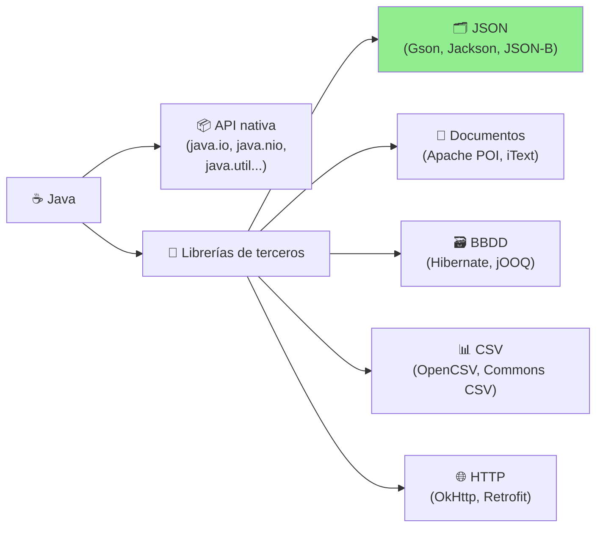
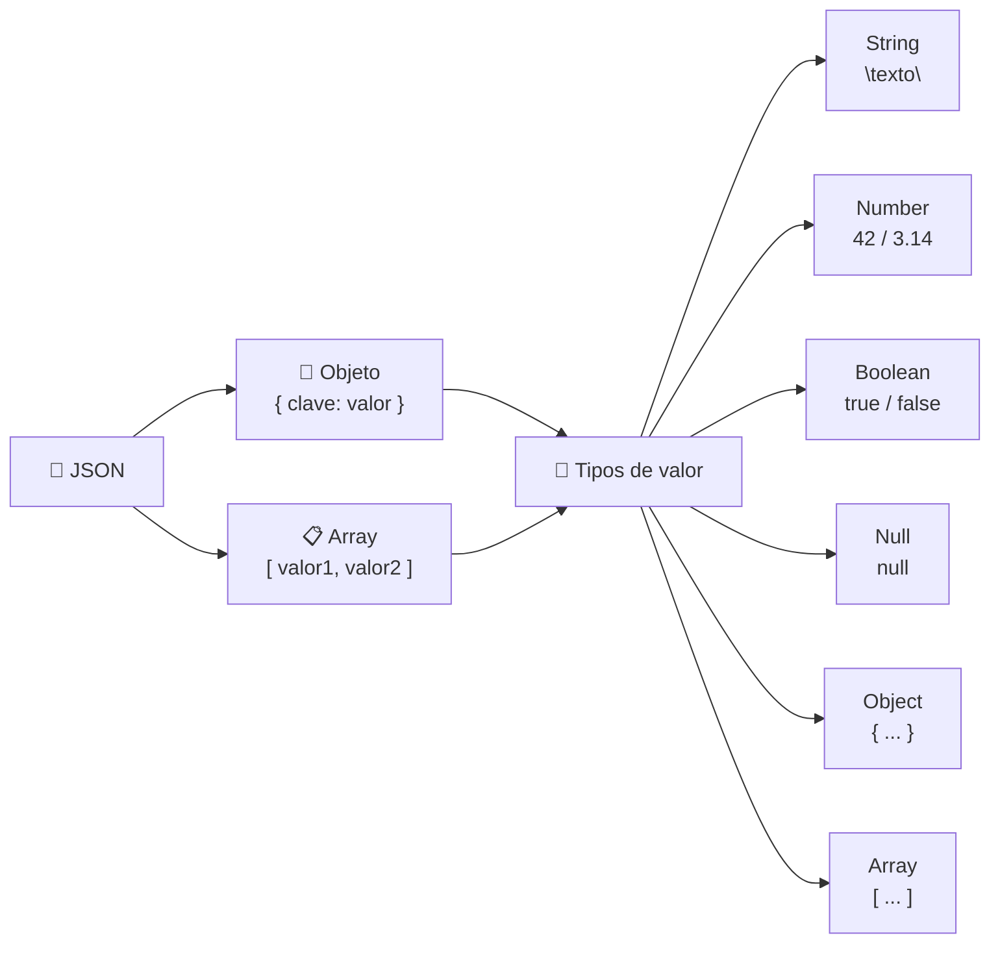
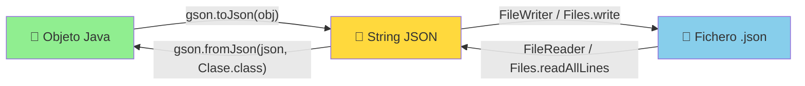
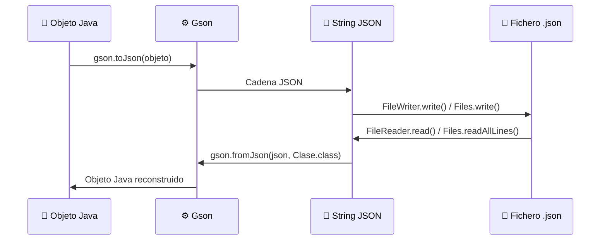

# UT12.5 Tratamiento de ficheros JSON

## 📋 Índice de contenidos

1. [Introducción: librerías de terceros en Java](#1-introducción-librerías-de-terceros-en-java)
2. [Conceptos básicos de JSON](#2-conceptos-básicos-de-json)
    1. [Estructura y sintaxis](#21-estructura-y-sintaxis)
    2. [Tipos de datos en JSON](#22-tipos-de-datos-en-json)
    3. [Ventajas de JSON frente a XML](#23-ventajas-de-json-frente-a-xml)
3. [Librerías Java para trabajar con JSON](#3-librerías-java-para-trabajar-con-json)
4. [Configuración: añadir GSON al proyecto](#4-configuración-añadir-gson-al-proyecto)
    1. [Con Maven (pom.xml)](#41-con-maven-pomxml)
    2. [Con Gradle](#42-con-gradle)
    3. [Sin gestor de dependencias (JAR manual)](#43-sin-gestor-de-dependencias-jar-manual)
5. [Procesamiento JSON con GSON](#5-procesamiento-json-con-gson)
    1. [Serialización: objeto Java → JSON](#51-serialización-objeto-java--json)
    2. [Deserialización: JSON → objeto Java](#52-deserialización-json--objeto-java)
    3. [Requisitos de la clase a serializar](#53-requisitos-de-la-clase-a-serializar)
    4. [Serializar y deserializar colecciones (TypeToken)](#54-serializar-y-deserializar-colecciones-typetoken)
    5. [Personalización con GsonBuilder](#55-personalización-con-gsonbuilder)
    6. [La anotación @SerializedName](#56-la-anotación-serializedname)
    7. [El modificador transient en Gson](#57-el-modificador-transient-en-gson)
6. [Integración de Gson con operaciones de ficheros](#6-integración-de-gson-con-operaciones-de-ficheros)
    1. [Con FileWriter y FileReader (java.io)](#61-con-filewriter-y-filereader-javaio)
    2. [Con Files y NIO2 (java.nio.file)](#62-con-files-y-nio2-javaniofile)
7. [Buenas prácticas y manejo de errores](#7-buenas-prácticas-y-manejo-de-errores)
8. [Ejercicios prácticos](#8-ejercicios-prácticos)

---

## 1. Introducción: librerías de terceros en Java

Java destaca no solo por su robusta API nativa, sino también por la inmensa variedad de **librerías de terceros** que amplían sus capacidades. Estas herramientas permiten integrar funcionalidades especializadas sin tener que "reinventar la rueda", desde el envío de correos hasta la manipulación de documentos PDF.



Las librerías de terceros más usadas en Java se organizan por categoría:

| Funcionalidad | Librerías destacadas |
|:---|:---|
| 📧 Correo electrónico | JavaMail, Jakarta Mail |
| 🗃️ Bases de datos / ORM | JDBC, Hibernate, jOOQ |
| 📄 Documentos Office | Apache POI |
| 📊 Ficheros CSV | Apache Commons CSV, OpenCSV |
| 📑 Documentos PDF | iText, PDFBox |
| 🔄 Archivos XML | JAXB, JDOM |
| 🗜️ Compresión | `java.util.zip`, Zip4j |
| 🔄 **Ficheros JSON** | **Gson, Jackson, JSON-B** |

En este apartado nos centraremos en el formato **JSON** (el estándar actual para el intercambio de datos en APIs y servicios web) usando la librería **GSON** de Google, que es una de las más sencillas de utilizar para proyectos de complejidad media.

> [!NOTE]
> Gson es solo una de varias opciones. En proyectos de mayor envergadura, **Jackson** suele ser preferida por su rendimiento y su mayor número de funcionalidades. La elección depende del contexto: para un módulo DAM, Gson es ideal por su simplicidad.

---

## 2. Conceptos básicos de JSON

**JSON** (_JavaScript Object Notation_) es un formato de texto ligero para el intercambio de datos entre aplicaciones. Su sintaxis proviene de JavaScript, pero es **independiente del lenguaje**, lo que permite usarlo con Java, Python, PHP, JavaScript, etc.



### 2.1 Estructura y sintaxis

La información en JSON se organiza mediante **pares clave/valor**:

- Las **claves** son siempre cadenas de texto entre comillas dobles.
- Los **valores** pueden ser de seis tipos distintos (ver sección 2.2).

Los dos elementos estructurales fundamentales son:

**Objeto JSON** — delimitado por `{ }`, agrupa pares clave/valor separados por comas:

```json
{
    "nombre": "Ana García",
    "edad": 28,
    "activo": true,
    "direccion": null
}
```

**Array JSON** — delimitado por `[ ]`, contiene una lista ordenada de valores:

```json
{
    "nombre": "Ana García",
    "habilidades": ["Java", "SQL", "Android"],
    "notas": [8.5, 9.0, 7.75]
}
```

**Objetos anidados** — los valores pueden ser a su vez objetos o arrays, lo que permite representar estructuras complejas:

```json
{
    "nombre": "Ana García",
    "edad": 28,
    "direccion": {
        "calle": "Calle Mayor",
        "numero": 15,
        "ciudad": "Valencia"
    },
    "telefonos": ["612345678", "963456789"]
}
```

### 2.2 Tipos de datos en JSON

| Tipo | Descripción | Ejemplo JSON |
|:---|:---|:---|
| `String` | Cadena de texto entre comillas dobles | `"nombre": "Ana"` |
| `Number` | Entero o decimal (sin comillas) | `"edad": 28`, `"precio": 3.14` |
| `Boolean` | `true` o `false` (sin comillas) | `"activo": true` |
| `Null` | Valor nulo | `"telefono": null` |
| `Object` | Objeto anidado entre `{ }` | `"direccion": { "ciudad": "Valencia" }` |
| `Array` | Lista de valores entre `[ ]` | `"tags": ["java", "json"]` |

**Reglas de sintaxis fundamentales:**

| Elemento | Regla |
|:---|:---|
| Claves | Siempre entre **comillas dobles** |
| Separador clave/valor | Dos puntos `:` |
| Separador entre pares | Coma `,` (no se permite coma tras el último elemento) |
| Valores cadena | Entre **comillas dobles** (nunca simples) |
| Valores numéricos y booleanos | **Sin comillas** |

> [!CAUTION]
> JSON es **muy estricto** con la sintaxis. Errores comunes que provocan JSON inválido:
> - Usar comillas simples en lugar de dobles: `{'nombre': 'Ana'}` ❌
> - Dejar una coma tras el último elemento: `{"a": 1, "b": 2,}` ❌
> - Usar comentarios (JSON no los soporta) ❌
> - Escribir `True`/`False` en lugar de `true`/`false` ❌

### 2.3 Ventajas de JSON frente a XML

```
<!-- XML: más verboso -->
<persona>
    <nombre>Ana García</nombre>
    <edad>28</edad>
    <activo>true</activo>
</persona>

// JSON: más compacto y legible
{
    "nombre": "Ana García",
    "edad": 28,
    "activo": true
}
```

| Característica | JSON | XML |
|:---|:---:|:---:|
| Legibilidad humana | ✅ Alta | 🟡 Media |
| Verbosidad | ✅ Baja | ❌ Alta |
| Peso del fichero | ✅ Menor | ❌ Mayor |
| Soporte nativo en navegadores/JavaScript | ✅ Sí | ❌ No |
| Soporte de comentarios | ❌ No | ✅ Sí |
| Soporte de atributos y metadatos | ❌ Limitado | ✅ Amplio |
| Estándar para APIs REST | ✅ Sí | ❌ No (SOAP) |

> [!TIP]
> JSON es el formato estándar para las **APIs REST** (el tipo de API más usado en el mundo). Aprender a trabajar con JSON es imprescindible para cualquier desarrollador de aplicaciones modernas, tanto web como móviles (Android).

---

## 3. Librerías Java para trabajar con JSON

Java no incluye soporte nativo para JSON en su API estándar, por lo que se necesita una librería de terceros. Las más utilizadas son:

| Librería | Desarrollada por | Ventajas principales | Caso de uso ideal |
|:---|:---:|:---|:---|
| **Gson** | Google | Muy fácil de usar; no requiere anotaciones; manejo sencillo de genéricos con `TypeToken` | Proyectos que priorizan simplicidad y rapidez de desarrollo |
| **Jackson** | FasterXML | Alta versatilidad (streaming, árbol, data binding); máximo rendimiento; amplísimo ecosistema | Proyectos grandes o de alto rendimiento; Spring Boot |
| **JSON-B** | Jakarta EE | API estándar Java EE; integración nativa con aplicaciones empresariales | Aplicaciones Jakarta EE / Jakarta REST |
| **Fastjson** | Alibaba | Procesamiento muy rápido para grandes volúmenes | Escenarios con procesamiento masivo de JSON |

> [!NOTE]
> En este curso trabajaremos con **Gson** por su simplicidad de uso. Sin embargo, es importante conocer que **Jackson** es la opción dominante en el mundo profesional, especialmente en aplicaciones Spring Boot, donde viene integrado por defecto.

---

## 4. Configuración: añadir GSON al proyecto

### 4.1 Con Maven (pom.xml)

Si el proyecto usa **Maven** (el gestor de dependencias estándar en DAM), añade esta dependencia al fichero `pom.xml`:

```xml
<dependencies>
    <dependency>
        <groupId>com.google.code.gson</groupId>
        <artifactId>gson</artifactId>
        <version>2.12.1</version>
    </dependency>
</dependencies>
```

Maven descargará automáticamente el JAR de Gson desde el repositorio central y lo añadirá al classpath del proyecto.

> [!TIP]
> Comprueba siempre la última versión disponible en [Maven Central](https://search.maven.org/artifact/com.google.code.gson/gson) para usar las últimas mejoras y correcciones de seguridad.

### 4.2 Con Gradle

Si el proyecto usa **Gradle**, añade la dependencia en el fichero `build.gradle`:

```groovy
dependencies {
    implementation 'com.google.code.gson:gson:2.12.1'
}
```

### 4.3 Sin gestor de dependencias (JAR manual)

Si el proyecto no usa Maven ni Gradle (por ejemplo, un proyecto IntelliJ IDEA básico):

1. Descarga el fichero `gson-2.12.1.jar` desde [Maven Central](https://search.maven.org/artifact/com.google.code.gson/gson)
2. En IntelliJ IDEA: `File → Project Structure → Libraries → + → Java` → selecciona el JAR
3. En Eclipse: clic derecho sobre el proyecto → `Build Path → Add External Archives...`

> [!IMPORTANT]
> Para importar las clases de Gson en tu código, usa:
> ```java
> import com.google.gson.Gson;
> import com.google.gson.GsonBuilder;
> import com.google.gson.JsonSyntaxException;
> import com.google.gson.reflect.TypeToken;
> ```

---

## 5. Procesamiento JSON con GSON

El núcleo de Gson son dos métodos simétricos de la clase `Gson`:



| Método | Dirección | Descripción |
|:---|:---:|:---|
| `gson.toJson(objeto)` | Java → JSON | Convierte un objeto Java en una cadena JSON |
| `gson.fromJson(jsonString, Clase.class)` | JSON → Java | Reconstruye un objeto Java a partir de una cadena JSON |

### 5.1 Serialización: objeto Java → JSON

```java
import com.google.gson.Gson;

public class EjemploSerializacion {
    public static void main(String[] args) {
        Gson gson = new Gson();

        Persona persona = new Persona("Ana García", 28);

        // Serialización: objeto Java → cadena JSON
        String json = gson.toJson(persona);

        System.out.println(json);
        // → {"nombre":"Ana García","edad":28}
    }
}
```

El JSON generado es **compacto** (sin espacios ni saltos de línea). Para obtener un formato **legible e indentado** (útil para depuración o ficheros de configuración), usa `GsonBuilder` con `setPrettyPrinting()` (ver sección 5.5):

```java
Gson gson = new GsonBuilder().setPrettyPrinting().create();
String json = gson.toJson(persona);
System.out.println(json);
```

**Salida con pretty printing:**
```json
{
  "nombre": "Ana García",
  "edad": 28
}
```

### 5.2 Deserialización: JSON → objeto Java

```java
import com.google.gson.Gson;

public class EjemploDeserializacion {
    public static void main(String[] args) {
        Gson gson = new Gson();

        String json = "{\"nombre\":\"Ana García\",\"edad\":28}";

        // Deserialización: cadena JSON → objeto Java
        Persona persona = gson.fromJson(json, Persona.class);

        System.out.println(persona.getNombre()); // → Ana García
        System.out.println(persona.getEdad());   // → 28
        System.out.println(persona);             // → Persona{nombre='Ana García', edad=28}
    }
}
```

> [!IMPORTANT]
> `fromJson()` necesita saber el **tipo exacto** del objeto a reconstruir: por eso se pasa `Persona.class` como segundo argumento. Para colecciones genéricas (`List<Persona>`, `Map<String, Persona>`...) se necesita `TypeToken` (ver sección 5.4).

### 5.3 Requisitos de la clase a serializar

A diferencia de la serialización Java nativa (`Serializable`), Gson **no requiere** que la clase implemente ninguna interfaz. Sin embargo, hay algunas condiciones a tener en cuenta:

```java
public class Persona {
    private String nombre;  // ✅ Gson serializa campos privados directamente
    private int    edad;
    // No hace falta @SerializedName ni ninguna anotación especial

    // ⚠️ Constructor sin argumentos NECESARIO para la deserialización
    public Persona() { }

    public Persona(String nombre, int edad) {
        this.nombre = nombre;
        this.edad   = edad;
    }

    // Getters y setters (opcionales para Gson, pero buena práctica)
    public String getNombre() { return nombre; }
    public int    getEdad()   { return edad; }

    @Override
    public String toString() {
        return "Persona{nombre='" + nombre + "', edad=" + edad + "}";
    }
}
```

**Reglas de Gson sobre los campos:**

| Situación | Comportamiento de Gson |
|:---|:---|
| Campo `private` | ✅ Se serializa/deserializa igual que `public` |
| Campo `static` | ❌ No se serializa (pertenece a la clase, no al objeto) |
| Campo `transient` | ❌ No se serializa (igual que con `Serializable` de Java) |
| Campo con valor `null` | Por defecto ❌ no aparece en el JSON (se puede cambiar con `serializeNulls()`) |
| Campo no presente en el JSON | Al deserializar, el campo tomará su valor por defecto (`null`, `0`, `false`...) |

> [!WARNING]
> Gson **no lanza excepción** si el JSON tiene campos que no existen en la clase, ni si la clase tiene campos que no aparecen en el JSON. Los primeros son ignorados y los segundos quedan con su valor por defecto. Esto puede causar errores silenciosos si la clase y el JSON no coinciden.

### 5.4 Serializar y deserializar colecciones (TypeToken)

Para deserializar un **array JSON a una colección** (`List<Persona>`, `ArrayList<Libro>`...), no podemos usar simplemente `List.class` porque Java borra la información de los tipos genéricos en tiempo de ejecución (_type erasure_). La solución es **`TypeToken`**:

**Serializar una lista** (sin TypeToken, es directo):

```java
import com.google.gson.Gson;
import java.util.ArrayList;
import java.util.List;

Gson gson = new Gson();

List<Persona> personas = new ArrayList<>();
personas.add(new Persona("Ana", 28));
personas.add(new Persona("Carlos", 35));
personas.add(new Persona("Eva", 22));

String json = gson.toJson(personas);
System.out.println(json);
// → [{"nombre":"Ana","edad":28},{"nombre":"Carlos","edad":35},{"nombre":"Eva","edad":22}]
```

**Deserializar a una lista** (con TypeToken):

```java
import com.google.gson.Gson;
import com.google.gson.reflect.TypeToken;
import java.lang.reflect.Type;
import java.util.List;

Gson gson = new Gson();

String json = "[{\"nombre\":\"Ana\",\"edad\":28},{\"nombre\":\"Carlos\",\"edad\":35}]";

// TypeToken captura el tipo genérico completo en tiempo de ejecución
Type tipoLista = new TypeToken<List<Persona>>() {}.getType();

List<Persona> personas = gson.fromJson(json, tipoLista);

for (Persona p : personas) {
    System.out.println(p);
}
// → Persona{nombre='Ana', edad=28}
// → Persona{nombre='Carlos', edad=35}
```

> [!TIP]
> La sintaxis `new TypeToken<List<Persona>>() {}.getType()` puede parecer extraña. Se crea una **clase anónima** que extiende `TypeToken<List<Persona>>`, y el método `getType()` extrae el tipo genérico completo. Es la forma estándar de trabajar con genéricos en Gson.

### 5.5 Personalización con GsonBuilder

La clase `Gson` se puede crear directamente con `new Gson()` para casos simples, o configurarse con **`GsonBuilder`** para controlar el comportamiento de serialización:

```java
import com.google.gson.GsonBuilder;

Gson gson = new GsonBuilder()
    .setPrettyPrinting()                           // JSON con saltos de línea e indentación
    .serializeNulls()                              // Incluir campos null en el JSON
    .setDateFormat("yyyy-MM-dd'T'HH:mm:ss")       // Formato para objetos java.util.Date
    .excludeFieldsWithoutExposeAnnotation()        // Solo serializar campos marcados con @Expose
    .disableHtmlEscaping()                         // No escapar caracteres como < > & en Strings
    .create();
```

**Opciones de GsonBuilder más útiles:**

| Método | Efecto |
|:---|:---|
| `setPrettyPrinting()` | JSON formateado con indentación (más legible) |
| `serializeNulls()` | Los campos con valor `null` aparecen en el JSON |
| `setDateFormat("patrón")` | Define cómo se serializan las fechas `Date` |
| `excludeFieldsWithoutExposeAnnotation()` | Solo serializa/deserializa campos anotados con `@Expose` |
| `disableHtmlEscaping()` | Evita que Gson escape `<`, `>`, `&`, `=` en los Strings |
| `serializeSpecialFloatingPointValues()` | Permite serializar `NaN`, `Infinity` (por defecto lanza error) |

### 5.6 La anotación @SerializedName

Por defecto, Gson mapea cada campo Java al atributo JSON con el **mismo nombre**. Si el JSON usa un nombre diferente (por ejemplo, una API externa usa `snake_case` o nombres en inglés), se usa **`@SerializedName`**:

```java
import com.google.gson.annotations.SerializedName;

public class Producto {

    @SerializedName("product_id")     // En JSON: "product_id", en Java: id
    private int id;

    @SerializedName("product_name")   // En JSON: "product_name", en Java: nombre
    private String nombre;

    private double precio;            // Sin anotación: el nombre JSON coincide con el Java

    // Constructor, getters, toString...
}
```

**Ejemplo de JSON que mapea a esta clase:**

```json
{
    "product_id": 101,
    "product_name": "Teclado mecánico",
    "precio": 89.99
}
```

```java
Gson gson = new Gson();
String json = "{\"product_id\":101,\"product_name\":\"Teclado mecánico\",\"precio\":89.99}";
Producto p = gson.fromJson(json, Producto.class);
System.out.println(p.getId());     // → 101
System.out.println(p.getNombre()); // → Teclado mecánico
```

### 5.7 El modificador transient en Gson

Al igual que con la serialización nativa de Java, el modificador **`transient`** excluye un campo de la serialización/deserialización con Gson:

```java
public class Usuario {
    private String nombreUsuario;
    private transient String contraseña;    // ← NO se serializa con Gson
    private transient String tokenSesion;   // ← NO se serializa con Gson

    // Getters, constructor...
}
```

```java
Gson gson = new Gson();
Usuario u = new Usuario("aclivis", "miPassword123", "abc-token");
String json = gson.toJson(u);
System.out.println(json);
// → {"nombreUsuario":"aclivis"}
// Los campos transient no aparecen en el JSON
```

> [!TIP]
> Usa `transient` para **excluir datos sensibles** (contraseñas, tokens) o campos que pueden recalcularse y no necesitan persistirse. Si usas `GsonBuilder().excludeFieldsWithoutExposeAnnotation().create()`, entonces solo aparecerán en el JSON los campos marcados con `@Expose`, que te da un control más fino.

---

## 6. Integración de Gson con operaciones de ficheros

El flujo completo de persistencia con JSON combina Gson para la conversión y las clases de E/S de Java para la lectura/escritura en disco:



### 6.1 Con FileWriter y FileReader (java.io)

Gson acepta directamente objetos `Writer` y `Reader` como argumento de `toJson()` y `fromJson()`, lo que simplifica enormemente el código:

```java
import com.google.gson.Gson;
import java.io.*;

public class GsonConIO {
    public static void main(String[] args) {
        Gson gson = new Gson();
        Persona persona = new Persona("Ana García", 28);

        // === ESCRITURA: objeto → fichero JSON ===
        try (FileWriter writer = new FileWriter("persona.json")) {
            gson.toJson(persona, writer);   // Gson escribe directamente en el Writer
            System.out.println("Guardado en persona.json");
        } catch (IOException e) {
            System.err.println("Error al escribir: " + e.getMessage());
        }

        // === LECTURA: fichero JSON → objeto ===
        try (FileReader reader = new FileReader("persona.json")) {
            Persona leida = gson.fromJson(reader, Persona.class); // Gson lee del Reader
            System.out.println("Leído: " + leida);
        } catch (IOException e) {
            System.err.println("Error al leer: " + e.getMessage());
        }
    }
}
```

> [!TIP]
> Pasar un `Writer`/`Reader` directamente a `toJson()`/`fromJson()` es **más eficiente** que generar primero una `String` y luego escribirla, porque Gson escribe directamente en el stream sin crear un String intermedio en memoria. Úsalo cuando el JSON puede ser grande.

**Guardar y recuperar una lista con FileWriter/FileReader:**

```java
import com.google.gson.Gson;
import com.google.gson.reflect.TypeToken;
import java.io.*;
import java.lang.reflect.Type;
import java.util.*;

public class GsonListaConIO {
    public static void main(String[] args) {
        Gson gson = new Gson();
        List<Persona> personas = List.of(
            new Persona("Ana", 28),
            new Persona("Carlos", 35),
            new Persona("Eva", 22)
        );

        // Guardar lista en JSON
        try (FileWriter writer = new FileWriter("personas.json")) {
            gson.toJson(personas, writer);
            System.out.println("Lista guardada.");
        } catch (IOException e) { e.printStackTrace(); }

        // Leer lista desde JSON
        Type tipoLista = new TypeToken<List<Persona>>() {}.getType();

        try (FileReader reader = new FileReader("personas.json")) {
            List<Persona> leidas = gson.fromJson(reader, tipoLista);
            leidas.forEach(System.out::println);
        } catch (IOException e) { e.printStackTrace(); }
    }
}
```

### 6.2 Con Files y NIO2 (java.nio.file)

La integración con NIO2 es igualmente directa. La forma más elegante es combinar `Gson` con `Files.newBufferedReader()` / `Files.newBufferedWriter()`:

**Opción 1 — Con BufferedReader/BufferedWriter (recomendada):**

```java
import com.google.gson.Gson;
import java.io.*;
import java.nio.charset.StandardCharsets;
import java.nio.file.*;

public class GsonConNIO2 {
    public static void main(String[] args) {
        Gson gson = new Gson();
        Persona persona = new Persona("Ana García", 28);
        Path fichero = Paths.get("persona.json");

        // === ESCRITURA con NIO2 ===
        try (BufferedWriter writer = Files.newBufferedWriter(fichero, StandardCharsets.UTF_8)) {
            gson.toJson(persona, writer);
            System.out.println("Guardado en: " + fichero.toAbsolutePath());
        } catch (IOException e) {
            System.err.println("Error al escribir: " + e.getMessage());
        }

        // === LECTURA con NIO2 ===
        try (BufferedReader reader = Files.newBufferedReader(fichero, StandardCharsets.UTF_8)) {
            Persona leida = gson.fromJson(reader, Persona.class);
            System.out.println("Leído: " + leida);
        } catch (IOException e) {
            System.err.println("Error al leer: " + e.getMessage());
        }
    }
}
```

**Opción 2 — Con Files.write() y Files.readAllLines() (más sencilla para objetos pequeños):**

```java
import com.google.gson.Gson;
import java.io.IOException;
import java.nio.charset.StandardCharsets;
import java.nio.file.*;
import java.util.List;

public class GsonConFilesWrite {
    public static void main(String[] args) {
        Gson gson = new Gson();
        Persona persona = new Persona("Ana García", 28);
        Path fichero = Paths.get("persona.json");

        // Serializar a String y guardar con Files.write
        String json = gson.toJson(persona);
        try {
            Files.write(fichero, List.of(json), StandardCharsets.UTF_8);
            System.out.println("Guardado: " + json);
        } catch (IOException e) { e.printStackTrace(); }

        // Leer con Files.readAllLines y reconstruir la cadena JSON
        try {
            String jsonLeido = String.join("", Files.readAllLines(fichero, StandardCharsets.UTF_8));
            Persona leida = gson.fromJson(jsonLeido, Persona.class);
            System.out.println("Leído: " + leida);
        } catch (IOException e) { e.printStackTrace(); }
    }
}
```

> [!NOTE]
> La opción con `Files.newBufferedReader()`/`Files.newBufferedWriter()` es más eficiente y portable (permite especificar la codificación y no carga todo el fichero en memoria), por lo que es la recomendada para ficheros JSON de tamaño medio o grande. `Files.write()`/`readAllLines()` es más cómoda para objetos simples y ficheros pequeños.

---

## 7. Buenas prácticas y manejo de errores

### Try-with-resources

Siempre usa `try-with-resources` al abrir ficheros para garantizar el **cierre automático** y evitar fugas de recursos:

```java
// ✅ Correcto: cierre automático garantizado
try (FileWriter writer = new FileWriter("datos.json")) {
    gson.toJson(objeto, writer);
} catch (IOException e) { ... }

// ❌ Incorrecto: si ocurre una excepción, el fichero puede quedarse abierto
FileWriter writer = new FileWriter("datos.json");
gson.toJson(objeto, writer);
writer.close(); // No se ejecuta si hay una excepción antes
```

### Manejo de JsonSyntaxException

Gson lanza `JsonSyntaxException` cuando el JSON de entrada no tiene la sintaxis correcta. Captúrala específicamente para dar mensajes de error claros:

```java
import com.google.gson.JsonSyntaxException;

String jsonMalFormado = "{\"nombre\":\"Ana\",\"edad\":28";  // Falta el cierre }

try {
    Persona p = gson.fromJson(jsonMalFormado, Persona.class);
} catch (JsonSyntaxException e) {
    System.err.println("El JSON recibido tiene errores de sintaxis.");
    System.err.println("Detalle: " + e.getMessage());
}
```

**Excepciones que puede lanzar Gson:**

| Excepción | Cuándo ocurre |
|:---|:---|
| `JsonSyntaxException` | El String de entrada no es JSON válido |
| `JsonIOException` | Error de E/S al leer/escribir un `Reader`/`Writer` |
| `JsonParseException` | Error genérico de parsing (superclase de las anteriores) |

### Configuración avanzada de GsonBuilder

```java
// Configuración para producción/debugging
Gson gson = new GsonBuilder()
    .setPrettyPrinting()                           // Formato legible (ideal para ficheros de config)
    .serializeNulls()                              // No perder campos null silenciosamente
    .setDateFormat("yyyy-MM-dd'T'HH:mm:ssZ")      // Formato ISO 8601 para fechas
    .disableHtmlEscaping()                         // Evitar que los URLs queden mal codificados
    .create();
```

> [!TIP]
> En producción, usa `new Gson()` (sin pretty printing) para generar JSON compacto y ahorrar espacio. Reserva `setPrettyPrinting()` para ficheros de configuración que los usuarios puedan editar manualmente, o durante la fase de desarrollo y depuración.

### Validar un JSON antes de deserializar

Si los datos provienen de una fuente externa (red, usuario...), valida que el JSON sea correcto antes de intentar convertirlo a objeto:

```java
import com.google.gson.*;

public class ValidarJSON {
    public static boolean esJSONValido(String json) {
        try {
            JsonElement element = JsonParser.parseString(json);
            return element.isJsonObject() || element.isJsonArray();
        } catch (JsonSyntaxException e) {
            return false;
        }
    }

    public static void main(String[] args) {
        String json1 = "{\"nombre\":\"Ana\",\"edad\":28}";
        String json2 = "{nombre: Ana}";  // JSON inválido (sin comillas)

        System.out.println(esJSONValido(json1)); // → true
        System.out.println(esJSONValido(json2)); // → false
    }
}
```

---

## 8. Ejercicios prácticos

### Ejercicio 1 — Serialización y deserialización básica

**Descripción:** Crea una clase `Producto` con atributos `id`, `nombre` y `precio`. Serializa un objeto a JSON y reconstruye el objeto desde esa cadena.

```java
import com.google.gson.Gson;

class Producto {
    private int    id;
    private String nombre;
    private double precio;

    public Producto() { }  // Constructor por defecto (necesario para Gson)

    public Producto(int id, String nombre, double precio) {
        this.id     = id;
        this.nombre = nombre;
        this.precio = precio;
    }

    @Override
    public String toString() {
        return "Producto{id=" + id + ", nombre='" + nombre + "', precio=" + precio + "}";
    }
}

public class Ejercicio1 {
    public static void main(String[] args) {
        Gson gson = new Gson();
        Producto prod = new Producto(101, "Teclado mecánico", 89.99);

        // Serializar
        String json = gson.toJson(prod);
        System.out.println("JSON:   " + json);

        // Deserializar
        Producto prod2 = gson.fromJson(json, Producto.class);
        System.out.println("Objeto: " + prod2);
    }
}
```

**Salida esperada:**
```
JSON:   {"id":101,"nombre":"Teclado mecánico","precio":89.99}
Objeto: Producto{id=101, nombre='Teclado mecánico', precio=89.99}
```

---

### Ejercicio 2 — Manejo de errores: JSON mal formado

**Descripción:** Intenta deserializar una cadena JSON con sintaxis incorrecta. Captura la excepción y muestra un mensaje de error informativo.

```java
import com.google.gson.Gson;
import com.google.gson.JsonSyntaxException;

public class Ejercicio2 {
    public static void main(String[] args) {
        Gson gson = new Gson();

        // JSON mal formado: falta el cierre }
        String jsonIncorrecto = "{\"id\":101,\"nombre\":\"Monitor\",\"precio\":199.99";

        try {
            Producto prod = gson.fromJson(jsonIncorrecto, Producto.class);
            System.out.println("Producto: " + prod);
        } catch (JsonSyntaxException e) {
            System.err.println("❌ Error: el JSON no tiene la sintaxis correcta.");
            System.err.println("   Detalle técnico: " + e.getMessage());
        }
    }
}
```

**Salida esperada:**
```
❌ Error: el JSON no tiene la sintaxis correcta.
   Detalle técnico: ...
```

---

### Ejercicio 3 — Integración con ficheros usando NIO2

**Descripción:** Serializa un objeto `Persona` a JSON, guárdalo en un fichero con `Files.write()` y recupéralo con `Files.readAllLines()`.

```java
import com.google.gson.Gson;
import java.io.IOException;
import java.nio.charset.StandardCharsets;
import java.nio.file.*;
import java.util.List;

class Persona {
    private String nombre;
    private int    edad;

    public Persona() { }

    public Persona(String nombre, int edad) {
        this.nombre = nombre;
        this.edad   = edad;
    }

    @Override
    public String toString() {
        return "Persona{nombre='" + nombre + "', edad=" + edad + "}";
    }
}

public class Ejercicio3 {
    public static void main(String[] args) {
        Gson gson = new Gson();
        Persona persona = new Persona("Carla López", 32);
        Path fichero = Paths.get("persona.json");

        // Guardar
        String json = gson.toJson(persona);
        try {
            Files.write(fichero, List.of(json), StandardCharsets.UTF_8);
            System.out.println("Guardado en: " + fichero.toAbsolutePath());
        } catch (IOException e) {
            System.err.println("Error al escribir: " + e.getMessage());
        }

        // Recuperar
        try {
            String jsonLeido = String.join("", Files.readAllLines(fichero, StandardCharsets.UTF_8));
            Persona leida = gson.fromJson(jsonLeido, Persona.class);
            System.out.println("Recuperado: " + leida);
        } catch (IOException e) {
            System.err.println("Error al leer: " + e.getMessage());
        }
    }
}
```

**Salida esperada:**
```
Guardado en: /ruta/absoluta/persona.json
Recuperado: Persona{nombre='Carla López', edad=32}
```

---

### Ejercicio 4 — Objetos anidados complejos: Biblioteca

**Descripción:** Crea un sistema con tres clases anidadas: `Autor`, `Libro` y `Biblioteca`. Serializa una `Biblioteca` con varios libros usando `GsonBuilder` con pretty printing, guárdala en fichero y recupérala completamente.

```java
import com.google.gson.*;
import java.io.IOException;
import java.nio.charset.StandardCharsets;
import java.nio.file.*;
import java.util.*;

class Autor {
    private String nombre;
    private String nacionalidad;

    public Autor() { }

    public Autor(String nombre, String nacionalidad) {
        this.nombre       = nombre;
        this.nacionalidad = nacionalidad;
    }

    @Override
    public String toString() {
        return "Autor{'" + nombre + "', " + nacionalidad + "}";
    }
}

class Libro {
    private String titulo;
    private int    anioPublicacion;
    private Autor  autor;

    public Libro() { }

    public Libro(String titulo, int anioPublicacion, Autor autor) {
        this.titulo           = titulo;
        this.anioPublicacion  = anioPublicacion;
        this.autor            = autor;
    }

    @Override
    public String toString() {
        return "Libro{'" + titulo + "' (" + anioPublicacion + "), " + autor + "}";
    }
}

class Biblioteca {
    private String      nombre;
    private String      ubicacion;
    private List<Libro> libros = new ArrayList<>();

    public Biblioteca() { }

    public Biblioteca(String nombre, String ubicacion) {
        this.nombre    = nombre;
        this.ubicacion = ubicacion;
    }

    public void agregarLibro(Libro libro) { libros.add(libro); }

    @Override
    public String toString() {
        return "Biblioteca{'" + nombre + "', " + libros.size() + " libros}";
    }
}

public class Ejercicio4 {
    public static void main(String[] args) {
        // Crear objetos
        Biblioteca bib = new Biblioteca("Biblioteca Municipal", "Plaza Mayor, 1");
        bib.agregarLibro(new Libro("Cien años de soledad", 1967,
                new Autor("Gabriel García Márquez", "Colombia")));
        bib.agregarLibro(new Libro("Orgullo y prejuicio", 1813,
                new Autor("Jane Austen", "Reino Unido")));

        // Gson con formato legible
        Gson gson = new GsonBuilder().setPrettyPrinting().create();
        Path fichero = Paths.get("biblioteca.json");

        // Guardar
        String json = gson.toJson(bib);
        System.out.println("JSON generado:\n" + json);

        try {
            Files.write(fichero, json.getBytes(StandardCharsets.UTF_8));
            System.out.println("Guardado en: " + fichero.toAbsolutePath());
        } catch (IOException e) { e.printStackTrace(); }

        // Recuperar
        try {
            String jsonLeido = new String(Files.readAllBytes(fichero), StandardCharsets.UTF_8);
            Biblioteca recuperada = gson.fromJson(jsonLeido, Biblioteca.class);
            System.out.println("\nRecuperada: " + recuperada);
        } catch (IOException e) { e.printStackTrace(); }
    }
}
```

**JSON generado (fragmento):**
```json
{
  "nombre": "Biblioteca Municipal",
  "ubicacion": "Plaza Mayor, 1",
  "libros": [
    {
      "titulo": "Cien años de soledad",
      "anioPublicacion": 1967,
      "autor": {
        "nombre": "Gabriel García Márquez",
        "nacionalidad": "Colombia"
      }
    },
    ...
  ]
}
```

---

<p align="center">📚 <em>Fin del apartado UT12.5 – Tratamiento de ficheros JSON</em></p>
