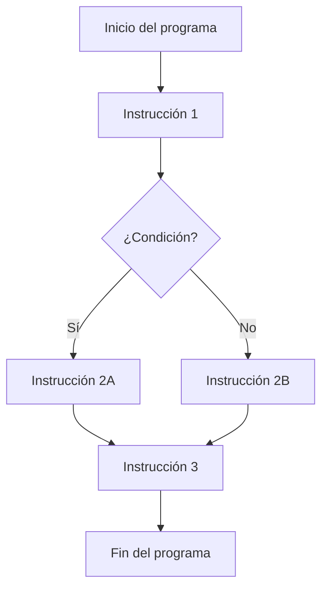
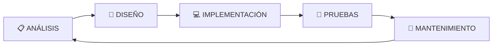
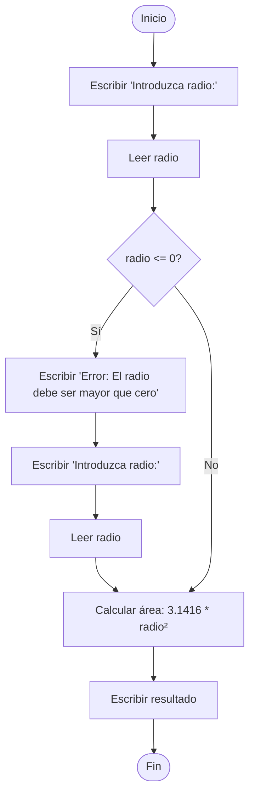
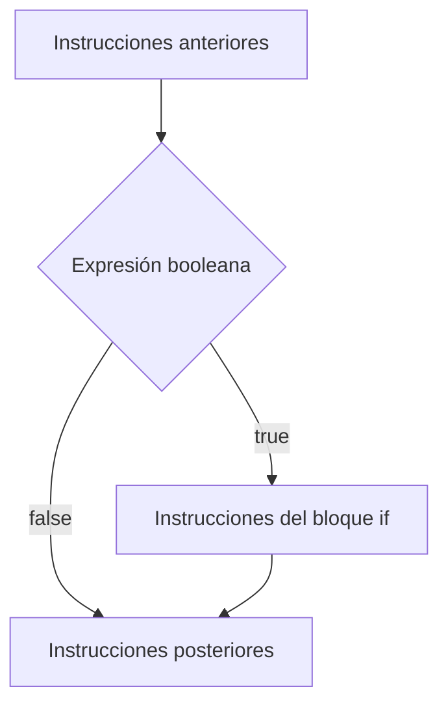
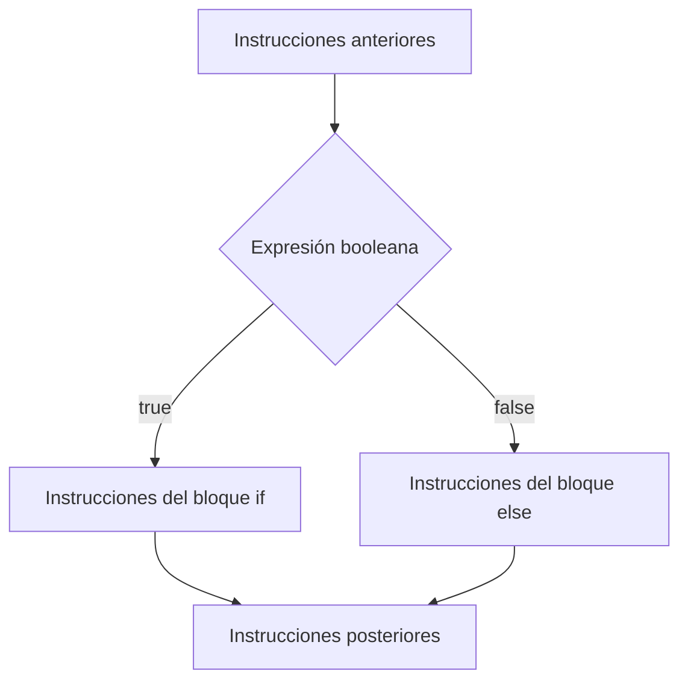
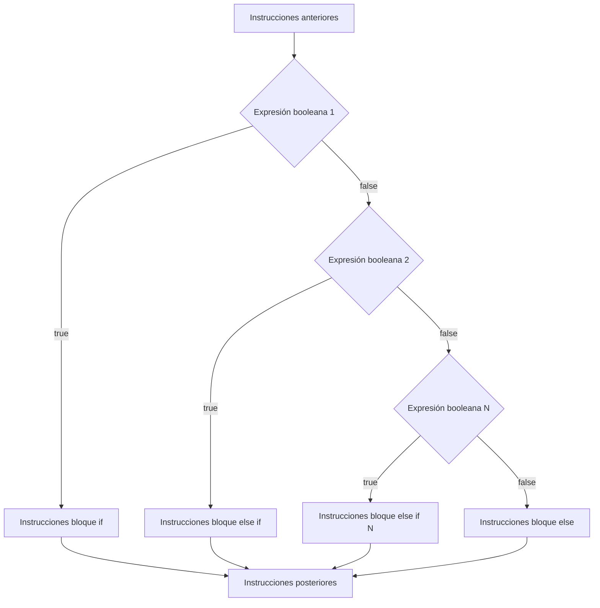
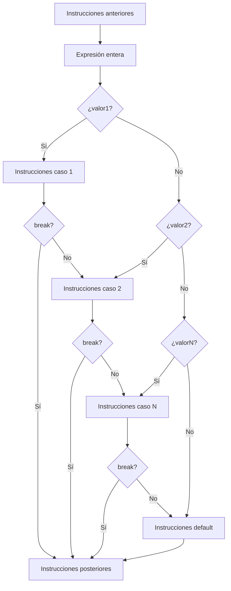
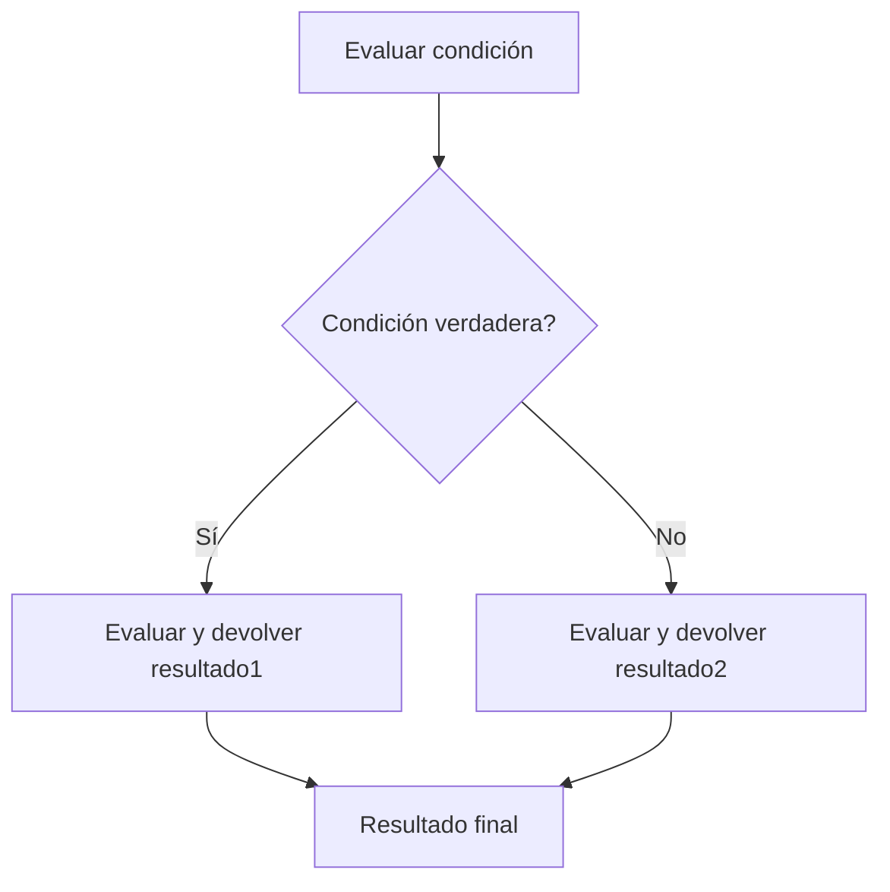

# UT2.1 Estructuras de selección

## 📋 Índice de contenidos

1. [Introducción](#1-introducción)
   1. [El proceso de desarrollo](#11-el-proceso-de-desarrollo)
   2. [Control del flujo de instrucciones](#12-control-del-flujo-de-instrucciones)
2. [Ciclo de vida del desarrollo](#2-ciclo-de-vida-del-desarrollo)
3. [Diseño de algoritmos](#3-diseño-de-algoritmos)
   1. [Metodología de programación estructurada](#31-metodología-de-programación-estructurada)
   2. [Ejemplo cotidiano: procesador de textos](#32-ejemplo-cotidiano-procesador-de-textos)
4. [Representación de algoritmos](#4-representación-de-algoritmos)
   1. [PSeInt: herramienta de aprendizaje](#41-pseint-herramienta-de-aprendizaje)
   2. [Ejemplo de pseudocódigo y diagrama de flujo](#42-ejemplo-de-pseudocódigo-y-diagrama-de-flujo)
5. [Implementación de un programa](#5-implementación-de-un-programa)
6. [Estructuras de selección](#6-estructuras-de-selección)
   1. [Selección simple (if)](#61-selección-simple-if)
   2. [Selección con camino alternativo (else)](#62-selección-con-camino-alternativo-else)
   3. [Selección anidada (else if)](#63-selección-anidada-else-if)
   4. [Estructura switch](#64-estructura-switch)
7. [Operador ternario (?:)](#7-operador-ternario-)
8. [Ámbito de variables (scope)](#8-ámbito-de-variables-scope)
9. [Prácticas propuestas](#9-prácticas-propuestas)

## 1. Introducción

### 1.1 El proceso de desarrollo

> [!WARNING]
> **Error habitual:** Empezar a programar directamente sin planificación.

El desarrollo de software **no** consiste solo en escribir código. Es imprescindible seguir un **proceso estructurado** que comienza con el análisis del problema y termina con el despliegue y mantenimiento de la aplicación. Este proceso se denomina **ciclo de vida del desarrollo**.

Antes de programar, debemos **esquematizar los pasos** a seguir para resolver el problema: eso es un **algoritmo**.

Muchos programadores noveles caen en el error de ponerse a escribir código directamente sin haber planificado previamente la solución. Esto lleva inevitablemente a problemas como:

- **Código desorganizado** y difícil de mantener
- **Errores lógicos** difíciles de detectar
- **Pérdida de tiempo** al tener que reescribir partes del programa
- **Dificultad para trabajar en equipo** debido a la falta de documentación

### 1.2 Control del flujo de instrucciones

Todo programa contiene una **secuencia de instrucciones no necesariamente lineal**. Los programas reales no ejecutan siempre las instrucciones de forma secuencial, sino que necesitan:

- **Tomar decisiones** en función de condiciones
- **Repetir acciones** un número determinado de veces
- **Saltar** a distintas partes del código según el contexto

Las **estructuras de control** permiten gestionar este flujo de información de manera organizada y previsible. Sin estas estructuras, sería imposible crear programas que respondan a diferentes situaciones o que procesen cantidades variables de datos.



## 2. Ciclo de vida del desarrollo

El **ciclo de vida** representa las fases por las que pasa el desarrollo de una aplicación, desde que se propone hasta que finaliza su construcción y mantenimiento:



### Fases del ciclo de vida

1. **📋 ANÁLISIS del problema**:  
   - Comprensión completa del problema a resolver
   - Identificación de requisitos funcionales y no funcionales
   - Definición de restricciones y limitaciones
   - Especificación de entradas y salidas esperadas

2. **🎯 DISEÑO del algoritmo**:  
   - Planificación de la estrategia de solución
   - Descomposición del problema en subproblemas más manejables
   - Definición de la estructura de datos necesaria
   - Creación de diagramas de flujo o pseudocódigo

3. **💻 IMPLEMENTACIÓN del programa**:  
   - Traducción del diseño a código fuente
   - Elección del lenguaje de programación adecuado
   - Aplicación de buenas prácticas de programación
   - Documentación del código

4. **🧪 Verificación y PRUEBAS**:  
   - Detección y corrección de errores
   - Validación del cumplimiento de requisitos
   - Pruebas con diferentes casos de uso
   - Optimización del rendimiento

5. **🚀 Puesta en marcha y MANTENIMIENTO**:  
   - Despliegue de la aplicación
   - Actualizaciones y mejoras
   - Corrección de errores detectados en producción
   - Adaptación a nuevos requisitos

> [!NOTE]
> Este ciclo es iterativo, es decir, podemos volver a fases anteriores para mejorar o corregir problemas detectados. Es común que durante las pruebas se detecten problemas que requieran volver al diseño o incluso al análisis.

## 3. Diseño de algoritmos

El diseño de algoritmos es una fase **clave** que determina el éxito del programa. En esta fase debemos:

- Establecer la **estrategia** a seguir
- Elegir una **metodología** de desarrollo adecuada
- Dividir la tarea en **subtareas manejables**
- Tener en cuenta los **recursos disponibles** (tiempo, memoria, procesamiento)

El **resultado final** es el **algoritmo propuesto**, que servirá como guía para la implementación.

Un buen diseño debe cumplir las siguientes características:

- **Claridad**: Debe ser fácil de entender y seguir
- **Eficiencia**: Debe hacer un uso óptimo de los recursos disponibles
- **Modularidad**: Debe estar dividido en partes bien definidas
- **Reutilización**: Las partes deben poder ser reutilizadas en otros contextos
- **Mantenibilidad**: Debe ser fácil de modificar y actualizar

### 3.1 Metodología de programación estructurada

La **programación estructurada** divide los pasos de resolución en tres bloques fundamentales:

- **🔄 Lineal o secuencial:** Instrucciones ejecutadas de forma secuencial, una tras otra.
- **🔀 Selección o condicional:** Se ejecutan instrucciones diferentes según una condición
- **🔁 Repetición o iterativa:** Se repiten instrucciones mientras se cumpla una condición

> [!TIP]
> Estas tres estructuras establecen el **flujo de control** del programa y son suficientes para resolver cualquier problema computacional. Este es uno de los teoremas fundamentales de la informática conocido como el **Teorema de la programación estructurada**.


### 3.2 Ejemplo cotidiano: procesador de textos

Para entender mejor estos conceptos, veamos ejemplos de un procesador de textos:

- **Proceso lineal**: Apertura de un archivo de texto (no se puede hacer nada hasta que termine)

  ```text
  1. El usuario hace clic en "Abrir archivo"
  2. Se muestra el diálogo de selección de archivos
  3. El usuario selecciona un archivo
  4. El sistema lee el archivo del disco
  5. Se muestra el contenido en la ventana del editor
  ```

- **Proceso selectivo**: Las diferentes opciones del menú (guardar, abrir, imprimir...)

  ```text
  SI el usuario elige "Guardar" ENTONCES
      ejecutar rutina de guardado
  SI NO, SI el usuario elige "Imprimir" ENTONCES
      ejecutar rutina de impresión
  SI NO
      mostrar mensaje de opción no válida
  ```

- **Proceso iterativo**: Imprimir varias copias de un mismo documento

  ```text
  PARA cada copia desde 1 hasta número_de_copias
      enviar documento a la impresora
      esperar confirmación de impresión
  FIN PARA
  ```

## 4. Representación de algoritmos

Existen varias formas de representar un algoritmo:

- **Pseudocódigo:** Lenguaje natural estructurado (usaremos PSeInt)
- **Diagramas de flujo:** Representación gráfica con símbolos
- **Código fuente:** Implementación directa en un lenguaje de programación

Cada forma de representación tiene sus ventajas:

| Método | Ventajas | Desventajas |
|--------|----------|-------------|
| **Pseudocódigo** | Fácil de escribir y modificar, no requiere conocimientos técnicos específicos | Puede ser ambiguo, no es ejecutable directamente |
| **Diagramas de flujo** | Muy visual, fácil de seguir el flujo, universal | Laborioso para algoritmos complejos, difícil de modificar |
| **Código fuente** | Directamente ejecutable, sin ambigüedades | Requiere conocimiento del lenguaje, menos legible para no programadores |

**Figuras para representar un diagrama de flujo u ordinograma:**


### 4.1 PSeInt: herramienta de aprendizaje

**PSeInt** es una aplicación gratuita para iniciarse en la programación. Permite escribir algoritmos en pseudocódigo y ejecutarlos para comprobar su funcionamiento.

**Características principales de PSeInt:**

- **Sintaxis sencilla**: Utiliza palabras en español para las estructuras de control
- **Ejecución paso a paso**: Permite ver cómo se ejecuta el algoritmo línea por línea
- **Detección de errores**: Identifica errores comunes en la lógica
- **Traducción a código**: Puede generar código en varios lenguajes de programación
- **Diagramas de flujo**: Genera automáticamente diagramas de flujo del algoritmo

> [!NOTE]
> Descarga PSeInt en: <http://pseint.sourceforge.net/index.php>

### 4.2 Ejemplo de pseudocódigo y diagrama de flujo

**Ejemplo:** Calcular el área de un círculo

**Pseudocódigo en PSeInt:**

```text
Algoritmo AreaCirculo
    Escribir 'Introduzca radio:'
    Leer radio
    Si radio <= 0 Entonces
        Escribir 'Error: El radio debe ser mayor que cero'
        Escribir 'Introduzca radio:'
        Leer radio
    SiNo
        Escribir 'El área del círculo de radio ', radio, ' es ', 3.1416 * radio^2
    FinSi
FinAlgoritmo
```

**Ordinograma equivalente:**



> [!TIP]
> Es muy recomendable probar el código directamente en PSeInt para entender mejor su funcionamiento.

**Análisis del algoritmo:**

1. **Entrada**: Se solicita al usuario que introduzca el radio del círculo
2. **Validación**: Se verifica que el radio sea mayor que cero (un radio negativo o cero no tiene sentido físico)
3. **Procesamiento**: Si el radio es válido, se calcula el área usando la fórmula A = π × r²
4. **Salida**: Se muestra el resultado al usuario de forma clara y comprensible

Este ejemplo ilustra la importancia de la **validación de datos**, un aspecto crucial en cualquier programa real. Siempre debemos considerar qué puede salir mal con los datos que introduce el usuario.

## 5. Implementación de un programa

La implementación consiste en **transformar el diseño a código fuente** en un lenguaje de programación concreto. Esta fase será:

- **Fácil:** Si el diseño previo es bueno
- **Compleja:** Si el diseño es insuficiente

> [!IMPORTANT]
> Un buen diseño hace que la implementación sea sencilla y directa.

Durante esta fase es **fundamental documentar** el código para facilitar su mantenimiento posterior.

## 6. Estructuras de selección

Las **estructuras de selección** permiten tomar decisiones sobre qué conjunto de instrucciones ejecutar en un punto concreto del programa. Se basan en una **expresión booleana** (condición lógica) y son esenciales para crear programas que respondan a diferentes situaciones.

Las estructuras de selección son fundamentales porque permiten que los programas sean **reactivos** y **adaptativos**. Sin ellas, todos los programas serían secuencias fijas de instrucciones que siempre harían lo mismo, independientemente de las circunstancias.


### 6.1 Selección simple (if)

Ejecuta un bloque de instrucciones solo si se cumple una condición:



**Sintaxis en PSeInt:**

```text
Algoritmo EstructuraSeleccion
    Si expresion_logica Entonces
        acciones_por_verdadero
    FinSi
FinAlgoritmo
```

**Sintaxis en Java:**

```java
if (expresion_booleana) {
    // Instrucciones si la expresión es true
}
// Resto de instrucciones
```

> [!WARNING]
> Aspectos importantes de la sintaxis en Java:

- La **condición lógica** debe estar siempre entre **paréntesis**
- **Después del paréntesis, no hay ningún ';'**
- Las instrucciones a ejecutar deben estar **englobadas entre llaves `{}`**, excepto cuando el bloque está formado por una sola línea (opcional, pero recomendable usar siempre las llaves)
- Es recomendable que las instrucciones de un bloque estén **tabuladas** para mejorar la legibilidad

**Ejemplo práctico:**

```java
public class EjemploSeleccionSimple {
    public static void main(String[] args) {
        int edad = 18;
        if (edad >= 18) {
            IO.println("Eres mayor de edad");
            IO.println("Puedes votar en las elecciones");
        }
        IO.println("Fin del programa");
    }
}
```

En este ejemplo, si la edad es 18 o mayor, se ejecutarán las dos instrucciones dentro del bloque `if`. Si la edad es menor que 18, esas instrucciones se saltan y el programa continúa directamente con "Fin del programa".

### 6.2 Selección con camino alternativo (else)

Esta estructura permite ejecutar un bloque de instrucciones cuando la condición es cierta y otro bloque diferente cuando es falsa:



**Sintaxis en PSeInt:**

```text
Algoritmo EstructuraSeleccion
    Si expresion_logica Entonces
        acciones_por_verdadero
    SiNo
        acciones_por_falso
    FinSi
FinAlgoritmo
```

**Sintaxis en Java:**

```java
if (expresion_booleana) {
    // Instrucciones si la expresión es true
} else {
    // Instrucciones si la expresión es false
}
```

**Ejemplo práctico:**

```java
public class EjemploSeleccionDoble {
    public static void main(String[] args) {
        int numero = -5;
        if (numero >= 0) {
            IO.println("El número es positivo o cero");
            IO.println("Valor absoluto: " + numero);
        } else {
            IO.println("El número es negativo");
            IO.println("Valor absoluto: " + (-numero));
        }
        IO.println("Análisis completado");
    }
}
```

La estructura `if-else` garantiza que siempre se ejecute exactamente uno de los dos bloques de código, nunca ambos ni ninguno.

### 6.3 Selección anidada (else if)

Permite evaluar varias condiciones de forma secuencial:



**Sintaxis en PSeInt:**

```text
Algoritmo EstructuraSeleccion
    Si expresion_logica1 Entonces
        acciones_por_verdadero1
    SiNo Si expresion_logica2 Entonces
        acciones_por_verdadero2
    SiNo
        acciones_por_falso
    FinSi
FinAlgoritmo
```

**Sintaxis en Java:**

```java
if (expresion_booleana_1) {
    // Instrucciones si la expresión 1 es true
} else if (expresion_booleana_2) {
    // Instrucciones si la expresión 2 es true
} else if (expresion_booleana_N) {
    // Instrucciones si la expresión N es true
} else {
    // Instrucciones si todas son false
}
```

**Ejemplo práctico con calificaciones:**

```java
public class CalificacionNotas {
    public static void main(String[] args) {
        double nota = 7.5;
        if (nota >= 9.0) {
            IO.println("Sobresaliente");
            IO.println("¡Excelente trabajo!");
        } else if (nota >= 7.0) {
            IO.println("Notable");
            IO.println("Muy buen trabajo");
        } else if (nota >= 5.0) {
            IO.println("Aprobado");
            IO.println("Has superado la materia");
        } else {
            IO.println("Suspenso");
            IO.println("Necesitas estudiar más");
        }
    }
}
```

> [!IMPORTANT]
> En una cadena `if`-`else if`-`else`, las condiciones se evalúan **en orden** y **solo se ejecuta el primer bloque** cuya condición sea verdadera. Una vez que se encuentra una condición verdadera, las demás ya no se evalúan.

### 6.4 Estructura switch

Estructura eficiente para evaluar una variable frente a múltiples valores constantes:



**Sintaxis en Java:**

```java
switch(expresion_entera) {
    case valor1:
        // instrucciones si expresión == valor1
        break;
    case valor2:
        // instrucciones si expresión == valor2
        break;
    // ...
    default:
        // instrucciones si ningún valor coincide
}
```

> [!IMPORTANT]
> Consideraciones para el uso de switch:

- **Se pueden agrupar casos** poniendo múltiples `case` seguidos
- **No olvides la sentencia `break`** al final de cada caso, si no quieres que continúe ejecutando el siguiente caso
- **Incluye siempre la sentencia `default`** para gestionar valores no previstos
- Un bloque `switch` **siempre tiene su equivalente** mediante bloques `if-else`
- Solo funciona con tipos de datos **enteros, char, String** (desde Java 7) y **enums**

**Ejemplo práctico con días de la semana:**

```java
public class DiasSemana {
    public static void main(String[] args) {
        int dia = 3;
        String nombreDia;
        
        switch (dia) {
            case 1:
                nombreDia = "Lunes";
                break;
            case 2:
                nombreDia = "Martes";
                break;
            case 3:
                nombreDia = "Miércoles";
                break;
            case 4:
                nombreDia = "Jueves";
                break;
            case 5:
                nombreDia = "Viernes";
                break;
            case 6:
                nombreDia = "Sábado";
                break;
            case 7:
                nombreDia = "Domingo";
                break;
            default:
                nombreDia = "Día no válido";
        }
        
        IO.println("El día " + dia + " corresponde a: " + nombreDia);
    }
}
```

**Ejemplo con casos agrupados:**

```java
public class CalificacionSwitch {
    public static void main(String[] args) {
        int nota = 5;
        switch (nota) {
            case 0: case 1: case 2:
                IO.println("Muy deficiente");
                break;
            case 3: case 4:
                IO.println("Insuficiente");
                break;
            case 5: case 6: case 7:
                IO.println("Bien");
                break;
            case 8: case 9: case 10:
                IO.println("Muy bien");
                break;
            default:
                IO.println("Nota incorrecta");
        }
    }
}
```

## 7. Operador ternario `?:`

El **operador ternario** de Java es una forma abreviada y expresiva de tomar decisiones condicionales. A diferencia de `if-else`, el operador ternario **es una expresión** (produce un valor), por lo que puede usarse directamente **dentro de otras expresiones**, asignaciones, o incluso como argumento de un método.

Su sintaxis general es:

```java
condicion ? valor_si_true : valor_si_false;
```

**Lectura**: "Si `condicion` es verdadera, el resultado es `valor_si_true`, si no, `valor_si_false`".


### Ejemplo básico

```java
int a = 5, b = 10;
IO.println((a > b) ? "a es mayor" : "b es mayor");
```

**Salida:**

```text
b es mayor
```

Aquí no se asigna el resultado a ninguna variable. El operador ternario simplemente produce un valor que `println` usa para mostrar por pantalla.

#### Equivalente con `if-else`:

```java
if (a > b) {
    IO.println("a es mayor");
} else {
    IO.println("b es mayor");
}
```

Como se puede ver, el operador ternario es más conciso para condiciones simples.

### Diagrama de flujo (Mermaid)



### Ejemplos prácticos

**Ejemplo 1: Elegir máximo entre dos valores:**

```java
int max = (a > b) ? a : b;
```

**Ejemplo 2: Usar dentro de un `println`:**

```java
IO.println((nota >= 5) ? "Aprobado" : "Suspenso");
```

**Ejemplo 3: Anidación de operadores ternarios:**

```java
int nota = 7;
String calificacion = (nota >= 9) ? "Excelente" :
                       (nota >= 7) ? "Notable" :
                       (nota >= 5) ? "Aprobado" : "Suspenso";
IO.println(calificacion);
```

> [!WARNING]
> Aunque posible, no abuses de la anidación ternaria: si se vuelve compleja, es mejor usar `if-else` para mayor claridad.

### Comparación entre ternario y estructura `if-else`

| Característica     | Operador ternario                         | `if-else` tradicional         |
| ------------------ | ----------------------------------------- | ----------------------------- |
| Forma              | Expresión                                 | Instrucción                   |
| Uso en expresiones | ✔ Puede estar dentro de otras expresiones | ❌ Solo en bloques de código   |
| Legibilidad        | ✔ Claro para casos simples                | ✔ Mejor para lógica compleja  |
| Concisión          | Muy conciso                               | Más detallado                 |
| Control de flujo   | No puede saltar bloques                   | Puede ejecutar varios bloques |

### Buenas prácticas

- ✅ Ideal para seleccionar entre dos valores.
- ❌ No usar para ejecutar acciones complejas.
- ✅ Muy útil en expresiones embebidas (como en `return`, `print`, etc).
- ❌ No usar si la lógica depende de múltiples condiciones anidadas complejas.

### Ejercicio propuesto

> Usando operador ternario, escribe una línea de código que imprima "Par" si un número es par e "Impar" si no lo es.

```java
int numero = 13;
IO.println((numero % 2 == 0) ? "Par" : "Impar");
```

> [!NOTE]
> El operador ternario no sustituye a `if-else` en todos los casos. Pero es una herramienta muy poderosa si se entiende bien su naturaleza **expresiva**.


## 8. Ámbito de variables (scope)

Cuando se definen varios bloques con llaves `{}`, cada variable declarada tiene un **ámbito** o *scope* definido. El ámbito determina dónde es visible y accesible una variable dentro del programa.

```java
public class AmbitVariables {
    static int a = 1; // Variable global - accesible desde todo el programa
    
    public static void main(String[] args) {
        int b = 2; // Variable local del método main
        IO.println(a + b); // ✅ Funciona correctamente
        
        { // Nuevo bloque de instrucciones
            int c = 3; // Variable local del bloque
            IO.println(a + b + c); // ✅ Funciona correctamente
        }
        
        IO.println(a + b + c); // ❌ ERROR: 'c' no existe aquí
    }
}
```

> [!WARNING]
> En el último `println`, la variable `c` no existe porque está fuera de su ámbito o "scope". Las variables solo existen dentro del bloque donde han sido declaradas.

## 9. Prácticas propuestas

### Práctica 1: Cálculo de descuento

**📝 Enunciado:**
Realiza el diseño con PSeInt del siguiente programa de cálculo de un descuento y después escríbelo en Java:

- El valor mínimo para optar a un descuento es de **100 €**
- El descuento será de un **10%**

**Pasos a seguir:**

1. Pide que se introduzca un precio en €
2. Lee el precio introducido
3. Comprueba que el precio introducido sea mayor o igual al valor mínimo para optar al descuento
4. En caso afirmativo, aplica el descuento al precio inicial
5. Muestra el precio final

<details>
<summary>💡 Solución en PSeInt</summary>

```pascal
Algoritmo calculpreu
    MINIMO <- 100
    DESCUENTO <- 10
    Escribir "Introduce el precio: "
    Leer precio
    Si precio >= MINIMO Entonces
        precio <- precio - (precio * DESCUENTO / 100)
    Fin Si
    Escribir "El precio final es de ", precio, " euros"
FinAlgoritmo
```

</details>
<details>
<summary>💻 Solución en Java</summary>

```java
public class CalculoPrecio {
    public static void main(String[] args) {
        final int MINIMO = 100;
        final int DESCUENTO = 10;

        String textoPrecio = IO.readln("Introduce el precio: ");
        float precio = Float.parseFloat(textoPrecio);

        if (precio >= MINIMO) {
            precio -= precio * DESCUENTO / 100;
        }

        System.out.printf("El precio final es de %.2f euros%n", precio);
    }
}
```

</details>

### Práctica 2: Descuento con penalización

**📝 Enunciado:**
Modifica el programa anterior (primero en PSeInt y después en Java) para que además de aplicar el descuento del 10% a los productos de 100€ o más, aplique también una **penalización de 2€** si el precio es menor a 30€.

<details>
<summary>💡 Solución conceptual</summary>

Necesitarás usar múltiples estructuras `if` para manejar las diferentes condiciones:

1. Si precio >= 100€ → aplicar descuento del 10%
2. Si precio < 30€ → aplicar penalización de 2€
3. En caso contrario → mantener el precio original

Piensa en el orden de evaluación de las condiciones y asegúrate de que no se apliquen ambas (descuento y penalización) al mismo tiempo.

</details>

### Práctica 3: Adivina el número

**📝 Enunciado:**
Realiza el diseño en PSeInt e implementación posterior en Java del siguiente programa "adivina el número":

1. El número secreto será el **241**
2. Pide un número por teclado
3. Lee el número
4. Comprueba si el número introducido es igual al número secreto
    - Si es igual, informa del acierto
    - Si no es igual, informa que se ha fallado  

<details>
<summary>💡 Solución en Java</summary>

```java
public class AdivinaNumero {
    public static void main(String[] args) {
        final int NUMERO_SECRETO = 241;

        String textoNumero = IO.readln("Introduce un número: ");
        int numeroUsuario = Integer.parseInt(textoNumero);

        if (numeroUsuario == NUMERO_SECRETO) {
            IO.println("¡Felicidades! Has acertado el número secreto.");
        } else {
            IO.println("Lo siento, no has acertado. El número secreto era " + NUMERO_SECRETO);
        }
    }
}
```

</details>

### Práctica 4: Calificación de notas

**📝 Enunciado:**
Diseña e implementa el siguiente programa de calificación:

1. Introducir una nota (0-10)
2. Leer la nota
3. Mostrar la calificación correspondiente:
    - Si es **mayor o igual que 9**: "Excelente"
    - Entre **6.5 (incluido) y 9**: "Notable"
    - Entre **5 (incluido) y 6.5**: "Aprobado"
    - En cualquier otro caso: "Suspenso"  

<details>
<summary>💻 Solución en Java</summary>

```java
public class CalificacionNotas {
    public static void main(String[] args) {
        String textoNota = IO.readln("Introduce una nota (0-10): ");
        double nota = Double.parseDouble(textoNota);

        if (nota < 0 || nota > 10) {
            IO.println("Error: La nota debe estar entre 0 y 10");
        } else if (nota >= 9.0) {
            IO.println("Excelente");
        } else if (nota >= 6.5) {
            IO.println("Notable");
        } else if (nota >= 5.0) {
            IO.println("Aprobado");
        } else {
            IO.println("Suspenso");
        }
    }
}
```

</details>

### Práctica 5: Sistema avanzado de descuentos

**📝 Enunciado:**
Diseña e implementa un sistema avanzado de descuentos con las siguientes especificaciones:

**Constantes a definir:**

- Valor mínimo para optar al descuento
- Porcentaje de descuento a aplicar
- Valor descontado máximo posible

**Funcionalidad:**

1. Pedir el precio inicial en euros
2. Leerlo
3. Comprobar si es positivo:
    - **En caso positivo:**
        - Verificar si el precio es >= al valor mínimo para el descuento
        - Calcular el descuento
        - Comprobar si el descuento supera el máximo permisible
        - Si es así, reducir el descuento al máximo permisible
        - Aplicar el descuento sobre el precio inicial
        - Mostrar el precio final
    - **Si el precio es negativo:** Mostrar un mensaje de error 

<details>
<summary>💻 Solución en Java</summary>

```java
public class SistemaDescuentos {
    public static void main(String[] args) {
        final double PRECIO_MINIMO_DESCUENTO = 100.0;
        final double PORCENTAJE_DESCUENTO = 15.0;
        final double DESCUENTO_MAXIMO = 50.0;

        String textoPrecio = IO.readln("Introduce el precio inicial en euros: ");
        double precio = Double.parseDouble(textoPrecio);
        double descuento = 0, precioFinal;

        if (precio < 0) {
            IO.println("Error: El precio no puede ser negativo");
        } else {
            if (precio >= PRECIO_MINIMO_DESCUENTO) {
                descuento = precio * PORCENTAJE_DESCUENTO / 100;

                if (descuento > DESCUENTO_MAXIMO) {
                    descuento = DESCUENTO_MAXIMO;
                    IO.println("Descuento limitado al máximo permitido: " + DESCUENTO_MAXIMO + "€");
                }

                precioFinal = precio - descuento;
                System.out.printf("Precio original: %.2f€%n", precio);
                System.out.printf("Descuento aplicado: %.2f€%n", descuento);
                System.out.printf("Precio final: %.2f€%n", precioFinal);
            } else {
                System.out.printf("No se aplica descuento. Precio mínimo requerido: %.2f€%n", PRECIO_MINIMO_DESCUENTO);
                System.out.printf("Precio final: %.2f€%n", precio);
            }
        }
    }
}
```

</details>

### Práctica 6: Calculadora con menú (switch)

**📝 Enunciado:**
Diseña e implementa una calculadora con menú utilizando la estructura `switch`:

1. Pide dos números enteros
2. Muestra un menú con 4 opciones:
    - **Opción 1:** Suma
    - **Opción 2:** Resta
    - **Opción 3:** Multiplicación
    - **Opción 4:** División
3. Lee la opción seleccionada
4. Realiza la operación correspondiente
5. Muestra el resultado por pantalla
6. Gestiona opciones incorrectas

> [!CAUTION]
> Recuerda gestionar la división por cero al implementar la opción de división.

<details>
<summary>💻 Solución en Java</summary>

```java
public class CalculadoraMenu {
    public static void main(String[] args) {
        String textoNum1 = IO.readln("Introduce el primer número entero: ");
        int numero1 = Integer.parseInt(textoNum1);

        String textoNum2 = IO.readln("Introduce el segundo número entero: ");
        int numero2 = Integer.parseInt(textoNum2);

        IO.println("\n=== CALCULADORA ===");
        IO.println("1. Suma");
        IO.println("2. Resta");
        IO.println("3. Multiplicación");
        IO.println("4. División");
        String textoOpcion = IO.readln("Selecciona una opción (1-4): ");
        int opcion = Integer.parseInt(textoOpcion);

        double resultado;
        switch (opcion) {
            case 1:
                resultado = numero1 + numero2;
                System.out.printf("%d + %d = %.0f%n", numero1, numero2, resultado);
                break;
            case 2:
                resultado = numero1 - numero2;
                System.out.printf("%d - %d = %.0f%n", numero1, numero2, resultado);
                break;
            case 3:
                resultado = numero1 * numero2;
                System.out.printf("%d x %d = %.0f%n", numero1, numero2, resultado);
                break;
            case 4:
                if (numero2 != 0) {
                    resultado = (double) numero1 / numero2;
                    System.out.printf("%d / %d = %.2f%n", numero1, numero2, resultado);
                } else {
                    IO.println("Error: No se puede dividir entre cero");
                }
                break;
            default:
                IO.println("Error: Opción no válida. Selecciona una opción entre 1 y 4");
        }
    }
}
```

</details>

<p align="center"> <em>📚 Fin del apartado UT2.1 - Estructuras de selección</em></p>

---
<small>© 2026 José Ramón Mas Davó. Todo el material docente original se distribuye bajo licencia [CC BY-NC-SA 4.0](https://creativecommons.org/licenses/by-nc-sa/4.0/). Para más detalles, consulta el archivo [`LICENSE`](../LICENSE) del repositorio.</small>
