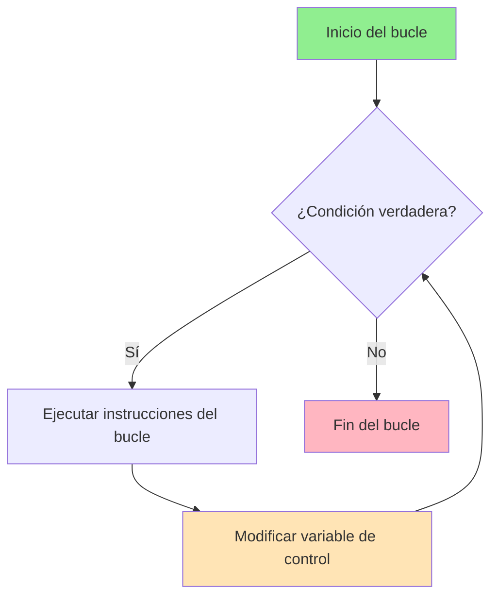
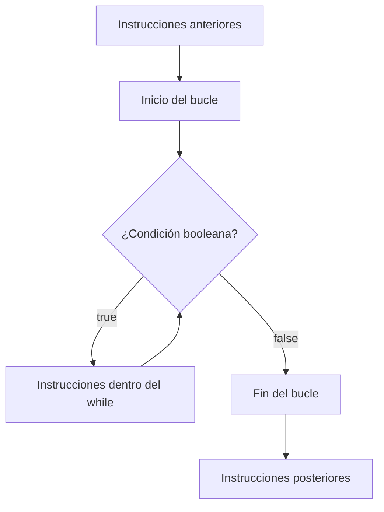
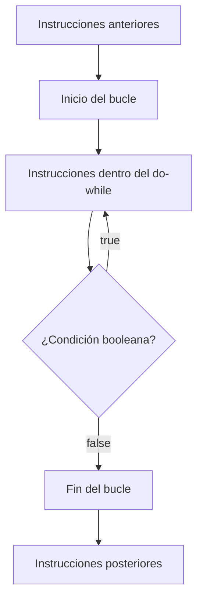
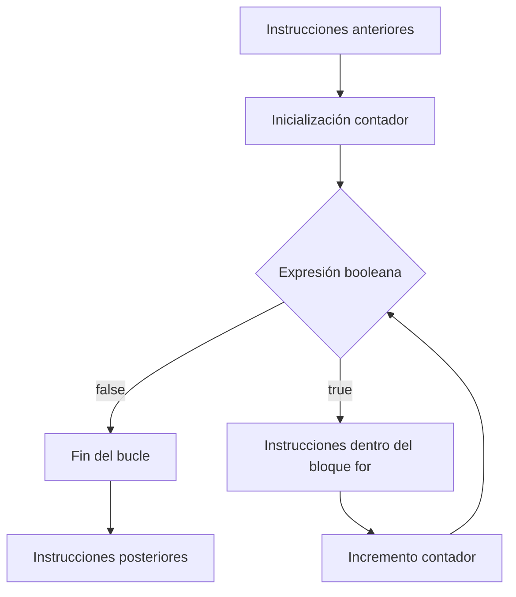
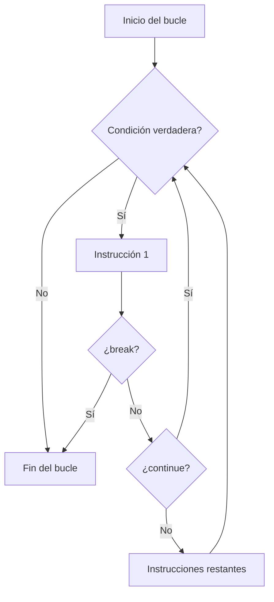

# UT2.3 Estructuras de Repetición

## 📋 Índice de contenidos

1. [Introducción a las estructuras de repetición](#1-introducci%C3%B3n-a-las-estructuras-de-repetici%C3%B3n)
2. [Control de estructuras iterativas](#2-control-de-estructuras-iterativas)
3. [Estructura iterativa while](#3-estructura-iterativa-while)
    1. [Sintaxis y diagrama de flujo](#31-sintaxis-y-diagrama-de-flujo)
    2. [Buenas prácticas con contadores](#32-buenas-pr%C3%A1cticas-con-contadores)
    3. [Práctica 8: Línea horizontal](#33-pr%C3%A1ctica-8-l%C3%ADnea-horizontal)
    4. [Práctica 9: Personalización y validación de entrada](#34-pr%C3%A1ctica-9-personalizaci%C3%B3n-y-validaci%C3%B3n-de-entrada)
    5. [Práctica 10: Tabla de multiplicar](#35-pr%C3%A1ctica-10-tabla-de-multiplicar)
    6. [Práctica 11: Suma de múltiplos de 3](#36-pr%C3%A1ctica-11-suma-de-m%C3%BAltiplos-de-3)
    7. [Práctica 12: Resto sin operador %](#37-pr%C3%A1ctica-12-resto-sin-operador-)
    8. [Práctica 13: Control mejorado de entrada](#38-pr%C3%A1ctica-13-control-mejorado-de-entrada)
4. [Estructura iterativa do-while](#4-estructura-iterativa-do-while)
    1. [Sintaxis y diagrama de flujo](#41-sintaxis-y-diagrama-de-flujo)
    2. [Práctica 14: Validación de entrada con do-while](#42-pr%C3%A1ctica-14-validaci%C3%B3n-de-entrada-con-do-while)
    3. [Práctica 15: Aplicación de validación a otros programas](#43-pr%C3%A1ctica-15-aplicaci%C3%B3n-de-validaci%C3%B3n-a-otros-programas)
5. [Estructura iterativa for](#5-estructura-iterativa-for)
    1. [Sintaxis y equivalencia con while](#51-sintaxis-y-equivalencia-con-while)
    2. [Práctica 16: Tabla de multiplicar con for](#52-pr%C3%A1ctica-16-tabla-de-multiplicar-con-for)
    3. [Práctica 17: Suma de múltiplos con for](#53-pr%C3%A1ctica-17-suma-de-m%C3%BAltiplos-con-for)
    4. [Práctica 18: Tabla personalizada](#54-pr%C3%A1ctica-18-tabla-personalizada)
6. [Sentencias break y continue](#6-sentencias-break-y-continue)
7. [Traza de variables](#7-traza-de-variables)
    1. [¿Qué es la traza de variables?](#71-qu%C3%A9-es-la-traza-de-variables)
    2. [Ejemplo y tabla de traza](#72-ejemplo-y-tabla-de-traza)
    3. [Consejos para realizar trazas](#73-consejos-para-realizar-trazas)

## 1. Introducción a las estructuras de repetición

Las **estructuras de repetición** (o bucles) permiten ejecutar una secuencia de instrucciones múltiples veces mientras se cumpla una condición. Son fundamentales para evitar la redundancia y procesar grandes cantidades de datos de forma eficiente.

### Conceptos fundamentales:

- **Bucle**: Conjunto de instrucciones que se han de repetir un cierto número de veces
- **Iteración**: Cada ejecución individual del bucle
- **Condición de parada**: Expresión booleana que determina cuándo debe acabar el bucle

> [!NOTE]
> Las estructuras de repetición nos permiten automatizar tareas que de otro modo requerirían escribir el mismo código decenas, cientos o incluso miles de veces. Sin ellas, sería prácticamente imposible crear programas que procesen listas de datos, realicen cálculos complejos o interactúen repetidamente con el usuario.

## 2. Control de estructuras iterativas

Para garantizar el correcto funcionamiento de los bucles, debemos **asegurar siempre que el bucle terminará**. En caso contrario, obtendremos un **bucle infinito** que puede bloquear el programa indefinidamente.

> [!CAUTION]
> Un bucle infinito puede hacer que tu programa se cuelgue y consuma todos los recursos del sistema.




### 2.1 Variables de control

Para evitar los bucles infinitos, utilizamos diferentes tipos de **variables de control** que nos permiten gestionar cuándo debe terminar el bucle.

### 2.2 Tipos de variables de control

#### 🔢 Contador

- **Definición**: Variable que incrementa o decrementa en cada iteración el mismo valor
- **Uso típico**: Controlar el número de iteraciones
- **Ejemplo**: `i++`, `contador = contador + 1`

```java
int contador = 0;
while (contador < 10) {
    System.out.println("Iteración: " + contador);
    contador++; // Incrementa el contador
}
```


#### 📊 Acumulador

- **Definición**: Variable que aumenta o disminuye en cada iteración un valor que puede ser igual o diferente
- **Uso típico**: Sumar valores, calcular totales
- **Ejemplo**: `suma = suma + valor`, `producto = producto * num`

```java
int suma = 0;
int i = 1;
while (i <= 5) {
    suma += i; // Acumula la suma de números del 1 al 5
    i++;
}
System.out.println("La suma es: " + suma); // Resultado: 15
```

#### 👁️ Centinela o semáforo

- **Definición**: Variable (normalmente booleana) que cambia su valor para permitir o prohibir la ejecución de iteraciones
- **Uso típico**: Controlar la entrada y salida del bucle basado en condiciones
- **Ejemplo**: `encontrado = true`, `continuar = false`

> [!WARNING]
> En muchos cursos y libros académicos aparece como "semáforo" aunque técnicamente es más correcto "centinela", ya que el concepto de "semáforo" se usa para temas de programación concurrente.

```java
boolean encontrado = false;
int numero = 0;
while (!encontrado && numero < 100) {
    if (numero % 7 == 0 && numero % 3 == 0) {
        encontrado = true; // Centinela que termina el bucle
    }
    numero++;
}
```

> [!WARNING]
> Siempre debes tener una estrategia clara para modificar la condición del bucle dentro de su ejecución, de lo contrario crearás un bucle infinito.

## 3. Estructura iterativa while

La estructura **while** ejecuta un bloque de instrucciones **mientras** se cumpla una condición booleana.

### 3.1 Sintaxis y diagrama de flujo

```java
while (condición_booleana) {
    // Instrucciones a ejecutar dentro del bucle
}
```



> [!IMPORTANT]
> Si la condición es falsa desde el principio, el bloque **no se ejecuta nunca**.

**Ejemplo básico:**

```java
public class EjemploWhile {
    public static void main(String[] args) {
        int contador = 0;
        
        while (contador < 5) {
            System.out.println("Contador: " + contador);
            contador++; // CRUCIAL: incrementar el contador
        }
        
        System.out.println("Bucle terminado. Contador final: " + contador);
    }
}
```

### 3.2 Buenas prácticas con contadores

- Los identificadores de los contadores suelen ser `i`, `j`, `k`, etc.
- Los contadores suelen empezar en **0** en vez de 1, siguiendo el estándar de programación.
- Es fundamental evitar bucles infinitos: asegúrate de que la condición de parada **puede cumplirse** y que el contador o la variable de control se modifica correctamente en cada iteración.

```java
// ✅ BIEN - Estilo recomendado
int i = 0;
while (i < 10) {
    System.out.println(i);
    i++;
}

// ⚠️ FUNCIONA pero no sigue convenciones
int contador = 1;
while (contador <= 10) {
    System.out.println(contador);
    contador++;
}
```


### 3.3 Práctica 8: Línea horizontal

**Enunciado:**

Escribe un programa que dibuje una línea horizontal creada a base del símbolo '_' y que ocupe 100 posiciones.

> [!NOTE]
> Es importante que realices estas prácticas, hagas pruebas y anotes cualquier problema para preguntar al profesor.

<details>
<summary>💻 Solución con while</summary>

```java
public class LineaHorizontal {
    public static void main(String[] args) {
        int i = 0;
        while (i < 100) {
            System.out.print("_");
            i++;
        }
        System.out.println(); // Salto de línea final
    }
}
```

</details>


### 3.4 Práctica 9: Personalización y validación de entrada

**Enunciado:**
Modifica el programa anterior para que:

- El número de barras bajas se pida por teclado (no como constante).
- Se verifique que la entrada es un número entero. Si no lo es, el programa termina.

<details>
<summary>💻 Solución</summary>

```java
import java.util.Scanner;
import java.util.InputMismatchException;

public class LineaPersonalizada {
    public static void main(String[] args) {
        Scanner scanner = new Scanner(System.in);
        
        try {
            System.out.print("Introduce el número de barras bajas: ");
            int longitud = scanner.nextInt();
            
            if (longitud <= 0) {
                System.out.println("El número debe ser positivo.");
                return;
            }
            
            int i = 0;
            while (i < longitud) {
                System.out.print("_");
                i++;
            }
            System.out.println();
            
        } catch (InputMismatchException e) {
            System.out.println("Error: No has introducido un número entero válido.");
        } finally {
            scanner.close();
        }
    }
}
```

</details>


### 3.5 Práctica 10: Tabla de multiplicar

**Enunciado:**

Realiza un programa que muestre la tabla de multiplicar de un número que se introducirá por teclado, respetando las recomendaciones indicadas anteriormente. Si no se introduce un valor entero, termina el programa.

<details>
<summary>💻 Solución</summary>

```java
import java.util.Scanner;
import java.util.InputMismatchException;

public class TablaMultiplicar {
    public static void main(String[] args) {
        Scanner scanner = new Scanner(System.in);
        
        try {
            System.out.print("Introduce un número para la tabla de multiplicar: ");
            int numero = scanner.nextInt();
            
            System.out.println("\nTabla de multiplicar del " + numero + ":");
            System.out.println("====================================");
            
            int i = 0;
            while (i <= 10) {
                int resultado = numero * i;
                System.out.printf("%d x %d = %d\n", numero, i, resultado);
                i++;
            }
            
        } catch (InputMismatchException e) {
            System.out.println("Error: No has introducido un número entero válido.");
        } finally {
            scanner.close();
        }
    }
}
```

</details>


### 3.6 Práctica 11: Suma de múltiplos de 3

**Enunciado:**
Crea un programa que permita sumar todos los valores enteros múltiples de 3, dentro de un intervalo entre 0 y un valor introducido por teclado.

Resuelve este programa de 2 maneras:

- Haciendo uso del operador %
- Sin hacer uso del operador %

Comprueba los datos de entrada. Si no son correctos, termina el programa.

<details>
<summary>💻 Solución 1: Con operador %</summary>

```java
import java.util.Scanner;

public class SumaMultiples3_Operador {
    public static void main(String[] args) {
        Scanner scanner = new Scanner(System.in);
        
        try {
            System.out.print("Introduce el valor máximo: ");
            int maximo = scanner.nextInt();
            
            if (maximo < 0) {
                System.out.println("El valor debe ser positivo.");
                return;
            }
            
            int suma = 0;
            int i = 0;
            
            while (i <= maximo) {
                if (i % 3 == 0) {
                    suma += i;
                    System.out.println("Múltiplo encontrado: " + i);
                }
                i++;
            }
            
            System.out.println("La suma de los múltiples de 3 entre 0 y " + maximo + " es: " + suma);
            
        } catch (Exception e) {
            System.out.println("Error en los datos de entrada.");
        } finally {
            scanner.close();
        }
    }
}
```

</details>
<details>
<summary>💻 Solución 2: Sin operador %</summary>

```java
import java.util.Scanner;

public class SumaMultiples3_SinOperador {
    public static void main(String[] args) {
        Scanner scanner = new Scanner(System.in);
        
        try {
            System.out.print("Introduce el valor máximo: ");
            int maximo = scanner.nextInt();
            
            if (maximo < 0) {
                System.out.println("El valor debe ser positivo.");
                return;
            }
            
            int suma = 0;
            int i = 0;
            
            while (i <= maximo) {
                suma += i;
                System.out.println("Múltiplo encontrado: " + i);
                i += 3; // Incrementamos de 3 en 3
            }
            
            System.out.println("La suma de los múltiples de 3 entre 0 y " + maximo + " es: " + suma);
            
        } catch (Exception e) {
            System.out.println("Error en los datos de entrada.");
        } finally {
            scanner.close();
        }
    }
}
```

</details>

### 3.7 Práctica 12: Resto sin operador %

**Enunciado:**
Realiza un programa que, dados dos números enteros, calcule el residuo de dividir uno por el otro sin hacer uso del operador %. Comprueba los datos de entrada. Si no son correctos, termina el programa.

<details>
<summary>💻 Solución</summary>

```java
import java.util.Scanner;

public class ResiduoSinOperador {
    public static void main(String[] args) {
        Scanner scanner = new Scanner(System.in);
        
        try {
            System.out.print("Introduce el dividendo: ");
            int dividendo = scanner.nextInt();
            
            System.out.print("Introduce el divisor: ");
            int divisor = scanner.nextInt();
            
            if (divisor == 0) {
                System.out.println("Error: No se puede dividir entre cero.");
                return;
            }
            
            // Trabajamos con valores absolutos para simplificar
            int dividendoAbs = Math.abs(dividendo);
            int divisorAbs = Math.abs(divisor);
            int residuo = dividendoAbs;
            
            // Sustracciones sucesivas
            while (residuo >= divisorAbs) {
                residuo -= divisorAbs;
            }
            
            // Ajustar el signo del residuo según las reglas matemáticas
            if (dividendo < 0 && residuo > 0) {
                residuo = divisorAbs - residuo;
            }
            
            System.out.println("El residuo de " + dividendo + " / " + divisor + " es: " + residuo);
            
        } catch (Exception e) {
            System.out.println("Error: Datos de entrada incorrectos.");
        } finally {
            scanner.close();
        }
    }
}
```

</details>


### 3.8 Práctica 13: Control mejorado de entrada

**Enunciado:**
Realiza un mejor control de los datos introducidos por teclado. En este caso, en lugar de terminar el programa, debe volver a preguntar por ese dato si se introduce erróneamente. Hazlo en un programa aparte, donde únicamente pida un entero y realice esta revisión hasta que el dato se introduzca correctamente.

<details>
<summary>💻 Solución</summary>

```java
import java.util.Scanner;

public class ControlEntradaMejorado {
    public static void main(String[] args) {
        Scanner scanner = new Scanner(System.in);
        int numero = 0;
        boolean datosValidos = false;
        
        while (!datosValidos) {
            System.out.print("Introduce un número entero: ");
            
            if (scanner.hasNextInt()) {
                numero = scanner.nextInt();
                datosValidos = true;
                System.out.println("✅ Número introducido correctamente: " + numero);
            } else {
                System.out.println("❌ Error: Debes introducir un número entero válido.");
                System.out.println("💡 Intenta de nuevo...");
                scanner.next(); // Consumir la entrada incorrecta
            }
        }
        
        scanner.close();
    }
}
```

</details>

## 4. Estructura iterativa do-while

La estructura **do-while** permite repetir la ejecución mientras se verifique una condición lógica, con la particularidad de que **como mínimo se ejecutará una vez** el bloque de instrucciones definido.

### 4.1 Sintaxis y diagrama de flujo

```java
do {
    // Instrucciones a ejecutar dentro del bucle
} while (condición_booleana);
```



> [!NOTE]
> La principal diferencia con `while` es que `do-while` **siempre ejecuta el bloque al menos una vez**, independientemente de la condición inicial.


#### Cuándo usar do-while

La estructura `do-while` es especialmente útil cuando:

- Necesitas ejecutar el código al menos una vez antes de evaluar la condición
- Estás pidiendo datos al usuario y quieres asegurar al menos una entrada
- Implementas menús interactivos
- Realizas validaciones donde el primer intento debe ejecutarse siempre

**Ejemplo práctico - Validación de entrada:**

```java
import java.util.Scanner;

public class ValidacionDoWhile {
    public static void main(String[] args) {
        Scanner scanner = new Scanner(System.in);
        int numero;
        
        do {
            System.out.print("Introduce un número entre 1 y 10: ");
            while (!scanner.hasNextInt()) {
                System.out.println("Error: Debes introducir un número entero.");
                System.out.print("Introduce un número entre 1 y 10: ");
                scanner.next();
            }
            numero = scanner.nextInt();
            
            if (numero < 1 || numero > 10) {
                System.out.println("El número debe estar entre 1 y 10.");
            }
            
        } while (numero < 1 || numero > 10);
        
        System.out.println("Número válido introducido: " + numero);
        scanner.close();
    }
}
```

### 4.2 Práctica 14: Validación de entrada con do-while

**Enunciado:**
Realiza un programa que verifique la entrada por teclado de un número entero entre 0 y 10. El programa debe pedir el dato en caso de que la entrada sea errónea (ya lo hiciste con while). Utiliza ahora una estructura iterativa "do-while" para hacer esta revisión.

<details>
<summary>💻 Solución</summary>

```java
import java.util.Scanner;

public class ValidacionDoWhile {
    public static void main(String[] args) {
        Scanner scanner = new Scanner(System.in);
        int numero;
        
        do {
            System.out.print("Introduce un número entre 0 y 10: ");
            
            // Validar que sea un entero
            while (!scanner.hasNextInt()) {
                System.out.println("❌ Error: Debes introducir un número entero.");
                scanner.nextLine();
                System.out.print("Introduce un número entre 0 y 10: ");
            }
            
            numero = scanner.nextInt();
            scanner.nextLine();
            
            if (numero < 0 || numero > 10) {
                System.out.println("❌ El número debe estar entre 0 y 10.");
            }
            
        } while (numero < 0 || numero > 10);
        
        System.out.println("✅ Número válido introducido: " + numero);
        scanner.close();
    }
}
```

</details>

<details>
<summary>💻 Solución corta</summary>

```java
import java.util.Scanner;

public class ValidacionCompacta {
    public static void main(String[] args) {
        Scanner scanner = new Scanner(System.in);
        int numero = -1;

        System.out.print("Introduce un número entre 0 y 10: ");
        while (!scanner.hasNextInt() || (numero = scanner.nextInt()) < 0 || numero > 10) {
            System.out.println("❌ Entrada no válida. Debe ser un número entero entre 0 y 10.");
            scanner.nextLine(); // limpiar buffer
            System.out.print("Introduce un número entre 0 y 10: ");
        }

        System.out.println("✅ Número válido introducido: " + numero);
        scanner.close();
    }
}
```

</details>


### 4.3 Práctica 15: Aplicación de validación a otros programas

**Enunciado:**
Aplica la misma manera de pedir un dato correcto a los programas creados anteriormente y que sea oportuno hacerlo. Por ejemplo, al pedir un precio.

<details>
<summary>💻 Solución</summary>

```java
import java.util.Scanner;

public class ValidacionPrecio {
    public static void main(String[] args) {
        Scanner scanner = new Scanner(System.in);
        double precio;
        
        do {
            System.out.print("Introduce un precio válido (mayor que 0): ");
            
            while (!scanner.hasNextDouble()) {
                System.out.println("❌ Error: Debes introducir un número decimal válido.");
                System.out.print("Introduce un precio válido (mayor que 0): ");
                scanner.next();
            }
            
            precio = scanner.nextDouble();
            
            if (precio <= 0) {
                System.out.println("❌ El precio debe ser mayor que cero.");
            }
            
        } while (precio <= 0);
        
        System.out.printf("✅ Precio válido introducido: %.2f€\n", precio);
        scanner.close();
    }
}
```

</details>

<details>
<summary>💻 Solución corta</summary>

```java
import java.util.Scanner;

public class ValidacionPrecioCompacta {
    public static void main(String[] args) {
        Scanner scanner = new Scanner(System.in);
        double precio = -1;

        System.out.print("Introduce un precio válido (mayor que 0): ");
        while (!scanner.hasNextDouble() || (precio = scanner.nextDouble()) <= 0) {
            System.out.println("❌ Entrada no válida. Debe ser un número mayor que cero.");
            scanner.nextLine(); // limpiar buffer
            System.out.print("Introduce un precio válido (mayor que 0): ");
        }

        System.out.printf("✅ Precio válido introducido: %.2f€\n", precio);
        scanner.close();
    }
}

```

</details>

## 5. Estructura iterativa for

La estructura **for** permite repetir un **número determinado de veces** un conjunto de instrucciones. Es especialmente útil cuando conocemos de antemano el número de iteraciones.

### 5.1 Sintaxis y equivalencia con while


```java
for (inicialización_contador; expresión_booleana; increment_contador) {
    // Instrucciones para ejecutar dentro del bucle
}
```


#### Partes del bucle for

1. **Inicialización de contador**: Inicializa una variable de tipo entero que servirá como contador
2. **Expresión booleana**: La condición lógica. Si es cierta se vuelve a repetir el cuerpo del bucle
3. **Incremento**: Instrucción que modifica el contador. Esta instrucción se ejecuta al final de cada iteración

> [!TIP]
> El incremento puede ser también negativo (decremento) para contar hacia atrás.

**Ejemplo básico:**

```java
public class EjemploFor {
    public static void main(String[] args) {
        // Imprimir números del 0 al 9
        for (int i = 0; i < 10; i++) {
            System.out.println("Número: " + i);
        }
        
        // Contar hacia atrás del 5 al 1
        for (int j = 5; j >= 1; j--) {
            System.out.println("Cuenta atrás: " + j);
        }
    }
}
```

#### Equivalencia con while

> [!IMPORTANT]
> Toda sentencia `for` tiene su equivalente mediante una sentencia `while`.

```java
// Bucle for
for (int i = 0; i < 10; i++) {
    System.out.println(i);
}

// Equivalente con while
int i = 0;              // Inicialización
while (i < 10) {        // Condición
    System.out.println(i);
    i++;                // Incremento
}
```

**Consideraciones adicionales:**

- El incremento/decremento del contador utiliza normalmente el operador unario (`++`) o (`--`)
- El resultado de esta operación es el mismo que incrementar/decrementar en una unidad el contador
- Se puede utilizar cualquier otra manera de incrementar un contador según las necesidades

### 5.2 Práctica 16: Tabla de multiplicar con for

**Enunciado:**
Adapta el programa de la tabla de multiplicar usando la sentencia `for`.

<details>
<summary>💻 Solución</summary>

```java
import java.util.Scanner;

public class TablaMultiplicarFor {
    public static void main(String[] args) {
        Scanner scanner = new Scanner(System.in);
        int numero;

        System.out.print("Introduce un número para la tabla de multiplicar: ");
        while (!scanner.hasNextInt()) {
            System.out.println("❌ Error: Debes introducir un número entero válido.");
            scanner.nextLine(); // Limpiar entrada inválida
            System.out.print("Introduce un número para la tabla de multiplicar: ");
        }

        numero = scanner.nextInt();
        scanner.nextLine();
        System.out.println("\nTabla de multiplicar del " + numero + ":");
        System.out.println("====================================");

        for (int i = 0; i <= 10; i++) {
            System.out.printf("%d x %d = %d\n", numero, i, numero * i);
        }

        scanner.close();
    }
}

```

</details>


### 5.3 Práctica 17: Suma de múltiplos con for

**Enunciado:**
Adapta el programa de la suma de múltiples de 3, haciendo uso de un bucle "for".

<details>
<summary>💻 Solución</summary>

```java
import java.util.Scanner;

public class SumaMultiples3For {
    public static void main(String[] args) {
        Scanner scanner = new Scanner(System.in);
        int maximo = -1;

        System.out.print("Introduce el valor máximo: ");
        while (!scanner.hasNextInt() || (maximo = scanner.nextInt()) < 0) {
            System.out.println("❌ Error: Introduce un número entero positivo.");
            scanner.nextLine(); // Limpiar entrada inválida
            System.out.print("Introduce el valor máximo: ");
        }

        int suma = 0;

        // Opción 1: Incrementando de 1 en 1
        for (int i = 0; i <= maximo; i++) {
            if (i % 3 == 0) {
                suma += i;
                System.out.println("Múltiplo encontrado: " + i);
            }
        }

        // Opción 2 (más eficiente):
        // for (int i = 0; i <= maximo; i += 3) {
        //     suma += i;
        //     System.out.println("Múltiplo encontrado: " + i);
        // }

        System.out.println("La suma de los múltiplos de 3 entre 0 y " + maximo + " es: " + suma);
        scanner.close();
    }
}

```

</details>


### 5.4 Práctica 18: Tabla personalizada

**Enunciado:**
Modifica la práctica 16. Esta vez, se preguntará al usuario el número máximo de la tabla de multiplicar a mostrar.

<details>
<summary>💻 Solución</summary>

```java
import java.util.Scanner;

public class TablaPersonalizada {
    public static void main(String[] args) {
        Scanner scanner = new Scanner(System.in);
        int numero, maximo;

        // Validar número entero cualquiera
        System.out.print("Introduce un número para la tabla de multiplicar: ");
        while (!scanner.hasNextInt()) {
            System.out.println("❌ Error: Debes introducir un número entero.");
            scanner.nextLine(); // Limpiar entrada inválida
            System.out.print("Introduce un número para la tabla de multiplicar: ");
        }
        numero = scanner.nextInt();
        scanner.nextLine();

        // Validar máximo (entero ≥ 1)
        System.out.print("Introduce el número máximo de la tabla (mínimo 1): ");
        while (!scanner.hasNextInt() || (maximo = scanner.nextInt()) < 1) {
            System.out.println("❌ Error: Debes introducir un número entero mayor o igual que 1.");
            scanner.nextLine(); // Limpiar entrada inválida
            System.out.print("Introduce el número máximo de la tabla (mínimo 1): ");
        }

        // Mostrar la tabla
        System.out.println("\nTabla de multiplicar del " + numero + " hasta " + maximo + ":");
        System.out.println("=".repeat(50));

        for (int i = 1; i <= maximo; i++) {
            System.out.printf("%d x %d = %d\n", numero, i, numero * i);
        }

        scanner.close();
    }
}

```

> [!NOTE]
> Estas prácticas te preparan para el siguiente apartado sobre pruebas y depuración. Dominar las estructuras de repetición es esencial para crear programas eficientes y robustos.

## 6. Sentencias break y continue

El lenguaje Java ofrece las sentencias especiales `break` y `continue` para alterar el flujo de ejecución dentro de un bucle. Aunque pueden ser útiles en situaciones muy concretas, **es recomendable evitarlas siempre que sea posible** para mantener la claridad y predictibilidad del código.

> [!WARNING]
> **Evitar abuso de `break` y `continue`:** aunque Java lo permite, se valora negativamente su uso cuando existen alternativas estructuradas más claras.

### `break`: salir del bucle

Interrumpe la ejecución del bucle actual y **salta directamente** a la instrucción posterior al bucle.

```java
for (int i = 0; i < 10; i++) {
    if (i == 5) {
        break; // Sale del bucle cuando i vale 5
    }
    System.out.println("i = " + i);
}
System.out.println("Fin del bucle");
```

**Salida:**

```text
i = 0
i = 1
i = 2
i = 3
i = 4
Fin del bucle
```

> [!NOTE]
> Es común ver `break` en bucles que **buscan un elemento** y quieren salir en cuanto lo encuentran. Pero este comportamiento también se puede implementar mediante una condición de bucle adecuada.

### `continue`: saltar a la siguiente iteración

Hace que se **salte el resto del código dentro del bucle** y se pase directamente a la siguiente iteración.

```java
for (int i = 1; i <= 5; i++) {
    if (i % 2 == 0) {
        continue; // Saltar los pares
    }
    System.out.println("Número impar: " + i);
}
```

**Salida:**

```text
Número impar: 1
Número impar: 3
Número impar: 5
```

> [!TIP]
> En muchos casos, lo que se hace con `continue` se puede reescribir simplemente reorganizando el código del bucle, por ejemplo usando `if` con bloques bien estructurados.

### Diagrama resumen (Mermaid)



---

### Buenas prácticas y recomendaciones

| Situación                                 | Recomendación                                     |
| ----------------------------------------- | ------------------------------------------------- |
| Uso puntual y justificado de `break`      | ✔ Aceptable (ej. salida por condición encontrada) |
| Uso habitual y múltiple en un mismo bucle | ❌ Desaconsejado                                   |
| Uso de `continue` para saltar condiciones | ❌ Reestructurar mejor con `if-else`               |
| Claridad del flujo del programa           | ✔ Prioridad absoluta                              |

### Ejemplo sin `break`

```java
final int VALOR_BUSCADO = 7;
boolean encontrado = false;
int i = 0;
while (i < 10 && !encontrado) {
    if (i == VALOR_BUSCADO) {
        encontrado = true;
    } else {
        System.out.println("i = " + i);
    }
    i++;
}
```

o incluso

```java
final int VALOR_BUSCADO = 7;
boolean encontrado = false;
int i = 0;
while (i < 10 && i != VALOR_BUSCADO) {
    System.out.println("i = " + i);
    i++;
}
```

Ambas versiones evitan el uso de `break` y hacen que el flujo de ejecución sea más claro y explícito. Siempre que puedas expresar la lógica usando condiciones en el `while`, es preferible a interrumpir el bucle de forma abrupta.

### En resumen

- `break` y `continue` **no son errores**, pero **se deben usar con criterio**.
- Se valora positivamente el uso de **estructuras legibles**.
- Usa `break` solo si está **muy justificado** y mejora la claridad.
- Evita `continue` y opta por `if` correctamente estructurados.

> [!IMPORTANT]
> Piensa siempre en quien leerá tu código. A veces una solución más larga pero más clara es mejor que una más corta pero confusa.

## 7. Traza de variables

### 7.1 ¿Qué es la traza de variables?

En programación, **realizar la traza de una variable** se refiere a hacer un seguimiento desde su declaración hasta su eliminación de memoria, de los valores que va adquiriendo en cada momento.

La traza de variables es una técnica de **depuración manual** que consiste en:

- **Seguir paso a paso** la ejecución del programa
- **Anotar los valores** de las variables en cada momento
- **Identificar errores** en la lógica del programa
- **Comprender el comportamiento** de las estructuras de repetición

> [!IMPORTANT]
> A partir de ahora, cuando utilices estructuras repetitivas y no obtengas el resultado que esperabas, tendrás que crear trazas de variables para observar el funcionamiento paso a paso del programa. Más adelante hablaremos de la depuración con herramientas automáticas.

### 7.2 Ejemplo y tabla de traza

Consideremos este código:

```java
int suma = 0;
for (int i = 1; i <= 3; i++) {
    suma += i * 2;
    System.out.println("i=" + i + ", suma=" + suma);
}
```

**Tabla de traza:**

| Iteración | i | suma antes | operación | suma después | salida |
| :-- | :-- | :-- | :-- | :-- | :-- |
| 1 | 1 | 0 | 0 + (1*2) | 2 | i=1, suma=2 |
| 2 | 2 | 2 | 2 + (2*2) | 6 | i=2, suma=6 |
| 3 | 3 | 6 | 6 + (3*2) | 12 | i=3, suma=12 |

### 7.3 Consejos para realizar trazas

1. **Sé sistemático**: anota todos los cambios de variables.
2. **Utiliza tablas**: organiza la información de forma clara.
3. **Marca las iteraciones**: numera cada vuelta del bucle.
4. **Verifica condiciones**: comprueba cuándo cambian las condiciones booleanas.
5. **Identifica patrones**: busca comportamientos repetitivos o inesperados.

> [!TIP]
> La traza manual es especialmente útil antes de aprender a usar depuradores automáticos. Más adelante se estudiarán herramientas específicas para depuración.

<p align="center">📚 <em>Fin del apartado UT2.3 - Estructuras de repetición</em></p>

