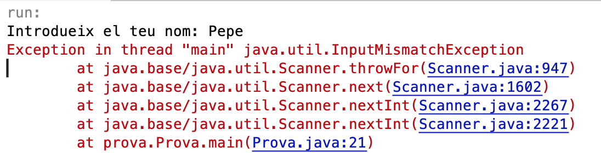
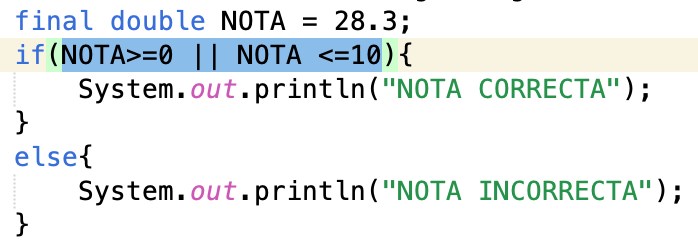
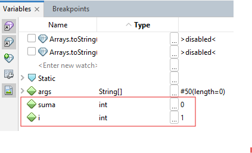
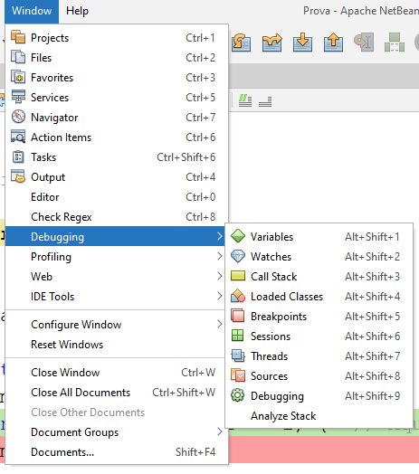

# UT2.4 Pruebas y Depuración

## 📋 Índice de contenidos

1. [Introducción a las pruebas y la depuración](#1-introducci%C3%B3n-a-las-pruebas-y-la-depuraci%C3%B3n)
2. [¿Qué es la depuración?](#2-qu%C3%A9-es-la-depuraci%C3%B3n)
3. [¿Qué es el testing?](#3-qu%C3%A9-es-el-testing)
4. [Diferencias y relación entre pruebas y depuración](#4-diferencias-y-relaci%C3%B3n-entre-pruebas-y-depuraci%C3%B3n)
5. [El proceso de depuración paso a paso](#5-el-proceso-de-depuraci%C3%B3n-paso-a-paso)
6. [Herramientas de depuración en NetBeans](#6-herramientas-de-depuraci%C3%B3n-en-netbeans)
    1. [Identificación del error](#61-identificaci%C3%B3n-del-error)
    2. [Análisis de código](#62-an%C3%A1lisis-de-c%C3%B3digo)
    3. [Uso de breakpoints](#63-uso-de-breakpoints)
    4. [Inspección de variables](#64-inspecci%C3%B3n-de-variables)
    5. [Ejecución paso a paso](#65-ejecuci%C3%B3n-paso-a-paso)
    6. [Otras herramientas útiles](#66-otras-herramientas-%C3%BAtiles)
7. [Documentación y registro de la depuración](#7-documentaci%C3%B3n-y-registro-de-la-depuraci%C3%B3n)
8. [Buenas prácticas en depuración](#8-buenas-pr%C3%A1cticas-en-depuraci%C3%B3n)
9. [Ejemplo práctico de depuración](#9-ejemplo-pr%C3%A1ctico-de-depuraci%C3%B3n)
10. [Prácticas propuestas](#10-pr%C3%A1cticas-propuestas)

## 1. Introducción a las pruebas y la depuración

### 1.1 Pruebas (Testing)

Las **pruebas** (*testing*) son fundamentales para asegurar que el software cumple con las especificaciones y funciona correctamente en diferentes situaciones.

**Objetivos de las pruebas:**

- **Verificación del cumplimiento** de requisitos funcionales
- **Validación del comportamiento** en diferentes escenarios
- **Detección proactiva** de posibles errores antes del despliegue
- **Garantía de calidad** antes de la entrega al usuario final

**Tipos de pruebas:**


| Tipo de prueba | Descripción | Ejemplo |
| :-- | :-- | :-- |
| **Unitarias** | Prueban componentes individuales | Probar una función específica |
| **Integración** | Prueban la interacción entre módulos | Comunicación entre clases |
| **Sistema** | Prueban el sistema completo | Funcionamiento global |
| **Aceptación** | Validan requisitos del usuario | Casos de uso reales |

> [!NOTE]
> La parte de testing se trabajará con más detalle en el módulo profesional de **Entornos de Desarrollo**.

### 1.2 Depuración (Debugging)

La **depuración** (*debugging*) se centra en identificar, analizar y corregir errores en el código. En el módulo profesional de **Programación**, nos enfocaremos específicamente en la depuración.

**Características de la depuración:**

- **🔍 Identificación**: Localizar dónde se produce el error
- **🧪 Análisis**: Comprender la causa raíz del problema
- **🔧 Resolución**: Implementar la solución adecuada
- **✅ Verificación**: Confirmar que el error se ha corregido sin crear nuevos

> [!IMPORTANT]
> Este proceso es crucial para garantizar la calidad del código y el correcto funcionamiento del software desarrollado.

## 2. ¿Qué es la depuración?

La **depuración** es el proceso sistemático de encontrar, aislar y resolver errores de codificación (bugs) en un programa. Su objetivo es garantizar que el software funcione correctamente y cumpla con las especificaciones establecidas.

**🎯 Objetivo principal:**
Asegurar que el programa funcione correctamente según las especificaciones establecidas.

**🛠️ Herramientas necesarias:**
Los **IDE** (Entornos de Desarrollo Integrados) disponen de potentes herramientas de depuración que facilitan este proceso.

**📊 Tipos de errores comunes:**


| Tipo de error | Descripción | Ejemplo |
| :-- | :-- | :-- |
| **Sintaxis** | Violación de reglas del lenguaje | `System.ou.println()` (falta 't') |
| **Lógico** | Error en la lógica del programa | Condición incorrecta en `if` |
| **Ejecución** | Error durante la ejecución | División por cero |
| **Semántico** | Código sintácticamente correcto pero incorrecto conceptualmente | Usar `=` en lugar de `==` |

> [!WARNING]
> Un programa que compila correctamente no garantiza que funcione como se espera. Los errores lógicos pueden ser los más difíciles de detectar.

La depuración ayuda a:

- Descubrir la causa raíz de los errores.
- Mejorar la estabilidad y fiabilidad del software.
- Optimizar el rendimiento y la experiencia de usuario.


## 3. ¿Qué es el testing?

El **testing** consiste en ejecutar el programa en diferentes situaciones para comprobar que cumple los requisitos y funciona correctamente. Permite identificar defectos, tanto en condiciones normales como anómalas, y desencadena el proceso de depuración cuando se detectan fallos.

- **Testing dinámico**: ejecuta el código y comprueba su comportamiento.
- **Testing estático**: analiza el código sin ejecutarlo (por ejemplo, revisiones de código o análisis estático).

> [!TIP]
> El testing descubre defectos, la depuración los elimina.

## 4. Diferencias y relación entre pruebas y depuración

| Aspecto | Testing (Pruebas) | Depuración (Debugging) |
| :-- | :-- | :-- |
| Objetivo | Descubrir defectos | Eliminar defectos |
| Método | Ejecutar y analizar resultados | Analizar y corregir código |
| Resultado | Informe de fallos | Corrección de errores |
| Relación | Detecta el fallo | Encuentra y soluciona la causa |

- El testing **provoca** la aparición de errores.
- La depuración **analiza** y **corrige** esos errores.


## 5. El proceso de depuración paso a paso

La depuración suele seguir una serie de pasos estructurados:

1. **Reproducir el error**: Ejecutar el programa en las condiciones que provocan el fallo.
2. **Identificar el error**: Localizar el punto exacto donde ocurre el problema.
3. **Determinar la causa raíz**: Analizar el código y los datos para entender por qué ocurre el error.
4. **Corregir el error**: Modificar el código para solucionar el problema.
5. **Probar la corrección**: Ejecutar el programa de nuevo para asegurarse de que el error ha desaparecido y no se han introducido nuevos fallos.
6. **Documentar el proceso**: Registrar el error, la causa, la solución y las pruebas realizadas.

> [!TIP]
> Al depurar, adopta una mentalidad "saboteadora": desconfía de los resultados y busca activamente posibles errores.

## 6. Herramientas de depuración en NetBeans

Los entornos de desarrollo integrados (IDE) como **NetBeans** ofrecen potentes herramientas para facilitar la depuración del código Java:

### 6.1 Identificación del error



El primer paso en cualquier proceso de depuración es la **identificación clara del error**. NetBeans facilita esta tarea mediante varios mecanismos:

**🚨 Consola de errores:**

- Analiza los mensajes de error mostrados en la consola de NetBeans
- Los mensajes incluyen información sobre el tipo y ubicación del problema
- Proporciona trazas de pila (*stack traces*) con la secuencia de llamadas

**🎨 Indicadores visuales:**

- El IDE marca con colores y símbolos las líneas problemáticas
- Subrayado rojo para errores de sintaxis
- Iconos de advertencia para problemas potenciales

**📝 Tipos de mensajes:**

```java
// Ejemplo de código con error
public class EjemploError {
    public static void main(String[] args) {
        int numero = 10;
        int divisor = 0;
        int resultado = numero / divisor; // ¡Error de ejecución!
        System.out.println(resultado);
    }
}
```

**Mensaje en consola:**

```
Exception in thread "main" java.lang.ArithmeticException: / by zero
    at EjemploError.main(EjemploError.java:5)
```

> [!TIP]
> Lee siempre los mensajes de error completamente, ya que a menudo contienen información valiosa sobre la causa del problema.

### 6.2 Análisis de código



Una vez identificado el error, es necesario realizar un **análisis exhaustivo del código**. Este proceso incluye:

**🔍 Revisión de la lógica:**

- Asegurar que el código Java sigue los flujos esperados
- Verificar que los algoritmos implementados son correctos
- Comprobar que las operaciones se realizan en el orden adecuado

**✅ Verificación de condiciones:**

- Comprobar que las estructuras condicionales (`if`, `else`, `switch`) funcionan correctamente
- Validar que las expresiones booleanas evalúan como se espera
- Verificar los rangos de valores en las comparaciones

**🔄 Análisis de bucles:**

- Revisar bucles (`for`, `while`, `do-while`) para evitar bucles infinitos
- Comprobar las condiciones de entrada y salida
- Verificar que las variables de control se modifican correctamente

**📊 Validación de tipos de datos:**

- Confirmar que las variables tienen los tipos adecuados
- Verificar conversiones de tipos implícitas y explícitas
- Comprobar que los rangos de valores son apropiados

**🔐 Comprobación de permisos y ámbito:**

- Verificar que las variables y métodos son accesibles desde el punto donde se utilizan
- Comprobar el ámbito (*scope*) de las variables
- Validar los modificadores de acceso (`public`, `private`, `protected`)


### 6.3 Uso de breakpoints


Los **breakpoints** (puntos de ruptura) permiten pausar la ejecución del programa en una línea específica para analizar el estado del programa en ese momento.

**🎯 Propósito de los breakpoints:**

- Analizar el estado del programa en un punto específico
- Examinar valores de variables en tiempo de ejecución
- Verificar el flujo de ejecución paso a paso
- Identificar dónde se producen comportamientos inesperados

**Cómo colocar un breakpoint en NetBeans:**

1. Haz clic en la línea de código deseada y selecciona "Toggle Line Breakpoint" o pulsa `Ctrl+F8`.
2. Ejecuta el programa en modo depuración (`Ctrl+Shift+F5` o el icono de depurar).


Cuando el programa se detiene en un breakpoint, puedes examinar el valor de las variables y el flujo de ejecución.

**Ejemplo práctico:**

```java
public class DepuracionEjemplo {
    public static void main(String[] args) {
        int suma = 0;
        for (int i = 1; i <= 5; i++) {  // ← Breakpoint aquí
            suma += i;
            System.out.println("i = " + i + ", suma = " + suma);  // ← Y aquí
        }
        System.out.println("Suma final: " + suma);
    }
}
```

> [!NOTE]
> Cuando el programa se ejecuta en **modo de depuración**, se pausa automáticamente en cada breakpoint configurado, permitiendo examinar el estado del programa.

**Tipos de breakpoints:**


| Tipo | Descripción | Cuándo usar |
| :-- | :-- | :-- |
| **Línea** | Se para al llegar a una línea específica | Para examinar el flujo básico |
| **Condicional** | Se para solo si se cumple una condición | Para casos específicos |
| **Método** | Se para al entrar o salir de un método | Para analizar llamadas a funciones |
| **Excepción** | Se para cuando se lanza una excepción | Para capturar errores específicos |

### 6.4 Inspección de variables




Durante la ejecución en modo depuración, NetBeans ofrece potentes herramientas para la **inspección de variables**:

#### 📋 Ventana "Variables"

**Características:**

- Muestra los valores actuales de todas las variables en el ámbito actual
- Permite expandir objetos complejos para ver sus propiedades
- Se actualiza automáticamente los valores a medida que se ejecuta el código
- Organiza las variables por ámbito (local, parámetros, campos de clase)

**Información mostrada:**

- **Nombre** de la variable
- **Tipo** de dato
- **Valor** actual
- **Ámbito** donde está definida


#### 👁️ Ventana "Watches"

**Funcionalidades:**

- Permite añadir expresiones específicas para monitorizar durante la ejecución
- Útil para seguir el valor de cálculos complejos o propiedades de objetos
- Se puede configurar para evaluar expresiones personalizadas
- Mantiene las expresiones entre sesiones de depuración

**Ejemplos de expresiones útiles:**

```java
// Variables simples
numero
contador

// Propiedades de objetos
persona.nombre
lista.size()

// Expresiones calculadas
suma / contador
array[indice]
Math.max(a, b)
```

> [!TIP]
> Utiliza la ventana "Watches" para monitorizar expresiones complejas como `array.length` o `object.getProperty()`.

**Ejemplo de inspección de variables:**

```java
public class EjemploInspeccion {
    public static void main(String[] args) {
        int[] numeros = {1, 2, 3, 4, 5};
        int suma = 0;
        
        for (int i = 0; i < numeros.length; i++) {  // ← Breakpoint
            suma += numeros[i];
            // En este punto podemos inspeccionar:
            // - i (valor del contador)
            // - numeros[i] (elemento actual)
            // - suma (suma acumulativa)
            // - numeros.length (longitud del array)
        }
        
        double promedio = (double) suma / numeros.length;  // ← Breakpoint
        System.out.println("Promedio: " + promedio);
    }
}
```

### 6.5 Ejecución paso a paso

La **ejecución paso a paso** (*Step-by-Step Execution*) permite a los desarrolladores ejecutar el código una línea a la vez, facilitando la comprensión del flujo de ejecución y la identificación exacta de dónde se producen los errores.

#### Tipos de ejecución paso a paso:

**🔍 Step Into (F7) **

**Comportamiento:**

- Executa la línea de código actual
- Si la línea contiene una llamada a una función o método, **entra dentro** de esa función
- Permite ver la ejecución detallada dentro del método llamado

**Cuándo usar:**

- Para depurar funciones propias donde sospechas que hay un error
- Cuando necesitas entender cómo funciona un método específico
- Para verificar el paso de parámetros entre métodos

```java
public class StepIntoEjemplo {
    public static void main(String[] args) {
        int a = 5, b = 3;
        int resultado = calcularSuma(a, b);  // ← Step Into aquí entrará en calcularSuma()
        System.out.println(resultado);
    }
    
    public static int calcularSuma(int x, int y) {
        return x + y;  // ← Veremos la ejecución de esta línea
    }
}
```

**🔄 Step Over (F8) **

**Comportamiento:**

- Ejecuta la línea de código actual
- Si la línea contiene una llamada a una función, la ejecuta completamente **sin entrar**
- Útil para avanzar rápidamente cuando no necesitamos ver la ejecución interna

**Cuándo usar:**

- Para funciones de sistema o librerías externas
- Cuando sabemos que un método funciona correctamente
- Para avanzar rápidamente por código conocido

```java
public class StepOverEjemplo {
    public static void main(String[] args) {
        String texto = "Hola Mundo";
        int longitud = texto.length();  // ← Step Over ejecutará length() sin entrar
        System.out.println(longitud);   // ← Continuará aquí directamente
    }
}
```

**⚡ Step Over Expression (Shift+F8) **

**Comportamiento:**

- Ejecuta la siguiente expresión dentro de la línea actual
- Útil cuando quieres ver la ejecución paso a paso de una línea con múltiples expresiones
- Permite analizar operaciones complejas parte por parte

**Ejemplo:**

```java
public class StepOverExpressionEjemplo {
    public static void main(String[] args) {
        int a = 5, b = 3, c = 2;
        // Esta línea tiene múltiples expresiones
        int resultado = (a + b) * c - Math.max(a, b);
        //              ^^^^^   ^^^   ^^^^^^^^^^^^^
        //               1      2         3
        // Step Over Expression ejecutará cada parte por separado
    }
}
```

**📤 Step Out (Shift+F7) **

**Comportamiento:**

- Continúa la ejecución hasta que se sale del método actual
- Útil cuando ya estás dentro de un método y quieres volver al método que lo llamó
- Ejecuta el resto del método actual y se para en la línea siguiente de quien lo llamó

**Cuándo usar:**

- Cuando has verificado que un método funciona correctamente
- Para salir rápidamente de métodos largos
- Cuando accidentalmente entraste en un método con Step Into

**Continue (F5) **

**Comportamiento:**

- Continúa la ejecución del programa hasta el siguiente breakpoint o hasta que termine
- Útil cuando has identificado y corregido errores
- Permite verificar si el programa funciona correctamente más allá del punto de inspección

**Run to Cursor (F4) **

**Comportamiento:**

- Permite ejecutar el programa hasta la línea donde se encuentra el cursor
- Muy útil para saltar rápidamente a una parte específica del código
- Evita tener que configurar breakpoints manuales temporales

**Ejemplo práctico de uso:**

```java
public class EjemploPasoAPaso {
    public static void main(String[] args) {
        int[] numeros = {1, 2, 3, 4, 5};
        int suma = calcularSuma(numeros);  // ← Breakpoint inicial
        double promedio = calcularPromedio(suma, numeros.length);
        System.out.println("Promedio: " + promedio);
    }
    
    public static int calcularSuma(int[] array) {
        int total = 0;
        for (int num : array) {  // ← Step Into para ver cada iteración
            total += num;
        }
        return total;  // ← Step Out para volver al main
    }
    
    public static double calcularPromedio(int suma, int cantidad) {
        return (double) suma / cantidad;  // ← Run to Cursor para llegar aquí rápido
    }
}
```

> [!NOTE]
> Estas herramientas permiten analizar el flujo de ejecución y localizar errores lógicos que no generan mensajes de error.

### 6.6 Otras herramientas útiles




NetBeans incluye herramientas adicionales que complementan el proceso de depuración:

#### 📚 Call Stack (Pila de llamadas)

**Funcionalidad:**

- Muestra la secuencia completa de llamadas a métodos
- Permite navegar por la pila de llamadas para entender el flujo de ejecución
- Útil para identificar cómo se ha llegado al punto actual del programa

**Información que proporciona:**

- **Orden de llamadas**: Qué método llamó a qué
- **Parámetros**: Valores pasados entre métodos
- **Ubicación**: Línea exacta de cada llamada
- **Contexto**: Estado de variables en cada nivel

**Ejemplo de Call Stack:**

```
Thread main
├── EjemploCallStack.main(String[]) línea: 5
├── EjemploCallStack.metodoA(int) línea: 10
├── EjemploCallStack.metodoB(int, String) línea: 15
└── EjemploCallStack.metodoC() línea: 20  ← Punto actual
```


#### 🧵 Threads (Hilos de ejecución)

**Características:**

- Visualiza los diferentes hilos de ejecución activos
- Permite cambiar entre threads para depurar aplicaciones multihilo
- Esencial para aplicaciones concurrentes

**Cuándo es útil:**

- Aplicaciones con múltiples hilos
- Problemas de concurrencia
- Deadlocks y race conditions
- Aplicaciones con interfaces gráficas


#### 💾 Memory View (Vista de memoria)

**Funcionalidades:**

- Muestra información sobre el uso de memoria
- Ayuda a identificar posibles fugas de memoria (*memory leaks*)
- Permite optimizar el rendimiento de la aplicación

**Métricas importantes:**

- **Heap Usage**: Uso del montón de memoria
- **Objects Count**: Número de objetos en memoria
- **GC Activity**: Actividad del recolector de basura


## 7. Documentación y registro de la depuración

La **documentación y el registro** son partes cruciales del proceso de depuración. Aseguran que el trabajo realizado durante la identificación y resolución de errores quede bien registrado y pueda ser utilizado por futuros desarrolladores o para la mejora continua del proyecto.

### 📋 Elementos clave de la documentación:

#### 🚨 Anotación de los errores encontrados

**Información esencial a registrar:**


| Campo | Descripción | Ejemplo |
| :-- | :-- | :-- |
| **Descripción detallada** | Qué hace el error y cuándo se produce | "El programa se cuelga al introducir un número negativo" |
| **Condiciones de reproducción** | Pasos específicos para recrear el error | "1. Ejecutar programa 2. Introducir -5 3. Presionar Enter" |
| **Impacto** | Cómo afecta el error al funcionamiento del programa | "Impide que el usuario pueda continuar con el cálculo" |
| **Prioridad** | Clasificación de la gravedad del error | "Alta/Media/Baja" |

**Plantilla de registro de errores:**

<blockquote>

## Error #001
**Fecha**: 2024-01-15
**Reportado por**: Juan Pérez
**Módulo afectado**: CalculadoraDescuentos.java
**Línea**: 45

### Descripción
División por cero cuando el precio introducido es 0.

### Pasos para reproducir
1. Ejecutar CalculadoraDescuentos
2. Introducir precio: 0
3. Seleccionar calcular descuento
4. Se produce ArithmeticException

### Impacto
- Severidad: Alta
- El programa termina inesperadamente
- Pérdida de datos introducidos

### Estado
☐ Pendiente ☑ En proceso ☐ Resuelto ☐ Verificado

</blockquote>


#### 🧪 Registro de las pruebas realizadas

**Elementos a documentar:**

- **Casos de prueba ejecutados**: Qué pruebas se han realizado
- **Resultados obtenidos**: Resultados esperados vs. resultados reales
- **Datos de prueba utilizados**: Valores de entrada utilizados en las pruebas
- **Entorno de prueba**: Configuración del sistema donde se han ejecutado las pruebas

**Ejemplo de registro de pruebas:**

```java
/*
 * REGISTRO DE PRUEBAS - CalculadoraDescuentos
 * ==========================================
 * 
 * Caso de prueba 1: Precio válido con descuento
 * - Entrada: precio = 150.0, descuento = 10%
 * - Esperado: 135.0
 * - Obtenido: 135.0
 * - Estado: ✅ PASADO
 * 
 * Caso de prueba 2: Precio límite
 * - Entrada: precio = 100.0, descuento = 10%
 * - Esperado: 90.0
 * - Obtenido: 90.0
 * - Estado: ✅ PASADO
 * 
 * Caso de prueba 3: Precio por debajo del límite
 * - Entrada: precio = 50.0
 * - Esperado: No aplicar descuento, precio = 50.0
 * - Obtenido: 50.0
 * - Estado: ✅ PASADO
 * 
 * Caso de prueba 4: Precio cero (ERROR DETECTADO)
 * - Entrada: precio = 0.0
 * - Esperado: Mensaje de error o precio = 0.0
 * - Obtenido: ArithmeticException
 * - Estado: ❌ FALLIDO
 */
```


#### 💡 Soluciones implementadas

**Documentación de las correcciones:**

- **Descripción de la solución**: Cómo se ha resuelto el error
- **Código modificado**: Qué líneas o métodos se han cambiado
- **Razonamiento**: Por qué se ha elegido esta solución específica
- **Pruebas de verificación**: Cómo se ha confirmado que la solución funciona

**Ejemplo de documentación de solución:**

```java
/*
 * SOLUCIÓN IMPLEMENTADA - Error #001
 * ==================================
 * 
 * Problema: División por cero en calcularDescuento()
 * Línea afectada: 45
 * 
 * Solución aplicada:
 * - Añadida validación de entrada antes del cálculo
 * - Implementado manejo de casos especiales
 * 
 * Código anterior:
 *   double porcentajeDescuento = descuento / precio * 100;
 * 
 * Código corregido:
 *   if (precio <= 0) {
 *       System.out.println("Error: El precio debe ser mayor que cero");
 *       return;
 *   }
 *   double porcentajeDescuento = descuento / precio * 100;
 * 
 * Justificación:
 * - Previene la división por cero
 * - Proporciona retroalimentación clara al usuario
 * - Mantiene la funcionalidad para casos válidos
 * 
 * Verificación:
 * - Probado con precio = 0: Muestra mensaje de error ✅
 * - Probado con precio = -5: Muestra mensaje de error ✅
 * - Probado con precio = 100: Funciona correctamente ✅
 */
```

> [!IMPORTANT]
> Mantener un registro detallado ayuda a evitar errores similares en el futuro y facilita el mantenimiento del código.

## 8. Buenas prácticas en depuración

Seguir buenas prácticas en la depuración no solo mejora la eficiencia del proceso, sino que también ayuda a prevenir futuros errores:

### 🧠 Comprender el código

**📖 Lectura completa:**

- Asegúrate de entender completamente la lógica del código antes de intentar depurarlo
- Lee comentarios y documentación asociada
- Comprende el propósito y funcionalidad del módulo que se está depurando

**🎯 Análisis del contexto:**

- Entiende qué está tratando de hacer el programa
- Identifica las entradas esperadas y las salidas deseadas
- Comprende el flujo de datos general

**Ejemplo de análisis:**

```java
/*
 * ANÁLISIS DEL CÓDIGO
 * ===================
 * 
 * Propósito: Calcular el promedio de notas de un estudiante
 * Entrada: Array de notas decimales (0.0 - 10.0)
 * Salida: Promedio calculado y calificación textual
 * 
 * Flujo esperado:
 * 1. Recibir array de notas
 * 2. Validar que las notas estén en rango válido
 * 3. Calcular suma total
 * 4. Dividir por número de notas
 * 5. Determinar calificación textual
 * 6. Retornar resultado
 */
```


### 🚫 Evitar suposiciones

**🔍 Evidencia objetiva:**

- No hagas suposiciones sobre dónde se encuentra el error sin evidencia
- Utiliza siempre herramientas de depuración para confirmar hipótesis
- Verifica cada suposición con datos reales

**📊 Verificación sistemática:**

- Comprueba cada paso del flujo de ejecución
- Valida los valores de las variables en puntos clave
- No asumas que una parte del código funciona correctamente solo porque "debería"

**Ejemplo de verificación:**

```java
public class VerificacionEjemplo {
    public static void main(String[] args) {
        int[] notas = {8, 7, 9, 6, 8};
        
        // ❌ Suposición: "El array siempre tendrá elementos"
        // ✅ Verificación: Comprobar que el array no esté vacío
        if (notas.length == 0) {
            System.out.println("Error: No hay notas para calcular");
            return;
        }
        
        // ❌ Suposición: "Todas las notas están en rango válido"
        // ✅ Verificación: Validar cada nota
        for (int nota : notas) {
            if (nota < 0 || nota > 10) {
                System.out.println("Error: Nota fuera de rango: " + nota);
                return;
            }
        }
        
        double promedio = calcularPromedio(notas);
        System.out.println("Promedio: " + promedio);
    }
}
```


### 🔧 Simplificar el problema

**📉 Reducción del código:**

- Reduce el código a su forma más simple para identificar el error
- Comenta partes del código para aislar el problema
- Crea versiones mínimas que reproduzcan el error

**🔬 Aislamiento:**

- Aísla las partes del código para reducir la complejidad
- Prueba cada componente por separado
- Utiliza datos de entrada simples y conocidos

**Ejemplo de simplificación:**

```java
// ❌ Código complejo difícil de depurar
public class ComplejoEjemplo {
    public static void main(String[] args) {
        Scanner scanner = new Scanner(System.in);
        List<Double> notas = new ArrayList<>();
        
        while (true) {
            System.out.print("Introduce nota (o -1 para terminar): ");
            double nota = scanner.nextDouble();
            if (nota == -1) break;
            if (validarNota(nota)) {
                notas.add(nota);
            }
        }
        
        EstadisticasCalculator calc = new EstadisticasCalculator();
        ResultadoEstadisticas resultado = calc.calcular(notas);
        generarReporte(resultado);
    }
}

// ✅ Versión simplificada para depuración
public class SimplificadoEjemplo {
    public static void main(String[] args) {
        // Usar datos fijos para eliminar variables
        double[] notas = {8.0, 7.5, 9.0};  // Datos conocidos
        
        // Probar solo la función problemática
        double promedio = calcularPromedio(notas);
        System.out.println("Promedio: " + promedio);
    }
    
    public static double calcularPromedio(double[] notas) {
        double suma = 0;
        for (double nota : notas) {
            suma += nota;
        }
        return suma / notas.length;  // ← Aquí puede estar el error
    }
}
```


### 🔄 Hacer pruebas incrementales

**🎯 Cambios pequeños:**

- Realiza cambios pequeños y pruébalos inmediatamente
- No hagas múltiples cambios simultáneamente
- Mantén un registro de qué cambios funcionan y cuáles no

**📊 Impacte controlado:**

- Identifica el impacto de cada cambio individual
- Revierte cambios que no mejoren la situación
- Construye la solución paso a paso

**Ejemplo de enfoque incremental:**

```java
// Paso 1: Identificar el problema
public static double calcularPromedio(double[] notas) {
    double suma = 0;
    for (double nota : notas) {
        suma += nota;
    }
    return suma / notas.length;  // ¿Problema aquí?
}

// Paso 2: Añadir depuración básica
public static double calcularPromedio(double[] notas) {
    System.out.println("DEBUG: Calculando promedio de " + notas.length + " notas");
    double suma = 0;
    for (double nota : notas) {
        suma += nota;
        System.out.println("DEBUG: suma actual = " + suma);
    }
    double resultado = suma / notas.length;
    System.out.println("DEBUG: resultado = " + resultado);
    return resultado;
}

// Paso 3: Añadir validación
public static double calcularPromedio(double[] notas) {
    if (notas == null || notas.length == 0) {
        throw new IllegalArgumentException("Array de notas no puede estar vacío");
    }
    
    double suma = 0;
    for (double nota : notas) {
        suma += nota;
    }
    return suma / notas.length;
}

// Paso 4: Limpiar y finalizar
public static double calcularPromedio(double[] notas) {
    if (notas == null || notas.length == 0) {
        throw new IllegalArgumentException("Array de notas no puede estar vacío");
    }
    
    double suma = 0;
    for (double nota : notas) {
        suma += nota;
    }
    return suma / notas.length;
}
```


### 👥 Revisión de código

**👀 Perspectiva externa:**

- Comparte el código con otros programadores para una revisión
- A menudo, un nuevo par de ojos puede identificar problemas que el autor original pasó por alto
- Explica tu código a otros: el proceso de explicación puede revelar errores

**📚 Aprendizaje mutuo:**

- La revisión beneficia tanto al revisor como al autor
- Aprende de las soluciones propuestas por otros
- Comparte tu conocimiento y aprende nuevas técnicas

**Proceso de revisión de código:**

<blockquote>

## REVISIÓN DE CÓDIGO - CalculadoraDescuentos.java

### Revisor: María García
### Fecha: 2024-01-15
### Autor original: Juan Pérez

### Problemas encontrados:

1. **Línea 25**: Falta validación de entrada
   - Problema: No se verifica si el precio es negativo
   - Sugerencia: Añadir `if (precio < 0) return error;`

2. **Línea 42**: Variable sin inicializar
   - Problema: `descuentoAplicado` puede usarse sin valor
   - Sugerencia: Inicializar a 0.0

3. **Línea 58**: Lógica de descuento confusa
   - Problema: Difícil de entender el cálculo
   - Sugerencia: Dividir en pasos más claros

### Aspectos positivos:
- Buenos nombres de variables
- Comentarios claros
- Estructura lógica

</blockquote>


### 📝 Documentación del código

**🏷️ Nombres significativos:**

```java
// ❌ Nombres poco descriptivos
public static double calc(double[] nums) {
    double s = 0;
    for (double n : nums) {
        s += n;
    }
    return s / nums.length;
}

// ✅ Nombres descriptivos
public static double calcularPromedioNotas(double[] notas) {
    double sumaTotal = 0;
    for (double notaIndividual : notas) {
        sumaTotal += notaIndividual;
    }
    return sumaTotal / notas.length;
}
```

**📋 Estructuras claras:**

```java
// ✅ Estructura clara y bien documentada
public class CalculadoraNotas {
    
    /**
     * Calcula el promedio de un array de notas
     * @param notas Array de notas (rango 0.0 - 10.0)
     * @return Promedio calculado
     * @throws IllegalArgumentException si el array está vacío o es null
     */
    public static double calcularPromedio(double[] notas) {
        validarEntrada(notas);
        
        double sumaTotal = calcularSumaTotal(notas);
        return sumaTotal / notas.length;
    }
    
    private static void validarEntrada(double[] notas) {
        if (notas == null) {
            throw new IllegalArgumentException("El array de notas no puede ser null");
        }
        if (notas.length == 0) {
            throw new IllegalArgumentException("El array de notas no puede estar vacío");
        }
    }
    
    private static double calcularSumaTotal(double[] notas) {
        double suma = 0.0;
        for (double nota : notas) {
            if (nota < 0.0 || nota > 10.0) {
                throw new IllegalArgumentException("Nota fuera de rango: " + nota);
            }
            suma += nota;
        }
        return suma;
    }
}
```

**🚫 Evitar duplicación:**

```java
// ❌ Código duplicado
public static void procesarNotasGrupoA(double[] notas) {
    double suma = 0;
    for (double nota : notas) {
        suma += nota;
    }
    double promedio = suma / notas.length;
    System.out.println("Promedio Grupo A: " + promedio);
}

public static void procesarNotasGrupoB(double[] notas) {
    double suma = 0;
    for (double nota : notas) {
        suma += nota;
    }
    double promedio = suma / notas.length;
    System.out.println("Promedio Grupo B: " + promedio);
}

// ✅ Código reutilizable
public static void procesarNotasGrupo(String nombreGrupo, double[] notas) {
    double promedio = calcularPromedio(notas);
    System.out.println("Promedio " + nombreGrupo + ": " + promedio);
}

public static double calcularPromedio(double[] notas) {
    double suma = 0;
    for (double nota : notas) {
        suma += nota;
    }
    return suma / notas.length;
}
```

> [!WARNING]
> La depuración es un proceso iterativo. No esperes resolver todos los errores de una vez.

> [!CAUTION]
> Siempre haz copias de seguridad del código antes de implementar cambios significativos durante la depuración.

## 9. Ejemplo práctico de depuración

### Ejemplo 1: Depuración de un bucle infinito

**Código problemático:**

```java
public class BucleInfinito {
    public static void main(String[] args) {
        int suma = 0;
        for (int i = 1; i != 10; i += 2) {  // ¡Problema aquí!
            suma += i;
            System.out.println("i = " + i + ", suma = " + suma);
        }
        System.out.println("Suma final: " + suma);
    }
}
```

**Proceso de depuración:**

1. **Identificación**: El programa no termina nunca
2. **Breakpoint**: Colocar en la línea del `for`
3. **Inspección**: Observar valores de `i` en cada iteración
4. **Análisis**: `i` va de 1, 3, 5, 7, 9, 11... nunca es exactamente 10
5. **Solución**: Cambiar `i != 10` por `i < 10`

**Código corregido:**

```java
public class BucleCorregido {
    public static void main(String[] args) {
        int suma = 0;
        for (int i = 1; i < 10; i += 2) {  // ✅ Corrección aplicada
            suma += i;
            System.out.println("i = " + i + ", suma = " + suma);
        }
        System.out.println("Suma final: " + suma);
    }
}
```


### Ejemplo 2: Depuración de un error de lógica

**Código problemático:**

```java
public class ErrorLogica {
    public static void main(String[] args) {
        int[] notas = {8, 7, 9, 6, 8};
        int aprobados = 0;
        
        for (int i = 0; i <= notas.length; i++) {  // ¡Error de límite!
            if (notas[i] >= 5) {  // ¡Posible IndexOutOfBoundsException!
                aprobados++;
            }
        }
        
        System.out.println("Estudiantes aprobados: " + aprobados);
    }
}
```

**Traza de depuración:**


| Iteración | i | notas[i] | aprobados | ¿Error? |
| :-- | :-- | :-- | :-- | :-- |
| 1 | 0 | 8 | 1 | No |
| 2 | 1 | 7 | 2 | No |
| 3 | 2 | 9 | 3 | No |
| 4 | 3 | 6 | 4 | No |
| 5 | 4 | 8 | 5 | No |
| 6 | 5 | ??? | ??? | ✅ IndexOutOfBoundsException |

**Código corregido:**

```java
public class ErrorLogicaCorregido {
    public static void main(String[] args) {
        int[] notas = {8, 7, 9, 6, 8};
        int aprobados = 0;
        
        // ✅ Cambiar <= por < para evitar salirse del array
        for (int i = 0; i < notas.length; i++) {
            if (notas[i] >= 5) {
                aprobados++;
            }
        }
        
        System.out.println("Estudiantes aprobados: " + aprobados);
    }
}
```


### Ejemplo 3: Depuración con breakpoints condicionales

**Código a depurar:**

```java
public class BreakpointCondicional {
    public static void main(String[] args) {
        int[] numeros = {1, 5, 3, 8, 2, 9, 4, 7, 6};
        int objetivo = 8;
        
        for (int i = 0; i < numeros.length; i++) {
            if (numeros[i] == objetivo) {  // ← Breakpoint condicional aquí
                System.out.println("Encontrado " + objetivo + " en posición " + i);
                break;
            }
        }
    }
}
```

**Configuración del breakpoint condicional:**

- **Condición**: `numeros[i] == objetivo`
- **Efecto**: Solo se para cuando encuentra el número buscado
- **Ventaja**: No para en cada iteración, solo cuando es relevante

> [!TIP]
> Los breakpoints condicionales son especialmente útiles cuando buscas condiciones específicas en bucles largos.

**Resultado de la depuración:**

- El programa se para exactamente cuando `i = 3` y `numeros = 8`
- Permite inspeccionar el estado en el momento exacto del hallazgo
- Facilita la verificación de que la lógica de búsqueda es correcta


## 10. Prácticas propuestas

1. **Reproduce un error intencionado** en un programa sencillo y depúralo usando breakpoints y ejecución paso a paso.
2. **Corrige un bucle infinito** modificando la condición del bucle.
3. **Documenta el proceso de depuración**: describe el error, cómo lo encontraste, cómo lo solucionaste y cómo comprobaste que estaba resuelto.
4. **Comparte tu código corregido** y tus notas de depuración con un compañero para revisión cruzada.
5. **Explora otras herramientas del IDE** como la vista de memoria, el call stack o la gestión de hilos.

> [!NOTE]
> La depuración y las pruebas son habilidades esenciales para cualquier programador profesional. Dominar estas técnicas te permitirá desarrollar software más robusto, eficiente y fácil de mantener.

<p align="center">📚 <em>Fin del apartado UT2.4 - Pruebas y depuración</em></p>

