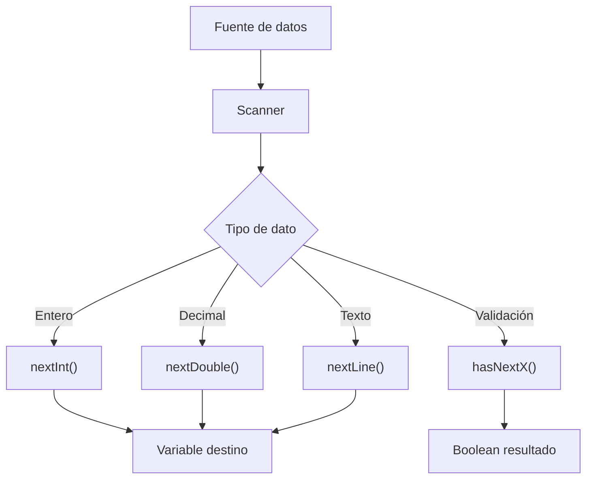

# Repaso de Scanner

## 📋 Índice de contenidos

1. [Introducción al Scanner](#1-introducci%C3%B3n-al-scanner)
2. [Creación y configuración del objeto Scanner](#2-creaci%C3%B3n-y-configuraci%C3%B3n-del-objeto-scanner)
3. [Métodos de lectura de datos](#3-m%C3%A9todos-de-lectura-de-datos)
    1. [Métodos para tipos primitivos](#31-m%C3%A9todos-para-tipos-primitivos)
    2. [Métodos para cadenas de texto](#32-m%C3%A9todos-para-cadenas-de-texto)
    3. [Asignación de datos leídos](#33-asignaci%C3%B3n-de-datos-le%C3%ADdos)
    4. [Liberación del buffer sin asignación](#34-liberaci%C3%B3n-del-buffer-sin-asignaci%C3%B3n)
4. [Gestión avanzada de errores](#4-gesti%C3%B3n-avanzada-de-errores)
5. [Métodos de control del tipo de dato](#5-m%C3%A9todos-de-control-del-tipo-de-dato)
    1. [Verificación de existencia de elementos](#51-verificaci%C3%B3n-de-existencia-de-elementos)
    2. [Verificación del tipo de dato](#52-verificaci%C3%B3n-del-tipo-de-dato)
    3. [Ejemplos prácticos de control](#53-ejemplos-pr%C3%A1cticos-de-control)
6. [Técnicas avanzadas de validación](#6-t%C3%A9cnicas-avanzadas-de-validaci%C3%B3n)
7. [Buenas prácticas](#7-buenas-pr%C3%A1cticas)

## 1. Introducción al Scanner

La clase **Scanner** en Java es una herramienta fundamental para la **lectura de datos desde diferentes fuentes de entrada**, principalmente desde el teclado (entrada estándar). Esta clase se encuentra en el paquete `java.util` y proporciona métodos sencillos y eficientes para leer diferentes tipos de datos primitivos y cadenas de texto.

> [!NOTE]
> La clase Scanner es especialmente útil en aplicaciones de consola donde necesitamos interactuar con el usuario de manera dinámica.

### Características principales del Scanner

- **Versatilidad**: Puede leer desde diferentes fuentes (teclado, archivos, cadenas)
- **Tipado fuerte**: Métodos específicos para cada tipo de dato
- **Control de errores**: Mecanismos de validación incorporados
- **Gestión de buffer**: Control preciso sobre la entrada de datos



## 2. Creación y configuración del objeto Scanner

Para utilizar la clase Scanner, primero debemos **crear una instancia** del objeto. La sintaxis básica es la siguiente:

```java
Scanner teclado = new Scanner(System.in);
```

### Componentes de la declaración

| Componente | Descripción |
| :-- | :-- |
| **`Scanner`** | Clase que importamos de `java.util` |
| **`teclado`** | Nombre de la variable (puedes usar cualquier nombre descriptivo) |
| **`new Scanner(System.in)`** | Crea una nueva instancia que lee desde la entrada estándar |

> [!TIP]
> Es recomendable dar nombres descriptivos a las variables Scanner, como `teclado`, `entrada`, `scanner`, `lector`, etc.

### Estructura completa de un programa con Scanner

```java
// PRIMERO SE DEBE IMPORTAR DENTRO DEL PAQUETE JAVA.UTIL
import java.util.Scanner;

public class Programa {
    public static void main(String[] args) {
        Scanner teclado = new Scanner(System.in);
        
        // YA PODEMOS UTILIZAR EL OBJETO "teclado"
        
        // IMPORTANTE: Cerrar el Scanner al final
        teclado.close();
    }
}
```

## 3. Métodos de lectura de datos

La clase Scanner ofrece una amplia variedad de métodos para leer diferentes tipos de datos, organizados por categorías según el tipo de información que manejan.

### 3.1 Métodos para tipos primitivos

| Método | Tipo de retorno | Rango de valores | Uso típico |
| :-- | :-- | :-- | :-- |
| **`nextByte()`** | `byte` | -128 a 127 | Valores numéricos muy pequeños |
| **`nextShort()`** | `short` | -32,768 a 32,767 | Valores numéricos pequeños |
| **`nextInt()`** | `int` | ≈ -2.1 mil millones a 2.1 mil millones | Números enteros generales |
| **`nextLong()`** | `long` | Rango muy amplio de números enteros | Números enteros muy grandes |
| **`nextFloat()`** | `float` | Números decimales de precisión simple | Decimales con precisión limitada |
| **`nextDouble()`** | `double` | Números decimales de doble precisión | Decimales con alta precisión |
| **`nextBoolean()`** | `boolean` | `true`/`false` | Valores lógicos |

### 3.2 Métodos para cadenas de texto

| Método | Comportamiento | Cuándo usar |
| :-- | :-- | :-- |
| **`nextLine()`** | Lee un `String` completo hasta encontrar un **salto de línea** (\n) | Para leer frases completas o líneas enteras |
| **`next()`** | Lee un `String` hasta el primer **delimitador** (espacio, tabulación, salto de línea) | Para leer palabras individuales |

> [!IMPORTANT]
> En Java estándar **no existen** los métodos `nextChar()` ni `nextString()`. Para leer un carácter individual, debes usar `next().charAt(0)` o `nextLine().charAt(0)`.

### 3.3 Asignación de datos leídos

Con los métodos anteriores podemos realizar **dos operaciones principales**:

**1. Asignar los datos leídos a una variable** (también libera esa lectura del buffer):

```java
import java.util.Scanner;

public class Programa {
    public static void main(String[] args) {
        double producto;
        Scanner teclado = new Scanner(System.in);
        
        System.out.print("Introduce el precio del producto: ");
        producto = teclado.nextDouble();
        // AL EJECUTAR nextDouble(), LA DATO LEÍDO SE LIBERA DEL BUFFER (SOLO ESE DATO)
        
        System.out.printf("El producto tiene un precio de %.2f€%n", producto);
        teclado.close();
    }
}
```

**Ejemplo de entrada múltiple:**

```text
Introduce el precio del producto: 1.25 9.45 pepito
El producto tiene un precio de 1.25€
```

**Lectura múltiple secuencial:**

```java
import java.util.Scanner;

public class Programa {
    public static void main(String[] args) {
        double producto, producto2;
        Scanner teclado = new Scanner(System.in);
        
        System.out.print("Introduce el precio del producto: ");
        producto = teclado.nextDouble();
        // AL EJECUTAR nextDouble(), EL DATO LEÍDO SE LIBERA DEL BUFFER (SOLO ESE DATO)
        producto2 = teclado.nextDouble();
        
        System.out.printf("El producto tiene un precio de %.2f€ y de %.2f€%n", producto, producto2);
        teclado.close();
    }
}
```

### 3.4 Liberación del buffer sin asignación

**2. Hacer la lectura del dato sin asignarlo a ninguna variable** (solo liberarlo del buffer):

Esta técnica es útil cuando queremos **"saltarnos"** o **"consumir"** una entrada sin utilizarla:

```java
Scanner teclado = new Scanner(System.in);

// Ejemplos de liberación del buffer
teclado.nextInt();    // Consume un entero pero no lo guarda
teclado.nextLine();   // Consume una línea entera
teclado.next();       // Consume la siguiente palabra
```

> [!WARNING]
> Esta práctica se utiliza a menudo para "limpiar" el buffer de entrada después de leer tipos primitivos antes de leer cadenas con `nextLine()`.

**Ejemplo práctico de limpieza de buffer:**

```java
import java.util.Scanner;

public class Programa {
    public static void main(String[] args) {
        String producto;
        Scanner teclado = new Scanner(System.in);
        
        System.out.print("Introduce el precio del producto: ");
        teclado.nextDouble();  // Lee el double pero no lo almacena
        // AL EJECUTAR nextDouble(), EL DATO LEÍDO SE LIBERA DEL BUFFER
        
        producto = teclado.nextLine();  // Ahora lee el resto de la línea
        System.out.println("El producto tiene un precio de " + producto);
        
        teclado.close();
    }
}
```

**Entrada y salida:**

```text
Introduce el precio del producto: 1.25 9.45 pepito
El producto tiene un precio de  9.45 pepito
```

**Limpieza completa del buffer:**

```java
import java.util.Scanner;

public class Programa {
    public static void main(String[] args) {
        double producto;
        Scanner teclado = new Scanner(System.in);
        
        System.out.print("Introduce el precio del producto: ");
        producto = teclado.nextDouble();
        // Queremos asegurarnos de que no queda nada en el buffer después de leer el primer dato
        teclado.nextLine();
        
        System.out.println("El producto tiene un precio de " + producto + " €");
        teclado.close();
    }
}
```

## 4. Gestión avanzada de errores

Uno de los problemas más comunes cuando trabajamos con Scanner es el **error de tipo de dato no coincidente** (`InputMismatchException`).

### Cuándo se produce el error

Este error ocurre cuando:

- Utilizamos un método de lectura para leer un dato específico
- El dato introducido por teclado **no coincide** con el tipo que se intentaba leer
- Esto produce un **error en tiempo de ejecución** en Java

> [!NOTE]
> **Excepción**: Los espacios en blanco y saltos de línea son ignorados por los métodos de lectura de tipos primitivos, y el programa continuará esperando un dato válido.

### Ejemplos de errores comunes

**Código que funciona correctamente:**

```java
import java.util.Scanner;

public class Programa {
    public static void main(String[] args) {
        double producto;
        Scanner teclado = new Scanner(System.in);
        
        System.out.print("Introduce el precio del producto: ");
        producto = teclado.nextDouble();
        // Limpia el buffer de entrada
        teclado.nextLine();
        
        System.out.println("El producto tiene un precio de " + producto + " €");
        teclado.close();
    }
}
```

**Salida exitosa:**

```text
Introduce el precio del producto: 15.5
El producto tiene un precio de 15.5 €
```

**Salida con error:**

```text
Introduce el precio del producto: cero
Exception in thread "main" java.util.InputMismatchException
    at java.base/java.util.Scanner.throwFor(Scanner.java:939)
    at java.base/java.util.Scanner.next(Scanner.java:1594)
    at java.base/java.util.Scanner.nextDouble(Scanner.java:2564)
    at Programa.main(Programa.java:7)
```

## 5. Métodos de control del tipo de dato

Para **evitar estos errores**, la clase Scanner proporciona métodos que nos permiten verificar el contenido del buffer antes de leerlo.

### 5.1 Verificación de existencia de elementos

| Método | Retorno | Descripción |
| :-- | :-- | :-- |
| **`hasNext()`** | `boolean` | Indica si existe o no un siguiente elemento para extraer del buffer |

### 5.2 Verificación del tipo de dato

Los métodos **`hasNextX()`** retornan un `boolean` que indica si el siguiente elemento a extraer es del tipo especificado:

| Método | Verifica | Retorno |
| :-- | :-- | :-- |
| **`hasNextByte()`** | Si el siguiente elemento es un `byte` válido | `boolean` |
| **`hasNextShort()`** | Si el siguiente elemento es un `short` válido | `boolean` |
| **`hasNextInt()`** | Si el siguiente elemento es un `int` válido | `boolean` |
| **`hasNextLong()`** | Si el siguiente elemento es un `long` válido | `boolean` |
| **`hasNextFloat()`** | Si el siguiente elemento es un `float` válido | `boolean` |
| **`hasNextDouble()`** | Si el siguiente elemento es un `double` válido | `boolean` |
| **`hasNextBoolean()`** | Si el siguiente elemento es un `boolean` válido | `boolean` |
| **`hasNextLine()`** | Si hay una línea disponible para leer | `boolean` |

### 5.3 Ejemplos prácticos de control

**Ejemplo básico con validación:**

```java
public static void main(String[] args) {
    double producto, producto2;
    Scanner teclado = new Scanner(System.in);
    
    System.out.print("Introduce dos precios: ");
    if(teclado.hasNextDouble() && teclado.hasNextDouble()) {
        producto = teclado.nextDouble();
        producto2 = teclado.nextDouble();
        System.out.printf("Precios: %.2f€ y %.2f€%n", producto, producto2);
    } else {
        System.out.println("Error. Tipo de dato incorrecto");
    }
    
    teclado.close();
}
```

**Problema con el ejemplo anterior:**

```text
Introduce dos precios: 2.5 a
Exception in thread "main" java.util.InputMismatchException
```

> [!CAUTION]
> El problema es que `hasNextDouble()` se evalúa dos veces en la misma línea, pero el buffer puede cambiar entre evaluaciones.

**Solución mejorada con validación individual:**

```java
public static void main(String[] args) {
    double producto, producto2;
    Scanner teclado = new Scanner(System.in);
    
    System.out.print("Introduce dos precios: ");
    if(teclado.hasNextDouble()) {
        producto = teclado.nextDouble();
        
        if(teclado.hasNextDouble()) {
            producto2 = teclado.nextDouble();
            teclado.nextLine(); // Limpiar buffer
            System.out.printf("Precios: %.2f€ y %.2f€%n", producto, producto2);
        } else {
            System.out.println("Error. El segundo valor no es un número válido");
        }
    } else {
        System.out.println("Error. El primer valor no es un número válido");
    }
    
    teclado.close();
}
```

**Validación avanzada con condiciones múltiples:**

```java
public static void main(String[] args) {
    double producto, producto2;
    Scanner teclado = new Scanner(System.in);
    
    System.out.print("Introduce dos precios positivos: ");
    
    if(teclado.hasNextDouble() && (producto = teclado.nextDouble()) >= 0
       && teclado.hasNextDouble() && (producto2 = teclado.nextDouble()) >= 0) {
        System.out.printf("Los precios son %.2f€ y %.2f€%n", producto, producto2);
    } else {
        System.out.println("Error. Debes introducir dos números positivos");
    }
    
    teclado.close();
}
```

## 6. Técnicas avanzadas de validación

### Validación de operaciones aritméticas

```java
public static void main(String[] args) {
    Scanner teclado = new Scanner(System.in);
    double operando1, operando2;
    String operador;
    
    System.out.print("Introduce una operación (operando1 operando2 operador): ");
    
    if (teclado.hasNextDouble()) {
        operando1 = teclado.nextDouble();
        
        if (teclado.hasNextDouble()) {
            operando2 = teclado.nextDouble();
            operador = teclado.nextLine().trim();
            
            switch (operador) {
                case "*":
                    System.out.printf("%.2f * %.2f = %.2f%n", 
                                    operando1, operando2, operando1 * operando2);
                    break;
                case "/":
                    if (operando2 != 0) {
                        System.out.printf("%.2f / %.2f = %.2f%n", 
                                        operando1, operando2, operando1 / operando2);
                    } else {
                        System.out.println("Error: No se puede dividir entre cero");
                    }
                    break;
                case "+":
                    System.out.printf("%.2f + %.2f = %.2f%n", 
                                    operando1, operando2, operando1 + operando2);
                    break;
                case "-":
                    System.out.printf("%.2f - %.2f = %.2f%n", 
                                    operando1, operando2, operando1 - operando2);
                    break;
                default:
                    System.out.println("Error: Operador no válido");
            }
        } else {
            System.out.println("Error: El segundo operando no es válido");
        }
    } else {
        System.out.println("Error: El primer operando no es válido");
    }
    
    teclado.close();
}
```

### Validación con múltiples intentos

```java
public static void main(String[] args) {
    Scanner teclado = new Scanner(System.in);
    double numero = 0;
    boolean datoValido = false;
    int intentos = 0;
    final int MAX_INTENTOS = 3;
    
    while (!datoValido && intentos < MAX_INTENTOS) {
        System.out.print("Introduce un número positivo: ");
        
        if (teclado.hasNextDouble()) {
            numero = teclado.nextDouble();
            teclado.nextLine(); // Limpiar buffer
            
            if (numero > 0) {
                datoValido = true;
                System.out.printf("✅ Número válido: %.2f%n", numero);
            } else {
                System.out.println("❌ El número debe ser positivo");
                intentos++;
            }
        } else {
            System.out.println("❌ Debes introducir un número válido");
            teclado.nextLine(); // Limpiar buffer
            intentos++;
        }
    }
    
    if (!datoValido) {
        System.out.println("🚫 Máximo número de intentos alcanzado");
    }
    
    teclado.close();
}
```

## 7. Buenas Prácticas

> [!TIP]
> **Reglas de oro para usar Scanner:**

1. **Siempre valida antes de leer**: Usa `hasNextX()` antes de `nextX()`
2. **Limpia el buffer**: Usa `nextLine()` después de leer tipos primitivos
3. **Maneja errores**: Proporciona mensajes claros al usuario
4. **Cierra recursos**: Usa `scanner.close()` al final
5. **Usa métodos auxiliares**: Encapsula la validación en funciones separadas
6. **Proporciona intentos múltiples**: Permite al usuario corregir errores
7. **Documenta el comportamiento**: Explica qué tipo de entrada se espera

> [!NOTE]
> Este conocimiento del Scanner te permitirá crear programas más robustos y con mejor experiencia de usuario. La validación adecuada es crucial en aplicaciones reales donde los usuarios pueden introducir datos inesperados.

<p align="center">📚 <em>Fin del apartado Repaso de Scanner</em></p>
