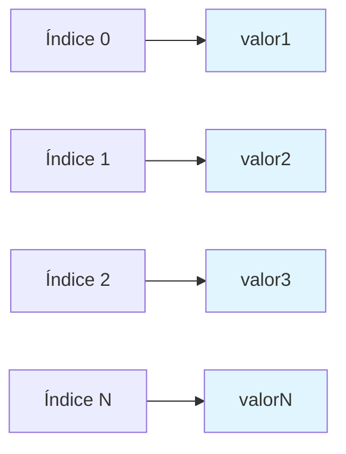
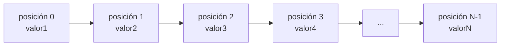
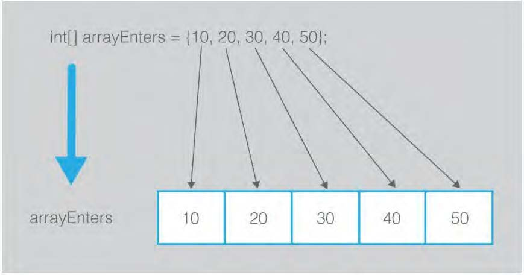
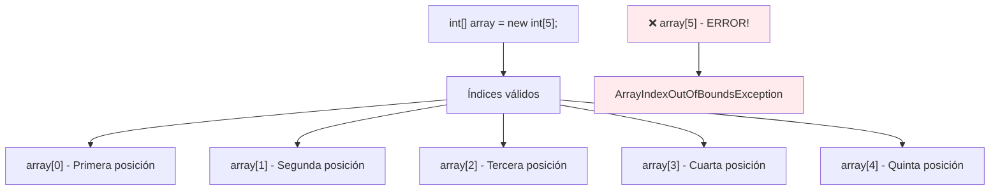

# UT3.1 Tipos de datos compuestos. Introducción a los arrays

## 📋 Índice de contenidos

1. [Introducción](#1-introducci%C3%B3n)
    1. [¿Qué son los tipos de datos compuestos?](#11-qu%C3%A9-son-los-tipos-de-datos-compuestos)
    2. [Repaso: el tipo String](#12-repaso-el-tipo-string)
2. [¿Qué es un Array?](#2-qu%C3%A9-es-un-array)
    1. [Definición y características](#21-definici%C3%B3n-y-caracter%C3%ADsticas)
    2. [Ventajas de usar arrays](#22-ventajas-de-usar-arrays)
3. [Trabajando con arrays en Java](#3-trabajando-con-arrays-en-java)
    1. [Declaración de arrays](#31-declaraci%C3%B3n-de-arrays)
    2. [Creación de arrays](#32-creaci%C3%B3n-de-arrays)
    3. [Declaración y creación simultánea](#33-declaraci%C3%B3n-y-creaci%C3%B3n-simult%C3%A1nea)
    4. [Inicialización de arrays](#34-inicializaci%C3%B3n-de-arrays)
    5. [Declaración, creación e inicialización en una línea](#35-declaraci%C3%B3n-creaci%C3%B3n-e-inicializaci%C3%B3n-en-una-l%C3%ADnea)
4. [Manipulación de datos en arrays](#4-manipulaci%C3%B3n-de-datos-en-arrays)
    1. [Acceso a elementos mediante índices](#41-acceso-a-elementos-mediante-%C3%ADndices)
    2. [Rango de índices en Java](#42-rango-de-%C3%ADndices-en-java)
    3. [Propiedad length](#43-propiedad-length)
    4. [Ejemplos prácticos de manipulación](#44-ejemplos-pr%C3%A1cticos-de-manipulaci%C3%B3n)
5. [Preguntas de repaso](#5-preguntas-de-repaso)
6. [Ejemplo completo: lectura y almacenamiento](#6-ejemplo-completo-lectura-y-almacenamiento)
7. [Prácticas propuestas](#7-pr%C3%A1cticas-propuestas)

## 1. Introducción

En programación, no siempre es suficiente trabajar con tipos de datos básicos como `int`, `double`, `char` o `boolean`. A menudo necesitamos estructurar y organizar información de manera más compleja para resolver problemas reales.

### 1.1 ¿Qué son los tipos de datos compuestos?

Los tipos de datos compuestos son estructuras que se crean a partir de los tipos de datos básicos y que son capaces de almacenar más de un valor dentro de una única variable.

Ya hemos trabajado con un tipo de dato compuesto sin darnos cuenta: el tipo `String`. Un `String` no es más que una secuencia de caracteres (`char`) agrupados para formar palabras, frases o textos completos. Los tipos de datos compuestos se caracterizan por:

- Se crean a partir de los **tipos de datos básicos** (primitivos)
- Son capaces de **almacenar más de un valor** dentro de una única variable
- Proporcionan **estructuras más complejas** para organizar la información

**¿Por qué necesitamos tipos compuestos?**

Imagina que necesitas almacenar las calificaciones de 30 estudiantes. Sin arrays, tendrías que declarar 30 variables diferentes:

```java
double nota1, nota2, nota3, nota4, nota5, nota6, nota7, nota8, nota9, nota10;
double nota11, nota12, nota13, nota14, nota15, nota16, nota17, nota18, nota19, nota20;
double nota21, nota22, nota23, nota24, nota25, nota26, nota27, nota28, nota29, nota30;
```

¡Esto es completamente impracticable! Los arrays nos permiten resolver este problema de manera elegante y eficiente.

### 1.2 Repaso: el tipo String

El tipo String es un ejemplo perfecto de tipo de datos compuesto:

```java
String mensaje = "Hola mundo";
// Internamente: ['H', 'o', 'l', 'a', ' ', 'm', 'u', 'n', 'd', 'o']
```

Muchos **char** juntos forman un **String**, permitiendo almacenar texto completo en una sola variable.

## 2. ¿Qué es un Array?

### 2.1 Definición y características

Un **array** (también llamado arreglo, vector o matriz unidimensional) es una estructura de datos que permite almacenar, **de forma secuencial**, una **cantidad determinada de valores** pertenecientes al **mismo tipo de dato**.



**Características principales:**

- 📊 **Homogéneo**: Todos los elementos son del mismo tipo de dato
- 📍 **Indexado**: Se accede a cada elemento mediante su posición (índice)
- 📏 **Tamaño fijo**: Una vez creado, su tamaño no puede cambiar
- 🔢 **Secuencial**: Los elementos se almacenan en posiciones consecutivas

**Representación visual de un array:**




### 2.2 Ventajas de usar arrays

Los arrays nos permiten:

- **Organizar datos relacionados** en una sola estructura
- **Acceder rápidamente** a cualquier elemento mediante su índice
- **Procesar conjuntos de datos** de forma eficiente con bucles
- **Gestionar colecciones** de información de manera estructurada

> [!IMPORTANT]
> El concepto de acceso a valores ordenados mediante índices es aplicable a cualquier lenguaje de programación, aunque la sintaxis específica puede variar.

## 3. Trabajando con arrays en Java

Para poder utilizar un array en Java, debemos seguir tres pasos fundamentales:

1. **Declaración** 📝
2. **Creación** 🏗️
3. **Inicialización** 🔄 (opcional)

### 3.1 Declaración de arrays

La declaración es similar a la de otros tipos de datos, con la particularidad del uso de **corchetes `[]`**.

**Sintaxis de declaración:**

```java
tipoDeDato[] nombreDelArray;
```

**Ejemplos prácticos:**

```java
// Declaración de un array de enteros
int[] numeros;

// Declaración de un array de números decimales
double[] precios;

// Declaración de un array de caracteres
char[] letras;

// Declaración de un array de Strings
String[] nombres;
```

> [!NOTE]
> También es válida la sintaxis `int numeros[];` pero se recomienda usar `int[] numeros` por claridad y consistencia.

### 3.2 Creación de arrays

La **declaración** solo reserva espacio para la referencia al array, pero no crea el array en sí. Para crearlo, debemos especificar **cuántos elementos** contendrá.

**Sintaxis de creación:**

```java
new tipoDeDato[numeroElementos];
```

**Ejemplos:**

```java
// Declaración previa
int[] numeros;
double[] precios;

// Creación de arrays
numeros = new int[5];        // Array de 5 enteros
precios = new double[10];    // Array de 10 números decimales
```

### 3.3 Declaración y creación simultánea

Es común (y recomendado) declarar y crear el array en la misma línea:

```java
int[] numeros = new int[5];
double[] precios = new double[10];
char[] letras = new char[26];
String[] nombres = new String[3];
```

### 3.4 Inicialización de arrays

La **inicialización** consiste en asignar valores iniciales a los elementos del array. Esta operación es **opcional**, pero importante:

- Si no inicializamos, los elementos toman **valores por defecto**:
  - `int`, `double`, etc.: **0**
  - `boolean`: **false**
  - `char`: **'\0'** (carácter nulo)
  - `String` y otros objetos: **null**

**Inicialización elemento por elemento:**

```java
int[] numeros = new int[3];
numeros[0] = 10;
numeros[1] = 20;
numeros[2] = 30;
```

```java
int[] cuadrados = new int[10];
for (int i = 0; i < cuadrados.length; i++) {
    cuadrados[i] = i * i;  // 0, 1, 4, 9, 16, 25, 36, 49, 64, 81
}
```

> [!WARNING]
> Acceder a un elemento no inicializado puede provocar errores en tiempo de ejecución, especialmente con objetos (como String) que serían `null`.

### 3.5 Declaración, creación e inicialización en una línea

Java permite realizar las tres operaciones simultáneamente:

```java
// Inicialización con valores específicos
int[] numeros = {10, 20, 30, 40, 50};

// Equivalente a:
int[] numeros = new int[]{10, 20, 30, 40, 50};

// Otros ejemplos
double[] precios = {19.99, 25.50, 12.75};
String[] colores = {"rojo", "verde", "azul"};
char[] vocales = {'a', 'e', 'i', 'o', 'u'};
```



> [!NOTE]
> **Importante**: Cuando usas esta sintaxis, Java automáticamente determina el tamaño del array basándose en el número de elementos proporcionados.

## 4. Manipulación de datos en arrays

Una característica fundamental de los arrays es que **no se pueden manipular como una unidad completa**. Para realizar operaciones con los datos almacenados, debemos trabajar con cada elemento individual.

```java
int[] a = {10, 20, 30, 40, 50};
int[] b = {50, 60, 70, 80, 100};
// ESTO NO SE PUEDE HACER:
// int[] c = a + b;
```

### 4.1 Acceso a elementos mediante índices

Para acceder a un elemento específico del array, utilizamos su **índice** (posición) entre corchetes:

**Sintaxis de acceso:**

```java
nombreArray[indice]
```

**Ejemplo:**

```java
int[] numeros = {10, 20, 30, 40, 50};

// Acceso a elementos individuales
System.out.println(numeros[0]);  // Imprime: 10
System.out.println(numeros[2]);  // Imprime: 30

// Modificación de elementos
numeros[1] = 25;  // Cambia el segundo elemento a 25
numeros[4] = numeros[0] + numeros[1];  // Operaciones entre elementos
```

### 4.2 Rango de índices en Java

> [!WARNING]
> En Java, los índices de los arrays van desde **0** (primera posición) hasta **longitud - 1** (última posición).



**Ejemplo práctico:**

```java
int m = 5;
int[] a = new int[m];

// Operaciones válidas
a[1] = 2;                    // [0][2][0][0][0]
a[2] = a[1];                 // [0][2][2][0][0]  
a[0] = a[1] + a[2] + 2;      // [6][2][2][0][0]
a[0]++;                      // [7][2][2][0][0]
a[3] = m + 10;               // [7][2][2][15][0]
```

### 4.3 Propiedad length

Para conocer la **longitud del array** (cantidad de elementos disponibles), usamos la propiedad `length`:

```java
int[] numeros = new int[5];
System.out.println(numeros.length);  // Imprime: 5

String[] nombres = {"Ana", "Luis", "Carmen"};
System.out.println(nombres.length);  // Imprime: 3
```

> [!TIP]
> La propiedad `length` es muy útil en bucles para recorrer todo el array sin salirse de los límites.

```java
int[] calificaciones = {85, 92, 78, 96, 88};

// Recorrer todo el array sin conocer su tamaño exacto
for (int i = 0; i < calificaciones.length; i++) {
    System.out.println("Calificación " + (i+1) + ": " + calificaciones[i]);
}

// Calcular la suma de todos los elementos
int suma = 0;
for (int i = 0; i < calificaciones.length; i++) {
    suma += calificaciones[i];
}
double promedio = (double) suma / calificaciones.length;
System.out.println("Promedio: " + promedio);
```

> [!TIP]
> **Ventaja de usar `length`**
>
> Usar `array.length` en lugar de números fijos hace tu código más flexible y menos propenso a errores si cambias el tamaño del array.

### 4.4 Ejemplos prácticos de manipulación

**Ejemplo: Recorrido con bucle for:**

```java
int[] calificaciones = {85, 92, 78, 96, 88};

// Mostrar todas las calificaciones
for (int i = 0; i < calificaciones.length; i++) {
    System.out.println("Calificación " + (i+1) + ": " + calificaciones[i]);
}

// Calcular la media
double suma = 0;
for (int i = 0; i < calificaciones.length; i++) {
    suma += calificaciones[i];
}
double media = suma / calificaciones.length;
System.out.println("Media: " + media);
```

**Ejemplo: Buscar el máximo valor:**

```java
int[] valores = {23, 67, 12, 89, 45, 91, 34};
int maximo = valores[0];

for (int i = 1; i < valores.length; i++) {
    if (valores[i] > maximo) {
        maximo = valores[i];
    }
}

System.out.println("El valor máximo es: " + maximo);
```

## 5. Preguntas de repaso

### Pregunta 1

¿Cuál es la salida del siguiente código?

```java
int x = 30;
int[] numbers = new int[x];
x = 60;
System.out.println("x is " + x);
System.out.println("The size of numbers is " + numbers.length);
```

<details>
<summary>💡 Ver respuesta</summary>

**Salida:**

```text
x is 60
The size of numbers is 30
```

**Explicación:** El tamaño del array se fija en el momento de su creación (30), y no cambia aunque modifiquemos posteriormente la variable `x`.

</details>

### Pregunta 2

Indica si las siguientes afirmaciones son verdaderas o falsas:

- Todos los elementos de un array tienen el mismo tipo
- La longitud del array se fija cuando se declara la referencia del array
- La longitud del array se fija en su creación
- Los elementos de un array deben ser de tipo de dato primitivo

<details>
<summary>💡 Ver explicación</summary>

1. **Verdadero:** Los arrays en Java son homogéneos (mismo tipo)
2. **Falso:** Se fija en la creación (`new`), no en la declaración  
3. **Verdadero:** Una vez creado, el tamaño es inmutable
4. **Falso:** Pueden contener objetos (String, etc.)

</details>

### Pregunta 3

¿Qué sentencias son válidas?

```java
int i = new int(30);
double d[] = new double[30];
char[] r = new char(1..30);
int i[] = (3, 4, 3, 2);
float f[] = {2.3, 4.5, 6.6};
char[] c = new char();
```

<details>
<summary>💡 Ver respuesta</summary>

**Válidas:**

- `double d[] = new double[30];` ✅
- `float f[] = {2.3, 4.5, 6.6};` ✅

**Inválidas:**

- `int i = new int(30);` ❌ (sintaxis incorrecta)
- `char[] r = new char(1..30);` ❌ (sintaxis incorrecta)  
- `int i[] = (3, 4, 3, 2);` ❌ (faltan llaves {})
- `char[] c = new char();` ❌ (falta tamaño)

</details>

### Pregunta 4

**Sobre los índices de array:**

- ¿De qué tipo de dato es el índice de referencia de los elementos?
- ¿Cuál es el valor mínimo que puede tener?
- ¿Y el máximo?

<details>
<summary>💡 Ver respuesta</summary>

- **Tipo:** `int`
- **Mínimo:** 0 (primera posición)
- **Máximo:** `array.length - 1` (última posición)

</details>

### Pregunta 5

Escribe las sentencias que hagan lo siguiente:

1. Crear un array que almacene diez valores de tipo double
2. Asignar el valor 5.5 al último elemento del array
3. Mostrar la suma de los primeros 2 elementos
4. Escribir un bucle que calcule la suma de todos los elementos
5. Escribir un bucle que encuentre el elemento mínimo

<details>
<summary>💻 Ver solución</summary>

```java
// 1. Crear array de 10 doubles
double[] valores = new double[10];

// 2. Asignar 5.5 al último elemento
valores[valores.length - 1] = 5.5;  // Último índice: length - 1

// 3. Mostrar suma de primeros 2 elementos
System.out.println("Suma primeros 2: " + (valores[0] + valores[1]));

// 4. Calcular suma total
double suma = 0;
for (int i = 0; i < valores.length; i++) {
    suma += valores[i];
}
System.out.println("Suma total: " + suma);

// 5. Encontrar elemento mínimo
double minimo = valores[0];
for (int i = 1; i < valores.length; i++) {
    if (valores[i] < minimo) {
        minimo = valores[i];
    }
}
System.out.println("Mínimo: " + minimo);
```

</details>

### Pregunta 6

¿Qué errores de sintaxis hay en el siguiente código?

```java
public class Test {
    public static void main(String[] args) {
        double [100] r;

        for (int i = 0; i < r.length(); i++);
            r(i) = Math.random * 100;
    }
}
```

<details>
<summary>💡 Ver errores</summary>

**Errores encontrados:**

1. `double  r;` → `double[] r = new double[100];`
2. `r.length()` → `r.length` (sin paréntesis)
3. `;` después del for hace que el bucle esté vacío
4. `r(i)` → `r[i]` (corchetes, no paréntesis)
5. `Math.random` → `Math.random()` (falta paréntesis)

</details>

### Pregunta 7

¿Cuál es la salida del siguiente código?

```java
public class Test {
    public static void main(String[] args) {
        int list[] = {1, 2, 3, 4, 5, 6};

        for (int i = 1; i < list.length; i++)
            list[i] = list[i - 1];

        for (int i = 0; i < list.length; i++)
            System.out.print(list[i] + " ");
    }
}
```

<details>
<summary>💡 Ver respuesta</summary>

**Salida:** `1 1 1 1 1 1`

**Explicación:** El primer bucle copia cada elemento en la posición siguiente, propagando el primer valor (1) por todo el array.

</details>

## 6. Ejemplo completo: lectura y almacenamiento

**Programa que lee y almacena diez números enteros:**

```java
import java.util.Scanner;

public class LecturaAlmacenamientoNumeros {
    private static final int NUM_VALORES = 10;
    
    public static void main(String[] args) {
        Scanner teclado = new Scanner(System.in);
        
        System.out.println("Introduce " + NUM_VALORES + " valores enteros:");
        
        // Declaración y creación del array
        int[] valores = new int[NUM_VALORES];
        int numLeidos = 0;
        
        // Lectura y almacenamiento de datos
        while (numLeidos < NUM_VALORES) {
            System.out.print("Valor " + (numLeidos + 1) + ": ");
            
            // Validación de entrada
            if (teclado.hasNextInt()) {
                int valor = teclado.nextInt();
                valores[numLeidos] = valor;
                numLeidos++;
            } else {
                System.out.println("❌ Error: Introduce un número entero válido");
                teclado.next(); // Limpiar entrada inválida
            }
        }
        
        // Mostrar valores almacenados
        System.out.println("\n📊 Valores almacenados:");
        for (int i = 0; i < valores.length; i++) {
            System.out.println("Valor " + (i + 1) + ": " + valores[i]);
        }
        
        teclado.close();
        System.out.println("✅ Programa finalizado");
    }
}
```

**Características del ejemplo:**

- ✅ **Validación de entrada** para evitar errores
- ✅ **Uso de constantes** para facilitar mantenimiento
- ✅ **Manejo de excepciones** básico
- ✅ **Interfaz de usuario** clara y amigable

## 7. Prácticas propuestas

### Práctica 3.1: Sistema básico de notas

**📝 Enunciado:**

Realiza un programa que lea un número determinado de notas de clase. El funcionamiento será el siguiente:

1. Se preguntará cuántas notas se van a leer (validar entrada)
2. Se pedirá al usuario que introduzca los valores (debe funcionar si se introducen en una línea separados por espacios, o en varias líneas)
3. Cada valor debe ser validado como nota válida (valor real entre 0 y 10)
4. Al alcanzar el número de notas deseado, mostrar todas las notas introducidas

<details>
<summary>💻 Ver solución</summary>

```java
import java.util.Scanner;

public class SistemaNotas {
    public static void main(String[] args) {
        Scanner scanner = new Scanner(System.in);
        int numNotas = 0;
        
        // Validar número de notas
        do {
            System.out.print("¿Cuántas notas vas a introducir? ");
            if (scanner.hasNextInt()) {
                numNotas = scanner.nextInt();
                if (numNotas <= 0) {
                    System.out.println("❌ El número debe ser positivo");
                }
            } else {
                System.out.println("❌ Introduce un número entero válido");
                scanner.next();
            }
        } while (numNotas <= 0);
        
        // Crear array de notas
        double[] notas = new double[numNotas];
        int notasLeidas = 0;
        
        System.out.println("Introduce " + numNotas + " notas (entre 0 y 10):");
        
        // Leer notas con validación
        while (notasLeidas < numNotas) {
            System.out.print("Nota " + (notasLeidas + 1) + ": ");
            
            if (scanner.hasNextDouble()) {
                double nota = scanner.nextDouble();
                
                if (nota >= 0 && nota <= 10) {
                    notas[notasLeidas] = nota;
                    notasLeidas++;
                } else {
                    System.out.println("❌ La nota debe estar entre 0 y 10");
                }
            } else {
                System.out.println("❌ Introduce un número válido");
                scanner.next();
            }
        }
        
        // Mostrar notas introducidas
        System.out.println("\n📊 Notas introducidas:");
        for (int i = 0; i < notas.length; i++) {
            System.out.printf("Nota %d: %.2f\n", i + 1, notas[i]);
        }
        
        scanner.close();
    }
}
```

</details>

### Práctica 3.2: Sistema con parada anticipada

**📝 Enunciado:**

Realiza una segunda versión del programa anterior. Funcionará igual, pero podrá parar la recogida de datos si el usuario introduce **-1**, mostrando al final solo los elementos introducidos.

<details>
<summary>💻 Ver solución</summary>

```java
import java.util.Scanner;

public class SistemaNotasParada {
    public static void main(String[] args) {
        Scanner scanner = new Scanner(System.in);
        
        System.out.print("¿Cuántas notas máximo vas a introducir? ");
        int maxNotas = scanner.nextInt();
        
        double[] notas = new double[maxNotas];
        int notasLeidas = 0;
        
        System.out.println("Introduce notas (0-10) o -1 para terminar:");
        
        while (notasLeidas < maxNotas) {
            System.out.print("Nota " + (notasLeidas + 1) + " (-1 para salir): ");
            
            if (scanner.hasNextDouble()) {
                double nota = scanner.nextDouble();
                
                if (nota == -1) {
                    System.out.println("🛑 Finalizando entrada de datos");
                    break;
                } else if (nota >= 0 && nota <= 10) {
                    notas[notasLeidas] = nota;
                    notasLeidas++;
                } else {
                    System.out.println("❌ La nota debe estar entre 0 y 10");
                }
            } else {
                System.out.println("❌ Introduce un número válido");
                scanner.next();
            }
        }
        
        // Mostrar solo las notas introducidas
        System.out.println("\n📊 Notas introducidas (" + notasLeidas + "):");
        for (int i = 0; i < notasLeidas; i++) {
            System.out.printf("Nota %d: %.2f\n", i + 1, notas[i]);
        }
        
        scanner.close();
    }
}
```

</details>

### Práctica 3.3: Estadísticas básicas

**📝 Enunciado:**

Realiza una tercera versión del programa anterior. Ahora debe mostrar también la **media aritmética** de las notas y la **nota máxima**. Reduce el número de decimales mostrados a solo 2.

<details>
<summary>💻 Ver solución</summary>

```java
import java.util.Scanner;

public class EstadisticasNotas {
    public static void main(String[] args) {
        Scanner scanner = new Scanner(System.in);
        
        System.out.print("¿Cuántas notas máximo vas a introducir? ");
        int maxNotas = scanner.nextInt();
        
        double[] notas = new double[maxNotas];
        int notasLeidas = 0;
        
        System.out.println("Introduce notas (0-10) o -1 para terminar:");
        
        while (notasLeidas < maxNotas) {
            System.out.print("Nota " + (notasLeidas + 1) + " (-1 para salir): ");
            
            if (scanner.hasNextDouble()) {
                double nota = scanner.nextDouble();
                
                if (nota == -1) {
                    break;
                } else if (nota >= 0 && nota <= 10) {
                    notas[notasLeidas] = nota;
                    notasLeidas++;
                } else {
                    System.out.println("❌ La nota debe estar entre 0 y 10");
                }
            } else {
                System.out.println("❌ Introduce un número válido");
                scanner.next();
            }
        }
        
        if (notasLeidas > 0) {
            // Calcular estadísticas
            double suma = 0;
            double maxima = notas[0];
            
            for (int i = 0; i < notasLeidas; i++) {
                suma += notas[i];
                if (notas[i] > maxima) {
                    maxima = notas[i];
                }
            }
            
            double media = suma / notasLeidas;
            
            // Mostrar resultados
            System.out.println("\n📊 RESUMEN ESTADÍSTICO:");
            System.out.println("Notas introducidas: " + notasLeidas);
            System.out.printf("Media aritmética: %.2f\n", media);
            System.out.printf("Nota máxima: %.2f\n", maxima);
            
            System.out.println("\n📋 Listado de notas:");
            for (int i = 0; i < notasLeidas; i++) {
                System.out.printf("Nota %d: %.2f\n", i + 1, notas[i]);
            }
        } else {
            System.out.println("ℹ️ No se introdujeron notas");
        }
        
        scanner.close();
    }
}
```

</details>

### Práctica 3.4: Búsqueda de notas

**📝 Enunciado:**

Amplía la funcionalidad del programa. En esta ocasión, el programa no finalizará al mostrar la media y nota máxima, sino que pedirá al usuario que introduzca una **nota a buscar** (validando la entrada).

Si la nota existe, mostrará la **posición** (empezando desde 1) donde se encontró. En caso contrario, mostrará "La nota X no existe".

> [!TIP]
> Puedes usar la sentencia `break` para salir del bucle cuando encuentres la nota.

<details>
<summary>💻 Ver solución</summary>

```java
import java.util.Scanner;

public class BusquedaNotas {
    public static void main(String[] args) {
        Scanner scanner = new Scanner(System.in);
        
        System.out.print("¿Cuántas notas máximo vas a introducir? ");
        int maxNotas = scanner.nextInt();
        
        double[] notas = new double[maxNotas];
        int notasLeidas = 0;
        
        // Entrada de datos (igual que antes)
        System.out.println("Introduce notas (0-10) o -1 para terminar:");
        
        while (notasLeidas < maxNotas) {
            System.out.print("Nota " + (notasLeidas + 1) + " (-1 para salir): ");
            
            if (scanner.hasNextDouble()) {
                double nota = scanner.nextDouble();
                
                if (nota == -1) {
                    break;
                } else if (nota >= 0 && nota <= 10) {
                    notas[notasLeidas] = nota;
                    notasLeidas++;
                } else {
                    System.out.println("❌ La nota debe estar entre 0 y 10");
                }
            } else {
                System.out.println("❌ Introduce un número válido");
                scanner.next();
            }
        }
        
        if (notasLeidas > 0) {
            // Estadísticas básicas
            double suma = 0;
            double maxima = notas[0];
            
            for (int i = 0; i < notasLeidas; i++) {
                suma += notas[i];
                if (notas[i] > maxima) {
                    maxima = notas[i];
                }
            }
            
            double media = suma / notasLeidas;
            
            System.out.println("\n📊 ESTADÍSTICAS:");
            System.out.printf("Media: %.2f | Máxima: %.2f\n", media, maxima);
            
            // Funcionalidad de búsqueda
            System.out.print("\n🔍 Introduce una nota a buscar (0-10): ");
            
            if (scanner.hasNextDouble()) {
                double notaBuscar = scanner.nextDouble();
                
                if (notaBuscar >= 0 && notaBuscar <= 10) {
                    boolean encontrada = false;
                    int posicion = -1;
                    
                    // Buscar la nota
                    for (int i = 0; i < notasLeidas; i++) {
                        if (Math.abs(notas[i] - notaBuscar) < 0.001) { // Comparación de doubles
                            encontrada = true;
                            posicion = i + 1; // Posición desde 1
                            break;
                        }
                    }
                    
                    if (encontrada) {
                        System.out.printf("✅ La nota %.2f se encontró en la posición %d\n", 
                                        notaBuscar, posicion);
                    } else {
                        System.out.printf("❌ La nota %.2f no existe\n", notaBuscar);
                    }
                } else {
                    System.out.println("❌ La nota debe estar entre 0 y 10");
                }
            } else {
                System.out.println("❌ Introduce un número válido");
            }
        }
        
        scanner.close();
    }
}
```

</details>

### Práctica 3.5: Gráfico de barras de calificaciones

**📝 Enunciado:**

Elimina la funcionalidad de búsqueda de la práctica anterior y muestra un **gráfico de barras** con las calificaciones:

```text
Suspenso (0-4.99):    **
Aprobado (5-6.99):    ****  
Notable (7-8.99):     ***
Excelente (9-10):     *
```

Cada asterisco representa una nota encontrada en esa categoría.

<details>
<summary>💻 Ver solución</summary>

```java
import java.util.Scanner;

public class GraficoCalificaciones {
    public static void main(String[] args) {
        Scanner scanner = new Scanner(System.in);
        
        System.out.print("¿Cuántas notas máximo vas a introducir? ");
        int maxNotas = scanner.nextInt();
        
        double[] notas = new double[maxNotas];
        int notasLeidas = 0;
        
        // Entrada de datos
        System.out.println("Introduce notas (0-10) o -1 para terminar:");
        
        while (notasLeidas < maxNotas) {
            System.out.print("Nota " + (notasLeidas + 1) + " (-1 para salir): ");
            
            if (scanner.hasNextDouble()) {
                double nota = scanner.nextDouble();
                
                if (nota == -1) {
                    break;
                } else if (nota >= 0 && nota <= 10) {
                    notas[notasLeidas] = nota;
                    notasLeidas++;
                } else {
                    System.out.println("❌ La nota debe estar entre 0 y 10");
                }
            } else {
                System.out.println("❌ Introduce un número válido");
                scanner.next();
            }
        }
        
        if (notasLeidas > 0) {
            // Contadores para cada categoría
            int[] contadores = new int[4]; // [suspenso, aprobado, notable, excelente]
            
            // Clasificar notas
            for (int i = 0; i < notasLeidas; i++) {
                if (notas[i] < 5.0) {
                    contadores[0]++; // Suspenso
                } else if (notas[i] < 7.0) {
                    contadores[1]++; // Aprobado
                } else if (notas[i] < 9.0) {
                    contadores[2]++; // Notable
                } else {
                    contadores[3]++; // Excelente
                }
            }
            
            // Estadísticas básicas
            double suma = 0;
            double maxima = notas[0];
            for (int i = 0; i < notasLeidas; i++) {
                suma += notas[i];
                if (notas[i] > maxima) {
                    maxima = notas[i];
                }
            }
            double media = suma / notasLeidas;
            
            // Mostrar resultados
            System.out.println("\n📊 ESTADÍSTICAS:");
            System.out.printf("Media: %.2f | Máxima: %.2f\n", media, maxima);
            
            System.out.println("\n📈 GRÁFICO DE BARRAS DE CALIFICACIONES:");
            System.out.println("=" .repeat(50));
            
            String[] categorias = {
                "Suspenso (0-4.99):   ",
                "Aprobado (5-6.99):   ", 
                "Notable (7-8.99):    ",
                "Excelente (9-10):    "
            };
            
            for (int i = 0; i < 4; i++) {
                System.out.print(categorias[i]);
                
                // Imprimir asteriscos
                for (int j = 0; j < contadores[i]; j++) {
                    System.out.print("*");
                }
                
                // Mostrar también el número
                if (contadores[i] > 0) {
                    System.out.print(" (" + contadores[i] + ")");
                }
                
                System.out.println();
            }
        }
        
        scanner.close();
    }
}
```

</details>

> [!IMPORTANT]
> Estos ejercicios te preparan para trabajar con estructuras de datos más complejas. Dominar los arrays es fundamental para el resto del curso, ya que son la base de muchas otras estructuras de datos.
---
> [!NOTE]
> **¡Enhorabuena!** 🎉
>
> Has completado la introducción a los arrays en Java. Ahora sabes cómo:
>
> - Declarar, crear e inicializar arrays
> - Manipular elementos individuales
> - Usar la propiedad `length`
> - Implementar algoritmos básicos con arrays
>
> En los siguientes apartados profundizaremos en técnicas más avanzadas como la copia, búsqueda y ordenación de arrays.

<p align="center">📚 <em>Fin del apartado UT3.1 - Tipos de datos compuestos. Introducción a los arrays</em></p>