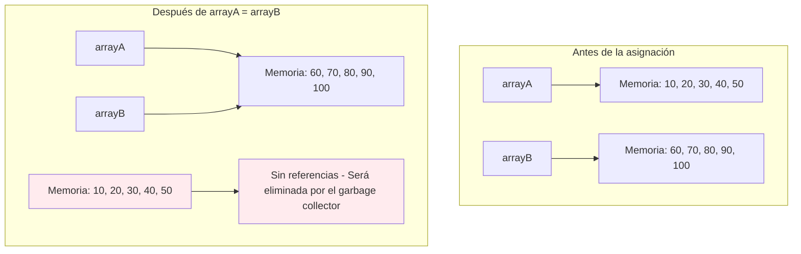
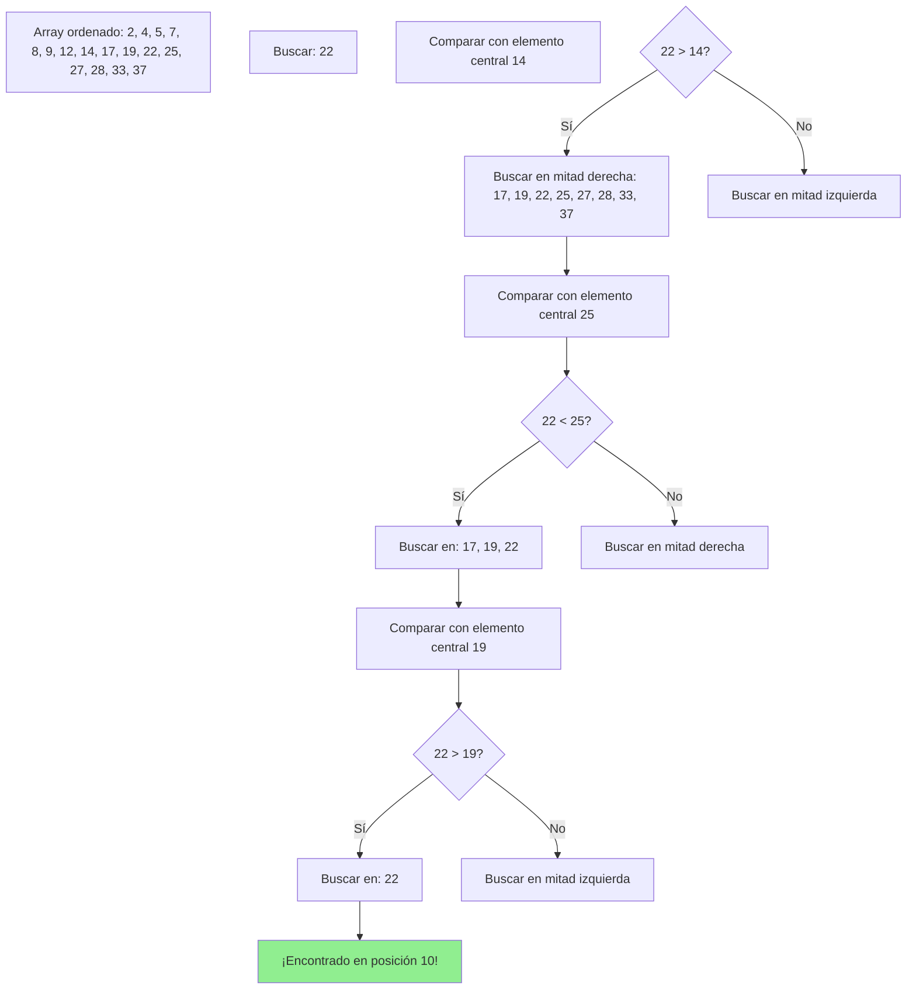
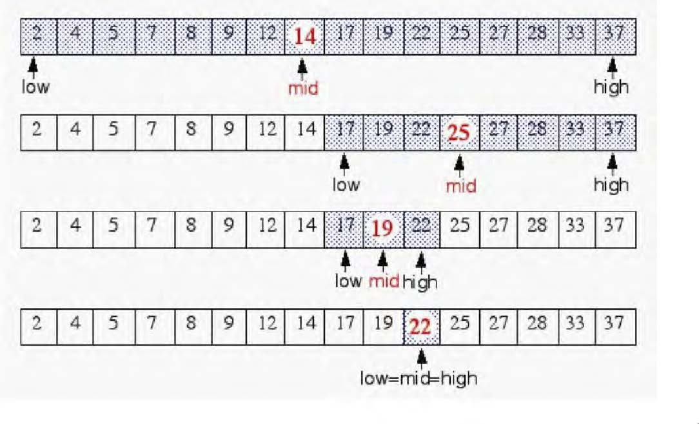
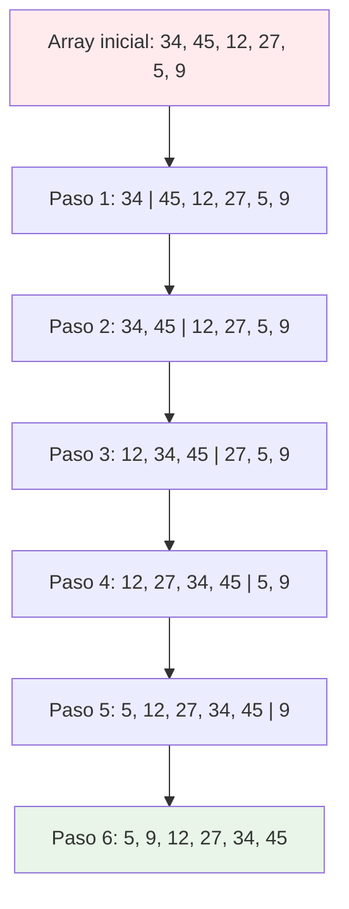

# UT3.2 Copiar, modificar, buscar y ordenar arrays

## 📋 Índice de contenidos

1. [Introducción](#1-introducci%C3%B3n)
2. [Asignación vs copia](#2-asignaci%C3%B3n-vs-copia)
    1. [El problema de las referencias](#21-el-problema-de-las-referencias)
    2. [Comportamiento de la asignación](#22-comportamiento-de-la-asignaci%C3%B3n)
3. [Duplicar arrays](#3-duplicar-arrays)
    1. [Copia manual elemento por elemento](#31-copia-manual-elemento-por-elemento)
4. [Cambiar la longitud de un array](#4-cambiar-la-longitud-de-un-array)
    1. [Limitaciones fundamentales](#41-limitaciones-fundamentales)
    2. [Soluciones alternativas](#42-soluciones-alternativas)
5. [Búsqueda en arrays](#5-b%C3%BAsqueda-en-arrays)
    1. [Búsqueda lineal](#51-b%C3%BAsqueda-lineal)
    2. [Búsqueda binaria](#52-b%C3%BAsqueda-binaria)ƒ
6. [Ordenación de arrays](#6-ordenaci%C3%B3n-de-arrays)
    1. [Algoritmo de inserción directa](#61-algoritmo-de-inserci%C3%B3n-directa)
    2. [Algoritmo de selección directa](#62-algoritmo-de-selecci%C3%B3n-directa)
    3. [Algoritmo de intercambio directo (burbuja)](#63-algoritmo-de-intercambio-directo-burbuja)

## 1. Introducción

En este apartado profundizaremos en las operaciones más comunes y avanzadas que podemos realizar con arrays. Veremos cómo **copiar**, **buscar** y **ordenar** arrays de manera eficiente, así como las limitaciones y mejores prácticas para cada operación.

> [!IMPORTANT]
> Es fundamental comprender la diferencia entre **asignación** y **copia** de arrays para evitar errores comunes que pueden generar comportamientos inesperados en nuestros programas.

## 2. Asignación vs copia

### 2.1 El problema de las referencias

Una de las confusiones más comunes al trabajar con arrays es creer que la **asignación** copia el contenido de un array a otro. En realidad, lo que ocurre es que se **duplica la referencia** al array original.

```java
// Declaración de dos arrays
int[] arrayA = {10, 20, 30, 40, 50};
int[] arrayB = {60, 70, 80, 90, 100};

// ¡ATENCIÓN! Esto NO copia el contenido
arrayA = arrayB;

// Modificamos arrayB
arrayB[2] = 999;

// ¡arrayA también se ha modificado!
System.out.println(arrayA[2]); // Imprime: 999
```


### 2.2 Comportamiento de la asignación



**Ejemplo completo del problema:**

```java
public class ProblemaAsignacion {
    public static void main(String[] args) {
        // Creamos dos arrays independientes
        int[] arrayA = {10, 20, 30, 40, 50};
        int[] arrayB = {60, 70, 80, 90, 100};
        
        System.out.println("=== ANTES DE LA ASIGNACIÓN ===");
        System.out.print("arrayA: ");
        imprimirArray(arrayA);
        System.out.print("arrayB: ");
        imprimirArray(arrayB);
        
        // Asignación (NO es copia)
        arrayA = arrayB;
        
        System.out.println("\n=== DESPUÉS DE arrayA = arrayB ===");
        System.out.print("arrayA: ");
        imprimirArray(arrayA);
        System.out.print("arrayB: ");
        imprimirArray(arrayB);
        
        // Modificamos arrayB
        arrayB[2] = 999;
        arrayB[4] = 777;
        
        System.out.println("\n=== DESPUÉS DE MODIFICAR arrayB ===");
        System.out.print("arrayA: ");
        imprimirArray(arrayA); // ¡También ha cambiado!
        System.out.print("arrayB: ");
        imprimirArray(arrayB);
        
        // Modificamos arrayA
        arrayA[0] = 111;
        
        System.out.println("\n=== DESPUÉS DE MODIFICAR arrayA ===");
        System.out.print("arrayA: ");
        imprimirArray(arrayA);
        System.out.print("arrayB: ");
        imprimirArray(arrayB); // ¡También ha cambiado!
    }
    
    public static void imprimirArray(int[] array) {
        System.out.print("[");
        for (int i = 0; i < array.length; i++) {
            System.out.print(array[i]);
            if (i < array.length - 1) System.out.print(", ");
        }
        System.out.println("]");
    }
}
```

> [!WARNING]
> **¿Qué pasa con los datos originales de arrayA?** Una vez que no hay ninguna referencia apuntando a ellos, el **recolector de basura** (garbage collector) de Java los elimina automáticamente de la memoria.

## 3. Duplicar arrays

### 3.1 Copia manual elemento por elemento

Para **duplicar** un array (tener dos arrays independientes con los mismos valores), debemos copiar cada elemento individualmente:

```java
public class DuplicarArrays {
    public static void main(String[] args) {
        // Array original
        int[] arrayOriginal = {10, 20, 30, 40, 50};
        
        // Crear un nuevo array del mismo tamaño
        int[] arrayCopia = new int[arrayOriginal.length];
        
        // Copiar elemento por elemento
        for (int i = 0; i < arrayOriginal.length; i++) {
            arrayCopia[i] = arrayOriginal[i];
        }
        
        // Verificar que son independientes
        System.out.println("=== ARRAYS DESPUÉS DE LA COPIA ===");
        imprimirArray("Original", arrayOriginal);
        imprimirArray("Copia", arrayCopia);
        
        // Modificar el array original
        arrayOriginal[0] = 999;
        arrayOriginal[2] = 777;
        
        System.out.println("\n=== DESPUÉS DE MODIFICAR EL ORIGINAL ===");
        imprimirArray("Original", arrayOriginal);
        imprimirArray("Copia", arrayCopia); // No ha cambiado
        
        // Modificar la copia
        arrayCopia[1] = 555;
        arrayCopia[4] = 333;
        
        System.out.println("\n=== DESPUÉS DE MODIFICAR LA COPIA ===");
        imprimirArray("Original", arrayOriginal); // No ha cambiado
        imprimirArray("Copia", arrayCopia);
    }
    
    public static void imprimirArray(String nombre, int[] array) {
        System.out.print(nombre + ": [");
        for (int i = 0; i < array.length; i++) {
            System.out.print(array[i]);
            if (i < array.length - 1) System.out.print(", ");
        }
        System.out.println("]");
    }
}
```


## 4. Cambiar la longitud de un array

### 4.1 Limitaciones fundamentales

> [!IMPORTANT]
> En Java, la longitud de un array **NO SE PUEDE CAMBIAR** una vez que ha sido creado. Esta es una limitación fundamental que debemos tener en cuenta al diseñar nuestros programas.

```java
int[] array = new int[5];
// array.length = 10; // ❌ ERROR: No se puede modificar
```


### 4.2 Soluciones alternativas

Ante esta limitación, existen dos enfoques principales:

#### Opción 1: Copiar a un array más grande

```java
public class RedimensionarArray {
    public static void main(String[] args) {
        // Array original con capacidad limitada
        int[] arrayPequeno = {10, 20, 30};
        System.out.println("Array original: ");
        for (int i = 0; i < arrayPequeno.length; i++) {
            System.out.print(arrayPequeno[i] + " ");
        }
        
        // Crear un array más grande
        int[] arrayGrande = new int[arrayPequeno.length * 2];
        
        // Copiar los elementos existentes
        for (int i = 0; i < arrayPequeno.length; i++) {
            arrayGrande[i] = arrayPequeno[i];
        }
        
        // Añadir nuevos elementos
        arrayGrande[3] = 40;
        arrayGrande[4] = 50;
        arrayGrande[5] = 60;
        
        System.out.println("Array ampliado: ");
        for (int i = 0; i < arrayGrande.length; i++) {
            System.out.print(arrayGrande[i] + " ");
        }
        
        // Actualizar la referencia
        arrayPequeno = arrayGrande;
        System.out.println("Array final: ");
        for (int i = 0; i < arrayPequeno.length; i++) {
            System.out.print(arrayPequeno[i] + " ");
        }
    }
}
```


#### Opción 2: Definir un array con tamaño suficiente

```java
public class ArraySobredimensionado {
    public static void main(String[] args) {
        final int CAPACIDAD_MAXIMA = 100;
        int[] datos = new int[CAPACIDAD_MAXIMA];
        int elementosUsados = 0;
        
        // Añadir elementos según sea necesario
        datos[elementosUsados++] = 10;
        datos[elementosUsados++] = 20;
        datos[elementosUsados++] = 30;
        
        System.out.println("Elementos almacenados: " + elementosUsados);
        System.out.println("Capacidad total: " + datos.length);
        
        // Mostrar solo los elementos utilizados
        System.out.print("Datos: [");
        for (int i = 0; i < elementosUsados; i++) {
            System.out.print(datos[i]);
            if (i < elementosUsados - 1) System.out.print(", ");
        }
        System.out.println("]");
    }
}
```

> [!TIP]
> La segunda opción es más eficiente en términos de rendimiento, pero consume más memoria. La primera opción es más eficiente en memoria pero requiere más procesamiento cuando se necesita redimensionar.

## 5. Búsqueda en arrays

La **búsqueda** es el proceso de localizar un elemento específico dentro de un array. Es una operación fundamental en programación y existen diferentes algoritmos según las características de los datos.

### 5.1 Búsqueda lineal

La **búsqueda lineal** compara el elemento buscado con cada elemento del array secuencialmente hasta encontrarlo o agotar todas las posibilidades.

**Características:**

- ✅ Funciona con arrays **ordenados y desordenados**
- ✅ Implementación **sencilla**
- ❌ **Ineficiente** para arrays grandes
- ⏱️ Complejidad temporal: O(n)

```java
public class BusquedaLineal {
    
    public static void main(String[] args) {
        int[] numeros = {64, 34, 25, 12, 22, 11, 90, 5};
        int elementoBuscado = 22;
        int posicion = -1; // Inicializamos la posición como -1 (no encontrado)
        
        // Mostrar el array 
        System.out.print("Array: [");
        for (int i = 0; i < numeros.length; i++) {
            System.out.print(numeros[i]);
            if (i < numeros.length - 1) {
                System.out.print(", ");
            }
        }
        System.out.println("]");
        
        System.out.println("Buscando: " + elementoBuscado);
        
        // Búsqueda lineal directa
        for (int i = 0; i < numeros.length; i++) {
            if (numeros[i] == elementoBuscado) {
                posicion = i;
                break; // Salimos del bucle al encontrar el elemento
            }
        }
        
        if (posicion != -1) {
            System.out.println("✅ Elemento encontrado en la posición: " + posicion);
        } else {
            System.out.println("❌ Elemento no encontrado");
        }
        
        // Buscar un elemento que no existe
        int elementoInexistente = 99;
        posicion = -1; // Reiniciamos la posición
        
        System.out.println("\nBuscando: " + elementoInexistente);
        
        // Búsqueda lineal directa para el segundo elemento
        for (int i = 0; i < numeros.length; i++) {
            if (numeros[i] == elementoInexistente) {
                posicion = i;
                break;
            }
        }
        
        if (posicion != -1) {
            System.out.println("✅ Elemento encontrado en la posición: " + posicion);
        } else {
            System.out.println("❌ Elemento no encontrado");
        }
    }
}
```


### 5.2 Búsqueda binaria

La **búsqueda binaria** es mucho más eficiente, pero requiere que el array esté **previamente ordenado**. Divide el espacio de búsqueda por la mitad en cada iteración.

**Características:**

- ✅ **Muy eficiente** para arrays grandes
- ✅ Complejidad temporal: O(log n)
- ❌ Requiere que el array esté **ordenado**
- ❌ Implementación más **compleja**





```java
public class BusquedaBinaria {
    
    public static void main(String[] args) {
        // Array DEBE estar ordenado para búsqueda binaria
        int[] arrayOrdenado = {2, 4, 5, 7, 8, 9, 12, 14, 17, 19, 22, 25, 27, 28, 33, 37};
        int clave = 22;
        int posicion = -1; // Inicializamos como no encontrado
        
        // Mostrar el array ordenado
        System.out.print("Array ordenado: [");
        for (int i = 0; i < arrayOrdenado.length; i++) {
            System.out.print(arrayOrdenado[i]);
            if (i < arrayOrdenado.length - 1) {
                System.out.print(", ");
            }
        }
        System.out.println("]");
        
        System.out.println("Buscando: " + clave);
        
        // Implementación directa de búsqueda binaria
        int izquierda = 0;
        int derecha = arrayOrdenado.length - 1;
        
        while (izquierda <= derecha) {
            int medio = (izquierda + derecha) / 2;
            
            if (arrayOrdenado[medio] == clave) {
                posicion = medio;
                break; // Elemento encontrado, salimos del bucle
            } else if (clave < arrayOrdenado[medio]) {
                derecha = medio - 1;
            } else {
                izquierda = medio + 1;
            }
        }
        
        // Mostrar resultado
        if (posicion != -1) {
            System.out.println("✅ Elemento encontrado en la posición: " + posicion);
        } else {
            System.out.println("❌ Elemento no encontrado");
        }
    }
}
```

**Versión con traza detallada:**

```java
public class BusquedaBinariaConTraza {
    
    public static void main(String[] args) {
        int[] arrayOrdenado = {2, 4, 5, 7, 8, 9, 12, 14, 17, 19, 22, 25, 27, 28, 33, 37};
        
        // Mostrar array
        System.out.print("Array: [");
        for (int i = 0; i < arrayOrdenado.length; i++) {
            System.out.print(arrayOrdenado[i]);
            if (i < arrayOrdenado.length - 1) {
                System.out.print(", ");
            }
        }
        System.out.println("]");
        
        // ========== PRIMERA BÚSQUEDA (elemento que existe) ==========
        System.out.println("\n🔍 PROCESO DE BÚSQUEDA BINARIA (22)");
        System.out.println("=".repeat(50));
        
        int clave1 = 22;
        int izquierda = 0;
        int derecha = arrayOrdenado.length - 1;
        int iteracion = 1;
        int posicion = -1;
        
        while (izquierda <= derecha) {
            int medio = (izquierda + derecha) / 2;
            
            System.out.printf("Iteración %d:\n", iteracion);
            System.out.printf("  Rango: [%d, %d] (posiciones %d-%d)\n", 
                            arrayOrdenado[izquierda], arrayOrdenado[derecha], izquierda, derecha);
            System.out.printf("  Elemento central: array[%d] = %d\n", medio, arrayOrdenado[medio]);
            
            if (arrayOrdenado[medio] == clave1) {
                System.out.printf("  ✅ ¡Encontrado! El elemento %d está en la posición %d\n", 
                                clave1, medio);
                posicion = medio;
                break;
            } else if (clave1 < arrayOrdenado[medio]) {
                System.out.printf("  ⬅️ %d < %d, buscar en mitad izquierda\n", clave1, arrayOrdenado[medio]);
                derecha = medio - 1;
            } else {
                System.out.printf("  ➡️ %d > %d, buscar en mitad derecha\n", clave1, arrayOrdenado[medio]);
                izquierda = medio + 1;
            }
            
            System.out.println();
            iteracion++;
        }
        
        if (posicion == -1) {
            System.out.printf("❌ Elemento %d no encontrado después de %d iteraciones\n", 
                            clave1, iteracion - 1);
        }
        
        // ========== SEGUNDA BÚSQUEDA (elemento que no existe) ==========
        System.out.println("\n" + "=".repeat(60));
        System.out.println("\n🔍 PROCESO DE BÚSQUEDA BINARIA (15)");
        System.out.println("=".repeat(50));
        
        int clave2 = 15;
        izquierda = 0;
        derecha = arrayOrdenado.length - 1;
        iteracion = 1;
        posicion = -1;
        
        while (izquierda <= derecha) {
            int medio = (izquierda + derecha) / 2;
            
            System.out.printf("Iteración %d:\n", iteracion);
            System.out.printf("  Rango: [%d, %d] (posiciones %d-%d)\n", 
                            arrayOrdenado[izquierda], arrayOrdenado[derecha], izquierda, derecha);
            System.out.printf("  Elemento central: array[%d] = %d\n", medio, arrayOrdenado[medio]);
            
            if (arrayOrdenado[medio] == clave2) {
                System.out.printf("  ✅ ¡Encontrado! El elemento %d está en la posición %d\n", 
                                clave2, medio);
                posicion = medio;
                break;
            } else if (clave2 < arrayOrdenado[medio]) {
                System.out.printf("  ⬅️ %d < %d, buscar en mitad izquierda\n", clave2, arrayOrdenado[medio]);
                derecha = medio - 1;
            } else {
                System.out.printf("  ➡️ %d > %d, buscar en mitad derecha\n", clave2, arrayOrdenado[medio]);
                izquierda = medio + 1;
            }
            
            System.out.println();
            iteracion++;
        }
        
        if (posicion == -1) {
            System.out.printf("❌ Elemento %d no encontrado después de %d iteraciones\n", 
                            clave2, iteracion - 1);
        }
    }
}
```


## 6. Ordenación de arrays

La **ordenación** es el proceso de reorganizar los elementos de un array según un criterio específico (normalmente ascendente o descendente). Existen múltiples algoritmos de ordenación, cada uno con sus ventajas e inconvenientes.

Puedes ver el funcionamiento paso a paso de distintos algoritmos de ordenación en este enlace: <https://visualgo.net/en/sorting>

### 6.1 Algoritmo de inserción directa

El **algoritmo de inserción directa** funciona de manera similar a como ordenarías cartas en tu mano: tomas cada elemento y lo insertas en su posición correcta dentro de la parte ya ordenada.

**Funcionamiento:**

1. Se asume que el primer elemento ya está ordenado
2. Para cada elemento siguiente, se busca su posición correcta en la parte ordenada
3. Se desplazan los elementos mayores hacia la derecha
4. Se inserta el elemento en su posición correcta



```java
public class InsercionOptimizada {
    
    public static void main(String[] args) {
        int[] datos = {64, 34, 25, 12, 22, 11, 90, 5};
        
        // Mostrar array
        System.out.print("Array original: [");
        for (int i = 0; i < datos.length; i++) {
            System.out.print(datos[i]);
            if (i < datos.length - 1) {
                System.out.print(", ");
            }
        }
        System.out.println("]");
        
        // Algoritmo de inserción directa
        for (int i = 1; i < datos.length; i++) {
            int clave = datos[i];
            int j = i - 1;
            
            // Mover elementos mayores una posición hacia la derecha
            while (j >= 0 && datos[j] > clave) {
                datos[j + 1] = datos[j];
                j--;
            }
            
            // Insertar elemento en su posición correcta
            datos[j + 1] = clave;
        }
        
        // Mostrar array ordenado
        System.out.print("Array ordenado: [");
        for (int i = 0; i < datos.length; i++) {
            System.out.print(datos[i]);
            if (i < datos.length - 1) {
                System.out.print(", ");
            }
        }
        System.out.println("]");
    }
}
```

### 6.2 Algoritmo de selección directa

El **algoritmo de selección directa** encuentra el elemento más pequeño del array y lo coloca en la primera posición, luego encuentra el segundo más pequeño y lo coloca en la segunda posición, y así sucesivamente.

**Funcionamiento:**

1. Buscar el elemento mínimo en todo el array
2. Intercambiarlo con el primer elemento
3. Buscar el mínimo en el resto del array (desde la posición 2)
4. Intercambiarlo con el segundo elemento
5. Repetir hasta ordenar todo el array

```java
public class OrdenacionSeleccion {
    
    public static void main(String[] args) {
        int[] numeros = {8, 10, 35, 17, 12, 6, 45, 26};
        
        // Mostrar array inicial
        System.out.print("Array inicial: [");
        for (int i = 0; i < numeros.length; i++) {
            System.out.print(numeros[i]);
            if (i < numeros.length - 1) {
                System.out.print(", ");
            }
        }
        System.out.println("]");
        
        // Algoritmo de ordenación por selección
        for (int i = 0; i < numeros.length - 1; i++) {
            // Encontrar el elemento mínimo en el resto del array
            int indiceMinimo = i;
            
            for (int j = i + 1; j < numeros.length; j++) {
                if (numeros[j] < numeros[indiceMinimo]) {
                    indiceMinimo = j;
                }
            }
            
            // Intercambiar si es necesario
            if (indiceMinimo != i) {
                int temp = numeros[i];
                numeros[i] = numeros[indiceMinimo];
                numeros[indiceMinimo] = temp;
            }
        }
        
        // Mostrar array ordenado
        System.out.print("Array ordenado: [");
        for (int i = 0; i < numeros.length; i++) {
            System.out.print(numeros[i]);
            if (i < numeros.length - 1) {
                System.out.print(", ");
            }
        }
        System.out.println("]");
    }
}
```


### 6.3 Algoritmo de intercambio directo (burbuja)

El **algoritmo burbuja** compara elementos adyacentes y los intercambia si están en orden incorrecto. Los elementos más grandes "burbujean" hacia el final del array.

**Funcionamiento:**

1. Comparar cada par de elementos adyacentes
2. Si están en orden incorrecto, intercambiarlos
3. Repetir el proceso para todo el array
4. Después de cada pasada, el elemento más grande queda en su posición final
5. Repetir hasta que no se realicen más intercambios

**Implementación optimizada:**

```java
public class BurbujaOptimizada {
    
    public static void main(String[] args) {
        int[] datos = {64, 34, 25, 12, 22, 11, 90, 5};
        
        // Mostrar array original
        System.out.print("Array original: [");
        for (int i = 0; i < datos.length; i++) {
            System.out.print(datos[i]);
            if (i < datos.length - 1) {
                System.out.print(", ");
            }
        }
        System.out.println("]");
        
        // Algoritmo de burbuja optimizada
        boolean intercambio;        
        for (int i = 0; i < datos.length - 1; i++) {
            intercambio = false;
            
            for (int j = 0; j < datos.length - 1 - i; j++) {
                if (datos[j] > datos[j + 1]) {
                    // Intercambiar elementos
                    int temp = datos[j];
                    datos[j] = datos[j + 1];
                    datos[j + 1] = temp;
                    intercambio = true;
                }
            }
            
            // Si no hubo intercambios, terminar
            if (!intercambio) {
                break;
            }
        }
                
        // Mostrar array ordenado
        System.out.print("Array ordenado: [");
        for (int i = 0; i < datos.length; i++) {
            System.out.print(datos[i]);
            if (i < datos.length - 1) {
                System.out.print(", ");
            }
        }
        System.out.println("]");
        
    }
}
```

**Comparación de algoritmos de ordenación:**


| Algoritmo | Complejidad | Ventajas | Desventajas |
| :-- | :-- | :-- | :-- |
| **Inserción** | O(n²) | Simple, eficiente para arrays pequeños, estable | Ineficiente para arrays grandes |
| **Selección** | O(n²) | Simple, número mínimo de intercambios | Siempre O(n²), no es estable |
| **Burbuja** | O(n²) | Muy simple, estable, detecta arrays ya ordenados | El más lento de los tres |

> [!NOTE]
> Para arrays grandes, es recomendable usar algoritmos más eficientes como QuickSort, MergeSort o los métodos incorporados en Java.


> [!IMPORTANT]
> Estas prácticas te preparan para trabajar con estructuras de datos más complejas. La comprensión profunda de arrays y sus operaciones es fundamental para el desarrollo de algoritmos eficientes y la resolución de problemas computacionales complejos.

<p align="center">📚 <em>Fin del apartado UT3.2 - Copiar, modificar, buscar y ordenar arrays</em></p>
