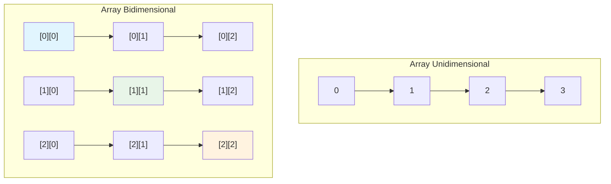

# UT3.3 Arrays multidimensionales

## 📋 Índice de contenidos

1. [Introducción a los arrays multidimensionales](#1-introducci%C3%B3n-a-los-arrays-multidimensionales)
    1. [¿Qué son los arrays multidimensionales?](#11-qu%C3%A9-son-los-arrays-multidimensionales)
    2. [Conceptos fundamentales](#12-conceptos-fundamentales)
2. [Arrays bidimensionales](#2-arrays-bidimensionales)
    1. [Declaración y creación](#21-declaraci%C3%B3n-y-creaci%C3%B3n)
    2. [Inicialización](#22-inicializaci%C3%B3n)
    3. [Ejemplo práctico: tabla de distancias](#23-ejemplo-pr%C3%A1ctico-tabla-de-distancias)
3. [Manipulación de arrays bidimensionales](#3-manipulaci%C3%B3n-de-arrays-bidimensionales)
    1. [Asignación de valores](#31-asignaci%C3%B3n-de-valores)
    2. [Acceso a elementos](#32-acceso-a-elementos)
    3. [Errores comunes](#33-errores-comunes)
4. [Propiedades de los arrays bidimensionales](#4-propiedades-de-los-arrays-bidimensionales)
    1. [Estructura interna](#41-estructura-interna)
    2. [Propiedad length](#42-propiedad-length)
    3. [Arrays con filas de diferente longitud](#43-arrays-con-filas-de-diferente-longitud)
5. [Procesamiento de arrays bidimensionales](#5-procesamiento-de-arrays-bidimensionales)
    1. [Inicialización por teclado](#51-inicializaci%C3%B3n-por-teclado)
    2. [Inicialización con valores aleatorios](#52-inicializaci%C3%B3n-con-valores-aleatorios)
    3. [Recorrido e impresión](#53-recorrido-e-impresi%C3%B3n)
6. [Arrays de tres o más dimensiones](#6-arrays-de-tres-o-m%C3%A1s-dimensiones)
    1. [Declaración y uso](#61-declaraci%C3%B3n-y-uso)
    2. [Ejemplo práctico: sistema de notas](#62-ejemplo-pr%C3%A1ctico-sistema-de-notas)
7. [Preguntas de repaso](#7-preguntas-de-repaso)
8. [Prácticas propuestas](#8-pr%C3%A1cticas-propuestas)

## 1. Introducción a los arrays multidimensionales

### 1.1 ¿Qué son los arrays multidimensionales?

Los **arrays multidimensionales** son estructuras de datos que permiten organizar información en **múltiples dimensiones**, utilizando más de un índice para acceder a cada elemento. Son especialmente útiles para representar datos que tienen una estructura natural de tabla, matriz o cubo.

> [!NOTE]
> Para acceder a una posición concreta en un array multidimensional, en lugar de utilizar un solo valor índice, utilizamos más de uno, **a manera de coordenadas**.

### 1.2 Conceptos fundamentales

**Características principales:**

- 📊 **Estructura tabular**: Permiten organizar datos en filas y columnas (bidimensionales)
- 📍 **Acceso por coordenadas**: Se requieren múltiples índices para localizar un elemento
- 🔗 **Estructura anidada**: Un array multidimensional es realmente un array de arrays
- 📏 **Flexibilidad dimensional**: Pueden tener 2, 3 o más dimensiones según la necesidad



## 2. Arrays bidimensionales

### 2.1 Declaración y creación

La declaración, creación e inicialización de **arrays bidimensionales** es similar a los arrays unidimensionales, pero **utilizando dobles corchetes `[][]`**.

**Sintaxis de declaración:**

```java
tipoDeDato[][] nombreArray;
```

**Sintaxis de creación:**

```java
new tipoDeDato[numeroFilas][numeroColumnas];
```

**Ejemplos prácticos:**

```java
// Declaración
int[][] matriz;
double[][] precios;
String[][] nombres;

// Declaración y creación simultánea
int[][] numeros = new int[3][4];        // 3 filas, 4 columnas
double[][] valores = new double[5][5];   // 5x5
char[][] tablero = new char[8][8];       // 8x8 (como un tablero de ajedrez)
```

### 2.2 Inicialización

**Inicialización elemento por elemento:**

```java
int[][] matriz = new int[2][3];

// Asignar valores individuales
matriz[0][0] = 1;
matriz[0][1] = 2;
matriz[0][2] = 3;
matriz[1][0] = 4;
matriz[1][1] = 5;
matriz[1][2] = 6;
```

**Inicialización directa:**

```java
int[][] matriz = {
    {1, 2, 3},
    {4, 5, 6}
};

// Equivalente a:
int[][] matriz = new int[][]{
    {1, 2, 3},
    {4, 5, 6}
};
```

**Ejemplo gráfico:**


### 2.3 Ejemplo práctico: tabla de distancias

**Problema:** Crear una tabla que almacene las distancias en millas entre ciudades principales de Estados Unidos.

```java
public class TablaDistancias {
    public static void main(String[] args) {
        // Declaración e inicialización de la tabla de distancias
        double[][] distancias = {
            {0,    983,  787,  714,  1375, 967,  1087}, // Chicago
            {983,  0,    214,  1102, 1763, 1723, 1842}, // Boston
            {787,  214,  0,    888,  1549, 1548, 1627}, // New York
            {714,  1102, 888,  0,    661,  781,  810},  // Atlanta
            {1375, 1763, 1549, 661,  0,    1426, 1187}, // Miami
            {967,  1723, 1548, 781,  1426, 0,    239},  // Dallas
            {1087, 1842, 1627, 810,  1187, 239,  0}     // Houston
        };
        
        // Nombres de las ciudades
        String[] ciudades = {
            "Chicago", "Boston", "New York", "Atlanta", 
            "Miami", "Dallas", "Houston"
        };
        
        // Mostrar la tabla de distancias
        System.out.println("TABLA DE DISTANCIAS ENTRE CIUDADES (en millas)");
        System.out.println("=".repeat(60));
        
        // Encabezado
        System.out.printf("%-12s", "");
        for (int j = 0; j < ciudades.length; j++) {
            System.out.printf("%-10s", ciudades[j]);
        }
        System.out.println();
        
        // Filas de datos
        for (int i = 0; i < distancias.length; i++) {
            System.out.printf("%-12s", ciudades[i]);
            for (int j = 0; j < distancias[i].length; j++) {
                System.out.printf("%-10.0f", distancias[i][j]);
            }
            System.out.println();
        }
        
        // Ejemplos de consulta
        System.out.println("\n📍 CONSULTAS DE EJEMPLO:");
        System.out.printf("Distancia de Chicago a Boston: %.0f millas\n", 
                         distancias[0][1]);
        System.out.printf("Distancia de Miami a Dallas: %.0f millas\n", 
                         distancias[4][5]);
        System.out.printf("Distancia de New York a Atlanta: %.0f millas\n", 
                         distancias[2][3]);
    }
}
```

> [!TIP]
> Esta estructura es muy útil para representar relaciones simétricas donde `distancias[i][j] = distancias[j][i]`. Nota cómo la diagonal principal contiene ceros (distancia de una ciudad a sí misma).

## 3. Manipulación de arrays bidimensionales

### 3.1 Asignación de valores

Para asignar datos a un array bidimensional, procedemos de manera similar a los arrays unidimensionales, pero **especificando ambos índices**:

```java
public class AsignacionBidimensional {
    public static void main(String[] args) {
        // Crear array de 5x5
        int[][] matriz = new int[5][5];
        
        // Inicialización secuencial
        int valor = 1;
        for (int i = 0; i < matriz.length; i++) {
            for (int j = 0; j < matriz[i].length; j++) {
                matriz[i][j] = valor;
                valor++;
            }
        }
        
        // Mostrar resultado
        System.out.println("Matriz inicializada secuencialmente:");
        for (int i = 0; i < matriz.length; i++) {
            for (int j = 0; j < matriz[i].length; j++) {
                System.out.printf("%4d", matriz[i][j]);
            }
            System.out.println();
        }
    }
}
```

**Resultado esperado:**

```text
   1   2   3   4   5
   6   7   8   9  10
  11  12  13  14  15
  16  17  18  19  20
  21  22  23  24  25
```

### 3.2 Acceso a elementos

Para acceder a un elemento específico, utilizamos la sintaxis `array[fila][columna]`:

```java
public class AccesoElementos {
    public static void main(String[] args) {
        int[][] numeros = {
            {1, 2, 3},
            {4, 5, 6},
            {7, 8, 9},
            {10, 11, 12}
        };
        
        // Acceso a elementos específicos
        System.out.println("Elemento [0][0]: " + numeros[0][0]); // 1
        System.out.println("Elemento [1][2]: " + numeros[1][2]); // 6
        System.out.println("Elemento [3][1]: " + numeros[3][1]); // 11
        
        // Modificar elementos
        numeros[2][1] = 99;
        System.out.println("Después de modificar [2][1]: " + numeros[2][1]); // 99
        
        // Mostrar la matriz completa
        System.out.println("\nMatriz completa:");
        for (int i = 0; i < numeros.length; i++) {
            for (int j = 0; j < numeros[i].length; j++) {
                System.out.printf("%4d", numeros[i][j]);
            }
            System.out.println();
        }
    }
}
```

### 3.3 Errores comunes

> [!WARNING]
> **Error habitual:** Utilizar comas en lugar de corchetes separados para acceder a los elementos.

```java
// ❌ INCORRECTO - Esto NO funciona en Java
// matriz[2, 1] = 7;

// ✅ CORRECTO - Forma correcta en Java
matriz[2][1] = 7;
```

**Otros errores frecuentes:**

```java
public class ErroresComunes {
    public static void main(String[] args) {
        int[][] matriz = new int[3][4];
        
        // ❌ ERROR: Índices fuera de rango
        // matriz[3][0] = 5; // La fila 3 no existe (válidas: 0, 1, 2)
        
        // ❌ ERROR: Orden incorrecto de índices
        // No confundir [fila][columna] con [columna][fila]
        
        // ✅ CORRECTO: Verificar límites antes de acceder
        int fila = 2;
        int columna = 3;
        
        if (fila >= 0 && fila < matriz.length && 
            columna >= 0 && columna < matriz[fila].length) {
            matriz[fila][columna] = 10;
            System.out.println("Valor asignado correctamente");
        } else {
            System.out.println("Índices fuera de rango");
        }
    }
}
```

## 4. Propiedades de los arrays bidimensionales

### 4.1 Estructura interna

> [!IMPORTANT]
> Un array bidimensional es en realidad **un array unidimensional donde cada elemento es, a su vez, un array unidimensional**.

```mermaid
graph TD
    A[array] --> B[array[0]]
    A --> C[array[1]]
    A --> D[array[2]]
    
    B --> B1[array[0][0]]
    B --> B2[array[0][1]]
    B --> B3[array[0][2]]
    
    C --> C1[array[1][0]]
    C --> C2[array[1][1]]
    C --> C3[array[1][2]]
    
    D --> D1[array[2][0]]
    D --> D2[array[2][1]]
    D --> D3[array[2][2]]
    
    style A fill:#e8f5e8
    style B fill:#e1f5fe
    style C fill:#e1f5fe
    style D fill:#e1f5fe
```

### 4.2 Propiedad length

Para arrays bidimensionales, la propiedad `length` funciona de manera jerárquica:

- `array.length`: Número de **filas** (primera dimensión)
- `array[i].length`: Número de **columnas** en la fila `i` (segunda dimensión)

```java
public class PropiedadLength {
    public static void main(String[] args) {
        int[][] matriz = {
            {1, 2, 3, 4},
            {5, 6, 7, 8},
            {9, 10, 11, 12}
        };
        
        System.out.println("Número de filas: " + matriz.length); // 3
        System.out.println("Número de columnas en fila 0: " + matriz[0].length); // 4
        System.out.println("Número de columnas en fila 1: " + matriz[1].length); // 4
        System.out.println("Número de columnas en fila 2: " + matriz[2].length); // 4
        
        // Recorrido usando length
        System.out.println("\nRecorrido completo de la matriz:");
        for (int i = 0; i < matriz.length; i++) {
            System.out.print("Fila " + i + ": ");
            for (int j = 0; j < matriz[i].length; j++) {
                System.out.print(matriz[i][j] + " ");
            }
            System.out.println();
        }
    }
}
```

**Ejemplo gráfico:**


### 4.3 Arrays con filas de diferente longitud

Java permite crear arrays bidimensionales donde **cada fila puede tener un número diferente de columnas**. Esto se conoce como **arrays "jagged" o "desiguales"**.

```java
public class ArraysDesiguales {
    public static void main(String[] args) {
        // Declarar array con número de filas pero sin especificar columnas
        int[][] arrayDesigual = new int[4][];
        
        // Asignar diferentes longitudes a cada fila
        arrayDesigual[0] = new int[2]; // 2 columnas
        arrayDesigual[1] = new int[4]; // 4 columnas
        arrayDesigual[2] = new int[1]; // 1 columna
        arrayDesigual[3] = new int[3]; // 3 columnas
        
        // Inicializar con valores
        int valor = 1;
        for (int i = 0; i < arrayDesigual.length; i++) {
            for (int j = 0; j < arrayDesigual[i].length; j++) {
                arrayDesigual[i][j] = valor++;
            }
        }
        
        // Mostrar el array desigual
        System.out.println("Array con filas de diferente longitud:");
        for (int i = 0; i < arrayDesigual.length; i++) {
            System.out.print("Fila " + i + " (" + arrayDesigual[i].length + " elementos): ");
            for (int j = 0; j < arrayDesigual[i].length; j++) {
                System.out.print(arrayDesigual[i][j] + " ");
            }
            System.out.println();
        }
        
        // Inicialización directa de array desigual
        int[][] triangular = {
            {1},
            {2, 3},
            {4, 5, 6},
            {7, 8, 9, 10}
        };
        
        System.out.println("\nArray triangular:");
        for (int i = 0; i < triangular.length; i++) {
            for (int j = 0; j < triangular[i].length; j++) {
                System.out.printf("%3d", triangular[i][j]);
            }
            System.out.println();
        }
    }
}
```


## 5. Procesamiento de arrays bidimensionales

### 5.1 Inicialización por teclado

```java
import java.util.Scanner;

public class InicializacionTeclado {
    public static void main(String[] args) {
        Scanner scanner = new Scanner(System.in);
        
        // Pedir dimensiones
        System.out.print("Introduce el número de filas: ");
        int filas = scanner.nextInt();
        scanner.nextLine();
        
        System.out.print("Introduce el número de columnas: ");
        int columnas = scanner.nextInt();
        scanner.nextLine();
        
        // Crear matriz
        int[][] matriz = new int[filas][columnas];
        
        // Llenar matriz con datos del usuario
        System.out.println("\nIntroduce los valores de la matriz:");
        for (int i = 0; i < matriz.length; i++) {
            for (int j = 0; j < matriz[i].length; j++) {
                System.out.printf("Elemento [%d][%d]: ", i, j);
                matriz[i][j] = scanner.nextInt();
                scanner.nextLine();
            }
        }
        
        // Mostrar matriz introducida
        System.out.println("\nMatriz introducida:");
        for (int i = 0; i < matriz.length; i++) {
            for (int j = 0; j < matriz[i].length; j++) {
                System.out.printf("%6d", matriz[i][j]);
            }
            System.out.println();
        }
        
        scanner.close();
    }
}
```

### 5.2 Inicialización con valores aleatorios

```java
public class InicializacionAleatoria {
    public static void main(String[] args) {
        int filas = 4;
        int columnas = 5;
        int[][] matriz = new int[filas][columnas];
        
        // Llenar con números aleatorios entre 1 y 100
        System.out.println("Inicializando matriz con valores aleatorios...");
        for (int i = 0; i < matriz.length; i++) {
            for (int j = 0; j < matriz[i].length; j++) {
                matriz[i][j] = (int)(Math.random() * 100) + 1;
            }
        }
        
        // Mostrar matriz
        System.out.println("\nMatriz con valores aleatorios:");
        System.out.println("=".repeat(30));
        for (int i = 0; i < matriz.length; i++) {
            for (int j = 0; j < matriz[i].length; j++) {
                System.out.printf("%6d", matriz[i][j]);
            }
            System.out.println();
        }
    }
}
```

### 5.3 Recorrido e impresión

```java
public class RecorridoImpresion {
    public static void main(String[] args) {
        int[][] matriz = {
            {1, 2, 3, 4},
            {5, 6, 7, 8},
            {9, 10, 11, 12}
        };
        
        // Método 1: Bucles for tradicionales
        System.out.println("Método 1 - Bucles for tradicionales:");
        for (int i = 0; i < matriz.length; i++) {
            for (int j = 0; j < matriz[i].length; j++) {
                System.out.printf("%4d", matriz[i][j]);
            }
            System.out.println();
        }
        
        // Método 2: For-each (enhanced for)
        System.out.println("\nMétodo 2 - For-each:");
        for (int[] fila : matriz) {
            for (int elemento : fila) {
                System.out.printf("%4d", elemento);
            }
            System.out.println();
        }
        
        // Método 3: Impresión con formato de tabla
        System.out.println("\nMétodo 3 - Formato de tabla:");
        System.out.println("+" + "-".repeat(17) + "+");
        for (int i = 0; i < matriz.length; i++) {
            System.out.print("|");
            for (int j = 0; j < matriz[i].length; j++) {
                System.out.printf("%4d", matriz[i][j]);
            }
            System.out.println(" |");
        }
        System.out.println("+" + "-".repeat(17) + "+");
    }
}
```

## 6. Arrays de tres o más dimensiones

### 6.1 Declaración y uso

En ocasiones puede ser útil declarar arrays de **tres o más dimensiones**. La declaración, creación e inicialización es similar a los casos anteriores.

```java
// Declaración de array tridimensional
int[][][] cubo = new int[3][4][5]; // 3x4x5

// Declaración de array de cuatro dimensiones
double[][][][] hiperCubo = new double[2][3][4][5];
```

### 6.2 Ejemplo práctico: sistema de notas

**Problema:** Sistema para almacenar las notas de 6 alumnos que realizan 5 exámenes, cada uno compuesto por dos partes: teoría (sobre 20 puntos) y práctica (sobre 60 puntos).

```java
public class SistemaNotas3D {
    public static void main(String[] args) {
        // Estructura: [alumno][examen][parte]
        // parte 0 = teoría (sobre 20), parte 1 = práctica (sobre 60)
        double[][][] notas = {
            {{7.5, 20.5}, {9.0, 22.5}, {15, 33.5}, {13, 21.5}, {15, 2.5}},   // Alumno 0
            {{4.5, 21.5}, {9.0, 22.5}, {15, 34.5}, {12, 20.5}, {14, 9.5}},   // Alumno 1
            {{6.5, 30.5}, {9.4, 10.5}, {11, 33.5}, {11, 23.5}, {10, 2.5}},   // Alumno 2
            {{6.5, 23.5}, {9.4, 32.5}, {13, 34.5}, {11, 20.5}, {16, 7.5}},   // Alumno 3
            {{8.5, 26.5}, {9.4, 52.5}, {13, 36.5}, {13, 24.5}, {16, 2.5}},   // Alumno 4
            {{9.5, 20.5}, {9.4, 42.5}, {13, 31.5}, {12, 20.5}, {16, 6.5}}    // Alumno 5
        };
        
        String[] nombresAlumnos = {"Ana", "Luis", "Carmen", "David", "Elena", "Fernando"};
        
        System.out.println("SISTEMA DE NOTAS - ANÁLISIS COMPLETO");
        System.out.println("=".repeat(50));
        
        // Calcular nota final de cada alumno (teoría + práctica)
        for (int alumno = 0; alumno < notas.length; alumno++) {
            System.out.println("\n👤 ALUMNO: " + nombresAlumnos[alumno]);
            System.out.println("-".repeat(30));
            
            double sumaTotal = 0;
            int numExamenes = notas[alumno].length;
            
            for (int examen = 0; examen < numExamenes; examen++) {
                double teoria = notas[alumno][examen][0];
                double practica = notas[alumno][examen][1];
                double notaExamen = teoria + practica; // Nota total del examen
                
                sumaTotal += notaExamen;
                
                System.out.printf("  Examen %d: Teoría=%.1f/20, Práctica=%.1f/60, Total=%.1f/80\n", 
                                examen + 1, teoria, practica, notaExamen);
            }
            
            double notaMedia = sumaTotal / numExamenes;
            double notaMediaSobre10 = (notaMedia / 80) * 10; // Convertir a escala 0-10
            
            System.out.printf("  📊 NOTA MEDIA: %.2f/80 (%.2f/10)\n", notaMedia, notaMediaSobre10);
            
            // Calificación
            String calificacion;
            if (notaMediaSobre10 >= 9) calificacion = "Sobresaliente";
            else if (notaMediaSobre10 >= 7) calificacion = "Notable";
            else if (notaMediaSobre10 >= 5) calificacion = "Aprobado";
            else calificacion = "Suspenso";
            
            System.out.println("  🏆 CALIFICACIÓN: " + calificacion);
        }
    }
}
```

## 7. Preguntas de repaso

### Pregunta 1

¿Pueden las filas de un array bidimensional tener diferente longitud?

<details>
<summary>💡 Ver respuesta</summary>

**Sí**, en Java es posible crear arrays bidimensionales donde cada fila tenga un número diferente de columnas. Esto se llama "jagged arrays" o arrays desiguales.

```java
int[][] arrayDesigual = new int[3][];
arrayDesigual[0] = new int[2]; // 2 columnas
arrayDesigual[1] = new int[4]; // 4 columnas  
arrayDesigual[2] = new int[1]; // 1 columna
```

</details>

### Pregunta 2

¿Cuál es la salida del siguiente código?

```java
int[][] array = new int[5][6];
int[] x = {1, 2};
array[0] = x;
System.out.println("array[0][1] is " + array[0][1]);
```

<details>
<summary>💡 Ver respuesta</summary>

**Salida:** `array[1] is 2`

**Explicación:** 
- Se crea un array 5x6 (inicializado con ceros)
- Se crea un array unidimensional `x` con valores {1, 2}
- Se asigna la referencia de `x` a `array`, reemplazando la fila original
- `array[1]` accede al segundo elemento de `x`, que es 2

</details>

### Pregunta 3

¿Cuáles sentencias son válidas?

```java
int[][] r = new int[2];
int[] x = new int[];
int[][] y = new int[3][];
int[][] z = {{1, 2}};
int[][] m = {{1, 2}, {2, 3}};
int[][] n = {{1, 2}, {2, 3}, };
```

<details>
<summary>💡 Ver respuesta</summary>

**Válidas:**
- `int[][] y = new int[3][];` ✅ (Array con 3 filas, columnas sin especificar)
- `int[][] z = {{1, 2}};` ✅ (Inicialización directa)
- `int[][] m = {{1, 2}, {2, 3}};` ✅ (Inicialización directa)
- `int[][] n = {{1, 2}, {2, 3}, };` ✅ (Coma final es válida)

**Inválidas:**
- `int[][] r = new int[3];` ❌ (Falta segunda dimensión)
- `int[] x = new int[];` ❌ (Falta tamaño o inicialización)

</details>

### Pregunta 4

¿Cuál es la salida del siguiente código?

```java
int[][] array = {{1, 2}, {3, 4}, {5, 6}};
for (int i = array.length - 1; i >= 0; i--) {
    for (int j = array[i].length - 1; j >= 0; j--)
        System.out.print(array[i][j] + " ");
}
```

<details>
<summary>💡 Ver respuesta</summary>

**Salida:** `6 5 4 3 2 1`

**Explicación:** Se recorre la matriz desde la última fila hacia la primera, y dentro de cada fila desde la última columna hacia la primera.

</details>

### Pregunta 5

¿Cuál es la salida del siguiente código?

```java
int[][] array = {{1, 2}, {3, 4}, {5, 6}};
int sum = 0;
for (int i = 0; i < array.length; i++)
    sum += array[i][0];
System.out.println(sum);
```

<details>
<summary>💡 Ver respuesta</summary>

**Salida:** `9`

**Explicación:** Se suma el primer elemento de cada fila: 1 + 3 + 5 = 9.

</details>

## 8. Prácticas propuestas

### Práctica 3.7: Tabla de distancias

**📝 Enunciado:**

Copia el array bidimensional del ejemplo de las distancias entre ciudades mostrado anteriormente y muestra después sus valores por pantalla en forma de matriz (tabla).

<details>
<summary>💻 Ver solución</summary>

```java
public class TablaDistanciasPractica {
    public static void main(String[] args) {
        // Array bidimensional con distancias entre ciudades
        double[][] distancias = {
            {0,    983,  787,  714,  1375, 967,  1087}, // Chicago
            {983,  0,    214,  1102, 1763, 1723, 1842}, // Boston
            {787,  214,  0,    888,  1549, 1548, 1627}, // New York
            {714,  1102, 888,  0,    661,  781,  810},  // Atlanta
            {1375, 1763, 1549, 661,  0,    1426, 1187}, // Miami
            {967,  1723, 1548, 781,  1426, 0,    239},  // Dallas
            {1087, 1842, 1627, 810,  1187, 239,  0}     // Houston
        };
        
        String[] ciudades = {"Chicago", "Boston", "New York", "Atlanta", "Miami", "Dallas", "Houston"};
        
        // Mostrar tabla de distancias
        System.out.println("TABLA DE DISTANCIAS ENTRE CIUDADES (en millas)");
        System.out.println("=".repeat(70));
        
        // Imprimir encabezado
        System.out.printf("%-12s", "");
        for (String ciudad : ciudades) {
            System.out.printf("%10s", ciudad);
        }
        System.out.println();
        System.out.println("-".repeat(70));
        
        // Imprimir filas de datos
        for (int i = 0; i < distancias.length; i++) {
            System.out.printf("%-12s", ciudades[i]);
            for (int j = 0; j < distancias[i].length; j++) {
                if (i == j) {
                    System.out.printf("%10s", "---"); // Diagonal principal
                } else {
                    System.out.printf("%10.0f", distancias[i][j]);
                }
            }
            System.out.println();
        }
    }
}
```

</details>

### Práctica 3.8: Inicialización con suma de índices

**📝 Enunciado:**

Crea un programa que inicialice un array bidimensional siguiendo estos pasos:

1. El usuario introducirá el número de filas que tendrá el array
2. Posteriormente, el número de columnas
3. Crea una estructura repetitiva que inicialice, fila por fila, elemento a elemento, los valores del array, donde cada celda contendrá el valor de la suma del índice de la fila más el de la columna que le corresponda

<details>
<summary>💻 Ver solución</summary>

```java
import java.util.Scanner;

public class InicializacionSumaIndices {
    public static void main(String[] args) {
        Scanner scanner = new Scanner(System.in);
        
        // Pedir dimensiones con validación
        int filas = 0, columnas = 0;
        
        System.out.print("Introduce el número de filas: ");
        while (!scanner.hasNextInt() || (filas = scanner.nextInt()) <= 0) {
            System.out.println("❌ Error: Introduce un número entero positivo");
            scanner.nextLine();
            System.out.print("Introduce el número de filas: ");
        }
        scanner.nextLine();

        System.out.print("Introduce el número de columnas: ");
        while (!scanner.hasNextInt() || (columnas = scanner.nextInt()) <= 0) {
            System.out.println("❌ Error: Introduce un número entero positivo");
            scanner.nextLine();
            System.out.print("Introduce el número de columnas: ");
        }
        scanner.nextLine();
        
        // Crear array
        int[][] matriz = new int[filas][columnas];
        
        // Inicializar con suma de índices
        System.out.println("\nInicializando array " + filas + "x" + columnas + "...");
        for (int i = 0; i < matriz.length; i++) {
            for (int j = 0; j < matriz[i].length; j++) {
                matriz[i][j] = i + j;
                System.out.println("matriz[" + i + "][" + j + "] = " + i + " + " + j + " = " + matriz[i][j]);
            }
        }
        
        // Mostrar matriz resultante
        System.out.println("\nMatriz resultante:");
        System.out.println("=".repeat(columnas * 4 + 1));
        for (int i = 0; i < matriz.length; i++) {
            System.out.print("|");
            for (int j = 0; j < matriz[i].length; j++) {
                System.out.printf("%3d", matriz[i][j]);
                System.out.print(j == matriz[i].length - 1 ? "|" : " ");
            }
            System.out.println();
        }
        System.out.println("=".repeat(columnas * 4 + 1));
        
        scanner.close();
    }
}
```

</details>

### Práctica 3.9: Sistema de notas de alumnos

**📝 Enunciado:**

Crea un programa que a partir de las siguientes notas de alumnos, calcule la media y la nota máxima de cada uno de ellos. Utiliza un array bidimensional para almacenar la información calculada para cada alumne.

Al final, deberá mostrar el alumno (su nombre) con mejor nota media y el que mayor nota individual ha obtenido (se mostrará también esta dato).

| Alumno | Nota 1 | Nota 2 | Nota 3 | Nota 4 | Nota 5 |
| :-- | :-- | :-- | :-- | :-- | :-- |
| Espinete | 6.0 | 7.2 | 2.3 | 5.8 | 3.4 |
| Don Pinpon | 7.8 | 1.6 | 4.6 | 9.4 | 3.1 |
| Gustavo | 3.6 | 1.4 | 8.9 | 3.5 | 6.5 |
| Triki | 2.5 | 3.0 | 10.0 | 2.4 | 8.9 |

<details>
<summary>💻 Ver solución</summary>

```java
public class SistemaNotasAlumnos {
    public static void main(String[] args) {
        // Datos de entrada
        String[] nombres = {"Espinete", "Don Pinpon", "Gustavo", "Triki"};
        double[][] notas = {
            {6.0, 7.2, 2.3, 5.8, 3.4}, // Espinete
            {7.8, 1.6, 4.6, 9.4, 3.1}, // Don Pinpon
            {3.6, 1.4, 8.9, 3.5, 6.5}, // Gustavo
            {2.5, 3.0, 10.0, 2.4, 8.9} // Triki
        };
        
        // Array para almacenar resultados: [alumno][0=media, 1=máxima]
        double[][] resultados = new double[nombres.length][2];
        
        System.out.println("SISTEMA DE ANÁLISIS DE NOTAS");
        System.out.println("=".repeat(50));
        
        // Calcular media y máxima para cada alumno
        for (int i = 0; i < notas.length; i++) {
            double suma = 0;
            double maxima = notas[i][0];
            
            // Procesar notas del alumno i
            for (int j = 0; j < notas[i].length; j++) {
                suma += notas[i][j];
                if (notas[i][j] > maxima) {
                    maxima = notas[i][j];
                }
            }
            
            // Calcular media
            double media = suma / notas[i].length;
            
            // Almacenar resultados
            resultados[i][0] = media;
            resultados[i][1] = maxima;
            
            // Mostrar información del alumno
            System.out.println("\n👤 ALUMNO: " + nombres[i]);
            System.out.print("   Notas: ");
            for (int j = 0; j < notas[i].length; j++) {
                System.out.printf("%.1f", notas[i][j]);
                if (j < notas[i].length - 1) System.out.print(", ");
            }
            System.out.printf("\n   📊 Media: %.2f\n", media);
            System.out.printf("   🏆 Nota máxima: %.1f\n", maxima);
        }
        
        // Encontrar el alumno con mejor media
        int alumnoMejorMedia = 0;
        for (int i = 1; i < resultados.length; i++) {
            if (resultados[i][0] > resultados[alumnoMejorMedia][0]) {
                alumnoMejorMedia = i;
            }
        }
        
        // Encontrar el alumno con la nota individual más alta
        int alumnoMejorNota = 0;
        for (int i = 1; i < resultados.length; i++) {
            if (resultados[i][1] > resultados[alumnoMejorNota][1]) {
                alumnoMejorNota = i;
            }
        }
        
        // Mostrar ganadores
        System.out.println("\n" + "=".repeat(50));
        System.out.println("🎯 RESULTADOS FINALES");
        System.out.println("=".repeat(50));
        
        System.out.printf("🥇 MEJOR NOTA MEDIA: %s con %.2f puntos\n", 
                         nombres[alumnoMejorMedia], resultados[alumnoMejorMedia][0]);
        
        System.out.printf("⭐ MEJOR NOTA INDIVIDUAL: %s con %.1f puntos\n", 
                         nombres[alumnoMejorNota], resultados[alumnoMejorNota][1]);
        
        // Tabla resumen
        System.out.println("\n📋 TABLA RESUMEN:");
        System.out.println("-".repeat(35));
        System.out.printf("%-12s %8s %8s\n", "Alumno", "Media", "Máxima");
        System.out.println("-".repeat(35));
        for (int i = 0; i < nombres.length; i++) {
            System.out.printf("%-12s %8.2f %8.1f\n", 
                            nombres[i], resultados[i][0], resultados[i][1]);
        }
        System.out.println("-".repeat(35));
    }
}
```

</details>

> [!IMPORTANT]
> Los arrays multidimensionales son fundamentales para representar estructuras de datos complejas como matrices, tablas, tableros de juego, imágenes (píxeles), y sistemas de coordenadas. Dominar su uso te permitirá resolver problemas más sofisticados y prepararte para conceptos avanzados como álgebra lineal computacional y procesamiento de imágenes.

<p align="center">📚 <em>Fin del apartado UT3.3 - Arrays multidimensionales</em></p>
