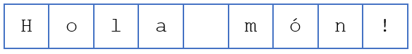
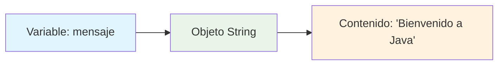
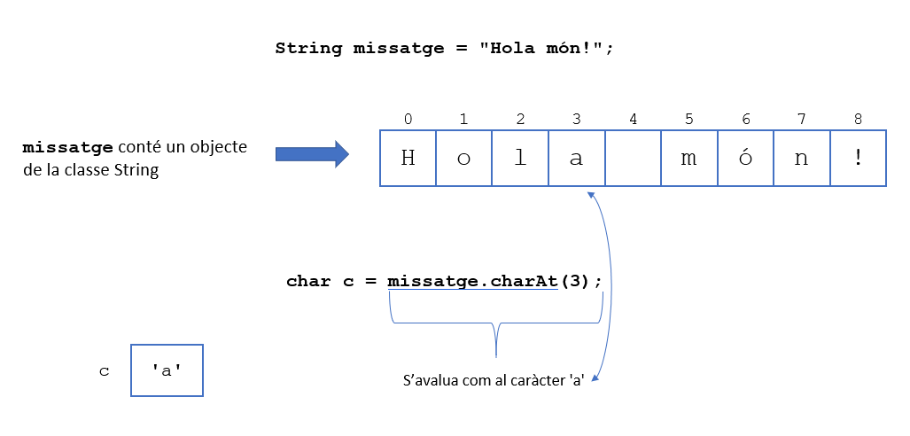

# UT3.4 Tipos de datos compuestos. Tratamiento de Strings

## 📋 Índice de contenidos

1. [Introducción al tratamiento de Strings](#1-introducci%C3%B3n-al-tratamiento-de-strings)
    1. [Concepto de clase y objeto](#11-concepto-de-clase-y-objeto)
    2. [String como ejemplo de clase](#12-string-como-ejemplo-de-clase)
2. [Construcción de Strings](#2-construcci%C3%B3n-de-strings)
    1. [Inicialización básica](#21-inicializaci%C3%B3n-b%C3%A1sica)
    2. [Constructores alternativos](#22-constructores-alternativos)
    3. [Text Blocks](#23-text-blocks)
3. [Manipulación de Strings](#3-manipulaci%C3%B3n-de-strings)
    1. [Inmutabilidad de los Strings](#31-inmutabilidad-de-los-strings)
    2. [Referencias y reasignación](#32-referencias-y-reasignaci%C3%B3n)
4. [Métodos básicos de String](#4-m%C3%A9todos-b%C3%A1sicos-de-string)
    1. [Obtener la longitud - length()](#41-obtener-la-longitud---length)
    2. [Acceder a caracteres - charAt()](#42-acceder-a-caracteres---charat)
    3. [Concatenación - concat()](#43-concatenaci%C3%B3n---concat)
    4. [Conversión de mayúsculas y minúsculas](#44-conversi%C3%B3n-de-may%C3%BAsculas-y-min%C3%BAsculas)
    5. [Eliminar espacios - trim()](#45-eliminar-espacios---trim)
    6. [Formateo de Strings](#46-formateo-de-strings)
5. [Métodos de comparación](#5-m%C3%A9todos-de-comparaci%C3%B3n)
    1. [Comparación de contenido - equals()](#51-comparaci%C3%B3n-de-contenido---equals)
    2. [Comparación ordenada - compareTo()](#52-comparaci%C3%B3n-ordenada---compareto)
    3. [Operador == vs equals()](#53-operador--vs-equals)
6. [Métodos de subcadenas](#6-m%C3%A9todos-de-subcadenas)
    1. [Extraer subcadenas - substring()](#61-extraer-subcadenas---substring)
    2. [Ejemplos prácticos](#62-ejemplos-pr%C3%A1cticos)
7. [Métodos de búsqueda](#7-m%C3%A9todos-de-b%C3%BAsqueda)
    1. [Buscar caracteres y subcadenas](#71-buscar-caracteres-y-subcadenas)
    2. [Búsqueda desde posición específica](#72-b%C3%BAsqueda-desde-posici%C3%B3n-espec%C3%ADfica)
8. [División de cadenas - split()](#8-divisi%C3%B3n-de-cadenas---split)
9. [Conversiones entre tipos](#9-conversiones-entre-tipos)
    1. [De tipos primitivos a String](#91-de-tipos-primitivos-a-string)
    2. [De String a tipos primitivos](#92-de-string-a-tipos-primitivos)
10. [Prácticas propuestas](#10-pr%C3%A1cticas-propuestas)

## 1. Introducción al tratamiento de Strings

### 1.1 Concepto de clase y objeto

Como ya sabemos, un **String** es una secuencia (cadena) de caracteres. Sin embargo, es importante comprender que String representa mucho más que un simple tipo de dato.



> [!IMPORTANT]
> A partir de ahora, cuando nos refiramos a un tipo de dato compuesto, recibirá el nombre de **"clase"** (a excepción del array). También usaremos el nombre de **"objeto"** para referirnos al valor asignado a una variable de un tipo de dato compuesto.

### 1.2 String como ejemplo de clase

```java
public class EjemploStringClase {
    public static void main(String[] args) {
        // La variable "mensaje" es de la clase (tipo de dato compuesto) String
        String mensaje = "Bienvenido a Java";
        
        // "mensaje" guarda un objeto (valor) de la clase String
        System.out.println("Contenido del objeto: " + mensaje);
        System.out.println("Tipo de la variable: " + mensaje.getClass().getSimpleName());
    }
}
```



## 2. Construcción de Strings

### 2.1 Inicialización básica

Un **String se construye** en el momento que le asignamos (con el operador de asignación `=`) cualquier cadena de texto.

> [!NOTE]
> Toda cadena de texto (literal de String) debe estar definida entre una pareja de **comillas dobles** (`"`).

```java
public class ConstruccionStrings {
    public static void main(String[] args) {
        // Forma más común de crear un String
        String saludo = "Hola mundo";
        
        // String vacío
        String vacio = "";
        
        // String con espacios
        String espacios = "   texto con espacios   ";
        
        // String con caracteres especiales
        String especial = "¡Hola! ¿Cómo estás? 123 @#$";
        
        System.out.println("Saludo: '" + saludo + "'");
        System.out.println("Vacío: '" + vacio + "'");
        System.out.println("Con espacios: '" + espacios + "'");
        System.out.println("Especial: '" + especial + "'");
    }
}
```

### 2.2 Constructores alternativos

Java ofrece diferentes formas de crear objetos String:

```java
public class ConstructoresString {
    public static void main(String[] args) {
        // Constructor explícito
        String mensaje1 = new String("Bienvenido a Java");
        
        // Constructor desde array de caracteres
        char[] arrayChar = {'H', 'o', 'l', 'a', ' ', 'J', 'a', 'v', 'a'};
        String mensaje2 = new String(arrayChar);
        
        // Constructor desde parte de un array
        char[] letras = {'A', 'B', 'C', 'D', 'E', 'F', 'G'};
        String mensaje3 = new String(letras, 2, 3); // Desde índice 2, 3 caracteres
        
        System.out.println("Mensaje 1: " + mensaje1);
        System.out.println("Mensaje 2: " + mensaje2);
        System.out.println("Mensaje 3: " + mensaje3); // Resultado: "CDE"
    }
}
```

### 2.3 Text Blocks

Los **Text Blocks** (también llamados *texto multilínea*) son una característica moderna de Java, que permite crear cadenas de texto que abarcan varias líneas de manera más legible y con menos caracteres de escape.

> [!NOTE]
> Los Text Blocks están disponibles a partir de **Java 15** como característica estándar (antes eran preview, o característica experimental).

**Sintaxis:** Se definen utilizando **tres comillas dobles** (`"""`).

```java
public class TextBlocks {
    public static void main(String[] args) {
        // Forma tradicional (incómoda para múltiples líneas)
        String htmlTradicional = "<html>\n" +
                               "    <body>\n" +
                               "        <h1>Hola Mundo</h1>\n" +
                               "    </body>\n" +
                               "</html>";
        
        // Forma moderna con Text Block (mucho más legible)
        String htmlModerno = """
                            <html>
                                <body>
                                    <h1>Hola Mundo</h1>
                                </body>
                            </html>
                            """;
        
        System.out.println("=== FORMA TRADICIONAL ===");
        System.out.println(htmlTradicional);
        
        System.out.println("\n=== TEXT BLOCK ===");
        System.out.println(htmlModerno);
        
        // Otros ejemplos útiles
        String querySQL = """
                         SELECT nombre, edad, ciudad
                         FROM usuarios
                         WHERE edad > 18
                         ORDER BY nombre ASC
                         """;
                         
        String json = """
                     {
                         "nombre": "Ana",
                         "edad": 25,
                         "activo": true
                     }
                     """;
        
        System.out.println("\nConsulta SQL:");
        System.out.println(querySQL);
        
        System.out.println("Objeto JSON:");
        System.out.println(json);
    }
}
```

**Características importantes:**

- Los Text Blocks comienzan con **tres comillas dobles** (`"""`) seguidas de un **salto de línea** y terminan con tres comillas dobles (`"""`) que pueden estar en la **última línea del contenido o en una línea separada**
- La **alineación** se determina por la posición del delimitador de cierre (`"""`)
- Los **saltos de línea** se incluyen automáticamente así como las tabulaciones.
- Se pueden usar **expresiones embebidas** con `formatted()` (método que se estudia más adelante)
- Reducen significativamente el uso de caracteres de escape

```java
public class IndentacionTextBlocks {
    public static void main(String[] args) {
        // La indentación se calcula automáticamente
        String codigo = """
                public class HolaMundo {
                    public static void main(String[] args) {
                        System.out.println("¡Hola mundo!");
                    }
                }
                """;
        
        System.out.println("Código Java:");
        System.out.println(codigo);
        
        // Forzar indentación adicional
        String codigoIndentado = """
                    if (condicion) {
                        hacer_algo();
                    }
                """.indent(4); // Añade 4 espacios extra
        
        System.out.println("Con indentación extra:");
        System.out.println(codigoIndentado);
    }
}
```

## 3. Manipulación de Strings

### 3.1 Inmutabilidad de los Strings

> [!IMPORTANT]
>
> - A diferencia de los tipos de datos primitivos, cualquier objeto almacenado en una variable perteneciente a una clase **no se puede manipular directamente** mediante operadores (suma, resta, etc.).
>
> - La manipulación de Strings se hace siempre mediante la invocación de **MÉTODOS**. Además, es crucial entender que:
>
> - Cualquier método obtendrá información que se basará en el String consultado pero **NUNCA lo modificará**. Es decir, las variables String son **INMUTABLES**.

```java
public class InmutabilidadString {
    public static void main(String[] args) {
        String original = "Java";
        System.out.println("String original: " + original);
        
        // Los métodos NO modifican el String original
        String mayusculas = original.toUpperCase();
        System.out.println("Después de toUpperCase():");
        System.out.println("Original: " + original);      // Sigue siendo "Java"
        System.out.println("Mayúsculas: " + mayusculas);  // "JAVA"
        
        // Para "modificar" un String, debemos reasignar
        original = original.toUpperCase();
        System.out.println("Después de reasignar: " + original); // "JAVA"
    }
}
```

### 3.2 Referencias y reasignación

Es importante recordar que Java trabaja siempre con **REFERENCIAS** a datos cuando son tipos compuestos (Arrays, Strings, etc.).

```java
public class ReferenciasString {
    public static void main(String[] args) {
        String s = "Java";
        System.out.println("Valor inicial: " + s);
        
        // ¿Qué hace esto?
        s = "HTML";
        System.out.println("Después de reasignar: " + s);
    }
}
```


> [!NOTE]
> La información original ("Java") queda sin referencia y será eliminada automáticamente por el **recolector de basura** (Garbage Collector) de Java.

## 4. Métodos básicos de String

### 4.1 Obtener la longitud - length()

El método `length()` devuelve el número de caracteres del String.

> [!IMPORTANT]
> La invocación del método tiene **SIEMPRE** la máxima precedencia a la hora de evaluar la expresión. La invocación se realiza utilizando el **operador punto (.)**.

```java
public class MetodoLength {
    public static void main(String[] args) {
        String mensaje = "Hola mundo";
        
        int longitud = mensaje.length();
        System.out.println("El mensaje '" + mensaje + "' tiene " + longitud + " caracteres");
        
        // Uso en expresiones
        System.out.println("La mitad de caracteres: " + mensaje.length() / 2);
        
        // String vacío
        String vacio = "";
        System.out.println("String vacío tiene " + vacio.length() + " caracteres");
        
        // String con espacios
        String espacios = "   ";
        System.out.println("String con espacios tiene " + espacios.length() + " caracteres");
    }
}
```

### 4.2 Acceder a caracteres - charAt()

El método `charAt(index)` devuelve el carácter en la posición especificada.

```java
public class MetodoCharAt {
    public static void main(String[] args) {
        String mensaje = "Hola mundo!";
        
        // Mostrar información del String
        System.out.println("String: '" + mensaje + "'");
        System.out.println("Longitud: " + mensaje.length());
        System.out.println();
        
        // Mostrar índices y caracteres
        System.out.println("Índice | Carácter");
        System.out.println("-------|----------");
        for (int i = 0; i < mensaje.length(); i++) {
            char caracter = mensaje.charAt(i);
            System.out.printf("   %d   |    '%c'\n", i, caracter);
        }
        
        // Ejemplos específicos
        System.out.println("\nEjemplos específicos:");
        System.out.println("Primer carácter: '" + mensaje.charAt(0) + "'");
        System.out.println("Último carácter: '" + mensaje.charAt(mensaje.length() - 1) + "'");
        System.out.println("Carácter en índice 5: '" + mensaje.charAt(5) + "'");
    }
}
```



### 4.3 Concatenación - concat()

Como ya has visto en temas anteriores, la concatenación se realiza usando el **operador `+`**. Este operador es en realidad una invocación al método `concat()`.

```java
public class MetodosConcat {
    public static void main(String[] args) {
        String str1 = "Hola";
        String str2 = " mundo";
        String str3 = "!";
        
        // Usando el operador +
        String resultado1 = str1 + str2 + str3;
        
        // Usando el método concat()
        String resultado2 = str1.concat(str2).concat(str3);
        
        // Concatenación con números
        String resultado3 = str1 + " " + 2024;
        
        System.out.println("Con operador +: " + resultado1);
        System.out.println("Con concat(): " + resultado2);
        System.out.println("Con números: " + resultado3);
        
        // Concatenación múltiple
        String saludo = "Buenos"
                      .concat(" ")
                      .concat("días")
                      .concat(", ")
                      .concat("estudiante");
        
        System.out.println("Concatenación múltiple: " + saludo);
    }
}
```

### 4.4 Conversión de mayúsculas y minúsculas

```java
public class ConversionMayusculasMinusculas {
    public static void main(String[] args) {
        String texto = "Hola Mundo Java";
        
        System.out.println("Texto original: " + texto);
        System.out.println("En mayúsculas: " + texto.toUpperCase());
        System.out.println("En minúsculas: " + texto.toLowerCase());
        
        // El texto original no cambia
        System.out.println("Original después de métodos: " + texto);
    }
}
```

### 4.5 Eliminar espacios - trim()

El método `trim()` elimina espacios en blanco al principio y al final del String.

```java
public class MetodoTrim {
    public static void main(String[] args) {
        String conEspacios = "   Hola mundo   ";
        
        System.out.println("Original: '" + conEspacios + "'");
        System.out.println("Longitud original: " + conEspacios.length());
        
        String sinEspacios = conEspacios.trim();
        
        System.out.println("Con trim(): '" + sinEspacios + "'");
        System.out.println("Longitud después de trim(): " + sinEspacios.length());
        
        // Casos especiales
        String soloEspacios = "   ";
        String vacio = "";
        String sinEspaciosEnExtremos = "Hola mundo";
        
        System.out.println("\nCasos especiales:");
        System.out.println("Solo espacios: '" + soloEspacios + "' -> '" + soloEspacios.trim() + "'");
        System.out.println("Vacío: '" + vacio + "' -> '" + vacio.trim() + "'");
        System.out.println("Sin espacios extremos: '" + sinEspaciosEnExtremos + "' -> '" + sinEspaciosEnExtremos.trim() + "'");
    }
}
```

### 4.6 Formateo de Strings

Java ofrece dos formas modernas de formatear strings que son más legibles que la concatenación tradicional.

#### String.format() (método estático)

El método estático `String.format()` permite crear cadenas formateadas usando especificadores de formato.

```java
public class MetodoStringFormat {
    public static void main(String[] args) {
        // Datos de ejemplo
        String nombre = "Ana García";
        int edad = 28;
        double salario = 45000.75;
        boolean activo = true;
        
        // Formateo básico con especificadores
        String mensaje1 = String.format("Empleado: %s, Edad: %d años", nombre, edad);
        String mensaje2 = String.format("Salario: %.2f€ - Estado: %s", salario, activo ? "Activo" : "Inactivo");
        
        System.out.println("=== FORMATEO BÁSICO ===");
        System.out.println(mensaje1);
        System.out.println(mensaje2);
        
        // Formateo avanzado con anchura y alineación
        String encabezado = String.format("%-15s | %5s | %10s | %8s", "NOMBRE", "EDAD", "SALARIO", "ESTADO");
        String linea = "-".repeat(50);
        String fila = String.format("%-15s | %5d | %10.2f€ | %8s", 
                                   nombre, edad, salario, activo ? "Activo" : "Inactivo");
        
        System.out.println("\n=== TABLA FORMATEADA ===");
        System.out.println(encabezado);
        System.out.println(linea);
        System.out.println(fila);
        
        // Formateo numérico especializado
        System.out.println("\n=== FORMATEO NUMÉRICO ===");
        double pi = Math.PI;
        int numero = 42;
        
        System.out.println(String.format("Pi con 2 decimales: %.2f", pi));
        System.out.println(String.format("Pi con 5 decimales: %.5f", pi));
        System.out.println(String.format("Número con ceros: %05d", numero));
        System.out.println(String.format("Número hexadecimal: %X", numero));
        System.out.println(String.format("Porcentaje: %.1f%%", salario/1000));
    }
}
```

| Especificador | Tipo | Descripción | Ejemplo |
|---------------|------|-------------|---------|
| `%s` | String | Cadena de texto | `String.format("Hola %s", "mundo")` |
| `%d` | int | Número entero | `String.format("Edad: %d", 25)` |
| `%f` | float/double | Número decimal | `String.format("Precio: %.2f", 19.99)` |
| `%c` | char | Carácter | `String.format("Inicial: %c", 'A')` |
| `%b` | boolean | Verdadero/falso | `String.format("Activo: %b", true)` |
| `%x` | int | Hexadecimal (minúsculas) | `String.format("Hex: %x", 255)` |
| `%X` | int | Hexadecimal (mayúsculas) | `String.format("HEX: %X", 255)` |

#### Método de instancia formatted() - Java 15+

A partir de Java 15, se introdujo el método de instancia `formatted()` que permite formatear directamente sobre un string, lo que resulta en un código más fluido.

```java
public class MetodoFormatted {
    public static void main(String[] args) {
        // Datos de ejemplo
        String producto = "Laptop";
        int cantidad = 3;
        double precioUnitario = 899.99;
        double total = cantidad * precioUnitario;
        
        // Usando formatted() - Java 15+
        String factura = """
                ========== FACTURA ==========
                Producto:      %s
                Cantidad:      %d unidades
                Precio unit.:  %.2f€
                ────────────────────────────
                TOTAL:         %.2f€
                ============================
                """.formatted(producto, cantidad, precioUnitario, total);
        
        System.out.println(factura);
        
        // Comparación con String.format()
        String facturaTradicional = String.format("""
                ========== FACTURA ==========
                Producto:      %s
                Cantidad:      %d unidades
                Precio unit.:  %.2f€
                ────────────────────────────
                TOTAL:         %.2f€
                ============================
                """, producto, cantidad, precioUnitario, total);
        
        // Ejemplo con diferentes tipos de datos
        String nombre = "Carlos";
        int nota = 85;
        char letra = 'B';
        boolean aprobado = nota >= 60;
        
        String reporte = "Estudiante: %s | Nota: %d | Letra: %c | Aprobado: %b"
                        .formatted(nombre, nota, letra, aprobado);
        
        System.out.println("REPORTE: " + reporte);
        
        // Ventaja: más legible en templates largos
        String email = """
                Estimado/a %s,
                
                Su pedido #%04d ha sido procesado exitosamente.
                
                Detalles del pedido:
                - Artículo: %s
                - Cantidad: %d
                - Precio total: %.2f€
                
                Gracias por su compra.
                
                Saludos cordiales,
                El equipo de ventas
                """.formatted("María López", 1234, producto, cantidad, total);
        
        System.out.println(email);
    }
}
```

**Especificadores de formato comunes:**

- `%s` - String
- `%d` - Entero decimal
- `%f` - Número decimal (flotante)
- `%n` - Salto de línea
- `%%` - Porcentaje literal

> [!TIP]
> El método `formatted()` es más moderno y legible, especialmente cuando se combina con Text Blocks.

**Comparación String.format() vs formatted():**

| Aspecto | String.format() | formatted() |
|---------|----------------|-------------|
| **Versión Java** | Desde Java 5 | Desde Java 15 |
| **Sintaxis** | `String.format(template, args)` | `template.formatted(args)` |
| **Legibilidad** | Buena | Excelente con Text Blocks |
| **Compatibilidad** | Universal | Solo versiones modernas |

## 5. Métodos de comparación

| Método                  | Descripción                                                                 |
|-------------------------|-----------------------------------------------------------------------------|
| equals(s1)              | Devuelve `true` si esta cadena es igual a la cadena `s1`.                   |
| equalsIgnoreCase(s1)    | Devuelve `true` si esta cadena es igual a `s1`, ignorando mayúsculas/minúsculas. |
| compareTo(s1)           | Devuelve un entero mayor que 0, igual a 0, o menor que 0 para indicar si esta cadena es mayor, igual o menor que `s1`. |
| compareToIgnoreCase(s1) | Igual que `compareTo`, pero la comparación ignora mayúsculas/minúsculas.    |
| startsWith(prefijo)     | Devuelve `true` si esta cadena comienza con el prefijo especificado.        |
| endsWith(sufijo)        | Devuelve `true` si esta cadena termina con el sufijo especificado.          |
| contains(s1)            | Devuelve `true` si `s1` es una subcadena dentro de esta cadena.            |

### 5.1 Comparación de contenido - equals()

Para comparar el **contenido** de dos Strings, utilizamos el método `equals()`.

```java
public class ComparacionEquals {
    public static void main(String[] args) {
        String string1 = "Java";
        String string2 = "Java";
        String string3 = "java";
        String string4 = new String("Java");
        
        System.out.println("string1: " + string1);
        System.out.println("string2: " + string2);
        System.out.println("string3: " + string3);
        System.out.println("string4: " + string4);
        System.out.println();
        
        // Comparaciones con equals
        System.out.println("string1.equals(string2): " + string1.equals(string2)); // true
        System.out.println("string1.equals(string3): " + string1.equals(string3)); // false
        System.out.println("string1.equals(string4): " + string1.equals(string4)); // true
        
        // Comparación sin considerar mayúsculas/minúsculas
        System.out.println("string1.equalsIgnoreCase(string3): " + string1.equalsIgnoreCase(string3)); // true
        
        // Comparar con literal
        String entrada = "JAVA";
        if (entrada.equalsIgnoreCase("java")) {
            System.out.println("El usuario escribió 'java' (sin importar mayúsculas)");
        }
    }
}
```

### 5.2 Comparación ordenada - compareTo()

El método `compareTo()` compara Strings lexicográficamente (orden alfabético).

```java
public class ComparacionCompareTo {
    public static void main(String[] args) {
        String str1 = "abc";
        String str2 = "def";
        String str3 = "abc";
        String str4 = "ABC";
        
        System.out.println("Comparaciones con compareTo():");
        System.out.println("'abc'.compareTo('def'): " + str1.compareTo(str2)); // Negativo
        System.out.println("'def'.compareTo('abc'): " + str2.compareTo(str1)); // Positivo
        System.out.println("'abc'.compareTo('abc'): " + str1.compareTo(str3)); // 0
        System.out.println("'abc'.compareTo('ABC'): " + str1.compareTo(str4)); // Positivo
        
        // Interpretación de resultados
        System.out.println("\nInterpretación:");
        int resultado = str1.compareTo(str2);
        if (resultado < 0) {
            System.out.println("'" + str1 + "' viene ANTES que '" + str2 + "' alfabéticamente");
        } else if (resultado > 0) {
            System.out.println("'" + str1 + "' viene DESPUÉS que '" + str2 + "' alfabéticamente");
        } else {
            System.out.println("'" + str1 + "' es igual a '" + str2 + "'");
        }
        
        // Sin considerar mayúsculas
        System.out.println("\nSin considerar mayúsculas:");
        System.out.println("'abc'.compareToIgnoreCase('ABC'): " + str1.compareToIgnoreCase(str4)); // 0
    }
}
```

### 5.3 Operador == vs equals()

> [!CAUTION]
> El operador `==` compara **referencias**, no contenido. El método `equals()` compara **contenido**.

```java
public class OperadorVsEquals {
    public static void main(String[] args) {
        String string1 = "Java";
        String string2 = "Java";
        String string3 = new String("Java");
        
        System.out.println("=== COMPARACIÓN DE REFERENCIAS (==) ===");
        if (string1 == string2) {
            System.out.println("string1 y string2 apuntan al MISMO objeto");
        } else {
            System.out.println("string1 y string2 apuntan a objetos DIFERENTES");
        }
        
        if (string1 == string3) {
            System.out.println("string1 y string3 apuntan al MISMO objeto");
        } else {
            System.out.println("string1 y string3 apuntan a objetos DIFERENTES");
        }
        
        System.out.println("\n=== COMPARACIÓN DE CONTENIDO (equals) ===");
        if (string1.equals(string2)) {
            System.out.println("string1 y string2 tienen el MISMO contenido");
        } else {
            System.out.println("string1 y string2 tienen contenido DIFERENTE");
        }
        
        if (string1.equals(string3)) {
            System.out.println("string1 y string3 tienen el MISMO contenido");
        } else {
            System.out.println("string1 y string3 tienen contenido DIFERENTE");
        }
    }
}
```

## 6. Métodos de subcadenas

### 6.1 Extraer subcadenas - substring()

El método `substring()` permite extraer una parte del String original.

```java
public class MetodoSubstring {
    public static void main(String[] args) {
        String mensaje = "Bienvenido a Java";
        
        System.out.println("String original: '" + mensaje + "'");
        System.out.println("Longitud: " + mensaje.length());
        System.out.println();
        
        // substring(beginIndex) - desde una posición hasta el final
        String desde5 = mensaje.substring(5);
        System.out.println("Desde posición 5: '" + desde5 + "'");
        
        // substring(beginIndex, endIndex) - desde una posición hasta otra (exclusive)
        String porcion = mensaje.substring(0, 11);
        System.out.println("De 0 a 11 (exclusivo): '" + porcion + "'");
        
        // Extraer palabras específicas
        String palabra1 = mensaje.substring(0, 11);  // "Bienvenido"
        String palabra2 = mensaje.substring(12, 13); // "a"
        String palabra3 = mensaje.substring(14);     // "Java"
        
        System.out.println("\nPalabras extraídas:");
        System.out.println("Palabra 1: '" + palabra1 + "'");
        System.out.println("Palabra 2: '" + palabra2 + "'");
        System.out.println("Palabra 3: '" + palabra3 + "'");
    }
}
```


### 6.2 Ejemplos prácticos

```java
public class EjemplosSubstring {
    public static void main(String[] args) {
        // Extraer extensión de archivo
        String archivo = "documento.pdf";
        int puntoPos = archivo.lastIndexOf('.');
        if (puntoPos != -1) {
            String nombre = archivo.substring(0, puntoPos);
            String extension = archivo.substring(puntoPos + 1);
            System.out.println("Archivo: " + archivo);
            System.out.println("Nombre: " + nombre);
            System.out.println("Extensión: " + extension);
        }
        
        System.out.println();
        
        // Extraer iniciales de un nombre
        String nombreCompleto = "Juan Carlos Pérez García";
        String[] palabras = nombreCompleto.split(" ");
        String iniciales = "";
        
        for (int i = 0; i < palabras.length; i++) {
            if (palabras[i].length() > 0) {
                iniciales += palabras[i].charAt(0) + ".";
            }
        }
        
        System.out.println("Nombre completo: " + nombreCompleto);
        System.out.println("Iniciales: " + iniciales);
    }
}
```

## 7. Métodos de búsqueda

| Método                     | Descripción                                                                 |
|----------------------------|-----------------------------------------------------------------------------|
| indexOf(ch)                | Devuelve el índice de la primera aparición del carácter `ch` en la cadena. Retorna `-1` si no se encuentra. |
| indexOf(ch, fromIndex)     | Devuelve el índice de la primera aparición de `ch` después de `fromIndex` en la cadena. Retorna `-1` si no se encuentra. |
| indexOf(s)                 | Devuelve el índice de la primera aparición de la subcadena `s` en esta cadena. Retorna `-1` si no se encuentra. |
| indexOf(s, fromIndex)      | Devuelve el índice de la primera aparición de `s` después de `fromIndex`. Retorna `-1` si no se encuentra. |
| lastIndexOf(ch)            | Devuelve el índice de la última aparición del carácter `ch` en la cadena. Retorna `-1` si no se encuentra. |
| lastIndexOf(ch, fromIndex) | Devuelve el índice de la última aparición de `ch` antes de `fromIndex`. Retorna `-1` si no se encuentra. |
| lastIndexOf(s)             | Devuelve el índice de la última aparición de la subcadena `s`. Retorna `-1` si no se encuentra. |
| lastIndexOf(s, fromIndex)  | Devuelve el índice de la última aparición de `s` antes de `fromIndex`. Retorna `-1` si no se encuentra. |

### 7.1 Buscar caracteres y subcadenas

Los métodos de búsqueda permiten localizar caracteres o subcadenas dentro de un String.

```java
public class MetodosBusqueda {
    public static void main(String[] args) {
        String texto = "Java es un lenguaje de programación orientado a objetos";
        
        System.out.println("Texto: " + texto);
        System.out.println();
        
        // Buscar carácter
        char caracterBuscado = 'a';
        int primerA = texto.indexOf(caracterBuscado);
        int ultimoA = texto.lastIndexOf(caracterBuscado);
        
        System.out.println("Buscando el carácter '" + caracterBuscado + "':");
        System.out.println("Primera ocurrencia: posición " + primerA);
        System.out.println("Última ocurrencia: posición " + ultimoA);
        
        // Buscar subcadena
        String palabraBuscada = "programación";
        int posicionPalabra = texto.indexOf(palabraBuscada);
        
        if (posicionPalabra != -1) {
            System.out.println("\nLa palabra '" + palabraBuscada + "' se encuentra en la posición: " + posicionPalabra);
        } else {
            System.out.println("\nLa palabra '" + palabraBuscada + "' no se encontró");
        }
        
        // Buscar desde una posición específica
        int segundaJ = texto.indexOf('J', 1); // Buscar 'J' desde la posición 1
        System.out.println("Segunda 'J' desde posición 1: " + segundaJ);
    }
}
```

### 7.2 Búsqueda desde posición específica

```java
public class BusquedaAvanzada {
    public static void main(String[] args) {
        String email = "usuario@ejemplo.com";
        
        // Encontrar todas las ocurrencias de un carácter
        System.out.println("Email: " + email);
        System.out.print("Posiciones de 'e': ");
        
        int posicion = email.indexOf('e');
        while (posicion != -1) {
            System.out.print(posicion + " ");
            posicion = email.indexOf('e', posicion + 1);
        }
        System.out.println();
        
        // Validar formato de email básico
        int arroba = email.indexOf('@');
        int punto = email.lastIndexOf('.');
        
        if (arroba > 0 && punto > arroba && punto < email.length() - 1) {
            String usuario = email.substring(0, arroba);
            String dominio = email.substring(arroba + 1, punto);
            String extension = email.substring(punto + 1);
            
            System.out.println("\nAnálisis del email:");
            System.out.println("Usuario: " + usuario);
            System.out.println("Dominio: " + dominio);
            System.out.println("Extensión: " + extension);
        } else {
            System.out.println("Formato de email inválido");
        }
    }
}
```

## 8. División de cadenas - split()

El método `split()` retorna un array de Strings a partir del String original y un delimitador.

```java
import java.util.Arrays;

public class MetodoSplit {
    public static void main(String[] args) {
        // Ejemplo básico con espacios
        String frase = "Java es un lenguaje potente";
        String[] palabras = frase.split(" ");
        
        System.out.println("Frase original: " + frase);
        System.out.println("Palabras separadas:");
        for (int i = 0; i < palabras.length; i++) {
            System.out.println((i + 1) + ". '" + palabras[i] + "'");
        }
        
        System.out.println();
        
        // Ejemplo con CSV (Comma Separated Values)
        String datosCSV = "Juan,25,Ingeniero,Madrid";
        String[] campos = datosCSV.split(",");
        
        System.out.println("Datos CSV: " + datosCSV);
        System.out.println("Campos extraídos:");
        String[] etiquetas = {"Nombre", "Edad", "Profesión", "Ciudad"};
        for (int i = 0; i < campos.length && i < etiquetas.length; i++) {
            System.out.println(etiquetas[i] + ": " + campos[i]);
        }
        
        System.out.println();
        
        // Ejemplo con múltiples delimitadores
        String texto = "uno;dos,tres:cuatro";
        String[] partes = texto.split("[;,:]+"); // Expresión regular
        
        System.out.println("Texto con múltiples delimitadores: " + texto);
        System.out.println("Partes: " + Arrays.toString(partes));
        
        // Ejemplo con delimitador repetido
        String conEspaciosMultiples = "palabra1    palabra2  palabra3";
        String[] palabrasLimpias = conEspaciosMultiples.split("\\s+"); // Uno o más espacios
        
        System.out.println("\nTexto con espacios múltiples: '" + conEspaciosMultiples + "'");
        System.out.println("Palabras limpias: " + Arrays.toString(palabrasLimpias));
    }
}
```

> [!TIP]
>
> - El delimitador se **excluye** del resultado
> - El delimitador se admite aunque esté **repetido**
> - Se pueden usar **expresiones regulares** como delimitador

## 9. Conversiones entre tipos

### 9.1 De tipos primitivos a String

```java
public class ConversionAString {
    public static void main(String[] args) {
        // Usando String.valueOf()
        int entero = 42;
        double decimal = 3.14159;
        boolean logico = true;
        char caracter = 'A';
        
        String strEntero = String.valueOf(entero);
        String strDecimal = String.valueOf(decimal);
        String strLogico = String.valueOf(logico);
        String strCaracter = String.valueOf(caracter);
        
        System.out.println("=== CONVERSIÓN CON String.valueOf() ===");
        System.out.println("Entero " + entero + " -> String: '" + strEntero + "'");
        System.out.println("Decimal " + decimal + " -> String: '" + strDecimal + "'");
        System.out.println("Boolean " + logico + " -> String: '" + strLogico + "'");
        System.out.println("Char '" + caracter + "' -> String: '" + strCaracter + "'");
        
        // Usando concatenación con cadena vacía
        String strEntero2 = entero + "";
        String strDecimal2 = decimal + "";
        
        System.out.println("\n=== CONVERSIÓN CON CONCATENACIÓN ===");
        System.out.println("Entero con '': " + strEntero2);
        System.out.println("Decimal con '': " + strDecimal2);
        
        // Usando toString() de wrapper classes
        String strEntero3 = Integer.toString(entero);
        String strDecimal3 = Double.toString(decimal);
        
        System.out.println("\n=== CONVERSIÓN CON toString() ===");
        System.out.println("Integer.toString(): " + strEntero3);
        System.out.println("Double.toString(): " + strDecimal3);
    }
}
```

### 9.2 De String a tipos primitivos

```java
public class ConversionDesdeString {
    public static void main(String[] args) {
        // Strings con valores numéricos
        String strEntero = "123";
        String strDecimal = "45.67";
        String strBoolean = "true";
        
        System.out.println("=== STRINGS ORIGINALES ===");
        System.out.println("String entero: '" + strEntero + "'");
        System.out.println("String decimal: '" + strDecimal + "'");
        System.out.println("String boolean: '" + strBoolean + "'");
        // Conversiones exitosas
        int entero = Integer.parseInt(strEntero);
        double decimal = Double.parseDouble(strDecimal);
        boolean logico = Boolean.parseBoolean(strBoolean);
        
        System.out.println("\n=== CONVERSIONES EXITOSAS ===");
        System.out.println("String '" + strEntero + "' -> int: " + entero);
        System.out.println("String '" + strDecimal + "' -> double: " + decimal);
        System.out.println("String '" + strBoolean + "' -> boolean: " + logico);
            
        // Operaciones con los valores convertidos
        System.out.println("\n=== OPERACIONES ===");
        System.out.println("Entero + 10 = " + (entero + 10));
        System.out.println("Decimal * 2 = " + (decimal * 2));
        System.out.println("NOT boolean = " + (!logico));
           

        // Ejemplo de error
        System.out.println("\n=== MANEJO DE ERRORES ===");
        String textoInvalido = "abc123";
        int numeroInvalido = Integer.parseInt(textoInvalido);
        System.out.println("Conversión exitosa: " + numeroInvalido);
    }
}
```

> [!CAUTION]
> Si el texto **NO puede ser convertido** aparecerá un error (**Exception**). Más adelante veremos como usar `try-catch` para manejar estos errores.

## 10. Prácticas propuestas

### Práctica 3.10: Cadena invertida

**📝 Enunciado:**

Crea un programa que, dada una cadena de texto introducida por teclado, muestre esa misma cadena escrita al revés.

> [!TIP]
> **PISTA:** Utiliza bucles y el método `charAt()`.

<details>
<summary>💻 Ver solución</summary>

```java
import java.util.Scanner;

public class CadenaInvertida {
    public static void main(String[] args) {
        Scanner scanner = new Scanner(System.in);
        
        System.out.print("Introduce una cadena de texto: ");
        String texto = scanner.nextLine();
        
        String textoInvertido = "";
        
        // Recorrer la cadena desde el final hacia el principio
        for (int i = texto.length() - 1; i >= 0; i--) {
            textoInvertido += texto.charAt(i);
        }
        
        System.out.println("\nTexto original: " + texto);
        System.out.println("Texto invertido: " + textoInvertido);
        
        scanner.close();
    }
}
```

</details>

### Práctica 3.11: Conversión a mayúsculas manual

**📝 Enunciado:**

Crea un programa que, a partir de una cadena de caracteres introducida por teclado, muestre la misma cadena pero con todos sus caracteres en mayúsculas. **Es obligatorio utilizar el método `charAt()`**.

> [!TIP]
> **PISTA:** Utiliza la tabla ASCII. Las letras minúsculas tienen valores ASCII mayores que las mayúsculas (diferencia de 32).

<details>
<summary>💻 Ver solución</summary>

```java
import java.util.Scanner;

public class ConversionMayusculasManual {
    public static void main(String[] args) {
        Scanner scanner = new Scanner(System.in);
        
        System.out.print("Introduce una cadena de texto: ");
        String texto = scanner.nextLine();
        
        String textoMayusculas = "";
        
        for (int i = 0; i < texto.length(); i++) {
            char caracter = texto.charAt(i);
            
            // Verificar si es una letra minúscula (a-z = 97-122 en ASCII)
            if (caracter >= 'a' && caracter <= 'z') {
                // Convertir a mayúscula restando 32
                char mayuscula = (char)(caracter - 32);
                textoMayusculas += mayuscula;
            } else {
                // Mantener el carácter original si no es minúscula
                textoMayusculas += caracter;
            }
        }
        
        System.out.println("\nTexto original: " + texto);
        System.out.println("Texto en mayúsculas: " + textoMayusculas);
        
        // Comparación con método incorporado
        System.out.println("Con toUpperCase(): " + texto.toUpperCase());
        
        scanner.close();
    }
}
```

</details>

### Práctica 3.12: Lectura de múltiples palabras

**📝 Enunciado:**

Crea un programa que lea 5 palabras (podrán ser introducidas por teclado en una o en varias líneas).

> [!TIP]
> **PISTA:** Recuerda que para leer Strings existen los métodos `next()` y `nextLine()` de Scanner. ¿Recuerdas la diferencia entre ellos?

<details>
<summary>💻 Ver solución</summary>

```java
import java.util.Scanner;

public class LecturaPalabras {
    public static void main(String[] args) {
        Scanner scanner = new Scanner(System.in);
        String[] palabras = new String[^5];
        
        System.out.println("Introduce 5 palabras (puedes separarlas con espacios o escribir cada una en una línea):");
        
        // Usar next() para leer palabras individuales
        for (int i = 0; i < palabras.length; i++) {
            System.out.print("Palabra " + (i + 1) + ": ");
            palabras[i] = scanner.next();
        }
        
        // Mostrar las palabras introducidas
        System.out.println("\n📝 PALABRAS INTRODUCIDAS:");
        System.out.println("=".repeat(30));
        for (int i = 0; i < palabras.length; i++) {
            System.out.println((i + 1) + ". " + palabras[i]);
        }
        
        // Estadísticas adicionales
        System.out.println("\n📊 ESTADÍSTICAS:");
        int totalCaracteres = 0;
        String palabraMasLarga = palabras[0];
        String palabraMasCorta = palabras[0];
        
        for (int i = 0; i < palabras.length; i++) {
            totalCaracteres += palabras[i].length();
            
            if (palabras[i].length() > palabraMasLarga.length()) {
                palabraMasLarga = palabras[i];
            }
            
            if (palabras[i].length() < palabraMasCorta.length()) {
                palabraMasCorta = palabras[i];
            }
        }
        
        System.out.println("Total de caracteres: " + totalCaracteres);
        System.out.println("Palabra más larga: " + palabraMasLarga + " (" + palabraMasLarga.length() + " caracteres)");
        System.out.println("Palabra más corta: " + palabraMasCorta + " (" + palabraMasCorta.length() + " caracteres)");
        
        scanner.close();
    }
}
```

</details>

### Práctica 3.13: Búsqueda de caracteres

**📝 Enunciado:**

Realiza un programa que:

- Pida al usuario introducir un texto (puede contener espacios)
- Después pregunte al usuario por un carácter a buscar en la frase anterior
- El programa debe mostrar:
  - Si el carácter existe dentro de la frase, la posición de la **primera ocurrencia** y la **última** en la frase
  - Si no existe, se mostrará un mensaje al respecto

<details>
<summary>💻 Ver solución</summary>

```java
import java.util.Scanner;

public class BusquedaCaracteres {
    public static void main(String[] args) {
        Scanner scanner = new Scanner(System.in);
        
        // Pedir el texto
        System.out.print("Introduce un texto: ");
        String texto = scanner.nextLine();
        
        // Pedir el carácter a buscar
        System.out.print("Introduce el carácter a buscar: ");
        String entrada = scanner.nextLine();
        
        // Validar que solo se introdujo un carácter
        if (entrada.length() != 1) {
            System.out.println("❌ Error: Debes introducir exactamente un carácter.");
            scanner.close();
            return;
        }
        
        char caracterBuscado = entrada.charAt(0);
        
        // Buscar primera y última ocurrencia
        int primeraOcurrencia = texto.indexOf(caracterBuscado);
        int ultimaOcurrencia = texto.lastIndexOf(caracterBuscado);
        
        // Mostrar resultados
        System.out.println("\n🔍 RESULTADO DE LA BÚSQUEDA:");
        System.out.println("Texto: \"" + texto + "\"");
        System.out.println("Carácter buscado: '" + caracterBuscado + "'");
        
        if (primeraOcurrencia != -1) {
            System.out.println("✅ El carácter SÍ existe en el texto");
            System.out.println("Primera ocurrencia: posición " + primeraOcurrencia);
            System.out.println("Última ocurrencia: posición " + ultimaOcurrencia);
            
            // Contar todas las ocurrencias
            int contador = 0;
            for (int i = 0; i < texto.length(); i++) {
                if (texto.charAt(i) == caracterBuscado) {
                    contador++;
                }
            }
            System.out.println("Total de ocurrencias: " + contador);
            
            // Mostrar todas las posiciones
            System.out.print("Todas las posiciones: ");
            for (int i = 0; i < texto.length(); i++) {
                if (texto.charAt(i) == caracterBuscado) {
                    System.out.print(i + " ");
                }
            }
            System.out.println();
        } else {
            System.out.println("❌ El carácter NO existe en el texto");
        }
        
        scanner.close();
    }
}
```

</details>

### Práctica 3.14: Juego de adivinanza de palabras

**📝 Enunciado:**

Crea un programa que, dada una palabra secreta, pida al usuario que la adivine. El programa debe:

- Definir una palabra secreta
- Pedir al usuario que introduzca palabras hasta que acierte
- Dar pistas sobre si la palabra introducida es mayor o menor alfabéticamente
- Contar el número de intentos
- Mostrar un mensaje de felicitación cuando acierte

<details>
<summary>💻 Ver solución</summary>

```java
import java.util.Scanner;

public class AdivinaLaPalabra {
    public static void main(String[] args) {
        Scanner scanner = new Scanner(System.in);
        
        String palabraSecreta = "programacion";
        String intento;
        int numeroIntentos = 0;
        boolean adivinado = false;
        
        System.out.println("🎮 ¡JUEGO DE ADIVINANZA DE PALABRAS!");
        System.out.println("=".repeat(35));
        System.out.println("Tienes que adivinar una palabra secreta.");
        System.out.println("Te daré pistas sobre si tu palabra es mayor o menor alfabéticamente.");
        System.out.println("Longitud de la palabra secreta: " + palabraSecreta.length() + " letras");
        System.out.println();
        
        while (!adivinado) {
            System.out.print("Introduce tu intento: ");
            intento = scanner.nextLine().toLowerCase().trim();
            numeroIntentos++;
            
            if (intento.equals(palabraSecreta)) {
                adivinado = true;
                System.out.println();
                System.out.println("🎉 ¡FELICIDADES! ¡Has adivinado la palabra!");
                System.out.println("La palabra secreta era: " + palabraSecreta);
                System.out.println("Número de intentos: " + numeroIntentos);
                
                // Mensaje según número de intentos
                if (numeroIntentos <= 3) {
                    System.out.println("🏆 ¡Excelente! Eres muy bueno adivinando.");
                } else if (numeroIntentos <= 6) {
                    System.out.println("👍 ¡Bien hecho! Lo conseguiste en pocos intentos.");
                } else {
                    System.out.println("👌 ¡Lo lograste! La persistencia es clave.");
                }
            } else {
                // Dar pistas
                int comparacion = intento.compareTo(palabraSecreta);
                System.out.println("❌ Incorrecto. Intento " + numeroIntentos);
                
                if (comparacion < 0) {
                    System.out.println("💡 Pista: Tu palabra viene ANTES alfabéticamente");
                } else {
                    System.out.println("💡 Pista: Tu palabra viene DESPUÉS alfabéticamente");
                }
                
                // Pista adicional sobre la longitud
                if (intento.length() < palabraSecreta.length()) {
                    System.out.println("💡 Pista: Tu palabra es más CORTA");
                } else if (intento.length() > palabraSecreta.length()) {
                    System.out.println("💡 Pista: Tu palabra es más LARGA");
                } else {
                    System.out.println("💡 Pista: Tu palabra tiene la longitud CORRECTA");
                }
                
                System.out.println();
            }
        }
        
        scanner.close();
    }
}
```

</details>

### Práctica 3.15: Ordenación de palabras

**📝 Enunciado:**

Crea un programa que, dado un array de Strings, lo ordene haciendo uso de cualquiera de los métodos de comparación vistos anteriormente.

<details>
<summary>💻 Ver solución</summary>

```java
import java.util.Scanner;

public class OrdenacionPalabras {
    public static void main(String[] args) {
        Scanner scanner = new Scanner(System.in);
        
        // Pedir número de palabras
        int numPalabras = 0;
        System.out.print("¿Cuántas palabras quieres ordenar? ");
        while (!scanner.hasNextInt() || (numPalabras = scanner.nextInt()) <= 0) {
            System.out.println("❌ Error: Introduce un número entero positivo.");
            scanner.nextLine();
            System.out.print("¿Cuántas palabras quieres ordenar? ");
        }
        scanner.nextLine(); // Limpiar buffer
        
        // Crear array y leer palabras
        String[] palabras = new String[numPalabras];
        
        System.out.println("\nIntroduce las " + numPalabras + " palabras:");
        for (int i = 0; i < palabras.length; i++) {
            System.out.print("Palabra " + (i + 1) + ": ");
            palabras[i] = scanner.nextLine().trim();
        }
        
        // Mostrar array original
        System.out.println("\n📝 PALABRAS ORIGINALES:");
        mostrarArray(palabras);
        
        // Preguntar tipo de ordenación
        System.out.println("\n¿Cómo quieres ordenar?");
        System.out.println("1. Orden alfabético normal (A-Z)");
        System.out.println("2. Orden alfabético ignorando mayúsculas");
        System.out.println("3. Orden alfabético inverso (Z-A)");
        System.out.print("Selecciona (1-3): ");
        
        int opcion = 0;
        while (!scanner.hasNextInt() || (opcion = scanner.nextInt()) < 1 || opcion > 3) {
            System.out.println("❌ Error: Selecciona 1, 2 o 3.");
            scanner.nextLine();
            System.out.print("Selecciona (1-3): ");
        }
        
        // Ordenar según la opción seleccionada
        switch (opcion) {
            case 1:
                ordenarAlfabetico(palabras);
                System.out.println("\n✅ Ordenado alfabéticamente (A-Z):");
                break;
            case 2:
                ordenarAlfabeticoIgnoreCase(palabras);
                System.out.println("\n✅ Ordenado alfabéticamente ignorando mayúsculas:");
                break;
            case 3:
                ordenarAlfabeticoInverso(palabras);
                System.out.println("\n✅ Ordenado alfabéticamente inverso (Z-A):");
                break;
        }
        
        mostrarArray(palabras);
        scanner.close();
    }
    
    // Método para mostrar el array
    public static void mostrarArray(String[] array) {
        System.out.println("-".repeat(30));
        for (int i = 0; i < array.length; i++) {
            System.out.println((i + 1) + ". " + array[i]);
        }
        System.out.println("-".repeat(30));
    }
    
    // Ordenación alfabética normal usando burbuja
    public static void ordenarAlfabetico(String[] array) {
        for (int i = 0; i < array.length - 1; i++) {
            for (int j = 0; j < array.length - 1 - i; j++) {
                if (array[j].compareTo(array[j + 1]) > 0) {
                    // Intercambiar
                    String temp = array[j];
                    array[j] = array[j + 1];
                    array[j + 1] = temp;
                }
            }
        }
    }
    
    // Ordenación alfabética ignorando mayúsculas
    public static void ordenarAlfabeticoIgnoreCase(String[] array) {
        for (int i = 0; i < array.length - 1; i++) {
            for (int j = 0; j < array.length - 1 - i; j++) {
                if (array[j].compareToIgnoreCase(array[j + 1]) > 0) {
                    // Intercambiar
                    String temp = array[j];
                    array[j] = array[j + 1];
                    array[j + 1] = temp;
                }
            }
        }
    }
    
    // Ordenación alfabética inversa
    public static void ordenarAlfabeticoInverso(String[] array) {
        for (int i = 0; i < array.length - 1; i++) {
            for (int j = 0; j < array.length - 1 - i; j++) {
                if (array[j].compareTo(array[j + 1]) < 0) {
                    // Intercambiar (invertimos la condición)
                    String temp = array[j];
                    array[j] = array[j + 1];
                    array[j + 1] = temp;
                }
            }
        }
    }
}
```

</details>

> [!NOTE]
> **API de String:** La biblioteca completa de métodos de String la puedes encontrar en: [https://docs.oracle.com/en/java/javase/25/docs/api/java.base/java/lang/String.html](https://docs.oracle.com/en/java/javase/25/docs/api/java.base/java/lang/String.html)

---

> [!IMPORTANT]
> El dominio de la manipulación de Strings es fundamental en programación, ya que la mayoría de aplicaciones reales manejan grandes cantidades de texto. Estas habilidades te serán útiles para procesar datos, validar entradas de usuario, formatear salidas y muchas otras tareas esenciales en el desarrollo de software.

<p align="center">📚 <em>Fin del apartado UT3.4 - Tipos de datos compuestos. Tratamiento de Strings</em></p>
