# UT4.1 Introducción a la Programación Modular

## 📋 Índice de contenidos

1. [Introducción a la programación modular](#1-introducci%C3%B3n-a-la-programaci%C3%B3n-modular)
    1. [Conceptos fundamentales](#11-conceptos-fundamentales)
    2. [Definición de módulo](#12-definici%C3%B3n-de-m%C3%B3dulo)
    3. [Ventajas e inconvenientes](#13-ventajas-e-inconvenientes)
2. [Principios de la programación modular](#2-principios-de-la-programaci%C3%B3n-modular)
    1. [Independencia funcional](#21-independencia-funcional)
    2. [Ocultación de la información](#22-ocultaci%C3%B3n-de-la-informaci%C3%B3n)
    3. [Metodología descendente](#23-metodolog%C3%ADa-descendente)
3. [Descomposición de problemas](#3-descomposici%C3%B3n-de-problemas)
4. [Diseño descendente](#4-dise%C3%B1o-descendente)
    1. [Conceptos fundamentales](#41-conceptos-fundamentales)
    2. [Objetivos del diseño descendente](#42-objetivos-del-dise%C3%B1o-descendente)
    3. [Ejemplo práctico: Receta de fideos yakisoba vegetales](#43-ejemplo-pr%C3%A1ctico-receta-de-fideos-yakisoba-vegetales)
5. [Elaboración de algoritmos](#5-elaboraci%C3%B3n-de-algoritmos)
6. [Reutilización de problemas resueltos](#6-reutilizaci%C3%B3n-de-problemas-resueltos)
7. [Diseño descendente aplicado a la informática](#7-dise%C3%B1o-descendente-aplicado-a-la-inform%C3%A1tica)
    1. [Análisis previo del problema](#71-an%C3%A1lisis-previo-del-problema)
    2. [Definición de etapas](#72-definici%C3%B3n-de-etapas)
8. [Subprogramas: La base de la programación modular](#8-subprogramas-la-base-de-la-programaci%C3%B3n-modular)
    1. [Elementos básicos de un subprograma](#81-elementos-b%C3%A1sicos-de-un-subprograma)
    2. [Funciones vs Procedimientos](#82-funciones-vs-procedimientos)
9. [Ejemplo práctico completo: Suma de números](#9-ejemplo-pr%C3%A1ctico-completo-suma-de-n%C3%BAmeros)

## 1. Introducción a la programación modular

### 1.1 Conceptos fundamentales

Hasta este momento en el curso, hemos sido capaces de diseñar **algoritmos completos** de manera específica (*ad-hoc*) debido a su corta complejidad. Sin embargo, a medida que la complejidad de los problemas aumenta, también lo hace el tamaño del problema y, por tanto, se vuelve más complicado su diseño y mantenimiento.

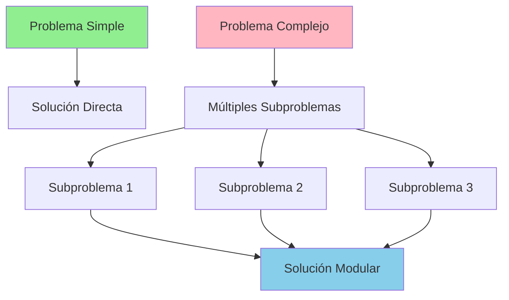

**El concepto de la programación modular es simple**, consiste en **dividir el programa en módulos**. En realidad, se trata de dividir el problema en **subproblemas más sencillos** y claramente diferenciados. Debemos crear programas **claros, inteligibles y breves** para que puedan ser **leídos, entendidos y modificados fácilmente**.

La **programación modular** surge como una metodología fundamental para abordar problemas complejos de manera sistemática y eficiente. Esta aproximación nos permite dividir un problema grande en problemas más pequeños y manejables, cada uno con su propia responsabilidad específica.

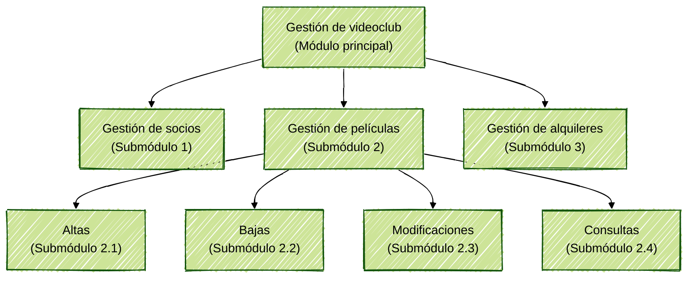

> [!NOTE]
> La programación modular no es solo una técnica de programación, sino una filosofía de diseño que mejora la legibilidad, mantenibilidad y reutilización del código.
>
> La **programación estructurada y modular suelen ser complementarias**. Se usan criterios de programación modular para **descomponer** el problema en partes independientes y después se utiliza la programación estructurada para **desarrollar cada módulo**.

### 1.2 Definición de módulo

Un **módulo** es un **conjunto de instrucciones contiguas**, las cuales se pueden **referenciar** mediante un nombre y pueden ser **llamadas** en diferentes puntos del programa. Un módulo puede ser un **programa, función o procedimiento**.

### 1.3 Ventajas e inconvenientes

Descomponer el programa en módulos supone:

**🎯 VENTAJAS:**

- **📚 Facilidad de desarrollo**: Programas más fáciles de escribir y depurar
- **📖 Comprensión mejorada**: Más fáciles de entender, modificar y mantener
- **🔄 Reutilización de código**: Los módulos pueden ser utilizados en diferentes contextos
- **👥 Trabajo en equipo**: Permite que diferentes programadores trabajen en módulos distintos
- **🧪 Testeo independiente**: Cada módulo puede ser probado por separado

**⚠️ INCONVENIENTES:**

- **🔗 Incremento de interfaces**: Mayor número de interfaces entre módulos
- **💾 Consumo de recursos**: Más memoria y tiempo de ejecución

## 2. Principios de la programación modular

### 2.1 Independencia funcional

Nuestro objetivo será **especializar** cada módulo. La independencia funcional implica que se han de diseñar módulos **altamente cohesionados** (relacionados con la resolución de una única tarea) y **poco acoplados** (poco relacionados con elementos de otros módulos).

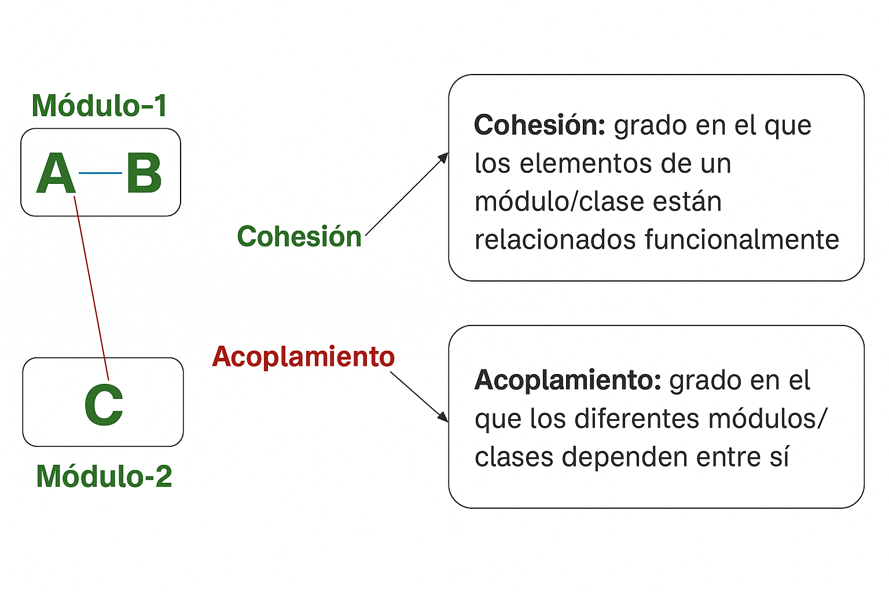

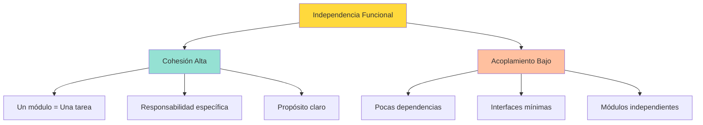

> [!IMPORTANT]
> Un módulo bien diseñado debe resolver una única tarea específica y tener el mínimo de dependencias con otros módulos.

### 2.2 Ocultación de la información


La información contenida dentro de un módulo **ha de ser inaccesible para otros módulos que no necesitan esa información** (si cada programador se dedica a programar una parte del programa puede hacer uso de módulos ya creados, pero sin interesarse por cómo llevan a cabo su tarea).


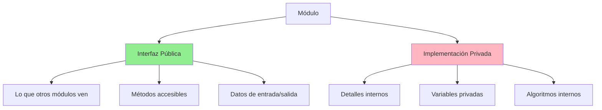

### 2.3 Metodología descendente

Ya sabemos que antes de implementar un programa se ha de diseñar. Para el diseño de un programa modular seguiremos una **metodología descendente** con **refinamiento sucesivo**, es decir, partimos del problema genérico, se **descompone en problemas más concretos** y estos a su vez en **tareas más sencillas** hasta llegar al nivel de tarea más básico.

### Características de la programación modular

- **🔍 Separación de responsabilidades**: Cada módulo tiene una función específica y bien definida
- **🔄 Reutilización**: Los módulos pueden ser utilizados en diferentes contextos
- **🛠️ Mantenibilidad**: Es más fácil modificar o corregir errores en módulos específicos
- **👥 Trabajo en equipo**: Diferentes programadores pueden trabajar en módulos distintos
- **🧪 Testeo**: Cada módulo puede ser probado de forma independiente

Para implementar esta metodología, recurrimos al **diseño descendente**, una técnica sistemática que nos guiará en este proceso de descomposición.

## 3. Descomposición de problemas

> [!CAUTION]
> Es un error muy común afrontar un problema directamente programándolo sin realizar un análisis previo de descomposición.

La **descomposición de problemas** es el proceso de dividir un problema complejo en problemas más simples y manejables. Esta estrategia se basa en el principio de "divide y vencerás", donde cada subproblema puede ser resuelto de manera independiente.

### Ventajas de la descomposición

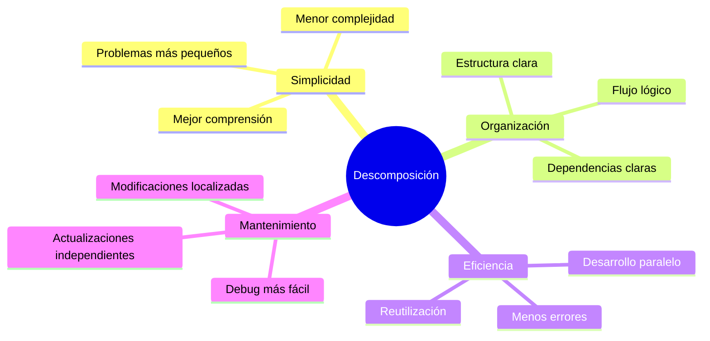

### Principios de la descomposición efectiva

1. **📊 Identificación de tareas**: Reconocer las diferentes tareas que debe realizar el programa
2. **🔗 Análisis de dependencias**: Determinar qué tareas dependen de otras
3. **⚖️ Equilibrio de complejidad**: Asegurar que cada subproblema tenga una complejidad similar
4. **🎯 Cohesión funcional**: Cada módulo debe tener una responsabilidad clara y específica
5. **🔌 Bajo acoplamiento**: Minimizar las dependencias entre módulos

La resolución de los subproblemas dará lugar a la resolución de un problema de nivel superior, creando una jerarquía natural de soluciones.

## 4. Diseño descendente

### 4.1 Conceptos fundamentales

El **diseño descendente** (también conocido como "top-down") es una metodología que se basa en partir de un problema general y dividirlo progresivamente en problemas más simples, denominados **subproblemas**.

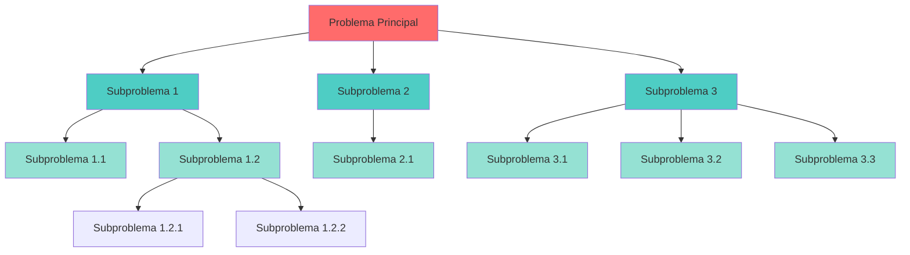

> [!IMPORTANT]
> La descomposición en subproblemas no es arbitraria, sino que se plantea como un **objetivo parcial con entidad propia**, diseñado específicamente para resolver parte del problema de nivel superior.

### Características del diseño descendente

- **🎯 Enfoque jerárquico**: Se trabaja desde lo general hacia lo específico
- **📋 Planificación estructurada**: Cada nivel de descomposición se planifica cuidadosamente
- **🔍 Refinamiento progresivo**: Los detalles se van añadiendo gradualmente
- **✅ Validación por niveles**: Cada nivel puede ser validado antes de continuar

### 4.2 Objetivos del diseño descendente

El diseño descendente busca alcanzar los siguientes objetivos fundamentales:

| Objetivo | Descripción | Beneficio |
| :-- | :-- | :-- |
| **🔗 Relación sencilla** | Establece una relación clara entre problemas y tareas | Facilita la comprensión del sistema |
| **📋 Claridad en los pasos** | Define de forma evidente los pasos para resolver un problema | Reduce la ambigüedad en la implementación |
| **💡 Comprensión mejorada** | Hace más fácil de entender los subproblemas | Mejora el mantenimiento del código |
| **🛡️ Reducción de interdependencias** | Limita los efectos de la interdependencia entre subproblemas | Minimiza el impacto de los cambios |

> [!TIP]
> Un buen indicador de que la descomposición es correcta es cuando puedes asignar un **nombre claro y descriptivo** a cada subproblema sin dificultad.

### 4.3 Ejemplo práctico: Receta de fideos yakisoba vegetales

Para ilustrar el diseño descendente, utilizaremos un ejemplo cotidiano: la preparación de una receta. Este ejemplo nos ayudará a comprender cómo se aplica esta metodología en un contexto familiar antes de trasladarlo a la programación.

#### Nivel 1: Visión general

```text
Fideos yakisoba vegetales
├── 1. Recopilar los ingredientes
├── 2. Cocinar los ingredientes  
└── 3. Preparación final
```

#### Nivel 2: Descomposición de cada etapa principal

**🛒 1. Recopilar los ingredientes:**

```text
1.1. Comprar en el supermercado
1.2. Colocar los ingredientes en la encimera
```

**👨‍🍳 2. Cocinar los ingredientes:**

```text
2.1. Cocinar tallarines
2.2. Cocinar zanahoria
2.3. Cocinar cebollas
```

**🍽️ 3. Preparación final:**

```text
3.1. Mezclar ingredientes preparados con salsa yakitori
3.2. Saltear ingredientes
3.3. Emplatar el resultado
```

#### Nivel 3: Detalle específico de cada subtarea

**🍝 2.1. Cocinar tallarines:**

```text
2.1.1. Preparar el agua
    - Calentar el agua
    - Añadir sal
2.1.2. Hervir los tallarines
2.1.3. Escurrir los tallarines
2.1.4. Reservar los tallarines preparados
```

**🥕 2.2. Cocinar zanahoria:**

```text
2.2.1. Cortar la zanahoria
2.2.2. Freír la zanahoria
    - Preparar aceite para freír
    - Pelar las zanahorias
    - Freír hasta el punto deseado
    - Limpiar aceite de la sartén
2.2.3. Reservar las zanahorias preparadas
```

**🧅 2.3. Cocinar cebollas:**

```text
2.3.1. Cortar cebollas
2.3.2. Freír cebollas
    - Preparar aceite para freír
    - Pelar cebollas
    - Freír hasta el punto deseado
    - Limpiar aceite de la sartén
2.3.3. Reservar las cebollas preparadas
```

**🥘 3.2. Saltear ingredientes:**

```text
3.2.1. Preparar sartén para saltear
3.2.2. Cocinar removiendo los ingredientes
3.2.3. Dejar el plato listo para emplatar
```

> [!NOTE]
> Observa cómo cada proceso requiere ejecutarse en un orden específico, ya que cada uno es dependiente de que el anterior esté resuelto para poder comenzar el siguiente.

Este ejemplo muestra claramente cómo un problema complejo (preparar fideos yakisoba) se puede descomponer en problemas más simples y manejables, cada uno con su propia responsabilidad específica.

## 5. Elaboración de algoritmos

Una vez completada la descomposición del problema, corresponde al programador afrontar la **elaboración del algoritmo** necesario para resolver cada subproblema identificado.

> [!TIP]
> Habitualmente la implementación de algoritmos se realiza al contrario que el diseño del mismo. Es decir, se empiezan implementando los módulos más sencillos de nivel inferior y posteriormente los de nivel superior.

### Principios para la elaboración de algoritmos modulares

Cada subproblema debe ser abordado como una **unidad independiente** que puede ser resuelta y probada por separado. Tomemos como ejemplo el subproblema "Preparar aceite para freír" de nuestra receta:

```text
ALGORITMO: Preparar aceite para freír
ENTRADA: Sartén limpia, aceite, fuego
SALIDA: Aceite caliente listo para freír

PASOS:
1. Tomar la botella de aceite
2. Verter aceite hasta cubrir un tercio de la sartén
3. Encender el fuego al máximo
4. MIENTRAS el aceite no humee HACER
   - Esperar 
   FIN MIENTRAS
5. Reducir el fuego a nivel medio
```

> [!IMPORTANT]
> Observa que este algoritmo es totalmente independiente del resto del proceso de cocina. Puede ser usado tanto para freír zanahorias como cebollas, o incluso en otra receta completamente diferente.

### Ventajas de la elaboración modular

- **🔍 Claridad**: Cada algoritmo tiene un propósito específico y bien definido
- **🧪 Facilidad de prueba**: Podemos probar cada módulo por separado
- **🔄 Reutilización**: Los algoritmos pueden ser reutilizados en diferentes contextos
- **🛠️ Mantenimiento**: Es más fácil localizar y corregir errores
- **📈 Escalabilidad**: Podemos añadir nuevos módulos sin afectar los existentes

### Dependencias entre algoritmos

Es crucial entender que **cada proceso requerirá ejecutarse en orden** ya que cada uno es dependiente de que el anterior esté resuelto para poder comenzar el siguiente.

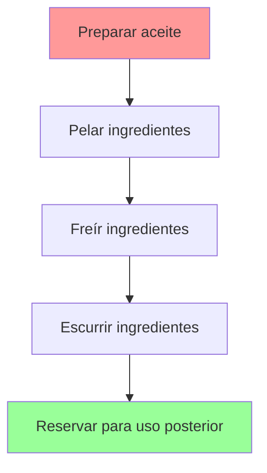

Esta secuencialidad es fundamental en la programación, donde el orden de ejecución determina el correcto funcionamiento del programa.

## 6. Reutilización de problemas resueltos

Una de las ventajas más importantes del diseño descendente es la capacidad de **identificar y reutilizar** problemas que son idénticos o que tienen una estructura similar. Esta reutilización permite evitar duplicar esfuerzo y mejora la eficiencia del desarrollo.

### Identificación de patrones reutilizables

Durante la descomposición de un problema, es común encontrar subproblemas que se repiten con ligeras variaciones. En lugar de crear múltiples soluciones diferentes, podemos diseñar un módulo genérico que sirva para todas las situaciones.

En nuestro ejemplo de la receta, observamos que el proceso de "freír" se repite para diferentes ingredientes:

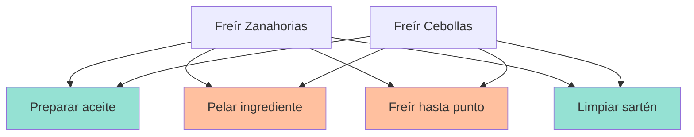

### Beneficios de la reutilización

| Beneficio | Descripción | Ejemplo |
| :-- | :-- | :-- |
| **⚡ Eficiencia** | Evita duplicar esfuerzo de desarrollo | Un solo algoritmo de "freír" para todos los ingredientes |
| **🔄 Consistencia** | Garantiza comportamiento uniforme | Todos los ingredientes se fríen de la misma manera |
| **🛠️ Mantenimiento** | Cambios en un solo lugar | Si mejoramos el proceso de freír, beneficia a todos los usos |
| **🧪 Confiabilidad** | Código probado y verificado | Si el algoritmo funciona para zanahorias, funcionará para cebollas |

### Estrategias para maximizar la reutilización

1. **🎯 Identificación temprana**: Buscar patrones durante la fase de diseño
2. **📦 Abstracción**: Crear módulos genéricos que puedan parametrizarse
3. **📚 Documentación**: Documentar claramente la funcionalidad de cada módulo reutilizable
4. **🔍 Análisis de similitudes**: Comparar estructuras y procesos para encontrar commonalities

> [!TIP]
> La reutilización no solo ahorra tiempo de desarrollo, sino que también mejora la calidad del software al usar código que ya ha sido probado y verificado.

## 7. Diseño descendente aplicado a la informática

### 7.1 Análisis previo del problema

Vamos a aplicar la metodología del diseño descendente a un problema informático concreto y de complejidad manejable para ilustrar todos los conceptos aprendidos.

**🎯 Problema propuesto:**
> "A partir de una lista de 10 números enteros, mostrarlos por pantalla ya ordenados"

### 7.2 Definición de etapas

Antes de comenzar con la descomposición, es fundamental realizar un **análisis de los datos** que necesitaremos:

#### Análisis de datos necesarios

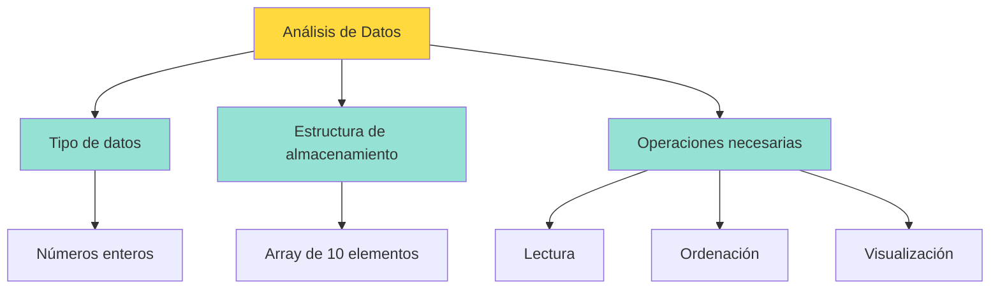

**Decisiones de diseño:**

- **📊 Tipo de datos**: Necesitaremos alguna estructura que permita leer números enteros
- **💾 Almacenamiento**: Un array para almacenar los 10 números
- **🔧 Operaciones**: Funciones para leer, ordenar y mostrar

#### Etapas definidas (Primer nivel)

Aplicando el diseño descendente, identificamos las etapas principales:

```text
PROGRAMA: Ordenar lista de enteros
├── 1. Leer una lista de enteros
├── 2. Ordenar una lista de enteros (método de la burbuja)
└── 3. Mostrar una lista de enteros por pantalla
```

#### Validación del primer nivel

Después de definir el primer nivel, es necesario **reanalizar cada subproblema** para determinar si es necesario descomponerlo más o si ya tiene la complejidad adecuada.

**📋 Análisis de complejidad por etapa:**

| Etapa | Complejidad | ¿Necesita descomposición? |
| :-- | :-- | :-- |
| **Leer lista** | Simple - entrada de datos estándar | ❌ No |
| **Ordenar lista** | Moderada - algoritmo conocido | ❌ No (usaremos burbuja) |
| **Mostrar lista** | Simple - salida de datos estándar | ❌ No |

> [!NOTE]
> En este problema específico, hemos determinado que **no será necesario descomponer en más niveles**, ya que cada etapa tiene una complejidad manejable y un propósito bien definido.

### Diagrama de flujo del diseño completo

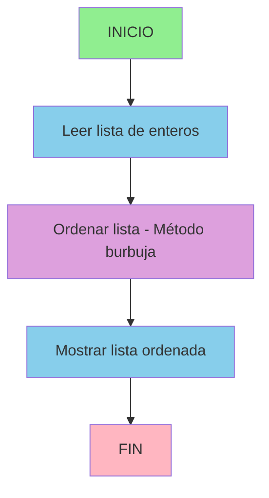

### Consideraciones adicionales

Aunque en este ejemplo la descomposición es relativamente simple, en problemas más complejos es importante considerar:

- **🔗 Interfaces entre módulos**: Cómo se comunican los diferentes módulos
- **📊 Estructuras de datos compartidas**: Qué datos necesitan ser accesibles por múltiples módulos
- **🧪 Estrategias de prueba**: Cómo probar cada módulo individualmente

## 8. Subprogramas: La base de la programación modular

### 8.1 Elementos básicos de un subprograma

Para **encapsular cada una de las etapas** definidas en nuestro diseño descendente, utilizaremos lo que en cualquier lenguaje de programación se denomina **subprograma** o  **función**.

> [!IMPORTANT]
> Un **subprograma** es un conjunto de instrucciones con un objetivo común que se declaran de manera explícitamente diferenciada dentro del código fuente.

```java
public class Prueba {
    private static final int FACTOR = 3;

    public static int operar(int operando1, int operando2) {
        int resultado = operando1 * operando2 * FACTOR;
        return resultado;
    }

    public static void main(String[] args) {
        int valor1 = 32;
        int valor2 = 3;
        int primerResultado = operar(valor1, valor2);
    }
}
```

Un subprograma está compuesto por los siguientes elementos básicos:

**🏷️ Identificador**: El nombre que identifica al subprograma.

> *Ejemplo: `operar`*

**📋 Lista de parámetros (variables de comunicación)**:

- **Parámetros formales**: Variables definidas en la declaración del subprograma

  > *Ejemplo: `operando1` en `public static int operar(int operando1, int operando2)`*

- **Parámetros actuales o argumentos**: Valores proporcionados al invocar el subprograma

  > *Ejemplo: `valor1` en `int primerResultado = operar(valor1, valor2);`*

**📦 Cuerpo**: El conjunto de instrucciones que define la funcionalidad del subprograma
> *Ejemplo:*
>
> ```java
> int resultado = operando1 * operando2 * FACTOR;
> return resultado;
> ```

**🌍 Entorno**: El contexto en el que se ejecuta el subprograma (variables accesibles, etc.)

> *Ejemplo: `FACTOR` en `int resultado = operando1 * operando2 * FACTOR;`*

### Características fundamentales de los subprogramas

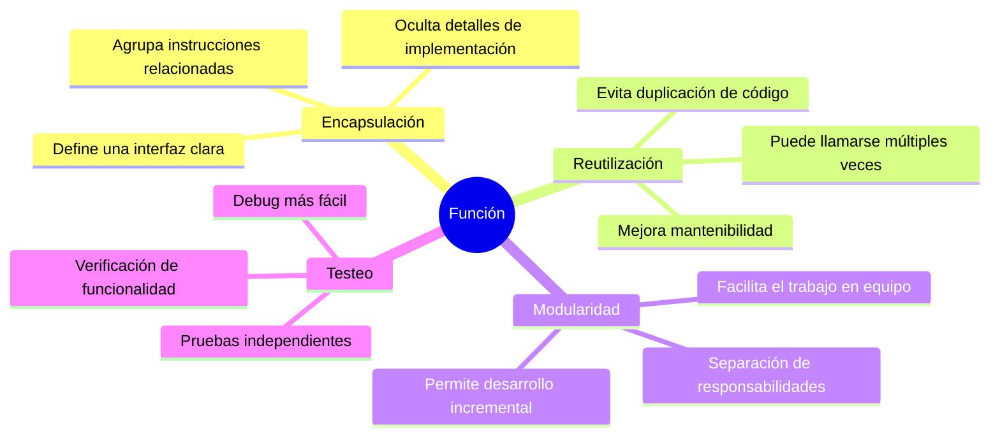

### 8.2 Funciones vs Procedimientos

Cuando hablamos de subprogramas, es importante diferenciar entre dos conceptos fundamentales:

#### 🔄 FUNCIÓN

Una **función** es una sección de un programa que **calcula un valor** de manera independiente al resto del programa.

> **Definición matemática**: Matemáticamente es una operación que toma uno o más valores (argumentos) y produce un resultado determinado (solo uno).

**Características principales:**

- En esencia, una función es un **miniprograma**: tiene una entrada, un proceso y una salida
- **Siempre retorna un valor** como resultado de su ejecución
- La función sería como una **expresión equivalente al resultado**
- Por tanto, se puede **asignar a una variable, imprimir, o utilizar como argumento de otra función**

**Componentes de una función:**

1. **📥 Los parámetros de entrada**: Valores que recibe la función como entrada
2. **⚙️ El código de la función**: Operaciones que realiza la función
3. **📤 El resultado o valor de retorno**: Valor final que retorna la función

**Ejemplo conceptual:**

```text
FUNCIÓN calcularPromedio(lista_números)
    ENTRADA: lista de números
    PROCESO: sumar todos los números y dividir por la cantidad
    SALIDA: número decimal (promedio)
```


#### 📋 PROCEDIMIENTO

Un **procedimiento** es una sección de un programa que **ejecuta una serie de acciones** de manera independiente al resto del programa.

**Características principales:**

- Es **capaz de calcular diversos resultados o ninguno**
- **No retorna un resultado** al programa que lo invoca
- Simplemente **se limita a ejecutar una serie de instrucciones**
- Como **no tiene ningún valor asociado al procedimiento**, no se puede asignar a una variable como las funciones, o utilizarse como argumento de otro subprograma, simplemente se llamará en el punto o puntos que deseemos

**Ejemplo conceptual:**

```text
PROCEDIMIENTO mostrarMensajeBienvenida()
    ENTRADA: ninguna
    PROCESO: mostrar mensaje por pantalla
    SALIDA: ninguna (solo efecto visual)
```

#### Comparación práctica

| Aspecto | Función | Procedimiento |
| :-- | :-- | :-- |
| **🎯 Propósito** | Calcular y retornar un valor | Ejecutar acciones |
| **📤 Retorno** | Siempre retorna algo | No retorna nada |
| **💡 Uso típico** | Cálculos, conversiones, validaciones | Mostrar datos, modificar estado |
| **🔧 Integración** | Puede usarse en expresiones | Se invoca como instrucción independiente |

**Ejemplos prácticos:**

```java
// FUNCIÓN - Retorna un valor
public static double calcularAreaCirculo(double radio) {
    return Math.PI * radio * radio;
}

// PROCEDIMIENTO - Solo ejecuta acciones
public static void mostrarMenuPrincipal() {
    System.out.println("=== MENÚ PRINCIPAL ===");
    System.out.println("1. Opción A");
    System.out.println("2. Opción B");
    System.out.println("3. Salir");
}
```

> [!TIP]
> Usar procedimientos hace que los programas sean más fáciles de leer y mantener, ya que agrupan sentencias relacionadas bajo un nombre descriptivo.

### Aplicación en nuestro ejemplo

Para nuestro problema de ordenar números, podríamos definir:

**Funciones:**

- `leerNumeroEntero()` → retorna un número entero leído del teclado
- `leerListaNumeros()` → llama varias veces a la función anterior, almacena en un array que luego retorna
- `encontrarMaximo(array)` → retorna el valor máximo del array

**Procedimientos:**

- `ordenarArray(array)` → ordena el array usando burbuja
- `mostrarArray(array)` → muestra los números por pantalla

## 9. Ejemplo práctico completo: Suma de números

Para consolidar todos los conceptos aprendidos, vamos a analizar un ejemplo práctico que ilustra la importancia de la programación modular.

### Problema inicial

Supongamos que necesitamos encontrar la suma de los enteros en tres rangos diferentes:

- Del 1 al 10
- Del 20 al 37
- Del 35 al 49

### Enfoque sin programación modular (problemático)

```java
public class SumaSinModulos {
    public static void main(String[] args) {
        // Suma de enteros del 1 al 10
        int suma1 = 0;
        for (int i = 1; i <= 10; i++) {
            suma1 += i;
        }
        System.out.println("Suma del 1 al 10: " + suma1);
        
        // Suma de enteros del 20 al 37
        int suma2 = 0;
        for (int i = 20; i <= 37; i++) {
            suma2 += i;
        }
        System.out.println("Suma del 20 al 37: " + suma2);
        
        // Suma de enteros del 35 al 49
        int suma3 = 0;
        for (int i = 35; i <= 49; i++) {
            suma3 += i;
        }
        System.out.println("Suma del 35 al 49: " + suma3);
    }
}
```

### Problemas identificados

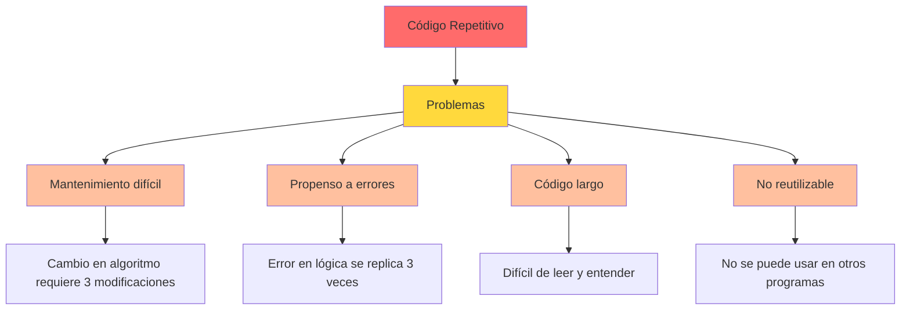

> [!WARNING]
> Observamos que hay **código que se repite** múltiples veces. Esta repetición es un indicador claro de que necesitamos aplicar programación modular.

### Enfoque con programación modular (solución)

```java
public class SumaConModulos {
    public static void main(String[] args) {
        SumaConModulos programa = new SumaConModulos();
        programa.inicio();
    }
    
    public void inicio() {
        // Utilizamos la función para cada rango
        int suma1 = sumarRango(1, 10);
        int suma2 = sumarRango(20, 37);
        int suma3 = sumarRango(35, 49);
        
        // Mostramos los resultados
        mostrarResultado("1 al 10", suma1);
        mostrarResultado("20 al 37", suma2);
        mostrarResultado("35 al 49", suma3);
    }
    
    /**
     * Función que calcula la suma de enteros en un rango
     * @param inicio Número inicial del rango (inclusivo)
     * @param fin Número final del rango (inclusivo)  
     * @return La suma de todos los enteros en el rango
     */
    public int sumarRango(int inicio, int fin) {
        int suma = 0;
        for (int i = inicio; i <= fin; i++) {
            suma += i;
        }
        return suma;
    }
    
    /**
     * Procedimiento que muestra el resultado de una suma
     * @param descripcion Descripción del rango calculado
     * @param resultado El valor de la suma
     */
    public void mostrarResultado(String descripcion, int resultado) {
        System.out.println("Suma del " + descripcion + ": " + resultado);
    }
}
```

### Ventajas de la solución modular

| Ventaja | Descripción | Ejemplo |
| :-- | :-- | :-- |
| **🔄 Reutilización** | Una sola función para todos los casos | `sumarRango()` se usa 3 veces |
| **🛠️ Mantenimiento** | Cambios en un solo lugar | Mejorar algoritmo afecta a todos los usos |
| **🧪 Testeo** | Probar función independientemente | Verificar `sumarRango(1,3)` devuelve 6 |
| **📖 Legibilidad** | Código más claro y expresivo | `sumarRango(1,10)` es autoexplicativo |
| **🔍 Debug** | Errores más fáciles de localizar | Problema en suma → revisar `sumarRango()` |

### Expansión del ejemplo

La función `sumarRango()` ahora puede ser utilizada para **cualquier rango de números**:

```java
// Ejemplos adicionales de uso
int sumaDecenas = sumarRango(10, 19);        // Suma de 10 a 19
int sumaCentenas = sumarRango(100, 199);     // Suma de 100 a 199
int sumaPersonalizada = sumarRango(50, 75);  // Suma de 50 a 75

// Incluso podemos usarla en cálculos más complejos
int promedioRango = sumarRango(1, 100) / 100;  // Promedio de 1 a 100
```

> [!IMPORTANT]
> La solución modular no solo resuelve el problema actual, sino que proporciona una herramienta reutilizable para futuros desarrollos.

Este ejemplo demuestra claramente cómo la **programación modular** transforma código repetitivo y difícil de mantener en una solución elegante, reutilizable y fácil de entender.

<p align="center">📚 <em>Fin del apartado UT4.1 - Introducción a la programación modular</em></p>
