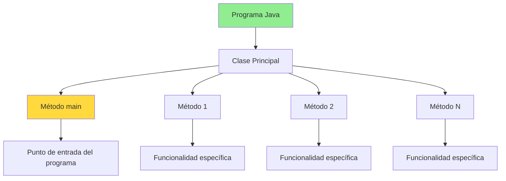
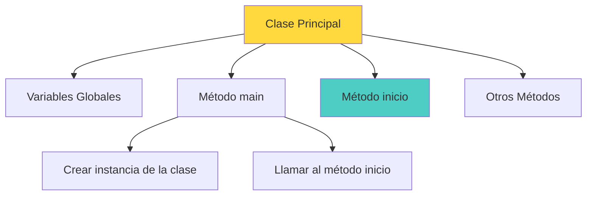
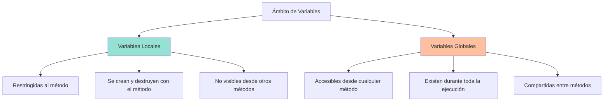
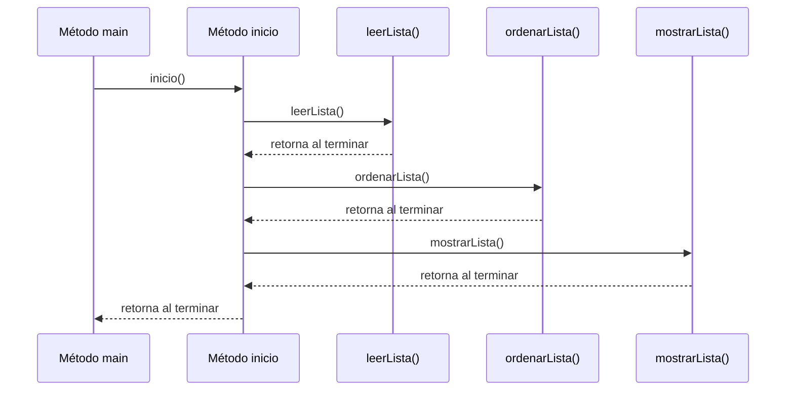

# UT4.2 Declaración e invocación de métodos. Variables locales y globales

## 📋 Índice de contenidos

1. [Métodos en Java](#1-m%C3%A9todos-en-java)
2. [Declaración de métodos](#2-declaraci%C3%B3n-de-m%C3%A9todos)
    1. [Sintaxis básica](#21-sintaxis-b%C3%A1sica)
    2. [Ubicación en el programa](#22-ubicaci%C3%B3n-en-el-programa)
3. [Cambios en el método principal](#3-cambios-en-el-m%C3%A9todo-principal)
4. [Ámbito de variables](#4-%C3%A1mbito-de-variables)
    1. [Variables locales](#41-variables-locales)
    2. [Variables globales](#42-variables-globales)
    3. [Ejemplo práctico con variables globales](#43-ejemplo-pr%C3%A1ctico-con-variables-globales)
5. [Ejemplo: Método ordenarLista()](#5-ejemplo-m%C3%A9todo-ordenarlista)
6. [Práctica 1](#6-pr%C3%A1ctica-1)
7. [Invocación de métodos](#7-invocaci%C3%B3n-de-m%C3%A9todos)
    1. [Sintaxis de invocación](#71-sintaxis-de-invocaci%C3%B3n)
    2. [Flujo de control](#72-flujo-de-control)
8. [Práctica 1 (continuación)](#8-pr%C3%A1ctica-1-continuaci%C3%B3n)
9. [Práctica 2](#9-pr%C3%A1ctica-2)
10. [Inicialización diferida de variables](#10-inicializaci%C3%B3n-diferida-de-variables)
    1. [Valores por defecto](#101-valores-por-defecto)
    2. [Inicialización a null](#102-inicializaci%C3%B3n-a-null)
    3. [Errores comunes](#103-errores-comunes)
11. [Práctica 3](#11-pr%C3%A1ctica-3)

## 1. Métodos en Java

En Java, las **funciones/procedimientos** se denominan **métodos**. Llegados a este punto, se puede comprender mejor que **`main`** es el método principal de un programa, y que hasta el momento ha sido el único método definido por nosotros.



> [!NOTE]
> Cuando se habla de **invocación de un método** (por ejemplo de tratamiento de Strings), se trata de ejecutar un conjunto de instrucciones con un objetivo común: "obtener una cadena transformada", "obtener una subcadena", etc.

### Recuerda: ventajas de utilizar métodos

- **🎯 Organización**: El código se estructura de manera lógica y comprensible
- **🔄 Reutilización**: Un método puede ser llamado desde múltiples lugares
- **🛠️ Mantenimiento**: Los cambios se realizan en un solo lugar
- **🧪 Debugging**: Es más fácil localizar y corregir errores
- **👥 Colaboración**: Diferentes programadores pueden trabajar en métodos distintos

## 2. Declaración de métodos

### 2.1 Sintaxis básica

Igual que las variables, los métodos también se han de definir para poder ser usados. De momento optaremos por definir un método de la siguiente manera:

```java
public void nombreMetodo() {
    // Instrucciones del método
}
```

Antes de continuar, es importante recordar los **elementos básicos** que componen cualquier subprograma. En Java, estos elementos se materializan en lo que denominamos **métodos**, y cada uno tiene componentes específicos que debemos comprender:

#### 📛 Identificador

El **identificador** es el nombre que identifica al método. En Java debe seguir las convenciones de nomenclatura:

```java
// Ejemplos de identificadores válidos
public void calcularPromedio(){...}      // ✅ Correcto
public int obtenerMaximo(){...}          // ✅ Correcto  
public void mostrarResultados(){...}     // ✅ Correcto

// Ejemplos incorrectos
public void 123metodo(){...}             // ❌ No puede empezar por número
public void calcular-promedio(){...}     // ❌ No puede contener guiones
```

#### 🏷️ Modificadores de acceso

Los **modificadores de acceso** determinan la visibilidad del método:

- **`public`**: Accesible desde cualquier clase
- **`private`**: Solo accesible desde la misma clase
- **`protected`**: Accesible desde clases del mismo paquete y subclases
- **Sin modificador**: Accesible desde clases del mismo paquete

#### 🔄 Tipo de retorno

El **tipo de retorno** especifica qué tipo de dato devuelve el método:

```java
public int sumar(int a, int b){...}          // Retorna un entero
public double calcularPromedio(){...}        // Retorna un decimal
public String obtenerNombre(){...}          // Retorna una cadena
public void mostrarMensaje(){...}           // No retorna nada (void)
```

#### 📋 Lista de parámetros

La **lista de parámetros** define las variables de comunicación entre el método y quien lo invoca:

**Parámetros formales**: Variables definidas en la declaración del método
**Parámetros actuales o argumentos**: Valores proporcionados al invocar el método

```java
// Parámetros formales: int numero1, int numero2
public int multiplicar(int numero1, int numero2) {
    return numero1 * numero2;
}

// Parámetros actuales: 5, 3
int resultado = multiplicar(5, 3);
```

#### 🏗️ Cuerpo del método

El **cuerpo** contiene el conjunto de instrucciones que define la funcionalidad del método:

```java
public double calcularAreaCirculo(double radio) {
    // Cuerpo del método
    double area = Math.PI * radio * radio;
    return area;
    // Fin del cuerpo del método
}
```

#### 🌍 Entorno

El **entorno** define el contexto en el que se ejecuta el método, incluyendo:

- **Variables locales**: Solo accesibles dentro del método
- **Variables globales**: Accesibles desde cualquier método de la clase
- **Parámetros**: Variables de entrada del método

```java
public class EjemploEntorno {
    private static int variableGlobal = 10;  // Variable global
    
    public void ejemploMetodo(int parametro) {  // Parámetro
        int variableLocal = 5;                  // Variable local
        
        // El entorno incluye: variableGlobal, parametro, variableLocal
        int resultado = variableGlobal + parametro + variableLocal;
    }
}
```

#### 📊 Estructura completa en Java

Un método completo en Java sigue esta estructura[3]:

```text
[modificador_acceso] [static] [tipo_retorno] identificador([parámetros]) {
    // Cuerpo del método
    [return valor;]  // Solo si no es void
}
```

**Ejemplo completo:**

```java
public static double calcularPromedio(double[] numeros) {
    // Validación de parámetros
    if (numeros.length == 0) {
        return 0.0;
    }
    
    // Cálculo del promedio
    double suma = 0.0;
    for (double numero : numeros) {
        suma += numero;
    }
    
    return suma / numeros.length;
}
```

> [!IMPORTANT]
> En Java, todos los subprogramas son **métodos de una clase**. No existen funciones independientes como en otros lenguajes. Esta característica es fundamental en la programación orientada a objetos.

### 2.2 Ubicación en el programa

Esta declaración puede realizarse en cualquier punto del programa, dentro del bloque de la clase donde se define (`public class NombreClase{...}`) **siempre fuera del método main**.

```java
public class OrdenarDescendente {
    public static void main(String[] args) {
        // Instrucciones del método principal (problema general)
        //...
    }
    
    // Método que resuelve el subproblema de leer la lista.
    public int[] leerLista() {
        // Instrucciones del método
        //...
    }

    // Método que resuelve el subproblema de ordenar la lista.
    public void ordenarLista(int[] lista) {
        // Instrucciones del método
        //...
    }

    // Método que resuelve el subproblema de mostrar la lista por pantalla.
    public void mostrarLista(int[] lista) {
        // Instrucciones del método
        //...
    }
}
```

## 3. Cambios en el método principal

Aplicaremos un cambio a la hora de desarrollar cualquier programa. Seguiremos (de momento) esta estructura:



**Estructura recomendada:**

> [!CAUTION]
> No te preocupes si no entiendes del todo bien esta nueva estructura. Solo la vamos a usar en este tema para ejemplificar la descomposición modular top-down a partir de un módulo "inicio". Mas adelante, cuando veamos la Programación Orientada a Objetos, comprenderás mejor estos conceptos.

```java
public class NombreClase {
    public static void main(String[] args) {
        NombreClase programa = new NombreClase();
        programa.inicio();
    }
    
    public void inicio() {
        // Instrucciones del método principal (problema general)
        //...
    }
    
    // Otros métodos...
}
```

> [!NOTE]
> Esta estructura separa claramente el punto de entrada del programa (main) de la lógica principal (inicio), facilitando la organización y el mantenimiento del código.

## 4. Ámbito de variables

En este punto, cobra más fuerza el concepto de **ámbito de una variable**, ya que estamos definiendo bloques a través de cada método.



### 4.1 Variables locales

**Variable local**: es aquella que se restringe al ámbito de la función (método) donde se ha declarado.

**Características:**

- Solo existe dentro del método donde se declara
- Se crea cuando se entra al método
- Se destruye cuando se sale del método
- No es visible desde otros métodos

```java
public static void metodoEjemplo() {
    int variableLocal = 10; // Solo existe dentro de este método
    System.out.println(variableLocal);
} // La variable se destruye aquí
```

### 4.2 Variables globales

**Variable global**: es aquella que será accesible desde cualquier función del programa.

La manera en la que se definirá una variable global será la siguiente:

1. Utilizando esta sintaxis:

    ```java
    private static tipoVariable nombreVariable = valorInicial;
    ```
    
2. Ubicando **SIEMPRE** esta declaración justo en la línea siguiente al bloque que define la clase del programa.

> [!NOTE]
> La inicialización es opcional. Si no se inicializa, la variable tomará el valor por defecto del tipo de dato.

### 4.3 Ejemplo práctico con variables globales

```java
public class OrdenarDescendente {
    // Variable global
    private static int[] listaEnteros = new int[10];
    
    public static void main(String[] args) {
        OrdenarDescendente programa = new OrdenarDescendente();
        programa.inicio();
    }
    
    public void inicio() {
        // Instrucciones del método principal (problema general)
        // Invocación a métodos
    }
    
    // Método con las instrucciones para leer la lista.
    public void leerLista() {
        // Puede acceder a listaEnteros
    }
    
    // Método con las instrucciones para ordenar la lista.
    public void ordenarLista() {
        // Puede acceder a listaEnteros
    }
    
    // Método con las instrucciones para mostrar la lista por pantalla
    public void mostrarLista() {
        // Puede acceder a listaEnteros
    }
}
```

## 5. Ejemplo: Método ordenarLista()

```java
// Método con las instrucciones para ordenar la lista.
public void ordenarLista() {
    for (int i = 0; i < listaEnteros.length - 1; i++) {
        for (int j = i + 1; j < listaEnteros.length; j++) {
            // La posición tratada tiene un valor más alto que el de la búsqueda... Los
            // intercambiamos.
            if (listaEnteros[i] > listaEnteros[j]) {
                // Para intercambiar valores hace falta una variable auxiliar
                int cambio = listaEnteros[i];
                listaEnteros[i] = listaEnteros[j];
                listaEnteros[j] = cambio;
            }
        }
    }
}
```

> [!TIP]
> Este método implementa el algoritmo de ordenación burbuja, comparando elementos adyacentes e intercambiándolos si están en el orden incorrecto.

<details>
<summary>💡 Análisis del algoritmo burbuja</summary>

El algoritmo de ordenación burbuja funciona de la siguiente manera:

1. **Bucle externo**: Recorre todo el array (i de 0 a length-2)
2. **Bucle interno**: Compara el elemento en posición i con todos los elementos posteriores (j de i+1 a length-1)
3. **Intercambio**: Si el elemento en posición i es mayor que el de posición j, los intercambia
4. **Variable auxiliar**: Se necesita una variable temporal para realizar el intercambio

**Complejidad temporal**: O(n²)
**Ventaja**: Fácil de entender e implementar
**Desventaja**: Ineficiente para arrays grandes

</details>

## 6. Práctica 1

**Objetivo:** Crear un programa completo de ordenación de listas de enteros.

**Instrucciones:**

1. Copia el programa de ordenación de listas de enteros
2. Completa el programa diseñando e implementando los métodos `leerLista()` y `mostrarLista()`
3. De momento no sabemos probarlo para ver si funciona
4. Realiza una traza manual con un par de ejemplos para verificar su funcionamiento

<details>
<summary>💻 Solución propuesta:</summary>

```java
import java.util.Scanner;

public class OrdenacionEnteros {
    // Variable global
    private static int[] listaEnteros = new int[10];
    private static Scanner scanner = new Scanner(System.in);
    
    public static void main(String[] args) {
        OrdenacionEnteros programa = new OrdenacionEnteros();
        programa.inicio();
    }
    
    public void inicio() {
        // Falta la invocación a métodos
        scanner.close();
    }
    
    public void leerLista() {
        System.out.println("Introduce 10 números enteros:");
        for (int i = 0; i < listaEnteros.length; i++) {
            System.out.print("Número " + (i + 1) + ": ");
            listaEnteros[i] = scanner.nextInt();
            scanner.nextLine();
        }
    }
    
    public void ordenarLista() {
        for (int i = 0; i < listaEnteros.length - 1; i++) {
            for (int j = i + 1; j < listaEnteros.length; j++) {
                if (listaEnteros[i] > listaEnteros[j]) {
                    int cambio = listaEnteros[i];
                    listaEnteros[i] = listaEnteros[j];
                    listaEnteros[j] = cambio;
                }
            }
        }
    }
    
    public void mostrarLista() {
        System.out.println("\nLista ordenada:");
        for (int i = 0; i < listaEnteros.length; i++) {
            System.out.print(listaEnteros[i]);
            if (i < listaEnteros.length - 1) {
                System.out.print(", ");
            }
        }
        System.out.println();
    }
}
```

</details>

## 7. Invocación de métodos

### 7.1 Sintaxis de invocación

Para poder ejecutar todas las operaciones definidas en un método, hay que invocarlo.

Para invocar (llamar) un método se utiliza la siguiente sintaxis:

```java
nombreMetodo();
```

### 7.2 Flujo de control



## 8. Práctica 1 (continuación)

**Objetivo:** Probar y depurar el programa.

**Instrucciones:**

1. Actualiza el programa con las implementaciones de `leerLista()` y `mostrarLista()`
2. Ahora sí, prueba el programa *in situ* para ver si la salida es correcta
3. En caso de existir algún problema, rectifica los métodos implementados para que funcione como debe

<details>
<summary>💻 Implementación de referencia</summary>

```java
public void inicio() {
    leerLista();     // Primero lee los datos
    ordenarLista();  // Después los ordena
    mostrarLista();  // Finalmente los muestra
}
```

> [!IMPORTANT]
> El orden de invocación de los métodos es crucial. En este ejemplo, debemos leer la lista antes de ordenarla, y ordenarla antes de mostrarla.

**Flujo de control detallado en la invocación:**

Cuando se ejecuta `leerLista()`:

1. El programa pausa la ejecución en `inicio()`
2. Salta al método `leerLista()`
3. Ejecuta todas las instrucciones de `leerLista()`
4. Al terminar, regresa a `inicio()`
5. Continúa con la siguiente instrucción (`ordenarLista()`)

</details>

## 9. Práctica 2

**Objetivo:** Ampliar la funcionalidad del programa.

**Instrucciones:**

Modifica el programa de ejemplo para que haga lo siguiente:

- Después de mostrar la lista ordenada, en una nueva línea, ha de decir cuántos de los valores son inferiores a la mitad del valor más grande almacenado
- Aplica diseño descendente para añadir esta nueva tarea, declarando e invocando los nuevos métodos que hagan falta
- Recuerda que puedes utilizar variables globales

<details>
<summary>💻 Solución de referencia</summary>

```java
public void inicio() {
    leerLista();
    ordenarLista();
    mostrarLista();
    analizarDatos();
    scanner.close();
}

public void analizarDatos() {
    int valorMaximo = encontrarMaximo();
    double mitadMaximo = valorMaximo / 2.0;
    int contador = contarInferioresA(mitadMaximo);
    
    System.out.println("\nAnálisis de datos:");
    System.out.println("Valor máximo: " + valorMaximo);
    System.out.println("Mitad del máximo: " + mitadMaximo);
    System.out.println("Valores inferiores a la mitad del máximo: " + contador);
}

public int encontrarMaximo() {
    int maximo = listaEnteros[0];
    for (int i = 1; i < listaEnteros.length; i++) {
        if (listaEnteros[i] > maximo) {
            maximo = listaEnteros[i];
        }
    }
    return maximo;
}

public int contarInferioresA(double limite) {
    int contador = 0;
    for (int i = 0; i < listaEnteros.length; i++) {
        if (listaEnteros[i] < limite) {
            contador++;
        }
    }
    return contador;
}
```

</details>

## 10. Inicialización diferida de variables

### 10.1 Valores por defecto

Como ya sabes, una variable puede ser declarada e inicializada al mismo tiempo o bien posteriormente.

Para el caso de los **tipos de datos primitivos**, el valor de inicialización provisional suele ser:

- **0** para tipos numéricos enteros (`int`, `long`, `short`, `byte`)
- **0.0** para tipos numéricos decimales (`float`, `double`)
- **false** para tipo booleano (`boolean`)
- **'\u0000'** para caracteres (`char`)

### 10.2 Inicialización a null

Para los **tipos de datos compuestos** (objetos, arrays), se utilizará como valor de inicialización provisional el valor especial **`null`**.

```java
String mensaje; // Valor por defecto: null
int[] numeros;  // Valor por defecto: null
```

### 10.3 Errores comunes

> [!CAUTION]
> Invocar un método de una variable de tipo compuesto que sea **null** siempre derivará en un error del programa (NullPointerException).

**Ejemplo de error:**

```java
String mensaje;          // mensaje = null
mensaje.length();        // ¡ERROR! NullPointerException
```

**Solución correcta:**

```java
String mensaje = "Hola"; // Inicializar con un valor válido
mensaje.length();        // Ahora funciona correctamente
```

**Con arrays:**

```java
int[] numeros = null;           // Inicialización a null
numeros = new int[10];          // Crear el array con tamaño específico
// Ahora se puede usar el array sin errores
```

## 11. Práctica 3

**Objetivo:** Trabajo con inicialización diferida y tamaño dinámico.

**Instrucciones:**

1. A partir del programa de la práctica 1, inicializa ahora el array de enteros a **`null`**
2. El programa ahora preguntará al usuario cuántos números quiere introducir
3. Al tener este dato, crea el array con el tamaño adecuado
4. El programa ha de funcionar igual, excepto por poder aumentar/disminuir el número de datos a tratar

<details>
<summary>💻 Solución de referencia</summary>

```java
public class OrdenacionDinamica {
    // Variable global inicializada a null
    private static int[] listaEnteros = null;
    private static Scanner scanner = new Scanner(System.in);
    
    public static void main(String[] args) {
        OrdenacionDinamica programa = new OrdenacionDinamica();
        programa.inicio();
    }
    
    public void inicio() {
        configurarTamano();
        leerLista();
        ordenarLista();
        mostrarLista();
        scanner.close();
    }
    
    public void configurarTamano() {
        System.out.print("¿Cuántos números quieres introducir? ");
        int tamano = scanner.nextInt();
        scanner.nextLine();
        
        // Validación
        while (tamano <= 0) {
            System.out.print("El tamaño debe ser positivo. Introduce otro valor: ");
            tamano = scanner.nextInt();
            scanner.nextLine();
        }
        
        // Crear el array con el tamaño especificado
        listaEnteros = new int[tamano];
        System.out.println("Array creado para " + tamano + " elementos.");
    }
    
    public void leerLista() {
        System.out.println("\nIntroduce " + listaEnteros.length + " números enteros:");
        for (int i = 0; i < listaEnteros.length; i++) {
            System.out.print("Número " + (i + 1) + ": ");
            listaEnteros[i] = scanner.nextInt();
            scanner.nextLine();
        }
    }
    
    // Los demás métodos permanecen igual...
}
```

</details>

> [!NOTE]
> Estas prácticas te preparan para el siguiente apartado sobre descomposición modular de programas más complejos. La comprensión de métodos, variables y su ámbito es fundamental para estructurar correctamente los programas.

<p align="center">📚 <em>Fin del apartado UT4.2 - Declaración e invocación de métodos. Variables locales y globales</em></p>
