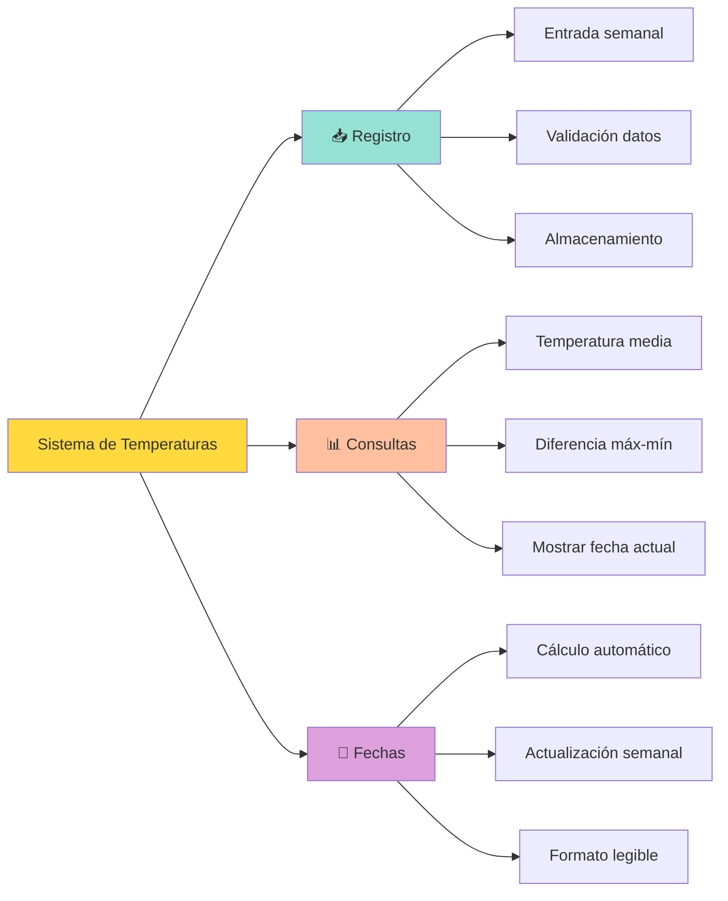
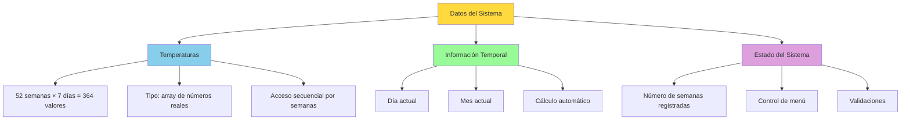
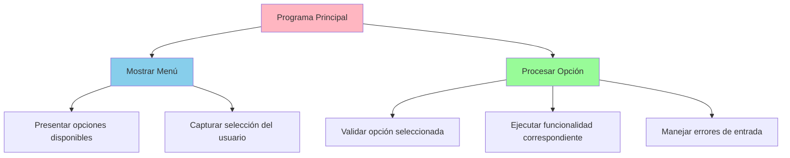
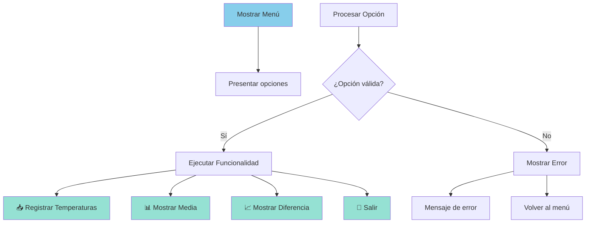
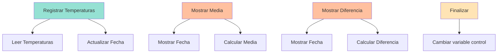

# UT4.3 Ejemplo de descomposición modular sobre un programa de mayor complejidad

## 📋 Índice de contenidos

1. [Introducción al problema complejo](#1-introducci%C3%B3n-al-problema-complejo)
2. [Planteamiento del problema: Registro de Temperaturas](#2-planteamiento-del-problema-registro-de-temperaturas)
    1. [Descripción del sistema](#21-descripci%C3%B3n-del-sistema)
    2. [Funcionalidades requeridas](#22-funcionalidades-requeridas)
    3. [Requisitos de robustez](#23-requisitos-de-robustez)
3. [Análisis inicial y estructuras de datos](#3-an%C3%A1lisis-inicial-y-estructuras-de-datos)
    1. [Identificación de datos necesarios](#31-identificaci%C3%B3n-de-datos-necesarios)
    2. [Diseño de la estructura de almacenamiento](#32-dise%C3%B1o-de-la-estructura-de-almacenamiento)
    3. [Variables globales del sistema](#33-variables-globales-del-sistema)
4. [Descomposición modular por niveles](#4-descomposici%C3%B3n-modular-por-niveles)
    1. [Primer nivel: Visión general](#41-primer-nivel-visi%C3%B3n-general)
    2. [Segundo nivel: Análisis de complejidad](#42-segundo-nivel-an%C3%A1lisis-de-complejidad)
    3. [Tercer nivel: Detalle de operaciones](#43-tercer-nivel-detalle-de-operaciones)
    4. [Cuarto nivel: Tareas simples](#44-cuarto-nivel-tareas-simples)
5. [Implementación paso a paso](#5-implementaci%C3%B3n-paso-a-paso)
    1. [Práctica 4: Estructura inicial](#51-pr%C3%A1ctica-4-estructura-inicial)
    2. [Práctica 5: Métodos básicos](#52-pr%C3%A1ctica-5-m%C3%A9todos-b%C3%A1sicos)
    3. [Práctica 6: Métodos intermedios](#53-pr%C3%A1ctica-6-m%C3%A9todos-intermedios)
    4. [Práctica 7: Métodos de primer nivel](#54-pr%C3%A1ctica-7-m%C3%A9todos-de-primer-nivel)
    5. [Práctica 8: Integración final](#55-pr%C3%A1ctica-8-integraci%C3%B3n-final)
6. [Mejoras y optimización del código](#6-mejoras-y-optimizaci%C3%B3n-del-c%C3%B3digo)
7. [Análisis de la solución](#7-an%C3%A1lisis-de-la-soluci%C3%B3n)

## 1. Introducción al problema complejo

Hasta este punto hemos trabajado con problemas relativamente simples que requerían un diseño descendente básico de 1-2 niveles. Sin embargo, la programación real a menudo implica resolver problemas de **mayor complejidad** que requieren:

- **📊 Múltiples niveles de descomposición** (3 o más niveles)
- **🔄 Gestión de estado** a lo largo del tiempo
- **🛡️ Robustez** ante entradas incorrectas
- **📅 Manejo de fechas** y cálculos temporales
- **📋 Interfaces de usuario** (menús interactivos)

> [!NOTE]
> Este tipo de problemas nos prepara para el desarrollo de aplicaciones reales donde la complejidad es la norma, no la excepción.

### Recuerda: Ventajas del diseño modular en problemas complejos

- **🎯 Mantenimiento**: Facilita la corrección y mejora del código
- **🔍 Debugging**: Los errores se localizan en módulos específicos
- **👥 Trabajo en equipo**: Diferentes desarrolladores pueden trabajar en módulos distintos
- **🧪 Testing**: Cada módulo puede probarse independientemente
- **📈 Escalabilidad**: Es más fácil añadir nuevas funcionalidades

## 2. Planteamiento del problema: Registro de Temperaturas

### 2.1 Descripción del sistema

Se pretende crear un **gestor de registro de temperaturas** tomadas semanalmente por un observatorio meteorológico. El sistema debe ser capaz de:

**🗓️ Gestión temporal:**

- Comenzar el 1 de enero (principio de año)
- Registrar datos al principio de cada semana
- Calcular automáticamente la fecha actual

**📊 Procesamiento de datos:**

- Manejar 52 semanas anuales
- Procesar 7 temperaturas por semana
- Realizar cálculos estadísticos

**👤 Interacción con usuario:**

- Menú de opciones intuitivo
- Validación de entradas
- Presentación clara de resultados

### 2.2 Funcionalidades requeridas

El sistema debe implementar las siguientes funcionalidades principales:



#### 📥 Funcionalidades de entrada

- **Registro de temperaturas semanales**
  - Solicitar 7 temperaturas (una por día)
  - Validar que sean valores numéricos válidos
  - Almacenar en la estructura de datos apropiada
  - Actualizar automáticamente la fecha

#### 📊 Funcionalidades de consulta

- **Consulta de temperatura media**
  - Calcular la media de todas las temperaturas registradas
  - Mostrar la fecha actual del sistema
  - Manejar el caso de no haber datos registrados
- **Consulta de diferencia máxima**
  - Encontrar temperatura máxima y mínima
  - Calcular y mostrar la diferencia
  - Incluir información de la fecha actual

#### 🚪 Funcionalidad de salida

- **Finalizar ejecución**
  - Salir del programa de forma controlada
  - Conservar datos durante la sesión

### 2.3 Requisitos de robustez

El sistema debe ser **robusto** ante situaciones erróneas comunes:

> [!CAUTION]
> Un programa robusto debe manejar adecuadamente los errores del usuario sin terminar inesperadamente.

#### ⚠️ Casos de error a manejar

| Tipo de Error | Descripción | Acción Requerida |
| :-- | :-- | :-- |
| **Entrada incorrecta** | Usuario introduce texto en lugar de número | Mostrar mensaje de error y pedir datos nuevamente |
| **Consulta sin datos** | Intentar calcular estadísticas sin temperaturas | Informar que no hay datos suficientes |
| **Opción de menú inválida** | Seleccionar opción que no existe | Mostrar mensaje y volver al menú |
| **Valores fuera de rango** | Temperaturas imposibles (ej: -500°C) | Validar rangos razonables |

#### 🛡️ Estrategias de robustez

1. **Validación de entrada**: Verificar tipos y rangos de datos
2. **Manejo de errores**: Verificar errores y continuar la ejecución
3. **Mensajes informativos**: Guiar al usuario sobre qué hacer
4. **Estados seguros**: El programa nunca debe quedar en estado inconsistente

## 3. Análisis inicial y estructuras de datos

### 3.1 Identificación de datos necesarios

Antes de comenzar la descomposición, debemos identificar claramente **qué información necesitamos almacenar** y **cómo la vamos a organizar**.



### 3.2 Diseño de la estructura de almacenamiento

Para las **temperaturas**, necesitamos una estructura que permita:

**📊 Características del almacenamiento:**

- **Capacidad**: 364 posiciones (52 semanas × 7 días)
- **Tipo de datos**: `double[]` para precisión decimal
- **Acceso**: Secuencial por semanas
- **Inicialización**: Valores por defecto (0.0)

**⏰ Para la gestión temporal:**

- **Día actual**: `int diaActual`
- **Mes actual**: `int mesActual`
- **Inicialización**: Día 1, Mes 1 (1 de enero)

**🔢 Para el control del sistema:**

- **Contador de semanas**: `int semanasRegistradas`
- **Control de menú**: `boolean continuar`


### 3.3 Variables globales del sistema

Definiremos las siguientes variables globales para que sean accesibles desde todos los métodos:

```java
public class RegistroTemperaturas {
    // Almacenamiento de temperaturas (52 semanas × 7 días)
    private static double[] temperaturas = new double[364];
    
    // Control temporal
    private static int diaActual = 1;
    private static int mesActual = 1;
    
    // Control del sistema
    private static int semanasRegistradas = 0;
    private static Scanner scanner = new Scanner(System.in);
}
```

> [!IMPORTANT]
> Usar variables globales facilita el acceso a los datos desde cualquier método, pero debe hacerse con cuidado para mantener la consistencia del estado.

## 4. Descomposición modular por niveles

### 4.1 Primer nivel: Visión general

El primer nivel de descomposición debe centrarse en **las acciones principales** que realiza el programa, sin entrar en detalles de implementación.



**🎯 Estrategia del primer nivel:**

- **No bajar rápidamente** a problemas específicos
- **Centrarse en el flujo principal** del programa
- **Identificar los bloques fundamentales** de funcionalidad

**Bloques definidos:**

1. **🔄 Mostrar menú**: Presentar las opciones disponibles al usuario
2. **⚙️ Procesar opción**: Determinar qué acción realizar según la selección

> [!TIP]
> Una buena señal de una descomposición correcta es que puedas ponerle un nombre claro y descriptivo a cada bloque sin dificultad.

### 4.2 Segundo nivel: Análisis de complejidad

Antes de continuar, debemos **analizar si los subproblemas** obtenidos en el nivel anterior son suficientemente independientes o necesitan mayor descomposición.

#### 📋 Análisis de "Mostrar menú"

- **Complejidad**: **Baja** - Solo mostrar información por pantalla
- **Dependencias**: Ninguna
- **Decisión**: ✅ **No necesita descomposición adicional**


#### ⚙️ Análisis de "Procesar opción"

- **Complejidad**: **Alta** - Múltiples funcionalidades diferentes
- **Dependencias**: Depende de la opción seleccionada
- **Decisión**: ❌ **Requiere descomposición adicional**

El segundo nivel queda así:



### 4.3 Tercer nivel: Detalle de operaciones

Ahora analizamos cada funcionalidad para determinar si requiere mayor descomposición:

#### 📥 Registrar temperaturas semanales

- **Complejidad**: **Media-Alta** - Lectura, validación, almacenamiento y actualización de fecha
- **Suboperaciones necesarias**:
  - Leer temperaturas por teclado
  - Actualizar fecha actual
- **Decisión**: ❌ **Requiere descomposición**

#### 📊 Mostrar temperatura media

- **Complejidad**: **Media** - Cálculo y presentación
- **Suboperaciones necesarias**:
  - Mostrar fecha actual
  - Calcular temperatura media
- **Decisión**: ❌ **Requiere descomposición**


#### 📈 Mostrar diferencia máxima

- **Complejidad**: **Media** - Similar al anterior
- **Suboperaciones necesarias**:
  - Mostrar fecha actual
  - Calcular diferencia máxima
- **Decisión**: ❌ **Requiere descomposición**

#### 🚪 Finalizar ejecución

- **Complejidad**: **Baja** - Solo cambiar variable de control
- **Decisión**: ✅ **No requiere descomposición**



### 4.4 Cuarto nivel: Tareas simples

Analizamos las operaciones del tercer nivel para verificar si son lo suficientemente simples:

**Análisis de complejidad final:**

| Operación | Descripción | Complejidad | ¿Más descomposición? |
| :-- | :-- | :-- | :-- |
| **Leer temperaturas** | Bucle simple de entrada | Baja | ❌ No |
| **Actualizar fecha** | Incrementar día/mes | Baja | ❌ No |
| **Mostrar fecha** | Formatear y mostrar | Baja | ❌ No |
| **Calcular media** | Recorrer array y promediar | Baja | ❌ No |
| **Calcular diferencia** | Encontrar máx/mín y restar | Baja | ❌ No |

> [!NOTE]
> Con esta descomposición hemos llegado a **tareas simples** que pueden implementarse directamente. No necesitamos un quinto nivel.

## 5. Implementación paso a paso

### 5.1 Práctica 4: Estructura inicial

**Objetivo:** Crear la estructura básica del programa definiendo variables globales y métodos de todos los niveles.

**Instrucciones:**

1. Crea la clase principal `RegistroTemperaturas`
2. Define las variables globales identificadas
3. Declara todos los métodos (sin implementar)
4. Separa cada nivel con comentarios claros

<details>
<summary>💻 Estructura base para la práctica</summary>

```java
import java.util.Scanner;

public class RegistroTemperaturas {
    // ========================================
    // VARIABLES GLOBALES
    // ========================================
    
    // Almacenamiento de temperaturas (52 semanas × 7 días = 364)
    private static double[] temperaturas = new double[364];
    
    // Control temporal
    private static int diaActual = 1;
    private static int mesActual = 1;
    
    // Control del sistema
    private static int semanasRegistradas = 0;
    private static boolean continuar = true;
    private static Scanner scanner = new Scanner(System.in);
    
    // ========================================
    // MÉTODO PRINCIPAL
    // ========================================
    
    public static void main(String[] args) {
        RegistroTemperaturas programa = new RegistroTemperaturas();
        programa.inicio();
    }
    
    // NIVEL 0 de descomposición (raiz). Solo existe un módulo a descomponer: inicio.
    public void inicio() {
        System.out.println("=== GESTOR DE REGISTRO DE TEMPERATURAS ===");
        
        while (continuar) {
            mostrarMenu();
            procesarOpcion();
        }
        
        System.out.println("¡Gracias por usar el sistema!");
        scanner.close();
    }
    
    // ========================================
    // NIVEL 1: MÉTODOS PRINCIPALES
    // ========================================
    
    // Tarea 1 Mostrar el menú
    public void mostrarMenu() {

    }
    
    // Tarea 2 Procesar la orden dada por el usuario.
    public void procesarOpcion() {

    }
    
    // ========================================
    // NIVEL 2: FUNCIONALIDADES ESPECÍFICAS
    // ========================================
    
    // Tarea 2.1 Registro de temperaturas semanales
    public void registrarTemperaturas() {

    }
    
    // Tarea 2.2 Mostrar la temperatura media de las que hay guardadas
    public void mostrarTemperaturaMedia() {

    }
    
    // Tarea 2.3 Mostrar la diferencia máxima entre temperaturas registradas
    public void mostrarDiferenciaMaxima() {

    }
    
    // Tarea 2.4 Finalizar la ejecución del programa (salir del bucle)
    public void finalizarEjecucion() {

    }
    
    // ========================================
    // NIVEL 3: OPERACIONES BÁSICAS
    // ========================================
    
    // Tarea 2.1.1 Lectura por teclado de las temperaturas
    public void leerTemperaturasPorTeclado() {

    }
    
    // Tarea 2.1.2 Actualización de la fecha actual
    public void actualizarFecha() {

    }
    
    // Tarea 2.2.1 y 2.3.1 Mostrar por pantalla la fecha actual
    public void mostrarFechaActual() {

    }

    // Tarea 2.2.2 Cálculos para obtener la media de temperaturas    
    public double calcularTemperaturaMedia() {

    }
    
    // Tarea 2.3.2 Cálculos para obtener la diferencia máxima entre temperaturas
    public double calcularDiferenciaMaxima() {

    }
}
```

</details>

### 5.2 Práctica 5: Métodos básicos

**Objetivo:** Implementar los métodos del nivel más bajo (operaciones básicas).

**Instrucciones:**

1. Implementa `leerTemperaturasPorTeclado()`
2. Implementa `actualizarFecha()`
3. Implementa `mostrarFechaActual()` (el mes debe mostrarse en formato texto)
4. Implementa `calcularTemperaturaMedia()`
5. Implementa `calcularDiferenciaMaxima()`
6. Prueba cada método invocándolo desde `inicio()`, después elimina las invocaciones

<details>
<summary>💻 Implementación de métodos básicos</summary>

```java
// ========================================
// NIVEL 3: OPERACIONES BÁSICAS
// ========================================

public void leerTemperaturasPorTeclado() {
    System.out.println("\n--- REGISTRO DE TEMPERATURAS SEMANAL ---");
    System.out.println("Introduce las 7 temperaturas de la semana:");
    
    int posicionInicial = semanasRegistradas * 7;
    
    for (int dia = 0; dia < 7; dia++) {
        boolean temperaturaValida = false;
        
        while (!temperaturaValida) {
            System.out.print("Día " + (dia + 1) + ": ");
            // Validación de tipo
            if(!scanner.hasNextDouble()){
                scanner.nextLine();
                System.out.println("❌ Tipo de dato incorrecto.");
                continue;
            }
            double temperatura = scanner.nextDouble();
            scanner.nextLine();
            // Validación de rango razonable
            if (temperatura >= -50 && temperatura <= 60) {
                temperaturas[posicionInicial + dia] = temperatura;
                temperaturaValida = true;
            } else {
                System.out.println("⚠️ Temperatura fuera de rango (-50°C a 60°C)");
            }
        }
    }
    
    System.out.println("✅ Temperaturas registradas correctamente");
}

public void actualizarFecha() {
    diaActual += 7; // Avanzar una semana
    
    // Días por mes (simplificado, sin años bisiestos)
    int[] diasPorMes = {31, 28, 31, 30, 31, 30, 31, 31, 30, 31, 30, 31};
    
    while (diaActual > diasPorMes[mesActual - 1]) {
        diaActual -= diasPorMes[mesActual - 1];
        mesActual++;
        
        if (mesActual > 12) {
            mesActual = 1;
            // Para simplificar, reiniciamos en enero
        }
    }
}

public void mostrarFechaActual() {
    String[] nombresMeses = {
        "Enero", "Febrero", "Marzo", "Abril", "Mayo", "Junio",
        "Julio", "Agosto", "Septiembre", "Octubre", "Noviembre", "Diciembre"
    };
    
    System.out.println("📅 Fecha actual: " + diaActual + " de " + 
                       nombresMeses[mesActual - 1]);
}

public double calcularTemperaturaMedia() {
    if (semanasRegistradas == 0) {
        return 0.0;
    }
    
    double suma = 0.0;
    int totalTemperaturas = semanasRegistradas * 7;
    
    for (int i = 0; i < totalTemperaturas; i++) {
        suma += temperaturas[i];
    }
    
    return suma / totalTemperaturas;
}

public double calcularDiferenciaMaxima() {
    if (semanasRegistradas == 0) {
        return 0.0;
    }
    
    double maxima = temperaturas[0];
    double minima = temperaturas[0];
    int totalTemperaturas = semanasRegistradas * 7;
    
    for (int i = 1; i < totalTemperaturas; i++) {
        if (temperaturas[i] > maxima) {
            maxima = temperaturas[i];
        }
        if (temperaturas[i] < minima) {
            minima = temperaturas[i];
        }
    }
    
    return maxima - minima;
}

// Métodos auxiliares para encontrar máximo y mínimo
public double encontrarTemperaturaMaxima() {
    if (semanasRegistradas == 0) return 0.0;
    
    double maxima = temperaturas[0];
    int totalTemperaturas = semanasRegistradas * 7;
    
    for (int i = 1; i < totalTemperaturas; i++) {
        if (temperaturas[i] > maxima) {
            maxima = temperaturas[i];
        }
    }
    return maxima;
}

public double encontrarTemperaturaMinima() {
    if (semanasRegistradas == 0) return 0.0;
    
    double minima = temperaturas[0];
    int totalTemperaturas = semanasRegistradas * 7;
    
    for (int i = 1; i < totalTemperaturas; i++) {
        if (temperaturas[i] < minima) {
            minima = temperaturas[i];
        }
    }
    return minima;
}
```

</details>

### 5.3 Práctica 6: Métodos intermedios

**Objetivo:** Implementar los métodos del segundo nivel utilizando los del tercero.

**Instrucciones:**

1. Implementa `registrarTemperaturas()` utilizando `leerTemperaturasPorTeclado()` y `actualizarFecha()`
2. Implementa `mostrarTemperaturaMedia()` utilizando `mostrarFechaActual()` y `calcularTemperaturaMedia()`
3. Implementa `mostrarDiferenciaMaxima()` utilizando los métodos correspondientes
4. Implementa `finalizarEjecucion()`
5. Prueba cada método por separado
6. Identifica si dispones de toda la información necesaria para implementarlos

<details>
<summary>💻 Implementación de métodos intermedios</summary>

```java
// ========================================
// NIVEL 2: FUNCIONALIDADES ESPECÍFICAS
// ========================================

public void registrarTemperaturas() {
    // Verificar si aún podemos registrar más semanas
    if (semanasRegistradas >= 52) {
        System.out.println("⚠️ Ya se han registrado todas las semanas del año");
        return;
    }
    
    // Mostrar información de la semana actual
    System.out.println("\n🌡️ REGISTRO DE TEMPERATURAS");
    mostrarFechaActual();
    System.out.println("Semana número: " + (semanasRegistradas + 1));
    
    // Leer las temperaturas
    leerTemperaturasPorTeclado();
    
    // Actualizar contadores y fecha
    semanasRegistradas++;
    actualizarFecha();
    
    System.out.println("📊 Total de semanas registradas: " + semanasRegistradas);
}

public void mostrarTemperaturaMedia() {
    System.out.println("\n📊 TEMPERATURA MEDIA");
    
    // Verificar si hay datos
    if (semanasRegistradas == 0) {
        System.out.println("❌ No hay temperaturas registradas");
        System.out.println("💡 Registra al menos una semana antes de consultar estadísticas");
        return;
    }
    
    // Mostrar información
    mostrarFechaActual();
    double media = calcularTemperaturaMedia();
    
    System.out.printf("🌡️ Temperatura media: %.2f°C\n", media);
    System.out.println("📈 Basado en " + semanasRegistradas + " semana(s) registrada(s)");
    System.out.println("🔢 Total de mediciones: " + (semanasRegistradas * 7));
}

public void mostrarDiferenciaMaxima() {
    System.out.println("\n📈 DIFERENCIA TÉRMICA MÁXIMA");
    
    // Verificar si hay datos
    if (semanasRegistradas == 0) {
        System.out.println("❌ No hay temperaturas registradas");
        System.out.println("💡 Registra al menos una semana antes de consultar estadísticas");
        return;
    }
    
    // Mostrar información
    mostrarFechaActual();
    
    double maxima = encontrarTemperaturaMaxima();
    double minima = encontrarTemperaturaMinima();
    double diferencia = calcularDiferenciaMaxima();
    
    System.out.printf("🔥 Temperatura máxima: %.2f°C\n", maxima);
    System.out.printf("❄️ Temperatura mínima: %.2f°C\n", minima);
    System.out.printf("📊 Diferencia térmica: %.2f°C\n", diferencia);
    System.out.println("📈 Basado en " + semanasRegistradas + " semana(s) registrada(s)");
}

public void finalizarEjecucion() {
    System.out.println("\n👋 FINALIZANDO SISTEMA");
    System.out.println("📊 Resumen de la sesión:");
    System.out.println("   • Semanas registradas: " + semanasRegistradas);
    System.out.println("   • Total de temperaturas: " + (semanasRegistradas * 7));
    
    if (semanasRegistradas > 0) {
        mostrarFechaActual();
        System.out.printf("   • Temperatura media general: %.2f°C\n", 
                         calcularTemperaturaMedia());
    }
    
    continuar = false;
}
```

</details>

### 5.4 Práctica 7: Métodos de primer nivel

**Objetivo:** Implementar los métodos principales que gestionan el menú y el flujo del programa.

**Instrucciones:**

1. Implementa `mostrarMenu()` con las opciones del sistema
2. Implementa `procesarOpcion()` para manejar la selección del usuario
3. Asegúrate de manejar opciones inválidas adecuadamente

<details>
<summary>💻 Implementación de métodos principales</summary>

```java
// ========================================
// NIVEL 1: MÉTODOS PRINCIPALES
// ========================================

public void mostrarMenu() {
    System.out.println("\n" + "=".repeat(50));
    System.out.println("🌡️  GESTOR DE REGISTRO DE TEMPERATURAS");
    System.out.println("=".repeat(50));
    System.out.println("📅 Fecha actual del sistema:");
    mostrarFechaActual();
    System.out.println("📊 Semanas registradas: " + semanasRegistradas + "/52");
    System.out.println();
    System.out.println("Opciones disponibles:");
    System.out.println("  1️⃣  Registrar temperaturas semanales");
    System.out.println("  2️⃣  Consultar temperatura media");
    System.out.println("  3️⃣  Consultar diferencia térmica máxima");
    System.out.println("  4️⃣  Salir del programa");
    System.out.println();
    System.out.print("👉 Selecciona una opción (1-4): ");
}

public void procesarOpcion() {
    if(!scanner.hasNextInt()){
        scanner.nextLine();
        System.out.println("💡 Intenta de nuevo con una opción válida (1-4)");
        return;
    }
    int opcion = scanner.nextInt();
    scanner.nextLine(); // Limpiar buffer
        
    switch (opcion) {
        case 1:
            registrarTemperaturas();
            break;
                
        case 2:
            mostrarTemperaturaMedia();
            break;
                
        case 3:
            mostrarDiferenciaMaxima();
            break;
                
        case 4:
            finalizarEjecucion();
            break;
            
        default:
            mostrarErrorOpcionInvalida(opcion);
            break;
    }
    
    // Pausa para que el usuario pueda leer el resultado
    if (continuar) {
        System.out.println("\n💡 Presiona Enter para continuar...");
        scanner.nextLine();
    }

}

public void mostrarErrorOpcionInvalida(int opcion) {
    System.out.println("\n❌ OPCIÓN INVÁLIDA");
    System.out.println("🔢 Has seleccionado: " + opcion);
    System.out.println("✅ Opciones válidas: 1, 2, 3, 4");
    System.out.println("💡 Por favor, selecciona una opción del menú");
}
```

</details>

### 5.5 Práctica 8: Integración final

**Objetivo:** Completar la implementación del método `inicio()` y cualquier método que haya quedado pendiente.

**Instrucciones:**

1. Implementa el método `inicio()` con un bucle de control usando una variable semáforo
2. Completa cualquier método que haya quedado sin implementar
3. Prueba el programa completo y verifica que todas las funcionalidades funcionen correctamente
4. Maneja todos los casos de error identificados

<details>
<summary>💻 Implementación completa del método inicio</summary>

```java
public void inicio() {
    // Mensaje de bienvenida
    System.out.println("*".repeat(60));
    System.out.println("*" + " ".repeat(18) + "BIENVENIDO AL SISTEMA" + " ".repeat(19) + "*");
    System.out.println("*" + " ".repeat(14) + "GESTOR DE TEMPERATURAS 2024" + " ".repeat(17) + "*");
    System.out.println("*".repeat(60));
    System.out.println();
    System.out.println("📝 Este sistema te permite:");
    System.out.println("   • Registrar temperaturas semanales (7 días por semana)");
    System.out.println("   • Consultar estadísticas de las temperaturas registradas");
    System.out.println("   • Gestionar un calendario automático del observatorio");
    System.out.println();
    System.out.println("🗓️ El sistema inicia el 1 de enero");
    System.out.println("⏰ Cada registro avanza automáticamente una semana");
    System.out.println();
    
    // Bucle principal con variable semáforo
    while (continuar) {
        mostrarMenu();
        procesarOpcion();
    }
    
    // Mensaje de despedida
    System.out.println("\n" + "=".repeat(50));
    System.out.println("✨ ¡Gracias por usar el Gestor de Temperaturas!");
    System.out.println("📊 Sesión finalizada correctamente");
    System.out.println("=".repeat(50));
    
    scanner.close();
}
```

</details>

## 6. Mejoras y optimización del código

Una vez que el programa está **debidamente probado y es funcional**, podemos considerar aplicar mejoras para optimizar su estructura y rendimiento.

> [!WARNING]
> Es crucial ser rigurosos en este punto, ya que cualquier cambio puede provocar errores en el programa. Siempre haz una copia de seguridad antes de implementar mejoras.

### 🔍 Tipos de mejoras posibles

#### 1. **Eliminación de métodos redundantes**

Si durante el desarrollo identificamos métodos que solo ejecutan una instrucción o que podrían combinarse:

```java
// ❌ Método que podría eliminarse
public void mostrarMensajeSalida() {
    System.out.println("¡Hasta luego!");
}

// ✅ Mejor: integrar directamente donde se necesite
public void finalizarEjecucion() {
    System.out.println("¡Hasta luego!");
    continuar = false;
}
```

#### 2. **División de métodos largos**

Si algunos métodos han crecido más de lo previsto en el diseño inicial:

```java
// ❌ Método demasiado largo
public void registrarTemperaturas() {
    // 50+ líneas de código mezclando validación, entrada y cálculos
}

// ✅ Mejor: dividir responsabilidades
public void registrarTemperaturas() {
    validarPosibilidadRegistro();
    mostrarInformacionSemana();
    leerYValidarTemperaturas();
    actualizarSistema();
}
```

#### 3. **Extracción de constantes**

Identificar valores literales que podrían ser constantes:

```java
// ❌ Valores mágicos en el código
private static double[] temperaturas = new double[364];
if (temperatura >= -50 && temperatura <= 60) {

// ✅ Mejor: usar constantes con nombres descriptivos
private static final int DIAS_POR_ANYO = 364;
private static final double TEMP_MIN_VALIDA = -50.0;
private static final double TEMP_MAX_VALIDA = 60.0;
private static final int DIAS_SEMAMA = 7;

private static double[] temperaturas = new double[DIAS_POR_ANYO];
if (temperatura >= TEMP_MIN_VALIDA && temperatura <= TEMP_MAX_VALIDA) {
```

#### 4. **Mejora de mensajes y validaciones**

Hacer el programa más robusto y user-friendly:

```java
// ✅ Validaciones más específicas
public boolean validarTemperatura(double temp) {
    if (temp < TEMP_MIN_VALIDA) {
        System.out.println("❄️ Temperatura demasiado baja. Mínimo: " + TEMP_MIN_VALIDA + "°C");
        return false;
    }
    if (temp > TEMP_MAX_VALIDA) {
        System.out.println("🔥 Temperatura demasiado alta. Máximo: " + TEMP_MAX_VALIDA + "°C");
        return false;
    }
    return true;
}
```

### 📋 Proceso de mejora recomendado

1. **🧪 Prueba exhaustiva**: Asegúrate de que el programa funciona perfectamente
2. **💾 Backup**: Haz una copia de seguridad del código funcionante
3. **📝 Planifica**: Identifica qué mejoras son prioritarias
4. **🔧 Implementa gradualmente**: Una mejora a la vez
5. **✅ Verifica**: Prueba después de cada cambio
6. **📚 Documenta**: Anota qué cambios has realizado

## 7. Análisis de la solución

### 🎯 Objetivos alcanzados

La implementación del sistema de registro de temperaturas demuestra la efectividad del **diseño descendente** para problemas complejos:

#### ✅ Funcionalidades implementadas

- **📥 Registro completo**: Sistema de entrada de temperaturas semanales con validación
- **📊 Cálculos estadísticos**: Media y diferencia térmica máxima
- **📅 Gestión temporal**: Cálculo automático de fechas
- **🛡️ Robustez**: Manejo de errores y entradas inválidas
- **👤 Interfaz intuitiva**: Menú claro y mensajes informativos

### 🔄 Lecciones aprendidas

#### 1. **Importancia de la planificación**

- El análisis inicial de datos evita problemas posteriores
- La descomposición correcta facilita enormemente la implementación
- Es mejor invertir tiempo en diseño que en correcciones posteriores

#### 2. **Gestión de la complejidad**

- Los problemas complejos se vuelven manejables con descomposición adecuada
- Cada nivel de abstracción tiene su propósito específico
- La implementación bottom-up (de abajo hacia arriba) reduce errores

#### 3. **Robustez del software**

- La validación de entradas es crucial en aplicaciones reales
- Los mensajes informativos mejoran la experiencia del usuario
- El manejo de errores debe planificarse desde el diseño

> [!NOTE]
> Has completado exitosamente un programa de complejidad significativa utilizando diseño descendente. Esta metodología es la base para el desarrollo de software profesional.

<p align="center">📚 <em>Fin del apartado UT4.3 - Ejemplo de descomposición modular sobre un programa de mayor complejidad</em></p>
