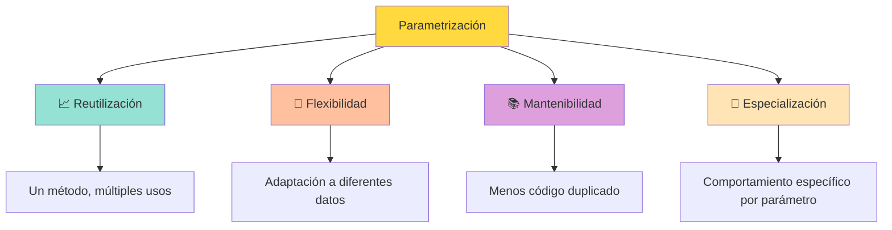
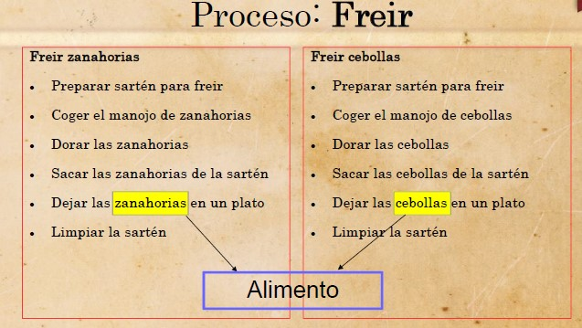
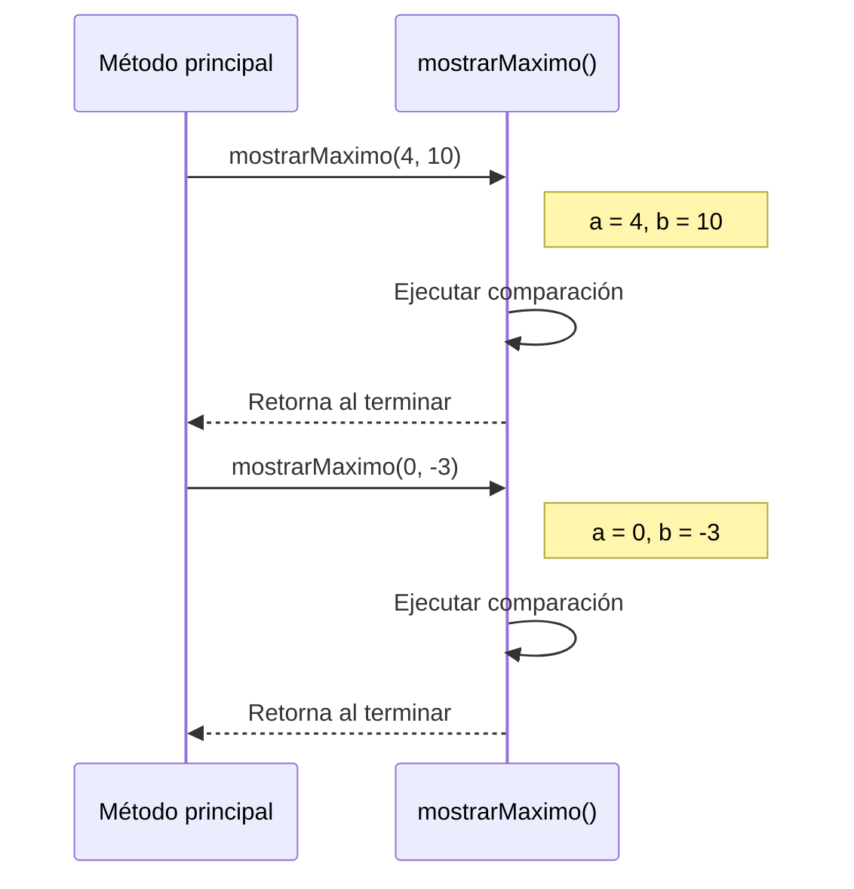
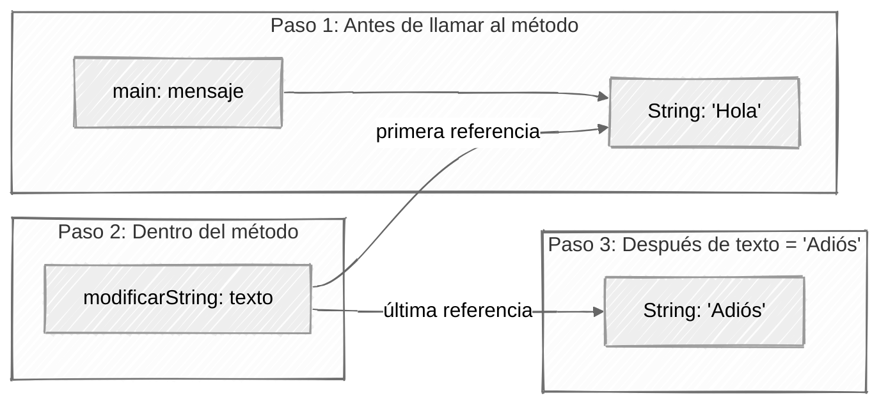
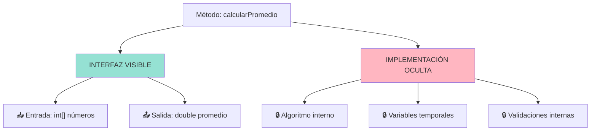
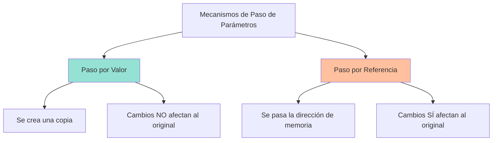
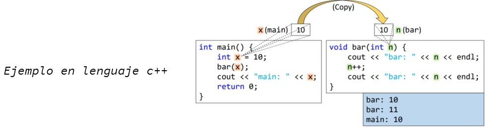
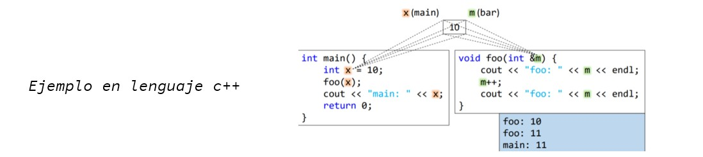
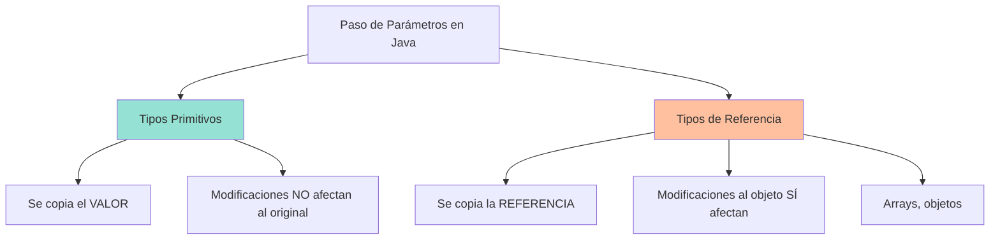

# UT4.4 Parámetros

## 📋 Índice de contenidos

1. [Parametrización de métodos](#1-parametrizaci%C3%B3n-de-m%C3%A9todos)
2. [Tipos de parámetros](#2-tipos-de-par%C3%A1metros)
3. [Parámetros de entrada](#3-par%C3%A1metros-de-entrada)
    1. [Concepto y utilidad](#31-concepto-y-utilidad)
    2. [Declaración de métodos con parámetros](#32-declaraci%C3%B3n-de-m%C3%A9todos-con-par%C3%A1metros)
    3. [Invocación de métodos con parámetros](#33-invocaci%C3%B3n-de-m%C3%A9todos-con-par%C3%A1metros)
    4. [Práctica 9: Dibujar línea con asteriscos](#34-pr%C3%A1ctica-9-dibujar-l%C3%ADnea-con-asteriscos)
    5. [Manipulación de parámetros de entrada](#35-manipulaci%C3%B3n-de-par%C3%A1metros-de-entrada)
    6. [Práctica 10: Comportamiento con arrays](#36-pr%C3%A1ctica-10-comportamiento-con-arrays)
    7. [Práctica 11: Comportamiento con String](#37-pr%C3%A1ctica-11-comportamiento-con-string)
4. [Parámetros de salida](#4-par%C3%A1metros-de-salida)
    1. [Concepto y características](#41-concepto-y-caracter%C3%ADsticas)
    2. [Declaración y uso](#42-declaraci%C3%B3n-y-uso)
    3. [Práctica 12: Lectura de número real](#43-pr%C3%A1ctica-12-lectura-de-n%C3%BAmero-real)
5. [Parámetros vs Variables globales](#5-par%C3%A1metros-vs-variables-globales)
6. [Principio de ocultación](#6-principio-de-ocultaci%C3%B3n)
    1. [Concepto fundamental](#61-concepto-fundamental)
    2. [Ejemplos prácticos](#62-ejemplos-pr%C3%A1cticos)
    3. [Práctica 13: Métodos con parámetros](#63-pr%C3%A1ctica-13-m%C3%A9todos-con-par%C3%A1metros)
    4. [Práctica 14: Contador de ocurrencias](#64-pr%C3%A1ctica-14-contador-de-ocurrencias)
    5. [Práctica 15: Eliminación de variables globales](#65-pr%C3%A1ctica-15-eliminaci%C3%B3n-de-variables-globales)
7. [Referencias y parámetros](#7-referencias-y-par%C3%A1metros)
    1. [Paso por valor en Java](#71-paso-por-valor-en-java)
    2. [Comportamiento con tipos primitivos](#72-comportamiento-con-tipos-primitivos)
    3. [Comportamiento con arrays y objetos](#73-comportamiento-con-arrays-y-objetos)
    4. [Casos especiales y precauciones](#74-casos-especiales-y-precauciones)
8. [Varargs (parámetros variables)](#8-varargs-par%C3%A1metros-variables)

## 1. Parametrización de métodos

La **parametrización de métodos** es uno de los conceptos más importantes en la programación modular. Los parámetros permiten que un mismo método pueda trabajar con diferentes datos, aumentando significativamente su **reutilización** y **flexibilidad**.

### Ventajas de la parametrización



> [!NOTE]
> Una de las ventajas del diseño descendente era que cada subproblema era más fácil de abordar. Otra ventaja importante es la **reutilización de métodos** en un mismo programa mediante parámetros.

### Ejemplo conceptual: Proceso de freír

Imaginemos que en una receta tenemos que freír diferentes ingredientes:

- **Freír zanahorias**
- **Freír cebollas**
- **Freír otros ingredientes**

En lugar de crear métodos separados para cada ingrediente, podemos crear un método genérico `freir(String ingrediente)` que funcione para cualquier alimento.



## 2. Tipos de parámetros

Un **parámetro** es un identificador dentro de la descripción de un proceso (cuando declaramos un método). El valor puede variar en las diferentes invocaciones de este proceso.

### Clasificación de parámetros

| Tipo | Descripción | Flujo de datos |
| :-- | :-- | :-- |
| **📥 De entrada** | Se proporcionan en la invocación del método | Método recibe datos |
| **📤 De salida** | Son retornados al finalizar el método | Método devuelve datos |

## 3. Parámetros de entrada

### 3.1 Concepto y utilidad

Un **parámetro de entrada** es un valor que se establece inmediatamente antes de comenzar el proceso que establece un método, de manera que indica:

- **Los datos que va a tratar** el método
- **Modificaciones en su comportamiento** según los valores recibidos

> [!IMPORTANT]
> Los parámetros se tratan como **variables locales** internas al método. Esta variable contendrá una **copia del valor** (argumento) que hemos indicado en la invocación del método.

### 3.2 Declaración de métodos con parámetros

```java
public tipoRetorno nombreMetodo(tipoParam1 nombreParam1, tipoParam2 nombreParam2, ...) {
    // Instrucciones del método
}
```

**Características importantes:**

- **No hay límite** en el número de parámetros
- Es recomendable **no excederse** para evitar errores y mejorar la legibilidad
- Los parámetros se comportan como **variables locales** dentro del método

**Ejemplo práctico:**

```java
// Método que muestra el máximo entre dos números
public static void mostrarMaximo(int a, int b) {
    System.out.print("El máximo entre " + a + " y " + b + " es... ");
    if (a > b) {
        System.out.println(a);
    } else if (a < b) {
        System.out.println(b);
    } else {
        System.out.println("son iguales!");
    }
}
```

### 3.3 Invocación de métodos con parámetros

Para invocar un método con parámetros utilizamos la siguiente sintaxis:

```java
nombreMetodo(valor1, valor2, ...);
```

**Ejemplo de invocación múltiple:**

```java
public void inicio() {
    // Usando literales
    mostrarMaximo(4, 10);
    mostrarMaximo(0, -3);
    mostrarMaximo(5, 5);
    
    // Usando variables
    int i = 0;
    int j = -3;
    mostrarMaximo(i, j);
    
    // Usando expresiones
    mostrarMaximo(2 + 3, i + 8);
}
```

**Flujo de ejecución:**



### 3.4 Práctica 9: Dibujar línea con asteriscos

**Objetivo:** Crear un programa que dibuje líneas de asteriscos de diferentes longitudes.

**Enunciado:**

Crea un programa que llame diferentes veces a un método con un único parámetro de entrada de tipo entero. Este método escribirá por pantalla tantos símbolos '*' como indique el valor del parámetro.

Para invocar al método puedes utilizar tanto un literal entero, como una variable entera a la cual previamente le habrás asignado el valor que quieres pasar al método.

<details>
<summary>💻 Solución</summary>

```java
public class DibujarLinea {
    public static void main(String[] args) {
        DibujarLinea programa = new DibujarLinea();
        programa.inicio();
    }
    
    public void inicio() {
        // Usando literales
        dibujarLinea(5);
        dibujarLinea(10);
        dibujarLinea(3);
        
        // Usando variables
        int longitud = 7;
        dibujarLinea(longitud);
        
        // Usando expresiones
        dibujarLinea(longitud * 2);
    }
    
    /**
     * Dibuja una línea de asteriscos
     * @param cantidad Número de asteriscos a dibujar
     */
    public void dibujarLinea(int cantidad) {
        for (int i = 0; i < cantidad; i++) {
            System.out.print("*");
        }
        System.out.println(); // Salto de línea
    }
}
```

</details>

### 3.5 Manipulación de parámetros de entrada

Una vez que comienza a ejecutarse el método, las variables representadas por sus parámetros pueden ser usadas como cualquier variable local. **Incluso se puede ver modificado su valor inicial**.

> [!WARNING]
> Una vez invocado el método, un parámetro contiene una **copia** de la variable usada en la invocación del método (una copia del argumento).

**Ejemplo de modificación de parámetros:**

```java
public void inicio() {
    int i = 10;
    System.out.println("Antes de llamar al método \"i\" vale " + i);
    modificarParametro(i);
    System.out.println("Después de llamar al método \"i\" vale " + i);
}

public void modificarParametro(int a) {
    System.out.println("Valor recibido: " + a);
    a = 0; // Modificamos el parámetro
    System.out.println("Valor modificado dentro del método: " + a);
}
```

**Salida esperada:**

```text
Antes de llamar al método "i" vale 10
Valor recibido: 10
Valor modificado dentro del método: 0
Después de llamar al método "i" vale 10
```

> [!NOTE]
> La variable original `i` no se ve afectada porque el parámetro `a` contiene una **copia** del valor, no una referencia a la variable original. Aunque el parámetro se llamara `i` tampoco modificaría el original ya que están en ámbitos distintos.

### 3.6 Práctica 10: Comportamiento con arrays

**Objetivo:** Comprobar el comportamiento de los parámetros cuando se pasan arrays.

**Enunciado:**

Realiza un programa similar al anterior, pero en este caso, el parámetro será un array de enteros. Dentro del método, modifica un dato del array. El programa ha de mostrar los datos del array, antes y después de invocar el método.

Razona por qué ahora se obtiene esta salida.

<details>
<summary>💻 Solución</summary>

```java
import java.util.Arrays;

public class ModificarArray {
    public static void main(String[] args) {
        ModificarArray programa = new ModificarArray();
        programa.inicio();
    }
    
    public void inicio() {
        int[] numeros = {1, 2, 3, 4, 5};
        
        System.out.println("Antes de llamar al método: " + Arrays.toString(numeros));
        modificarArray(numeros);
        System.out.println("Después de llamar al método: " + Arrays.toString(numeros));
    }
    
    public void modificarArray(int[] array) {
        System.out.println("Array recibido: " + Arrays.toString(array));
        if (array.length > 0) {
            array[0] = 999; // Modificamos el primer elemento
        }
        System.out.println("Array modificado en el método: " + Arrays.toString(array));
    }
}
```

**Salida:**

```text
Antes de llamar al método: [1, 2, 3, 4, 5]
Array recibido: [1, 2, 3, 4, 5]
Array modificado en el método: [999, 2, 3, 4, 5]
Después de llamar al método: [999, 2, 3, 4, 5]
```

**Explicación:** Con arrays, el parámetro contiene una copia de la **referencia** al array, no una copia del array completo. Por tanto, las modificaciones al contenido del array sí afectan al contenido del array original.

</details>

### 3.7 Práctica 11: Comportamiento con String

**Objetivo:** Comprobar el comportamiento de los parámetros con objetos String.

**Enunciado:**

Realiza un programa similar al anterior, pero en este caso, el parámetro será de tipo String.

¿Se comporta como una variable de tipo básico?

<details>
<summary>💻 Solución</summary>

```java
public class ModificarString {
    public static void main(String[] args) {
        ModificarString programa = new ModificarString();
        programa.inicio();
    }
    
    public void inicio() {
        String mensaje = "Hola";
        
        System.out.println("Antes de llamar al método: " + mensaje);
        modificarString(mensaje);
        System.out.println("Después de llamar al método: " + mensaje);
    }
    
    public void modificarString(String texto) {
        System.out.println("String recibido: " + texto);
        texto = "Adiós"; // Intentamos modificar
        System.out.println("String modificado en el método: " + texto);
    }
}
```

**Salida:**

```text
Antes de llamar al método: Hola
String recibido: Hola
String modificado en el método: Adiós
Después de llamar al método: Hola
```

**Explicación:** String se comporta como una variable de tipo básico porque los objetos String son **inmutables**. Cuando asignamos un nuevo valor al parámetro, estamos creando una nueva referencia, no modificando el objeto original.



</details>

## 4. Parámetros de salida

### 4.1 Concepto y características

Los **parámetros de salida** indican los resultados obtenidos después de realizar un proceso determinado.

**Características en Java:**

- En Java **solo se puede establecer un parámetro de salida** a través de su tipo de dato
- Esto permite **convertir el método en una expresión**, ya que la invocación equivaldrá al resultado que retorne
- La función sería como una expresión equivalente al resultado. 
- Por tanto, se puede asignar a una variable, imprimir, o utilizar como argumento de otra función
- Se utiliza la palabra reservada `return` para especificar el valor de retorno

### 4.2 Declaración y uso

**Sintaxis para métodos con valor de retorno:**

```java
public tipoRetorno nombreMetodo(parametrosEntrada) {
    // Código del método
    return valorARetornar;
}
```

**Ejemplo completo: Leer entero por teclado:**

```java
public void inicio() {
    System.out.println("Introduce un entero:");
    int a = leerEnteroTeclado(); // El método se usa como expresión
    System.out.println("El entero ha sido " + a + ".");
    
    System.out.println("Introduce otro entero:");
    a = leerEnteroTeclado(); // Reutilización del método
    System.out.println("El otro entero ha sido " + a + ".");
}

public int leerEnteroTeclado() {
    Scanner lector = new Scanner(System.in);
    int enteroLeido = 0;
    boolean leido = false;
    
    while (!leido) {
        if (lector.hasNextInt()) {
            enteroLeido = lector.nextInt();
            leido = true;
        } else {
            System.out.println("Eso no es un entero. Inténtalo de nuevo:");
        }
        lector.nextLine();
    }
    
    return enteroLeido; // Valor de retorno
}
```

### 4.3 Práctica 12: Lectura de número real

**Objetivo:** Adaptar el método anterior para trabajar con números reales.

**Enunciado:**

Modifica el ejemplo anterior, para que el parámetro de salida sea de tipo real. Asegúrate que el funcionamiento es correcto, introduciendo datos de tipo real por teclado.

<details>
<summary>💻 Solución</summary>

```java
import java.util.Scanner;

public class LeerReal {
    private Scanner scanner = new Scanner(System.in);
    
    public static void main(String[] args) {
        LeerReal programa = new LeerReal();
        programa.inicio();
    }
    
    public void inicio() {
        System.out.println("Introduce un número real:");
        double numero1 = leerRealTeclado();
        System.out.println("El número ha sido " + numero1);
        
        System.out.println("Introduce otro número real:");
        double numero2 = leerRealTeclado();
        System.out.println("El otro número ha sido " + numero2);
        
        double suma = numero1 + numero2;
        System.out.println("La suma es: " + suma);
        
        scanner.close();
    }
    
    /**
     * Lee un número real por teclado con validación
     * @return Número real introducido por el usuario
     */
    public double leerRealTeclado() {
        double realLeido = 0.0;
        boolean leido = false;
        
        while (!leido) {
            if (scanner.hasNextDouble()) {
                realLeido = scanner.nextDouble();
                leido = true;
            } else {
                System.out.println("Eso no es un número real válido. Inténtalo de nuevo:");
            }
            scanner.nextLine();
        }
        
        return realLeido;
    }
}
```

</details>

## 5. Parámetros vs Variables globales

Una decisión importante en el diseño de métodos es determinar cuándo usar parámetros y cuándo usar variables globales.

### Comparación práctica

**Ejemplo usando variables globales:**

```java
public class EjemploGlobales {
    private static int[] datos = {1, 2, 3, 4, 5};
    private static double resultado;
    
    public void inicio() {
        calcularPromedio(); // No necesita parámetros
        mostrarResultado(); // No necesita parámetros
    }
    
    public void calcularPromedio() {
        double suma = 0;
        for (int dato : datos) {
            suma += dato;
        }
        resultado = suma / datos.length;
    }
    
    public void mostrarResultado() {
        System.out.println("El promedio es: " + resultado);
    }
}
```

**Ejemplo usando parámetros:**

```java
public class EjemploParametros {
    public void inicio() {
        int[] datos = {1, 2, 3, 4, 5};
        double resultado = calcularPromedio(datos);
        mostrarResultado(resultado);
    }
    
    public double calcularPromedio(int[] numeros) {
        double suma = 0;
        for (int numero : numeros) {
            suma += numero;
        }
        return suma / numeros.length;
    }
    
    public void mostrarResultado(double promedio) {
        System.out.println("El promedio es: " + promedio);
    }
}
```

**Ejemplo comparativo:**

```java
// Con variables globales

// ...
unMetodo();
System.out.println(i + " " + j + " " + k); // i=4 j=8 k=12
```

- ¿A qué variables accede `unMetodo()`?
- ¿Cuál es el resultado en este caso?
- ¿En que variable se encuentra almacenado el resultado?

```java
// Con variables locales 
//...
k = unMetodo(i, j);
System.out.println(i + " " + j + " " + k); // i=4 j=8 k=12
```

¿Puedes responder ahora a las preguntas anteriores?

### Ventajas de usar parámetros

| Aspecto | Parámetros | Variables Globales |
| :-- | :-- | :-- |
| **🔧 Reutilización** | ✅ Alta - método independiente | ❌ Baja - depende de variables específicas |
| **📖 Legibilidad** | ✅ Clara - se ve qué datos necesita | ❌ Confusa - dependencias ocultas |
| **🧪 Testing** | ✅ Fácil - datos de prueba como parámetros | ❌ Difícil - hay que modificar variables globales |
| **🛡️ Encapsulación** | ✅ Buena - interfaz bien definida | ❌ Mala - acoplamiento alto |

> [!TIP]
> El uso de parámetros mejora la **legibilidad del código**, elimina **interdependencias** y lo hace **más reutilizable**.

## 6. Principio de ocultación

### 6.1 Concepto fundamental

El **principio de ocultación** se define como la segregación de los elementos en que se descompone un problema general, de manera que se separa su **interfaz contractual** de su **implementación**.


> [!IMPORTANT]
> Cuando utilizamos un método (que puede haber implementado otro compañero) nos interesa saber:
>
> - **Los datos de entrada** que se han de utilizar
> - **La salida** que nos retornará este método (**interfaz**)
>
> **No nos preocupa** la forma en que hará los cálculos internos para conseguir este resultado. Esta es una **información oculta** para nosotros, que no nos ha de interesar.



### 6.2 Ejemplos prácticos

Los siguientes son ejemplos perfectos de métodos que aplican el principio de ocultación:

#### 🧮 Operaciones matemáticas básicas

```java
/**
 * Calcula el máximo valor en un array
 * INTERFAZ: recibe int[], devuelve int
 * IMPLEMENTACIÓN: algoritmo de búsqueda (oculto)
 */
public int calcularMaximo(int[] valores) {
    // Implementación oculta
}

/**
 * Calcula el mínimo valor en un array
 * INTERFAZ: recibe int[], devuelve int
 */
public int calcularMinimo(int[] valores) {
    // Implementación oculta
}

/**
 * Calcula la media aritmética
 * INTERFAZ: recibe int[], devuelve double
 */
public double calcularMedia(int[] valores) {
    // Implementación oculta
}
```


#### 📊 Operaciones de validación y conversión

```java
/**
 * Convierte nota numérica a texto
 * INTERFAZ: recibe double, devuelve String
 */
public String notaATexto(double nota) {
    // Implementación oculta
}

/**
 * Obtiene días de un mes específico
 * INTERFAZ: recibe int mes, int año, devuelve int
 */
public int diasDelMes(int mes, int año) {
    // Implementación oculta
}

/**
 * Busca un valor en un array
 * INTERFAZ: recibe int[] y int, devuelve boolean
 */
public boolean buscarValor(int[] array, int valor) {
    // Implementación oculta
}
```

### 6.3 Práctica 13: Métodos con parámetros

**Objetivo:** Implementar todos los métodos ejemplificados anteriormente usando parámetros de entrada y salida.

**Enunciado:**

Efectúa todos los programas indicados anteriormente haciendo uso de métodos que utilizan parámetros de entrada y de salida.

Muestra la entrada y salida de cada uno de ellos para comprobar su correcto funcionamiento.

<details>
<summary>💻 Solución parcial - Operaciones matemáticas</summary>

```java
import java.util.Arrays;

public class OperacionesMatematicas {
    public static void main(String[] args) {
        OperacionesMatematicas programa = new OperacionesMatematicas();
        programa.inicio();
    }
    
    public void inicio() {
        int[] numeros = {15, 3, 9, 27, 5, 12, 8};
        
        System.out.println("Array: " + Arrays.toString(numeros));
        System.out.println("Máximo: " + calcularMaximo(numeros));
        System.out.println("Mínimo: " + calcularMinimo(numeros));
        System.out.println("Media: " + calcularMedia(numeros));
        
        // Pruebas de conversión
        double[] notas = {8.5, 6.2, 4.8, 9.1, 5.5};
        System.out.println("\nConversión de notas:");
        for (double nota : notas) {
            System.out.println(nota + " -> " + notaATexto(nota));
        }
        
        // Pruebas de búsqueda
        System.out.println("\nBúsquedas:");
        System.out.println("¿Está el 9? " + buscarValor(numeros, 9));
        System.out.println("¿Está el 100? " + buscarValor(numeros, 100));
    }
    
    public int calcularMaximo(int[] valores) {
        int maximo = valores[0];
        for (int i = 1; i < valores.length; i++) {
            if (valores[i] > maximo) {
                maximo = valores[i];
            }
        }
        return maximo;
    }
    
    public int calcularMinimo(int[] valores) {
        int minimo = valores[0];
        for (int i = 1; i < valores.length; i++) {
            if (valores[i] < minimo) {
                minimo = valores[i];
            }
        }
        return minimo;
    }
    
    public static double calcularMedia(int[] valores) {
        double suma = 0;
        for (int valor : valores) {
            suma += valor;
        }
        return suma / valores.length;
    }
    
    public static String notaATexto(double nota) {
        if (nota >= 5.0) {
            return "Aprobado";
        } else {
            return "Suspenso";
        }
    }
    
    public static boolean buscarValor(int[] array, int valor) {
        for (int elemento : array) {
            if (elemento == valor) {
                return true;
            }
        }
        return false;
    }
}
```

</details>

### 6.4 Práctica 14: Contador de ocurrencias

**Objetivo:** Crear un programa modular que cuente ocurrencias sin usar variables globales.

**Enunciado:**

Haz un programa que pida un número entero por teclado. Dado un conjunto de valores dentro de un array, ha de calcular cuántas veces aparece el número introducido.

Realiza métodos tanto para preguntar el número, como para buscar sus ocurrencias. El array ha de ser declarado e inicializado en el método `inicio()`.

**No se podrán utilizar variables globales.**

<details>
<summary>💻 Solución</summary>

```java
import java.util.Scanner;

public class ContadorOcurrencias {
    private Scanner scanner = new Scanner(System.in);
    
    public static void main(String[] args) {
        ContadorOcurrencias programa = new ContadorOcurrencias();
        programa.inicio();
    }
    
    public void inicio() {
        // Array declarado e inicializado localmente
        int[] numeros = {5, 3, 8, 5, 2, 5, 9, 1, 5, 7, 5};
        
        // Mostrar el array
        mostrarArray(numeros);
        
        // Pedir número a buscar
        int numeroBuscado = pedirNumero();
        
        // Buscar ocurrencias
        int ocurrencias = contarOcurrencias(numeros, numeroBuscado);
        
        // Mostrar resultado
        mostrarResultado(numeroBuscado, ocurrencias);
        
        scanner.close();
    }
    
    /**
     * Pide un número entero al usuario
     * @return Número introducido por el usuario
     */
    public int pedirNumero() {
        System.out.print("Introduce el número que quieres buscar: ");
        while (!scanner.hasNextInt()) {
            System.out.println("Por favor, introduce un número entero válido.");
            System.out.print("Introduce el número que quieres buscar: ");
            scanner.nextLine();
        }
        return scanner.nextInt();
    }
    
    /**
     * Cuenta cuántas veces aparece un número en un array
     * @param array Array donde buscar
     * @param numero Número a buscar
     * @return Cantidad de ocurrencias encontradas
     */
    public int contarOcurrencias(int[] array, int numero) {
        int contador = 0;
        for (int elemento : array) {
            if (elemento == numero) {
                contador++;
            }
        }
        return contador;
    }
    
    /**
     * Muestra el contenido de un array
     * @param array Array a mostrar
     */
    public void mostrarArray(int[] array) {
        System.out.print("Array: [");
        for (int i = 0; i < array.length; i++) {
            System.out.print(array[i]);
            if (i < array.length - 1) {
                System.out.print(", ");
            }
        }
        System.out.println("]");
    }
    
    /**
     * Muestra el resultado de la búsqueda
     * @param numero Número buscado
     * @param ocurrencias Cantidad de veces encontrado
     */
    public void mostrarResultado(int numero, int ocurrencias) {
        System.out.println("El número " + numero + " aparece " + ocurrencias + " vez/veces en el array.");
    }
}
```

</details>

### 6.5 Práctica 15: Eliminación de variables globales

**Objetivo:** Refactorizar el programa de temperaturas para eliminar variables globales.

**Enunciado:**

Modifica el programa realizado mediante el diseño descendente (temperaturas), para que ahora deje de utilizar variables globales (al menos el array).

<details>
<summary>💻 Estructura de solución</summary>

```java
import java.util.Scanner;

public class Practica15 {
    private final Scanner teclado = new Scanner(System.in);

    public static void main(String[] args) {
        Practica15 programa = new Practica15();
        programa.inicio();
    }

    // NIVEL 0 de descomposición. Solo existe un módulo que deberemos descomponer.
    public void inicio() {

        double temperaturas[][] = new double[52][7];
        // int diaActual=1;
        // int mesActual=1;
        // int semana = 0;
        int[] fecha = { 1, 1, 0 };
        boolean salir = false;
        int opcion;
        while (!salir) {
            mostrarMenu();
            while (!teclado.hasNextInt()) {
                System.out.print("ERROR. Introduce un valor entero: ");
                teclado.nextLine();
            }
            opcion = teclado.nextInt();
            teclado.nextLine();
            salir = tratarOrden(opcion, fecha, temperaturas);
        }

    }

    // NIVEL 1
    // Tarea 1. Mostrar el menú
    public void mostrarMenu() {
        System.out.println("---------------- MENÚ ----------------");
        System.out.println("-- 1. Entrar temperaturas semanales --");
        System.out.println("-- 2. Mostrar temperatura media     --");
        System.out.println("-- 3. Mostrar la diferencia máxima  --");
        System.out.println("-- 4. Finalizar ejecución           --");
        System.out.println("--------------------------------------");
        System.out.print("\nINTRODUCE UNA OPCIÓN: ");
    }

    // Tarea 2. Tratar la orden dada por el usuario.
    public boolean tratarOrden(int opcion, int[] fecha, double[][] temperaturas) {
        switch (opcion) {
            case 1:
                entrarTemperaturasSemanales(fecha, temperaturas);
                break;
            case 2:
                mostrarTemperaturaMedia(fecha, temperaturas);
                break;
            case 3:
                mostrarDiferenciaMaxima(fecha, temperaturas);
                break;
            case 4:
                return true;
            default:
                System.out.println("ERROR. OPCIÓN INVÁLIDA\n");
        }
        return false;
    }

    // NIVEL 2
    // Tarea 2.1 Introducción de temperaturas semanales.
    public void entrarTemperaturasSemanales(int[] fecha, double[][] temperaturas) {
        leerTemperaturas(fecha, temperaturas);
        actualizarFecha(fecha);
    }

    // Tarea 2.2. Mostrar la temperatura media de las que tenemos introducidas.
    public void mostrarTemperaturaMedia(int[] fecha, double[][] temperaturas) {
        mostrarFechaActual(fecha);
        calcularTemperaturaMedia(fecha, temperaturas);
    }

    // Tarea 2.3, Mostrar la diferencia máxima entre temperaturas.
    public void mostrarDiferenciaMaxima(int[] fecha, double[][] temperaturas) {
        mostrarFechaActual(fecha);
        calcularDiferenciaMaxima(fecha, temperaturas);

    }

    // Tarea 2.4. Finalizar la ejecución del programa (salir del bucle).
    public void finalizarEjecucion() {

    }

    // NIVEL 3
    // Tarea 2.1.1. Lectura por teclado de las temperaturas.
    public void leerTemperaturas(int[] fecha, double[][] temperaturas) {
        System.out.println("A continuación se solicitan las 7 temperaturas de esta semana: ");
        for (int i = 0; i < 7; i++) {
            System.out.print("Introduce la temperatura " + (i + 1) + ": ");
            while (!teclado.hasNextDouble()) {
                teclado.nextLine();
                System.out.print("Error. Introduce la temperatura " + (i + 1) + ": ");
            }
            temperaturas[fecha[2]][i] = teclado.nextDouble();
            teclado.nextLine();
        }
    }

    // Tarea 2.1.2. Actualización de la fecha actual.
    public void actualizarFecha(int[] fecha) {
        fecha[2]++;
        for (int i = 0; i < 7; i++) {
            if ((fecha[0] == 28 && fecha[1] == 2)
                    || (fecha[0] == 30 && (fecha[1] == 4 || fecha[1] == 6 || fecha[1] == 9 || fecha[1] == 11))
                    || (fecha[0] == 31 && (fecha[1] == 1 || fecha[1] == 3 || fecha[1] == 5 || fecha[1] == 7
                            || fecha[1] == 8 || fecha[1] == 10))) {
                fecha[0] = 1;
                fecha[1]++;
            } else if (fecha[0] == 31 && fecha[1] == 12) {
                fecha[0] = 1;
                fecha[1] = 1;
                fecha[2] = 0;
            } else {
                fecha[0]++;
            }
        }
    }

    // Tarea 2.2.1. y 2.3.1. Mostrar por pantalla la fecha actual.
    public void mostrarFechaActual(int[] fecha) {
        String[] meses = {"enero", "febrero", "marzo", "abril", "mayo", "junio", "julio", "agosto", "septiembre", "octubre", "noviembre", "diciembre"};
        String fechaString = fecha[0] + " de " + meses[fecha[1] - 1];
       
        System.out.println("Fecha actual: " + fechaString);
    }

    // Tarea 2.2.2. Cálculos para obtener el promedio de temperaturas.
    public void calcularTemperaturaMedia(int[] fecha, double[][] temperaturas) {
        int valores = 0;
        double totales = 0;
        for (int i = 0; i < fecha[2]; i++) {
            for (int j = 0; j < 7; j++) {
                valores++;
                totales += temperaturas[i][j];
            }
        }
        System.out.printf("La temperatura media es de: %.2f ºC\n", (totales / valores));
    }

    // Tarea 2.3.2. Cálculos para obtener la diferencia máxima entre temperaturas.
    public void calcularDiferenciaMaxima(int[] fecha, double[][] temperaturas) {
        double minima = temperaturas[0][0];
        double maxima = temperaturas[0][0];

        for (int i = 0; i < fecha[2]; i++) {
            for (int j = 0; j < 7; j++) {
                if (temperaturas[i][j] > maxima) {
                    maxima = temperaturas[i][j];
                }
                if (temperaturas[i][j] < minima) {
                    minima = temperaturas[i][j];
                }
            }
        }

        System.out.println("La diferencia máxima entre temperaturas es de " + (maxima - minima) + " ºC");

    }
}
```

</details>

## 7. Referencias y parámetros

Los **parámetros** son el mecanismo fundamental que permite la comunicación entre métodos. Para comprender completamente su comportamiento, es esencial entender los diferentes **mecanismos de paso de parámetros** que existen en la programación.

### Conceptos fundamentales: Paso por valor vs Paso por referencia

En la programación existen dos mecanismos principales para pasar parámetros a los métodos:



#### 📋 Paso por valor

**Definición**: Cuando un parámetro se pasa **por valor**, el método recibe una **copia** del valor de la variable original.

**Características principales:**

- Se crea una **variable temporal** dentro del método que contiene una copia del valor
- Cualquier modificación realizada dentro del método **NO afecta** a la variable original
- La variable original y el parámetro del método son **independientes**

**Ejemplo conceptual:**



#### 🔗 Paso por referencia

**Definición**: Cuando un parámetro se pasa **por referencia**, el método recibe la **dirección de memoria** (referencia) donde se encuentra la variable original.

**Características principales:**

- No se crea una copia, sino que se proporciona **acceso directo** a la variable original
- Cualquier modificación realizada dentro del método **SÍ afecta** a la variable original
- El parámetro del método y la variable original **son la misma entidad**

**Ejemplo conceptual:**



#### 🎯 Comparación práctica

| Aspecto | Paso por Valor | Paso por Referencia |
|---------|----------------|---------------------|
| **🔄 Mecanismo** | Copia del valor | Dirección de memoria |
| **💾 Memoria** | Usa más memoria (copia) | Usa menos memoria |
| **🛡️ Seguridad** | Variable original protegida | Variable original expuesta |
| **⚡ Rendimiento** | Más lento (crear copia) | Más rápido (no hay copia) |
| **🔧 Modificaciones** | NO afectan al original | SÍ afectan al original |

### ☕ Particularidades de Java

> [!IMPORTANT]
> **Java SIEMPRE pasa parámetros por valor**. Esta es una característica fundamental del lenguaje que debemos comprender claramente.

Sin embargo, el comportamiento puede **parecer** diferente según el tipo de dato, como se verá más adelante.

> [!TIP]
> Aunque Java no tiene paso por referencia verdadero, el comportamiento con objetos puede simular este mecanismo porque se comparte la misma dirección de memoria del objeto.

### 7.1 Paso por valor en Java

Como ya hemos comentado, las variables de tipo compuesto así como las de los arrays **no almacenan directamente un valor** sino una **referencia** al lugar donde se encontrarán esos datos.

También sabemos que en Java los parámetros se pasan **por valor** (se copia el argumento en una variable local al método).

En Java, el parámetro será una **variable de comunicación de ENTRADA** para el subprograma. Esta variable **no podrá ser modificada** en términos de afectar a la variable original porque el que hace es una **copia del valor al parámetro formal** correspondiente para poder utilizarlo.

> [!IMPORTANT]
> Es importante tener esto en cuenta a la hora de utilizar estos tipos de datos como parámetros en un método.



### 7.2 Comportamiento con tipos primitivos

**Ejemplo con parámetros de tipo primitivo:**

```java
public class ParametrosPrimitivos {
    public static void main(String[] args) {
        int cantidad1 = 2;
        int cantidad2 = 6;
        int suma = sumar(cantidad1, cantidad2);
        System.out.println("Suma: " + suma);
        
        // Las variables originales no cambian
        System.out.println("cantidad1 sigue siendo: " + cantidad1);
        System.out.println("cantidad2 sigue siendo: " + cantidad2);
    }
    
    public static int sumar(int sumando1, int sumando2) {
        /*
         * Operaciones internas cuando se invoca:
         * sumando1 = cantidad1; // copia el valor
         * sumando2 = cantidad2; // copia el valor
         */
        return sumando1 + sumando2;
    }
    // Cuando finaliza la función desaparecen sumando1 y sumando2
}
```

**Otro ejemplo con modificación:**

```java
public static void main(String[] args) {
    double cantidad = 2.5;
    modificar(cantidad);
    // Cuando finaliza el método, "cantidad" sigue valiendo 2.5
    System.out.println(cantidad); // Imprime: 2.5
}

public static void modificar(double precio) {
    /*
     * Operaciones internas cuando se invoca:
     * precio = cantidad; // precio vale 2.5 y cantidad vale 2.5
     */
    precio = 3.75;
    // En este punto "precio" vale 3.75 y "cantidad" vale 2.5
}
// Cuando finaliza la función desaparece la variable precio
```

### 7.3 Comportamiento con arrays y objetos

**Funcionamiento con parámetros de tipo array:**

```java
public static void main(String[] args) {
    double[] notasTrimestrales = {7.85, 5.32, 8.5};
    System.out.println("Antes: " + Arrays.toString(notasTrimestrales));
    modificar(notasTrimestrales);
    // Cuando finaliza el método, "notasTrimestrales[1]" vale 9.7
    System.out.println("Después: " + Arrays.toString(notasTrimestrales));
    // Imprimirá: [7.85, 9.7, 8.5]
}

public static void modificar(double[] notas) {
    /*
     * Operaciones internas cuando se invoca:
     * notas = notasTrimestrales; // Ambas variables apuntan al mismo array
     */
    notas[1] = 9.7; // Está modificando el array al cual apunta la referencia
    // En este punto "notas[1]" vale 9.7 y "notasTrimestrales[1]" vale 9.7
    // Se ha modificado el mismo espacio de memoria
}
// Cuando finaliza la función desaparece la variable "notas"
```

### 7.4 Casos especiales y precauciones

#### ⚠️ Comportamiento PELIGROSO - Caso 1

```java
public static void main(String[] args) {
    double[] notasPere = {5.1, 3.2, 7.1};
    double[] notasAitana = notasMas1(notasPere);
    double[] notasMaria = notasMas1(notasAitana);
    
    System.out.println("Pere: " + Arrays.toString(notasPere));
    System.out.println("Aitana: " + Arrays.toString(notasAitana));
    System.out.println("Maria: " + Arrays.toString(notasMaria));
    // Los tres tienen las mismas notas: [6.1, 4.2, 8.1]
}

private static double[] notasMas1(double[] notas) {
    notas[0]++; // Modifica el array original
    notas[1]++;
    notas[2]++;
    return notas; // Devuelve la misma referencia
}
```

> [!DANGER]
> En este ejemplo, todos los arrays apuntan al mismo objeto en memoria. Cualquier modificación afecta a todos.

#### 🔧 Comportamiento INESPERADO - Caso 2

```java
public static void main(String[] args) {
    double[] notasTrimestrales = {7.1, 2.1, 3.6};
    modificarNotas(notasTrimestrales);
    System.out.println(Arrays.toString(notasTrimestrales));
    // No se han modificado las notas: [7.1, 2.1, 3.6]
}

private static void modificarNotas(double[] notas) {
    notas = new double[3]; // Crea un NUEVO array
    notas[0] = 9.5;
    notas[1] = 7.3;
    notas[2] = 7.1;
    // Estas modificaciones son al nuevo array, no al original
}
```

> [!NOTE]
> Cuando asignamos `new double[3]` al parámetro, cambiamos a qué objeto apunta la referencia local, pero no afectamos la referencia original.

## 8. Varargs (parámetros variables)

**Varargs** (argumentos variables) permite crear métodos que acepten una cantidad indeterminada de argumentos del mismo tipo.

### Sintaxis y uso básico

```java
// Método tradicional con array
public static int sumarArray(int[] valores) {
    int resultado = 0;
    for (int i = 0; i < valores.length; i++) {
        resultado += valores[i];
    }
    return resultado;
}

// Método con varargs
public static int sumar(int... valores) {
    int resultado = 0;
    for (int i = 0; i < valores.length; i++) {
        resultado += valores[i];
    }
    return resultado;
}
```

### Invocación de métodos varargs

```java
public static void main(String[] args) {
    // Método tradicional
    int[] array1 = {8, 5, 1, -8, 2};
    int resultado1 = sumarArray(array1);
    System.out.println("sumarArray = " + resultado1);
    
    // Método con varargs - más flexible
    int resultado2 = sumar(8, 5, 1, -8, 2);
    System.out.println("sumar = " + resultado2);
    
    // También funciona con diferentes cantidades
    int resultado3 = sumar(10, 20);
    int resultado4 = sumar(1, 2, 3, 4, 5, 6, 7, 8, 9, 10);
}
```

### Combinación con parámetros fijos

También se pueden combinar argumentos únicos con argumentos de longitud variable. **El parámetro vararg debe ser el último**.

```java
public static void imprimirNotas(String alumno, String modulo, double... notas) {
    System.out.print(alumno + " en el módulo de " + modulo + " tiene las notas:");
    for (int i = 0; i < notas.length; i++) {
        System.out.print("\t" + notas[i]);
    }
    System.out.println();
}

// Uso del método
public static void main(String[] args) {
    imprimirNotas("Pere", "Programación", 8.3, 5.1, 8.75, 7.1, 6.9);
    imprimirNotas("Laura", "Sistemas", 9.25, 7.6);
}
```

**Salida:**

```text
Pere en el módulo de Programación tiene las notas:   8.3   5.1   8.75   7.1   6.9
Laura en el módulo de Sistemas tiene las notas:   9.25   7.6
```

### Restricciones de varargs

1. **Solo puede haber un parámetro varargs** por método
2. **Debe ser el último parámetro** en la lista
3. **Internamente se trata como un array**

```java
// ✅ Correcto
public static void metodo1(String nombre, int... numeros) { }

// ❌ Incorrecto - varargs no es el último
public static void metodo2(int... numeros, String nombre) { }

// ❌ Incorrecto - múltiples varargs
public static void metodo3(int... numeros1, double... numeros2) { }
```

> [!TIP]
> Varargs es especialmente útil para métodos de utilidad como loggers, calculadoras, o métodos que necesiten procesar cantidades variables de datos del mismo tipo.

> [!IMPORTANT]
> **Este es un buen momento para estudiar el "Anexo I. Recursividad"**

<p align="center">📚 <em>Fin del apartado UT4.4 - Parámetros</em></p>
