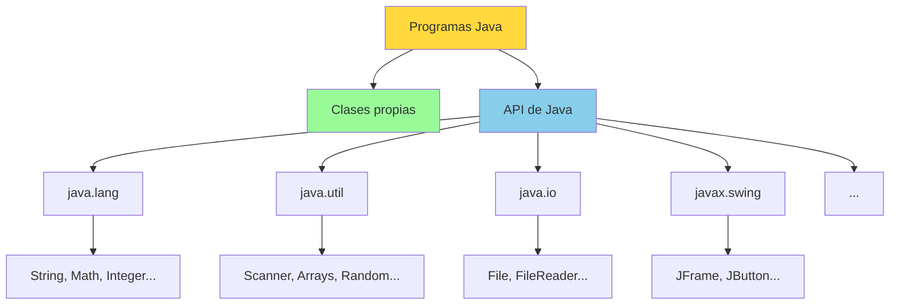
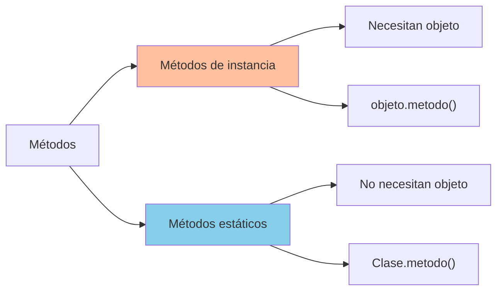
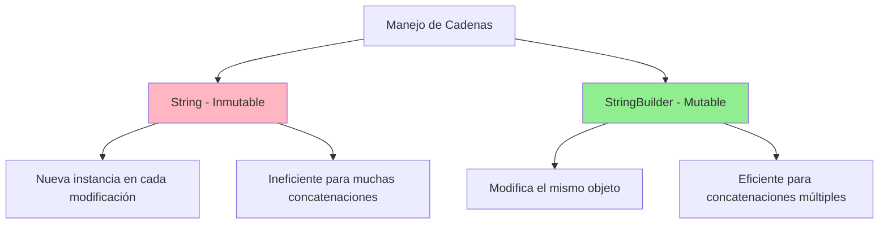
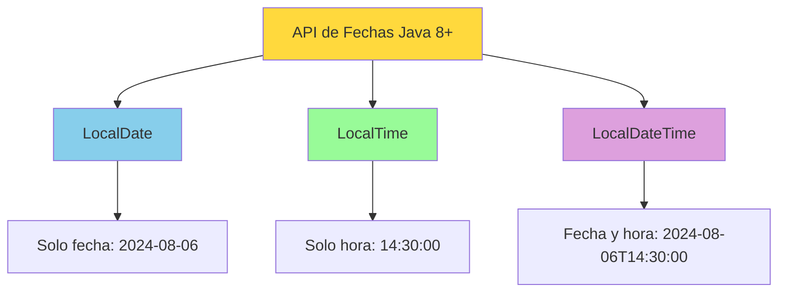

# UT4.5 API de Java. Creación y Manejo de Objetos

## 📋 Índice de contenidos

1. [Introducción a la API de Java](#1-introducci%C3%B3n-a-la-api-de-java)
2. [API de Java: Conceptos y navegación](#2-api-de-java-conceptos-y-navegaci%C3%B3n)
    1. [¿Qué es la API de Java?](#21-qu%C3%A9-es-la-api-de-java)
    2. [Documentación oficial y versiones](#22-documentaci%C3%B3n-oficial-y-versiones)
    3. [Módulos destacados](#23-m%C3%B3dulos-destacados)
    4. [Navegación por la documentación](#24-navegaci%C3%B3n-por-la-documentaci%C3%B3n)
3. [Constructores y creación de objetos](#3-constructores-y-creaci%C3%B3n-de-objetos)
    1. [Concepto de constructor](#31-concepto-de-constructor)
    2. [Invocación de constructores](#32-invocaci%C3%B3n-de-constructores)
    3. [Práctica 1: Números aleatorios con Random](#33-pr%C3%A1ctica-1-n%C3%BAmeros-aleatorios-con-random)
    4. [Práctica 2: Constructor con parámetros](#34-pr%C3%A1ctica-2-constructor-con-par%C3%A1metros)
4. [Métodos estáticos](#4-m%C3%A9todos-est%C3%A1ticos)
    1. [Concepto y características](#41-concepto-y-caracter%C3%ADsticas)
    2. [Clase Math](#42-clase-math)
    3. [Práctica 3: Redondeo de números](#43-pr%C3%A1ctica-3-redondeo-de-n%C3%BAmeros)
    4. [Práctica 4: Cálculo de hipotenusa](#44-pr%C3%A1ctica-4-c%C3%A1lculo-de-hipotenusa)
5. [Clase Arrays](#5-clase-arrays)
    1. [Funcionalidades principales](#51-funcionalidades-principales)
    2. [Práctica 5: Operaciones con arrays](#52-pr%C3%A1ctica-5-operaciones-con-arrays)
6. [Clase StringBuilder](#6-clase-stringbuilder)
    1. [Concepto y ventajas](#61-concepto-y-ventajas)
    2. [Constructores de StringBuilder](#62-constructores-de-stringbuilder)
    3. [Métodos que modifican el contenido](#63-m%C3%A9todos-que-modifican-el-contenido)
    4. [Otros métodos útiles](#64-otros-m%C3%A9todos-%C3%BAtiles)
    5. [Preguntas de reflexión](#65-preguntas-de-reflexi%C3%B3n)
    6. [Práctica 6: Experimentación con StringBuilder](#66-pr%C3%A1ctica-6-experimentaci%C3%B3n-con-stringbuilder)
7. [Trabajo con fechas](#7-trabajo-con-fechas)
    1. [Importancia en aplicaciones reales](#71-importancia-en-aplicaciones-reales)
    2. [LocalDate, LocalTime y LocalDateTime](#72-localdate-localtime-y-localdatetime)
    3. [Creación de instancias](#73-creaci%C3%B3n-de-instancias)
    4. [Obtener y modificar componentes](#74-obtener-y-modificar-componentes)
    5. [Convertir fechas a cadenas y viceversa](#75-convertir-fechas-a-cadenas-y-viceversa)
    6. [Ejemplos prácticos](#76-ejemplos-pr%C3%A1cticos)
    7. [Ejercicios con fechas](#77-ejercicios-con-fechas)
8. [Classes envolventes (Wrapper Classes)](#8-classes-envolventes-wrapper-classes)
    1. [Concepto y utilidad](#81-concepto-y-utilidad)
    2. [Cuándo utilizarlas](#82-cu%C3%A1ndo-utilizarlas)
    3. [Cuándo evitarlas](#83-cu%C3%A1ndo-evitarlas)
    4. [Métodos y constantes útiles](#84-m%C3%A9todos-y-constantes-%C3%BAtiles)
    5. [Preguntas de reflexión](#85-preguntas-de-reflexi%C3%B3n)
    6. [Conversión automática (Autoboxing/Unboxing)](#86-conversi%C3%B3n-autom%C3%A1tica-autoboxingunboxing)
9. [Clase Optional](#9-clase-optional)
    1. [Concepto y ventajas](#91-concepto-y-ventajas)
    2. [Creación de Optional](#92-creaci%C3%B3n-de-optional)
    3. [Métodos básicos](#93-m%C3%A9todos-b%C3%A1sicos)
10. [Clase Objects](#10-clase-objects)
11. [Otras clases de utilidad](#11-otras-clases-de-utilidad)

## 1. Introducción a la API de Java

Cuando trabajamos con la clase **String**, vimos que todos los métodos que contiene se pueden consultar a través de su **API** (Application Programming Interface).

Ahora conoceremos qué es la API de Java y cómo movernos por la documentación oficial. Además, veremos algunas clases definidas que pueden ser útiles para el desarrollo de programas futuros.



> [!TIP]
> La API de Java es una biblioteca gigantesca de clases predefinidas que nos ahorra muchísimo tiempo de desarrollo al proporcionarnos funcionalidades ya implementadas y probadas.

## 2. API de Java: Conceptos y navegación

### 2.1 ¿Qué es la API de Java?

Java dispone de un **repositorio de clases ya creadas** que serán auxiliares para la creación de programas propios. A este repositorio lo llamamos **API** (Application Programming Interface).

**Características principales:**

- **📚 Extensa biblioteca**: Miles de clases organizadas por funcionalidad
- **🔄 Evolución constante**: En función de la versión de Java, este repositorio varía
- **🏗️ Base sólida**: Los paquetes más comunes se mantienen prácticamente en todas las versiones
- **📖 Documentación completa**: Cada clase está documentada con ejemplos y especificaciones

### 2.2 Documentación oficial y versiones

Para acceder a la documentación oficial de Java (versión 25):

**🌐 URL oficial:** <https://docs.oracle.com/en/java/javase/25/docs/api/>

> [!IMPORTANT]
> Siempre utiliza la documentación oficial de Oracle para obtener información actualizada y precisa sobre las clases disponibles.

### 2.3 Módulos destacados

La API de Java está organizada en módulos. Los más importantes son:

#### 📦 java.base

- **`java.lang`**: Operaciones esenciales de los tipos de datos del lenguaje
- **`java.util`**: Utilidades de propósito general
- **`java.io`**: Entrada y salida de datos

#### 🖥️ java.desktop

- **`javax.swing`**: Creación de interfaces gráficas básicas

> [!WARNING]
> `javax.swing` está prácticamente en desuso profesional, pero es útil para adquirir conocimientos básicos de programación de interfaces gráficas.

### 2.4 Navegación por la documentación

El apartado **"Constructor Summary"** muestra todas las posibilidades con las cuales podemos crear un objeto de la clase. Estos métodos se conocen como **constructores**.

**Ejemplo con la clase Random:**

| Constructor            | Descripción                                                                 |
|------------------------|-----------------------------------------------------------------------------|
| **Random ( )**         | Crea un nuevo generador de números aleatorios.                              |
| **Random (long seed)** | Crea un nuevo generador de números aleatorios utilizando una semilla long. |

## 3. Constructores y creación de objetos

### 3.1 Concepto de constructor

Un **constructor** es un método especial que se utiliza para crear e inicializar objetos de una clase. Los constructores:

- **🏗️ Inicializan objetos**: Establecen el estado inicial del objeto
- **🔧 Pueden recibir parámetros**: Para personalizar la inicialización
- **📛 Tienen el mismo nombre**: Que la clase a la que pertenecen
- **🚫 No tienen tipo de retorno**: Ni siquiera `void`

### 3.2 Invocación de constructores

Para invocar un constructor, debemos fijarnos en primer lugar en **cuántos parámetros de entrada requiere**.

Una vez conocida esta información, podremos crear un objeto de esa clase haciendo uso de la palabra reservada **`new`**.

**Sintaxis:**

```java
TipoClase nombreVariable = new TipoClase(parámetros);
```

**Ejemplo para el primer constructor de Random:**

```java
Random objetoRandom = new Random();
// No olvides que es una referencia al objeto
```

### 3.3 Práctica 1: Números aleatorios con Random

**Objetivo:** Crear un programa que genere 2 números reales aleatorios y los muestre por pantalla.

**Instrucciones:**

1. Utiliza la clase **Random** (constructor sin parámetros)
2. Busca esta clase en la API de Java
3. Utiliza el método que consideres más adecuado para números reales

<details>
<summary>💻 Solución</summary>

```java
import java.util.Random;

public class NumerosAleatorios {
    public static void main(String[] args) {
        NumerosAleatorios programa = new NumerosAleatorios();
        programa.inicio();
    }
    
    public void inicio() {
        Random generador = new Random();
        
        // Generar dos números reales aleatorios entre 0.0 y 1.0
        double numero1 = generador.nextDouble();
        double numero2 = generador.nextDouble();
        
        System.out.println("Primer número aleatorio: " + numero1);
        System.out.println("Segundo número aleatorio: " + numero2);
        
        // También podemos generar números en rangos específicos
        int enteroAleatorio = generador.nextInt(100); // 0-99
        System.out.println("Número entero aleatorio (0-99): " + enteroAleatorio);
    }
}
```

</details>

### 3.4 Práctica 2: Constructor con parámetros

**Objetivo:** Modificar el programa anterior para que utilice el constructor que requiere un parámetro de tipo long.

**Pregunta:** ¿Qué diferencia hay entre crear un objeto Random con uno u otro constructor?

<details>
<summary>💻 Solución y explicación</summary>

```java
import java.util.Random;

public class RandomConSemilla {
    public static void main(String[] args) {
        RandomConSemilla programa = new RandomConSemilla();
        programa.inicio();
    }
    
    public void inicio() {
        // Constructor sin parámetros - secuencia diferente cada ejecución
        Random generador1 = new Random();
        
        // Constructor con semilla - secuencia reproducible
        Random generador2 = new Random(12345L);
        Random generador3 = new Random(12345L);
        
        System.out.println("=== Generador sin semilla ===");
        for (int i = 0; i < 3; i++) {
            System.out.println("Número: " + generador1.nextInt(100));
        }
        
        System.out.println("\n=== Generador con semilla 12345 ===");
        for (int i = 0; i < 3; i++) {
            System.out.println("Número: " + generador2.nextInt(100));
        }
        
        System.out.println("\n=== Otro generador con misma semilla ===");
        for (int i = 0; i < 3; i++) {
            System.out.println("Número: " + generador3.nextInt(100));
        }
    }
}
```

**Diferencia:** El constructor con parámetro `long` permite especificar una **semilla** que garantiza que la secuencia de números aleatorios sea **reproducible**. Esto es muy útil para testing y debugging.

</details>

## 4. Métodos estáticos

### 4.1 Concepto y características

Hasta ahora, para poder invocar métodos de la API, hemos visto que se requiere crear un objeto de la clase. Sin embargo, existen **métodos estáticos** que no requieren de esta inicialización para ser usados. Se invocan desde el nombre de la propia clase.

**Identificación:**

- Aparecen marcados con la palabra reservada **`static`**
- Se invocan directamente con el nombre de la clase: `NombreClase.nombreMetodo()`
- No necesitan que se cree un objeto de la clase



### 4.2 Clase Math

Un ejemplo perfecto de métodos estáticos los encontramos en la clase **Math**:

**Métodos matemáticos comunes:**

| Método | Descripción | Ejemplo |
| :-- | :-- | :-- |
| `abs(a)` | Valor absoluto | `Math.abs(-5)` → `5` |
| `sqrt(a)` | Raíz cuadrada | `Math.sqrt(16)` → `4.0` |
| `pow(a, b)` | Potencia "a" elevado a "b" | `Math.pow(2, 3)` → `8.0` |
| `max(a, b)` | Máximo de dos valores | `Math.max(5, 8)` → `8` |
| `min(a, b)` | Mínimo de dos valores | `Math.min(5, 8)` → `5` |
| `round(a)` | Redondeo | `Math.round(3.7)` → `4` |

**Constantes útiles:**

- `Math.PI` → 3.141592653589793
- `Math.E` → 2.718281828459045

**Ejemplo de uso:**

```java
double resultado = Math.sqrt(36);  // resultado = 6.0
double potencia = Math.pow(2, 10); // potencia = 1024.0
```

### 4.3 Práctica 3: Redondeo de números

**Objetivo:** Crear un programa que genere un número real aleatorio y lo redondee utilizando las clases Random y Math.

<details>
<summary>💻 Solución</summary>

```java
import java.util.Random;

public class RedondeoNumeros {
    public static void main(String[] args) {
        RedondeoNumeros programa = new RedondeoNumeros();
        programa.inicio();
    }
    
    public void inicio() {
        Random generador = new Random();
        
        // Generar un número real entre 0 y 100 
        double numero = generador.nextDouble() * 100;
        
        System.out.println("Número original: " + numero);
        System.out.println("Redondeado (round): " + Math.round(numero));
        System.out.println("Redondeado hacia arriba (ceil): " + Math.ceil(numero));
        System.out.println("Redondeado hacia abajo (floor): " + Math.floor(numero));
        
        // Ejemplo con número negativo
        double negativo = generador.nextDouble() * -50;
        System.out.println("\nNúmero negativo: " + negativo);
        System.out.println("Valor absoluto: " + Math.abs(negativo));
    }
}
```

</details>

### 4.4 Práctica 4: Cálculo de hipotenusa

**Objetivo:** Crear un programa que calcule la hipotenusa de un triángulo. El usuario deberá introducir los dos valores de los catetos. Utiliza la clase Math para calcular el cuadrado y la raíz cuadrada.

<details>
<summary>💻 Solución</summary>

```java
import java.util.Scanner;

public class CalculoHipotenusa {
    public static void main(String[] args) {
        CalculoHipotenusa programa = new CalculoHipotenusa();
        programa.inicio();
    }
    
    public void inicio() {
        Scanner scanner = new Scanner(System.in);
        
        System.out.println("=== CÁLCULO DE HIPOTENUSA ===");
        System.out.println("Introduce los valores de los dos catetos:");
        
        System.out.print("Cateto 1: ");
        double cateto1 = leerNumeroReal(scanner);
        
        System.out.print("Cateto 2: ");
        double cateto2 = leerNumeroReal(scanner);
        
        // Aplicar teorema de Pitágoras: h² = a² + b²
        double hipotenusa = calcularHipotenusa(cateto1, cateto2);
        
        mostrarResultados(cateto1, cateto2, hipotenusa);
        
        scanner.close();
    }
    
    public double calcularHipotenusa(double cateto1, double cateto2) {
        double cuadradoCateto1 = Math.pow(cateto1, 2);
        double cuadradoCateto2 = Math.pow(cateto2, 2);
        double sumaCuadrados = cuadradoCateto1 + cuadradoCateto2;
        
        return Math.sqrt(sumaCuadrados);
    }
    
    public void mostrarResultados(double cateto1, double cateto2, double hipotenusa) {
        System.out.println("\n=== RESULTADOS ===");
        System.out.printf("Cateto 1: %.2f\n", cateto1);
        System.out.printf("Cateto 2: %.2f\n", cateto2);
        System.out.printf("Hipotenusa: %.2f\n", hipotenusa);
        
        // Verificación del teorema de Pitágoras
        double verificacion = Math.pow(hipotenusa, 2);
        double sumaCatetos = Math.pow(cateto1, 2) + Math.pow(cateto2, 2);
        System.out.printf("Verificación: %.2f² = %.2f + %.2f = %.2f\n", 
                         hipotenusa, Math.pow(cateto1, 2), Math.pow(cateto2, 2), sumaCatetos);
    }
    
    public double leerNumeroReal(Scanner scanner) {
        while (!scanner.hasNextDouble()) {
            System.out.println("Error: Introduce un número válido.");
            scanner.nextLine();
        }
        double leido = scanner.nextDouble();
        scanner.nextLine();
        return leido;
    }
}
```

</details>

## 5. Clase Arrays

### 5.1 Funcionalidades principales

La clase **Arrays** pertenece al paquete `java.util` y ofrece **métodos estáticos** para realizar operaciones sobre arrays:

**Operaciones disponibles:**

- **🔄 Ordenación**: `sort()` ...
- **🔍 Búsqueda**: `binarySearch()` ...
- **📋 Copia**: `copyOf()`, `copyOfRange()` ...
- **⚖️ Comparación**: `equals()`, `deepEquals()` ...
- **📝 Transformación a texto**: `toString()`, `deepToString()` ...

**Documentación:** <https://docs.oracle.com/en/java/javase/25/docs/api/java.base/java/util/Arrays.html>

**Ejemplo básico:**

```java
import java.util.Arrays;

int[] numeros = {5, 2, 8, 1, 9};
System.out.println("Original: " + Arrays.toString(numeros));
Arrays.sort(numeros);
System.out.println("Ordenado: " + Arrays.toString(numeros));
```

> [!CAUTION]
> `Arrays.sort()` muta el array original, no devuelve uno nuevo ordenado.

### 5.2 Práctica 5: Operaciones con arrays

**Objetivo:** Realizar pruebas sobre un array ya creado, haciendo uso de los diferentes métodos estáticos que realizan las operaciones enumeradas anteriormente.

<details>
<summary>💻 Solución</summary>

```java
import java.util.Arrays;

public class OperacionesArrays {
    public static void main(String[] args) {
        OperacionesArrays programa = new OperacionesArrays();
        programa.inicio();
    }
    
    public void inicio() {
        // Array original
        int[] numeros = {64, 34, 25, 12, 22, 11, 90, 88, 76, 50};
        
        System.out.println("=== OPERACIONES CON ARRAYS ===");
        System.out.println("Array original: " + Arrays.toString(numeros));
        
        // 1. COPIA Y ORDENACIÓN
        int[] numerosOrdenados = Arrays.copyOf(numeros, numeros.length);
        Arrays.sort(numerosOrdenados);
        System.out.println("Array ordenado: " + Arrays.toString(numerosOrdenados));
        
        // 2. BÚSQUEDA BINARIA (solo funciona en arrays ordenados)
        int valorBuscado = 25;
        int posicion = Arrays.binarySearch(numerosOrdenados, valorBuscado);
        System.out.println("Posición de " + valorBuscado + ": " + posicion);
        
        // 3. COPIA DE ARRAYS
        int[] copia = Arrays.copyOf(numeros, numeros.length);
        int[] copiaRango = Arrays.copyOfRange(numeros, 2, 6);
        System.out.println("Copia completa: " + Arrays.toString(copia));
        System.out.println("Copia rango [2-6): " + Arrays.toString(copiaRango));
        
        // 4. COMPARACIÓN
        System.out.println("¿Original igual a copia? " + Arrays.equals(numeros, copia));
        System.out.println("¿Original igual a ordenado? " + Arrays.equals(numeros, numerosOrdenados));
        
        // 5. LLENAR ARRAY
        int[] arrayLleno = new int[5];
        Arrays.fill(arrayLleno, 42);
        System.out.println("Array lleno de 42: " + Arrays.toString(arrayLleno));
        
        // 6. ARRAYS MULTIDIMENSIONALES
        int[][] matriz = {{1, 2, 3}, {4, 5, 6}, {7, 8, 9}};
        System.out.println("Matriz con toString: " + Arrays.toString(matriz));
        System.out.println("Matriz con deepToString: " + Arrays.deepToString(matriz));
    }
}
```

</details>

## 6. Clase StringBuilder

### 6.1 Concepto y ventajas

La clase **StringBuilder** es similar a String, con la diferencia fundamental de que el objeto StringBuilder **sí que es mutable**.

**Ventajas sobre String:**

- **🔧 Más flexibles**: Se puede insertar o añadir información dinámicamente
- **⚡ Mejor rendimiento**: Cuando se hacen muchas concatenaciones
- **🔄 Transformable**: Puede ser transformado a String y viceversa
- **📺 Mostrable**: Puede ser mostrado directamente con `System.out.println()`



### 6.2 Constructores de StringBuilder

**Constructores disponibles:**


| Constructor | Descripción |
| :-- | :-- |
| `StringBuilder()` | Construye un StringBuilder vacío con capacidad 16 |
| `StringBuilder(int capacity)` | Construye un StringBuilder con la capacidad especificada |
| `StringBuilder(String s)` | Construye un StringBuilder con la cadena especificada |

**Ejemplo de uso:**

```java
StringBuilder sb1 = new StringBuilder();           // Vacío, capacidad 16
StringBuilder sb2 = new StringBuilder(50);         // Vacío, capacidad 50  
StringBuilder sb3 = new StringBuilder("Hola");     // Con contenido inicial
```

> [!WARNING]
> La capacidad no se refiere a una cantidad máxima, sino la cantidad inicial. La estructura crecerá dinámicamente si sobrepasa dicha cantidad.

### 6.3 Métodos que modifican el contenido

**Métodos de modificación principales:**

| Método | Descripción | Ejemplo |
| :-- | :-- | :-- |
| `append(data)` | Añade contenido al final | `sb.append(" mundo")` |
| `insert(index, data)` | Inserta contenido en posición | `sb.insert(5, "bello ")` |
| `delete(start, end)` | Elimina caracteres en rango | `sb.delete(0, 5)` |
| `deleteCharAt(index)` | Elimina carácter específico | `sb.deleteCharAt(0)` |
| `replace(start, end, str)` | Reemplaza contenido | `sb.replace(0, 4, "Adiós")` |
| `reverse()` | Invierte el orden | `sb.reverse()` |

**Ejemplo práctico:**

```java
StringBuilder mensaje = new StringBuilder("Hola");
mensaje.append(" mundo");                    // "Hola mundo"
mensaje.insert(5, "bello ");                // "Hola bello mundo"
mensaje.replace(0, 4, "Adiós");            // "Adiós bello mundo"
```

### 6.4 Otros métodos útiles

**Métodos de consulta:**


| Método | Descripción | Retorna |
| :-- | :-- | :-- |
| `toString()` | Convierte a String | String |
| `length()` | Longitud actual | int |
| `capacity()` | Capacidad total | int |
| `charAt(index)` | Carácter en posición | char |
| `substring(start, end)` | Subcadena | String |

### 6.5 Preguntas de reflexión

**Pregunta 1:** Suponiendo que s1 y s2 se declaran de la siguiente forma:

```java
StringBuilder s1 = new StringBuilder("Java");
StringBuilder s2 = new StringBuilder("HTML");
```

¿Qué valor adquiere s1 después de cada sentencia?

```java
// Operaciones sobre s1:
//a
s1.append(" is fun");
//b
s1.append(s2);
//c
s1.insert(2, "is fun");
//d
s1.insert(1, s2);
//e
s1.charAt(2);
//f
s1.length();
//g
s1.deleteCharAt(3);
//h
s1.delete(1, 3);
//i
s1.reverse();
//j
s1.replace(1, 3, "Computer");
//k
s1.substring(1, 3);
//l
s1.substring(2);
```

**Pregunta 2:** ¿Qué se muestra por pantalla?

```java
public class TestStringBuilder {
    public void inicio() {
        String s = "Java";
        StringBuilder builder = new StringBuilder(s);
        change(s, builder);
        System.out.println(s);
        System.out.println(builder);
    }
    
    private void change(String s, StringBuilder builder) {
        s = s + " and HTML";
        builder.append(" and HTML");
    }
}
```

**Pregunta 3:** ¿Qué método de la API de StringBuilder usarías para obtener un String a partir de un StringBuilder?

<details>
<summary>🔍 Respuestas</summary>

**Pregunta 1:**

- **a)** `s1.append(" is fun");` → `"Java is fun"`  
- **b)** `s1.append(s2);` → `"JavaHTML"`  
- **c)** `s1.insert(2, "is fun");` → `"Jais funva"`  
- **d)** `s1.insert(1, s2);` → `"JHTMLava"`  
- **e)** `s1.charAt(2);` → Retorna `'v'`
- **f)** `s1.length();` → Retorna `4`  
- **g)** `s1.deleteCharAt(3);` → `"Jav"`  
- **h)** `s1.delete(1, 3);` → `"Ja"`  
- **i)** `s1.reverse();` → `"avaJ"`  
- **j)** `s1.replace(1, 3, "Computer");` → `"JComputera"`  
- **k)** `s1.substring(1, 3);` → Retorna `"av"`
- **l)** `s1.substring(2);` → Retorna `"va"`

**Pregunta 2:**

- Se muestra: "Java" y "Java and HTML"
- String es inmutable, StringBuilder es mutable

**Pregunta 3:**

- El método `toString()`

</details>

### 6.6 Práctica 6: Experimentación con StringBuilder

**Objetivo:** Probar algunos de los métodos mostrados de StringBuilder para tener aún más claro qué hace cada uno.

<details>
<summary>💻 Solución</summary>

```java
public class ExperimentacionStringBuilder {
    public static void main(String[] args) {
        ExperimentacionStringBuilder programa = new ExperimentacionStringBuilder();
        programa.inicio();
    }
    
    public void inicio() {
        System.out.println("=== EXPERIMENTACIÓN CON STRINGBUILDER ===");
        
        // Crear StringBuilder con diferentes constructores
        StringBuilder sb1 = new StringBuilder();
        StringBuilder sb2 = new StringBuilder(50);
        StringBuilder sb3 = new StringBuilder("Java");
        
        System.out.println("sb1 inicial: '" + sb1 + "' (capacidad: " + sb1.capacity() + ")");
        System.out.println("sb2 inicial: '" + sb2 + "' (capacidad: " + sb2.capacity() + ")");
        System.out.println("sb3 inicial: '" + sb3 + "' (capacidad: " + sb3.capacity() + ")");
        
        // Trabajar con sb3
        System.out.println("\n=== MODIFICACIONES ===");
        System.out.println("Original: " + sb3);
        
        sb3.append(" Programming");
        System.out.println("Después de append: " + sb3);
        
        sb3.insert(4, " SE");
        System.out.println("Después de insert: " + sb3);
        
        sb3.replace(0, 4, "Advanced");
        System.out.println("Después de replace: " + sb3);
        
        sb3.delete(8, 11);
        System.out.println("Después de delete: " + sb3);
        
        sb3.reverse();
        System.out.println("Después de reverse: " + sb3);
        
        // Comparación de rendimiento
        System.out.println("\n=== COMPARACIÓN DE RENDIMIENTO ===");
        compararRendimiento();
        
        // Métodos de consulta
        System.out.println("\n=== MÉTODOS DE CONSULTA ===");
        StringBuilder consulta = new StringBuilder("Programación Java");
        System.out.println("Longitud: " + consulta.length());
        System.out.println("Capacidad: " + consulta.capacity());
        System.out.println("Carácter en posición 5: " + consulta.charAt(5));
        System.out.println("Subcadena (0-12): " + consulta.substring(0, 12));
    }
    
    public void compararRendimiento() {
        int iteraciones = 10000;
        
        // Con String (ineficiente)
        long inicioString = System.currentTimeMillis();
        String cadenaString = "";
        for (int i = 0; i < iteraciones; i++) {
            cadenaString += "x";
        }
        long finString = System.currentTimeMillis();
        
        // Con StringBuilder (eficiente)
        long inicioSB = System.currentTimeMillis();
        StringBuilder sb = new StringBuilder();
        for (int i = 0; i < iteraciones; i++) {
            sb.append("x");
        }
        String cadenaSB = sb.toString();
        long finSB = System.currentTimeMillis();
        
        System.out.println("Tiempo con String: " + (finString - inicioString) + " ms");
        System.out.println("Tiempo con StringBuilder: " + (finSB - inicioSB) + " ms");
        System.out.println("Ambas cadenas son iguales: " + cadenaString.equals(cadenaSB));
    }
}
```

</details>

## 7. Trabajo con fechas

### 7.1 Importancia en aplicaciones reales

El trabajo con fechas es **fundamental** en aplicaciones reales por varios motivos:

**🏢 Aplicaciones empresariales:**

- Gestionar eventos y citas
- Procesamiento de transacciones financieras
- Registro de logs e históricos de operaciones

**🎯 Precisión y consistencia:**

- Manipulación precisa de fechas y tiempos
- Evitar errores en cálculos de duraciones e intervalos

**🌍 Compatibilidad internacional:**

- Soporte para zonas horarias y estandarización
- Facilidad en la conversión entre diferentes formatos de fechas

### 7.2 LocalDate, LocalTime y LocalDateTime

Java 8 introdujo una nueva API de fechas mucho más robusta:



**Tipos principales:**

- **`LocalDate`**: Representa una fecha (año, mes, día)
- **`LocalTime`**: Representa una hora (hora, minuto, segundo)
- **`LocalDateTime`**: Combina una fecha y una hora

> [!IMPORTANT]
> Es importante que investigues sobre estas clases consultando la API de Java para comprender todos los métodos disponibles.

### 7.3 Creación de instancias

**Con `now()` (fecha/hora actual):**

```java
LocalDate today = LocalDate.now();
LocalTime now = LocalTime.now();
LocalDateTime nowDateTime = LocalDateTime.now();
```

**Con `of()` (fecha/hora específica):**

```java
LocalDate specificDate = LocalDate.of(2024, 8, 6);
LocalTime specificTime = LocalTime.of(14, 30, 0);
LocalDateTime specificDateTime = LocalDateTime.of(2024, 8, 6, 14, 30, 0);
```

**Conversión desde `java.util.Date`:**

```java
Date date = new Date();
Instant instant = date.toInstant();
LocalDate localDate = instant.atZone(ZoneId.systemDefault()).toLocalDate();
LocalDateTime localDateTime = instant.atZone(ZoneId.systemDefault()).toLocalDateTime();
```

### 7.4 Obtener y modificar componentes

**Métodos de obtención:**

```java
LocalDate date = LocalDate.now();
int year = date.getYear();
Month month = date.getMonth();
int dayOfMonth = date.getDayOfMonth();
DayOfWeek dayOfWeek = date.getDayOfWeek();
// Coprueba en la API otros métodos de obtención.
```

**Métodos de modificación:**

```java
LocalDate nextWeek = today.plusDays(7);
LocalDate previousMonth = today.minusMonths(1);
LocalDate nextYear = today.plusYears(1);
// Comprueba en la API otros métodos de modificación
```

> [!IMPORTANT]
> Las clases de fechas de Java 8+ son **inmutables**, por tanto cada operación retorna una nueva instancia.

### 7.5 Convertir fechas a cadenas y viceversa

**Formato de fechas:**

```java
LocalDate today = LocalDate.now();
DateTimeFormatter formatter = DateTimeFormatter.ofPattern("dd/MM/yyyy");
String formattedDate = today.format(formatter);
```

**Parsing de fechas:**

```java
DateTimeFormatter formatter = DateTimeFormatter.ofPattern("dd/MM/yyyy");
LocalDate parsedDate = LocalDate.parse("06/08/2024", formatter);
```

### 7.6 Ejemplos prácticos

**Calcular la edad a partir de una fecha de nacimiento:**

```java
LocalDate birthDate = LocalDate.of(2000, 1, 1);
Period age = Period.between(birthDate, LocalDate.now());
System.out.println("Edad: " + age.getYears() + " años");
```

**Determinar días entre dos fechas:**

```java
LocalDate startDate = LocalDate.of(2024, 8, 1);
LocalDate endDate = LocalDate.of(2024, 8, 6);
long daysBetween = ChronoUnit.DAYS.between(startDate, endDate);
```

**Programar un evento futuro:**

```java
LocalDate eventDate = LocalDate.now().plusMonths(2);
```

### 7.7 Ejercicios con fechas

**Instrucciones:** Implementa los siguientes ejercicios utilizando la API de fechas de Java 8+:

1. Crea una instancia de LocalDate para el 25 de diciembre de 2024
2. Obtén la fecha actual y después añádele 10 días
3. Si al momento actual le añadimos 15 horas, ¿qué fecha y hora tendremos?
4. Convierte la cadena "15/08/2025" a un objeto LocalDate utilizando el formato "dd/MM/yyyy"
5. A partir del LocalDate anterior, obtén un String con el formato "15-08-2025"
6. Calcula cuántos días faltan para el próximo año nuevo

<details>
<summary>💻 Solución</summary>

```java
import java.time.*;
import java.time.format.DateTimeFormatter;
import java.time.temporal.ChronoUnit;

public class EjerciciosFechas {
    public static void main(String[] args) {
        EjerciciosFechas programa = new EjerciciosFechas();
        programa.inicio();
    }
    
    public void inicio() {
        System.out.println("=== EJERCICIOS CON FECHAS ===");
        
        // 1. LocalDate para el 25 de diciembre de 2024
        LocalDate navidad2024 = LocalDate.of(2024, 12, 25);
        System.out.println("1. Navidad 2024: " + navidad2024);
        
        // 2. Fecha actual + 10 días
        LocalDate hoy = LocalDate.now();
        LocalDate dentroDe10Dias = hoy.plusDays(10);
        System.out.println("2. Hoy: " + hoy);
        System.out.println("   Dentro de 10 días: " + dentroDe10Dias);
        
        // 3. Momento actual + 15 horas
        LocalDateTime ahora = LocalDateTime.now();
        LocalDateTime dentro15Horas = ahora.plusHours(15);
        System.out.println("3. Ahora: " + ahora);
        System.out.println("   Dentro de 15 horas: " + dentro15Horas);
        
        // 4. Parsing de fecha "15/08/2025"
        String fechaString = "15/08/2025";
        DateTimeFormatter formatter = DateTimeFormatter.ofPattern("dd/MM/yyyy");
        LocalDate fechaParseada = LocalDate.parse(fechaString, formatter);
        System.out.println("4. Fecha parseada: " + fechaParseada);
        
        // 5. Convertir a formato "15-08-2025"
        DateTimeFormatter formatterGuiones = DateTimeFormatter.ofPattern("dd-MM-yyyy");
        String fechaConGuiones = fechaParseada.format(formatterGuiones);
        System.out.println("5. Con guiones: " + fechaConGuiones);
        
        // 6. Días hasta el próximo año nuevo
        LocalDate proximoAnoNuevo = LocalDate.of(hoy.getYear() + 1, 1, 1);
        long diasHastaAnoNuevo = ChronoUnit.DAYS.between(hoy, proximoAnoNuevo);
        System.out.println("6. Días hasta año nuevo: " + diasHastaAnoNuevo);
        
        // Ejemplo adicional: Información detallada de una fecha
        System.out.println("\n=== INFORMACIÓN DETALLADA ===");
        analizarFecha(hoy);
    }
    
    public void analizarFecha(LocalDate fecha) {
        System.out.println("Fecha: " + fecha);
        System.out.println("Año: " + fecha.getYear());
        System.out.println("Mes: " + fecha.getMonth());
        System.out.println("Día del mes: " + fecha.getDayOfMonth());
        System.out.println("Día de la semana: " + fecha.getDayOfWeek());
        System.out.println("Día del año: " + fecha.getDayOfYear());
        System.out.println("¿Año bisiesto? " + fecha.isLeapYear());
    }
}
```

</details>

## 8. Classes envolventes (Wrapper Classes)

### 8.1 Concepto y utilidad

Se denominan **clases envolventes** o **wrapper classes** a las que permiten tratar una dato de tipo básico como un objeto. 

**Correspondencias:**

| Tipo Primitivo | Clase Envolvente |
| :-- | :-- |
| `boolean` | `Boolean` |
| `int` | `Integer` |
| `double` | `Double` |
| `float` | `Float` |
| `byte` | `Byte` |
| `short` | `Short` |
| `long` | `Long` |
| `char` | `Character` |

> [!TIP]
> Son muy fáciles de conocer ya que su nombre es igual que el tipo de dato primitivo, pero comenzando con mayúscula (excepto `Integer`y `Character`).

### 8.2 Cuándo utilizarlas

**Gestión de valores nulos:**
Los tipos primitivos no pueden ser `null`, pero los objetos sí. Esto es útil cuando interactuamos con bases de datos o cuando queremos indicar que un método no tiene un resultado válido.

```java
Integer numero = null; // Posible con Integer, no con int
```

> [!WARNING]
> Debemos gestionar adecuadamente estos datos para evitar excepciones como `NullPointerException`.

**Acceso a métodos:**
Los tipos primitivos no tienen métodos asociados, pero las clases envolventes sí que proporcionan muchos que facilitan el trabajo:

```java
double decimal = Double.parseDouble("3.14"); // De cadena a double
String binario = Integer.toBinaryString(10); // "1010"
int entero = decimal.intValue(); // 3
```

**Uso en colecciones:**
Las colecciones en Java no pueden almacenar tipos primitivos, solo objetos (lo veremos en futuros temas):

```java
ArrayList<Integer> listaEnteros = new ArrayList<>(); // ✅ Correcto
ArrayList<int> listaIncorrecta = new ArrayList<>();  // ❌ Error
```

### 8.3 Cuándo evitarlas

**Situaciones donde es mejor usar tipos primitivos:**

- **Rendimiento crítico**: Cuando se hacen cálculos intensivos
- **Evitar autoboxing/unboxing**: Para evitar conversiones constantes
- **Simplicidad**: Cuando no necesitas funcionalidades adicionales
- **Datos que no queremos que puedan valer `null`**: Para evitar excepciones inesperadas

### 8.4 Métodos y constantes útiles

**Métodos de conversión:**

- `parseXXX()` y `valueOf()`: Convierten cadenas a tipos numéricos (por ejemplo a `int`y a `Integer` respectivamente).
- `toString()`: Convierte el objeto a representación textual

**Métodos de comparación:**

- `compare()` y `compareTo()`: Para comparar objetos
- `equals()`: Comparación de igualdad

**Constantes útiles:**

- `Double.MAX_VALUE`, `Double.MIN_VALUE`
- `Double.POSITIVE_INFINITY`, `Double.NEGATIVE_INFINITY`
- `Double.NaN` (Not a Number)

> [!IMPORTANT]
> Los constructores como `new Integer(123)` están **deprecados** en versiones recientes de Java. Se aconseja utilizar métodos estáticos como `valueOf()`
>
> Los **objetos enteros dentro del rango -128 a 127 són reutilizados** para mejorar el rendimiento y ahorrar memoria (como pasaba con la clase `String`)
>
> Revisa más métodos de las clases envoltorio en la API: <https://docs.oracle.com/en/java/javase/25/docs/api/java.base/java/lang/Double.html>

### 8.5 Preguntas de reflexión

**Pregunta 4:** ¿Compilan las siguientes sentencias?

```java
a. Integer i = new Integer("23");
b. Integer i = new Integer(23);
c. Integer i = Integer.valueOf("23");
d. Integer i = Integer.parseInt("23", 8);
e. Double d = new Double();
f. Double d = Double.valueOf("23.45");
g. int i = (Integer.valueOf("23")).intValue();
h. double d = (Double.valueOf("23.4")).doubleValue();
i. int i = (Double.valueOf("23.4")).intValue();
j. String s = (Double.valueOf("23.4")).toString();
```

**Pregunta 5:** ¿Cómo se convierte...?

- Un entero a String?
- Un String numérico a entero?
- Un real a String?
- Un String numérico a real?


**Pregunta 6:**  ¿Qué se muestra por pantalla?

```java
public class Test {
    public static void main(String[] args) {
        Integer x = new Integer(3);
        System.out.println(x.intValue());
        System.out.println(x.compareTo(new Integer(4)));
    }
}
```

**Pregunta 7:** ¿Qué se muestra por pantalla?

```java
public class Test {
    public static void main(String[] args) {
        System.out.println(Integer.parseInt("10"));
        System.out.println(Integer.parseInt("10", 10));
        System.out.println(Integer.parseInt("10", 16));
        System.out.println(Integer.parseInt("11"));
        System.out.println(Integer.parseInt("11", 10));
        System.out.println(Integer.parseInt("11", 16));
    }
}
```

<details>
<summary>🔍 Respuestas</summary>

**Pregunta 4:**

- Aunque `a` y `b` están deprecados, compilan todos excepto el apartado `e` (falta parámetro)

**Pregunta 5:**

- Entero a String: `String.valueOf(entero)` o `Integer.toString(entero)`
- String a entero: `Integer.parseInt(string)` si queremos un `int`o `Integer.valueOf(string)` si queremos un `Integer`
- Real a String: `String.valueOf(real)` o `Double.toString(real)`
- String a real: `Double.parseDouble(string)` si queremos un `double` o `Double.valueOf(string)` si queremos un `Double`

**Pregunta 6:**

```text
3
-1
```

Explicación:

- `x.intValue()` devuelve el valor primitivo int del objeto Integer, que es 3
- `x.compareTo(new Integer(4))` compara 3 con 4, devolviendo -1 porque 3 es menor que 4
  - compareTo() devuelve: -1 si el objeto es menor, 0 si son iguales, 1 si es mayor

**Pregunta 7:**

```text
10
10
16
11
11
17
```

Explicación:

- `Integer.parseInt("10")` - base 10 (decimal) por defecto: 10
- `Integer.parseInt("10", 10)` - base 10 explícita: 10
- `Integer.parseInt("10", 16)` - base 16 (hexadecimal): 10₁₆ = 16₁₀
- `Integer.parseInt("11")` - base 10 por defecto: 11
- `Integer.parseInt("11", 10)` - base 10 explícita: 11
- `Integer.parseInt("11", 16)` - base 16 (hexadecimal): 11₁₆ = 17₁₀

El segundo parámetro especifica la base numérica para la conversión.

</details>

### 8.6 Conversión automática (Autoboxing/Unboxing)

**Conceptos:**

- **Boxing**: Conversión de tipo primitivo a clase envolvente
- **Unboxing**: Conversión de clase envolvente a tipo primitivo
- **Autoboxing/Autounboxing**: El compilador hace estas conversiones automáticamente

```java
Integer intObject = 2;        // Autoboxing
int primitivo = intObject;    // Autounboxing
```

**Pregunta 8:** ¿Dónde se produce autoboxing y dónde autounboxing?

```java
a. Integer x = 3 + new Integer(5);
b. Integer x = 3;
c. Double x = 3;
d. Double x = 3.0;
e. int x = new Integer(3);
f. int x = new Integer(3) + new Integer(4);
```

<details>
<summary>🔍 Respuesta</summary>

- a: Autounboxing (Integer 5 → int 5) + autoboxing (int 8 →Integer 8)
- b: Autoboxing (int 3 → Integer 3)
- c: Autoboxing (int 3 → Double 3.0) - conversión implícita
- d: Autoboxing (double 3.0 → Double 3.0)
- e: Autounboxing (Integer 3 → int 3)
- f: Autounboxing (Integer 3 → int 3) + autounboxing (Integer 4 -> int 4)

</details>

## 9. Clase Optional

### 9.1 Concepto y ventajas

La clase **Optional** es una clase envolvente diseñada para encapsular un valor que **puede o no estar presente**, evitando así los problemas asociados con el uso de `null`. Es muy útil en el contexto de la POO para gestionar valores **opcionalmente disponibles** de manera clara y robusta, especialmente en el retorno de métodos.

**¿Por qué usar Optional?**

- **Evitar `NullPointerException`**: Reduce errores asociados con el uso incorrecto de `null`
- **Mejorar la legibilidad del código**: Hace explícito que un valor puede estar ausente, eliminando la necesidad de comentarios adicionales.
- **Simplificar el tratamiento de valores nulos**: Proporciona maneras seguras y sencillas de manejar la ausencia de valores sin condiciones complejas.

> [!NOTE]
> En el tema de programación funcional veremos más en detalle esta clase, y cuando conviene usarla.

### 9.2 Creación de Optional

```java
// 1. Crear un Optional vacío (sin valor)
Optional<String> optVacio = Optional.empty();

// 2. Crear un Optional con un valor no nulo (lanza excepción si es nul)
Optional<String> optConValor = Optional.of("Hola");

// 3. Crear un Optional que puede tener valor o estar vacío
String posibleNull = null;
Optional<String> optNullable = Optional.ofNullable(posibleNull);
```

### 9.3 Métodos básicos

```java
Optional<String> opt = Optional.of("Ejemplo");

// Comprobar si hay valor
boolean tieneValor = opt.isPresent();
boolean estaVacio = opt.isEmpty();

// Obtener el valor
String valor = opt.get(); // ⚠️ Lanza NoSuchElementException si está vacío

// Obtener valor con alternativa
String valorSeguro = opt.orElse("Valor por defecto");
```

> [!WARNING]
> El método `get()` puede lanzar `NoSuchElementException`. Es mejor usar `orElse()`.

## 10. Clase Objects

La clase **Objects** (`java.util.Objects`) proporciona **métodos estáticos de utilidad** para operaciones comunes sobre objetos. Es especialmente útil para evitar **NullPointerException** y realizar operaciones seguras:

```java
// Comprobación de nulos
Objects.isNull(objeto);                                             // true si es null
Objects.nonNull(objeto);                                            // true si NO es null
Objects.requireNonNull(obj);                                        // Lanza excepción si es null
Objects.requireNonNull(obj, "Error, obj no puede ser nulo");        // Lanza excepción con mensaje personalizado si es null

// Comparación de objetos
Objects.equals(obj1, obj2);    // Compara de forma segura contra null
Objects.deepEquals(obj1, obj2); // Compara arrays y objetos anidados

// Cálculo de hashCode
Objects.hash(obj1, obj2, ...); // Genera hashCode para múltiples objetos
Objects.hashCode(obj);         // Retorna hashCode, o 0 si es null

// toString con valor por defecto si es null
String texto = Objects.toString(objetoPosibleNull, "Valor por defecto");
```

## 11. Otras clases de utilidad

**Files:** Proporciona métodos para operaciones con archivos y directorios

**Paths:** Facilita la creación de objetos Path para representar rutas

**Collections:** Ofrece métodos estáticos para manipular y transformar colecciones como ordenación, búsqueda, copia, transformación...

> [!NOTE]
> Has completado el estudio de la API de Java. Estas clases y conceptos te serán fundamentales para el desarrollo eficiente de aplicaciones Java profesionales.

<p align="center">📚 <em>Fin del apartado UT4.5 - API de Java. Creación y manejo de objetos</em></p>
