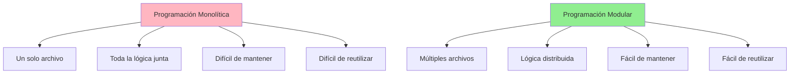
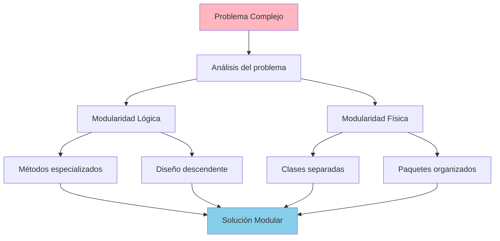
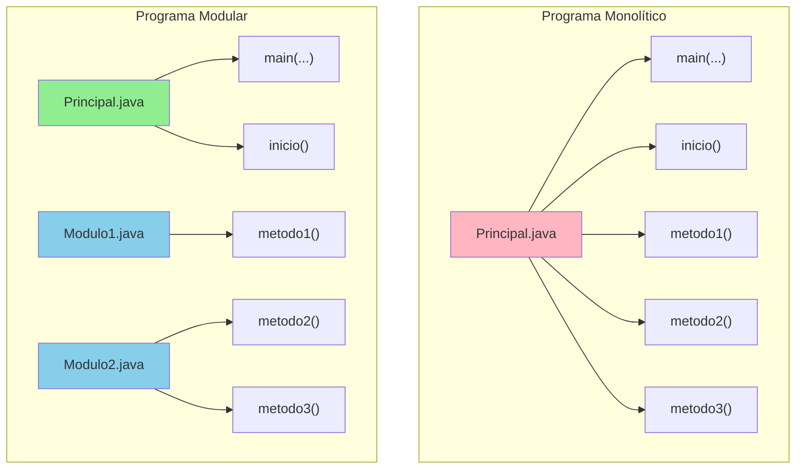
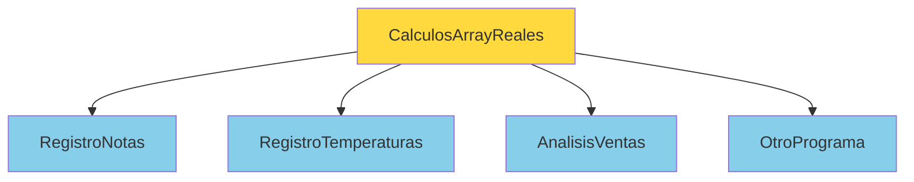
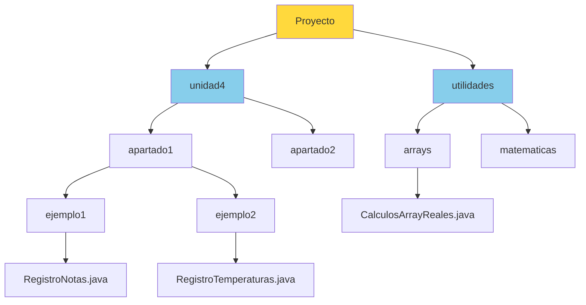
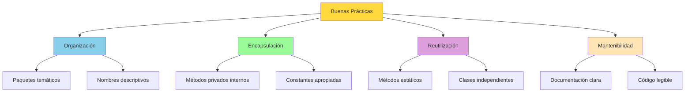

# UT4.6 Clases: Interacción y Organización. Paquetes

## 📋 Índice de contenidos

1. [Introducción a la programación modular](#1-introducci%C3%B3n-a-la-programaci%C3%B3n-modular)
2. [Concepto de clase en Java](#2-concepto-de-clase-en-java)
3. [Descomposición modular](#3-descomposici%C3%B3n-modular)
4. [Programa monolítico vs Programa modular](#4-programa-monol%C3%ADtico-vs-programa-modular)
    1. [Ejemplo práctico: RegistroNotas](#41-ejemplo-pr%C3%A1ctico-registronotas)
    2. [Práctica 1: Investigación de clases](#42-pr%C3%A1ctica-1-investigaci%C3%B3n-de-clases)
    3. [Práctica 2: Creación de clase auxiliar](#43-pr%C3%A1ctica-2-creaci%C3%B3n-de-clase-auxiliar)
    4. [Práctica 3: Invocación entre clases](#44-pr%C3%A1ctica-3-invocaci%C3%B3n-entre-clases)
5. [Reutilización de módulos](#5-reutilizaci%C3%B3n-de-m%C3%B3dulos)
    1. [Práctica 4: Aplicación de reutilización](#51-pr%C3%A1ctica-4-aplicaci%C3%B3n-de-reutilizaci%C3%B3n)
6. [Paquetes (Packages)](#6-paquetes-packages)
    1. [Concepto y organización](#61-concepto-y-organizaci%C3%B3n)
    2. [Práctica 5: Creación de paquetes](#62-pr%C3%A1ctica-5-creaci%C3%B3n-de-paquetes)
    3. [Estructura de paquetes](#63-estructura-de-paquetes)
7. [Modificadores de acceso](#7-modificadores-de-acceso)
    1. [Métodos estáticos](#71-m%C3%A9todos-est%C3%A1ticos)
    2. [Práctica 6: Conversión a métodos estáticos](#72-pr%C3%A1ctica-6-conversi%C3%B3n-a-m%C3%A9todos-est%C3%A1ticos)
8. [Constantes y encapsulación](#8-constantes-y-encapsulaci%C3%B3n)
    1. [Constantes privadas](#81-constantes-privadas)
    2. [Constantes públicas](#82-constantes-p%C3%BAblicas)
    3. [Métodos privados](#83-m%C3%A9todos-privados)
    4. [Práctica 7: Aplicación de modificadores](#84-pr%C3%A1ctica-7-aplicaci%C3%B3n-de-modificadores)
9. [Mejores prácticas](#9-mejores-pr%C3%A1cticas)

## 1. Introducción a la programación modular

Hasta este momento en el curso, hemos sido capaces de diseñar **algoritmos completos** de manera específica (*ad-hoc*) debido a su corta complejidad. Sin embargo, a medida que la complejidad de los problemas aumenta, también lo hace el tamaño del problema y, por tanto, se vuelve más complicado su diseño y mantenimiento.

### Evolución desde la programación monolítica

Inicialmente, hemos trabajado con **programas monolíticos**: todo el código se encuentra en un único archivo, con toda la lógica concentrada en un solo lugar. Este enfoque es adecuado para problemas simples, pero presenta limitaciones importantes cuando la complejidad crece.



### Tipos de modularidad

La **programación modular** puede implementarse a dos niveles diferentes:

#### 🧠 Modularidad Lógica

En apartados anteriores hemos trabajado la **modularidad lógica**, que consiste en:

- **Dividir el problema** en subproblemas más pequeños
- **Crear métodos** que resuelven cada subproblema
- **Organizar el código** dentro del mismo archivo
- **Aplicar el diseño descendente** para estructurar la solución

#### 🗂️ Modularidad Física

En este apartado avanzaremos hacia la **modularidad física**, que implica:

- **Distribuir el código** en múltiples archivos (clases)
- **Organizar las clases** en carpetas (paquetes)
- **Separar responsabilidades** a nivel de archivos
- **Mejorar la reutilización** entre diferentes programas

**Ejemplo de modularidad física:**

```text
proyecto/
├── src/
│   ├── main/
│   │   ├── CalculadoraNotas.java             // Clase principal
│   │   └── utilidades/
│   │       ├── LectorDatos.java              // Clase para leer datos
│   │       ├── CalculadoraEstadisticas.java  // Cálculos
│   │       └── MostradorResultados.java      // Mostrar resultados
```

### Ventajas de la modularidad física

La modularidad física ofrece ventajas adicionales sobre la modularidad lógica:

| Aspecto | Modularidad Lógica | Modularidad Física |
|---------|-------------------|-------------------|
| **🔧 Mantenimiento** | Limitado al archivo | Cada archivo independiente |
| **🔄 Reutilización** | Solo dentro del programa | Entre diferentes programas |
| **👥 Trabajo en equipo** | Conflictos al editar | Archivos separados |
| **🧪 Testing** | Pruebas del programa completo | Pruebas por módulo |
| **📚 Organización** | Un solo archivo | Estructura de carpetas |

### La programación modular como metodología

La **programación modular** surge como una metodología fundamental para abordar problemas complejos de manera sistemática y eficiente. Esta aproximación nos permite dividir un problema grande en problemas más pequeños y manejables, cada uno con su propia responsabilidad específica.



> [!NOTE]
> La programación modular no es solo una técnica de programación, sino una filosofía de diseño que mejora la legibilidad, mantenibilidad y reutilización del código a través de la separación física y lógica de responsabilidades.

En este apartado, aprenderemos a implementar la **modularidad física** mediante:

1. **Clases separadas** para diferentes responsabilidades
2. **Paquetes** para organizar las clases temáticamente
3. **Modificadores de acceso** para controlar la visibilidad
4. **Reutilización** de módulos entre diferentes programas

Para implementar esta metodología, recurrimos al **diseño descendente**, una técnica sistemática que nos guiará en este proceso de descomposición tanto lógica como física.

## 2. Concepto de clase en Java

### ¿Qué es realmente una clase?

El concepto de **clase** está directamente relacionado con la metodología orientada a objetos que estudiaremos en la próxima unidad. Sin embargo, hasta ahora hemos usado este concepto para referirnos a:

#### 🖥️ Un programa en Java

Todos los archivos que contienen el método `main()` y todos los métodos que se han definido, están declarados con la palabra reservada `class`.

#### 📚 Un repositorio de métodos

Se ha usado este término para referirse a una biblioteca de métodos, que actúan como extensiones a las instrucciones por defecto del lenguaje. Por ejemplo:

- Clase `Scanner` (métodos: `nextLine()`, `nextInt()`, etc.)
- Clase `Math` (métodos: `sqrt()`, `pow()`, etc.)

#### 🔤 Un tipo compuesto

Se ha usado como sinónimo de lo que conocemos como tipo compuesto. Por ejemplo:

- Clase `String` y sus métodos para la gestión/manipulación de cadenas de caracteres

> [!NOTE]
> Todos tienen en común que disponen de una serie de métodos que es posible invocar. En todos los casos, se trata de código fuente dentro de un archivo llamado "NombreClase.java", con la declaración `public class NombreClase...` y una serie de métodos declarados dentro de ese ámbito.

## 3. Descomposición modular

La **descomposición en subproblemas** no es arbitraria, sino que se plantea como un **objetivo parcial**, con entidad propia, para resolver parte del problema de nivel superior.


## 4. Programa monolítico vs Programa modular

### Comparación visual




### 4.1 Ejemplo práctico: RegistroNotas

Veamos cómo transformar un programa monolítico en uno modular:

#### Programa monolítico (RegistroNotas.java)

```java
public class RegistroNotas {
    public static void main(String[] args) {
        RegistroNotas programa = new RegistroNotas();
        programa.inicio();
    }
    
    public void inicio() {
        double[] notas = {2.0, 5.5, 7.25, 3.0, 9.5, 8.25, 7.0, 7.5};
        double max = calcularMaximo(notas);
        double min = calcularMinimo(notas);
        double media = calcularMedia(notas);
        
        System.out.println("La nota máxima es " + max + ".");
        System.out.println("La nota mínima es " + min + ".");
        System.out.println("La media de las notas es " + media + ".");
    }
    
    public double calcularMaximo(double[] array) {
        double max = array[0];
        for (int i = 1; i < array.length; i++) {
            if (max < array[i]) {
                max = array[i];
            }
        }
        return max;
    }
    
    public double calcularMinimo(double[] array) {
        double min = array[0];
        for (int i = 1; i < array.length; i++) {
            if (min > array[i]) {
                min = array[i];
            }
        }
        return min;
    }
    
    public double calcularMedia(double[] array) {
        double suma = 0;
        for (int i = 0; i < array.length; i++) {
            suma = suma + array[i];
        }
        return suma / array.length;
    }
}
```

### 4.2 Práctica 1: Investigación de clases

**Objetivo:** Comprender cómo están estructuradas las clases predefinidas de Java.

**Instrucciones:**

1. Busca en Internet el código fuente de las clases `Scanner` y `String`
2. Verifica que contienen métodos declarados dentro de la estructura `public class NombreClase`
3. Observa cómo están organizados los métodos

<details>
<summary>💡 Pistas para la búsqueda</summary>

- Busca en el repositorio oficial de OpenJDK
- Examina la estructura de archivos `.java`
- Fíjate en los modificadores de acceso (`public`, `private`, `protected`)
- Observa la documentación de los métodos

</details>

### 4.3 Práctica 2: Creación de clase auxiliar

**Objetivo:** Extraer funcionalidad común a una clase separada.

**Instrucciones:**

1. Crea una clase llamada `CalculosArrayReales` que contendrá los métodos:
    - `calcularMinimo`
    - `calcularMaximo`
    - `calcularMedia`
2. La nueva clase debe crearse en la misma ubicación donde se encuentra `RegistroNotas.java`
3. **Precaución**: Esta nueva clase NO debe contener el método `main()`

<details>
<summary>💻 Estructura de la clase</summary>

```java
public class CalculosArrayReales {
    
    public double calcularMaximo(double[] array) {
        double max = array[0];
        for (int i = 1; i < array.length; i++) {
            if (max < array[i]) {
                max = array[i];
            }
        }
        return max;
    }
    
    public double calcularMinimo(double[] array) {
        double min = array[0];
        for (int i = 1; i < array.length; i++) {
            if (min > array[i]) {
                min = array[i];
            }
        }
        return min;
    }
    
    public double calcularMedia(double[] array) {
        double suma = 0;
        for (int i = 0; i < array.length; i++) {
            suma = suma + array[i];
        }
        return suma / array.length;
    }
}
```

</details>

### 4.4 Práctica 3: Invocación entre clases

**Objetivo:** Modificar la clase principal para usar la clase auxiliar.

**Instrucciones:**

1. Elimina la definición de los métodos que ahora contiene la clase `CalculosArrayReales` de la clase `RegistroNotas`
2. Invoca los métodos definidos en `CalculosArrayReales` desde `RegistroNotas`
3. Utiliza la siguiente sintaxis para crear un objeto y llamar a los métodos:

```java
CalculosArrayReales calculadora = new CalculosArrayReales();
double max = calculadora.calcularMaximo(notas);
double min = calculadora.calcularMinimo(notas);
double media = calculadora.calcularMedia(notas);
```

<details>
<summary>💻 Clase principal modificada</summary>

```java
public class RegistroNotas {
    public static void main(String[] args) {
        RegistroNotas programa = new RegistroNotas();
        programa.inicio();
    }
    
    public void inicio() {
        double[] notas = {2.0, 5.5, 7.25, 3.0, 9.5, 8.25, 7.0, 7.5};
        
        // Crear objeto de la clase auxiliar
        CalculosArrayReales calculadora = new CalculosArrayReales();
        
        // Llamar a los métodos
        double max = calculadora.calcularMaximo(notas);
        double min = calculadora.calcularMinimo(notas);
        double media = calculadora.calcularMedia(notas);
        
        System.out.println("La nota máxima es " + max + ".");
        System.out.println("La nota mínima es " + min + ".");
        System.out.println("La media de las notas es " + media + ".");
    }
}
```

</details>

## 5. Reutilización de módulos

Observa cómo el módulo `CalculosArrayReales` ahora puede ser utilizado por otros programas distintos, ya que hemos independizado completamente su funcionalidad.




### 5.1 Práctica 4: Aplicación de reutilización

**Objetivo:** Demostrar la reutilización de módulos creando un nuevo programa.

**Instrucciones:**

1. Crea una nueva clase Java llamada `RegistroTemperaturas`
2. En ella, crea un programa que calcule la diferencia entre la temperatura máxima y mínima de una serie de temperaturas dadas
3. La clase principal solo debe tener definidos los métodos `main()` e `inicio()`
4. Utiliza la clase `CalculosArrayReales` para obtener los cálculos

<details>
<summary>💻 Solución</summary>

```java
public class RegistroTemperaturas {
    public static void main(String[] args) {
        RegistroTemperaturas programa = new RegistroTemperaturas();
        programa.inicio();
    }
    
    public void inicio() {
        double[] temperaturas = {22.5, 18.3, 25.1, 19.8, 23.7, 21.2, 24.9};
        
        // Reutilizar la clase CalculosArrayReales
        CalculosArrayReales calculadora = new CalculosArrayReales();
        
        double maxima = calculadora.calcularMaximo(temperaturas);
        double minima = calculadora.calcularMinimo(temperaturas);
        double diferencia = maxima - minima;
        
        System.out.println("Temperatura máxima: " + maxima + "°C");
        System.out.println("Temperatura mínima: " + minima + "°C");
        System.out.println("Diferencia térmica: " + diferencia + "°C");
    }
}
```

</details>

## 6. Paquetes (Packages)

### 6.1 Concepto y organización

Los **paquetes** (packages) agrupan un conjunto de clases vinculadas entre ellas de acuerdo a algún criterio temático o de organización del código.

**Características importantes:**

- Una clase solo puede pertenecer a un paquete
- Dentro de un paquete no pueden existir dos clases con el mismo nombre
- Para el sistema operativo, los packages son realmente **carpetas**



### 6.2 Práctica 5: Creación de paquetes

**Objetivo:** Organizar las clases en paquetes temáticos.

**Instrucciones:**

1. Crea un proyecto con un paquete llamado `unidad4.apartado1.ejemplo1`
2. Coloca dentro de este paquete el archivo `RegistroNotas`
3. Crea un nuevo paquete `unidad4.apartado1.ejemplo2`
4. Coloca dentro el archivo `RegistroTemperaturas`
5. En el mismo proyecto, crea un paquete `utilidades.arrays`
6. Coloca dentro el archivo `CalculosArrayReales`
7. Comprueba que todos los programas funcionan

<details>
<summary>💻 Estructura de archivos</summary>

```text
proyecto/
├── unidad4/
│   └── apartado1/
│       ├── ejemplo1/
│       │   └── RegistroNotas.java
│       └── ejemplo2/
│           └── RegistroTemperaturas.java
└── utilidades/
    └── arrays/
        └── CalculosArrayReales.java
```

</details>

### 6.3 Estructura de paquetes

Cada archivo debe incluir la declaración del paquete al que pertenece:

**RegistroNotas.java:**

```java
package unidad4.apartado1.ejemplo1;

public class RegistroNotas {
    // Código de la clase
}
```

**CalculosArrayReales.java:**

```java
package utilidades.arrays;

public class CalculosArrayReales {
    // Código de la clase
}
```

**Importación de clases:**

```java
package unidad4.apartado1.ejemplo1;

import utilidades.arrays.CalculosArrayReales;

public class RegistroNotas {
    public void inicio() {
        // Ahora podemos usar CalculosArrayReales
        CalculosArrayReales calculadora = new CalculosArrayReales();
        // ...
    }
}
```

## 7. Modificadores de acceso

### 7.1 Métodos estáticos

Los **métodos estáticos** no requieren crear una instancia de la clase para ser utilizados. Se invocan directamente usando el nombre de la clase.

**Ventajas de los métodos estáticos:**

- No necesitan crear objetos
- Más eficientes en memoria
- Útiles para operaciones que no dependen del estado de un objeto

### 7.2 Práctica 6: Conversión a métodos estáticos

**Objetivo:** Modificar la clase auxiliar para usar métodos estáticos.

**Instrucciones:**

1. Modifica la clase `CalculosArrayReales`
2. Añade la palabra reservada `static` después de `public` en los 3 métodos
3. Invoca los métodos desde las clases principales usando la sintaxis:

```java
NombreClase.nombreMetodo();
```

<details>
<summary>💻 Clase modificada con métodos estáticos</summary>

```java
package utilidades.arrays;

public class CalculosArrayReales {
    
    public static double calcularMaximo(double[] array) {
        double max = array[0];
        for (int i = 1; i < array.length; i++) {
            if (max < array[i]) {
                max = array[i];
            }
        }
        return max;
    }
    
    public static double calcularMinimo(double[] array) {
        double min = array[0];
        for (int i = 1; i < array.length; i++) {
            if (min > array[i]) {
                min = array[i];
            }
        }
        return min;
    }
    
    public static double calcularMedia(double[] array) {
        double suma = 0;
        for (int i = 0; i < array.length; i++) {
            suma = suma + array[i];
        }
        return suma / array.length;
    }
}
```

**Invocación desde otras clases:**

```java
// Ya no necesitamos crear objetos
double max = CalculosArrayReales.calcularMaximo(notas);
double min = CalculosArrayReales.calcularMinimo(notas);
double media = CalculosArrayReales.calcularMedia(notas);
```

</details>

## 8. Constantes y encapsulación

### 8.1 Constantes privadas

Para declarar una constante de clase (fuera del `main()`) utilizamos la siguiente nomenclatura:

```java
private static final tipo NOMBRE = valor;
```

La palabra reservada `private` indica que la constante solo podrá ser accedida desde la clase donde se declaró.

**Ejemplo:**

```java
public class CalculosArrayReales {
    private static final int TAMAÑO_MAXIMO = 100;
    private static final double PRECISION = 0.001;
    
    // Métodos de la clase...
}
```

### 8.2 Constantes públicas

Si cambiamos `private` por `public`, la constante podrá ser accedida desde cualquier clase que forme parte del proyecto:

```java
public static final tipo NOMBRE = valor;
```

Para acceder a esta constante, dado que es `static`, lo haremos igual que con los métodos:

```java
NombreClase.NOMBRE;
```

**Ejemplo:**

```java
public class CalculosArrayReales {
    public static final double PI = 3.141592653589793;
    public static final int TAMAÑO_ARRAY = 50;
    
    // Métodos de la clase...
}

// Uso desde otra clase:
double area = CalculosArrayReales.PI * radio * radio;
```

### 8.3 Métodos privados

Un método será privado si solo es utilizado en el ámbito de la clase donde se define y no fuera (habitualmente para operaciones intermedias).

```java
public class CalculosArrayReales {
    
    public static double calcularMedia(double[] array) {
        return sumarElementos(array) / array.length; // Método privado
    }
    
    private static double sumarElementos(double[] array) {
        double suma = 0;
        for (double elemento : array) {
            suma += elemento;
        }
        return suma;
    }
}
```

### 8.4 Práctica 7: Aplicación de modificadores

**Objetivo:** Aplicar los conceptos de encapsulación y modificadores de acceso.

**Instrucciones:**

1. Modifica la clase `CalculosArrayReales`
2. Añade una constante privada `TAMANYO_ARRAY`
3. Comprueba que no puedes acceder a esta constante desde otra clase del proyecto
4. Verifica que sí puedes acceder desde dentro de cualquier método de la propia clase
5. Modifica el método `calcularMaximo` para que sea privado
6. Observa qué errores aparecen en tu proyecto y explica por qué

<details>
<summary>💻 Solución y explicación</summary>

```java
public class CalculosArrayReales {
    // Constante privada - solo accesible desde esta clase
    private static final int TAMANYO_ARRAY = 100;
    
    // Constante pública - accesible desde cualquier clase
    public static final double VERSION = 1.0;
    
    // Método público - accesible desde cualquier clase
    public static double calcularMedia(double[] array) {
        // Puedo usar la constante privada aquí
        if (array.length > TAMANYO_ARRAY) {
            System.out.println("Advertencia: Array muy grande");
        }
        return sumarElementos(array) / array.length;
    }
    
    // Método privado - solo accesible desde esta clase
    private static double calcularMaximo(double[] array) {
        double max = array[0];
        for (int i = 1; i < array.length; i++) {
            if (max < array[i]) {
                max = array[i];
            }
        }
        return max;
    }
    
    private static double sumarElementos(double[] array) {
        double suma = 0;
        for (double elemento : array) {
            suma += elemento;
        }
        return suma;
    }
}
```

**Errores que aparecerán:**

- No podrás acceder a `TAMANYO_ARRAY` desde otras clases
- No podrás llamar a `calcularMaximo()` desde otras clases
- Aparecerá un error de compilación: "calcularMaximo() has private access"

</details>

## 9. Mejores prácticas

### Organización de código



### Recomendaciones importantes

1. **🏗️ Diseño modular**: Divide tu código en clases con responsabilidades claras
2. **📦 Uso de paquetes**: Organiza las clases en paquetes temáticos
3. **🔒 Encapsulación**: Usa modificadores de acceso apropiados
4. **⚡ Métodos estáticos**: Úsalos para operaciones que no dependen del estado
5. **🔄 Reutilización**: Crea clases que puedan ser reutilizadas en otros proyectos
6. **📝 Documentación**: Documenta tu código (Javadoc) y usa nombres descriptivos

### Estructura recomendada de un proyecto

```text 
mi-proyecto/
├── src/
│   ├── main/
│   │   └── java/
│   │       ├── aplicacion/
│   │       │   ├── Principal.java
│   │       │   └── ControladorPrincipal.java
│   │       ├── utilidades/
│   │       │   ├── matematicas/
│   │       │   │   └── CalculosArrayReales.java
│   │       │   └── texto/
│   │       │       └── ManipuladorCadenas.java
│   │       └── modelos/
│   │           ├── Estudiante.java
│   │           └── Nota.java
│   └── test/
│       └── java/
│           └── utilidades/
│               └── matematicas/
│                   └── CalculosArrayRealesTest.java
└── docs/
    └── README.md
```

> [!SUCCESS]
> Con la programación modular y el uso de paquetes, has dado un paso importante hacia el desarrollo de software profesional. Estas técnicas te permitirán crear aplicaciones más robustas, mantenibles y escalables.

> [!TIP]
> La organización del código en clases y paquetes no solo mejora la estructura del programa, sino que también facilita el trabajo en equipo y la reutilización de código en futuros proyectos.

<p align="center">📚 <em>Fin del apartado UT4.6 - Clases: Interacción y organización. Paquetes</em></p>
