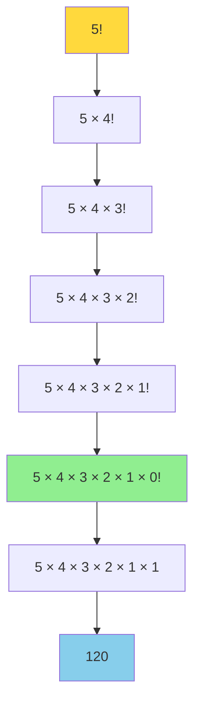

# Anexo I. Recursividad

## 📋 Índice de contenidos

1. [Introducción a la recursividad](#1-introducci%C3%B3n-a-la-recursividad)
2. [Concepto fundamental](#2-concepto-fundamental)
    1. [Definición y características](#21-definici%C3%B3n-y-caracter%C3%ADsticas)
    2. [Analogías en la vida cotidiana](#22-analog%C3%ADas-en-la-vida-cotidiana)
    3. [Ventajas y desventajas](#23-ventajas-y-desventajas)
3. [Anatomía de una función recursiva](#3-anatom%C3%ADa-de-una-funci%C3%B3n-recursiva)
    1. [Caso base](#31-caso-base)
    2. [Caso recursivo](#32-caso-recursivo)
4. [Ejemplos clásicos de recursividad](#4-ejemplos-cl%C3%A1sicos-de-recursividad)
    1. [Factorial de un número](#41-factorial-de-un-n%C3%BAmero)
    2. [Secuencia de Fibonacci](#42-secuencia-de-fibonacci)
    3. [Suma de dígitos](#43-suma-de-d%C3%ADgitos)
5. [Recursividad vs iteración](#5-recursividad-vs-iteraci%C3%B3n)
    1. [Comparación práctica](#51-comparaci%C3%B3n-pr%C3%A1ctica)
    2. [Cuándo usar cada enfoque](#52-cu%C3%A1ndo-usar-cada-enfoque)
6. [Consideraciones de rendimiento](#6-consideraciones-de-rendimiento)
    1. [Pila de llamadas](#61-pila-de-llamadas)
    2. [Optimización de recursividad](#62-optimizaci%C3%B3n-de-recursividad)
    3. [Memoización](#63-memoizaci%C3%B3n)
7. [Recursividad mutua o cruzada](#7-recursividad-mutua-o-cruzada)
8. [Ejercicios prácticos](#8-ejercicios-pr%C3%A1cticos)

## 1. Introducción a la recursividad

La **recursividad** es una de las técnicas más potentes y elegantes en programación, pero también puede resultar difícil de comprender al principio. Es una técnica fundamental en programación que permite resolver problemas complejos dividiéndolos en versiones más simples del mismo problema. Esta técnica es especialmente poderosa para resolver problemas que tienen una estructura naturalmente repetitiva o que se pueden descomponer en subproblemas similares.

En el contexto del diseño modular que hemos estudiado, la recursividad representa una forma elegante de aplicar el principio de "divide y vencerás", pero con la particularidad de que el problema se divide en versiones más pequeñas de sí mismo.

> [!NOTE]
> La recursividad no es solo una herramienta técnica, sino una forma de pensar sobre los problemas. Muchos fenómenos naturales y estructuras matemáticas son inherentemente recursivos, como los fractales, la estructura de los árboles, o la organización de directorios en un sistema de archivos.

## 2. Concepto fundamental

### 2.1 Definición y características

La **recursividad** es un método de resolución de problemas donde una función se llama a sí misma para resolver una versión más pequeña del problema original. Esta técnica se basa en el principio de que problemas complejos pueden ser descompuestos en problemas más simples de la misma naturaleza.

**Características esenciales de la recursividad:**

- **🔄 Autoinvocación**: La función se llama a sí misma
- **📉 Reducción progresiva**: Cada llamada recursiva trabaja con un problema más pequeño
- **🔋Pila de llamadas:** Cada llamada recursiva se apila hasta alcanzar el caso base.
- **🛑 Condición de parada**: Debe existir un caso base que termine la recursión
- **🧠 Estructura fractal**: El problema tiene una estructura que se repite a diferentes escalas

> [!IMPORTANT]
> Toda función recursiva **debe tener un caso base** que permita terminar la recursión. Si no existe, el programa entrará en un bucle infinito y terminará con un error de desbordamiento de pila (*StackOverflowError* en Java).

### 2.2 Analogías en la vida cotidiana

Para comprender mejor la recursividad, consideremos algunas analogías de la vida cotidiana:

#### 🪆 Las muñecas rusas (Matryoshka)

Una muñeca rusa contiene dentro otra muñeca más pequeña, que a su vez contiene otra muñeca aún más pequeña, y así sucesivamente hasta llegar a la muñeca más pequeña que no contiene nada más.

#### 🌳 Estructura de un árbol

Un árbol tiene ramas, y cada rama puede tener sub-ramas, y cada sub-rama puede tener sub-sub-ramas, hasta llegar a las hojas (que no tienen más ramas).

#### 📁 Sistema de archivos

Un directorio puede contener subdirectorios, y cada subdirectorio puede contener más subdirectorios, hasta llegar a los archivos individuales.

### 2.3 Ventajas y desventajas

**Ventajas de la recursividad:**

| Ventaja | Descripción | Ejemplo |
| :-- | :-- | :-- |
| **🎯 Simplicidad conceptual** | Código más limpio y fácil de entender | Traversal de árboles |
| **🔧 Elegancia** | Soluciones más compactas y expresivas | Algoritmos de ordenación |
| **📐 Naturalidad** | Algunos problemas son inherentemente recursivos | Fractales, secuencias matemáticas |
| **🧩 Divide y vencerás** | Facilita la descomposición de problemas complejos | Merge sort, Quick sort |

**Desventajas de la recursividad:**

| Desventaja | Descripción | Solución |
| :-- | :-- | :-- |
| **🐌 Rendimiento** | Puede ser más lenta que la iteración | Optimización, memoización |
| **💾 Memoria** | Consume más memoria (pila de llamadas) | Recursión de cola |
| **🔄 Redundancia** | Puede recalcular los mismos valores | Programación dinámica |
| **🚫 Límites** | Stack overflow en recursiones muy profundas | Conversión a iteración |

## 3. Anatomía de una función recursiva

### 3.1 Caso base

El **caso base** es la condición que detiene la recursión. Es la situación más simple del problema que puede resolverse directamente sin necesidad de más llamadas recursivas.

**Características del caso base:**

- **🛑 Condición de parada**: Evita la recursión infinita
- **✅ Solución directa**: Proporciona una respuesta sin más recursión
- **📍 Punto de retorno**: Desde aquí comienza el "desenrollado" de la recursión

```java
public int factorial(int n) {
    // CASO BASE: El factorial de 0 y 1 es 1
    if (n <= 1) {
        return 1;  // Solución directa, no hay más recursión
    }
    // ... resto del código
}
```

### 3.2 Caso recursivo

El **caso recursivo** o **caso general** es la parte donde la función se llama a sí misma con una versión más pequeña del problema original.

**Características del caso recursivo:**

- **🔄 Autoinvocación**: La función se llama a sí misma
- **📉 Reducción**: El parámetro se reduce hacia el caso base
- **🔗 Construcción**: Combina el resultado recursivo con el procesamiento actual

```java
public int factorial(int n) {
    if (n <= 1) {
        return 1;
    }
    // CASO RECURSIVO: n! = n * (n-1)!
    return n * factorial(n - 1);  // Llamada recursiva con n-1
}
```

### Práctica 1

Analiza el siguiente código y identifica:

1. El caso base
2. El caso recursivo
3. Cómo se reduce el problema
4. Qué hace la función

```java
public int sumarHasta(int n) {
    if (n <= 0) {
        return 0;
    }
    return n + sumarHasta(n - 1);
}
```

<details>
<summary>💻 Solución y explicación</summary>

**Análisis del código:**

1. **Caso base**: `if (n <= 0) return 0;`
   - Cuando n es 0 o negativo, retorna 0 directamente
2. **Caso recursivo**: `return n + sumarHasta(n - 1);`
   - Se llama a sí misma con n-1
   - Combina el valor actual (n) con el resultado de la llamada recursiva
3. **Reducción del problema**: En cada llamada, n se reduce en 1, acercándose al caso base
4. **Función**: Calcula la suma de todos los números desde 1 hasta n (suma aritmética)

**Traza de ejecución para sumarHasta(4):**

```text
sumarHasta(4) = 4 + sumarHasta(3)
              = 4 + (3 + sumarHasta(2))
              = 4 + (3 + (2 + sumarHasta(1)))
              = 4 + (3 + (2 + (1 + sumarHasta(0))))
              = 4 + (3 + (2 + (1 + 0)))
              = 4 + (3 + (2 + 1))
              = 4 + (3 + 3)
              = 4 + 6
              = 10
```

</details>

## 4. Ejemplos clásicos de recursividad

### 4.1 Factorial de un número

El **factorial** de un número n (n!) es el producto de todos los números enteros positivos desde 1 hasta n. Es uno de los ejemplos más clásicos de recursividad porque tiene una definición matemática naturalmente recursiva.

$$
n! = n \times (n-1) \times (n-2) \times \dots \times 1
$$

**Definición matemática:**

- n! = n × (n-1)! para n > 0
- 0! = 1 (caso base)



**Implementación recursiva:**

```java
public class CalculosRecursivos {
    
    /**
     * Calcula el factorial de un número de forma recursiva
     * @param n el número del cual calcular el factorial
     * @return el factorial de n
     */
    public static long factorial(int n) {
        // Validación de entrada
        if (n < 0) {
            System.out.println("El factorial debe ser mayor o igual a cero");
            return 0;
        }
        
        // CASO BASE: 0! = 1 y 1! = 1
        if (n <= 1) {
            return 1;
        }
        
        // CASO RECURSIVO: n! = n × (n-1)!
        return n * factorial(n - 1);
    }
}
```

**Práctica 2: Implementación y prueba del factorial.**

Implementa el método factorial y crea un programa que:

1. Calcule el factorial de varios números
2. Muestre la traza de ejecución para n=5
3. Maneje el caso de números negativos

<details>
<summary>💻 Solución completa</summary>

```java
public class FactorialRecursivo {
    
    public static void main(String[] args) {
        FactorialRecursivo programa = new FactorialRecursivo();
        programa.inicio();
    }
    
    public void inicio() {
        System.out.println("=== CÁLCULO DE FACTORIAL RECURSIVO ===");
        
        // Probar diferentes valores
        int[] valores = {0, 1, 3, 5, 7, 10};
        
        for (int valor : valores) {
            long resultado = factorial(valor);
            System.out.println(valor + "! = " + resultado);
        }
        // Mostrar traza detallada para n=5
        System.out.println("\n=== TRAZA DETALLADA PARA 5! ===");
        mostrarTrazaFactorial(5, 0);
    }
    
    public static long factorial(int n) {
        if (n < 0) {
            System.out.println("El factorial debe ser mayor o igual a cero");
            return 0;
        }
        
        if (n <= 1) {
            return 1;
        }
        return n * factorial(n - 1);
    }
    
    // Método auxiliar para mostrar la traza
    public static long mostrarTrazaFactorial(int n, int nivel) {
        // Indentación para mostrar el nivel de recursión
        String indent = "  ".repeat(nivel);
        
        System.out.println(indent + "→ Calculando factorial(" + n + ")");
        
        if (n <= 1) {
            System.out.println(indent + "← Caso base: factorial(" + n + ") = 1");
            return 1;
        }
        
        System.out.println(indent + "  Necesito calcular factorial(" + (n-1) + ")");
        long resultado = n * mostrarTrazaFactorial(n - 1, nivel + 1);
        System.out.println(indent + "← factorial(" + n + ") = " + n + " × " + (resultado/n) + " = " + resultado);
        
        return resultado;
    }
}
```

**Salida esperada:**

```text
=== CÁLCULO DE FACTORIAL RECURSIVO ===
0! = 1
1! = 1
3! = 6
5! = 120
7! = 5040
10! = 3628800

=== TRAZA DETALLADA PARA 5! ===
→ Calculando factorial(5)
  Necesito calcular factorial(4)
  → Calculando factorial(4)
    Necesito calcular factorial(3)
    → Calculando factorial(3)
      Necesito calcular factorial(2)
      → Calculando factorial(2)
        Necesito calcular factorial(1)
        → Calculando factorial(1)
        ← Caso base: factorial(1) = 1
      ← factorial(2) = 2 × 1 = 2
    ← factorial(3) = 3 × 2 = 6
  ← factorial(4) = 4 × 6 = 24
← factorial(5) = 5 × 24 = 120
```

</details>

### 4.2 Secuencia de Fibonacci

La **secuencia de Fibonacci** es una serie de números donde cada número es la suma de los dos anteriores. Es un ejemplo perfecto de recursividad porque cada término se define en función de los términos anteriores.

**Definición matemática:**

- F(0) = 0
- F(1) = 1
- F(n) = F(n-1) + F(n-2) para n > 1

**Secuencia:** 0, 1, 1, 2, 3, 5, 8, 13, 21, 34, 55, 89, ...

```mermaid
graph TD
    A[F(5)] --> B[F(4) + F(3)]
    B --> C[F(3) + F(2)]
    B --> D[F(2) + F(1)]
    C --> E[F(2) + F(1)]
    C --> F[F(1) + F(0)]
    D --> G[F(1) + F(0)]
    D --> H[F(1)]
    E --> I[F(1) + F(0)]
    E --> J[F(1)]
    F --> K[F(1)]
    F --> L[F(0)]
    G --> M[F(1)]
    G --> N[F(0)]
    
    style A fill:#FFD93D
    style H fill:#90EE90
    style J fill:#90EE90
    style K fill:#90EE90
    style L fill:#90EE90
    style M fill:#90EE90
    style N fill:#90EE90
```

**Implementación recursiva básica:**

```java
public static long fibonacci(int n) {
    // Validación de entrada
    if (n < 0) {
        System.out.println("No se puede calcular Fibonacci de números negativos");
        return 0;
    }
    
    // CASOS BASE
    if (n == 0) return 0;
    if (n == 1) return 1;
    
    // CASO RECURSIVO: F(n) = F(n-1) + F(n-2)
    return fibonacci(n - 1) + fibonacci(n - 2);
}
```

> [!WARNING]
> La implementación recursiva naive de Fibonacci es **extremadamente ineficiente** para valores grandes debido a la recalculación repetida de los mismos valores. Para n=40, puede tardar varios segundos.

**Práctica 3: Fibonacci con análisis de rendimiento:**

Implementa la función de Fibonacci y analiza su rendimiento:

1. Calcula los primeros 20 números de Fibonacci
2. Mide el tiempo de ejecución para diferentes valores
3. Observa cómo crece el tiempo exponencialmente

<details>
<summary>💻 Solución con análisis de rendimiento</summary>

```java
public class FibonacciRecursivo {
    
    private static long contadorLlamadas = 0;
    
    public static void main(String[] args) {
        FibonacciRecursivo programa = new FibonacciRecursivo();
        programa.inicio();
    }
    
    public void inicio() {
        System.out.println("=== SECUENCIA DE FIBONACCI ===");
        
        // Mostrar los primeros 20 números
        System.out.println("Los primeros 20 números de Fibonacci:");
        for (int i = 0; i < 20; i++) {
            System.out.print(fibonacci(i) + " ");
        }
        System.out.println();
        
        // Análisis de rendimiento
        System.out.println("\n=== ANÁLISIS DE RENDIMIENTO ===");
        int[] valoresPrueba = {20, 25, 30, 35, 40};
        
        for (int n : valoresPrueba) {
            contadorLlamadas = 0;
            long tiempoInicio = System.currentTimeMillis();
            
            long resultado = fibonacci(n);
            
            long tiempoFin = System.currentTimeMillis();
            long tiempoTotal = tiempoFin - tiempoInicio;
            
            System.out.printf("F(%d) = %d | Tiempo: %d ms | Llamadas: %d%n", 
                            n, resultado, tiempoTotal, contadorLlamadas);
        }
        
        // Mostrar árbol de llamadas para un valor pequeño
        System.out.println("\n=== ÁRBOL DE LLAMADAS PARA F(6) ===");
        mostrarArbolFibonacci(6, 0);
    }
    
    public static long fibonacci(int n) {
        contadorLlamadas++;
        
        if (n < 0) {
            System.out.println("No se puede calcular Fibonacci de números negativos");
            return 0;
        }
        
        if (n == 0) return 0;
        if (n == 1) return 1;
        
        return fibonacci(n - 1) + fibonacci(n - 2);
    }
    
    // Método para mostrar el árbol de llamadas
    public static long mostrarArbolFibonacci(int n, int nivel) {
        String indent = "  ".repeat(nivel);
        System.out.println(indent + "F(" + n + ")");
        
        if (n == 0) return 0;
        if (n == 1) return 1;
        
        long resultado1 = mostrarArbolFibonacci(n - 1, nivel + 1);
        long resultado2 = mostrarArbolFibonacci(n - 2, nivel + 1);
        
        return resultado1 + resultado2;
    }
}
```

**Salida esperada:**

```text
=== SECUENCIA DE FIBONACCI ===
Los primeros 20 números de Fibonacci:
0 1 1 2 3 5 8 13 21 34 55 89 144 233 377 610 987 1597 2584 4181 

=== ANÁLISIS DE RENDIMIENTO ===
F(20) = 6765 | Tiempo: 2 ms | Llamadas: 21891
F(25) = 75025 | Tiempo: 18 ms | Llamadas: 242785
F(30) = 832040 | Tiempo: 201 ms | Llamadas: 2692537
F(35) = 9227465 | Tiempo: 2234 ms | Llamadas: 29860703
F(40) = 102334155 | Tiempo: 25126 ms | Llamadas: 331160281

=== ÁRBOL DE LLAMADAS PARA F(6) ===
F(6)
  F(5)
    F(4)
      F(3)
        F(2)
          F(1)
          F(0)
        F(1)
      F(2)
        F(1)
        F(0)
    F(3)
      F(2)
        F(1)
        F(0)
      F(1)
  F(4)
    F(3)
      F(2)
        F(1)
        F(0)
      F(1)
    F(2)
      F(1)
      F(0)
```

</details>

### 4.3 Suma de dígitos

La **suma de dígitos** de un número es otro ejemplo clásico que muestra cómo un problema puede resolverse recursivamente descomponiéndolo en partes más pequeñas.

**Planteamiento:** Dado un número entero, calcular la suma de todos sus dígitos.

**Ejemplo:** 1234 → 1 + 2 + 3 + 4 = 10

**Enfoque recursivo:**

- Si el número tiene un solo dígito, la suma es el propio número
- Si tiene más dígitos, la suma es el último dígito más la suma de los dígitos restantes

```java
public static int sumaDigitos(int numero) {
    // Trabajar con valor absoluto para manejar números negativos
    numero = Math.abs(numero);
    
    // CASO BASE: números de un solo dígito
    if (numero < 10) {
        return numero;
    }
    
    // CASO RECURSIVO: último dígito + suma del resto
    return (numero % 10) + sumaDigitos(numero / 10);
}
```

**Práctica 5: Suma de dígitos con análisis:**

Implementa y prueba la función de suma de dígitos:

1. Calcula la suma de dígitos de varios números
2. Maneja números negativos
3. Muestra la traza de ejecución

<details>
<summary>💻 Solución completa</summary>

```java
public class SumaDigitos {
    
    public static void main(String[] args) {
        SumaDigitos programa = new SumaDigitos();
        programa.inicio();
    }
    
    public void inicio() {
        System.out.println("=== SUMA DE DÍGITOS RECURSIVA ===");
        
        int[] numeros = {123, 4567, 89, 1, 0, -456, 999999};
        
        for (int numero : numeros) {
            int suma = sumaDigitos(numero);
            System.out.println("Suma de dígitos de " + numero + " = " + suma);
        }
        
        // Mostrar traza detallada
        System.out.println("\n=== TRAZA DETALLADA PARA 1234 ===");
        mostrarTrazaSuma(1234, 0);
    }
    
    public static int sumaDigitos(int numero) {
        // Trabajar con valor absoluto
        numero = Math.abs(numero);
        
        // CASO BASE: números de un solo dígito
        if (numero < 10) {
            return numero;
        }
        
        // CASO RECURSIVO: último dígito + suma del resto
        return (numero % 10) + sumaDigitos(numero / 10);
    }
    
    // Método auxiliar para mostrar traza
    public static int mostrarTrazaSuma(int numero, int nivel) {
        String indent = "  ".repeat(nivel);
        System.out.println(indent + "→ sumaDigitos(" + numero + ")");
        
        if (numero < 10) {
            System.out.println(indent + "← Caso base: " + numero);
            return numero;
        }
        
        int ultimoDigito = numero % 10;
        int resto = numero / 10;
        
        System.out.println(indent + "  Último dígito: " + ultimoDigito);
        System.out.println(indent + "  Resto: " + resto);
        System.out.println(indent + "  Calculando sumaDigitos(" + resto + ")");
        
        int sumaResto = mostrarTrazaSuma(resto, nivel + 1);
        int resultado = ultimoDigito + sumaResto;
        
        System.out.println(indent + "← " + ultimoDigito + " + " + sumaResto + " = " + resultado);
        return resultado;
    }
}
```

**Salida esperada:**

```text
=== SUMA DE DÍGITOS RECURSIVA ===
Suma de dígitos de 123 = 6
Suma de dígitos de 4567 = 22
Suma de dígitos de 89 = 17
Suma de dígitos de 1 = 1
Suma de dígitos de 0 = 0
Suma de dígitos de -456 = 15
Suma de dígitos de 999999 = 54

=== TRAZA DETALLADA PARA 1234 ===
→ sumaDigitos(1234)
  Último dígito: 4
  Resto: 123
  Calculando sumaDigitos(123)
  → sumaDigitos(123)
    Último dígito: 3
    Resto: 12
    Calculando sumaDigitos(12)
    → sumaDigitos(12)
      Último dígito: 2
      Resto: 1
      Calculando sumaDigitos(1)
      → sumaDigitos(1)
      ← Caso base: 1
    ← 2 + 1 = 3
  ← 3 + 3 = 6
← 4 + 6 = 10
```

</details>

## 5. Recursividad vs iteración

### 5.1 Comparación práctica

Una de las decisiones más importantes al resolver un problema es elegir entre un enfoque recursivo o iterativo. Ambos enfoques tienen sus ventajas y desventajas específicas.

**Ejemplo comparativo: Cálculo de factorial:**

```java
// VERSIÓN RECURSIVA
public static long factorialRecursivo(int n) {
    if (n <= 1) return 1;
    return n * factorialRecursivo(n - 1);
}

// VERSIÓN ITERATIVA
public static long factorialIterativo(int n) {
    long resultado = 1;
    for (int i = 2; i <= n; i++) {
        resultado *= i;
    }
    return resultado;
}
```

**Análisis comparativo:**

| Aspecto | Recursivo | Iterativo |
| :-- | :-- | :-- |
| **📖 Legibilidad** | Más intuitivo, refleja la definición matemática | Más directo, flujo de control claro |
| **⚡ Rendimiento** | Más lento debido a llamadas de función | Más rápido, menos overhead |
| **💾 Memoria** | Usa la pila de llamadas (O(n)) | Usa memoria constante O(1) |
| **🔄 Complejidad** | Más simple para problemas recursivos | Puede ser más complejo para algunos problemas |
| **🛡️ Robustez** | Riesgo de stack overflow | Sin límite de profundidad |

**Práctica 6: Comparación de rendimiento:**

Implementa ambas versiones y compara su rendimiento:

<details>
<summary>💻 Comparación completa</summary>

```java
public class ComparacionRecursionIteracion {
    
    public static void main(String[] args) {
        ComparacionRecursionIteracion programa = new ComparacionRecursionIteracion();
        programa.inicio();
    }
    
    public void inicio() {
        System.out.println("=== COMPARACIÓN RECURSIÓN VS ITERACIÓN ===");
        
        // Comparar factorial
        System.out.println("FACTORIAL:");
        compararFactorial();
        
        // Comparar Fibonacci
        System.out.println("\nFIBONACCI:");
        compararFibonacci();
        
        // Comparar suma de números
        System.out.println("\nSUMA DE NÚMEROS 1 A N:");
        compararSuma();
    }
    
    private void compararFactorial() {
        int[] valores = {10, 15, 20};
        
        System.out.println("n\tRecursivo(ms)\tIterativo(ms)\tDiferencia");
        System.out.println("--------------------------------------------");
        
        for (int n : valores) {
            // Medir recursivo
            long inicio = System.nanoTime();
            long resultadoRec = factorialRecursivo(n);
            long tiempoRec = (System.nanoTime() - inicio) / 1_000_000;
            
            // Medir iterativo
            inicio = System.nanoTime();
            long resultadoIter = factorialIterativo(n);
            long tiempoIter = (System.nanoTime() - inicio) / 1_000_000;
            
            System.out.printf("%d\t%d\t\t%d\t\t%dx%n", 
                            n, tiempoRec, tiempoIter, 
                            tiempoRec == 0 ? 0 : tiempoRec/Math.max(tiempoIter, 1));
        }
    }
    
    private void compararFibonacci() {
        int[] valores = {20, 25, 30};
        
        System.out.println("n\tRecursivo(ms)\tIterativo(ms)\tDiferencia");
        System.out.println("--------------------------------------------");
        
        for (int n : valores) {
            // Medir recursivo
            long inicio = System.currentTimeMillis();
            long resultadoRec = fibonacciRecursivo(n);
            long tiempoRec = System.currentTimeMillis() - inicio;
            
            // Medir iterativo
            inicio = System.currentTimeMillis();
            long resultadoIter = fibonacciIterativo(n);
            long tiempoIter = System.currentTimeMillis() - inicio;
            
            System.out.printf("%d\t%d\t\t%d\t\t%dx%n", 
                            n, tiempoRec, tiempoIter, 
                            tiempoIter == 0 ? 0 : tiempoRec/Math.max(tiempoIter, 1));
        }
    }
    
    private void compararSuma() {
        int[] valores = {1000, 10000, 100000};
        
        System.out.println("n\tRecursivo(ms)\tIterativo(ms)");
        System.out.println("--------------------------------");
        
        for (int n : valores) {
            // Medir recursivo
            long inicio = System.nanoTime();
            long resultadoRec = sumaRecursiva(n);
            long tiempoRec = (System.nanoTime() - inicio) / 1_000_000;
            
            // Medir iterativo
            inicio = System.nanoTime();
            long resultadoIter = sumaIterativa(n);
            long tiempoIter = (System.nanoTime() - inicio) / 1_000_000;
            
            System.out.printf("%d\t%d\t\t%d%n", n, tiempoRec, tiempoIter);
        }
    }
    
    // Implementaciones para factorial
    public static long factorialRecursivo(int n) {
        if (n <= 1) return 1;
        return n * factorialRecursivo(n - 1);
    }
    
    public static long factorialIterativo(int n) {
        long resultado = 1;
        for (int i = 2; i <= n; i++) {
            resultado *= i;
        }
        return resultado;
    }
    
    // Implementaciones para Fibonacci
    public static long fibonacciRecursivo(int n) {
        if (n <= 1) return n;
        return fibonacciRecursivo(n - 1) + fibonacciRecursivo(n - 2);
    }
    
    public static long fibonacciIterativo(int n) {
        if (n <= 1) return n;
        
        long anterior = 0;
        long actual = 1;
        
        for (int i = 2; i <= n; i++) {
            long temp = actual;
            actual = anterior + actual;
            anterior = temp;
        }
        
        return actual;
    }
    
    // Implementaciones para suma
    public static long sumaRecursiva(int n) {
        if (n <= 0) return 0;
        return n + sumaRecursiva(n - 1);
    }
    
    public static long sumaIterativa(int n) {
        long suma = 0;
        for (int i = 1; i <= n; i++) {
            suma += i;
        }
        return suma;
    }
}
```

</details>

### 5.2 Cuándo usar cada enfoque

**Usa recursividad cuando:**

- ✅ **El problema tiene estructura recursiva natural** (árboles, fractales)
- ✅ **La definición matemática es recursiva** (factorial, Fibonacci)
- ✅ **La legibilidad es prioritaria** sobre el rendimiento
- ✅ **El problema se divide naturalmente** en subproblemas similares
- ✅ **La profundidad de recursión es limitada** y predecible

**Usa iteración cuando:**

- ✅ **El rendimiento es crítico**
- ✅ **La memoria es limitada**
- ✅ **La profundidad puede ser muy grande**
- ✅ **El problema se resuelve mejor con bucles**
- ✅ **Necesitas control granular** sobre el flujo de ejecución

## 6. Consideraciones de rendimiento

### 6.1 Pila de llamadas

La **pila de llamadas** (call stack) es una estructura de datos que almacena información sobre las funciones que se están ejecutando. Cada llamada recursiva añade un nuevo frame a la pila.

```mermaid
graph TD
    A[Pila de Llamadas] --> B[factorial(5)]
    B --> C[factorial(4)]
    C --> D[factorial(3)]
    D --> E[factorial(2)]
    E --> F[factorial(1)]
    F --> G[return 1]
    G --> H[return 2]
    H --> I[return 6]
    I --> J[return 24]
    J --> K[return 120]
    
    style A fill:#FFD93D
    style F fill:#90EE90
    style G fill:#87CEEB
    style H fill:#87CEEB
    style I fill:#87CEEB
    style J fill:#87CEEB
    style K fill:#87CEEB
```

**Problemas potenciales:**

- **📚 Stack Overflow**: Si la recursión es demasiado profunda
- **🐌 Overhead**: Cada llamada tiene un costo computacional
- **💾 Memoria**: Cada frame ocupa espacio en memoria

### 6.2 Optimización de recursividad

#### Recursión de cola (Tail Recursion)

La **recursión de cola** es una optimización donde la llamada recursiva es la última operación de la función. Algunos compiladores pueden optimizar esto convirtiéndolo en iteración.

```java
// Recursión normal (no optimizable)
public static int factorial(int n) {
    if (n <= 1) return 1;
    return n * factorial(n - 1);  // Multiplicación después de la recursión
}

// Recursión de cola (optimizable)
public static int factorialCola(int n) {
    return factorialColaHelper(n, 1);
}

private static int factorialColaHelper(int n, int acumulador) {
    if (n <= 1) return acumulador;
    return factorialColaHelper(n - 1, n * acumulador);  // Última operación
}
```

### 6.3 Memoización

La **memoización** es una técnica de optimización que almacena los resultados de llamadas anteriores para evitar recalcular los mismos valores, como una especie de caché de resultados.

<details>
<summary>Se entenderá mejor este código cuando veamos el tema de colecciones</summary>

```java
public class FibonacciMemoizado {
    
    private static Map<Integer, Long> memo = new HashMap<>();
    
    public static long fibonacci(int n) {
        // Verificar si ya está calculado
        if (memo.containsKey(n)) {
            return memo.get(n);
        }
        
        // Casos base
        if (n <= 1) {
            memo.put(n, (long) n);
            return n;
        }
        
        // Calcular y almacenar
        long resultado = fibonacci(n - 1) + fibonacci(n - 2);
        memo.put(n, resultado);
        return resultado;
    }
}
```

</details>

## 7. Recursividad mutua o cruzada

La **recursividad mutua** o **recursividad cruzada** ocurre cuando dos o más funciones se llaman entre sí de manera circular. Es útil para resolver problemas que tienen estados alternos.

**Ejemplo: Determinar si un número es par o impar:**

```java
public class RecursividadMutua {
    
    public static boolean esPar(int n) {
        if (n == 0) return true;
        return esImpar(n - 1);
    }
    
    public static boolean esImpar(int n) {
        if (n == 0) return false;
        return esPar(n - 1);
    }
    
}
```

## 8. Ejercicios prácticos

### Ejercicio 1: Potencia recursiva

Implementa una función recursiva que calcule a^b (a elevado a b).

<details>
<summary>💻 Solución</summary>

```java
public class PotenciaRecursiva {
    
    public static double potencia(double base, int exponente) {
        // Casos base
        if (exponente == 0) return 1;
        if (exponente == 1) return base;
        
        // Manejar exponentes negativos
        if (exponente < 0) {
            return 1.0 / potencia(base, -exponente);
        }
        
        // Caso recursivo
        return base * potencia(base, exponente - 1);
    }
     
    public static void main(String[] args) {
        System.out.println("2^10 = " + potencia(2, 10));
        System.out.println("3^4 = " + potencia(3, 4));
        System.out.println("5^0 = " + potencia(5, 0));
        System.out.println("2^(-3) = " + potencia(2, -3));
    }
}
```

</details>

### Ejercicio 2: Inversión de cadena

Implementa una función recursiva que invierta una cadena de caracteres.

<details>
<summary>💻 Solución</summary>

```java
public class InvertirCadena {
    
    public static String invertir(String str) {
        // Caso base: cadena vacía o de un carácter
        if (str == null || str.length() <= 1) {
            return str;
        }
        
        // Caso recursivo: último carácter + invertir el resto
        return str.charAt(str.length() - 1) + invertir(str.substring(0, str.length() - 1));
    }
    
    
    public static void main(String[] args) {
        String[] pruebas = {"", "a", "ab", "abc", "recursion", "Hola Mundo"};
        
        for (String prueba : pruebas) {
            System.out.println("Original: '" + prueba + "' → Invertida: '" + invertir(prueba) + "'");
        }
    }
}
```

</details>

### Ejercicio 3: Suma recursiva de elementos de un array

Dado un array de enteros, implementa una función recursiva que calcule la suma de todos sus elementos.

<details>
<summary>💻 Solución</summary>

```java
public static int sumaArray(int[] array, int n) {
    if (n == 0) {
        return 0;
    } else {
        return array[n - 1] + sumaArray(array, n - 1);
    }
}

// Ejemplo de uso:
int[] datos = {2, 4, 6, 8};
System.out.println(sumaArray(datos, datos.length)); // Imprime 20
```

</details>

## 🏁 Conclusiones y recomendaciones finales

- La recursividad es una herramienta poderosa para resolver problemas con estructura repetitiva o autorreferente.
- Es fundamental identificar correctamente el caso base y asegurar que toda llamada recursiva se acerca a él.
- En problemas donde la eficiencia es crítica o la profundidad puede ser muy grande, es preferible optar por soluciones iterativas o recursión optimizada (tail recursion, memoización).
- La recursividad permite escribir código más claro y expresivo en muchos casos, especialmente en estructuras de datos como árboles, listas enlazadas o algoritmos de búsqueda y ordenación.

> [!TIP]
> Practica implementando tanto versiones recursivas como iterativas de los algoritmos clásicos. Analiza sus ventajas y desventajas en cuanto a legibilidad, eficiencia y consumo de recursos.

> [!IMPORTANT]
> Recuerda: **toda recursividad puede transformarse en iteración, y viceversa**.

<p align="center">📚 <em>Fin del Anexo I - Recursividad</em></p>
