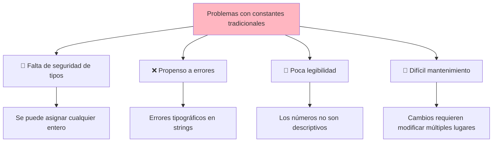
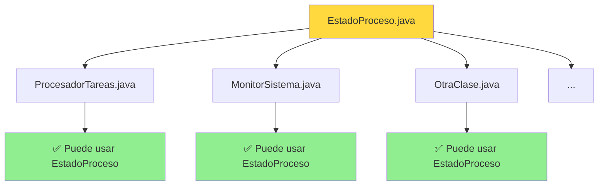

# Anexo II. Enum

## 📋 Índice de contenidos

1. [Introducción a los tipos enumerados](#1-introducci%C3%B3n-a-los-tipos-enumerados)
2. [Concepto fundamental](#2-concepto-fundamental)
    1. [¿Qué es un enum?](#21-qu%C3%A9-es-un-enum)
    2. [Características principales](#22-caracter%C3%ADsticas-principales)
    3. [Ventajas sobre las constantes tradicionales](#23-ventajas-sobre-las-constantes-tradicionales)
3. [Declaración de enum dentro de una clase](#3-declaraci%C3%B3n-de-enum-dentro-de-una-clase)
    1. [Sintaxis básica](#31-sintaxis-b%C3%A1sica)
    2. [Práctica 1: Días de la semana](#32-pr%C3%A1ctica-1-d%C3%ADas-de-la-semana)
    3. [Alcance y visibilidad](#33-alcance-y-visibilidad)
4. [Declaración de enum en archivo separado](#4-declaraci%C3%B3n-de-enum-en-archivo-separado)
    1. [Creación de archivo independiente](#41-creaci%C3%B3n-de-archivo-independiente)
    2. [Práctica 2: Estados de un proceso](#42-pr%C3%A1ctica-2-estados-de-un-proceso)
    3. [Importación y uso](#43-importaci%C3%B3n-y-uso)
5. [Métodos básicos de enum](#5-m%C3%A9todos-b%C3%A1sicos-de-enum)
    1. [Métodos heredados automáticamente](#51-m%C3%A9todos-heredados-autom%C3%A1ticamente)
    2. [Práctica 3: Explorando métodos básicos](#52-pr%C3%A1ctica-3-explorando-m%C3%A9todos-b%C3%A1sicos)
6. [Uso con estructuras de control](#6-uso-con-estructuras-de-control)
    1. [Enum con if-else](#61-enum-con-if-else)
    2. [Enum con switch](#62-enum-con-switch)
    3. [Práctica 4: Sistema de calificaciones](#63-pr%C3%A1ctica-4-sistema-de-calificaciones)
7. [Iteración sobre valores de enum](#7-iteraci%C3%B3n-sobre-valores-de-enum)
    1. [Método values()](#71-m%C3%A9todo-values)
    2. [Práctica 5: Listado completo](#72-pr%C3%A1ctica-5-listado-completo)
8. [Comparación de enums](#8-comparaci%C3%B3n-de-enums)
    1. [Operadores de comparación](#81-operadores-de-comparaci%C3%B3n)
    2. [Método compareTo()](#82-m%C3%A9todo-compareto)
9. [Buenas prácticas](#9-buenas-pr%C3%A1cticas)
10. [Ejercicios integradores](#10-ejercicios-integradores)

## 1. Introducción a los tipos enumerados

En programación, frecuentemente necesitamos trabajar con **conjuntos limitados y conocidos de valores**. Por ejemplo:

- Los días de la semana: Lunes, Martes, Miércoles...
- Los meses del año: Enero, Febrero, Marzo...
- Estados de un semáforo: Rojo, Amarillo, Verde
- Nivel de dificultad: Fácil, Medio, Difícil

Hasta ahora, para representar estos valores, habríamos usado **constantes** o **números enteros**:

```java
// Aproximación tradicional con constantes
public static final int LUNES = 1;
public static final int MARTES = 2;
public static final int MIERCOLES = 3;
// ...

// O usando String (propenso a errores)
String dia = "lunes"; // ¿"lunes", "Lunes", "LUNES"?
```

Sin embargo, estos enfoques presentan **problemas importantes**:



Los **tipos enumerados** (enum) solucionan estos problemas proporcionando una manera **segura**, **legible** y **mantenible** de trabajar con conjuntos fijos de valores.

## 2. Concepto fundamental

### 2.1 ¿Qué es un enum?

Un **enum** (abreviatura de "enumeration" o enumeración) es un **tipo de datos especial** que permite definir un **conjunto fijo de constantes con nombre**.

> [!IMPORTANT]
> Un enum representa un grupo de **constantes inmutables** (valores que no cambian), donde todos los posibles valores se conocen en tiempo de compilación.

**Definición formal:**

- Es una **estructura de datos** que agrupa constantes relacionadas
- Cada constante representa un **valor único e inmutable**
- Los valores están **predefinidos** y no pueden modificarse durante la ejecución

### 2.2 Características principales

```mermaid
mindmap
  root((Enum))
    Tipo especial
      Conjunto fijo de valores
      Constantes inmutables
      Valores conocidos en compilación
    Seguridad
      Verificación de tipos
      No se permiten valores inválidos
      Previene errores
    Legibilidad
      Nombres descriptivos
      Código autodocumentado
      Fácil de entender
    Funcionalidad
      Métodos incorporados
      Compatible con switch
      Iterable con values()
```

**Características esenciales de los enum:**

- **🔒 Inmutabilidad**: Los valores no pueden modificarse una vez definidos
- **🛡️ Seguridad de tipos**: Solo se pueden asignar valores válidos del enum
- **📋 Conjunto finito**: Número limitado y conocido de valores posibles
- **🏷️ Nombres descriptivos**: Cada valor tiene un nombre legible
- **⚙️ Funcionalidad integrada**: Métodos automáticos para comparación, conversión, etc.

### 2.3 Ventajas sobre las constantes tradicionales

| Aspecto | Constantes tradicionales | Enum |
| :-- | :-- | :-- |
| **🛡️ Seguridad de tipos** | ❌ Se puede asignar cualquier valor | ✅ Solo valores válidos del enum |
| **📖 Legibilidad** | ❌ Números sin contexto | ✅ Nombres descriptivos |
| **🚫 Prevención de errores** | ❌ Errores tipográficos fáciles | ✅ Validación en tiempo de compilación |
| **🔄 Facilidad de uso** | ❌ Comparaciones con números mágicos | ✅ Comparación directa de valores |
| **🧪 Depuración** | ❌ Difícil identificar qué representa un número | ✅ Valores autoexplicativos |

**Ejemplo comparativo:**

```java
// ❌ Enfoque tradicional problemático
public static final int ROJO = 1;
public static final int AMARILLO = 2;
public static final int VERDE = 3;

int semaforo = 5; // ¡Error! Valor inválido permitido

// ✅ Enfoque con enum (que veremos a continuación)
enum EstadoSemaforo { ROJO, AMARILLO, VERDE }
EstadoSemaforo semaforo = EstadoSemaforo.AZUL; // ¡Error de compilación!
```

> [!IMPORTANT]
> Como iremos viendo a lo largo del curso, siempre es preferible llevar lo problemático a **errores de compilación** que a errores de ejecución, lógica o semántica --> 🏆Tipado estático🏆

## 3. Declaración de enum dentro de una clase

### 3.1 Sintaxis básica

La **primera forma** de declarar un enum es **dentro de una clase**. Esta aproximación limita el uso del enum únicamente a la clase donde se declara.

**Sintaxis:**

```java
public class NombreClase {
    enum NombreEnum {
        VALOR1, VALOR2, VALOR3, VALOR4
    }
    
    // Resto de métodos de la clase...
}
```

**Reglas importantes:**

- Las constantes del enum se escriben en **MAYÚSCULAS** por convención
- Los valores se separan por **comas**
- Es opcional terminar con **punto y coma** (`;`) si no hay más contenido
- El enum debe declararse **dentro de la clase** pero **fuera de cualquier método**

### 3.2 Práctica 1: Días de la semana

**Objetivo:** Crear un programa que gestione los días de la semana usando un enum interno.

**Instrucciones:**

1. Crea una clase llamada `GestorSemana`
2. Declara un enum `DiaSemana` dentro de la clase con los 7 días
3. En el método `inicio()`, declara una variable del tipo enum y asígnale diferentes valores
4. Muestra por pantalla el día actual y comprueba si es fin de semana

<details>
<summary>💻 Solución</summary>

```java
public class GestorSemana {
    // Enum declarado dentro de la clase
    enum DiaSemana {
        LUNES, MARTES, MIERCOLES, JUEVES, VIERNES, SABADO, DOMINGO
    }
    
    public static void main(String[] args) {
        GestorSemana programa = new GestorSemana();
        programa.inicio();
    }
    
    public void inicio() {
        System.out.println("=== GESTOR DE DÍAS DE LA SEMANA ===");
        
        // Declarar variable del tipo enum
        DiaSemana hoy = DiaSemana.VIERNES;
        DiaSemana mañana = DiaSemana.SABADO;
        
        // Mostrar información
        System.out.println("Hoy es: " + hoy);
        System.out.println("Mañana es: " + mañana);
        
        // Verificar si es fin de semana
        if (hoy == DiaSemana.SABADO || hoy == DiaSemana.DOMINGO) {
            System.out.println("¡Es fin de semana!");
        } else {
            System.out.println("Es día laborable");
        }
        
        // Probar con diferentes días
        System.out.println("\n=== ANÁLISIS DE TODOS LOS DÍAS ===");
        analizarDia(DiaSemana.LUNES);
        analizarDia(DiaSemana.SABADO);
        analizarDia(DiaSemana.DOMINGO);
    }
    
    public void analizarDia(DiaSemana dia) {
        System.out.print(dia + " -> ");
        
        if (dia == DiaSemana.SABADO || dia == DiaSemana.DOMINGO) {
            System.out.println("Fin de semana 🎉");
        } else {
            System.out.println("Día laborable 💼");
        }
    }
}
```

**Salida esperada:**

```text
=== GESTOR DE DÍAS DE LA SEMANA ===
Hoy es: VIERNES
Mañana es: SABADO
Es día laborable

=== ANÁLISIS DE TODOS LOS DÍAS ===
LUNES -> Día laborable 💼
SABADO -> Fin de semana 🎉
DOMINGO -> Fin de semana 🎉
```

</details>

### 3.3 Alcance y visibilidad

Cuando declaras un enum **dentro de una clase**, su **alcance se limita** únicamente a esa clase:

```mermaid
graph TD
    A[GestorSemana.java] --> B[enum DiaSemana]
    A --> C[método inicio()]
    A --> D[método analizarDia()]
    
    B --> B1[LUNES, MARTES, ...]
    C --> C1[✅ Puede usar DiaSemana]
    D --> D1[✅ Puede usar DiaSemana]
    
    E[OtraClase.java] --> F[método cualquiera()]
    F --> F1[❌ NO puede usar DiaSemana]
    
    style A fill:#90EE90
    style E fill:#FFB6C1
    style F1 fill:#FFB6C1
```

**Ventajas del enum interno:**

- **🔒 Encapsulación**: El enum solo es visible donde se necesita
- **🧹 Organización**: Mantiene relacionados los datos y su uso
- **🚫 Previene uso indebido**: Otras clases no pueden acceder accidentalmente

**Desventajas del enum interno:**

- **❌ No reutilizable**: Solo una clase puede usarlo
- **🔄 Duplicación**: Si necesitas el mismo enum en otra clase, hay que duplicarlo

## 4. Declaración de enum en archivo separado

### 4.1 Creación de archivo independiente

La **segunda forma** de declarar un enum es en un **archivo .java separado**. Esto permite que **múltiples clases** puedan utilizar el mismo enum.

**Estructura de archivos:**

```text
proyecto/
├── EstadoProceso.java    // Archivo del enum
├── ProcesadorTareas.java // Clase que usa el enum
└── MonitorSistema.java   // Otra clase que usa el enum
```

**Sintaxis del archivo enum:**

```java
// Archivo: EstadoProceso.java
public enum EstadoProceso {
    PENDIENTE, EN_PROCESO, COMPLETADO, ERROR, CANCELADO
}
```

**Reglas para archivos enum separados:**

- El **nombre del archivo** debe coincidir exactamente con el **nombre del enum**
- Debes usar el modificador `public` para ser accesible desde otras clases
- No necesita método `main()` ni otros métodos por ahora

### 4.2 Práctica 2: Estados de un proceso

**Objetivo:** Crear un enum en archivo separado y usarlo desde múltiples clases.

**Instrucciones:**

1. Crea un archivo `EstadoProceso.java` con un enum público
2. Define los estados: PENDIENTE, EN_PROCESO, COMPLETADO, ERROR, CANCELADO
3. Crea una clase `ProcesadorTareas` que use este enum
4. Crea otra clase `MonitorSistema` que también use el mismo enum

<details>
<summary>💻 Solución</summary>

**Archivo: EstadoProceso.java**

```java
public enum EstadoProceso {
    PENDIENTE, EN_PROCESO, COMPLETADO, ERROR, CANCELADO
}
```

**Archivo: ProcesadorTareas.java**

```java
public class ProcesadorTareas {
    public static void main(String[] args) {
        ProcesadorTareas programa = new ProcesadorTareas();
        programa.inicio();
    }
    
    public void inicio() {
        System.out.println("=== PROCESADOR DE TAREAS ===");
        
        // Usar el enum desde archivo separado
        EstadoProceso estadoActual = EstadoProceso.PENDIENTE;
        System.out.println("Estado inicial: " + estadoActual);
        
        // Simular progreso
        estadoActual = EstadoProceso.EN_PROCESO;
        System.out.println("Procesando... Estado: " + estadoActual);
        
        // Simular finalización
        estadoActual = EstadoProceso.COMPLETADO;
        System.out.println("¡Tarea finalizada! Estado: " + estadoActual);
        
        // Verificar si hay errores
        verificarEstado(estadoActual);
    }
    
    public void verificarEstado(EstadoProceso estado) {
        if (estado == EstadoProceso.ERROR) {
            System.out.println("⚠️ Se detectó un error en el proceso");
        } else if (estado == EstadoProceso.COMPLETADO) {
            System.out.println("✅ Proceso completado exitosamente");
        } else {
            System.out.println("🔄 Proceso en curso...");
        }
    }
}
```

**Archivo: MonitorSistema.java**

```java
public class MonitorSistema {
    public static void main(String[] args) {
        MonitorSistema programa = new MonitorSistema();
        programa.inicio();
    }
    
    public void inicio() {
        System.out.println("=== MONITOR DEL SISTEMA ===");
        
        // Reutilizar el mismo enum desde otra clase
        EstadoProceso[] estadosActivos = {
            EstadoProceso.EN_PROCESO,
            EstadoProceso.PENDIENTE,
            EstadoProceso.COMPLETADO,
            EstadoProceso.ERROR
        };
        
        System.out.println("Estados monitoreados:");
        for (int i = 0; i < estadosActivos.length; i++) {
            mostrarInformacionEstado(estadosActivos[i]);
        }
    }
    
    public void mostrarInformacionEstado(EstadoProceso estado) {
        System.out.print("- " + estado + ": ");
        
        switch (estado) {
            case PENDIENTE:
                System.out.println("Esperando procesamiento");
                break;
            case EN_PROCESO:
                System.out.println("Ejecutándose actualmente");
                break;
            case COMPLETADO:
                System.out.println("Finalizado correctamente");
                break;
            case ERROR:
                System.out.println("Requiere atención");
                break;
            case CANCELADO:
                System.out.println("Detenido por usuario");
                break;
        }
    }
}
```

</details>

### 4.3 Importación y uso

Cuando el enum está en un **archivo separado**, puede ser usado directamente por **cualquier clase** del mismo proyecto sin necesidad de importación especial (si están en el mismo paquete).



**Ventajas del enum en archivo separado:**

- **🔄 Reutilización**: Múltiples clases pueden usarlo
- **🧹 Organización**: Separación clara de responsabilidades
- **🛠️ Mantenimiento**: Cambios en un solo lugar
- **👥 Trabajo en equipo**: Diferentes desarrolladores pueden usar el mismo enum

## 5. Métodos básicos de enum

### 5.1 Métodos heredados automáticamente

Todos los enum en Java **heredan automáticamente** varios métodos útiles de la clase `java.lang.Enum`. Estos métodos nos permiten trabajar con los valores del enum de manera eficiente.

**Métodos principales disponibles:**

| Método | Descripción | Ejemplo |
| :-- | :-- | :-- |
| `name()` | Retorna el nombre exacto de la constante | `DiaSemana.LUNES.name()` → `"LUNES"` |
| `toString()` | Retorna representación como String (igual que name() pero no es final) | `DiaSemana.LUNES.toString()` → `"LUNES"` |
| `ordinal()` | Retorna la posición numérica (empezando por 0) | `DiaSemana.LUNES.ordinal()` → `0` |
| `values()` | Retorna array con todos los valores del enum | `DiaSemana.values()` → array completo |
| `valueOf(String)` | Convierte String a valor del enum | `DiaSemana.valueOf("LUNES")` → `DiaSemana.LUNES` |
| `compareTo(enum)` | Compara dos valores del enum | `LUNES.compareTo(MARTES)` → `-1` |

### 5.2 Práctica 3: Explorando métodos básicos

**Objetivo:** Experimentar con todos los métodos básicos de un enum.

**Instrucciones:**

1. Usa el enum `DiaSemana` de la práctica anterior
2. Crea un programa que demuestre el uso de cada método
3. Muestra información detallada sobre diferentes días
4. Comprueba el comportamiento de cada método

<details>
<summary>💻 Solución</summary>

```java
public class ExploradorEnum {
    enum DiaSemana {
        LUNES, MARTES, MIERCOLES, JUEVES, VIERNES, SABADO, DOMINGO
    }
    
    public static void main(String[] args) {
        ExploradorEnum programa = new ExploradorEnum();
        programa.inicio();
    }
    
    public void inicio() {
        System.out.println("=== EXPLORADOR DE MÉTODOS ENUM ===");
        
        DiaSemana dia = DiaSemana.MIERCOLES;
        
        // 1. Método name()
        System.out.println("1. name(): " + dia.name());
        
        // 2. Método toString()
        System.out.println("2. toString(): " + dia.toString());
        System.out.println("   Imprimir directamente: " + dia);
        
        // 3. Método ordinal()
        System.out.println("3. ordinal(): " + dia.ordinal());
        
        // 4. Método valueOf()
        DiaSemana diaDesdeString = DiaSemana.valueOf("VIERNES");
        System.out.println("4. valueOf(\"VIERNES\"): " + diaDesdeString);
        
        // 5. Método compareTo()
        DiaSemana lunes = DiaSemana.LUNES;
        DiaSemana viernes = DiaSemana.VIERNES;
        System.out.println("5. compareTo():");
        System.out.println("   LUNES.compareTo(VIERNES): " + lunes.compareTo(viernes));
        System.out.println("   VIERNES.compareTo(LUNES): " + viernes.compareTo(lunes));
        System.out.println("   LUNES.compareTo(LUNES): " + lunes.compareTo(lunes));
        
        // 6. Método values() - mostrar todos los valores
        System.out.println("6. values() - Todos los días:");
        DiaSemana[] todosDias = DiaSemana.values();
        for (int i = 0; i < todosDias.length; i++) {
            DiaSemana diaActual = todosDias[i];
            System.out.println("   Posición " + diaActual.ordinal() + 
                             ": " + diaActual.name());
        }
        
        // Ejemplo práctico: información detallada
        System.out.println("\n=== INFORMACIÓN DETALLADA ===");
        mostrarInformacionCompleta(DiaSemana.LUNES);
        mostrarInformacionCompleta(DiaSemana.SABADO);
    }
    
    public void mostrarInformacionCompleta(DiaSemana dia) {
        System.out.println("📅 Día: " + dia.name());
        System.out.println("   Posición en semana: " + (dia.ordinal() + 1));
        
        // Determinar tipo de día
        if (dia.ordinal() < 5) { // Lunes(0) a Viernes(4)
            System.out.println("   Tipo: Día laborable");
        } else {
            System.out.println("   Tipo: Fin de semana");
        }
        
        // Día anterior y siguiente
        DiaSemana[] dias = DiaSemana.values();
        if (dia.ordinal() > 0) {
            System.out.println("   Día anterior: " + dias[dia.ordinal() - 1]);
        }
        if (dia.ordinal() < dias.length - 1) {
            System.out.println("   Día siguiente: " + dias[dia.ordinal() + 1]);
        }
        System.out.println();
    }
}
```

**Salida esperada:**

```text
=== EXPLORADOR DE MÉTODOS ENUM ===
1. name(): MIERCOLES
2. toString(): MIERCOLES
   Imprimir directamente: MIERCOLES
3. ordinal(): 2
4. valueOf("VIERNES"): VIERNES
5. compareTo():
   LUNES.compareTo(VIERNES): -4
   VIERNES.compareTo(LUNES): 4
   LUNES.compareTo(LUNES): 0
6. values() - Todos los días:
   Posición 0: LUNES
   Posición 1: MARTES
   Posición 2: MIERCOLES
   Posición 3: JUEVES
   Posición 4: VIERNES
   Posición 5: SABADO
   Posición 6: DOMINGO

=== INFORMACIÓN DETALLADA ===
📅 Día: LUNES
   Posición en semana: 1
   Tipo: Día laborable
   Día siguiente: MARTES

📅 Día: SABADO
   Posición en semana: 6
   Tipo: Fin de semana
   Día anterior: VIERNES
   Día siguiente: DOMINGO
```

</details>

> [!WARNING]
> El método `valueOf()` lanza una excepción `IllegalArgumentException` si el String no corresponde exactamente a ningún valor del enum. Es importante validar las entradas del usuario.

## 6. Uso con estructuras de control

### 6.1 Enum con if-else

Los enum se pueden usar de manera muy **natural** con estructuras condicionales. La comparación se realiza con el operador `==`:

```java
DiaSemana hoy = DiaSemana.VIERNES;

if (hoy == DiaSemana.SABADO || hoy == DiaSemana.DOMINGO) {
    System.out.println("¡Es fin de semana!");
} else if (hoy == DiaSemana.VIERNES) {
    System.out.println("¡Por fin es viernes!");
} else {
    System.out.println("Día laborable normal");
}
```

### 6.2 Enum con switch

Los enum funcionan **excepcionalmente bien** con la estructura `switch`, ya que el compilador puede verificar que todos los casos estén cubiertos:

```java
switch (hoy) {
    case LUNES:
        System.out.println("Inicio de semana");
        break;
    case VIERNES:
        System.out.println("Fin de la semana laboral");
        break;
    case SABADO:
    case DOMINGO:
        System.out.println("Fin de semana");
        break;
    default:
        System.out.println("Día entre semana");
}
```

> [!NOTE]
> En el `switch` con enum, no necesitas escribir `DiaSemana.LUNES`, solo `LUNES`. El compilador ya sabe que es del tipo enum correspondiente.

### 6.3 Práctica 4: Sistema de calificaciones

**Objetivo:** Crear un sistema que gestione calificaciones usando enum y estructuras de control.

**Instrucciones:**

1. Crea un enum `Calificacion` con valores: EXCELENTE, BUENO, REGULAR, INSUFICIENTE
2. Implementa un método que determine el mensaje según la calificación
3. Usa tanto `if-else` como `switch` para mostrar las diferencias
4. Calcula estadísticas de un grupo de calificaciones

<details>
<summary>💻 Solución</summary>

```java
public class SistemaCalificaciones {
    enum Calificacion {
        EXCELENTE, BUENO, REGULAR, INSUFICIENTE
    }
    
    public static void main(String[] args) {
        SistemaCalificaciones programa = new SistemaCalificaciones();
        programa.inicio();
    }
    
    public void inicio() {
        System.out.println("=== SISTEMA DE CALIFICACIONES ===");
        
        // Calificaciones de ejemplo
        Calificacion[] calificaciones = {
            Calificacion.EXCELENTE,
            Calificacion.BUENO,
            Calificacion.REGULAR,
            Calificacion.EXCELENTE,
            Calificacion.INSUFICIENTE,
            Calificacion.BUENO,
            Calificacion.EXCELENTE
        };
        
        System.out.println("Análisis de calificaciones:");
        for (int i = 0; i < calificaciones.length; i++) {
            System.out.println("Estudiante " + (i + 1) + ":");
            analizarCalificacionConIf(calificaciones[i]);
            analizarCalificacionConSwitch(calificaciones[i]);
            System.out.println();
        }
        
        // Estadísticas generales
        calcularEstadisticas(calificaciones);
    }
    
    // Análisis usando if-else
    public void analizarCalificacionConIf(Calificacion cal) {
        System.out.print("  [IF] " + cal + " -> ");
        
        if (cal == Calificacion.EXCELENTE) {
            System.out.println("¡Felicitaciones! Rendimiento sobresaliente");
        } else if (cal == Calificacion.BUENO) {
            System.out.println("Buen trabajo, sigue así");
        } else if (cal == Calificacion.REGULAR) {
            System.out.println("Necesitas mejorar un poco");
        } else if (cal == Calificacion.INSUFICIENTE) {
            System.out.println("Requiere refuerzo urgente");
        }
    }
    
    // Análisis usando switch
    public void analizarCalificacionConSwitch(Calificacion cal) {
        System.out.print("  [SWITCH] " + cal + " -> ");
        
        switch (cal) {
            case EXCELENTE:
                System.out.println("Nota: 9-10 puntos");
                break;
            case BUENO:
                System.out.println("Nota: 7-8 puntos");
                break;
            case REGULAR:
                System.out.println("Nota: 5-6 puntos");
                break;
            case INSUFICIENTE:
                System.out.println("Nota: 0-4 puntos");
                break;
            default:
                System.out.println("Calificación no reconocida");
        }
    }
    
    public void calcularEstadisticas(Calificacion[] calificaciones) {
        System.out.println("=== ESTADÍSTICAS DEL GRUPO ===");
        
        // Contadores
        int excelentes = 0;
        int buenos = 0;
        int regulares = 0;
        int insuficientes = 0;
        
        // Contar cada tipo
        for (int i = 0; i < calificaciones.length; i++) {
            switch (calificaciones[i]) {
                case EXCELENTE:
                    excelentes++;
                    break;
                case BUENO:
                    buenos++;
                    break;
                case REGULAR:
                    regulares++;
                    break;
                case INSUFICIENTE:
                    insuficientes++;
                    break;
            }
        }
        
        // Mostrar resultados
        int total = calificaciones.length;
        System.out.println("Total de estudiantes: " + total);
        System.out.println("- Excelentes: " + excelentes + " (" + 
                         (excelentes * 100 / total) + "%)");
        System.out.println("- Buenos: " + buenos + " (" + 
                         (buenos * 100 / total) + "%)");
        System.out.println("- Regulares: " + regulares + " (" + 
                         (regulares * 100 / total) + "%)");
        System.out.println("- Insuficientes: " + insuficientes + " (" + 
                         (insuficientes * 100 / total) + "%)");
        
        // Determinar nivel general del grupo
        if (excelentes > total / 2) {
            System.out.println("🏆 Grupo de alto rendimiento");
        } else if (insuficientes > total / 3) {
            System.out.println("⚠️ Grupo necesita refuerzo");
        } else {
            System.out.println("📚 Grupo con rendimiento normal");
        }
    }
}
```

</details>

## 7. Iteración sobre valores de enum

### 7.1 Método values()

El método estático `values()` retorna un **array** con todos los valores del enum en el orden en que fueron declarados. Esto nos permite iterar sobre todos los valores posibles:

```java
// Obtener todos los valores
DiaSemana[] todosDias = DiaSemana.values();

// Iterar con for tradicional
for (int i = 0; i < todosDias.length; i++) {
    System.out.println(todosDias[i]);
}

// Iterar con for-each (más limpio)
for (DiaSemana dia : DiaSemana.values()) {
    System.out.println(dia);
}
```

### 7.2 Práctica 5: Listado completo

**Objetivo:** Crear un programa que muestre información completa de todos los valores de un enum.

**Instrucciones:**

1. Crea un enum `Mes` con los 12 meses del año
2. Implementa un método que muestre todos los meses con su información
3. Agrupa los meses por estaciones
4. Muestra estadísticas sobre la cantidad de días por mes

<details>
<summary>💻 Solución</summary>

```java
public class GestorMeses {
    enum Mes {
        ENERO, FEBRERO, MARZO, ABRIL, MAYO, JUNIO,
        JULIO, AGOSTO, SEPTIEMBRE, OCTUBRE, NOVIEMBRE, DICIEMBRE
    }
    
    public static void main(String[] args) {
        GestorMeses programa = new GestorMeses();
        programa.inicio();
    }
    
    public void inicio() {
        System.out.println("=== GESTOR DE MESES ===");
        
        // Mostrar todos los meses
        mostrarTodosLosMeses();
        
        // Agrupar por estaciones
        System.out.println("\n=== MESES POR ESTACIONES ===");
        mostrarPorEstaciones();
        
        // Información sobre días
        System.out.println("\n=== INFORMACIÓN DE DÍAS ===");
        mostrarInformacionDias();
    }
    
    public void mostrarTodosLosMeses() {
        System.out.println("Lista completa de meses:");
        
        Mes[] todosMeses = Mes.values();
        for (int i = 0; i < todosMeses.length; i++) {
            Mes mes = todosMeses[i];
            System.out.println((i + 1) + ". " + mes + 
                             " (posición: " + mes.ordinal() + ")");
        }
        
        System.out.println("\nTotal de meses: " + todosMeses.length);
    }
    
    public void mostrarPorEstaciones() {
        // Primavera: Marzo, Abril, Mayo
        System.out.println("🌸 Primavera:");
        for (Mes mes : Mes.values()) {
            if (mes == Mes.MARZO || mes == Mes.ABRIL || mes == Mes.MAYO) {
                System.out.println("  - " + mes);
            }
        }
        
        // Verano: Junio, Julio, Agosto
        System.out.println("☀️ Verano:");
        for (Mes mes : Mes.values()) {
            if (mes == Mes.JUNIO || mes == Mes.JULIO || mes == Mes.AGOSTO) {
                System.out.println("  - " + mes);
            }
        }
        
        // Otoño: Septiembre, Octubre, Noviembre
        System.out.println("🍂 Otoño:");
        for (Mes mes : Mes.values()) {
            if (mes == Mes.SEPTIEMBRE || mes == Mes.OCTUBRE || mes == Mes.NOVIEMBRE) {
                System.out.println("  - " + mes);
            }
        }
        
        // Invierno: Diciembre, Enero, Febrero
        System.out.println("❄️ Invierno:");
        for (Mes mes : Mes.values()) {
            if (mes == Mes.DICIEMBRE || mes == Mes.ENERO || mes == Mes.FEBRERO) {
                System.out.println("  - " + mes);
            }
        }
    }
    
    public void mostrarInformacionDias() {
        for (Mes mes : Mes.values()) {
            int dias = obtenerDiasDelMes(mes);
            String tipo = (dias == 28) ? "variable" : dias + " días";
            System.out.println(mes + ": " + tipo);
        }
    }
    
    public int obtenerDiasDelMes(Mes mes) {
        switch (mes) {
            case FEBRERO:
                return 28; // Simplificado (sin años bisiestos)
            case ABRIL:
            case JUNIO:
            case SEPTIEMBRE:
            case NOVIEMBRE:
                return 30;
            default:
                return 31;
        }
    }
}
```

**Salida esperada:**

```text
=== GESTOR DE MESES ===
Lista completa de meses:
1. ENERO (posición: 0)
2. FEBRERO (posición: 1)
3. MARZO (posición: 2)
...
12. DICIEMBRE (posición: 11)

Total de meses: 12

=== MESES POR ESTACIONES ===
🌸 Primavera:
  - MARZO
  - ABRIL
  - MAYO
☀️ Verano:
  - JUNIO
  - JULIO
  - AGOSTO
🍂 Otoño:
  - SEPTIEMBRE
  - OCTUBRE
  - NOVIEMBRE
❄️ Invierno:
  - DICIEMBRE
  - ENERO
  - FEBRERO

=== INFORMACIÓN DE DÍAS ===
ENERO: 31 días
FEBRERO: variable
MARZO: 31 días
...
```

</details>

## 8. Comparación de enums

### 8.1 Operadores de comparación

Los valores de enum se pueden comparar de dos maneras principales:

**1. Operador de igualdad (`==`)**

```java
DiaSemana dia1 = DiaSemana.LUNES;
DiaSemana dia2 = DiaSemana.LUNES;

if (dia1 == dia2) {
    System.out.println("Son el mismo día"); // Se ejecuta
}
```

**2. Método equals()**

```java
if (dia1.equals(dia2)) {
    System.out.println("Son iguales"); // También funciona
}
```

> [!TIP]
> Es recomendable usar `==` con enum porque es más eficiente y seguro (no puede dar `NullPointerException`).

### 8.2 Método compareTo()

El método `compareTo()` compara dos valores de enum basándose en su **posición ordinal**:

```java
DiaSemana lunes = DiaSemana.LUNES;    // ordinal = 0
DiaSemana miercoles = DiaSemana.MIERCOLES; // ordinal = 2

int resultado = lunes.compareTo(miercoles);
// resultado = 0 - 2 = -2 (lunes viene antes)
```

**Interpretación del resultado:**

- **Negativo**: El primer enum viene antes que el segundo
- **Cero**: Son el mismo valor
- **Positivo**: El primer enum viene después que el segundo

## 9. Buenas prácticas

1. **📝 Nomenclatura**
    - Usa **MAYÚSCULAS** para los valores del enum
    - Elige **nombres descriptivos** y consistentes
    - Evita abreviaciones confusas
2. **🗂️ Organización**
    - **Archivo separado** si el enum será usado por múltiples clases
    - **Dentro de clase** si solo se usa localmente
    - Ordena los valores de manera **lógica** (cronológica, por importancia, etc.)
3. **💻 Implementación**
    - Usa `==` en lugar de `equals()` para comparaciones
    - Aprovecha `switch` para lógica basada en enum
    - Valida entradas del usuario con `valueOf()` en bloques try-catch
4. **📚 Documentación**
    - Comenta valores que puedan ser ambiguos
    - Explica el orden si es importante
    - Documenta restricciones o reglas especiales

**Ejemplo de enum bien estructurado:**

```java
/**
 * Representa los diferentes niveles de prioridad para tareas
 * Ordenados de menor a mayor urgencia
 */
public enum Prioridad {
    BAJA,       // Tareas que pueden esperar
    NORMAL,     // Tareas estándar del día a día
    ALTA,       // Tareas importantes que requieren atención pronto
    URGENTE,    // Tareas que deben completarse inmediatamente
    CRITICA     // Tareas que bloquean otros procesos
}
```

## 10. Ejercicios integradores

### Ejercicio 1: Sistema de gestión de empleados

**Objetivo:** Crear un sistema que gestione diferentes tipos de empleados usando enum.

**Requisitos:**

1. Crear enum `TipoEmpleado` con: ADMINISTRATIVO, TECNICO, GERENTE, EJECUTIVO
2. Implementar clase que calcule salarios base según el tipo
3. Mostrar estadísticas de una lista de empleados
4. Usar switch para determinar beneficios por tipo

<details>
<summary>💻 Solución sugerida</summary>

```java
// Archivo: TipoEmpleado.java
public enum TipoEmpleado {
    ADMINISTRATIVO, TECNICO, GERENTE, EJECUTIVO
}

// Archivo: GestorEmpleados.java
public class GestorEmpleados {
    public static void main(String[] args) {
        GestorEmpleados programa = new GestorEmpleados();
        programa.inicio();
    }
    
    public void inicio() {
        System.out.println("=== SISTEMA DE GESTIÓN DE EMPLEADOS ===");
        
        // Lista de tipos de empleados
        TipoEmpleado[] empleados = {
            TipoEmpleado.ADMINISTRATIVO,
            TipoEmpleado.TECNICO,
            TipoEmpleado.TECNICO,
            TipoEmpleado.GERENTE,
            TipoEmpleado.EJECUTIVO,
            TipoEmpleado.ADMINISTRATIVO,
            TipoEmpleado.TECNICO
        };
        
        // Procesar cada empleado
        for (int i = 0; i < empleados.length; i++) {
            System.out.println("Empleado " + (i + 1) + ":");
            mostrarInformacionEmpleado(empleados[i]);
            System.out.println();
        }
        
        // Estadísticas generales
        calcularEstadisticas(empleados);
    }
    
    public void mostrarInformacionEmpleado(TipoEmpleado tipo) {
        System.out.println("  Tipo: " + tipo);
        System.out.println("  Salario base: $" + calcularSalarioBase(tipo));
        System.out.println("  Beneficios: " + obtenerBeneficios(tipo));
    }
    
    public int calcularSalarioBase(TipoEmpleado tipo) {
        switch (tipo) {
            case ADMINISTRATIVO:
                return 25000;
            case TECNICO:
                return 35000;
            case GERENTE:
                return 50000;
            case EJECUTIVO:
                return 75000;
            default:
                return 20000;
        }
    }
    
    public String obtenerBeneficios(TipoEmpleado tipo) {
        switch (tipo) {
            case ADMINISTRATIVO:
                return "Seguro médico básico";
            case TECNICO:
                return "Seguro médico + capacitación técnica";
            case GERENTE:
                return "Seguro médico completo + auto de empresa";
            case EJECUTIVO:
                return "Seguro médico premium + auto de empresa + acciones";
            default:
                return "Sin beneficios adicionales";
        }
    }
    
    public void calcularEstadisticas(TipoEmpleado[] empleados) {
        System.out.println("=== ESTADÍSTICAS ===");
        
        // Contadores por tipo
        int[] contadores = new int[TipoEmpleado.values().length];
        
        for (TipoEmpleado empleado : empleados) {
            contadores[empleado.ordinal()]++;
        }
        
        // Mostrar resultados
        for (TipoEmpleado tipo : TipoEmpleado.values()) {
            int cantidad = contadores[tipo.ordinal()];
            double porcentaje = (cantidad * 100.0) / empleados.length;
            System.out.printf("%s: %d empleados (%.1f%%)\n", 
                            tipo, cantidad, porcentaje);
        }
        
        // Calcular nómina total
        int nominaTotal = 0;
        for (TipoEmpleado empleado : empleados) {
            nominaTotal += calcularSalarioBase(empleado);
        }
        System.out.println("\nNómina total: $" + nominaTotal);
        System.out.println("Salario promedio: $" + (nominaTotal / empleados.length));
    }
}
```

</details>

### Ejercicio 2: Simulador de semáforo

**Objetivo:** Crear un simulador de semáforo que cambie de estado automáticamente.

**Requisitos:**

1. Enum `EstadoSemaforo` con: ROJO, AMARILLO, VERDE
2. Método que determine el siguiente estado
3. Simular 10 cambios de estado
4. Mostrar duración de cada estado

<details>
<summary>💻 Solución sugerida</summary>

```java
// Archivo: EstadoSemaforo.java
public enum EstadoSemaforo {
    ROJO, AMARILLO, VERDE
}

// Archivo: SimuladorSemaforo.java
public class SimuladorSemaforo {
    public static void main(String[] args) {
        SimuladorSemaforo programa = new SimuladorSemaforo();
        programa.inicio();
    }
    
    public void inicio() {
        System.out.println("=== SIMULADOR DE SEMÁFORO ===");
        
        EstadoSemaforo estadoActual = EstadoSemaforo.ROJO;
        
        for (int ciclo = 1; ciclo <= 10; ciclo++) {
            System.out.println("Ciclo " + ciclo + ":");
            mostrarEstado(estadoActual);
            
            // Simular tiempo de espera
            simularEspera(obtenerDuracion(estadoActual));
            
            // Cambiar al siguiente estado
            estadoActual = siguienteEstado(estadoActual);
            System.out.println();
        }
    }
    
    public void mostrarEstado(EstadoSemaforo estado) {
        switch (estado) {
            case ROJO:
                System.out.println("🔴 ROJO - ¡ALTO! No pasar");
                break;
            case AMARILLO:
                System.out.println("🟡 AMARILLO - Precaución, prepararse para parar");
                break;
            case VERDE:
                System.out.println("🟢 VERDE - Puede pasar");
                break;
        }
        System.out.println("Duración: " + obtenerDuracion(estado) + " segundos");
    }
    
    public EstadoSemaforo siguienteEstado(EstadoSemaforo estadoActual) {
        switch (estadoActual) {
            case ROJO:
                return EstadoSemaforo.VERDE;
            case VERDE:
                return EstadoSemaforo.AMARILLO;
            case AMARILLO:
                return EstadoSemaforo.ROJO;
            default:
                return EstadoSemaforo.ROJO;
        }
    }
    
    public int obtenerDuracion(EstadoSemaforo estado) {
        switch (estado) {
            case ROJO:
                return 30;    // 30 segundos
            case VERDE:
                return 25;    // 25 segundos  
            case AMARILLO:
                return 5;     // 5 segundos
            default:
                return 10;
        }
    }
    
    public void simularEspera(int segundos) {
        System.out.print("Esperando");
        for (int i = 0; i < segundos / 10; i++) {
            System.out.print(".");
            try {
                Thread.sleep(300); // Pausa muy breve para simular
            } catch (InterruptedException e) {
                // Ignorar
            }
        }
        System.out.println(" ¡Listo!");
    }
}
```

</details>

> [!NOTE]
> Has completado el estudio de los tipos enumerados (enum) en Java. Esta estructura de datos te permitirá escribir código más seguro, legible y mantenible cuando trabajes con conjuntos fijos de valores.

<p align="center">📚 <em>Fin del Anexo II. Enum</em></p>
