# UT5.1 Introducción a la Programación Orientada a Objetos

## 📋 Índice de contenidos

1. [Introducción a los paradigmas de programación](#1-introducci%C3%B3n-a-los-paradigmas-de-programaci%C3%B3n)
    1. [¿Qué es un paradigma de programación?](#11-qu%C3%A9-es-un-paradigma-de-programaci%C3%B3n)
    2. [Del paradigma estructurado al orientado a objetos](#12-del-paradigma-estructurado-al-orientado-a-objetos)
    3. [Motivación para el cambio de paradigma](#13-motivaci%C3%B3n-para-el-cambio-de-paradigma)
2. [Bases fundamentales de la POO](#2-bases-fundamentales-de-la-poo)
    1. [Abstracción](#21-abstracci%C3%B3n)
    2. [Encapsulación](#22-encapsulaci%C3%B3n)
    3. [Herencia](#23-herencia)
    4. [Polimorfismo](#24-polimorfismo)
3. [Evolución histórica de los paradigmas](#3-evoluci%C3%B3n-hist%C3%B3rica-de-los-paradigmas)
    1. [Línea temporal de evolución](#31-l%C3%ADnea-temporal-de-evoluci%C3%B3n)
    2. [Objetivos de la POO](#32-objetivos-de-la-poo)
    3. [Beneficios económicos del desarrollo](#33-beneficios-econ%C3%B3micos-del-desarrollo)
4. [Elementos fundamentales de la POO](#4-elementos-fundamentales-de-la-poo)
    1. [Clase](#41-clase)
    2. [Objeto](#42-objeto)
    3. [Atributo](#43-atributo)
    4. [Estado](#44-estado)
    5. [Método](#45-m%C3%A9todo)
    6. [Mensaje](#46-mensaje)
5. [Principios de la orientación a objetos](#5-principios-de-la-orientaci%C3%B3n-a-objetos)
    1. [Todo es un objeto](#51-todo-es-un-objeto)
    2. [Los programas son conjuntos de objetos que interactúan](#52-los-programas-son-conjuntos-de-objetos-que-interact%C3%BAan)
    3. [Composición de objetos](#53-composici%C3%B3n-de-objetos)
    4. [Los objetos pertenecen a clases](#54-los-objetos-pertenecen-a-clases)
    5. [Comportamiento uniforme por clase](#55-comportamiento-uniforme-por-clase)
6. [Ejemplo práctico: El juego del Monopoly](#6-ejemplo-pr%C3%A1ctico-el-juego-del-monopoly)
7. [Relación formal de los elementos POO](#7-relaci%C3%B3n-formal-de-los-elementos-poo)

## 1. Introducción a los paradigmas de programación

### 1.1 ¿Qué es un paradigma de programación?

Un **paradigma de programación** es un estilo o enfoque fundamental para el desarrollo de programas. Es decir, constituye un modelo conceptual para resolver problemas computacionales, proporcionando un marco de trabajo que determina cómo estructuramos y organizamos nuestro código.

> [!NOTE]
> Cada paradigma ofrece una perspectiva diferente sobre cómo abordar la resolución de problemas. No hay un paradigma "mejor" que otro en términos absolutos; cada uno tiene sus fortalezas según el contexto y tipo de problema a resolver.

### 1.2 Del paradigma estructurado al orientado a objetos

Hasta ahora hemos trabajado principalmente con el **paradigma de programación estructurada**, que se caracteriza por:

**🔧 Características de la programación estructurada:**

- Uso de estructuras de control (condicionales y bucles)
- Separación clara entre datos y funciones
- Enfoque top-down (de arriba hacia abajo)
- Modularización mediante funciones y procedimientos

**⚠️ Limitaciones identificadas:**

- **Falta de cohesión**: No existe un vínculo fuerte entre funciones y datos (*por ejemplo, podríamos un dato para guardar una persona, y un método para calcular la edad; o un dato para guardar el radio de un círculo, y una función para calcular el área de un circulo*)
- **Dificultad de mantenimiento**: Los cambios en los datos pueden afectar múltiples funciones
- **Escalabilidad limitada**: Se vuelve complejo manejar proyectos grandes
- **Reutilización reducida**: Es difícil reutilizar código en diferentes contextos

> [!IMPORTANT]
> La programación estructurada sigue siendo válida y útil para muchos problemas, especialmente aquellos de menor complejidad. Sin embargo, para sistemas más complejos, la POO ofrece ventajas significativas.

### 1.3 Motivación para el cambio de paradigma

La transición hacia la **Programación Orientada a Objetos (POO)** surge de la necesidad de abordar problemas más complejos de manera eficiente y mantenible.

**🎯 Desafíos en la traducción de problemas:**

Una de las dificultades permanentes en programación es decidir **cómo traducir el problema que se ha de resolver** en estructuras de datos y determinar cómo deben interactuar entre ellas.

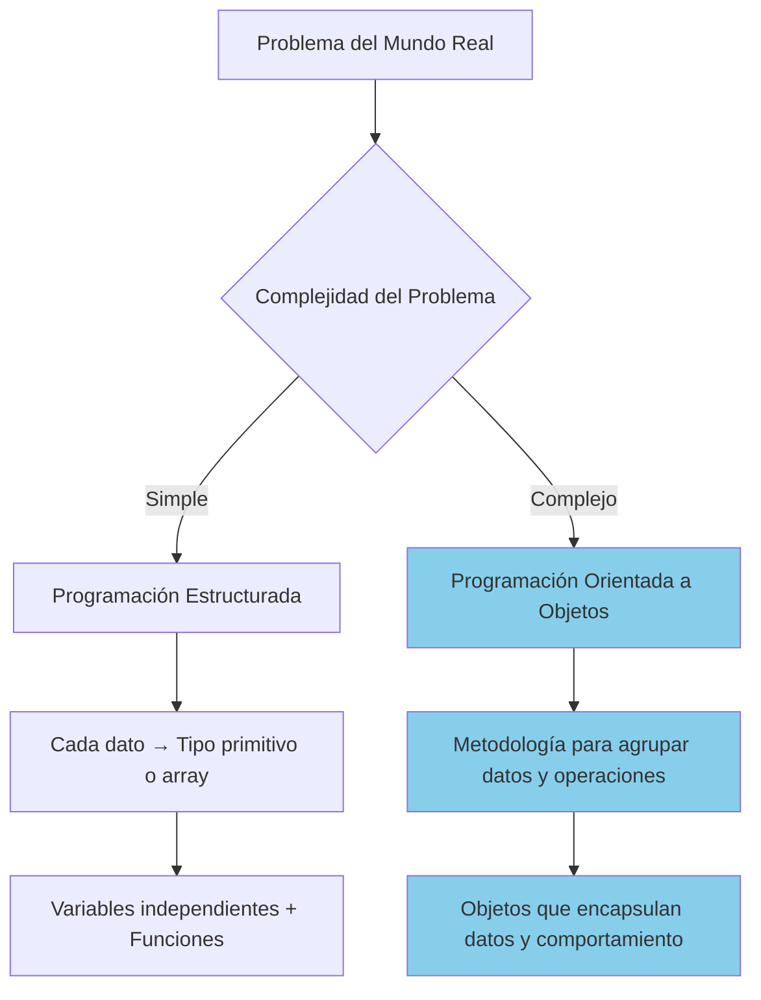

**📊 Estrategias según complejidad:**

| Tipo de Problema | Enfoque Recomendado | Estrategia |
| :-- | :-- | :-- |
| **Problemas sencillos** | Programación estructurada | Cada dato → tipo primitivo o estructura básica (arrays, Strings) |
| **Problemas complejos** | Programación orientada a objetos | Metodología sistemática para agrupar datos y operaciones relacionadas |

> [!TIP]
> La POO no reemplaza completamente la programación estructurada, sino que la complementa y extiende, proporcionando herramientas adicionales para manejar la complejidad.

## 2. Bases fundamentales de la POO

La Programación Orientada a Objetos se sustenta en cuatro pilares fundamentales que trabajan de manera conjunta para proporcionar un enfoque robusto y flexible para el desarrollo de software.

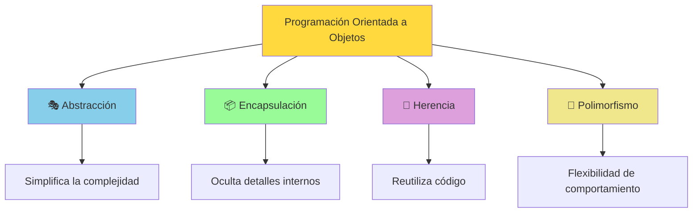

### 2.1 Abstracción

La **abstracción** es el proceso mental de extracción de las características esenciales de alguna cosa, ignorando los detalles superfluos o irrelevantes para el contexto específico.

**🎯 Definición técnica:**
La abstracción consiste en aislar un elemento de su contexto, centrándonos en **"qué hace"** en lugar de **"cómo lo hace"**. Esto nos permite analizar y trabajar con elementos considerando únicamente sus propiedades esenciales.

**🚗 Ejemplo ilustrativo. El automóvil:**

Imagina cómo los desarrolladores de software podrían haber nombrado un automóvil en base a las funcionalidades que querían implementar:

```java
public class PistonCrankshaftGearWheelAssembly {

}
```

En lugar de este enfoque técnico, la abstracción nos permite pensar en términos más simples y comprensibles:

```java
public class Automovil {
    public void arrancar() { /* implementación compleja oculta */ }
    public void acelerar() { /* implementación compleja oculta */ }
    public void frenar() { /* implementación compleja oculta */ }
    public void girar(Direccion direccion) { /* implementación compleja oculta */ }
}
```

**✅ Características de una buena abstracción:**

1. **Vocabulario diferenciado**: Introduce términos distintos a los componentes técnicos subyacentes
2. **Protección de complejidad**: Oculta los detalles técnicos complejos para su uso
3. **Comprensión intuitiva**: Permite entender el concepto sin conocer los detalles internos
4. **Enfoque en funcionalidad**: Se centra en qué puede hacer, no en cómo lo hace

> [!IMPORTANT]
> Una abstracción efectiva debe ser intuitiva para el usuario. Si alguien necesita conocer los detalles internos para usar la abstracción, entonces no es una buena abstracción.

### 2.2 Encapsulación

La **encapsulación** es el empaquetamiento de información (datos y comportamiento) **en una sola unidad o componente**, ocultando el estado interno de un objeto y restringiendo el acceso a sus miembros internos.


**🔒 Componentes de la encapsulación:**

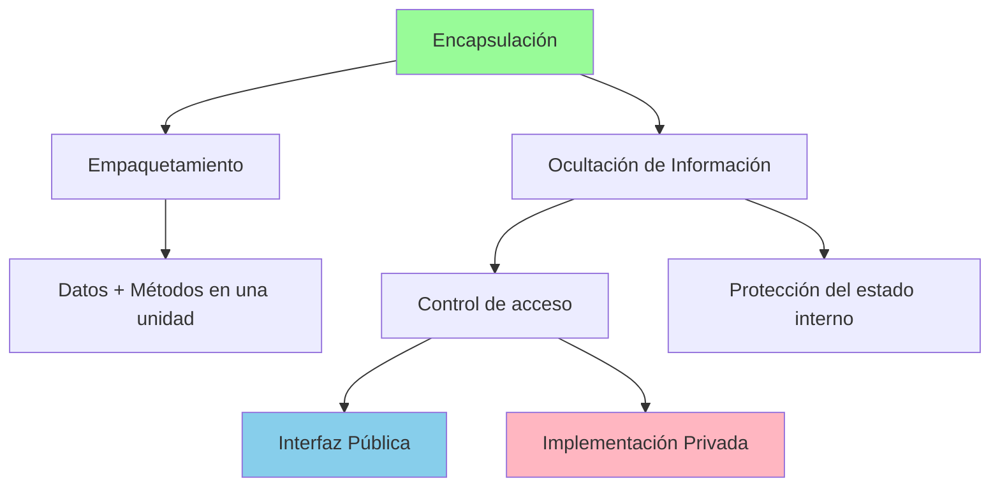


> [!NOTE]
> **Relación con la abstracción**: La encapsulación es el mecanismo técnico que nos permite implementar abstracción, proporcionando una interfaz simple (clase) mientras oculta la complejidad interna.

### 2.3 Herencia

La **herencia** es un mecanismo que permite a una clase (denominada subclase o clase hija) derivar de otra clase (denominada superclase o clase padre), adquiriendo automáticamente sus métodos y atributos.

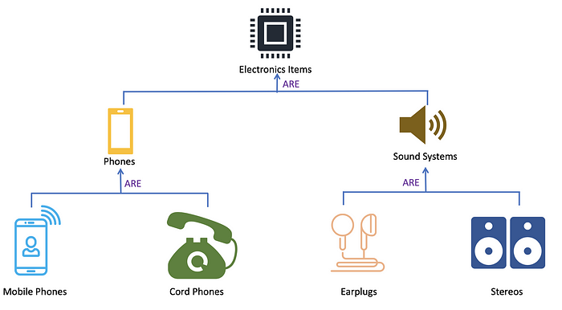

**🔄 Tipos de jerarquías:**

1. **Jerarquía de clasificación**: Organización taxonómica (Animal → Vertebrado → Mamífero)
2. **Jerarquía de composición**: Estructura parte-todo (Factura → Datos Cliente, Detalle)


> [!NOTE]
> En el próximo apartado del tema profundizaremos en la implementación de la herencia en Java.

### 2.4 Polimorfismo

El **polimorfismo**, cuyo término significa "de muchas formas", es una técnica que permite a objetos de diferentes clases responder a un mismo mensaje (método) de manera específica para cada uno, facilitando la reutilización, flexibilidad y abstracción del código.

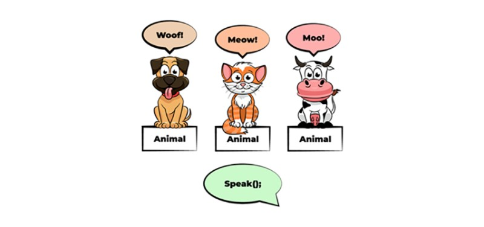

> [!IMPORTANT]
> En la próxima unidad profundizaremos en la implementación de la herencia y el polimorfismo en Java.

## 3. Evolución histórica de los paradigmas

### 3.1 Línea temporal de evolución

La programación ha evolucionado a través de diferentes paradigmas, cada uno construyendo sobre las lecciones aprendidas del anterior y añadiendo nuevas capacidades para manejar la creciente complejidad del software.

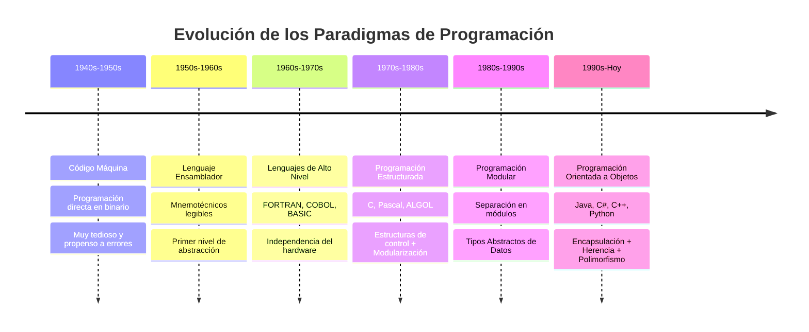

### 3.2 Objetivos de la POO

La Programación Orientada a Objetos surge con objetivos específicos que buscan resolver los problemas identificados en paradigmas anteriores:

**🎯 Objetivos principales:**

**1. Incremento de capacidades técnicas:**

- **Abstracción**: Simplificar conceptos complejos
- **Encapsulación**: Proteger la integridad de los datos
- **Modularidad**: Organizar código en unidades independientes
- **Jerarquización**: Estructurar relaciones entre componentes

**2. Mejora de características del software:**

- **Comprensión**: Código más legible y mantenible
- **Escalabilidad**: Capacidad de crecer sin perder estructura
- **Flexibilidad**: Facilidad para adaptarse a nuevos requerimientos

### 3.3 Beneficios económicos del desarrollo

Un aspecto crucial que impulsa la adopción de la POO es su impacto económico positivo en el desarrollo de software.

**📊 Distribución de costos en desarrollo tradicional:**

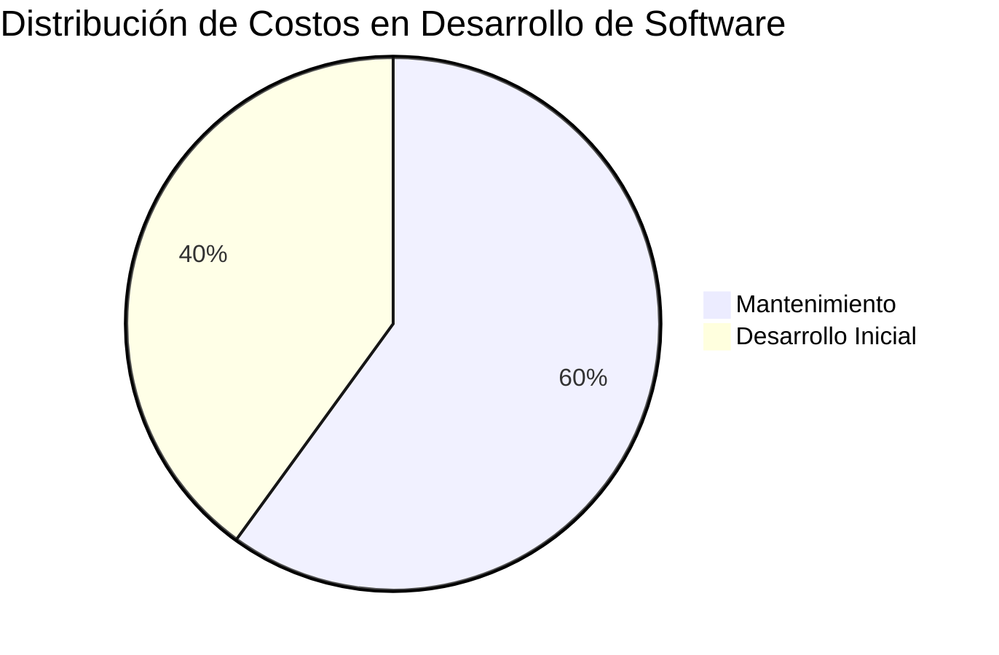

**📈 Impacto de la POO en los costos:**

| Etapa | Costo Tradicional | Costo con POO | Beneficio |
| :-- | :-- | :-- | :-- |
| **Desarrollo inicial** | 30-40% | 40-50% | Mayor inversión inicial en diseño |
| **Mantenimiento** | 60-70% | 30-40% | ⬇️ Reducción significativa |
| **Nuevas funcionalidades** | Alto | Medio | ⬇️ Reutilización de código |
| **Corrección de errores** | Alto | Bajo | ⬇️ Mejor encapsulación |

**💰 Factores de ahorro:**

1. **Reutilización de código**: Los objetos pueden usarse en múltiples proyectos
2. **Mantenimiento simplificado**: Cambios localizados en lugar de globales
3. **Depuración más eficiente**: Problemas aislados en objetos específicos
4. **Escalabilidad mejorada**: Fácil adición de nuevas funcionalidades
5. **Documentación natural**: El código auto-documenta su estructura

> [!NOTE]
> Aunque la POO puede requerir una mayor inversión inicial en diseño y planificación, los beneficios económicos a largo plazo son significativos, especialmente en proyectos grandes y de larga duración.

## 4. Elementos fundamentales de la POO

La POO se construye sobre conceptos fundamentales que modelan elementos del mundo real dentro del entorno de programación. Comprender estos elementos es esencial para aplicar efectivamente este paradigma.

### 4.1 Clase

Una **clase** es la descripción o plantilla que define las características (atributos) y comportamientos (métodos) que tendrán los objetos de un tipo determinado. Actúa como un molde o blueprint a partir del cual se crean los objetos.

Una clase puede considerarse como un **tipo de dato definido por el programador**, donde se agrupa información (datos y funciones) de manera cohesiva y organizada.

**🎯 Ejemplo. Clase Persona:**

```text
DATOS:
    - nombre
    - edad
    ...
OPERACIONES:
    - saltar
    - correr
    - caminar
    ...
```

**🏭 Analogía. La clase como molde:**

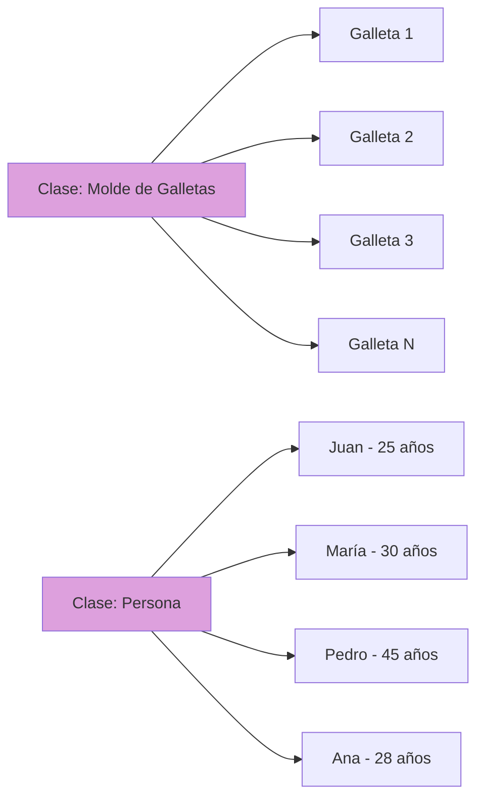

### 4.2 Objeto

Un **objeto** es un ejemplar concreto (**instancia**) de una clase que tiene:

- **Estado específico**: Valores particulares para sus atributos
- **Comportamiento definido**: Responde a los métodos de su clase
- **Identidad única**: Es distinguible de otros objetos

**👥 Ejemplos de objetos de la clase Persona:**

Objeto1:

```text
Nombre: María
Edad: 30
```

Objeto2:

```text
Nombre: Pedro
Edad: 45
```

**🚗 Analogía con automóviles:**


| Clase Coche | Objeto 1 | Objeto 2 | Objeto 3 |
| :-- | :-- | :-- | :-- |
| Modelo | Ford Mustang Rojo | Toyota Prius Azul | Volkswagen Golf Verde |
| Motor | Motor gasolina | Motor eléctrico | Motor diesel |
| Velocidad actual (km/h)| 60 | 45 | 80 |

### 4.3 Atributo

Un **atributo** es cada una de las características o propiedades que definen a una clase y, por tanto, están presentes en todos los objetos de esa clase. Representan el "qué" de un objeto.

**📊 Características de los atributos:**

- Definen las propiedades de un objeto
- Cada objeto tiene sus propios valores para estos atributos
- Determinan el estado del objeto
- Pueden ser de cualquier tipo de dato (primitivo u objeto)
- Una clase puede tener cero, uno, o muchos atributos.

**🔍 Ejemplos de atributos por contexto:**

```java
// 👤 Clase Persona - Contexto social

    nombre 
    edad
    sexo
    altura
    direccion

// 🚗 Clase Automóvil - Contexto de transporte  

    marca
    modelo
    color
    numeroPuertas
    tipoCombustible
    cilindros


// 🐕 Clase Animal - Contexto biológico

    especie      
    tipo       
    color        
    edad         
```

> [!NOTE]
> **Terminología importante**: Aunque a veces verás que los atributos también se llaman "propiedades", es preferible usar el término "atributos" para evitar confusiones con otros conceptos (entidades en JPA).

### 4.4 Estado

El **estado** es el conjunto de valores que tienen los atributos de un objeto en un momento concreto de la ejecución del programa. Representa la "fotografía" actual del objeto.

**📸 Concepto de estado:**

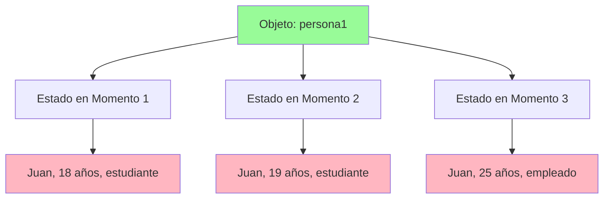

**📋 Ejemplos de estados diferentes:**

| Momento | Objeto | Nombre | Edad | Profesión | Estado |
| :-- | :-- | :-- | :-- | :-- | :-- |
| T1 | Juan | Juan Pérez | 18 | Estudiante | 🎓 Estudiando |
| T2 | Juan | Juan Pérez | 22 | Estudiante | 🎓 Graduándose |
| T3 | Juan | Juan Pérez | 23 | Programador | 💻 Trabajando |

> [!IMPORTANT]
> Cuando modificamos los valores de los atributos de un objeto, decimos que el objeto ha **cambiado de estado**. Esto es diferente a crear un nuevo objeto. **Sigue siendo el mismo objeto**, que ha mutado su estado.

### 4.5 Método

Un **método** es la definición de una operación o comportamiento específico que puede realizar un objeto de la clase. Los métodos representan el "qué puede hacer" un objeto.

**⚙️ Características de los métodos:**

- Definen las capacidades del objeto
- Pueden recibir parámetros para personalizar su comportamiento
- Pueden devolver resultados
- Tienen acceso a los atributos del objeto (salvo que sean estáticos)
- Implementan la lógica de negocio

**🎯 Categorías de métodos:**

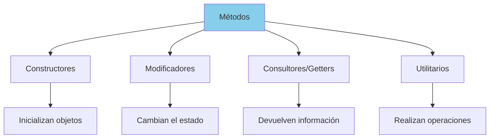

### 4.6 Mensaje

Un **mensaje** es la invocación de un método sobre un objeto específico. Representa la comunicación entre objetos y es el mecanismo fundamental de interacción en la POO.

**🎭 Roles en el paso de mensajes:**

- **Agente activo**: El objeto que envía el mensaje
- **Agente pasivo**: El objeto que recibe y procesa el mensaje
- **Protocolo**: El método específico que se invoca

**📊 Tipos de mensajes por contexto:**


| Contexto | Emisor | Receptor | Mensaje | Propósito |
| :-- | :-- | :-- | :-- | :-- |
| **Gimnasio** | Entrenador | Cliente | `cliente.ejercitar()` | Actividad física |
| **Hospital** | Doctor | Paciente | `paciente.tomarMedicina()` | Tratamiento médico |
| **Banco** | Cajero | Cuenta | `cuenta.retirar(500)` | Transacción |

> [!TIP]
> Los mensajes son la forma principal de comunicación en POO. Un programa orientado a objetos es esencialmente una red de objetos que se envían mensajes entre sí para colaborar en la resolución de un problema.

## 5. Principios de la orientación a objetos

Los principios fundamentales de la POO nos proporcionan una guía conceptual para diseñar y estructurar nuestros programas de manera efectiva. Estos principios conectan el mundo real con el mundo de la programación.

### 5.1 Todo es un objeto

**🌍 Principio fundamental:**
En la programación orientada a objetos, cualquier elemento del problema que estemos resolviendo puede y debe ser modelado como un objeto con identidad propia.

**🎯 Estrategia de modelado:**
Aplicar la orientación a objetos equivale a crear una simulación de un escenario del mundo real dentro del ordenador, donde:

- Cada elemento relevante se convierte en un **objeto**
- Las características importantes se modelan como **atributos**
- Las acciones posibles se implementan como **métodos**
- El comportamiento emerge de las **interacciones** entre objetos

**🔑 Identidad única:**
Cada objeto dentro del programa es **ÚNICO**, incluso si comparte características idénticas con otros objetos. Esta unicidad está garantizada por la referencia en memoria.

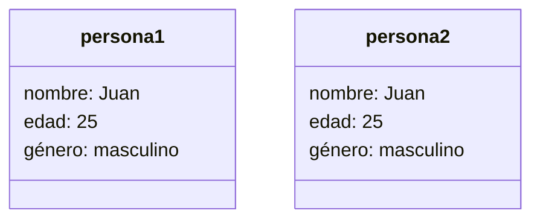

### 5.2 Los programas son conjuntos de objetos que interactúan

**🤝 Colaboración entre objetos:**
Un programa orientado a objetos es fundamentalmente un conjunto de objetos que colaboran enviándose mensajes para alcanzar un objetivo común.

### 5.3 Composición de objetos

**🧩 Principio de composición:**
Los objetos pueden estar formados por otros objetos más simples, siguiendo la misma filosofía que la descomposición modular de problemas complejos.


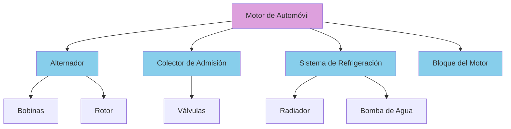

**🏠 Ejemplo. Sistema de casa inteligente:**

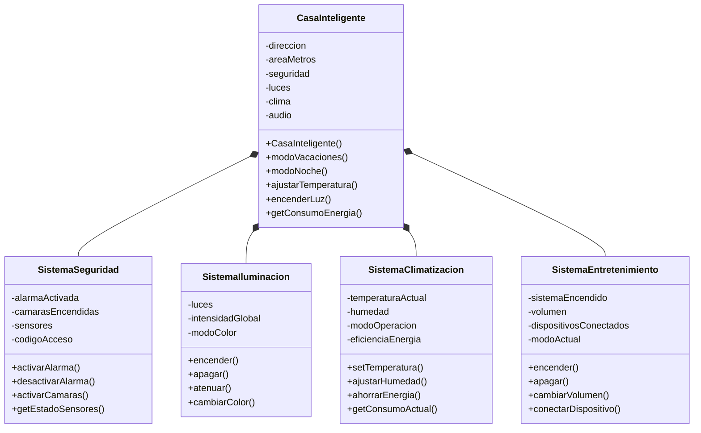

### 5.4 Los objetos pertenecen a clases

**🏛️ Tipificación de objetos:**
A medida que identificamos los objetos de nuestro programa, observamos que algunos comparten características y comportamientos comunes. Estos grupos naturales de objetos similares se formalizan en **clases**.

**🏭 La clase como plantilla:**
Una clase es la especificación formal que actúa como plantilla o molde para crear objetos del mismo tipo, definiendo:

- **Estructura común**: Qué atributos tendrán los objetos
- **Comportamiento común**: Qué métodos podrán ejecutar
- **Reglas de creación**: Cómo se inicializan los objetos

**🔄 Instanciación:**
El proceso de crear un objeto a partir de una clase se llama **instanciación**, y al objeto creado se le llama **instancia** de la clase.

### 5.5 Comportamiento uniforme por clase

**⚖️ Principio de uniformidad:**
Todos los objetos del mismo tipo (de la misma clase) tienen un comportamiento idéntico, aunque cada uno mantenga su estado individual único.

**📋 Implicaciones del principio:**

1. **Métodos compartidos**: Todos los objetos de una clase responden a los mismos mensajes
2. **Estados independientes**: Cada objeto mantiene sus propios valores de atributos
3. **Comportamiento predecible**: Sabemos qué puede hacer un objeto conociendo su clase

**💳 Ejemplo práctico: Cuentas bancarias**

```java

// Crear diferentes cuentas (mismo comportamiento)
CuentaBancaria cuentaJuan = new CuentaBancaria("Juan", "001");
CuentaBancaria cuentaMaria = new CuentaBancaria("María", "002");
CuentaBancaria cuentaPedro = new CuentaBancaria("Pedro", "003");
        
// Todas responden al mismo comportamiento
cuentaJuan.depositar(1000);
cuentaMaria.depositar(2500);
cuentaPedro.depositar(500);
        
// Estados diferentes, comportamiento idéntico
System.out.println("Juan: " + cuentaJuan.consultarSaldo()); // 1000.0
System.out.println("María: " + cuentaMaria.consultarSaldo()); // 2500.0
System.out.println("Pedro: " + cuentaPedro.consultarSaldo()); // 500.0

```

## 6. Ejemplo práctico: El juego del Monopoly

Para consolidar la comprensión de los conceptos de POO, analizaremos un ejemplo completo y detallado: el modelado del juego Monopoly como un sistema orientado a objetos, **desde una perspectiva puramente conceptual**.

<details>
<summary>Pincha aquí para desplegar el ejemplo</summary>

### 6.1 Descripción del juego

El Monopoly es un excelente ejemplo para aplicar POO porque contiene múltiples entidades que interactúan de manera compleja, reflejando situaciones del mundo real.

**🎯 Objetivo del juego:**  
Los jugadores gestionan bienes inmobiliarios con el objetivo de arruinar al resto de jugadores mediante transacciones económicas estratégicas.

**⚙️ Mecánica básica del juego:**

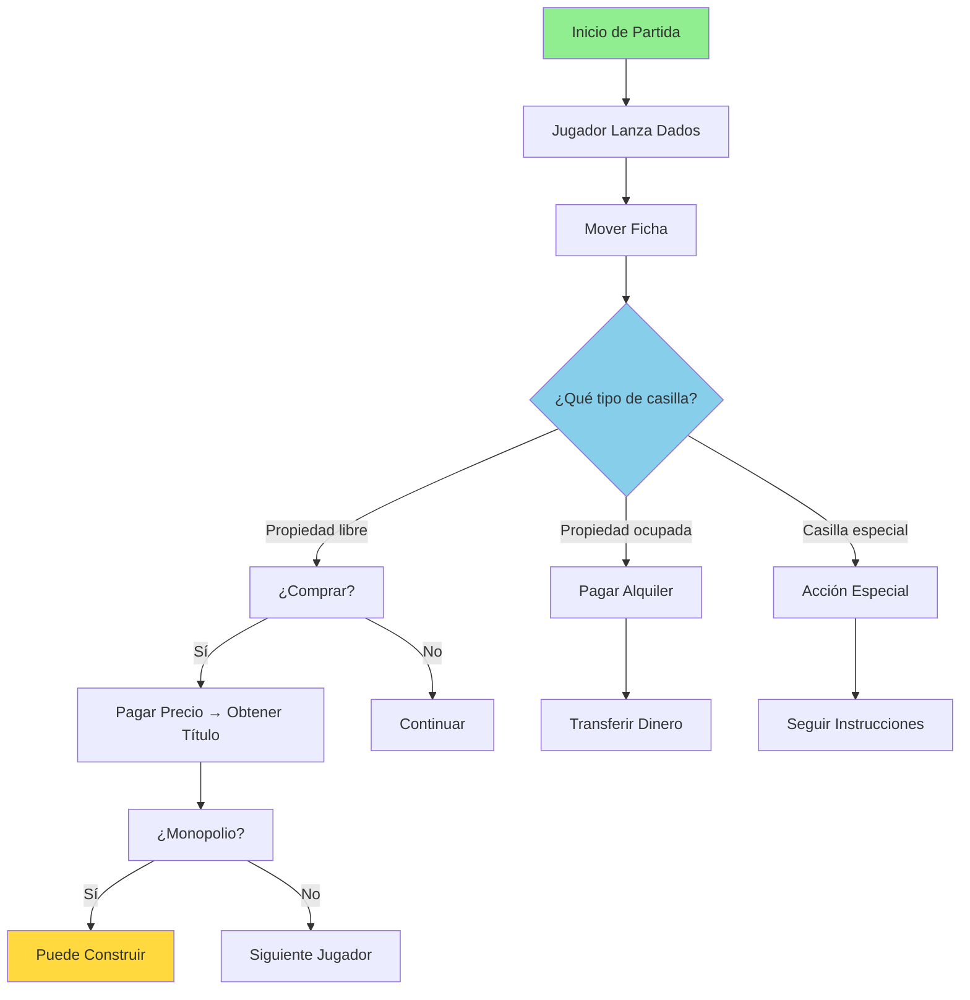

**🎲 Elementos del juego:**

1. **Jugadores**: Cada jugador tiene dinero inicial e identidad única (ficha)
2. **Tablero**: Conjunto de casillas organizadas en circuito
3. **Dados**: Generan movimiento aleatorio
4. **Dinero**: Billetes de diferentes denominaciones
5. **Propiedades**: Casillas que pueden ser compradas
6. **Títulos**: Documentos que acreditan propiedad
7. **Construcciones**: Casas y hoteles para generar ingresos
8. **Banca**: Gestiona dinero y propiedades no asignadas

**🏗️ Reglas de construcción:**

- Para construir, el jugador debe poseer todas las propiedades del mismo color
- Se pueden construir hasta 4 casas por propiedad
- Después se puede construir 1 hotel reemplazando las casas
- Cada construcción aumenta el alquiler que deben pagar otros jugadores

### 6.2 Aplicación de los principios POO

#### 🎭 Todo es un objeto con identidad propia

En el Monopoly, aplicar orientación a objetos significa crear una **simulación digital** del juego físico, donde cada elemento relevante se convierte en un objeto con propiedades y comportamientos específicos.

**🔍 Categorización de objetos:**

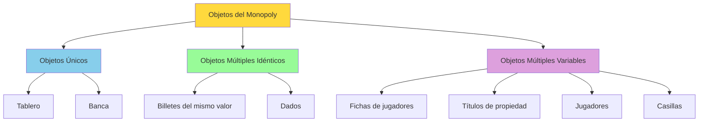

### 6.3 Identificación de objetos

**🎯 Inventario completo de objetos:**

| Categoría | Objetos Identificados | Características |
|-----------|----------------------|-----------------|
| **Únicos** | Tablero, Banca | Un solo ejemplar por partida |
| **Múltiples idénticos** | Billetes de 500€, Dados | Varios con propiedades iguales |
| **Múltiples variables** | Jugadores, Fichas, Títulos | Varios con propiedades diferentes |

**🏠 Ejemplo conceptual. El objeto Billete:**

**Definición conceptual:**

- **¿Qué es?** Representa una unidad monetaria del juego
- **¿Qué características tiene?** Color, valor, serie, estado de uso
- **¿Qué puede hacer?** Ser transferido, almacenado, contado
- **¿Cómo se identifica?** Por su número de serie único

**Atributos identificados:**

- Color (texto)
- Valor (número entero)
- Serie (texto único)
- En uso (verdadero/falso)

### 6.4 Modelado de interacciones

#### 🤝 Los programas son conjuntos de objetos que interactúan

Un programa orientado a objetos es un **conjunto de objetos que interactúan** entre ellos. En el Monopoly, esto se manifiesta claramente.

**📡 Tipos de interacciones identificadas:**

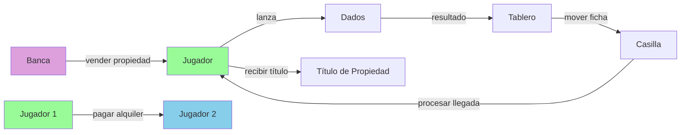

**🎯 Ejemplo de secuencia de interacciones:**

1. **Jugador** → **Dados**: "Lánzate"
2. **Dados** → **Jugador**: "El resultado es 7"
3. **Jugador** → **Tablero**: "Mueve mi ficha 7 posiciones"
4. **Tablero** → **Casilla**: "Procesa la llegada de este jugador"
5. **Casilla** → **Jugador**: "Debes pagar 200€ de alquiler"
6. **Jugador** → **Otro Jugador**: "Te pago 200€"

#### 🏗️ Composición de objetos

**📋 Ejemplo. El tablero compuesto por casillas:**

El **Tablero** es un objeto complejo formado por objetos más simples (**Casillas**):

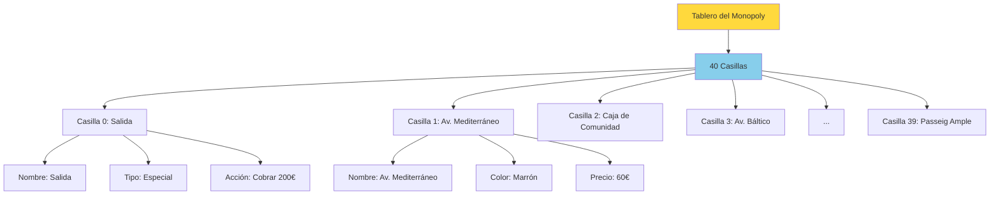

**Relaciones de composición identificadas:**

- **Tablero** está compuesto por **Casillas**
- **Jugador** posee múltiples **Títulos de Propiedad**
- **Banca** gestiona conjuntos de **Billetes**
- **Partida** contiene **Jugadores**, **Tablero** y **Dados**

#### 🏛️ Los objetos pertenecen a clases

A medida que analizamos los objetos del Monopoly, observamos que algunos comparten características comunes. Estos grupos se formalizan en **clases**.

**📊 Clasificación de objetos:**

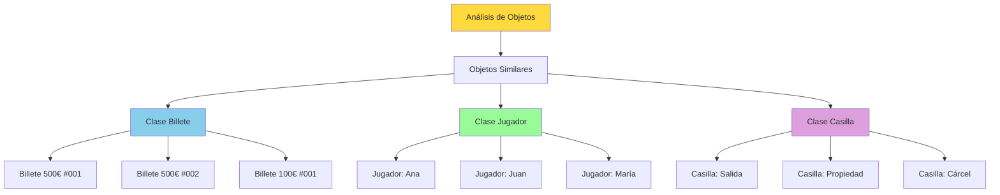

**🏭 Concepto de plantilla:**

Una **clase** actúa como una **plantilla** o **molde** que define:

- **Qué atributos** tendrán los objetos de ese tipo
- **Qué operaciones** podrán realizar
- **Cómo se comportarán** en diferentes situaciones

#### ⚖️ Comportamiento uniforme por clase

Todos los objetos de la misma clase tienen un **comportamiento idéntico**, aunque cada uno mantenga su estado individual único.

**🎭 Ejemplo. La clase Jugador:**

**Comportamientos comunes de todos los jugadores:**

- Pueden lanzar los dados
- Pueden mover su ficha
- Pueden comprar propiedades
- Pueden pagar y recibir dinero
- Pueden construir casas y hoteles

**Estados individuales diferentes:**

- **Ana**: 1500€, posición 5, ficha sombrero
- **Juan**: 800€, posición 12, ficha perro  
- **María**: 2200€, posición 23, ficha coche

### 6.5 Análisis detallado de clases identificadas

#### 📋 Clase Jugador

**Atributos identificados:**

- Nombre (texto)
- Dinero disponible (número)
- Posición en el tablero (número)
- Ficha asociada (objeto Ficha)
- Lista de propiedades (conjunto de Títulos)
- Estado (activo/en bancarrota/en cárcel)

**Operaciones identificadas:**

- Lanzar dados
- Mover ficha
- Comprar propiedad
- Pagar dinero a otro jugador
- Recibir dinero
- Construir edificaciones
- Hipotecar propiedades

#### 🏠 Clase Propiedad (Casilla especial)

**Atributos identificados:**

- Nombre (texto)
- Color del grupo (texto)
- Precio de compra (número)
- Alquiler base (número)
- Propietario (objeto Jugador o nulo)
- Número de casas (número 0-4)
- Tiene hotel (verdadero/falso)

**Operaciones identificadas:**

- Calcular alquiler actual
- Procesar llegada de jugador
- Cambiar propietario
- Construir casa
- Construir hotel

#### 💰 Clase Banca

**Atributos identificados:**

- Dinero disponible (número grande)
- Propiedades sin dueño (conjunto de Propiedades)
- Casas disponibles (número)
- Hoteles disponibles (número)

**Operaciones identificadas:**

- Vender propiedad a jugador
- Comprar propiedad de jugador
- Realizar pagos especiales
- Gestionar subastas

### 6.6 Diagrama de relaciones conceptuales

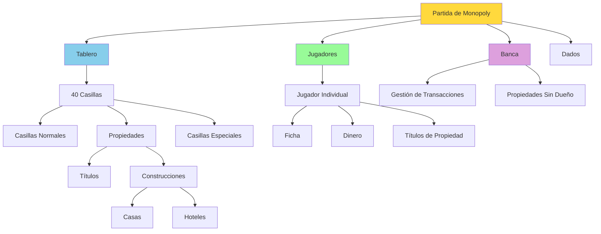

### 6.7 Escenarios de interacción

#### 🎯 Escenario 1: Compra de propiedad

**Actores involucrados:**

- Jugador (que cae en la casilla)
- Propiedad (casilla donde cae)
- Banca (gestora de la transacción)
- Título de Propiedad (documento de propiedad)

**Secuencia conceptual:**

1. **Jugador** cae en **Propiedad** libre
2. **Propiedad** consulta si tiene propietario (no)
3. **Propiedad** ofrece compra al **Jugador**
4. **Jugador** decide comprar
5. **Banca** procesa la transacción
6. **Jugador** paga el precio
7. **Banca** transfiere **Título** al **Jugador**
8. **Propiedad** actualiza su propietario

#### 🎯 Escenario 2: Pago de alquiler

**Actores involucrados:**

- Jugador visitante
- Jugador propietario  
- Propiedad (con dueño)

**Secuencia conceptual:**

1. **Jugador visitante** cae en **Propiedad** ocupada
2. **Propiedad** identifica a su propietario
3. **Propiedad** calcula alquiler según construcciones
4. **Jugador visitante** paga alquiler
5. **Jugador propietario** recibe el pago

### 6.8 Ventajas del enfoque orientado a objetos

**🎯 Beneficios identificados en el modelo del Monopoly:**

1. **Modularidad**: Cada elemento (Jugador, Propiedad, Banca) es independiente
2. **Reutilización**: La clase Billete se usa para diferentes sitios
3. **Mantenibilidad**: Cambiar reglas de una Propiedad no afecta a otros elementos
4. **Extensibilidad**: Fácil agregar nuevos tipos de casillas o reglas
5. **Comprensibilidad**: El modelo refleja directamente el juego real

**📊 Comparación con enfoque estructurado:**

| Aspecto | Enfoque Estructurado | Enfoque Orientado a Objetos |
|---------|---------------------|----------------------------|
| **Organización** | Funciones separadas + datos globales | Objetos que encapsulan datos y comportamiento |
| **Modificaciones** | Cambios pueden afectar múltiples funciones | Cambios localizados en objetos específicos |
| **Comprensión** | Hay que entender todo el flujo | Cada objeto es comprensible independientemente |
| **Reutilización** | Copiar y adaptar funciones | Crear nuevas instancias de clases existentes |

> [!NOTE]
> Este análisis conceptual del Monopoly demuestra cómo la POO proporciona un framework natural para modelar sistemas complejos, haciendo que el código resultante sea más intuitivo, mantenible y extensible.
>
>El siguiente paso será trasladar estos conceptos a sintaxis Java concreta, donde veremos cómo estas ideas abstractas se implementan en código real.
</details>

## 7. Relación formal de los elementos POO

### 📚 Definiciones formales

**Clase**: Es la definición de los atributos y métodos que describen el comportamiento de un cierto conjunto de objetos homogéneos.

**Objeto**: Es un ejemplar concreto de una clase que responde a los mensajes correspondientes a los métodos de esta, adecuándose al estado de sus atributos.

### 🔒 Principio de encapsulación

Las clases asumen el **principio de encapsulación**: cuando se describe una clase, se debe describir tanto su vista pública o interfaz como su vista privada o implementación.


👁️ La **vista pública** o **interfaz** describe:

- A qué operaciones responden los objetos de esa clase
- Es decir, su **comportamiento** visible desde el exterior

🔧 La **vista privada** o **implementación** describe:

- Las estructuras de datos de la clase
- Cómo manipulan las operaciones esas datos
- Las operaciones intermedias realizadas de forma interna

> [!TIP]
> 💡 **Regla general**: Haz los atributos privados y proporciona métodos públicos para acceder a ellos cuando sea necesario (getters y setters).

> [!NOTE]
> La programación orientada a objetos nos proporciona una manera natural e intuitiva de modelar problemas complejos, organizando el código en clases y objetos que representen elementos del mundo real con sus atributos y comportamientos.

<p align="center">📚 <em>Fin del apartado UT5.1 - Introducción a la Programación Orientada a Objetos</em></p>
