# UT5.2 Programación Orientada a Objetos en Java

## 📋 Índice de contenidos

1. [Introducción a la POO en Java](#1-introducci%C3%B3n-a-la-poo-en-java)
2. [Definición de clases y objetos](#2-definici%C3%B3n-de-clases-y-objetos)
    1. [Sintaxis básica de una clase](#21-sintaxis-b%C3%A1sica-de-una-clase)
    2. [Estructura de una clase](#22-estructura-de-una-clase)
3. [Referencias en Java](#3-referencias-en-java)
    1. [Concepto de referencia](#31-concepto-de-referencia)
    2. [Operador new](#32-operador-new)
    3. [Referencia a null](#33-referencia-a-null)
    4. [Recolector de memoria basura](#34-recolector-de-memoria-basura)
4. [Ejemplo práctico: Clase Circle](#4-ejemplo-pr%C3%A1ctico-clase-circle)
    1. [Definición de la clase](#41-definici%C3%B3n-de-la-clase)
    2. [Creación de objetos](#42-creaci%C3%B3n-de-objetos)
    3. [Práctica 1: Implementación de SimpleCircle](#43-pr%C3%A1ctica-1-implementaci%C3%B3n-de-simplecircle)
5. [Creación de métodos](#5-creaci%C3%B3n-de-m%C3%A9todos)
    1. [Sintaxis de métodos](#51-sintaxis-de-m%C3%A9todos)
    2. [Ejemplo: Clase TV](#52-ejemplo-clase-tv)
    3. [Práctica 2: Implementación de la clase TV](#53-pr%C3%A1ctica-2-implementaci%C3%B3n-de-la-clase-tv)
6. [Sobrecarga de métodos](#6-sobrecarga-de-m%C3%A9todos)
    1. [Concepto y reglas](#61-concepto-y-reglas)
    2. [Ejemplos prácticos](#62-ejemplos-pr%C3%A1cticos)
7. [Constructores](#7-constructores)
    1. [Características de los constructores](#71-caracter%C3%ADsticas-de-los-constructores)
    2. [Constructor por defecto](#72-constructor-por-defecto)
    3. [Práctica 3: Clase Persona](#73-pr%C3%A1ctica-3-clase-persona)
    4. [Ejercicio: CompteCorrent (I)](#74-ejercicio-comptecorrent-i)
8. [Gestión de referencias y objetos](#8-gesti%C3%B3n-de-referencias-y-objetos)
    1. [Declaración y asignación de referencias](#81-declaraci%C3%B3n-y-asignaci%C3%B3n-de-referencias)
    2. [NullPointerException](#82-nullpointerexception)
9. [Modificadores de acceso](#9-modificadores-de-acceso)
    1. [Visibilidad entre clases](#91-visibilidad-entre-clases)
    2. [Visibilidad de miembros](#92-visibilidad-de-miembros)
    3. [Ejercicio: CompteCorrent (II)](#93-ejercicio-comptecorrent-ii)
10. [Métodos get y set](#10-m%C3%A9todos-get-y-set)
    1. [Principio de encapsulación](#101-principio-de-encapsulaci%C3%B3n)
    2. [Implementación de getters y setters](#102-implementaci%C3%B3n-de-getters-y-setters)
    3. [Ejercicio: CompteCorrent (III)](#103-ejercicio-comptecorrent-iii)
11. [Paso de objetos como parámetros](#11-paso-de-objetos-como-par%C3%A1metros)
    1. [Preguntas](#111-preguntas)
12. [Ocultación de atributos](#12-ocultaci%C3%B3n-de-atributos)
13. [La palabra reservada this](#13-la-palabra-reservada-this)
    1. [Usos de this](#131-usos-de-this)
    2. [Práctica 4: Aplicación de this](#132-pr%C3%A1ctica-4-aplicaci%C3%B3n-de-this)
    3. [Constructores de copia y método clonar](#133-constructores-de-copia-y-m%C3%A9todo-clonar)
    4. [Prácticas 5-7: Extensión de la clase Persona](#134-pr%C3%A1cticas-5-7-extensi%C3%B3n-de-la-clase-persona)
    5. [Ejercicios: CompteCorrent (IV y V)](#135-ejercicios-comptecorrent-iv-y-v)
14. [Inmutabilidad](#14-inmutabilidad)
    1. [¿Qué es un objeto inmutable?](#141-qué-es-un-objeto-inmutable)
    2. [Ventajas de la inmutabilidad](#142-ventajas-de-la-inmutabilidad)
    3. [Características de una clase inmutable](#143-características-de-una-clase-inmutable)
    4. [Ejemplo: Clase inmutable](#144-ejemplo-clase-inmutable)
    5. [Ejemplo: String es inmutable](#145-ejemplo-string-es-inmutable)
    6. [Cómo crear una clase inmutable](#146-cómo-crear-una-clase-inmutable)
    7. [Resumen de ventajas e inconvenientes](#147-resumen-de-ventajas-e-inconvenientes)
15. [Asociación entre clases](#15-asociación-entre-clases)
    1. [¿Qué es la asociación?](#151-qué-es-la-asociación)
    2. [Asociación simple](#152-asociación-simple)
    3. [Agregación](#153-agregación)
    4. [Composición](#154-composición)

## 1. Introducción a la POO en Java

Después de haber comprendido los conceptos fundamentales de la Programación Orientada a Objetos, es momento de trasladar estos conceptos a la sintaxis específica de Java.

Java es un lenguaje **fuertemente orientado a objetos**, donde prácticamente todo son objetos (excepto los tipos primitivos). Esto significa que:

- **📝 Todo el código** debe estar dentro de clases
- **🏗️ Los programas** se construyen creando y manipulando objetos
- **🔄 La interacción** se realiza mediante el paso de mensajes entre objetos
- **🛡️ La encapsulación** se controla mediante modificadores de acceso

> [!IMPORTANT]
> En Java, la unidad básica de programación es la **clase**. No se puede escribir código ejecutable fuera de una clase.

## 2. Definición de clases y objetos

### 2.1 Sintaxis básica de una clase

Una clase en Java utiliza **variables** para definir los atributos y **métodos** para definir las operaciones. Adicionalmente, existen métodos especiales llamados **constructores** que se invocan para crear e inicializar objetos.

```java
public class NombreClase {
    // Atributos (variables de instancia)
    private tipoAtributo nombreAtributo;
    
    // Constructor
    public NombreClase() {
        // Inicialización
    }
    
    // Métodos
    public tipoRetorno nombreMetodo() {
        // Implementación
        return valor; // si no es void
    }
}
```

### 2.2 Estructura de una clase


## 3. Referencias en Java

### 3.1 Concepto de referencia

El comportamiento de los objetos en la memoria y sus operaciones elementales (creación, asignación y destrucción) es idéntico al de los arrays. Esto se debe a que tanto objetos como arrays utilizan **referencias**.

**Diferencia fundamental:**

- **Variable de tipo primitivo**: Almacena directamente un valor
- **Variable de tipo referencia**: Almacena la dirección de memoria donde se encuentra el objeto

```java
// Variable primitiva - almacena el valor directamente
int numero = 42;

// Variable de referencia - almacena la dirección del objeto
Persona p; // Declaración de referencia (inicialmente null)
p = new Persona("Pepa", 18, 1.87);
```

**Representación en memoria:**

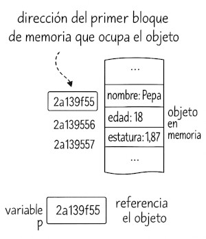

**Representación simplificada (con flechas):**

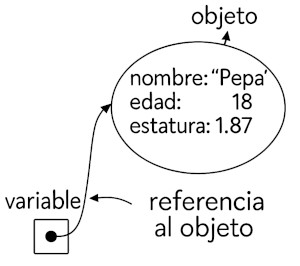

**Mismo objeto referenciado por dos variables:**

```java
Persona p1, p2;
p1 = new Persona();
p2 = p1;
p2.cambiarNombre("Pepa");
```


### 3.2 Operador new

Para crear objetos utilizamos el operador **`new`**, similar a como hacemos con arrays.

```java
persona = new Persona("Juan Amat", 25, 1.75);
```

**Proceso de creación:**


>[!NOTE]
>**¿Qué imprimiría `System.out.println(persona)`?**
>
> La respuesta sería algo como: `Persona@2a139f55` (representación hexadecimal de la referencia)

### 3.3 Referencia a null

El valor literal **`null`** es una referencia nula, es decir, una referencia que no apunta a ningún objeto en memoria.

**Características importantes:**

- Las variables de referencia se inicializan por defecto a `null`
- Intentar acceder a miembros (atributos o métodos) de una referencia `null` provoca `NullPointerException`
- Es útil para "liberar" la referencia a un objeto

```java
Persona persona; // Inicializada automáticamente a null
persona = new Persona("Ana", 30, 1.81); // ✅ Ahora referencia un objeto
persona = null; // La variable deja de referenciar el objeto
// persona.obtenerEdad(); // ❌ Error: NullPointerException
```

### 3.4 Recolector de memoria basura

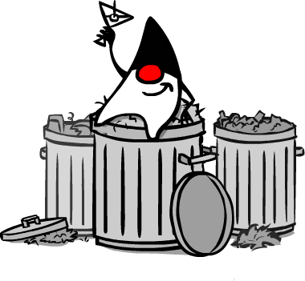

Java incluye un **Garbage Collector** que gestiona automáticamente la memoria:

**Situaciones que crean objetos no referenciados:**

1. **Crear objeto sin asignar a variable:**

    ```java
    new Persona("Temporal", 20, 1.79); // Se pierde inmediatamente
    ```

2. **Asignar null a una variable:**

    ```java
    Persona p = new Persona("Juan", 25, 1.78);
    p = null; // El objeto queda sin referencia
    ```

3. **Reasignar variable a otro objeto:**

    ```java
    Persona p = new Persona("Juan", 25, 1.76);
    p = new Persona("Ana", 30, 1.77); // El primer objeto se pierde
    ```

> [!NOTE]
> El Garbage Collector se ejecuta periódicamente de forma transparente, liberando la memoria ocupada por objetos sin referencias.

## 4. Ejemplo práctico: Clase Circle

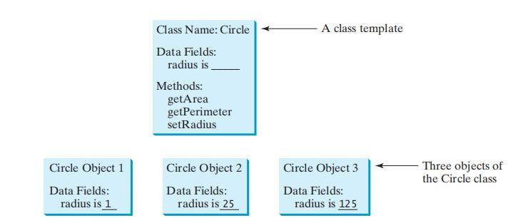

### 4.1 Definición de la clase

Veamos un ejemplo completo de una clase bien estructurada:

```java
public class SimpleCircle {
    // 📊 Atributo privado
    private double radius;
    
    // 🏗️ Constructor sin parámetros
    public SimpleCircle() {
        radius = 1.0; // Radio por defecto
    }
    
    // 🏗️ Constructor con parámetro
    public SimpleCircle(double newRadius) {
        radius = newRadius;
    }
    
    // ⚙️ Métodos públicos
    public double getArea() {
        return radius * radius * Math.PI;
    }
    
    public double getPerimeter() {
        return 2 * radius * Math.PI;
    }
    
    public void setRadius(double newRadius) {
        radius = newRadius;
    }
    
    public double getRadius() {
        return radius;
    }
}
```

### 4.2 Creación de objetos

```java
public class TestSimpleCircle {
    public static void main(String[] args) {
        // Crear círculos con diferentes constructores
        SimpleCircle circle1 = new SimpleCircle();      // Radio = 1.0
        SimpleCircle circle2 = new SimpleCircle(25);    // Radio = 25.0
        SimpleCircle circle3 = new SimpleCircle(125);   // Radio = 125.0
        
        // Mostrar información
        System.out.println("Círculo 1 - Radio: " + circle1.getRadius() + 
                          ", Área: " + circle1.getArea());
        System.out.println("Círculo 2 - Radio: " + circle2.getRadius() + 
                          ", Área: " + circle2.getArea());
        
        // Modificar radio
        circle2.setRadius(100);
        System.out.println("Círculo 2 modificado - Radio: " + circle2.getRadius() + 
                          ", Área: " + circle2.getArea());
    }
}
```

### 4.3 Práctica 1: Implementación de SimpleCircle

**Objetivo:** Implementar y probar la clase SimpleCircle.

**Instrucciones:**

1. Crea la clase `SimpleCircle` con la estructura mostrada
2. Crea la clase `TestSimpleCircle` con el método main
3. Ejecuta y verifica los resultados

<details>
<summary>💻 Estructura del proyecto</summary>

```text
src/
├── SimpleCircle.java
└── TestSimpleCircle.java
```

</details>

## 5. Creación de métodos

### 5.1 Sintaxis de métodos

```java
public <tipoRetorno> <nombreMetodo>(<tipoParametro> <parametro>, ...) {
    // Cuerpo del método
    return valor; // Solo si no es void
}
```

**Elementos de un método:**

- **`tipoRetorno`**: Puede ser `void`, un tipo primitivo, una clase, o un array
- **`nombreMetodo`**: Comienza en minúscula (convención lowerCamelCase)
- **`tipoParametro`**: Puede ser un tipo primitivo, una clase, o un array.
- **Parámetros**: Todos (0 a N) se pasan por valor
- **Cuerpo**: Implementación de la funcionalidad

### 5.2 Ejemplo: Clase TV

Analicemos las características de un televisor para nuestro programa:

**Propiedades identificadas:**

- Canal que se está viendo
- Nivel de volumen
- Estado (encendido/apagado)

**Operaciones identificadas:**

- Encender
- Apagar
- Subir el volumen
- Bajar volumen
- Cambiar al canal sigüiente
- Cambiar al canal anterior

### 5.3 Práctica 2: Implementación de la clase TV

**Objetivo:** Implementar la clase TV y crear un programa de prueba.

**Instrucciones:**

1. Implementa la clase `TV` con las características mostradas
2. Crea la clase `TestTV` que pruebe diferentes operaciones
3. Verifica que el comportamiento es el esperado

<details>
<summary>💻 Solución TV</summary>

```java
public class TV {
    // 📊 Atributos
    private int canal;
    private int volumen;
    private boolean encendido;
    
    // 🏗️ Constructor
    public TV() {
        canal = 1;
        volumen = 0;
        encendido = false;
    }
    
    // ⚙️ Métodos de control
    public void encender() {
        encendido = true;
    }
    
    public void apagar() {
        encendido = false;
    }
    
    public void subirVolumen() {
        if (encendido && volumen < 99) {
            volumen++;
        }
    }
    
    public void bajarVolumen() {
        if (encendido && volumen > 0) {
            volumen--;
        }
    }
    
    public void canalSiguiente() {
        if (encendido) {
            canal++;
            if (canal > 999) {
                canal = 1;
            }
        }
    }
    
    public void canalAnterior() {
        if (encendido) {
            canal--;
            if (canal < 1) {
                canal = 999;
            }
        }
    }
    
    // 🔍 Métodos de consulta
    public int getCanal() {
        return canal;
    }
    
    public int getVolumen() {
        return volumen;
    }
    
    public boolean isEncendido() {
        return encendido;
    }
}
```

```java
public class TestTV {
    public static void main(String[] args) {
        // Crear dos televisores
        TV tv1 = new TV();
        TV tv2 = new TV();
        
        System.out.println("=== ESTADO INICIAL ===");
        mostrarEstado("TV1", tv1);
        mostrarEstado("TV2", tv2);
        
        System.out.println("\n=== ENCENDER TV1 ===");
        tv1.encender();
        mostrarEstado("TV1", tv1);
        
        System.out.println("\n=== OPERACIONES EN TV1 ===");
        tv1.subirVolumen();
        tv1.subirVolumen();
        tv1.canalSiguiente();
        tv1.canalSiguiente();
        mostrarEstado("TV1", tv1);
        
        System.out.println("\n=== OPERACIONES EN TV2 (APAGADO) ===");
        tv2.subirVolumen(); // No debería tener efecto
        tv2.canalSiguiente(); // No debería tener efecto
        mostrarEstado("TV2", tv2);
        
        System.out.println("\n=== ENCENDER TV2 Y OPERAR ===");
        tv2.encender();
        tv2.subirVolumen();
        tv2.canalSiguiente();
        mostrarEstado("TV2", tv2);
    }
    
    private static void mostrarEstado(String nombre, TV tv) {
        System.out.printf("%s - Encendido: %s, Canal: %d, Volumen: %d\n",
                         nombre, tv.isEncendido(), tv.getCanal(), tv.getVolumen());
    }
}
```

</details>

## 6. Sobrecarga de métodos

### 6.1 Concepto y reglas

La **sobrecarga de métodos** permite tener múltiples métodos con el mismo nombre, siempre que tengan diferentes listas de parámetros (diferente signatura o firma).

**Reglas importantes:**

- ✅ **Diferente número de parámetros**
- ✅ **Diferente tipo de parámetros**
- ✅ **Diferente orden de tipos de parámetros**
- ❌ **NO se puede sobrecargar solo por tipo de retorno**

### 6.2 Ejemplos prácticos

```java
public class Persona {
    private String nombre;
    private int edad;
    
    // Métodos sobrecargados para caminar
    public void caminar() {
        System.out.println(nombre + " camina normalmente");
    }
    
    public void caminar(int pasos) {
        System.out.println(nombre + " camina " + pasos + " pasos");
    }
    
    public void caminar(double distancia) {
        System.out.println(nombre + " camina " + distancia + " metros");
    }
    
    public void caminar(int pasos, String direccion) {
        System.out.println(nombre + " camina " + pasos + " pasos hacia " + direccion);
    }
    
    // ❌ ERROR - No se puede sobrecargar solo por tipo de retorno
    // public int caminar(int numPasos) { ... }
}
```

**Uso de métodos sobrecargados:**

```java
Persona persona = new Persona("Juan", 25);
persona.caminar();                    // Firma: caminar()
persona.caminar(100);                 // Firma: caminar(int)
persona.caminar(50.5);                // Firma: caminar(double)
persona.caminar(20, "norte");         // Firma: caminar(int, String)
```

## 7. Constructores

### 7.1 Características de los constructores

Los constructores son métodos especiales con **tres características únicas**:

1. **🏷️ Mismo nombre que la clase**
2. **🚫 No tienen tipo de retorno** (ni siquiera `void`)
3. **🔧 Se invocan automáticamente** con el operador `new`

**Responsabilidades adicionales:**

- Recoger valores iniciales para crear el objeto
- Gestionar errores en la fase de inicialización
- Aplicar procesos de inicialización complejos
- Validar datos de entrada

### 7.2 Constructor por defecto

**Reglas importantes:**

- Una misma clase puede disponer de **varios constructures**. La diferencia entre ellos la determina el orden y tipo de parámetros de entrada.
- Si **no defines ningún constructor**, Java proporciona uno vacío automáticamente
- Si **defines al menos un constructor**, el constructor por defecto **desaparece**
- Para tener ambos, debes definir explícitamente el constructor sin parámetros

```java
public class Ejemplo {
    private String dato;
    
    // Si solo tienes este constructor personalizado...
    public Ejemplo(String dato) {
        this.dato = dato;
    }
    
    // ...debes definir explícitamente el constructor por defecto si lo necesitas
    public Ejemplo() {
        this.dato = "valor por defecto";
    }
}
```

### 7.3 Práctica 3: Clase Persona

**Objetivo:** Crear una clase Persona con constructor y método de visualización.

```java
public class Persona {
    private String dni;
    private String nombre;
    private int edad;
    
    // Constructor con parámetros
    public Persona(String unDni, String unNombre, int unaEdad) {
        dni = unDni;
        nombre = unNombre;
        if (unaEdad >= 0 && unaEdad <= 150) {
            edad = unaEdad;
        } else {
            edad = 0; // Valor por defecto si la edad no es válida
        }
    }
    
    // Constructor por defecto (necesario si queremos crear personas sin datos)
    public Persona() {

    }
    
    public void visualizar() {
        System.out.println("DNI.............: " + dni);
        System.out.println("Nombre..........: " + nombre);
        System.out.println("Edad............: " + edad);
    }
    
    // Getters
    public String getDni() { return dni; }
    public String getNombre() { return nombre; }
    public int getEdad() { return edad; }
}
```

**Programa de prueba:**

```java
public class TestPersona {
    public static void main(String[] args) {
        Persona p1 = new Persona("12345678A", "Pepe Gotera", 33);
        Persona p2 = new Persona(); // Constructor por defecto
        
        System.out.println("Visualización de persona p1:");
        p1.visualizar();
        
        System.out.println("\nVisualización de persona p2:");
        p2.visualizar();
    }
}
```

**Salida por consola:**

```text
Visualización de persona p1:
DNI.............: 12345678A
Nombre..........: Pepe Gotera
Edad............: 33

Visualización de persona p2:
DNI.............: null
Nombre..........: null
Edad............: 0
```

### 7.4 Ejercicio: CompteCorrent (I)

**Enunciado:**
Diseña la clase `CompteCorrent` que almacene los datos: DNI y nombre del titular, así como el saldo. Las operaciones típicas son:

- **Crear cuenta**: Se necesita DNI y nombre del titular. Saldo inicial será 0.0
- **Retirar dinero**: Debe indicar si fue posible (saldo suficiente).
- **Ingresar dinero**: Incrementa el saldo.
- **Mostrar información**: Muestra toda la información de la cuenta

<details>
<summary>💻 Solución CompteCorrent</summary>

```java
public class CompteCorrent {
    private String dni;
    private String nombreTitular;
    private double saldo;
    
    // Constructor
    public CompteCorrent(String dni, String nombreTitular) {
        this.dni = dni;
        this.nombreTitular = nombreTitular;
        this.saldo = 0.0;
    }
    
    // Métodos operacionales
    public boolean retirarDinero(double cantidad) {
        if (cantidad > 0 && cantidad <= saldo) {
            saldo -= cantidad;
            return true;
        }
        return false;
    }
    
    public void ingresarDinero(double cantidad) {
        if (cantidad > 0) {
            saldo += cantidad;
        }
    }
    
    public void mostrarInformacion() {
        System.out.println("=== INFORMACIÓN DE LA CUENTA ===");
        System.out.println("DNI del titular: " + dni);
        System.out.println("Nombre: " + nombreTitular);
        System.out.printf("Saldo: %.2f€\n", saldo);
    }
    
    // Getters
    public String getDni() { return dni; }
    public String getNombreTitular() { return nombreTitular; }
    public double getSaldo() { return saldo; }
}
```

</details>

## 8. Gestión de referencias y objetos

## 8. ¿Qué estoy haciendo en cada línea?

Antes de abordar la declaración y asignación de referencias, es fundamental entender qué ocurre exactamente en cada una de las siguientes instrucciones. Este tipo de análisis ayuda a comprender cómo funciona la memoria y la gestión de referencias en Java, especialmente cuando trabajamos con objetos y arrays.

Dadas las sigüientes instrucciones:

```java
// 1
int x; 

// 2
Interval r; 

// 3
Interval r = new Interval(); 

// 4
int[] t; 

// 5
t = new int[100]; 

// 6
Interval[] tt; 

// 7
Interval[] tt = new Interval[100];

// 8
for (int i = 0; i < tt.length; i++) {
    tt[i] = new Interval(); 
}
```

A continuación, se explica línea por línea qué sucede en cada instrucción:

| Línea | Código                                      | Explicación                                                                                 |
|-------|---------------------------------------------|--------------------------------------------------------------------------------------------|
| 1     | `int x;`                                   | Declara una variable entera llamada `x`. No se inicializa, por lo que contiene un valor indefinido hasta que se le asigne uno. |
| 2     | `Interval r;`                              | Declara una variable de referencia llamada `r` de tipo `Interval`. Por defecto, su valor es `null` (no apunta a ningún objeto). |
| 3     | `Interval r = new Interval();`             | Declara una variable de referencia `r` de tipo `Interval` y le asigna la referencia a un nuevo objeto `Interval` creado en memoria. |
| 4     | `int[] t;`                                 | Declara una variable de referencia `t` para un array de enteros. Inicialmente, `t` es `null` (no apunta a ningún array). |
| 5     | `t = new int[100];`                        | Crea un array de 100 enteros en memoria y asigna su referencia a la variable `t`. Todos los elementos del array se inicializan a 0. |
| 6     | `Interval[] tt;`                           | Declara una variable de referencia `tt` para un array de objetos `Interval`. Inicialmente, `tt` es `null`. |
| 7     | `Interval[] tt = new Interval[100];`       | Declara y crea un array de 100 referencias a `Interval`. Cada elemento del array es `null` (no hay objetos creados todavía). |
| 8     | `for (int i = 0; i < tt.length; i++) { tt[i] = new Interval(); }` | Recorre el array `tt` y, para cada posición, crea un nuevo objeto `Interval` y lo asigna a esa posición. Al finalizar, todas las posiciones del array apuntan a objetos `Interval` diferentes. |

> [!IMPORTANT]
> **CLAVES A RECORDAR**
>
> - **Variables de tipo primitivo** almacenan directamente su valor.
> - **Variables de referencia** almacenan una dirección de memoria (o `null` si no apuntan a ningún objeto).
> - **Arrays de objetos**: al crearlos, solo se crean las referencias (todas `null`), no los objetos. Hay que inicializar cada posición con un objeto concreto.
> - **La inicialización de arrays de tipos primitivos** asigna valores por defecto (por ejemplo, `0` para `int`).

Esta comprensión es esencial para evitar errores comunes como el acceso a referencias nulas (`NullPointerException`) y para entender cómo se gestiona la memoria en programas orientados a objetos.

### 8.1 Declaración y asignación de referencias

```java
// Declaración de variable de referencia (inicializada a null)
Persona obj1;

// Creación del objeto
obj1 = new Persona("Juan", 25, "masculino");

// Declaración y creación en una línea
Persona obj2 = new Persona("Ana", 30, "femenino");

// Declaración de otra referencia
Persona obj3;

// Múltiples referencias al mismo objeto
obj3 = obj1; // obj3 y obj1 apuntan al mismo objeto

// Declaración y asignación simultánea
Persona obj4 = obj2; // obj4 y obj2 apuntan al mismo objeto
```

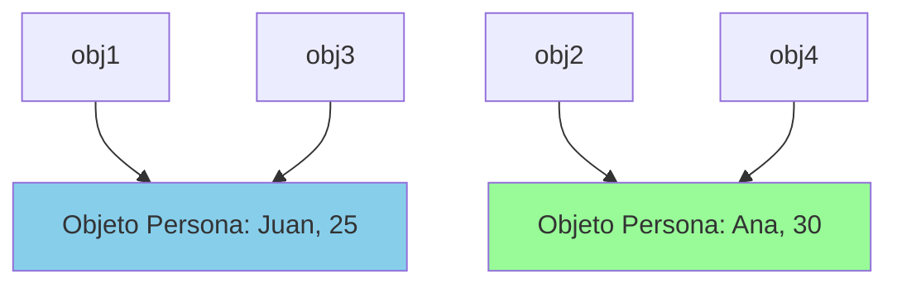

### 8.2 NullPointerException

Una de las excepciones más comunes en Java ocurre cuando intentamos acceder a miembros de una referencia `null`:

```java
public class ErrorExample {
    public static void main(String[] args) {
        Persona p; // Inicializada automáticamente a null
        
        // ❌ Esto provocará NullPointerException
        // System.out.println(p.getNombre());
        
        // ✅ Verificación correcta
        if (p != null) {
            System.out.println(p.getNombre());
        } else {
            System.out.println("La referencia es null");
        }
    }
}
```

> [!CAUTION]
> Siempre verifica que una referencia no sea `null` antes de usarla, especialmente cuando recibas objetos como parámetros o los obtengas de métodos que pueden devolver `null`. Para ello también es útil la librería `Objects`.

### 8.3 Pregunta: ¿Por qué falla este programa?

```java
class Test {
    public static void main(String[] args) {
        A a = new A();  
        a.print();
    }
}

class A {
    String s;

    A(String newS) {  
        s = newS;
    }

    public void print() {
        System.out.print(s);
    }
}
```

<details><summary>💻 Solución</summary>

- En `A a = new A();` se intenta invocar al constructor sin parámetros, que no existe

Posibles soluciones:

- Agregar un constructor sin argumentos a la clase `A`
- Pasar un argumento al constructor

</details>

## 9. Modificadores de acceso

### 9.1 Visibilidad entre clases

Java organiza las clases en **paquetes**. Según su ubicación, las clases pueden ser:

- **Clases vecinas**: Pertenecen al mismo paquete
- **Clases externas**: Están en paquetes diferentes

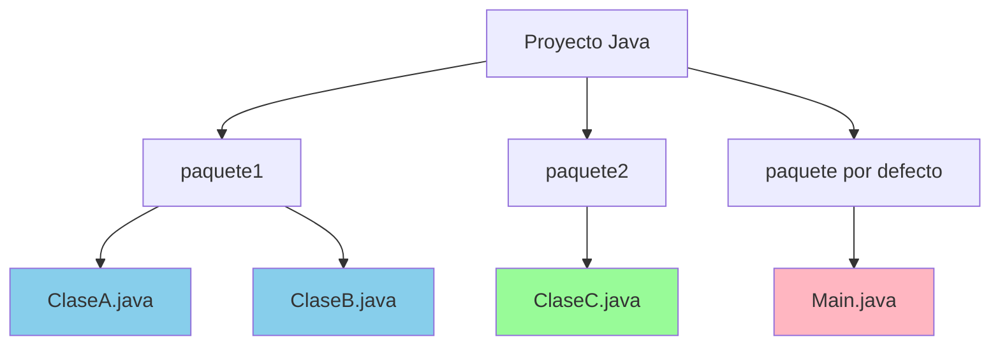

> [!IMPORTANT]
> En el gráfico anterior `ClaseA`y `ClaseB` son vecinas, sin embargo `ClaseB` y `ClaseC` no son vecinas.

**Modificadores para clases:**


| Modificador | Clases vecinas | Clases externas |
| :-- | :-- | :-- |
| **Sin modificador (default)** | ✅ Visible | ❌ No visible |
| **`public`** | ✅ Visible | ✅ Visible |

> [!NOTE]
> Cuando definimos una clase con el modificador `public` será accesible para cualquier otra clase, teniendo en cuenta que si la clase es externa (no vecina) será necesario que haga un `import` de la clase pública que quiere usar.

### 9.2 Visibilidad de miembros

- De igual manera que es posible modificar la visibilidad de una clase, podemos regular la visibilidad de sus miembros.

- Que un atributo sea visible significa que podemos acceder a él, tanto para leer como para modificarlo. Que un método sea visible significa que puede ser invocado.

- Para que un miembro sea visible es indispensable que su clase también lo sea.

- Cualquier miembro es siempre visible dentro de su propia clase, independientemente del modificador de acceso que tenga.

**Modificadores para miembros:**

- **Por defecto (default o package):** Cuando definimos un miembro sin especificar ningún modificador de acceso. Estos miembros serán visibles solo desde las clases vecinas.

- **Pública (public):** Cuando definimos un miembro con el modificador de acceso “public”. Será visible para cualquier otra clase, sea o no vecina.

- **Privada (private):** Cuando definimos un miembro con el modificador de acceso “private”. Será visible solo para la propia clase que los define (ni vecinas ni externas).

- **Protegida (protected):** Cuando definimos un miembro con el modificador de acceso “protected”. Estos miembros serán visibles para sus clases vecinas y para sus subclases aunque sean externas. (*Ampliaremos este concepto en la sigüiente unidad.*)


| Modificador | Propia clase | Clases vecinas | Clases externas |
| :-- | :-- | :-- | :-- |
| **`private`** | ✅ Visible | ❌ No visible | ❌ No visible |
| **Sin modificador (package)** | ✅ Visible | ✅ Visible | ❌ No visible |
| **`protected`** | ✅ Visible | ✅ Visible | ✅ Solo subclases |
| **`public`** | ✅ Visible | ✅ Visible | ✅ Visible |

```java
public class EjemploVisibilidad {
    private String datoPrivado;      // Solo en esta clase
    String datoPaquete;              // Clases del mismo paquete
    protected String datoProtegido;  // Paquete + subclases
    public String datoPublico;       // Todas las clases
    
    private void metodoPrivado() { }    // Solo en esta clase
    void metodoPaquete() { }            // Clases del mismo paquete
    protected void metodoProtegido() { } // Paquete + subclases
    public void metodoPublico() { }     // Todas las clases
}
```

### 9.3 Ejercicio: CompteCorrent (II)

**Enunciado:**
Modifica la visibilidad de la clase `CompteCorrent` para que sea visible desde clases externas y ajusta la visibilidad de sus miembros:

- `saldo`: No visible para otras clases
- `nombreTitular`: Visible para cualquier clase
- `dni`: Solo visible para clases vecinas
- Constructores y métodos: Visibles para cualquier clase

<details>
<summary>💻 Solución</summary>

```java
public class CompteCorrent {
    String dni;                    // Visible solo para clases vecinas
    public String nombreTitular;   // Visible para cualquier clase
    private double saldo;          // No visible para otras clases
    
    // Constructor público
    public CompteCorrent(String dni, String nombreTitular) {
        this.dni = dni;
        this.nombreTitular = nombreTitular;
        this.saldo = 0.0;
    }
    
    // Métodos públicos
    public boolean retirarDinero(double cantidad) {
        if (cantidad > 0 && cantidad <= saldo) {
            saldo -= cantidad;
            return true;
        }
        return false;
    }
    
    public void ingresarDinero(double cantidad) {
        if (cantidad > 0) {
            saldo += cantidad;
        }
    }
    
    public void mostrarInformacion() {
        System.out.println("=== INFORMACIÓN DE LA CUENTA ===");
        System.out.println("DNI del titular: " + dni);
        System.out.println("Nombre: " + nombreTitular);
        System.out.printf("Saldo: %.2f€\n", saldo);
    }
    
    // Getter para saldo (único acceso controlado)
    public double getSaldo() { return saldo; }
}
```

</details>

## 10. Métodos get y set

### 10.1 Principio de encapsulación


Hacer los atributos públicos presenta graves inconvenientes:

- **🔓 Pérdida de control**: No podemos validar los valores asignados
- **📖 Violación de encapsulación**: Se exponen detalles internos (no nos interesa que sea visible toda la estructura del objeto, solo cierta parte)
- **🛠️ Dificultad de mantenimiento**: Cambios internos afectan código externo

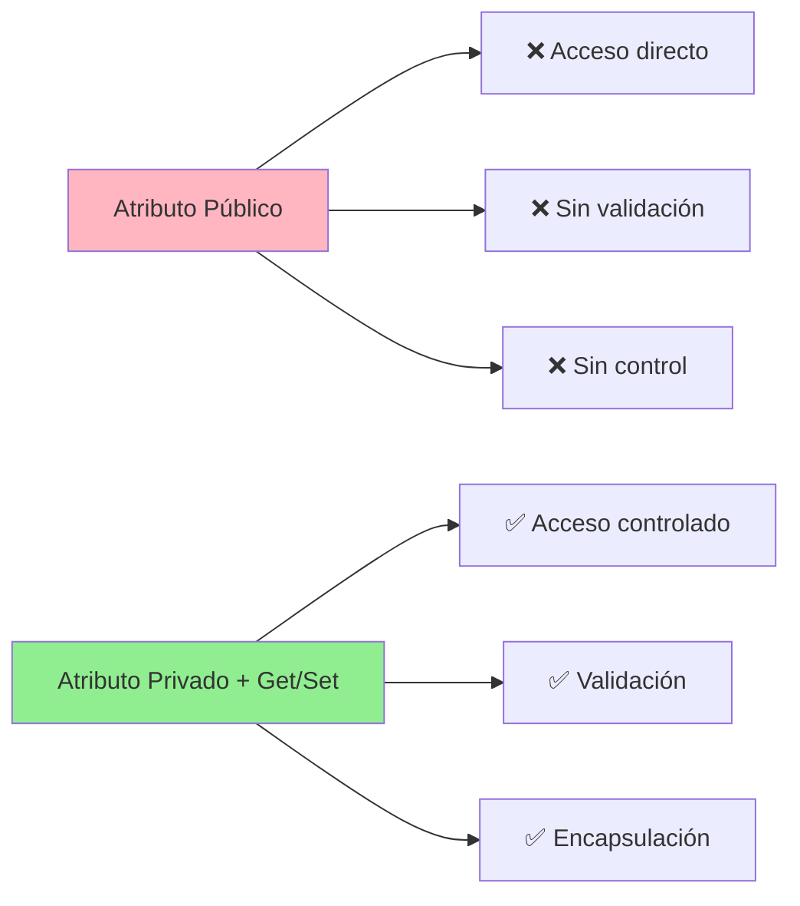

Por ese motivo existe una **convención** entre programadores que consiste en **ocultar los atributos**, y en su lugar crear dos métodos públicos para cada uno de los atributos a los que queramos dar visibilidad (habrá atributos con ambos, solo uno, o ninguno de los métodos get/set).

- El primer método, **set**, permitirá asignar un valor a un atributo, pudiendo validar o manipular este valor antes de ser asignado al atributo.

- El segundo, **get**, retorna el valor del atributo o bien alguna transformación del mismo (o copia defensiva).

### 10.2 Implementación de getters y setters

**Convención de nombres:**

- **Getter**: `get` + NombreAtributo (primera letra mayúscula)
- **Setter**: `set` + NombreAtributo (primera letra mayúscula)

> [!NOTE]
>
> Más adelante veremos que si trabajamos con objetos inmutables (data classes, records...) es habitual omitir el prefijo `get` para los métodos que retornan el valor de los atributos.

```java
public class Persona {
    private int edad;
    private String nombre;
    
    // Getter para edad
    public int getEdad() {
        return edad;
    }
    
    // Setter para edad con validación
    public void setEdad(int edad) {
        if (edad >= 0 && edad <= 150) {
            this.edad = edad;
        } else {
            System.out.println("Edad no válida: " + edad);
        }
    }
    
    // Getter para nombre
    public String getNombre() {
        return nombre;
    }
    
    // Setter para nombre con validación
    public void setNombre(String nombre) {
        if (nombre != null && !nombre.trim().isEmpty()) {
            this.nombre = nombre.trim();
        } else {
            System.out.println("Nombre no puede estar vacío");
        }
    }
}
```

### 10.3 Ejercicio: CompteCorrent (III)

**Enunciado:**
Modifica la clase para ocultar todos sus atributos. Implementa los métodos necesarios para:

- Leer los valores de `saldo`, `nombreTitular` y `dni`
- Modificar `nombreTitular` y `dni` (asegúrate de que el DNI tenga 9 caracteres)

<details>
<summary>💻 Solución</summary>

```java
public class CompteCorrent {
    private String dni;
    private String nombreTitular;
    private double saldo;
    
    public CompteCorrent(String dni, String nombreTitular) {
        setDni(dni);
        setNombreTitular(nombreTitular);
        this.saldo = 0.0;
    }
    
    // Getters
    public String getDni() {
        return dni;
    }
    
    public String getNombreTitular() {
        return nombreTitular;
    }
    
    public double getSaldo() {
        return saldo;
    }
    
    // Setters con validación
    public void setDni(String dni) {
        if (dni != null && dni.length() == 9) {
            this.dni = dni;
        } else {
            System.out.println("Error: El DNI debe tener exactamente 9 caracteres");
        }
    }
    
    public void setNombreTitular(String nombreTitular) {
        if (nombreTitular != null && !nombreTitular.trim().isEmpty()) {
            this.nombreTitular = nombreTitular.trim();
        } else {
            System.out.println("Error: El nombre no puede estar vacío");
        }
    }
    
    // Métodos operacionales
    public boolean retirarDinero(double cantidad) {
        if (cantidad > 0 && cantidad <= saldo) {
            saldo -= cantidad;
            return true;
        }
        return false;
    }
    
    public void ingresarDinero(double cantidad) {
        if (cantidad > 0) {
            saldo += cantidad;
        }
    }
    
    public void mostrarInformacion() {
        System.out.println("=== INFORMACIÓN DE LA CUENTA ===");
        System.out.println("DNI del titular: " + dni);
        System.out.println("Nombre: " + nombreTitular);
        System.out.printf("Saldo: %.2f€\n", saldo);
    }
}
```

</details>

## 11. Paso de objetos como parámetros

Los objetos se pasan como parámetros **por referencia**, lo que significa que el método recibe una copia de la referencia, no del objeto.

**Implicaciones importantes:**

- Los cambios realizados al objeto **sí se reflejan** en el objeto original
- Cambiar la referencia del parámetro **no afecta** la variable original

```java
public class EjemploPasoObjetos {
    public static void main(String[] args) {
        Persona persona = new Persona("Juan", 25, 1.88);
        
        System.out.println("Antes: " + persona.getNombre());
        modificarPersona(persona);
        System.out.println("Después: " + persona.getNombre());
        
        System.out.println("Referencia antes: " + persona);
        cambiarReferencia(persona);
        System.out.println("Referencia después: " + persona);
    }
    
    public static void modificarPersona(Persona p) {
        p.setNombre("Pedro"); // ✅ Esto SÍ modifica el objeto original
    }
    
    public static void cambiarReferencia(Persona p) {
        p = new Persona("Ana", 30, 1.74); // ❌ Esto NO afecta la referencia original
    }
}
```

**Salida esperada:**

```txt
Antes: Juan
Después: Pedro
Referencia antes: Persona@2a139f55
Referencia después: Persona@2a139f55
```

### 11.1 Preguntas

A continuación se presentan una serie de preguntas clave sobre el paso de objetos como parámetros, arrays, referencias y comportamiento de métodos en Java. Tras cada pregunta, encontrarás la solución dentro de un bloque desplegable `<details>` para que puedas intentar responder antes de consultar la explicación.

#### **Pregunta 1**

¿Cuál es la salida del siguiente código?

```java
public class Test {
    public static void main(String[] args) {
        Count myCount = new Count();
        int times = 0;
        for (int i = 0; i < 100; i++)
            increment(myCount, times);
        System.out.println("count is " + myCount.count);
        System.out.println("times is " + times);
    }
    public static void increment(Count c, int times) {
        c.count++;
        times++;
    }
}
class Count {
    public int count;
    public Count(int c) { count = c; }
    public Count() { count = 1; }
}
```

<details>
<summary>Ver solución</summary>

- `myCount.count` se incrementa 100 veces porque se pasa la referencia al objeto y se modifica su atributo.
- `times` no cambia, ya que se pasa por valor y los cambios no afectan a la variable original.

**Salida:**

```text
count is 101
times is 0
```

</details>

#### **Pregunta 2**

¿Cuál es la salida de este código?

```java
public class Test {
    public static void main(String[] args) {
        Circle circle1 = new Circle(1);
        Circle circle2 = new Circle(2);
        swap1(circle1, circle2);
        System.out.println("After swap1: circle1.radius = " + circle1.radius + " circle2.radius = " + circle2.radius);
        swap2(circle1, circle2);
        System.out.println("After swap2: circle1.radius = " + circle1.radius + " circle2.radius = " + circle2.radius);
    }
    public static void swap1(Circle x, Circle y) {
        Circle temp = x;
        x = y;
        y = temp;
    }
    public static void swap2(Circle x, Circle y) {
        double temp = x.radius;
        x.radius = y.radius;
        y.radius = temp;
    }
}
class Circle {
    double radius;
    Circle(double newRadius) { radius = newRadius; }
}
```

<details>
<summary>Ver solución</summary>

- `swap1` solo intercambia las referencias locales, no afecta a los objetos originales.
- `swap2` intercambia los valores de `radius` de los objetos referenciados.

**Salida:**

```text
After swap1: circle1.radius = 1.0 circle2.radius = 2.0
After swap2: circle1.radius = 2.0 circle2.radius = 1.0
```

</details>

### **Pregunta 3a**

¿Qué muestra el siguiente código?

```java
public class Test {
    public static void main(String[] args) {
        int[] a = {1, 2};
        swap(a[0], a[1]);
        System.out.println("a[0] = " + a[0] + " a[1] = " + a[1]);
    }
    public static void swap(int n1, int n2) {
        int temp = n1;
        n1 = n2;
        n2 = temp;
    }
}
```

<details>
<summary>Ver solución</summary>

- Los valores de `a` y `a[1]` no cambian porque se pasan por valor.

**Salida:**

```text
a[0] = 1 a[1] = 2
```

</details>

### **Pregunta 3b**

¿Y este otro?

```java
public class Test {
    public static void main(String[] args) {
        int[] a = {1, 2};
        swap(a);
        System.out.println("a[0] = " + a[0] + " a[1] = " + a[1]);
    }
    public static void swap(int[] a) {
        int temp = a[0];
        a[0] = a[1];
        a[1] = temp;
    }
}
```

<details>
<summary>Ver solución</summary>

- El array se pasa por referencia, por lo que los valores sí se intercambian.

**Salida:**

```text
a[0] = 2 a[1] = 1
```

</details>

### **Pregunta 3c**

¿Y este?

```java
public class Test {
    public static void main(String[] args) {
        T t = new T();
        swap(t);
        System.out.println("e1 = " + t.e1 + " e2 = " + t.e2);
    }
    public static void swap(T t) {
        int temp = t.e1;
        t.e1 = t.e2;
        t.e2 = temp;
    }
}
class T {
    int e1 = 1;
    int e2 = 2;
}
```

<details>
<summary>Ver solución</summary>

- Los atributos del objeto se intercambian correctamente.

**Salida:**

```text 
e1 = 2 e2 = 1
```

</details>

### **Pregunta 3d**

¿Y este?

```java
public class Test {
    public static void main(String[] args) {
        T t1 = new T();
        T t2 = new T();
        System.out.println("t1's i = " + t1.i + " and j = " + t1.j);
        System.out.println("t2's i = " + t2.i + " and j = " + t2.j);
    }
}
class T {
    static int i = 0;
    int j = 0;
    T() {
        i++;
        j = 1;
    }
}
```

<details>
<summary>Ver solución</summary>

- `i` es estático y se incrementa con cada objeto creado, `j` es de instancia.

**Salida:**

```text 
t1's i = 2 and j = 1
t2's i = 2 and j = 1
```

</details>

### **Pregunta 4a**

¿Qué muestra el siguiente código?

```java
import java.util.Date;
public class Test {
    public static void main(String[] args) {
        Date date = null;
        m1(date);
        System.out.println(date);
    }
    public static void m1(Date date) {
        date = new Date();
    }
}
```

<details>
<summary>Ver solución</summary>

- La referencia `date` en `main` sigue siendo `null`.

**Salida:**

```text
null
```

</details>

### **Pregunta 4b**

¿Y este?

```java
import java.util.Date;
public class Test {
    public static void main(String[] args) {
        Date date = new Date(1234567);
        m1(date);
        System.out.println(date.getTime());
    }
    public static void m1(Date date) {
        date = new Date(7654321);
    }
}
```

<details>
<summary>Ver solución</summary>

- La referencia original no cambia, sigue apuntando al objeto original.

**Salida:**

```text
1234567
```

</details>

### **Pregunta 4c**

¿Y este?

```java
import java.util.Date;
public class Test {
    public static void main(String[] args) {
        Date date = new Date(1234567);
        m1(date);
        System.out.println(date.getTime());
    }
    public static void m1(Date date) {
        date.setTime(7654321);
    }2
}
```

<details>
<summary>Ver solución</summary>

- Se modifica el objeto al que apunta la referencia.

**Salida:**

```text
7654321
```

</details>

### **Pregunta 4d**

¿Y este?

```java
import java.util.Date;
public class Test {
    public static void main(String[] args) {
        Date date = new Date(1234567);
        m1(date);
        System.out.println(date.getTime());
    }
    public static void m1(Date date) {
        date = null;
    }
}
```

<details>
<summary>Ver solución</summary>

- La referencia en `main` sigue apuntando al objeto original.

**Salida:**

```text
1234567
```

</details>

## 12. Ocultación de atributos

En Java, cuando una variable local en un método tiene el mismo nombre que un atributo de la clase, la variable local **oculta** al atributo dentro del ámbito de ese método. Esto puede provocar confusiones y errores difíciles de detectar, por lo que se recomienda el uso de la palabra reservada `this` para referirse explícitamente a los atributos de la clase.

### Ejemplo de ocultación de atributos

```java
public class Persona {
    int edad; // atributo de la clase

    void metodo() {
        double edad; // variable local que oculta al atributo
        edad = 8.2;
        System.out.println(edad); // Imprime el valor local, no el atributo de la clase
    }
}
```

En el ejemplo anterior, dentro del método `metodo()`, cualquier referencia a `edad` se refiere a la variable local, no al atributo de la clase.

### Reglas y buenas prácticas

- **Evita declarar variables locales con el mismo nombre que los atributos** salvo que sea necesario (por ejemplo, en los parámetros de un setter).
- **Utiliza siempre `this.` en los métodos de instancia** cuando accedas a atributos que puedan estar ocultos por variables locales o parámetros.
- **La ocultación de atributos solo ocurre dentro del ámbito del método** donde se declara la variable local o el parámetro.

## 13. La palabra reservada this

### 13.1 Usos de this

La palabra reservada **`this`** tiene dos usos principales:

1. **En métodos de instancia**: Referencia al objeto actual
2. **En constructores**: Llamada a otro constructor de la misma clase

#### Uso 1: Referencia al objeto actual

```java
public class Persona {
    private String nombre;
    private int edad;
    
    // Resolver conflicto de nombres
    public void setNombre(String nombre) {
        this.nombre = nombre; // this.nombre es el atributo, nombre es el parámetro
    }
    
    // Claridad en el código (recomendado siempre)
    public String getNombre() {
        return this.nombre; // Aunque no sea necesario, mejora la legibilidad
    }
    
    // Devolver la referencia al objeto actual (método fluido)
    public Persona setEdad(int edad) {
        this.edad = edad;
        return this; // Permite encadenar llamadas
    }
}
```

#### Uso 2: Llamada a otros constructores

```java
public class Persona {
    private String dni;
    private String nombre;
    private int edad;
    
    // Constructor principal
    public Persona(String dni, String nombre, int edad) {
        this.dni = dni;
        this.nombre = nombre;
        this.edad = edad;
    }
    
    // Constructor que usa el principal
    public Persona(String dni, String nombre) {
        this(dni, nombre, 0); // Llama al constructor principal
    }
    
    // Constructor por defecto
    public Persona() {
        this("00000000A", "Sin nombre"); // Llama al constructor anterior
    }
}
```

### 13.2 Práctica 4: Aplicación de this

**Objetivo:** Modificar la clase Persona anteponiendo `this` a todos los accesos a atributos.

<details>
<summary>💻 Solución</summary>

```java
public class Persona {
    private String dni;
    private String nombre;
    private int edad;
    
    public Persona(String dni, String nombre, int edad) {
        this.dni = dni;
        this.nombre = nombre;
        if (edad >= 0 && edad <= 150) {
            this.edad = edad;
        } else {
            this.edad = 0;
        }
    }
    
    public Persona() {

    }
    
    public void visualizar() {
        System.out.println("DNI.............: " + this.dni);
        System.out.println("Nombre..........: " + this.nombre);
        System.out.println("Edad............: " + this.edad);
    }
    
    // Getters
    public String getDni() { 
        return this.dni; 
    }
    
    public String getNombre() { 
        return this.nombre; 
    }
    
    public int getEdad() { 
        return this.edad; 
    }
    
    // Setters
    public void setDni(String dni) {
        this.dni = dni;
    }
    
    public void setNombre(String nombre) {
        this.nombre = nombre;
    }
    
    public void setEdad(int edad) {
        if (edad >= 0 && edad <= 150) {
            this.edad = edad;
        }
    }
}
```

</details>

### 13.3 Constructores de copia y método clonar

#### ¿Qué es un constructor de copia?

Un **constructor de copia** es un tipo especial de constructor que permite crear un nuevo objeto a partir de otro objeto ya existente de la misma clase. Su principal objetivo es duplicar el estado de un objeto, es decir, copiar todos los valores de sus atributos, de manera que el nuevo objeto sea independiente del original pero con los mismos datos en el momento de la copia.

**Características del constructor de copia:**

- Recibe como parámetro un objeto de la misma clase.
- Copia los valores de todos los atributos del objeto recibido.
- Permite crear "copias profundas" si los atributos son también objetos (requiere lógica adicional).
- Es muy útil cuando se desea duplicar un objeto sin que ambos compartan la misma referencia en memoria.

**Ejemplo:**

```java
public class Persona {
    private String dni;
    private String nombre;
    private int edad;

    // Constructor principal
    public Persona(String dni, String nombre, int edad) {
        this.dni = dni;
        this.nombre = nombre;
        this.edad = edad;
    }

    // Constructor de copia
    public Persona(Persona persona) {
        this(persona.dni, persona.nombre, persona.edad);
    }
}
```

De este modo, se puede crear una copia de un objeto `Persona` así:

```java
Persona original = new Persona("12345678A", "Ana", 30);
Persona copia = new Persona(original); // copia independiente
```

#### El método `clonar()`

Además del constructor de copia, es habitual definir un **método clonar** en la clase. Este método suele llamarse `clonar()` y devuelve un nuevo objeto, creado a partir del objeto actual, utilizando internamente el constructor de copia.

**Ventajas del método clonar:**

- Facilita la creación de copias desde cualquier objeto, sin necesidad de pasar el objeto como argumento.
- Permite una sintaxis más intuitiva: `Persona copia = original.clonar();`

**Ejemplo de implementación:**

```java
public class Persona {
    // ... atributos y constructores previos

    // Método clonar que usa el constructor de copia
    public Persona clonar() {
        return new Persona(this);
    }
}
```

**Uso:**

```java
Persona original = new Persona("12345678A", "Ana", 30);
Persona copia = original.clonar(); // copia independiente
```

#### Diferencias entre constructor de copia y método clonar

| Característica           | Constructor de copia                          | Método clonar                      |
|-------------------------|-----------------------------------------------|------------------------------------|
| **Forma de uso**        | `new Clase(objeto)`                           | `objeto.clonar()`                  |
| **Parámetro**           | Recibe un objeto de la misma clase            | No recibe parámetros               |
| **Propósito**           | Crear una copia a partir de cualquier objeto  | Crear una copia del propio objeto  |
| **Flexibilidad**        | Permite copiar cualquier objeto               | Solo se puede usar desde un objeto |
| **Internamente**        | Puede ser usado por otros métodos de la clase | Suele invocar al constructor copia |

**Resumen:**

- El **constructor de copia** es útil cuando queremos crear una copia de un objeto a partir de otro cualquiera.
- El **método clonar** es más cómodo cuando ya tenemos un objeto y queremos duplicarlo fácilmente, sin tener que pasar el propio objeto como argumento.

Ambos mecanismos son complementarios y, juntos, facilitan la gestión de copias y la independencia de objetos en Java.

### 13.4 Prácticas 5-7: Extensión de la clase Persona

#### **Práctica 5: Uso del método clonar**

**Enunciado:**
Amplía el método `main` que tienes en este momento para que se cree una persona a partir de otra, haciendo uso del método `clonar`. Comprueba que funciona correctamente mostrando los valores de la nueva persona creada.

Crea también una nueva persona haciendo uso directamente del constructor copia y muestra los atributos de la persona creada.

<details>
<summary>Ver solución</summary>

```java
public class TestPersonaClonar {
    public static void main(String[] args) {
        // Crear persona original
        Persona p1 = new Persona("12345678A", "Pepe Gotera", 33);

        // Crear persona usando el constructor copia
        Persona p2 = new Persona(p1);

        // Crear persona usando el método clonar
        Persona p3 = p1.clonar();

        System.out.println("Persona original:");
        p1.visualizar();

        System.out.println("\nPersona copiada con constructor:");
        p2.visualizar();

        System.out.println("\nPersona clonada con método:");
        p3.visualizar();

        // Comprobar si son objetos distintos
        System.out.println("\n¿p1 y p2 son el mismo objeto? " + (p1 == p2));
        System.out.println("¿p1 y p3 son el mismo objeto? " + (p1 == p3));
    }
}
```

> [!WARNING]
>
> - El método `visualizar()` debe estar implementado en la clase `Persona` para mostrar los atributos.
> - Tanto el constructor copia como el método `clonar()` crean objetos independientes con los mismos datos.

</details>

#### **Práctica 6: Constructor combinado**

**Enunciado:**
Crea un nuevo constructor en la clase `Persona` que permita crear una nueva persona a partir de otras dos. En este caso, el DNI y el nombre de la nueva persona serán los de la primera persona, y la edad la de la segunda persona.

<details>
<summary>Ver solución</summary>

```java
public class Persona {
    private String dni;
    private String nombre;
    private int edad;

    // Constructor principal
    public Persona(String dni, String nombre, int edad) {
        this.dni = dni;
        this.nombre = nombre;
        this.edad = edad;
    }

    // Constructor copia
    public Persona(Persona persona) {
        this(persona.dni, persona.nombre, persona.edad);
    }

    // Constructor combinado (Práctica 6)
    public Persona(Persona persona1, Persona persona2) {
        this(persona1.dni, persona1.nombre, persona2.edad);
    }

    // ... resto de la clase
}
```

</details>

#### **Práctica 7: Método clonar con parámetro**

**Enunciado:**
Crea una nueva versión del método `clonar` en la clase `Persona` que utilice el constructor combinado de la práctica anterior. En este caso, la persona que ejecuta el método será la que aporte el DNI y el nombre, y la persona recibida como parámetro aportará la edad. Invoca este método desde el `main` y comprueba que funciona correctamente.

<details>
<summary>Ver solución</summary>

```java
public class Persona {
    // ... atributos y constructores previos

    // Método clonar sin parámetros (ya implementado)
    public Persona clonar() {
        return new Persona(this);
    }

    // Método clonar con parámetro (Práctica 7)
    public Persona clonar(Persona otraPersona) {
        return new Persona(this, otraPersona);
    }
}

// Ejemplo de uso en el main:
public class TestPersonaClonarAvanzado {
    public static void main(String[] args) {
        Persona p1 = new Persona("12345678A", "Pepe Gotera", 33);
        Persona p2 = new Persona("87654321B", "Juan López", 45);

        // Clonar p1 usando la edad de p2
        Persona p3 = p1.clonar(p2);

        System.out.println("Persona original p1:");
        p1.visualizar();

        System.out.println("\nPersona original p2:");
        p2.visualizar();

        System.out.println("\nPersona clonada (DNI y nombre de p1, edad de p2):");
        p3.visualizar();
    }
}
```

</details>

### 13.5 Ejercicios: CompteCorrent (IV y V)

#### Ejercicio IV: Sobrecarga de constructores

**Enunciado:**
Sobrecarga el constructor de `CompteCorrent` para poder crear objetos con:

- DNI, nombre del titular y saldo inicial
- DNI del titular y saldo inicial

<details>
<summary>💻 Solución</summary>

```java
public class CompteCorrent {
    private String dni;
    private String nombreTitular;
    private double saldo;
    
    // Constructor completo
    public CompteCorrent(String dni, String nombreTitular, double saldoInicial) {
        this.dni = dni;
        this.nombreTitular = nombreTitular;
        this.saldoInicial = saldoInicial;
    }
    
    // Constructor original sin saldo
    public CompteCorrent(String dni, String nombreTitular) {
        this(dni, nombreTitular, 0.0);
    }
    
    // Constructor solo con DNI y saldo
    public CompteCorrent(String dni, double saldoInicial) {
        this(dni, "Titular no especificado", saldoInicial);
    }
    
    // ... resto de métodos igual que antes
}
```

</details>

#### Ejercicio V: Clase Gestor

**Enunciado:**
Existen gestores que administran los cuentas bancarias y atienden a sus propietarios. Cada cuenta tiene un único gestor (o ninguno). Diseña la clase `Gestor` de la cual interesa guardar su nombre, teléfono y el importe máximo autorizado con el que puede operar. Respecto a los gestores existen las siguientes restricciones:

- Un gestor siempre tendrá un nombre y un teléfono.
- Si no se asigna, el importe máximo autorizado por operación será de 10.000 euros.
- Un gestor, después de ser creado, no podrá cambiar su número de teléfono y todo el mundo podrá consultarlo.
- El nombre del gestor será público y el importe máximo solo será visible para clases vecinas.
- Modifica la clase `CompteCorrent` para que pueda disponer de un objeto `Gestor`.
- Escribe los métodos necesarios.

<details>
<summary>Ver solución</summary>

```java
// Clase Gestor
public class Gestor {
    public String nombre;              // Público
    private final String telefono;     // No se puede cambiar después de creado
    double importeMaximo;              // Visible para clases vecinas (default)

    // Constructor principal
    public Gestor(String nombre, String telefono, double importeMaximo) {
        this.nombre = nombre;
        this.telefono = telefono;
        this.importeMaximo = importeMaximo;
    }

    // Constructor sin importe máximo (por defecto 10000)
    public Gestor(String nombre, String telefono) {
        this(nombre, telefono, 10000.0);
    }

    // Getter para teléfono (solo lectura)
    public String getTelefono() {
        return telefono;
    }

    public void mostrarInformacion() {
        System.out.println("Gestor: " + nombre);
        System.out.println("Teléfono: " + telefono);
        System.out.println("Importe máximo autorizado: " + importeMaximo + "€");
    }
}

// Modificación en CompteCorrent para incluir un gestor
public class CompteCorrent {
    private String dni;
    private String nombreTitular;
    private double saldo;
    private Gestor gestor; // Nuevo atributo

     // Nuevo constructor para asignar gestor
    public CompteCorrent(String dni, String nombreTitular, double saldo, Gestor gestor) {
        this.dni = dni;
        this.nombreTitular = nombreTitular;
        this.saldo = saldo;
        this.gestor = gestor;
    }

    // Se pueden hacer todos los constructores más pequeños que reutilicen el anterior
    public CompteCorrent(String dni, String nombreTitular) {
        this(dni, nombreTitular, 0.0, null);
    }


    // Métodos get y set para gestor
    public Gestor getGestor() {
        return gestor;
    }

    public void setGestor(Gestor gestor) {
        this.gestor = gestor;
    }

    // Resto de métodos igual que antes
    public boolean retirarDinero(double cantidad) {
        if (cantidad > 0 && cantidad <= saldo) {
            saldo -= cantidad;
            return true;
        }
        return false;
    }

    public void ingresarDinero(double cantidad) {
        if (cantidad > 0) {
            saldo += cantidad;
        }
    }

    public void mostrarInformacion() {
        System.out.println("=== INFORMACIÓN DE LA CUENTA ===");
        System.out.println("DNI del titular: " + dni);
        System.out.println("Nombre: " + nombreTitular);
        System.out.printf("Saldo: %.2f€\n", saldo);
        if (gestor != null) {
            gestor.mostrarInformacion();
        } else {
            System.out.println("No hay gestor asignado.");
        }
    }
}
```

**Notas:**

- El teléfono del gestor es `final` y solo puede leerse mediante un getter.
- El importe máximo es visible solo para clases vecinas (sin modificador).
- El nombre es público.
- La clase `CompteCorrent` puede tener o no un gestor, y se han añadido los métodos necesarios para gestionarlo.

</details>

## 14. Inmutabilidad

### 14.1 ¿Qué es un objeto inmutable?

Un **objeto inmutable** es aquel cuyo estado no puede cambiar después de haber sido creado. Es decir, una vez inicializados sus atributos, no existe ningún método que permita modificarlos. Si se desea un nuevo valor, hay que crear un nuevo objeto. El uso de objetos inmutables es ampliamente aceptado como una buena estrategia para la creación de código simple y confiable.

**Ejemplos en Java:**

- `String`
- Clases envolventes como `Integer`, `Double`, `Boolean`
- Algunas clases de la API de fechas (`LocalDate`, `LocalTime`, `LocalDateTime`)

### 14.2 Ventajas de la inmutabilidad

| Característica | Beneficio | Explicación |
| :-- | :-- | :-- |
| **Thread-safe automático** | Concurrencia segura | No pueden ser alterados por interferencia entre hilos |
| **Fáciles de probar** | Testing simplificado | Su estado es predecible y constante |
| **No requieren constructor de copia** | Simplicidad | El objeto original puede compartirse sin riesgo |
| **No necesitan implementar `clone()`** | Menos código | No hay necesidad de duplicar objetos |
| **Funcionan como caché** | Rendimiento | Pueden almacenar su propio valor de retorno |
| **No requieren copia defensiva** | Eficiencia | No necesitan protegerse contra modificaciones externas |
| **Ideales para claves en HashMap** | Colecciones seguras | Su hashCode no cambiará nunca |
| **Estado invariante** | Robustez | No requieren validaciones constantes |
| **Manejo de excepciones limpio** | Seguridad | Nunca quedan en estado indeterminado |

### 14.3 Características de una clase inmutable

Para que una clase sea inmutable debe cumplir:

1. Todos los atributos son `final` y `private`.
2. No existen métodos `set` ni ningún método que modifique el estado.
3. Si algún atributo es un objeto mutable, debe devolverse una **copia defensiva** (no la referencia original).
4. No debe permitir que subclases puedan modificar el comportamiento (puede ser `final` la clase).

### 14.4 Ejemplo: Clase inmutable

```java
public final class Punto {
    private final int x;
    private final int y;

    public Punto(int x, int y) {
        this.x = x;
        this.y = y;
    }

    public Punto(Punto otro){
        this(otro.x, otro.y);
    }

    public int getX() { return x; }
    public int getY() { return y; }

    // No existen métodos setX ni setY
    // Si se necesita un nuevo punto, se crea otro objeto
}
```

**Uso:**

```java
Punto p1 = new Punto(3, 4);
// p1.setX(5); // ❌ No existe este método
Punto p2 = new Punto(5, 4); // Se crea un nuevo objeto
```

### 14.5 Ejemplo: String es inmutable

```java
String s1 = "Hola";
String s2 = s1.concat(" mundo");
System.out.println(s1); // "Hola"
System.out.println(s2); // "Hola mundo"
```

El método `concat` no modifica `s1`, sino que devuelve un nuevo objeto.

### 14.6 Cómo crear una clase inmutable

**Pasos:**

1. **Declarar la clase como `final`** - Evita que sea extendida
2. **Hacer todos los atributos `private` y `final`** - No pueden ser modificados
3. **No proporcionar métodos setter** - Solo getters
4. **Inicializar todos los atributos en el constructor** - Estado completo desde creación
5. **Devolver copias defensivas** - Si los atributos son objetos mutables
6. **Asegurar que los métodos no modifican el objeto** - Devuelven nuevas instancias si es necesario

**Ejemplo con copia defensiva:**

```java
public final class Persona {
    private final String nombre;
    private final Date fechaNacimiento;

    public Persona(String nombre, Date fechaNacimiento) {
        this.nombre = nombre;
        // Copia defensiva para evitar mutabilidad externa
        this.fechaNacimiento = new Date(fechaNacimiento.getTime());
    }

    public String getNombre() { return nombre; }

    public Date getFechaNacimiento() {
        // Devuelve una copia, no la referencia original
        return new Date(fechaNacimiento.getTime());
    }
}
```

### 14.7 Resumen de ventajas e inconvenientes

**✅ Ventajas:**

- **Seguridad en concurrencia**: No necesitan sincronización
- **Simplificación del código**: Menos comprobaciones y validaciones
- **Facilidad de depuración**: Estado predecible
- **Reutilización segura**: Se pueden compartir sin copia
- **Mejor para testing**: Comportamiento determinista

**⚠️ Inconvenientes:**

- **Creación de objetos adicionales**: Cada "modificación" crea una nueva instancia
- **Uso de memoria**: Pueden acumularse muchas instancias
- **Rendimiento**: En casos de muchas "modificaciones" puede ser más lento

> [!TIP]
> Los objetos inmutables son especialmente útiles en programación funcional y cuando necesitas garantías sobre el estado de los objetos a lo largo del tiempo.

## 15. Asociación entre clases

### 15.1 ¿Qué es la asociación?

La **asociación** es una relación entre dos o más clases que indica que sus objetos pueden interactuar entre sí. Es el vínculo más general entre clases y puede ser de varios tipos según la naturaleza de la relación.

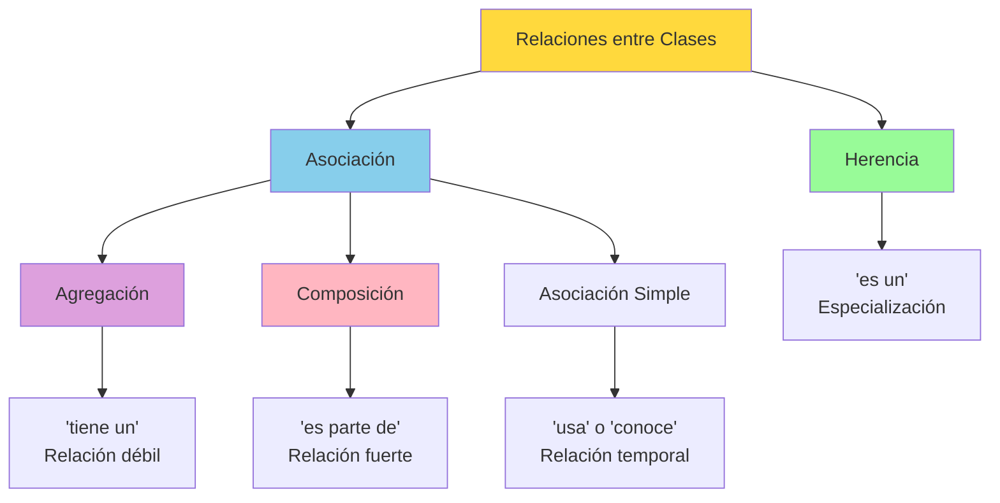

**Resumen de relaciones:**

- **Herencia**: "es un" - Una clase extiende otra clase
- **Agregación**: "tiene un" - Composición débil, objetos independientes
- **Composición**: "es parte de" - Composición fuerte, ciclo de vida dependiente
- **Asociación simple**: "usa" o "conoce" - Relación temporal o de uso

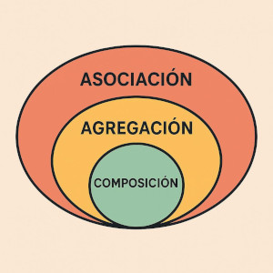

### 15.2 Asociación simple

La **asociación simple** es la relación más básica entre clases donde una clase **utiliza** o **conoce** a otra clase, pero sin una dependencia de ciclo de vida. Las clases pueden existir independientemente y la relación es temporal o funcional.

**Ejemplo:**

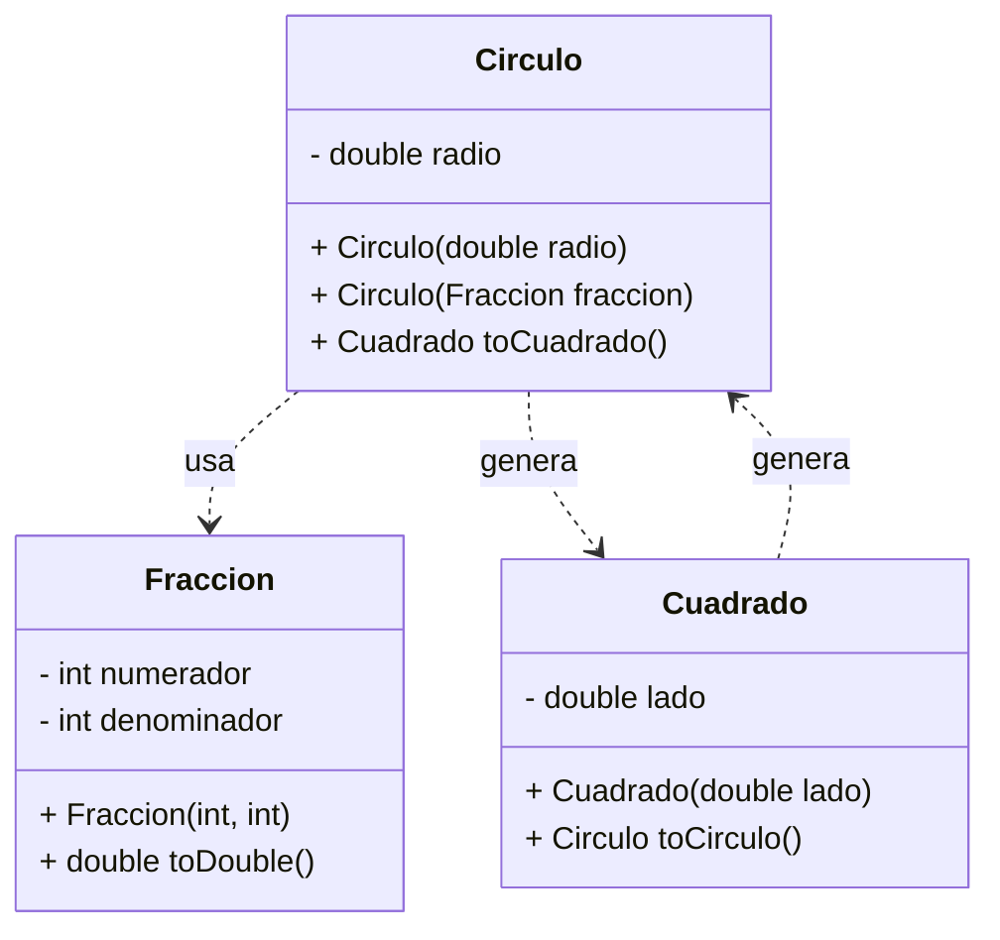

```java
public class Circulo {
    private double radio;

    // 🔗 ASOCIACIÓN 1: Circulo "usa" Fraccion
    public Circulo(Fraccion fraccion) {
        this.radio = fraccion.toDouble();
    }

    // 🔗 ASOCIACIÓN 2: Circulo "conoce" Cuadrado  
    public Cuadrado toCuadrado() {
        return new Cuadrado(this.radio);
    }
}
```

#### 1. **Círculo ← Fracción** (Asociación de entrada)

```java
public Circulo(Fraccion fraccion) {
    this.radio = fraccion.toDouble();
}
```

**Características:**

- El **Círculo** puede ser creado a partir de una **Fracción**
- La **Fracción** existe independientemente del **Círculo**
- Es una **relación de uso**: "Círculo usa Fracción para inicializarse"
- **No hay dependencia de ciclo de vida**: Si el Círculo se destruye, la Fracción original sigue existiendo

#### 2. **Círculo → Cuadrado** (Asociación de salida)

```java
public Cuadrado toCuadrado() {
    return new Cuadrado(this.radio);
}
```

**Características:**

- El **Círculo** puede generar un **Cuadrado**
- Ambos objetos son **independientes** después de la creación
- Es una **relación de transformación**: "Círculo conoce cómo crear Cuadrado"
- **Relación temporal**: Se ejecuta solo cuando se invoca el método


### 15.3 Agregación

La **agregación** o **composición débil** es una forma especial de asociación que indica que una clase "tiene un/a" objeto de otra clase, pero ambos pueden existir de manera independiente. Es decir, la vida del objeto contenido **no depende** de la vida del objeto contenedor.

En otras palabras:

- La agregación modela relaciones "parte-todo" donde las partes pueden existir fuera del todo.
- Si el objeto contenedor se destruye, los objetos agregados pueden seguir existiendo.
- Se representa en UML con un **diamante blanco** en el extremo del “todo”.

**Ejemplo:**

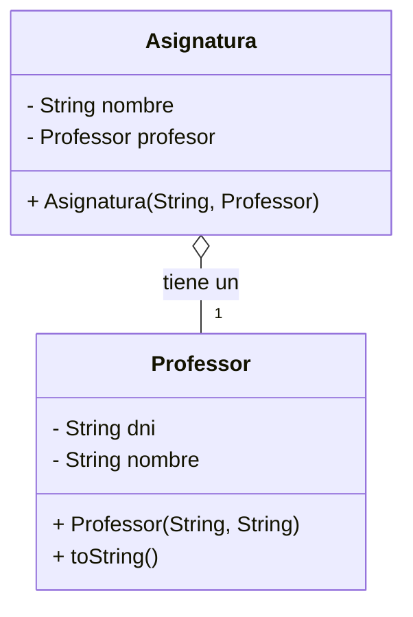

```java
public class Asignatura {
    private String nombre;
    private Professor profesor;

    public Asignatura(String nombre, Professor profesor) {
        this.nombre = nombre;
        this.profesor = profesor;
    }
}

public class Professor {
    private String dni;
    private String nombre;

    public Professor(String dni, String nombre) {
        this.dni = dni;
        this.nombre = nombre;
    }

    @Override
    public String toString() {
        return "Professor{" +
               "dni='" + dni + '\'' +
               ", nombre='" + nombre + '\'' +
               '}';
    }
}

public class TestAsignatura {
    public static void main(String[] args) {
        Professor miProfe = new Professor("79845125D", "Antonio López");
        Asignatura asignatura1 = new Asignatura("Matemáticas", miProfe);
        asignatura1 = null;
        System.out.println(miProfe);
    }
}
```

#### 1. **Asignatura ← Professor** (Relación "tiene un")

```java
public class Asignatura {
    private Professor profesor;  // Asignatura "tiene un" Professor
}
```

**Características identificadas:**

- La **Asignatura** contiene una referencia a un **Professor**
- El **Professor** existe independientemente de la **Asignatura**
- Es una **relación de pertenencia**: "Asignatura tiene un Professor"
- **No hay dependencia de ciclo de vida**: El Professor puede existir sin la Asignatura

#### 2. **Independencia de objetos**

El código de prueba demuestra perfectamente la independencia:

```java
public class TestAsignatura {
    public static void main(String[] args) {
        Professor miProfe = new Professor("79845125D", "Antonio López");
        Asignatura asignatura1 = new Asignatura("Matemáticas", miProfe);
        
        asignatura1 = null;  // 🗑️ "Destruimos" la asignatura
        
        System.out.println(miProfe);  // ✅ El professor sigue existiendo
    }
}
```

**Salida esperada:**

```text
Professor{dni='79845125D', nombre='Antonio López'}
```

#### Ventajas de la agregación en este ejemplo

✅ **Reutilización**: Un profesor puede enseñar múltiples asignaturas
✅ **Flexibilidad**: Se pueden crear asignaturas con diferentes profesores
✅ **Independencia**: El profesor existe independientemente de las asignaturas
✅ **Mantenimiento**: Cambios en el profesor se reflejan en todas sus asignaturas
✅ **Economía de recursos**: No se duplican objetos profesor

### 15.4 Composición

La **composición** o **composición fuerte** es una forma fuerte de asociación donde la vida de la clase contenida debe coincidir con la vida de la clase contenedora. Los componentes constituyen una **parte integral** del objeto compuesto y no pueden existir independientemente.

En otras palabras:

- La composición modela relaciones "parte-todo" donde las partes NO pueden existir fuera del todo.
- Si el objeto contenedor se destruye, los objetos agregados también.
- Se representa en UML con un **diamante relleno** en el extremo del “todo”.

**Ejemplos:**

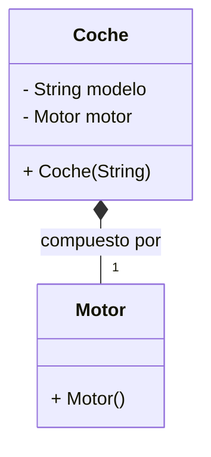

```java
// EJEMPLO 1: Coche "está compuesto por" Motor
public class Coche {
    private Motor motor;  // 🔗 COMPOSICIÓN: El motor es PARTE del coche
    
    public Coche(String modelo) {
        this.motor = new Motor();  // El motor se crea CON el coche
    }
}
```

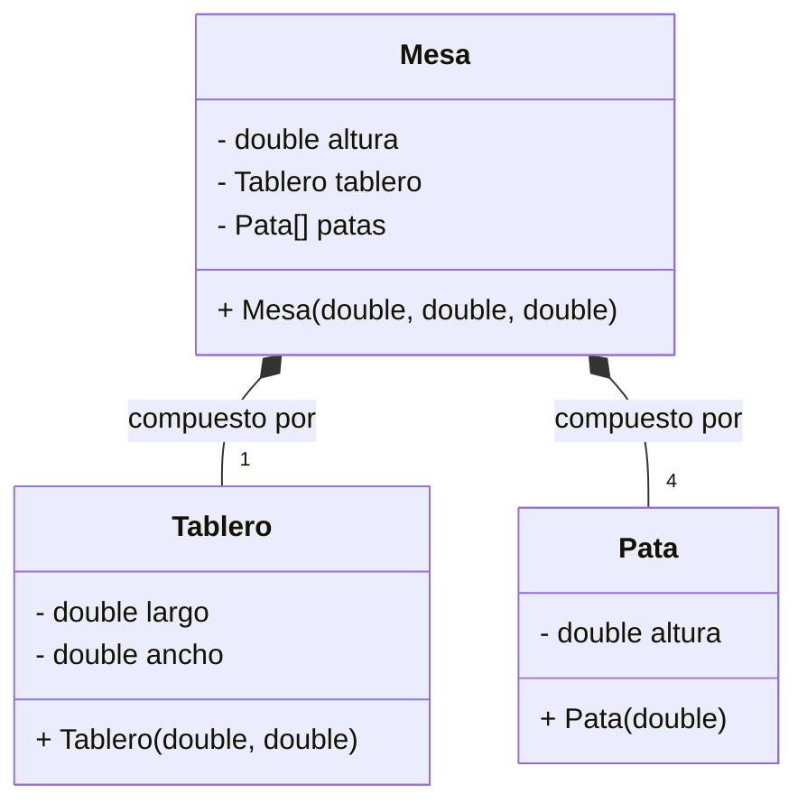

```java
// EJEMPLO 2: Mesa "está compuesta por" Tablero y Patas
public class Mesa {
    private double altura;
    private Tablero tablero;  // 🔗 COMPOSICIÓN: Tablero es PARTE de la mesa
    private Pata[] patas;      // 🔗 COMPOSICIÓN: Patas son PARTE de la mesa
    
    public Mesa(double altura, double largo, double ancho) {
        this.altura = altura;
        this.tablero = new Tablero(largo, ancho);  // Se crean CON la mesa
        this.patas = new Pata[4];
        for(int i = 0; i < patas.length; i++) {
            patas[i] = new Pata(altura);  // Se crean CON la mesa
        }
    }
}

public class TestMesa {
    public static void main(String[] args) {
        Mesa miMesa = new Mesa(0.8, 1.2, 0.6);  // Se crean: Mesa + Tablero + 4 Patas
        
        miMesa = null;  // 💀 Se "destruye" la mesa
        
        /*
         * RESULTADO: 
         * - La Mesa queda sin referencia
         * - El Tablero queda sin referencia (solo la Mesa lo referencía)
         * - Las 4 Patas quedan sin referencia (solo la Mesa las referencía)
         * - El Garbage Collector eliminará TODOS los objetos
         */
    }
}
```

#### 1. **Coche ◆ Motor** (Relación "es parte de")

**Características identificadas:**

- El **Motor** se crea **dentro** del constructor del **Coche**
- No existe un motor independiente, se genera específicamente para ese coche
- Es una **relación de dependencia total**: Sin coche no hay motor
- **Ciclo de vida dependiente**: Cuando se destruye el coche, se destruye el motor

#### 2. **Mesa ◆ Tablero + Patas** (Composición múltiple)

**Características identificadas:**

- El **Tablero** y las **Patas** se crean **dentro** del constructor de la **Mesa**
- Los componentes no existen fuera del contexto de la mesa
- Es una **relación estructural**: Los componentes forman la estructura física de la mesa
- **Destrucción en cascada**: Como demuestra el ejemplo, al asignar `mesa = null`, todos los componentes quedan sin referencia

#### Diferencias con la Agregación

| Aspecto | Agregación (Asignatura/Professor) | Composición (Mesa/Tablero/Patas) |
| :-- | :-- | :-- |
| **Tipo de relación** | "tiene un" (posesión) | "es parte de" (estructura) |
| **Ciclo de vida** | Independiente | Dependiente |
| **Creación** | Se recibe por parámetro | Se crea internamente |
| **Destrucción** | Componente sobrevive | Componente se destruye |
| **Compartición** | Puede ser compartido | No se puede compartir |
| **Ejemplo** | `Asignatura(Professor profesor)` | `Mesa() { tablero = new Tablero(); }` |

#### Ventajas de la composición en estos ejemplos

- ✅ **Encapsulación fuerte**: Los componentes están completamente encapsulados
- ✅ **Control total**: La clase contenedora controla completamente el ciclo de vida
- ✅ **Integridad**: No hay riesgo de modificaciones externas a los componentes
- ✅ **Simplicidad**: No hay que gestionar dependencias externas
- ✅ **Coherencia**: Los componentes están diseñados específicamente para el contenedor

> [!IMPORTANT]
> En Java, la diferencia entre agregación y composición es conceptual. El lenguaje no impone restricciones, pero el diseño y la documentación deben reflejar la intención.

<p align="center">📚 <em>Fin del apartado UT5.2 - Programación Orientada a Objetos en Java</em></p>