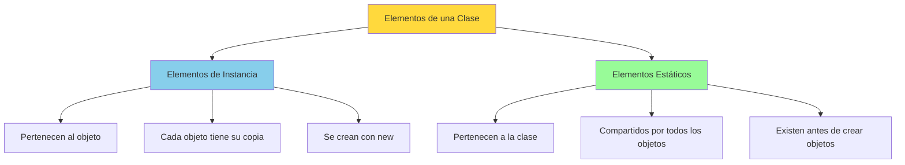

# UT5.3 Elementos Estáticos de una Clase

## 📋 Índice de contenidos

1. [Introducción a los elementos estáticos](#1-introducci%C3%B3n-a-los-elementos-est%C3%A1ticos)
2. [Métodos estáticos](#2-m%C3%A9todos-est%C3%A1ticos)
    1. [Declaración y acceso](#21-declaraci%C3%B3n-y-acceso)
    2. [Utilidad de los métodos estáticos](#22-utilidad-de-los-m%C3%A9todos-est%C3%A1ticos)
    3. [Restricciones de los métodos estáticos](#23-restricciones-de-los-m%C3%A9todos-est%C3%A1ticos)
3. [Atributos estáticos](#3-atributos-est%C3%A1ticos)
    1. [Concepto y características](#31-concepto-y-caracter%C3%ADsticas)
    2. [Ejemplo práctico](#32-ejemplo-pr%C3%A1ctico)
    3. [Casos de uso](#33-casos-de-uso)
4. [Ejercicio: Bombeta](#4-ejercicio-bombeta)

## 1. Introducción a los elementos estáticos

En Java es posible declarar métodos y variables que pertenecen a la **CLASE** en lugar de al objeto individual. Esto se consigue con el modificador **`static`**.



> [!IMPORTANT]
> Los elementos estáticos existen desde el momento en que se carga la clase en memoria, independientemente de si se han creado objetos de esa clase.

## 2. Métodos estáticos

### 2.1 Declaración y acceso

Los métodos estáticos se declaran incluyendo la palabra **`static`** inmediatamente después del modificador de visibilidad.

**Sintaxis:**

```java
public static tipoRetorno nombreMetodo(parametros) {
    // Implementación del método
}
```

**Acceso:**
Los métodos estáticos se invocan usando el **nombre de la clase** en lugar de una instancia de objeto:

```java
public class Utilidades {
    public static int suma(int a, int b) {
        return a + b;
    }
    
    public static void mostrarMensaje(String mensaje) {
        System.out.println("Mensaje: " + mensaje);
    }
}

// Uso de métodos estáticos
int resultado = Utilidades.suma(5, 3);
Utilidades.mostrarMensaje("Hola mundo");
```

> [!CAUTION]
>
> También se pueden acceder a métodos y atributos estáticos a partir de un objeto creado, pero esto no es recomendable, y el IDE avisará de ello.

### 2.2 Utilidad de los métodos estáticos

Los métodos estáticos son útiles para operaciones que:

- **No dependen del estado de un objeto específico**
- **Realizan cálculos independientes** basados únicamente en sus parámetros
- **Proporcionan utilidades generales** que pueden usarse sin crear objetos

**Ejemplo: Clase Math**
La clase `Math` es un excelente ejemplo de uso de métodos estáticos:

```java
public class Math {
    public static double abs(double d) { /* ... */ }
    public static double sqrt(double d) { /* ... */ }
    public static double pow(double base, double exp) { /* ... */ }
    public static double random() { /* ... */ }
    // ... más métodos estáticos
}

// Uso
double resultado = Math.sqrt(16);        // 4.0
double potencia = Math.pow(2, 3);        // 8.0
double aleatorio = Math.random();        // 0.0 - 1.0
```

### 2.3 Restricciones de los métodos estáticos

Los métodos estáticos tienen importantes **limitaciones**:

> [!WARNING]
> **Restricción principal:** Un método estático **NO PUEDE** referenciar directamente atributos o métodos de instancia (no estáticos) de la clase.

```java
public class Ejemplo {
    private String nombre;              // Atributo de instancia
    private static int contador = 0;    // Atributo estático
    
    public void metodoInstancia() {
        // Los métodos de instancia pueden acceder a TODO
        System.out.println(nombre);     // ✅ OK
        System.out.println(contador);   // ✅ OK
    }
    
    public static void metodoEstatico() {
        // Los métodos estáticos tienen restricciones
        // System.out.println(nombre);  // ❌ ERROR - no puede acceder a atributos de instancia
        System.out.println(contador);   // ✅ OK - puede acceder a atributos estáticos
        
        // Pero SÍ puede crear objetos
        Ejemplo obj = new Ejemplo();
        System.out.println(obj.metodoInstancia()); // ✅ OK - accede a través de un objeto
    }
}
```

## 3. Atributos estáticos

### 3.1 Concepto y características

Los **atributos estáticos** son variables que pertenecen a la clase en lugar de a instancias individuales. Se caracterizan por:

- **🔗 Compartidos**: Todas las instancias comparten la misma variable
- **🏭 Únicos**: Solo existe una copia en memoria
- **⚡ Acceso directo**: Se pueden acceder usando el nombre de la clase

**Declaración:**

```java
public class Contador {
    private static int numeroInstancias = 0;  // Atributo estático
    private int id;                          // Atributo de instancia
    
    public Contador() {
        numeroInstancias++;    // Se incrementa para cada objeto creado
        id = numeroInstancias; // Cada objeto tiene su propio ID
    }
    
    public static int getNumeroInstancias() {
        return numeroInstancias;
    }
    
    public int getId() {
        return id;
    }
}
```

> [!IMPORTANT]
>
> - Los atributos estáticos son los **ÚNICOS** que se inicializan directamente al ser declarados, y no en el constructor.
> - Recuerda que los atributos de instancia **SIEMPRE** se deben inicializar en el constructor, y no directamente en su declaración.

### 3.2 Ejemplo práctico

```java
public class DemoAtributosEstaticos {
    public static void main(String[] args) {
        System.out.println("Instancias creadas: " + Contador.getNumeroInstancias());
        
        Contador c1 = new Contador();
        Contador c2 = new Contador();
        Contador c3 = new Contador();
        
        System.out.println("Instancias creadas: " + Contador.getNumeroInstancias());
        System.out.println("ID de c1: " + c1.getId());
        System.out.println("ID de c2: " + c2.getId());
        System.out.println("ID de c3: " + c3.getId());
    }
}
```

**Salida:**

```text
Instancias creadas: 0
Instancias creadas: 3
ID de c1: 1
ID de c2: 2
ID de c3: 3
```

**Otro ejemplo:**

```java
public class StaticStuff {
    // Variables estáticas (de clase)
    public static double staticDouble;
    public static String staticString;

    public static void main(String[] args) {
        StaticStuff s1, s2;
        s1 = new StaticStuff();
        s2 = new StaticStuff();
        
        s1.staticDouble = 3.7;
        System.out.println(s1.staticDouble);  // Imprime 3.7
        System.out.println(s2.staticDouble);  // Imprime 3.7 (misma variable estática)
        
        s1.staticString = "abc";
        s2.staticString = "xyz"; 
        System.out.println(s1.staticString);  // Imprime "xyz" (último valor asignado)
        System.out.println(s2.staticString);   // Imprime "xyz" (misma variable estática)
    }
}
```

**Salida:**

```text
3.7
3.7
xyz
xyz
```

### 3.3 Casos de uso

Los atributos estáticos son útiles para:

**📊 Contadores globales:**

```java
public class Producto {
    private static int totalProductos = 0;
    
    public Producto() {
        totalProductos++;
    }
    
    public static int getTotalProductos() {
        return totalProductos;
    }
}
```

**🎨 Constantes compartidas:**

```java
public class Color {
    public static final Color ROJO = new Color(255, 0, 0);
    public static final Color VERDE = new Color(0, 255, 0);
    public static final Color AZUL = new Color(0, 0, 255);
    
    private int r, g, b;
    
    private Color(int r, int g, int b) {
        this.r = r;
        this.g = g;
        this.b = b;
    }
}
```

**⚙️ Configuración global:**

```java
public class Configuracion {
    public static final String VERSION = "1.0.0";
    public static final int MAX_CONEXIONES = 100;
    private static boolean modoDebug = false;
    
    public static void setModoDebug(boolean debug) {
        modoDebug = debug;
    }
    
    public static boolean isModoDebug() {
        return modoDebug;
    }
}
```

## 4. Ejercicio: Bombeta

**Enunciado:**
Modela una casa con múltiples bombillas donde cada bombilla se puede encender o apagar de manera individual. Además, existe un interruptor general que controla todas las bombillas:

- Cada bombilla tiene su propio estado (encendida/apagada)
- Existe un interruptor general (por defecto activado)
- Una bombilla solo está realmente encendida si:
  - Su interruptor individual está activado Y
  - El interruptor general está activado
- Cuando el interruptor general se desactiva, todas las bombillas se apagan
- Cuando se reactiva el interruptor general, las bombillas vuelven a su estado individual

<details>
<summary>💻 Solución</summary>

```java
public class Bombeta {
    // Atributo estático - interruptor general compartido por todas las bombillas
    private static boolean interruptorGeneral = true;
    
    // Atributos de instancia - específicos de cada bombilla
    private boolean encendida;
    private String ubicacion;
    
    // Constructor
    public Bombeta(String ubicacion) {
        this.ubicacion = ubicacion;
        this.encendida = false;
    }
    
    // Métodos de instancia para controlar bombilla individual
    public void encender() {
        this.encendida = true;
    }
    
    public void apagar() {
        this.encendida = false;
    }
    
    // Método que determina si la bombilla está realmente encendida
    public boolean estaEncendida() {
        return this.encendida && interruptorGeneral;
    }
    
    public String getUbicacion() {
        return ubicacion;
    }
    
    public boolean getEstadoIndividual() {
        return encendida;
    }
    
    // Métodos estáticos para controlar el interruptor general
    public static void activarInterruptorGeneral() {
        interruptorGeneral = true;
        System.out.println("💡 Interruptor general ACTIVADO");
    }
    
    public static void desactivarInterruptorGeneral() {
        interruptorGeneral = false;
        System.out.println("🔌 Interruptor general DESACTIVADO");
    }
    
    public static boolean isInterruptorGeneralActivado() {
        return interruptorGeneral;
    }
    
    // Método para mostrar el estado completo
    public void mostrarEstado() {
        String estadoGeneral = interruptorGeneral ? "ON" : "OFF";
        String estadoIndividual = encendida ? "ON" : "OFF";
        String estadoFinal = estaEncendida() ? "ENCENDIDA" : "APAGADA";
        
        System.out.printf("Bombilla %s: Individual=%s, General=%s → %s\n",
                         ubicacion, estadoIndividual, estadoGeneral, estadoFinal);
    }
}
```

**Programa de prueba:**

```java
public class TestBombeta {
    public static void main(String[] args) {
        // Crear bombillas en diferentes habitaciones
        Bombeta cocina = new Bombeta("Cocina");
        Bombeta salon = new Bombeta("Salón");
        Bombeta dormitorio = new Bombeta("Dormitorio");
        
        System.out.println("=== ESTADO INICIAL ===");
        cocina.mostrarEstado();
        salon.mostrarEstado();
        dormitorio.mostrarEstado();
        
        System.out.println("\n=== ENCENDER ALGUNAS BOMBILLAS ===");
        cocina.encender();
        salon.encender();
        // dormitorio queda apagada
        
        cocina.mostrarEstado();
        salon.mostrarEstado();
        dormitorio.mostrarEstado();
        
        System.out.println("\n=== DESACTIVAR INTERRUPTOR GENERAL ===");
        Bombeta.desactivarInterruptorGeneral();
        
        cocina.mostrarEstado();
        salon.mostrarEstado();
        dormitorio.mostrarEstado();
        
        System.out.println("\n=== REACTIVAR INTERRUPTOR GENERAL ===");
        Bombeta.activarInterruptorGeneral();
        
        cocina.mostrarEstado();
        salon.mostrarEstado();
        dormitorio.mostrarEstado();
        
        System.out.println("\n=== ENCENDER DORMITORIO ===");
        dormitorio.encender();
        dormitorio.mostrarEstado();
    }
}
```

**Salida esperada:**

```text
=== ESTADO INICIAL ===
Bombilla Cocina: Individual=OFF, General=ON → APAGADA
Bombilla Salón: Individual=OFF, General=ON → APAGADA
Bombilla Dormitorio: Individual=OFF, General=ON → APAGADA

=== ENCENDER ALGUNAS BOMBILLAS ===
Bombilla Cocina: Individual=ON, General=ON → ENCENDIDA
Bombilla Salón: Individual=ON, General=ON → ENCENDIDA
Bombilla Dormitorio: Individual=OFF, General=ON → APAGADA

=== DESACTIVAR INTERRUPTOR GENERAL ===
🔌 Interruptor general DESACTIVADO
Bombilla Cocina: Individual=ON, General=OFF → APAGADA
Bombilla Salón: Individual=ON, General=OFF → APAGADA
Bombilla Dormitorio: Individual=OFF, General=OFF → APAGADA

=== REACTIVAR INTERRUPTOR GENERAL ===
💡 Interruptor general ACTIVADO
Bombilla Cocina: Individual=ON, General=ON → ENCENDIDA
Bombilla Salón: Individual=ON, General=ON → ENCENDIDA
Bombilla Dormitorio: Individual=OFF, General=ON → APAGADA

=== ENCENDER DORMITORIO ===
Bombilla Dormitorio: Individual=ON, General=ON → ENCENDIDA
```

</details>

> [!NOTE]
> Los elementos estáticos son fundamentales para crear utilidades compartidas y mantener estado global de la clase. Sin embargo, deben usarse con moderación para evitar problemas de diseño y mantenimiento.

<p align="center">📚 <em>Fin del apartado UT5.3 - Elementos Estáticos de una Clase</em></p>
