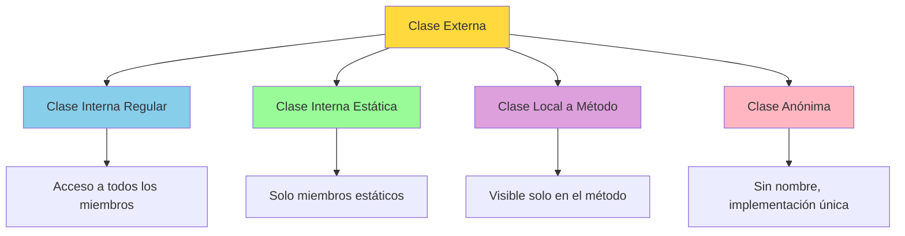
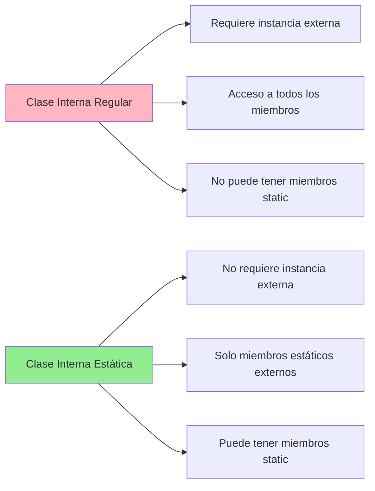

# Anexo I. Clases Anidadas

## 📋 Índice de contenidos

1. [Introducción a las clases anidadas](#1-introducci%C3%B3n-a-las-clases-anidadas)
    1. [¿Qué son las clases anidadas?](#11-qu%C3%A9-son-las-clases-anidadas)
    2. [Propósito y ventajas](#12-prop%C3%B3sito-y-ventajas)
    3. [Tipos de clases anidadas](#13-tipos-de-clases-anidadas)
2. [Clases internas regulares](#2-clases-internas-regulares)
    1. [Definición y características](#21-definici%C3%B3n-y-caracter%C3%ADsticas)
    2. [Sintaxis de declaración](#22-sintaxis-de-declaraci%C3%B3n)
    3. [Acceso a miembros de la clase externa](#23-acceso-a-miembros-de-la-clase-externa)
    4. [Instanciación](#24-instanciaci%C3%B3n)
    5. [Ejemplo práctico: Lista enlazada](#25-ejemplo-pr%C3%A1ctico-lista-enlazada)
3. [Clases internas estáticas](#3-clases-internas-est%C3%A1ticas)
    1. [Definición y características](#31-definici%C3%B3n-y-caracter%C3%ADsticas)
    2. [Diferencias con las clases internas regulares](#32-diferencias-con-las-clases-internas-regulares)
    3. [Sintaxis y uso de miembros estáticos](#33-sintaxis-y-uso-de-miembros-est%C3%A1ticos)
    4. [Instanciación](#34-instanciaci%C3%B3n)
    5. [Ejemplo práctico: Configuración](#35-ejemplo-pr%C3%A1ctico-configuraci%C3%B3n)
4. [Clases locales a método](#4-clases-locales-a-m%C3%A9todo)
    1. [Definición y características](#41-definici%C3%B3n-y-caracter%C3%ADsticas)
    2. [Ámbito de visibilidad](#42-%C3%A1mbito-de-visibilidad)
    3. [Acceso a variables locales](#43-acceso-a-variables-locales)
    4. [Limitaciones](#44-limitaciones)
5. [Clases anónimas](#5-clases-an%C3%B3nimas)
    1. [Definición y características](#51-definici%C3%B3n-y-caracter%C3%ADsticas)
    2. [Sintaxis de creación](#52-sintaxis-de-creaci%C3%B3n)
    3. [Usos comunes](#53-usos-comunes)
    4. [Limitaciones](#54-limitaciones)
6. [Comparación entre tipos de clases anidadas](#6-comparaci%C3%B3n-entre-tipos-de-clases-anidadas)
    1. [Tabla comparativa](#61-tabla-comparativa)
    2. [Escenarios de uso recomendados](#62-escenarios-de-uso-recomendados)
7. [Ejercicios prácticos](#7-ejercicios-pr%C3%A1cticos)
    1. [Práctica 1: Observable con clase interna regular](#71-pr%C3%A1ctica-1-observable-con-clase-interna-regular)
    2. [Práctica 2: Fábrica de componentes con clase estática](#72-pr%C3%A1ctica-2-f%C3%A1brica-de-componentes-con-clase-est%C3%A1tica)
    3. [Práctica 3: Validador con clase local](#73-pr%C3%A1ctica-3-validador-con-clase-local)
    4. [Práctica 4: Manejador de eventos con clase anónima](#74-pr%C3%A1ctica-4-manejador-de-eventos-con-clase-an%C3%B3nima)

## 1. Introducción a las clases anidadas

### 1.1 ¿Qué son las clases anidadas?

Las **clases anidadas** son clases definidas dentro de otras clases en Java. Esta característica del lenguaje proporciona una poderosa herramienta de encapsulación y organización del código, permitiendo agrupar clases que están lógicamente relacionadas.



**Terminología:**

- **Clase externa (outer class)**: La clase que contiene a la clase anidada
- **Clase interna (inner class)**: La clase contenida dentro de otra clase

### 1.2 Propósito y ventajas

Las clases anidadas ofrecen múltiples beneficios:

**🔒 Encapsulación mejorada:**

- Las clases anidadas pueden acceder a miembros privados de la clase externa
- Proporcionan un control más fino sobre la visibilidad

**📁 Código más organizado:**

- Permite agrupar clases que solo se utilizan en un contexto específico
- Mantiene junto el código que se usa junto

**🏗️ Mayor cohesión:**

- Facilita la creación de estructuras de datos complejas
- Mejora la legibilidad y mantenibilidad del código

**🌐 Reducción del espacio de nombres:**

- Evita conflictos de nombres en paquetes grandes
- Agrupa funcionalidad relacionada

### 1.3 Tipos de clases anidadas

Java proporciona cuatro tipos principales de clases anidadas:

| Tipo | Modificador | Acceso a clase externa | Instanciación |
| :-- | :-- | :-- | :-- |
| **Clase interna regular** | Sin `static` | Todos los miembros | Requiere instancia externa |
| **Clase interna estática** | Con `static` | Solo miembros estáticos | No requiere instancia externa |
| **Clase local a método** | - | Todos + variables locales | Dentro del método |
| **Clase anónima** | - | Todos | Implementación única |

## 2. Clases internas regulares

### 2.1 Definición y características

Las **clases internas regulares** son clases no estáticas definidas dentro de otra clase. Su característica principal es que mantienen una referencia implícita a la instancia de la clase externa, permitiéndoles acceder a todos sus miembros.

**Características principales:**

- Acceso completo a todos los miembros de la clase externa
- Mantienen una referencia implícita a la instancia externa
- No pueden contener miembros estáticos
- Pueden ser declaradas con cualquier modificador de acceso

### 2.2 Sintaxis de declaración

```java
public class ClaseExterna {
    private int datoPrivado;
    private String mensaje;

    public ClaseExterna(){
        this.datoPrivado = 10;
        this.mensaje = "Desde clase externa";
    }
    
    // Clase interna regular
    class ClaseInterna {
        private int datoInterno;

        public ClaseInterna(){
            this.datoInterno = 5;
        }
        
        void mostrarDatos() {
            System.out.println("Dato externo: " + datoPrivado);
            System.out.println("Dato interno: " + datoInterno);
            System.out.println("Mensaje: " + mensaje);
        }
        
        void llamarMetodoExterno() {
            metodoExterno(); // Acceso directo
        }
    }
    
    private void metodoExterno() {
        System.out.println("Método de la clase externa");
    }
    
    public void crearInterna() {
        ClaseInterna interna = new ClaseInterna();
        interna.mostrarDatos();
    }
}
```

### 2.3 Acceso a miembros de la clase externa

Las clases internas regulares tienen acceso privilegiado a la clase externa:

```java
public class ClaseExterna {
    private String nombre;

    public ClaseExterna(){
        this.nombre = "Externa";
    }
    
    class ClaseInterna {
        private String nombre;

        public ClaseInterna(){
            this.nombre = "Interna";
        }
        
        void mostrarNombres() {
            System.out.println("Nombre interno: " + this.nombre);
            System.out.println("Nombre externo: " + ClaseExterna.this.nombre);
        }
        
        void modificarExterno() {
            ClaseExterna.this.nombre = "Modificado desde interna";
        }
    }
}
```

> [!IMPORTANT]
> Cuando hay conflicto de nombres, usa `ClaseExterna.this.miembro` para acceder al miembro de la clase externa.

### 2.4 Instanciación

Para crear una instancia de una clase interna regular, primero necesitas una instancia de la clase externa:

```java
public class TestClaseInterna {
    public static void main(String[] args) {
        // Primero crear la instancia externa
        ClaseExterna externa = new ClaseExterna();
        
        // Luego crear la instancia interna
        ClaseExterna.ClaseInterna interna = externa.new ClaseInterna();
        
        // Usar la instancia interna
        interna.mostrarDatos();
    }
}
```

### 2.5 Ejemplo práctico: Lista enlazada

Un ejemplo clásico del uso de clases internas regulares es la implementación de estructuras de datos:

```java
public class ListaEnlazada {
    private Nodo primero;
    private int tamaño;
    
    // Clase interna para representar un nodo
    class Nodo {
        private Object dato;
        private Nodo siguiente;
        
        Nodo(Object dato) {
            this.dato = dato;
            this.siguiente = null;
        }
        
        void enlazarCon(Nodo siguiente) {
            this.siguiente = siguiente;
        }
        
        Object obtenerDato() {
            return dato;
        }
        
        Nodo obtenerSiguiente() {
            return siguiente;
        }
    }
    
    public ListaEnlazada() {
        this.primero = null;
        this.tamaño = 0;
    }
    
    public void agregar(Object dato) {
        Nodo nuevoNodo = new Nodo(dato);
        
        if (primero == null) {
            primero = nuevoNodo;
        } else {
            Nodo actual = primero;
            while (actual.siguiente != null) {
                actual = actual.siguiente;
            }
            actual.siguiente = nuevoNodo;
        }
        tamaño++;
    }
    
    public void mostrar() {
        Nodo actual = primero;
        System.out.print("Lista: ");
        while (actual != null) {
            System.out.print(actual.dato + " -> ");
            actual = actual.siguiente;
        }
        System.out.println("null");
    }
    
    public int obtenerTamaño() {
        return tamaño;
    }
}
```

## 3. Clases internas estáticas

### 3.1 Definición y características

Las **clases internas estáticas** son clases anidadas declaradas con el modificador `static`. A diferencia de las clases internas regulares, no mantienen una referencia a la instancia de la clase externa.

**Características principales:**

- No tienen acceso a miembros no estáticos de la clase externa
- Pueden tener miembros estáticos propios
- No requieren una instancia de la clase externa para ser instanciadas
- Más eficientes en memoria al no mantener referencia externa

### 3.2 Diferencias con las clases internas regulares



### 3.3 Sintaxis y uso de miembros estáticos

```java
public class ClaseExterna {
    private static int contadorEstatico = 0;
    private int datoInstancia;

    public ClaseExterna(){
        this.datoInstancia = 10;
    }
    
    static class ClaseInternaEstatica {
        private static int contadorInterno = 0;
        private int datoInterno;
        
        ClaseInternaEstatica(int dato) {
            this.datoInterno = dato;
            contadorInterno++;
        }
        
        void mostrarDatos() {
            System.out.println("Contador externo: " + contadorEstatico);
            System.out.println("Dato interno: " + datoInterno);
            System.out.println("Contador interno: " + contadorInterno);
            
            // ❌ Error: No puede acceder a miembros no estáticos
            // System.out.println("Dato instancia: " + datoInstancia);
        }
        
        static void incrementarContador() {
            contadorEstatico++;
            contadorInterno++;
        }
        
        static int obtenerContadorInterno() {
            return contadorInterno;
        }
    }
    
    public static void incrementarContador() {
        contadorEstatico++;
    }
}
```

### 3.4 Instanciación

La instanciación de clases internas estáticas es más directa:

```java
public class TestClaseEstatica {
    public static void main(String[] args) {
        // No necesita instancia de la clase externa
        ClaseExterna.ClaseInternaEstatica obj1 = 
            new ClaseExterna.ClaseInternaEstatica(100);
        
        ClaseExterna.ClaseInternaEstatica obj2 = 
            new ClaseExterna.ClaseInternaEstatica(200);
        
        // Usar métodos estáticos
        ClaseExterna.ClaseInternaEstatica.incrementarContador();
        
        obj1.mostrarDatos();
        obj2.mostrarDatos();
        
        System.out.println("Contador interno total: " + 
                          ClaseExterna.ClaseInternaEstatica.obtenerContadorInterno());
    }
}
```

### 3.5 Ejemplo práctico: Configuración

Las clases internas estáticas son ideales para agrupar configuraciones relacionadas:

```java
public class SistemaGestion {
    private static String nombreSistema = "Sistema de Gestión v1.0";
    
    static class ConfiguracionBD {
        private static String url = "localhost:3306";
        private static String usuario = "admin";
        private static String password = "password";
        
        static void configurar(String url, String usuario, String password) {
            ConfiguracionBD.url = url;
            ConfiguracionBD.usuario = usuario;
            ConfiguracionBD.password = password;
        }
        
        static String obtenerURL() {
            return url;
        }
        
        static String obtenerUsuario() {
            return usuario;
        }
        
        static void mostrarConfiguracion() {
            System.out.println("=== Configuración de Base de Datos ===");
            System.out.println("URL: " + url);
            System.out.println("Usuario: " + usuario);
            System.out.println("Sistema: " + nombreSistema);
        }
    }
    
    static class ConfiguracionSeguridad {
        private static boolean autenticacionHabilitada = true;
        private static int tiempoExpiracionSesion = 30; // minutos
        
        static void habilitarAutenticacion() {
            autenticacionHabilitada = true;
        }
        
        static void deshabilitarAutenticacion() {
            autenticacionHabilitada = false;
        }
        
        static void configurarTiempoExpiracion(int minutos) {
            tiempoExpiracionSesion = minutos;
        }
        
        static void mostrarConfiguracion() {
            System.out.println("=== Configuración de Seguridad ===");
            System.out.println("Autenticación: " + 
                             (autenticacionHabilitada ? "Habilitada" : "Deshabilitada"));
            System.out.println("Tiempo de expiración: " + 
                             tiempoExpiracionSesion + " minutos");
        }
    }
    
    public static void inicializarSistema() {
        ConfiguracionBD.configurar("production-db:3306", "prod_user", "secure_pass");
        ConfiguracionSeguridad.configurarTiempoExpiracion(60);
        
        ConfiguracionBD.mostrarConfiguracion();
        ConfiguracionSeguridad.mostrarConfiguracion();
    }
}
```

## 4. Clases locales a método

### 4.1 Definición y características

Las **clases locales a método** son clases definidas dentro de un método o bloque de código. Solo son visibles dentro del ámbito donde se declaran.

**Características principales:**

- Solo son visibles dentro del método donde se declaran
- Pueden acceder a miembros de la clase externa
- Pueden acceder a variables locales y parámetros del método (deben ser efectivamente finales)
- No pueden ser declaradas con modificadores de acceso

### 4.2 Ámbito de visibilidad

```java
public class ClaseExterna {
    private String nombreClase;

    public ClaseExterna(){
        this.nombreClase = "Externa";
    }
    
    public void metodoConClaseLocal() {
        String variableLocal = "Variable del método";
        
        // Clase local - solo visible en este método
        class ClaseLocal {
            private String nombreLocal;

            public ClaseLocal(){
                this.nombreLocal = "Interna";
            }
            
            void mostrarInformacion() {
                System.out.println("Nombre clase externa: " + nombreClase);
                System.out.println("Variable local: " + variableLocal);
                System.out.println("Nombre local: " + nombreLocal);
            }
        }
        
        // Instanciación dentro del método
        ClaseLocal local = new ClaseLocal();
        local.mostrarInformacion();
        

    }
    
    public void otroMetodo() {
        // ClaseLocal local = new ClaseLocal(); // ❌ Error: ClaseLocal no es visible fuera del método
    }
}
```

### 4.3 Acceso a variables locales

Las clases locales pueden acceder a variables locales y parámetros del método, pero estas deben ser **efectivamente finales**:

```java
public class ValidadorFormulario {
    public boolean validarDatos(final String nombre, final String email) {
        final String patronEmail = "^[\\w-\\.]+@([\\w-]+\\.)+[\\w-]{2,4}$";
        
        class ValidadorInterno {
            boolean validarNombre() {
                return nombre != null && 
                       nombre.trim().length() >= 2 && 
                       nombre.matches("[A-Za-zÀ-ÿ\\s]+");
            }
            
            boolean validarEmail() {
                return email != null && 
                       email.matches(patronEmail);
            }
            
            void mostrarResultados() {
                System.out.println("Validando para: " + nombre);
                System.out.println("Email: " + email);
                System.out.println("Nombre válido: " + validarNombre());
                System.out.println("Email válido: " + validarEmail());
            }
        }
        
        ValidadorInterno validador = new ValidadorInterno();
        validador.mostrarResultados();
        
        return validador.validarNombre() && validador.validarEmail();
    }
}
```

### 4.4 Limitaciones

Las clases locales a método tienen varias limitaciones:

- **No pueden contener miembros estáticos** (excepto constantes)
- **Deben ser instanciadas dentro del método** donde se declaran
- **Solo pueden acceder a variables locales efectivamente finales**
- **No pueden ser declaradas con modificadores de acceso**

```java
public class EjemploLimitaciones {
    public void metodoConLimitaciones() {
        int variableNoFinal = 10;
        final int variableFinal = 20;

        variableNoFinal = 15;  
        
        class ClaseConLimitaciones {
            // ❌ Error: No se permiten miembros estáticos (excepto constantes)
            // static int contador = 0;
            
            // ✅ OK: Constantes estáticas permitidas
            static final String CONSTANTE = "Valor constante";
            
            void metodo() {
                // ❌ Error: variable no es efectivamente final
                // System.out.println(variableNoFinal);
                
                // ✅ OK: variable es final
                System.out.println(variableFinal);
            }
        }
        
        ClaseConLimitaciones obj = new ClaseConLimitaciones();
        obj.metodo();
    }
}
```

## 5. Clases anónimas

> [!CAUTION]
> **Revisa este apartado después de terminar la siguiente unidad, cuando tengas claro el uso de herencia e implementación de interfaces.**

### 5.1 Definición y características

Las **clases anónimas** son clases sin nombre que se declaran e instancian al mismo tiempo. Se utilizan para crear implementaciones únicas de interfaces o para extender clases con una sola instancia.

**Características principales:**

- No tienen nombre explícito
- Se crean e instancian simultáneamente
- Ideales para implementaciones únicas
- Acceso a miembros de la clase externa
- Comúnmente usadas para listeners y callbacks

### 5.2 Sintaxis de creación

```java
// Implementación de una interfaz
interface Saludable {
    void saludar();
    void despedirse();
}

public class EjemploClaseAnonima {
    public void crearSaludador() {
        Saludable saludador = new Saludable() {
            @Override
            public void saludar() {
                System.out.println("¡Hola desde clase anónima!");
            }
            
            @Override
            public void despedirse() {
                System.out.println("¡Adiós desde clase anónima!");
            }
        };
        
        saludador.saludar();
        saludador.despedirse();
    }
}
```

**Extensión de una clase abstracta:**

```java
abstract class Vehiculo {
    protected String tipo;
    
    public Vehiculo(String tipo) {
        this.tipo = tipo;
    }
    
    public abstract void arrancar();
    public abstract void detener();
    
    public void mostrarTipo() {
        System.out.println("Tipo de vehículo: " + tipo);
    }
}

public class TestVehiculo {
    public void crearVehiculo() {
        Vehiculo coche = new Vehiculo("Automóvil") {
            @Override
            public void arrancar() {
                System.out.println("El coche arranca con la llave");
            }
            
            @Override
            public void detener() {
                System.out.println("El coche se detiene con el freno");
            }
        };
        
        coche.mostrarTipo();
        coche.arrancar();
        coche.detener();
    }
}
```

### 5.3 Usos comunes

#### Interfaces de escucha (listeners)

```java
import javax.swing.*;
import java.awt.event.ActionEvent;
import java.awt.event.ActionListener;

public class VentanaEjemplo {
    public void crearVentana() {
        JFrame ventana = new JFrame("Ejemplo");
        JButton boton = new JButton("Clickeame");
        
        // Listener con clase anónima
        boton.addActionListener(new ActionListener() {
            @Override
            public void actionPerformed(ActionEvent e) {
                System.out.println("¡Botón clickeado!");
                JOptionPane.showMessageDialog(ventana, "¡Hola desde el botón!");
            }
        });
        
        ventana.add(boton);
        ventana.setSize(300, 200);
        ventana.setDefaultCloseOperation(JFrame.EXIT_ON_CLOSE);
        ventana.setVisible(true);
    }
}
```

#### Implementación de Runnable

```java
Runnable tarea = new Runnable() {
    @Override
    public void run() {
        System.out.println("Tarea ejecutándose");
    }
};
```

### 5.4 Limitaciones

Las clases anónimas tienen varias limitaciones importantes:

- **No pueden implementar múltiples interfaces**
- **No pueden extender una clase y implementar una interfaz simultáneamente**
- **No pueden tener constructores explícitos**
- **No pueden ser estáticas**
- **Solo pueden acceder a variables locales efectivamente finales**

```java
public class EjemploLimitaciones {
    public void mostrarLimitaciones() {
        final String mensaje = "Hola";
        
        // ❌ Error: No puede implementar múltiples interfaces
        /*
        Object obj = new Runnable(), Serializable {
            // No es posible
        };
        */
        
        // ✅ OK: Implementa una interfaz
        Runnable tarea = new Runnable() {
            @Override
            public void run() {
                System.out.println(mensaje); // Acceso a variable final
            }
        };
        
        tarea.run();
    }
}
```

## 6. Comparación entre tipos de clases anidadas

### 6.1 Tabla comparativa

| Característica | Clase Interna Regular | Clase Interna Estática | Clase Local a Método | Clase Anónima |
| :-- | :-- | :-- | :-- | :-- |
| **Acceso a miembros externos** | ✅ Todos | ⚠️ Solo estáticos | ✅ Todos + variables locales | ✅ Todos |
| **Puede ser static** | ❌ No | ✅ Sí | ❌ No | ❌ No |
| **Puede tener miembros static** | ❌ No | ✅ Sí | ❌ No | ❌ No |
| **Visible fuera de la clase** | ✅ Sí | ✅ Sí | ❌ No | ❌ No |
| **Requiere instancia externa** | ✅ Sí | ❌ No | ⚠️ Depende | ⚠️ Depende |
| **Puede tener constructores** | ✅ Sí | ✅ Sí | ✅ Sí | ❌ No |
| **Modificadores de acceso** | ✅ Sí | ✅ Sí | ❌ No | ❌ No |

### 6.2 Escenarios de uso recomendados

#### 🔧 Clases internas regulares

**Cuándo usar:**

- Necesitas acceso a miembros privados de la clase externa
- La clase interna está estrechamente relacionada con la clase externa
- Implementas estructuras de datos complejas (nodos, iteradores)

**Ejemplos típicos:**

- Nodos en listas enlazadas
- Iteradores personalizados
- Clases auxiliares que requieren acceso completo

```java
public class ArbolBinario {
    private Nodo raiz;
    
    class Nodo {
        private Object dato;
        private Nodo izquierdo, derecho;
        
        Nodo(Object dato) {
            this.dato = dato;
        }
        
        // Acceso completo a métodos de ArbolBinario
        void insertar(Object nuevoDato) {
            ArbolBinario.this.insertar(nuevoDato, this);
        }
    }
}
```

#### ⚡ Clases internas estáticas

**Cuándo usar:**

- No necesitas acceder a miembros no estáticos de la clase externa
- Quieres agrupar clases utilitarias relacionadas
- Necesitas tener miembros estáticos en la clase interna

**Ejemplos típicos:**

- Clases de configuración
- Builders y factories
- Clases utilitarias agrupadas

```java
public class HttpClient {
    static class Request {
        private String url;
        private String method;
        
        static Request get(String url) {
            return new Request(url, "GET");
        }
        
        static Request post(String url) {
            return new Request(url, "POST");
        }
    }
}
```

#### 🎯 Clases locales a método

**Cuándo usar:**

- La clase solo se usa dentro de un método específico
- Necesitas acceso a variables locales del método
- Quieres encapsular lógica específica de un método

**Ejemplos típicos:**

- Validadores específicos
- Algoritmos de ordenamiento personalizado
- Procesadores de datos temporales

```java
public void ordenarArray(int[] array, boolean ascendente) {
    class ComparadorLocal {
        boolean comparar(int a, int b) {
            return ascendente ? a > b : a < b;
        }
    }
    
    ComparadorLocal comparador = new ComparadorLocal();
    // Usar comparador para ordenar
}
```

#### 🎪 Clases anónimas

**Cuándo usar:**

- Implementaciones únicas de interfaces
- Manejadores de eventos
- Implementaciones rápidas y simples

**Ejemplos típicos:**

- Event listeners
- Callbacks
- Comparadores personalizados

```java
Collections.sort(lista, new Comparator<String>() {
    @Override
    public int compare(String s1, String s2) {
        return s1.length() - s2.length();
    }
});
```

## 7. Ejercicios prácticos

> [!CAUTION]
> **Se recomienda realizar estos ejercicios una vez conozcas el tema de herencia, polimorfismo, clases abstractas e interfaces, genéricos y colecciones.**

### 7.1 Práctica 1: Observable con clase interna regular

**Objetivo:** Implementar el patrón Observer utilizando una clase interna regular para los observadores.

<details>
<summary>💻 Solución</summary>

```java
import java.util.ArrayList;
import java.util.List;

public class Observable {
    private List<Observador> observadores = new ArrayList<>();
    private String estado;
    
    // Clase interna regular para representar observadores
    class Observador {
        private String nombre;
        private boolean activo;
        
        Observador(String nombre) {
            this.nombre = nombre;
            this.activo = true;
        }
        
        void notificar(String mensaje) {
            if (activo) {
                System.out.println("[" + nombre + "] Notificación recibida: " + mensaje);
                System.out.println("[" + nombre + "] Estado actual: " + estado);
            }
        }
        
        void activar() {
            activo = true;
            System.out.println("[" + nombre + "] Observador activado");
        }
        
        void desactivar() {
            activo = false;
            System.out.println("[" + nombre + "] Observador desactivado");
        }
        
        String getNombre() {
            return nombre;
        }
        
        boolean isActivo() {
            return activo;
        }
    }
    
    public void agregarObservador(String nombre) {
        Observador nuevoObservador = new Observador(nombre);
        observadores.add(nuevoObservador);
        System.out.println("Observador '" + nombre + "' agregado");
    }
    
    public void notificarTodos(String mensaje) {
        System.out.println("\n=== Notificando a todos los observadores ===");
        for (Observador obs : observadores) {
            obs.notificar(mensaje);
        }
    }
    
    public void cambiarEstado(String nuevoEstado) {
        this.estado = nuevoEstado;
        notificarTodos("Estado cambiado a: " + nuevoEstado);
    }
    
    public void gestionarObservador(String nombre, boolean activar) {
        for (Observador obs : observadores) {
            if (obs.getNombre().equals(nombre)) {
                if (activar) {
                    obs.activar();
                } else {
                    obs.desactivar();
                }
                return;
            }
        }
        System.out.println("Observador '" + nombre + "' no encontrado");
    }
    
    public void mostrarEstadoObservadores() {
        System.out.println("\n=== Estado de los observadores ===");
        for (Observador obs : observadores) {
            System.out.println("- " + obs.getNombre() + 
                             " (Estado: " + (obs.isActivo() ? "Activo" : "Inactivo") + ")");
        }
    }
}

// Clase de prueba
public class TestObservable {
    public static void main(String[] args) {
        Observable observable = new Observable();
        
        // Agregar observadores
        observable.agregarObservador("Observer1");
        observable.agregarObservador("Observer2");
        observable.agregarObservador("Observer3");
        
        // Cambiar estado
        observable.cambiarEstado("INICIADO");
        
        // Desactivar un observador
        observable.gestionarObservador("Observer2", false);
        
        // Cambiar estado nuevamente
        observable.cambiarEstado("PROCESANDO");
        
        // Mostrar estado de observadores
        observable.mostrarEstadoObservadores();
        
        // Reactivar observador
        observable.gestionarObservador("Observer2", true);
        
        // Cambiar estado final
        observable.cambiarEstado("COMPLETADO");
    }
}
```

</details>

### 7.2 Práctica 2: Fábrica de componentes con clase estática

**Objetivo:** Crear una fábrica de componentes utilizando una clase interna estática.

<details>
<summary>💻 Solución</summary>

```java
public class FabricaComponentes {
    
    // Clase interna estática para representar componentes
    static class Componente {
        private static int contadorGlobal = 0;
        private final int id;
        private final String tipo;
        private final String nombre;
        private boolean activo;
        
        private Componente(String tipo, String nombre) {
            this.id = ++contadorGlobal;
            this.tipo = tipo;
            this.nombre = nombre;
            this.activo = true;
        }
        
        // Métodos estáticos para crear diferentes tipos de componentes
        static Componente crearBoton(String nombre) {
            return new Componente("BOTON", nombre);
        }
        
        static Componente crearEtiqueta(String nombre) {
            return new Componente("ETIQUETA", nombre);
        }
        
        static Componente crearCampoTexto(String nombre) {
            return new Componente("CAMPO_TEXTO", nombre);
        }
        
        // Método estático para reiniciar el contador
        static void reiniciarContador() {
            contadorGlobal = 0;
            System.out.println("Contador de componentes reiniciado");
        }
        
        // Método estático para obtener el total de componentes creados
        static int getTotalComponentes() {
            return contadorGlobal;
        }
        
        // Métodos de instancia
        void activar() {
            activo = true;
            System.out.println("Componente " + nombre + " activado");
        }
        
        void desactivar() {
            activo = false;
            System.out.println("Componente " + nombre + " desactivado");
        }
        
        void mostrarInformacion() {
            System.out.println("=== Información del Componente ===");
            System.out.println("ID: " + id);
            System.out.println("Tipo: " + tipo);
            System.out.println("Nombre: " + nombre);
            System.out.println("Estado: " + (activo ? "Activo" : "Inactivo"));
        }
        
        // Getters
        int getId() { return id; }
        String getTipo() { return tipo; }
        String getNombre() { return nombre; }
        boolean isActivo() { return activo; }
    }
    
    // Métodos estáticos de fábrica
    public static Componente crearComponente(String tipoComponente, String nombre) {
        switch (tipoComponente.toUpperCase()) {
            case "BOTON":
                return Componente.crearBoton(nombre);
            case "ETIQUETA":
                return Componente.crearEtiqueta(nombre);
            case "CAMPO_TEXTO":
                return Componente.crearCampoTexto(nombre);
            default:
                throw new IllegalArgumentException("Tipo de componente no válido: " + tipoComponente);
        }
    }
    
    public static void mostrarEstadisticas() {
        System.out.println("\n=== Estadísticas de Componentes ===");
        System.out.println("Total de componentes creados: " + Componente.getTotalComponentes());
    }
    
    public static void reiniciarFabrica() {
        Componente.reiniciarContador();
    }
}

// Clase de prueba
public class TestFabricaComponentes {
    public static void main(String[] args) {
        System.out.println("=== Test de Fábrica de Componentes ===");
        
        // Crear diferentes tipos de componentes
        FabricaComponentes.Componente boton1 = FabricaComponentes.crearComponente("BOTON", "BotonAceptar");
        FabricaComponentes.Componente etiqueta1 = FabricaComponentes.crearComponente("ETIQUETA", "EtiquetaNombre");
        FabricaComponentes.Componente campo1 = FabricaComponentes.crearComponente("CAMPO_TEXTO", "CampoEmail");
        
        // Mostrar información de los componentes
        boton1.mostrarInformacion();
        etiqueta1.mostrarInformacion();
        campo1.mostrarInformacion();
        
        // Mostrar estadísticas
        FabricaComponentes.mostrarEstadisticas();
        
        // Crear más componentes
        FabricaComponentes.Componente boton2 = FabricaComponentes.Componente.crearBoton("BotonCancelar");
        FabricaComponentes.Componente campo2 = FabricaComponentes.Componente.crearCampoTexto("CampoPassword");
        
        // Manipular componentes
        boton2.desactivar();
        campo2.activar();
        
        // Mostrar estadísticas finales
        FabricaComponentes.mostrarEstadisticas();
        
        // Reiniciar fábrica
        FabricaComponentes.reiniciarFabrica();
        FabricaComponentes.mostrarEstadisticas();
    }
}
```

</details>

### 7.3 Práctica 3: Validador con clase local

**Objetivo:** Implementar un validador que utilice clases locales a método para diferentes tipos de validación.

<details>
<summary>💻 Solución</summary>

```java
public class ValidadorAvanzado {
    
    public boolean validarUsuario(final String nombre, final String email, final String password) {
        final String patronEmail = "^[\\w-\\.]+@([\\w-]+\\.)+[\\w-]{2,4}$";
        final int longitudMinimaPassword = 8;
        
        // Clase local para validar nombre
        class ValidadorNombre {
            boolean validar() {
                if (nombre == null || nombre.trim().isEmpty()) {
                    System.out.println("❌ Error: El nombre no puede estar vacío");
                    return false;
                }
                
                if (nombre.length() < 2) {
                    System.out.println("❌ Error: El nombre debe tener al menos 2 caracteres");
                    return false;
                }
                
                if (!nombre.matches("[A-Za-zÀ-ÿ\\s]+")) {
                    System.out.println("❌ Error: El nombre solo puede contener letras y espacios");
                    return false;
                }
                
                System.out.println("✅ Nombre válido: " + nombre);
                return true;
            }
        }
        
        // Clase local para validar email
        class ValidadorEmail {
            boolean validar() {
                if (email == null || email.trim().isEmpty()) {
                    System.out.println("❌ Error: El email no puede estar vacío");
                    return false;
                }
                
                if (!email.matches(patronEmail)) {
                    System.out.println("❌ Error: Formato de email inválido");
                    return false;
                }
                
                System.out.println("✅ Email válido: " + email);
                return true;
            }
        }
        
        // Clase local para validar password
        class ValidadorPassword {
            boolean validar() {
                if (password == null || password.isEmpty()) {
                    System.out.println("❌ Error: La contraseña no puede estar vacía");
                    return false;
                }
                
                if (password.length() < longitudMinimaPassword) {
                    System.out.println("❌ Error: La contraseña debe tener al menos " + 
                                     longitudMinimaPassword + " caracteres");
                    return false;
                }
                
                if (!password.matches(".*[A-Z].*")) {
                    System.out.println("❌ Error: La contraseña debe contener al menos una mayúscula");
                    return false;
                }
                
                if (!password.matches(".*[a-z].*")) {
                    System.out.println("❌ Error: La contraseña debe contener al menos una minúscula");
                    return false;
                }
                
                if (!password.matches(".*\\d.*")) {
                    System.out.println("❌ Error: La contraseña debe contener al menos un número");
                    return false;
                }
                
                if (!password.matches(".*[!@#$%^&*()_+\\-=\\[\\]{};':\"\\\\|,.<>\\/?].*")) {
                    System.out.println("❌ Error: La contraseña debe contener al menos un carácter especial");
                    return false;
                }
                
                System.out.println("✅ Contraseña válida");
                return true;
            }
        }
        
        System.out.println("=== Validando usuario ===");
        
        // Crear instancias de los validadores locales
        ValidadorNombre validadorNombre = new ValidadorNombre();
        ValidadorEmail validadorEmail = new ValidadorEmail();
        ValidadorPassword validadorPassword = new ValidadorPassword();
        
        // Ejecutar validaciones
        boolean nombreValido = validadorNombre.validar();
        boolean emailValido = validadorEmail.validar();
        boolean passwordValido = validadorPassword.validar();
        
        boolean todosValidos = nombreValido && emailValido && passwordValido;
        
        System.out.println("\n=== Resultado de la validación ===");
        System.out.println("Usuario válido: " + (todosValidos ? "✅ SÍ" : "❌ NO"));
        
        return todosValidos;
    }
    
    public void validarDocumento(final String documento, final String tipoDocumento) {
        final String tipoDoc = tipoDocumento.toUpperCase();
        
        class ValidadorDocumento {
            void validar() {
                System.out.println("=== Validando documento ===");
                System.out.println("Documento: " + documento);
                System.out.println("Tipo: " + tipoDoc);
                
                if (documento == null || documento.trim().isEmpty()) {
                    System.out.println("❌ Error: El documento no puede estar vacío");
                    return;
                }
                
                switch (tipoDoc) {
                    case "DNI":
                        validarDNI();
                        break;
                    case "NIE":
                        validarNIE();
                        break;
                    case "PASAPORTE":
                        validarPasaporte();
                        break;
                    default:
                        System.out.println("❌ Error: Tipo de documento no válido");
                }
            }
            
            private void validarDNI() {
                if (documento.matches("\\d{8}[A-Z]")) {
                    System.out.println("✅ DNI válido");
                } else {
                    System.out.println("❌ Error: Formato de DNI inválido (debe ser 8 dígitos + 1 letra)");
                }
            }
            
            private void validarNIE() {
                if (documento.matches("[XYZ]\\d{7}[A-Z]")) {
                    System.out.println("✅ NIE válido");
                } else {
                    System.out.println("❌ Error: Formato de NIE inválido (debe ser X/Y/Z + 7 dígitos + 1 letra)");
                }
            }
            
            private void validarPasaporte() {
                if (documento.matches("[A-Z]{3}\\d{6}")) {
                    System.out.println("✅ Pasaporte válido");
                } else {
                    System.out.println("❌ Error: Formato de pasaporte inválido (debe ser 3 letras + 6 dígitos)");
                }
            }
        }
        
        ValidadorDocumento validador = new ValidadorDocumento();
        validador.validar();
    }
}

// Clase de prueba
public class TestValidadorAvanzado {
    public static void main(String[] args) {
        ValidadorAvanzado validador = new ValidadorAvanzado();
        
        // Prueba 1: Usuario válido
        System.out.println("=== PRUEBA 1: Usuario válido ===");
        validador.validarUsuario("Juan García", "juan.garcia@email.com", "MiPassword123!");
        
        // Prueba 2: Usuario inválido
        System.out.println("\n=== PRUEBA 2: Usuario inválido ===");
        validador.validarUsuario("", "email-invalido", "123");
        
        // Prueba 3: Documentos
        System.out.println("\n=== PRUEBA 3: Validación de documentos ===");
        validador.validarDocumento("12345678A", "DNI");
        validador.validarDocumento("X1234567B", "NIE");
        validador.validarDocumento("ABC123456", "PASAPORTE");
        validador.validarDocumento("123456", "DNI"); // Inválido
    }
}
```

</details>

### 7.4 Práctica 4: Manejador de eventos con clase anónima

**Objetivo:** Crear un sistema de manejo de eventos utilizando clases anónimas.

<details>
<summary>💻 Solución</summary>

```java
import java.util.ArrayList;
import java.util.List;

public class SistemaEventosAvanzado {
    
    // Interfaces para diferentes tipos de eventos
    interface EventListener {
        void onEvent(String evento, Object datos);
    }
    
    interface ErrorListener {
        void onError(Exception error);
    }
    
    interface SuccessListener {
        void onSuccess(String mensaje);
    }
    
    // Listas para almacenar los listeners
    private List<EventListener> eventListeners = new ArrayList<>();
    private List<ErrorListener> errorListeners = new ArrayList<>();
    private List<SuccessListener> successListeners = new ArrayList<>();
    
    // Métodos para registrar listeners
    public void addEventListener(EventListener listener) {
        eventListeners.add(listener);
    }
    
    public void addErrorListener(ErrorListener listener) {
        errorListeners.add(listener);
    }
    
    public void addSuccessListener(SuccessListener listener) {
        successListeners.add(listener);
    }
    
    // Métodos para disparar eventos
    public void fireEvent(String evento, Object datos) {
        for (EventListener listener : eventListeners) {
            listener.onEvent(evento, datos);
        }
    }
    
    public void fireError(Exception error) {
        for (ErrorListener listener : errorListeners) {
            listener.onError(error);
        }
    }
    
    public void fireSuccess(String mensaje) {
        for (SuccessListener listener : successListeners) {
            listener.onSuccess(mensaje);
        }
    }
    
    // Método para configurar listeners por defecto
    public void configurarListenersDefecto() {
        // Event listener con clase anónima
        this.addEventListener(new EventListener() {
            @Override
            public void onEvent(String evento, Object datos) {
                System.out.println("🔔 [EVENTO] " + evento);
                System.out.println("📊 Datos: " + datos);
                System.out.println("⏰ Timestamp: " + System.currentTimeMillis());
                
                // Lógica específica según el tipo de evento
                if (evento.startsWith("USER_")) {
                    System.out.println("👤 Evento de usuario detectado");
                } else if (evento.startsWith("SYSTEM_")) {
                    System.out.println("⚙️ Evento de sistema detectado");
                } else if (evento.startsWith("DATA_")) {
                    System.out.println("📁 Evento de datos detectado");
                }
                
                System.out.println("────────────────────────────────");
            }
        });
        
        // Error listener con clase anónima
        this.addErrorListener(new ErrorListener() {
            @Override
            public void onError(Exception error) {
                System.err.println("❌ [ERROR] " + error.getMessage());
                System.err.println("⏰ Timestamp: " + System.currentTimeMillis());
                
                // Clasificación del error
                if (error instanceof RuntimeException) {
                    System.err.println("🔥 Error de runtime detectado");
                    manejarErrorRuntime((RuntimeException) error);
                } else if (error instanceof SecurityException) {
                    System.err.println("🔒 Error de seguridad detectado");
                    manejarErrorSeguridad((SecurityException) error);
                } else {
                    System.err.println("⚠️ Error genérico detectado");
                    manejarErrorGenerico(error);
                }
                
                System.err.println("────────────────────────────────");
            }
            
            private void manejarErrorRuntime(RuntimeException error) {
                System.err.println("🔧 Iniciando recuperación automática...");
                System.err.println("📝 Registrando error en sistema de logs");
            }
            
            private void manejarErrorSeguridad(SecurityException error) {
                System.err.println("🚨 ALERTA DE SEGURIDAD");
                System.err.println("📧 Enviando notificación a administradores");
                System.err.println("🔐 Aplicando medidas de seguridad");
            }
            
            private void manejarErrorGenerico(Exception error) {
                System.err.println("📋 Generando reporte de error");
                System.err.println("💾 Guardando estado del sistema");
            }
        });
        
        // Success listener con clase anónima
        this.addSuccessListener(new SuccessListener() {
            @Override
            public void onSuccess(String mensaje) {
                System.out.println("✅ [ÉXITO] " + mensaje);
                System.out.println("⏰ Timestamp: " + System.currentTimeMillis());
                
                // Acciones de éxito
                System.out.println("📈 Actualizando estadísticas de éxito");
                System.out.println("🎉 Incrementando contador de operaciones exitosas");
                
                // Lógica específica según el mensaje
                if (mensaje.contains("LOGIN")) {
                    System.out.println("👋 Bienvenida al usuario");
                } else if (mensaje.contains("SAVE")) {
                    System.out.println("💾 Datos guardados correctamente");
                } else if (mensaje.contains("SEND")) {
                    System.out.println("📤 Envío completado");
                }
                
                System.out.println("────────────────────────────────");
            }
        });
    }
    
    // Método para agregar listener personalizado de eventos específicos
    public void agregarListenerPersonalizado(final String tipoEvento) {
        this.addEventListener(new EventListener() {
            @Override
            public void onEvent(String evento, Object datos) {
                if (evento.startsWith(tipoEvento)) {
                    System.out.println("🎯 [PERSONALIZADO] Evento " + tipoEvento + " detectado");
                    System.out.println("📋 Evento completo: " + evento);
                    System.out.println("🔍 Datos específicos: " + datos);
                    
                    // Lógica personalizada
                    procesarEventoPersonalizado(evento, datos);
                }
            }
            
            private void procesarEventoPersonalizado(String evento, Object datos) {
                System.out.println("⚙️ Procesando evento personalizado...");
                
                // Simular procesamiento específico
                try {
                    Thread.sleep(100); // Simular procesamiento
                    System.out.println("✅ Evento personalizado procesado correctamente");
                } catch (InterruptedException e) {
                    System.err.println("❌ Error al procesar evento personalizado");
                }
            }
        });
    }
    
    // Método para simular diferentes tipos de eventos
    public void simularEventos() {
        System.out.println("=== SIMULACIÓN DE EVENTOS ===\n");
        
        // Eventos de usuario
        fireEvent("USER_LOGIN", "usuario123");
        fireEvent("USER_LOGOUT", "usuario123");
        
        // Eventos de sistema
        fireEvent("SYSTEM_STARTUP", "Sistema iniciado");
        fireEvent("SYSTEM_BACKUP", "Backup completado");
        
        // Eventos de datos
        fireEvent("DATA_SAVE", "Documento guardado");
        fireEvent("DATA_DELETE", "Archivo eliminado");
        
        // Eventos de éxito
        fireSuccess("LOGIN exitoso para usuario123");
        fireSuccess("SAVE completado - documento.txt");
        fireSuccess("SEND finalizado - email enviado");
        
        // Eventos de error
        fireError(new RuntimeException("Error de conexión a base de datos"));
        fireError(new SecurityException("Acceso no autorizado"));
        fireError(new Exception("Error genérico del sistema"));
    }
}

// Clase de prueba
public class TestSistemaEventos {
    public static void main(String[] args) {
        SistemaEventosAvanzado sistema = new SistemaEventosAvanzado();
        
        // Configurar listeners por defecto
        sistema.configurarListenersDefecto();
        
        // Agregar listener personalizado
        sistema.agregarListenerPersonalizado("USER_");
        
        // Simular eventos
        sistema.simularEventos();
        
        // Agregar listener adicional con clase anónima
        sistema.addEventListener(new SistemaEventosAvanzado.EventListener() {
            @Override
            public void onEvent(String evento, Object datos) {
                if (evento.contains("BACKUP")) {
                    System.out.println("💾 [BACKUP LISTENER] Procesando evento de backup");
                    System.out.println("📊 Datos del backup: " + datos);
                }
            }
        });
        
        // Disparar evento específico
        System.out.println("\n=== EVENTO ESPECÍFICO ===");
        sistema.fireEvent("SYSTEM_BACKUP", "Backup nocturno completado");
    }
}
```

</details>

> [!NOTE]
> Las clases anidadas son una herramienta poderosa en Java que permite crear código más organizado, encapsulado y mantenible. Su uso apropiado puede mejorar significativamente la estructura y legibilidad de tus aplicaciones.