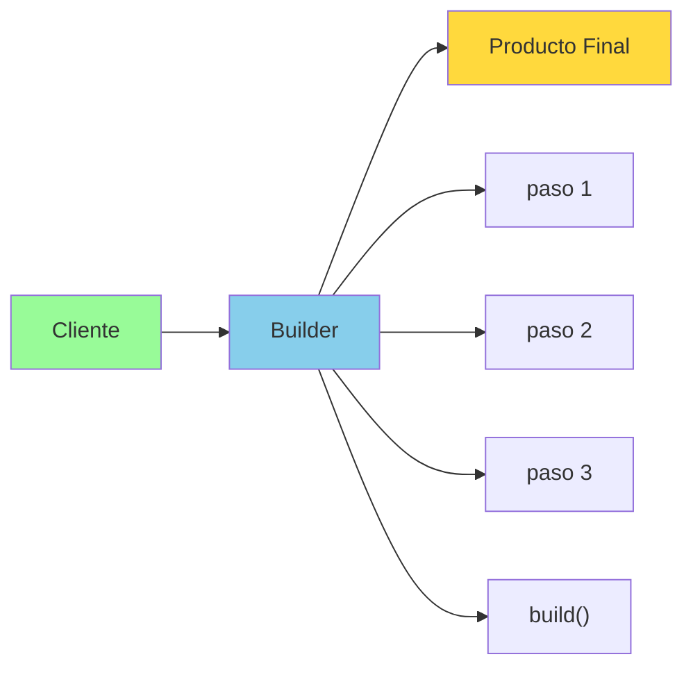

# Anexo II. Patrón Builder

## 📋 Índice de contenidos

1. [¿Qué es el patrón Builder?](#1-qu%C3%A9-es-el-patr%C3%B3n-builder)
2. [Motivación: Problemas con constructores múltiples](#2-motivaci%C3%B3n-problemas-con-constructores-m%C3%BAltiples)
3. [Implementación del patrón Builder](#3-implementaci%C3%B3n-del-patr%C3%B3n-builder)
    1. [Estructura básica](#31-estructura-b%C3%A1sica)
    2. [Ejemplo: Clase Persona](#32-ejemplo-clase-persona)
4. [Ventajas del patrón Builder](#4-ventajas-del-patr%C3%B3n-builder)
5. [Cuándo usar el patrón Builder](#5-cu%C3%A1ndo-usar-el-patr%C3%B3n-builder)
6. [Práctica: Implementación de un Builder](#6-pr%C3%A1ctica-implementaci%C3%B3n-de-un-builder)
7. [Comparación: Constructor vs Builder](#7-comparaci%C3%B3n-constructor-vs-builder)

## 1. ¿Qué es el patrón Builder?

El **patrón Builder** es un patrón de diseño **creacional** que permite construir objetos complejos paso a paso. En lugar de crear un objeto directamente mediante un constructor, el Builder proporciona una interfaz fluida que permite especificar solo las propiedades que necesitamos.



> [!NOTE]
> El patrón Builder es especialmente útil cuando necesitamos crear objetos inmutables con muchos parámetros opcionales.

## 2. Motivación: Problemas con constructores múltiples

Consideremos una clase `Persona` con muchos atributos opcionales:

```java
public class PersonaProblematica {
    private String nombre;
    private String apellidos;
    private int edad;
    private String telefono;
    private String email;
    private String direccion;
    private String ciudad;
    private String codigoPostal;
    
    // ❌ Necesitaríamos múltiples constructores
    public PersonaProblematica(String nombre) { /* ... */ }
    public PersonaProblematica(String nombre, String apellidos) { /* ... */ }
    public PersonaProblematica(String nombre, String apellidos, int edad) { /* ... */ }
    public PersonaProblematica(String nombre, String apellidos, int edad, String telefono) { /* ... */ }
    // ... y así hasta tener decenas de constructores
    
    // ❌ O un constructor "telescópico" muy confuso
    public PersonaProblematica(String nombre, String apellidos, int edad, 
                               String telefono, String email, String direccion, 
                               String ciudad, String codigoPostal) {
        // ¿Cuál era cuál?
    }
}
```

**Problemas identificados:**

- **🔍 Confusión de parámetros**: Es fácil confundir el orden
- **📝 Código ilegible**: Llamadas como `new Persona("Juan", null, 0, null, "juan@email.com", null, null, null)`
- **🛠️ Mantenimiento difícil**: Agregar nuevos parámetros requiere modificar múltiples constructores
- **❌ Propenso a errores**: Es fácil pasar parámetros en orden incorrecto

## 3. Implementación del patrón Builder

### 3.1 Estructura básica

El patrón Builder típicamente incluye:

1. **Clase del producto**: La clase que queremos construir
2. **Clase Builder**: Construye el producto paso a paso
3. **Interfaz fluida**: Métodos que retornan el Builder para permitir encadenamiento
4. **Método build()**: Construye y retorna el producto final

### 3.2 Ejemplo: Clase Persona

```java
public class Persona {
    // Atributos finales (inmutable)
    private final String nombre;
    private final String apellidos;
    private final int edad;
    private final String telefono;
    private final String email;
    private final String direccion;
    private final String ciudad;
    private final String codigoPostal;
    
    // Constructor privado - solo accesible desde el Builder
    private Persona(Builder builder) {
        this.nombre = builder.nombre;
        this.apellidos = builder.apellidos;
        this.edad = builder.edad;
        this.telefono = builder.telefono;
        this.email = builder.email;
        this.direccion = builder.direccion;
        this.ciudad = builder.ciudad;
        this.codigoPostal = builder.codigoPostal;
    }
    
    // Getters
    public String getNombre() { return nombre; }
    public String getApellidos() { return apellidos; }
    public int getEdad() { return edad; }
    public String getTelefono() { return telefono; }
    public String getEmail() { return email; }
    public String getDireccion() { return direccion; }
    public String getCiudad() { return ciudad; }
    public String getCodigoPostal() { return codigoPostal; }
    
    @Override
    public String toString() {
        return String.format("Persona{nombre='%s', apellidos='%s', edad=%d, " +
                           "telefono='%s', email='%s', direccion='%s', ciudad='%s', cp='%s'}",
                           nombre, apellidos, edad, telefono, email, direccion, ciudad, codigoPostal);
    }
    
    // Clase Builder interna
    public static class Builder {
        // Atributos requeridos
        private final String nombre;
        
        // Atributos opcionales
        private String apellidos;
        private int edad;
        private String telefono;
        private String email;
        private String direccion;
        private String ciudad;
        private String codigoPostal;
        
        // Constructor del Builder con parámetros obligatorios
        public Builder(String nombre) {
            this.nombre = nombre;
        }
        
        // Métodos fluidos para atributos opcionales
        public Builder apellidos(String apellidos) {
            this.apellidos = apellidos;
            return this;
        }
        
        public Builder edad(int edad) {
            this.edad = edad;
            return this;
        }
        
        public Builder telefono(String telefono) {
            this.telefono = telefono;
            return this;
        }
        
        public Builder email(String email) {
            this.email = email;
            return this;
        }
        
        public Builder direccion(String direccion) {
            this.direccion = direccion;
            return this;
        }
        
        public Builder ciudad(String ciudad) {
            this.ciudad = ciudad;
            return this;
        }
        
        public Builder codigoPostal(String codigoPostal) {
            this.codigoPostal = codigoPostal;
            return this;
        }
        
        // Método build - construye el objeto final
        public Persona build() {
            return new Persona(this);
        }
    }
}
```

**Uso del Builder:**

```java
public class TestPersonaBuilder {
    public static void main(String[] args) {
        // ✅ Sintaxis clara y legible
        Persona persona1 = new Persona.Builder("Juan")
                .apellidos("García López")
                .edad(25)
                .email("juan.garcia@email.com")
                .telefono("666123456")
                .build();
        
        // ✅ Solo los datos necesarios
        Persona persona2 = new Persona.Builder("María")
                .edad(30)
                .build();
        
        // ✅ Orden flexible
        Persona persona3 = new Persona.Builder("Pedro")
                .ciudad("Valencia")
                .edad(45)
                .telefono("677654321")
                .apellidos("Martínez")
                .direccion("Calle Mayor 123")
                .build();
        
        System.out.println(persona1);
        System.out.println(persona2);
        System.out.println(persona3);
    }
}
```

## 4. Ventajas del patrón Builder

| Ventaja | Descripción | Ejemplo |
| :-- | :-- | :-- |
| **🔍 Legibilidad** | El código es autodocumentado | `.edad(25).telefono("666123456")` |
| **🔄 Flexibilidad** | Orden independiente de parámetros | Podemos poner edad antes que apellidos |
| **⚖️ Escalabilidad** | Fácil añadir nuevos parámetros | Solo agregar método en Builder |
| **✅ Validación** | Validaciones centralizadas en `build()` | Verificar email válido, edad positiva |
| **🛡️ Inmutabilidad** | Objetos inmutables sin setters | Atributos `final` |
| **🎯 Parámetros opcionales** | Solo especificar lo necesario | Persona solo con nombre y edad |

## 5. Cuándo usar el patrón Builder

**✅ Úsalo cuando:**

- La clase tiene **4 o más parámetros** en el constructor
- Muchos parámetros son **opcionales**
- Quieres crear **objetos inmutables**
- El orden de los parámetros **no es intuitivo**
- Necesitas **validaciones complejas** antes de crear el objeto

**❌ No lo uses cuando:**

- La clase tiene **pocos parámetros** (1-3)
- Todos los parámetros son **obligatorios** y con orden lógico
- La **simplicidad** es más importante que la flexibilidad
- El objeto es **mutable** por naturaleza

## 6. Práctica: Implementación de un Builder

**Objetivo:** Implementar el patrón Builder para una clase `Coche` con las siguientes características:

- **Obligatorio**: marca, modelo
- **Opcional**: color, año, numPuertas, tipoCombustible, precio

<details>
<summary>💻 Solución</summary>

```java
public class Coche {
    private final String marca;
    private final String modelo;
    private final String color;
    private final int año;
    private final int numPuertas;
    private final String tipoCombustible;
    private final double precio;
    
    private Coche(Builder builder) {
        this.marca = builder.marca;
        this.modelo = builder.modelo;
        this.color = builder.color;
        this.año = builder.año;
        this.numPuertas = builder.numPuertas;
        this.tipoCombustible = builder.tipoCombustible;
        this.precio = builder.precio;
    }
    
    // Getters
    public String getMarca() { return marca; }
    public String getModelo() { return modelo; }
    public String getColor() { return color; }
    public int getAño() { return año; }
    public int getNumPuertas() { return numPuertas; }
    public String getTipoCombustible() { return tipoCombustible; }
    public double getPrecio() { return precio; }
    
    @Override
    public String toString() {
        return String.format("Coche{marca='%s', modelo='%s', color='%s', año=%d, " +
                           "puertas=%d, combustible='%s', precio=%.2f€}",
                           marca, modelo, color, año, numPuertas, tipoCombustible, precio);
    }
    
    public static class Builder {
        // Obligatorios
        private final String marca;
        private final String modelo;
        
        // Opcionales con valores por defecto
        private String color = "Blanco";
        private int año = 2024;
        private int numPuertas = 4;
        private String tipoCombustible = "Gasolina";
        private double precio = 0.0;
        
        public Builder(String marca, String modelo) {
            this.marca = marca;
            this.modelo = modelo;
        }
        
        public Builder color(String color) {
            this.color = color;
            return this;
        }
        
        public Builder año(int año) {
            this.año = año;
            return this;
        }
        
        public Builder numPuertas(int numPuertas) {
            this.numPuertas = numPuertas;
            return this;
        }
        
        public Builder tipoCombustible(String tipoCombustible) {
            this.tipoCombustible = tipoCombustible;
            return this;
        }
        
        public Builder precio(double precio) {
            this.precio = precio;
            return this;
        }
        
        public Coche build() {
            // Validaciones (se verá más adelante la sintaxis "throw" en el lanzamiento de excepciones)
            if (marca == null || marca.trim().isEmpty()) {
                throw new IllegalArgumentException("La marca es obligatoria");
            }
            if (modelo == null || modelo.trim().isEmpty()) {
                throw new IllegalArgumentException("El modelo es obligatorio");
            }
            if (año < 1900 || año > 2030) {
                throw new IllegalArgumentException("Año inválido: " + año);
            }
            if (numPuertas < 2 || numPuertas > 5) {
                throw new IllegalArgumentException("Número de puertas inválido: " + numPuertas);
            }
            if (precio < 0) {
                throw new IllegalArgumentException("El precio no puede ser negativo");
            }
            
            return new Coche(this);
        }
    }
}
```

**Test del Builder:**

```java
public class TestCocheBuilder {
    public static void main(String[] args) {
        // Coche básico (solo obligatorios)
        Coche coche1 = new Coche.Builder("Toyota", "Corolla")
                .build();
        
        // Coche completo
        Coche coche2 = new Coche.Builder("BMW", "X5")
                .color("Negro")
                .año(2023)
                .numPuertas(5)
                .tipoCombustible("Diesel")
                .precio(65000.0)
                .build();
        
        // Coche con algunos opcionales
        Coche coche3 = new Coche.Builder("Ford", "Mustang")
                .color("Rojo")
                .numPuertas(2)
                .precio(45000.0)
                .build();
        
        System.out.println(coche1);
        System.out.println(coche2);
        System.out.println(coche3);
    }
}
```

</details>

## 7. Comparación: Constructor vs Builder

| Aspecto | Constructor Tradicional | Patrón Builder |
| :-- | :-- | :-- |
| **Legibilidad** | `new Persona("Juan", null, 25, null, "email", null, null, null)` | `new Persona.Builder("Juan").edad(25).email("email").build()` |
| **Flexibilidad** | Orden fijo de parámetros | Orden libre |
| **Mantenimiento** | Cambiar constructor afecta todo el código | Solo se modifica el Builder |
| **Validación** | En el constructor | En el método `build()` |
| **Inmutabilidad** | Difícil con muchos parámetros | Natural con Builder |
| **Complejidad** | Simple para pocos parámetros | Más código inicial |

> [!TIP]
> El patrón Builder es una inversión de tiempo inicial que se paga con creces en mantenibilidad y claridad del código, especialmente en proyectos grandes.

**Ejemplo comparativo:**

```java
// ❌ Constructor tradicional - confuso
Persona p1 = new Persona("Juan", "García", 25, "666123456", 
                        "juan@email.com", "Calle Mayor 123", 
                        "Valencia", "46001");

// ✅ Builder - claro y autodocumentado
Persona p2 = new Persona.Builder("Juan")
        .apellidos("García")
        .edad(25)
        .telefono("666123456")
        .email("juan@email.com")
        .direccion("Calle Mayor 123")
        .ciudad("Valencia")
        .codigoPostal("46001")
        .build();
```

> [!NOTE]
> El patrón Builder es ampliamente utilizado en frameworks profesionales como Lombok (con la anotación `@Builder`), las APIs de configuración de Spring, y bibliotecas de testing como MockMvc.

<p align="center">📚 <em>Fin del Anexo II - Patrón Builder</em></p>