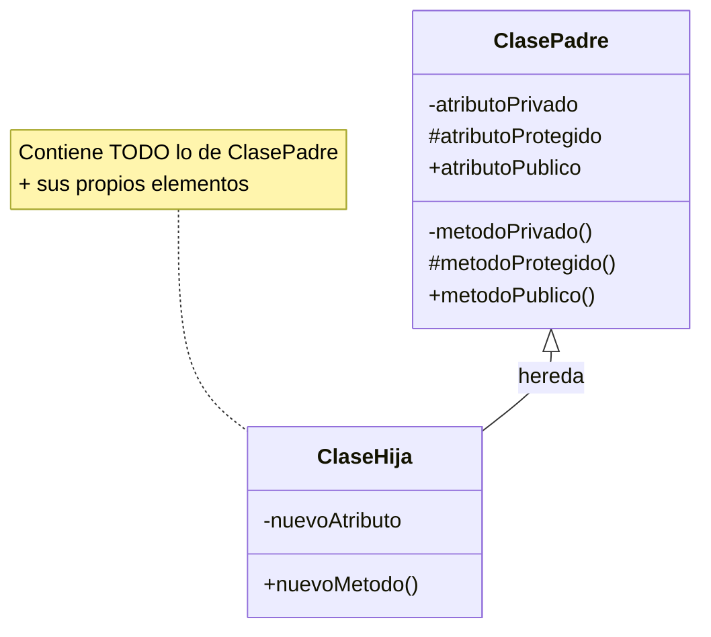
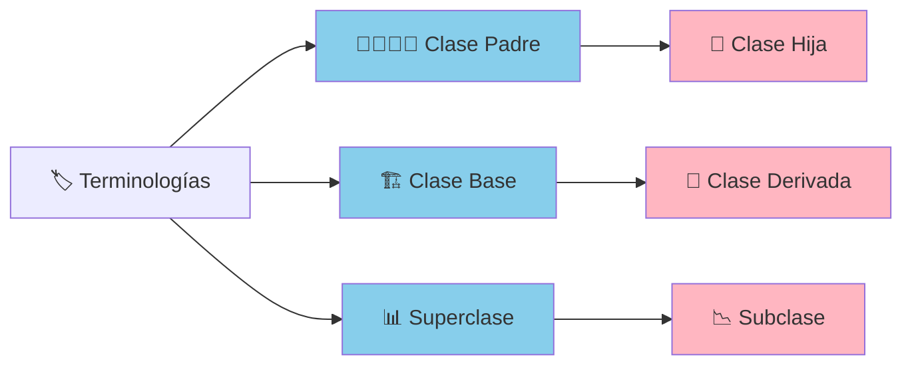
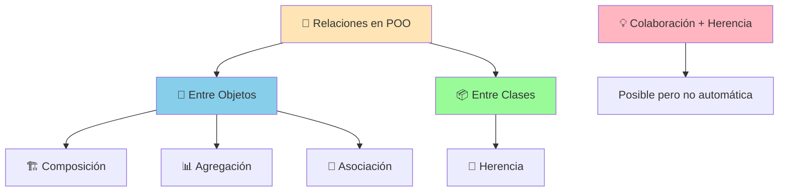
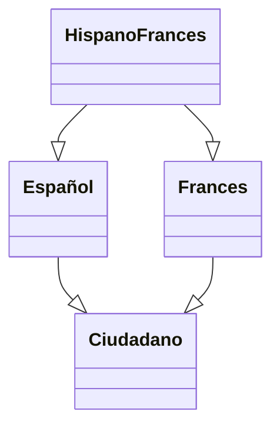
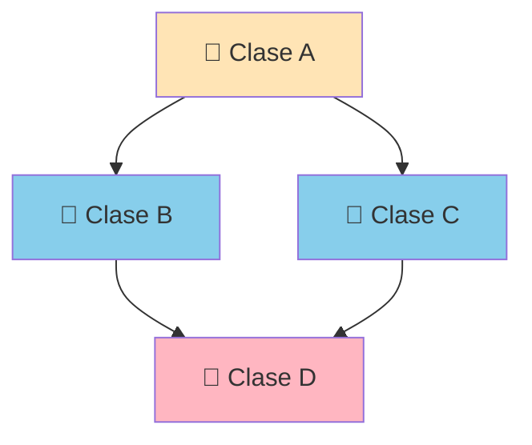
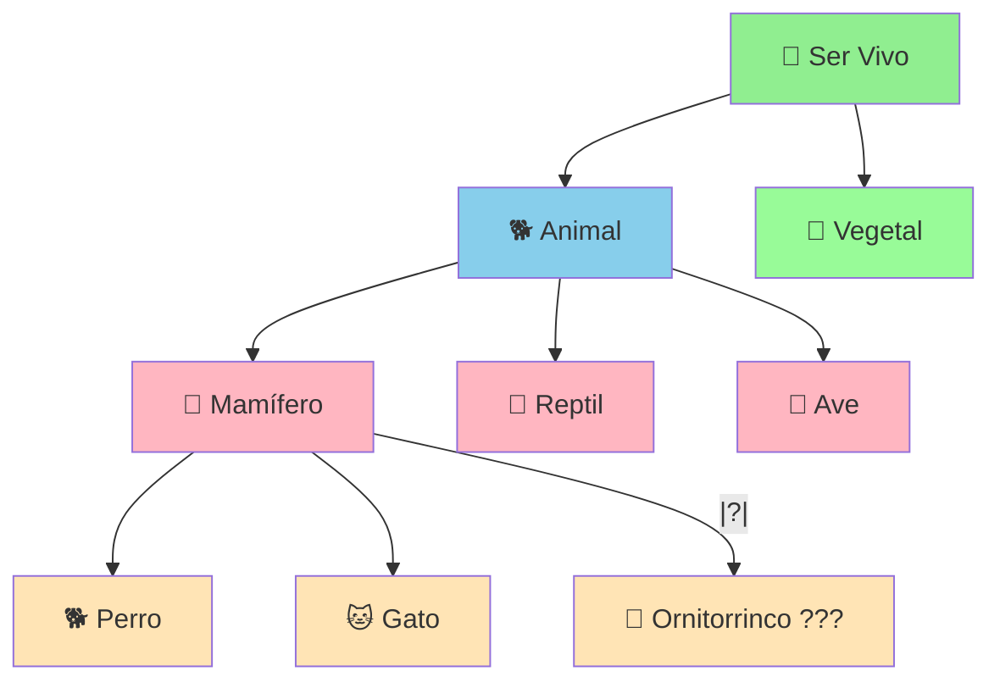
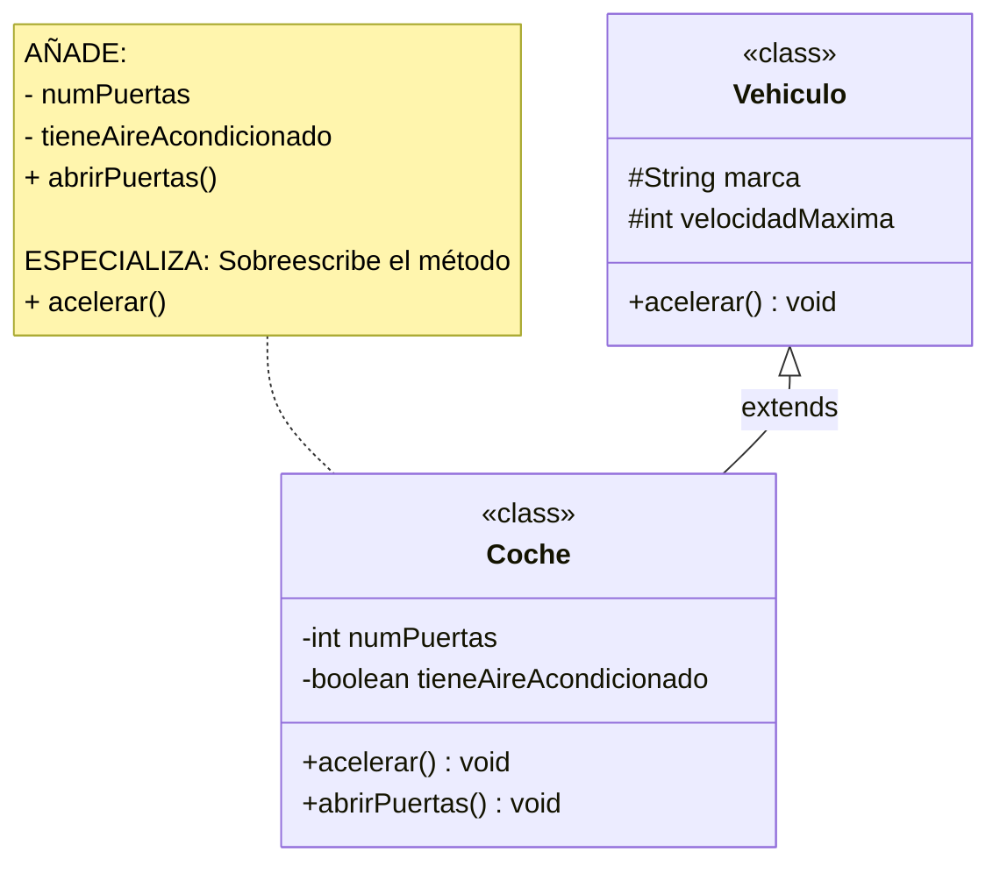
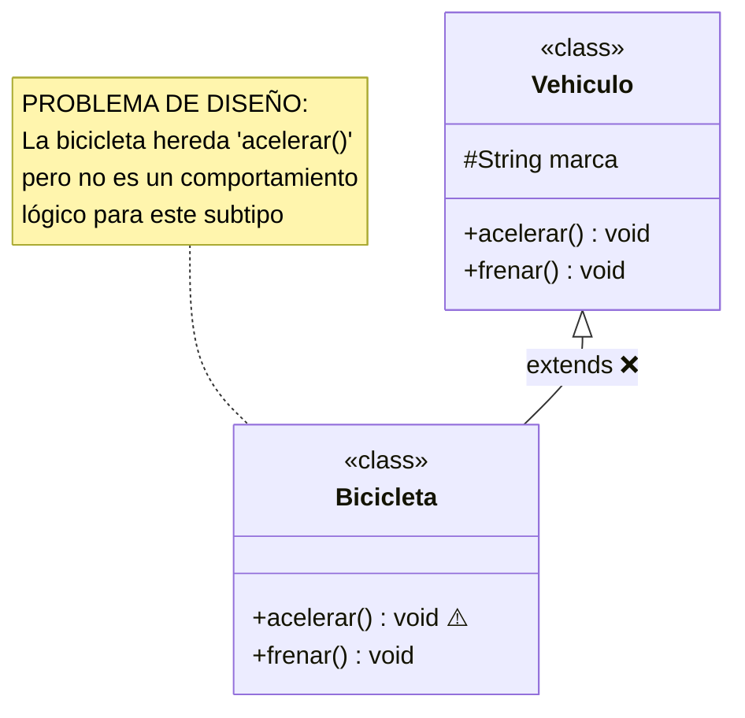
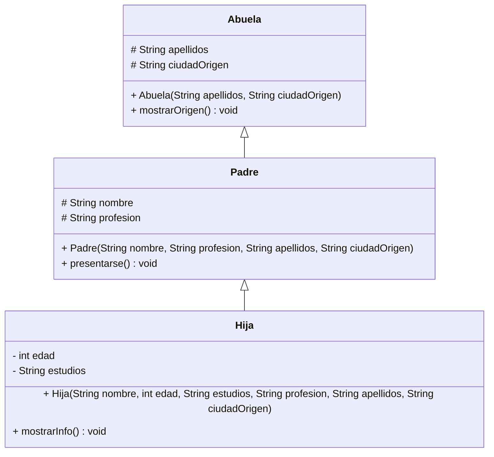
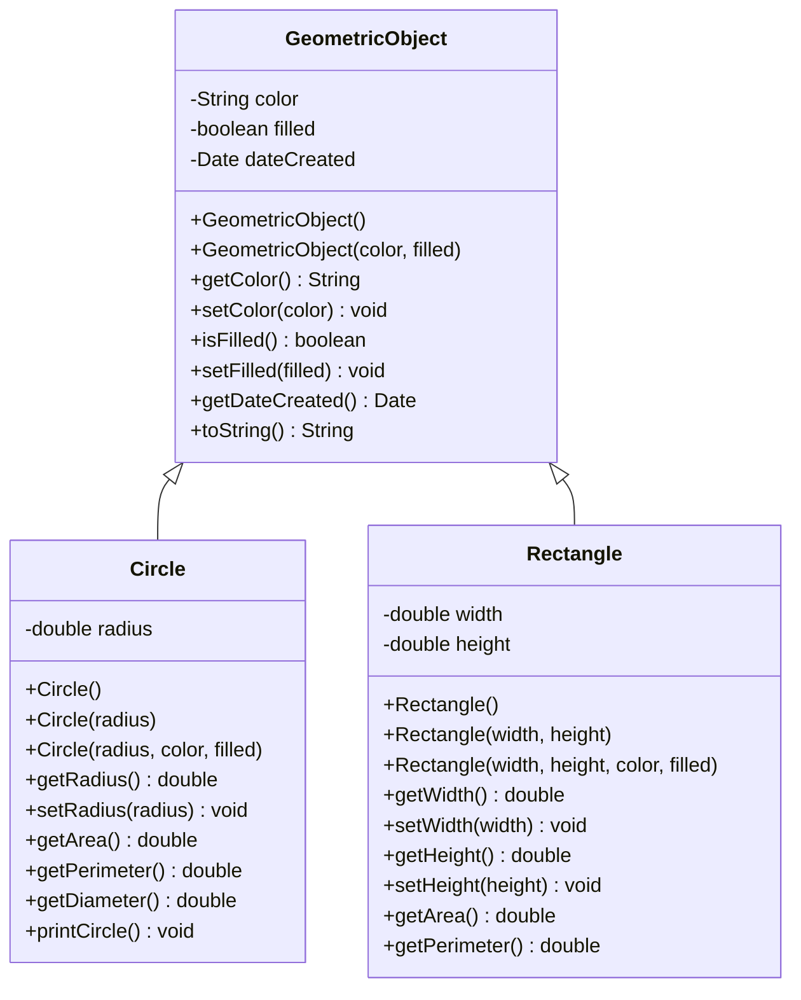

# UT6.1. Herencia

## 📋 Índice de contenidos

1. [Introducción a la herencia](#1-introducci%C3%B3n-a-la-herencia)
2. [Relación de herencia](#2-relaci%C3%B3n-de-herencia)
3. [Terminología](#3-terminolog%C3%ADa)
4. [Colaboración entre objetos](#4-colaboraci%C3%B3n-entre-objetos)
5. [Tipos de herencia](#5-tipos-de-herencia)
6. [Jerarquías de clasificación](#6-jerarqu%C3%ADas-de-clasificaci%C3%B3n)
7. [Reglas de construcción](#7-reglas-de-construcci%C3%B3n)
8. [Herencia en Java](#8-herencia-en-java)
    1. [Sintaxis básica](#81-sintaxis-b%C3%A1sica)
    2. [Ejemplo básico con jerarquía](#82-ejemplo-b%C3%A1sico-con-jerarqu%C3%ADa)
    3. [Ejemplo con GeometricObject](#83-ejemplo-con-geometricobject)
    4. [Práctica 1: Implementación de la jerarquía](#84-pr%C3%A1ctica-1-implementaci%C3%B3n-de-la-jerarqu%C3%ADa)
9. [Especialización de subclases](#9-especializaci%C3%B3n-de-subclases)
    1. [Formas de especialización](#91-formas-de-especializaci%C3%B3n)
    2. [Implicaciones de la herencia](#92-implicaciones-de-la-herencia)
10. [Gestión de la visibilidad](#10-gesti%C3%B3n-de-la-visibilidad)
    1. [Problema de acceso](#101-problema-de-acceso)
    2. [Soluciones disponibles](#102-soluciones-disponibles)
11. [Sobrescritura de métodos](#11-sobrescritura-de-m%C3%A9todos)
    1. [Concepto y características](#111-concepto-y-caracter%C3%ADsticas)
    2. [Implicaciones de la redefinición](#112-implicaciones-de-la-redefinici%C3%B3n)
    3. [Reutilización con super](#113-reutilizaci%C3%B3n-con-super)
    4. [Diferencias entre this y super](#114-diferencias-entre-this-y-super)
12. [Constructores en herencia](#12-constructores-en-herencia)
    1. [Especialización de constructores](#121-especializaci%C3%B3n-de-constructores)
    2. [Reutilización de constructores](#122-reutilizaci%C3%B3n-de-constructores)
    3. [Ejemplos prácticos](#123-ejemplos-pr%C3%A1cticos)
13. [Ejemplo práctico: Clase Persona](#13-ejemplo-pr%C3%A1ctico-clase-persona)
    1. [Clase Persona versión 2.0](#131-clase-persona-versi%C3%B3n-20)
    2. [Clase Alumno](#132-clase-alumno)
    3. [Práctica 2: Implementación completa](#133-pr%C3%A1ctica-2-implementaci%C3%B3n-completa)
14. [Herencia de Object en Java](#14-herencia-de-object-en-java)
    1. [Concepto fundamental](#141-concepto-fundamental)
    2. [Sobrescritura del método equals](#142-sobrescritura-del-m%C3%A9todo-equals)
15. [Ejercicios y preguntas](#15-ejercicios-y-preguntas)
16. [Resumen de modificadores de visibilidad](#16-resumen-de-modificadores-de-visibilidad)
17. [Clases y métodos finales](#17-clases-y-m%C3%A9todos-finales)

## 1. Introducción a la herencia

La **herencia** es uno de los pilares fundamentales de la programación orientada a objetos (POO), junto con la encapsulación y el polimorfismo. Este concepto permite crear nuevas clases basadas en clases existentes, aprovechando y extendiendo su funcionalidad de manera eficiente y organizada.

### 🔄 Concepto fundamental

La herencia en programación se basa en el mismo principio que la herencia en la vida real: **la transmisión de características de una entidad a otra**. En todos los ámbitos de la vida, la herencia representa una forma de transmisión de propiedades, conocimientos o características.

### 🌍 Ejemplos de herencia en la vida real

Para comprender mejor este concepto, veamos algunos ejemplos cotidianos:

**Herencia legal** 📜

- Un pariente fallece y todos sus bienes, así como sus obligaciones, se transmiten a los herederos
- Los herederos reciben tanto los activos como los pasivos del difunto

**Herencia biológica** 🧬

- Según la teoría de Darwin, el ser humano y el mono heredan de un ancestro común
- Cada especie posteriormente desarrolla y añade sus propias características específicas
- Los descendientes mantienen rasgos básicos pero evolucionan con particularidades propias

### 💻 Herencia en programación

En la programación orientada a objetos, la herencia funciona de manera similar a estos ejemplos reales:

- Una clase **"padre"** (superclase) transmite sus características a una clase **"hija"** (subclase)
- La clase hija **hereda** todos los atributos y métodos de la clase padre
- La clase hija puede **añadir** nuevos atributos y métodos específicos
- La clase hija puede **modificar** o **especializar** el comportamiento heredado

> [!NOTE]
> La herencia nos permite crear jerarquías de clases que reflejan las relaciones naturales entre los conceptos del mundo real, facilitando la reutilización de código y la organización lógica del programa.

## 2. Relación de herencia

En la programación orientada a objetos, cuando decimos que una clase hereda de otra, significa que **la clase heredada transmite a la clase heredera todo lo que tiene**. Esta transmisión es completa e incluye tanto los elementos públicos como los privados, aunque el acceso a estos últimos esté restringido.

### 🔄 Características de la transmisión

**Transmisión completa:**

- Se transmite **toda** la estructura de la clase padre
- Incluye tanto la **vista pública** como la **vista privada**
- Los atributos y métodos privados forman parte del objeto hijo, aunque no sean directamente accesibles

**Naturaleza dinámica:**

- La herencia **no es una simple copia estática** de código
- Se establece una **relación dinámica** entre las clases
- Los cambios en la clase padre pueden afectar a las clases hijas

**Acoplamiento controlado:**

- La herencia crea cierto nivel de **acoplamiento** entre clases
- Este acoplamiento es **necesario y beneficioso** cuando se usa correctamente
- Permite la reutilización de código y la coherencia en la jerarquía

### 📊 Representación de la herencia



### 🔑 Relación "ES UN"

La herencia establece una relación fundamental conocida como **"ES UN"** (is-a relationship). Esta relación indica que:

- Un objeto de la clase hija **ES UN** objeto de la clase padre
- Ejemplo: Si `Perro` hereda de `Animal`, entonces "un perro **ES UN** animal"
- Esta relación debe ser **lógica y natural** en el dominio del problema

### ⚖️ Ventajas y consideraciones

**Ventajas:**

- ✅ **Reutilización de código**: Evita duplicar funcionalidad
- ✅ **Mantenimiento**: Cambios en la clase padre se propagan automáticamente
- ✅ **Organización**: Crea estructuras lógicas y jerárquicas
- ✅ **Extensibilidad**: Facilita la adición de nuevas funcionalidades

**Consideraciones:**

- ⚠️ **Acoplamiento**: Las clases quedan más interconectadas
- ⚠️ **Complejidad**: Puede crear jerarquías difíciles de entender
- ⚠️ **Dependencia**: Cambios en la clase padre pueden afectar a las hijas

## 3. Terminología

En el contexto de la herencia, para referirnos a las clases involucradas en esta relación, se utilizan diferentes terminologías que son equivalentes entre sí. Es importante conocer todas ellas, ya que pueden aparecer en diferentes contextos y documentación.

### 📚 Terminologías utilizadas

#### 👨‍👩‍👧‍👦 Terminología genealógica

- **Clase padre** ↔ **Clase hija**
- **Clase madre** ↔ **Clase hija**
- Es la más intuitiva y fácil de entender
- Refleja la relación natural de transmisión generacional

#### 🏗️ Terminología arquitectónica

- **Clase base** ↔ **Clase derivada**
- Enfatiza que una clase sirve como **base** para construir otras
- La clase derivada se **deriva** o **construye** a partir de la base

#### 📊 Terminología jerárquica

- **Superclase** ↔ **Subclase**
- Refleja la posición en la jerarquía de clases
- La superclase está en un nivel **superior** en la jerarquía
- La subclase está en un nivel **subordinado** o **inferior**

### 🔄 Equivalencias



### 📖 Uso en diferentes contextos

**En documentación académica:**

- Suele preferirse la terminología **genealógica** (padre/hija) por ser más clara
- Es especialmente útil para estudiantes que están aprendiendo el concepto

**En documentación técnica:**

- Frecuentemente se usa la terminología **jerárquica** (superclase/subclase)
- Es común en APIs y documentación oficial de Java

**En análisis y diseño:**

- Se utiliza la terminología **arquitectónica** (base/derivada)
- Enfatiza el aspecto de diseño y construcción del software

> [!TIP]
> Independientemente de la terminología utilizada, el concepto es siempre el mismo: una clase que proporciona características y otra que las recibe y puede especializarlas.

## 4. Colaboración entre objetos

Es importante distinguir entre los diferentes tipos de relaciones que pueden existir en la programación orientada a objetos. La herencia es solo uno de estos tipos, y no debe confundirse con otras formas de relación entre clases.

### 🔄 Diferencias fundamentales

#### Relaciones entre objetos

- **Composición, agregación y asociación** son relaciones que se establecen entre **objetos**
- Estas relaciones implican que un objeto **utiliza** o **contiene** otro objeto
- Se basan en la **colaboración** durante la ejecución del programa

#### Relaciones entre clases

- **Herencia** es una relación que se establece entre **clases**
- Se define en tiempo de **compilación**, no de ejecución
- Una clase **extiende** las características de otra clase

### 🤝 Posibilidad de colaboración en herencia

Aunque la herencia es una relación entre clases, **es posible** que también exista colaboración entre los objetos de las clases implicadas en la herencia. Sin embargo, esta colaboración **no es automática** ni **inherente** a la herencia.



### 🌟 Ejemplo práctico

Consideremos las siguientes clases:

- **Clase padre**: `Animal`
- **Clase hija**: `Persona`

La relación de herencia existe porque "una persona **ES UN** animal" (biológicamente hablando). Sin embargo, la colaboración entre objetos de estas clases depende del **contexto de la aplicación**:

#### Escenario 1: Aplicación de evolución de especies

```java
// En este contexto, NO hay colaboración entre objetos
Animal ancestroComun = new Animal();
Persona humano = new Persona();

// No tiene sentido que un humano "use" o "colabore" con su ancestro
// La relación es puramente evolutiva/conceptual
```

#### Escenario 2: Aplicación de gestión de granja

```java
// En este contexto, SÍ puede haber colaboración
Animal animal = new Animal();
Persona granjero = new Persona();

// El granjero puede cuidar, alimentar, o interactuar con animales
granjero.cuidarAnimal(animal);
granjero.alimentarAnimal(animal);
```

### 📊 Análisis de la colaboración

| Aspecto | Herencia | Colaboración |
| :-- | :-- | :-- |
| **Naturaleza** | Relación estática entre clases | Relación dinámica entre objetos |
| **Momento** | Tiempo de compilación | Tiempo de ejecución |
| **Propósito** | Reutilización y especialización | Funcionalidad y comportamiento |
| **Obligatoriedad** | Automática una vez definida | Opcional según necesidades |

### 🎯 Recomendaciones prácticas

1. **Diseña la herencia** basándote en la relación "ES UN"
2. **Diseña la colaboración** basándote en la relación "USA" o "TIENE"
3. **No confundas** herencia con colaboración
4. **Evalúa cada contexto** para determinar si necesitas colaboración adicional

> [!WARNING]
> Un error común es pensar que la herencia automáticamente implica colaboración entre objetos. Son conceptos relacionados pero independientes que deben considerarse por separado en el diseño del software.

## 5. Tipos de herencia

La herencia se puede clasificar según diferentes criterios. El más importante es la clasificación basada en el **número de clases padre** de las que una clase puede heredar simultáneamente.

### 📊 Clasificación según el número de clases padre

1️⃣ Herencia simple

La **herencia simple** se produce cuando una clase derivada hereda de una **única** clase base. Es la forma más común y sencilla de herencia.

2️⃣ Herencia múltiple

La **herencia múltiple** se produce cuando una clase derivada hereda de **varias** clases base simultáneamente.



### 🌐 Soporte en diferentes lenguajes

La herencia múltiple no está soportada en todos los lenguajes de programación debido a su complejidad y los problemas que puede generar.

| Lenguaje | Herencia Simple | Herencia Múltiple | Observaciones |
| :-- | :--: | :--: | :-- |
| **Java** | ✅ | ❌ | Soporta interfaces múltiples |
| **C++** | ✅ | ✅ | Soporte completo pero complejo |
| **Python** | ✅ | ✅ | Soporta herencia múltiple |
| **C\#** | ✅ | ❌ | Similar a Java |
| **PHP** | ✅ | ❌ | Solo herencia simple |

### 🚫 Herencia múltiple en Java

Java **deliberadamente no soporta** herencia múltiple de clases para evitar ciertos problemas:

**1. Problema del diamante:**



Si las clases B y C definen métodos con el mismo nombre que A, ¿cuál debería heredar D?

**2. Conflictos de métodos:**

```java
// Pseudocódigo problemático
class A {
    void metodo() { /* implementación A */ }
}

class B {
    void metodo() { /* implementación B */ }
}

class C extends A, B {  // ¿Qué implementación de metodo() usar?
    // Ambigüedad
}
```

**3. Complejidad de constructores:**

- ¿En qué orden llamar a los constructores de las clases padre?
- ¿Cómo manejar múltiples jerarquías de inicialización?

### 🔧 Alternativas en Java

Aunque Java no soporta herencia múltiple de clases, ofrece alternativas como la implementación de varias interfaces (lo veremos en siguientes apartados) o la composición de objetos.

> [!TIP]
> En Java, cuando necesites combinar funcionalidades de múltiples fuentes, considera usar interfaces múltiples junto con composición en lugar de buscar herencia múltiple.
---
> [!IMPORTANT]
> La herencia simple es suficiente para la mayoría de casos de uso y mantiene el código más simple y mantenible. La herencia múltiple, aunque potente, puede crear más problemas que soluciones.

## 6. Jerarquías de clasificación

El **objetivo principal** de la herencia es crear **jerarquías de clasificación** que reflejen las relaciones naturales entre los conceptos del dominio del problema que estamos modelando. Estas jerarquías nos permiten organizar el conocimiento de manera estructurada y lógica.

### 🎯 Propósito de las jerarquías

Las jerarquías de clasificación nos permiten:

- **Organizar conceptos** de lo general a lo específico
- **Reflejar relaciones naturales** del mundo real
- **Facilitar la comprensión** del dominio del problema
- **Reutilizar características comunes** en diferentes niveles

### 🌳 Ejemplo de jerarquía: Seres vivos



### 📊 Características de las jerarquías

#### 🎭 Subjetividad

Las jerarquías están **sujetas a interpretaciones subjetivas** dependiendo del contexto y el propósito del sistema.

**Ejemplo: Clasificación de pacientes en un hospital:**

- **Por edad**: Pediatría, Adultos, Geriatría
- **Por especialidad**: Cardiología, Neurología, Traumatología
- **Por urgencia**: Urgente, Semi-urgente, No urgente
- **Por tipo de tratamiento**: Hospitalización, Ambulatorio, Domiciliario

Cada clasificación es válida pero sirve para diferentes propósitos.

#### 🦫 Elementos difíciles de categorizar

Siempre existen elementos que **desafían las clasificaciones tradicionales** y requieren consideración especial.

**Ejemplo: El ornitorrinco:**

- Es un **mamífero** (amamanta a sus crías)
- Pero **pone huevos** (como las aves y reptiles)
- Tiene **pico** (como las aves)
- Vive en **agua** (como algunos reptiles)

Este ejemplo muestra que las clasificaciones naturales no siempre son perfectas y pueden tener excepciones.

#### 🎯 Búsqueda de la perfección

Es **imposible encontrar la clasificación perfecta** que cubra todos los casos sin excepciones.

**Consideraciones:**

- Siempre habrá **casos límite** o **excepciones**
- Las clasificaciones deben ser **útiles** más que **perfectas**
- Es mejor una clasificación **funcional** que una **teóricamente perfecta**
- No es tan importante la etidad en sí, como **el dominio** en la que la vamos a usar (es decir, programa siempre teniendo en cuenta el contexto).

### 🎯 Recomendaciones prácticas

1. **Analiza el dominio**: Comprende profundamente el problema antes de crear la jerarquía
2. **Consulta expertos**: Habla con usuarios del dominio para validar la clasificación
3. **Mantén simplicidad**: No sobre-ingenierices la jerarquía
4. **Planifica para cambios**: Diseña pensando en futuras extensiones
5. **Documenta decisiones**: Explica por qué se tomaron ciertas decisiones de diseño

> [!NOTE]
> Las jerarquías de clasificación son herramientas poderosas, pero deben usarse con criterio. Una jerarquía bien diseñada facilita el mantenimiento y la comprensión del código, mientras que una mal diseñada puede complicar innecesariamente el sistema.
---
> [!WARNING]
> No trates de crear la jerarquía perfecta desde el principio. Es mejor empezar con algo simple y funcional, y luego evolucionar según las necesidades reales del sistema.

## 7. Reglas de construcción

Para que una jerarquía de herencia sea correcta y útil, debe seguir ciertas reglas fundamentales que garanticen la coherencia lógica y la funcionalidad del sistema. Estas reglas actúan como guías para diseñar herencias apropiadas.

### 🔧 Reglas fundamentales

#### 1️⃣ Regla de Generalización/Especialización

**Definición**: Las clases derivadas **no solo** deben heredar **todas** las características de la clase base, sino que **deben especializarse** en alguna funcionalidad adicional.

**Principios clave:**

- La clase hija **SIEMPRE** debe ser más específica que la clase padre
- **Nunca** se debe perder funcionalidad en la herencia
- Se deben **añadir** nuevas características o **modificar** las existentes
- La especialización debe tener **sentido lógico** en el dominio

**Ejemplo correcto:**



**Ejemplo incorrecto:**



#### 2️⃣ Regla "ES UN"

**Definición**: Debe poder responderse **afirmativa y naturalmente** a la pregunta: "¿Un objeto de la clase hija ES UN objeto de la clase padre?"

**Proceso de validación:**

1. Formular la pregunta: "¿Un `ClaseHija` ES UN `ClasePadre`?"
2. Evaluar si la respuesta es **lógicamente correcta**
3. Considerar si la relación es **natural** en el dominio del problema

### ✅ Ejemplos correctos de relación "ES UN"

| Clase Hija | Clase Padre | Pregunta | Respuesta |
| :-- | :-- | :-- | :-- |
| `Perro` | `Animal` | ¿Un perro ES UN animal? | ✅ Sí, naturalmente |
| `Coche` | `Vehiculo` | ¿Un coche ES UN vehículo? | ✅ Sí, claramente |
| `Estudiante` | `Persona` | ¿Un estudiante ES UNA persona? | ✅ Sí, obviamente |
| `Circulo` | `Figura` | ¿Un círculo ES UNA figura? | ✅ Sí, geométricamente |

### ❌ Ejemplos incorrectos de relación "ES UN"

| Clase Hija | Clase Padre | Pregunta | Respuesta |
| :-- | :-- | :-- | :-- |
| `Coche` | `Motor` | ¿Un coche ES UN motor? | ❌ No, un coche **TIENE** un motor |
| `Casa` | `Ladrillo` | ¿Una casa ES UN ladrillo? | ❌ No, una casa **ESTÁ HECHA DE** ladrillos |
| `Estudiante` | `Aula` | ¿Un estudiante ES UN aula? | ❌ No, un estudiante **ESTÁ EN** un aula |
| `Libro` | `Página` | ¿Un libro ES UNA página? | ❌ No, un libro **CONTIENE** páginas |

### 🎯 Proceso de validación de herencia

1. **Identifica la relación**: ¿Qué tipo de relación existe entre los conceptos?
2. **Aplica la regla "ES UN"**: Formúlala como pregunta natural
3. **Evalúa la especialización**: ¿La clase hija añade valor específico?
4. **Considera alternativas**: Si no es herencia, ¿qué tipo de relación es?
5. **Valida en el dominio**: ¿Tiene sentido para los usuarios del sistema?

> [!WARNING]
> No uses herencia solo para reutilizar código. La herencia debe representar una relación lógica real. Para reutilizar código sin relación "ES UN", usa composición o otros patrones de diseño.

## 8. Herencia en Java

### 8.1 Sintaxis básica

En Java, la herencia se implementa utilizando la palabra clave `extends`. La sintaxis básica es sencilla y clara:

```java
public class <NombreClase> extends <NombreClaseBase> {
    <CuerpoDeLaClase>
}
```

### 🔧 Características de la herencia en Java

**Transmisión de miembros:**

- **Todos los miembros** (atributos y métodos) de la clase base pasan a formar parte de la clase derivada
- Los miembros se integran como si hubieran sido declarados en la propia clase derivada

**Restricciones de acceso:**

- Solo se puede acceder desde la clase derivada a los miembros que en la clase base sean:
  - `public` (públicos)
  - `protected` (protegidos)
  - **Visibilidad de paquete** (sin modificador, si están en el mismo paquete)
- Los miembros `private` **NO** son accesibles directamente desde la clase derivada

**Herencia simple:**

- Java solo permite **herencia simple** de clases
- Una clase puede heredar directamente de una sola clase padre
- Se puede crear una **cadena de herencia** (A → B → C)

### 8.2 Ejemplo básico con jerarquía



```java
// Clase más general (abuela)
class Abuela {
    protected String apellidos;
    protected String ciudadOrigen;
    
    public Abuela(String apellidos, String ciudadOrigen) {
        this.apellidos = apellidos;
        this.ciudadOrigen = ciudadOrigen;
    }
    
    public void mostrarOrigen() {
        System.out.println("Familia " + apellidos + " de " + ciudadOrigen);
    }
}

// Clase intermedia (padre)
class Padre extends Abuela {
    protected String nombre;
    protected String profesion;
    
    public Padre(String nombre, String profesion, String apellidos, String ciudadOrigen) {
        super(apellidos, ciudadOrigen);
        this.nombre = nombre;
        this.profesion = profesion;
    }
    
    public void presentarse() {
        System.out.println("Soy " + nombre + " " + apellidos + ", " + profesion);
    }
}

// Clase más específica (hija)
class Hija extends Padre {
    private int edad;
    private String estudios;
    
    public Hija(String nombre, int edad, String estudios, String profesion, 
                String apellidos, String ciudadOrigen) {
        super(nombre, profesion, apellidos, ciudadOrigen);
        this.edad = edad;
        this.estudios = estudios;
    }
    
    public void mostrarInfo() {
        presentarse();
        System.out.println("Tengo " + edad + " años y estudio " + estudios);
        mostrarOrigen();
    }
}
```

### 8.3 Ejemplo con GeometricObject

Este ejemplo muestra una jerarquía más compleja con la clase `GeometricObject` como clase base:

```java
public class GeometricObject {
    private String color = "blanco";
    private boolean filled = false;
    private java.util.Date dateCreated;
    
    /** Constructor por defecto */
    public GeometricObject() {
        dateCreated = new java.util.Date();
    }
    
    /** Constructor con parámetros */
    public GeometricObject(String color, boolean filled) {
        this();
        this.color = color;
        this.filled = filled;
    }
    
    /** Getter para color */
    public String getColor() {
        return color;
    }
    
    /** Setter para color */
    public void setColor(String color) {
        this.color = color;
    }
    
    /** Getter para filled */
    public boolean isFilled() {
        return filled;
    }
    
    /** Setter para filled */
    public void setFilled(boolean filled) {
        this.filled = filled;
    }
    
    /** Getter para fecha de creación */
    public java.util.Date getDateCreated() {
        return dateCreated;
    }
    
    /** Representación en cadena */
    @Override
    public String toString() {
        return "Creado el " + dateCreated + "\nColor: " + color + 
               " y lleno: " + filled;
    }
}
```

#### 🔵 Clase Circle (Círculo)

```java
public class Circle extends GeometricObject {
    private double radius = 1.0;
    
    /** Constructor por defecto */
    public Circle() {
        super();
    }
    
    /** Constructor con radio */
    public Circle(double radius) {
        this();
        this.radius = radius;
    }
    
    /** Constructor completo */
    public Circle(double radius, String color, boolean filled) {
        super(color, filled);
        this.radius = radius;
    }
    
    /** Getter para radio */
    public double getRadius() {
        return radius;
    }
    
    /** Setter para radio */
    public void setRadius(double radius) {
        this.radius = radius;
    }
    
    /** Calcular área */
    public double getArea() {
        return Math.PI * radius * radius;
    }
    
    /** Calcular perímetro */
    public double getPerimeter() {
        return 2 * Math.PI * radius;
    }
    
    /** Calcular diámetro */
    public double getDiameter() {
        return 2 * radius;
    }
    
    /** Imprimir información del círculo */
    public void printCircle() {
        System.out.println("El círculo fue creado el " + getDateCreated() + 
                          " y el radio es " + radius);
    }
}
```

#### 🔲 Clase Rectangle (Rectángulo)

```java
public class Rectangle extends GeometricObject {
    private double width = 1.0;
    private double height = 1.0;
    
    /** Constructor por defecto */
    public Rectangle() {
        super();
    }
    
    /** Constructor con dimensiones */
    public Rectangle(double width, double height) {
        this();
        this.width = width;
        this.height = height;
    }
    
    /** Constructor completo */
    public Rectangle(double width, double height, String color, boolean filled) {
        super(color, filled);
        this.width = width;
        this.height = height;
    }
    
    /** Getter para ancho */
    public double getWidth() {
        return width;
    }
    
    /** Setter para ancho */
    public void setWidth(double width) {
        this.width = width;
    }
    
    /** Getter para alto */
    public double getHeight() {
        return height;
    }
    
    /** Setter para alto */
    public void setHeight(double height) {
        this.height = height;
    }
    
    /** Calcular área */
    public double getArea() {
        return width * height;
    }
    
    /** Calcular perímetro */
    public double getPerimeter() {
        return 2 * (width + height);
    }
}
```

### 🎯 Diagrama de clases UML



### 8.4 Práctica 1: Implementación de la jerarquía

**Objetivo:** Implementar completamente la jerarquía de formas geométricas y crear una clase de prueba.

**Tareas a realizar:**

1. Implementar las clases `GeometricObject`, `Circle` y `Rectangle`
2. Crear una clase `TestGeometricObject` para probar la funcionalidad
3. Investigar la accesibilidad de los atributos entre clases

<details>
<summary>💻 Solución completa</summary>

```java
// Clase de prueba
public class TestGeometricObject {
    public static void main(String[] args) {
        System.out.println("=== PRUEBA DE HERENCIA CON FORMAS GEOMÉTRICAS ===");
        
        // Crear círculos
        Circle circle1 = new Circle();
        Circle circle2 = new Circle(5.0);
        Circle circle3 = new Circle(3.0, "rojo", true);
        
        // Crear rectángulos
        Rectangle rect1 = new Rectangle();
        Rectangle rect2 = new Rectangle(4.0, 6.0);
        Rectangle rect3 = new Rectangle(2.0, 3.0, "azul", false);
        
        // Probar círculos
        System.out.println("\n=== CÍRCULOS ===");
        circle1.printCircle();
        System.out.println("Área del círculo 2: " + circle2.getArea());
        System.out.println("Perímetro del círculo 3: " + circle3.getPerimeter());
        
        // Probar rectángulos
        System.out.println("\n=== RECTÁNGULOS ===");
        System.out.println("Rectángulo 1: " + rect1.toString());
        System.out.println("Área del rectángulo 2: " + rect2.getArea());
        rect3.setColor("verde");
        System.out.println("Rectángulo 3 (color cambiado): " + rect3.toString());
        
        // Probar herencia de métodos
        System.out.println("\n=== HERENCIA DE MÉTODOS ===");
        System.out.println("Color del círculo 1: " + circle1.getColor());
        circle1.setFilled(true);
        System.out.println("¿Círculo 1 está lleno? " + circle1.isFilled());
        
        // Demostrar que los objetos contienen toda la información
        System.out.println("\n=== INFORMACIÓN COMPLETA ===");
        System.out.println("Información del círculo 3:");
        System.out.println("- Radio: " + circle3.getRadius());
        System.out.println("- Color: " + circle3.getColor());
        System.out.println("- Lleno: " + circle3.isFilled());
        System.out.println("- Fecha creación: " + circle3.getDateCreated());
        System.out.println("- Área: " + circle3.getArea());
        System.out.println("- Perímetro: " + circle3.getPerimeter());
    }
}
```

**Pregunta sobre accesibilidad:**
¿Puedes acceder a los atributos de la clase padre `GeometricObject` desde las clases hijas `Circle` o `Rectangle`?

**Respuesta:** 
No se puede acceder directamente a los atributos `color`, `filled` y `dateCreated` desde las clases hijas porque están declarados como `private`. Para acceder a ellos, debemos usar los métodos públicos (`getColor()`, `setColor()`, `isFilled()`, `setFilled()`, `getDateCreated()`).

Si quisiéramos acceso directo, tendríamos que cambiar la visibilidad a `protected`:

```java
public class GeometricObject {
    protected String color = "blanco";      // Accesible desde subclases
    protected boolean filled = false;       // Accesible desde subclases
    protected java.util.Date dateCreated;   // Accesible desde subclases
    
    // ... resto del código
}
```

</details>

> [!NOTE]
> Esta práctica demuestra los conceptos fundamentales de la herencia: reutilización de código, especialización de clases y la importancia de los modificadores de acceso.

> [!TIP]
> Observa cómo cada clase hija tiene acceso a todos los métodos públicos y protegidos de la clase padre, lo que permite una integración natural de funcionalidades.

## 9. Especialización de subclases

### 9.1 Formas de especialización

Una vez que una clase hereda de otra, existen varias formas de **especializarla** para que aporte valor específico más allá de lo que ya proporciona la clase padre.

```java
public class <NombreClase> extends <NombreClaseBase> {
    <atributoAñadido>
    // ...
    <métodoAñadido>
    <métodoSobreescrito>
}
```

#### 🔧 Métodos de especialización

**1️⃣ Añadir atributos nuevos:**

Los nuevos atributos siguen las mismas reglas sintácticas y semánticas que cualquier clase normal:

```java
class Vehiculo {
    protected String marca;
    protected int año;
    
    public void arrancar() {
        System.out.println("El vehículo arranca");
    }
}

class Coche extends Vehiculo {
    // 1. AÑADIR ATRIBUTOS NUEVOS
    private String tipoCombustible;
    private boolean tieneAireAcondicionado;
    
    // Constructor
    public Coche(String marca, int año, String tipoCombustible) {
        this.marca = marca;
        this.año = año;
        this.tipoCombustible = tipoCombustible;
    }
    
    // Getters y setters para los nuevos atributos

    public String getTipoCombustible() {
        return tipoCombustible;
    }
    
    public void setTieneAireAcondicionado(boolean tieneAire) {
        this.tieneAireAcondicionado = tieneAire;
    }
}
```

**2️⃣ Añadir métodos nuevos:**

Los nuevos métodos proporcionan funcionalidad específica de la subclase:

```java
class Coche extends Vehiculo {
    private String tipoCombustible;
    private boolean tieneAireAcondicionado;

    // 2. AÑADIR MÉTODOS NUEVOS
    public void abrirCapo() {
        System.out.println("Abriendo el capó del coche");
    }
    
    public void encenderLuces() {
        System.out.println("Encendiendo las luces del coche");
    }
    
    public void calcularConsumo(double kilometros) {
        double consumo = kilometros / 15.0; // Ejemplo: 15 km/l
        System.out.println("Consumo estimado: " + consumo + " litros");
    }
    
    public void cambiarMarcha(int marcha) {
        System.out.println("Cambiando a marcha: " + marcha);
    }
}
```

**3️⃣ Sobreescribir métodos existentes:**

Redefinir el comportamiento de un método heredado para que sea específico de la subclase:

```java
class Coche extends Vehiculo {
    private String tipoCombustible;
    
    // 3. SOBREESCRIBIR MÉTODOS EXISTENTES
    @Override
    public void arrancar() {
        System.out.println("Insertando llave en el contacto");
        System.out.println("Girando la llave");
        System.out.println("El coche " + marca + " arranca con " + tipoCombustible);
        System.out.println("Motor en marcha");
    }
}
```

#### ⚠️ Limitación importante

Los métodos añadidos **NO tienen acceso** a los atributos y métodos privados de la clase padre:

```java
class Vehiculo {
    private String numeroChasis;  // PRIVADO
    protected String marca;       // PROTEGIDO
    public int año;              // PÚBLICO
    
    private void inicializarSistemas() {  // PRIVADO
        System.out.println("Inicializando sistemas básicos");
    }
}

class Coche extends Vehiculo {
    public void mostrarInformacion() {
        // System.out.println(numeroChasis);    // ❌ ERROR: no accesible
        System.out.println("Marca: " + marca);  // ✅ OK: protegido
        System.out.println("Año: " + año);      // ✅ OK: público
        
        // inicializarSistemas();               // ❌ ERROR: método privado
    }
}
```

### 9.2 Implicaciones de la herencia

#### 🔒 Para los objetos de la clase padre

Los objetos de la clase padre **NO sufren ninguna alteración**. Su funcionalidad se mantiene completamente intacta:

```java
// Los objetos Vehiculo funcionan igual que antes
Vehiculo vehiculo = new Vehiculo();
vehiculo.arrancar();  // Funciona normalmente
```

#### 🆕 Para los objetos de la clase hija

Los objetos de la clase hija **obtienen capacidades expandidas**:

```java
Coche coche = new Coche("Toyota", 2023, "Gasolina");

// Métodos heredados de Vehiculo
coche.arrancar();        // Versión sobreescrita

// Métodos específicos de Coche
coche.abrirCapo();       // Nuevo método
coche.encenderLuces();   // Nuevo método
coche.calcularConsumo(100); // Nuevo método

// Acceso a atributos heredados (si son accesibles)
System.out.println("Año: " + coche.año);
```

#### 🔐 Respecto a la encapsulación

La herencia **respeta la encapsulación** establecida en la clase padre:

- Los atributos **privados** del padre están **presentes** en el objeto hijo
- Pero **NO son accesibles directamente** desde la clase hija
- Esto mantiene un **mínimo acoplamiento** entre clases
- Se debe usar la **interfaz pública** (getters/setters) para acceder a ellos

```java
class Vehiculo {
    private String numeroMotor;  // Presente en Coche, pero no accesible
    
    public String getNumeroMotor() {
        return numeroMotor;
    }
    
    public void setNumeroMotor(String numeroMotor) {
        this.numeroMotor = numeroMotor;
    }
}

class Coche extends Vehiculo {
    public void mostrarMotor() {
        // System.out.println(numeroMotor);           // ❌ ERROR
        System.out.println(getNumeroMotor());        // ✅ CORRECTO
    }
}
```

### 📊 Comparación de capacidades

| Aspecto | Clase Padre | Clase Hija |
| :-- | :-- | :-- |
| **Atributos** | Solo los propios | Propios + heredados |
| **Métodos** | Solo los propios | Propios + heredados + sobreescritos |
| **Funcionalidad** | Genérica | Especializada |
| **Compatibilidad** | Independiente | Depende del padre |

### 🎯 Ejemplo completo de especialización

```java
class Animal {
    protected String nombre;
    protected int edad;
    
    public Animal(String nombre, int edad) {
        this.nombre = nombre;
        this.edad = edad;
    }
    
    public void dormir() {
        System.out.println(nombre + " está durmiendo");
    }
    
    public void comer() {
        System.out.println(nombre + " está comiendo");
    }
}

class Perro extends Animal {
    // 1. AÑADIR ATRIBUTOS
    private String raza;
    private boolean esAdiestrado;
    
    // Constructor especializado
    public Perro(String nombre, int edad, String raza) {
        super(nombre, edad);  // Llamar al constructor del padre
        this.raza = raza;
        this.esAdiestrado = false;
    }
    
    // 2. AÑADIR MÉTODOS
    public void ladrar() {
        System.out.println(nombre + " está ladrando: ¡Guau!");
    }
    
    public void jugar() {
        System.out.println(nombre + " está jugando con la pelota");
    }
    
    public void adiestrar() {
        this.esAdiestrado = true;
        System.out.println(nombre + " ha sido adiestrado");
    }
    
    // 3. SOBREESCRIBIR MÉTODOS
    @Override
    public void comer() {
        System.out.println(nombre + " está comiendo pienso de perro");
        if (esAdiestrado) {
            System.out.println(nombre + " come ordenadamente");
        }
    }
    
    // Getters específicos
    public String getRaza() {
        return raza;
    }
    
    public boolean esAdiestrado() {
        return esAdiestrado;
    }
}

// Clase de prueba
public class TestEspecializacion {
    public static void main(String[] args) {
        Animal animal = new Animal("Genérico", 5);
        Perro perro = new Perro("Rex", 3, "Pastor Alemán");
        
        System.out.println("=== ANIMAL GENÉRICO ===");
        animal.dormir();
        animal.comer();
        
        System.out.println("\n=== PERRO ESPECIALIZADO ===");
        perro.dormir();      // Heredado de Animal
        perro.comer();       // Sobreescrito en Perro
        perro.ladrar();      // Específico de Perro
        perro.jugar();       // Específico de Perro
        perro.adiestrar();   // Específico de Perro
        
        System.out.println("\nRaza: " + perro.getRaza());
        System.out.println("¿Está adiestrado? " + perro.esAdiestrado());
    }
}
```

## 10. Gestión de la visibilidad

### 10.1 Problema de acceso

A menudo se presenta el siguiente **dilema**:

- La clase padre **NO dispone** de métodos públicos necesarios para manipular los atributos privados de la manera que se necesita desde la clase derivada
- Estos métodos **NO se necesitaron** realizar en la clase padre por el principio de encapsulación de la POO
- Por tanto, **si no se hace nada**, la clase hija no podría manipular de la manera que solo ella quiere los atributos de la clase padre

### 10.2 Soluciones disponibles

#### 🚫 1ª Solución (NO recomendada)

**Propuesta**: Usar la visibilidad `public` para los métodos que manipulan directamente los atributos privados.

> [!WARNING]
> **Esta solución NO ES RECOMENDABLE** ya que rompe el principio de encapsulación. Los objetos de la clase padre darían a conocer información que no se proporcionaba antes de la existencia de la clase derivada.

```java
class ClasePadre {
    private int atributoPrivado;
    
    // ❌ MAL: Hacer público solo por la clase hija
    public int getAtributoPrivado() { return atributoPrivado; }
    public void setAtributoPrivado(int valor) { this.atributoPrivado = valor; }
}
```

#### 🛡️ 2ª Solución (Formal)

**Propuesta**: Introducir la visibilidad `protected` con métodos de acceso específicos.

##### Características del modificador `protected`:

- Los miembros `protected` son **accesibles** desde la propia clase donde se definen
- También son **accesibles** desde sus clases derivadas
- **NO** son accesibles desde otras clases fuera de la jerarquía


##### Implementación formal:

```java
class ClasePadre {
    private int atributoPrivado;
    
    // ✅ MEJOR: Métodos protected específicos
    protected int getAtributoPrivadoProtected() { return atributoPrivado; }
    protected void setAtributoPrivadoProtected(int valor) { this.atributoPrivado = valor; }
}

class ClaseHija extends ClasePadre {
    public void modificarAtributo() {
        // Acceso a través de métodos protected
        int valor = getAtributoPrivadoProtected();
        setAtributoPrivadoProtected(valor + 1);
    }
}
```

**Ventajas**:

- Si se modifican los atributos de la clase padre, no se verían afectados en la clase hija
- Se mantiene un **mínimo acoplamiento**

#### 🔧 3ª Solución (Más extendida)

**Propuesta**: Hacer directamente los atributos de las clases padre de tipo `protected`.

```java
class ClasePadre {
    protected int atributoProtegido;  // Acceso directo
    
    public ClasePadre(int valor) {
        this.atributoProtegido = valor;
    }
}

class ClaseHija extends ClasePadre {
    public ClaseHija(int valor) {
        super(valor);
    }
    
    public void modificarAtributo() {
        // Acceso directo al atributo protected
        this.atributoProtegido++;
    }
}
```

> [!TIP]
> En la práctica, la tercera solución es la más utilizada por su simplicidad, aunque comporta un mayor acoplamiento.

## 11. Sobrescritura de métodos

### 11.1 Concepto y características

Hemos visto que **añadir atributos** y **añadir métodos** eran dos maneras de especializar una clase derivada.

Una **tercera manera** es la **SOBRESCRITURA DE MÉTODOS** (también conocida como **redefinición**).

#### 📋 Características de la sobrescritura

- La **cabecera del método** es exactamente igual que la de la clase base
- **Excepción**: La visibilidad puede ampliarse (de `protected` a `public`, por ejemplo)
- Se puede diferenciar entre **"refinamiento"** y **"reemplazo"**

```java
public class <NombreClase> extends <NombreClaseBase> {
    // Sobrescritura de un método
    @Override
    public <TipoRetorno> <nombreMetodo>(<parámetros>) {
        // Nueva implementación
    }
}
```

> [!IMPORTANT]
> **Sobre la anotación @Override**  
> 📢 Aunque el uso de `@Override` **no es obligatorio**, es altamente recomendable por dos razones:  
> 1️⃣ **Documentación**: Indica claramente que estás sobrescribiendo un método (mejora la legibilidad).  
> 2️⃣ **Seguridad**: El compilador verificará que existe un método heredado con la misma firma.  
> → Si lo escribes mal (ejemplo: `toString()` vs `tostring()`), ¡el compilador te avisará!

#### 🌟 Ejemplo práctico

```java
class Animal {
    protected String nombre;
    
    public void hacerSonido() {
        System.out.println("El animal hace un sonido");
    }
    
    protected void comer() {
        System.out.println("El animal come");
    }
}

class Perro extends Animal {
    // Sobrescritura con reemplazo
    @Override
    public void hacerSonido() {
        System.out.println("El perro hace: ¡Guau guau!");
    }
    
    // Sobrescritura con refinamiento
    @Override
    public void comer() {  // Ampliación de visibilidad: protected -> public
        System.out.println("El perro está preparado para comer");
        super.comer();  // Llamada al método original
        System.out.println("El perro ha terminado de comer");
    }
}
```

### 11.2 Implicaciones de la redefinición

#### 🔒 Restricciones de visibilidad

1. **La visibilidad del método de la clase padre NO PUEDE SER PRIVADA**
    - No se puede sobreescribir un método `private`

#### 🔄 Efectos de la sobrescritura

2. **Se anula la transmisión** del método de la clase padre
    - A partir de este momento se transmite el método redefinido
    - El método original queda "oculto" pero no eliminado

#### 📊 Tabla de posibilidades de sobrescritura

| Visibilidad original | ¿Puede ser sobreescrito? | Nuevas visibilidades permitidas |
| :--: | :--: | :--: |
| `private` | ❌ | N/A |
| package | ✅ | package, `protected`, `public` |
| `protected` | ✅ | `protected`, `public` |
| `public` | ✅ | `public` |

### 11.3 Reutilización con super

En muchos casos, cuando sobreescribimos un método, no queremos **reemplazar** completamente la funcionalidad original, sino **extenderla** o **refinarla**.

#### 🔑 La palabra clave `super`

Java proporciona la palabra reservada `super`, que es una **referencia constante** que:

- Guarda la dirección del objeto que recibe el mensaje
- Permite acceder al comportamiento de la **clase padre**
- Permite la **REUTILIZACIÓN** del método que se anuló su transmisión

#### 🌟 Patrones de uso comunes:

##### 1️⃣ **Extensión antes**

```java
class ClasePadre {
    protected void procesar() {
        System.out.println("Procesamiento básico");
    }
}

class ClaseHija extends ClasePadre {
    @Override
    protected void procesar() {
        System.out.println("Preparación específica");
        super.procesar();  // Llamada al método del padre
    }
}
```

##### 2️⃣ **Extensión después**

```java
class ClaseHija extends ClasePadre {
    @Override
    protected void procesar() {
        super.procesar();  // Llamada al método del padre primero
        System.out.println("Procesamiento adicional");
    }
}
```

##### 3️⃣ **Extensión antes y después**

```java
class ClaseHija extends ClasePadre {
    @Override
    protected void procesar() {
        System.out.println("Preparación");
        super.procesar();  // Funcionalidad del padre
        System.out.println("Finalización");
    }
}
```

### 11.4 Diferencias entre this y super

Es importante entender la diferencia entre estas dos palabras clave:

#### 🔄 `this`

- **Referencia** al supuesto objeto que recibe el mensaje
- Hace referencia al **método actual** (de la clase que se está ejecutando)
- **Comportamiento**: Clase hija


#### ⬆️ `super`

- **Referencia** al supuesto objeto que recibe el mensaje
- Hace referencia al **método de la clase padre**
- **Comportamiento**: Clase padre

## 12. Constructores en herencia

### 12.1 Especialización de constructores

Los constructores presentan un reto especial en herencia porque:

#### 🚧 Problemas principales

1. **Acceso limitado**: La clase hija debe inicializar sus atributos, pero tiene el problema de que no tiene acceso directo a los atributos `private` del padre
2. **Duplicación de código**: Si los atributos son `protected`, se puede tender a repetir el código que ya se realiza en la clase padre
3. **Reutilización**: La herencia pretende reutilizar código, por tanto debe ser posible invocar constructores de la clase padre desde la clase hija

#### 💡 Solución: Llamada a constructores del padre

```java
public class <NombreClase> extends <NombreClaseBase> {
    <visibilidad> <NombreClase>(<parámetros>) {
        super(<argumentos>);  // Primera sentencia obligatoria
        // Inicialización específica de la clase hija
    }
}
```

### 12.2 Reutilización de constructores

#### 📋 Reglas importantes

1. **Primera sentencia**: La invocación al constructor de la clase padre debe ser la **PRIMERA** sentencia del constructor
2. **Concordancia**: Los argumentos deben coincidir en cantidad y tipo con el constructor de la clase padre
3. **Omisión**: Se puede omitir `super()` para el caso del constructor de la clase padre con una lista vacía de parámetros

#### 🌟 Ejemplo completo

```java
class Persona {
    protected String dni;
    protected String nombre;
    protected int edad;
    
    // Constructor por defecto
    public Persona() {

    }
    
    // Constructor parametrizado
    public Persona(String dni, String nombre, int edad) {
        this.dni = dni;
        this.nombre = nombre;
        this.edad = (edad >= 0 && edad <= 150) ? edad : 0;
        System.out.println("Constructor parametrizado de Persona");
    }
    
    // Constructor copia
    public Persona(Persona otra) {
        this(otra.dni, otra.nombre, otra.edad);
        System.out.println("Constructor copia de Persona");
    }
}

class Estudiante extends Persona {
    private String universidad;
    private String carrera;
    
    // Constructor por defecto
    public Estudiante() {
        super();  // Llamada al constructor por defecto del padre
        this.universidad = "Sin asignar";
        this.carrera = "Sin asignar";
        System.out.println("Constructor por defecto de Estudiante");
    }
    
    // Constructor con universidad
    public Estudiante(String universidad) {
        this();  // Llamada al constructor por defecto de esta misma clase
        this.universidad = universidad;
        System.out.println("Constructor con universidad de Estudiante");
    }
    
    // Constructor completo
    public Estudiante(String dni, String nombre, int edad, String universidad, String carrera) {
        super(dni, nombre, edad);  // Llamada al constructor parametrizado del padre
        this.universidad = universidad;
        this.carrera = carrera;
        System.out.println("Constructor completo de Estudiante");
    }
    
    // Constructor copia
    public Estudiante(Estudiante otro) {
        super(otro);  // Llamada al constructor copia del padre
        this.universidad = otro.universidad;
        this.carrera = otro.carrera;
        System.out.println("Constructor copia de Estudiante");
    }
}
```

### 12.3 Ejemplos prácticos

#### 🧪 Prueba de los constructores:

```java
public class TestConstructores {
    public static void main(String[] args) {
        System.out.println("=== Constructor por defecto ===");
        Estudiante est1 = new Estudiante();
        
        System.out.println("\n=== Constructor con universidad ===");
        Estudiante est2 = new Estudiante("UPV");
        
        System.out.println("\n=== Constructor completo ===");
        Estudiante est3 = new Estudiante("12345678A", "Juan", 20, "UPV", "Informática");
        
        System.out.println("\n=== Constructor copia ===");
        Estudiante est4 = new Estudiante(est3);
    }
}
```

#### 📝 ¿Qué imprime el siguiente código?

```java
class A {
    public A() {
        System.out.println("A's no-arg constructor is invoked");
    }
}

class B extends A {
    // No hay constructor explícito
}

public class C {
    public static void main(String[] args) {
        B b = new B();
    }
}
```

**Respuesta:**

```text
A's no-arg constructor is invoked
```

**Explicación**: Como `B` no tiene constructor explícito, Java crea automáticamente un constructor por defecto que llama implícitamente a `super()`.

#### ❌ ¿Qué problema hay en el código?

```java
class A {
    public A(int x) {
        // Constructor que requiere parámetro
    }
}

class B extends A {
    public B() {
        // ERROR: No llama explícitamente a super(int)
    }
}

public class C {
    public static void main(String[] args) {
        B b = new B();
    }
}
```

**Problema**: La clase `A` solo tiene un constructor que requiere un parámetro `int`. La clase `B` intenta llamar implícitamente a `super()` (sin parámetros), pero este constructor no existe.

**Solución:**

```java
class B extends A {
    public B() {
        super(0);  // Llamada explícita con un valor
    }
    
    public B(int x) {
        super(x);  // Llamada explícita con el parámetro
    }
}
```

> [!IMPORTANT]
> Si la clase padre no tiene constructor por defecto, **SIEMPRE** hay que llamar explícitamente a `super()` con los parámetros adecuados.

## 13. Ejemplo práctico: Clase Persona

### 13.1 Clase Persona versión 2.0

Vamos a crear una versión mejorada de la clase `Persona` que servirá como base para la herencia:

#### 🔓 Cambio de visibilidad de los atributos

```java
public class Persona {
    // Cambio de private a protected para permitir herencia
    protected String dni;
    protected String nombre;
    protected int edad;
    
    // Constructores
    public Persona() {
        this.dni = "";
        this.nombre = "";
        this.edad = 0;
    }
    
    public Persona(String dni, String nombre, int edad) {
        this.dni = dni;
        this.nombre = nombre;
        if (edad >= 0 && edad < 150) {
            this.edad = edad;
        } else {
            this.edad = 0;
        }
    }
    
    public Persona(Persona p) {
        this(p.dni, p.nombre, p.edad);
    }
    
    // Getters y setters
    public String getDni() { return dni; }
    public void setDni(String dni) { this.dni = dni; }
    
    public String getNombre() { return nombre; }
    public void setNombre(String nombre) { this.nombre = nombre; }
    
    public int getEdad() { return edad; }
    public void setEdad(int edad) {
        if (edad >= 0 && edad < 150) {
            this.edad = edad;
        }
    }
    
    // Métodos funcionales
    public void visualizar() {
        System.out.println("DNI: " + dni);
        System.out.println("Nombre: " + nombre);
        System.out.println("Edad: " + edad);
    }
    
    public Persona clonar() {
        return new Persona(this);
    }
    
    // Método toString añadido
    @Override
    public String toString() {
        return this.dni + " - " + this.nombre + " - " + this.edad;
    }
}
```

### 13.2 Clase Alumno

Añadiremos una clase `Alumno` que herede de `Persona` y añada el nivel de estudios:

#### 🎯 Definición de la clase

```java
public class Alumno extends Persona {
    // Atributo específico del alumno
    private char nivel;
    
    // Constructores, métodos...
}
```

#### 📊 Atributos específicos

Se ha determinado que el nivel del alumno se almacenará en una variable de tipo `char`:

- **B**: Bachillerato
- **M**: Grado medio
- **S**: Grado superior
- **?**: Desconocido

```java
private char nivel;
```


#### 🏗️ Constructores de la clase Alumno

```java
public class Alumno extends Persona {
    private char nivel;
    
    // Constructor por defecto
    public Alumno() {
        super();  // Llamada al constructor por defecto de Persona
        this.nivel = '?';
    }
    
    // Constructor a partir de una Persona
    public Alumno(Persona p) {
        this('?', p);
    }
    
    // Constructor con datos básicos
    public Alumno(String dni, String nombre, int edad) {
        this('?', dni, nombre, edad);
    }
    
    // Constructor completo
    public Alumno(char nivel, String dni, String nombre, int edad) {
        super(dni, nombre, edad);
        this.nivel = validarNivel(nivel);
    }
    
    // Constructor con nivel y Persona
    public Alumno(char nivel, Persona p) {
        super(p);
        this.nivel = validarNivel(nivel);
    }
    
    // Constructor copia
    public Alumno(Alumno a) {
        this(a.nivel, a.dni, a.nombre, a.edad);
    }
    
    // Método auxiliar para validar el nivel
    private static char validarNivel(char nivel) {
        if (nivel == 'B' || nivel == 'M' || nivel == 'S') {
            return nivel;
        } else {
            return '?';
        }
    }
}
```

#### 🛠️ Métodos de la clase Alumno

```java
public class Alumno extends Persona {
    // ... constructores ...
    
    // Getter y setter para el nivel
    public char getNivel() {
        return nivel;
    }
    
    public void setNivel(char nivel) {
        this.nivel = validarNivel(nivel);
    }
    
    // sobrescritura del método visualizar
    @Override
    public void visualizar() {
        super.visualizar();  // Llamada al método del padre
        System.out.println("Nivel: " + this.nivel);
    }
    
    // sobrescritura del método toString
    @Override
    public String toString() {
        return super.toString() + " - " + this.nivel;
    }
    
    // sobrescritura del método clonar
    @Override
    public Alumno clonar() {
        return new Alumno(this);
    }
    
    // Método para obtener descripción del nivel
    public String getDescripcionNivel() {
        switch (this.nivel) {
            case 'B': return "Bachillerato";
            case 'M': return "Grado Medio";
            case 'S': return "Grado Superior";
            default: return "Desconocido";
        }
    }
}
```

### 13.3 Práctica 2: Implementación completa

#### 📋 Objetivos:

1. Realizar los cambios indicados sobre la clase `Persona`
2. Crear la clase `Alumno` completa
3. Probar la funcionalidad en un método `main`

<details>
<summary>💻 Solución completa</summary>

```java
public class TestPersonaAlumno {
    public static void main(String[] args) {
        System.out.println("=== CREACIÓN DE OBJETOS PERSONA ===");
        
        // Crear objetos Persona
        Persona persona1 = new Persona();
        Persona persona2 = new Persona("12345678A", "María", 25);
        Persona persona3 = new Persona(persona2);
        
        System.out.println("\n=== VISUALIZACIÓN PERSONAS ===");
        System.out.println("Persona 1:");
        persona1.visualizar();
        
        System.out.println("\nPersona 2:");
        persona2.visualizar();
        
        System.out.println("\nPersona 3 (copia):");
        persona3.visualizar();
        
        System.out.println("\n=== CREACIÓN DE OBJETOS ALUMNO ===");
        
        // Crear objetos Alumno
        Alumno alumno1 = new Alumno();
        Alumno alumno2 = new Alumno("87654321B", "Juan", 20);
        Alumno alumno3 = new Alumno('B', "11111111C", "Ana", 18);
        Alumno alumno4 = new Alumno('S', persona2);
        Alumno alumno5 = new Alumno(alumno3);
        
        System.out.println("\n=== VISUALIZACIÓN ALUMNOS ===");
        System.out.println("Alumno 1:");
        alumno1.visualizar();
        
        System.out.println("\nAlumno 2:");
        alumno2.visualizar();
        
        System.out.println("\nAlumno 3:");
        alumno3.visualizar();
        
        System.out.println("\nAlumno 4:");
        alumno4.visualizar();
        
        System.out.println("\nAlumno 5 (copia):");
        alumno5.visualizar();
        
        System.out.println("\n=== PRUEBA DE MÉTODOS toString ===");
        System.out.println("Persona 2: " + persona2.toString());
        System.out.println("Alumno 3: " + alumno3.toString());
        
        System.out.println("\n=== PRUEBA DE MODIFICACIÓN ===");
        alumno2.setNivel('M');
        System.out.println("Alumno 2 después de cambiar nivel:");
        alumno2.visualizar();
        System.out.println("Descripción nivel: " + alumno2.getDescripcionNivel());
        
        System.out.println("\n=== PRUEBA DE CLONACIÓN ===");
        Alumno alumnoClone = alumno3.clonar();
        System.out.println("Alumno clonado:");
        alumnoClone.visualizar();
        
        // Verificar que son objetos diferentes
        System.out.println("¿Son el mismo objeto? " + (alumno3 == alumnoClone));
        System.out.println("¿Tienen el mismo contenido? " + alumno3.toString().equals(alumnoClone.toString()));
    }
}
```

</details>

## 14. Herencia de Object en Java

### 14.1 Concepto fundamental

Independientemente de la utilización de la cláusula `extends`, **CUALQUIER CLASE** definida heredará directa o indirectamente de la clase `Object`.

#### 📚 Características de Object:

- **Object** es la **superclase más general** de cualquier clase Java
- Proporciona funcionalidad básica que todas las clases necesitan
- Permite polimorfismo universal

### 14.2 sobrescritura del método equals

## 🚨 Problema con el operador `==`

Cuando trabajamos con objetos, utilizamos **referencias**. El operador `==` **NO** comprueba si dos objetos son iguales según su contenido, sino si apuntan al mismo objeto en memoria.

```java
public class DemostracionEquals {
    public static void main(String[] args) {
        String dni1 = "00000000";
        String dni2 = "00000000";
        String dni3 = new String("00000000");
        char t[] = {'0','0','0','0','0','0','0','0'};
        String dni4 = new String(t);
        
        System.out.println("dni1: " + dni1);
        System.out.println("dni2: " + dni2);
        System.out.println("dni3: " + dni3);
        System.out.println("dni4: " + dni4);
        
        System.out.println("dni1 == dni2: " + (dni1 == dni2));  // true (pool de strings)
        System.out.println("dni1 == dni3: " + (dni1 == dni3));  // false (objetos diferentes)
        System.out.println("dni1 == dni4: " + (dni1 == dni4));  // false (objetos diferentes)
        System.out.println("dni3 == dni4: " + (dni3 == dni4));  // false (objetos diferentes)
        
        // Pero con equals...
        System.out.println("dni1.equals(dni3): " + dni1.equals(dni3));  // true (contenido igual)
        System.out.println("dni3.equals(dni4): " + dni3.equals(dni4));  // true (contenido igual)
    }
}
```

**Salida esperada:**

```text
dni1: 00000000
dni2: 00000000
dni3: 00000000
dni4: 00000000
dni1 == dni2: true
dni1 == dni3: false
dni1 == dni4: false
dni3 == dni4: false
dni1.equals(dni3): true
dni3.equals(dni4): true
```

## 🔧 Tres formas de implementar equals

### 1️⃣ Versión con `getClass()`

Esta implementación utiliza `getClass()` para asegurar que los objetos sean **exactamente** de la misma clase:

```java
public class Persona {
    protected String dni;
    protected String nombre;
    protected int edad;
    
    // ... constructores y otros métodos ...
    
    @Override
    public boolean equals(Object obj) {
        // 1. Comprobar si es el mismo objeto (optimización)
        if (obj == this) return true;
        
        // 2. Comprobar si es null
        if (obj == null) return false;
        
        // 3. Comprobar si es exactamente la misma clase
        if (obj.getClass() != this.getClass()) return false;
        
        // 4. Comparar el contenido (DNI como identificador único)
        return dni.equals(((Persona)obj).dni);
    }
}
```

**Características:**

- ✅ **Muy estricto**: Solo considera iguales objetos de la misma clase exacta
- ✅ **Simétrico**: Si `a.equals(b)` es true, entonces `b.equals(a)` también es true
- ❌ **Restrictivo**: No permite comparación con subclases

### 2️⃣ Versión con `instanceof`

Esta implementación utiliza `instanceof` para permitir comparaciones con subclases:

```java
public class Persona {
    protected String dni;
    protected String nombre;
    protected int edad;
    
    // ... constructores y otros métodos ...
    
    @Override
    public boolean equals(Object obj) {
        // 1. Comprobar si es el mismo objeto
        if (obj == this) return true;
        
        // 2. Comprobar si es null
        if (obj == null) return false;
        
        // 3. Comprobar si es una instancia de Persona (o subclase)
        if (obj instanceof Persona) {
            return dni.equals(((Persona)obj).dni);
        }
        
        return false;
    }
}
```

**Características:**

- ✅ **Flexible**: Permite comparación con subclases
- ✅ **Sigue el Principio de Sustitución de Liskov**: Las subclases pueden ser tratadas como la clase padre
- ⚠️ **Posible asimetría**: En algunos casos puede no ser simétrico

### 3️⃣ Versión específica para Persona (sobrecarga)

```java
public class Persona {
    protected String dni;
    protected String nombre;
    protected int edad;
    
    // ... constructores y otros métodos ...
    
    // Método específico para Persona (SOBRECARGA, no sobreescriptura)
    public boolean equals(Persona obj) {
        if (obj == this) return true;
        if (obj == null) return false;
        return dni.equals(obj.dni);
    }
}
```

> [!WARNING]
> Este método **NO** sobreescribe el método de Object sino que lo **sobrecarga**, ya que el parámetro es de tipo `Persona` y no `Object`. Por tanto, coexisten ambos métodos.

## 🤔 Dilema: `getClass()` vs `instanceof`

| Aspecto | `getClass()` | `instanceof` |
| :-- | :-- | :-- |
| **Comparación con subclases** | ❌ No permite | ✅ Permite |
| **Simetría** | ✅ Siempre simétrica | ⚠️ Puede no ser simétrica |
| **Principio de Sustitución de Liskov** | ⚠️ Más restrictivo | ✅ Más flexible |
| **Consistencia con herencia** | ❌ Puede ser problemático | ✅ Más natural |

### 📝 Ejemplo práctico del dilema

```java
public class TestEquals {
    public static void main(String[] args) {
        Persona persona = new Persona("12345678A", "Juan", 25);
        Alumno alumno = new Alumno("12345678A", "Juan", 25);

        System.out.println("=== CON getClass() ===");
        // persona.equals(alumno) sería false
        // alumno.equals(persona) sería false
        
        System.out.println("=== CON instanceof ===");
        // persona.equals(alumno) sería true
        // alumno.equals(persona) sería true
    }
}
```

## 🎯 Cuándo usar cada implementación

### Usar `getClass()` cuando

- ✅ **Necesitas comparación exacta**: Solo objetos de la misma clase deben ser iguales
- ✅ **Diseño cerrado**: No esperas que haya subclases o no quieres que se comparen
- ✅ **Máxima seguridad**: Prefieres un comportamiento predecible y estricto

### Usar `instanceof` cuando

- ✅ **Diseño abierto**: Tienes jerarquías de herencia y quieres que las subclases puedan compararse
- ✅ **Flexibilidad**: Quieres seguir el Principio de Sustitución de Liskov
- ✅ **Comportamiento natural**: La lógica de negocio sugiere que objetos de diferentes subclases pueden ser "iguales"

### Usar sobrecarga específica cuando

- ✅ **Rendimiento**: Necesitas un método más rápido para comparaciones específicas
- ✅ **Conveniencia**: Quieres evitar el casting en casos específicos
- ⚠️ **Complemento**: Úsala junto con una de las otras dos, no como reemplazo

## 15. Ejercicios y preguntas

### 🐛 ¿Qué errores hay en el código?

```java
1  public class Circle {
2      private double radius;
3
4      public Circle(double radius) {
5          radius = radius;  // ❌ ERROR 1
6      }
7
8      public double getRadius() {
9          return radius;
10     }
11
12     public double getArea() {
13         return radius * radius * Math.PI;
14     }
15 }
16
17 class B extends Circle {
18     private double length;
19
20     B(double radius, double length) {
21         Circle(radius);     // ❌ ERROR 2
22         length = length;    // ❌ ERROR 3
23     }
24
25     @Override
26     public double getArea() {
27         return getArea() * length;  // ❌ ERROR 4
28     }
29 }
```

#### 🔍 Errores identificados

1. **Línea 5**: `radius = radius;` - No utiliza `this.radius`, asigna el parámetro a sí mismo
2. **Línea 21**: `Circle(radius);` - No es la forma correcta de llamar al constructor padre
3. **Línea 22**: `length = length;` - No utiliza `this.length`, asigna el parámetro a sí mismo
4. **Línea 27**: `getArea() * length` - Llamada recursiva infinita

#### ✅ Código corregido

```java
public class Circle {
    private double radius;
    
    public Circle(double radius) {
        this.radius = radius;  // ✅ Corregido
    }
    
    public double getRadius() {
        return radius;
    }
    
    public double getArea() {
        return radius * radius * Math.PI;
    }
}

class B extends Circle {
    private double length;
    
    B(double radius, double length) {
        super(radius);           // ✅ Corregido
        this.length = length;    // ✅ Corregido
    }
    
    @Override
    public double getArea() {
        return super.getArea() * length;  // ✅ Corregido
    }
}
```

### 🤔 Preguntas conceptuales

#### 1️⃣ **Sobrecarga vs sobrescritura**

**Pregunta**: ¿Qué diferencia hay entre la sobrecarga y la sobrescritura de un método?

**Respuesta**:

- **Sobrecarga (Overloading)**: Múltiples métodos con el mismo nombre pero **diferentes parámetros**
- **sobrescritura (Overriding)**: Redefinir un método heredado con la **misma signatura**

#### 2️⃣ **Mismo nombre y tipo de retorno**

**Pregunta**: Si un método en una clase derivada tiene el mismo nombre que un método definido en su clase padre y los dos tienen el mismo tipo de retorno, ¿es sobrecarga o sobrescritura?

**Respuesta**: Depende de los **parámetros**:

- Si los parámetros son **iguales** → **sobrescritura**
- Si los parámetros son **diferentes** → **Sobrecarga**

#### 3️⃣ **Mismo nombre, diferente tipo de retorno**

**Pregunta**: Si un método en una clase derivada tiene el mismo nombre que un método definido en su clase padre y tienen diferente tipo de retorno, ¿supondría un problema?

**Respuesta**: **Sí**, supondría un **error de compilación** si los parámetros son los mismos. Java no permite sobreescribir cambiando solo el tipo de retorno.

#### 4️⃣ **Mismo nombre, diferentes parámetros**

**Pregunta**: Si un método en una clase derivada tiene el mismo nombre que un método definido en su clase padre y los dos tienen un número de parámetros diferente, ¿sería sobrecarga o sobrescritura?

**Respuesta**: **Sobrecarga**. Los dos métodos coexisten y se llaman según los argumentos proporcionados.

## 16. Resumen de modificadores de visibilidad

### 📊 Tabla de visibilidad

| **Modificador** | **Clase** | **Paquete** | **Subclase** | **Todos** |
| :--: | :--: | :--: | :--: | :--: |
| `public` | ✅ | ✅ | ✅ | ✅ |
| `protected` | ✅ | ✅ | ✅ | ❌ |
| *(paquete)* | ✅ | ✅ | ❌ | ❌ |
| `private` | ✅ | ❌ | ❌ | ❌ |

### 🔍 Explicación detallada

#### 🔓 **public**

- **Accesible desde cualquier lugar**
- Utilizar con precaución para mantener la encapsulación
- Ideal para la interfaz pública de la clase

#### 🛡️ **protected**

- **Accesible desde la misma clase, paquete y subclases**
- Perfecto para herencia
- Permite acceso controlado a las clases hijas

#### 📦 **Visibilidad de paquete** (sin modificador)

- **Accesible solo desde el mismo paquete**
- Útil para clases colaboradoras
- Nivel de visibilidad por defecto

#### 🔒 **private**

- **Accesible solo desde la misma clase**
- Máximo nivel de encapsulación
- Ideal para implementación interna

### 🎯 Recomendaciones de uso

> [!TIP]
> **Principio del mínimo privilegio**: Utiliza siempre el nivel de visibilidad más restrictivo posible.

1. **Atributos**: Preferiblemente `private` o `protected` para herencia
2. **Métodos públicos**: Solo los necesarios para la interfaz
3. **Métodos auxiliares**: `private` para encapsulación
4. **Constructores**: Según la necesidad de creación de objetos

## 17. Clases y métodos finales

## 🔒 Concepto de final

La palabra clave `final` en Java permite **restringir** la herencia y la sobreescriptura, proporcionando mayor control sobre el diseño de nuestras clases y métodos.

### 📦 Clases final

Una **clase final** es aquella que **no puede ser heredada** por ninguna otra clase.

```java
public final class ClaseFinal {
    // Esta clase no puede tener subclases
    private String dato;
    
    public ClaseFinal(String dato) {
        this.dato = dato;
    }
    
    public void mostrarDato() {
        System.out.println("Dato: " + dato);
    }
}

// ❌ ERROR: No se puede heredar de una clase final
// class SubclaseFinal extends ClaseFinal {
//     // Esto causará un error de compilación
// }
```

#### 🎯 Cuándo usar clases final

**Casos recomendados:**

- ✅ **Clases de utilidad**: Como `Math`, `String`, `System`
- ✅ **Clases inmutables**: Donde no queremos que se modifique el comportamiento
- ✅ **Seguridad**: Para evitar modificaciones no deseadas del comportamiento
- ✅ **Diseño cerrado**: Cuando la clase está completamente definida

**Ejemplos en la API de Java:**

- `String` - Evita modificar su comportamiento inmutable
- `Integer`, `Double` - Clases envolventes que no deben ser modificadas
- `Math` - Clase de utilidades matemáticas

### 🔧 Métodos final

Un **método final** es aquel que **no puede ser sobreescrito** por las subclases.

```java
public class ClasePadre {
    // Método normal - puede ser sobreescrito
    public void metodoNormal() {
        System.out.println("Método normal del padre");
    }
    
    // Método final - NO puede ser sobreescrito
    public final void metodoFinal() {
        System.out.println("Método final del padre");
    }
    
    // Método protegido final
    protected final void metodoProtegidoFinal() {
        System.out.println("Método protegido final");
    }
}

public class ClaseHija extends ClasePadre {
    // ✅ CORRECTO: Puede sobreescribir método normal
    @Override
    public void metodoNormal() {
        System.out.println("Método normal sobreescrito en hija");
    }
    
    // ❌ ERROR: No puede sobreescribir método final
    // @Override
    // public void metodoFinal() {
    //     System.out.println("Esto causará error de compilación");
    // }
}
```

#### 🎯 Cuándo usar métodos final

**Casos recomendados:**

- ✅ **Comportamiento crítico**: Métodos que no deben ser modificados
- ✅ **Algoritmos seguros**: Lógica que debe mantenerse intacta
- ✅ **Contratos importantes**: Métodos que forman parte de un contrato inmutable
- ✅ **Optimización**: El compilador puede optimizar mejor los métodos final

### 📊 Comparación con otros modificadores

| Modificador | Herencia de clase | Sobrescritura de método | Uso |
|:------------|:------------------|:-------------------------|:----|
| `final` | ❌ Prohibida | ❌ Prohibida | Restricción total |
| `abstract` | ✅ Obligatoria | ✅ Obligatoria | Plantilla a completar |
| Sin modificador | ✅ Opcional | ✅ Opcional | Comportamiento normal |

### 🌟 Ejemplos prácticos

#### Ejemplo 1: Clase final para configuración

```java
public final class ConfiguracionSistema {
    private static final String VERSION = "1.0.0";
    private final String rutaConfiguracion;
    
    public ConfiguracionSistema(String ruta) {
        this.rutaConfiguracion = ruta;
    }
    
    public String obtenerVersion() {
        return VERSION;
    }
    
    public void validarConfiguracion() {
        System.out.println("Validando configuración en: " + rutaConfiguracion);
        // Lógica crítica de validación
    }
}
```

#### Ejemplo 2: Método final en jerarquía

```java
public class Vehiculo {
    protected String marca;
    
    public Vehiculo(String marca) {
        this.marca = marca;
    }
    
    // Método que puede ser sobreescrito
    public void arrancar() {
        System.out.println("Arrancando vehículo " + marca);
    }
    
    // Método final - comportamiento que no debe cambiar
    public final void mostrarInformacionLegal() {
        System.out.println("Marca: " + marca);
        System.out.println("Registro obligatorio según normativa europea");
        System.out.println("Revisión técnica requerida");
    }
}

public class Coche extends Vehiculo {
    public Coche(String marca) {
        super(marca);
    }
    
    @Override
    public void arrancar() {
        System.out.println("Coche " + marca + " arrancando con motor de combustión");
    }
    
    // mostrarInformacionLegal() no puede ser sobreescrito
    // Es información legal que debe ser idéntica para todos los vehículos
}
```

### Resumen

- **Clases final**: No pueden ser heredadas → Úsalas para clases completamente definidas
- **Métodos final**: No pueden ser sobreescritos → Úsalos para comportamiento crítico
- **Propósito**: Proporcionar control sobre la herencia y garantizar comportamiento específico
- **Uso recomendado**: Con moderación y solo cuando sea realmente necesario

El modificador `final` es una herramienta poderosa para el diseño de software que, usado correctamente, puede mejorar la seguridad y predictibilidad del código.

## 🎯 Conclusiones

La **herencia** es uno de los pilares fundamentales de la programación orientada a objetos que permite:

- 🔄 **Reutilización de código** eficiente
- 🏗️ **Construcción de jerarquías** lógicas
- 🎭 **Polimorfismo** y comportamiento dinámico
- 🛡️ **Encapsulación** mantenida mediante visibilidad adecuada

### 🌟 Puntos clave a recordar

1. **Herencia simple**: Java solo permite una clase padre
2. **Regla "es un"**: Verificar siempre la relación lógica
3. **Visibilidad protected**: Clave para la herencia eficiente
4. **Sobrescritura**: Permite especialización de comportamiento
5. **Constructores**: Siempre llamar `super()` cuando sea necesario
6. **Object**: Todas las clases heredan de Object implícitamente

> [!IMPORTANT]
> La herencia debe ser utilizada cuando hay una relación natural "es un" entre clases, no como simple mecanismo de reutilización de código.

**Recuerda**: Una buena jerarquía de herencia hace que el código sea más mantenible, extensible y comprensible. Siempre prioriza la claridad y la lógica del dominio por encima de la conveniencia técnica! 🚀

<p align="center">📚 <em>Fin del apartado UT6.1 - Herencia</em></p>
