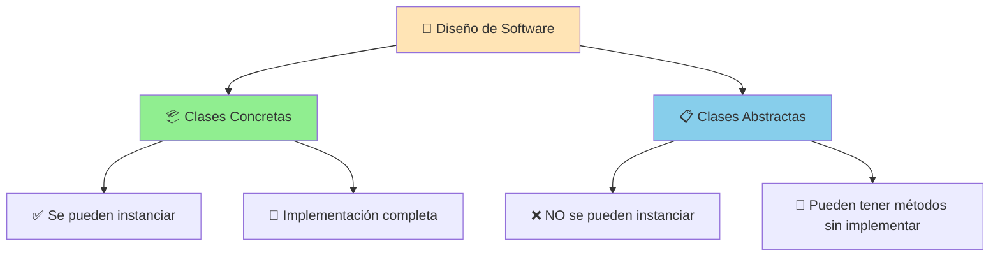
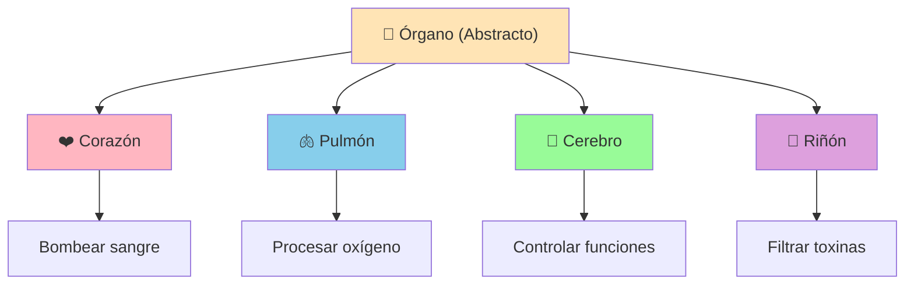

# UT6.2. Clases Abstractas y Métodos Abstractos

## 📋 Índice de contenidos

1. [Introducción a las clases abstractas](#1-introducci%C3%B3n-a-las-clases-abstractas)
2. [Concepto de clase abstracta](#2-concepto-de-clase-abstracta)
3. [Definición de clases abstractas en Java](#3-definici%C3%B3n-de-clases-abstractas-en-java)
    1. [Sintaxis básica](#31-sintaxis-b%C3%A1sica)
    2. [Ejemplo básico: Jerarquía de motores](#32-ejemplo-b%C3%A1sico-jerarqu%C3%ADa-de-motores)
    3. [Ejemplo avanzado: GeometricObject abstracto](#33-ejemplo-avanzado-geometricobject-abstracto)
4. [Métodos abstractos](#4-m%C3%A9todos-abstractos)
    1. [Concepto y características](#41-concepto-y-caracter%C3%ADsticas)
    2. [Sintaxis de métodos abstractos](#42-sintaxis-de-m%C3%A9todos-abstractos)
    3. [Ejemplo práctico con formas geométricas](#43-ejemplo-pr%C3%A1ctico-con-formas-geom%C3%A9tricas)
5. [Implicaciones de los métodos abstractos](#5-implicaciones-de-los-m%C3%A9todos-abstractos)
    1. [Reglas fundamentales](#51-reglas-fundamentales)
    2. [Opciones para clases derivadas](#52-opciones-para-clases-derivadas)
6. [Práctica 1: Implementación de jerarquía abstracta](#6-pr%C3%A1ctica-1-implementaci%C3%B3n-de-jerarqu%C3%ADa-abstracta)
7. [Ventajas de las clases abstractas](#7-ventajas-de-las-clases-abstractas)
8. [Cuándo usar clases abstractas](#8-cu%C3%A1ndo-usar-clases-abstractas)
9. [Ejercicio de comprensión](#9-ejercicio-de-comprensi%C3%B3n)
10. [Diferencias con interfaces](#10-diferencias-con-interfaces)
11. [Buenas prácticas](#11-buenas-pr%C3%A1cticas)

## 1. Introducción a las clases abstractas

Hasta ahora hemos trabajado con **clases concretas**, que aparecen de la descripción de los atributos y métodos que definen el comportamiento de un conjunto de objetos homogéneos.

Sin embargo, cuando diseñamos jerarquías complejas, a menudo encontramos que ciertas clases representan **conceptos demasiado generales** para ser instanciados directamente, pero que proporcionan funcionalidad y/o información común a sus subclases.



## 2. Concepto de clase abstracta

Las **clases abstractas** son clases **NO INSTANCIABLES** que aparecen del factor común del código de otras clases con:

- **Atributos y métodos comunes** entre varias clases relacionadas
- **Cabeceras de métodos comunes** sin definición concreta
- **Funcionalidad parcialmente implementada** que requiere especialización


### 🔑 Características principales

- **🚫 No instanciables**: No se pueden crear objetos directamente de ellas
- **🏗️ Base para herencia**: Sirven como superclases para otras clases
- **📋 Contratos**: Definen qué métodos deben implementar las subclases
- **🔧 Funcionalidad mixta**: Pueden combinar métodos implementados y otros abstractos

> [!CAUTION]
>
> **ATENCIÓN**: No debemos pensar que siempre las clases superiores de la jerarquía serán abstractas y las inferiores concretas. **Dependerá de cada problema** y del diseño específico que necesitemos.

### 🩺 Analogía médica

Consideremos un sistema hospitalario donde diferentes órganos tienen características comunes pero funcionalidades específicas:



En este caso, `Órgano` sería una clase abstracta porque:

- Define características comunes (ubicación, tamaño, tipo de tejido)
- No tiene sentido instanciar un "órgano genérico"
- Las subclases implementan funcionalidades específicas

> [!IMPORTANT]
> La **abstracción se centra en las características esenciales** de algún objeto, en relación a la perspectiva del observador y las necesidades del sistema.

## 3. Definición de clases abstractas en Java

### 3.1 Sintaxis básica

```java
public abstract class <NombreClase> {
    <CuerpoDeClase>
}
```

**Reglas importantes:**

- Se utiliza la palabra clave `abstract` antes de `class`
- La clase puede heredar de otra clase abstracta
- No se pueden crear objetos con `new` de esta clase
- Puede contener tanto métodos concretos como abstractos

### 3.2 Ejemplo básico: Jerarquía de motores

<details><summary>Código Java</summary>

```java
public abstract class Motor {
    protected String marca;
    protected double potencia;
    
    // Constructor
    public Motor(String marca, double potencia) {
        this.marca = marca;
        this.potencia = potencia;
    }
    
    // Método concreto - implementado
    public void mostrarInfo() {
        System.out.println("Motor " + marca + " - Potencia: " + potencia + " HP");
    }
    
    // Método abstracto - sin implementar
    public abstract void arrancar();
    public abstract void detener();
    public abstract double calcularConsumo();
    
    // Getters
    public String getMarca() { return marca; }
    public double getPotencia() { return potencia; }
}
```

**Clases derivadas concretas:**

```java
public class MotorElectrico extends Motor {
    private double voltaje;
    
    public MotorElectrico(String marca, double potencia, double voltaje) {
        super(marca, potencia);
        this.voltaje = voltaje;
    }
    
    @Override
    public void arrancar() {
        System.out.println("Motor eléctrico arrancando silenciosamente...");
    }
    
    @Override
    public void detener() {
        System.out.println("Motor eléctrico deteniéndose instantáneamente...");
    }
    
    @Override
    public double calcularConsumo() {
        return potencia * 0.8; // kW/h
    }
}

public class MotorGasolina extends Motor {
    private int cilindros;
    
    public MotorGasolina(String marca, double potencia, int cilindros) {
        super(marca, potencia);
        this.cilindros = cilindros;
    }
    
    @Override
    public void arrancar() {
        System.out.println("Motor de gasolina arrancando con " + cilindros + " cilindros...");
    }
    
    @Override
    public void detener() {
        System.out.println("Motor de gasolina deteniéndose gradualmente...");
    }
    
    @Override
    public double calcularConsumo() {
        return potencia * 0.3; // L/100km aproximado
    }
}
```

</details>


### 3.3 Ejemplo avanzado: GeometricObject abstracto

Basándose en el ejemplo de herencia anterior, podemos convertir `GeometricObject` en una clase abstracta:

```java
import java.time.LocalDate;
public abstract class GeometricObject {
    protected String color;
    protected boolean filled;
    private LocalDate dateCreated;
    
    /** Constructor por defecto */
    protected GeometricObject() {
        this.color = "blanco";
        this.filled = false;
        dateCreated = LocalDate.now();
    }
    
    /** Constructor con parámetros */
    protected GeometricObject(String color, boolean filled) {
        this();
        this.color = color;
        this.filled = filled;
    }
    
    /** Métodos concretos implementados */
    public String getColor() { return color; }
    public void setColor(String color) { this.color = color; }
    public boolean isFilled() { return filled; }
    public void setFilled(boolean filled) { this.filled = filled; }
    public LocalDate getDateCreated() { return dateCreated; }
    
    @Override
    public String toString() {
        return "Creado el " + dateCreated + "\nColor: " + color + 
               " y lleno: " + filled;
    }
    
    /** Métodos abstractos - deben ser implementados por subclases */
    public abstract double getArea();
    public abstract double getPerimeter();
}
```

> [!NOTE]
>
> Los métodos abstractos aparecen **en cursiva** en los diagramas UML, y el nombre de la clase abstracta también aparece en cursiva.
>
> 

## 4. Métodos abstractos

### 4.1 Concepto y características

Un **método abstracto** es un método **declarado pero no implementado**. Es decir:

- **Solo se escribe** su nombre, parámetros y tipo de retorno
- **NO se escribe** su cuerpo de implementación
- Se escriben **sin llaves `{}`** y terminan con **punto y coma `;`**
- **Obligatoriamente** deben ser implementados en las subclases concretas (si su clase hija también es abstracta, no está obligada a implementarlos)

### 4.2 Sintaxis de métodos abstractos

```java
[modificador_visibilidad] abstract TipoRetorno nombreMetodo(listaParametros);
```

**Ejemplos:**

```java
public abstract void dibujar();
protected abstract double calcular(double x, double y);
public abstract String obtenerDescripcion();
```

### 4.3 Ejemplo práctico con formas geométricas

```java
public abstract class Forma {
    protected int posX, posY;
    protected String color;
    
    public Forma(int posX, int posY, String color) {
        this.posX = posX;
        this.posY = posY;
        this.color = color;
    }
    
    // Método concreto
    public void setColor(String color) {
        this.color = color;
    }
    
    // Métodos abstractos - cada forma los implementa diferente
    public abstract void dibujar();
    public abstract double calcularArea();
    public abstract void mover(int nuevaX, int nuevaY);
}

public class Circulo extends Forma {
    private double radio;
    
    public Circulo(int posX, int posY, String color, double radio) {
        super(posX, posY, color);
        this.radio = radio;
    }
    
    @Override
    public void dibujar() {
        System.out.println("Dibujando círculo en (" + posX + "," + posY + 
                          ") con radio " + radio + " de color " + color);
    }
    
    @Override
    public double calcularArea() {
        return Math.PI * radio * radio;
    }
    
    @Override
    public void mover(int nuevaX, int nuevaY) {
        this.posX = nuevaX;
        this.posY = nuevaY;
        System.out.println("Círculo movido a posición (" + posX + "," + posY + ")");
    }
}

public class Rectangulo extends Forma {
    private double ancho, alto;
    
    public Rectangulo(int posX, int posY, String color, double ancho, double alto) {
        super(posX, posY, color);
        this.ancho = ancho;
        this.alto = alto;
    }
    
    @Override
    public void dibujar() {
        System.out.println("Dibujando rectángulo en (" + posX + "," + posY + 
                          ") de " + ancho + "x" + alto + " de color " + color);
    }
    
    @Override
    public double calcularArea() {
        return ancho * alto;
    }
    
    @Override
    public void mover(int nuevaX, int nuevaY) {
        this.posX = nuevaX;
        this.posY = nuevaY;
        System.out.println("Rectángulo movido a posición (" + posX + "," + posY + ")");
    }
}
```

## 5. Implicaciones de los métodos abstractos

### 5.1 Reglas fundamentales

#### 🔒 Regla 1: Clases con métodos abstractos

**Cualquier clase que contenga algún método abstracto DEBE ser declarada como clase abstracta.** Aunque una clase sin métodos abstractos puede ser declarada como abstracta.

```java
// ❌ INCORRECTO - falta 'abstract' en la clase
public class FormaIncorrecta {
    public abstract void dibujar(); // Método abstracto
}

// ✅ CORRECTO
public abstract class FormaCorrecta {
    public abstract void dibujar(); // Método abstracto
}
```

```java
// ✅ CORRECTO
public abstract class Persona {
     // Sin ningún método abstracto
}
```

#### 🔧 Regla 2: Implementación obligatoria

**Los métodos abstractos NO se implementan en la clase abstracta.** Serán las clases derivadas (si son concretas) las responsables de implementarlos.

### 5.2 Opciones para clases derivadas

Cuando una clase hereda de una clase abstracta, tiene **dos opciones**:

#### ✅ Opción 1: Implementación completa

**Implementar TODOS los métodos abstractos** de la clase padre. La clase resultante será **concreta** (instanciable).

```java
public class CirculoCompleto extends Forma {
    // Debe implementar TODOS los métodos abstractos
    @Override
    public void dibujar() { /* implementación */ }
    
    @Override 
    public double calcularArea() { /* implementación */ }
    
    @Override
    public void mover(int x, int y) { /* implementación */ }
}
```

#### 📋 Opción 2: Implementación parcial

**Implementar solo ALGUNOS métodos abstractos** (o ninguno). La clase resultante también debe ser declarada como **abstracta**.

```java
public abstract class FormaBasica extends Forma {
    // Solo implementa algunos métodos abstractos
    @Override
    public void mover(int nuevaX, int nuevaY) {
        this.posX = nuevaX;
        this.posY = nuevaY;
    }
    
    // dibujar() y calcularArea() siguen siendo abstractos
}
```

## 6. Práctica 1: Implementación de jerarquía abstracta

**Objetivo:** Crear una jerarquía de clases para un sistema de gestión de empleados.

**Enunciado:**
Diseña e implementa un sistema con las siguientes características:

1. **Clase abstracta `Empleado`** con:
    - Atributos: nombre, dni, salarioBase
    - Método concreto: `mostrarInfo()`
    - Métodos abstractos: `calcularSalario()` y `obtenerCategoria()`
2. **Clase concreta `EmpleadoFijo`** que:
    - Hereda de Empleado
    - Tiene un bonus fijo mensual
    - Implementa los métodos abstractos
3. **Clase concreta `EmpleadoPorHoras`** que:
    - Hereda de Empleado
    - Tiene horas trabajadas y precio por hora
    - Implementa los métodos abstractos

<details>
<summary>💻 Solución completa</summary>

```java
// Clase abstracta Empleado
public abstract class Empleado {
    protected String nombre;
    protected String dni;
    protected double salarioBase;
    
    public Empleado(String nombre, String dni, double salarioBase) {
        this.nombre = nombre;
        this.dni = dni;
        this.salarioBase = salarioBase;
    }
    
    // Método concreto
    public void mostrarInfo() {
        System.out.println("=== INFORMACIÓN DEL EMPLEADO ===");
        System.out.println("Nombre: " + nombre);
        System.out.println("DNI: " + dni);
        System.out.println("Salario base: " + salarioBase + "€");
        System.out.println("Categoría: " + obtenerCategoria());
        System.out.println("Salario final: " + calcularSalario() + "€");
    }
    
    // Métodos abstractos
    public abstract double calcularSalario();
    public abstract String obtenerCategoria();
    
    // Getters
    public String getNombre() { return nombre; }
    public String getDni() { return dni; }
    public double getSalarioBase() { return salarioBase; }
}

// Clase concreta EmpleadoFijo
public class EmpleadoFijo extends Empleado {
    private double bonusMensual;
    
    public EmpleadoFijo(String nombre, String dni, double salarioBase, double bonusMensual) {
        super(nombre, dni, salarioBase);
        this.bonusMensual = bonusMensual;
    }
    
    @Override
    public double calcularSalario() {
        return salarioBase + bonusMensual;
    }
    
    @Override
    public String obtenerCategoria() {
        return "Empleado Fijo";
    }
    
    public double getBonusMensual() {
        return bonusMensual;
    }
}

// Clase concreta EmpleadoPorHoras
public class EmpleadoPorHoras extends Empleado {
    private int horasTrabajadas;
    private double precioPorHora;
    
    public EmpleadoPorHoras(String nombre, String dni, double salarioBase, 
                           int horasTrabajadas, double precioPorHora) {
        super(nombre, dni, salarioBase);
        this.horasTrabajadas = horasTrabajadas;
        this.precioPorHora = precioPorHora;
    }
    
    @Override
    public double calcularSalario() {
        double salarioPorHoras = horasTrabajadas * precioPorHora;
        return salarioBase + salarioPorHoras;
    }
    
    @Override
    public String obtenerCategoria() {
        return "Empleado por Horas";
    }
    
    public int getHorasTrabajadas() {
        return horasTrabajadas;
    }
    
    public double getPrecioPorHora() {
        return precioPorHora;
    }
}

```

</details>

## 7. Ventajas de las clases abstractas

### 🎯 Ventajas principales

#### 1️⃣ **Reutilización de código**

```java
// Funcionalidad común en la clase abstracta
public abstract class Vehiculo {
    protected String marca;
    
    // Método común a todos los vehículos
    public void arrancar() {
        System.out.println("Verificando sistemas...");
        iniciarMotor(); // Método específico de cada tipo
    }
    
    protected abstract void iniciarMotor();
}
```

#### 2️⃣ **Establecimiento de contratos**

Las clases abstractas **obligan** a las subclases a implementar ciertos métodos, garantizando consistencia en la jerarquía.

#### 3️⃣ **Organización del código**

Proporcionan una estructura clara que facilita el mantenimiento y la comprensión del código.

#### 4️⃣ **Prevención de instanciación accidental**

Evitan que se creen objetos de clases que son demasiado genéricas para ser útiles por sí solas.

> [!TIP]
> Por este motivo Java también permite declarar clases abstractas sin tener métodos abstractos.

### 📊 Comparación de beneficios

| Aspecto | Sin Clases Abstractas | Con Clases Abstractas |
| :-- | :-- | :-- |
| **Reutilización** | Código duplicado | Código compartido |
| **Mantenimiento** | Cambios múltiples | Cambios centralizados |
| **Consistencia** | Manual, propensa a errores | Forzada por el compilador |
| **Instanciación** | Posible crear objetos genéricos | Previene instanciación inadecuada |

## 8. Cuándo usar clases abstractas

### ✅ Usar clases abstractas cuando

- **Tienes clases relacionadas** que comparten código común
- **Quieres forzar** a las subclases a implementar ciertos métodos
- **Tienes funcionalidad parcialmente implementada** que necesita especialización
- **La clase representa un concepto demasiado genérico** para ser instanciado

### ❌ No usar clases abstractas cuando:

- **No hay relación "es-un"** entre las clases
- **No hay código común** que compartir
- **Solo necesitas definir contratos** sin implementación (usa interfaces)
- **Solo necesitas compartir código común** sin relación "es-un" (usa composición)
- **La clase puede ser útil por sí misma** (manténla concreta)

## 9. Ejercicio de comprensión

**¿Cuál de las siguientes definiciones es correcta para una clase abstracta?**

a)

```java
class A {
    abstract void unfinished() {
    }
}
```

b)

```java
public class abstract A {
    abstract void unfinished();
}
```

c)

```java
class A {
}
```

d)

```java
abstract class A {
    protected void unfinished();
}
```

e)

```java
abstract class A {
    abstract void unfinished();
}
```

f)

```java
abstract class A {
    abstract int unfinished();
}
```

<details>
<summary>🔍 Respuesta y explicación</summary>

**Respuestas correctas: e) y f)**

**Análisis:**

- **a) ❌** Una clase con métodos abstractos debe ser declarada como abstracta
- **b) ❌** Orden incorrecto: debe ser `abstract class`, no `class abstract`
- **c) ❌** Es una clase concreta normal, no abstracta
- **d) ❌** Los métodos abstractos no se implementan (no deben tener cuerpo)
- **e) ✅** Correcto: clase abstracta con método abstracto sin implementar
- **f) ✅** Correcto: clase abstracta con método abstracto que retorna int

**Reglas a recordar:**

1. La palabra `abstract` va antes de `class`
2. Los métodos abstractos terminan en `;` sin implementación
3. Una clase con métodos abstractos debe ser abstracta
4. Los métodos abstractos pueden tener cualquier tipo de retorno

</details>

## 10. Diferencias con interfaces

Aunque las **interfaces** se estudiarán en siguientes apartados del tema, es importante conocer las diferencias básicas:

| Aspecto | Clases Abstractas | Interfaces |
| :-- | :-- | :-- |
| **Herencia** | Herencia simple | Implementación múltiple |
| **Métodos** | Pueden tener métodos concretos y abstractos | Solo métodos abstractos (antes de Java 8) |
| **Atributos** | Pueden tener atributos de instancia | Solo constantes (static final) |
| **Constructores** | Pueden tener constructores | No pueden tener constructores |
| **Modificadores** | Cualquier modificador de acceso | Solo public |

## 11. Buenas prácticas

### 📝 Recomendaciones de diseño

#### 1️⃣ **Nomenclatura clara**

```java
// ✅ Buenos nombres
public abstract class Forma { }
public abstract class Empleado { }
public abstract class Motor { }

// ❌ Nombres confusos
public abstract class AbstractThing { }
public abstract class BaseClass { }
```

#### 2️⃣ **Constructores protegidos**

```java
public abstract class Vehiculo {
    protected String marca;
    
    // Constructor protegido - solo para subclases
    protected Vehiculo(String marca) {
        this.marca = marca;
    }
}
```

#### 3️⃣ **Documentación clara**

```java
/**
 * Clase abstracta que representa una forma geométrica genérica.
 * Proporciona funcionalidad común para posición y color,
 * pero requiere implementación específica para dibujo y cálculos.
 */
public abstract class Forma {
    /**
     * Método abstracto que debe ser implementado por cada forma específica
     * para dibujar la forma en pantalla.
     */
    public abstract void dibujar();
}
```

#### 4️⃣ **Minimizar métodos abstractos**

Solo declara como abstractos los métodos que **realmente necesitan** implementación específica.

> [!TIP]
> Una buena clase abstracta proporciona máxima funcionalidad común con mínimos requisitos de implementación para las subclases.

### 🎯 Resumen de conceptos clave

- **Clases abstractas**: NO instanciables, base para jerarquías
- **Métodos abstractos**: Declarados sin implementar, obligatorios en subclases
- **Regla fundamental**: Clase con métodos abstractos DEBE ser abstracta
- **Flexibilidad**: Las subclases pueden implementar parcial o totalmente
- **Ventaja principal**: Reutilización de código + establecimiento de contratos

<p align="center">📚 <em>Fin del apartado UT6.2 - Clases Abstractas y Métodos Abstractos</em></p>
