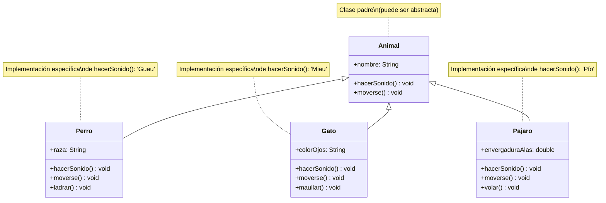
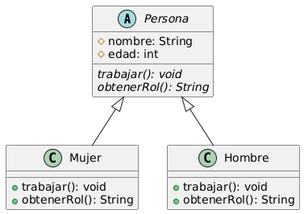
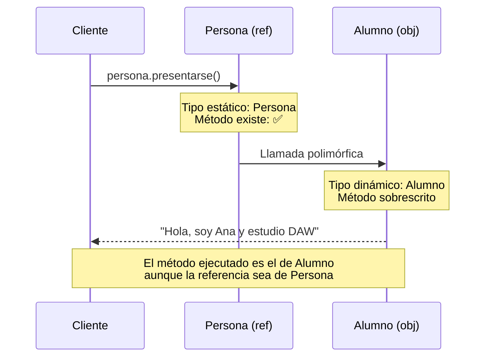

# UT6.3. Polimorfismo

## 📋 Índice de contenidos

1. [Introducción al polimorfismo](#1-introducci%C3%B3n-al-polimorfismo)
2. [Concepto y etimología](#2-concepto-y-etimolog%C3%ADa)
3. [Limitaciones en la programación orientada a objetos](#3-limitaciones-en-la-programaci%C3%B3n-orientada-a-objetos)
4. [Definición formal de polimorfismo](#4-definici%C3%B3n-formal-de-polimorfismo)
5. [Uso de clases abstractas en polimorfismo](#5-uso-de-clases-abstractas-en-polimorfismo)
6. [Ejemplo conceptual: Jerarquía de personas](#6-ejemplo-conceptual-jerarqu%C3%ADa-de-personas)
7. [Efectos de la herencia en polimorfismo](#7-efectos-de-la-herencia-en-polimorfismo)
8. [Pérdida de identidad](#8-p%C3%A9rdida-de-identidad)
    1. [Concepto de pérdida de identidad](#81-concepto-de-p%C3%A9rdida-de-identidad)
    2. [Tipos estático y dinámico](#82-tipos-est%C3%A1tico-y-din%C3%A1mico)
    3. [Limitaciones de acceso](#83-limitaciones-de-acceso)
    4. [Upcasting y downcasting](#84-upcasting-y-downcasting)
9. [Comportamiento polimórfico](#9-comportamiento-polim%C3%B3rfico)
    1. [Ejecución de métodos polimórficos](#91-ejecuci%C3%B3n-de-m%C3%A9todos-polim%C3%B3rficos)
    2. [Ejemplo práctico con medios digitales](#92-ejemplo-pr%C3%A1ctico-con-medios-digitales)
10. [Sobrescritura de métodos en polimorfismo](#10-sobrescritura-de-m%C3%A9todos-en-polimorfismo)
    1. [Concepto y aplicación](#101-concepto-y-aplicaci%C3%B3n)
    2. [Ejemplo con jerarquía de transportes](#102-ejemplo-con-jerarqu%C3%ADa-de-transportes)
11. [Operaciones polimórficas](#11-operaciones-polim%C3%B3rficas)
12. [Aplicaciones del polimorfismo](#12-aplicaciones-del-polimorfismo)
    1. [Ventajas del polimorfismo](#121-ventajas-del-polimorfismo)
    2. [Polimorfismo con clases abstractas](#122-polimorfismo-con-clases-abstractas)
13. [Ejercicio práctico completo](#13-ejercicio-pr%C3%A1ctico-completo)
14. [Ejemplo de análisis de sobrescritura](#14-ejemplo-de-an%C3%A1lisis-de-sobrescritura)
15. [Buenas prácticas del polimorfismo](#15-buenas-pr%C3%A1cticas-del-polimorfismo)
16. [Tipos de polimorfismo](#16-tipos-de-polimorfismo)

## 1. Introducción al polimorfismo

El **polimorfismo** es uno de los pilares fundamentales de la programación orientada a objetos, junto con la herencia y la encapsulación. Este concepto revoluciona la manera en que diseñamos y estructuramos nuestros programas, permitiendo que un mismo método pueda comportarse de manera diferente según el objeto que lo ejecute.

### 🔄 Conceptos previos necesarios

Para comprender completamente el polimorfismo, necesitas dominar:

- **Herencia**: Relación "es-un" entre clases
- **Sobrescritura de métodos**: Redefinir comportamientos en subclases
- **Referencias y objetos**: Diferencia entre el tipo de referencia y el tipo de objeto
- **Clases abstractas**: Plantillas que no se pueden instanciar

> [!NOTE]
> El polimorfismo no significa que "algo cambie de forma" o que "algo sea dos cosas a la vez". Es un mecanismo que permite que diferentes objetos respondan al mismo mensaje de manera específica.

## 2. Concepto y etimología

### 📚 Origen etimológico

El término **"polimorfismo"** proviene del griego:

- **Poli** (πολύ) = muchas
- **Morfo** (μορφή) = formas

Por tanto, polimorfismo significa **"muchas formas"**.

### 🌟 Ejemplos cotidianos de polimorfismo

Para entender mejor este concepto, veamos algunos ejemplos de la vida real:

**💳 Formas de pago:**

- Una compra puede pagarse con: tarjeta de crédito, PayPal, Bizum, efectivo...
- Todas son "formas de pago" pero cada una funciona de manera diferente

**🎫 Venta de billetes:**

- Un billete puede venderse por: una persona (taquilla) o una máquina expendedora
- Ambas "venden billetes" pero con procesos distintos

**🌐 Navegador web:**

- Un navegador puede mostrar contenido de diferentes tipos: texto, imágenes, vídeo...
- Cada tipo se renderiza de forma diferente pero el navegador los "muestra"

## 3. Limitaciones en la programación orientada a objetos

### 🚫 Lo que NO es polimorfismo en POO

En la programación orientada a objetos, es importante aclarar que **NO** hablamos de:

- **"Algo que cambia de forma"**: Una persona no se convierte en una máquina expendedora
- **"Algo que sea dos cosas a la vez"**: Una persona no es simultáneamente una máquina expendedora

### ✅ Lo que SÍ es polimorfismo en POO

**Ejemplo conceptual:**
Un billete puede ser vendido por una máquina **O** por una persona, dependiendo del momento en que se venda. Ambos son "vendedores" pero funcionan de manera diferente.

```java
// Esto NO es polimorfismo (transformación)
Persona persona = new Persona();
persona.convertirseEnMaquina(); // ❌ Esto no existe

// Esto SÍ es polimorfismo (diferentes implementaciones)
Vendedor vendedor1 = new Persona();      // ✅ Una persona ES UN vendedor
Vendedor vendedor2 = new MaquinaAuto();  // ✅ Una máquina ES UN vendedor

vendedor1.venderBillete(); // Se ejecuta el método de Persona
vendedor2.venderBillete(); // Se ejecuta el método de MaquinaAuto
```

## 4. Definición formal de polimorfismo

El polimorfismo es una **relajación del sistema de tipos** que permite que una referencia a una clase acepte direcciones de objetos de la propia clase y de sus clases derivadas (hijas, nietas, etc.).

### 🔑 Características fundamentales

#### 1️⃣ **Requisito previo: Jerarquía de clasificación**

- Para que exista polimorfismo, **es imprescindible** que haya una jerarquía de herencia
- Sin embargo, tener herencia no obliga a usar polimorfismo

#### 2️⃣ **Flexibilidad de referencias**

- Una referencia de tipo "clase padre" puede apuntar a objetos de cualquier clase hija
- Esto proporciona flexibilidad en el diseño y uso de los objetos

#### 3️⃣ **Comportamiento específico**

- Aunque la referencia sea del tipo padre, el comportamiento será el específico del objeto hijo




### 📝 Ejemplo formal

```java
public abstract class Animal {
    protected String nombre;
    
    public Animal(String nombre) {
        this.nombre = nombre;
    }
    
    public abstract void hacerSonido();
    
    public void presentarse() {
        System.out.println("Soy " + nombre);
        hacerSonido(); // Polimorfismo: se ejecutará la versión específica
    }
}

public class Perro extends Animal {
    public Perro(String nombre) {
        super(nombre);
    }
    
    @Override
    public void hacerSonido() {
        System.out.println("¡Guau guau!");
    }
}

public class Gato extends Animal {
    public Gato(String nombre) {
        super(nombre);
    }
    
    @Override
    public void hacerSonido() {
        System.out.println("¡Miau miau!");
    }
}

// Uso polimórfico
public class TestPolimorfismo {
    public static void main(String[] args) {
        // Polimorfismo: referencias de tipo Animal apuntando a objetos específicos
        Animal animal1 = new Perro("Rex");    // ✅ Polimorfismo
        Animal animal2 = new Gato("Whiskers"); // ✅ Polimorfismo
        
        animal1.presentarse(); // Output: "Soy Rex" + "¡Guau guau!"
        animal2.presentarse(); // Output: "Soy Whiskers" + "¡Miau miau!"
        
        // Array polimórfico
        Animal[] zoologico = {
            new Perro("Bobby"),
            new Gato("Felix"),
            new Perro("Lassie")
        };
        
        // Comportamiento polimórfico en bucle
        for (Animal animal : zoologico) {
            animal.presentarse(); // Cada uno hará su sonido específico
        }
    }
}
```

## 5. Uso de clases abstractas en polimorfismo

Con la incorporación del polimorfismo, tiene sentido declarar **referencias a clases abstractas** con la intención de almacenar direcciones de objetos de clases concretas derivadas.

### 💡 Concepto clave

```java
// ❌ IMPOSIBLE - No se pueden instanciar clases abstractas
Animal animal = new Animal(); // Error de compilación

// ✅ CORRECTO - Referencia abstracta, objeto concreto
Animal animal1 = new Perro("Rex");
Animal animal2 = new Gato("Mimi");
```

### 🏥 Analogía histórica

> **Ejemplo histórico**: A lo largo de la historia existe la jerarquía de personas (mujeres y hombres). Pero en ciertos momentos y territorios no existía polimorfismo (el lugar de una mujer no lo podía ocupar un hombre y viceversa), mientras que en otros momentos y territorios el lugar de una persona era ocupado indiferentemente por una mujer o por un hombre.



En programación, esto se traduciría a:

```java
public abstract class Persona {
    protected String nombre;
    protected int edad;
    
    public abstract void trabajar();
    public abstract String obtenerRol();
}

public class Mujer extends Persona {
    @Override
    public void trabajar() {
        System.out.println("La mujer " + nombre + " está trabajando");
    }
    
    @Override
    public String obtenerRol() {
        return "Mujer trabajadora";
    }
}

public class Hombre extends Persona {
    @Override
    public void trabajar() {
        System.out.println("El hombre " + nombre + " está trabajando");
    }
    
    @Override
    public String obtenerRol() {
        return "Hombre trabajador";
    }
}

// Uso polimórfico - "el lugar de una persona"
public class Empresa {
    public void contratarEmpleado(Persona empleado) {
        System.out.println("Contratando: " + empleado.obtenerRol());
        empleado.trabajar(); // Polimorfismo: comportamiento específico
    }
    
    public static void main(String[] args) {
        Empresa empresa = new Empresa();
        
        // El "lugar de una persona" puede ser ocupado por cualquiera
        empresa.contratarEmpleado(new Mujer());  // ✅ Polimorfismo
        empresa.contratarEmpleado(new Hombre()); // ✅ Polimorfismo
    }
}
```

## 6. Ejemplo conceptual: Jerarquía de personas

### 🚫 Errores comunes al intentar polimorfismo

```java
Mujer mujer = new Mujer();  
// Correcto: creación de objeto Mujer y asignación a una referencia Mujer

Mujer mujerIncorrecta = new Hombre();    
// ERROR 1: No se puede asignar un Hombre a una variable Mujer (son clases hermanas)

Mujer mujerPeor = new Persona();    
// ERROR 2: No se puede instanciar una clase abstracta Persona

Hombre hombre = new Hombre();  
// Correcto: creación de objeto Hombre y asignación a una referencia Hombre

Hombre hombreIncorrecto = new Mujer();    
// ERROR 3: No se puede asignar una Mujer a una variable Hombre (son clases hermanas)

Hombre hombrePeor = new Persona();    
// ERROR 4: No se puede instanciar una clase abstracta Persona

Persona persona1 = new Mujer();    
// POLIMORFISMO: Correcto (Mujer es subtipo de Persona)

Persona persona2 = new Hombre();    
// POLIMORFISMO: Correcto (Hombre es subtipo de Persona)

Persona personaMal = new Persona();    
// ERROR 5: No se puede instanciar la clase abstracta Persona
```

### ✅ Polimorfismo correcto

```java
public class EjemploPolimorfismoPersonas {
    public static void main(String[] args) {
        // ✅ POLIMORFISMO CORRECTO
        Persona persona1 = new Mujer("María", 30);
        Persona persona2 = new Hombre("Juan", 25);
        
        // Ambas referencias son de tipo Persona, pero apuntan a objetos específicos
        persona1.trabajar(); // Ejecuta el método de Mujer
        persona2.trabajar(); // Ejecuta el método de Hombre
        
        // Array polimórfico
        Persona[] equipo = {
            new Mujer("Ana", 28),
            new Hombre("Carlos", 35),
            new Mujer("Laura", 26),
            new Hombre("Pedro", 40)
        };
        
        // Procesamiento polimórfico
        System.out.println("=== EQUIPO DE TRABAJO ===");
        for (Persona trabajador : equipo) {
            System.out.println("Empleado: " + trabajador.obtenerRol());
            trabajador.trabajar();
            System.out.println("---");
        }
    }
}
```

## 7. Efectos de la herencia en polimorfismo

Dada una clase específica que hereda de otra, el objeto pertenecerá **no solo a su propia clase**, sino también a su clase padre y otras clases ascendentes.

### 📊 Ejemplo con jerarquía multimedia


### 🔄 Pertenencia múltiple

**Ejemplo práctico:**

- Un objeto `MP3` pertenece simultáneamente a la clase `MP3` **y** a la clase `Media`
- Un objeto `FLAC` pertenece simultáneamente a la clase `FLAC` **y** a la clase `Media`
- El método `reproducir()` de la clase `Lector` puede trabajar con un objeto `MP3` porque este **ES UN** `Media`, o con un objeto `FLAC` porque este **ES UN** `Media`

```java
public abstract class Media {
    protected String nombre;
    protected String artista;
    protected int duracion; // en segundos
    protected String ubicacion;
    protected byte[] datosMedia;
    
    public Media(String nombre, String artista, int duracion) {
        this.nombre = nombre;
        this.artista = artista;
        this.duracion = duracion;
    }
    
    public abstract byte[] obtenerDatos(int inicio, int segundos);
    
    public String getNombre() { return nombre; }
    public String getArtista() { return artista; }
    public int getDuracion() { return duracion; }
}

public class MP3 extends Media {
    private int baudios;
    private boolean tieneID3Tag;
    
    public MP3(String nombre, String artista, int duracion, int baudios) {
        super(nombre, artista, duracion);
        this.baudios = baudios;
        this.tieneID3Tag = true; // Por defecto asumimos que tiene
    }
    
    @Override
    public byte[] obtenerDatos(int inicio, int segundos) {
        // Implementación específica para MP3
        System.out.println("Decodificando datos MP3 de '" + nombre + "' desde el segundo " + inicio);
        // Simulación de obtener datos (compresión MP3)
        return new byte[segundos * baudios / 8];
    }
    
    public int obtenerCalidadAudio() {
        return baudios;
    }
    
    public boolean tieneID3Tag() {
        return tieneID3Tag;
    }
}

public class FLAC extends Media {
    private int bitsPorMuestra;
    private int frecuenciaMuestreo;
    private boolean lossless;
    
    public FLAC(String nombre, String artista, int duracion, int bitsPorMuestra, int frecuenciaMuestreo) {
        super(nombre, artista, duracion);
        this.bitsPorMuestra = bitsPorMuestra;
        this.frecuenciaMuestreo = frecuenciaMuestreo;
        this.lossless = true; // FLAC siempre es lossless
    }
    
    @Override
    public byte[] obtenerDatos(int inicio, int segundos) {
        // Implementación específica para FLAC
        System.out.println("Descomprimiendo datos FLAC de '" + nombre + "' desde el segundo " + inicio);
        // Simulación de obtener datos (FLAC es compresión sin pérdida)
        return new byte[segundos * bitsPorMuestra * frecuenciaMuestreo / 8];
    }
    
    public String getCalidad() {
        return bitsPorMuestra + " bits/" + frecuenciaMuestreo + " Hz";
    }
    
    public boolean esLossless() {
        return lossless;
    }
}

public class Lector {
    private Media mediaCargado;
    private boolean enReproduccion = false;
    
    public void reproducir(Media media) {
        this.mediaCargado = media;
        System.out.println("Reproduciendo: " + media.getNombre() + " - " + media.getArtista());
        System.out.println("Duración: " + formatearDuracion(media.getDuracion()));
        
        // Polimorfismo: obtenerDatos se ejecuta según el tipo real del objeto
        byte[] datos = media.obtenerDatos(0, 30); // Primeros 30 segundos
        
        this.enReproduccion = true;
        System.out.println("Reproducción iniciada. Datos obtenidos: " + datos.length + " bytes");
    }
    
    private String formatearDuracion(int segundos) {
        return String.format("%d:%02d", segundos / 60, segundos % 60);
    }
    
    public void pausar() {
        if (enReproduccion) {
            enReproduccion = false;
            System.out.println("Reproducción pausada");
        }
    }
}

// Prueba del polimorfismo con ambos formatos
public class TestMediaPlayer {
    public static void main(String[] args) {
        Lector reproductor = new Lector();
        
        // Crear diferentes tipos de media
        Media cancionMP3 = new MP3("Bohemian Rhapsody", "Queen", 354, 320);
        Media cancionFLAC = new FLAC("Hotel California", "Eagles", 390, 24, 96000);
        
        // El método reproducir acepta cualquier Media (polimorfismo)
        System.out.println("=== Reproduciendo MP3 ===");
        reproductor.reproducir(cancionMP3); // Ejecuta obtenerDatos() de MP3
        
        reproductor.pausar();
        
        System.out.println("\n=== Reproduciendo FLAC ===");
        reproductor.reproducir(cancionFLAC); // Ejecuta obtenerDatos() de FLAC
        
        // También podemos usar arrays de Media
        Media[] playlist = {
            new MP3("Imagine", "John Lennon", 183, 256),
            new FLAC("Stairway to Heaven", "Led Zeppelin", 482, 24, 192000),
            new MP3("Smells Like Teen Spirit", "Nirvana", 301, 320),
            new FLAC("Sweet Child O'Mine", "Guns N' Roses", 356, 16, 44100)
        };
        
        System.out.println("\n=== Reproduciendo playlist ===");
        for (Media media : playlist) {
            reproductor.reproducir(media);
            reproductor.pausar();
        }
    }
}
```

## 8. Pérdida de identidad

### 8.1 Concepto de pérdida de identidad

En el momento en que un objeto puede pertenecer a más de una clase (propia y derivadas), aparece la problemática llamada **"pérdida de identidad"**.

El concepto de pérdida de identidad surge cuando, en una jerarquía de herencia, **un mismo objeto puede ser interpretado como miembro de varias clases: su clase propia y todas sus clases superiores**. Es decir, un objeto puede "ser visto" o tratado como distintas entidades dependiendo del tipo de referencia con la que se accede a él.

> [!IMPORTANT]
> Cuando trabajamos con referencias polimórficas (por ejemplo, una referencia de tipo clase padre apuntando a un objeto de clase hija), la “identidad” del objeto queda **limitada al tipo de la referencia** utilizada.

Aunque internamente el objeto mantiene todas sus características y comportamientos concretos, **solo tenemos acceso desde el código a la interfaz (métodos y atributos) definido por el tipo estático** de la referencia.

### 8.2 Tipos estático y dinámico

Cuando utilizamos polimorfismo, debemos distinguir entre:

- **Tipo estático** (tipo de la referencia): El tipo declarado de la variable
- **Tipo dinámico** (tipo del objeto): El tipo real del objeto en memoria

```java
public class EjemploPerdidaIdentidad {
    public static void main(String[] args) {
        // Tipo estático: Persona | Tipo dinámico: Alumno
        Persona p = new Alumno("12345678A", "Juan", 20, "Informática");
        
        // ✅ ACCESIBLE - método existe en Persona (tipo estático)
        String nombre = p.getNombre();
        
        // ❌ ERROR DE COMPILACIÓN - método no existe en Persona (tipo estático)
        // String curso = p.getCurso(); // Error: no se puede resolver el método
        
        System.out.println("Nombre: " + nombre);
        // System.out.println("Curso: " + curso); // Esta línea daría error
    }
}
```

### 8.3 Limitaciones de acceso

> [!CAUTION]
> **RECUERDA**: Cuando se produce polimorfismo solo tenemos acceso a los métodos del **tipo estático**, no a los del **tipo dinámico**.

#### 🔍 Ejemplo detallado

```java
public class Persona {
    protected String dni;
    protected String nombre;
    
    public Persona(String dni, String nombre) {
        this.dni = dni;
        this.nombre = nombre;
    }
    
    public String getNombre() {
        return nombre;
    }
    
    public void presentarse() {
        System.out.println("Hola, soy " + nombre);
    }
}

public class Alumno extends Persona {
    private String curso;
    
    public Alumno(String dni, String nombre, String curso) {
        super(dni, nombre);
        this.curso = curso;
    }
    
    public String getCurso() { // Método SOLO en Alumno
        return curso;
    }
    
    @Override
    public void presentarse() { // Método sobrescrito
        System.out.println("Hola, soy " + nombre + " y estudio " + curso);
    }
}

public class TestPerdidaIdentidad {
    public static void main(String[] args) {
        Persona persona = new Alumno("12345", "Ana", "DAW");
        
        // ✅ Métodos accesibles (están en Persona - tipo estático)
        System.out.println("Nombre: " + persona.getNombre());
        persona.presentarse(); 
        
        // ❌ Error de compilación (método no está en Persona - tipo estático)
        // System.out.println("Curso: " + persona.getCurso());      
    }
}
```

### 🔧 Soluciones a la pérdida de identidad

#### 1️⃣ **Instanceof + Casting**

```java
public void procesarPersona(Persona persona) {
    // Procesar como Persona
    persona.presentarse();
    
    // Acceder a funcionalidad específica si es necesario
    if (persona instanceof Alumno) {
        Alumno alumno = (Alumno) persona;
        System.out.println("Estudia: " + alumno.getCurso());
    } else if (persona instanceof Profesor) {
        Profesor profesor = (Profesor) persona;
        System.out.println("Enseña: " + profesor.getAsignatura());
    }
}
```

#### 2️⃣ **Métodos abstractos (recomendado)**

```java
public abstract class Persona {
    protected String dni;
    protected String nombre;
    
    // Método que cada subclase implementará específicamente
    public abstract String obtenerInformacionEspecifica();
    
    public void mostrarInformacionCompleta() {
        System.out.println("Nombre: " + nombre);
        System.out.println("Información específica: " + obtenerInformacionEspecifica());
    }
}

public class Alumno extends Persona {
    private String curso;
    
    @Override
    public String obtenerInformacionEspecifica() {
        return "Estudiante de " + curso;
    }
}

public class Profesor extends Persona {
    private String asignatura;
    
    @Override
    public String obtenerInformacionEspecifica() {
        return "Profesor de " + asignatura;
    }
}
```

### 8.4 Upcasting y downcasting

Una vez comprendido el problema de la pérdida de identidad, Java proporciona mecanismos para **recuperar el acceso** a la funcionalidad específica de las subclases mediante operaciones de **casting**.


#### 🔄 Upcasting (Conversión ascendente)

El **upcasting** es la conversión de una referencia de subclase a una referencia de superclase. Esta conversión es **automática e implícita**.

```java
Persona persona = new Alumno("12345678A", "Ana", 20, 'B'); // Upcasting automático
```

**Características:**

- ✅ **Seguro**: Siempre funciona porque una subclase **ES UNA** superclase
- ✅ **Automático**: No requiere sintaxis especial
- ⚠️ **Limitante**: Solo podremos acceder a métodos de la superclase

#### 🔽 Downcasting (Conversión descendente)

El **downcasting** es la conversión de una referencia de superclase a una referencia de subclase. Esta conversión **debe ser explícita** y puede fallar en tiempo de ejecución.

```java
Persona persona = new Alumno("12345678A", "Ana", 20, 'B');

// Downcasting explícito
Alumno alumno = (Alumno) persona;
char nivel = alumno.getNivel(); // Ahora podemos acceder a métodos específicos
```

**Características:**

- ⚠️ **Peligroso**: Puede lanzar `ClassCastException` si el objeto no es del tipo esperado
- 🔧 **Explícito**: Requiere sintaxis de casting `(TipoDestino) referencia`
- ✅ **Potente**: Permite acceder a toda la funcionalidad de la subclase

#### 🛡️ Casting seguro con instanceof

Para evitar excepciones, siempre debemos verificar el tipo antes de hacer downcasting:

```java
public void procesarPersona(Persona persona) {
    // Verificar antes de hacer downcasting
    if (persona instanceof Alumno) {
        Alumno alumno = (Alumno) persona;
        System.out.println("Nivel de estudios: " + alumno.getDescripcionNivell());
    } else {
        System.out.println("Persona genérica sin nivel específico");
    }
}
```

#### 📝 Ejemplo práctico completo

```java
public class EjemploCasting {
    public static void main(String[] args) {
        // Crear array polimórfico
        Persona[] personas = {
            new Persona("11111111A", "Juan", 45),
            new Alumno("22222222B", "María", 20, 'S'),
            new Alumno("33333333C", "Pedro", 18, 'B')
        };
        
        // Procesar cada persona
        for (Persona p : personas) {
            mostrarInformacion(p);
        }
    }
    
    public static void mostrarInformacion(Persona persona) {
        // Información común (sin casting)
        System.out.println("Nombre: " + persona.getNombre());
        
        // Información específica (con downcasting seguro)
        if (persona instanceof Alumno) {
            Alumno alumno = (Alumno) persona;
            System.out.println("Es alumno - Nivel: " + alumno.getDescripcionNivell());
        } else {
            System.out.println("Es persona genérica");
        }
        
        System.out.println("---");
    }
}
```

#### ⚖️ Comparación y recomendaciones

| Aspecto | Upcasting | Downcasting |
| :-- | :-- | :-- |
| **Seguridad** | ✅ Siempre seguro | ⚠️ Puede fallar |
| **Sintaxis** | Automático | Explícito con `(Tipo)` |
| **Cuándo usar** | Polimorfismo general | Acceso a funcionalidad específica |
| **Verificación** | No necesaria | **Siempre** usar `instanceof` |

#### 🎯 Buenas prácticas

1. **Prioriza el polimorfismo**: Usa downcasting solo cuando sea realmente necesario
2. **Siempre verifica con instanceof**: Nunca hagas downcasting sin comprobar el tipo
3. **Métodos virtuales**: Considera añadir métodos abstractos en lugar de casting
4. **Diseño claro**: Un buen diseño minimiza la necesidad de downcasting

> [!WARNING]
> 
> El downcasting excesivo puede indicar un problema de diseño. Si necesitas hacer mucho casting, replantéate si la jerarquía de clases es la adecuada.

> [!TIP]
>
> Java 14+ introdujo **pattern matching con instanceof** que simplifica el código:
>
> ```java
>   if (persona instanceof Alumno alumno) { 
>     System.out.println("Nivel: " + alumno.getNivell()); 
>   } 
> ```

## 9. Comportamiento polimórfico

### 9.1 Ejecución de métodos polimórficos

> [!CAUTION]
> Cuando invocamos un método que se encuentra en el **tipo estático** y ese método está sobrescrito en el **tipo dinámico**, el comportamiento será el del **tipo dinámico** (se ejecuta el código del método sobrescrito).



### 9.2 Ejemplo práctico con medios digitales

Retomemos el ejemplo del método `reproducir()` de la clase `Lector`:

```java
public class Lector {
    public void reproducir(Media media) {
        System.out.println("=== INICIO REPRODUCCIÓN ===");
        System.out.println("Medio: " + media.getNombre());
        
        // POLIMORFISMO EN ACCIÓN
        // - La referencia es de tipo Media (tipo estático)
        // - El objeto puede ser MP3, WAV, FLAC, etc. (tipo dinámico)  
        // - Se ejecuta obtenerDatos() del tipo dinámico
        byte[] datos = media.obtenerDatos(0, 10);
        
        System.out.println("Datos obtenidos: " + datos.length + " bytes");
        System.out.println("Reproduciendo...");
    }
}

public class MP3 extends Media {
    @Override
    public byte[] obtenerDatos(int inicio, int segundos) {
        System.out.println("Decodificando MP3 con algoritmo específico...");
        // Lógica específica de MP3
        return new byte[segundos * 128]; // Simulación
    }
}

public class WAV extends Media {
    @Override
    public byte[] obtenerDatos(int inicio, int segundos) {
        System.out.println("Leyendo datos WAV sin compresión...");
        // Lógica específica de WAV
        return new byte[segundos * 1411]; // Simulación (calidad CD)
    }
}

public class TestReproductor {
    public static void main(String[] args) {
        Lector reproductor = new Lector();
        
        // Mismo método, diferentes comportamientos
        Media mp3 = new MP3("Canción.mp3", "Artista", 180);
        Media wav = new WAV("Canción.wav", "Artista", 180);
        
        System.out.println("=== REPRODUCIENDO MP3 ===");
        reproductor.reproducir(mp3); // Ejecuta obtenerDatos() de MP3
        
        System.out.println("\n=== REPRODUCIENDO WAV ===");
        reproductor.reproducir(wav); // Ejecuta obtenerDatos() de WAV
    }
}
```

**Salida esperada:**

```text
=== REPRODUCIENDO MP3 ===
=== INICIO REPRODUCCIÓN ===
Medio: Canción.mp3
Decodificando MP3 con algoritmo específico...
Datos obtenidos: 1280 bytes
Reproduciendo...

=== REPRODUCIENDO WAV ===
=== INICIO REPRODUCCIÓN ===
Medio: Canción.wav
Leyendo datos WAV sin compresión...
Datos obtenidos: 14110 bytes
Reproduciendo...
```

> [!NOTE]
>
> Observa cómo el mismo método `reproducir()` produce comportamientos diferentes según el tipo de objeto que recibe. **Esto es la esencia del polimorfismo**.

## 10. Sobrescritura de métodos en polimorfismo

### 10.1 Concepto y aplicación

Hasta ahora, la herencia ha implicado especificar nuevos atributos y operaciones en la clase derivada, agregándolos a los heredados de la clase padre.

**Ahora pretendemos modificar el comportamiento** de una operación previamente definida en la clase padre. Aquí entra en juego el polimorfismo.

Para aplicar el polimorfismo se hace uso de la **sobrescritura de operaciones** (*override* en inglés). Como ya vimos, sobreescribir una operación significa volver a definirla en una subclase, de manera que el método asociado tenga un comportamiento diferente al de la clase padre.

### 10.2 Ejemplo con jerarquía de transportes


```java
public abstract class Transporte {
    protected String marca;
    protected int velocidadMaxima;
    
    public Transporte(String marca, int velocidadMaxima) {
        this.marca = marca;
        this.velocidadMaxima = velocidadMaxima;
    }
    
    // Métodos comunes
    public String getMarca() { return marca; }
    public int getVelocidadMaxima() { return velocidadMaxima; }
    
    // Métodos que cada transporte implementa de forma específica
    public abstract void avanzar();
    public abstract void frenar();
}

public class Coche extends Transporte {
    private int numPuertas;
    
    public Coche(String marca, int velocidadMaxima, int numPuertas) {
        super(marca, velocidadMaxima);
        this.numPuertas = numPuertas;
    }
    
    @Override
    public void avanzar() {
        System.out.println("El coche " + marca + " avanza por la carretera usando sus 4 ruedas");
    }
    
    @Override
    public void frenar() {
        System.out.println("El coche " + marca + " frena usando frenos de disco");
    }
}

public class Bicicleta extends Transporte {
    private int numPlatos;
    
    public Bicicleta(String marca, int velocidadMaxima, int numPlatos) {
        super(marca, velocidadMaxima);
        this.numPlatos = numPlatos;
    }
    
    @Override
    public void avanzar() {
        System.out.println("La bicicleta " + marca + " avanza pedaleando con " + numPlatos + " platos");
    }
    
    @Override
    public void frenar() {
        System.out.println("La bicicleta " + marca + " frena usando frenos de bicicleta");
    }
}

public class Avion extends Transporte {
    private int altitudMaxima;
    
    public Avion(String marca, int velocidadMaxima, int altitudMaxima) {
        super(marca, velocidadMaxima);
        this.altitudMaxima = altitudMaxima;
    }
    
    @Override
    public void avanzar() {
        System.out.println("El avión " + marca + " vuela a través del aire usando turbinas");
    }
    
    @Override
    public void frenar() {
        System.out.println("El avión " + marca + " frena usando aerofrenos y frenos de rueda");
    }
}

// Uso polimórfico
public class TestTransportes {
    public static void moverTransporte(Transporte transporte) {
        System.out.println("=== MOVIENDO TRANSPORTE ===");
        System.out.println("Marca: " + transporte.getMarca());
        System.out.println("Velocidad máxima: " + transporte.getVelocidadMaxima() + " km/h");
        
        transporte.avanzar(); // Polimorfismo: comportamiento específico
        transporte.frenar();  // Polimorfismo: comportamiento específico
        
        System.out.println();
    }
    
    public static void main(String[] args) {
        // Array polimórfico
        Transporte[] transportes = {
            new Coche("Toyota", 180, 5),
            new Bicicleta("Trek", 45, 21),
            new Avion("Boeing", 900, 12000)
        };
        
        // Procesamiento polimórfico
        for (Transporte transporte : transportes) {
            moverTransporte(transporte); // Cada uno se comporta específicamente
        }
    }
}
```

## 11. Operaciones polimórficas

Retomando el método **"reproducir"** de la clase `Lector`:

```java
public class Lector {
    private Media mediaCargado;
    private boolean enReproduccion = false;
    
    public void reproducir(Media media) {
        this.mediaCargado = media;
        
        System.out.println("=== REPRODUCIENDO ===");
        System.out.println("Archivo: " + media.toString());
        
        // OPERACIÓN POLIMÓRFICA
        // Dentro del método "reproducir" se invoca al método "obtenerDatos" de Media.
        // Se ejecutará la implementación correspondiente al objeto pasado como parámetro.
        byte[] datos = media.obtenerDatos(0, 30); // Primeros 30 segundos
        
        System.out.println("Bytes procesados: " + datos.length);
        this.enReproduccion = true;
        System.out.println("Reproducción iniciada exitosamente\n");
    }
    
    public void detener() {
        if (enReproduccion) {
            System.out.println("Deteniendo reproducción de: " + 
                             (mediaCargado != null ? mediaCargado.toString() : "archivo"));
            enReproduccion = false;
        }
    }
}

// Ejemplo de uso polimórfico
public class TestOperacionesPolimorficas {
    public static void main(String[] args) {
        Lector reproductor = new Lector();
        
        // Crear diferentes tipos de media
        Media[] playlist = {
            new Ogg("cancion1.ogg", 210, 320, 0.6),
            new OggProtegido("cancion2.ogg", 180, 192, 0.7, "mi_clave_secreta"),
            new Musica("cancion3.mp3", 195, 256) {
                @Override
                public byte[] obtenerDatos(int inicio, int segundos) {
                    System.out.println("Procesando MP3 genérico: " + nombre);
                    return new byte[segundos * calidad / 8];
                }
            }
        };
        
        // Reproducción polimórfica
        System.out.println("🎵 INICIANDO PLAYLIST POLIMÓRFICA 🎵\n");
        
        for (int i = 0; i < playlist.length; i++) {
            System.out.println("--- Pista " + (i + 1) + " ---");
            reproductor.reproducir(playlist[i]); // Polimorfismo en acción
        }
        
        reproductor.detener();
    }
}
```

**Salida esperada:**

```text
🎵 INICIANDO PLAYLIST POLIMÓRFICA 🎵

--- Pista 1 ---
=== REPRODUCIENDO ===
Archivo: cancion1.ogg (duración: 210s)
Decodificando archivo OGG: cancion1.ogg (compresión: 0.6)
Bytes procesados: 720
Reproducción iniciada exitosamente

--- Pista 2 ---
=== REPRODUCIENDO ===
Archivo: cancion2.ogg (duración: 180s)
Desencriptando OGG protegido: cancion2.ogg
Usando clave: mi_...
Decodificando archivo OGG: cancion2.ogg (compresión: 0.7)
Datos desencriptados correctamente
Bytes procesados: 504
Reproducción iniciada exitosamente

--- Pista 3 ---
=== REPRODUCIENDO ===
Archivo: cancion3.mp3 (duración: 195s)
Procesando MP3 genérico: cancion3.mp3
Bytes procesados: 960
Reproducción iniciada exitosamente

Deteniendo reproducción de: cancion3.mp3 (duración: 195s)
```

> [!NOTE]
> Observa cómo el mismo método `reproducir()` maneja diferentes tipos de archivos multimedia, cada uno con su lógica específica de obtención de datos, pero usando la misma interfaz.

## 12. Aplicaciones del polimorfismo

### 12.1 Ventajas del polimorfismo

Si no utilizáramos herencia ni polimorfismo, tendríamos varios problemas:

#### 🚫 Sin polimorfismo (problemático)

```java
public class ReproductorSinPolimorfismo {
    public void reproducir(Object archivo) {
        // ❌ PROBLEMÁTICO: Operaciones condicionales por cada formato
        if (archivo instanceof MP3) {
            MP3 mp3 = (MP3) archivo;
            // Código específico para MP3
        } else if (archivo instanceof OGG) {
            OGG ogg = (OGG) archivo;
            // Código específico para OGG
        } else if (archivo instanceof WAV) {
            WAV wav = (WAV) archivo;
            // Código específico para WAV
        }
        // ... más formatos requieren más if-else
    }
}
```

**Problemas de este enfoque:**

- 🔴 **Poca cohesión**: Una misma clase gestiona formatos de datos diferentes
- 🔴 **Difícil mantenimiento**: Hay que modificar el código fuente cada vez que se añade un formato
- 🔴 **Violación del principio abierto/cerrado**: No está cerrado para modificación
- 🔴 **Código duplicado**: Lógica similar repetida en cada condición


#### ✅ Con polimorfismo (elegante)

```java
public class ReproductorConPolimorfismo {
    public void reproducir(Media media) {
        // ✅ ELEGANTE: Una sola línea que funciona para todos los formatos
        byte[] datos = media.obtenerDatos(0, 30);
        // Procesamiento común independiente del formato específico
        procesarAudio(datos);
    }
    
    private void procesarAudio(byte[] datos) {
        // Lógica común de procesamiento de audio
        System.out.println("Procesando " + datos.length + " bytes de audio");
    }
}
```

**Ventajas de este enfoque:**

- ✅ **Alta cohesión**: Cada clase gestiona su propio formato
- ✅ **Principio de ocultación**: Los detalles internos están encapsulados
- ✅ **Independencia de cambios**: Nuevos formatos no requieren modificar código existente
- ✅ **Extensibilidad**: Fácil agregar nuevos formatos sin tocar el reproductor


### 12.2 Polimorfismo con clases abstractas

Gracias a tratar el método `obtenerDatos()` como abstracto:

```java
public abstract class Media {
    // Atributos comunes
    protected String nombre;
    protected int duracion;
    
    // Método abstracto: cada subclase debe implementarlo
    public abstract byte[] obtenerDatos(int inicio, int segundos);
    
    // Métodos concretos comunes
    public String getNombre() { return nombre; }
    public int getDuracion() { return duracion; }
}
```

**Beneficios:**

1. **Cohesión**: Cada clase gestiona su formato específico de música
2. **Ocultación**: Los detalles de implementación están encapsulados
3. **Independencia**: El resto del programa no se ve afectado por cambios
4. **Extensibilidad**: Agregar nuevos formatos es sencillo

### 🎯 Ejemplo completo de extensibilidad

```java
// Nuevo formato añadido fácilmente
public class FLAC extends Media {
    private boolean compresionSinPerdida;
    
    public FLAC(String nombre, int duracion, boolean compresionSinPerdida) {
        super(nombre, duracion);
        this.compresionSinPerdida = compresionSinPerdida;
    }
    
    @Override
    public byte[] obtenerDatos(int inicio, int segundos) {
        System.out.println("Procesando FLAC de alta calidad: " + nombre);
        if (compresionSinPerdida) {
            System.out.println("Usando compresión sin pérdida");
        }
        return new byte[segundos * 1411]; // Calidad CD sin comprimir
    }
}

// El reproductor NO necesita cambios
public class TestExtensibilidad {
    public static void main(String[] args) {
        Lector reproductor = new Lector();
        
        // Usar el nuevo formato sin modificar el reproductor
        Media archivoFLAC = new FLAC("sinfonia.flac", 1200, true);
        reproductor.reproducir(archivoFLAC); // ¡Funciona automáticamente!
    }
}
```

## 13. Ejercicio práctico completo

**Enunciado:**
Implementa un sistema de formas geométricas que utilice polimorfismo para calcular áreas y perímetros.

**Requisitos:**

1. Clase abstracta `Forma` con métodos abstractos `calcularArea()` y `calcularPerimetro()`
2. Subclases: `Circulo`, `Rectangulo`, `Triangulo`
3. Clase `CalculadoraFormas` que procese arrays de formas polimórficamente
4. Método para encontrar la forma con mayor área

<details>
<summary>💻 Solución completa</summary>

```java
// Clase abstracta base
public abstract class Forma {
    protected String nombre;
    protected String color;
    
    public Forma(String nombre, String color) {
        this.nombre = nombre;
        this.color = color;
    }
    
    // Métodos abstractos - polimórficos
    public abstract double calcularArea();
    public abstract double calcularPerimetro();
    
    // Métodos concretos comunes
    public String getNombre() { return nombre; }
    public String getColor() { return color; }
    
    @Override
    public String toString() {
        return String.format("%s %s (Área: %.2f, Perímetro: %.2f)", 
                           color, nombre, calcularArea(), calcularPerimetro());
    }
}

// Implementación específica: Círculo
public class Circulo extends Forma {
    private double radio;
    
    public Circulo(String color, double radio) {
        super("Círculo", color);
        this.radio = radio;
    }
    
    @Override
    public double calcularArea() {
        return Math.PI * radio * radio;
    }
    
    @Override
    public double calcularPerimetro() {
        return 2 * Math.PI * radio;
    }
    
    public double getRadio() { return radio; }
}

// Implementación específica: Rectángulo
public class Rectangulo extends Forma {
    private double ancho;
    private double alto;
    
    public Rectangulo(String color, double ancho, double alto) {
        super("Rectángulo", color);
        this.ancho = ancho;
        this.alto = alto;
    }
    
    @Override
    public double calcularArea() {
        return ancho * alto;
    }
    
    @Override
    public double calcularPerimetro() {
        return 2 * (ancho + alto);
    }
    
    public double getAncho() { return ancho; }
    public double getAlto() { return alto; }
}

// Implementación específica: Triángulo
public class Triangulo extends Forma {
    private double lado1, lado2, lado3;

    public Triangulo(String color, double lado1, double lado2, double lado3) {
        super("Triángulo", color);
        this.lado1 = lado1;
        this.lado2 = lado2;
        this.lado3 = lado3;
    }

    @Override
    public double calcularArea() {
        double s = (lado1 + lado2 + lado3) / 2.0;
        return Math.sqrt(s * (s - lado1) * (s - lado2) * (s - lado3));
    }

    @Override
    public double calcularPerimetro() {
        return lado1 + lado2 + lado3;
    }

    public double getLado1() { return lado1; }
    public double getLado2() { return lado2; }
    public double getLado3() { return lado3; }
}

// Clase que utiliza polimorfismo
public class CalculadoraFormas {
    
    public void procesarFormas(Forma[] formas) {
        System.out.println("=== PROCESANDO FORMAS POLIMÓRFICAMENTE ===\n");
        
        double areaTotal = 0;
        double perimetroTotal = 0;
        
        for (int i = 0; i < formas.length; i++) {
            System.out.printf("Forma %d: %s\n", i + 1, formas[i].toString());
            
            // Polimorfismo: cada forma calcula según su tipo
            areaTotal += formas[i].calcularArea();
            perimetroTotal += formas[i].calcularPerimetro();
        }
        
        System.out.printf("\n📊 RESUMEN:\n");
        System.out.printf("Área total: %.2f\n", areaTotal);
        System.out.printf("Perímetro total: %.2f\n", perimetroTotal);
    }
    
    public Forma encontrarMayorArea(Forma[] formas) {
        if (formas.length == 0) return null;
        
        Forma mayorForma = formas[0];
        double mayorArea = formas[0].calcularArea();
        
        for (int i = 1; i < formas.length; i++) {
            double areaActual = formas[i].calcularArea();
            if (areaActual > mayorArea) {
                mayorArea = areaActual;
                mayorForma = formas[i];
            }
        }
        
        return mayorForma;
    }
    
    public void mostrarEstadisticasPorTipo(Forma[] formas) {
        int circulos = 0, rectangulos = 0, triangulos = 0;
        
        for (Forma forma : formas) {
            if (forma instanceof Circulo) {
                circulos++;
            } else if (forma instanceof Rectangulo) {
                rectangulos++;
            } else if (forma instanceof Triangulo) {
                triangulos++;
            }
        }
        
        System.out.printf("\n📈 ESTADÍSTICAS POR TIPO:\n");
        System.out.printf("Círculos: %d\n", circulos);
        System.out.printf("Rectángulos: %d\n", rectangulos);
        System.out.printf("Triángulos: %d\n", triangulos);
    }
}

// Clase de prueba
public class TestSistemaFormas {
    public static void main(String[] args) {
        // Crear array polimórfico de formas
        Forma[] formas = {
            new Circulo("Rojo", 5.0),
            new Rectangulo("Azul", 4.0, 6.0),
            new Triangulo("Verde", 3.0, 4.0, 5.0),
            new Circulo("Amarillo", 3.5),
            new Rectangulo("Violeta", 2.5, 8.0)
        };
        
        CalculadoraFormas calculadora = new CalculadoraFormas();
        
        // Procesamiento polimórfico
        calculadora.procesarFormas(formas);
        
        // Encontrar forma con mayor área
        Forma mayorForma = calculadora.encontrarMayorArea(formas);
        System.out.printf("\n🏆 FORMA CON MAYOR ÁREA:\n%s\n", mayorForma);
        
        // Estadísticas por tipo
        calculadora.mostrarEstadisticasPorTipo(formas);
        
        // Demostración de comportamiento específico
        System.out.println("\n🔍 COMPORTAMIENTOS ESPECÍFICOS:");
        for (Forma forma : formas) {
            if (forma instanceof Circulo) {
                Circulo c = (Circulo) forma;
                System.out.printf("Radio del círculo %s: %.2f\n", 
                                 c.getColor(), c.getRadio());
            }
        }
    }
}
```

**Salida esperada:**

```text
=== PROCESANDO FORMAS POLIMÓRFICAMENTE ===

Forma 1: Rojo Círculo (Área: 78.54, Perímetro: 31.42)
Forma 2: Azul Rectángulo (Área: 24.00, Perímetro: 20.00)
Forma 3: Verde Triángulo (Área: 6.00, Perímetro: 12.00)
Forma 4: Amarillo Círculo (Área: 38.48, Perímetro: 21.99)
Forma 5: Violeta Rectángulo (Área: 20.00, Perímetro: 21.00)

📊 RESUMEN:
Área total: 167.02
Perímetro total: 106.41

🏆 FORMA CON MAYOR ÁREA:
Rojo Círculo (Área: 78.54, Perímetro: 31.42)

📈 ESTADÍSTICAS POR TIPO:
Círculos: 2
Rectángulos: 2
Triángulos: 1

🔍 COMPORTAMIENTOS ESPECÍFICOS:
Radio del círculo Rojo: 5.00
Radio del círculo Amarillo: 3.50
```

</details>

## 14. Ejemplo de análisis de sobrescritura

Analicemos el siguiente código para entender cómo funciona la sobrescritura en contextos polimórficos:

```java
public class X {
    public void met1() {
        System.out.println("Método met1() de clase X");
    }
}

public class Z extends X {
    @Override
    public void met1() {
        System.out.println("Método met1() de clase Z - SOBRESCRITO");
    }
    
    public void met2() {
        System.out.println("Método met2() específico de clase Z");
    }
}

public class TestSobrescritura {
    public static void main(String[] args) {
        X ox = new X();  // Referencia X, objeto X
        X oz = new Z();  // Referencia X, objeto Z (POLIMORFISMO)
        
        System.out.println("=== ANÁLISIS DE LLAMADAS ===");
        
        ox.met1(); // (1) ¿Qué se ejecuta?
        oz.met1(); // (2) ¿Qué se ejecuta?
        
        // ox.met2(); // (3) ¿Compila?
        // oz.met2(); // (4) ¿Compila?
    }
}
```

### 🔍 Análisis detallado:

**Llamada (1): `ox.met1();`**

- **Tipo estático**: X
- **Tipo dinámico**: X
- **Resultado**: Se ejecuta `met1()` de la clase X
- **Salida**: "Método met1() de clase X"

**Llamada (2): `oz.met1();`**

- **Tipo estático**: X
- **Tipo dinámico**: Z
- **¿El método existe en X?** ✅ Sí
- **¿Está sobrescrito en Z?** ✅ Sí
- **Resultado**: Se ejecuta `met1()` sobrescrito de la clase Z (polimorfismo)
- **Salida**: "Método met1() de clase Z - SOBRESCRITO"

**Llamada (3): `ox.met2();`**

- **Tipo estático**: X
- **¿Existe met2() en X?** ❌ No
- **Resultado**: ❌ Error de compilación

**Llamada (4): `oz.met2();`**

- **Tipo estático**: X
- **¿Existe met2() en X?** ❌ No
- **Resultado**: ❌ Error de compilación (aunque el objeto Z sí tenga el método)

<details>
<summary>💻 Código ejecutable con análisis completo</summary>

```java
public class AnalisisSobreescrituraCompleto {
    
    static class X {
        public void met1() {
            System.out.println("✅ Ejecutando met1() de clase X");
        }
        
        public void metodoComun() {
            System.out.println("Método común desde X");
        }
    }
    
    static class Z extends X {
        @Override
        public void met1() {
            System.out.println("🔄 Ejecutando met1() de clase Z (SOBRESCRITO)");
        }
        
        public void met2() {
            System.out.println("✨ Ejecutando met2() específico de Z");
        }
        
        @Override
        public void metodoComun() {
            System.out.println("Método común desde Z (sobrescrito)");
            super.metodoComun(); // Llamada al método padre
        }
    }
    
    public static void main(String[] args) {
        System.out.println("=== CREANDO OBJETOS ===");
        X ox = new X();  // Normal: X -> X
        X oz = new Z();  // Polimórfico: X -> Z
        
        System.out.println("\n=== ANÁLISIS DE LLAMADAS ===");
        
        System.out.println("\n1. ox.met1() - Referencia X, Objeto X:");
        ox.met1();
        
        System.out.println("\n2. oz.met1() - Referencia X, Objeto Z:");
        oz.met1(); // Polimorfismo: ejecuta la versión de Z
        
        System.out.println("\n3. Métodos comunes:");
        ox.metodoComun();
        System.out.println("---");
        oz.metodoComun(); // Ejecuta versión sobreescrita de Z
        
        System.out.println("\n=== ERRORES DE COMPILACIÓN ===");
        // ox.met2(); // ❌ Error: met2() no existe en X
        // oz.met2(); // ❌ Error: met2() no existe en X (tipo estático)
        
        System.out.println("\n=== SOLUCIÓN CON CAST ===");
        if (oz instanceof Z) {
            Z zReal = (Z) oz;
            zReal.met2(); // ✅ Ahora sí podemos acceder
        }
        
        System.out.println("\n=== DEMOSTRACIÓN DE INSTANCEOF ===");
        System.out.println("ox instanceof X: " + (ox instanceof X));
        System.out.println("ox instanceof Z: " + (ox instanceof Z));
        System.out.println("oz instanceof X: " + (oz instanceof X));
        System.out.println("oz instanceof Z: " + (oz instanceof Z));
    }
}
```

</details>

> [!CAUTION]
>
> **Regla clave del polimorfismo**: El tipo estático (referencia) determina **qué métodos** se pueden llamar. El tipo dinámico (objeto real) determina **qué implementación** se ejecuta.

## 15. Buenas prácticas del polimorfismo

✅ **Buenas prácticas**

```java
// ✅ Usa polimorfismo para operaciones comunes
public void procesarDocumentos(Documento[] docs) {
    for (Documento doc : docs) {
        doc.procesar(); // Cada tipo se procesa específicamente
    }
}

// ✅ Métodos que definen contratos claros
public abstract class Forma {
    private String colorRelleno;
    private String colorBorde;
    public abstract double area();      // Claro y específico
    public abstract double perimetro(); // Claro y específico
}

// ✅ Factory pattern con polimorfismo
public class CreadorFormas {
    public static Forma crear(String tipo, double... params) {
        switch (tipo.toLowerCase()) {
            case "circulo": return new Circulo(params[0]);
            case "rectangulo": return new Rectangulo(params[0], params[1]);
            default: throw new IllegalArgumentException("Tipo desconocido");
        }
    }
}
```

❌ **Prácticas a evitar**

```java
// ❌ No uses instanceof excesivamente
public void procesarMalo(Forma forma) {
    if (forma instanceof Circulo) {
        // lógica específica para círculo
    } else if (forma instanceof Rectangulo) {
        // lógica específica para rectángulo
    } // Esto rompe el polimorfismo
}

// ❌ No sobrecargues métodos polimórficos innecesariamente
public class MalaJerarquia {
    public void metodo(Object obj) { }      // Muy genérico
    public void metodo(String str) { }      // Confuso con polimorfismo
    public void metodo(Integer num) { }     // Mejor usar overrides
}
```

### 🎓 Resumen de conceptos clave

- **Polimorfismo = "Una interfaz, múltiples implementaciones"**
- **Requiere herencia** para establecer la jerarquía de tipos
- **Sobrescritura de métodos** para personalizar comportamientos
- **Tipo estático vs dinámico**: Comprende la diferencia para evitar errores
- **Pérdida de identidad**: Conoce las limitaciones y soluciones
- **Ventajas**: Código más flexible, mantenible y extensible

## 16. Tipos de polimorfismo

Es importante comprender que el **polimorfismo** no es un concepto único, sino que existen diferentes tipos o categorías. En este tema hemos trabajado principalmente con **polimorfismo de subtipo** (también llamado **polimorfismo de inclusión**), pero la programación orientada a objetos y otros paradigmas reconocen varios tipos más.

### 1️⃣ **Polimorfismo de subtipo (Subtype Polymorphism)**

Es el tipo de polimorfismo que hemos estudiado en profundidad en este tema. También se conoce como **polimorfismo de inclusión** o **polimorfismo dinámico**.

#### Características

- Se basa en la **herencia** y la **sobreescritura de métodos**
- La resolución del método se realiza en **tiempo de ejecución** (dynamic dispatch)
- Permite que una referencia de tipo padre apunte a objetos de tipos hijos
- El comportamiento específico se determina por el tipo **dinámico** del objeto

#### Ejemplo en Java

```java
// Este es el polimorfismo que hemos estudiado
Animal animal = new Perro();    // Polimorfismo de subtipo
animal.hacerSonido();           // Se ejecuta el método de Perro

Animal[] zoologico = {new Perro(), new Gato(), new Pajaro()};
for (Animal a : zoologico) {
    a.hacerSonido();            // Cada uno ejecuta su versión específica
}
```

### 2️⃣ **Polimorfismo ad-hoc (Ad-hoc Polymorphism)**

También conocido como **polimorfismo de sobrecarga**. Permite que un mismo nombre de función tenga diferentes implementaciones según los **tipos de los parámetros**.

#### Características

- Se resuelve en **tiempo de compilación** (static dispatch)
- Depende de la **signatura** del método (nombre + parámetros)
- El compilador decide qué versión del método usar

#### Ejemplo en Java

```java
public class Calculadora {
    // Sobrecarga de métodos - mismo nombre, diferentes parámetros
    public int sumar(int a, int b) {
        return a + b;
    }
    
    public double sumar(double a, double b) {
        return a + b;
    }
    
    public String sumar(String a, String b) {
        return a + b;
    }
    
    public int sumar(int a, int b, int c) {
        return a + b + c;
    }
}

// Uso
Calculadora calc = new Calculadora();
calc.sumar(5, 3);           // Llama a sumar(int, int)
calc.sumar(2.5, 3.7);       // Llama a sumar(double, double)
calc.sumar("Hola", "Mundo"); // Llama a sumar(String, String)
```

### 3️⃣ **Polimorfismo paramétrico (Parametric Polymorphism)**

Permite que una función o clase opere sobre **tipos genéricos** sin especificar el tipo concreto. En Java se implementa mediante **Generics** (*Que veremos en temas posteriores*)

#### Características

- Una sola implementación sirve para **múltiples tipos**
- Los tipos se especifican mediante **parámetros de tipo**
- Proporciona **seguridad de tipos** en tiempo de compilación

#### Ejemplo en Java

```java
// Clase genérica - polimorfismo paramétrico
public class Caja<T> {
    private T contenido;
    
    public void guardar(T item) {
        this.contenido = item;
    }
    
    public T obtener() {
        return contenido;
    }
}

// Uso con diferentes tipos
Caja<String> cajaTexto = new Caja<>();
cajaTexto.guardar("Hola mundo");

Caja<Integer> cajaNumero = new Caja<>();
cajaNumero.guardar(42);

Caja<Persona> cajaPersona = new Caja<>();
cajaPersona.guardar(new Persona("Juan", 25));
```

### 4️⃣ **Polimorfismo de coerción (Coercion Polymorphism)**

Se produce cuando el sistema **convierte automáticamente** un tipo en otro para permitir que una operación funcione con diferentes tipos.

#### Características

- Conversión **implícita** de tipos
- El compilador o runtime realiza la conversión automáticamente
- Común en operaciones aritméticas y asignaciones

#### Ejemplo en Java

```java
public class EjemploCoercion {
    public static void main(String[] args) {
        // Coerción numérica automática
        int entero = 10;
        double decimal = 3.14;
        
        double resultado = entero + decimal; // int se convierte a double automáticamente
        System.out.println(resultado); // 13.14
        
        // Coerción en concatenación de strings
        String mensaje = "El resultado es: " + 42; // int se convierte a String
        System.out.println(mensaje); // "El resultado es: 42"
        
        // Polimorfismo en operadores
        System.out.println(5 + 3);     // Suma aritmética
        System.out.println("5" + "3"); // Concatenación de strings
    }
}
```

### 5️⃣ **Polimorfismo de tipos de orden superior (Higher-Kinded Types)**

Este tipo permite **abstraer sobre constructores de tipos**. Java **no soporta** directamente HKT, aunque lenguajes como Scala, Haskell o Kotlin sí lo hacen.

#### Características

- Permite parametrizar sobre **tipos que a su vez toman parámetros**
- Muy útil para programación funcional avanzada
- Java no lo soporta nativamente (requiere workarounds complejos)

#### Ejemplo conceptual (no Java)

```scala
// Scala - ejemplo de Higher-Kinded Types
trait Functor[F[_]] {
  def map[A, B](fa: F[A], f: A => B): F[B]
}

// F[_] es un tipo de orden superior - toma un tipo y produce otro tipo
// Implementaciones para List, Option, etc.
```

## 📊 Comparación de tipos de polimorfismo

| Tipo | Resolución | Soporte en Java | Ejemplo |
| :-- | :-- | :-- | :-- |
| **Subtipo** | Tiempo de ejecución | ✅ Completo | `Animal a = new Perro()` |
| **Ad-hoc** | Tiempo de compilación | ✅ Completo | Sobrecarga de métodos |
| **Paramétrico** | Tiempo de compilación | ✅ Generics | `List<String>` |
| **Coerción** | Tiempo de compilación/ejecución | ✅ Limitado | Conversiones automáticas |
| **HKT** | Tiempo de compilación | ❌ No soportado | N/A en Java |

## 🎯 Polimorfismo en este tema

> [!IMPORTANT]
>
> **En este tema nos hemos centrado específicamente en el polimorfismo de subtipo**, que es la forma más característica de polimorfismo en la programación orientada a objetos clásica.

### Características del polimorfismo de subtipo que hemos estudiado

- **Herencia**: Basado en jerarquías de clases
- **Sobrescritura**: Redefinición de métodos en subclases
- **Enlace dinámico**: El método ejecutado se determina en tiempo de ejecución
- **Principio de sustitución**: Los objetos de subclases pueden sustituir a objetos de la superclase

<p align="center">📚 <em>Fin del apartado UT6.3 - Polimorfismo</em></p>
