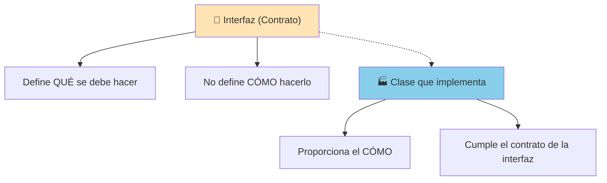
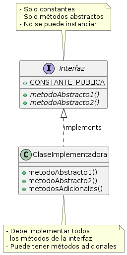

# UT6.4. Interfaces

## 📋 Índice de contenidos

1. [Introducción a las interfaces](#1-introducci%C3%B3n-a-las-interfaces)
2. [Concepto de interfaz](#2-concepto-de-interfaz)
3. [Definición de interfaces en Java](#3-definici%C3%B3n-de-interfaces-en-java)
    1. [Sintaxis básica](#31-sintaxis-b%C3%A1sica)
    2. [Características de las interfaces](#32-caracter%C3%ADsticas-de-las-interfaces)
    3. [Implementación de interfaces](#33-implementaci%C3%B3n-de-interfaces)
4. [Diferencias entre interfaces y clases abstractas](#4-diferencias-entre-interfaces-y-clases-abstractas)
5. [Ejemplo básico: Comestible](#5-ejemplo-b%C3%A1sico-comestible)
    1. [Definición de la interfaz](#51-definici%C3%B3n-de-la-interfaz)
    2. [Implementación en clases](#52-implementaci%C3%B3n-en-clases)
    3. [Uso polimórfico](#53-uso-polim%C3%B3rfico)
6. [Ejemplo avanzado: Comparable](#6-ejemplo-avanzado-comparable)
    1. [La interfaz Comparable](#61-la-interfaz-comparable)
    2. [Implementación práctica](#62-implementaci%C3%B3n-pr%C3%A1ctica)
    3. [Práctica 1: Círculos comparables](#63-pr%C3%A1ctica-1-c%C3%ADrculos-comparables)
7. [Herencia múltiple de interfaces](#7-herencia-m%C3%BAltiple-de-interfaces)
    1. [Implementación múltiple](#71-implementaci%C3%B3n-m%C3%BAltiple)
    2. [Herencia entre interfaces](#72-herencia-entre-interfaces)
8. [Interfaces funcionales](#8-interfaces-funcionales)
9. [Métodos default y static en interfaces](#9-m%C3%A9todos-default-y-static-en-interfaces)
    1. [Métodos default](#91-m%C3%A9todos-default)
    2. [Métodos static](#92-m%C3%A9todos-static)
    3. [Resolución de conflictos](#93-resoluci%C3%B3n-de-conflictos)
10. [Ejemplo de uso](#10-ejemplo-de-uso)
    1. [Patrón Strategy](#101-patr%C3%B3n-strategy)
11. [Práctica 2: Sistema de formas geométricas](#11-pr%C3%A1ctica-2-sistema-de-formas-geom%C3%A9tricas)
12. [Práctica 3: Sistema de notificaciones](#12-pr%C3%A1ctica-3-sistema-de-notificaciones)
13. [Buenas prácticas con interfaces](#13-buenas-pr%C3%A1cticas-con-interfaces)
14. [Para ampliar conocimientos](#14-para-ampliar-conocimientos)

## 1. Introducción a las interfaces

Las **interfaces** representan uno de los conceptos más potentes de la programación orientada a objetos en Java. Nos permiten definir **contratos** que las clases deben cumplir, especificando **qué** puede hacer un objeto sin definir **cómo** lo hace.

### 🎯 ¿Para qué sirven las interfaces?

- **Definir contratos**: Especifican qué métodos debe implementar una clase
- **Lograr polimorfismo**: Permiten tratar objetos de diferentes clases de manera uniforme (aunque no haya relación de herencia)
- **Separar especificación de implementación**: Definen **qué** sin especificar **cómo**
- **Suplir la falta de herencia múltiple**: Java permite implementar múltiples interfaces
- **Facilitar el testing**: Permiten crear [mocks y stubs](https://codigoencasa.com/profundizacion-en-las-pruebas-unitarias-que-son-los-stubs-mocks-spies-y-dummies/) fácilmente

### 🌟 Analogía del mundo real

Piensa en las interfaces como **contratos** o **especificaciones**:

- **Interfaz USB**: Define cómo debe ser un puerto USB, pero no especifica si es para un ratón, teclado o pendrive
- **Licencia de conducir**: Define que puedes conducir, pero no especifica qué vehículo específico
- **Enchúfe eléctrico**: Define el estándar de conexión, pero no qué electrodoméstico se conectará



## 2. Concepto de interfaz

Una **interfaz** en Java:

- **No contiene atributos de instancia** (solo constantes)
- **No contiene métodos implementados** (solo métodos abstractos, salvo excepciones modernas)
- **Define un conjunto de métodos** que las clases implementadoras deben proporcionar
- **Pueden ser implementadas por clases, o extendidas por otras interfaces**
- **Puede ser utilizada como tipo** para referencias polimórficas



> [!IMPORTANT]
>
> Las interfaces **NO se pueden instanciar** directamente, al igual que las clases abstractas. Solo se pueden crear referencias del tipo interfaz que apunten a objetos de clases que la implementen.

## 3. Definición de interfaces en Java

### 3.1 Sintaxis básica

```java
public interface NombreInterfaz {
    // Constantes (implícitamente public static final)
    tipo CONSTANTE = valor;
    
    // Métodos abstractos (implícitamente public abstract)
    tipoRetorno nombreMetodo(parametros);
}
```

### 3.2 Características de las interfaces

#### 🔒 Modificadores implícitos

En las interfaces, algunos modificadores son **implícitos**:

- **Todos los métodos** son implícitamente `public abstract`
- **Todas las variables** son implícitamente `public static final` (constantes)
- La **interfaz** puede ser `public` o tener visibilidad de paquete

```java
public interface Ejemplo {
    // Estas declaraciones son equivalentes:
    
    // Forma explícita
    public static final int CONSTANTE1 = 100;
    public abstract void metodo1();
    
    // Forma implícita (recomendada)
    int CONSTANTE2 = 200;
    void metodo2();
}
```

### 3.3 Implementación de interfaces

Para que una clase implemente una interfaz, utilizamos la palabra clave `implements`:

```java
public class MiClase implements NombreInterfaz {
    // Debe implementar TODOS los métodos de la interfaz
    @Override
    public tipoRetorno nombreMetodo(parametros) {
        // Implementación específica
    }
    
    @Override
    public tipoRetorno otroMetodo(parametros) {
        // Implementación específica  
    }
}
```

> [!WARNING]
> Si una clase implementa una interfaz pero no implementa todos sus métodos abstractos, la clase **debe ser declarada como abstracta**.

## 4. Diferencias entre interfaces y clases abstractas

| Aspecto | Interfaces | Clases Abstractas |
| :-- | :-- | :-- |
| **Herencia múltiple** | ✅ Se pueden implementar múltiples | ❌ Solo herencia simple |
| **Métodos concretos** | ✅ Solo con `default` o `static` (Java 8+) | ✅ Pueden tener métodos concretos |
| **Atributos de instancia** | ❌ Solo constantes | ✅ Pueden tener atributos normales |
| **Constructores** | ❌ No pueden tener | ✅ Pueden tener constructores |
| **Modificadores de acceso** | 🔒 Solo `public` (implícito) | ✅ Cualquier modificador |
| **Instanciación** | ❌ No se puede instanciar | ❌ No se puede instanciar |
| **Propósito principal** | 📜 Definir contratos | 🏗️ Compartir código común |

### 🤔 ¿Cuándo usar cada uno?

**Usa interfaces cuando:**

- Quieras definir un contrato que múltiples clases no relacionadas puedan implementar
- Necesites herencia múltiple
- Quieras lograr máxima flexibilidad y desacoplamiento

**Usa clases abstractas cuando:**

- Tengas código (datos o funcionalidades) común que compartir entre clases relacionadas
- Quieras proporcionar una implementación parcial
- Las clases están estrechamente relacionadas en una jerarquía

## 5. Ejemplo básico: Comestible

### 5.1 Definición de la interfaz

```java
public interface Comestible {
    /**
     * Describe cómo se come este objeto
     */
    void comoSeCome();
    
    /**
     * Indica si el objeto está en buen estado para comer
     */
    boolean estaFresco();
    
    /**
     * Obtiene las calorías por cada 100g
     */
    double getCalorias();
}
```

### 5.2 Implementación en clases

```java
// Clase base Animal
public abstract class Animal {
    private String nombre;
    private int edad;
    
    public Animal(String nombre, int edad) {
        this.nombre = nombre;
        this.edad = edad;
    }
    
    public abstract void hacerSonido();
    
    public String getNombre() {
        return nombre;
    }
    
    public int getEdad() {
        return edad;
    }
    
    public void envejecer() {
        edad++;
    }
}

// Clase Tigre (no comestible)
public class Tigre extends Animal {
    private String patronRayas;
    
    public Tigre(String nombre, int edad, String patronRayas) {
        super(nombre, edad);
        this.patronRayas = patronRayas;
    }
    
    @Override
    public void hacerSonido() {
        System.out.println("¡Grrrraaaauuu!");
    }
    
    public void cazar() {
        System.out.println(getNombre() + " está cazando...");
    }
    
    public String getPatronRayas() {
        return patronRayas;
    }
}

// Clase Pollo (comestible)
public class Pollo extends Animal implements Comestible {
    private boolean fresco;
    private double peso;
    
    public Pollo(String nombre, int edad, double peso) {
        super(nombre, edad);
        this.peso = peso;
        this.fresco = true;
    }
    
    @Override
    public void hacerSonido() {
        System.out.println("¡Kikirikí!");
    }
    
    @Override
    public void comoSeCome() {
        System.out.println("El pollo " + getNombre() + " se cocina al horno, a la plancha o frito");
    }
    
    @Override
    public boolean estaFresco() {
        return fresco;
    }
    
    @Override
    public double getCalorias() {
        return 165.0 * (peso * 10); // calorías totales (165 por 100g)
    }
    
    public double getPeso() {
        return peso;
    }
    
    public void cocinar() {
        System.out.println("Cocinando el pollo " + getNombre() + " de " + peso + " kg");
    }
}

// Clase para frutas (se mantiene igual)
public class Manzana implements Comestible {
    private String variedad;
    private boolean fresca;
    
    public Manzana(String variedad) {
        this.variedad = variedad;
        this.fresca = true;
    }
    
    @Override
    public void comoSeCome() {
        System.out.println("La manzana " + variedad + " se come cruda, pelada o con piel");
    }
    
    @Override
    public boolean estaFresco() {
        return fresca;
    }
    
    @Override
    public double getCalorias() {
        return 52.0; // calorías por 100g
    }
    
    public void madurar() {
        System.out.println("La manzana está madurando...");
    }
}
```

### 5.3 Uso polimórfico

```java
public class RestauranteTest {
    public static void main(String[] args) {
        // Array polimórfico de objetos comestibles
        Comestible[] menu = {
            new Pollo(1.5),
            new Manzana("Golden"),
            new Manzana("Granny Smith")
        };
        
        System.out.println("=== MENÚ DEL RESTAURANTE ===");
        double caloriasTotal = 0;
        
        for (int i = 0; i < menu.length; i++) {
            Comestible item = menu[i];
            
            System.out.println("\n--- Plato " + (i + 1) + " ---");
            
            if (item.estaFresco()) {
                item.comoSeCome();
                double calorias = item.getCalorias();
                System.out.println("Calorías: " + calorias + " kcal/100g");
                caloriasTotal += calorias;
            } else {
                System.out.println("⚠️ Este alimento no está fresco");
            }
        }
        
        System.out.println("\n🍽️ Calorías promedio del menú: " + 
                          (caloriasTotal / menu.length) + " kcal/100g");
        
        // Demostración de polimorfismo
        System.out.println("\n=== PREPARACIÓN ===");
        prepararComida(new Pollo(2.0));
        prepararComida(new Manzana("Red Delicious"));
    }
    
    // Método polimórfico que acepta cualquier objeto comestible
    public static void prepararComida(Comestible comida) {
        System.out.println("\n🍳 Preparando comida...");
        
        if (comida.estaFresco()) {
            comida.comoSeCome();
            System.out.println("✅ Comida preparada y servida");
        } else {
            System.out.println("❌ No se puede servir, no está fresco");
        }
    }
}
```

## 6. Ejemplo avanzado: Comparable

### 6.1 La interfaz Comparable

La interfaz `Comparable<T>` es una de las más utilizadas en Java. Permite que los objetos se puedan **comparar y ordenar** entre sí.

```java
public interface Comparable<T> {
    /**
     * Compara este objeto con el objeto especificado
     * @param other el objeto a comparar
     * @return un entero negativo, cero o positivo según 
     *         este objeto sea menor, igual o mayor que el especificado
     */
    int compareTo(T other);
}
```

**Reglas del método compareTo:**

- Retorna **valor negativo** si `this < other`
- Retorna **cero** si `this == other`
- Retorna **valor positivo** si `this > other`

### 6.2 Implementación práctica

```java
public class Estudiante implements Comparable<Estudiante> {
    private String nombre;
    private double notaMedia;
    private int edad;
    
    public Estudiante(String nombre, double notaMedia, int edad) {
        this.nombre = nombre;
        this.notaMedia = notaMedia;
        this.edad = edad;
    }
    
    @Override
    public int compareTo(Estudiante otro) {
        // Comparamos por nota media (descendente)
        if (this.notaMedia < otro.notaMedia) {
            return 1;  // Este estudiante tiene menor nota
        } else if (this.notaMedia > otro.notaMedia) {
            return -1; // Este estudiante tiene mayor nota
        } else {
            // Si tienen la misma nota, comparamos por edad (ascendente)
            return Integer.compare(this.edad, otro.edad);
        }
    }
    
    // Getters
    public String getNombre() { return nombre; }
    public double getNotaMedia() { return notaMedia; }
    public int getEdad() { return edad; }
    
    @Override
    public String toString() {
        return String.format("%s (%.1f años: %d)", nombre, notaMedia, edad);
    }
    
    @Override
    public boolean equals(Object obj) {
        if (this == obj) return true;
        if (obj == null || getClass() != obj.getClass()) return false;
        Estudiante that = (Estudiante) obj;
        return Double.compare(that.notaMedia, notaMedia) == 0 &&
               edad == that.edad &&
               nombre.equals(that.nombre);
    }
}
```

### 6.3 Práctica 1: Círculos comparables

**Enunciado:**
Crea una clase `CirculoComparable` que implemente la interfaz `Comparable<CirculoComparable>`. Los círculos deben compararse por su área. Implementa también una clase de prueba que cree varios círculos, los ordene y muestre el resultado.

<details>
<summary>💻 Solución completa</summary>

```java
import java.util.Arrays;

public class CirculoComparable implements Comparable<CirculoComparable> {
    private double radio;
    private String color;
    
    public CirculoComparable(double radio, String color) {
        this.radio = radio;
        this.color = color;
    }
    
    public double getArea() {
        return Math.PI * radio * radio;
    }
    
    public double getRadio() {
        return radio;
    }
    
    public String getColor() {
        return color;
    }
    
    @Override
    public int compareTo(CirculoComparable otro) {
        // Comparamos por área
        double areaThis = this.getArea();
        double areaOtro = otro.getArea();
        
        return Double.compare(areaThis, areaOtro);
    }
    
    @Override
    public String toString() {
        return String.format("Círculo %s (radio: %.2f, área: %.2f)", 
                           color, radio, getArea());
    }
    
    @Override
    public boolean equals(Object obj) {
        if (this == obj) return true;
        if (obj == null || getClass() != obj.getClass()) return false;
        CirculoComparable that = (CirculoComparable) obj;
        return Double.compare(that.radio, radio) == 0;
    }
}

// Clase de prueba
public class TestCirculosComparables {
    public static void main(String[] args) {
        // Crear array de círculos
        CirculoComparable[] circulos = {
            new CirculoComparable(5.0, "Rojo"),
            new CirculoComparable(3.0, "Azul"),
            new CirculoComparable(7.0, "Verde"),
            new CirculoComparable(2.5, "Amarillo"),
            new CirculoComparable(4.5, "Violeta")
        };
        
        System.out.println("=== CÍRCULOS ANTES DE ORDENAR ===");
        mostrarCirculos(circulos);
        
        // Ordenar usando Comparable
        Arrays.sort(circulos);
        
        System.out.println("\n=== CÍRCULOS DESPUÉS DE ORDENAR (por área) ===");
        mostrarCirculos(circulos);
        
        // Buscar círculos
        System.out.println("\n=== COMPARACIONES INDIVIDUALES ===");
        CirculoComparable c1 = circulos[0];
        CirculoComparable c2 = circulos[circulos.length - 1];
        
        int comparacion = c1.compareTo(c2);
        if (comparacion < 0) {
            System.out.println(c1.getColor() + " es menor que " + c2.getColor());
        } else if (comparacion > 0) {
            System.out.println(c1.getColor() + " es mayor que " + c2.getColor());
        } else {
            System.out.println(c1.getColor() + " es igual que " + c2.getColor());
        }
        
        // Encontrar el círculo con mayor área
        CirculoComparable mayor = encontrarMayor(circulos);
        System.out.println("\n🏆 Círculo con mayor área: " + mayor);
    }
    
    private static void mostrarCirculos(CirculoComparable[] circulos) {
        for (int i = 0; i < circulos.length; i++) {
            System.out.printf("%d. %s\n", i + 1, circulos[i]);
        }
    }
    
    private static CirculoComparable encontrarMayor(CirculoComparable[] circulos) {
        if (circulos.length == 0) return null;
        
        CirculoComparable mayor = circulos[0];
        for (int i = 1; i < circulos.length; i++) {
            if (circulos[i].compareTo(mayor) > 0) {
                mayor = circulos[i];
            }
        }
        return mayor;
    }
}
```

</details>

## 7. Herencia múltiple de interfaces

Una de las **ventajas más importantes** de las interfaces es que Java permite que una clase implemente **múltiples interfaces**, logrando así herencia múltiple de comportamiento.

### 7.1 Implementación múltiple

```java
// Interfaces que definen diferentes capacidades
public interface Volador {
    void volar();
    double getAltitudMaxima();
}

public interface Nadador {
    void nadar();
    double getProfundidadMaxima();
}

public interface Corredor {
    void correr();
    double getVelocidadMaxima();
}

// Clase que implementa múltiples interfaces
public class Pato implements Volador, Nadador, Corredor {
    private String nombre;
    private double energia;
    
    public Pato(String nombre) {
        this.nombre = nombre;
        this.energia = 100.0;
    }
    
    @Override
    public void volar() {
        if (energia >= 20) {
            System.out.println(nombre + " está volando graciosamente");
            energia -= 20;
        } else {
            System.out.println(nombre + " está demasiado cansado para volar");
        }
    }
    
    @Override
    public double getAltitudMaxima() {
        return 1000.0; // metros
    }
    
    @Override
    public void nadar() {
        if (energia >= 10) {
            System.out.println(nombre + " está nadando en el agua");
            energia -= 10;
        } else {
            System.out.println(nombre + " está demasiado cansado para nadar");
        }
    }
    
    @Override
    public double getProfundidadMaxima() {
        return 3.0; // metros
    }
    
    @Override
    public void correr() {
        if (energia >= 15) {
            System.out.println(nombre + " está corriendo por tierra");
            energia -= 15;
        } else {
            System.out.println(nombre + " está demasiado cansado para correr");
        }
    }
    
    @Override
    public double getVelocidadMaxima() {
        return 15.0; // km/h
    }
    
    public void descansar() {
        energia = Math.min(100.0, energia + 30);
        System.out.println(nombre + " descansa y recupera energía (" + energia + "%)");
    }
    
    public String getNombre() { return nombre; }
    public double getEnergia() { return energia; }
}

// Otras clases que implementan solo algunas interfaces
public class Pez implements Nadador {
    private String especie;
    
    public Pez(String especie) {
        this.especie = especie;
    }
    
    @Override
    public void nadar() {
        System.out.println("El " + especie + " nada en el océano");
    }
    
    @Override
    public double getProfundidadMaxima() {
        return 200.0; // metros
    }
}

public class Aguila implements Volador {
    private String nombre;
    
    public Aguila(String nombre) {
        this.nombre = nombre;
    }
    
    @Override
    public void volar() {
        System.out.println(nombre + " vuela majestuosamente a gran altura");
    }
    
    @Override
    public double getAltitudMaxima() {
        return 6000.0; // metros
    }
}
```

### 7.2 Herencia entre interfaces

Las interfaces también pueden heredar o **extender otras interfaces** usando `extends`:

```java
// Interfaz base
public interface Animal {
    String getNombre();
    void emitirSonido();
}

// Interfaz que extiende Animal
public interface Mascota extends Animal {
    void jugar();
    boolean estaVacunado();
}

// Interfaz que extiende múltiples interfaces
public interface MascotaInteligente extends Mascota, Comparable<MascotaInteligente> {
    void aprenderTruco(String truco);
    void realizarTruco(String truco);
    int getNivelInteligencia();
}

// Implementación
public class Perro implements MascotaInteligente {
    private String nombre;
    private boolean vacunado;
    private int nivelInteligencia;
    private java.util.List<String> trucos;
    
    public Perro(String nombre, int nivelInteligencia) {
        this.nombre = nombre;
        this.nivelInteligencia = nivelInteligencia;
        this.vacunado = false;
        this.trucos = new java.util.ArrayList<>();
    }
    
    // Métodos de Animal
    @Override
    public String getNombre() {
        return nombre;
    }
    
    @Override
    public void emitirSonido() {
        System.out.println(nombre + " dice: ¡Guau guau!");
    }
    
    // Métodos de Mascota
    @Override
    public void jugar() {
        System.out.println(nombre + " está jugando con la pelota");
    }
    
    @Override
    public boolean estaVacunado() {
        return vacunado;
    }
    
    public void vacunar() {
        this.vacunado = true;
        System.out.println(nombre + " ha sido vacunado");
    }
    
    // Métodos de MascotaInteligente
    @Override
    public void aprenderTruco(String truco) {
        trucos.add(truco);
        System.out.println(nombre + " ha aprendido el truco: " + truco);
    }
    
    @Override
    public void realizarTruco(String truco) {
        if (trucos.contains(truco)) {
            System.out.println(nombre + " realiza el truco: " + truco);
        } else {
            System.out.println(nombre + " no conoce el truco: " + truco);
        }
    }
    
    @Override
    public int getNivelInteligencia() {
        return nivelInteligencia;
    }
    
    // Método de Comparable
    @Override
    public int compareTo(MascotaInteligente otra) {
        return Integer.compare(this.nivelInteligencia, otra.getNivelInteligencia());
    }
}
```

## 8. Interfaces funcionales

Una **interfaz funcional** es aquella que:

1. ✅ **Tiene exactamente un método abstracto** (SAM - Single Abstract Method)
2. ⚠️ **Puede incluir cualquier cantidad de**:
   - Métodos `default`
   - Métodos `static`
   - Métodos heredados de `Object` (como `toString`, `equals`)

```java
// Ejemplo básico
@FunctionalInterface  // Anotación que garantiza la condición en tiempo de compilación
public interface Operacion {
    double calcular(double a, double b);  // Único método abstracto
    
    // Método default permitido
    default String descripcion() {
        return "Operación matemática";
    }
    
    // Método static permitido
    static double getZero(){
        return 0d;
    }
}
```

> [!TIP]
>
> La anotación `@FunctionalInterface` no es obligatoria pero:
>
> - Hace explícito el propósito
> - Genera error de compilación si se añaden otros métodos abstractos

1. **No son funcionales**:

   ```java
   interface NoFuncional {
       void metodo1();
       void metodo2();  // ¡Más de un método abstracto!
   }
   ```

2. **Sí son funcionales** (aunque no lo parezcan):

   ```java
   interface Funcional {
       void accion();
       String toString();  // Heredado de Object, no cuenta
       boolean equals(Object o);  // Tampoco cuenta
   }
   ```

## 9. Métodos default y static en interfaces

A partir de Java 8, las interfaces pueden contener **métodos con implementación** mediante las palabras clave `default` y `static`.

### 9.1 Métodos default

Los **métodos default** proporcionan una implementación por defecto que las clases pueden usar o sobreescribir:

```java
public interface Reproducible {
    // Método abstracto tradicional
    void reproducir();
    
    // Método default - implementación por defecto
    default void pausar() {
        System.out.println("Reproducción pausada");
    }
    
    default void detener() {
        System.out.println("Reproducción detenida");
    }
    
    default void mostrarInfo() {
        System.out.println("Dispositivo de reproducción activo");
    }
}

public class ReproductorMP3 implements Reproducible {
    private String cancionActual;
    private boolean reproduciendo;
    
    public ReproductorMP3() {
        this.reproduciendo = false;
    }
    
    @Override
    public void reproducir() {
        reproduciendo = true;
        System.out.println("🎵 Reproduciendo MP3: " + cancionActual);
    }
    
    // Usamos la implementación default de pausar() y detener()
    // Pero sobreescribimos mostrarInfo()
    @Override
    public void mostrarInfo() {
        System.out.println("Reproductor MP3 - Canción: " + 
                          (cancionActual != null ? cancionActual : "Ninguna"));
    }
    
    public void cargarCancion(String cancion) {
        this.cancionActual = cancion;
        System.out.println("📀 Canción cargada: " + cancion);
    }
}

public class ReproductorVideo implements Reproducible {
    private String videoActual;
    private boolean reproduciendo;
    private boolean pantallaCompleta;
    
    @Override
    public void reproducir() {
        reproduciendo = true;
        System.out.println("🎬 Reproduciendo video: " + videoActual);
    }
    
    // Sobreescribimos pausar() para añadir funcionalidad específica
    @Override
    public void pausar() {
        System.out.println("⏸️ Video pausado");
        if (pantallaCompleta) {
            System.out.println("Manteniendo pantalla completa");
        }
    }
    
    public void togglePantallaCompleta() {
        pantallaCompleta = !pantallaCompleta;
        System.out.println("Pantalla completa: " + pantallaCompleta);
    }
}
```

### 9.2 Métodos static

Los **métodos static** pertenecen a la interfaz y se pueden llamar directamente:

```java
public interface Matematicas {
    // Constantes
    double PI = 3.14159265359;
    double E = 2.71828182846;
    
    // Método abstracto
    double calcular();
    
    // Métodos static - utilidades de la interfaz
    static double aRadianes(double grados) {
        return grados * PI / 180;
    }
    
    static double aGrados(double radianes) {
        return radianes * 180 / PI;
    }
    
    static boolean esPrimo(int numero) {
        if (numero <= 1) return false;
        for (int i = 2; i * i <= numero; i++) {
            if (numero % i == 0) {
                return false;
            }
        }
        return true;
    }
    
    static double distancia(double x1, double y1, double x2, double y2) {
        return Math.sqrt(Math.pow(x2 - x1, 2) + Math.pow(y2 - y1, 2));
    }
    
    // Método default que usa variables static
    default void mostrarConstantes() {
        System.out.println("π = " + PI);
        System.out.println("e = " + E);
    }
}

// Uso de los métodos static
public class TestMatematicas {
    public static void main(String[] args) {
        // Los métodos static se llaman directamente en la interfaz
        System.out.println("90° en radianes: " + Matematicas.aRadianes(90));
        System.out.println("π radianes en grados: " + Matematicas.aGrados(Matematicas.PI));
        System.out.println("¿17 es primo? " + Matematicas.esPrimo(17));
        System.out.println("Distancia (0,0) a (3,4): " + Matematicas.distancia(0, 0, 3, 4));
    }
}
```

### 9.3 Resolución de conflictos

Cuando una clase implementa múltiples interfaces con métodos default del mismo nombre, debe resolverse el conflicto:

```java
interface A {
    default void metodo() {
        System.out.println("Método de interfaz A");
    }
}

interface B {
    default void metodo() {
        System.out.println("Método de interfaz B");
    }
}

// Esta clase debe resolver el conflicto
class ClaseConflicto implements A, B {
    @Override
    public void metodo() {
        // Opción 1: Implementación propia
        System.out.println("Implementación propia");
        
        // Opción 2: Llamar a una de las implementaciones
        // A.super.metodo(); // Llama al método de A
        // B.super.metodo(); // Llama al método de B
        
        // Opción 3: Combinar ambas
        // A.super.metodo();
        // B.super.metodo();
    }
}
```

## 10. Ejemplo de uso

### 10.1 Patrón Strategy

El patrón Strategy usa interfaces para definir algoritmos intercambiables:

```java
// Interfaz para la estrategia
public interface EstrategiaDescuento {
    double aplicarDescuento(double precio);
    String getDescripcion();
}

// Diferentes estrategias
public class DescuentoRegular implements EstrategiaDescuento {
    @Override
    public double aplicarDescuento(double precio) {
        return precio * 0.95; // 5% descuento
    }
    
    @Override
    public String getDescripcion() {
        return "Descuento regular (5%)";
    }
}

public class DescuentoVIP implements EstrategiaDescuento {
    @Override
    public double aplicarDescuento(double precio) {
        return precio * 0.80; // 20% descuento
    }
    
    @Override
    public String getDescripcion() {
        return "Descuento VIP (20%)";
    }
}

public class DescuentoEmpleado implements EstrategiaDescuento {
    @Override
    public double aplicarDescuento(double precio) {
        return precio * 0.50; // 50% descuento
    }
    
    @Override
    public String getDescripcion() {
        return "Descuento empleado (50%)";
    }
}

// Contexto que usa la estrategia
public class TiendaOnline {
    private EstrategiaDescuento estrategia; 
    
    // De esta manera podemos inyectar cualquier tipo de descuento, incluso descuentos que se implementen en el futuro.
    public void setEstrategiaDescuento(EstrategiaDescuento estrategia) {
        this.estrategia = estrategia;
    }
    
    public double calcularPrecioFinal(double precioOriginal) {
        if (estrategia != null) {
            return estrategia.aplicarDescuento(precioOriginal);
        }
        return precioOriginal;
    }
    
    public void mostrarInfo(double precioOriginal) {
        if (estrategia != null) {
            System.out.println("Precio original: $" + precioOriginal);
            System.out.println("Estrategia: " + estrategia.getDescripcion());
            System.out.println("Precio final: $" + calcularPrecioFinal(precioOriginal));
        }
    }
}
```

## 11. Práctica 2: Sistema de formas geométricas

**Enunciado:**

Diseña e implementa un sistema de formas geométricas usando interfaces que permita:

1. Definir una interfaz `FormaGeometrica` con métodos para calcular área y perímetro
2. Crear una interfaz `Dibujable` para formas que se pueden dibujar
3. Implementar diferentes formas que implementen ambas interfaces
4. Crear un sistema de procesamiento polimórfico

<details>
<summary>💻 Solución completa</summary>

```java
// Interfaz principal para formas geométricas
public interface FormaGeometrica {
    double calcularArea();
    double calcularPerimetro();
    String getTipo();
}

// Interfaz para formas dibujables
public interface Dibujable {
    void dibujar();
    void mover(int x, int y);
    String getColor();
    void setColor(String color);
}

// Interfaz que combina ambas
public interface FormaDibujable extends FormaGeometrica, Dibujable {
    // Métodos adicionales específicos
    default void mostrarInformacion() {
        System.out.println("=== " + getTipo() + " ===");
        System.out.println("Color: " + getColor());
        System.out.println("Área: " + String.format("%.2f", calcularArea()));
        System.out.println("Perímetro: " + String.format("%.2f", calcularPerimetro()));
    }
}

// Implementación: Círculo
public class Circulo implements FormaDibujable {
    private double radio;
    private String color;
    private int x, y;
    
    public Circulo(double radio, String color) {
        this.radio = radio;
        this.color = color;
        this.x = 0;
        this.y = 0;
    }
    
    @Override
    public double calcularArea() {
        return Math.PI * radio * radio;
    }
    
    @Override
    public double calcularPerimetro() {
        return 2 * Math.PI * radio;
    }
    
    @Override
    public String getTipo() {
        return "Círculo";
    }
    
    @Override
    public void dibujar() {
        System.out.println("Dibujando círculo " + color + " con radio " + radio + 
                          " en posición (" + x + ", " + y + ")");
    }
    
    @Override
    public void mover(int x, int y) {
        this.x = x;
        this.y = y;
        System.out.println("Círculo movido a (" + x + ", " + y + ")");
    }
    
    @Override
    public String getColor() {
        return color;
    }
    
    @Override
    public void setColor(String color) {
        this.color = color;
    }
    
    public double getRadio() {
        return radio;
    }
}

// Implementación: Rectángulo
public class Rectangulo implements FormaDibujable {
    private double ancho, alto;
    private String color;
    private int x, y;
    
    public Rectangulo(double ancho, double alto, String color) {
        this.ancho = ancho;
        this.alto = alto;
        this.color = color;
        this.x = 0;
        this.y = 0;
    }
    
    @Override
    public double calcularArea() {
        return ancho * alto;
    }
    
    @Override
    public double calcularPerimetro() {
        return 2 * (ancho + alto);
    }
    
    @Override
    public String getTipo() {
        return "Rectángulo";
    }
    
    @Override
    public void dibujar() {
        System.out.println("Dibujando rectángulo " + color + " de " + ancho + 
                          "x" + alto + " en posición (" + x + ", " + y + ")");
    }
    
    @Override
    public void mover(int x, int y) {
        this.x = x;
        this.y = y;
        System.out.println("Rectángulo movido a (" + x + ", " + y + ")");
    }
    
    @Override
    public String getColor() {
        return color;
    }
    
    @Override
    public void setColor(String color) {
        this.color = color;
    }
}

// Implementación: Triángulo
public class Triangulo implements FormaDibujable {
    private double lado1, lado2, lado3;
    private String color;
    private int x, y;
    
    public Triangulo(double lado1, double lado2, double lado3, String color) {
        this.lado1 = lado1;
        this.lado2 = lado2;
        this.lado3 = lado3;
        this.color = color;
        this.x = 0;
        this.y = 0;
    }
    
    @Override
    public double calcularArea() {
        // Fórmula de Herón
        double s = calcularPerimetro() / 2;
        return Math.sqrt(s * (s - lado1) * (s - lado2) * (s - lado3));
    }
    
    @Override
    public double calcularPerimetro() {
        return lado1 + lado2 + lado3;
    }
    
    @Override
    public String getTipo() {
        return "Triángulo";
    }
    
    @Override
    public void dibujar() {
        System.out.println("Dibujando triángulo " + color + " con lados " + 
                          lado1 + ", " + lado2 + ", " + lado3 + 
                          " en posición (" + x + ", " + y + ")");
    }
    
    @Override
    public void mover(int x, int y) {
        this.x = x;
        this.y = y;
        System.out.println("Triángulo movido a (" + x + ", " + y + ")");
    }
    
    @Override
    public String getColor() {
        return color;
    }
    
    @Override
    public void setColor(String color) {
        this.color = color;
    }
}

// Clase procesadora de formas
public class ProcesadorFormas {
    public static void procesarFormas(FormaDibujable[] formas) {
        System.out.println("🎨 PROCESANDO FORMAS GEOMÉTRICAS");
        System.out.println("================================\n");
        
        double areaTotal = 0;
        double perimetroTotal = 0;
        
        for (int i = 0; i < formas.length; i++) {
            FormaDibujable forma = formas[i];
            
            System.out.println((i + 1) + ". " + forma.getTipo());
            forma.mostrarInformacion();
            forma.dibujar();
            forma.mover((i + 1) * 10, (i + 1) * 10);
            
            areaTotal += forma.calcularArea();
            perimetroTotal += forma.calcularPerimetro();
            
            System.out.println();
        }
        
        System.out.println("📊 RESUMEN ESTADÍSTICO");
        System.out.println("======================");
        System.out.printf("Área total: %.2f\n", areaTotal);
        System.out.printf("Perímetro total: %.2f\n", perimetroTotal);
        System.out.printf("Área promedio: %.2f\n", areaTotal / formas.length);
        System.out.printf("Perímetro promedio: %.2f\n", perimetroTotal / formas.length);
    }
    
    public static FormaDibujable encontrarMayorArea(FormaDibujable[] formas) {
        if (formas.length == 0) return null;
        
        FormaDibujable mayor = formas[0];
        for (int i = 1; i < formas.length; i++) {
            if (formas[i].calcularArea() > mayor.calcularArea()) {
                mayor = formas[i];
            }
        }
        return mayor;
    }
}

// Clase de prueba
public class TestSistemaFormas {
    public static void main(String[] args) {
        // Crear array de formas diversas
        FormaDibujable[] formas = {
            new Circulo(5.0, "Rojo"),
            new Rectangulo(4.0, 6.0, "Azul"),
            new Triangulo(3.0, 4.0, 5.0, "Verde"),
            new Circulo(3.0, "Amarillo"),
            new Rectangulo(5.0, 5.0, "Violeta")
        };
        
        // Procesar formas
        ProcesadorFormas.procesarFormas(formas);
        
        // Encontrar la forma con mayor área
        FormaDibujable mayor = ProcesadorFormas.encontrarMayorArea(formas);
        
        System.out.println("\n🏆 FORMA CON MAYOR ÁREA");
        System.out.println("=======================");
        if (mayor != null) {
            mayor.mostrarInformacion();
        }
        
        // Cambiar colores y redibujar
        System.out.println("\n🎨 CAMBIO DE COLORES");
        System.out.println("====================");
        for (FormaDibujable forma : formas) {
            forma.setColor("Dorado");
            System.out.println(forma.getTipo() + " ahora es " + forma.getColor());
        }
    }
}
```

</details>

## 12. Práctica 3: Sistema de notificaciones

**Enunciado:**

Crear un sistema de notificaciones flexible que permita enviar mensajes a través de diferentes canales (email, SMS, push, etc.) usando interfaces.

<details>
<summary>💻 Solución completa</summary>

```java
// Interfaz para canales de notificación
public interface CanalNotificacion {
    boolean enviar(String destinatario, String mensaje);
    String getTipo();
    boolean estaDisponible();
}

// Interfaz para notificaciones con formato
public interface NotificacionFormateada {
    String formatearMensaje(String mensaje, FormatoMensaje formato);
}

// Enum para formatos de mensaje
enum FormatoMensaje {
    TEXTO_PLANO, HTML, MARKDOWN
}

// Implementación: Notificación por Email
public class NotificacionEmail implements CanalNotificacion, NotificacionFormateada {
    private String servidorSMTP;
    private boolean conectado;
    
    public NotificacionEmail(String servidorSMTP) {
        this.servidorSMTP = servidorSMTP;
        this.conectado = true; // Simulamos conexión exitosa
    }
    
    @Override
    public boolean enviar(String destinatario, String mensaje) {
        if (!estaDisponible()) {
            System.out.println("❌ Servidor de email no disponible");
            return false;
        }
        
        System.out.println("📧 Enviando email a: " + destinatario);
        System.out.println("Servidor: " + servidorSMTP);
        System.out.println("Mensaje: " + mensaje);
        
        // Simular envío
        try {
            Thread.sleep(100);
            System.out.println("✅ Email enviado exitosamente");
            return true;
        } catch (InterruptedException e) {
            System.out.println("❌ Error enviando email");
            return false;
        }
    }
    
    @Override
    public String getTipo() {
        return "Email";
    }
    
    @Override
    public boolean estaDisponible() {
        return conectado && servidorSMTP != null;
    }
    
    @Override
    public String formatearMensaje(String mensaje, FormatoMensaje formato) {
        switch (formato) {
            case HTML:
                return "<html><body><p>" + mensaje + "</p></body></html>";
            case MARKDOWN:
                return "**" + mensaje + "**";
            default:
                return mensaje;
        }
    }
}

// Implementación: Notificación por SMS
public class NotificacionSMS implements CanalNotificacion {
    private String proveedor;
    private double credito;
    
    public NotificacionSMS(String proveedor, double credito) {
        this.proveedor = proveedor;
        this.credito = credito;
    }
    
    @Override
    public boolean enviar(String destinatario, String mensaje) {
        if (!estaDisponible()) {
            System.out.println("❌ Servicio SMS no disponible - crédito insuficiente");
            return false;
        }
        
        if (mensaje.length() > 160) {
            mensaje = mensaje.substring(0, 157) + "...";
        }
        
        System.out.println("📱 Enviando SMS a: " + destinatario);
        System.out.println("Proveedor: " + proveedor);
        System.out.println("Mensaje: " + mensaje);
        
        credito -= 0.05; // Costo por SMS
        System.out.println("✅ SMS enviado. Crédito restante: $" + 
                          String.format("%.2f", credito));
        return true;
    }
    
    @Override
    public String getTipo() {
        return "SMS";
    }
    
    @Override
    public boolean estaDisponible() {
        return credito > 0;
    }
    
    public void recargarCredito(double cantidad) {
        credito += cantidad;
        System.out.println("💰 Crédito recargado. Nuevo saldo: $" + 
                          String.format("%.2f", credito));
    }
}

// Implementación: Notificación Push
public class NotificacionPush implements CanalNotificacion {
    private String servidor;
    private boolean activo;
    
    public NotificacionPush(String servidor) {
        this.servidor = servidor;
        this.activo = true;
    }
    
    @Override
    public boolean enviar(String destinatario, String mensaje) {
        if (!estaDisponible()) {
            System.out.println("❌ Servicio push no disponible");
            return false;
        }
        
        System.out.println("🔔 Enviando notificación push a: " + destinatario);
        System.out.println("Servidor: " + servidor);
        System.out.println("Mensaje: " + mensaje);
        System.out.println("✅ Notificación push enviada");
        return true;
    }
    
    @Override
    public String getTipo() {
        return "Push";
    }
    
    @Override
    public boolean estaDisponible() {
        return activo && servidor != null;
    }
    
    public void desactivar() {
        this.activo = false;
    }
    
    public void activar() {
        this.activo = true;
    }
}

// Gestor de notificaciones
public class GestorNotificaciones {
    private java.util.List<CanalNotificacion> canales;
    
    public GestorNotificaciones() {
        this.canales = new java.util.ArrayList<>();
    }
    
    public void agregarCanal(CanalNotificacion canal) {
        canales.add(canal);
        System.out.println("📡 Canal " + canal.getTipo() + " agregado");
    }
    
    public boolean enviarNotificacion(String destinatario, String mensaje) {
        System.out.println("\n🚀 INICIANDO ENVÍO DE NOTIFICACIÓN");
        System.out.println("Destinatario: " + destinatario);
        System.out.println("Mensaje: " + mensaje);
        System.out.println("Canales disponibles: " + canales.size());
        
        boolean algunoExitoso = false;
        
        for (CanalNotificacion canal : canales) {
            System.out.println("\n--- Intentando " + canal.getTipo() + " ---");
            
            if (canal.enviar(destinatario, mensaje)) {
                algunoExitoso = true;
            }
        }
        
        return algunoExitoso;
    }
    
    public void enviarNotificacionPorCanal(String destinatario, String mensaje, String tipoCanal) {
        for (CanalNotificacion canal : canales) {
            if (canal.getTipo().equalsIgnoreCase(tipoCanal)) {
                canal.enviar(destinatario, mensaje);
                return;
            }
        }
        System.out.println("❌ Canal " + tipoCanal + " no encontrado");
    }
    
    public void mostrarEstadoCanales() {
        System.out.println("\n📊 ESTADO DE CANALES");
        System.out.println("====================");
        
        for (CanalNotificacion canal : canales) {
            String estado = canal.estaDisponible() ? "✅ Activo" : "❌ Inactivo";
            System.out.println(canal.getTipo() + ": " + estado);
        }
    }
}

// Clase de prueba
public class TestSistemaNotificaciones {
    public static void main(String[] args) {
        // Crear gestor de notificaciones
        GestorNotificaciones gestor = new GestorNotificaciones();
        
        // Agregar canales
        gestor.agregarCanal(new NotificacionEmail("smtp.gmail.com"));
        gestor.agregarCanal(new NotificacionSMS("MoviStar", 5.00));
        gestor.agregarCanal(new NotificacionPush("firebase.google.com"));
        
        // Mostrar estado inicial
        gestor.mostrarEstadoCanales();
        
        // Enviar notificación a todos los canales
        System.out.println("\n" + "=".repeat(50));
        gestor.enviarNotificacion("usuario@ejemplo.com", 
                                "¡Bienvenido a nuestro sistema de notificaciones!");
        
        // Enviar por canal específico
        System.out.println("\n" + "=".repeat(50));
        gestor.enviarNotificacionPorCanal("555-0123", 
                                        "Código de verificación: 123456", 
                                        "SMS");
        
        // Probar con notificación formateada
        System.out.println("\n" + "=".repeat(50));
        NotificacionEmail emailFormateado = new NotificacionEmail("smtp.outlook.com");
        String mensajeHTML = emailFormateado.formatearMensaje(
            "Esta es una notificación importante", 
            FormatoMensaje.HTML
        );
        emailFormateado.enviar("admin@empresa.com", mensajeHTML);
        
        // Probar agotamiento de crédito SMS
        System.out.println("\n" + "=".repeat(50));
        NotificacionSMS smsTest = new NotificacionSMS("Vodafone", 0.03);
        
        // Primer SMS (exitoso)
        smsTest.enviar("555-9999", "Primer mensaje");
        
        // Segundo SMS (falla por falta de crédito)
        smsTest.enviar("555-8888", "Segundo mensaje");
        
        // Recargar y enviar
        smsTest.recargarCredito(1.00);
        smsTest.enviar("555-8888", "Mensaje después de recarga");
    }
}
```

</details>

## 13. Buenas prácticas con interfaces

### 🎯 Principios de diseño

#### 1️⃣ **Interface Segregation Principle (ISP)**

Divide las interfaces grandes en interfaces más pequeñas y específicas:

```java
// ❌ MAL: Interfaz demasiado grande
interface Trabajador {
    void trabajar();
    void comer();
    void dormir();
    void programar();
    void diseñar();
    void gestionar();
}

// ✅ MEJOR: Interfaces segregadas
interface Trabajador {
    void trabajar();
}

interface Persona {
    void comer();
    void dormir();
}

interface Programador {
    void programar();
}

interface Diseñador {
    void diseñar();
}

interface Gestor {
    void gestionar();
}

// Uso específico según necesidades
class Desarrollador implements Trabajador, Persona, Programador {
    // Solo implementa lo que necesita
}
```

#### 2️⃣ **Dependency Inversion Principle (DIP)**

Depende de abstracciones, no de implementaciones concretas:

```java
// ✅ CORRECTO: Usar interfaces
public class ServicioUsuario {
    private RepositorioUsuario repositorio; // Interfaz
    private ServicioNotificacion notificador; // Interfaz
    
    public ServicioUsuario(RepositorioUsuario repo, ServicioNotificacion notif) {
        this.repositorio = repo;
        this.notificador = notif;
    }
}

// ❌ INCORRECTO: Usar clases concretas
public class ServicioUsuario {
    private BaseDatosMySQL baseDatos; // Clase concreta - mala práctica
    private EmailSender emailSender;  // Clase concreta - mala práctica
}
```

#### 3️⃣ **Nomenclatura clara y descriptiva**

```java
// ✅ Buenos nombres
interface Reproducible { }
interface Comparable<T> { }
interface EventListener { }
interface DatabaseConnection { }

// ❌ Nombres confusos
interface IInterface { } //Esto es una convención en C#
interface Thing { }
interface Stuff { }
interface MyInterface { }
```

### 📝 Convenciones de estilo

#### **Documentación adecuada**

```java
/**
 * Interfaz para objetos que pueden ser serializados a diferentes formatos.
 * 
 * @param <T> el tipo de objeto que se va a serializar
 * @since 1.0
 */
public interface Serializable<T> {
    /**
     * Serializa el objeto al formato especificado.
     * 
     * @param objeto el objeto a serializar
     * @param formato el formato de destino
     * @return la representación serializada del objeto
     * @throws SerializationException si ocurre un error durante la serialización
     */
    String serialize(T objeto, String formato) throws SerializationException;
}
```

#### **Uso apropiado de @FunctionalInterface**

```java
@FunctionalInterface
public interface Calculadora {
    double calcular(double a, double b);
    default void mostrarResultado(double resultado) {
        System.out.println("Resultado: " + resultado);
    }
    
}
```

## 14. Para ampliar conocimientos

> [!TIP]
>
> Si quieres ampliar tu conocimiento sobre como diseñar soluciones OO de forma óptima, recomiendo que visualices estos dos vídeos:
>
> - [The Only Time You Should Use Polymorphism](https://www.youtube.com/watch?v=YaSMkzmc_sA)
> - [Only Use Inheritance If You Want Both of These](https://www.youtube.com/watch?v=C3B5IIlt4-0)
>
> También, puede interesarte empezar a conocer los principios SOLID:
>
> <https://www.paradigmadigital.com/dev/principios-solid-cuales-son-como-ayudan/>

## 🎯 Resumen de conceptos clave

### ✅ **Lo que has aprendido:**

- **Interfaces como contratos**: Definen QUÉ sin especificar CÓMO
- **Herencia múltiple**: Una clase puede implementar varias interfaces
- **Polimorfismo avanzado**: Referencias de interfaz para máxima flexibilidad
- **Métodos default y static**: Evolución moderna de las interfaces
- **Patrones de diseño**: Strategy, Observer, y otros usando interfaces
- **Buenas prácticas**: Principios SOLID aplicados a interfaces

### 🎪 **Interfaces vs Clases abstractas:**

| Concepto | Interfaces | Clases Abstractas |
| :-- | :-- | :-- |
| **Propósito** | 📜 Definir contratos | 🏗️ Compartir implementación |
| **Herencia** | ✅ Múltiple | ❌ Simple |
| **Flexibilidad** | 🔥 Máxima | 🔧 Media |
| **Acoplamiento** | 📱 Mínimo | 🔗 Mayor |

> [!NOTE]
>
> Con las interfaces dominas uno de los conceptos más poderosos de Java. Te permite:
>
> - Diseñar sistemas flexibles y mantenibles
> - Aplicar patrones de diseño profesionales
> - Crear código desacoplado y testeable
> - Trabajar con frameworks modernos que usan interfaces extensivamente

<p align="center">📚 <em>Fin del apartado UT6.4 - Interfaces</em></p>