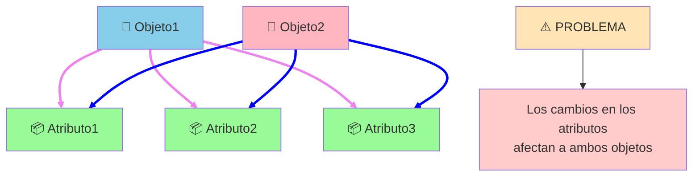
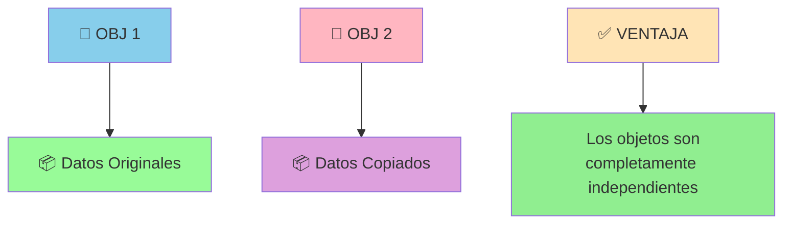

# Anexo I. Copia Superficial y Copia Profunda

## 📋 Índice de contenidos

1. [Introducción al concepto de clonación](#1-introducci%C3%B3n-al-concepto-de-clonaci%C3%B3n)
2. [El método clone()](#2-el-m%C3%A9todo-clone)
3. [Copia superficial (Shallow Copy)](#3-copia-superficial-shallow-copy)
    1. [Concepto y características](#31-concepto-y-caracter%C3%ADsticas)
    2. [Ejemplo problemático](#32-ejemplo-problem%C3%A1tico)
4. [Copia profunda (Deep Copy)](#4-copia-profunda-deep-copy)
    1. [Concepto y características](#41-concepto-y-caracter%C3%ADsticas)
    2. [Implementación correcta](#42-implementaci%C3%B3n-correcta)
5. [Comparación práctica](#5-comparaci%C3%B3n-pr%C3%A1ctica)
6. [Cuándo usar cada tipo](#6-cu%C3%A1ndo-usar-cada-tipo)

## 1. Introducción al concepto de clonación

Antes de adentrarnos en los conceptos más avanzados, es fundamental comprender las diferencias entre **copia superficial** y **copia profunda** de objetos, conceptos que serán relevantes cuando trabajemos con el método `clone()` heredado de la clase `Object`.

La clonación de objetos es un proceso que permite crear copias de objetos existentes, pero la manera en que se realiza esta copia puede tener implicaciones significativas en el comportamiento de nuestro programa.

## 2. El método clone()

El **método `clone()`** nos permite copiar un objeto en otro. Utilizar este método equivaldría a utilizar un constructor de copia. La clase base `Object` tiene el método `clone()`, que es el mecanismo que utiliza Java para clonar objetos.

Es posible y en muchos casos necesario implementar el método `clone()` de una forma más específica que el método genérico `clone()`. **El método genérico `clone()` hace una copia superficial del objeto**.

## 3. Copia superficial (Shallow Copy)

### 3.1 Concepto y características

La **copia superficial** únicamente hace una copia del contenido de un objeto en otro, lo que en algunas ocasiones provoca que la modificación del contenido de un objeto implique el cambio en el clonado, y viceversa.

**Características principales:**

- Los objetos clonados **comparten las mismas referencias** a objetos internos
- Modificar un atributo de tipo objeto en el original **afecta** al objeto clonado
- Es el comportamiento **por defecto** del método `clone()` de `Object`



### 3.2 Ejemplo problemático

```java
// Clase auxiliar para demostrar objetos mutables
class DatosPersonales {
    private String direccion;
    private String telefono;
    
    public DatosPersonales(String direccion, String telefono) {
        this.direccion = direccion;
        this.telefono = telefono;
    }
    
    // Getters y setters
    public String getDireccion() { return direccion; }
    public void setDireccion(String direccion) { this.direccion = direccion; }
    public String getTelefono() { return telefono; }
    public void setTelefono(String telefono) { this.telefono = telefono; }
    
    @Override
    public String toString() {
        return "Dirección: " + direccion + ", Teléfono: " + telefono;
    }
}

public class PersonaSuperficial implements Cloneable {
    private String nombre;
    private DatosPersonales datos;
    
    public PersonaSuperficial(String nombre, String direccion, String telefono) {
        this.nombre = nombre;
        this.datos = new DatosPersonales(direccion, telefono);
    }
    
    // Copia superficial por defecto
    @Override
    public Object clone() throws CloneNotSupportedException {
        return super.clone(); // Solo copia las referencias
    }
    
    // Getters
    public String getNombre() { return nombre; }
    public DatosPersonales getDatos() { return datos; }
    
    @Override
    public String toString() {
        return nombre + " - " + datos.toString();
    }
}

// Demostración del problema
public class TestCopiaSuperficial {
    public static void main(String[] args) {
        try {
            PersonaSuperficial original = new PersonaSuperficial("Juan", "Calle Mayor 1", "666-111-222");
            PersonaSuperficial copia = (PersonaSuperficial) original.clone();
            
            System.out.println("=== ANTES DE MODIFICAR ===");
            System.out.println("Original: " + original);
            System.out.println("Copia: " + copia);
            
            // ⚠️ PROBLEMA: Modificar la copia afecta al original
            copia.getDatos().setDireccion("Avenida Nueva 99");
            copia.getDatos().setTelefono("777-888-999");
            
            System.out.println("\n=== DESPUÉS DE MODIFICAR LA COPIA ===");
            System.out.println("Original: " + original); // ¡También ha cambiado!
            System.out.println("Copia: " + copia);
            
        } catch (CloneNotSupportedException e) {
            System.err.println("Error al clonar: " + e.getMessage());
        }
    }
}
```

**Salida esperada:**

```text
=== ANTES DE MODIFICAR ===
Original: Juan - Dirección: Calle Mayor 1, Teléfono: 666-111-222
Copia: Juan - Dirección: Calle Mayor 1, Teléfono: 666-111-222

=== DESPUÉS DE MODIFICAR LA COPIA ===
Original: Juan - Dirección: Avenida Nueva 99, Teléfono: 777-888-999
Copia: Juan - Dirección: Avenida Nueva 99, Teléfono: 777-888-999
```

## 4. Copia profunda (Deep Copy)

### 4.1 Concepto y características

La **copia profunda** crea una copia completamente independiente del objeto, incluyendo copias independientes de todos los objetos a los que hace referencia.

**Características principales:**

- Cada objeto clonado tiene **sus propias copias** de todos los atributos
- Modificar el original **NO afecta** al objeto clonado
- Requiere **implementación específica** del método `clone()`



### 4.2 Implementación correcta

```java
public class PersonaProfunda implements Cloneable {
    private String nombre;
    private DatosPersonales datos;
    
    public PersonaProfunda(String nombre, String direccion, String telefono) {
        this.nombre = nombre;
        this.datos = new DatosPersonales(direccion, telefono);
    }
    
    // Copia profunda - implementación específica
    @Override
    public Object clone() throws CloneNotSupportedException {
        PersonaProfunda clonada = (PersonaProfunda) super.clone(); // Copia superficial base
        
        // Copia profunda: crear nuevas instancias de objetos internos
        clonada.datos = new DatosPersonales(
            this.datos.getDireccion(), 
            this.datos.getTelefono()
        );
        
        return clonada;
    }
    
    // Getters
    public String getNombre() { return nombre; }
    public DatosPersonales getDatos() { return datos; }
    
    @Override
    public String toString() {
        return nombre + " - " + datos.toString();
    }
}

// Demostración de la solución
public class TestCopiaProfunda {
    public static void main(String[] args) {
        try {
            PersonaProfunda original = new PersonaProfunda("María", "Plaza Central 5", "555-123-456");
            PersonaProfunda copia = (PersonaProfunda) original.clone();
            
            System.out.println("=== ANTES DE MODIFICAR ===");
            System.out.println("Original: " + original);
            System.out.println("Copia: " + copia);
            
            // ✅ CORRECTO: Modificar la copia NO afecta al original
            copia.getDatos().setDireccion("Barrio Nuevo 77");
            copia.getDatos().setTelefono("999-000-111");
            
            System.out.println("\n=== DESPUÉS DE MODIFICAR LA COPIA ===");
            System.out.println("Original: " + original); // Permanece sin cambios
            System.out.println("Copia: " + copia);
            
        } catch (CloneNotSupportedException e) {
            System.err.println("Error al clonar: " + e.getMessage());
        }
    }
}
```

**Salida esperada:**

```text
=== ANTES DE MODIFICAR ===
Original: María - Dirección: Plaza Central 5, Teléfono: 555-123-456
Copia: María - Dirección: Plaza Central 5, Teléfono: 555-123-456

=== DESPUÉS DE MODIFICAR LA COPIA ===
Original: María - Dirección: Plaza Central 5, Teléfono: 555-123-456
Copia: María - Dirección: Barrio Nuevo 77, Teléfono: 999-000-111
```

## 5. Comparación práctica

```java
public class ComparacionCopias {
    public static void main(String[] args) {
        try {
            System.out.println("=== COMPARATIVA DE TIPOS DE COPIA ===\n");
            
            // Prueba con copia superficial
            PersonaSuperficial original1 = new PersonaSuperficial("Ana", "Calle A", "111-222-333");
            PersonaSuperficial copia1 = (PersonaSuperficial) original1.clone();
            
            System.out.println("1. COPIA SUPERFICIAL:");
            System.out.println("   Original: " + original1);
            System.out.println("   Copia: " + copia1);
            
            copia1.getDatos().setTelefono("444-555-666");
            System.out.println("   Tras modificar copia:");
            System.out.println("   Original: " + original1 + " ← ¡AFECTADO!");
            System.out.println("   Copia: " + copia1);
            
            System.out.println();
            
            // Prueba con copia profunda
            PersonaProfunda original2 = new PersonaProfunda("Carlos", "Calle B", "777-888-999");
            PersonaProfunda copia2 = (PersonaProfunda) original2.clone();
            
            System.out.println("2. COPIA PROFUNDA:");
            System.out.println("   Original: " + original2);
            System.out.println("   Copia: " + copia2);
            
            copia2.getDatos().setTelefono("000-111-222");
            System.out.println("   Tras modificar copia:");
            System.out.println("   Original: " + original2 + " ← SIN CAMBIOS");
            System.out.println("   Copia: " + copia2);
            
        } catch (CloneNotSupportedException e) {
            System.err.println("Error: " + e.getMessage());
        }
    }
}
```

## 6. Cuándo usar cada tipo

| Aspecto | Copia Superficial | Copia Profunda |
| :-- | :-- | :-- |
| **Complejidad** | Simple | Más compleja |
| **Rendimiento** | Rápida | Más lenta |
| **Independencia** | Parcial | Total |
| **Uso recomendado** | Objetos simples | Objetos con referencias |

### Copia Superficial

- ✅ Objetos con **solo tipos primitivos**
- ✅ Objetos **inmutables** (String, Integer, etc.)
- ✅ Cuando **quieres compartir** referencias

### Copia Profunda

- ✅ Objetos con **referencias a otros objetos mutables**
- ✅ Cuando necesitas **independencia total**
- ✅ **Estructuras de datos complejas**

> [!IMPORTANT]
> Este concepto será fundamental cuando implementemos el método `clone()` en nuestras clases.

<p align="center">📚 <em>Fin del Anexo I - Copia Superficial y Copia Profunda</em></p>
