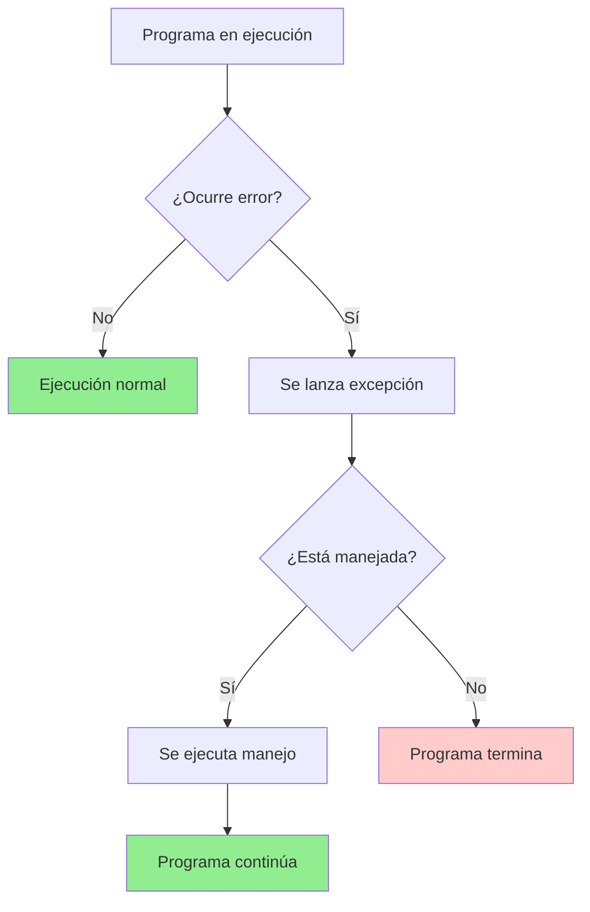
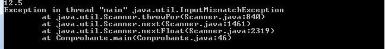
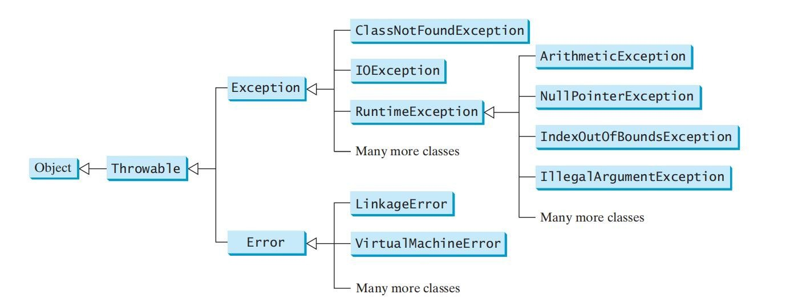

# UT7. Control de Excepciones

## 📋 Índice de contenidos

1. [Introducción al control de excepciones](#1-introducci%C3%B3n-al-control-de-excepciones)
2. [Gestión de excepciones en Java](#2-gesti%C3%B3n-de-excepciones-en-java)
    1. [Concepto de excepción](#21-concepto-de-excepci%C3%B3n)
    2. [Vista previa del control de excepciones](#22-vista-previa-del-control-de-excepciones)
    3. [Sin manejo de excepciones](#23-sin-manejo-de-excepciones)
    4. [Captura y tratamiento con try-catch](#24-captura-y-tratamiento-con-try-catch)
3. [Tipos de excepciones y jerarquía](#3-tipos-de-excepciones-y-jerarqu%C3%ADa)
    1. [Errores vs. Excepciones](#31-errores-vs-excepciones)
    2. [Clase Throwable](#32-clase-throwable)
    3. [Constructores de Throwable](#33-constructores-de-throwable)
    4. [Métodos comunes de Throwable](#34-m%C3%A9todos-comunes-de-throwable)
    5. [Jerarquía de Exception](#35-jerarqu%C3%ADa-de-exception)
    6. [Excepciones implícitas vs. explícitas](#36-excepciones-impl%C3%ADcitas-vs-expl%C3%ADcitas)
4. [Declaración y lanzamiento de excepciones](#4-declaraci%C3%B3n-y-lanzamiento-de-excepciones)
    1. [Declaración con throws](#41-declaraci%C3%B3n-con-throws)
    2. [Lanzamiento con throw](#42-lanzamiento-con-throw)
    3. [Práctica 1: Lanzamiento de excepciones](#43-pr%C3%A1ctica-1-lanzamiento-de-excepciones)
5. [Captura y manejo de excepciones](#5-captura-y-manejo-de-excepciones)
    1. [Sintaxis del try-catch](#51-sintaxis-del-try-catch)
    2. [Múltiples bloques catch](#52-m%C3%BAltiples-bloques-catch)
    3. [Orden de los bloques catch](#53-orden-de-los-bloques-catch)
    4. [El bloque finally](#54-el-bloque-finally)
    5. [Práctica 2: Manejo completo de excepciones](#55-pr%C3%A1ctica-2-manejo-completo-de-excepciones)
6. [Análisis de casos prácticos](#6-an%C3%A1lisis-de-casos-pr%C3%A1cticos)
    1. [Ejemplo 1: Excepción no capturada](#61-ejemplo-1-excepci%C3%B3n-no-capturada)
    2. [Ejemplo 2: Excepción capturada](#62-ejemplo-2-excepci%C3%B3n-capturada)
    3. [Ejemplo 3: Captura incorrecta](#63-ejemplo-3-captura-incorrecta)
    4. [Ejemplo 4: Excepción en método interior](#64-ejemplo-4-excepci%C3%B3n-en-m%C3%A9todo-interior)
    5. [Ejemplo 5: Captura en método exterior](#65-ejemplo-5-captura-en-m%C3%A9todo-exterior)
    6. [Obtención de información de excepciones](#66-obtenci%C3%B3n-de-informaci%C3%B3n-de-excepciones)
7. [Técnicas avanzadas](#7-t%C3%A9cnicas-avanzadas)
    1. [Relanzar excepciones](#71-relanzar-excepciones)
    2. [Encadenar excepciones](#72-encadenar-excepciones)
    3. [Gestión vs. delegación](#73-gesti%C3%B3n-vs-delegaci%C3%B3n)
    4. [Try-with-resources](#74-try-with-resources)
    5. [Multi-catch](#75-multi-catch)
8. [Creación de excepciones propias](#8-creaci%C3%B3n-de-excepciones-propias)
    1. [Cuándo crear excepciones personalizadas](#81-cu%C3%A1ndo-crear-excepciones-personalizadas)
    2. [Implementación de excepciones propias](#82-implementaci%C3%B3n-de-excepciones-propias)
    3. [Práctica 4: Excepción personalizada](#83-pr%C3%A1ctica-4-excepci%C3%B3n-personalizada)
9. [Ejercicios de análisis](#9-ejercicios-de-análisis)
    1. [Identificación de excepciones](#91-identificación-de-excepciones)
    2. [Predicción de comportamiento](#92-predicción-de-comportamiento)
    3. [Análisis de flujo básico con try-catch](#93-análisis-de-flujo-básico-con-try-catch)
    4. [Análisis de flujo con finally](#94-análisis-de-flujo-con-finally)
    5. [Análisis de flujo con múltiples catch](#95-análisis-de-flujo-con-múltiples-catch)
    6. [Análisis de flujo complejo](#96-análisis-de-flujo-complejo)
    7. [Preguntas de reflexión](#97-preguntas-de-reflexión)
10. [Aserciones](#10-aserciones)
    1. [Concepto y uso de assert](#101-concepto-y-uso-de-assert)
    2. [Precondiciones](#102-precondiciones)
    3. [Postcondiciones](#103-postcondiciones)
    4. [Guard Clauses](#104-guard-clauses)
    5. [Práctica 5: Uso de aserciones](#105-pr%C3%A1ctica-5-uso-de-aserciones)
11. [Buenas prácticas en el manejo de excepciones](#11-buenas-prácticas-en-el-manejo-de-excepciones)
12. [Reflexión final](#12-reflexión-final)

## 1. Introducción al control de excepciones

Los **errores en tiempo de ejecución** ocurren cuando la JVM detecta una operación que es imposible realizar, como por ejemplo:

- `ArrayIndexOutOfBoundsException`: Acceso a una posición inexistente de un array
- `NullPointerException`: Intento de usar una referencia nula
- `ArithmeticException`: División por cero

En el desarrollo de programas, **en cualquier lenguaje de programación**, el programador debe disponer de mecanismos (proporcionados por el lenguaje) para detectar y gestionar los errores que se puedan producir en tiempo de ejecución.

> [!IMPORTANT]
>
> El manejo adecuado de excepciones es fundamental para crear aplicaciones robustas y confiables que puedan recuperarse de situaciones inesperadas sin terminar abruptamente.



## 2. Gestión de excepciones en Java

### 2.1 Concepto de excepción

En Java, los errores en tiempo de ejecución son tratados como **excepciones**. Una **excepción** es un objeto que representa un error o una condición que impide que la ejecución proceda con normalidad.

Llamamos **gestión (o control) de excepciones** al conjunto de mecanismos que un lenguaje de programación proporciona para detectar y gestionar los errores que se puedan producir en tiempo de ejecución.



### 2.2 Vista previa del control de excepciones

Consideremos este ejemplo básico para comprender cómo funciona el control de excepciones:

```java
import java.util.Scanner;

public class EjemploDivision {
    public static void main(String[] args) {
        Scanner input = new Scanner(System.in);
        
        System.out.print("Introduce dos números enteros: ");
        int numero1 = input.nextInt();
        int numero2 = input.nextInt();
        
        int resultado = numero1 / numero2;
        System.out.println(numero1 + " / " + numero2 + " = " + resultado);
        
        input.close();
    }
}
```

**Comportamiento:**

- Si introduces `5` y `2`, el resultado sería `2`
- Si introduces `3` y `0`, el resultado sería una excepción `ArithmeticException: / by zero`

En este caso, la JVM ha sido la que ha lanzado la excepción y el programador no tiene control sobre este error.  Si hubiese más código después del error, no se ejecutaría.

### 2.3 Sin manejo de excepciones

Sin utilizar excepciones, podríamos llegar a la siguiente solución para evitar errores, pero de esta manera también estaríamos terminando el programa de forma abrupta:

```java
import java.util.Scanner;

public class DivisionSinExcepciones {
    public static void main(String[] args) {
        Scanner sc = new Scanner(System.in);
        System.out.println("Introduce 2 números: ");
        int num1 = sc.nextInt();
        int num2 = sc.nextInt();

        if (num2 == 0) {
            System.out.println("No se puede dividir por cero");
        } else {
            int resultado = num1 / num2;
            System.out.println("El resultado es: " + resultado);
        }
        
        sc.close();
    }
}
```

> [!NOTE]
>
> **Ventajas e inconvenientes:**
>
> if-else
>
> - ✔️ Evita excepciones: el flujo es claro.
> - ✔️ Más eficiente: no se crea el contexto de excepción.
> - ✔️ El código es más directo para errores **esperados**.
> - ❌ No detecta errores que suceden **fuera de control** (ej. acceso a disco, errores de red).
> - ❌ Difícil de mantener cuando las condiciones a comprobar son muchas o variables.
>
> try-catch
>
> - ✔️ Centraliza la gestión de errores, incluso los **inesperados**.
> - ✔️ Permite separar la lógica principal de la de gestión de fallos.
> - ✔️ Obliga a considerar muchos tipos de error posibles.
> - ❌ Puede ocultar errores de lógica si se usa para condiciones **esperadas**.
> - ❌ Abusar de try-catch para lo cotidiano degrada el rendimiento y la legibilidad.
>

### 2.4 Captura y tratamiento con try-catch

> [!IMPORTANT]
> 
> En Java, las excepciones pueden generarse de dos maneras principales:
>
> Por un lado, algunas excepciones son lanzadas automáticamente por la propia Java Virtual Machine (JVM) durante la ejecución del programa cuando se produce una situación fuera de lo normal, como intentar dividir por cero (`ArithmeticException: / by zero`), acceder a una posición fuera de un array (`ArrayIndexOutOfBoundsException`) o manejar referencias nulas (`NullPointerException`).
>
> Por otro lado, el programador también tiene la capacidad de lanzar excepciones de forma manual utilizando la palabra reservada `throw`. Esto permite señalar condiciones anómalas o errores específicos detectados en el propio código, facilitando así un control más preciso sobre el flujo y la gestión de errores.
>
> Más adelante se explicará en detalle cómo lanzar excepciones manualmente y en qué situaciones resulta útil hacerlo.

Java dispone del mecanismo **try-catch** para capturar una excepción lanzada y determinar la actuación siguiente que corresponda.

**Sintaxis general:**

```java
try {
    // Código que puede lanzar una excepción
} catch (TipoExcepcion1 e) {
    // Código para gestionar la excepción TipoExcepcion1
} catch (TipoExcepcion2 e) {
    // Código para gestionar la excepción TipoExcepcion2
} 
```

**Ejemplo con manejo de excepciones:**

```java
import java.util.Scanner;

public class DivisionConExcepciones {
    public static void main(String[] args) {
        Scanner input = new Scanner(System.in);
        
        try {
            System.out.print("Introduce dos números enteros: ");
            int numero1 = input.nextInt();
            int numero2 = input.nextInt();
            
            int resultado = quotient(numero1, numero2);
            System.out.println(numero1 + " / " + numero2 + " = " + resultado);
            
        } catch (ArithmeticException ex) {
            System.out.println("Excepción:" + ex.getMessage());
        } catch (Exception ex) {
            System.out.println("Error");
        }
        
        System.out.println("La ejecución continúa...");
        input.close();
    }
    
    public static int quotient(int numero1, int numero2) {
        if (numero2 == 0) {
            throw new ArithmeticException("El divisor no puede ser cero");
        }
        return numero1 / numero2;
    }
}
```

## 3. Tipos de excepciones y jerarquía

### 3.1 Errores vs. Excepciones

En Java se distingue entre **errores** y **excepciones**:

**🔴 Errores (Error):**

- Corresponden a situaciones irrecuperables
- No tienen solución y no dependen del programador
- El programador no se debe preocupar de tratarlos
- Ejemplos: falta de recursos, canal de E/S no responde, etc.

**🟡 Excepciones (Exception):**

- Situaciones excepcionales que los programas pueden encontrar en tiempo de ejecución
- Normalmente por culpa del programador o condiciones externas
- Pueden y deben ser gestionadas adecuadamente
- Ejemplos: división por cero, acceso a array fuera de límites, etc.

### 3.2 Clase Throwable

Java engloba todos los posibles errores en clases derivadas de la clase `Error` y todas las posibles excepciones en clases derivadas de la clase `Exception`.

Las clases `Error` y `Exception` derivan ambas de la clase **`Throwable`**, la cual proporciona mecanismos comunes para la gestión de cualquier tipo de error y excepción.




### 3.3 Constructores de Throwable

La clase `Throwable` proporciona diversos constructores para crear objetos de excepción:

| Constructor | Descripción |
| :-- | :-- |
| `Throwable()` | Construye un objeto con el mensaje a `null` |
| `Throwable(String message)` | Construye un objeto con el mensaje indicado |
| `Throwable(String message, Throwable causa)` | Construye un objeto con el mensaje indicado y la causa que ha provocado la excepción |
| `Throwable(Throwable causa)` | Construye un objeto con la causa que ha provocado la excepción y como mensaje, el mensaje que tenga el objeto "causa" |

> [!NOTE]
> Dos de los constructores reciben otro objeto `Throwable` como causante del nuevo objeto, lo que permite realizar un **encadenamiento de excepciones**.

### 3.4 Métodos comunes de Throwable

La clase `Throwable` proporciona varios métodos comunes para la gestión de excepciones:

| Método | Descripción |
| :-- | :-- |
| `public Throwable getCause()` | Retorna la causa de la excepción o `null` |
| `public String getMessage()` | Retorna el mensaje que define la excepción o `null` |
| `public void printStackTrace()` | Visualiza por consola el contexto donde se ha producido el error y la cascada de llamadas desde el método `main` |
| `public String toString()` | Retorna una descripción corta del objeto |

**Ejemplo de uso:**

```java
try {
    // Código que puede lanzar excepción
    int resultado = 10 / 0;
} catch (ArithmeticException e) {
    System.out.println("Mensaje: " + e.getMessage());
    System.out.println("ToString: " + e.toString());
    e.printStackTrace();
}
```

### 3.5 Jerarquía de Exception

Para realizar una buena gestión de excepciones, debemos centrarnos en la jerarquía de clases que nacen a partir de `Exception`. En la siguiente imagen se muestran algunas de las que existen.


**Excepciones comunes:**

- **`IOException`**: Errores de entrada/salida
- **`SQLException`**: Errores de base de datos
- **`ClassNotFoundException`**: Clase no encontrada
- **`RuntimeException`**: Excepciones en tiempo de ejecución
  - `ArithmeticException`: Errores aritméticos
  - `NullPointerException`: Referencia nula
  - `IndexOutOfBoundsException`: Índice fuera de límites
  - `IllegalArgumentException`: Argumento inválido

### 3.6 Excepciones implícitas vs. explícitas

Podemos diferenciar dos grandes subtipos de `Exception`:

**🟢 Excepciones implícitas (RuntimeException):**

- El programador **NO** tiene obligación de capturar y gestionar
- Normalmente están relacionadas con errores de programación
  - Errores que normalmente no se revisan en el código de producción
  - Errores que el programador debería haber revisado al escribir el código

**🔴 Excepciones explícitas:**

- Todas las de la clase `Exception` que **NO** pertenecen a `RuntimeException`
- El programador **está obligado** a tenerlas en cuenta donde se puedan producir
- Deben ser capturadas o declaradas en la signatura del método

> [!IMPORTANT]
>
> Java obliga al programador a gestionar todas las excepciones excepto las derivadas de `RuntimeException`. Esto también se conoce como **excepciones verificadas** (checked exceptions).

## 4. Declaración y lanzamiento de excepciones

### 4.1 Declaración con throws

Cada método podrá lanzar una serie de excepciones y se deberán definir aquellas que puede lanzar. Java no nos obliga a gestionar los `Error` o los `RuntimeException` expresamente, pero el resto de excepciones deben ser declaradas en el método como excepciones a gestionar mediante la palabra reservada **`throws`**.

**Sintaxis:**

```java
public tipoRetorno nombreMetodo(parametros) throws TipoExcepcion1, TipoExcepcion2 {
    // Código del método
}
```

**Ejemplo:**

```java
import java.io.IOException;

public class EjemploThrows {
    
    public void leerArchivo(String nombreArchivo) throws IOException {
        // Código que puede lanzar IOException
        // No necesitamos try-catch aquí, delegamos la responsabilidad
    }
    
    public void metodoQueUsaLeerArchivo() {
        try {
            leerArchivo("datos.txt");
        } catch (IOException e) {
            System.out.println("Error al leer archivo: " + e.getMessage());
        }
    }
}
```

### 4.2 Lanzamiento con throw

Un programa que detecta un error puede crear una instancia de una excepción del tipo apropiado y lanzarla manualmente usando la palabra reservada **`throw`**.

**Sintaxis:**

```java
if (condicionDeError) {
    throw new TipoExcepcion("Mensaje descriptivo del error");
}
```

> [!WARNING]
> No confundir `throw` (lanzar una excepción) con `throws` (declarar que un método puede lanzar una excepción).

**Ejemplo:**

```java
public class CalculadoraSegura {
    
    public double dividir(double dividendo, double divisor) {
        if (divisor == 0) {
            throw new ArithmeticException("No se puede dividir por cero");
        }
        return dividendo / divisor;
    }
    
    public double calcularRaizCuadrada(double numero) {
        if (numero < 0) {
            throw new IllegalArgumentException("No se puede calcular la raíz cuadrada de un número negativo");
        }
        return Math.sqrt(numero);
    }
}
```

### 4.3 Práctica 1: Lanzamiento de excepciones

**Objetivo:** Crear un método que valide si un array tiene la longitud especificada, lanzando una excepción en caso contrario.

**Instrucciones:**

1. Crea un método `verificarLongitudArray` que reciba un entero `n` y un array de `String`
2. Si la longitud del array no es igual a `n`, lanza una excepción `Exception` con un mensaje descriptivo
3. Crea un programa principal que pruebe este método con diferentes casos
<details>
<summary>💻 Solución</summary>

```java
public class ValidacionArray {
    
    /**
     * Verifica si un array tiene la longitud especificada
     * @param n Longitud esperada
     * @param array Array a verificar
     * @throws Exception Si la longitud no coincide
     */
    public static void verificarLongitudArray(int n, String[] array) throws Exception {
        if (array.length != n) {
            throw new Exception("El array no tiene la longitud indicada. " +
                              "Esperada: " + n + ", actual: " + array.length);
        }
        System.out.println("Verificación exitosa. El array tiene longitud: " + n);
    }
    
    public static void main(String[] args) {
        System.out.println("=== PRUEBAS DE VALIDACIÓN DE ARRAY ===");
        
        try {
            System.out.println("Prueba 1: Array correcto");
            verificarLongitudArray(4, new String[4]);
            System.out.println("✅ Prueba 1 exitosa\n");
            
            System.out.println("Prueba 2: Array incorrecto");
            verificarLongitudArray(2, new String[4]);
            System.out.println("Esta línea no se ejecutará");
            
        } catch (Exception e) {
            System.out.println("❌ Error capturado: " + e.getMessage());
            e.printStackTrace();
        }
        
        System.out.println("\nPrograma finalizado.");
    }
}
```

</details>

## 5. Captura y manejo de excepciones

### 5.1 Sintaxis del try-catch

Para recoger y tratar una excepción lanzada, disponemos de la sentencia **try-catch**:

```java
try {
    // Código que puede lanzar una excepción
} catch (TipoExcepcion e) {
    // Código para gestionar la excepción
}
```

**Flujo de ejecución:**

1. Se ejecuta el código dentro del bloque `try`
2. Si no ocurre ninguna excepción, se salta el bloque `catch`
3. Si ocurre una excepción que coincide con el tipo del `catch`, se ejecuta ese bloque (quedando el resto de instrucciones que quedaran dentro del `try` sin ejecutar).
4. Después del manejo, la ejecución continúa normalmente

### 5.2 Múltiples bloques catch

Se pueden definir varios bloques `catch` para manejar diferentes tipos de excepciones:

```java
import java.io.*;

public class MultipleCatch {
    public static void main(String[] args) {
        BufferedReader br = new BufferedReader(new InputStreamReader(System.in));
        System.out.println("Introduce el total de parámetros que quieres mostrar:");
        
        try {
            int total = Integer.parseInt(br.readLine());
            for (int i = 0; i < total; i++) {
                System.out.println(args[i]);
            }
        } catch (IOException e) {
            System.out.println("Error de entrada de datos");
        } catch (NumberFormatException e) {
            System.out.println("El dato no tiene formato numérico válido");
        } catch (ArrayIndexOutOfBoundsException e) {
            System.out.println("No se han introducido tantos argumentos al iniciar el programa");
        }
    }
}
```

### 5.3 Orden de los bloques catch

> [!CAUTION]
> Es **fundamental** ordenar los bloques `catch` de mayor a menor especificidad (de más concreto a más general).

**❌ Orden incorrecto:**

```java
try {
    // código
} catch (Exception ex) {          // MUY GENERAL
    // ...
} catch (RuntimeException ex) {   // MÁS ESPECÍFICO
    // Este catch nunca se ejecutará
}
```

**✅ Orden correcto:**

```java
try {
    // código
} catch (ArithmeticException ex) {     // MUY ESPECÍFICO
    System.out.println("Error aritmético");
} catch (RuntimeException ex) {        // ESPECÍFICO
    System.out.println("Error en tiempo de ejecución");
} catch (Exception ex) {               // GENERAL
    System.out.println("Error general");
}
```

### 5.4 El bloque finally

El bloque **`finally`** se ejecuta **siempre**, independientemente de si se produce una excepción o no.

```java
try {
    // Código que puede lanzar excepción
} catch (Exception e) {
    // Manejo de la excepción
} finally {
    // Código que se ejecuta SIEMPRE
    // Útil para liberar recursos (cerrar archivos, conexiones, etc.)
}
```

**Características del bloque finally:**

- Se ejecuta incluso si hay sentencias `break` o `return` en el `try` o `catch`
- La **única situación** en que NO se ejecuta es cuando se llama a `System.exit()`
- Es ideal para tareas de limpieza y liberación de recursos

**Ejemplo práctico:**

```java
import java.io.*;

public class EjemploFinally {
    public static void procesarArchivo(String nombreArchivo) {
        FileReader archivo = null;
        
        try {
            archivo = new FileReader(nombreArchivo);
            // Procesar archivo
            System.out.println("Archivo procesado correctamente");
            
        } catch (FileNotFoundException e) {
            System.out.println("Archivo no encontrado: " + e.getMessage());
        } catch (IOException e) {
            System.out.println("Error de E/S: " + e.getMessage());
        } finally {
            // SIEMPRE se ejecuta este bloque
            if (archivo != null) {
                try {
                    archivo.close();
                    System.out.println("Archivo cerrado correctamente");
                } catch (IOException e) {
                    System.out.println("Error al cerrar archivo");
                }
            }
        }
    }
}
```

### 5.5 Práctica 2: Manejo completo de excepciones

**Objetivo:** Crear un programa que demuestre el manejo completo de excepciones con múltiples `catch` y `finally`.

**Instrucciones:**

1. Crea un programa que realice operaciones matemáticas con datos introducidos por el usuario
2. Maneja diferentes tipos de excepciones específicamente
3. Usa un bloque `finally` para mostrar un mensaje de finalización
<details>
<summary>💻 Solución</summary>

```java
import java.util.Scanner;
import java.util.InputMismatchException;

public class CalculadoraRobusta {
    
    private Scanner scanner;
    
    public CalculadoraRobusta() {
        scanner = new Scanner(System.in);
    }
    
    public void iniciar() {
        System.out.println("=== CALCULADORA ROBUSTA ===");
        
        try {
            double num1 = solicitarNumero("Introduce el primer número: ");
            double num2 = solicitarNumero("Introduce el segundo número: ");
            
            mostrarMenu();
            int opcion = solicitarOpcion();
            
            double resultado = realizarOperacion(num1, num2, opcion);
            System.out.printf("Resultado: %.2f\n", resultado);
            
        } catch (InputMismatchException e) {
            System.out.println("❌ Error: Entrada no válida. Se esperaba un número.");
        } catch (ArithmeticException e) {
            System.out.println("❌ Error aritmético: " + e.getMessage());
        } catch (IllegalArgumentException e) {
            System.out.println("❌ Argumento inválido: " + e.getMessage());
        } catch (Exception e) {
            System.out.println("❌ Error inesperado: " + e.getMessage());
            e.printStackTrace();
        } finally {
            System.out.println("\n🔄 Cerrando calculadora...");
            if (scanner != null) {
                scanner.close();
                System.out.println("✅ Recursos liberados correctamente");
            }
        }
    }
    
    private double solicitarNumero(String mensaje) throws InputMismatchException {
        System.out.print(mensaje);
        if (!scanner.hasNextDouble()) {
            throw new InputMismatchException("Se esperaba un número decimal");
        }
        return scanner.nextDouble();
    }
    
    private void mostrarMenu() {
        System.out.println("\nOperaciones disponibles:");
        System.out.println("1. Suma");
        System.out.println("2. Resta");
        System.out.println("3. Multiplicación");
        System.out.println("4. División");
        System.out.println("5. Potencia");
    }
    
    private int solicitarOpcion() throws InputMismatchException, IllegalArgumentException {
        System.out.print("Selecciona una opción (1-5): ");
        if (!scanner.hasNextInt()) {
            throw new InputMismatchException("Se esperaba un número entero");
        }
        
        int opcion = scanner.nextInt();
        if (opcion < 1 || opcion > 5) {
            throw new IllegalArgumentException("Opción debe estar entre 1 y 5");
        }
        
        return opcion;
    }
    
    private double realizarOperacion(double num1, double num2, int opcion) 
            throws ArithmeticException {
        
        switch (opcion) {
            case 1:
                return num1 + num2;
            case 2:
                return num1 - num2;
            case 3:
                return num1 * num2;
            case 4:
                if (num2 == 0) {
                    throw new ArithmeticException("División por cero no permitida");
                }
                return num1 / num2;
            case 5:
                return Math.pow(num1, num2);
            default:
                throw new IllegalArgumentException("Opción no válida: " + opcion);
        }
    }
    
    public static void main(String[] args) {
        CalculadoraRobusta calculadora = new CalculadoraRobusta();
        calculadora.iniciar();
    }
}
```

</details>

## 6. Análisis de casos prácticos

En esta sección analizaremos ejemplos específicos para comprender mejor el comportamiento de las excepciones en diferentes escenarios.

### 6.1 Ejemplo 1: Excepción no capturada

```java
public class Excepcion01 {
    public static void main(String args[]) {
        String t[] = {"Hola", "Adiós", "Hasta mañana"};
        for (int i = 0; i <= t.length; i++)
            System.out.println("Posición " + i + ": " + t[i]);
        System.out.println("El programa se ha acabado.");
    }
}
```

**¿Qué se muestra por pantalla?**

<details>
<summary>🔍 Respuesta</summary>

```text
Posición 0: Hola
Posición 1: Adiós
Posición 2: Hasta mañana
Exception in thread "main" java.lang.ArrayIndexOutOfBoundsException: Index 3 out of bounds for length 3
```

**Explicación:** El bucle intenta acceder a `t[3]` cuando el array solo tiene índices 0, 1 y 2. Se lanza `ArrayIndexOutOfBoundsException` y el programa termina abruptamente. La línea "El programa se ha acabado" **no se ejecuta**.

</details>

### 6.2 Ejemplo 2: Excepción capturada

```java
public class Excepcion02 {
    public static void main(String args[]) {
        String t[] = {"Hola", "Adiós", "Hasta mañana"};
        try {
            System.out.println("Antes de ejecutar el for");
            for (int i = 0; i <= t.length; i++)
                System.out.println("Posición " + i + ": " + t[i]);
            System.out.println("Después de ejecutar el for");
        } catch (ArrayIndexOutOfBoundsException e) {
            System.out.println("El programador estaba en la luna... ¡Se ha salido de límites!");
        }
        System.out.println("Final del programa");
    }
}
```

**¿Qué se muestra por pantalla?**

<details>
<summary>🔍 Respuesta</summary>

```text
Antes de ejecutar el for
Posición 0: Hola
Posición 1: Adiós
Posición 2: Hasta mañana
El programador estaba en la luna... ¡Se ha salido de límites!
Final del programa
```

**Explicación:** La excepción se captura correctamente, se ejecuta el bloque `catch`, y el programa continúa normalmente.

</details>

### 6.3 Ejemplo 3: Captura incorrecta

```java
public class Excepcion03 {
    public static void main(String args[]) {
        String t[] = {"Hola", "Adiós", "Hasta mañana"};
        try {
            System.out.println("Antes de ejecutar el for");
            for (int i = 0; i <= t.length; i++)
                System.out.println("Posición " + i + ": " + t[i]);
            System.out.println("Después de ejecutar el for");
        } catch (StringIndexOutOfBoundsException e) {
            System.out.println("El programador estaba en la luna... ¡Se ha salido de límites!");
        } finally {
            System.out.println("Este código se ejecuta, pase lo que pase!");
        }
        System.out.println("Final del programa");
    }
}
```

**¿Qué se muestra por pantalla?**

<details>
<summary>🔍 Respuesta</summary>

```
Antes de ejecutar el for
Posición 0: Hola
Posición 1: Adiós
Posición 2: Hasta mañana
Este código se ejecuta, pase lo que pase!
Exception in thread "main" java.lang.ArrayIndexOutOfBoundsException: Index 3 out of bounds for length 3
```

**Explicación:** El tipo de excepción en el `catch` es incorrecto (`StringIndexOutOfBoundsException` en lugar de `ArrayIndexOutOfBoundsException`), por lo que no se captura. El bloque `finally` se ejecuta siempre, pero después el programa termina con la excepción no capturada.

</details>

### 6.4 Ejemplo 4: Excepción en método interior

```java
public class Excepcion04 {
    public static void met02() {
        String t[] = {"Hola", "Adiós", "Hasta mañana"};
        for (int i = 0; i <= t.length; i++)
            System.out.println("Posición " + i + ": " + t[i]);
        System.out.println("El método met02 se ha acabado.");
    }

    public static void met01() {
        System.out.println("Entramos en el método met01 y vamos a ejecutar met02");
        met02();
        System.out.println("Volvemos a estar en met01 después de finalizar met02");
    }

    public static void main(String args[]) {
        System.out.println("Iniciamos el programa y vamos a ejecutar met01");
        met01();
        System.out.println("Volvemos a estar en main después de finalizar met01");
    }
}
```

**¿Qué se muestra por pantalla?**

<details>
<summary>🔍 Respuesta</summary>

```text
Iniciamos el programa y vamos a ejecutar met01
Entramos en el método met01 y vamos a ejecutar met02
Posición 0: Hola
Posición 1: Adiós
Posición 2: Hasta mañana
Exception in thread "main" java.lang.ArrayIndexOutOfBoundsException: Index 3 out of bounds for length 3
```

**Explicación:** La excepción se propaga desde `met02` → `met01` → `main`. Como no se captura en ningún nivel, el programa termina abruptamente. Las líneas posteriores a la llamada de cada método no se ejecutan.

</details>

### 6.5 Ejemplo 5: Captura en método exterior

```java
public class Excepcion05 {
    public static void met03() {
        String t[] = {"Hola", "Adiós", "Hasta mañana"};
        for (int i = 0; i <= t.length; i++)
            System.out.println("Posición " + i + ": " + t[i]);
        System.out.println("El método met03 se ha acabado.");
    }

    public static void met02() {
        System.out.println("Entramos en el método met02 y vamos a ejecutar met03");
        met03();
        System.out.println("Volvemos a estar en met02 después de finalizar met03");
    }

    public static void met01() {
        try {
            System.out.println("Entramos en el método met01 y vamos a ejecutar met02");
            met02();
            System.out.println("Volvemos a estar en met01 después de finalizar met02");
        } catch (ArrayIndexOutOfBoundsException e) {
            System.out.println("El programador estaba en la luna... ¡Se ha salido de límites!");
        }
    }

    public static void main(String args[]) {
        System.out.println("Iniciamos el programa y vamos a ejecutar met01");
        met01();
        System.out.println("Volvemos a estar en main después de finalizar met01");
    }
}
```

**¿Qué se muestra por pantalla?**

<details>
<summary>🔍 Respuesta</summary>

```text
Iniciamos el programa y vamos a ejecutar met01
Entramos en el método met01 y vamos a ejecutar met02
Entramos en el método met02 y vamos a ejecutar met03
Posición 0: Hola
Posición 1: Adiós
Posición 2: Hasta mañana
El programador estaba en la luna... ¡Se ha salido de límites!
Volvemos a estar en main después de finalizar met01
```

**Explicación:** La excepción se propaga desde `met03` hasta `met01`, donde se captura. El programa continúa normalmente después del manejo.

</details>

### 6.6 Obtención de información de excepciones

Es importante saber cómo obtener información detallada de las excepciones para depuración:

```java
public class InformacionExcepciones {
    public static void met01() {
        try {
            System.out.println("Entramos en el método met01 y vamos a ejecutar met02");
            met02();
            System.out.println("Volvemos a estar en met01 después de finalizar met02");
        } catch (ArrayIndexOutOfBoundsException e) {
            System.out.println("Estamos dentro del bloque catch que ha capturado la excepción.");
            System.out.println("Información que da el método getMessage():");
            System.out.println(e.getMessage());
            System.out.println("Información que da el método printStackTrace();");
            e.printStackTrace();
            System.out.println("Información que da el método toString():");
            System.out.println(e);
        }
    }
    
    public static void met02() {
        String t[] = {"Hola", "Adiós", "Hasta mañana"};
        for (int i = 0; i <= t.length; i++)
            System.out.println("Posición " + i + ": " + t[i]);
    }
    
    public static void main(String args[]) {
        met01();
    }
}
```

**Métodos importantes para debugging:**

| Método | Información que proporciona |
| :-- | :-- |
| `getMessage()` | Mensaje descriptivo del error |
| `toString()` | Nombre de la clase de excepción + mensaje |
| `printStackTrace()` | Traza completa del stack con ubicaciones específicas |

## 7. Técnicas avanzadas

### 7.1 Relanzar excepciones

Es posible relanzar una excepción capturada para que sea gestionada por otro bloque `catch` superior en la cadena de llamadas.

```java
public class RelanzarExcepciones {
    
    public void metodoInterior() throws Exception {
        try {
            // Código que puede fallar
            int resultado = 10 / 0;
        } catch (ArithmeticException e) {
            System.out.println("Capturada en método interior: " + e.getMessage());
            // Relanzar la excepción
            throw e;
        }
    }
    
    public void metodoExterior() {
        try {
            metodoInterior();
        } catch (Exception e) {
            System.out.println("Capturada en método exterior: " + e.getMessage());
        }
    }
}
```

> [!NOTE]
> Al relanzar la excepción, el programa buscará un nuevo `catch` que recoja la excepción lanzada (el actual ya no se incluye como posible `catch`).

>[!TIP]
> Recuerda que las excepciones no son más que objetos, por tanto puedes crearlos y lanzarlos en la misma instrucción, o usar variables/constantes
> ```java
> Exception miExcepcion = new Exception("Un error inesperado...");
> throw miExcepcion;
> // o bién
> throw new Exception("Otra excepción que hago saltar");
> ```

### 7.2 Encadenar excepciones

Podemos lanzar una excepción nueva dentro de un `catch`, creando lo que se conoce como **excepciones encadenadas**:

```java
public class ExcepcionesEncadenadas {
    
    public static void metodo1() throws Exception {
        try {
            metodo2();
        } catch (Exception ex) {
            // Crear nueva excepción con la original como causa
            throw new Exception("Nueva información desde método1", ex);
        }
    }
    
    public static void metodo2() throws Exception {
        throw new Exception("Error original desde método2");
    }
    
    public static void main(String[] args) {
        try {
            metodo1();
        } catch (Exception ex) {
            System.out.println("Excepción principal: " + ex.getMessage());
            System.out.println("Causa original: " + ex.getCause().getMessage());
            ex.printStackTrace();
        }
    }
}
```

**Salida típica:**

```text
java.lang.Exception: Nueva información desde método1
    at ExcepcionesEncadenadas.metodo1(ExcepcionesEncadenadas.java:7)
    at ExcepcionesEncadenadas.main(ExcepcionesEncadenadas.java:18)
Caused by: java.lang.Exception: Error original desde método2
    at ExcepcionesEncadenadas.metodo2(ExcepcionesEncadenadas.java:13)
    at ExcepcionesEncadenadas.metodo1(ExcepcionesEncadenadas.java:5)
    ... 1 more
```

### 7.3 Gestión vs. delegación

Java obliga al programador a gestionar todas las excepciones excepto las derivadas de `RuntimeException`. El programador debe decidir entre:

**🔧 Gestionar la excepción (try-catch):**

```java
public void leerArchivo() {
    try {
        // Código que puede lanzar IOException
        FileReader archivo = new FileReader("datos.txt");
    } catch (IOException e) {
        System.out.println("Error al leer archivo: " + e.getMessage());
    }
}
```

**📤 Delegar la excepción (throws):**

```java
public void leerArchivo() throws IOException {
    // Delegar la responsabilidad al método que llama
    FileReader archivo = new FileReader("datos.txt");
}
```

**¿Cuándo usar cada aproximación?**

> [!NOTE]
>
> **Ejemplos prácticos de cuándo delegar vs gestionar excepciones:**
> 
> **🔺 Ejemplo 1: Clase Triángulo que valida ángulos**
> Si nuestra clase `Triangulo` detecta que los ángulos no suman 180°, debe **delegar** la excepción porque:
> - Un **programa de dibujo** podría querer ajustar automáticamente los ángulos para que sumen 180° y continuar
> - Un **programa de cálculos matemáticos** podría querer mostrar un error detallado al usuario y pedirle que corrija los datos
> - Una **aplicación educativa** podría querer usar este error como oportunidad de enseñanza
>
> La clase `Triangulo` no tiene suficiente contexto para saber cuál es la mejor estrategia de recuperación, por lo que es mejor que declare `throws TrianguloInvalidoException` y deje que cada aplicación decida qué hacer.
>
> **🏗️ Ejemplo 2: Validación en constructores**
> Cuando validamos datos antes de crear un objeto, debemos **delegar** porque:
>
> - Si el constructor gestiona internamente la excepción (try-catch), podría crear el objeto con valores por defecto o incompletos, resultando en un **estado inconsistente**
> - Al delegar con `throws`, forzamos al código llamador a proporcionar datos válidos **antes** de que el objeto se cree
> - Esto garantiza que **todos los objetos creados están en un estado válido desde el momento de su construcción**
>
> Por ejemplo, si un constructor de `CuentaBancaria` recibe un saldo inicial negativo, es mejor lanzar `SaldoInvalidoException` que crear la cuenta con saldo 0, porque eso podría no ser lo que el programador esperaba.

En resumen:

| Gestionar (try-catch) | Delegar (throws) |
| :-- | :-- |
| Cuando puedes recuperarte del error | Cuando el método superior está mejor posicionado para decidir |
| Cuando tienes información suficiente para manejar el error | Cuando el error debe propagarse hacia arriba |
| En métodos de alto nivel (como `main`) | En métodos de utilidad o biblioteca |

### 7.4 Try-with-resources

Java 7 introdujo una sintaxis mejorada para manejar recursos que necesitan ser cerrados automáticamente:

```java
// Método tradicional (verbose)
public void leerDatosTradicional() {
    Scanner scanner = null;
    try {
        scanner = new Scanner(System.in);
        System.out.print("Introduce tu nombre: ");
        String nombre = scanner.nextLine();
        System.out.print("Introduce tu edad: ");
        int edad = scanner.nextInt();
        System.out.println("Hola " + nombre + ", tienes " + edad + " años");
    } catch (Exception e) {
        System.out.println("Error: " + e.getMessage());
    } finally {
        if (scanner != null) {
            scanner.close();
            System.out.println("Scanner cerrado correctamente");
        }
    }
}

// Try-with-resources (Java 7+)
public void leerDatosModerno() {
    try (Scanner scanner = new Scanner(System.in)) {
        System.out.print("Introduce tu nombre: ");
        String nombre = scanner.nextLine();
        System.out.print("Introduce tu edad: ");
        int edad = scanner.nextInt();
        System.out.println("Hola " + nombre + ", tienes " + edad + " años");
        // El Scanner se cierra automáticamente
    } catch (Exception e) {
        System.out.println("Error: " + e.getMessage());
    }
}
```

**Ejemplo con múltiples recursos:**

```java
// Múltiples Scanner (ejemplo didáctico)
public void procesarMultiplesEntradas() {
    try (Scanner consola = new Scanner(System.in);
         Scanner datos = new Scanner("Juan 25 Madrid")) {
        
        // Leer de consola
        System.out.print("Introduce un número: ");
        int numero = consola.nextInt();
        
        // Procesar datos predefinidos
        String nombre = datos.next();
        int edad = datos.nextInt();
        String ciudad = datos.next();
        
        System.out.println("Número introducido: " + numero);
        System.out.println("Datos: " + nombre + ", " + edad + ", " + ciudad);
        
        // Ambos Scanner se cierran automáticamente
    } catch (Exception e) {
        System.out.println("Error: " + e.getMessage());
    }
}
```

**Ventajas:**

- **Automático**: Los recursos se cierran automáticamente
- **Seguro**: Funciona incluso si ocurren excepciones
- **Limpio**: Código más legible y mantenible
- **Múltiples recursos**: Se pueden declarar varios recursos separados por `;`

> [!NOTE]
> Try-with-resources funciona con cualquier clase que implemente la interfaz `AutoCloseable`. Scanner la implementa, por lo que es perfecto para este mecanismo.

### 7.5 Multi-catch

Java 7 también permite capturar múltiples tipos de excepciones en un solo bloque `catch`:

```java
// Método tradicional
try {
    // Código que puede lanzar diferentes excepciones
} catch (IOException e) {
    System.out.println("Error de E/S: " + e.getMessage());
    logError(e);
} catch (SQLException e) {
    System.out.println("Error de base de datos: " + e.getMessage());
    logError(e);
}

// Multi-catch (Java 7+)
try {
    // Código que puede lanzar diferentes excepciones
} catch (IOException | SQLException e) {
    System.out.println("Error: " + e.getMessage());
    logError(e);
}
```

> [!WARNING]
> En multi-catch, las excepciones no pueden tener relación de herencia (una no puede ser subclase de otra).

## 8. Creación de excepciones propias

### 8.1 Cuándo crear excepciones personalizadas

Java define un número limitado de excepciones, pero puede ocurrir que según el contexto necesitemos crear nuestra propia situación excepcional que la API de Java no considera como tal.

**Casos de uso típicos:**

- **Validaciones de negocio**: Reglas específicas de tu aplicación
- **Errores de dominio**: Situaciones propias de tu contexto de aplicación
- **Claridad semántica**: Hacer el código más expresivo y autodocumentado

### 8.2 Implementación de excepciones propias

Para crear excepciones propias, creamos una clase que derive de `Exception` o de cualquiera de sus clases derivadas (dependiendo de la clase que queramos especializar).

**Estructura básica:**

```java
public class MiExcepcionPersonalizada extends Exception {
    
    // Constructor sin parámetros
    public MiExcepcionPersonalizada() {
        super();
    }
    
    // Constructor con mensaje
    public MiExcepcionPersonalizada(String mensaje) {
        super(mensaje);
    }
    
    // Constructor con mensaje y causa
    public MiExcepcionPersonalizada(String mensaje, Throwable causa) {
        super(mensaje, causa);
    }
    
    // Constructor solo con causa
    public MiExcepcionPersonalizada(Throwable causa) {
        super(causa);
    }
}
```

**Ejemplo práctico:**

```java
public class RadioInvalidoException extends Exception {
    // Es importante especializar la clase con sus atributos y/o métodos.
    private double radioInvalido;
    
    public RadioInvalidoException(double radio) {
        super("Radio inválido: " + radio + ". El radio debe ser positivo.");
        this.radioInvalido = radio;
    }
    
    public RadioInvalidoException(String mensaje, double radio) {
        super(mensaje);
        this.radioInvalido = radio;
    }
    
    public double getRadioInvalido() {
        return radioInvalido;
    }
}
```

**Uso de la excepción personalizada:**

```java
public class Circulo {
    
    private double radio;
    
    public Circulo(double radio) throws RadioInvalidoException {
        if (radio <= 0) {
            throw new RadioInvalidoException(radio);
        }
        this.radio = radio;
    }
    
    public void setRadio(double radio) throws RadioInvalidoException {
        if (radio <= 0) {
            throw new RadioInvalidoException("El radio debe ser mayor que cero", radio);
        }
        this.radio = radio;
    }
    
    public double getArea() {
        return Math.PI * radio * radio;
    }
    
    public double getPerimetro() {
        return 2 * Math.PI * radio;
    }
}
```

### 8.3 Práctica 4: Excepción personalizada

**Objetivo:** Crear un sistema de gestión de cuentas bancarias con excepciones personalizadas.

<details>
<summary>💻 Solución</summary>

```java
// Excepción para saldo insuficiente
class SaldoInsuficienteException extends Exception {
    private double saldoActual;
    private double cantidadSolicitada;
    
    public SaldoInsuficienteException(double saldoActual, double cantidadSolicitada) {
        super(String.format("Saldo insuficiente. Saldo actual: %.2f€, cantidad solicitada: %.2f€", 
                           saldoActual, cantidadSolicitada));
        this.saldoActual = saldoActual;
        this.cantidadSolicitada = cantidadSolicitada;
    }
    
    public double getSaldoActual() { return saldoActual; }
    public double getCantidadSolicitada() { return cantidadSolicitada; }
    public double getDiferencia() { return cantidadSolicitada - saldoActual; }
}

// Excepción para cantidad inválida
class CantidadInvalidaException extends Exception {
    private double cantidad;
    
    public CantidadInvalidaException(double cantidad) {
        super("Cantidad inválida: " + cantidad + "€. Debe ser mayor que cero.");
        this.cantidad = cantidad;
    }
    
    public double getCantidad() { return cantidad; }
}

// Excepción para cuenta bloqueada
class CuentaBloqueadaException extends Exception {
    private String motivo;
    
    public CuentaBloqueadaException(String motivo) {
        super("Cuenta bloqueada: " + motivo);
        this.motivo = motivo;
    }
    
    public String getMotivo() { return motivo; }
}

// Clase principal CuentaBancaria
public class CuentaBancaria {
    
    private String numeroCuenta;
    private String titular;
    private double saldo;
    private boolean bloqueada;
    private String motivoBloqueo;
    
    public CuentaBancaria(String numeroCuenta, String titular, double saldoInicial) throws CantidadInvalidaException {
        
        if (saldoInicial < 0) {
            throw new CantidadInvalidaException(saldoInicial);
        }
        
        this.numeroCuenta = numeroCuenta;
        this.titular = titular;
        this.saldo = saldoInicial;
        this.bloqueada = false;
    }
    
    public void depositar(double cantidad) throws CantidadInvalidaException, CuentaBloqueadaException {
        validarCuenta();
        validarCantidad(cantidad);
        
        saldo += cantidad;
        System.out.printf("✅ Depósito realizado: %.2f€. Nuevo saldo: %.2f€\n", cantidad, saldo);
    }
    
    public void retirar(double cantidad) throws CantidadInvalidaException,   SaldoInsuficienteException, CuentaBloqueadaException {
        validarCuenta();
        validarCantidad(cantidad);
        
        if (cantidad > saldo) {
            throw new SaldoInsuficienteException(saldo, cantidad);
        }
        
        saldo -= cantidad;
        System.out.printf("✅ Retiro realizado: %.2f€. Nuevo saldo: %.2f€\n", cantidad, saldo);
    }
    
    public void transferir(CuentaBancaria cuentaDestino, double cantidad) 
            throws CantidadInvalidaException, SaldoInsuficienteException, CuentaBloqueadaException {
        
        // Retirar de esta cuenta
        retirar(cantidad);
        
        try {
            // Depositar en cuenta destino
            cuentaDestino.depositar(cantidad);
            System.out.printf("✅ Transferencia completada: %.2f€ a cuenta %s\n", 
                             cantidad, cuentaDestino.getNumeroCuenta());
            
        } catch (Exception e) {
            // Si falla el depósito, devolver el dinero
            saldo += cantidad;
            throw new RuntimeException("Error en transferencia: " + e.getMessage(), e);
        }
    }
    
    public void bloquearCuenta(String motivo) {
        this.bloqueada = true;
        this.motivoBloqueo = motivo;
        System.out.println("🔒 Cuenta bloqueada: " + motivo);
    }
    
    public void desbloquearCuenta() {
        this.bloqueada = false;
        this.motivoBloqueo = null;
        System.out.println("🔓 Cuenta desbloqueada");
    }
    
    private void validarCuenta() throws CuentaBloqueadaException {
        if (bloqueada) {
            throw new CuentaBloqueadaException(motivoBloqueo);
        }
    }
    
    private void validarCantidad(double cantidad) throws CantidadInvalidaException {
        if (cantidad <= 0) {
            throw new CantidadInvalidaException(cantidad);
        }
    }
    
    // Getters
    public String getNumeroCuenta() { return numeroCuenta; }
    public String getTitular() { return titular; }
    public double getSaldo() { return saldo; }
    public boolean isBloqueada() { return bloqueada; }
    
    @Override
    public String toString() {
        return String.format("Cuenta[%s] - Titular: %s - Saldo: %.2f€ - %s", 
                           numeroCuenta, titular, saldo, 
                           bloqueada ? "BLOQUEADA" : "ACTIVA");
    }
    
    // Programa de prueba
    public static void main(String[] args) {
        System.out.println("=== SISTEMA BANCARIO CON EXCEPCIONES PERSONALIZADAS ===\n");
        
        try {
            // Crear cuentas
            CuentaBancaria cuenta1 = new CuentaBancaria("ES123456", "Juan Pérez", 1000.0);
            CuentaBancaria cuenta2 = new CuentaBancaria("ES789012", "María García", 500.0);
            
            System.out.println("Cuentas creadas:");
            System.out.println(cuenta1);
            System.out.println(cuenta2);
            System.out.println();
            
            // Operaciones exitosas
            cuenta1.depositar(200.0);
            cuenta1.retirar(50.0);
            cuenta1.transferir(cuenta2, 100.0);
            
            System.out.println("\nEstado después de operaciones:");
            System.out.println(cuenta1);
            System.out.println(cuenta2);
            System.out.println();
            
            // Probar excepciones
            probarExcepciones(cuenta1, cuenta2);
            
        } catch (Exception e) {
            System.out.println("❌ Error durante la inicialización: " + e.getMessage());
        }
    }
    
    private static void probarExcepciones(CuentaBancaria cuenta1, CuentaBancaria cuenta2) {
        System.out.println("=== PRUEBAS DE EXCEPCIONES ===");
        
        // 1. Cantidad inválida
        try {
            cuenta1.depositar(-50.0);
        } catch (CantidadInvalidaException e) {
            System.out.println("❌ " + e.getMessage());
        } catch (Exception e) {
            System.out.println("❌ Error inesperado: " + e.getMessage());
        }
        
        // 2. Saldo insuficiente
        try {
            cuenta1.retirar(2000.0);
        } catch (SaldoInsuficienteException e) {
            System.out.println("❌ " + e.getMessage());
            System.out.printf("   Faltan: %.2f€\n", e.getDiferencia());
        } catch (Exception e) {
            System.out.println("❌ Error inesperado: " + e.getMessage());
        }
        
        // 3. Cuenta bloqueada
        cuenta2.bloquearCuenta("Actividad sospechosa detectada");
        try {
            cuenta2.depositar(100.0);
        } catch (CuentaBloqueadaException e) {
            System.out.println("❌ " + e.getMessage());
        } catch (Exception e) {
            System.out.println("❌ Error inesperado: " + e.getMessage());
        }
        
        cuenta2.desbloquearCuenta();
        
        // 4. Creación con saldo inicial inválido
        try {
            CuentaBancaria cuentaInvalida = new CuentaBancaria("ES999999", "Usuario Inválido", -100.0);
        } catch (CantidadInvalidaException e) {
            System.out.println("❌ Error al crear cuenta: " + e.getMessage());
        }
    }
}
```

</details>

## 9. Ejercicios de análisis

Esta sección incluye ejercicios para practicar la predicción del comportamiento de programas con excepciones.

### 9.1 Identificación de excepciones

**Ejercicio 1:** ¿Qué excepciones se lanzan en cada uno de los siguientes casos?

**a:**

```java
public class Test {
    public static void main(String[] args) {
        System.out.println(1 / 0);
    }
}
```

**b:**

```java
public class Test {
    public static void main(String[] args) {
        int[] list = new int[5];
        System.out.println(list[5]);
    }
}
```

**c:**

```java
public class Test {
    public static void main(String[] args) {
        String s = "abc";
        System.out.println(s.charAt(3));
    }
}
```

**d:**

```java
public class Test {
    public static void main(String[] args) {
        Object o = new Object();
        String d = (String)o;
    }
}
```

**e:**

```java
public class Test {
    public static void main(String[] args) {
        Object o = null;
        System.out.println(o.toString());
    }
}
```

**f:**

```java
public class Test {
    public static void main(String[] args) {
        System.out.println(1.0 / 0);
    }
}
```

<details>
<summary>🔍 Respuestas</summary>

**a)** `ArithmeticException` - División entera por cero

**b)** `ArrayIndexOutOfBoundsException` - Acceso al índice 5 en un array de longitud 5 (índices válidos: 0-4)

**c)** `StringIndexOutOfBoundsException` - Acceso al índice 3 en una cadena de longitud 3 (índices válidos: 0-2)

**d)** `ClassCastException` - Intento de cast inválido de Object a String

**e)** `NullPointerException` - Llamada a método sobre referencia nula

**f)** **No se lanza excepción** - La división en punto flotante por cero resulta en `Infinity`

</details>

## 9.2 Predicción de comportamiento

**Ejercicio 2:** ¿Qué se muestra por pantalla?

```java
public class Test {
    public static void main(String[] args) {
        try {
            int[] list = new int[10];
            System.out.println("list[10] is " + list[10]);
        } catch (ArithmeticException ex) {
            System.out.println("ArithmeticException");
        } catch (RuntimeException ex) {
            System.out.println("RuntimeException");
        } catch (Exception ex) {
            System.out.println("Exception");
        }
    }
}
```

<details>
<summary>🔍 Respuesta</summary>

**Salida:**

```text
RuntimeException
```

**Explicación:** Se produce `ArrayIndexOutOfBoundsException` al acceder a `list` (índice fuera del array de 10 elementos). Esta excepción es subclase de `RuntimeException`, por lo que se captura en el segundo `catch`.

</details>

**Ejercicio 3:** ¿Qué se muestra por pantalla?

```java
public class Test {
    public static void main(String[] args) {
        try {
            method();
            System.out.println("After the method call");
        } catch (ArithmeticException ex) {
            System.out.println("ArithmeticException");
        } catch (RuntimeException ex) {
            System.out.println("RuntimeException");
        } catch (Exception e) {
            System.out.println("Exception");
        }
    }

    static void method() throws Exception {
        System.out.println(1 / 0);
    }
}
```

<details>
<summary>🔍 Respuesta</summary>

**Salida:**

```text
ArithmeticException
```

**Explicación:** La división `1 / 0` lanza `ArithmeticException`, que se captura en el primer `catch` específico. No se ejecuta "After the method call".

</details>

**Ejercicio 4:** ¿Qué se muestra por pantalla?

```java
public class Test {
    public static void main(String[] args) {
        try {
            method();
            System.out.println("After the method call");
        } catch (RuntimeException ex) {
            System.out.println("RuntimeException in main");
        } catch (Exception ex) {
            System.out.println("Exception in main");
        }
    }

    static void method() throws Exception {
        try {
            String s = "abc";
            System.out.println(s.charAt(3));
        } catch (RuntimeException ex) {
            System.out.println("RuntimeException in method()");
        } catch (Exception ex) {
            System.out.println("Exception in method()");
        }
    }
}
```

<details>
<summary>🔍 Respuesta</summary>

**Salida:**

```text
RuntimeException in method()
After the method call
```

**Explicación:** `s.charAt(3)` lanza `StringIndexOutOfBoundsException` (cadena "abc" tiene índices 0, 1, 2). Se captura en `method()` como `RuntimeException`, luego continúa la ejecución normal en `main()`.

</details>

## 9.3 Análisis de flujo básico con try-catch

**Ejercicio 5:** Supongamos que `statement2` provoca una excepción en el siguiente código:

```java
try {
    statement1;
    statement2;  // Provoca excepción
    statement3;
} catch (Exception e) {
    statement4;
}
statement5;
```

**Preguntas:**

- a) ¿Se ejecuta `statement3`?
- b) Si la excepción no es capturada, ¿se ejecuta `statement5`?
- c) Si la excepción es capturada, ¿se ejecuta `statement5`?

<details>
<summary>🔍 Respuestas</summary>

**a)** **No** - Cuando `statement2` lanza una excepción, se interrumpe inmediatamente la ejecución del bloque `try`, por lo que `statement3` no se ejecuta.

**b)** **No** - Si la excepción no es capturada, se propaga hacia arriba en la pila de llamadas, terminando el método actual. `statement5` no se ejecuta.

**c)** **Sí** - Si la excepción es capturada por el `catch`, se ejecuta `statement4` y luego continúa con `statement5`.

</details>

## 9.4 Análisis de flujo con finally

**Ejercicio 6:** En el siguiente código, analiza si se ejecutan `statement4` y `statement5` en cada escenario:

```java
try {
    statement1;
    statement2;
    statement3;
} catch (Exception1 ex) {
    statement4;
} finally {
    statement5;
}
```

**Preguntas:**

- a) Si no pasa ninguna excepción, ¿se ejecutarán `statement4` y `statement5`?
- b) Si la excepción es `Exception1`, ¿se ejecutarán `statement4` y `statement5`?
- c) Si no es del tipo `Exception1`, ¿se ejecutarán `statement4` y `statement5`?

<details>
<summary>🔍 Respuestas</summary>

**a:**

- `statement4`: **No** - No hay excepción, por lo que no se ejecuta el bloque `catch`
- `statement5`: **Sí** - El bloque `finally` siempre se ejecuta

**b:**

- `statement4`: **Sí** - La excepción coincide con el tipo del `catch`
- `statement5`: **Sí** - El bloque `finally` siempre se ejecuta

**c:**

- `statement4`: **No** - La excepción no coincide con `Exception1`, por lo que no se ejecuta este `catch`
- `statement5`: **Sí** - El bloque `finally` siempre se ejecuta, incluso si la excepción no se captura

</details>

## 9.5 Análisis de flujo con múltiples catch

**Ejercicio 7:** En el siguiente código con múltiples bloques `catch`:

```java
try {
    statement1;
    statement2;
    statement3;
} catch (Exception1 ex) {
    statement4;
} catch (Exception2 ex) {
    statement5;
} finally {
    statement6;
}
statement7;
```

**¿Se ejecutarán `statement4`, `statement5`, `statement6` y `statement7` si...?**

- a) No pasa ninguna excepción
- b) La excepción es del tipo `Exception1`
- c) La excepción es del tipo `Exception2`
- d) No es ni `Exception1` ni `Exception2`

<details>
<summary>🔍 Respuestas</summary>

**a) No pasa ninguna excepción:**

- `statement4`: **No**
- `statement5`: **No**
- `statement6`: **Sí** (finally siempre se ejecuta)
- `statement7`: **Sí** (ejecución normal continúa)

**b) La excepción es del tipo `Exception1`:**

- `statement4`: **Sí** (se ejecuta el primer catch)
- `statement5`: **No** (solo se ejecuta un catch)
- `statement6`: **Sí** (finally siempre se ejecuta)
- `statement7`: **Sí** (excepción capturada, continúa ejecución)

**c) La excepción es del tipo `Exception2`:**

- `statement4`: **No** (no coincide con Exception1)
- `statement5`: **Sí** (se ejecuta el segundo catch)
- `statement6`: **Sí** (finally siempre se ejecuta)
- `statement7`: **Sí** (excepción capturada, continúa ejecución)

**d) No es ni `Exception1` ni `Exception2`:**

- `statement4`: **No** (no coincide)
- `statement5`: **No** (no coincide)
- `statement6`: **Sí** (finally siempre se ejecuta)
- `statement7`: **No** (excepción no capturada se propaga)

</details>

## 9.6 Análisis de flujo complejo

**Ejercicio 8:** Analiza el flujo de ejecución y explica qué sucede:

```java
public class FlowAnalysis {
    public static void main(String[] args) {
        System.out.println("1. Inicio");
        try {
            System.out.println("2. Antes de llamar metodo1");
            metodo1();
            System.out.println("3. Después de llamar metodo1");
        } catch (Exception e) {
            System.out.println("4. Excepción capturada en main: " + e.getMessage());
        } finally {
            System.out.println("5. Finally en main");
        }
        System.out.println("6. Fin de main");
    }
    
    public static void metodo1() throws Exception {
        System.out.println("7. Inicio metodo1");
        try {
            System.out.println("8. Antes de llamar metodo2");
            metodo2();
            System.out.println("9. Después de llamar metodo2");
        } finally {
            System.out.println("10. Finally en metodo1");
        }
        System.out.println("11. Fin de metodo1");
    }
    
    public static void metodo2() throws Exception {
        System.out.println("12. Inicio metodo2");
        throw new Exception("Error en metodo2");
    }
}
```

<details>
<summary>🔍 Respuesta y análisis</summary>

**Salida:**

```text
1. Inicio
2. Antes de llamar metodo1
7. Inicio metodo1
8. Antes de llamar metodo2
12. Inicio metodo2
10. Finally en metodo1
4. Excepción capturada en main: Error en metodo2
5. Finally en main
6. Fin de main
```

**Análisis del flujo:**

1. Se ejecuta normalmente hasta `metodo2()`
2. `metodo2()` lanza una excepción
3. La excepción se propaga a `metodo1()`, saltando las líneas 9 y 11
4. El `finally` de `metodo1()` se ejecuta antes de propagar la excepción
5. La excepción llega a `main()` y se captura
6. Se ejecuta el `finally` de `main()`
7. El programa continúa normalmente

**Puntos clave:**

- Los bloques `finally` siempre se ejecutan, incluso cuando hay excepciones
- Las excepciones interrumpen el flujo normal pero no impiden la ejecución de `finally`
- Una vez capturada la excepción, el programa puede continuar normalmente

</details>

## 9.7 Preguntas de reflexión

**Ejercicio 9:** Reflexiona sobre los siguientes conceptos:

1. **¿Por qué es importante el orden de los bloques `catch`?**
2. **¿Cuál es la diferencia entre una excepción capturada y una no capturada?**
3. **¿En qué situaciones el bloque `finally` NO se ejecuta?**
4. **¿Cómo afecta la herencia de clases al comportamiento de los bloques `catch`?**

<details>
<summary>🔍 Respuestas</summary>

1. **Orden de bloques catch:** Es crucial porque Java evalúa los `catch` secuencialmente. Si pones una excepción general antes que una específica, la específica nunca se ejecutará.

2. **Capturada vs no capturada:** Una excepción capturada permite que el programa continúe su ejecución normal, mientras que una no capturada termina el método actual y se propaga hacia arriba.

3. **Finally no se ejecuta:** Solo cuando se llama a `System.exit()` o el programa termina abruptamente por un error del sistema.

4. **Herencia y catch:** Un bloque `catch` puede capturar tanto la excepción específica como cualquiera de sus subclases, por eso es importante ordenar de más específica a más general.

</details>

## 10. Aserciones

### 10.1 Concepto y uso de assert

Las **aserciones** son afirmaciones realizadas en un momento particular de la ejecución sobre el estado computacional del algoritmo. En Java, se hace uso de la instrucción **`assert`** para realizar estas comprobaciones.

**Sintaxis:**

```java
assert condición_booleana : mensaje_error;
```

Si la condición es falsa, se lanzará una `AssertionError` con el mensaje de error indicado.

**Características importantes:**

- Las aserciones están **desactivadas por defecto** durante la ejecución
- Se deben habilitar explícitamente usando la opción `-ea` (enable assertions)
- No deben utilizarse para la lógica del programa que afecta directamente el flujo normal
- Su principal función es verificar suposiciones y condiciones internas durante el desarrollo

> [!WARNING]
> Las aserciones están pensadas para ser usadas en la etapa de desarrollo y pruebas. Un programa terminado nunca debería dejar de funcionar por esta clase de errores.

**Ejemplo básico:**

```java
public class EjemploAssert {
    
    public static double calcularPerimetro(int radio) {
        assert radio >= 0 : "El radio no puede ser negativo";
        return 2 * Math.PI * radio;
    }
    
    public static void main(String[] args) {
        System.out.println(calcularPerimetro(-3)); // Lanzará AssertionError si las aserciones están habilitadas
    }
}
```

Para ejecutar con aserciones habilitadas por consola:

```bash
java -ea EjemploAssert
```

Y en NetBeans:


### 10.2 Precondiciones

Las **precondiciones** son las condiciones que deben cumplir los parámetros que recibe una función para que esta se comporte correctamente.

```java
public int dividir(int dividendo, int divisor) {
    assert divisor != 0 : "El divisor no puede ser cero";
    return dividendo / divisor;
}
```

> [!IMPORTANT]
>
> Como convención, las precondiciones de un método público en Java es preferible que se comprueben mediante una condición y lancen la excepción `IllegalArgumentException` o la excepción apropiada según el error encontrado, en lugar de usar aserciones.

**Ejemplo con excepción en lugar de assert:**

```java
public int dividir(int dividendo, int divisor) {
    if (divisor == 0) {
        throw new IllegalArgumentException("El divisor no puede ser cero");
    }
    return dividendo / divisor;
}
```

### 10.3 Postcondiciones

Las **postcondiciones** son las condiciones que cumplirá el valor de retorno (y los parámetros recibidos, en caso de que hayan sido alterados) de un método.

```java
public void incrementarTiempo(int horas, int minutos, int segundos) {
    segundos++;

    if (segundos >= 60) {
        segundos = 0;
        minutos++;

        if (minutos >= 60) {
            minutos = 0;
            horas++;

            if (horas >= 24) {
                horas = 0;
            }
        }
    }

    // Postcondiciones: Garantizar que los valores están dentro de los límites
    assert segundos >= 0 && segundos <= 59 : "Postcondición violada: los segundos están fuera del rango permitido";
    assert minutos >= 0 && minutos <= 59 : "Postcondición violada: los minutos están fuera del rango permitido";
    assert horas >= 0 && horas <= 23 : "Postcondición violada: las horas están fuera del rango permitido";

    System.out.printf("Tiempo incrementado: %02d:%02d:%02d\n", horas, minutos, segundos);
}
```

### 10.4 Guard Clauses

Las **Guard Clauses** (cláusulas de guarda) son comprobaciones que salen inmediatamente de la función, ya sea con una instrucción de retorno o con una excepción. Son un método sencillo que permite hacer nuestro código más legible, más semántico y con menor nivel de anidación.

**Sin Guard Clauses:**

```java
public void procesarDatos(String nombre, int edad) {
    // Verificación de condiciones sin guard clauses
    if (nombre != null && !nombre.isEmpty()) {
        if (edad >= 0 && edad <= 120) {
            // Lógica principal del método
            System.out.println("Procesando datos...");
        } else {
            throw new IllegalArgumentException("La edad debe estar en el intervalo de 0 a 120");
        }
    } else {
        throw new IllegalArgumentException("El nombre no puede ser nulo o vacío");
    }
}
```

**Con Guard Clauses:**

```java
public void procesarDatos(String nombre, int edad) {
    // Guard Clauses con múltiples condiciones
    if (nombre == null || nombre.isEmpty()) {
        throw new IllegalArgumentException("El nombre no puede ser nulo o vacío");
    }
    if (edad < 0 || edad > 120) {
        throw new IllegalArgumentException("La edad debe estar en el intervalo de 0 a 120");
    }
    
    // Lógica principal del método después de pasar las precondiciones
    System.out.println("Procesando datos...");
}
```

#### Early Return en métodos void

Ahora que conoces las guard clauses, quizá entiendas mejor por qué algunos métodos `void` terminan con la instrucción `return;`. Aunque pueda resultar chocante ver `return` en un método que no devuelve nada, **no es más que un "early return"** - una forma de abandonar el método de forma temprana cuando se cumple una condición específica.

> [!NOTE]
>
> El **early return** es una técnica de programación que permite salir de un método antes de llegar al final, evitando así ejecutar código innecesario o mejorar la legibilidad.

**Ejemplo práctico de early return:**

```java
public void imprimirInformacion(String texto, boolean mostrarDetalle) {
    // Guard clause con early return
    if (texto == null || texto.trim().isEmpty()) {
        System.out.println("No hay información que mostrar");
        return; // Salida temprana del método
    }
    
    // Early return basado en condición de negocio
    if (!mostrarDetalle) {
        System.out.println("Información: " + texto);
        return; // Evita ejecutar el código de detalle
    }
    
    // Lógica compleja que solo se ejecuta si mostrarDetalle es true
    System.out.println("=== INFORMACIÓN DETALLADA ===");
    System.out.println("Texto: " + texto);
    System.out.println("Longitud: " + texto.length());
    System.out.println("Primera letra: " + texto.charAt(0));
    System.out.println("Última letra: " + texto.charAt(texto.length() - 1));
}
```

**Ventajas del early return:**

- **🎯 Reduce anidación**: Evita múltiples niveles de `if-else`
- **📖 Mejora legibilidad**: La lógica principal queda menos enterrada
- **⚡ Optimiza rendimiento**: No ejecuta código innecesario
- **🛡️ Código defensivo**: Maneja casos especiales al principio

### 10.5 Práctica 5: Uso de aserciones

**Objetivo:** Crear una clase que demuestre el uso apropiado de aserciones, precondiciones, postcondiciones y guard clauses.

<details>
<summary>💻 Solución</summary>

```java
import java.util.Arrays;

public class CalculadoraConAserciones {
    
    /**
     * Calcula la raíz cuadrada de un número
     * Precondición: el número debe ser no negativo
     * Postcondición: el resultado debe ser no negativo
     */
    public double calcularRaizCuadrada(double numero) {
        // Guard clause para precondición
        if (numero < 0) {
            throw new IllegalArgumentException("No se puede calcular la raíz cuadrada de un número negativo: " + numero);
        }
        
        double resultado = Math.sqrt(numero);
        
        // Postcondición con assert
        assert resultado >= 0 : "Postcondición violada: la raíz cuadrada debe ser no negativa";
        
        return resultado;
    }
    
    /**
     * Calcula el factorial de un número
     * Precondición: n debe ser no negativo
     * Postcondición: el resultado debe ser mayor que 0
     */
    public long calcularFactorial(int n) {
        // Guard clauses para precondiciones
        if (n < 0) {
            throw new IllegalArgumentException("No se puede calcular el factorial de un número negativo: " + n);
        }
        if (n > 20) {
            throw new IllegalArgumentException("Factorial demasiado grande para calcular (máximo 20): " + n);
        }
        
        long resultado = 1;
        for (int i = 2; i <= n; i++) {
            resultado *= i;
        }
        
        // Postcondición
        assert resultado > 0 : "Postcondición violada: el factorial debe ser positivo";
        
        return resultado;
    }
    
    /**
     * Encuentra el elemento máximo en un array
     * Precondición: el array no debe ser nulo ni vacío
     * Postcondición: el resultado debe estar presente en el array
     */
    public int encontrarMaximo(int[] array) {
        // Guard clauses para precondiciones
        if (array == null) {
            throw new IllegalArgumentException("El array no puede ser nulo");
        }
        if (array.length == 0) {
            throw new IllegalArgumentException("El array no puede estar vacío");
        }
        
        int maximo = array[0];
        for (int i = 1; i < array.length; i++) {
            if (array[i] > maximo) {
                maximo = array[i];
            }
        }
        
        // Postcondición: el máximo debe estar en el array
        final int maximoFinal = maximo;
        assert Arrays.stream(array).anyMatch(x -> x == maximoFinal) : 
            "Postcondición violada: el máximo no está presente en el array";
        
        return maximo;
    }
    
    /**
     * Divide dos números con validaciones completas
     */
    public double dividir(double dividendo, double divisor) {
        // Guard clause para división por cero
        if (divisor == 0.0) {
            throw new ArithmeticException("División por cero no permitida");
        }
        
        // Guard clause para valores infinitos
        if (Double.isInfinite(dividendo) || Double.isInfinite(divisor)) {
            throw new IllegalArgumentException("No se pueden usar valores infinitos");
        }
        
        // Guard clause para NaN
        if (Double.isNaN(dividendo) || Double.isNaN(divisor)) {
            throw new IllegalArgumentException("No se pueden usar valores NaN");
        }
        
        double resultado = dividendo / divisor;
        
        // Postcondición: el resultado debe ser un número válido
        assert !Double.isNaN(resultado) : "Postcondición violada: el resultado es NaN";
        
        return resultado;
    }
    
 /**
     * Procesa datos de usuario con múltiples validaciones
     */
    public void procesarUsuario(String nombre, String email, int edad) {
        System.out.println("Procesando usuario...");
        
        // Guard clauses múltiples
        if (nombre == null || nombre.trim().isEmpty()) {
            throw new IllegalArgumentException("El nombre no puede ser nulo o vacío");
        }
        if (nombre.length() < 2) {
            throw new IllegalArgumentException("El nombre debe tener al menos 2 caracteres");
        }
        
        if (email == null || !email.contains("@")) {
            throw new IllegalArgumentException("Email inválido");
        }
        
        if (edad < 0 || edad > 150) {
            throw new IllegalArgumentException("La edad debe estar entre 0 y 150 años");
        }
        
        // Simular procesamiento
        String nombreProcesado = nombre.trim().toLowerCase();
        
        // Postcondición: el nombre procesado no debe estar vacío
        assert !nombreProcesado.isEmpty() : "Postcondición violada: nombre procesado vacío";
        
        System.out.printf("✅ Usuario procesado: %s (%s) - %d años\n", 
                         nombreProcesado, email, edad);
    }
    
    public static void main(String[] args) {
        CalculadoraConAserciones calc = new CalculadoraConAserciones();
        
        System.out.println("=== PRUEBAS CON ASERCIONES ===");
        System.out.println("(Ejecutar con -ea para habilitar aserciones)\n");
        
        try {
            // Pruebas exitosas
            System.out.println("1. Raíz cuadrada de 16: " + calc.calcularRaizCuadrada(16));
            System.out.println("2. Factorial de 5: " + calc.calcularFactorial(5));
            System.out.println("3. Máximo de [3,7,2,9,1]: " + calc.encontrarMaximo(new int[]{3,7,2,9,1}));
            System.out.println("4. División 10/3: " + calc.dividir(10, 3));
            
            calc.procesarUsuario("Juan Pérez", "juan@email.com", 25);
            
            System.out.println("\n=== PRUEBAS DE ERRORES ===");
            
            // Pruebas que fallarán
            pruebasDeErrores(calc);
            
        } catch (Exception e) {
            System.out.println("❌ Error: " + e.getMessage());
        }
    }
    
    private static void pruebasDeErrores(CalculadoraConAserciones calc) {
        // Test 1: Raíz cuadrada de número negativo
        try {
            calc.calcularRaizCuadrada(-4);
        } catch (IllegalArgumentException e) {
            System.out.println("❌ Capturado: " + e.getMessage());
        }
        
        // Test 2: Factorial de número negativo
        try {
            calc.calcularFactorial(-1);
        } catch (IllegalArgumentException e) {
            System.out.println("❌ Capturado: " + e.getMessage());
        }
        
        // Test 3: Array nulo
        try {
            calc.encontrarMaximo(null);
        } catch (IllegalArgumentException e) {
            System.out.println("❌ Capturado: " + e.getMessage());
        }
        
        // Test 4: División por cero
        try {
            calc.dividir(10, 0);
        } catch (ArithmeticException e) {
            System.out.println("❌ Capturado: " + e.getMessage());
        }
        
        // Test 5: Usuario con datos inválidos
        try {
            calc.procesarUsuario("", "email_sin_arroba", -5);
        } catch (IllegalArgumentException e) {
            System.out.println("❌ Capturado: " + e.getMessage());
        }
    }
}
```

</details>

## 11. Buenas prácticas en el manejo de excepciones

**🎯 Principio de responsabilidad específica:**

- Cada excepción debe representar un problema específico y bien definido
- Usa excepciones personalizadas cuando las predefinidas no sean suficientemente descriptivas

**📝 Principio de información clara:**

- Los mensajes de error deben ser claros y útiles para el desarrollador
- Incluye información contextual relevante sin exponer detalles internos sensibles

**🔒 Principio de seguridad:**

- Nunca exponer información sensible en los mensajes de excepción
- Evitar que las excepciones revelen detalles de la arquitectura interna

## 12. Reflexión final

> [!TIP]
> **Resumen del control de excepciones:**
>
> - **Usa excepciones verificadas** para errores recuperables que el llamador debe manejar
> - **Usa excepciones no verificadas** para errores de programación
> - **Crea excepciones personalizadas** cuando necesites semántica específica de tu dominio
> - **Usa aserciones** para verificar invariantes durante el desarrollo
> - **Aplica guard clauses** para mejorar la legibilidad del código
> - **Maneja las excepciones** en el nivel apropiado de abstracción
> - **Documenta y prueba** el comportamiento excepcional de tus métodos

El control de excepciones es fundamental para crear aplicaciones Java robustas y mantenibles. Una gestión adecuada de errores no solo previene fallos inesperados, sino que también mejora la experiencia del usuario y facilita el mantenimiento del código.

**🎯 Objetivos alcanzados:**

- ✅ Comprender la jerarquía de excepciones en Java
- ✅ Saber cuándo usar excepciones verificadas vs no verificadas
- ✅ Crear y usar excepciones personalizadas efectivamente
- ✅ Aplicar técnicas modernas como try-with-resources y multi-catch
- ✅ Usar aserciones para verificación de invariantes
- ✅ Escribir código defensivo con guard clauses

**🚀 Próximos pasos:**
En las próximas unidades aprenderás sobre colecciones, programación funcional y conceptos avanzados que se benefician enormemente de un buen manejo de excepciones.

<p align="center">📚 <em>Fin del apartado UT7 - Control de excepciones</em></p>
